# `.\AutoGPT\autogpt_platform\backend\backend\data\auth\oauth.py` 详细设计文档

该代码实现了一个OAuth 2.0提供者的数据访问层，负责管理OAuth应用程序、授权码、访问令牌和刷新令牌的完整生命周期，包括使用安全的哈希策略进行创建、验证、刷新、撤销以及过期清理。

## 整体流程

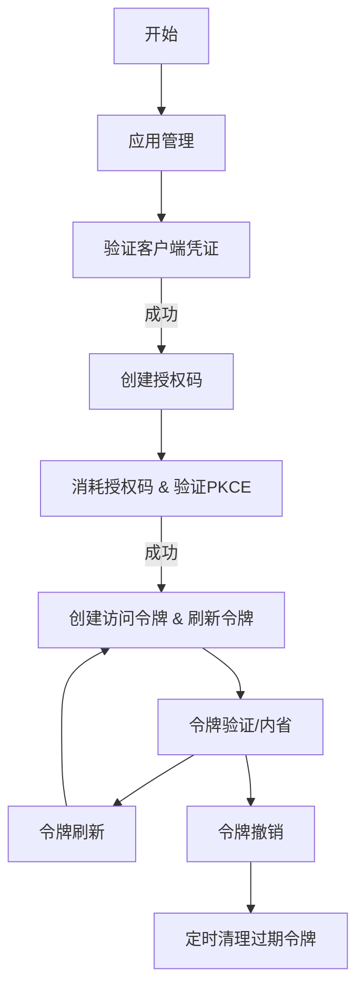

## 类结构

```
Exception (Base)
├── OAuthError
│   ├── InvalidClientError
│   ├── InvalidGrantError
│   └── InvalidTokenError
BaseModel (Pydantic)
├── OAuthApplicationInfo
│   └── OAuthApplicationInfoWithSecret
├── OAuthAuthorizationCodeInfo
├── APIAuthorizationInfo (External)
│   └── OAuthAccessTokenInfo
│       └── OAuthAccessToken
├── OAuthRefreshTokenInfo
│   └── OAuthRefreshToken
└── TokenIntrospectionResult
```

## 全局变量及字段


### `logger`
    
Module-level logger for tracking events and errors within the OAuth provider data layer.

类型：`logging.Logger`
    


### `keysmith`
    
Utility instance for generating and verifying keys, specifically used for hashing client secrets with Scrypt.

类型：`APIKeySmith`
    


### `AUTHORIZATION_CODE_TTL`
    
Time-to-live duration for authorization codes before they expire (set to 10 minutes).

类型：`timedelta`
    


### `ACCESS_TOKEN_TTL`
    
Time-to-live duration for access tokens before they expire (set to 1 hour).

类型：`timedelta`
    


### `REFRESH_TOKEN_TTL`
    
Time-to-live duration for refresh tokens before they expire (set to 30 days).

类型：`timedelta`
    


### `ACCESS_TOKEN_PREFIX`
    
String prefix prepended to generated access tokens for identification.

类型：`str`
    


### `REFRESH_TOKEN_PREFIX`
    
String prefix prepended to generated refresh tokens for identification.

类型：`str`
    


### `InvalidGrantError.reason`
    
Detailed message explaining why the grant (authorization code or refresh token) is invalid.

类型：`str`
    


### `InvalidTokenError.reason`
    
Detailed message explaining why the token (access or refresh) is invalid.

类型：`str`
    


### `OAuthApplicationInfo.id`
    
Unique identifier for the OAuth application.

类型：`str`
    


### `OAuthApplicationInfo.name`
    
Display name of the OAuth application.

类型：`str`
    


### `OAuthApplicationInfo.description`
    
Optional textual description of the application's purpose.

类型：`Optional[str]`
    


### `OAuthApplicationInfo.logo_url`
    
Optional URL pointing to the application's logo image.

类型：`Optional[str]`
    


### `OAuthApplicationInfo.client_id`
    
Public identifier used to identify the client application.

类型：`str`
    


### `OAuthApplicationInfo.redirect_uris`
    
List of allowed URIs where the user is redirected after authorization.

类型：`list[str]`
    


### `OAuthApplicationInfo.grant_types`
    
List of OAuth grant types (e.g., 'authorization_code') supported by the application.

类型：`list[str]`
    


### `OAuthApplicationInfo.scopes`
    
List of API permissions/scopes granted to the application.

类型：`list[APIPermission]`
    


### `OAuthApplicationInfo.owner_id`
    
Unique identifier of the user who owns this application.

类型：`str`
    


### `OAuthApplicationInfo.is_active`
    
Flag indicating whether the application is currently active and allowed to request tokens.

类型：`bool`
    


### `OAuthApplicationInfo.created_at`
    
Timestamp indicating when the application record was created.

类型：`datetime`
    


### `OAuthApplicationInfo.updated_at`
    
Timestamp indicating when the application record was last updated.

类型：`datetime`
    


### `OAuthApplicationInfoWithSecret.client_secret_hash`
    
Hashed value of the client secret, stored securely for verification.

类型：`str`
    


### `OAuthApplicationInfoWithSecret.client_secret_salt`
    
Salt value used during the hashing process of the client secret.

类型：`str`
    


### `OAuthAuthorizationCodeInfo.id`
    
Unique identifier for the authorization code record.

类型：`str`
    


### `OAuthAuthorizationCodeInfo.code`
    
The authorization code string presented to the client.

类型：`str`
    


### `OAuthAuthorizationCodeInfo.created_at`
    
Timestamp when the authorization code was created.

类型：`datetime`
    


### `OAuthAuthorizationCodeInfo.expires_at`
    
Timestamp when the authorization code is set to expire.

类型：`datetime`
    


### `OAuthAuthorizationCodeInfo.application_id`
    
ID of the OAuth application the code is associated with.

类型：`str`
    


### `OAuthAuthorizationCodeInfo.user_id`
    
ID of the user who authorized the application.

类型：`str`
    


### `OAuthAuthorizationCodeInfo.scopes`
    
List of permissions granted in this authorization session.

类型：`list[APIPermission]`
    


### `OAuthAuthorizationCodeInfo.redirect_uri`
    
The redirect URI used in the initial authorization request.

类型：`str`
    


### `OAuthAuthorizationCodeInfo.code_challenge`
    
PKCE code challenge derived from the code verifier.

类型：`Optional[str]`
    


### `OAuthAuthorizationCodeInfo.code_challenge_method`
    
Method used to transform the code verifier into the challenge (e.g., 'S256').

类型：`Optional[str]`
    


### `OAuthAuthorizationCodeInfo.used_at`
    
Timestamp when the code was exchanged for a token (null if unused).

类型：`Optional[datetime]`
    


### `OAuthAccessTokenInfo.id`
    
Unique identifier for the access token record.

类型：`str`
    


### `OAuthAccessTokenInfo.expires_at`
    
Timestamp when the access token expires.

类型：`datetime`
    


### `OAuthAccessTokenInfo.application_id`
    
ID of the OAuth application that issued the token.

类型：`str`
    


### `OAuthAccessTokenInfo.type`
    
Type of authorization, fixed to 'oauth'.

类型：`Literal["oauth"]`
    


### `OAuthAccessToken.token`
    
The plaintext access token string, wrapped to prevent accidental logging.

类型：`SecretStr`
    


### `OAuthRefreshTokenInfo.id`
    
Unique identifier for the refresh token record.

类型：`str`
    


### `OAuthRefreshTokenInfo.user_id`
    
ID of the user who owns the refresh token.

类型：`str`
    


### `OAuthRefreshTokenInfo.scopes`
    
List of permissions associated with the refresh token.

类型：`list[APIPermission]`
    


### `OAuthRefreshTokenInfo.created_at`
    
Timestamp when the refresh token was created.

类型：`datetime`
    


### `OAuthRefreshTokenInfo.expires_at`
    
Timestamp when the refresh token expires.

类型：`datetime`
    


### `OAuthRefreshTokenInfo.application_id`
    
ID of the OAuth application associated with the token.

类型：`str`
    


### `OAuthRefreshTokenInfo.revoked_at`
    
Timestamp when the refresh token was revoked (null if active).

类型：`Optional[datetime]`
    


### `OAuthRefreshToken.token`
    
The plaintext refresh token string, wrapped to prevent accidental logging.

类型：`SecretStr`
    


### `TokenIntrospectionResult.active`
    
Indicates whether the token is currently active and valid.

类型：`bool`
    


### `TokenIntrospectionResult.scopes`
    
List of scope strings associated with the token, if active.

类型：`Optional[list[str]]`
    


### `TokenIntrospectionResult.client_id`
    
Client ID associated with the token, if active.

类型：`Optional[str]`
    


### `TokenIntrospectionResult.user_id`
    
User ID associated with the token, if active.

类型：`Optional[str]`
    


### `TokenIntrospectionResult.exp`
    
Unix timestamp indicating when the token expires, if active.

类型：`Optional[int]`
    


### `TokenIntrospectionResult.token_type`
    
Type of token introspected (e.g., 'access_token').

类型：`Optional[Literal["access_token", "refresh_token"]]`
    
    

## 全局函数及方法


### `_generate_token`

生成一个用于 OAuth 令牌的加密安全随机字符串。

参数：无

返回值：`str`，返回一个 URL 安全的 Base64 编码随机字符串，由 32 字节随机数生成。

#### 流程图

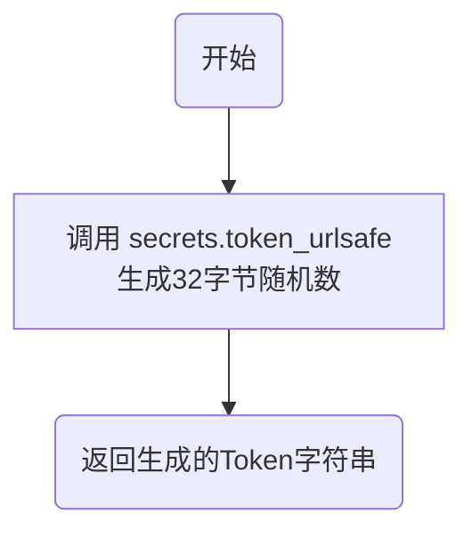

#### 带注释源码

```python
def _generate_token() -> str:
    """
    Generate a cryptographically secure random token.
    生成一个加密安全的随机令牌。
    """
    # secrets.token_urlsafe(nbytes) 返回一个包含 nbytes 随机字节的 URL 安全文本字符串。
    # 这里使用 32 字节，提供足够的安全性。
    return secrets.token_urlsafe(32)
```


### `_hash_token`

Hash a token using SHA256 (deterministic, for direct lookup).

参数：

- `token`：`str`，The plaintext token string that needs to be hashed.

返回值：`str`，The hexadecimal digest of the SHA256 hash of the input token.

#### 流程图

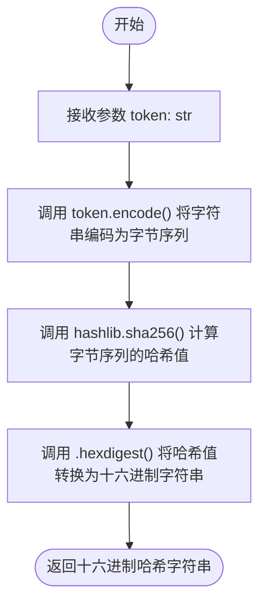

#### 带注释源码

```python
def _hash_token(token: str) -> str:
    """Hash a token using SHA256 (deterministic, for direct lookup)."""
    # 将输入的字符串 token 编码为字节序列
    # 使用 SHA256 算法对字节序列进行哈希计算
    # 将计算出的二进制哈希值转换为十六进制格式的字符串返回
    return hashlib.sha256(token.encode()).hexdigest()
```


### `validate_redirect_uri`

验证提供的重定向 URI 是否已在应用程序允许的列表中注册。这是 OAuth 2.0 安全流程中的关键步骤，用于防止开放重定向攻击。

参数：

-  `app`：`OAuthApplicationInfo`，包含已注册 redirect_uris 列表的 OAuth 应用程序信息对象。
-  `redirect_uri`：`str`，待验证的重定向 URI 字符串，通常来自客户端的请求。

返回值：`bool`，如果重定向 URI 存在于应用程序的注册列表中返回 `True`，否则返回 `False`。

#### 流程图

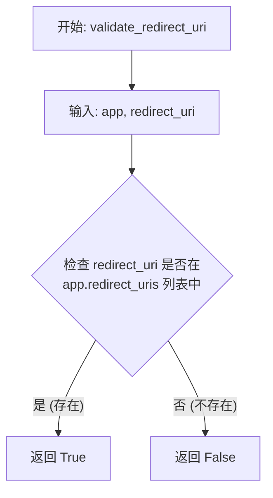

#### 带注释源码

```python
def validate_redirect_uri(app: OAuthApplicationInfo, redirect_uri: str) -> bool:
    """Validate that redirect URI is registered for the application"""
    # 直接使用 Python 的 'in' 操作符检查 redirect_uri 是否包含在应用对象的 redirect_uris 列表中
    # 这是一个 O(N) 的操作，N 为应用注册的重定向 URI 数量
    return redirect_uri in app.redirect_uris
```


### `validate_scopes`

验证所有请求的范围对于该应用程序都是允许的。

参数：

- `app`：`OAuthApplicationInfo`，包含应用程序允许范围等信息的对象
- `requested_scopes`：`list[APIPermission]`，请求的 API 权限范围列表

返回值：`bool`，如果所有请求的范围均被应用程序允许则返回 True，否则返回 False。

#### 流程图

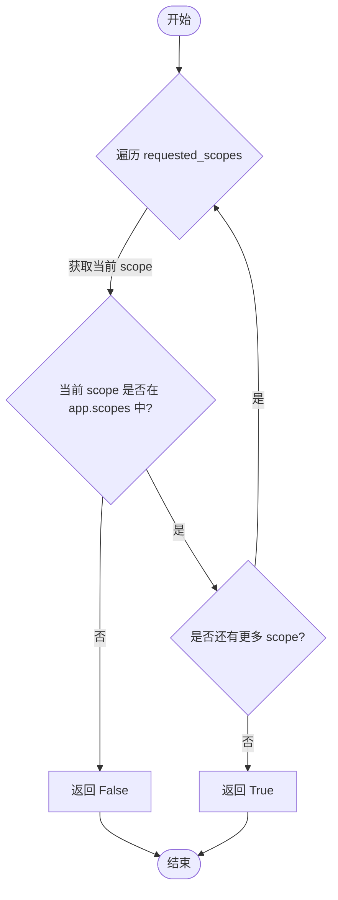

#### 带注释源码

```python
def validate_scopes(
    app: OAuthApplicationInfo, requested_scopes: list[APIPermission]
) -> bool:
    """Validate that all requested scopes are allowed for the application"""
    # 使用 all() 函数检查 requested_scopes 中的每一个 scope
    # 是否都存在于 app.scopes（应用程序允许的范围列表）中
    return all(scope in app.scopes for scope in requested_scopes)
```


### `get_oauth_application`

根据客户端 ID (client_id) 获取 OAuth 应用程序的基本信息，不包含敏感的客户端密钥。

参数：

-  `client_id`：`str`，OAuth 应用程序的唯一标识符

返回值：`Optional[OAuthApplicationInfo]`，如果找到应用则返回应用信息对象，否则返回 None。

#### 流程图

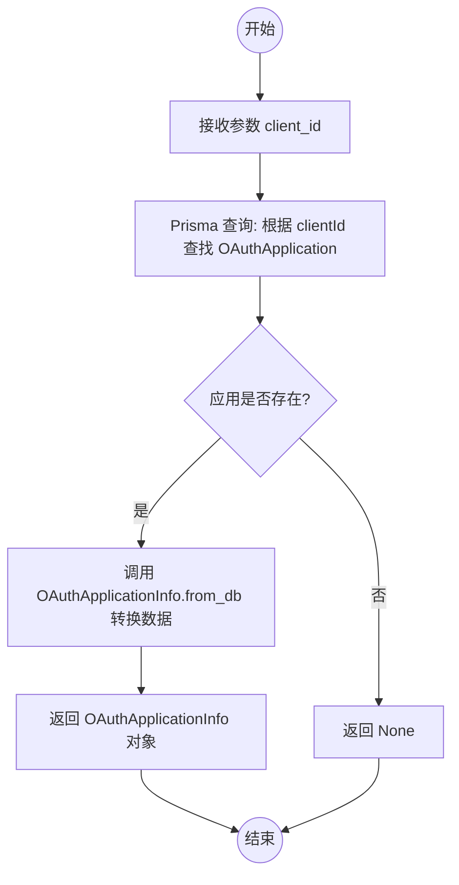

#### 带注释源码

```python
async def get_oauth_application(client_id: str) -> Optional[OAuthApplicationInfo]:
    """Get OAuth application by client ID (without secret)"""
    # 使用 Prisma ORM 通过 clientId 查找唯一的 OAuth 应用程序记录
    app = await PrismaOAuthApplication.prisma().find_unique(
        where={"clientId": client_id}
    )
    # 如果未找到对应的应用程序，返回 None
    if not app:
        return None
    # 将数据库中的原始模型转换为业务逻辑层的 OAuthApplicationInfo 对象
    # 该对象不包含 client_secret_hash 等敏感信息
    return OAuthApplicationInfo.from_db(app)
```


### `get_oauth_application_with_secret`

通过客户端ID获取OAuth应用程序，返回包含用于验证的密钥哈希和盐值的信息对象。

参数：

-  `client_id`：`str`，用于查询数据库的OAuth客户端ID。

返回值：`Optional[OAuthApplicationInfoWithSecret]`，如果找到应用程序，则返回包含客户端密钥哈希和盐值的`OAuthApplicationInfoWithSecret`对象；否则返回None。

#### 流程图

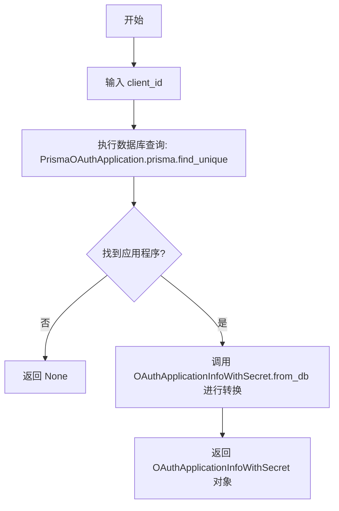

#### 带注释源码

```python
async def get_oauth_application_with_secret(
    client_id: str,
) -> Optional[OAuthApplicationInfoWithSecret]:
    """Get OAuth application by client ID (with secret hash for validation)"""
    # 1. 根据提供的 client_id 查询数据库，查找唯一的 OAuth 应用程序记录
    app = await PrismaOAuthApplication.prisma().find_unique(
        where={"clientId": client_id}
    )
    # 2. 检查是否查询到了应用程序记录
    if not app:
        return None
    # 3. 如果找到记录，将其从数据库模型转换为包含敏感信息（密钥哈希和盐值）的领域模型
    return OAuthApplicationInfoWithSecret.from_db(app)
```


### `validate_client_credentials`

验证客户端凭证（包括 client_id 和 client_secret），检查对应的应用是否存在、是否处于激活状态以及密钥是否正确。验证通过后返回应用信息，否则抛出 InvalidClientError。

参数：
- `client_id`：`str`，OAuth 客户端的唯一标识符
- `client_secret`：`str`，OAuth 客户端的密钥，用于验证身份

返回值：`OAuthApplicationInfo`，验证成功后的应用程序信息对象，不包含敏感的密钥哈希。

#### 流程图

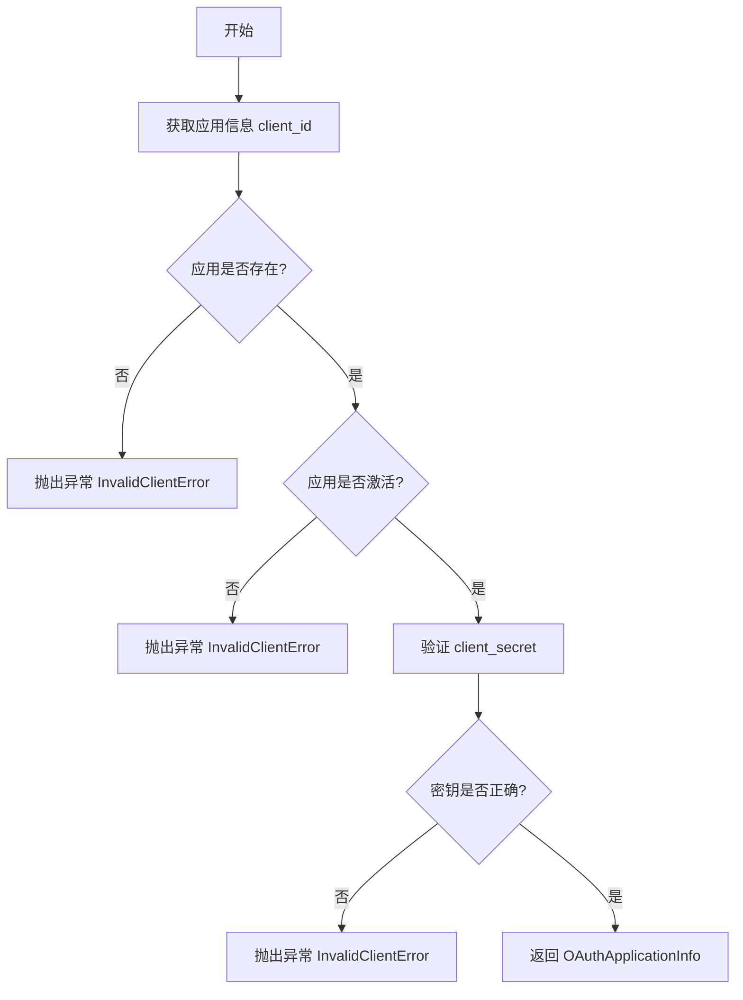

#### 带注释源码

```python
async def validate_client_credentials(
    client_id: str, client_secret: str
) -> OAuthApplicationInfo:
    """
    Validate client credentials and return application info.

    Raises:
        InvalidClientError: If client_id or client_secret is invalid, or app is inactive
    """
    # 根据提供的 client_id 从数据库获取包含密钥哈希的应用信息
    app = await get_oauth_application_with_secret(client_id)
    
    # 如果找不到应用，说明 client_id 无效
    if not app:
        raise InvalidClientError("Invalid client_id")

    # 检查应用是否处于激活状态
    if not app.is_active:
        raise InvalidClientError("Application is not active")

    # 使用存储的哈希和盐值验证提供的 client_secret 是否正确
    # Verify client secret
    if not app.verify_secret(client_secret):
        raise InvalidClientError("Invalid client_secret")

    # 验证通过，返回应用信息，并从结果中排除敏感的 client_secret_hash 字段
    # Return without secret hash
    return OAuthApplicationInfo(**app.model_dump(exclude={"client_secret_hash"}))
```


### `_generate_authorization_code`

生成一个符合 OAuth 2.0 标准的加密安全随机授权码，该码具有 256 位的熵值，用于防止猜测攻击。

参数：

无

返回值：`str`，生成的 URL 安全的 base64 编码随机字符串，用作授权码。

#### 流程图

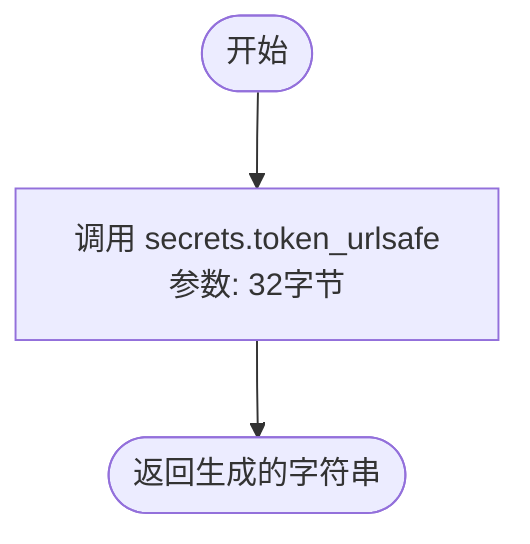

#### 带注释源码

```python
def _generate_authorization_code() -> str:
    """生成一个加密安全的授权码"""
    # 使用 secrets.token_urlsafe(32) 生成随机字符串
    # 32 字节对应 256 位的熵，确保了足够的随机性以防止暴力破解
    return secrets.token_urlsafe(32)
```


### `create_authorization_code`

创建一个新的 OAuth 2.0 授权码。该代码具有较短的有效期（10分钟），仅限使用一次，并可选地支持 PKCE (Proof Key for Code Exchange) 扩展以增强安全性。

参数：

-   `application_id`：`str`，OAuth 客户端应用的 ID，标识授权请求的发起方。
-   `user_id`：`str`，资源拥有者（用户）的 ID，标识被授权的用户。
-   `scopes`：`list[APIPermission]`，请求的权限范围列表，定义了访问令牌可以访问的资源。
-   `redirect_uri`：`str`，授权完成后重定向的 URI，必须与注册应用时提供的 URI 匹配。
-   `code_challenge`：`Optional[str]`，PKCE 代码挑战值，用于防止授权码拦截攻击。
-   `code_challenge_method`：`Optional[Literal["S256", "plain"]]`，用于生成 code_challenge 的方法（"S256" 或 "plain"）。

返回值：`OAuthAuthorizationCodeInfo`，包含创建的授权码详细信息（如 ID、过期时间、关联的应用 ID 和用户 ID 等）的对象。

#### 流程图

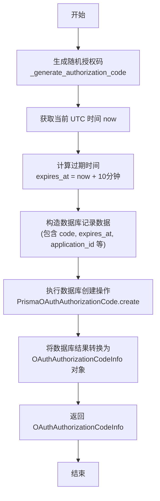

#### 带注释源码

```python
async def create_authorization_code(
    application_id: str,
    user_id: str,
    scopes: list[APIPermission],
    redirect_uri: str,
    code_challenge: Optional[str] = None,
    code_challenge_method: Optional[Literal["S256", "plain"]] = None,
) -> OAuthAuthorizationCodeInfo:
    """
    Create a new authorization code.
    Expires in 10 minutes and can only be used once.
    """
    # 生成加密安全的随机字符串作为授权码
    code = _generate_authorization_code()
    
    # 获取当前的 UTC 时间
    now = datetime.now(timezone.utc)
    
    # 设置授权码的过期时间为当前时间加上 10 分钟（AUTHORIZATION_CODE_TTL）
    expires_at = now + AUTHORIZATION_CODE_TTL

    # 在数据库中创建授权码记录
    saved_code = await PrismaOAuthAuthorizationCode.prisma().create(
        data={
            "id": str(uuid.uuid4()),             # 生成唯一记录 ID
            "code": code,                        # 存储明文授权码（用于后续交换时的查找）
            "expiresAt": expires_at,             # 存储过期时间
            "applicationId": application_id,     # 关联的应用 ID
            "userId": user_id,                   # 关联的用户 ID
            "scopes": [s for s in scopes],       # 存储请求的权限范围
            "redirectUri": redirect_uri,         # 存储重定向 URI
            "codeChallenge": code_challenge,     # 存储 PKCE Challenge
            "codeChallengeMethod": code_challenge_method, # 存储 PKCE 方法
        }
    )

    # 将数据库返回的 Prisma 模型转换为业务领域模型 OAuthAuthorizationCodeInfo 并返回
    return OAuthAuthorizationCodeInfo.from_db(saved_code)
```


### `consume_authorization_code`

消耗授权码（Authorization Code）并返回用户ID及权限范围。该过程将授权码标记为已使用，同时执行一系列验证：确保代码存在且属于指定应用、代码未过期、未被使用过、重定向URI匹配，以及在存在PKCE代码挑战时验证代码验证器（code_verifier）。

参数：

- `code`：`str`，待验证和消耗的授权码字符串。
- `application_id`：`str`，OAuth应用程序的ID，用于验证授权码的所有权归属。
- `redirect_uri`：`str`，交换授权码时使用的重定向URI，必须与创建授权码时注册的URI完全一致。
- `code_verifier`：`Optional[str]`，用于PKCE（Proof Key for Code Exchange）验证的代码验证器。如果在创建授权码时提供了code_challenge，则此参数必须提供。

返回值：`tuple[str, list[APIPermission]]`，包含两个元素的元组：第一个元素是授权码所属用户的ID（`str`），第二个元素是该授权码授予的权限范围列表（`list[APIPermission]`）。

#### 流程图

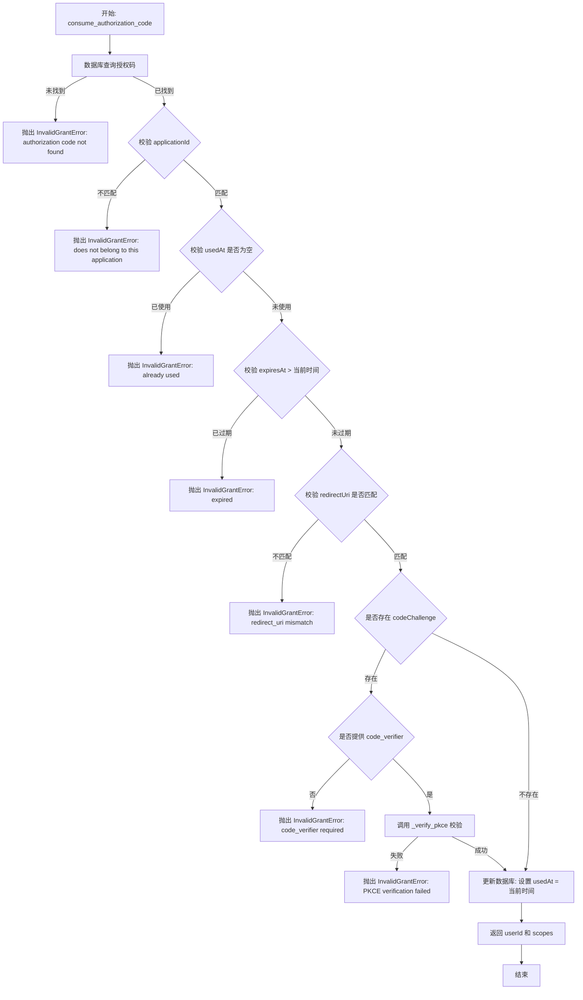

#### 带注释源码

```python
async def consume_authorization_code(
    code: str,
    application_id: str,
    redirect_uri: str,
    code_verifier: Optional[str] = None,
) -> tuple[str, list[APIPermission]]:
    """
    Consume an authorization code and return (user_id, scopes).

    This marks the code as used and validates:
    - Code exists and matches application
    - Code is not expired
    - Code has not been used
    - Redirect URI matches
    - PKCE code verifier matches (if code challenge was provided)

    Raises:
        InvalidGrantError: If code is invalid, expired, used, or PKCE fails
    """
    # 1. 根据授权码查询数据库记录
    auth_code = await PrismaOAuthAuthorizationCode.prisma().find_unique(
        where={"code": code}
    )

    # 2. 验证授权码是否存在
    if not auth_code:
        raise InvalidGrantError("authorization code not found")

    # 3. 验证授权码是否属于当前请求的应用
    if auth_code.applicationId != application_id:
        raise InvalidGrantError(
            "authorization code does not belong to this application"
        )

    # 4. 验证授权码是否已被使用（防止重放攻击）
    if auth_code.usedAt is not None:
        raise InvalidGrantError(
            f"authorization code already used at {auth_code.usedAt}"
        )

    # 5. 验证授权码是否已过期
    now = datetime.now(timezone.utc)
    if auth_code.expiresAt < now:
        raise InvalidGrantError("authorization code expired")

    # 6. 验证重定向URI是否一致
    if auth_code.redirectUri != redirect_uri:
        raise InvalidGrantError("redirect_uri mismatch")

    # 7. 如果存在PKCE Challenge，则进行验证
    if auth_code.codeChallenge:
        if not code_verifier:
            raise InvalidGrantError("code_verifier required but not provided")

        if not _verify_pkce(
            code_verifier, auth_code.codeChallenge, auth_code.codeChallengeMethod
        ):
            raise InvalidGrantError("PKCE verification failed")

    # 8. 所有校验通过，将授权码标记为已使用
    await PrismaOAuthAuthorizationCode.prisma().update(
        where={"code": code},
        data={"usedAt": now},
    )

    # 9. 返回用户ID和权限范围列表
    return auth_code.userId, [APIPermission(s) for s in auth_code.scopes]
```


### `_verify_pkce`

验证 PKCE (Proof Key for Code Exchange) 代码验证器与代码挑战是否匹配。该函数支持 "S256"（SHA-256 哈希）和 "plain"（明文比较）两种转换方法，并使用恒定时间比较算法以防止时序攻击。

参数：

- `code_verifier`：`str`，客户端生成的原始代码验证器。
- `code_challenge`：`str`，存储在授权码中的代码挑战（由验证器转换而来）。
- `code_challenge_method`：`Optional[str]`，用于转换验证器的方法（例如 "S256" 或 "plain"）。

返回值：`bool`，如果验证器与挑战匹配则返回 `True`，否则返回 `False`（包括不支持的转换方法）。

#### 流程图

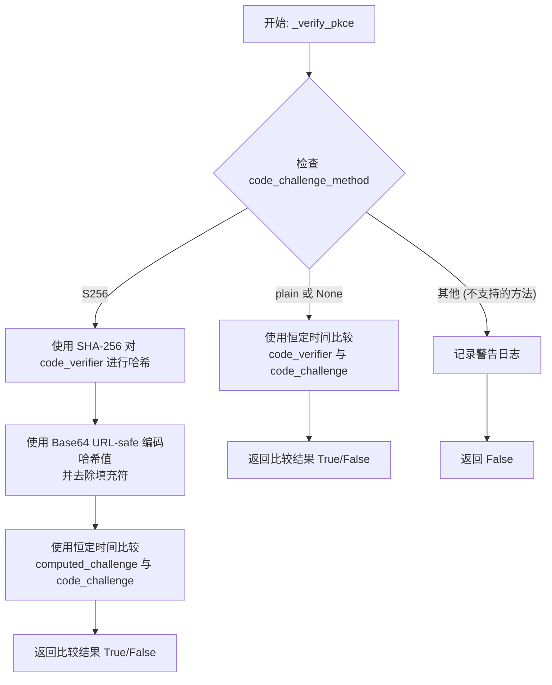

#### 带注释源码

```python
def _verify_pkce(
    code_verifier: str, code_challenge: str, code_challenge_method: Optional[str]
) -> bool:
    """
    Verify PKCE code verifier against code challenge.

    Supports:
    - S256: SHA256(code_verifier) == code_challenge
    - plain: code_verifier == code_challenge
    """
    # 处理 S256 方法 (SHA-256 哈希)
    if code_challenge_method == "S256":
        # Hash the verifier with SHA256 and base64url encode
        # 对验证器进行 SHA256 编码
        hashed = hashlib.sha256(code_verifier.encode("ascii")).digest()
        
        # 以下两行为了进行标准的 base64url 编码 (去除填充符 '=')
        import base64

        computed_challenge = (
            base64.urlsafe_b64encode(hashed).decode("ascii").rstrip("=")
        )
        # 使用恒定时间比较 防止时序攻击
        return secrets.compare_digest(computed_challenge, code_challenge)
    
    # 处理 plain 方法 (明文比较) 或 code_challenge_method 为 None 的情况
    elif code_challenge_method == "plain" or code_challenge_method is None:
        # Plain comparison
        # 直接进行恒定时间比较
        return secrets.compare_digest(code_verifier, code_challenge)
    
    # 处理未知或不支持的方法
    else:
        logger.warning(f"Unsupported code challenge method: {code_challenge_method}")
        return False
```


### `create_access_token`

创建一个新的 OAuth 2.0 访问令牌，生成包含前缀的随机字符串作为令牌，计算其 SHA256 哈希值存储于数据库，并返回包含明文令牌信息的对象。

参数：

- `application_id`：`str`，OAuth 应用程序的 ID
- `user_id`：`str`，令牌所属用户的 ID
- `scopes`：`list[APIPermission]`，授予该令牌的权限范围列表

返回值：`OAuthAccessToken`，包含令牌元数据及明文令牌字符串的对象

#### 流程图

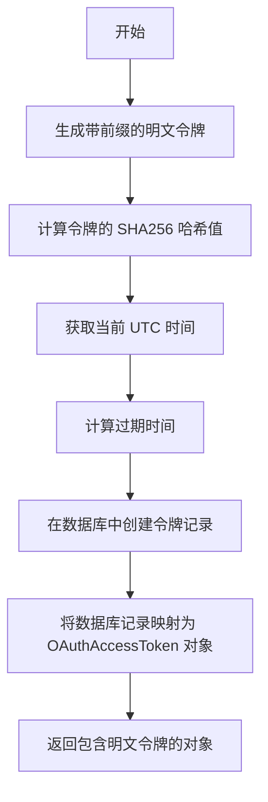

#### 带注释源码

```python
async def create_access_token(
    application_id: str, user_id: str, scopes: list[APIPermission]
) -> OAuthAccessToken:
    """
    Create a new access token.
    Returns OAuthAccessToken (with plaintext token).
    """
    # 1. 生成明文令牌：添加特定前缀以便于识别，并附加加密安全的随机字符串
    plaintext_token = ACCESS_TOKEN_PREFIX + _generate_token()
    
    # 2. 生成令牌哈希：使用 SHA256 对明文令牌进行确定性哈希，用于数据库存储和直接查找
    token_hash = _hash_token(plaintext_token)
    
    # 3. 设置时间戳：获取当前 UTC 时间作为创建时间
    now = datetime.now(timezone.utc)
    
    # 4. 计算过期时间：当前时间加上访问令牌的有效期（ACCESS_TOKEN_TTL，通常为 1 小时）
    expires_at = now + ACCESS_TOKEN_TTL

    # 5. 持久化存储：在 Prisma 数据库中创建新的令牌记录
    # 注意：数据库中仅存储哈希值而非明文，以保证安全性
    saved_token = await PrismaOAuthAccessToken.prisma().create(
        data={
            "id": str(uuid.uuid4()),        # 生成唯一记录 ID
            "token": token_hash,            # 存储令牌哈希
            "expiresAt": expires_at,        # 存储过期时间
            "applicationId": application_id, # 关联应用 ID
            "userId": user_id,               # 关联用户 ID
            "scopes": [s for s in scopes],  # 存储权限范围
        }
    )

    # 6. 构建返回对象：从数据库模型转换为领域模型，
    # 此时将步骤 1 生成的明文令牌注入返回对象，以便仅在此刻返回给调用者
    return OAuthAccessToken.from_db(saved_token, plaintext_token=plaintext_token)
```


### `validate_access_token`

验证访问令牌的有效性，并返回令牌及其关联的OAuth应用程序信息。

参数：

- `token`：`str`，待验证的明文访问令牌字符串。

返回值：`tuple[OAuthAccessTokenInfo, OAuthApplicationInfo]`，包含验证通过的访问令牌信息对象和关联的OAuth应用程序信息对象的元组。

#### 流程图

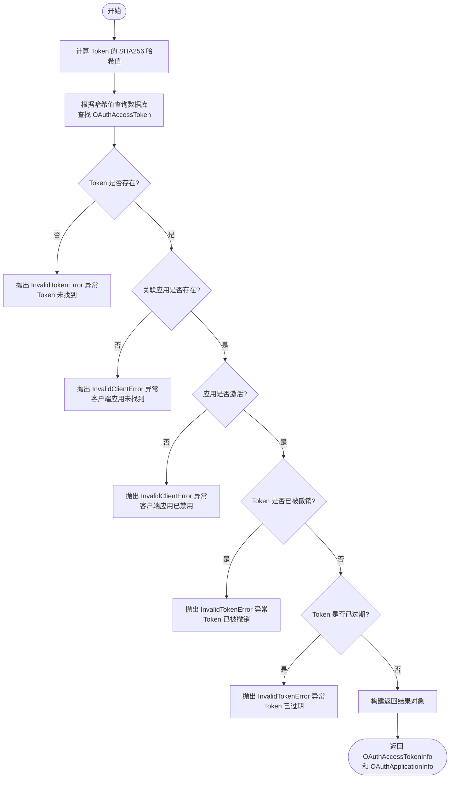

#### 带注释源码

```python
async def validate_access_token(
    token: str,
) -> tuple[OAuthAccessTokenInfo, OAuthApplicationInfo]:
    """
    Validate an access token and return token info.

    Raises:
        InvalidTokenError: If token is invalid, expired, or revoked
        InvalidClientError: If the client application is not marked as active
    """
    # 对明文 Token 进行哈希处理，以便在数据库中进行查找
    token_hash = _hash_token(token)

    # 使用哈希值直接查询数据库中的 Access Token，并包含关联的 Application 信息
    access_token = await PrismaOAuthAccessToken.prisma().find_unique(
        where={"token": token_hash}, include={"Application": True}
    )

    # 检查 Token 是否存在于数据库中
    if not access_token:
        raise InvalidTokenError("access token not found")

    # 检查 Token 关联的 Application 是否存在（理论上应该存在，属于防御性检查）
    if not access_token.Application:
        raise InvalidClientError("Client application not found")

    # 检查 Application 是否处于激活状态
    if not access_token.Application.isActive:
        raise InvalidClientError("Client application is disabled")

    # 检查 Token 是否已被撤销（revokedAt 字段不为空）
    if access_token.revokedAt is not None:
        raise InvalidTokenError("access token has been revoked")

    # 检查 Token 是否已过期
    now = datetime.now(timezone.utc)
    if access_token.expiresAt < now:
        raise InvalidTokenError("access token expired")

    # 所有校验通过，将数据库模型转换为业务对象并返回
    return (
        OAuthAccessTokenInfo.from_db(access_token),
        OAuthApplicationInfo.from_db(access_token.Application),
    )
```


### `revoke_access_token`

撤销访问令牌。该函数通过设置撤销时间戳来使令牌失效，仅允许撤销属于指定应用程序的令牌。为了防止时序侧信道攻击（Timing Side-channel Attacks），无论令牌是否存在或是否撤销成功，函数都会执行固定数量的数据库查询操作。

参数：

- `token`：`str`，待撤销的明文访问令牌。
- `application_id`：`str`，发起撤销请求的应用程序 ID，用于确保只能撤销属于该应用的令牌。

返回值：`OAuthAccessTokenInfo | None`，如果令牌被找到且成功撤销，则返回令牌信息对象；如果令牌不存在、不属于该应用或已被撤销，则返回 None。

#### 流程图

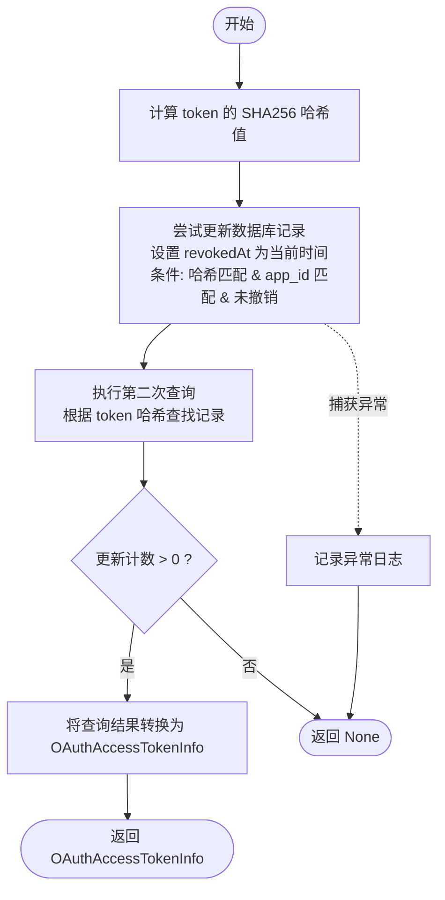

#### 带注释源码

```python
async def revoke_access_token(
    token: str, application_id: str
) -> OAuthAccessTokenInfo | None:
    """
    Revoke an access token.

    Args:
        token: The plaintext access token to revoke
        application_id: The application ID making the revocation request.
            Only tokens belonging to this application will be revoked.

    Returns:
        OAuthAccessTokenInfo if token was found and revoked, None otherwise.

    Note:
        Always performs exactly 2 DB queries regardless of outcome to prevent
        timing side-channel attacks that could reveal token existence.
    """
    try:
        # 计算令牌的哈希值，用于数据库查找
        token_hash = _hash_token(token)

        # 使用 update_many 进行原子性更新
        # 仅当 token_hash 匹配、application_id 匹配且 revokedAt 为空时才更新
        # 这确保了只有属于该应用的有效令牌会被撤销
        updated_count = await PrismaOAuthAccessToken.prisma().update_many(
            where={
                "token": token_hash,
                "applicationId": application_id,
                "revokedAt": None,
            },
            data={"revokedAt": datetime.now(timezone.utc)},
        )

        # 无论上面的更新是否成功，都执行第二次查询
        # 这是为了防止通过响应时间的差异来判断 token 是否存在（时序攻击）
        result = await PrismaOAuthAccessToken.prisma().find_unique(
            where={"token": token_hash}
        )

        # 如果更新计数为0，说明没有匹配到符合条件的记录（可能已撤销、不存在或不属于该app）
        if updated_count == 0:
            return None

        # 如果更新成功，返回查询到的结果信息
        return OAuthAccessTokenInfo.from_db(result) if result else None
    except Exception as e:
        # 捕获并记录任何异常，避免泄露内部错误
        logger.exception(f"Error revoking access token: {e}")
        return None
```


### `create_refresh_token`

创建一个新的 OAuth 刷新令牌，生成随机字符串，计算 SHA256 哈希，设置过期时间（默认30天），将哈希后的值存入数据库，并返回包含明文令牌的对象。

参数：

- `application_id`：`str`，OAuth 应用程序的唯一标识符，用于关联令牌归属的应用。
- `user_id`：`str`，用户的唯一标识符，用于关联令牌归属的用户。
- `scopes`：`list[APIPermission]`，授予该刷新令牌的权限范围列表。

返回值：`OAuthRefreshToken`，包含刷新令牌信息的对象，其中包括用于立即返回给客户端的明文令牌。

#### 流程图

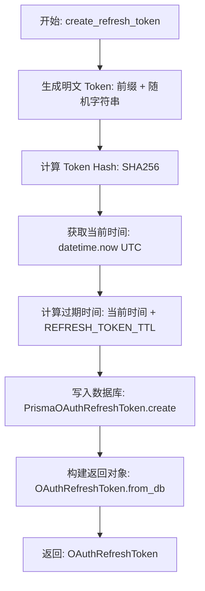

#### 带注释源码

```python
async def create_refresh_token(
    application_id: str, user_id: str, scopes: list[APIPermission]
) -> OAuthRefreshToken:
    """
    Create a new refresh token.
    Returns OAuthRefreshToken (with plaintext token).
    """
    # 生成明文刷新令牌，添加特定前缀以便于识别和分类
    plaintext_token = REFRESH_TOKEN_PREFIX + _generate_token()
    
    # 计算令牌的 SHA256 哈希值，用于数据库存储和安全校验
    token_hash = _hash_token(plaintext_token)
    
    # 获取当前的 UTC 时间
    now = datetime.now(timezone.utc)
    
    # 根据当前时间和预定义的 TTL（Time To Live）计算令牌过期时间
    expires_at = now + REFRESH_TOKEN_TTL

    # 调用 Prisma ORM 在数据库中创建新的刷新令牌记录
    saved_token = await PrismaOAuthRefreshToken.prisma().create(
        data={
            "id": str(uuid.uuid4()),          # 生成数据库主键 ID
            "token": token_hash,              # 存储哈希后的令牌而非明文
            "expiresAt": expires_at,          # 设置令牌过期时间点
            "applicationId": application_id,  # 关联的 OAuth 应用 ID
            "userId": user_id,                # 关联的用户 ID
            "scopes": [s for s in scopes],   # 存储授权的权限范围列表
        }
    )

    # 将数据库记录转换回业务对象，并附上明文令牌（因为这是创建令牌时唯一一次返回明文的机会）
    return OAuthRefreshToken.from_db(saved_token, plaintext_token=plaintext_token)
```


### `refresh_tokens`

使用刷新令牌来生成新的访问令牌和刷新令牌。

参数：

- `refresh_token`：`str`，传入的明文刷新令牌字符串。
- `application_id`：`str`，请求刷新令牌的应用程序 ID。

返回值：`tuple[OAuthAccessToken, OAuthRefreshToken]`，包含新的访问令牌和新的刷新令牌（均包含明文）的元组。

#### 流程图

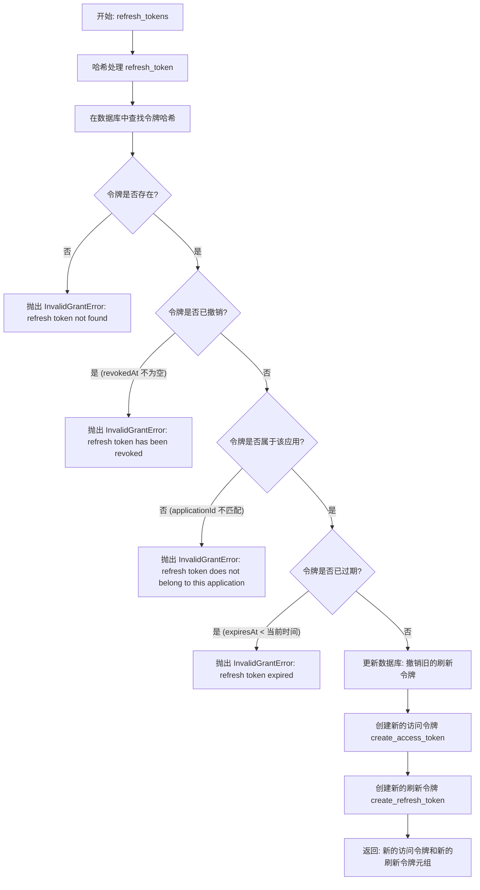

#### 带注释源码

```python
async def refresh_tokens(
    refresh_token: str, application_id: str
) -> tuple[OAuthAccessToken, OAuthRefreshToken]:
    """
    Use a refresh token to create new access and refresh tokens.
    Returns (new_access_token, new_refresh_token) both with plaintext tokens included.

    Raises:
        InvalidGrantError: If refresh token is invalid, expired, or revoked
    """
    # 对传入的刷新令牌进行哈希处理，以便在数据库中查找
    token_hash = _hash_token(refresh_token)

    # Direct lookup by hash
    # 在数据库中查找哈希匹配的刷新令牌
    rt = await PrismaOAuthRefreshToken.prisma().find_unique(where={"token": token_hash})

    # 验证：令牌是否存在
    if not rt:
        raise InvalidGrantError("refresh token not found")

    # NOTE: no need to check Application.isActive, this is checked by the token endpoint
    # 注意：此处无需检查应用是否激活，因为 Token Endpoint 会进行检查

    # 验证：令牌是否已被撤销
    if rt.revokedAt is not None:
        raise InvalidGrantError("refresh token has been revoked")

    # Validate application
    # 验证：令牌是否属于请求的应用程序
    if rt.applicationId != application_id:
        raise InvalidGrantError("refresh token does not belong to this application")

    # Check expiration
    # 验证：令牌是否已过期
    now = datetime.now(timezone.utc)
    if rt.expiresAt < now:
        raise InvalidGrantError("refresh token expired")

    # Revoke old refresh token
    # 操作：将旧的刷新令牌标记为已撤销（单次使用原则）
    await PrismaOAuthRefreshToken.prisma().update(
        where={"token": token_hash},
        data={"revokedAt": now},
    )

    # Create new access and refresh tokens with same scopes
    # 操作：使用旧令牌的作用域创建新的访问令牌和新的刷新令牌
    scopes = [APIPermission(s) for s in rt.scopes]
    new_access_token = await create_access_token(
        rt.applicationId,
        rt.userId,
        scopes,
    )
    new_refresh_token = await create_refresh_token(
        rt.applicationId,
        rt.userId,
        scopes,
    )

    return new_access_token, new_refresh_token
```


### `revoke_refresh_token`

撤销指定的刷新令牌。

参数：

- `token`：`str`，要撤销的明文刷新令牌。
- `application_id`：`str`，发起撤销请求的应用程序 ID。仅撤销属于该应用程序的令牌。

返回值：`OAuthRefreshTokenInfo | None`，如果找到令牌并成功撤销，则返回 OAuthRefreshTokenInfo；否则返回 None。

#### 流程图

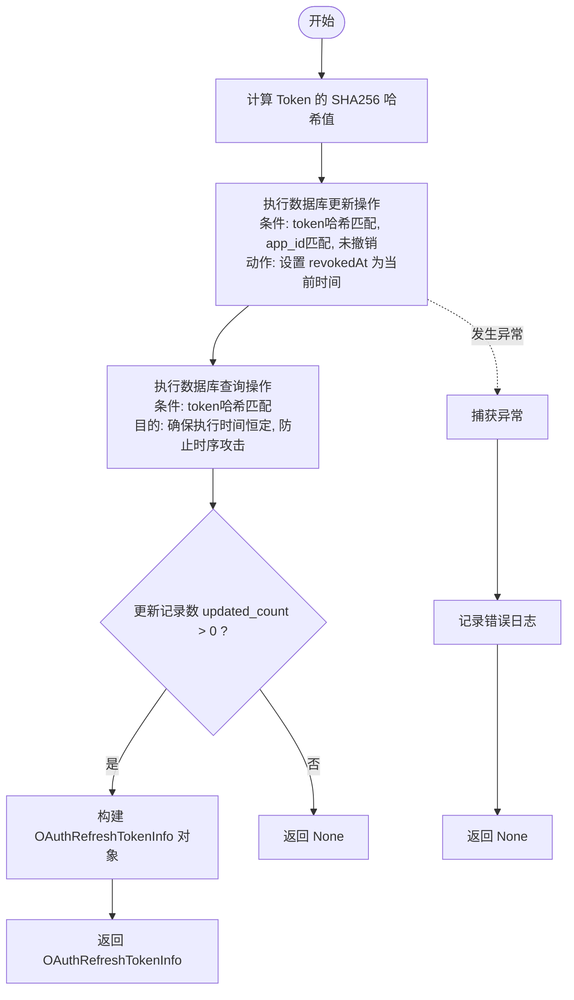

#### 带注释源码

```python
async def revoke_refresh_token(
    token: str, application_id: str
) -> OAuthRefreshTokenInfo | None:
    """
    Revoke a refresh token.

    Args:
        token: The plaintext refresh token to revoke
        application_id: The application ID making the revocation request.
            Only tokens belonging to this application will be revoked.

    Returns:
        OAuthRefreshTokenInfo if token was found and revoked, None otherwise.

    Note:
        Always performs exactly 2 DB queries regardless of outcome to prevent
        timing side-channel attacks that could reveal token existence.
    """
    try:
        # 1. 对明文令牌进行哈希处理，用于数据库查找
        token_hash = _hash_token(token)

        # 2. 尝试更新数据库记录
        # 使用 update_many 确保只有属于该应用且未被撤销的令牌被更新
        # 过滤条件包括：token哈希, 应用ID, 未被撤销
        updated_count = await PrismaOAuthRefreshToken.prisma().update_many(
            where={
                "token": token_hash,
                "applicationId": application_id,
                "revokedAt": None,
            },
            data={"revokedAt": datetime.now(timezone.utc)},
        )

        # 3. 执行第二次数据库查询
        # 无论更新是否成功都执行此查询，以确保执行时间的恒定性
        # 防止攻击者通过响应时间推断令牌是否存在（时序攻击）
        result = await PrismaOAuthRefreshToken.prisma().find_unique(
            where={"token": token_hash}
        )

        # 4. 根据更新计数判断是否实际撤销了令牌
        if updated_count == 0:
            return None

        return OAuthRefreshTokenInfo.from_db(result) if result else None
    except Exception as e:
        # 5. 异常处理：记录错误并返回 None
        logger.exception(f"Error revoking refresh token: {e}")
        return None
```


### `introspect_token`

内省一个令牌并根据 RFC 7662 返回其元数据。如果令牌有效，返回包含 active=True 及元数据的结果；如果令牌无效、过期或已撤销，则返回 active=False。

参数：

- `token`：`str`，需要内省的令牌字符串。
- `token_type_hint`：`Optional[Literal["access_token", "refresh_token"]]`，关于令牌类型的提示（可选），用于优化查找顺序。

返回值：`TokenIntrospectionResult`，包含内省结果的对象。如果 `active` 为 True，则包含 scopes, client_id, user_id, exp 等元数据；否则仅包含 active=False。

#### 流程图

```mermaid
flowchart TD
    Start([Start]) --> CheckHint{Is token_type_hint<br/>refresh_token?}
    CheckHint -- Yes --> TryRefresh
    CheckHint -- No --> TryAccess

    TryAccess[Attempt to validate<br/>as Access Token] --> AccessSuccess{Valid?}
    AccessSuccess -- Yes --> ReturnAccess[Return Active Result<br/>(Access Token)]
    AccessSuccess -- No (Exception) --> TryRefresh

    TryRefresh[Hash token &<br/>Lookup Refresh Token] --> RefreshFound{Found &<br/>Not Revoked?}
    RefreshFound -- Yes --> CheckExpiry{Expired?}
    CheckExpiry -- No --> FetchApp[Fetch Application Details]
    FetchApp --> ReturnRefresh[Return Active Result<br/>(Refresh Token)]
    CheckExpiry -- Yes --> ReturnInactive
    RefreshFound -- No --> ReturnInactive

    ReturnAccess --> End([End])
    ReturnRefresh --> End
    ReturnInactive[Return Inactive Result] --> End
```

#### 带注释源码

```python
async def introspect_token(
    token: str,
    token_type_hint: Optional[Literal["access_token", "refresh_token"]] = None,
) -> TokenIntrospectionResult:
    """
    Introspect a token and return its metadata (RFC 7662).

    Returns TokenIntrospectionResult with active=True and metadata if valid,
    or active=False if the token is invalid/expired/revoked.
    """
    # Try as access token first (or if hint says "access_token")
    # 如果提示不是 refresh_token，则优先尝试作为访问令牌验证
    if token_type_hint != "refresh_token":
        try:
            # 调用验证函数检查访问令牌有效性
            token_info, app = await validate_access_token(token)
            return TokenIntrospectionResult(
                active=True,
                scopes=list(s.value for s in token_info.scopes),
                client_id=app.client_id if app else None,
                user_id=token_info.user_id,
                exp=int(token_info.expires_at.timestamp()),
                token_type="access_token",
            )
        except InvalidTokenError:
            pass  # Try as refresh token (验证失败，继续尝试作为刷新令牌)

    # Try as refresh token
    # 尝试作为刷新令牌处理
    token_hash = _hash_token(token)
    refresh_token = await PrismaOAuthRefreshToken.prisma().find_unique(
        where={"token": token_hash}
    )

    # 检查刷新令牌是否存在且未被撤销
    if refresh_token and refresh_token.revokedAt is None:
        # Check if valid (not expired)
        # 检查是否过期
        now = datetime.now(timezone.utc)
        if refresh_token.expiresAt > now:
            app = await get_oauth_application_by_id(refresh_token.applicationId)
            return TokenIntrospectionResult(
                active=True,
                scopes=list(s for s in refresh_token.scopes),
                client_id=app.client_id if app else None,
                user_id=refresh_token.userId,
                exp=int(refresh_token.expiresAt.timestamp()),
                token_type="refresh_token",
            )

    # Token not found or inactive
    # 如果所有尝试均失败，返回不活跃状态
    return TokenIntrospectionResult(active=False)
```


### `get_oauth_application_by_id`

根据提供的应用 ID（`app_id`）从数据库中检索 OAuth 应用程序信息，并将其转换为业务模型对象返回。

参数：

- `app_id`: `str`，OAuth 应用程序的唯一标识符。

返回值：`Optional[OAuthApplicationInfo]`，如果找到应用程序则返回 `OAuthApplicationInfo` 对象，否则返回 `None`。

#### 流程图

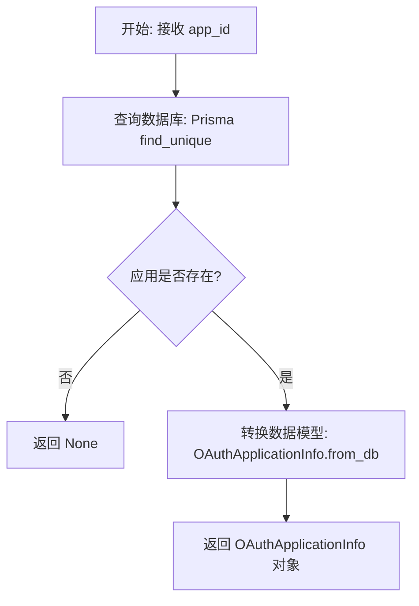

#### 带注释源码

```python
async def get_oauth_application_by_id(app_id: str) -> Optional[OAuthApplicationInfo]:
    """Get OAuth application by ID"""
    # 使用 Prisma ORM 根据唯一 ID 查询数据库中的 OAuth 应用程序记录
    app = await PrismaOAuthApplication.prisma().find_unique(where={"id": app_id})
    
    # 如果未查询到应用记录，则返回 None
    if not app:
        return None
    
    # 如果查询成功，将数据库中的原始记录转换为业务层的 OAuthApplicationInfo 对象并返回
    return OAuthApplicationInfo.from_db(app)
```


### `list_user_oauth_applications`

获取指定用户拥有的所有 OAuth 应用程序信息，并按创建时间倒序排列。

参数：

- `user_id`：`str`，应用程序所有者的唯一标识符。

返回值：`list[OAuthApplicationInfo]`，包含用户拥有的 OAuth 应用程序信息的列表。

#### 流程图

```mermaid
flowchart TD
    A[开始] --> B[输入 user_id]
    B --> C[调用 PrismaOAuthApplication.find_many]
    C --> D[执行查询: WHERE ownerId = user_id ORDER BY createdAt DESC]
    D --> E{获取查询结果 apps}
    E --> F[遍历 apps 列表]
    F --> G[调用 OAuthApplicationInfo.from_db 转换模型]
    G --> H[组装成新列表]
    H --> I[返回列表]
    I --> J[结束]
```

#### 带注释源码

```python
async def list_user_oauth_applications(user_id: str) -> list[OAuthApplicationInfo]:
    """Get all OAuth applications owned by a user"""
    # 使用 Prisma 客户端查询数据库
    # where 条件：ownerId 必须等于传入的 user_id
    # order 条件：按 createdAt 字段降序排列（最新的在前）
    apps = await PrismaOAuthApplication.prisma().find_many(
        where={"ownerId": user_id},
        order={"createdAt": "desc"},
    )
    
    # 将数据库模型 (PrismaOAuthApplication) 转换为业务模型 (OAuthApplicationInfo)
    # 并返回转换后的列表
    return [OAuthApplicationInfo.from_db(app) for app in apps]
```


### `update_oauth_application`

Update OAuth application settings (such as active status and logo URL). Only the owner can update their app's status.

参数：

-   `app_id`：`str`，The ID of the OAuth application to update.
-   `owner_id`：`str`，The ID of the user attempting to update the application (must match the owner).
-   `is_active`：`Optional[bool]`，The new active status for the application (optional).
-   `logo_url`：`Optional[str]`，The new logo URL for the application (optional).

返回值：`Optional[OAuthApplicationInfo]`，Returns the updated application information if found and owned by the user, otherwise None.

#### 流程图

```mermaid
flowchart TD
    A([开始]) --> B[根据 app_id 和 owner_id 查询应用]
    B --> C{应用是否存在?}
    C -- 否 --> D[返回 None]
    C -- 是 --> E[初始化更新数据 patch]
    E --> F{is_active 是否存在?}
    F -- 是 --> G[添加 isActive 到 patch]
    F -- 否 --> H{logo_url 是否存在?}
    G --> H
    H -- 是 --> I[添加 logoUrl 到 patch]
    H -- 否 --> J{patch 是否为空?}
    I --> J
    J -- 是 --> K[返回未修改的应用信息]
    J -- 否 --> L[执行数据库更新操作]
    L --> M[将结果转换为 OAuthApplicationInfo]
    M --> N([返回更新后的应用信息])
```

#### 带注释源码

```python
async def update_oauth_application(
    app_id: str,
    *,
    owner_id: str,
    is_active: Optional[bool] = None,
    logo_url: Optional[str] = None,
) -> Optional[OAuthApplicationInfo]:
    """
    Update OAuth application active status.
    Only the owner can update their app's status.

    Returns the updated app info, or None if app not found or not owned by user.
    """
    # 首先验证所有权：确保 app_id 和 owner_id 匹配
    app = await PrismaOAuthApplication.prisma().find_first(
        where={"id": app_id, "ownerId": owner_id}
    )
    if not app:
        return None

    # 准备更新数据字典
    patch: OAuthApplicationUpdateInput = {}
    # 如果提供了 is_active，则添加到更新数据中
    if is_active is not None:
        patch["isActive"] = is_active
    # 如果提供了 logo_url，则添加到更新数据中
    if logo_url:
        patch["logoUrl"] = logo_url
        
    # 如果没有任何更新项，直接返回未修改的应用信息
    if not patch:
        return OAuthApplicationInfo.from_db(app)

    # 执行数据库更新操作
    updated_app = await PrismaOAuthApplication.prisma().update(
        where={"id": app_id},
        data=patch,
    )
    # 返回更新后的应用信息对象，如果更新失败则返回 None
    return OAuthApplicationInfo.from_db(updated_app) if updated_app else None
```


### `cleanup_expired_oauth_tokens`

该函数用于从数据库中清理过期的OAuth令牌，包括过期的授权码（10分钟TTL）、访问令牌（1小时TTL）和刷新令牌（30天TTL），并返回各类令牌的删除数量统计。

参数：

*   无

返回值：`dict[str, int]`，包含删除的各类令牌数量的字典，键为令牌类型（`authorization_codes`, `access_tokens`, `refresh_tokens`），值为删除的数量。

#### 流程图

```mermaid
flowchart TD
    A[开始] --> B[获取当前UTC时间]
    B --> C[删除过期的 OAuthAuthorizationCode]
    C --> D[存储授权码删除计数]
    D --> E[删除过期的 OAuthAccessToken]
    E --> F[存储访问令牌删除计数]
    F --> G[删除过期的 OAuthRefreshToken]
    G --> H[存储刷新令牌删除计数]
    H --> I[计算总删除数量]
    I --> J{总删除数量 > 0 ?}
    J -- 是 --> K[记录清理日志]
    J -- 否 --> L[返回删除统计字典]
    K --> L
    L --> M[结束]
```

#### 带注释源码

```python
async def cleanup_expired_oauth_tokens() -> dict[str, int]:
    """
    Delete expired OAuth tokens from the database.

    This removes:
    - Expired authorization codes (10 min TTL)
    - Expired access tokens (1 hour TTL)
    - Expired refresh tokens (30 day TTL)

    Returns a dict with counts of deleted tokens by type.
    """
    # 获取当前UTC时间，作为判断过期的基准时间点
    now = datetime.now(timezone.utc)

    # 删除过期的授权码：查询并删除所有过期时间早于当前时间的记录
    codes_result = await PrismaOAuthAuthorizationCode.prisma().delete_many(
        where={"expiresAt": {"lt": now}}
    )

    # 删除过期的访问令牌：查询并删除所有过期时间早于当前时间的记录
    access_result = await PrismaOAuthAccessToken.prisma().delete_many(
        where={"expiresAt": {"lt": now}}
    )

    # 删除过期的刷新令牌：查询并删除所有过期时间早于当前时间的记录
    refresh_result = await PrismaOAuthRefreshToken.prisma().delete_many(
        where={"expiresAt": {"lt": now}}
    )

    # 整理删除结果，将各类令牌的删除数量存入字典
    deleted = {
        "authorization_codes": codes_result,
        "access_tokens": access_result,
        "refresh_tokens": refresh_result,
    }

    # 计算总删除数，如果有数据被删除，则输出日志记录
    total = sum(deleted.values())
    if total > 0:
        logger.info(f"Cleaned up {total} expired OAuth tokens: {deleted}")

    # 返回包含详细删除数量的字典
    return deleted
```


### `InvalidGrantError.__init__`

初始化 `InvalidGrantError` 异常类的实例。该异常用于表示无效或过期的授权码/刷新令牌。构造函数接收一个描述具体原因的字符串，并将其存储及格式化后传递给父类异常。

参数：

-  `reason`：`str`，描述授权无效或过期原因的具体错误信息。

返回值：`None`，无返回值。

#### 流程图

```mermaid
graph TD
    A[开始: __init__] --> B[接收参数 reason]
    B --> C[赋值实例属性: self.reason = reason]
    C --> D[调用父类构造: super().__init__]
    D --> E[结束]
```

#### 带注释源码

```python
    def __init__(self, reason: str):
        # 将传入的原因参数赋值给实例变量 self.reason，以便后续逻辑可能访问具体原因
        self.reason = reason
        # 调用父类 OAuthError 的构造函数，格式化生成完整的错误消息
        super().__init__(f"Invalid grant: {reason}")
```


### `InvalidTokenError.__init__`

`InvalidTokenError` 异常类的构造函数，用于初始化表示无效、过期或已撤销令牌的异常实例。它接收一个原因字符串，将其存储在实例属性中，并调用父类构造函数生成格式化的错误消息。

参数：

-  `reason`：`str`，描述令牌无效的具体原因（例如："access token not found"、"access token expired"）。

返回值：`None`，该方法为构造函数，不返回任何值。

#### 流程图

```mermaid
graph TD
    A[开始] --> B[接收参数 reason]
    B --> C[将 reason 赋值给实例变量 self.reason]
    C --> D[调用父类初始化 super().__init__]
    D --> E[传入格式化后的错误信息: f'Invalid token: {reason}']
    E --> F[结束]
```

#### 带注释源码

```python
def __init__(self, reason: str):
    # 将传入的原因参数保存到实例变量 self.reason 中，以便后续调用方访问
    self.reason = reason
    # 调用父类 OAuthError 的构造函数，并传入格式化后的错误消息
    super().__init__(f"Invalid token: {reason}")
```


### `OAuthApplicationInfo.from_db`

将数据库中的 Prisma OAuth 应用程序模型对象转换为应用层的 `OAuthApplicationInfo` 数据模型，处理字段命名风格的转换（如驼峰转下划线）以及作用域枚举类型的转换。

参数：

-  `app`：`PrismaOAuthApplication`，来自数据库的原始 OAuth 应用程序记录对象，包含原始字段数据。

返回值：`OAuthApplicationInfo`，经过转换和映射后的应用程序信息对象，用于业务逻辑处理。

#### 流程图

```mermaid
flowchart TD
    Start([开始]) --> Input[输入: PrismaOAuthApplication app]
    Input --> MapFields[映射基础字段<br/>id, name, description]
    MapFields --> MapUrl[映射 URL 字段<br/>logoUrl -> logo_url]
    MapUrl --> MapOAuthFields[映射 OAuth 核心字段<br/>clientId -> client_id<br/>redirectUris -> redirect_uris]
    MapOAuthFields --> MapMetaFields[映射元数据字段<br/>grantTypes, owner_id, isActive]
    MapMetaFields --> MapTimeFields[映射时间戳字段<br/>createdAt -> created_at<br/>updatedAt -> updated_at]
    MapTimeFields --> ConvertScopes[转换作用域类型<br/>List[str] -> List[APIPermission]]
    ConvertScopes --> Construct[构造 OAuthApplicationInfo 实例]
    Construct --> Output([输出: OAuthApplicationInfo])
```

#### 带注释源码

```python
    @staticmethod
    def from_db(app: PrismaOAuthApplication):
        return OAuthApplicationInfo(
            # 基础 ID 和名称信息
            id=app.id,
            name=app.name,
            description=app.description,
            # Logo URL 映射: logoUrl -> logo_url
            logo_url=app.logoUrl,
            # OAuth 核心标识映射: clientId -> client_id
            client_id=app.clientId,
            # 重定向 URI 列表映射: redirectUris -> redirect_uris
            redirect_uris=app.redirectUris,
            # 授权类型列表映射: grantTypes -> grant_types
            grant_types=app.grantTypes,
            # 将作用域字符串列表转换为 APIPermission 枚举列表
            scopes=[APIPermission(s) for s in app.scopes],
            # 所有者 ID 映射: ownerId -> owner_id
            owner_id=app.ownerId,
            # 激活状态映射: isActive -> is_active
            is_active=app.isActive,
            # 时间戳映射: createdAt -> created_at
            created_at=app.createdAt,
            # 时间戳映射: updatedAt -> updated_at
            updated_at=app.updatedAt,
        )
```


### `OAuthApplicationInfoWithSecret.from_db`

该静态方法用于将数据库模型（PrismaOAuthApplication）转换为包含客户端密钥哈希和盐值的领域模型对象（OAuthApplicationInfoWithSecret）。它继承并扩展了父类的转换逻辑，增加了敏感字段的映射。

参数：

- `app`：`PrismaOAuthApplication`，数据库中查询到的原始 OAuth 应用程序对象，包含基础信息及敏感的客户端密钥数据。

返回值：`OAuthApplicationInfoWithSecret`，包含完整应用信息及客户端密钥哈希、盐值的领域模型对象。

#### 流程图

```mermaid
flowchart TD
    A[开始: 接收 PrismaOAuthApplication 对象] --> B[调用父类方法 OAuthApplicationInfo.from_db]
    B --> C[将父类实例转换为字典 model_dump]
    C --> D[从 app 对象提取 clientSecret 和 clientSecretSalt]
    D --> E[合并字典数据与密钥字段]
    E --> F[实例化 OAuthApplicationInfoWithSecret 对象]
    F --> G[结束: 返回 OAuthApplicationInfoWithSecret 实例]
```

#### 带注释源码

```python
    @staticmethod
    def from_db(app: PrismaOAuthApplication):
        # 调用父类 OAuthApplicationInfo 的 from_db 方法，
        # 获取不包含密钥的基础应用信息字典
        return OAuthApplicationInfoWithSecret(
            **OAuthApplicationInfo.from_db(app).model_dump(),
            # 将数据库字段 clientSecret 映射到模型字段 client_secret_hash
            client_secret_hash=app.clientSecret,
            # 将数据库字段 clientSecretSalt 映射到模型字段 client_secret_salt
            client_secret_salt=app.clientSecretSalt,
        )
```


### `OAuthApplicationInfoWithSecret.verify_secret`

验证给定的明文客户端密钥（Client Secret）是否与存储在数据库中的哈希值和盐值匹配。该方法通过使用 Scrypt 算法（封装在 `keysmith` 中）来确保密钥验证的安全性。

参数：

- `plaintext_secret`：`str`，待验证的明文客户端密钥。

返回值：`bool`，如果密钥验证成功（哈希匹配）则返回 `True`，否则返回 `False`。

#### 流程图

```mermaid
flowchart TD
    Start([开始]) --> Input[接收参数: plaintext_secret]
    Input --> GetHash[获取实例属性: client_secret_hash]
    Input --> GetSalt[获取实例属性: client_secret_salt]
    GetHash --> CallVerify[调用 keysmith.verify_key]
    GetSalt --> CallVerify
    CallVerify --> PassArgs[传入: plaintext_secret, hash, salt]
    PassArgs --> Compute[执行 Scrypt 哈希计算与比较]
    Compute --> ReturnResult[返回验证结果]
    ReturnResult --> End([结束])
```

#### 带注释源码

```python
    def verify_secret(self, plaintext_secret: str) -> bool:
        """Verify a plaintext client secret against the stored hash"""
        # Use keysmith.verify_key() with stored salt
        # 使用全局 keysmit 工具对象，结合传入的明文密钥、当前对象存储的哈希值(client_secret_hash)和盐值(client_secret_salt)
        # 执行密码验证逻辑（Scrypt 算法），并返回布尔结果
        return keysmith.verify_key(
            plaintext_secret, self.client_secret_hash, self.client_secret_salt
        )
```


### `OAuthAuthorizationCodeInfo.from_db`

将数据库中的授权码记录（Prisma模型实例）转换为业务逻辑层的授权码信息对象（Pydantic模型实例），处理了字段名风格的转换（驼峰转下划线）以及权限枚举类型的转换。

参数：

-   `code`：`PrismaOAuthAuthorizationCode`，来自数据库查询的原始授权码记录对象，包含数据库字段格式的数据。

返回值：`OAuthAuthorizationCodeInfo`，转换后的授权码信息对象，符合应用层定义的数据结构，便于后续业务处理。

#### 流程图

```mermaid
graph TD
    A[开始: from_db] --> B[输入: PrismaOAuthAuthorizationCode对象]
    B --> C[实例化 OAuthAuthorizationCodeInfo]
    C --> D[映射基础字段 id, code]
    C --> E[映射时间字段 createdAt->created_at, expiresAt->expires_at]
    C --> F[映射关联字段 applicationId->application_id, userId->user_id]
    C --> G[转换 scopes 字符串列表为 APIPermission 枚举列表]
    C --> H[映射认证字段 redirectUri->redirect_uri, codeChallenge->code_challenge]
    C --> I[映射状态字段 codeChallengeMethod->code_challenge_method, usedAt->used_at]
    D & E & F & G & H & I --> J[构建并返回 OAuthAuthorizationCodeInfo 实例]
```

#### 带注释源码

```python
    @staticmethod
    def from_db(code: PrismaOAuthAuthorizationCode):
        # 接收数据库原始对象，返回业务模型对象
        return OAuthAuthorizationCodeInfo(
            # 直接映射的字段
            id=code.id,
            code=code.code,
            
            # 时间字段映射
            created_at=code.createdAt,
            expires_at=code.expiresAt,
            
            # 关联ID字段映射（驼峰转下划线）
            application_id=code.applicationId,
            user_id=code.userId,
            
            # 枚举类型转换：将数据库中的字符串列表转换为 APIPermission 枚举对象列表
            scopes=[APIPermission(s) for s in code.scopes],
            
            # 回调及PKCE相关字段映射
            redirect_uri=code.redirectUri,
            code_challenge=code.codeChallenge,
            code_challenge_method=code.codeChallengeMethod,
            
            # 使用状态字段映射
            used_at=code.usedAt,
        )
```


### `OAuthAccessTokenInfo.from_db`

这是一个静态工厂方法，用于将数据库模型（Prisma）中的 `PrismaOAuthAccessToken` 对象转换为领域模型 `OAuthAccessTokenInfo` 对象，处理字段映射和类型转换（如权限列表）。

参数：

-   `token`：`PrismaOAuthAccessToken`，数据库查询返回的原始访问令牌记录对象。

返回值：`OAuthAccessTokenInfo`，转换后的访问令牌信息对象，包含用户 ID、权限范围、过期时间等业务逻辑字段。

#### 流程图

```mermaid
flowchart TD
    Start([开始]) --> Input[/输入: PrismaOAuthAccessToken 对象/]
    Input --> MapFields[映射基础字段]
    MapFields --> MapID[id: token.id]
    MapFields --> MapUserID[user_id: token.userId]
    MapFields --> MapAppID[application_id: token.applicationId]
    MapFields --> MapTime[created_at: token.createdAt, expires_at: token.expiresAt, revoked_at: token.revokedAt]
    MapFields --> MapLastUsed[last_used_at: None]
    Input --> ConvertScopes[转换 Scopes]
    ConvertScopes --> Iterate[遍历 token.scopes]
    Iterate --> EnumConvert[将字符串转换为 APIPermission 枚举]
    EnumConvert --> ListResult[生成 APIPermission 列表]
    ListResult --> Construct[实例化 OAuthAccessTokenInfo]
    MapLastUsed --> Construct
    Construct --> End([返回 OAuthAccessTokenInfo 实例])
```

#### 带注释源码

```python
    @staticmethod
    def from_db(token: PrismaOAuthAccessToken):
        # 实例化 OAuthAccessTokenInfo 对象
        return OAuthAccessTokenInfo(
            id=token.id,  # 令牌唯一标识
            user_id=token.userId,  # 用户 ID (从 camelCase 转换为 snake_case)
            scopes=[APIPermission(s) for s in token.scopes],  # 将字符串列表转换为 APIPermission 枚举列表
            created_at=token.createdAt,  # 创建时间
            expires_at=token.expiresAt,  # 过期时间
            last_used_at=None,  # 数据库模型中未包含此字段，显式设置为 None
            revoked_at=token.revokedAt,  # 撤销时间
            application_id=token.applicationId,  # 关联的应用 ID
        )
```


### `OAuthAccessToken.from_db`

该静态方法用于将数据库中的原始令牌记录（`PrismaOAuthAccessToken`）与明文令牌字符串组合，构建成包含敏感信息（明文令牌）的领域模型对象 `OAuthAccessToken`。

参数：

- `token`：`PrismaOAuthAccessToken`，来自数据库查询的 OAuth 访问令牌原始记录对象。
- `plaintext_token`：`str`，该令牌对应的明文字符串（敏感信息）。

返回值：`OAuthAccessToken`，包含数据库映射字段及经过安全封装（`SecretStr`）的明文令牌的领域模型对象。

#### 流程图

```mermaid
graph TD
    A[开始: OAuthAccessToken.from_db] --> B[接收参数: token, plaintext_token]
    B --> C[调用 OAuthAccessTokenInfo.from_db token]
    C --> D[将返回的基类对象解构为字典 .model_dump]
    D --> E[将 plaintext_token 封装为 SecretStr 对象]
    E --> F[实例化 OAuthAccessToken 传入字典和 SecretStr]
    F --> G[返回 OAuthAccessToken 实例]
```

#### 带注释源码

```python
    @staticmethod
    def from_db(token: PrismaOAuthAccessToken, plaintext_token: str):  # type: ignore
        # 调用父类 OAuthAccessTokenInfo 的静态方法从数据库对象获取基础信息
        # 使用 .model_dump() 将其转换为字典以便解包
        base_data = OAuthAccessTokenInfo.from_db(token).model_dump()

        # 实例化 OAuthAccessToken 对象
        # 使用 **base_data 展开基础字段
        # 并使用 SecretStr 包装明文令牌以确保其在日志或序列化时的安全性
        return OAuthAccessToken(
            **base_data,
            token=SecretStr(plaintext_token),
        )
```


### `OAuthRefreshTokenInfo.from_db`

该静态方法负责将底层数据库模型（Prisma ORM 对象）转换为应用程序内部的 Pydantic 数据模型（`OAuthRefreshTokenInfo`），主要处理字段命名风格的转换（如驼峰转下划线）以及数据类型的适配。

参数：

- `token`：`PrismaOAuthRefreshToken`，来源于数据库查询的原始刷新令牌对象。

返回值：`OAuthRefreshTokenInfo`，经过转换和封装后的刷新令牌信息领域模型。

#### 流程图

```mermaid
flowchart TD
    Start([开始: from_db]) --> Input[接收参数: PrismaOAuthRefreshToken]
    Input --> Mapping[字段映射与转换]
    
    subgraph Mapping [字段映射详情]
        direction LR
        M1[id -> id]
        M2[userId -> user_id]
        M3[scopes -> List[APIPermission]]
        M4[createdAt -> created_at]
        M5[expiresAt -> expires_at]
        M6[applicationId -> application_id]
        M7[revokedAt -> revoked_at]
    end
    
    Mapping --> Instantiate[实例化 OAuthRefreshTokenInfo]
    Instantiate --> End([返回: OAuthRefreshTokenInfo])
```

#### 带注释源码

```python
    @staticmethod
    def from_db(token: PrismaOAuthRefreshToken):
        # 将数据库中的 PrismaOAuthRefreshToken 对象转换为 OAuthRefreshTokenInfo Pydantic 模型
        return OAuthRefreshTokenInfo(
            id=token.id,                                           # 直接映射 ID
            user_id=token.userId,                                 # 将数据库的 userId (驼峰) 映射为模型的 user_id (下划线)
            scopes=[APIPermission(s) for s in token.scopes],      # 将 scopes 字符串列表转换为 APIPermission 枚举列表
            created_at=token.createdAt,                           # 将数据库的 createdAt 映射为模型的 created_at
            expires_at=token.expiresAt,                           # 将数据库的 expiresAt 映射为模型的 expires_at
            application_id=token.applicationId,                   # 将数据库的 applicationId 映射为模型的 application_id
            revoked_at=token.revokedAt,                           # 将数据库的 revokedAt 映射为模型的 revoked_at
        )
```


### `OAuthRefreshToken.from_db`

该静态方法用于将数据库中的Prisma模型对象（`PrismaOAuthRefreshToken`）与明文令牌字符串组合，构造一个包含敏感信息（明文令牌）的 `OAuthRefreshToken` 业务模型实例。

参数：

-  `token`：`PrismaOAuthRefreshToken`，数据库中存储的刷新令牌记录对象，包含令牌的哈希、过期时间、作用域等元数据。
-  `plaintext_token`：`str`，未加密的明文刷新令牌字符串，将作为敏感信息封装在返回的对象中。

返回值：`OAuthRefreshToken`，包含完整令牌信息及明文令牌（封装在 `SecretStr` 中）的业务模型对象。

#### 流程图

```mermaid
flowchart TD
    A[开始: OAuthRefreshToken.from_db] --> B[调用父类静态方法 OAuthRefreshTokenInfo.from_db token]
    B --> C[将父类返回对象转换为字典 model_dump]
    C --> D[将 plaintext_token 封装为 SecretStr 对象]
    D --> E[使用字典与 SecretStr 实例化 OAuthRefreshToken]
    E --> F[返回 OAuthRefreshToken 实例]
    F --> G[结束]
```

#### 带注释源码

```python
    @staticmethod
    def from_db(token: PrismaOAuthRefreshToken, plaintext_token: str):  # type: ignore
        # 调用父类 OAuthRefreshTokenInfo 的 from_db 方法，从数据库模型获取基础信息字典
        # ** 操作符将字典解包为关键字参数
        return OAuthRefreshToken(
            **OAuthRefreshTokenInfo.from_db(token).model_dump(),
            # 将明文令牌字符串包装在 SecretStr 中，以防止意外泄露（如日志打印）
            token=SecretStr(plaintext_token),
        )
```


## 关键组件


### 令牌生成与哈希策略

负责生成加密安全的随机令牌，并实施特定的哈希策略来保护敏感数据：访问令牌和刷新令牌使用确定性 SHA256 哈希以允许直接索引查找，而客户端密钥则使用 Scrypt（带盐）进行安全存储。

### OAuth 异常层次结构

定义了一套自定义异常类（`OAuthError` 及其子类 `InvalidClientError`、`InvalidGrantError`、`InvalidTokenError`），用于在 OAuth 2.0 流程中准确地报告和区分各种认证失败与授权错误。

### 数据模型映射

一组基于 Pydantic 的数据模型，用于表示 OAuth 应用程序、授权码、访问令牌和刷新令牌。这些组件处理 Prisma 数据库实体与内部业务逻辑对象之间的转换，并使用 `SecretStr` 严格保护明文令牌等敏感信息。

### OAuth 应用服务

管理 OAuth 应用程序的生命周期，包括通过 Client ID 检索应用、使用 Scrypt 验证客户端凭据、校验重定向 URI 和请求的权限范围，以及支持应用程序所有者更新应用状态和元数据。

### 授权码与 PKCE 验证

处理授权码的创建和消费（兑换），强制执行一次性使用策略和过期检查。此外，它集成了 PKCE (Proof Key for Code Exchange) 支持，通过 `S256` 或 `plain` 方法验证 Code Verifier，以增强授权流程的安全性。

### 访问令牌服务

管理访问令牌的创建、验证和撤销。该服务利用令牌的 SHA256 哈希进行高效的数据库检索，并在处理请求时强制执行令牌的生存时间（TTL）和撤销状态检查。

### 刷新令牌服务

管理用于获取新访问令牌的长期刷新令牌。该组件实现了令牌轮换机制，即在成功验证旧令牌后将其撤销并发放新的访问/刷新令牌对，同时提供了安全的撤销功能。

### 令牌内省

实现了符合 RFC 7662 标准的令牌内省逻辑，允许资源服务器查询访问令牌或刷新令牌的当前状态、有效性、过期时间、关联权限及元数据。

### 令牌生命周期清理

提供后台维护功能，用于定期扫描数据库并删除过期的授权码、访问令牌和刷新令牌，以防止数据堆积并优化存储性能。


## 问题及建议


### 已知问题

-   **并发竞态条件**：`consume_authorization_code` 函数存在 "Check-Then-Act"（检查后执行）的并发问题。代码先查询授权码状态，再更新 `used_at` 字段。在高并发场景下，多个请求可能同时通过 `used_at is not None` 的检查，导致同一个授权码被重复消费（Double Spending）。
-   **无效代码逻辑**：`_verify_pkce` 函数中存在一段无效代码。第一次计算 `computed_challenge` 使用了 `secrets.token_urlsafe(len(hashed))`，这会生成随机字符串而非正确的哈希编码，且该结果在下一行被立即覆盖，属于逻辑错误或遗留的调试代码。
-   **函数内部导入**：`_verify_pkce` 函数内部使用了 `import base64`。虽然 Python 允许这样做，但这违反了 PEP 8 编码规范（导入通常应放在模块顶部），并且会在每次函数调用时产生轻微的开销。
-   **异常处理覆盖不全**：`introspect_token` 函数仅捕获 `InvalidTokenError`。然而，底层的 `validate_access_token` 可能抛出 `InvalidClientError`（例如客户端应用被禁用）。如果发生此类错误，函数不会返回 RFC 7662 规定的 `active: False` 响应，而是可能导致未处理的异常冒泡，影响接口稳定性。

### 优化建议

-   **配置外部化**：将硬编码的常量（如 `AUTHORIZATION_CODE_TTL`、`ACCESS_TOKEN_TTL`、Token 前缀等）移至配置文件或环境变量中。这有助于在不修改代码的情况下适应不同环境（开发、测试、生产）的安全策略调整。
-   **原子性操作优化**：建议重构 `consume_authorization_code` 和 `refresh_tokens` 等关键逻辑，利用数据库的事务特性或原子更新语句（如 `UPDATE ... WHERE used_at IS NULL ... RETURNING`）来确保状态变更的原子性，彻底解决并发竞态问题。
-   **清理机制增强**：当前的 `cleanup_expired_oauth_tokens` 仅清理过期的 Token。建议增加对已使用但未过期的授权码的清理逻辑（或缩短此类数据的保留时间），以减少数据库存储压力和潜在的数据泄露风险。
-   **日志上下文增强**：在关键的错误和异常日志中增加结构化字段（如 `client_id`、`user_id`、`application_id`），以便于在分布式系统中进行日志聚合、追踪和审计分析。


## 其它


### 设计目标与约束

1.  **核心设计目标**：
    *   **安全性**：确保令牌和密钥的安全存储与传输。访问令牌和刷新令牌使用 SHA256 哈希存储以支持直接查找；客户端密钥使用 Scrypt 加盐哈希以增强抗暴力破解能力。
    *   **合规性**：遵循 OAuth 2.0 (RFC 6749) 标准实现授权码模式，支持 PKCE (RFC 7636) 扩展以增强原生应用安全性，并实现 Token 内省 (RFC 7662)。
    *   **性能**：通过确定性的令牌哈希（SHA256）实现数据库的快速索引查找，避免全表扫描。
    *   **可维护性**：通过清晰的模型分层（Prisma Models vs Pydantic Info Models）分离数据库持久化逻辑与业务逻辑。

2.  **主要约束**：
    *   **TTL 策略**：授权码有效期固定为 10 分钟，访问令牌 1 小时，刷新令牌 30 天。
    *   **幂等性与状态管理**：授权码只能使用一次（consume 后标记为 used），刷新令牌轮换时旧令牌立即失效（标记为 revoked）。
    *   **数据库依赖**：强依赖 Prisma ORM 进行数据持久化，且数据库表结构需与 `PrismaOAuthApplication` 等模型定义一致。

### 错误处理与异常设计

1.  **异常层级结构**：
    *   定义了基类 `OAuthError`，所有业务异常均继承此类。
    *   `InvalidClientError`：表示客户端 ID 无效、密钥错误或应用未激活。用于认证阶段。
    *   `InvalidGrantError`：表示授权码或刷新令牌无效、过期、已被使用或 PKCE 校验失败。用于授权令牌端点。
    *   `InvalidTokenError`：表示访问令牌无效、过期或已被撤销。用于资源访问和令牌内省。

2.  **处理策略**：
    *   **快速失败**：在验证流程中（如 `validate_client_credentials` 或 `consume_authorization_code`），一旦检测到无效状态立即抛出特定异常。
    *   **信息隐藏**：异常消息通常只返回通用错误原因（如 "Invalid grant"），避免泄露敏感的内部数据（如数据库ID），但在日志中记录详细错误（`logger.exception`）。
    *   **防御性编程**：在撤销令牌时（`revoke_access_token`），即使发生异常也返回 None，防止异常向上冒泡导致流程中断，同时确保执行恒定时间的数据库查询以防止时序攻击。

### 数据流与状态机

1.  **授权码生命周期状态机**：
    *   **Created (新建)**：调用 `create_authorization_code` 后生成，有效期 10 分钟。
    *   **Consumed (已消耗)**：调用 `consume_authorization_code` 验证成功后，状态变更为 `used_at = now`，不可再次使用。
    *   **Expired (已过期)**：超过 `expires_at` 时间未使用，变为不可用。

2.  **令牌生命周期状态机**：
    *   **Active (活跃)**：调用 `create_access_token` 或 `create_refresh_token` 创建成功后，且未超过 `expires_at` 且 `revoked_at` 为空。
    *   **Revoked (已撤销)**：调用 `revoke_access_token`、`revoke_refresh_token` 或 `refresh_tokens`（轮换旧刷新令牌时）将 `revoked_at` 设置为当前时间。撤销后的令牌永久失效。
    *   **Expired (已过期)**：超过 `expires_at` 时间，由定时任务 `cleanup_expired_oauth_tokens` 清理。

3.  **核心数据流转**：
    *   **认证流程**：客户端请求 -> `validate_client_credentials` (验证 App) -> `create_authorization_code` -> 用户授权 -> `consume_authorization_code` (验证 Code & PKCE) -> `create_access_token` & `create_refresh_token`。
    *   **刷新流程**：客户端请求 -> `refresh_tokens` (验证旧 Refresh Token) -> 撤销旧 Refresh Token -> 生成新的 Access Token & Refresh Token。

### 外部依赖与接口契约

1.  **`autogpt_libs.api_key.keysmith.APIKeySmith`**：
    *   **契约描述**：用于处理客户端密钥的安全哈希和验证。
    *   **调用接口**：
        *   `verify_key(plaintext_secret: str, hashed_key: str, salt: str) -> bool`：验证明文密钥与存储的哈希值及盐是否匹配。

2.  **Prisma ORM (Database Client)**：
    *   **契约描述**：作为数据访问层（DAL），负责与底层数据库交互。
    *   **依赖模型**：
        *   `PrismaOAuthApplication`：包含应用注册信息及哈希后的密钥。
        *   `PrismaOAuthAuthorizationCode`：存储授权码及其元数据（Challenge, Redirect URI）。
        *   `PrismaOAuthAccessToken`：存储访问令牌哈希及权限范围。
        *   `PrismaOAuthRefreshToken`：存储刷新令牌哈希。
    *   **操作契约**：依赖 Prisma 提供的 `find_unique`, `create`, `update`, `update_many`, `delete_many` 等异步方法。

3.  **Python 标准库 `secrets` & `hashlib`**：
    *   **契约描述**：用于生成密码学安全的随机数（令牌生成）和执行确定性哈希运算。

### 安全与合规机制

1.  **哈希策略**：
    *   **访问令牌 & 刷新令牌**：使用 `SHA256` 进行确定性哈希。这允许系统通过哈希值直接在数据库中查找令牌，而无需反查明文，同时保护数据库中的令牌泄露。
    *   **客户端密钥**：使用 `Scrypt` 算法加盐哈希（通过 `APIKeySmith`）。Scrypt 设计用于抵抗硬件暴力破解攻击，适合保护长期凭据。

2.  **PKCE (Proof Key for Code Exchange) 支持**：
    *   实现 `_verify_pkce` 函数，支持 `S256`（SHA256）和 `plain` 两种 `code_challenge_method`。
    *   在 `consume_authorization_code` 阶段强制验证 `code_verifier`，防止授权码拦截攻击。

3.  **抗时序攻击**：
    *   在 `revoke_access_token` 和 `revoke_refresh_token` 方法中，无论令牌是否存在或是否属于该应用，都执行恒定数量的数据库查询（先更新 `update_many`，后查询 `find_unique`），防止攻击者通过响应时间差异推断令牌是否存在。

4.  **令牌熵与随机性**：
    *   使用 `secrets.token_urlsafe(32)` 生成令牌，提供 256 位的熵，确保令牌不可预测。

5.  **自动清理机制**：
    *   提供 `cleanup_expired_oauth_tokens` 函数，定期清理过期的授权码、访问令牌和刷新令牌，减少数据库敏感数据残留，符合数据最小化原则。

    