# `.\AutoGPT\autogpt_platform\backend\backend\data\block.py` 详细设计文档

该文件实现了一个用于构建和执行自动化工作流的区块框架核心，定义了区块的基类、输入输出模式、凭证管理、Webhook 配置以及数据库同步逻辑，支持异步执行、人工在环审查和动态错误处理。

## 整体流程

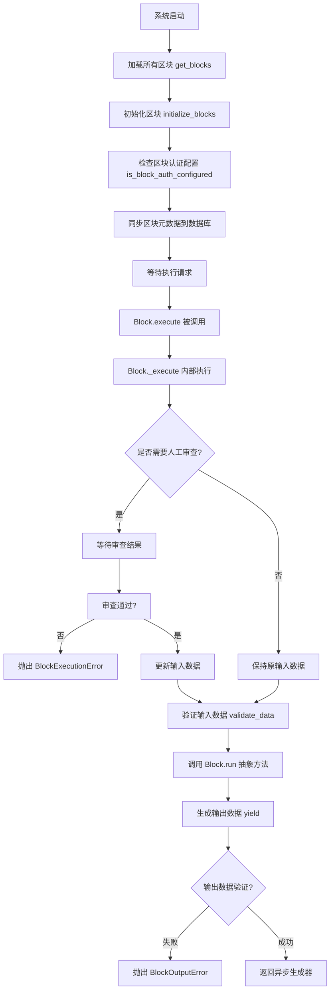

## 类结构

```
BlockSchema (Pydantic BaseModel)
├── BlockSchemaInput
│   └── EmptyInputSchema
└── BlockSchemaOutput
    └── EmptyOutputSchema
BlockManualWebhookConfig (Pydantic BaseModel)
└── BlockWebhookConfig
Block (ABC, Generic)
BaseModel (Pydantic)
├── BlockCost
└── BlockInfo
```

## 全局变量及字段


### `app_config`
    
Global application configuration object loaded from settings.

类型：`Config`
    


### `BlockCost.cost_amount`
    
The amount of cost associated with the block execution.

类型：`int`
    


### `BlockCost.cost_filter`
    
A dictionary of input data used as a filter to determine when this cost applies.

类型：`BlockInput`
    


### `BlockCost.cost_type`
    
The type of unit used to calculate the cost (e.g., run, byte, second).

类型：`BlockCostType`
    


### `BlockInfo.id`
    
The unique identifier for the block.

类型：`str`
    


### `BlockInfo.name`
    
The name of the block.

类型：`str`
    


### `BlockInfo.inputSchema`
    
The JSON schema defining the structure of the block's input.

类型：`dict[str, Any]`
    


### `BlockInfo.outputSchema`
    
The JSON schema defining the structure of the block's output.

类型：`dict[str, Any]`
    


### `BlockInfo.costs`
    
A list of cost structures associated with executing the block.

类型：`list[BlockCost]`
    


### `BlockInfo.description`
    
A description of what the block does.

类型：`str`
    


### `BlockInfo.categories`
    
A list of categories the block belongs to, each with name and description.

类型：`list[dict[str, str]]`
    


### `BlockInfo.contributors`
    
A list of contributors who participated in creating the block.

类型：`list[dict[str, Any]]`
    


### `BlockInfo.staticOutput`
    
Indicates whether the output links of the block are static.

类型：`bool`
    


### `BlockInfo.uiType`
    
The type of UI element to use for rendering this block.

类型：`str`
    


### `BlockSchema.cached_jsonschema`
    
Class variable caching the generated JSON schema to optimize performance.

类型：`dict[str, Any]`
    


### `BlockSchemaOutput.error`
    
Field containing an error message if the block operation failed.

类型：`str`
    


### `BlockManualWebhookConfig.provider`
    
The service provider that the webhook connects to.

类型：`ProviderName`
    


### `BlockManualWebhookConfig.webhook_type`
    
Identifier for the specific type of webhook (e.g., repo or organization level).

类型：`str`
    


### `BlockManualWebhookConfig.event_filter_input`
    
Name of the block's input field used to filter events.

类型：`str`
    


### `BlockManualWebhookConfig.event_format`
    
Template string for formatting the specific events the block subscribes to.

类型：`str`
    


### `BlockWebhookConfig.resource_format`
    
Template string for formatting the resource that the webhook subscribes to.

类型：`str`
    


### `Block.id`
    
Unique identifier string for the block instance.

类型：`str`
    


### `Block.input_schema`
    
The Pydantic model class defining the valid input structure.

类型：`Type[BlockSchemaInputType]`
    


### `Block.output_schema`
    
The Pydantic model class defining the valid output structure.

类型：`Type[BlockSchemaOutputType]`
    


### `Block.test_input`
    
Sample input data or list of inputs used for testing the block.

类型：`BlockInput | list[BlockInput] | None`
    


### `Block.test_output`
    
Expected output data or validation function for the test input.

类型：`BlockTestOutput | list[BlockTestOutput] | None`
    


### `Block.test_mock`
    
Dictionary mapping function names to mock objects for testing.

类型：`dict[str, Any] | None`
    


### `Block.test_credentials`
    
Credentials or dictionary of credentials used during testing.

类型：`Optional[Credentials | dict[str, Credentials]]`
    


### `Block.description`
    
Description of the block's functionality.

类型：`str`
    


### `Block.categories`
    
Set of categories the block belongs to.

类型：`set[BlockCategory] | None`
    


### `Block.contributors`
    
List of contributors who worked on the block.

类型：`list[ContributorDetails]`
    


### `Block.disabled`
    
Flag indicating if the block is disabled and unavailable for execution.

类型：`bool`
    


### `Block.static_output`
    
Flag indicating if the block's output connections are static.

类型：`bool`
    


### `Block.block_type`
    
Enum specifying the type of the block (e.g., Standard, AI, Webhook).

类型：`BlockType`
    


### `Block.webhook_config`
    
Configuration object for webhook-triggered blocks.

类型：`Optional[BlockWebhookConfig | BlockManualWebhookConfig]`
    


### `Block.is_sensitive_action`
    
Flag indicating if the block performs a sensitive action requiring human review.

类型：`bool`
    


### `Block.execution_stats`
    
Object tracking runtime statistics for the block's execution.

类型：`NodeExecutionStats`
    
    

## 全局函数及方法


### `get_blocks`

该函数用于获取系统中所有可用的Block类的字典。它通过调用 `backend.blocks` 模块中的 `load_all_blocks` 函数来实现，返回键为Block ID、值为Block类类型的映射。

参数：

-  无

返回值：`dict[str, Type[Block]]`，包含所有可用Block类的字典，其中键是Block的ID字符串，值是对应的Block类。

#### 流程图

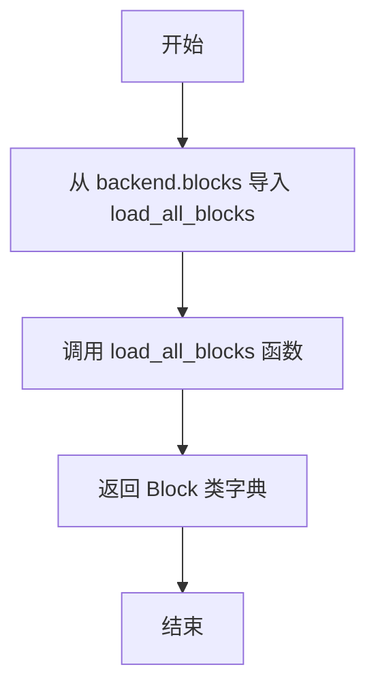

#### 带注释源码

```python
def get_blocks() -> dict[str, Type[Block]]:
    # 导入后端模块中用于加载所有Block的函数
    from backend.blocks import load_all_blocks

    # 调用加载函数并返回结果，结果是一个字典 {block_id: BlockClass}
    return load_all_blocks()
```


### `is_block_auth_configured`

检查给定的 Block 类在运行时是否配置了有效的身份验证方法。例如，如果一个块仅支持 OAuth 但未设置相应的环境变量，该函数将返回 False，表示不应在 UI 中显示该块。

参数：

-  `block_cls`：`type[AnyBlockSchema]`，需要检查的 Block 类，`AnyBlockSchema` 是 `Block[BlockSchemaInput, BlockSchemaOutput]` 的类型别名。

返回值：`bool`，如果块不需要身份验证，或者已配置有效的身份验证提供者（例如 OAuth 环境变量已设置），则返回 `True`；如果身份验证配置缺失或无效，则返回 `False`。

#### 流程图

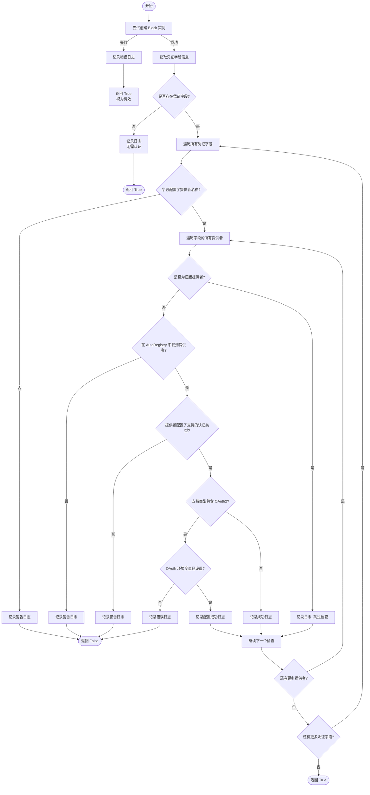

#### 带注释源码

```python
def is_block_auth_configured(
    block_cls: type[AnyBlockSchema],
) -> bool:
    """
    Check if a block has a valid authentication method configured at runtime.

    For example if a block is an OAuth-only block and there env vars are not set,
    do not show it in the UI.

    """
    from backend.sdk.registry import AutoRegistry

    # 尝试实例化 Block 以访问其 input_schema
    try:
        block = block_cls()
    except Exception as e:
        # 如果无法创建实例，假设它不是仅限 OAuth 的 Block，视为有效
        logger.error(f"Error creating block instance for {block_cls.__name__}: {e}")
        return True
    logger.debug(
        f"Checking if block {block_cls.__name__} has a valid provider configured"
    )

    # 从 input schema 获取所有凭证输入字段的详细信息
    credential_inputs = block.input_schema.get_credentials_fields_info()
    required_inputs = block.input_schema.get_required_fields()
    
    # 如果没有凭证字段，说明该 Block 不需要认证，直接返回 True
    if not credential_inputs:
        logger.debug(
            f"Block {block_cls.__name__} has no credential inputs - Treating as valid"
        )
        return True

    # 检查凭证字段是否是必需的
    # 即使不是必需的，如果配置了提供者，也需要验证提供者是否可用
    if len(required_inputs.intersection(credential_inputs.keys())) == 0:
        logger.debug(
            f"Block {block_cls.__name__} has only optional credential inputs"
            " - will work without credentials configured"
        )

    # 遍历检查所有凭证字段及其对应的提供者配置
    for field_name, field_info in credential_inputs.items():
        provider_names = field_info.provider
        # 如果没有定义提供者，视为配置无效
        if not provider_names:
            logger.warning(
                f"Block {block_cls.__name__} "
                f"has credential input '{field_name}' with no provider options"
                " - Disabling"
            )
            return False

        # 如果一个字段支持多个提供者，每个提供者都必须可用
        for _provider_name in provider_names:
            provider_name = _provider_name.value
            
            # 检查是否为旧版提供者系统
            if provider_name in ProviderName.__members__.values():
                logger.debug(
                    f"Block {block_cls.__name__} credential input '{field_name}' "
                    f"provider '{provider_name}' is part of the legacy provider system"
                    " - Treating as valid"
                )
                break

            # 从注册表获取提供者实例
            provider = AutoRegistry.get_provider(provider_name)
            if not provider:
                logger.warning(
                    f"Block {block_cls.__name__} credential input '{field_name}' "
                    f"refers to unknown provider '{provider_name}' - Disabling"
                )
                return False

            # 检查 Block 字段支持的认证类型与提供者支持的类型是否匹配
            if field_info.supported_types != provider.supported_auth_types:
                logger.warning(
                    f"Block {block_cls.__name__} credential input '{field_name}' "
                    f"has mismatched supported auth types (field <> Provider): "
                    f"{field_info.supported_types} != {provider.supported_auth_types}"
                )

            # 如果提供者没有配置任何认证方法，视为无效
            if not (supported_auth_types := provider.supported_auth_types):
                logger.warning(
                    f"Block {block_cls.__name__} credential input '{field_name}' "
                    f"provider '{provider_name}' "
                    "has no authentication methods configured - Disabling"
                )
                return False

            # 如果支持 OAuth2，检查必要的环境变量是否存在
            if "oauth2" in supported_auth_types:
                # Check if OAuth environment variables are set
                if (oauth_config := provider.oauth_config) and bool(
                    os.getenv(oauth_config.client_id_env_var)
                    and os.getenv(oauth_config.client_secret_env_var)
                ):
                    logger.debug(
                        f"Block {block_cls.__name__} credential input '{field_name}' "
                        f"provider '{provider_name}' is configured for OAuth"
                    )
                else:
                    logger.error(
                        f"Block {block_cls.__name__} credential input '{field_name}' "
                        f"provider '{provider_name}' "
                        "is missing OAuth client ID or secret - Disabling"
                    )
                    return False

        logger.debug(
            f"Block {block_cls.__name__} credential input '{field_name}' is valid; "
            f"supported credential types: {', '.join(field_info.supported_types)}"
        )

    # 所有检查通过
    return True
```


### `initialize_blocks`

该函数负责系统启动时的初始化工作，主要包括两个核心任务：一是同步所有提供程序的成本信息，二是将所有已注册的代码块元数据（如ID、名称、输入输出Schema等）持久化到数据库（Prisma `AgentBlock` 模型）中。它会自动检测数据库中是否存在对应的块记录，不存在则创建，存在且定义有变更则更新，同时具备错误重试机制和日志记录功能。

参数：

*   无

返回值：`None`，此函数为异步过程，主要执行副作用（数据库写入和日志记录），不返回具体数据。

#### 流程图

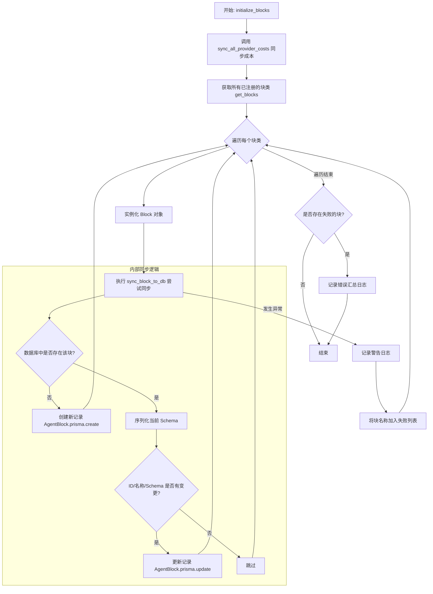

#### 带注释源码

```python
async def initialize_blocks() -> None:
    # 导入必要的依赖：成本同步模块和重试装饰器
    from backend.sdk.cost_integration import sync_all_provider_costs
    from backend.util.retry import func_retry

    # 步骤 1: 同步所有集成的提供程序成本信息
    sync_all_provider_costs()

    # 定义一个内部辅助函数，用于处理单个块到数据库的同步，并应用重试机制
    @func_retry
    async def sync_block_to_db(block: Block) -> None:
        # 尝试通过 ID 或名称在数据库中查找现有的块记录
        existing_block = await AgentBlock.prisma().find_first(
            where={"OR": [{"id": block.id}, {"name": block.name}]}
        )
        # 如果数据库中不存在该块，则创建新记录
        if not existing_block:
            await AgentBlock.prisma().create(
                data=AgentBlockCreateInput(
                    id=block.id,
                    name=block.name,
                    # 将 Pydantic Schema 转换为 JSON 字符串存储
                    inputSchema=json.dumps(block.input_schema.jsonschema()),
                    outputSchema=json.dumps(block.output_schema.jsonschema()),
                )
            )
            return

        # 准备用于比较的数据：将当前的 Schema 序列化为 JSON 字符串
        input_schema = json.dumps(block.input_schema.jsonschema())
        output_schema = json.dumps(block.output_schema.jsonschema())
        
        # 检查关键元数据（ID、名称、Schema）是否与数据库记录不一致
        if (
            block.id != existing_block.id
            or block.name != existing_block.name
            or input_schema != existing_block.inputSchema
            or output_schema != existing_block.outputSchema
        ):
            # 如果有变化，则更新数据库中的记录
            await AgentBlock.prisma().update(
                where={"id": existing_block.id},
                data={
                    "id": block.id,
                    "name": block.name,
                    "inputSchema": input_schema,
                    "outputSchema": output_schema,
                },
            )

    # 初始化失败列表，用于记录同步失败的块名称
    failed_blocks: list[str] = []
    
    # 遍历所有已加载的块类
    for cls in get_blocks().values():
        block = cls()
        try:
            # 尝试将当前块同步到数据库
            await sync_block_to_db(block)
        except Exception as e:
            # 如果同步过程中发生异常，记录警告日志，但不会中断整个初始化流程
            logger.warning(
                f"Failed to sync block {block.name} to database: {e}. "
                "Block is still available in memory.",
                exc_info=True,
            )
            # 将失败的块名称记录下来
            failed_blocks.append(block.name)

    # 如果有任何块同步失败，输出一条错误汇总日志
    if failed_blocks:
        logger.error(
            f"Failed to sync {len(failed_blocks)} block(s) to database: "
            f"{', '.join(failed_blocks)}. These blocks are still available in memory."
        )
```


### `get_block`

根据给定的唯一标识符检索并实例化一个 Block 对象。该函数首先获取所有已注册的 Blocks 映射，根据提供的 ID 查找对应的 Block 类，如果找到则实例化该类并返回，否则返回 None。

参数：

- `block_id`：`str`，要查找的 Block 的唯一标识符。

返回值：`AnyBlockSchema | None`，如果找到对应的 Block 类，则返回其实例化对象；如果未找到，则返回 None。

#### 流程图

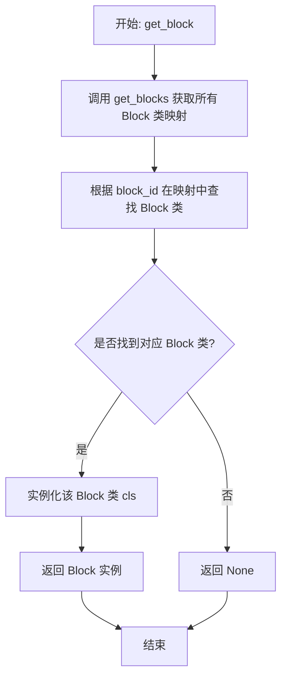

#### 带注释源码

```python
# Note on the return type annotation: https://github.com/microsoft/pyright/issues/10281
def get_block(block_id: str) -> AnyBlockSchema | None:
    # 获取所有已注册的 Blocks 字典 {id: BlockClass}
    cls = get_blocks().get(block_id)
    # 如果找到了对应的类，则实例化并返回；否则返回 None
    return cls() if cls else None
```


### `get_webhook_block_ids`

该函数用于获取所有被配置为Webhook触发类型的Block（模块）ID列表。它会检查所有注册的Block，筛选出类型为WEBHOOK或WEBHOOK_MANUAL的Block，并返回其ID集合。该函数使用了缓存机制，TTL为3600秒，以减少对注册表的频繁查询。

参数：

- (无)

返回值：`Sequence[str]`，包含所有Webhook类型Block ID的列表。

#### 流程图

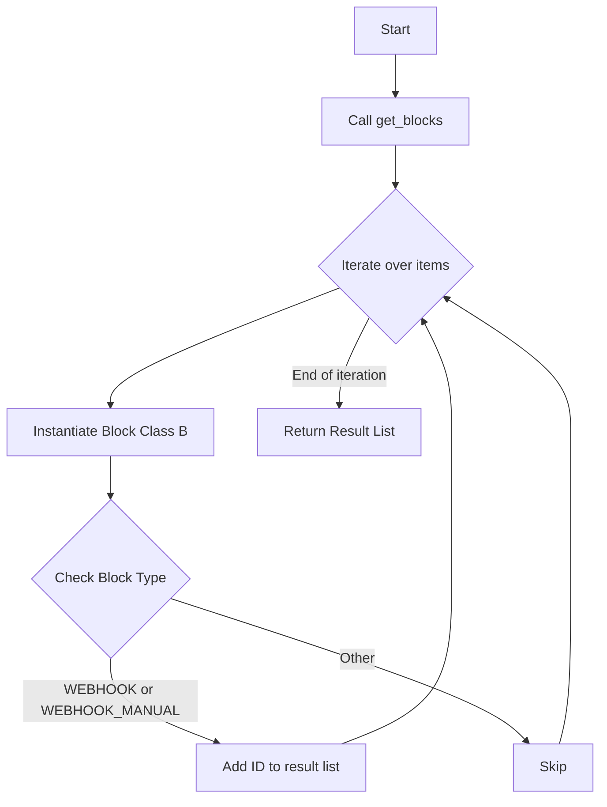

#### 带注释源码

```python
@cached(ttl_seconds=3600)
def get_webhook_block_ids() -> Sequence[str]:
    # 遍历所有获取到的 Blocks (字典格式: {id: BlockClass})
    return [
        id
        for id, B in get_blocks().items()
        # 实例化 Block 类以检查其实例属性 block_type
        if B().block_type in (BlockType.WEBHOOK, BlockType.WEBHOOK_MANUAL)
    ]
```


### `get_io_block_ids`

该函数用于检索所有已注册块中类型为输入（INPUT）或输出（OUTPUT）的块ID列表，并将结果缓存1小时（3600秒）以提高性能。

参数：

- 无

返回值：`Sequence[str]`，包含所有块类型为 `BlockType.INPUT` 或 `BlockType.OUTPUT` 的块ID的列表。

#### 流程图

```mermaid
flowchart TD
    Start([开始]) --> GetBlocks[调用 get_blocks 获取所有已注册块]
    GetBlocks --> Iterate[开始遍历块字典 items]
    Iterate --> Instantiate[实例化当前块类 B]
    Instantiate --> CheckType{判断 block_type<br/>是否为 INPUT 或 OUTPUT}
    CheckType -- 是 --> Collect[将当前块 ID 加入结果列表]
    CheckType -- 否 --> Iterate
    Collect --> Iterate
    Iterate -- 遍历结束 --> Return([返回结果列表 Sequence[str]])
```

#### 带注释源码

```python
@cached(ttl_seconds=3600)  # 使用缓存装饰器，缓存时间设置为3600秒（1小时）
def get_io_block_ids() -> Sequence[str]:
    # 通过列表推导式筛选符合条件的块ID
    return [
        id  # 目标：块ID
        for id, B in get_blocks().items()  # 遍历所有已加载的块：id为标识符，B为块类
        if B().block_type in (BlockType.INPUT, BlockType.OUTPUT)  # 检查实例化后的块类型是否属于输入或输出类型
    ]
```


### `get_human_in_the_loop_block_ids`

检索系统中所有类型为人工干预 (Human In The Loop) 的块的 ID 列表。

参数：

-  (无)

返回值：`Sequence[str]`，包含所有类型为 `BlockType.HUMAN_IN_THE_LOOP` 的 Block ID 的列表。

#### 流程图

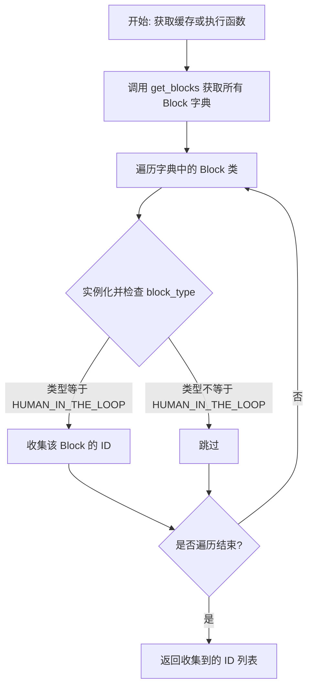

#### 带注释源码

```python
@cached(ttl_seconds=3600)  # 使用缓存装饰器，缓存时间为 3600 秒（1小时）
def get_human_in_the_loop_block_ids() -> Sequence[str]:
    return [
        id
        for id, B in get_blocks().items()  # 遍历所有已加载的 Block 类
        if B().block_type == BlockType.HUMAN_IN_THE_LOOP  # 检查 Block 类型是否为人工干预
    ]
```


### `BlockCost.__init__`

`BlockCost` 类的构造函数，用于初始化区块执行的成本相关参数，处理成本过滤器（`cost_filter`）的默认值设置，并将参数传递给父类 `BaseModel` 进行初始化。

参数：

-   `cost_amount`：`int`，表示成本的数值大小。
-   `cost_type`：`BlockCostType`，表示计费的类型（如按次 `RUN`、按字节 `BYTE` 或按秒 `SECOND`），默认为 `BlockCostType.RUN`。
-   `cost_filter`：`Optional[BlockInput]`，用于确定特定输入条件下的成本筛选逻辑，如果为 `None` 则初始化为空字典 `{}`。
-   `**data`：`Any`，传递给父类 `BaseModel` 的额外关键字参数。

返回值：`None`，该方法为构造函数，不返回任何值。

#### 流程图

```mermaid
graph TD
    A[开始: BlockCost.__init__] --> B[接收 cost_amount]
    B --> C[接收 cost_type (默认 RUN)]
    C --> D[接收 cost_filter (默认 None)]
    D --> E{判断 cost_filter 是否为 None}
    E -- 是 --> F[设置 cost_filter 为 空字典 {}]
    E -- 否 --> G[保持 cost_filter 原值]
    F --> H[调用 super().__init__ 初始化父类 BaseModel]
    G --> H
    H --> I[结束]
```

#### 带注释源码

```python
def __init__(
    self,
    cost_amount: int,
    cost_type: BlockCostType = BlockCostType.RUN,
    cost_filter: Optional[BlockInput] = None,
    **data: Any,
) -> None:
    # 调用父类 BaseModel 的初始化方法
    # 确保 cost_filter 不为 None，若未提供则默认为空字典 {}
    super().__init__(
        cost_amount=cost_amount,
        cost_filter=cost_filter or {},
        cost_type=cost_type,
        **data,  # 传递额外的字段给父类处理
    )
```


### `BlockSchema.jsonschema`

该方法用于生成并缓存当前 `BlockSchema` Pydantic 模型对应的 JSON Schema 字典。它会解析模型中的 `$ref` 引用，并对 OpenAPI 规范中的特定引用结构（如 `allOf`、`anyOf` 等）进行扁平化处理，以确保生成的 Schema 结构简洁且可直接使用。

参数：

-   （无）

返回值：`dict[str, Any]`，处理后的 JSON Schema 字典。

#### 流程图

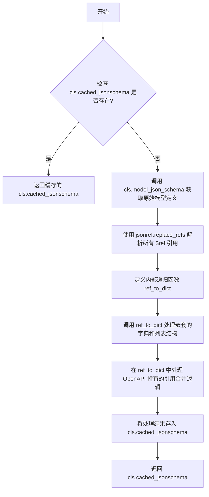

#### 带注释源码

```python
    @classmethod
    def jsonschema(cls) -> dict[str, Any]:
        # 检查类变量中是否已经存在缓存的结果
        if cls.cached_jsonschema:
            return cls.cached_jsonschema

        # 获取 Pydantic 模型的 JSON Schema，并使用 jsonref 替换掉所有的 $ref 引用
        # merge_props=True 表示将引用对象的内容合并到当前位置
        model = jsonref.replace_refs(cls.model_json_schema(), merge_props=True)

        # 定义一个递归辅助函数，用于将对象转换为纯字典，并处理特定的 Schema 结构
        def ref_to_dict(obj):
            if isinstance(obj, dict):
                # OpenAPI <3.1 不支持带有 $ref 键的同级字段
                # 因此，如果 Schema 中有只包含一个元素的 "allOf"/"anyOf"/"oneOf"，
                # 我们需要将其内容提取并合并到当前对象中
                keys = {"allOf", "anyOf", "oneOf"}
                one_key = next((k for k in keys if k in obj and len(obj[k]) == 1), None)
                if one_key:
                    obj.update(obj[one_key][0])

                # 递归遍历字典，过滤掉以 "$" 开头的键（如 $ref, $schema 等）
                # 同时也过滤掉已经被合并处理的 one_key
                return {
                    key: ref_to_dict(value)
                    for key, value in obj.items()
                    if not key.startswith("$") and key != one_key
                }
            elif isinstance(obj, list):
                # 如果是列表，递归处理其中的每一项
                return [ref_to_dict(item) for item in obj]

            # 如果既不是字典也不是列表，直接返回原值
            return obj

        # 使用辅助函数处理模型，并将结果强制类型转换为 dict[str, Any] 后存入缓存
        cls.cached_jsonschema = cast(dict[str, Any], ref_to_dict(model))

        return cls.cached_jsonschema
```


### `BlockSchema.validate_data`

该方法是一个类方法，用于根据当前类的JSON Schema验证输入的数据字典。它会过滤掉值为`None`的字段，然后调用底层的验证逻辑，如果验证失败则返回错误信息字符串，否则返回`None`。

参数：

-  `data`：`BlockInput`，待验证的输入数据字典，键为字段名，值为对应的数据。

返回值：`str | None`，如果数据不符合Schema定义，返回包含错误信息的字符串；如果验证通过，则返回`None`。

#### 流程图

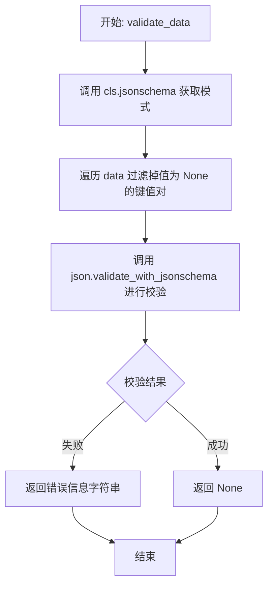

#### 带注释源码

```python
    @classmethod
    def validate_data(cls, data: BlockInput) -> str | None:
        # 使用类方法获取当前模型的JSON Schema
        # 过滤输入数据，排除值为None的项，然后使用工具函数进行验证
        return json.validate_with_jsonschema(
            schema=cls.jsonschema(),
            data={k: v for k, v in data.items() if v is not None},
        )
```


### `BlockSchema.get_mismatch_error`

该类方法用于验证输入数据是否符合当前类的模式定义。它通过调用内部的验证逻辑来检查数据不匹配的情况，并返回相应的错误信息。

参数：

-   `data`：`BlockInput`，需要验证的输入数据字典，其中键为字段名，值为对应的数据。

返回值：`str | None`，如果数据与模式不匹配，返回包含错误详情的字符串；如果数据有效，则返回 None。

#### 流程图

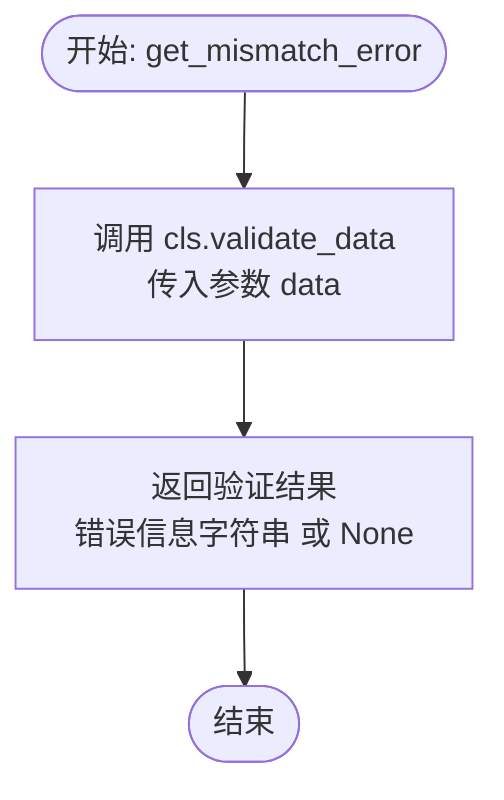

#### 带注释源码

```python
    @classmethod
    def get_mismatch_error(cls, data: BlockInput) -> str | None:
        """
        获取数据不匹配的错误信息。
        
        该方法本质上是对 validate_data 方法的封装。
        
        Args:
            cls: 类本身（通过 @classmethod 传递）。
            data: 待验证的输入数据，类型为字典。

        Returns:
            str | None: 如果验证失败，返回具体的错误信息字符串；如果验证通过，返回 None。
        """
        return cls.validate_data(data)
```


### `BlockSchema.get_field_schema`

该类方法用于获取 `BlockSchema` 类中特定字段的 JSON Schema 定义。它会验证模型的整体 Schema 结构，并在给定的字段名称不存在时抛出异常。

参数：

- `field_name`：`str`，需要获取 Schema 定义的字段名称。

返回值：`dict[str, Any]`，该字段的 JSON Schema 定义字典，包含类型、描述、约束等信息。

#### 流程图

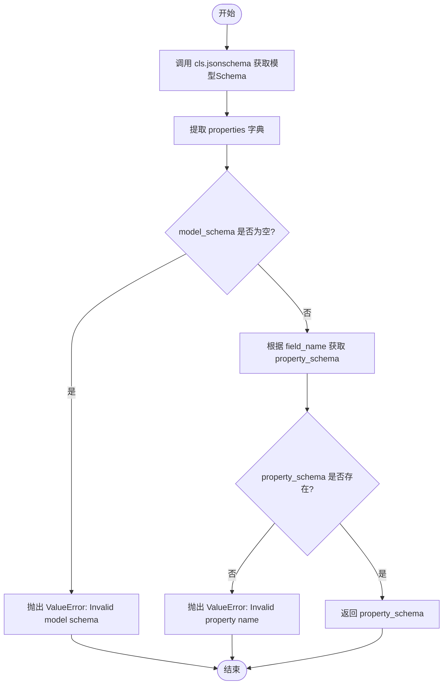

#### 带注释源码

```python
    @classmethod
    def get_field_schema(cls, field_name: str) -> dict[str, Any]:
        # 1. 获取当前类的 JSON Schema 定义，并提取其中的 "properties" 字典
        #    properties 字典包含了所有字段的 Schema 定义
        model_schema = cls.jsonschema().get("properties", {})
        
        # 2. 检查模型 Schema 是否有效（即是否包含 properties）
        if not model_schema:
            raise ValueError(f"Invalid model schema {cls}")

        # 3. 根据 field_name 从 properties 中获取特定字段的 Schema
        property_schema = model_schema.get(field_name)
        
        # 4. 检查请求的字段名是否存在
        if not property_schema:
            raise ValueError(f"Invalid property name {field_name}")

        # 5. 返回找到的字段 Schema 定义
        return property_schema
```


### `BlockSchema.validate_field`

验证提供的数据是否符合 `BlockSchema` 中指定字段的定义。如果验证失败，返回错误信息；如果验证通过，则返回 `None`。

参数：

-   `field_name`：`str`，需要验证的目标字段名称。
-   `data`：`BlockInput`，待验证的数据值。

返回值：`str | None`，如果数据有效则返回 `None`，否则返回包含验证错误详情的字符串。

#### 流程图

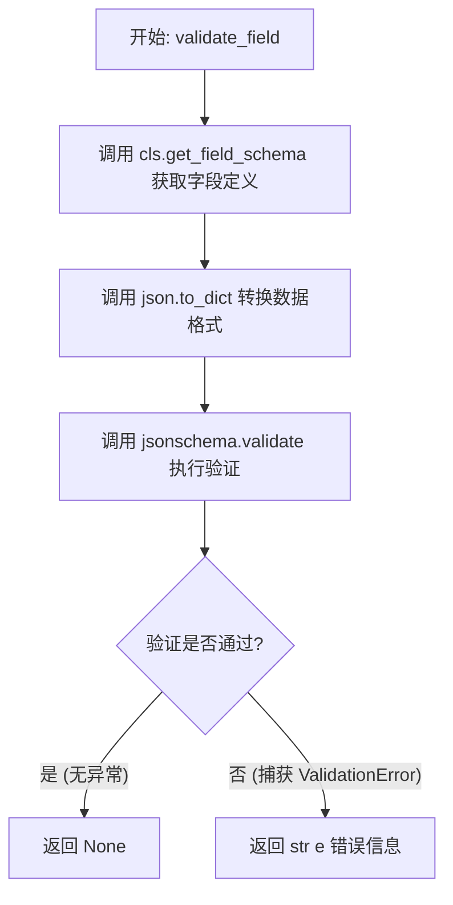

#### 带注释源码

```python
    @classmethod
    def validate_field(cls, field_name: str, data: BlockInput) -> str | None:
        """
        Validate the data against a specific property (one of the input/output name).
        Returns the validation error message if the data does not match the schema.
        """
        try:
            # 获取指定字段的属性模式定义
            property_schema = cls.get_field_schema(field_name)
            # 使用 jsonschema 库验证数据是否符合字段模式
            # json.to_dict 用于将输入数据转换为字典格式以供验证
            jsonschema.validate(json.to_dict(data), property_schema)
            # 如果验证通过且未抛出异常，返回 None 表示验证成功
            return None
        except jsonschema.ValidationError as e:
            # 如果验证失败，捕获 ValidationError 并返回错误信息字符串
            return str(e)
```


### `BlockSchema.get_fields`

检索 Pydantic 模型架构中定义的所有字段的名称。

参数：

-  `cls`：`type[BlockSchema]`，类本身（隐式的类方法参数）

返回值：`set[str]`，包含模型中定义的所有字段名称的集合。

#### 流程图

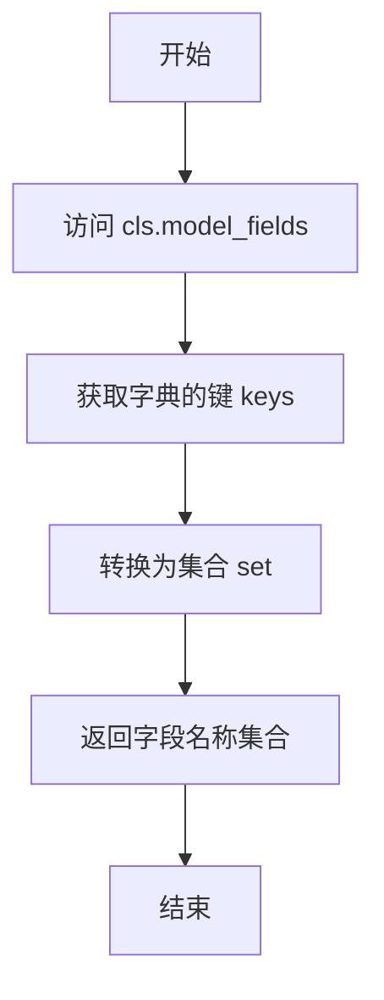

#### 带注释源码

```python
    @classmethod
    def get_fields(cls) -> set[str]:
        # cls.model_fields 是 Pydantic BaseModel 提供的字典属性，
        # 包含了模型中所有字段的名称到字段信息的映射。
        # 通过 .keys() 方法获取所有字段名，并使用 set() 将其转换为集合形式返回。
        return set(cls.model_fields.keys())
```


### `BlockSchema.get_required_fields`

该方法用于获取当前 BlockSchema 子类中所有被定义为必填的字段名称集合。它通过检查 Pydantic 模型的字段信息来确定字段是否为必填项。

参数：

-   (无显式参数)

返回值：`set[str]`，包含所有必填字段名称的集合。

#### 流程图

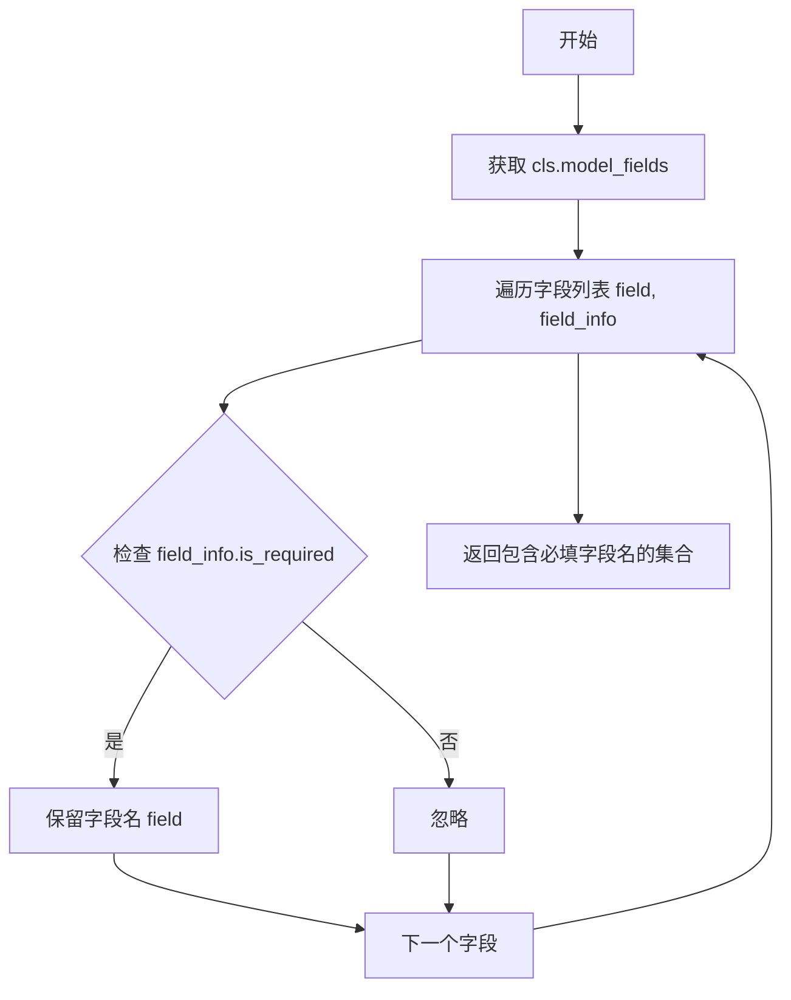

#### 带注释源码

```python
    @classmethod
    def get_required_fields(cls) -> set[str]:
        # 使用集合推导式遍历模型的所有字段
        return {
            field
            for field, field_info in cls.model_fields.items()
            if field_info.is_required()  # 检查该字段是否被标记为必填
        }
```


### `BlockSchema.__pydantic_init_subclass__`

该方法是 Pydantic 模型子类化时的钩子方法，用于在子类创建时验证架构定义。它强制执行凭证字段的命名和类型规则，确保名为 `credentials` 或 `*_credentials` 的字段必须是 `CredentialsMetaInput` 类型，反之亦然。此外，它还会重置继承自父类的缓存 JSON Schema，以确保每个子类拥有独立的架构缓存。

参数：

- `cls`：`Type[BlockSchema]`，当前正在初始化的子类。
- `**kwargs`：`Any`，传递给父类 `__pydantic_init_subclass__` 方法的关键字参数。

返回值：`None`，该方法没有返回值，但在验证失败时会抛出 `TypeError` 或 `KeyError` 异常。

#### 流程图

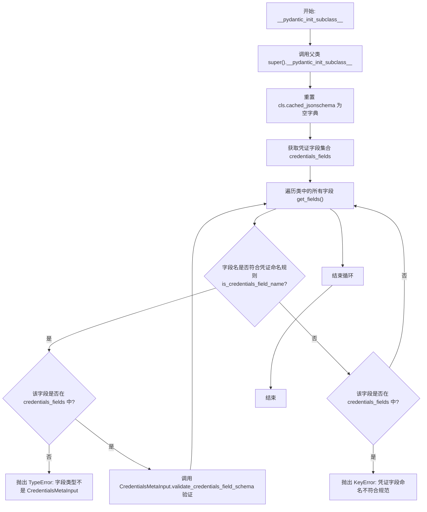

#### 带注释源码

```python
    @classmethod
    def __pydantic_init_subclass__(cls, **kwargs):
        """Validates the schema definition. Rules:
        - Fields with annotation `CredentialsMetaInput` MUST be
          named `credentials` or `*_credentials`
        - Fields named `credentials` or `*_credentials` MUST be
          of type `CredentialsMetaInput`
        """
        # 调用父类的初始化子类方法，确保 Pydantic 的标准行为得以执行
        super().__pydantic_init_subclass__(**kwargs)

        # 重置缓存的 JSON schema，防止子类继承父类的 schema 缓存
        cls.cached_jsonschema = {}

        # 获取所有类型为 CredentialsMetaInput 的字段
        credentials_fields = cls.get_credentials_fields()

        # 遍历类中定义的所有字段
        for field_name in cls.get_fields():
            # 检查字段名是否符合凭证命名规则（即 'credentials' 或 '*_credentials'）
            if is_credentials_field_name(field_name):
                # 如果字段名符合规则，但该字段不在 credentials_fields 列表中
                # 说明该字段的类型不是 CredentialsMetaInput，抛出类型错误
                if field_name not in credentials_fields:
                    raise TypeError(
                        f"Credentials field '{field_name}' on {cls.__qualname__} "
                        f"is not of type {CredentialsMetaInput.__name__}"
                    )

                # 如果字段名和类型都匹配，则进一步验证该字段的内部 schema 定义
                CredentialsMetaInput.validate_credentials_field_schema(
                    cls.get_field_schema(field_name), field_name
                )

            # 如果字段名不符合凭证命名规则，但该字段却在 credentials_fields 列表中
            # 说明该字段是 CredentialsMetaInput 类型，但命名不符合规范，抛出键错误
            elif field_name in credentials_fields:
                raise KeyError(
                    f"Credentials field '{field_name}' on {cls.__qualname__} "
                    "has invalid name: must be 'credentials' or *_credentials"
                )
```


### `BlockSchema.get_credentials_fields`

该方法是 `BlockSchema` 类的一个类方法，用于从 Pydantic 模型的字段中提取并返回所有定义为凭证类型的字段。它通过检查字段注解是否是 `CredentialsMetaInput` 的子类来识别凭证字段，同时处理了泛型类型的情况。

参数：

-   `cls`：`type[BlockSchema]`，类方法的隐式参数，代表当前的类对象。

返回值：`dict[str, type[CredentialsMetaInput]]`，返回一个字典，其中键是字段名称（字符串），值是对应的凭证元数据输入类型（`CredentialsMetaInput` 的子类）。

#### 流程图

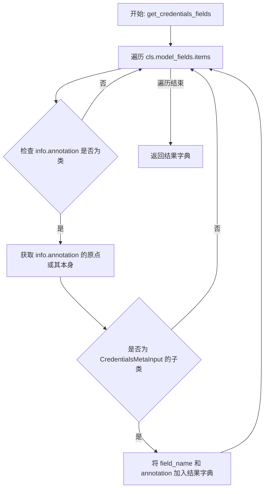

#### 带注释源码

```python
    @classmethod
    def get_credentials_fields(cls) -> dict[str, type[CredentialsMetaInput]]:
        """
        通过遍历模型字段，筛选出类型注解为 CredentialsMetaInput（或其子类）的字段。
        使用 get_origin 处理可能的泛型包装，确保能正确识别嵌套在泛型中的凭证类型。
        """
        return {
            # 字典的键：字段的名称
            field_name: info.annotation
            # 字典的值：字段的类型注解
            for field_name, info in cls.model_fields.items()
            # 筛选条件：
            if (
                # 1. 检查注解是否是一个类对象
                inspect.isclass(info.annotation)
                # 2. 检查该类（或其泛型的原始基类）是否是 CredentialsMetaInput 的子类
                # get_origin 用于处理如 List[CredentialsMetaInput] 这样的泛型情况
                and issubclass(
                    get_origin(info.annotation) or info.annotation,
                    CredentialsMetaInput,
                )
            )
        }
```


### `BlockSchema.get_auto_credentials_fields`

获取具有 auto_credentials 元数据的字段（例如 GoogleDriveFileInput）。该方法用于识别那些配置了自动凭据处理的字段，并将它们映射到其配置信息上。

参数：

- `cls`：`type[BlockSchema]`，BlockSchema 的类对象，用于访问类方法和属性。

返回值：`dict[str, dict[str, Any]]`，返回一个字典，其键是参数名称（kwarg_name，默认为 "credentials"），值是包含字段名称（field_name）和自动凭据配置（auto_credentials_config）的字典。

#### 流程图

```mermaid
flowchart TD
    A[开始] --> B[初始化空字典 result]
    B --> C[调用 cls.jsonschema 获取模型架构]
    C --> D[获取 properties 属性字典]
    D --> E{遍历 properties 中的字段}
    E -->|存在字段| F[检查字段是否有 auto_credentials 配置]
    F -->|无配置| E
    F -->|有配置| G[获取 kwarg_name 默认为 credentials]
    G --> H{result 中是否已存在该 kwarg_name?}
    H -->|是| I[抛出 ValueError 异常: 重复的 kwarg_name]
    H -->|否| J[将 {field_name, config} 存入 result]
    J --> E
    E -->|遍历结束| K[返回 result 字典]
```

#### 带注释源码

```python
    @classmethod
    def get_auto_credentials_fields(cls) -> dict[str, dict[str, Any]]:
        """
        Get fields that have auto_credentials metadata (e.g., GoogleDriveFileInput).

        Returns a dict mapping kwarg_name -> {field_name, auto_credentials_config}

        Raises:
            ValueError: If multiple fields have the same kwarg_name, as this would
                cause silent overwriting and only the last field would be processed.
        """
        # 初始化结果字典，用于存储映射关系
        result: dict[str, dict[str, Any]] = {}
        
        # 获取当前类的 JSON Schema 定义
        schema = cls.jsonschema()
        
        # 提取所有属性（字段）的定义
        properties = schema.get("properties", {})

        # 遍历所有字段
        for field_name, field_schema in properties.items():
            # 检查当前字段的 Schema 中是否存在 'auto_credentials' 配置
            auto_creds = field_schema.get("auto_credentials")
            if auto_creds:
                # 获取参数名称（kwarg_name），如果没有指定则默认为 'credentials'
                kwarg_name = auto_creds.get("kwarg_name", "credentials")
                
                # 检查是否已经存在相同的 kwarg_name，防止冲突
                if kwarg_name in result:
                    raise ValueError(
                        f"Duplicate auto_credentials kwarg_name '{kwarg_name}' "
                        f"in fields '{result[kwarg_name]['field_name']}' and "
                        f"'{field_name}' on {cls.__qualname__}"
                    )
                
                # 将映射关系存入结果字典
                result[kwarg_name] = {
                    "field_name": field_name,
                    "config": auto_creds,
                }
        return result
```


### `BlockSchema.get_credentials_fields_info`

该方法用于收集并返回块中所有凭据字段的详细信息。它合并了显式定义的凭据字段（类型为 `CredentialsMetaInput` 的字段）和通过 `auto_credentials` 元数据自动生成的凭据字段（例如来自 `GoogleDriveFileInput` 等字段的配置），最终返回一个字典，将字段名称映射到包含提供者、类型和范围等信息的 `CredentialsFieldInfo` 对象。

参数：

- `cls`：`Type[BlockSchema]`，`BlockSchema` 类本身。

返回值：`dict[str, CredentialsFieldInfo]`，一个字典，键为凭据字段名（自动生成的凭据字段为 `kwarg_name`），值为包含凭据元数据的 `CredentialsFieldInfo` 对象。

#### 流程图

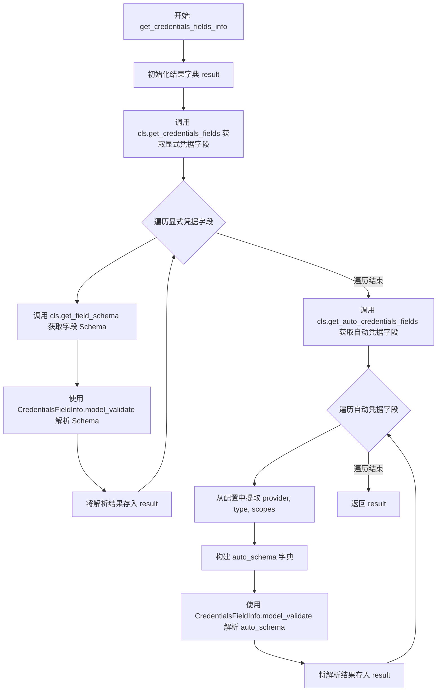

#### 带注释源码

```python
    @classmethod
    def get_credentials_fields_info(cls) -> dict[str, CredentialsFieldInfo]:
        result = {}

        # 1. 处理常规的凭据字段
        # 获取所有显式声明的凭据字段名称
        for field_name in cls.get_credentials_fields().keys():
            # 获取该字段的 JSON Schema 定义，并验证/解析为 CredentialsFieldInfo 对象
            result[field_name] = CredentialsFieldInfo.model_validate(
                cls.get_field_schema(field_name), by_alias=True
            )

        # 2. 处理自动生成的凭据字段 (例如从 GoogleDriveFileInput 等)
        # 获取包含 auto_credentials 元数据的字段信息
        for kwarg_name, info in cls.get_auto_credentials_fields().items():
            config = info["config"]
            # 构建一个 CredentialsFieldInfo 可以解析的类 Schema 字典
            auto_schema = {
                "credentials_provider": [config.get("provider", "google")],
                "credentials_types": [config.get("type", "oauth2")],
                "credentials_scopes": config.get("scopes"),
            }
            # 解析 auto_schema 并存入结果字典，使用 kwarg_name 作为键
            result[kwarg_name] = CredentialsFieldInfo.model_validate(
                auto_schema, by_alias=True
            )

        return result
```


### `BlockSchema.get_input_defaults`

该方法是 `BlockSchema` 类的一个类方法，用于获取或处理输入数据的默认值。在基类实现中，它是一个直接透传的方法，即原样返回输入数据。设计上允许子类覆盖此方法以实现特定的默认值填充逻辑或输入预处理。

参数：

- `data`：`BlockInput`，输入数据的字典，类型定义为 `dict[str, Any]`。它代表了传递给块的所有输入引脚的数据。

返回值：`BlockInput`，返回输入数据的字典。基类默认实现直接返回传入的 `data`，不做任何修改。

#### 流程图

```mermaid
flowchart TD
    Start([开始]) --> Input[接收输入参数 data]
    Input --> Process{处理逻辑?}
    Process -- 默认实现 --> PassThrough[直接返回 data]
    Process -- 子类重写 --> CustomLogic[执行自定义默认值逻辑]
    CustomLogic --> ReturnData[返回处理后的 data]
    PassThrough --> ReturnData
    ReturnData --> End([结束])
```

#### 带注释源码

```python
    @classmethod
    def get_input_defaults(cls, data: BlockInput) -> BlockInput:
        # 默认情况下，直接将输入数据原样返回。
        # 此方法设计为可被子类重写，以便在需要时为输入字段提供默认值。
        return data  # Return as is, by default.
```


### `BlockSchema.get_missing_links`

通过计算来自链接的预期输入字段与实际提供的数据之间的差异，识别缺失的连接。

参数：

- `data`：`BlockInput`，传递给块的输入数据字典。
- `links`：`list["Link"]`，代表连接到块输入的链接对象列表。

返回值：`set[str]`，那些被链接引用但未在 `data` 中提供的字段名称集合。

#### 流程图

```mermaid
graph TD
    A[开始] --> B[从 links 列表中提取所有 sink_name 字段]
    B --> C[将 data 的键转换为集合]
    C --> D[计算差集: input_fields_from_nodes - data_keys]
    D --> E[返回包含缺失字段名称的集合]
    E --> F[结束]
```

#### 带注释源码

```python
    @classmethod
    def get_missing_links(cls, data: BlockInput, links: list["Link"]) -> set[str]:
        # 从所有传入的链接中收集目标输入字段的名称（sink_name）
        # 这些字段预期是有数据流入的
        input_fields_from_nodes = {link.sink_name for link in links}
        
        # 计算集合差集：找出预期有数据但实际并未在 data 参数中提供的字段
        # 返回这些缺失字段的集合
        return input_fields_from_nodes - set(data)
```


### `BlockSchema.get_missing_input`

该方法用于计算并返回当前块（Block）所需的输入数据中缺失的字段名称集合。它通过对比类定义的必填字段与实际提供的数据键，来确定缺少哪些输入。

参数：

-  `data`：`BlockInput`，提供给块的输入数据字典，键为字段名，值为对应的输入值。

返回值：`set[str]`，包含所有必填但未在 `data` 中提供的字段名称的集合。

#### 流程图

```mermaid
flowchart TD
    Start([开始]) --> Step1[调用 get_required_fields 获取所有必填字段]
    Step1 --> Step2[将输入字典 data 的键转换为集合]
    Step2 --> Step3[计算必填字段集合与输入键集合的差集]
    Step3 --> Step4[返回计算得到的差集结果]
    Step4 --> End([结束])
```

#### 带注释源码

```python
    @classmethod
    def get_missing_input(cls, data: BlockInput) -> set[str]:
        # 获取该 Block Schema 中所有标记为必填的字段名称集合
        # get_required_fields 会检查 model_fields 中字段的 is_required 状态
        required_fields = cls.get_required_fields()
        
        # 将传入的输入数据字典的键转换为集合
        provided_data_keys = set(data)
        
        # 使用集合差集运算：必填字段 - 已提供的字段 = 缺失的字段
        missing_fields = required_fields - provided_data_keys
        
        return missing_fields
```


### `Block.__init__`

初始化 Block 实例，设置块的唯一标识、描述、输入输出模式、测试数据以及类别等元数据。此外，如果配置了 `webhook_config`，该方法还会执行特定的验证逻辑，包括检查凭据字段的有效性、事件过滤器的结构以及必要的输入字段（如 `payload`），并根据平台配置决定是否自动禁用该块。

参数：

-   `id`：`str`，块的唯一标识符，将被持久化存储在数据库中，通常使用 UUID 格式。
-   `description`：`str`，块功能的文本描述。
-   `contributors`：`list[ContributorDetails]`，贡献该块的贡献者列表。
-   `categories`：`set[BlockCategory] | None`，块所属的类别集合，用于 UI 分组或逻辑筛选。
-   `input_schema`：`Type[BlockSchemaInputType]`，定义块输入数据结构的 Pydantic 模型类，默认为 `EmptyInputSchema`。
-   `output_schema`：`Type[BlockSchemaOutputType]`，定义块输出数据结构的 Pydantic 模型类，默认为 `EmptyOutputSchema`。
-   `test_input`：`BlockInput | list[BlockInput] | None`，用于测试的样本输入数据或数据列表。
-   `test_output`：`BlockTestOutput | list[BlockTestOutput] | None`，预期测试输出的数据或数据列表。
-   `test_mock`：`dict[str, Any] | None`，在测试运行时需要模拟的块方法名称及配置。
-   `test_credentials`：`Optional[Credentials | dict[str, Credentials]]`，用于测试的凭据对象或字典。
-   `disabled`：`bool`，指示该块是否被禁用，禁用后将不可用于执行，默认为 `False`。
-   `static_output`：`bool`，指示块的输出链接是否默认为静态，默认为 `False`。
-   `block_type`：`BlockType`，块的类型枚举（如 Standard, AI 等），默认为 `BlockType.STANDARD`。
-   `webhook_config`：`Optional[BlockWebhookConfig | BlockManualWebhookConfig]`，Webhook 触发块的配置对象，包含 Provider、事件过滤器等信息。
-   `is_sensitive_action`：`bool`，标识该块的操作是否敏感，需要人工审查，默认为 `False`。

返回值：`None`，该方法为构造函数，不返回任何值。

#### 流程图

```mermaid
flowchart TD
    Start([开始]) --> InitProps[初始化基本属性: id, description, schemas 等]
    InitProps --> CheckWebhook{webhook_config 是否存在?}
    
    CheckWebhook -- 否 --> End([结束])
    
    CheckWebhook -- 是 --> CheckAutoType{是自动 Webhook 配置?}
    CheckAutoType -- 是 BlockWebhookConfig --> CheckCreds{是否有凭据字段?}
    CheckCreds -- 否 --> RaiseTypeError1[抛出 TypeError: 缺少凭据字段]
    CheckCreds -- 是 --> CheckMultiCreds{凭据字段数量 > 1?}
    CheckMultiCreds -- 是 --> RaiseValueError[抛出 ValueError: 不支持多个凭据输入]
    CheckMultiCreds -- 否 --> SetTypeWebhook[设置 block_type 为 WEBHOOK]
    
    CheckAutoType -- 否 BlockManualWebhookConfig --> SetTypeManual[设置 block_type 为 WEBHOOK_MANUAL]
    
    SetTypeWebhook --> CheckEventFilter
    SetTypeManual --> CheckEventFilter
    
    CheckEventFilter{event_filter_input 是否配置?}
    CheckEventFilter -- 是 --> ValidateEvent[验证 event_filter_input 字段结构<br>必须是 BaseModel 且所有字段为 bool]
    CheckEventFilter -- 否 --> CheckPayload
    
    ValidateEvent --> CheckPayload
    
    CheckPayload{是否存在 'payload' 输入字段?}
    CheckPayload -- 否 --> RaiseTypeError2[抛出 TypeError: Webhook 块缺少 payload 输入]
    CheckPayload -- 是 --> CheckBaseUrl
    
    CheckBaseUrl{platform_base_url 是否已配置?}
    CheckBaseUrl -- 否 --> SetDisabledTrue[设置 disabled = True]
    CheckBaseUrl -- 是 --> End
    SetDisabledTrue --> End
```

#### 带注释源码

```python
def __init__(
    self,
    id: str = "",
    description: str = "",
    contributors: list[ContributorDetails] = [],
    categories: set[BlockCategory] | None = None,
    input_schema: Type[BlockSchemaInputType] = EmptyInputSchema,
    output_schema: Type[BlockSchemaOutputType] = EmptyOutputSchema,
    test_input: BlockInput | list[BlockInput] | None = None,
    test_output: BlockTestOutput | list[BlockTestOutput] | None = None,
    test_mock: dict[str, Any] | None = None,
    test_credentials: Optional[Credentials | dict[str, Credentials]] = None,
    disabled: bool = False,
    static_output: bool = False,
    block_type: BlockType = BlockType.STANDARD,
    webhook_config: Optional[BlockWebhookConfig | BlockManualWebhookConfig] = None,
    is_sensitive_action: bool = False,
):
    """
    Initialize the block with the given schema.

    Args:
        id: The unique identifier for the block, this value will be persisted in the
            DB. So it should be a unique and constant across the application run.
            Use the UUID format for the ID.
        description: The description of the block, explaining what the block does.
        contributors: The list of contributors who contributed to the block.
        input_schema: The schema, defined as a Pydantic model, for the input data.
        output_schema: The schema, defined as a Pydantic model, for the output data.
        test_input: The list or single sample input data for the block, for testing.
        test_output: The list or single expected output if the test_input is run.
        test_mock: function names on the block implementation to mock on test run.
        disabled: If the block is disabled, it will not be available for execution.
        static_output: Whether the output links of the block are static by default.
    """
    # 初始化基本属性，将参数赋值给实例变量
    self.id = id
    self.input_schema = input_schema
    self.output_schema = output_schema
    self.test_input = test_input
    self.test_output = test_output
    self.test_mock = test_mock
    self.test_credentials = test_credentials
    self.description = description
    # 处理 categories 和 contributors 的默认值，确保它们是集合/列表而非 None
    self.categories = categories or set()
    self.contributors = contributors or set()
    self.disabled = disabled
    self.static_output = static_output
    self.block_type = block_type
    self.webhook_config = webhook_config
    self.is_sensitive_action = is_sensitive_action
    # 初始化执行统计对象
    self.execution_stats: NodeExecutionStats = NodeExecutionStats()

    # 如果配置了 webhook_config，则执行特定的 webhook 相关逻辑
    if self.webhook_config:
        # 判断是否为自动设置的 Webhook 配置 (BlockWebhookConfig)
        if isinstance(self.webhook_config, BlockWebhookConfig):
            # 强制要求自动设置的 Webhook 块必须存在凭据字段
            if not (cred_fields := self.input_schema.get_credentials_fields()):
                raise TypeError(
                    "credentials field is required on auto-setup webhook blocks"
                )
            # 禁止 Webhook 块有多个凭据输入
            elif len(cred_fields) > 1:
                raise ValueError(
                    "Multiple credentials inputs not supported on webhook blocks"
                )

            # 设置块类型为 WEBHOOK
            self.block_type = BlockType.WEBHOOK
        else:
            # 否则设置为手动 Webhook 类型
            self.block_type = BlockType.WEBHOOK_MANUAL

        # 如果配置了事件过滤器输入，强制验证其结构
        if self.webhook_config.event_filter_input:
            event_filter_field = self.input_schema.model_fields[
                self.webhook_config.event_filter_input
            ]
            # 检查是否为 BaseModel 且所有字段均为 bool 类型
            if not (
                isinstance(event_filter_field.annotation, type)
                and issubclass(event_filter_field.annotation, BaseModel)
                and all(
                    field.annotation is bool
                    for field in event_filter_field.annotation.model_fields.values()
                )
            ):
                raise NotImplementedError(
                    f"{self.name} has an invalid webhook event selector: "
                    "field must be a BaseModel and all its fields must be boolean"
                )

        # 强制要求 Webhook 触发的块必须包含 'payload' 输入
        if "payload" not in self.input_schema.model_fields:
            raise TypeError(
                f"{self.name} is webhook-triggered but has no 'payload' input"
            )

        # 如果未配置平台基础 URL，则禁用该 Webhook 块
        if not app_config.platform_base_url:
            self.disabled = True
```


### `Block.create`

工厂方法，用于创建一个新的 Block 实例。该方法直接调用类的构造函数并返回实例。

参数：

-  `cls`：`Type["Block"]`，表示调用该方法的类本身，用于实例化对象。

返回值：`Block`，返回 Block 类的一个实例。

#### 流程图

```mermaid
graph TD
    A[开始: 调用 Block.create] --> B[调用 cls() 构造函数]
    B --> C[返回 Block 实例]
    C --> D[结束]
```

#### 带注释源码

```python
    @classmethod
    def create(cls: Type["Block"]) -> "Block":
        # 直接调用类构造函数进行实例化并返回
        return cls()
```


### `Block.run`

核心抽象方法，用于运行块逻辑。子类必须实现此方法以定义输入数据如何转换为输出流。

参数：

-  `input_data`：`BlockSchemaInputType`，符合输入模式结构的输入数据。
-  `**kwargs`：`Any`，包含执行上下文的额外参数，例如 `graph_id`（图ID）、`node_id`（节点ID）、`graph_exec_id`（图执行ID）、`node_exec_id`（节点执行ID）、`user_id`（用户ID）等。

返回值：`BlockOutput`，一个异步生成器，产出元组 `(output_name, output_data)`。其中 `output_name` 是块输出模式中定义的输出名称，`output_data` 是符合该模式的输出数据。

#### 流程图

```mermaid
graph TD
    A[开始: 接收 input_data 与 kwargs] --> B[执行子类实现的逻辑]
    B --> C{是否有数据产出?}
    C -- 是 --> D[产出: output_name, output_data]
    D --> C
    C -- 否 --> E[结束: 返回异步生成器]
```

#### 带注释源码

```python
    @abstractmethod
    async def run(self, input_data: BlockSchemaInputType, **kwargs) -> BlockOutput:
        """
        Run the block with the given input data.
        Args:
            input_data: The input data with the structure of input_schema.

        Kwargs: Currently 14/02/2025 these include
            graph_id: The ID of the graph.
            node_id: The ID of the node.
            graph_exec_id: The ID of the graph execution.
            node_exec_id: The ID of the node execution.
            user_id: The ID of the user.

        Returns:
            A Generator that yields (output_name, output_data).
            output_name: One of the output name defined in Block's output_schema.
            output_data: The data for the output_name, matching the defined schema.
        """
        # --- satisfy the type checker, never executed -------------
        if False:  # noqa: SIM115
            yield "name", "value"  # pyright: ignore[reportMissingYield]
        raise NotImplementedError(f"{self.name} does not implement the run method.")
```


### `Block.run_once`

执行模块的逻辑并返回指定名称的输出数据。该方法用于当只需要获取单个特定输出引脚的数据时，避免处理整个异步生成器流。

参数：

-   `input_data`：`BlockSchemaInputType`，符合模块输入架构定义的输入数据对象。
-   `output`：`str`，希望获取的输出数据的名称（即对应的输出引脚名称）。
-   `**kwargs`：`Any`，传递给底层 `run` 方法的额外关键字参数，通常包含执行上下文信息（如 `graph_id`, `user_id` 等）。

返回值：`Any`，与指定输出名称匹配的数据值。

#### 流程图

```mermaid
flowchart TD
    Start([开始]) --> CallRun[调用 self.run 生成数据流]
    CallRun --> HasNext{生成器是否有下一项?}
    
    HasNext -- 否 --> RaiseError[抛出 ValueError 异常<br/>提示未产生指定输出]
    RaiseError --> End([结束])
    
    HasNext -- 是 --> Unpack[解包项为 name, data]
    Unpack --> CheckMatch{name == output?}
    
    CheckMatch -- 是 --> ReturnData[返回 data]
    ReturnData --> End
    
    CheckMatch -- 否 --> HasNext
```

#### 带注释源码

```python
async def run_once(
    self, input_data: BlockSchemaInputType, output: str, **kwargs
) -> Any:
    # 调用核心 run 方法并遍历其产生的异步生成器
    async for item in self.run(input_data, **kwargs):
        # 解包每个输出项，包含输出名称和对应的数据
        name, data = item
        # 检查当前输出名称是否与请求的 output 参数匹配
        if name == output:
            # 如果匹配，立即返回该数据
            return data
    
    # 如果遍历完所有输出仍未找到匹配的名称，抛出异常
    raise ValueError(f"{self.name} did not produce any output for {output}")
```


### `Block.merge_stats`

该方法用于将传入的节点执行统计数据合并到当前 Block 实例的执行统计数据中，实现统计信息的累加更新。

参数：

-   `stats`：`NodeExecutionStats`，需要合并的节点执行统计数据对象，包含诸如执行时间、调用次数等信息。

返回值：`NodeExecutionStats`，合并更新后的当前 Block 实例的执行统计数据。

#### 流程图

```mermaid
flowchart TD
    Start([开始]) --> Add[将传入的 stats 累加到实例属性 execution_stats]
    Add --> Return[返回更新后的 execution_stats]
    Return --> End([结束])
```

#### 带注释源码

```python
    def merge_stats(self, stats: NodeExecutionStats) -> NodeExecutionStats:
        # 使用 += 运算符将传入的 stats 对象的数值累加到当前实例的 execution_stats 中
        self.execution_stats += stats
        # 返回更新后的当前实例统计数据
        return self.execution_stats
```


### `Block.name`

获取当前 Block 实例所属的类名称，即具体的 Block 类型名称。

参数：

- `self`：`Block`，当前 Block 实例对象。

返回值：`str`，Block 类的名称字符串。

#### 流程图

```mermaid
flowchart TD
    A[开始访问 name 属性] --> B[获取当前实例的类对象 self.__class__]
    B --> C[读取类对象的名称属性 __name__]
    C --> D[返回名称字符串]
    D --> E[结束]
```

#### 带注释源码

```python
@property
def name(self):
    # 返回当前实例的类名
    return self.__class__.__name__
```


### `Block.to_dict`

该方法负责将 `Block` 实例的元数据和配置信息序列化为一个字典格式，通常用于 API 响应、前端展示或数据库存储。它包含了块的 ID、名称、输入输出 Schema、分类信息等核心属性。

参数：

-   `self`：`Block`，调用该方法的 Block 实例本身。

返回值：`dict[str, Any]`，包含 Block 完整信息的字典。

#### 流程图

```mermaid
flowchart TD
    A[开始: to_dict] --> B[获取 self.id]
    B --> C[获取 self.name]
    C --> D[调用 self.input_schema.jsonschema 获取输入Schema]
    D --> E[调用 self.output_schema.jsonschema 获取输出Schema]
    E --> F[获取 self.description]
    F --> G[遍历 self.categories 转换为字典列表]
    G --> H[遍历 self.contributors 调用 model_dump 转换为字典列表]
    H --> I[获取 self.static_output]
    I --> J[获取 self.block_type.value]
    J --> K[构建并返回最终字典]
```

#### 带注释源码

```python
def to_dict(self):
    return {
        "id": self.id,  # 块的唯一标识符
        "name": self.name,  # 块的名称（通常是类名）
        "inputSchema": self.input_schema.jsonschema(),  # 输入数据的 JSON Schema 定义
        "outputSchema": self.output_schema.jsonschema(),  # 输出数据的 JSON Schema 定义
        "description": self.description,  # 块的描述信息
        "categories": [category.dict() for category in self.categories],  # 将 BlockCategory 枚举列表转换为字典列表
        "contributors": [
            contributor.model_dump() for contributor in self.contributors
        ],  # 将贡献者信息模型转换为字典列表
        "staticOutput": self.static_output,  # 是否为静态输出的布尔值
        "uiType": self.block_type.value,  # UI 类型的枚举值（如 Standard, Input 等）
    }
```


### `Block.get_info`

该方法用于获取并封装当前 Block 实例的完整元数据信息。它通过收集实例的属性、计算执行成本、生成输入输出的 JSON Schema 以及格式化类别和贡献者信息，构造并返回一个 `BlockInfo` 对象。

参数：

-   `self`：`Block`，当前 Block 类的实例，包含需提取信息的属性。

返回值：`BlockInfo`，包含该 Block 的 ID、名称、输入/输出 Schema、成本、描述、分类、贡献者及 UI 类型等完整信息的对象。

#### 流程图

```mermaid
flowchart TD
    Start([开始]) --> Import[从 backend.data.credit 导入 get_block_cost]
    Import --> GetCost[调用 get_block_cost<br/>获取 Block 的执行成本]
    GetCost --> CollectID[收集 Block ID 与 Name]
    CollectID --> GetInputSchema[获取 Input Schema<br/>调用 input_schema.jsonschema]
    GetInputSchema --> GetOutputSchema[获取 Output Schema<br/>调用 output_schema.jsonschema]
    GetOutputSchema --> ProcessCategories[处理 Categories<br/>转换为字典列表]
    ProcessCategories --> ProcessContributors[处理 Contributors<br/>转换为字典列表]
    ProcessContributors --> Construct[实例化 BlockInfo 对象]
    Construct --> End([返回 BlockInfo 对象])
```

#### 带注释源码

```python
def get_info(self) -> BlockInfo:
    # 导入获取块成本的辅助函数，避免循环导入
    from backend.data.credit import get_block_cost

    # 构造并返回 BlockInfo 对象，包含块的详细元数据
    return BlockInfo(
        id=self.id,  # 块的唯一标识符
        name=self.name,  # 块的名称（通常为类名）
        inputSchema=self.input_schema.jsonschema(),  # 输入数据的 JSON Schema 定义
        outputSchema=self.output_schema.jsonschema(),  # 输出数据的 JSON Schema 定义
        costs=get_block_cost(self),  # 获取该块执行的成本信息列表
        description=self.description,  # 块的功能描述文本
        categories=[category.dict() for category in self.categories],  # 将类别枚举转换为字典列表
        contributors=[
            contributor.model_dump() for contributor in self.contributors
        ],  # 将贡献者对象序列化为字典列表
        staticOutput=self.static_output,  # 布尔值，指示输出是否为静态
        uiType=self.block_type.value,  # UI 展示用的块类型字符串
    )
```


### `Block.execute`

该方法是 Block 执行逻辑的顶层入口，负责调用内部执行方法并处理标准化的异常转换，确保在执行过程中抛出的错误被转换为系统定义的 BlockError 类型。

参数：

- `input_data`：`BlockInput`，输入给 Block 的数据字典，键为字段名，值为对应数据。
- `**kwargs`：`Any`，执行上下文的额外参数，例如 graph_id, node_id, user_id 等。

返回值：`BlockOutput`，异步生成器，产生 `(output_name, output_data)` 元组，代表 Block 的执行结果。

#### 流程图

```mermaid
flowchart TD
    Start([开始]) --> TryBlock[开始 Try 块]
    TryBlock --> CallExecute[调用 _execute 并异步迭代]
    CallExecute --> Iterate{是否有输出?}
    Iterate -->|有| YieldOutput[生成 output_name, output_data]
    YieldOutput --> Iterate
    Iterate -->|迭代完成| End([结束])

    CallExecute -.-> CatchEx[捕获 Exception ex]
    CatchEx --> CheckType{异常类型判断}
    CheckType -->|BlockError| Rethrow[重新抛出 ex]
    CheckType -->|ValueError| RaiseExec[抛出 BlockExecutionError]
    CheckType -->|其他| RaiseUnknown[抛出 BlockUnknownError]
    
    Rethrow --> End
    RaiseExec --> End
    RaiseUnknown --> End
```

#### 带注释源码

```python
    async def execute(self, input_data: BlockInput, **kwargs) -> BlockOutput:
        try:
            # 调用内部执行方法 _execute，并通过异步生成器处理返回的数据流
            async for output_name, output_data in self._execute(input_data, **kwargs):
                # 将处理后的输出名称和数据 yield 给调用方
                yield output_name, output_data
        except Exception as ex:
            # 如果捕获到的异常已经是 BlockError 类型，直接重新抛出
            if isinstance(ex, BlockError):
                raise ex
            else:
                # 对于非 BlockError 异常，将其转换为具体的 Block 错误类型
                # ValueError 转换为 BlockExecutionError
                # 其他异常转换为 BlockUnknownError
                # 这样做是为了统一错误处理机制，便于上层捕获和记录
                raise (
                    BlockExecutionError
                    if isinstance(ex, ValueError)
                    else BlockUnknownError
                )(
                    message=str(ex),
                    block_name=self.name,
                    block_id=self.id,
                ) from ex
```


### `Block.is_block_exec_need_review`

该方法用于判断当前 Block 的执行是否需要人工介入进行审查，如果需要，则处理审查流程。它根据 Block 的敏感属性和执行上下文的安全模式设置，决定是暂停执行、拒绝执行、使用原始数据继续，还是使用审查员修改后的数据继续。

参数：

- `input_data`：`BlockInput`，输入 Block 的数据。
- `user_id`：`str`，执行该 Block 的用户 ID。
- `node_id`：`str`，图中节点的 ID。
- `node_exec_id`：`str`，节点执行实例的 ID。
- `graph_exec_id`：`str`，图执行实例的 ID。
- `graph_id`：`str`，图的 ID。
- `graph_version`：`int`，图的版本号。
- `execution_context`：`ExecutionContext`，执行上下文对象，包含安全模式等配置信息。
- `**kwargs`：`Any`，其他扩展参数。

返回值：`tuple[bool, BlockInput]`，返回一个元组，第一个元素为布尔值表示是否需要暂停执行（True 表示暂停），第二个元素为实际将使用的输入数据（可能是原始数据，也可能是审查修改后的数据）。

#### 流程图

```mermaid
flowchart TD
    A[开始: is_block_exec_need_review] --> B{检查: is_sensitive_action<br>且 safe_mode?}
    B -- 否 --> C[返回 False, 原始 input_data]
    B -- 是 --> D[调用 HITLReviewHelper<br>handle_review_decision]
    D --> E{检查 decision 状态}
    E -- None (等待审查) --> F[返回 True, 原始 input_data<br>执行暂停]
    E -- 拒绝 --> G[抛出 BlockExecutionError<br>阻止执行]
    E -- 批准 --> H{检查 reviewed_data<br>是否为 dict}
    H -- 否 --> I[抛出 BlockExecutionError<br>数据类型错误]
    H -- 是 --> J[返回 False, reviewed_data<br>使用修改后数据执行]
```

#### 带注释源码

```python
    async def is_block_exec_need_review(
        self,
        input_data: BlockInput,
        *,
        user_id: str,
        node_id: str,
        node_exec_id: str,
        graph_exec_id: str,
        graph_id: str,
        graph_version: int,
        execution_context: "ExecutionContext",
        **kwargs,
    ) -> tuple[bool, BlockInput]:
        """
        Check if this block execution needs human review and handle the review process.

        Returns:
            Tuple of (should_pause, input_data_to_use)
            - should_pause: True if execution should be paused for review
            - input_data_to_use: The input data to use (may be modified by reviewer)
        """
        # 判断是否满足需要审查的条件：必须是敏感操作 且 执行上下文中开启了安全模式
        if not (
            self.is_sensitive_action and execution_context.sensitive_action_safe_mode
        ):
            # 如果不满足条件，则无需审查，直接返回 False（不暂停）和原始输入数据
            return False, input_data

        from backend.blocks.helpers.review import HITLReviewHelper

        # 调用辅助类处理审查决策，等待审查结果
        decision = await HITLReviewHelper.handle_review_decision(
            input_data=input_data,
            user_id=user_id,
            node_id=node_id,
            node_exec_id=node_exec_id,
            graph_exec_id=graph_exec_id,
            graph_id=graph_id,
            graph_version=graph_version,
            block_name=self.name,
            editable=True, # 允许审查者修改数据
        )

        if decision is None:
            # 如果决策为 None，说明正在等待审查，需要暂停执行
            # 返回 True（暂停）和原始输入数据
            return True, input_data

        if not decision.should_proceed:
            # 如果审查结果是不继续执行（拒绝），抛出执行错误以阻止流程
            raise BlockExecutionError(
                message=f"Block execution rejected by reviewer: {decision.message}",
                block_name=self.name,
                block_id=self.id,
            )

        # 审查通过，获取可能被审查者修改过的数据
        reviewed_data = decision.review_result.data
        
        # 验证返回的数据类型是否为字典，确保符合 Block 输入要求
        if not isinstance(reviewed_data, dict):
            raise BlockExecutionError(
                message=f"Review data must be a dict for block input, got {type(reviewed_data).__name__}",
                block_name=self.name,
                block_id=self.id,
            )
        
        # 返回 False（不暂停）和审查后的数据，以便 Block 继续执行
        return False, reviewed_data
```


### `Block._execute`

Block执行的核心内部方法，负责在运行Block逻辑之前进行权限审查（人机交互循环/HITL）和输入验证，在运行过程中对输出结果进行错误捕获和Schema验证。

参数：

- `input_data`：`BlockInput`，包含Block执行所需的输入数据的字典。
- `**kwargs`：`Any`，执行上下文参数，可能包含 `node_exec_id`, `graph_exec_id`, `graph_id`, `user_id`, `execution_context` 等信息。

返回值：`BlockOutput`，异步生成器，产生 `(output_name, output_data)` 元组。

#### 流程图

```mermaid
graph TD
    Start([开始: _execute]) --> CheckCtx{是否存在图上下文?}
    
    CheckCtx -- 否 --> ValidateInput
    CheckCtx -- 是 --> CheckReview{需要审查?}

    CheckReview -- 是 --> HandleReview[调用 is_block_exec_need_review]
    HandleReview --> ReviewDecision{审查决策}

    ReviewDecision -- 暂停 --> ReturnPause[返回/暂停执行]
    ReviewDecision -- 拒绝 --> RaiseRejectError[抛出 BlockExecutionError]
    ReviewDecision -- 批准 --> ValidateInput
    
    CheckReview -- 否 --> ValidateInput

    ValidateInput[验证 Input Data] --> InputValid{验证通过?}
    InputValid -- 否 --> RaiseInputError[抛出 BlockInputError]
    InputValid -- 是 --> RunBlock[调用 self.run]
    
    RunBlock --> LoopStart[遍历输出]
    
    LoopStart --> CheckOutputName{Output 名称是 'error'?}
    CheckOutputName -- 是 --> RaiseRunError[抛出 BlockExecutionError]
    
    CheckOutputName -- 否 --> CheckStandardType{Block 类型是 STANDARD?}
    CheckStandardType -- 否 --> YieldData[生成 Output 数据]
    CheckStandardType -- 是 --> ValidateOutput[验证 Output Schema]
    
    ValidateOutput --> OutputValid{验证通过?}
    OutputValid -- 否 --> RaiseOutputError[抛出 BlockOutputError]
    OutputValid -- 是 --> YieldData
    
    YieldData --> LoopStart
```

#### 带注释源码

```python
    async def _execute(self, input_data: BlockInput, **kwargs) -> BlockOutput:
        # 检查是否在图执行上下文中运行（通过检查特定的上下文键是否存在）
        # 直接执行（例如通过聊天）将跳过审查过程
        has_graph_context = all(
            key in kwargs
            for key in (
                "node_exec_id",
                "graph_exec_id",
                "graph_id",
                "execution_context",
            )
        )
        if has_graph_context:
            # 如果在图上下文中，检查是否需要人工审查（HITL）
            should_pause, input_data = await self.is_block_exec_need_review(
                input_data, **kwargs
            )
            # 如果需要暂停（等待审查），则直接返回
            if should_pause:
                return

        # 验证输入数据（原始数据或审查员修改后的数据）
        if error := self.input_schema.validate_data(input_data):
            raise BlockInputError(
                message=f"Unable to execute block with invalid input data: {error}",
                block_name=self.name,
                block_id=self.id,
            )

        # 使用验证过的输入数据运行Block的核心逻辑
        # 注意：过滤掉了值为 None 的输入项
        async for output_name, output_data in self.run(
            self.input_schema(**{k: v for k, v in input_data.items() if v is not None}),
            **kwargs,
        ):
            # 如果Block产生名为 'error' 的输出，将其视为执行错误
            if output_name == "error":
                raise BlockExecutionError(
                    message=output_data, block_name=self.name, block_id=self.id
                )
            # 如果是标准Block，验证输出数据是否符合Schema
            if self.block_type == BlockType.STANDARD and (
                error := self.output_schema.validate_field(output_name, output_data)
            ):
                raise BlockOutputError(
                    message=f"Block produced an invalid output data: {error}",
                    block_name=self.name,
                    block_id=self.id,
                )
            # 生成有效的输出名称和数据
            yield output_name, output_data
```


### `Block.is_triggered_by_event_type`

该方法用于判断给定的事件类型是否配置为触发当前块的触发器。它根据块的 webhook 配置和传入的触发器配置（特别是事件过滤器）来确定传入的 `event_type` 是否匹配。

参数：

-  `trigger_config`：`dict[str, Any]`，包含块触发器配置数据的字典，通常包括事件过滤器字段，该字段定义了哪些具体的事件是启用的。
-  `event_type`：`str`，接收到的事件类型字符串（例如 "pull_request.opened"）。

返回值：`bool`，如果 `event_type` 匹配配置中启用的某个事件，则返回 `True`，否则返回 `False`。

#### 流程图

```mermaid
flowchart TD
    A([开始]) --> B{self.webhook_config 是否存在?}
    B -- 否 --> C[抛出 TypeError: 非触发块]
    B -- 是 --> D{webhook_config.event_filter_input 是否存在?}
    D -- 否 --> E[返回 True: 匹配所有事件]
    D -- 是 --> F[从 trigger_config 获取 event_filter]
    F --> G{event_filter 是否存在?}
    G -- 否 --> H[抛出 ValueError: 未配置事件过滤器]
    G -- 是 --> I[遍历 event_filter 的键]
    I --> J{键对应的值是否为 True?}
    J -- 否 --> I
    J -- 是 --> K[使用 event_format 格式化键]
    K --> L[将格式化后的字符串加入允许的事件列表]
    L --> I
    I --> M[检查 event_type 是否在允许的事件列表中]
    M --> N([返回匹配结果])
```

#### 带注释源码

```python
def is_triggered_by_event_type(
    self, trigger_config: dict[str, Any], event_type: str
) -> bool:
    # 检查块是否配置了 webhook，非触发块不能使用此方法
    if not self.webhook_config:
        raise TypeError("This method can't be used on non-trigger blocks")
    
    # 如果没有配置事件过滤器输入，说明该块响应所有事件类型
    if not self.webhook_config.event_filter_input:
        return True
    
    # 从触发配置中获取事件过滤器数据
    event_filter = trigger_config.get(self.webhook_config.event_filter_input)
    
    # 如果事件过滤器未配置，抛出异常
    if not event_filter:
        raise ValueError("Event filter is not configured on trigger")
    
    # 检查传入的 event_type 是否在配置的启用事件列表中
    # 列表生成逻辑：遍历 event_filter，找出值为 True 的键，并根据 event_format 进行格式化
    return event_type in [
        self.webhook_config.event_format.format(event=k)
        for k in event_filter
        if event_filter[k] is True
    ]
```


## 关键组件


### Block Execution Engine

核心抽象组件，负责封装所有 Block 的执行逻辑、输入输出处理及错误管理。它通过异步生成器机制 (`run` 方法) 支持流式输出，并集成了输入验证、人机协同 (HITL) 审查流程以及异常捕获与转换逻辑，确保 Block 在图执行上下文中的稳定运行。

### Dynamic Schema Management

基于 Pydantic 的 Schema 管理系统，负责自动生成和维护 Block 的输入输出 JSON Schema。该组件不仅处理数据的递归引用解析和实时验证，还强制执行字段命名约定（特别是凭证字段 `credentials`），确保数据结构符合 API 规范并支持自动化的 UI 生成。

### Webhook Integration Architecture

处理外部服务触发 Block 执行的配置架构。通过 `BlockWebhookConfig` 区分自动设置和手动配置的 Webhook，支持基于模板的资源订阅和事件过滤。该组件包含逻辑判断 Block 是否响应特定的事件类型，实现了从外部事件到内部 Block 执行的映射。

### Human-in-the-Loop (HITL) Review Mechanism

嵌入在 Block 执行流程中的安全与控制机制。对于标记为敏感操作的 Block，该组件会在实际执行前暂停流程，发起人工审查请求。它处理审查的生命周期（等待、批准、拒绝），并能根据审查结果修改输入数据或终止执行。

### Block Registration & Persistence Sync

负责 Block 生命周期管理的初始化组件。它在系统启动时扫描并加载所有 Block 类，将其定义（ID、名称、Schema 等）与数据库（Prisma）中的记录进行比对和同步。该组件确保了运行时代码与持久化存储的一致性，并处理 Block 的创建、更新及成本集成。


## 问题及建议


### 已知问题

-   `Block` 的 `__init__` 方法允许 `id=""` 作为默认值。这与返回唯一标识符用于数据库存储或前端交互的期望相违背，可能导致数据库主键冲突或前端渲染错误。
-   `initialize_blocks` 函数捕获了同步到数据库时的所有异常，仅记录警告后继续执行。这会导致应用程序内存中的 Block 状态与数据库持久化的 Block 状态不一致，使得数据库中的 Schema 定义滞后于代码逻辑。
-   `get_webhook_block_ids` 等辅助函数使用了带有固定 TTL（3600秒）的 `@cached` 装饰器。如果在运行时动态加载了新的 Block，或者 Block 的类型属性被更改，这些缓存不会自动失效，导致获取的 Block ID 列表过期。
-   在 `Block` 的 `__init__` 中，对于 Webhook 类型的 Block，强制检查了 `credentials` 字段的存在且数量必须为 1。这种硬编码的约束限制了配置的灵活性，且如果后续需求变更（例如支持多凭证源），需要修改核心逻辑。

### 优化建议

-   **将元数据提升为类属性**：建议将 `Block` 的元数据（如 `id`, `name`, `categories`, `block_type`）提升为类属性（`ClassVar`）。这样可以避免在仅获取 Block 信息时（如 `is_block_auth_configured` 或 `get_webhook_block_ids`）频繁实例化 Block 对象，从而显著降低内存和 CPU 开销。
-   **分离数据库同步逻辑**：将 `initialize_blocks` 中的数据库同步逻辑从应用启动流程中分离，移至独立的数据库迁移脚本或初始化任务中。这有助于缩短应用启动时间，并避免因数据库连接问题或同步失败阻塞应用启动。
-   **优化 JSON Schema 生成**：`BlockSchema.jsonschema` 方法中的 `ref_to_dict` 函数在处理复杂 Schema 时会进行深拷贝和递归处理。对于大量 Block 或深度嵌套的 Schema，建议优化 JSON Schema 的生成策略，例如缓存中间结果或优化递归逻辑以减少对象创建。
-   **增强类型提示的一致性**：目前 `BlockOutput` 是 `AsyncGen[BlockOutputEntry, None]`，其中 `BlockOutputEntry` 是 `tuple`。建议考虑使用 Pydantic 模型或 `TypedDict` 来定义输出结构，以获得更严格的类型检查和更好的 IDE 支持。
-   **统一验证入口**：代码中混用了 `json.validate_with_jsonschema` 和 `jsonschema.validate`。建议统一封装一个验证入口函数，便于统一管理验证错误信息、异常类型以及未来的验证策略变更。


## 其它


### 设计目标与约束

**设计目标：**

1.  **统一抽象与标准化**：定义一套统一的 `Block` 抽象基类和 `BlockSchema`，旨在将不同功能（AI 模型调用、数据处理、API 集成等）封装为标准化的可执行单元，确保所有模块具有一致的输入输出接口和元数据描述。
2.  **类型安全与强校验**：利用 Pydantic 和 JSON Schema 对模块的输入和输出进行严格的类型定义和运行时校验，减少运行时错误并保证数据质量。
3.  **动态发现与热加载**：支持模块的动态加载（通过 `load_all_blocks`）和数据库同步，允许在不重启核心服务的情况下注册和更新模块逻辑。
4.  **可扩展性与插件化**：设计为基于继承的插件架构，开发者可以通过继承 `Block` 和 `BlockSchema` 轻松扩展新功能，同时支持自动凭证处理和 Webhook 集成。

**约束条件：**

1.  **异步执行模型**：所有 `Block` 的核心逻辑 (`run` 方法) 必须是异步的 (`async`)，并且返回异步生成器 (`AsyncGenerator`)，以适应高并发 I/O 密集型场景。
2.  **Schema 强制约定**：模块的输入必须继承 `BlockSchemaInput`，输出必须继承 `BlockSchemaOutput`。涉及凭证的字段必须遵循特定的命名规范（如 `credentials` 或 `*_credentials`）和类型约束（`CredentialsMetaInput`）。
3.  **Webhook 环境依赖**：Webhook 类型的 Block 强制依赖 `platform_base_url` 配置，若未配置则自动禁用，确保外部回调地址有效。
4.  **不可变性**：`Block` 类的设计应尽量保持无状态或仅持有统计信息，执行状态应通过输入输出传递，而非存储在 Block 实例内部。

### 错误处理与异常设计

**异常层次结构：**

代码构建了明确的异常继承体系，用于区分不同阶段的错误：
*   `BlockError`: 所有模块错误的基类。
*   `BlockInputError`: 输入数据校验失败时抛出。
*   `BlockOutputError`: 输出数据校验失败时抛出。
*   `BlockExecutionError`: 执行过程中发生的逻辑错误或操作失败（如 ValueError）。
*   `BlockUnknownError`: 未预料到的其他类型异常。

**错误处理机制：**

1.  **输入校验**：在 `Block._execute` 方法中，首先调用 `input_schema.validate_data`。如果失败，直接抛出 `BlockInputError`，阻止执行。
2.  **执行包裹**：`Block.execute` 方法作为入口，使用 `try-except` 包裹 `_execute`。它捕获通用异常并将其转换为特定的 `BlockError` 子类，同时附带上 Context 信息（如 `block_name`, `block_id`）。
3.  **输出校验**：在 `run` 方法生成数据后，`Block._execute` 会根据 `output_schema` 对每个输出项进行校验。对于标准 Block，如果输出包含 "error" 字段或校验不匹配，抛出 `BlockOutputError`。
4.  **人机交互拦截**：对于标记为敏感操作的 Block，若审核拒绝，将抛出 `BlockExecutionError` 终止流程。

### 数据流与状态机

**数据流：**

1.  **初始化阶段**：外部调用 `initialize_blocks`，加载所有 Block 定义并同步元数据（Schema, ID）到数据库。
2.  **执行入口**：调用 `Block.execute(input_data, **kwargs)`。
3.  **前置处理**：
    *   **审核检查**：如果是敏感操作且在图执行上下文中，触发 `is_block_exec_need_review`。状态流转至“等待审核”，审核通过（修改数据）或拒绝（抛出异常）后继续。
    *   **输入校验**：数据流经过 JSON Schema 校验，不通过则抛出异常终止。
4.  **核心执行**：调用 `Block.run` 方法，传入 Pydantic 解析后的输入对象。该方法作为生成器异步产生 `(output_name, output_data)` 元组。
5.  **后置处理**：
    *   **输出校验**：每个产生的数据项经过 `output_schema.validate_field` 校验。
    *   **结果产出**：校验通过的数据通过 `yield` 返回给调用者。

**状态机：**

Block 本身不维护复杂的持久化状态机，但在单次执行生命周期中存在如下状态流转：
*   `Idle` (空闲) -> `Validating` (校验输入) -> `Reviewing` (可选：审核中) -> `Running` (执行中) -> `Yielding` (产出流) -> `Completed` (完成) / `Failed` (失败)。

### 外部依赖与接口契约

**外部依赖：**

1.  **数据库 (Prisma/PostgreSQL)**: 依赖 `AgentBlock` 模型存储 Block 的元数据（ID, Name, Schema 等）。接口契约要求 Block 的 ID 在数据库中唯一且持久化。
2.  **配置系统 (`Config`)**: 依赖全局配置获取 `platform_base_url`，用于 Webhook 功能。
3.  **凭证提供者 (`ProviderRegistry`)**: 依赖 `AutoRegistry` 验证 OAuth 配置是否完整（Client ID/Secret），确保 Block 能进行身份认证。
4.  **JSON Schema 标准**: 输入输出描述遵循 JSON Schema Draft 规范，用于前端 UI 动态渲染和后端校验。

**接口契约：**

*   **`Block.run` 抽象方法**: 子类必须实现。输入为 `BlockSchemaInputType` 实例，输出为 `AsyncGenerator`，产生 `(str, Any)`。契约规定 `str` 必须是 Output Schema 中定义的字段名。
*   **Schema 类方法**: `BlockSchema` 子类提供的类方法（如 `jsonschema`, `validate_data`）作为静态契约，供系统在校验阶段调用，不依赖实例状态。

### 安全性考虑

1.  **敏感操作与人机审核 (HITL)**:
    *   引入 `is_sensitive_action` 标志。当该标志为 `True` 且系统处于 `sensitive_action_safe_mode` 时，Block 执行会被强制暂停，进入审核流程。
    *   审核者可以查看输入数据，修改输入数据，或拒绝执行。这防止了 AI Agent 执行危险操作（如发送邮件、删除文件）。

2.  **凭证管理**:
    *   通过 `CredentialsMetaInput` 严格限制凭证字段的定义。
    *   自动检测凭证提供者的 OAuth 环境变量。如果必要的凭证（如 Client Secret）未配置，Block 将被标记为不可用，避免运行时泄露缺失配置的错误信息。
    *   支持自动凭证注入，减少在代码中硬编码凭证的需求。

3.  **输入注入防护**:
    *   所有输入经过 Pydantic 和 JSON Schema 的双重清洗和类型转换，防止注入攻击或类型混淆错误。

### 扩展性与插件机制

1.  **继承式插件**:
    *   核心架构基于 ABC (`Abstract Base Class`)。开发者只需继承 `Block` 并实现 `run` 方法，同时定义继承自 `BlockSchemaInput` 和 `BlockSchemaOutput` 的 Pydantic 模型即可创建新模块。
2.  **元数据自描述**:
    *   通过 `to_dict` 和 `get_info` 方法，Block 能自动生成包含描述、分类、输入输出 Schema 的元数据，无需手动编写 API 文档，方便前端自动发现和渲染。
3.  **Webhook 插件化**:
    *   定义了 `BlockWebhookConfig` 和 `BlockManualWebhookConfig`，允许不同类型的集成（自动注册 vs 手动注册）以统一的方式接入 Webhook 事件处理逻辑。
4.  **初始化钩子 (`__pydantic_init_subclass__`)**:
    *   利用 Pydantic 的初始化钩子，在类创建时自动执行 Schema 规则检查（如凭证字段命名规范），在开发阶段即可拦截不合规的 Block 定义。

    