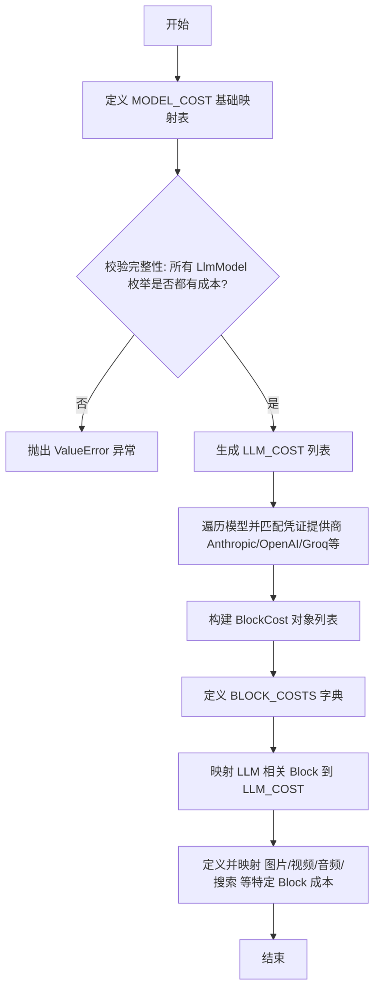

# `AutoGPT\autogpt_platform\backend\backend\data\block_cost_config.py` 详细设计文档

该文件是系统核心的成本配置中心，负责定义和管理各类AI模型及业务功能模块的执行积分成本。它通过字典映射为大语言模型（LLM）设定基础价格，并根据凭证提供商动态生成计费规则，最终将所有计算好的成本规则聚合到一个全局字典中，用于系统在执行具体Block时扣除相应的积分。

## 整体流程



## 类结构

```
BlockCosts Configuration (成本配置结构)
├── MODEL_COST (模型基础成本映射)
├── LLM_COST (LLM 动态生成的成本列表)
└── BLOCK_COSTS (全局 Block 成本字典)
    ├── Text & LLM (文本与对话)
    │   ├── AIConversationBlock
    │   ├── AITextGeneratorBlock
    │   └── ...
    ├── Image Generation (图像生成与编辑)
    │   ├── AIImageGeneratorBlock
    │   ├── AIImageEditorBlock
    │   └── IdeogramModelBlock
    ├── Video & Audio (视频与音频)
    │   ├── AIShortformVideoCreatorBlock
    │   ├── AIMusicGeneratorBlock
    │   └── UnrealTextToSpeechBlock
    ├── Data & Search (数据与搜索)
    │   ├── SearchTheWebBlock
    │   ├── SearchPeopleBlock
    │   └── ...
    └── Others (其他功能)
        ├── CodeGenerationBlock
        └── SmartDecisionMakerBlock
```

## 全局变量及字段


### `MODEL_COST`
    
A dictionary mapping specific LLM model identifiers to their corresponding integer cost values.

类型：`dict[LlmModel, int]`
    


### `LLM_COST`
    
A list of BlockCost objects that apply to LLM-related blocks, dynamically generated based on provider and model metadata.

类型：`list[BlockCost]`
    


### `BLOCK_COSTS`
    
A comprehensive registry mapping various Block classes to their specific cost configurations, including conditions like model type and credentials.

类型：`dict[Type[Block], list[BlockCost]]`
    


### `BlockCost.cost_type`
    
The type of operation the cost applies to (e.g., RUN).

类型：`BlockCostType`
    


### `BlockCost.cost_filter`
    
A dictionary of conditions (such as model name or credential ID) used to determine when this cost rule applies.

类型：`dict`
    


### `BlockCost.cost_amount`
    
The integer cost value associated with the block execution when the cost filter conditions are met.

类型：`int`
    
    

## 全局函数及方法


## 关键组件


### MODEL_COST 配置字典
定义了系统中各个大型语言模型（LLM）的基础运行成本，将模型枚举类型映射为具体的成本数值。

### 模型成本完整性校验逻辑
通过遍历 `LlmModel` 枚举，验证每个模型都在 `MODEL_COST` 中定义了成本，确保配置的完整性，缺失时抛出 ValueError。

### LLM_COST 动态生成列表
基于提供商元数据（如 Anthropic、OpenAI、Groq）和相应的凭证配置，将基础模型成本转换为包含特定凭证过滤器的 `BlockCost` 对象列表。

### BLOCK_COSTS 区块成本注册表
维护系统内所有 Block 类与其对应运行成本的映射关系，覆盖 LLM、图像生成、视频编辑、语音合成等多种 AI 功能模块的定价策略。


## 问题及建议


### 已知问题

-   **配置硬编码导致维护困难**：所有模型和 Block 的成本直接硬编码在 Python 代码中，一旦上游 API 价格变动或需要调整计费策略，必须修改代码并重新部署，缺乏灵活性。
-   **字符串匹配逻辑脆弱**：在构建 `LLM_COST` 列表时，依赖 `MODEL_METADATA[model].provider` 的字符串值（如 "anthropic", "openai"）进行匹配。如果 `MODEL_METADATA` 中的 Provider 命名发生变化，会导致对应模型的价格计算静默失效（成本变为 0），且难以在编译期发现。
-   **大量重复的样板代码**：凭证过滤器（`cost_filter` 中的 `credentials` 字典）结构在代码中重复出现数百次，不仅增加了文件体积，也增加了手动维护出错的风险（如复制粘贴时 ID 填错）。
-   **缺乏完整性与一致性校验**：虽然对 `MODEL_COST` 进行了完整性检查，但 `BLOCK_COSTS` 字典仅覆盖了部分已知 Block。如果新增 Block 忘记在此处配置，系统可能默认其免费或报错，缺少启动时的自动发现与校验机制。

### 优化建议

-   **配置外部化**：将成本数据迁移至数据库、Redis 或 JSON/YAML 配置文件中。支持运行时动态加载价格配置，实现无需重启服务的计费调整。
-   **引入工厂函数或辅助方法**：封装 `BlockCost` 和凭证过滤器的构建逻辑。例如定义一个 `create_creds_filter(credentials)` 函数或 `get_llm_costs()` 生成器，大幅减少重复代码，提高可读性。
-   **建立枚举或常量映射**：使用枚举类或常量定义 Provider 标识符，代替字符串字面量，确保 Provider 逻辑在代码层面的强类型一致性。
-   **增强启动校验机制**：在系统初始化阶段，自动扫描所有已注册的 Block 类，并检查 `BLOCK_COSTS` 是否包含所有 Block 的成本定义（或定义了默认策略），防止遗漏导致的计费漏洞。
-   **代码结构拆分**：考虑到文件长度和导入数量，建议按功能域（如 LLM、Image、Video）拆分为不同的配置模块或子文件，便于多人协作维护。


## 其它


### 设计目标与约束

**设计目标：**
1. **集中化成本管理**：建立一个统一的注册中心，用于定义和管理平台内所有 AI 模型调用及第三方服务集成（Block）的执行成本，以便于计费、配额控制和资源规划。
2. **细粒度成本映射**：支持基于特定模型、特定凭证提供商以及不同参数配置（如分辨率、模型版本）的差异化定价策略。
3. **配置完整性保障**：通过代码逻辑确保所有支持的 LLM 模型在配置文件中都有对应的成本定义，防止遗漏导致运行时计费错误。

**约束：**
1. **全覆盖性约束**：`MODEL_COST` 字典必须包含 `LlmModel` 枚举中的所有成员，否则模块加载将直接失败（抛出 ValueError）。
2. **数据类型约束**：所有成本值（`cost_amount`）必须为整数，代表平台内部的积分或计分单位。
3. **凭证依赖约束**：成本规则严格绑定特定的凭证 ID（`credentials.id`）和提供商类型，若底层凭证配置变更，必须同步更新成本配置中的匹配键。

### 错误处理与异常设计

**启动时完整性校验：**
代码在模块加载阶段执行预计算检查，采用“快速失败”（Fail-Fast）策略。
- **逻辑**：遍历 `LlmModel` 枚举的所有成员，检查其是否存在于 `MODEL_COST` 字典中。
- **异常抛出**：如果发现任何模型未定义成本，立即抛出 `ValueError` 异常，并附带缺失模型的名称。
- **目的**：避免在系统运行后、用户实际调用模型时才发现计费缺失，从而防止可能产生的免费资源滥用或计费混乱。

**异常示例**：
```python
raise ValueError(f"Missing MODEL_COST for model: {model}")
```

### 数据流与状态机

**数据流：**
该模块主要处理静态配置数据的聚合与转换，不涉及复杂的状态机流转。
1. **基础定义阶段**：导入各类 Block 类和凭证对象；定义 `MODEL_COST` 基础映射表。
2. **校验阶段**：执行枚举遍历，验证 `MODEL_COST` 的完整性。
3. **LLM 成本聚合阶段**：基于 `MODEL_COST` 和 `MODEL_METADATA` 中的提供商信息，结合特定的凭证结构，动态生成 `LLM_COST` 列表。
4. **全量成本构建阶段**：将动态生成的 LLM 成本规则与硬编码的非 LLM Block（如图片生成、视频制作）成本规则合并，构建最终的 `BLOCK_COSTS` 字典。
5. **对外输出阶段**：系统通过 `BLOCK_COSTS` 字典查询特定 Block 的计费规则。

**状态机：**
本模块为无状态的纯配置模块，数据在初始化完成后即变为静态只读状态。

### 外部依赖与接口契约

**外部依赖：**
1. **Block 模块**：依赖 `backend.blocks.*` 下的所有具体 Block 类（如 `AIConversationBlock`, `SearchTheWebBlock` 等）作为字典的键。
2. **枚举与模型定义**：依赖 `LlmModel`, `ImageGenModel`, `CodexModel` 等枚举类型用于标识具体模型。
3. **凭证存储**：依赖 `backend.integrations.credentials_store` 中的凭证实例（如 `openai_credentials`, `replicate_credentials`），利用其 ID 和 Provider 属性进行成本匹配。
4. **数据模型**：依赖 `backend.data.block` 中定义的 `Block`, `BlockCost`, `BlockCostType` 数据结构。

**接口契约：**
- **输入契约**：隐式要求 `LlmModel` 枚举和 `MODEL_METADATA` 提供准确的 `provider` 字段，以便正确路由到对应的凭证配置。
- **输出契约**：导出 `BLOCK_COSTS` 变量，其类型为 `Dict[Type[Block], List[BlockCost]]`。消费者（如计费服务）通过传入 Block 类及其执行参数（如 model 名称, credentials），使用列表匹配逻辑查找适用的 `BlockCost` 对象并获取 `cost_amount`。

### 扩展性设计

**新增模型支持：**
若需新增 LLM 模型，仅需在 `LlmModel` 枚举中添加定义，并在 `MODEL_COST` 字典中补充对应的整数值即可。现有的聚合逻辑会自动处理将该模型成本分发到对应提供商的 `LLM_COST` 列表中。

**新增 Block 支持：**
若需为非 LLM 类型的 Block（例如新的视频编辑 Block）添加计费，需要在 `BLOCK_COSTS` 字典中添加以该 Block 类为键的新条目，并定义一系列 `BlockCost` 对象来区分不同参数（如不同的画质或时长）的费率。
</content>
    