# `.\AutoGPT\autogpt_platform\backend\backend\data\credit.py` 详细设计文档

该代码实现了一个综合的用户信用管理系统，支持信用的消费、充值、退款、争议处理以及基于 Stripe 的支付集成，同时利用策略模式通过特性开关在不同版本（正式版、Beta测试版、禁用版）之间切换逻辑。

## 整体流程

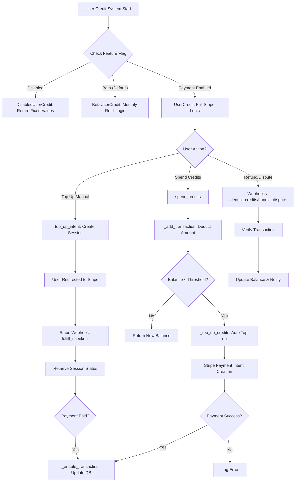

## 类结构

```
UsageTransactionMetadata (Pydantic Model)
UserCreditBase (Abstract Base Class)
├── UserCredit (Implementation)
│   └── BetaUserCredit (Inherits UserCredit)
└── DisabledUserCredit (Implementation)
```

## 全局变量及字段


### `settings`
    
The global settings object containing application configuration and secrets.

类型：`Settings`
    


### `logger`
    
The standard Python logger instance for this module, used for recording operational information and errors.

类型：`Logger`
    


### `base_url`
    
The base URL for the application, derived from frontend or platform configuration, used for payment redirects.

类型：`str`
    


### `POSTGRES_INT_MAX`
    
The maximum value for a 32-bit signed integer in PostgreSQL (2147483647).

类型：`int`
    


### `POSTGRES_INT_MIN`
    
The minimum value for a 32-bit signed integer in PostgreSQL (-2147483648).

类型：`int`
    


### `UsageTransactionMetadata.graph_exec_id`
    
The unique identifier of the graph execution session associated with the credit transaction.

类型：`str | None`
    


### `UsageTransactionMetadata.graph_id`
    
The unique identifier of the graph being executed.

类型：`str | None`
    


### `UsageTransactionMetadata.node_id`
    
The unique identifier of the specific node within the graph.

类型：`str | None`
    


### `UsageTransactionMetadata.node_exec_id`
    
The unique identifier of the specific execution instance of a node.

类型：`str | None`
    


### `UsageTransactionMetadata.block_id`
    
The unique identifier of the block being executed.

类型：`str | None`
    


### `UsageTransactionMetadata.block`
    
The name or type of the block being executed.

类型：`str | None`
    


### `UsageTransactionMetadata.input`
    
The input data provided to the block or node during execution.

类型：`dict[str, Any] | None`
    


### `UsageTransactionMetadata.reason`
    
A textual description explaining the reason or context for the transaction.

类型：`str | None`
    


### `BetaUserCredit.num_user_credits_refill`
    
The specific amount of credits allocated to a beta user for the monthly refill.

类型：`int`
    
    

## 全局函数及方法


### `get_user_credit_model`

根据系统配置和LaunchDarkly功能标志，为指定用户获取适当的信用模型实例的工厂函数。

参数：

- `user_id`：`str`，需要确定信用模型的用户ID，用于检查功能标志。

返回值：`UserCreditBase`，返回符合该用户信用逻辑策略的信用模型实例（可能是标准付费模型、Beta月度充值模型或禁用信用模型）。

#### 流程图

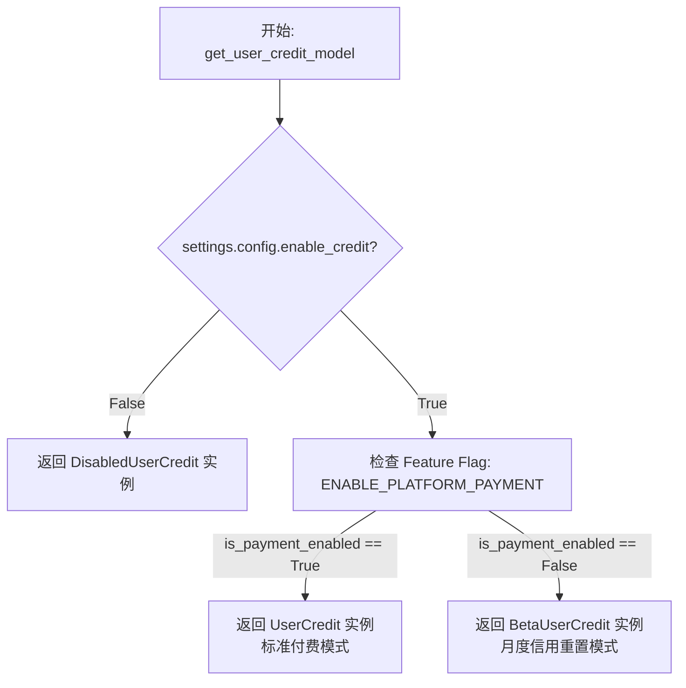

#### 带注释源码

```python
async def get_user_credit_model(user_id: str) -> UserCreditBase:
    """
    Get the credit model for a user, considering LaunchDarkly flags.

    Args:
        user_id (str): The user ID to check flags for.

    Returns:
        UserCreditBase: The appropriate credit model for the user
    """
    # 检查全局配置是否启用了信用系统
    if not settings.config.enable_credit:
        # 如果未启用，返回一个禁用的信用模型实例，通常返回固定余额或禁用操作
        return DisabledUserCredit()

    # 检查 LaunchDarkly 功能标志，判断该用户是否属于支付试点用户
    # 默认值为 False (保持Beta月度信用行为) 以维持当前行为
    is_payment_enabled = await is_feature_enabled(
        Flag.ENABLE_PLATFORM_PAYMENT, user_id, default=False
    )

    if is_payment_enabled:
        # 支付已启用的用户获得 UserCredit (无月度充值，启用支付)
        return UserCredit()
    else:
        # 默认行为：用户获得 Beta 月度信用
        return BetaUserCredit(settings.config.num_user_credits_refill)
```


### `get_block_costs`

获取系统中所有预定义块的配置信息，并返回一个以块ID为键、成本配置列表为值的字典映射。

参数：

*   无

返回值：`dict[str, list["BlockCost"]]`，包含所有Block ID及其对应成本配置列表的字典。

#### 流程图

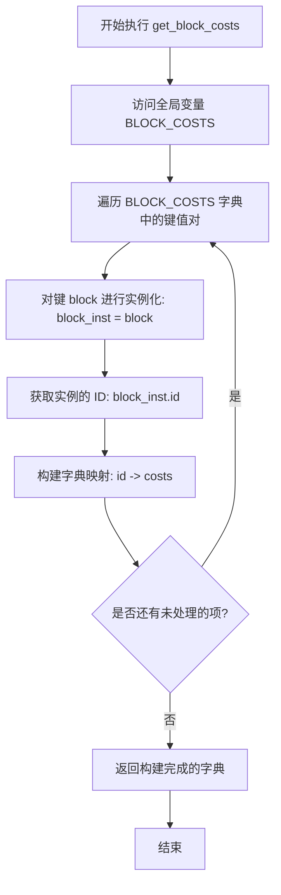

#### 带注释源码

```python
def get_block_costs() -> dict[str, list["BlockCost"]]:
    """
    Retrieves the cost configurations for all blocks.
    
    Returns:
        dict[str, list["BlockCost"]]: A dictionary mapping block IDs to their costs.
    """
    # 遍历全局配置变量 BLOCK_COSTS (字典类型)
    # key (block) 是 Block 的类定义，value (costs) 是对应的成本列表
    # 通过 block() 实例化类并访问 .id 属性获取字符串形式的块 ID
    # 最终返回格式为 {"block_id_1": [cost_obj1, ...], "block_id_2": [...]} 的字典
    return {block().id: costs for block, costs in BLOCK_COSTS.items()}
```


### `get_block_cost`

根据给定的 Block 实例，从全局配置中检索该类型 Block 的成本配置列表。如果该 Block 类型未在配置中定义，则返回空列表。

参数：

- `block`：`Block`，Block 实例或类引用，用于标识要查询成本的 Block 类型。

返回值：`list["BlockCost"]`，与该 Block 类型关联的成本配置对象列表，如果未找到则返回空列表。

#### 流程图

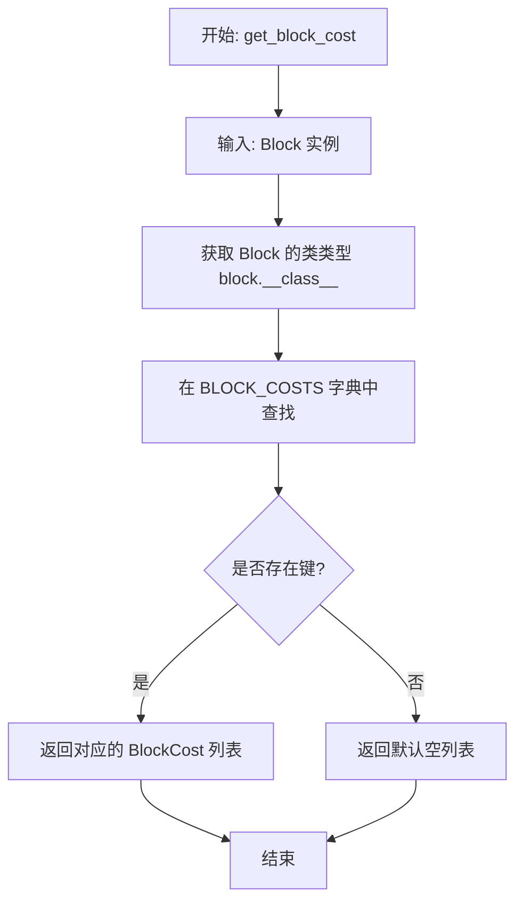

#### 带注释源码

```python
def get_block_cost(block: "Block") -> list["BlockCost"]:
    """
    Retrieves the cost configuration for a specific block instance.

    Args:
        block: An instance of a Block class.

    Returns:
        A list of BlockCost objects associated with the block's class.
        Returns an empty list if the block type is not defined in the config.
    """
    # Use the block's class (type) as the key to look up costs in the global dictionary.
    # If the block type is not found, default to an empty list.
    return BLOCK_COSTS.get(block.__class__, [])
```


### `get_stripe_customer_id`

获取指定用户的 Stripe Customer ID。如果用户数据库记录中已存在该 ID，则直接返回；如果不存在，则在 Stripe 中创建一个新的 Customer，并将新创建的 ID 更新到用户数据库记录中，然后返回该 ID。

参数：

-   `user_id`：`str`，用户的唯一标识符

返回值：`str`，Stripe Customer ID

#### 流程图

```mermaid
graph TD
    A[开始: get_stripe_customer_id] --> B[通过 get_user_by_id 获取用户信息]
    B --> C{用户是否已存在 stripe_customer_id?}
    C -- 是 --> D[返回已存在的 user.stripe_customer_id]
    C -- 否 --> E[调用 stripe.Customer.create 创建新客户]
    E --> F[通过 User.prisma().update 更新数据库记录]
    F --> G[返回新创建的 customer.id]
    D --> H[结束]
    G --> H
```

#### 带注释源码

```python
async def get_stripe_customer_id(user_id: str) -> str:
    # 1. 从数据库获取用户信息
    user = await get_user_by_id(user_id)

    # 2. 检查用户是否已经关联了 Stripe Customer ID
    if user.stripe_customer_id:
        # 如果存在，直接返回该 ID
        return user.stripe_customer_id

    # 3. 如果不存在，在 Stripe 端创建一个新的 Customer 对象
    customer = stripe.Customer.create(
        name=user.name or "",
        email=user.email,
        metadata={"user_id": user_id},
    )
    
    # 4. 将新生成的 Stripe Customer ID 更新到数据库的 User 记录中
    await User.prisma().update(
        where={"id": user_id}, data={"stripeCustomerId": customer.id}
    )
    
    # 5. 返回新创建的 Customer ID
    return customer.id
```


### `set_auto_top_up`

该函数用于更新指定用户的自动充值配置，将新的配置设置（包含充值阈值和金额）序列化并保存到数据库中。

参数：

- `user_id`：`str`，需要设置自动充值的用户ID。
- `config`：`AutoTopUpConfig`，包含自动充值设置的对象，包含阈值（threshold）和充值金额（amount）等信息。

返回值：`None`，表示操作完成，无返回数据。

#### 流程图

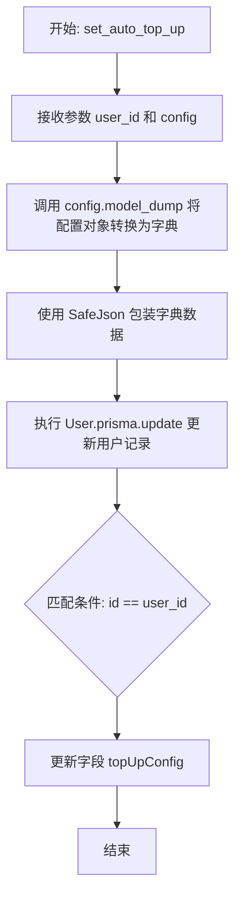

#### 带注释源码

```python
async def set_auto_top_up(user_id: str, config: AutoTopUpConfig):
    # 使用 Prisma ORM 更新 User 表
    await User.prisma().update(
        # 查找条件：用户ID匹配
        where={"id": user_id},
        # 更新数据：
        data={
            # 将 AutoTopUpConfig 对象转换为字典，并用 SafeJson 包装以确保 JSON 兼容性和安全性，
            # 然后更新到 topUpConfig 字段
            "topUpConfig": SafeJson(config.model_dump())
        },
    )
```


### `get_auto_top_up`

根据用户ID获取用户的自动充值配置。如果用户未配置自动充值，则返回默认配置（阈值和金额均为0）。

参数：

-  `user_id`：`str`，用户的唯一标识符

返回值：`AutoTopUpConfig`，用户的自动充值配置对象，包含充值阈值和充值金额。

#### 流程图

```mermaid
flowchart TD
    A[开始: get_auto_top_up] --> B[调用 get_user_by_id 获取用户信息]
    B --> C{检查 user.top_up_config 是否存在}
    C -- 不存在/为空 --> D[返回默认配置 AutoTopUpConfig<br/>(threshold=0, amount=0)]
    C -- 存在 --> E[调用 AutoTopUpConfig.model_validate<br/>解析并返回配置]
    D --> F[结束]
    E --> F
```

#### 带注释源码

```python
async def get_auto_top_up(user_id: str) -> AutoTopUpConfig:
    # 根据提供的 user_id 从数据库获取用户信息
    user = await get_user_by_id(user_id)

    # 检查用户的自动充值配置是否存在
    if not user.top_up_config:
        # 如果不存在，返回一个默认的配置对象，阈值和金额均设为0
        return AutoTopUpConfig(threshold=0, amount=0)

    # 如果存在，使用 Pydantic 模型的 model_validate 方法
    # 解析并验证数据库中存储的配置数据，然后返回
    return AutoTopUpConfig.model_validate(user.top_up_config)
```


### `admin_get_user_history`

该函数用于管理员查询用户的交易历史记录，支持分页、关键字搜索（按用户ID、邮箱或姓名）以及交易类型过滤，并返回包含用户当前余额和分页信息的详细响应。

参数：

- `page`：`int`，当前页码，默认为1。
- `page_size`：`int`，每页显示的记录数，默认为20。
- `search`：`str | None`，搜索关键字，用于匹配用户ID、用户邮箱或用户姓名，默认为None。
- `transaction_filter`：`CreditTransactionType | None`，交易类型过滤器，用于筛选特定类型的交易记录，默认为None。

返回值：`UserHistoryResponse`，包含交易历史列表（含用户当前余额、关联管理员信息等）及分页元数据的响应对象。

#### 流程图

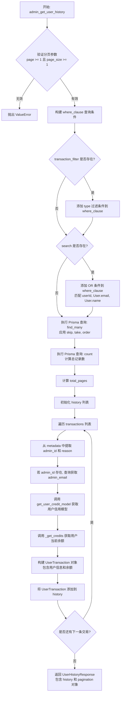

#### 带注释源码

```python
async def admin_get_user_history(
    page: int = 1,
    page_size: int = 20,
    search: str | None = None,
    transaction_filter: CreditTransactionType | None = None,
) -> UserHistoryResponse:
    # 1. 输入验证：确保分页参数有效
    if page < 1 or page_size < 1:
        raise ValueError("Invalid pagination input")

    # 2. 构建数据库查询的过滤条件
    where_clause: CreditTransactionWhereInput = {}
    
    # 如果指定了交易类型，添加类型过滤
    if transaction_filter:
        where_clause["type"] = transaction_filter
    
    # 如果指定了搜索关键字，添加多字段的模糊匹配过滤
    if search:
        where_clause["OR"] = [
            {"userId": {"contains": search, "mode": "insensitive"}},
            {"User": {"is": {"email": {"contains": search, "mode": "insensitive"}}}},
            {"User": {"is": {"name": {"contains": search, "mode": "insensitive"}}}},
        ]
    
    # 3. 从数据库获取交易记录，包含分页、排序及关联的用户信息
    transactions = await CreditTransaction.prisma().find_many(
        where=where_clause,
        skip=(page - 1) * page_size,
        take=page_size,
        include={"User": True},
        order={"createdAt": "desc"},
    )
    
    # 4. 获取符合条件的总记录数，用于计算分页元数据
    total = await CreditTransaction.prisma().count(where=where_clause)
    total_pages = (total + page_size - 1) // page_size

    history = []
    
    # 5. 遍历交易记录，构建响应数据
    for tx in transactions:
        admin_id = ""
        admin_email = ""
        reason = ""

        # 提取元数据，主要包含管理员操作信息
        metadata: dict = cast(dict, tx.metadata) or {}

        if metadata:
            admin_id = metadata.get("admin_id")
            # 如果存在管理员ID，查询获取管理员邮箱
            admin_email = (
                (await get_user_email_by_id(admin_id) or f"Unknown Admin: {admin_id}")
                if admin_id
                else ""
            )
            reason = metadata.get("reason", "No reason provided")

        # 获取该用户对应的信用模型，用于计算当前余额
        user_credit_model = await get_user_credit_model(tx.userId)
        balance, _ = await user_credit_model._get_credits(tx.userId)

        # 构建单个用户交易对象并加入列表
        history.append(
            UserTransaction(
                transaction_key=tx.transactionKey,
                transaction_time=tx.createdAt,
                transaction_type=tx.type,
                amount=tx.amount,
                current_balance=balance, # 当前实时余额
                running_balance=tx.runningBalance or 0, # 交易发生时的余额
                user_id=tx.userId,
                # 优先使用关联查询的用户邮箱，否则回退查库
                user_email=(
                    tx.User.email
                    if tx.User
                    else (await get_user_by_id(tx.userId)).email
                ),
                reason=reason,
                admin_email=admin_email,
                extra_data=str(metadata),
            )
        )
    
    # 6. 返回包含历史记录和分页信息的响应对象
    return UserHistoryResponse(
        history=history,
        pagination=Pagination(
            total_items=total,
            total_pages=total_pages,
            current_page=page,
            page_size=page_size,
        ),
    )
```


### `UserCreditBase.get_credits`

该方法是一个抽象方法，定义在 `UserCreditBase` 基类中，用于强制要求子类（如 `UserCredit` 或 `BetaUserCredit`）实现获取特定用户当前信用积分额度的逻辑。它定义了获取用户积分的统一接口规范。

参数：

- `user_id`：`str`，用户的唯一标识符，用于查询指定用户的积分。

返回值：`int`，用户当前的信用积分数量。

#### 流程图

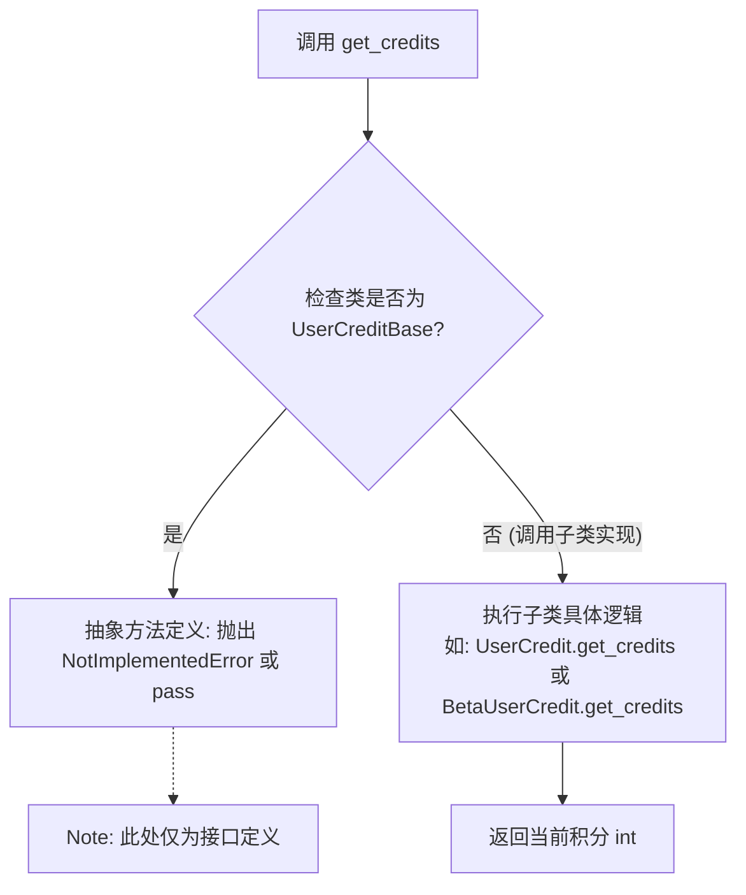

#### 带注释源码

```python
    @abstractmethod  # 声明为抽象方法，任何继承自 UserCreditBase 的子类必须实现此方法
    async def get_credits(self, user_id: str) -> int:
        """
        Get the current credits for the user.

        Returns:
            int: The current credits for the user.
        """
        pass  # 基类中不包含具体实现逻辑，逻辑由具体的子类（如 UserCredit）提供
```


### `UserCreditBase.get_transaction_history`

该方法是用户信用系统中的抽象接口，用于定义获取用户信用交易历史记录的契约。子类必须实现此方法以提供具体的查询逻辑，支持根据交易数量限制、时间上限和交易类型进行筛选。

参数：

-  `self`：`UserCreditBase`，类的实例。
-  `user_id`：`str`，用户的唯一标识ID。
-  `transaction_count_limit`：`int`，获取交易记录的最大数量限制。
-  `transaction_time_ceiling`：`datetime | None`，交易时间的上限（截止时间），可选参数，用于查询特定时间点之前的记录。
-  `transaction_type`：`str | None`，交易类型的过滤器，可选参数，用于筛选特定类型的交易。

返回值：`TransactionHistory`，包含用户的信用交易记录列表及分页/时间游标信息的对象。

#### 流程图

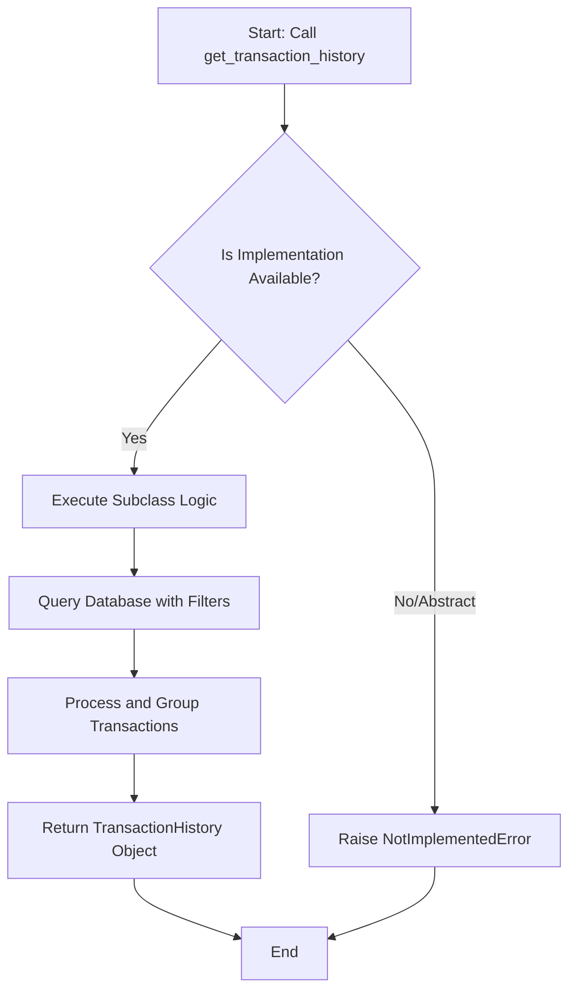

#### 带注释源码

```python
    @abstractmethod
    async def get_transaction_history(
        self,
        user_id: str,
        transaction_count_limit: int,
        transaction_time_ceiling: datetime | None = None,
        transaction_type: str | None = None,
    ) -> TransactionHistory:
        """
        Get the credit transactions for the user.

        Args:
            user_id (str): The user ID.
            transaction_count_limit (int): The transaction count limit.
            transaction_time_ceiling (datetime): The upper bound of the transaction time.
            transaction_type (str): The transaction type filter.

        Returns:
            TransactionHistory: The credit transactions for the user.
        """
        pass
```


### `UserCreditBase.get_refund_requests`

获取指定用户的退款请求列表，按创建时间倒序排列，并限制返回数量。

参数：

- `user_id`：`str`，用户的唯一标识符。
- `limit`：`int`，获取退款请求的最大数量限制，默认值为 `MAX_CREDIT_REFUND_REQUESTS_FETCH`。

返回值：`list[RefundRequest]`，包含用户退款请求详细信息的列表。

#### 流程图

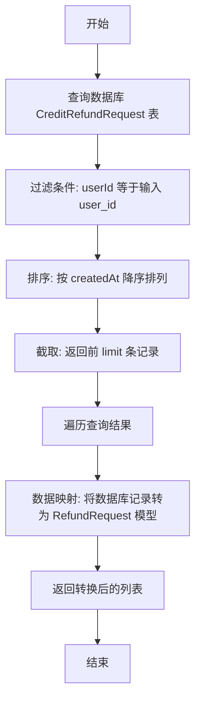

#### 带注释源码

```python
async def get_refund_requests(
    self, user_id: str, limit: int = MAX_CREDIT_REFUND_REQUESTS_FETCH
) -> list[RefundRequest]:
    # 使用 Prisma 客户端查询数据库中的退款请求记录
    # find_many: 查找多条记录
    return [
        # 将每条数据库记录 (CreditRefundRequest) 转换为 RefundRequest 数据模型
        RefundRequest(
            id=r.id,
            user_id=r.userId,
            transaction_key=r.transactionKey,
            amount=r.amount,
            reason=r.reason,
            result=r.result,
            status=r.status,
            created_at=r.createdAt,
            updated_at=r.updatedAt,
        )
        # 遍历查询结果
        for r in await CreditRefundRequest.prisma().find_many(
            where={"userId": user_id},  # 过滤条件：匹配当前用户 ID
            order={"createdAt": "desc"}, # 排序条件：按创建时间倒序（最新的在前）
            take=limit,                  # 数量限制：只取指定数量的记录
        )
    ]
```


### `UserCredit.spend_credits`

消耗用户的积分数额，记录消费交易，并根据配置的阈值在余额不足时触发自动充值功能。

参数：

-  `user_id`：`str`，执行消费操作的用户ID。
-  `cost`：`int`，需要消耗的积分数额（正整数）。
-  `metadata`：`UsageTransactionMetadata`，包含消费上下文的元数据（如执行图ID、节点ID、输入数据等）。

返回值：`int`，消费操作完成后的剩余积分余额。

#### 流程图

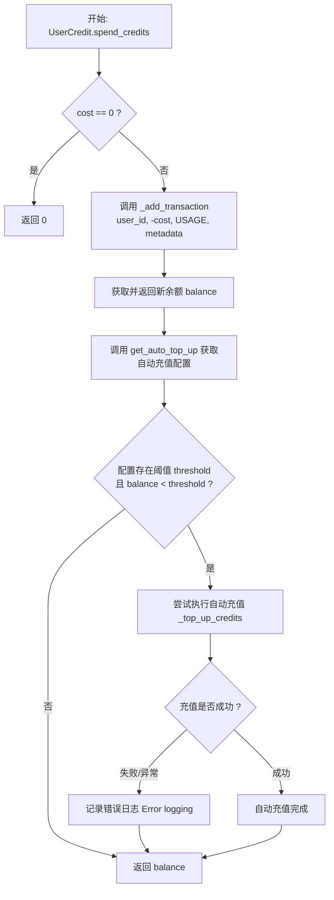

#### 带注释源码

```python
    async def spend_credits(
        self,
        user_id: str,
        cost: int,
        metadata: UsageTransactionMetadata,
    ) -> int:
        # 如果消费金额为0，直接返回，避免不必要的数据库操作
        if cost == 0:
            return 0

        # 调用内部方法 _add_transaction 扣除积分
        # amount 为 -cost (负数表示支出)
        # 类型为 USAGE (使用类交易)
        balance, _ = await self._add_transaction(
            user_id=user_id,
            amount=-cost,
            transaction_type=CreditTransactionType.USAGE,
            metadata=SafeJson(metadata.model_dump()),
        )

        # 检查是否需要自动充值
        # 获取用户的自动充值配置
        auto_top_up = await get_auto_top_up(user_id)
        
        # 如果配置了阈值，且当前余额低于该阈值
        if auto_top_up.threshold and balance < auto_top_up.threshold:
            try:
                # 执行自动充值
                # 使用 graph_exec_id 生成唯一键，防止同一图执行中重复充值
                # ceiling_balance 设置为阈值，防止充值过度
                await self._top_up_credits(
                    user_id=user_id,
                    amount=auto_top_up.amount,
                    # Avoid multiple auto top-ups within the same graph execution.
                    key=f"AUTO-TOP-UP-{user_id}-{metadata.graph_exec_id}",
                    ceiling_balance=auto_top_up.threshold,
                    top_up_type=TopUpType.AUTO,
                )
            except Exception as e:
                # 自动充值失败不应影响主流程（消费已成功），仅记录日志
                # Failed top-up is not critical, we can move on.
                logger.error(
                    f"Auto top-up failed for user {user_id}, balance: {balance}, amount: {auto_top_up.amount}, error: {e}"
                )

        # 返回消费后的余额
        return balance
```


### `UserCreditBase.top_up_credits`

该方法是 `UserCreditBase` 抽象基类中定义的一个抽象方法，用于声明给用户账户充值积分的契约。具体的充值逻辑（如支付处理、余额更新等）必须由继承该基类的子类（如 `UserCredit`）实现。

参数：

-  `user_id`：`str`，需要进行充值操作的用户唯一标识符。
-  `amount`：`int`，需要充值的积分数量。

返回值：`None`，该方法未指定返回类型，默认为 None。

#### 流程图

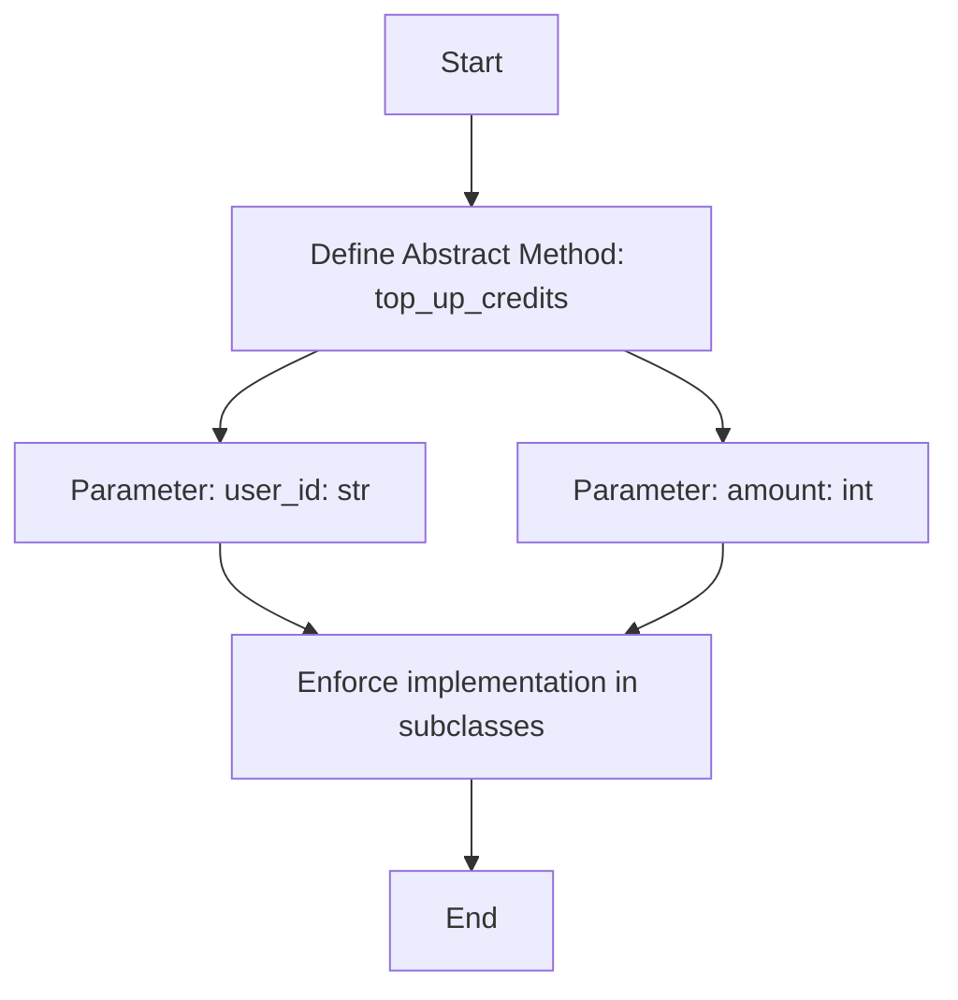

#### 带注释源码

```python
    @abstractmethod
    async def top_up_credits(self, user_id: str, amount: int):
        """
        Top up the credits for the user.

        Args:
            user_id (str): The user ID.
            amount (int): The amount to top up.
        """
        pass
```


### `UserCreditBase.onboarding_reward`

这是一个抽象方法，用于定义用户完成入职步骤后获得积分奖励的契约。它规定了如果用户已经因为该步骤获得过积分，则不应重复奖励。

参数：

- `user_id`：`str`，用户ID。
- `credits`：`int`，奖励的积分数量。
- `step`：`OnboardingStep`，已完成的入职步骤枚举值。

返回值：`bool`，如果成功奖励返回 `True`，如果用户已经因该步骤获得过奖励则返回 `False`。

#### 流程图

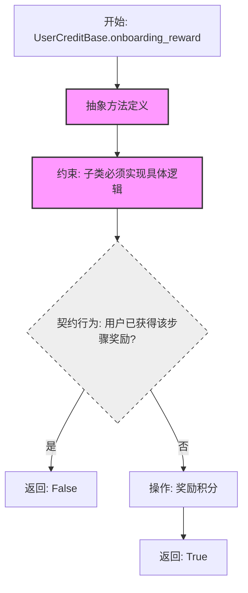

#### 带注释源码

```python
    @abstractmethod
    async def onboarding_reward(
        self, user_id: str, credits: int, step: OnboardingStep
    ) -> bool:
        """
        Reward the user with credits for completing an onboarding step.
        Won't reward if the user has already received credits for the step.

        Args:
            user_id (str): The user ID.
            credits (int): The amount to reward.
            step (OnboardingStep): The onboarding step.

        Returns:
            bool: True if rewarded, False if already rewarded.
        """
        pass
```


### `UserCredit.top_up_intent`

创建一个 Stripe Checkout Session，用于用户充值积分。该方法会验证充值金额是否有效（至少500且为100的倍数），生成 Stripe 托管支付会话，并在数据库中预先创建一个非活跃的交易记录（待支付成功后激活），最后返回 Stripe 支付页面的 URL。

参数：

-   `user_id`：`str`，用户 ID，用于获取对应的 Stripe 客户 ID 和记录交易归属。
-   `amount`：`int`，充值积分的数量（作为最小货币单位处理，如美分）。

返回值：`str`，Stripe Checkout Session 的 URL，用于将用户重定向至支付页面。

#### 流程图

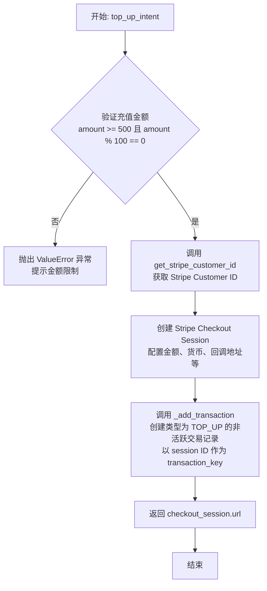

#### 带注释源码

```python
    async def top_up_intent(self, user_id: str, amount: int) -> str:
        # 验证充值金额：最小值为500，且必须是100的倍数
        if amount < 500 or amount % 100 != 0:
            raise ValueError(
                f"Top up amount must be at least 500 credits and multiple of 100 but is {amount}"
            )

        # 创建 Stripe Checkout Session
        # 文档参考: https://docs.stripe.com/checkout/quickstart?client=react
        # unit_amount 参数总是使用最小货币单位（对于美元即美分），这正好等于积分数 amount
        checkout_session = stripe.checkout.Session.create(
            customer=await get_stripe_customer_id(user_id), # 关联 Stripe 客户
            line_items=[
                {
                    "price_data": {
                        "currency": "usd",
                        "product_data": {
                            "name": "AutoGPT Platform Credits", # 产品名称显示在账单上
                        },
                        "unit_amount": amount, # 金额/积分
                    },
                    "quantity": 1,
                }
            ],
            mode="payment", # 支付模式
            ui_mode="hosted", # 托管支付页模式
            payment_intent_data={"setup_future_usage": "off_session"}, # 允许未来离线使用（用于自动扣款等）
            saved_payment_method_options={"payment_method_save": "enabled"}, # 允许保存支付方式
            success_url=base_url + "/profile/credits?topup=success", # 支付成功回跳地址
            cancel_url=base_url + "/profile/credits?topup=cancel",   # 支付取消回跳地址
            allow_promotion_codes=True, # 允许使用优惠码
        )

        # 在数据库中创建一条交易记录
        # 注意：此时 is_active=False，因为用户尚未完成支付
        # transaction_key 使用 checkout_session.id，以便后续 fulfill_checkout 通过 ID 匹配并激活
        await self._add_transaction(
            user_id=user_id,
            amount=amount,
            transaction_type=CreditTransactionType.TOP_UP,
            transaction_key=checkout_session.id,
            is_active=False,
            metadata=SafeJson(checkout_session),
        )

        # 返回 Stripe 托管页面的 URL，前端将其用于重定向
        return checkout_session.url or ""
```


### `UserCredit.top_up_refund`

处理用户针对特定充值交易发起的退款请求。该方法首先验证交易的有效性，检查是否已存在退款请求，接着根据当前余额与退款金额的差值判断是自动执行 Stripe 退款还是标记为需要人工审核，并发送相应的通知。

参数：

- `user_id`：`str`，发起退款的用户 ID。
- `transaction_key`：`str`，需要被退款的原充值交易的唯一标识键。
- `metadata`：`dict[str, str]`，与此次退款操作相关的元数据（如原因等）。

返回值：`int`，实际退款的金额。如果退款请求被标记为待人工审核，则返回 0。

#### 流程图

```mermaid
graph TD
    A[开始: top_up_refund] --> B[查询 CreditTransaction 交易记录]
    B --> C{交易是否存在且有效?}
    C -- 否 --> D[隐式抛出 find_first_or_raise 异常]
    C -- 是 --> E[获取用户当前余额]
    E --> F[生成退款请求唯一键 refund_key]
    F --> G[创建 CreditRefundRequest 记录]
    G --> H{是否发生唯一性冲突?}
    H -- 是 --> I[抛出 ValueError: 重复请求]
    H -- 否 --> J{amount - balance > tolerance?}
    J -- 是 (余额消耗较大) --> K[发送 REFUND_REQUEST 通知]
    K --> L[返回 0 (待人工审核)]
    J -- 否 (余额充足) --> M[调用 stripe.Refund.create 创建退款]
    M --> N[返回 refund.amount]
```

#### 带注释源码

```python
    async def top_up_refund(
        self, user_id: str, transaction_key: str, metadata: dict[str, str]
    ) -> int:
        # 1. 查找有效的充值交易记录，如果找不到则抛出异常
        transaction = await CreditTransaction.prisma().find_first_or_raise(
            where={
                "transactionKey": transaction_key,
                "userId": user_id,
                "isActive": True,
                "type": CreditTransactionType.TOP_UP,
            }
        )
        
        # 2. 获取用户当前的信用余额
        balance = await self.get_credits(user_id)
        # 3. 获取原交易金额
        amount = transaction.amount
        
        # 4. 生成退款请求的唯一键，基于时间格式和用户ID，防止同一周期内重复请求
        refund_key_format = settings.config.refund_request_time_key_format
        refund_key = f"{transaction.createdAt.strftime(refund_key_format)}-{user_id}"

        try:
            # 5. 尝试创建退款请求记录
            refund_request = await CreditRefundRequest.prisma().create(
                data=CreditRefundRequestCreateInput(
                    id=refund_key,
                    transactionKey=transaction_key,
                    userId=user_id,
                    amount=amount,
                    reason=metadata.get("reason", ""),
                    status=CreditRefundRequestStatus.PENDING,
                    result="The refund request is under review.",
                )
            )
        except UniqueViolationError:
            # 如果捕获到唯一性约束违反错误，说明该用户在此时间段内已经对该交易申请过退款
            raise ValueError(
                "Unable to request a refund for this transaction, the request of the top-up transaction within the same week has already been made."
            )

        # 6. 判断退款逻辑：
        # 如果 (原充值金额 - 当前余额) 超过了容差阈值，
        # 意味着用户已经使用了大部分额度，需要人工介入审核以防止滥用。
        if amount - balance > settings.config.refund_credit_tolerance_threshold:
            user_data = await get_user_by_id(user_id)
            # 发送需要人工审核的通知
            await self._send_refund_notification(
                RefundRequestData(
                    user_id=user_id,
                    user_name=user_data.name or "AutoGPT Platform User",
                    user_email=user_data.email,
                    transaction_id=transaction_key,
                    refund_request_id=refund_request.id,
                    reason=refund_request.reason,
                    amount=amount,
                    balance=balance,
                ),
                NotificationType.REFUND_REQUEST,
            )
            return 0  # 返回 0 表示仅注册了请求，未立即执行退款

        # 7. 如果余额充足（在阈值内），自动通过 Stripe 执行退款
        refund = stripe.Refund.create(payment_intent=transaction_key, metadata=metadata)
        return refund.amount
```


### `UserCredit.deduct_credits`

该方法用于处理因 Stripe 退款或争议（Dispute）而扣除用户积分的逻辑。它首先验证请求的状态是否为最终成功状态，检索原始的充值交易记录，通过添加一笔负额度的退款交易来减少用户余额，同时更新相关的退款请求状态，并向用户发送通知。

参数：

-   `request`：`stripe.Refund | stripe.Dispute`，触发积分扣除的 Stripe 退款对象或争议对象。

返回值：`None`，无返回值。

#### 流程图

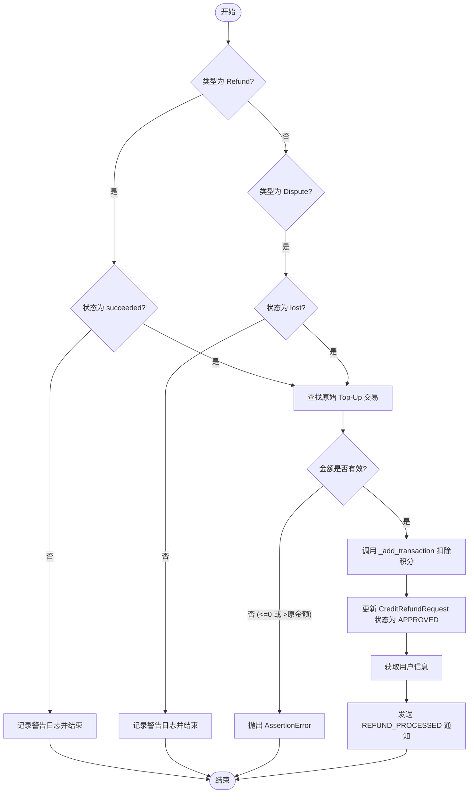

#### 带注释源码

```python
    async def deduct_credits(self, request: stripe.Refund | stripe.Dispute):
        # 如果是退款对象，仅处理状态为 succeeded（成功）的退款
        if isinstance(request, stripe.Refund) and request.status != "succeeded":
            logger.warning(
                f"Skip processing refund #{request.id} with status {request.status}"
            )
            return

        # 如果是争议对象，仅处理状态为 lost（输掉争议，即需要退款）的情况
        if isinstance(request, stripe.Dispute) and request.status != "lost":
            logger.warning(
                f"Skip processing dispute #{request.id} with status {request.status}"
            )
            return

        # 根据支付意图ID（payment_intent）查找对应的原始有效充值交易记录
        transaction = await CreditTransaction.prisma().find_first_or_raise(
            where={
                "transactionKey": str(request.payment_intent),
                "isActive": True,
                "type": CreditTransactionType.TOP_UP,
            }
        )
        
        # 校验退款/争议金额：必须大于0且不能超过原始交易金额
        if request.amount <= 0 or request.amount > transaction.amount:
            raise AssertionError(
                f"Invalid amount to deduct ${request.amount/100} from ${transaction.amount/100} top-up"
            )

        # 创建一笔负金额的交易来扣除用户积分
        # fail_insufficient_credits=False 表示即使余额不足也要扣除（因为钱已经被Stripe收回）
        balance, _ = await self._add_transaction(
            user_id=transaction.userId,
            amount=-request.amount,
            transaction_type=CreditTransactionType.REFUND,
            transaction_key=request.id,
            metadata=SafeJson(request),
            fail_insufficient_credits=False,
        )

        # 如果存在对应的退款请求记录，将其状态更新为 APPROVED（已批准）
        await CreditRefundRequest.prisma().update_many(
            where={
                "userId": transaction.userId,
                "transactionKey": transaction.transactionKey,
            },
            data={
                "amount": request.amount,
                "status": CreditRefundRequestStatus.APPROVED,
                "result": "The refund request has been approved, the amount will be credited back to your account.",
            },
        )

        # 获取用户数据并发送退款已处理的通知
        user_data = await get_user_by_id(transaction.userId)
        await self._send_refund_notification(
            RefundRequestData(
                user_id=user_data.id,
                user_name=user_data.name or "AutoGPT Platform User",
                user_email=user_data.email,
                transaction_id=transaction.transactionKey,
                refund_request_id=request.id,
                reason=str(request.reason or "-"),
                amount=transaction.amount,
                balance=balance,
            ),
            NotificationType.REFUND_PROCESSED,
        )
```


### `UserCredit.handle_dispute`

该方法是 `UserCreditBase.handle_dispute` 的具体实现，用于处理来自 Stripe 的支付争议（Dispute）。系统会根据用户当前的信用余额决定处理策略：如果余额充足，直接接受争议以减少运营成本；如果余额不足，则检索用户的使用记录，构建详细的证据文本提交给 Stripe 进行抗辩，以证明服务已交付。

**参数：**

-   `dispute`：`stripe.Dispute`，Stripe 传入的争议请求对象，包含争议详情、涉及的支付意图 ID（payment_intent）及争议金额。

**返回值：** `None`，该方法执行数据库查询、日志记录和外部 API 调用，没有返回值。

#### 流程图

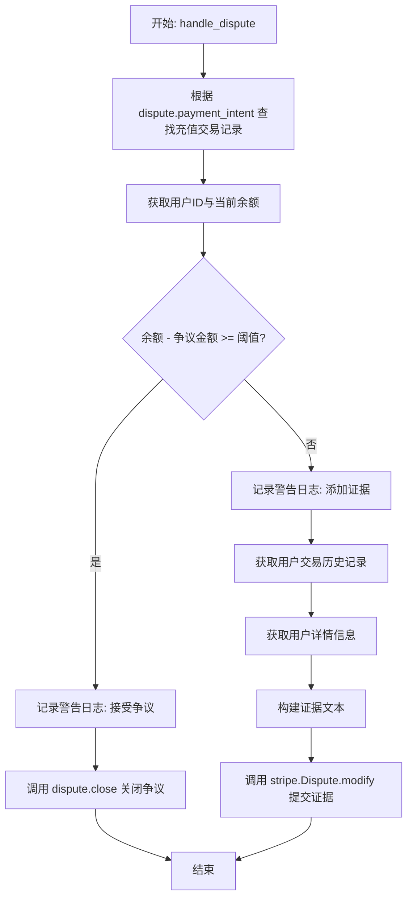

#### 带注释源码

```python
    async def handle_dispute(self, dispute: stripe.Dispute):
        # 1. 查找与该争议 Payment Intent 关联的活跃充值交易记录
        transaction = await CreditTransaction.prisma().find_first_or_raise(
            where={
                "transactionKey": str(dispute.payment_intent),
                "isActive": True,
                "type": CreditTransactionType.TOP_UP,
            }
        )
        user_id = transaction.userId
        amount = dispute.amount
        balance = await self.get_credits(user_id)

        # 2. 判断策略：如果用户余额足够覆盖争议金额，直接接受争议（让用户赢）
        # 这样做可以避免人工处理争议的成本
        if balance - amount >= settings.config.refund_credit_tolerance_threshold:
            logger.warning(f"Accepting dispute from {user_id} for ${amount/100}")
            dispute.close()
            return

        # 3. 如果余额不足，构建证据进行抗辩
        logger.warning(
            f"Adding extra info for dispute from {user_id} for ${amount/100}"
        )
        # 获取最近的交易历史以支持我们的证据，展示服务使用情况
        transaction_history = await self.get_transaction_history(
            user_id, transaction_count_limit=None
        )
        user = await get_user_by_id(user_id)

        # 构建详细的解释文本，包括：
        # - 确认充值已处理并应用到账户
        # - 最近的交易活动摘要
        # - 说明资金已被用于约定的服务
        evidence_text = (
            f"The top-up transaction of ${transaction.amount / 100:.2f} was processed successfully, and the corresponding credits "
            "were applied to the user’s account. Our records confirm that the funds were utilized for the intended services. "
            "Below is a summary of recent transaction activity:\n"
        )
        for tx in transaction_history.transactions:
            # 标记被争议的具体交易
            if tx.transaction_key == transaction.transaction_key:
                additional_comment = (
                    " [This top-up transaction is the subject of the dispute]."
                )
            else:
                additional_comment = ""

            evidence_text += (
                f"- {tx.description}: Amount ${tx.amount / 100:.2f} on {tx.transaction_time.isoformat()}, "
                f"resulting balance ${tx.running_balance / 100:.2f} {additional_comment}\n"
            )
        evidence_text += (
            "\nThis evidence demonstrates that the transaction was authorized and that the charged amount was used to render the service as agreed."
            "\nAdditionally, we provide an automated refund functionality, so the user could have used it if they were not satisfied with the service. "
        )
        
        # 准备 Stripe API 所需的证据结构
        evidence: stripe.Dispute.ModifyParamsEvidence = {
            "product_description": "AutoGPT Platform Credits",
            "customer_email_address": user.email,
            "uncategorized_text": evidence_text[:20000], # Stripe 限制文本长度
        }
        
        # 提交证据到 Stripe
        stripe.Dispute.modify(dispute.id, evidence=evidence)
```


### `UserCredit.fulfill_checkout`

该方法是 `UserCreditBase` 抽象方法的具体实现，主要用于处理 Stripe 结账会话的履行。它会验证支付状态，并在支付成功后激活相应的交易记录，从而增加用户的积分余额。

参数：

- `session_id`：`str | None`，Stripe 结账会话的 ID。如果为 `None`，则根据 `user_id` 查找最近的一条记录。
- `user_id`：`str | None`，用户的 ID。如果 `session_id` 为 `None`，则必须提供该参数以查找用户最近的一次未激活充值交易。

返回值：`None`，无返回值。

#### 流程图

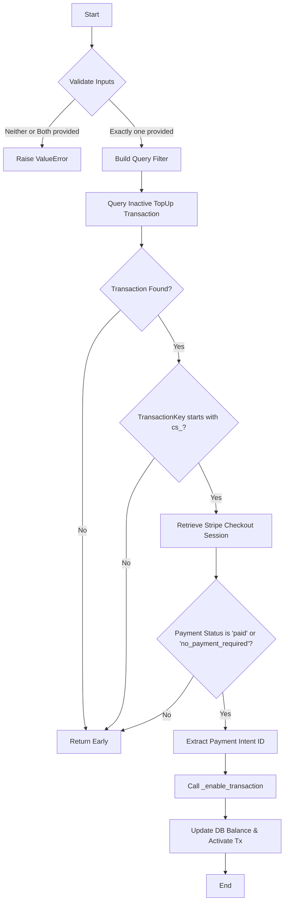

#### 带注释源码

```python
    async def fulfill_checkout(
        self, *, session_id: str | None = None, user_id: str | None = None
    ):
        # 参数校验：必须且只能提供 session_id 或 user_id 中的一个
        if (not session_id and not user_id) or (session_id and user_id):
            raise ValueError("Either session_id or user_id must be provided")

        # 构建 Prisma 查询过滤条件
        find_filter: CreditTransactionWhereInput = {
            "type": CreditTransactionType.TOP_UP,  # 交易类型为充值
            "isActive": False,                      # 交易尚未激活（支付未完成或未处理）
            "amount": {"gt": 0},                    # 金额大于0
        }
        if session_id:
            find_filter["transactionKey"] = session_id
        if user_id:
            find_filter["userId"] = user_id

        # 查找最近一条符合条件的非激活充值交易
        credit_transaction = await CreditTransaction.prisma().find_first(
            where=find_filter,
            order={"createdAt": "desc"},
        )

        # 幂等性处理：如果找不到交易（可能已经处理过），直接返回
        if not credit_transaction:
            return

        # 校验交易 Key 是否为 Stripe Checkout Session 的 ID (以 "cs_" 开头)
        # 如果不是，说明可能是其他方式的充值，跳过履行逻辑
        if not credit_transaction.transactionKey.startswith("cs_"):
            return

        # 从 Stripe API 获取 Checkout Session 详情，并展开 payment_intent 对象
        checkout_session = stripe.checkout.Session.retrieve(
            credit_transaction.transactionKey,
            expand=["payment_intent"],
        )

        # 检查 Stripe 的支付状态
        # 如果状态为 "paid" 或 "no_payment_required"，则履行订单
        if checkout_session.payment_status in ["paid", "no_payment_required"]:
            # 获取关联的 Payment Intent ID，用于后续的精确记录
            if payment_intent := checkout_session.payment_intent:
                assert isinstance(payment_intent, stripe.PaymentIntent)
                new_transaction_key = payment_intent.id
            else:
                new_transaction_key = None

            # 调用内部方法 _enable_transaction 激活交易
            # 这将更新数据库中的积分余额，并将交易标记为 active
            await self._enable_transaction(
                transaction_key=credit_transaction.transactionKey,
                new_transaction_key=new_transaction_key,
                user_id=credit_transaction.userId,
                metadata=SafeJson(checkout_session),
            )
```


### `UserCreditBase.create_billing_portal_session`

该方法负责为指定用户创建一个 Stripe 计费门户会话。它会首先获取用户的 Stripe Customer ID（如果不存在则自动创建），然后调用 Stripe API 生成一个会话 URL，用户可以通过此链接管理其付款方式、查看发票或取消订阅，操作完成后会被重定向回应用的积分页面。

参数：

- `user_id`：`str`，需要创建计费门户会话的用户唯一标识符。

返回值：`str`，生成的 Stripe 计费门户会话 URL，用户访问该链接即可进入托管式账单管理页面。

#### 流程图

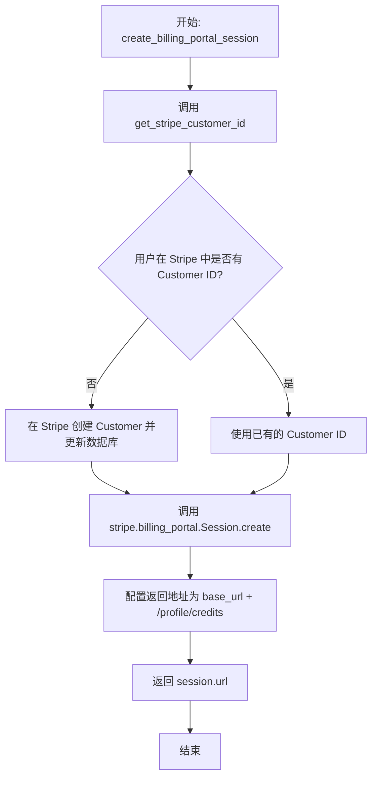

#### 带注释源码

```python
    @staticmethod
    async def create_billing_portal_session(user_id: str) -> str:
        # 调用 Stripe API 创建计费门户会话
        session = stripe.billing_portal.Session.create(
            # 获取用户的 Stripe Customer ID，如果用户尚未关联 Customer ID，此函数会自动在 Stripe 中创建并保存
            customer=await get_stripe_customer_id(user_id),
            # 设置用户完成操作后的重定向 URL，指向用户积分页面
            return_url=base_url + "/profile/credits",
        )
        # 返回生成的会话 URL，用于前端重定向用户
        return session.url
```


### `UserCreditBase.time_now`

获取当前的 UTC 日期时间。这是一个静态辅助方法，旨在为类中所有与时间相关的操作提供统一的时间标准（UTC），确保时间戳的一致性。

参数：

无

返回值：`datetime`，表示当前日期和时间的 UTC 时间戳对象。

#### 流程图

```mermaid
graph TD
    A[开始] --> B[调用 datetime.now]
    B --> C[传入 timezone.utc 参数]
    C --> D[获取当前 UTC 时间]
    D --> E[返回 datetime 对象]
    E --> F[结束]
```

#### 带注释源码

```python
    @staticmethod
    def time_now() -> datetime:
        # 返回当前的 UTC 时间，确保系统中所有时间戳使用统一的时区
        return datetime.now(timezone.utc)
```


### `UserCreditBase._get_credits`

该方法用于获取用户的当前信用额度余额以及该余额的最新快照时间。它首先尝试从 `UserBalance` 表中查询以获取高效且一致的余额信息；如果该记录不存在，则回退到从 `CreditTransaction` 交易历史中计算余额，即查找最近一笔具有有效 `runningBalance` 的活跃交易。

参数：

-  `user_id`：`str`，需要查询信用额度的用户 ID。

返回值：`tuple[int, datetime]`，包含两个元素的元组，第一个是用户当前的余额（整数），第二个是该余额最后更新或计算的时间（datetime 对象）。

#### 流程图

```mermaid
graph TD
    A[开始: _get_credits] --> B[查询 UserBalance 表<br/>where userId = user_id]
    B --> C{UserBalance 记录存在?}
    C -- 是 --> D[返回 user_balance.balance<br/>和 user_balance.updatedAt]
    C -- 否 --> E[获取当前时间 top_time]
    E --> F[查询 CreditTransaction 表<br/>查找最新的活跃快照]
    F --> G{找到快照记录?}
    G -- 是 --> H[提取 snapshot.runningBalance<br/>和 snapshot.createdAt]
    G -- 否 --> I[设置余额为 0<br/>时间为 datetime.min]
    H --> J[返回计算出的余额和时间]
    I --> J
```

#### 带注释源码

```python
    async def _get_credits(self, user_id: str) -> tuple[int, datetime]:
        """
        Returns the current balance of the user & the latest balance snapshot time.
        """
        # 优先检查 UserBalance 表以提高效率和一致性
        user_balance = await UserBalance.prisma().find_unique(where={"userId": user_id})
        if user_balance:
            return user_balance.balance, user_balance.updatedAt

        # 如果 UserBalance 记录不存在，则回退到基于交易历史的计算
        top_time = self.time_now()
        snapshot = await CreditTransaction.prisma().find_first(
            where={
                "userId": user_id,
                "createdAt": {"lte": top_time},
                "isActive": True,
                "NOT": [{"runningBalance": None}],  # 确保 runningBalance 不为空
            },
            order={"createdAt": "desc"},  # 按时间倒序排列，取最新一条
        )
        # 定义最小时间用于兜底
        datetime_min = datetime.min.replace(tzinfo=timezone.utc)
        # 提取快照余额，如果快照存在则取其值，否则为 0
        snapshot_balance = snapshot.runningBalance or 0 if snapshot else 0
        # 提取快照时间，如果快照存在则取其时间，否则为最小时间
        snapshot_time = snapshot.createdAt if snapshot else datetime_min

        return snapshot_balance, snapshot_time
```


### `UserCreditBase._enable_transaction`

原子化激活一个先前创建的非活跃（inactive）交易，更新用户余额和交易记录，并处理必要的通知清理。该方法通常用于在支付网关确认支付或执行类似异步操作后，完成信贷入账流程。

参数：

- `transaction_key`：`str`，用于识别待激活交易的唯一键。
- `user_id`：`str`，交易所属的用户 ID。
- `metadata`：`SafeJson`，包含交易详细信息的 JSON 对象（如支付意图详情）。
- `new_transaction_key`：`str | None`，可选参数，用于更新交易键（例如，从临时 session ID 更新为最终的 payment intent ID）。

返回值：`int | None`，返回更新后的用户余额；如果交易不存在或已经激活，则返回 `None`。

#### 流程图

```mermaid
flowchart TD
    A[开始: _enable_transaction] --> B[查询非活跃交易<br>transaction_key & user_id]
    B --> C{交易是否存在?}
    C -- 否 --> D[返回 None]
    C -- 是 --> E[执行原子化 SQL 更新操作]
    E --> F{SQL 结果是否存在?}
    F -- 否 --> G[返回 None]
    F -- 是 --> H[检查交易类型与金额]
    H --> I{金额 > 0 且类型为<br>GRANT 或 TOP_UP ?}
    I -- 是 --> J[清除余额不足通知标志]
    I -- 否 --> K[跳过通知处理]
    J --> L[返回新余额]
    K --> L
```

#### 带注释源码

```python
    @func_retry
    async def _enable_transaction(
        self,
        transaction_key: str,
        user_id: str,
        metadata: SafeJson,
        new_transaction_key: str | None = None,
    ):
        # 第一步：安全检查，确认交易存在且当前处于非活跃状态
        transaction = await CreditTransaction.prisma().find_first(
            where={
                "transactionKey": transaction_key,
                "userId": user_id,
                "isActive": False,
            }
        )
        if not transaction:
            # 如果交易不存在或已经是活跃状态，直接返回 None
            return None

        # 第二步：执行原子化的数据库操作
        # 使用 CTE (Common Table Expressions) 确保：
        # 1. 锁定用户余额 (UserBalance 或从历史计算)
        # 2. 更新 UserBalance 表的余额
        # 3. 将 CreditTransaction 标记为活跃 (isActive=true)，更新余额快照和元数据
        result = await query_raw_with_schema(
            """
            WITH user_balance_lock AS (
                SELECT 
                    $2::text as userId, 
                    COALESCE(
                        (SELECT balance FROM {schema_prefix}"UserBalance" WHERE "userId" = $2 FOR UPDATE),
                        -- Fallback: compute balance from transaction history if UserBalance doesn't exist
                        (SELECT COALESCE(ct."runningBalance", 0) 
                         FROM {schema_prefix}"CreditTransaction" ct 
                         WHERE ct."userId" = $2 
                           AND ct."isActive" = true 
                           AND ct."runningBalance" IS NOT NULL 
                         ORDER BY ct."createdAt" DESC 
                         LIMIT 1),
                        0
                    ) as balance
            ),
            transaction_check AS (
                SELECT * FROM {schema_prefix}"CreditTransaction" 
                WHERE "transactionKey" = $1 AND "userId" = $2 AND "isActive" = false
            ),
            balance_update AS (
                INSERT INTO {schema_prefix}"UserBalance" ("userId", "balance", "updatedAt")
                SELECT 
                    $2::text,
                    user_balance_lock.balance + transaction_check.amount,
                    CURRENT_TIMESTAMP
                FROM user_balance_lock, transaction_check
                ON CONFLICT ("userId") DO UPDATE SET
                    "balance" = EXCLUDED."balance",
                    "updatedAt" = EXCLUDED."updatedAt"
                RETURNING "balance", "updatedAt"
            ),
            transaction_update AS (
                UPDATE {schema_prefix}"CreditTransaction"
                SET "transactionKey" = COALESCE($4, $1),
                    "isActive" = true,
                    "runningBalance" = balance_update.balance,
                    "createdAt" = balance_update."updatedAt",
                    "metadata" = $3::jsonb
                FROM balance_update, transaction_check
                WHERE {schema_prefix}"CreditTransaction"."transactionKey" = transaction_check."transactionKey"
                  AND {schema_prefix}"CreditTransaction"."userId" = transaction_check."userId"
                RETURNING {schema_prefix}"CreditTransaction"."runningBalance"
            )
            SELECT "runningBalance" as balance FROM transaction_update;
            """,
            transaction_key,  # $1
            user_id,  # $2
            dumps(metadata.data),  # $3 - use pre-serialized JSON string for JSONB
            new_transaction_key,  # $4
        )

        if result:
            # 第三步：后处理逻辑
            # UserBalance 已由 CTE 更新，此处处理业务逻辑副作用
            # 如果是正向入账（充值或奖励），清除用户之前的“余额不足”通知状态，
            # 以便将来余额不足时可以再次提醒用户。
            if transaction.amount > 0 and transaction.type in [
                CreditTransactionType.GRANT,
                CreditTransactionType.TOP_UP,
            ]:
                from backend.executor.manager import (
                    clear_insufficient_funds_notifications,
                )

                await clear_insufficient_funds_notifications(user_id)

            return result[0]["balance"]
```


### `UserCreditBase._add_transaction`

为用户添加新的交易记录，执行原子化的余额更新操作。该方法通过 PostgreSQL 行级锁（FOR UPDATE）确保并发场景下的数据一致性，处理余额检查、封顶限制、溢出/下溢保护，并根据交易类型管理激活状态及通知。

参数：

-   `user_id`：`str`，用户 ID，标识交易归属的用户。
-   `amount`：`int`，交易金额，正数表示充值/奖励，负数表示消费。
-   `transaction_type`：`CreditTransactionType`，交易类型枚举，如 USAGE（使用）、TOP_UP（充值）等。
-   `is_active`：`bool`，交易是否立即激活，若为 False 则创建 inactive 交易且不影响余额。默认为 `True`。
-   `transaction_key`：`str | None`，交易唯一标识符，用于幂等性检查，避免重复交易。默认为 `None`（自动生成）。
-   `ceiling_balance`：`int | None`，余额上限，若当前余额已超过或加上金额后超过此值（针对正向充值），则阻止或限制充值。默认为 `None`。
-   `fail_insufficient_credits`：`bool`，若为 `True`，当用户余额不足以扣除 `amount` 时抛出异常。默认为 `True`。
-   `metadata`：`SafeJson`，交易的附加元数据，以 JSONB 格式存储。默认为 `SafeJson({})`。

返回值：`tuple[int, str]`，包含更新后的用户余额（int）和交易键（str）的元组。

#### 流程图

```mermaid
graph TD
    A[开始: _add_transaction] --> B{检查封顶余额 & amount > 0?};
    B -- 是 --> C[调用 _get_credits 获取当前余额];
    C --> D{当前余额 >= 封顶值?};
    D -- 是 --> E[抛出 ValueError: 余额充足无需充值];
    D -- 否 --> F[执行原子 SQL 查询 (CTE)];
    B -- 否 --> F;

    subgraph SQL执行逻辑
    F --> F1[锁定用户行 FOR UPDATE];
    F1 --> F2[计算新余额 (处理封顶/溢出/下溢)];
    F2 --> F3{检查是否允许交易<br>(不活跃/正向/余额充足)?};
    F3 -- 允许 --> F4[更新 UserBalance 表];
    F4 --> F5[插入 CreditTransaction 表];
    F5 --> F6[返回新余额与交易键];
    F3 -- 拒绝 --> F7[返回空结果];
    end

    F6 --> G{SQL 执行成功?};
    F7 --> G;
    
    G -- 异常 --> H{异常类型?};
    H -- 唯一约束/重复键 --> I[抛出 UniqueViolationError];
    H -- 其他 --> J[抛出原始异常];

    G -- 成功且无结果 --> K{用户是否存在?};
    K -- 否 --> L[抛出 ValueError: 用户未找到];
    K -- 是 --> M{是否扣款且余额不足?};
    M -- 是 --> N[抛出 InsufficientBalanceError];
    M -- 否 --> O[抛出 ValueError: 交易失败未知原因];

    G -- 成功且有结果 --> P[提取 new_balance 与 tx_key];
    P --> Q{是正向充值/奖励<br>且 is_active?};
    Q -- 是 --> R[清除余额不足通知];
    Q -- 否 --> S[返回 new_balance, tx_key];
    R --> S;
```

#### 带注释源码

```python
    async def _add_transaction(
        self,
        user_id: str,
        amount: int,
        transaction_type: CreditTransactionType,
        is_active: bool = True,
        transaction_key: str | None = None,
        ceiling_balance: int | None = None,
        fail_insufficient_credits: bool = True,
        metadata: SafeJson = SafeJson({}),
    ) -> tuple[int, str]:
        """
        Add a new transaction for the user.
        This is the only method that should be used to add a new transaction.

        ... (省略文档字符串中的设计决策说明) ...
        """
        # 预检查：如果设置了封顶余额且是充值操作，先查余额避免不必要的DB锁开销
        if ceiling_balance and amount > 0:
            current_balance, _ = await self._get_credits(user_id)
            if current_balance >= ceiling_balance:
                raise ValueError(
                    f"You already have enough balance of ${current_balance/100}, top-up is not required when you already have at least ${ceiling_balance/100}"
                )

        # 单一统一原子操作，使用 UserBalance 表和 CTE (Common Table Expressions)
        try:
            result = await query_raw_with_schema(
                """
                WITH user_balance_lock AS (
                    SELECT 
                        $1::text as userId, 
                        -- 关键点：使用 FOR UPDATE 锁定用户余额行，防止并发修改
                        COALESCE(
                            (SELECT balance FROM {schema_prefix}"UserBalance" WHERE "userId" = $1 FOR UPDATE),
                            -- 降级方案：如果 UserBalance 不存在，从交易历史计算余额
                            (SELECT COALESCE(ct."runningBalance", 0) 
                             FROM {schema_prefix}"CreditTransaction" ct 
                             WHERE ct."userId" = $1 
                               AND ct."isActive" = true 
                               AND ct."runningBalance" IS NOT NULL 
                             ORDER BY ct."createdAt" DESC 
                             LIMIT 1),
                            0
                        ) as balance
                ),
                balance_update AS (
                    -- 计算并更新 UserBalance
                    INSERT INTO {schema_prefix}"UserBalance" ("userId", "balance", "updatedAt")
                    SELECT 
                        $1::text,
                        CASE 
                            -- 非激活交易：不更新余额
                            WHEN $5::boolean = false THEN user_balance_lock.balance
                            -- 封顶余额逻辑 (正向充值)
                            WHEN $2 > 0 AND $7::int IS NOT NULL AND user_balance_lock.balance > $7::int - $2 THEN $7::int
                            -- 溢出/下溢保护
                            WHEN user_balance_lock.balance + $2 > $6::int THEN $6::int
                            WHEN user_balance_lock.balance + $2 < $10::int THEN $10::int
                            ELSE user_balance_lock.balance + $2
                        END,
                        CURRENT_TIMESTAMP
                    FROM user_balance_lock
                    WHERE (
                        $5::boolean = false OR  -- 允许非激活交易
                        $2 >= 0 OR              -- 允许正向金额 (充值、奖励)
                        $8::boolean = false OR  -- 允许禁用余额检查的情况
                        user_balance_lock.balance + $2 >= 0  -- 仅在余额充足时允许支出
                    )
                    ON CONFLICT ("userId") DO UPDATE SET
                        "balance" = EXCLUDED."balance",
                        "updatedAt" = EXCLUDED."updatedAt"
                    RETURNING "balance", "updatedAt"
                ),
                transaction_insert AS (
                    -- 插入 CreditTransaction 记录
                    INSERT INTO {schema_prefix}"CreditTransaction" (
                        "userId", "amount", "type", "runningBalance", 
                        "metadata", "isActive", "createdAt", "transactionKey"
                    )
                    SELECT 
                        $1::text,
                        $2::int,
                        $3::text::{schema_prefix}"CreditTransactionType",
                        CASE 
                            -- 非激活交易：runningBalance 设为原始余额 (暂不应用变动)
                            WHEN $5::boolean = false THEN user_balance_lock.balance
                            ELSE COALESCE(balance_update.balance, user_balance_lock.balance)
                        END,
                        $4::jsonb,
                        $5::boolean,
                        COALESCE(balance_update."updatedAt", CURRENT_TIMESTAMP),
                        COALESCE($9, gen_random_uuid()::text)
                    FROM user_balance_lock
                    LEFT JOIN balance_update ON true
                    WHERE (
                        $5::boolean = false OR  -- 允许非激活交易
                        $2 >= 0 OR              -- 允许正向金额
                        $8::boolean = false OR  -- 允许禁用余额检查
                        user_balance_lock.balance + $2 >= 0  -- 仅在余额充足时允许支出
                    )
                    RETURNING "runningBalance", "transactionKey"
                )
                SELECT "runningBalance" as balance, "transactionKey" FROM transaction_insert;
                """,
                user_id,                  # $1
                amount,                   # $2
                transaction_type.value,   # $3
                dumps(metadata.data),    # $4
                is_active,                # $5
                POSTGRES_INT_MAX,         # $6 - 溢出保护
                ceiling_balance,          # $7 - 封顶余额
                fail_insufficient_credits,# $8
                transaction_key,          # $9
                POSTGRES_INT_MIN,         # $10 - 下溢保护
            )
        except Exception as e:
            # 异常处理：将原始 SQL 唯一约束冲突转换为 UniqueViolationError 以便上层统一处理
            error_str = str(e).lower()
            if (
                "already exists" in error_str
                or "duplicate key" in error_str
                or "unique constraint" in error_str
            ):
                raise UniqueViolationError({"error": str(e), "user_facing_error": {}})
            raise

        if result:
            new_balance, tx_key = result[0]["balance"], result[0]["transactionKey"]
            
            # 如果是正向充值/奖励且激活成功，清除之前的余额不足通知标记
            if (
                amount > 0
                and is_active
                and transaction_type
                in [CreditTransactionType.GRANT, CreditTransactionType.TOP_UP]
            ):
                from backend.executor.manager import (
                    clear_insufficient_funds_notifications,
                )

                await clear_insufficient_funds_notifications(user_id)

            return new_balance, tx_key

        # 如果没有返回结果，检查用户是否存在或是否因为余额不足导致 SQL WHERE 条件过滤
        user = await User.prisma().find_unique(where={"id": user_id})
        if not user:
            raise ValueError(f"User {user_id} not found")

        # 余额不足导致的失败
        if amount < 0 and fail_insufficient_credits:
            current_balance, _ = await self._get_credits(user_id)
            raise InsufficientBalanceError(
                message=f"Insufficient balance of ${current_balance/100}, where this will cost ${abs(amount)/100}",
                user_id=user_id,
                balance=current_balance,
                amount=amount,
            )

        # 其他未知错误
        raise ValueError(f"Transaction failed for user {user_id}, amount {amount}")
```


### `UserCredit._send_refund_notification`

异步发送关于退款状态（例如请求创建或处理）的通知给用户。它封装了创建 `NotificationEventModel` 并将其入队进行异步发送的逻辑。

参数：

-  `notification_request`：`RefundRequestData`，包含通知有效载荷的详细信息，包括用户 ID、退款金额和原因。
-  `notification_type`：`NotificationType`，指定通知事件的类型（例如 `REFUND_REQUEST`, `REFUND_PROCESSED`）。

返回值：`None`，该方法不返回值；它将通知任务入队。

#### 流程图

```mermaid
flowchart TD
    A["Start: _send_refund_notification"] --> B["Construct NotificationEventModel"]
    B --> C["Call queue_notification_async"]
    C --> D["End: None"]
```

#### 带注释源码

```python
    async def _send_refund_notification(
        self,
        notification_request: RefundRequestData,
        notification_type: NotificationType,
    ):
        # 创建一个通知事件模型，包含用户ID、通知类型和具体的退款请求数据
        await queue_notification_async(
            NotificationEventModel(
                user_id=notification_request.user_id,
                type=notification_type,
                data=notification_request,
            )
        )
```


### `UserCredit.spend_credits`

扣除用户信用额度以记录使用情况（如图执行成本），并在配置了自动充值且余额低于阈值时触发自动充值流程。

参数：

- `user_id`：`str`，执行操作的用户ID。
- `cost`：`int`，要扣除的信用点数（成本）。
- `metadata`：`UsageTransactionMetadata`，包含使用上下文的事务元数据（如执行ID、节点ID等）。

返回值：`int`，扣除操作完成后的用户余额（注意：此返回值为扣除后的即时余额，不包含后续可能触发的自动充值金额）。

#### 流程图

```mermaid
flowchart TD
    A([开始]) --> B{cost == 0?}
    B -- 是 --> C([返回 0])
    B -- 否 --> D[调用 _add_transaction<br/>类型: USAGE, 金额: -cost]
    D --> E[获取扣除后的余额 balance]
    E --> F[获取用户自动充值配置]
    F --> G{配置了阈值 threshold 且<br/>balance < threshold?}
    G -- 否 --> H([返回 balance])
    G -- 是 --> I[尝试调用 _top_up_credits]
    I --> J{充值成功?}
    J -- 异常 --> K[记录错误日志]
    J -- 成功 --> L[继续执行]
    K --> H
    L --> H
```

#### 带注释源码

```python
    async def spend_credits(
        self,
        user_id: str,
        cost: int,
        metadata: UsageTransactionMetadata,
    ) -> int:
        # 如果成本为0，直接返回，不执行数据库操作
        if cost == 0:
            return 0

        # 调用内部事务方法扣除信用
        # 使用负数金额表示支出，类型标记为 USAGE
        balance, _ = await self._add_transaction(
            user_id=user_id,
            amount=-cost,
            transaction_type=CreditTransactionType.USAGE,
            metadata=SafeJson(metadata.model_dump()),
        )

        # 检查并执行自动充值逻辑
        auto_top_up = await get_auto_top_up(user_id)
        # 如果配置了阈值，且当前余额低于阈值
        if auto_top_up.threshold and balance < auto_top_up.threshold:
            try:
                # 执行自动充值
                await self._top_up_credits(
                    user_id=user_id,
                    amount=auto_top_up.amount,
                    # 使用图执行ID构造Key，防止同一图执行过程中重复触发充值
                    key=f"AUTO-TOP-UP-{user_id}-{metadata.graph_exec_id}",
                    # 设置充值上限，通常不超过阈值
                    ceiling_balance=auto_top_up.threshold,
                    top_up_type=TopUpType.AUTO,
                )
            except Exception as e:
                # 自动充值失败不应阻断当前消费操作，仅记录错误日志
                logger.error(
                    f"Auto top-up failed for user {user_id}, balance: {balance}, amount: {auto_top_up.amount}, error: {e}"
                )

        # 返回消费后的余额
        return balance
```


### `UserCredit.top_up_credits`

为用户账户充值积分的公共接口方法，该方法主要负责参数传递，并将具体的充值逻辑委托给内部方法 `_top_up_credits` 执行。

参数：

- `user_id`：`str`，用户的唯一标识符。
- `amount`：`int`，要充值的积分数量。
- `top_up_type`：`TopUpType`，充值的类型（如手动充值、自动充值等），默认为 `TopUpType.UNCATEGORIZED`。

返回值：`None`，该方法不返回任何值。

#### 流程图

```mermaid
flowchart TD
    Start([开始]) --> Delegate[调用内部方法 _top_up_credits<br/>传入参数: user_id, amount, top_up_type]
    Delegate --> End([结束])
```

#### 带注释源码

```python
    async def top_up_credits(
        self,
        user_id: str,
        amount: int,
        top_up_type: TopUpType = TopUpType.UNCATEGORIZED,
    ):
        # 调用内部方法 _top_up_credits 处理具体的充值逻辑
        await self._top_up_credits(
            user_id=user_id, amount=amount, top_up_type=top_up_type
        )
```


### `UserCredit.onboarding_reward`

该方法用于在用户完成特定的入门步骤时给予其积分奖励。通过构造唯一的交易键，确保对于同一用户和同一入门步骤，只会发放一次奖励（幂等性）。如果尝试重复发放，将捕获唯一性约束违反错误并返回 False。

参数：

- `user_id`：`str`，用户的唯一标识符。
- `credits`：`int`，要奖励给用户的积分数额。
- `step`：`OnboardingStep`，表示用户已完成的入门步骤的枚举值。

返回值：`bool`，如果成功发放奖励返回 True，如果用户已经领取过该步骤的奖励则返回 False。

#### 流程图

```mermaid
graph TD
    A([开始]) --> B{尝试添加交易记录}
    B -->|调用 _add_transaction| C[生成唯一 Key: REWARD-user_id-step]
    C -->|成功| D([返回 True])
    C -->|抛出 UniqueViolationError| E([用户已领取])
    E --> F([返回 False])
```

#### 带注释源码

```python
    async def onboarding_reward(self, user_id: str, credits: int, step: OnboardingStep):
        try:
            # 尝试添加一笔类型为 GRANT 的交易记录
            # 使用 "REWARD-{user_id}-{step.value}" 作为 transaction_key
            # 这确保了对于同一个用户的同一个步骤，交易记录是唯一的，从而实现幂等性
            await self._add_transaction(
                user_id=user_id,
                amount=credits,
                transaction_type=CreditTransactionType.GRANT,
                transaction_key=f"REWARD-{user_id}-{step.value}",
                metadata=SafeJson(
                    {"reason": f"Reward for completing {step.value} onboarding step."}
                ),
            )
            # 如果交易成功添加（没有抛出异常），说明这是首次发放奖励
            return True
        except UniqueViolationError:
            # 捕获唯一性约束违反异常
            # 这意味着具有相同 transaction_key 的记录已存在
            # 说明该用户已经领取过该步骤的奖励
            return False
```


### `UserCredit.top_up_refund`

处理用户对特定充值交易的退款请求，根据用户的当前余额和已消耗金额，决定是直接通过Stripe自动退款还是创建人工审核的退款请求。

参数：

-  `user_id`：`str`，发起退款的用户ID
-  `transaction_key`：`str`，需要退款的目标充值交易键
-  `metadata`：`dict[str, str]`，退款相关的元数据，通常包含退款原因

返回值：`int`，退款的金额。如果退款请求进入人工审核流程，则返回 0。

#### 流程图

```mermaid
flowchart TD
    A[开始: top_up_refund] --> B[查询数据库获取充值交易记录]
    B --> C[获取用户当前余额]
    C --> D[生成退款键<br>基于交易时间和用户ID]
    D --> E[尝试创建退款请求记录]
    E --> F{记录是否已存在?}
    F -- 是 (UniqueViolationError) --> G[抛出 ValueError<br>本周已请求过退款]
    F -- 否 --> H{充值金额 - 当前余额 > 阈值?}
    H -- 是 (余额不足/消耗过多) --> I[发送退款通知<br>类型: REFUND_REQUEST]
    I --> J[返回 0<br>标记为待人工审核]
    H -- 否 (余额充足) --> K[调用 Stripe API 执行自动退款]
    K --> L[返回 refund.amount<br>实际退款金额]
```

#### 带注释源码

```python
async def top_up_refund(
    self, user_id: str, transaction_key: str, metadata: dict[str, str]
) -> int:
    # 1. 查找有效的充值交易记录，确保交易存在且属于该用户
    transaction = await CreditTransaction.prisma().find_first_or_raise(
        where={
            "transactionKey": transaction_key,
            "userId": user_id,
            "isActive": True,
            "type": CreditTransactionType.TOP_UP,
        }
    )
    
    # 2. 获取用户当前的信用余额
    balance = await self.get_credits(user_id)
    amount = transaction.amount
    
    # 3. 生成退款请求的唯一ID (基于时间格式和用户ID)，防止频繁重复请求
    refund_key_format = settings.config.refund_request_time_key_format
    refund_key = f"{transaction.createdAt.strftime(refund_key_format)}-{user_id}"

    # 4. 尝试创建退款请求记录到数据库
    try:
        refund_request = await CreditRefundRequest.prisma().create(
            data=CreditRefundRequestCreateInput(
                id=refund_key,
                transactionKey=transaction_key,
                userId=user_id,
                amount=amount,
                reason=metadata.get("reason", ""),
                status=CreditRefundRequestStatus.PENDING,
                result="The refund request is under review.",
            )
        )
    except UniqueViolationError:
        # 如果抛出唯一性约束违反错误，说明该周期内（如本周）已经请求过退款
        raise ValueError(
            "Unable to request a refund for this transaction, the request of the top-up transaction within the same week has already been made."
        )

    # 5. 检查是否需要人工审核
    # 如果 (充值金额 - 当前余额) > 容忍阈值，说明用户已经消耗了较多信用，直接退款可能存在风险
    if amount - balance > settings.config.refund_credit_tolerance_threshold:
        user_data = await get_user_by_id(user_id)
        # 发送通知给管理员或相关人员
        await self._send_refund_notification(
            RefundRequestData(
                user_id=user_id,
                user_name=user_data.name or "AutoGPT Platform User",
                user_email=user_data.email,
                transaction_id=transaction_key,
                refund_request_id=refund_request.id,
                reason=refund_request.reason,
                amount=amount,
                balance=balance,
            ),
            NotificationType.REFUND_REQUEST,
        )
        return 0  # 返回 0 表示该请求已记录，但需人工审批，未立即执行退款

    # 6. 如果余额充足（消耗未超阈值），则通过 Stripe 自动执行退款
    refund = stripe.Refund.create(payment_intent=transaction_key, metadata=metadata)
    return refund.amount
```


### `UserCredit.deduct_credits`

该方法用于处理因Stripe退款或争议导致的用户积分扣除逻辑。它会验证请求的状态，查找原始的充值交易，记录一笔退款类型的扣费交易，更新相关的退款请求状态，并向用户发送通知。

参数：

-  `request`：`stripe.Refund | stripe.Dispute`，表示来自Stripe的退款对象或争议对象。

返回值：`None`，无返回值。

#### 流程图

```mermaid
flowchart TD
    Start([开始]) --> CheckRefund{类型为 Refund?}
    CheckRefund -- 是 --> CheckRefundStatus{状态为 succeeded?}
    CheckRefundStatus -- 否 --> LogWarnRefund[记录警告并结束]
    CheckRefundStatus -- 是 --> CheckDispute{类型为 Dispute?}
    CheckRefund -- 否 --> CheckDispute
    
    CheckDispute -- 是 --> CheckDisputeStatus{状态为 lost?}
    CheckDisputeStatus -- 否 --> LogWarnDispute[记录警告并结束]
    CheckDisputeStatus -- 是 --> FindTx[查找对应的 TOP_UP 交易]
    CheckDispute -- 否 --> FindTx
    
    FindTx --> ValidateAmount{金额有效且小于交易额?}
    ValidateAmount -- 否 --> RaiseError[抛出断言错误]
    ValidateAmount -- 是 --> AddTx[添加 REFUND 类型交易记录<br/>允许余额不足]
    
    AddTx --> UpdateRefundReq[更新 CreditRefundRequest<br/>状态为 APPROVED]
    UpdateRefundReq --> GetUserData[获取用户数据]
    GetUserData --> SendNotify[发送退款处理通知]
    SendNotify --> End([结束])
    
    LogWarnRefund --> End
    LogWarnDispute --> End
```

#### 带注释源码

```python
    async def deduct_credits(self, request: stripe.Refund | stripe.Dispute):
        # 如果是退款请求，仅处理状态为 succeeded 的退款
        if isinstance(request, stripe.Refund) and request.status != "succeeded":
            logger.warning(
                f"Skip processing refund #{request.id} with status {request.status}"
            )
            return

        # 如果是争议请求，仅处理状态为 lost 的争议（即商家输了争议，需要退款）
        if isinstance(request, stripe.Dispute) and request.status != "lost":
            logger.warning(
                f"Skip processing dispute #{request.id} with status {request.status}"
            )
            return

        # 查找与该支付意图关联的原始成功充值交易
        transaction = await CreditTransaction.prisma().find_first_or_raise(
            where={
                "transactionKey": str(request.payment_intent),
                "isActive": True,
                "type": CreditTransactionType.TOP_UP,
            }
        )
        
        # 验证退款/争议金额的有效性：必须大于0且不超过原始交易金额
        if request.amount <= 0 or request.amount > transaction.amount:
            raise AssertionError(
                f"Invalid amount to deduct ${request.amount/100} from ${transaction.amount/100} top-up"
            )

        # 创建一笔负值的 REFUND 类型交易来扣除用户积分
        # fail_insufficient_credits=False 允许即使余额不足也执行扣除，因为这是外部强制性的退款
        balance, _ = await self._add_transaction(
            user_id=transaction.userId,
            amount=-request.amount,
            transaction_type=CreditTransactionType.REFUND,
            transaction_key=request.id,
            metadata=SafeJson(request),
            fail_insufficient_credits=False,
        )

        # 如果存在对应的退款请求记录，更新其状态为已批准 (APPROVED)
        await CreditRefundRequest.prisma().update_many(
            where={
                "userId": transaction.userId,
                "transactionKey": transaction.transactionKey,
            },
            data={
                "amount": request.amount,
                "status": CreditRefundRequestStatus.APPROVED,
                "result": "The refund request has been approved, the amount will be credited back to your account.",
            },
        )

        # 获取用户数据并发送退款处理完成的通知
        user_data = await get_user_by_id(transaction.userId)
        await self._send_refund_notification(
            RefundRequestData(
                user_id=user_data.id,
                user_name=user_data.name or "AutoGPT Platform User",
                user_email=user_data.email,
                transaction_id=transaction.transactionKey,
                refund_request_id=request.id,
                reason=str(request.reason or "-"),
                amount=transaction.amount,
                balance=balance,
            ),
            NotificationType.REFUND_PROCESSED,
        )
```


### `UserCredit.handle_dispute`

处理来自 Stripe 的支付争议（Dispute）。该方法会定位对应的充值交易，并检查用户的当前信用余额是否足够覆盖争议金额（在扣除容错阈值后）。如果余额充足，系统将直接接受争议并关闭；否则，系统将收集用户的交易历史作为证据，并通过 Stripe API 提交证据以响应争议。

参数：

- `dispute`：`stripe.Dispute`，Stripe 争议对象，包含关于支付争议的详细信息，如支付意图 ID、争议金额和原因。

返回值：`None`，无返回值。

#### 流程图

```mermaid
flowchart TD
    A[开始: handle_dispute] --> B[查询对应的 CreditTransaction]
    B --> C{查询是否成功?}
    C -- 否 --> D[抛出异常]
    C -- 是 --> E[获取 user_id, amount 和 当前余额]
    E --> F{余额 - 金额 >= 容错阈值?}
    F -- 是 (用户余额充足) --> G[记录警告日志]
    G --> H[调用 dispute.close 接受争议]
    H --> I[结束]
    F -- 否 (需要抗辩) --> J[记录警告日志]
    J --> K[获取用户交易历史记录]
    K --> L[获取用户详细信息]
    L --> M[构建抗辩证据文本 evidence_text]
    M --> N[调用 stripe.Dispute.modify 提交证据]
    N --> I
```

#### 带注释源码

```python
    async def handle_dispute(self, dispute: stripe.Dispute):
        # 1. 根据争议关联的 payment_intent 查找对应的系统内部充值交易记录
        transaction = await CreditTransaction.prisma().find_first_or_raise(
            where={
                "transactionKey": str(dispute.payment_intent),
                "isActive": True,
                "type": CreditTransactionType.TOP_UP,
            }
        )
        user_id = transaction.userId
        amount = dispute.amount
        balance = await self.get_credits(user_id)

        # 2. 判断策略：如果用户余额足够扣除争议金额（在保留容错阈值后），
        # 则直接接受争议，避免人力成本。
        if balance - amount >= settings.config.refund_credit_tolerance_threshold:
            logger.warning(f"Accepting dispute from {user_id} for ${amount/100}")
            dispute.close()
            return

        # 3. 如果余额不足，则需要抗辩。记录日志并收集证据。
        logger.warning(
            f"Adding extra info for dispute from {user_id} for ${amount/100}"
        )
        # 获取最近的交易历史，用于证明用户已使用服务
        transaction_history = await self.get_transaction_history(
            user_id, transaction_count_limit=None
        )
        user = await get_user_by_id(user_id)

        # 4. 构建证据文本，解释资金去向和服务使用情况
        evidence_text = (
            f"The top-up transaction of ${transaction.amount / 100:.2f} was processed successfully, and the corresponding credits "
            "were applied to the user’s account. Our records confirm that the funds were utilized for the intended services. "
            "Below is a summary of recent transaction activity:\n"
        )
        for tx in transaction_history.transactions:
            # 标记争议涉及的交易
            if tx.transaction_key == transaction.transactionKey:
                additional_comment = (
                    " [This top-up transaction is the subject of the dispute]."
                )
            else:
                additional_comment = ""

            evidence_text += (
                f"- {tx.description}: Amount ${tx.amount / 100:.2f} on {tx.transaction_time.isoformat()}, "
                f"resulting balance ${tx.running_balance / 100:.2f} {additional_comment}\n"
            )
        evidence_text += (
            "\nThis evidence demonstrates that the transaction was authorized and that the charged amount was used to render the service as agreed."
            "\nAdditionally, we provide an automated refund functionality, so the user could have used it if they were not satisfied with the service. "
        )
        
        # 5. 整合证据数据并通过 Stripe API 更新争议状态
        evidence: stripe.Dispute.ModifyParamsEvidence = {
            "product_description": "AutoGPT Platform Credits",
            "customer_email_address": user.email,
            "uncategorized_text": evidence_text[:20000], # Stripe 文本字段有长度限制
        }
        stripe.Dispute.modify(dispute.id, evidence=evidence)
```


### `UserCredit._top_up_credits`

处理用户积分充值的内部方法，包含充值元数据处理、金额校验、幂等性检查、 Stripe 支付流程（保存的支付方式）以及交易激活的逻辑。

参数：

-  `user_id`：`str`，需要进行充值的用户 ID。
-  `amount`：`int`，充值的积分数额。
-  `key`：`str | None`，可选的交易键，用于防止重复交易。
-  `ceiling_balance`：`int | None`，可选的余额上限，若当前余额已达此上限则停止充值。
-  `top_up_type`：`TopUpType`，充值类型（例如：自动充值、手动充值）。
-  `metadata`：`dict | None`，附加的交易元数据。

返回值：`None`，无返回值，成功时静默完成，失败时抛出异常。

#### 流程图

```mermaid
flowchart TD
    A([开始]) --> B[初始化元数据并设置原因]
    B --> C{金额 amount < 0?}
    C -- 是 --> D[抛出 ValueError 金额不能为负]
    C -- 否 --> E{key 存在且数据库中已存在?}
    E -- 是 --> F[抛出 ValueError 交易键已存在]
    E -- 否 --> G{amount == 0?}
    G -- 是 --> H[设置交易类型为 CARD_CHECK]
    G -- 否 --> I[设置交易类型为 TOP_UP]
    H --> J[调用 _add_transaction 创建非活跃交易]
    I --> J
    J --> K[获取 Stripe Customer ID]
    K --> L[获取用户的支付方式列表]
    L --> M[遍历支付方式]
    M --> N{交易类型是 CARD_CHECK?}
    N -- 是 --> O[创建并确认 Stripe SetupIntent]
    N -- 否 --> P[创建并确认 Stripe PaymentIntent]
    O --> Q{状态为 succeeded?}
    P --> Q
    Q -- 否 --> M
    Q -- 是 --> R[保存成功的交易信息]
    R --> S{遍历结束?}
    S -- 否 --> M
    S -- 是 --> T{是否有成功的支付?}
    T -- 否 --> U[抛出 ValueError 无可用支付方式]
    T -- 是 --> V[调用 _enable_transaction 激活交易并更新余额]
    V --> W([结束])
```

#### 带注释源码

```python
    async def _top_up_credits(
        self,
        user_id: str,
        amount: int,
        key: str | None = None,
        ceiling_balance: int | None = None,
        top_up_type: TopUpType = TopUpType.UNCATEGORIZED,
        metadata: dict | None = None,
    ):
        # 初始化元数据，如果没有提供 reason，则根据充值类型自动生成
        metadata = metadata or {}
        if not metadata.get("reason"):
            match top_up_type:
                case TopUpType.MANUAL:
                    metadata["reason"] = {"reason": f"Top up credits for {user_id}"}
                case TopUpType.AUTO:
                    metadata["reason"] = {
                        "reason": f"Auto top up credits for {user_id}"
                    }
                case _:
                    metadata["reason"] = {
                        "reason": f"Top up reason unknown for {user_id}"
                    }

        # 校验充值金额不能为负数
        if amount < 0:
            raise ValueError(f"Top up amount must not be negative: {amount}")

        # 幂等性检查：如果提供了 key 且数据库中已存在对应交易，则抛出异常
        if key is not None and (
            await CreditTransaction.prisma().find_first(
                where={"transactionKey": key, "userId": user_id}
            )
        ):
            raise ValueError(f"Transaction key {key} already exists for user {user_id}")

        # 确定交易类型：金额为 0 时为卡片验证（CARD_CHECK），否则为正常充值（TOP_UP）
        if amount == 0:
            transaction_type = CreditTransactionType.CARD_CHECK
        else:
            transaction_type = CreditTransactionType.TOP_UP

        # 添加一条非活跃的交易记录
        # is_active=False 意味着此时先扣除潜在余额（受 ceiling_balance 影响）或占位，
        # 但实际的资金增加要等支付成功后通过 _enable_transaction 激活
        _, transaction_key = await self._add_transaction(
            user_id=user_id,
            amount=amount,
            transaction_type=transaction_type,
            is_active=False,
            transaction_key=key,
            ceiling_balance=ceiling_balance,
            metadata=(SafeJson(metadata)),
        )

        # 获取 Stripe 客户 ID
        customer_id = await get_stripe_customer_id(user_id)

        # 列出用户保存的支付方式（卡）
        payment_methods = stripe.PaymentMethod.list(customer=customer_id, type="card")
        if not payment_methods:
            raise ValueError("No payment method found, please add it on the platform.")

        successful_transaction = None
        new_transaction_key = None
        
        # 遍历尝试所有保存的支付方式，直到有一个成功
        for payment_method in payment_methods:
            if transaction_type == CreditTransactionType.CARD_CHECK:
                # 如果是卡片验证，创建 SetupIntent
                setup_intent = stripe.SetupIntent.create(
                    customer=customer_id,
                    usage="off_session",
                    confirm=True,
                    payment_method=payment_method.id,
                    automatic_payment_methods={
                        "enabled": True,
                        "allow_redirects": "never",
                    },
                )
                if setup_intent.status == "succeeded":
                    successful_transaction = SafeJson({"setup_intent": setup_intent})
                    new_transaction_key = setup_intent.id
                    break
            else:
                # 如果是正常充值，创建 PaymentIntent
                payment_intent = stripe.PaymentIntent.create(
                    amount=amount,
                    currency="usd",
                    description="AutoGPT Platform Credits",
                    customer=customer_id,
                    off_session=True, # 离线支付
                    confirm=True,
                    payment_method=payment_method.id,
                    automatic_payment_methods={
                        "enabled": True,
                        "allow_redirects": "never",
                    },
                )
                if payment_intent.status == "succeeded":
                    successful_transaction = SafeJson(
                        {"payment_intent": payment_intent}
                    )
                    new_transaction_key = payment_intent.id
                    break

        # 如果遍历完所有支付方式都没有成功，抛出异常
        if not successful_transaction:
            raise ValueError(
                f"Out of {len(payment_methods)} payment methods tried, none is supported"
            )

        # 支付成功后，激活交易，更新用户余额，并将 transaction_key 更新为 Stripe 的交易 ID
        await self._enable_transaction(
            transaction_key=transaction_key,
            new_transaction_key=new_transaction_key,
            user_id=user_id,
            metadata=successful_transaction,
        )
```


### `UserCredit.top_up_intent`

创建 Stripe Checkout Session 以便用户充值信用额度。该方法负责验证充值金额（必须大于等于 500 且为 100 的倍数），调用 Stripe API 初始化支付会话，在本地数据库中创建一条未激活的交易记录用于后续对账，并返回 Stripe 托管支付页面的 URL 供用户完成支付。

参数：

-   `user_id`：`str`，发起充值的用户唯一标识符。
-   `amount`：`int`，要充值的信用额度数量（单位通常为分/credits）。

返回值：`str`，Stripe Checkout 支付页面的 URL，用户需跳转至此页面完成支付流程。

#### 流程图

```mermaid
flowchart TD
    Start([开始]) --> ValidateAmount{验证金额格式}
    ValidateAmount -- 金额 < 500 或 非100倍数 --> RaiseError[抛出 ValueError]
    ValidateAmount -- 验证通过 --> GetCustomer[获取 Stripe Customer ID]
    GetCustomer --> CreateSession[创建 Stripe Checkout Session]
    CreateSession --> AddTransaction[调用 _add_transaction 创建本地交易记录]
    AddTransaction -- 设置 is_active=False, Key=SessionID --> ReturnUrl[返回 checkout_session.url]
    ReturnUrl --> End([结束])
```

#### 带注释源码

```python
    async def top_up_intent(self, user_id: str, amount: int) -> str:
        # 1. 金额校验：最低充值额为 500，且必须为 100 的整数倍
        if amount < 500 or amount % 100 != 0:
            raise ValueError(
                f"Top up amount must be at least 500 credits and multiple of 100 but is {amount}"
            )

        # 2. 创建 Stripe Checkout Session
        # 使用 Stripe Checkout 托管页面处理支付
        # unit_amount 参数总是使用最小货币单位（对于美元即美分），这里等于信用点数
        checkout_session = stripe.checkout.Session.create(
            customer=await get_stripe_customer_id(user_id), # 关联 Stripe 客户 ID
            line_items=[
                {
                    "price_data": {
                        "currency": "usd",
                        "product_data": {
                            "name": "AutoGPT Platform Credits",
                        },
                        "unit_amount": amount,
                    },
                    "quantity": 1,
                }
            ],
            mode="payment", # 支付模式（非订阅）
            ui_mode="hosted", # 使用 Stripe 托管的 UI
            payment_intent_data={"setup_future_usage": "off_session"}, # 允许未来在无用户交互的情况下扣款（用于自动充值）
            saved_payment_method_options={"payment_method_save": "enabled"}, # 允许保存支付方式
            success_url=base_url + "/profile/credits?topup=success", # 支付成功回跳地址
            cancel_url=base_url + "/profile/credits?topup=cancel",   # 支付取消回跳地址
            allow_promotion_codes=True, # 允许使用优惠码
        )

        # 3. 在本地数据库创建一条交易记录
        # 此时支付尚未完成，因此 is_active 设置为 False
        # 使用 checkout_session.id 作为 transaction_key，待支付成功后在 fulfill_checkout 中更新
        await self._add_transaction(
            user_id=user_id,
            amount=amount,
            transaction_type=CreditTransactionType.TOP_UP,
            transaction_key=checkout_session.id,
            is_active=False,
            metadata=SafeJson(checkout_session), # 存储 session 对象作为元数据
        )

        # 4. 返回 Stripe 支付页面 URL 供前端跳转
        return checkout_session.url or ""
```


### `UserCredit.fulfill_checkout`

完成 Stripe 结账会话的履行。该方法验证 Stripe 侧的支付状态，并在支付成功后激活本地数据库中对应的信用交易记录。该方法设计为幂等操作，即多次调用相同的会话 ID 不会导致重复入账。

参数：

-   `session_id`：`str | None`，Stripe 结账会话 ID。如果提供了此参数，则不能提供 `user_id`。
-   `user_id`：`str | None`，用户 ID。如果提供了此参数，则不能提供 `session_id`。系统将尝试履行该用户最近的一笔交易。

返回值：`None`，无返回值。

#### 流程图

```mermaid
flowchart TD
    Start([开始]) --> ValidateInput{验证输入参数}
    ValidateInput -- 无效 --> RaiseError[抛出 ValueError 异常]
    ValidateInput -- 有效 --> QueryDB[查询数据库查找未激活的充值交易]
    QueryDB --> CheckTx{交易是否存在?}
    CheckTx -- 否 --> End([结束])
    CheckTx -- 是 --> CheckPrefix{交易键是否以 'cs_' 开头?}
    CheckPrefix -- 否 --> End
    CheckPrefix -- 是 --> StripeRetrieve[调用 Stripe API 获取 Session 详情]
    StripeRetrieve --> CheckStatus{支付状态为 'paid' 或 'no_payment_required'?}
    CheckStatus -- 否 --> End
    CheckStatus -- 是 --> ExtractIntent[提取 PaymentIntent ID 作为新交易键]
    ExtractIntent --> EnableTx[调用 _enable_transaction 激活交易并更新余额]
    EnableTx --> End
```

#### 带注释源码

```python
    async def fulfill_checkout(
        self, *, session_id: str | None = None, user_id: str | None = None
    ):
        # 验证参数：必须提供 session_id 或 user_id 其中之一，但不能同时提供
        if (not session_id and not user_id) or (session_id and user_id):
            raise ValueError("Either session_id or user_id must be provided")

        # 构建 Prisma 查询过滤器
        # Retrieve CreditTransaction
        find_filter: CreditTransactionWhereInput = {
            "type": CreditTransactionType.TOP_UP,  # 必须是充值类型
            "isActive": False,                     # 必须是未激活状态
            "amount": {"gt": 0},                   # 金额必须大于0
        }
        if session_id:
            find_filter["transactionKey"] = session_id
        if user_id:
            find_filter["userId"] = user_id

        # 查找最近的一笔未激活充值交易
        # Find the most recent inactive top-up transaction
        credit_transaction = await CreditTransaction.prisma().find_first(
            where=find_filter,
            order={"createdAt": "desc"},  # 按时间倒序排列
        )

        # 幂等性检查：如果交易不存在（可能已处理），则直接返回
        # This can be called multiple times for one id, so ignore if already fulfilled
        if not credit_transaction:
            return

        # 检查交易键前缀：确保这是一个 Stripe Checkout Session (以 "cs_" 开头)
        # 如果不是，说明是其他类型的充值（如自动充值），跳过处理
        # If the transaction is not a checkout session, then skip the fulfillment
        if not credit_transaction.transactionKey.startswith("cs_"):
            return

        # 从 Stripe API 获取完整的 Session 对象，并展开 payment_intent 字段
        # Retrieve the Checkout Session from the API
        checkout_session = stripe.checkout.Session.retrieve(
            credit_transaction.transactionKey,
            expand=["payment_intent"],
        )

        # 检查 Session 的支付状态
        # 只有当支付成功或无需支付时才进行后续操作
        # Check the Checkout Session's payment_status property
        # to determine if fulfillment should be performed
        if checkout_session.payment_status in ["paid", "no_payment_required"]:
            # 确定新的交易键：通常使用 payment_intent 的 ID
            if payment_intent := checkout_session.payment_intent:
                assert isinstance(payment_intent, stripe.PaymentIntent)
                new_transaction_key = payment_intent.id
            else:
                new_transaction_key = None

            # 激活交易：原子性地更新 UserBalance 并将 CreditTransaction 标记为活跃
            # 同时将交易键更新为 payment_intent.id 以便关联具体的支付记录
            await self._enable_transaction(
                transaction_key=credit_transaction.transactionKey,
                new_transaction_key=new_transaction_key,
                user_id=credit_transaction.userId,
                metadata=SafeJson(checkout_session),
            )
```


### `UserCredit.get_credits`

获取指定用户的当前信用余额。该方法是一个公共接口，将实际的查询逻辑委托给内部辅助方法 `_get_credits`。内部方法通过优先查询 `UserBalance` 表来获取快照余额，若不存在则回退到计算交易历史记录，从而优化了查询性能。

参数：

-   `user_id`：`str`，需要查询余额的用户唯一标识符。

返回值：`int`，用户的当前信用余额。

#### 流程图

```mermaid
flowchart TD
    A([开始]) --> B[调用 self._get_credits<br/>传入 user_id]
    B --> C[接收返回值<br/>(balance, updated_at)]
    C --> D[提取 balance 变量]
    D --> E([返回 balance])
```

#### 带注释源码

```python
    async def get_credits(self, user_id: str) -> int:
        # 调用基类的辅助方法 _get_credits 获取余额和最后更新时间
        # _get_credits 内部会优先查询 UserBalance 表，若无数据则计算 CreditTransaction
        balance, _ = await self._get_credits(user_id)
        # 仅返回余额整数部分，忽略时间戳
        return balance
```


### `UserCredit.get_transaction_history`

该方法用于获取指定用户的信用交易历史记录，支持按交易数量、时间上限和交易类型进行筛选，并将查询到的交易记录按图执行ID（USAGE类型）或交易键（其他类型）进行分组聚合，最终返回格式化的交易历史对象及分页信息。

参数：

- `user_id`：`str`，用户的唯一标识符。
- `transaction_count_limit`：`int | None`，获取交易记录的最大数量限制，默认为100。
- `transaction_time_ceiling`：`datetime | None`，交易时间的上限（过滤掉晚于此时间的交易），可选。
- `transaction_type`：`str | None`，交易类型的字符串表示，用于筛选特定类型的交易，可选。

返回值：`TransactionHistory`，包含分组后的用户交易列表以及用于分页的 `next_transaction_time`（如果查询结果达到了数量限制）。

#### 流程图

```mermaid
graph TD
    A[开始] --> B[构建基础过滤器: userId 和 isActive]
    B --> C{transaction_time_ceiling 是否存在?}
    C -- 是 --> D[转换时区为UTC并添加时间过滤条件]
    C -- 否 --> E{transaction_type 是否存在?}
    D --> E
    E -- 是 --> F[将字符串转换为枚举并添加类型过滤条件]
    E -- 否 --> G[从数据库查询交易记录]
    F --> G
    G --> H[按创建时间降序排序并限制数量]
    H --> I[初始化分组字典 grouped_transactions]
    I --> J[遍历交易列表]
    J --> K[解析交易元数据]
    K --> L{类型为 USAGE 且有 graph_exec_id?}
    L -- 是 --> M[按 graph_exec_id 分组并更新图执行统计信息]
    L -- 否 --> N[按 transactionKey 分组]
    M --> O[累加金额、更新时间与余额]
    N --> O
    O --> P{是否遍历完所有交易?}
    P -- 否 --> J
    P -- 是 --> Q{交易数量是否达到限制?}
    Q -- 是 --> R[设置 next_transaction_time 为最后一条记录的时间]
    Q -- 否 --> S[设置 next_transaction_time 为 None]
    R --> T[返回 TransactionHistory 对象]
    S --> T
```

#### 带注释源码

```python
async def get_transaction_history(
    self,
    user_id: str,
    transaction_count_limit: int | None = 100,
    transaction_time_ceiling: datetime | None = None,
    transaction_type: str | None = None,
) -> TransactionHistory:
    # 构建数据库查询的基础过滤器
    transactions_filter: CreditTransactionWhereInput = {
        "userId": user_id,
        "isActive": True,
    }
    
    # 如果提供了时间上限，确保其为UTC时区并添加到过滤器中
    if transaction_time_ceiling:
        transaction_time_ceiling = transaction_time_ceiling.replace(
            tzinfo=timezone.utc
        )
        transactions_filter["createdAt"] = {"lt": transaction_time_ceiling}
    
    # 如果提供了交易类型，将其转换为枚举类型并添加到过滤器中
    if transaction_type:
        transactions_filter["type"] = CreditTransactionType[transaction_type]
        
    # 执行数据库查询，按创建时间倒序排列，并获取指定数量的记录
    transactions = await CreditTransaction.prisma().find_many(
        where=transactions_filter,
        order={"createdAt": "desc"},
        take=transaction_count_limit,
    )

    # 使用字典对交易进行分组，key为 graph_exec_id 或 transactionKey
    # grouped_transactions: dict[str, UserTransaction] = defaultdict(
    #     lambda: UserTransaction(user_id=user_id)
    # )
    grouped_transactions: dict[str, UserTransaction] = defaultdict(
        lambda: UserTransaction(user_id=user_id)
    )
    tx_time = None
    
    # 遍历查询到的每一条交易记录
    for t in transactions:
        # 验证并解析元数据，如果没有元数据则使用空对象
        metadata = (
            UsageTransactionMetadata.model_validate(t.metadata)
            if t.metadata
            else UsageTransactionMetadata()
        )
        # 统一处理时间为UTC
        tx_time = t.createdAt.replace(tzinfo=timezone.utc)

        # 如果是USAGE类型且包含图执行ID，则按图执行ID分组
        if t.type == CreditTransactionType.USAGE and metadata.graph_exec_id:
            gt = grouped_transactions[metadata.graph_exec_id]
            # 截取Graph ID的前8位用于展示
            gid = metadata.graph_id[:8] if metadata.graph_id else "UNKNOWN"
            gt.description = f"Graph #{gid} Execution"

            # 累加使用节点计数，并更新执行相关的时间与ID信息
            gt.usage_node_count += 1
            gt.usage_start_time = min(gt.usage_start_time, tx_time)
            gt.usage_execution_id = metadata.graph_exec_id
            gt.usage_graph_id = metadata.graph_id
        else:
            # 其他类型按交易键分组
            gt = grouped_transactions[t.transactionKey]
            gt.description = f"{t.type} Transaction"
            gt.transaction_key = t.transactionKey

        # 累加交易金额并设置交易类型
        gt.amount += t.amount
        gt.transaction_type = t.type

        # 更新最新交易时间和对应的运行余额
        if tx_time > gt.transaction_time:
            gt.transaction_time = tx_time
            gt.running_balance = t.runningBalance or 0

    # 构建返回结果，包含分组后的交易列表
    # 如果查询结果数量达到了限制，则将最后一条交易的时间作为下一页的起始时间
    return TransactionHistory(
        transactions=list(grouped_transactions.values()),
        next_transaction_time=(
            tx_time if len(transactions) == transaction_count_limit else None
        ),
    )
```


### `UserCredit.get_refund_requests`

从数据库中检索指定用户的退款请求列表，并按创建时间倒序排列。

参数：

-  `user_id`：`str`，用户的唯一标识符，用于查询该用户的退款请求。
-  `limit`：`int`，可选参数，指定返回的退款请求最大数量，默认为 `MAX_CREDIT_REFUND_REQUESTS_FETCH`。

返回值：`list[RefundRequest]`，包含 `RefundRequest` 对象的列表，每个对象代表一条退款请求记录。

#### 流程图

```mermaid
flowchart TD
    A[开始: get_refund_requests] --> B[接收参数: user_id, limit]
    B --> C[执行数据库查询: CreditRefundRequest.find_many]
    C --> D[应用过滤条件: userId 等于 user_id]
    D --> E[应用排序: createdAt 降序]
    E --> F[应用限制: take limit]
    F --> G[遍历查询结果]
    G --> H[将每条记录映射为 RefundRequest 对象]
    H --> I[返回映射后的 RefundRequest 列表]
    I --> J[结束]
```

#### 带注释源码

```python
async def get_refund_requests(
    self, user_id: str, limit: int = MAX_CREDIT_REFUND_REQUESTS_FETCH
) -> list[RefundRequest]:
    # 查询数据库获取退款请求记录
    # 使用 Prisma 客户端查询 CreditRefundRequest 表
    return [
        # 将数据库返回的每条记录转换为 RefundRequest 数据模型
        RefundRequest(
            id=r.id,
            user_id=r.userId,
            transaction_key=r.transactionKey,
            amount=r.amount,
            reason=r.reason,
            result=r.result,
            status=r.status,
            created_at=r.createdAt,
            updated_at=r.updatedAt,
        )
        for r in await CreditRefundRequest.prisma().find_many(
            where={"userId": user_id},  # 查询条件：用户ID匹配
            order={"createdAt": "desc"},  # 排序方式：按创建时间倒序（最新的在前）
            take=limit,  # 限制返回的记录数量
        )
    ]
```


### `BetaUserCredit.__init__`

初始化 `BetaUserCredit` 类的实例，用于设置测试用户的月度积分充值额度。

参数：

- `num_user_credits_refill`：`int`，每月为用户充值的积分数额。

返回值：`None`，无返回值。

#### 流程图

```mermaid
graph TD
    Start([开始]) --> ReceiveArg[接收参数 num_user_credits_refill]
    ReceiveArg --> AssignAttr[将参数值赋给实例属性 self.num_user_credits_refill]
    AssignAttr --> End([结束])
```

#### 带注释源码

```python
    def __init__(self, num_user_credits_refill: int):
        # 初始化实例变量，存储每月应充值的积分数量
        self.num_user_credits_refill = num_user_credits_refill
```


### `BetaUserCredit.get_credits`

获取 Beta 用户当前余额，若当前时间晚于余额快照时间所在月份，则触发月度信用重置/补齐操作，以确保用户每月拥有固定的信用额度。

参数：

- `user_id`：`str`，要查询信用的用户的唯一标识符。

返回值：`int`，用户当前的信用余额。

#### 流程图

```mermaid
flowchart TD
    A([开始]) --> B[获取当前日期 cur_time]
    B --> C[调用 _get_credits 获取余额与快照时间]
    C --> D{快照时间是否在当前月份?}
    D -- 是 --> E([返回当前余额])
    D -- 否 --> F[计算需充值金额<br/>max(目标额度 - 当前余额, 0)]
    F --> G[尝试添加月度充值交易记录]
    G --> H{是否因交易键重复<br/>UniqueViolationError 失败?}
    H -- 是 (并发充值) --> I[重新获取最新余额]
    I --> J([返回余额])
    H -- 否 (成功) --> K([返回新余额])
```

#### 带注释源码

```python
async def get_credits(self, user_id: str) -> int:
    # 获取当前时间，只保留日期部分用于月份比对
    cur_time = self.time_now().date()
    
    # 获取当前存储的余额以及该余额最后更新的快照时间
    balance, snapshot_time = await self._get_credits(user_id)
    
    # 如果快照时间就在本月，说明已经执行过月度充值或者不需要充值，直接返回余额
    if (snapshot_time.year, snapshot_time.month) == (cur_time.year, cur_time.month):
        return balance

    try:
        # 如果快照时间不在本月，则执行月度补齐操作
        # 计算补齐金额：目标额度减去当前余额，如果当前余额已超过目标额度则补0
        balance, _ = await self._add_transaction(
            user_id=user_id,
            amount=max(self.num_user_credits_refill - balance, 0),
            transaction_type=CreditTransactionType.GRANT,
            # 使用包含当前月份的唯一键，防止重复充值
            transaction_key=f"MONTHLY-CREDIT-TOP-UP-{cur_time}",
            metadata=SafeJson({"reason": "Monthly credit refill"}),
        )
        return balance
    except UniqueViolationError:
        # 捕获唯一键冲突异常，表示在本次操作期间，可能有其他并发请求已经完成了本月充值
        # 此时只需再次查询最新的余额并返回即可
        return (await self._get_credits(user_id))[0]
```


### `DisabledUserCredit.get_credits`

获取被禁用用户的信用额度。该方法忽略所有输入参数，并返回一个固定的整数值 100，通常用于系统关闭积分功能时的降级处理或测试场景。

参数：

- `*args`：`Any`，被忽略的可变位置参数。
- `**kwargs`：`Any`，被忽略的可变关键字参数。

返回值：`int`，固定的信用额度值，始终为 100。

#### 流程图

```mermaid
flowchart TD
    Start([开始]) --> ReturnVal[返回固定值 100]
    ReturnVal --> End([结束])
```

#### 带注释源码

```python
    async def get_credits(self, *args, **kwargs) -> int:
        # 忽略传入的所有参数，直接返回固定值 100
        return 100
```


### `DisabledUserCredit.get_transaction_history`

该方法用于在信用系统被禁用（功能开关关闭）时提供一个空的历史记录响应。它作为 Null Object 模式的一种实现，忽略所有输入参数，直接返回一个空的交易历史对象，从而保证调用方无需进行额外的空值检查即可正常运行。

参数：

- `*args`：`tuple`，接受可变数量的位置参数（预期包含 user_id, transaction_count_limit 等），但在本实现中被忽略。
- `**kwargs`：`dict`，接受可变数量的关键字参数（预期包含 transaction_time_ceiling, transaction_type 等），但在本实现中被忽略。

返回值：`TransactionHistory`，包含空事务列表和 `None` 作为下一页时间戳的交易历史对象。

#### 流程图

```mermaid
graph TD
    A[开始执行] --> B{接收参数 *args, **kwargs}
    B --> C[忽略所有传入参数]
    C --> D[实例化 TransactionHistory]
    D --> E[设置 transactions 为空列表]
    E --> F[设置 next_transaction_time 为 None]
    F --> G[返回空的 TransactionHistory 对象]
    G --> H[结束]
```

#### 带注释源码

```python
    async def get_transaction_history(self, *args, **kwargs) -> TransactionHistory:
        # 在 DisabledUserCredit 模式下，不查询任何数据库或处理业务逻辑
        # 直接返回一个空的历史记录对象，以保持接口一致性
        return TransactionHistory(transactions=[], next_transaction_time=None)
```


### `DisabledUserCredit.get_refund_requests`

在禁用用户信用系统中检索用户的退款请求。作为 `UserCreditBase` 抽象方法的一个实现，该方法始终返回一个空列表，表示在信用功能被禁用的上下文中，不存在任何可处理的退款请求。

参数：

-  `*args`：`tuple`，可变位置参数，用于接收接口定义的参数（如 `user_id`），在此实现中忽略。
-  `**kwargs`：`dict`，可变关键字参数，用于接收接口定义的参数（如 `limit`），在此实现中忽略。

返回值：`list[RefundRequest]`，始终返回一个空的退款请求列表。

#### 流程图

```mermaid
flowchart TD
    Start((开始)) --> Input[接收任意参数 *args 和 **kwargs]
    Input --> Return[返回空列表]
    Return --> End((结束))
```

#### 带注释源码

```python
    async def get_refund_requests(self, *args, **kwargs) -> list[RefundRequest]:
        # 实现基类的抽象方法，但在禁用模式下不执行任何逻辑
        # 直接返回空列表，表示没有退款请求
        return []
```


### `DisabledUserCredit.spend_credits`

`DisabledUserCredit` 类中 `spend_credits` 方法的实现。当系统禁用积分功能时，该方法覆盖了父类的默认行为。它不执行任何实际的扣费逻辑、数据库操作或参数校验，而是简单地忽略所有传入的参数，并直接返回一个固定的整数值。

参数：

- `args`：`tuple[Any, ...]`，可变位置参数。尽管在父类接口 `UserCreditBase` 中定义了具体的参数（如 `user_id`, `cost`, `metadata`），但在当前实现中被忽略。
- `kwargs`：`dict[str, Any]`，可变关键字参数。在当前实现中被忽略。

返回值：`int`，固定返回 `0`，表示禁用状态下的剩余余额或操作结果。

#### 流程图

```mermaid
flowchart TD
    A[开始: spend_credits 被调用] --> B[接收参数 args 和 kwargs]
    B --> C[忽略所有输入参数]
    C --> D[返回常量 0]
    D --> E[结束]
```

#### 带注释源码

```python
    async def spend_credits(self, *args, **kwargs) -> int:
        """
        禁用积分状态下的消耗方法实现。
        直接返回 0，不进行任何实际的积分扣除或状态更新。
        """
        return 0
```


### `DisabledUserCredit.top_up_credits`

重写父类的 `top_up_credits` 方法，实现一个空操作（No-op）。用于信用功能被禁用的场景，调用此方法时不会执行任何充值逻辑或抛出错误。

参数：

- `*args`：`tuple`，接收任意数量的位置参数（忽略）。
- `**kwargs`：`dict`，接收任意数量的关键字参数（忽略）。

返回值：`None`，不返回任何值。

#### 流程图

```mermaid
flowchart LR
    Start([方法调用]) --> End([结束])
```

#### 带注释源码

```python
    async def top_up_credits(self, *args, **kwargs):
        # 此方法为 DisabledUserCredit 类的空实现
        # 用于在用户信用功能被禁用时，满足 UserCreditBase 抽象基类的接口要求
        # 所有的输入参数均被忽略，且不执行任何数据库或支付操作
        pass
```


### `DisabledUserCredit.onboarding_reward`

`DisabledUserCredit` 类的入职奖励方法实现。这是一个用于禁用信用系统场景的存根方法，它忽略所有输入参数，直接返回 `True`，模拟奖励已成功发放的操作，而不实际执行任何数据库写入或状态修改。

参数：

- `args`：`tuple`，被忽略的可变位置参数（对应接口定义中的 user_id, credits, step 等）。
- `kwargs`：`dict`，被忽略的可变关键字参数。

返回值：`bool`，固定返回 `True`，表示操作已成功处理。

#### 流程图

```mermaid
graph TD
    Start(开始) --> Op[忽略所有输入参数]
    Op --> Return[返回 True]
    Return --> End(结束)
```

#### 带注释源码

```python
async def onboarding_reward(self, *args, **kwargs) -> bool:
    # 在禁用信用模式下，跳过实际的入职奖励发放逻辑
    # 直接返回 True 以模拟操作成功，避免上层业务逻辑因错误而中断
    return True
```


### `DisabledUserCredit.top_up_intent`

该方法用于在禁用用户信用功能的场景下，提供一个空的充值支付意图实现，直接返回空字符串而不执行任何充值逻辑。

参数：

- `*args`: `tuple`, 可变位置参数（对应基类中的 `user_id` 和 `amount`）。
- `**kwargs`: `dict`, 可变关键字参数（对应基类中的其他潜在参数）。
  *注：实际参数定义参照基类 `UserCreditBase.top_up_intent(self, user_id: str, amount: int)`，但在本实现中被通用参数接收并忽略。*

返回值：`str`，支付页面的重定向 URL（此处始终返回空字符串 `""`）。

#### 流程图

```mermaid
flowchart TD
    Start([开始]) --> ReturnEmpty[返回空字符串]
    ReturnEmpty --> End([结束])
```

#### 带注释源码

```python
    async def top_up_intent(self, *args, **kwargs) -> str:
        # 重写基类方法，在禁用模式下不执行任何操作
        return ""
```


### `DisabledUserCredit.top_up_refund`

该方法用于处理在用户信用系统禁用状态下的退款请求。它继承自抽象基类 `UserCreditBase`，提供了一个空操作的实现，以确保在系统禁用信用功能时，不会执行任何实际的退款逻辑（如与 Stripe 交互或写入数据库），直接返回 0 表示无退款金额。

参数：

- `args`：`tuple`，可变的位置参数（对应基类中的 `user_id`, `transaction_key`, `metadata`），在本方法中被忽略。
- `kwargs`：`dict`，可变的关键字参数，在本方法中被忽略。

返回值：`int`，总是返回 0，表示实际退款的金额为 0。

#### 流程图

```mermaid
graph TD
    Start([开始]) --> ReturnOp[返回 0]
    ReturnOp --> End([结束])
```

#### 带注释源码

```python
    async def top_up_refund(self, *args, **kwargs) -> int:
        # 这是一个空操作实现，用于当用户信用系统被禁用时。
        # 它忽略所有传入的参数（用户ID、交易键、元数据等），
        # 并直接返回 0，表示没有执行任何退款操作。
        return 0
```


### `DisabledUserCredit.deduct_credits`

该方法是 `DisabledUserCredit` 类中对父类抽象方法 `deduct_credits` 的实现。在此禁用积分系统的实现中，该方法不执行任何操作（No-Op），直接返回。这意味着在积分功能禁用或处于测试模式时，系统忽略所有的扣款请求。

参数：

- `args`：`tuple[Any, ...]`，接收所有位置参数（对应接口中的 `request`），但在当前实现中被忽略。
- `kwargs`：`dict[str, Any]`，接收所有关键字参数，但在当前实现中被忽略。

返回值：`None`，无返回值。

#### 流程图

```mermaid
flowchart TD
    Start([开始: 接收扣款请求]) --> Ignore{忽略所有参数}
    Ignore --> End([结束: 返回 None])
    
    style Start fill:#f9f,stroke:#333,stroke-width:2px
    style End fill:#f9f,stroke:#333,stroke-width:2px
    style Ignore fill:#bbf,stroke:#333,stroke-width:2px
```

#### 带注释源码

```python
    async def deduct_credits(self, *args, **kwargs):
        # 这是一个空实现，表示在 DisabledUserCredit 模式下，
        # 即使发生退款或争议，也不从用户余额中扣除积分。
        pass
```


### `DisabledUserCredit.handle_dispute`

这是一个空操作（no-op）方法的实现，用于在信用系统被禁用时处理争议请求。它继承自抽象基类的方法签名，但不执行任何逻辑。

参数：

-  `*args`：`tuple`，接受任意位置参数以匹配接口签名，通常包含 `dispute: stripe.Dispute` 对象，但在此处被忽略。
-  `**kwargs`：`dict`，接受任意关键字参数以匹配接口签名，在此处被忽略。

返回值：`None`，无返回值。

#### 流程图

```mermaid
flowchart TD
    Start([开始]) --> End([结束])
```

#### 带注释源码

```python
    async def handle_dispute(self, *args, **kwargs):
        # 当信用系统功能被禁用时，此方法为空实现。
        # 它不处理传入的 Stripe Dispute 对象，直接返回。
        pass
```


### `DisabledUserCredit.fulfill_checkout`

该方法是 `DisabledUserCredit` 类中用于处理 Stripe 结账会话履行逻辑的空实现。当积分功能被禁用时，此方法被调用以替代正常的支付履行流程，它不执行任何数据库更新或支付验证操作，仅用于满足接口契约。

参数：

- `*args`：`tuple`，位置参数集合，对应基类定义的参数（实际未使用）。
- `**kwargs`：`dict`，关键字参数集合，通常包含 `session_id`（会话 ID）或 `user_id`（用户 ID），在此实现中被忽略。

返回值：`None`，无返回值。

#### 流程图

```mermaid
flowchart TD
    Start((开始)) --> End((结束))
```

#### 带注释源码

```python
async def fulfill_checkout(self, *args, **kwargs):
    # 空实现
    # 此方法用于在积分系统被禁用时（DisabledUserCredit）满足 UserCreditBase 接口要求。
    # 它接收任何参数（通常是 session_id 或 user_id），但不执行任何操作。
    pass
```


## 关键组件


### Credit Transaction Management
Handles the core accounting logic for user credits, implementing atomic balance updates and transaction integrity using PostgreSQL Common Table Expressions (CTEs) and row-level locking (`FOR UPDATE`) to prevent race conditions and ensure data consistency.

### Stripe Payment Integration
Manages interactions with the Stripe API, including the creation of checkout sessions, handling payment intents, synchronizing customer IDs, and fulfilling successful checkout transactions to credit user accounts.

### Refund and Dispute Handling
Orchestrates the logic for processing credit refunds and payment disputes, supporting both automatic refund thresholds and manual approval workflows, as well as generating and submitting evidence text for Stripe disputes.

### Polymorphic Credit Strategies
Defines a flexible architecture using an abstract base class (`UserCreditBase`) and multiple concrete implementations (`UserCredit`, `BetaUserCredit`, `DisabledUserCredit`) to switch between different credit system behaviors based on feature flags.

### Auto Top-Up Mechanism
Monitors user credit balances during spending operations and automatically triggers configured top-up payments via Stripe when the balance falls below a specific user-defined threshold.

### Transaction History Aggregation
Retrieves, filters, and groups transaction records from the database, enriching them with metadata (such as graph execution IDs) to provide a detailed usage history and financial audit trail for both users and administrators.


## 问题及建议


### 已知问题

-   **同步 I/O 阻塞异步事件循环**：代码中大量使用了 `stripe` 库的同步方法（如 `stripe.PaymentIntent.create`, `stripe.Refund.create`）但在 `async def` 定义的异步函数中直接调用。这将阻塞事件循环，导致在高并发场景下系统吞吐量显著下降。
-   **复杂的原生 SQL 维护困难**：`_add_transaction` 和 `_enable_transaction` 方法中包含非常复杂的 PostgreSQL CTE（公用表表达式）原生 SQL 字符串。这种写法虽然保证了原子性和性能，但使得代码与数据库模式强耦合，修改数据库结构时极易导致代码出错，且难以进行单元测试和代码审查。
-   **N+1 查询问题**：在 `admin_get_user_history` 函数中，遍历交易记录列表时，在循环内部调用了 `await get_user_email_by_id(admin_id)` 来获取管理员邮箱。当数据量大时，这会产生大量的数据库查询，严重影响性能。
-   **显性技术债务**：`BetaUserCredit` 类和相关的 `TODO: Remove this class & its feature toggle` 注释表明存在为了测试或试点功能而引入的临时代码，这增加了代码库的复杂度和维护成本。
-   **循环依赖**：在 `_enable_transaction` 方法中存在懒加载导入 `from backend.executor.manager import clear_insufficient_funds_notifications`。这表明模块间存在循环依赖问题，破坏了良好的代码架构设计。
-   **脆弱的异常处理机制**：在 `_add_transaction` 方法的异常捕获中，通过检查错误消息字符串（`"already exists" in error_str`）来判断是否为唯一性约束冲突。这种依赖错误消息文本的做法非常脆弱，数据库驱动版本或底层错误消息格式的变化都会导致逻辑失效。

### 优化建议

-   **异步化 Stripe 调用**：使用 `loop.run_in_executor` 将阻塞式的 Stripe SDK 调用转移到线程池中执行，或者寻找并迁移到支持 `async/await` 的 Stripe 第三方异步库，以避免阻塞主线程。
-   **重构以解决循环依赖**：引入事件总线或观察者模式处理“清除余额不足通知”的逻辑。`UserCredit` 类在完成交易后发布一个事件，由 `executor.manager` 模块订阅该事件并执行清理逻辑，从而解耦两个模块。
-   **解决 N+1 查询与数据预加载**：在 `admin_get_user_history` 中，应先收集所有涉及的管理员 ID，通过单次批量查询获取所有管理员的邮箱信息，然后在内存中进行映射填充，而不是在循环中逐个查询。
-   **清理临时代码**：依据代码注释，当支付功能试点稳定后，应移除 `BetaUserCredit` 类及相关的功能开关逻辑，统一使用 `UserCredit` 实现路径。
-   **改进异常处理策略**：避免依赖字符串匹配来捕获数据库异常。应捕获底层的数据库驱动特定异常（如 Prisma 或 psycopg2 提供的特定异常类），或者使用更健壮的错误码识别机制。
-   **SQL 管理优化**：将复杂的原生 SQL 语句迁移到独立的 SQL 文件（如 `.sql` 文件）中管理，或者使用数据库迁移工具管理这些存储过程/SQL 片段，在代码中通过引用加载，以提高可读性和可维护性。
-   **引入缓存机制**：对于 `get_auto_top_up` 和 `get_stripe_customer_id` 等频繁读取且变更不频繁的数据，建议引入 Redis 或内存缓存，减少对数据库的读取压力。


## 其它


### 设计目标与约束

**核心目标**：提供一个高可靠性、强一致性的用户信用（积分）管理系统，支持实时消费、自动充值、Stripe 支付集成及争议处理。

**关键约束与设计决策**：
1.  **数据一致性与原子性**：所有涉及余额变更的操作必须满足 ACID 特性。代码采用了 PostgreSQL 的行级锁（`FOR UPDATE`）机制，而非乐观并发控制或应用层锁。这是为了在并发的扣费和充值场景下，绝对防止余额计算错误（如超卖或丢失更新），牺牲了部分吞吐量以换取金融数据的绝对正确性。
2.  **数值范围限制**：受限于 PostgreSQL Integer 类型的限制，余额被严格限制在 `POSTGRES_INT_MIN` (-2147483648) 到 `POSTGRES_INT_MAX` (2147483647) 之间，防止溢出或下溢。
3.  **多模式支持**：系统通过 Feature Flag 支持三种用户模式——`DisabledUserCredit`（禁用）、`BetaUserCredit`（月度免费/测试模式）和 `UserCredit`（正式付费模式），这要求代码逻辑必须灵活适配不同的业务规则。
4.  **幂等性与防重**：通过 `transaction_key` 和数据库的唯一约束，确保同一笔支付或奖励不会被重复入账。

### 错误处理与异常设计

**异常分类与处理策略**：
1.  **业务逻辑异常**：
    *   `InsufficientBalanceError`：当用户尝试消费且余额不足时抛出，阻断操作并提示用户。
    *   `ValueError`：用于处理非法输入，如负数充值金额、重复的 Transaction Key、支付方式缺失等。
    *   `UniqueViolationError`：利用数据库唯一性约束拦截重复操作（如重复领取 Onboarding 奖励、重复提交退款申请），通常捕获后静默处理或提示用户已完成操作。
2.  **外部依赖异常**：
    *   **Stripe API 错误**：在调用 Stripe 进行支付、退款或争议处理时，如果状态不符合预期（如 Payment Intent 失败），代码会记录日志并抛出 `ValueError`。对于网络瞬时故障，使用了 `@func_retry` 装饰器进行重试。
3.  **数据库异常**：
    *   在原子操作 `_add_transaction` 中，通过捕获原始 SQL 异常字符串，将数据库底层的唯一性违反错误转换为业务层统一的 `UniqueViolationError`，保证异常处理层级的整洁。
4.  **降级处理**：
    *   在 `spend_credits` 触发自动充值失败时，仅记录错误日志，不中断主流程（即允许余额透支至负数或仅记录未扣费状态），避免因支付系统故障导致用户核心业务（如 Agent 执行）受阻。

### 数据流与状态机

**核心实体状态流转**：

1.  **信用交易生命周期**：
    *   **Initiated (待支付/非活跃)**：调用 `top_up_intent` 或 `_top_up_credits` 时，在数据库中创建一条 `isActive=False` 的记录。此时 `UserBalance` 未更新。
    *   **Processing (支付中)**：系统与 Stripe 交互，等待 Webhook 或回调确认支付状态。
    *   **Fulfilled (已履行/激活)**：调用 `fulfill_checkout` 或 `_enable_transaction`，通过原子操作将 `isActive` 设为 `True`，同时更新 `UserBalance` 表的余额。交易正式生效。

2.  **退款请求状态机**：
    *   **Pending (待审核)**：用户发起 `top_up_refund`，若金额超过容忍阈值，创建状态为 `PENDING` 的 `CreditRefundRequest`，并发送通知给管理员。
    *   **Approved (已批准)**：当 Stripe 发起 Refund Webhook (`deduct_credits`) 或管理员手动通过时，状态更新为 `APPROVED`，系统扣除相应积分并通知用户。

3.  **并发控制流**：
    *   在 `_add_transaction` 中，利用 CTE (Common Table Expressions) 和 `SELECT ... FOR UPDATE` 锁定 `UserBalance` 行。任何并发的读写事务必须等待锁释放，确保“读取余额 -> 计算新余额 -> 更新余额”过程的串行化。

### 外部依赖与接口契约

1.  **Stripe Payment API**：
    *   **契约**：系统依赖 Stripe 对象（如 `PaymentIntent`, `Checkout.Session`, `Dispute`）的状态字段。
    *   **交互**：系统创建 Intent/Session 并获取 ID；通过 Webhook 接收异步事件（如 Refund, Dispute）；在处理争议时，调用 API 提交证据文本。
    *   **假设**：Stripe API 的响应是即时的，且 `payment_intent` 的 ID 具有全局唯一性，可作为系统的 `transaction_key`。

2.  **Prisma / PostgreSQL Database**：
    *   **契约**：依赖数据库事务的原子性和隔离性。特别是 `UserBalance` 表必须存在且支持行锁；`CreditTransaction` 表需支持 JSONB 类型的元数据存储。
    *   **Schema 依赖**：依赖 `User`, `UserBalance`, `CreditTransaction`, `CreditRefundRequest` 等模型及其关联关系。

3.  **Feature Flag System**：
    *   **契约**：`is_feature_enabled(Flag.ENABLE_PLATFORM_PAYMENT, user_id)` 决定实例化 `UserCredit`（付费模式）还是 `BetaUserCredit`（免费模式）。
    *   **容错**：若 Feature Flag 服务不可用，需有默认值回退机制（代码中默认为 `False`，即回退到 Beta 模式）。

4.  **Notification Service**：
    *   **契约**：`queue_notification_async` 接收 `NotificationEventModel` 对象。系统不保证通知送达，仅保证通知任务被成功加入队列（Fire-and-Forget 模式）。

### 并发控制策略

**策略选择**：悲观锁（Pessimistic Locking）。
**具体实现**：在 `_add_transaction` 方法中，使用 SQL 查询 `SELECT balance FROM ... WHERE userId = $1 FOR UPDATE`。
**原理**：当事务 A 正在修改用户 U 的余额时，事务 B 尝试修改同一用户余额会被数据库阻塞，直到事务 A 提交。这直接在数据库层面解决了竞态条件，避免了应用层复杂的分布式锁或重试逻辑，确保了在高并发场景下余额不会凭空产生或消失。

    