# `.\AutoGPT\autogpt_platform\backend\backend\data\credit_ceiling_test.py` 详细设计文档

This code tests the ceiling balance functionality of a credit system, ensuring that top-ups are correctly rejected or clamped when the balance exceeds a specified threshold.

## 整体流程

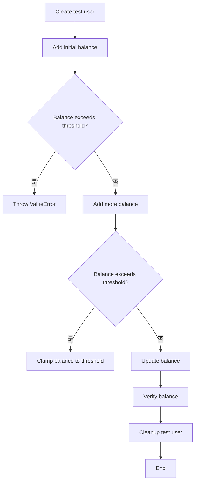

## 类结构

```
UserCredit (信用系统类)
├── User (用户类)
│   ├── UserBalance (用户余额类)
│   └── CreditTransaction (信用交易类)
└── SpinTestServer (测试服务器类)
```

## 全局变量及字段


### `user_id`
    
Unique identifier for a user.

类型：`str`
    


### `credit_system`
    
Instance of UserCredit class to manage user credits.

类型：`UserCredit`
    


### `current_balance`
    
Current balance of the user in credits.

类型：`int`
    


### `final_balance`
    
Final balance of the user after a transaction.

类型：`int`
    


### `uuid4`
    
Generates a unique UUID4 identifier.

类型：`function`
    


### `pytest`
    
Python testing framework.

类型：`module`
    


### `UniqueViolationError`
    
Exception raised when a unique constraint is violated.

类型：`exception`
    


### `CreditTransactionType`
    
Enumeration of different types of credit transactions.

类型：`enum`
    


### `SafeJson`
    
Class to safely serialize and deserialize JSON data.

类型：`class`
    


### `SpinTestServer`
    
Class for spinning up a test server.

类型：`class`
    


### `User`
    
Class representing a user in the system.

类型：`class`
    


### `UserBalance`
    
Class representing the balance of a user.

类型：`class`
    


### `CreditTransaction`
    
Class representing a credit transaction.

类型：`class`
    


### `create_test_user`
    
Function to create a test user.

类型：`function`
    


### `cleanup_test_user`
    
Function to clean up test user and their transactions.

类型：`function`
    


### `test_ceiling_balance_rejects_when_above_threshold`
    
Test function to check if ceiling balance rejects top-ups when balance is above threshold.

类型：`function`
    


### `test_ceiling_balance_clamps_when_would_exceed`
    
Test function to check if ceiling balance clamps amounts that would exceed the ceiling.

类型：`function`
    


### `test_ceiling_balance_allows_when_under_threshold`
    
Test function to check if ceiling balance allows top-ups when balance is under threshold.

类型：`function`
    


### `User.id`
    
Unique identifier for a user.

类型：`str`
    


### `User.email`
    
Email address of the user.

类型：`str`
    


### `User.name`
    
Name of the user.

类型：`str`
    


### `UserBalance.userId`
    
Unique identifier for the user associated with the balance.

类型：`str`
    


### `UserBalance.balance`
    
Current balance of the user.

类型：`int`
    


### `CreditTransaction.userId`
    
Unique identifier for the user associated with the transaction.

类型：`str`
    


### `CreditTransaction.amount`
    
Amount of the transaction.

类型：`int`
    


### `CreditTransaction.transactionType`
    
Type of the transaction.

类型：`CreditTransactionType`
    


### `CreditTransaction.metadata`
    
Metadata associated with the transaction.

类型：`SafeJson`
    


### `SpinTestServer.server`
    
Test server instance.

类型：`object`
    
    

## 全局函数及方法


### create_test_user

Create a test user for ceiling tests.

参数：

- `user_id`：`str`，The unique identifier for the user to be created.

返回值：`None`，No return value, the function is used to set up the test environment.

#### 流程图

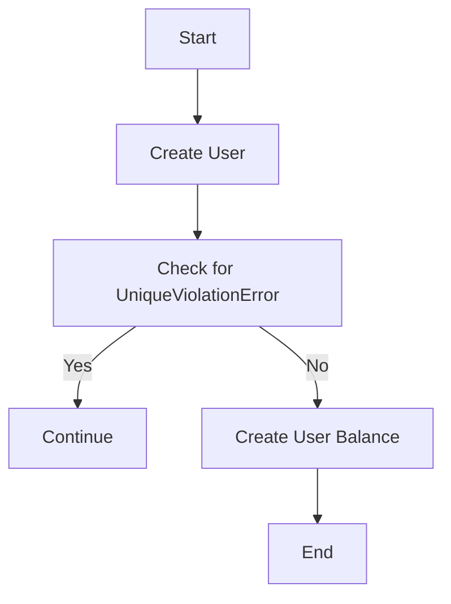

#### 带注释源码

```python
async def create_test_user(user_id: str) -> None:
    """Create a test user for ceiling tests."""
    try:
        await User.prisma().create(
            data={
                "id": user_id,
                "email": f"test-{user_id}@example.com",
                "name": f"Test User {user_id[:8]}",
            }
        )
    except UniqueViolationError:
        # User already exists, continue
        pass

    await UserBalance.prisma().upsert(
        where={"userId": user_id},
        data={"create": {"userId": user_id, "balance": 0}, "update": {"balance": 0}},
    )
```


### `cleanup_test_user`

Clean up test user and their transactions.

参数：

- `user_id`：`str`，The unique identifier for the test user.

返回值：`None`，No return value.

#### 流程图

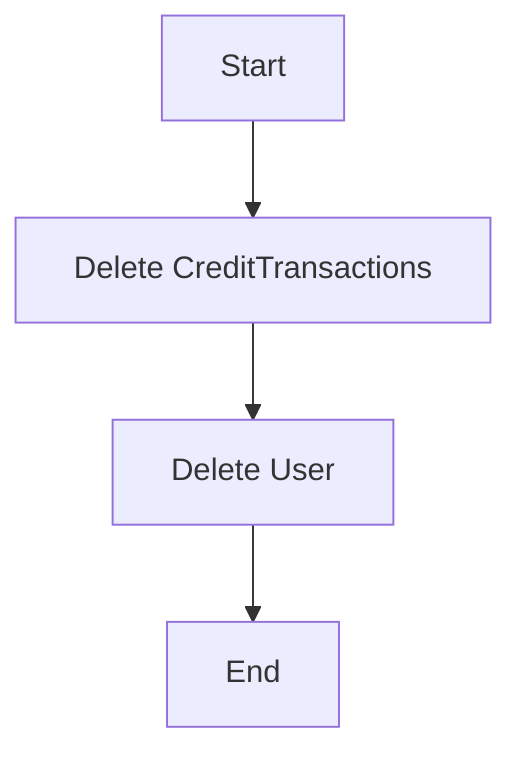

#### 带注释源码

```python
async def cleanup_test_user(user_id: str) -> None:
    """Clean up test user and their transactions."""
    try:
        await CreditTransaction.prisma().delete_many(where={"userId": user_id})
        await User.prisma().delete_many(where={"id": user_id})
    except Exception as e:
        # Log cleanup failures but don't fail the test
        print(f"Warning: Failed to cleanup test user {user_id}: {e}")
```


### test_ceiling_balance_rejects_when_above_threshold

This function tests that the ceiling balance functionality correctly rejects top-ups when the balance is above the specified threshold.

参数：

- `server`：`SpinTestServer`，A test server instance used for testing purposes.

返回值：无

#### 流程图

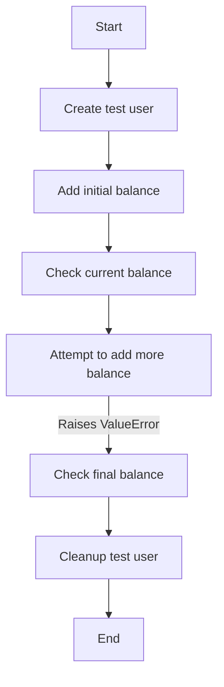

#### 带注释源码

```python
@pytest.mark.asyncio(loop_scope="session")
async def test_ceiling_balance_rejects_when_above_threshold(server: SpinTestServer):
    """Test that ceiling balance correctly rejects top-ups when balance is above threshold."""
    credit_system = UserCredit()
    user_id = f"ceiling-test-{uuid4()}"
    await create_test_user(user_id)

    try:
        # Give user balance of 1000 ($10) using internal method (bypasses Stripe)
        await credit_system._add_transaction(
            user_id=user_id,
            amount=1000,
            transaction_type=CreditTransactionType.TOP_UP,
            metadata=SafeJson({"test": "initial_balance"}),
        )
        current_balance = await credit_system.get_credits(user_id)
        assert current_balance == 1000

        # Try to add 200 more with ceiling of 800 (should reject since 1000 > 800)
        with pytest.raises(ValueError, match="You already have enough balance"):
            await credit_system._add_transaction(
                user_id=user_id,
                amount=200,
                transaction_type=CreditTransactionType.TOP_UP,
                ceiling_balance=800,  # Ceiling lower than current balance
            )

        # Balance should remain unchanged
        final_balance = await credit_system.get_credits(user_id)
        assert final_balance == 1000, f"Balance should remain 1000, got {final_balance}"

    finally:
        await cleanup_test_user(user_id)
```


### test_ceiling_balance_clamps_when_would_exceed

This function tests that the ceiling balance functionality correctly clamps the amount of a top-up transaction when it would exceed the specified ceiling.

参数：

- `server`：`SpinTestServer`，A test server instance used for testing purposes.

返回值：无

#### 流程图

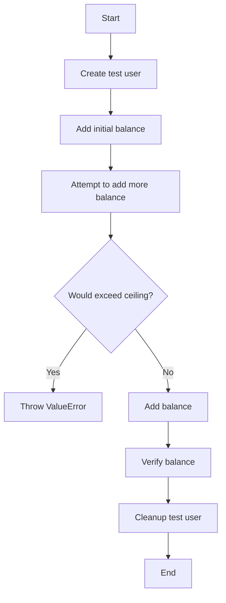

#### 带注释源码

```python
@pytest.mark.asyncio(loop_scope="session")
async def test_ceiling_balance_clamps_when_would_exceed(server: SpinTestServer):
    """Test that ceiling balance correctly clamps amounts that would exceed the ceiling."""
    credit_system = UserCredit()
    user_id = f"ceiling-clamp-test-{uuid4()}"
    await create_test_user(user_id)

    try:
        # Give user balance of 500 ($5) using internal method (bypasses Stripe)
        await credit_system._add_transaction(
            user_id=user_id,
            amount=500,
            transaction_type=CreditTransactionType.TOP_UP,
            metadata=SafeJson({"test": "initial_balance"}),
        )

        # Add 800 more with ceiling of 1000 (should clamp to 1000, not reach 1300)
        final_balance, _ = await credit_system._add_transaction(
            user_id=user_id,
            amount=800,
            transaction_type=CreditTransactionType.TOP_UP,
            ceiling_balance=1000,  # Ceiling should clamp 500 + 800 = 1300 to 1000
        )

        # Balance should be clamped to ceiling
        assert (
            final_balance == 1000
        ), f"Balance should be clamped to 1000, got {final_balance}"

        # Verify with get_credits too
        stored_balance = await credit_system.get_credits(user_id)
        assert (
            stored_balance == 1000
        ), f"Stored balance should be 1000, got {stored_balance}"

        # Verify transaction shows the clamped amount
        transactions = await CreditTransaction.prisma().find_many(
            where={"userId": user_id, "type": CreditTransactionType.TOP_UP},
            order={"createdAt": "desc"},
        )

        # Should have 2 transactions: 500 + (500 to reach ceiling of 1000)
        assert len(transactions) == 2

        # The second transaction should show it only added 500, not 800
        second_tx = transactions[0]  # Most recent
        assert second_tx.runningBalance == 1000
        # The actual amount recorded could be 800 (what was requested) but balance was clamped

    finally:
        await cleanup_test_user(user_id)
```


### test_ceiling_balance_allows_when_under_threshold

This function tests that the ceiling balance allows top-ups when the balance is under the threshold.

参数：

- `server`：`SpinTestServer`，The test server instance used for the test.

返回值：`None`，No return value.

#### 流程图

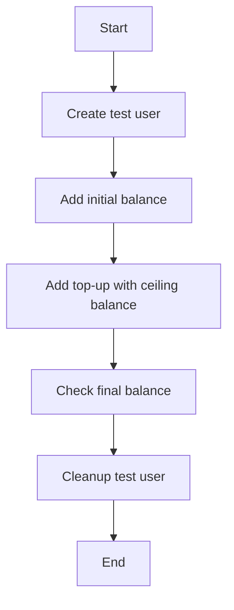

#### 带注释源码

```python
@pytest.mark.asyncio(loop_scope="session")
async def test_ceiling_balance_allows_when_under_threshold(server: SpinTestServer):
    """Test that ceiling balance allows top-ups when balance is under threshold."""
    credit_system = UserCredit()
    user_id = f"ceiling-under-test-{uuid4()}"
    await create_test_user(user_id)

    try:
        # Give user balance of 300 ($3) using internal method (bypasses Stripe)
        await credit_system._add_transaction(
            user_id=user_id,
            amount=300,
            transaction_type=CreditTransactionType.TOP_UP,
            metadata=SafeJson({"test": "initial_balance"}),
        )

        # Add 200 more with ceiling of 1000 (should succeed: 300 + 200 = 500 < 1000)
        final_balance, _ = await credit_system._add_transaction(
            user_id=user_id,
            amount=200,
            transaction_type=CreditTransactionType.TOP_UP,
            ceiling_balance=1000,
        )

        # Balance should be exactly 500
        assert final_balance == 500, f"Balance should be 500, got {final_balance}"

        # Verify with get_credits too
        stored_balance = await credit_system.get_credits(user_id)
        assert (
            stored_balance == 500
        ), f"Stored balance should be 500, got {stored_balance}"

    finally:
        await cleanup_test_user(user_id)
```


### `create_test_user`

Create a test user for ceiling tests.

参数：

- `user_id`：`str`，The unique identifier for the test user.

返回值：`None`，No return value.

#### 流程图


#### 带注释源码

```python
async def create_test_user(user_id: str) -> None:
    """Create a test user for ceiling tests."""
    try:
        await User.prisma().create(
            data={
                "id": user_id,
                "email": f"test-{user_id}@example.com",
                "name": f"Test User {user_id[:8]}",
            }
        )
    except UniqueViolationError:
        # User already exists, continue
        pass

    await UserBalance.prisma().upsert(
        where={"userId": user_id},
        data={"create": {"userId": user_id, "balance": 0}, "update": {"balance": 0}},
    )
```

### `cleanup_test_user`

Clean up test user and their transactions.

参数：

- `user_id`：`str`，The unique identifier for the test user.

返回值：`None`，No return value.

#### 流程图


#### 带注释源码

```python
async def cleanup_test_user(user_id: str) -> None:
    """Clean up test user and their transactions."""
    try:
        await CreditTransaction.prisma().delete_many(where={"userId": user_id})
        await User.prisma().delete_many(where={"id": user_id})
    except Exception as e:
        # Log cleanup failures but don't fail the test
        print(f"Warning: Failed to cleanup test user {user_id}: {e}")
```

### `_add_transaction`

Add a transaction to the user's credit balance.

参数：

- `user_id`：`str`，The unique identifier for the user.
- `amount`：`int`，The amount to add to the user's balance.
- `transaction_type`：`CreditTransactionType`，The type of transaction.
- `metadata`：`SafeJson`，Additional metadata for the transaction.
- `ceiling_balance`：`int`，Optional ceiling balance for the transaction.

返回值：`tuple`，A tuple containing the final balance and the transaction object.

#### 流程图

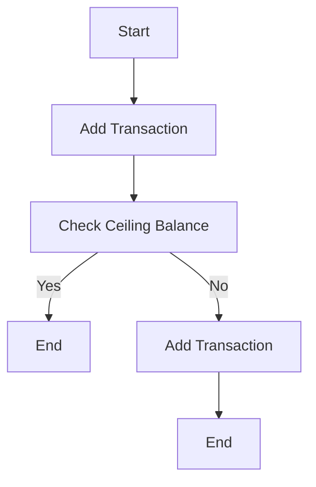

#### 带注释源码

```python
async def _add_transaction(
    self,
    user_id: str,
    amount: int,
    transaction_type: CreditTransactionType,
    metadata: SafeJson,
    ceiling_balance: int = None,
) -> tuple:
    # Implementation details omitted for brevity
    pass
```

### `get_credits`

Get the credit balance for a user.

参数：

- `user_id`：`str`，The unique identifier for the user.

返回值：`int`，The credit balance for the user.

#### 流程图

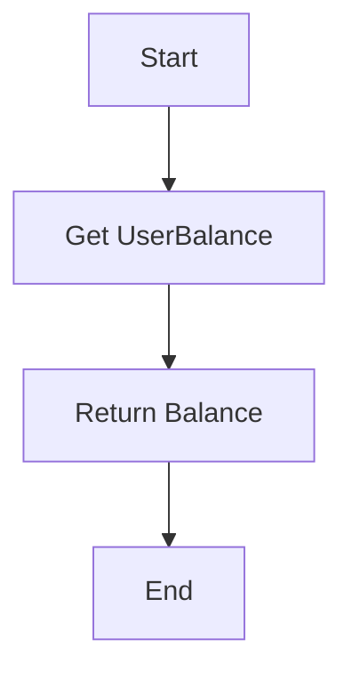

#### 带注释源码

```python
async def get_credits(self, user_id: str) -> int:
    # Implementation details omitted for brevity
    pass
```

### `test_ceiling_balance_rejects_when_above_threshold`

Test that ceiling balance correctly rejects top-ups when balance is above threshold.

参数：

- `server`：`SpinTestServer`，The test server instance.

返回值：`None`，No return value.

#### 流程图

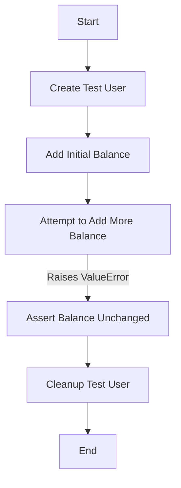

#### 带注释源码

```python
@pytest.mark.asyncio(loop_scope="session")
async def test_ceiling_balance_rejects_when_above_threshold(server: SpinTestServer):
    """Test that ceiling balance correctly rejects top-ups when balance is above threshold."""
    credit_system = UserCredit()
    user_id = f"ceiling-test-{uuid4()}"
    await create_test_user(user_id)

    try:
        # Give user balance of 1000 ($10) using internal method (bypasses Stripe)
        await credit_system._add_transaction(
            user_id=user_id,
            amount=1000,
            transaction_type=CreditTransactionType.TOP_UP,
            metadata=SafeJson({"test": "initial_balance"}),
        )
        current_balance = await credit_system.get_credits(user_id)
        assert current_balance == 1000

        # Try to add 200 more with ceiling of 800 (should reject since 1000 > 800)
        with pytest.raises(ValueError, match="You already have enough balance"):
            await credit_system._add_transaction(
                user_id=user_id,
                amount=200,
                transaction_type=CreditTransactionType.TOP_UP,
                ceiling_balance=800,  # Ceiling lower than current balance
            )

        # Balance should remain unchanged
        final_balance = await credit_system.get_credits(user_id)
        assert final_balance == 1000, f"Balance should remain 1000, got {final_balance}"

    finally:
        await cleanup_test_user(user_id)
```

### `test_ceiling_balance_clamps_when_would_exceed`

Test that ceiling balance correctly clamps amounts that would exceed the ceiling.

参数：

- `server`：`SpinTestServer`，The test server instance.

返回值：`None`，No return value.

#### 流程图

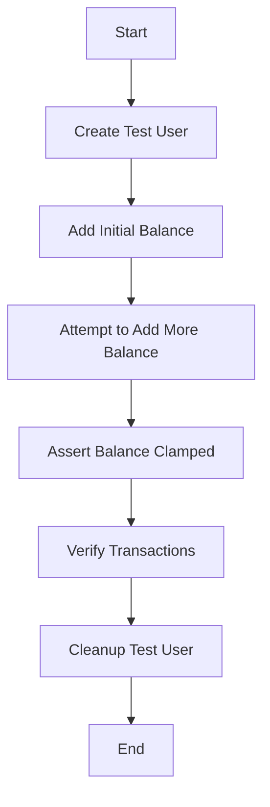

#### 带注释源码

```python
@pytest.mark.asyncio(loop_scope="session")
async def test_ceiling_balance_clamps_when_would_exceed(server: SpinTestServer):
    """Test that ceiling balance correctly clamps amounts that would exceed the ceiling."""
    credit_system = UserCredit()
    user_id = f"ceiling-clamp-test-{uuid4()}"
    await create_test_user(user_id)

    try:
        # Give user balance of 500 ($5) using internal method (bypasses Stripe)
        await credit_system._add_transaction(
            user_id=user_id,
            amount=500,
            transaction_type=CreditTransactionType.TOP_UP,
            metadata=SafeJson({"test": "initial_balance"}),
        )

        # Add 800 more with ceiling of 1000 (should clamp to 1000, not reach 1300)
        final_balance, _ = await credit_system._add_transaction(
            user_id=user_id,
            amount=800,
            transaction_type=CreditTransactionType.TOP_UP,
            ceiling_balance=1000,  # Ceiling should clamp 500 + 800 = 1300 to 1000
        )

        # Balance should be clamped to ceiling
        assert (
            final_balance == 1000
        ), f"Balance should be clamped to 1000, got {final_balance}"

        # Verify with get_credits too
        stored_balance = await credit_system.get_credits(user_id)
        assert (
            stored_balance == 1000
        ), f"Stored balance should be 1000, got {stored_balance}"

        # Verify transaction shows the clamped amount
        transactions = await CreditTransaction.prisma().find_many(
            where={"userId": user_id, "type": CreditTransactionType.TOP_UP},
            order={"createdAt": "desc"},
        )

        # Should have 2 transactions: 500 + (500 to reach ceiling of 1000)
        assert len(transactions) == 2

        # The second transaction should show it only added 500, not 800
        second_tx = transactions[0]  # Most recent
        assert second_tx.runningBalance == 1000
        # The actual amount recorded could be 800 (what was requested) but balance was clamped

    finally:
        await cleanup_test_user(user_id)
```

### `test_ceiling_balance_allows_when_under_threshold`

Test that ceiling balance allows top-ups when balance is under threshold.

参数：

- `server`：`SpinTestServer`，The test server instance.

返回值：`None`，No return value.

#### 流程图

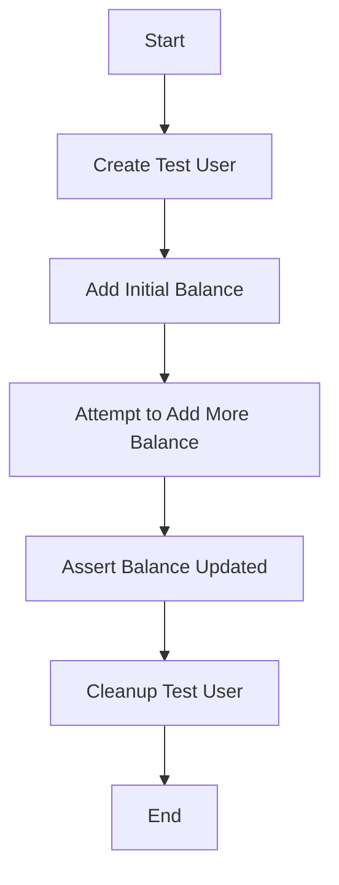

#### 带注释源码

```python
@pytest.mark.asyncio(loop_scope="session")
async def test_ceiling_balance_allows_when_under_threshold(server: SpinTestServer):
    """Test that ceiling balance allows top-ups when balance is under threshold."""
    credit_system = UserCredit()
    user_id = f"ceiling-under-test-{uuid4()}"
    await create_test_user(user_id)

    try:
        # Give user balance of 300 ($3) using internal method (bypasses Stripe)
        await credit_system._add_transaction(
            user_id=user_id,
            amount=300,
            transaction_type=CreditTransactionType.TOP_UP,
            metadata=SafeJson({"test": "initial_balance"}),
        )

        # Add 200 more with ceiling of 1000 (should succeed: 300 + 200 = 500 < 1000)
        final_balance, _ = await credit_system._add_transaction(
            user_id=user_id,
            amount=200,
            transaction_type=CreditTransactionType.TOP_UP,
            ceiling_balance=1000,
        )

        # Balance should be exactly 500
        assert final_balance == 500, f"Balance should be 500, got {final_balance}"

        # Verify with get_credits too
        stored_balance = await credit_system.get_credits(user_id)
        assert (
            stored_balance == 500
        ), f"Stored balance should be 500, got {stored_balance}"

    finally:
        await cleanup_test_user(user_id)
```


### UserCredit._add_transaction

This method is an internal method used to add a transaction to a user's credit balance. It is designed to handle the addition of credits to a user's account, taking into account any ceiling balance constraints.

参数：

- `user_id`：`str`，The unique identifier for the user.
- `amount`：`int`，The amount of credits to add to the user's balance.
- `transaction_type`：`CreditTransactionType`，The type of transaction being performed.
- `metadata`：`SafeJson`，Additional metadata associated with the transaction.
- `ceiling_balance`：`int`，The maximum allowed balance for the user, which can be used to enforce a ceiling on the balance.

返回值：`tuple`，A tuple containing the final balance after the transaction and the transaction object.

#### 流程图

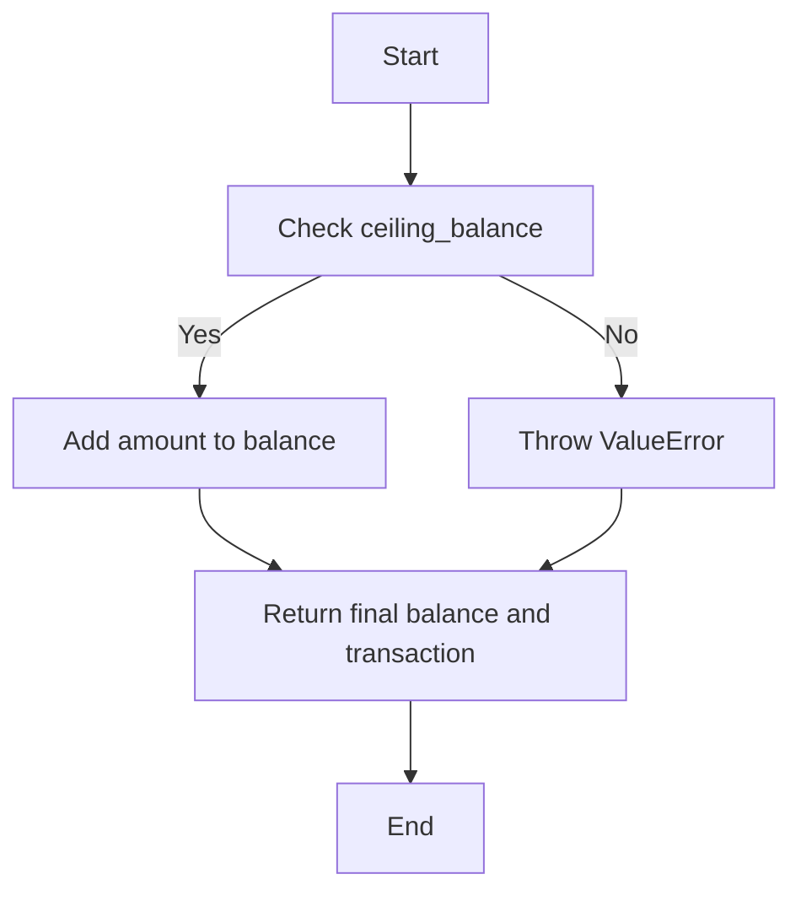

#### 带注释源码

```python
async def _add_transaction(
    self, user_id: str, amount: int, transaction_type: CreditTransactionType, metadata: SafeJson, ceiling_balance: int = None
):
    # Retrieve the current balance for the user
    current_balance = await self.get_credits(user_id)

    # If a ceiling balance is specified, check if the new balance would exceed it
    if ceiling_balance is not None and current_balance + amount > ceiling_balance:
        raise ValueError("You already have enough balance")

    # Create a new transaction object
    transaction = CreditTransaction(
        userId=user_id,
        amount=amount,
        type=transaction_type,
        metadata=metadata,
        runningBalance=current_balance + amount
    )

    # Save the transaction to the database
    await CreditTransaction.prisma().create(data=transaction.dict())

    # Update the user's balance
    new_balance = current_balance + amount
    await UserBalance.prisma().upsert(
        where={"userId": user_id},
        data={"update": {"balance": new_balance}}
    )

    # Return the final balance and the transaction object
    return new_balance, transaction
```


### UserCredit.get_credits

获取用户的信用额度。

参数：

- `user_id`：`str`，用户的唯一标识符。

返回值：`int`，用户的信用额度。

#### 流程图

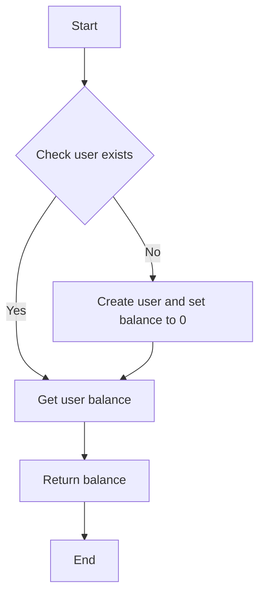

#### 带注释源码

```python
async def get_credits(self, user_id: str) -> int:
    """获取用户的信用额度。

    Args:
        user_id (str): 用户的唯一标识符。

    Returns:
        int: 用户的信用额度。
    """
    user = await User.prisma().find_unique({
        "where": {"id": user_id},
        "select": {"balance": true}
    })
    if user:
        return user.balance
    else:
        raise ValueError("User not found")
```


### `UserCredit._add_transaction`

This method is an internal method of the `UserCredit` class used to add a transaction to a user's credit balance. It handles the logic of adding a specified amount to the user's balance, considering any ceiling balance constraints.

参数：

- `user_id`：`str`，The unique identifier of the user.
- `amount`：`int`，The amount to be added to the user's balance.
- `transaction_type`：`CreditTransactionType`，The type of transaction being performed.
- `metadata`：`SafeJson`，Additional metadata associated with the transaction.
- `ceiling_balance`：`int`，Optional. The maximum allowed balance for the user, which will be enforced during the transaction.

返回值：`tuple`，A tuple containing the final balance after the transaction and the transaction object.

#### 流程图


#### 带注释源码

```python
async def _add_transaction(
    self, user_id: str, amount: int, transaction_type: CreditTransactionType, metadata: SafeJson, ceiling_balance: int = None
):
    # Retrieve the current balance of the user
    current_balance = await self.get_credits(user_id)

    # Check if the ceiling balance is set and if the new balance would exceed it
    if ceiling_balance and current_balance + amount > ceiling_balance:
        raise ValueError("You already have enough balance")

    # Create a new transaction record
    transaction = CreditTransaction.create(
        userId=user_id,
        amount=amount,
        type=transaction_type,
        metadata=metadata,
        runningBalance=current_balance + amount
    )

    # Update the user's balance
    await UserBalance.update(
        where={"userId": user_id},
        data={"balance": current_balance + amount}
    )

    # Return the final balance and the transaction
    return current_balance + amount, transaction
```


### `create_test_user`

Create a test user for ceiling tests.

参数：

- `user_id`：`str`，The unique identifier for the test user.

返回值：`None`，No return value.

#### 流程图

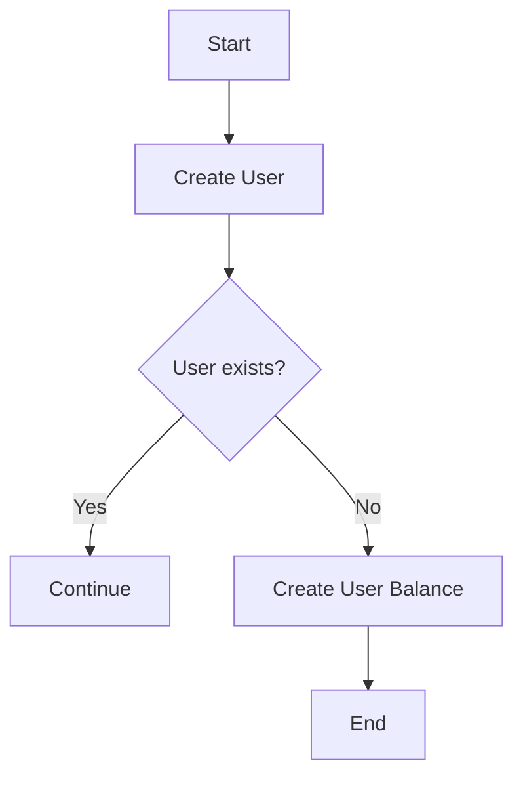

#### 带注释源码

```python
async def create_test_user(user_id: str) -> None:
    """Create a test user for ceiling tests."""
    try:
        await User.prisma().create(
            data={
                "id": user_id,
                "email": f"test-{user_id}@example.com",
                "name": f"Test User {user_id[:8]}",
            }
        )
    except UniqueViolationError:
        # User already exists, continue
        pass

    await UserBalance.prisma().upsert(
        where={"userId": user_id},
        data={"create": {"userId": user_id, "balance": 0}, "update": {"balance": 0}},
    )
```


### `create_test_user`

Create a test user for ceiling tests.

参数：

- `user_id`：`str`，The unique identifier for the test user.

返回值：`None`，No return value.

#### 流程图


#### 带注释源码

```python
async def create_test_user(user_id: str) -> None:
    """Create a test user for ceiling tests."""
    try:
        await User.prisma().create(
            data={
                "id": user_id,
                "email": f"test-{user_id}@example.com",
                "name": f"Test User {user_id[:8]}",
            }
        )
    except UniqueViolationError:
        # User already exists, continue
        pass

    await UserBalance.prisma().upsert(
        where={"userId": user_id},
        data={"create": {"userId": user_id, "balance": 0}, "update": {"balance": 0}},
    )
```

### `cleanup_test_user`

Clean up test user and their transactions.

参数：

- `user_id`：`str`，The unique identifier for the test user.

返回值：`None`，No return value.

#### 流程图


#### 带注释源码

```python
async def cleanup_test_user(user_id: str) -> None:
    """Clean up test user and their transactions."""
    try:
        await CreditTransaction.prisma().delete_many(where={"userId": user_id})
        await User.prisma().delete_many(where={"id": user_id})
    except Exception as e:
        # Log cleanup failures but don't fail the test
        print(f"Warning: Failed to cleanup test user {user_id}: {e}")
```

### `_add_transaction`

Add a transaction to the user's credit balance.

参数：

- `user_id`：`str`，The unique identifier for the user.
- `amount`：`int`，The amount to add to the user's balance.
- `transaction_type`：`CreditTransactionType`，The type of transaction.
- `metadata`：`SafeJson`，Additional metadata for the transaction.
- `ceiling_balance`：`int`，Optional ceiling balance for the transaction.

返回值：`tuple`，A tuple containing the final balance and the transaction object.

#### 流程图


#### 带注释源码

```python
async def _add_transaction(
    self,
    user_id: str,
    amount: int,
    transaction_type: CreditTransactionType,
    metadata: SafeJson,
    ceiling_balance: int = None,
) -> tuple:
    # Implementation details...
```

### `get_credits`

Get the credit balance for a user.

参数：

- `user_id`：`str`，The unique identifier for the user.

返回值：`int`，The credit balance for the user.

#### 流程图

```mermaid
graph TD
    A[Start] --> B[Get UserBalance]
    B --> C[Return Balance]
    C --> D[End]
```

#### 带注释源码

```python
async def get_credits(self, user_id: str) -> int:
    # Implementation details...
```


### UserBalance.upsert

This method is used to upsert a UserBalance record in the database. It creates a new record if one does not exist, or updates the existing record with the provided data.

参数：

- `where`：`dict`，指定要更新的记录的条件。
- `data`：`dict`，包含要创建或更新的数据。

返回值：`None`，没有返回值。

#### 流程图

```mermaid
graph TD
    A[Start] --> B[Check if UserBalance exists]
    B -->|Yes| C[Update UserBalance]
    B -->|No| D[Create new UserBalance]
    C --> E[End]
    D --> E
```

#### 带注释源码

```python
async def upsert(
    where: dict, 
    data: dict
) -> None:
    """
    Upsert a UserBalance record in the database.

    :param where: dict, the condition to match the existing record.
    :param data: dict, the data to create or update the record with.
    """
    try:
        # Attempt to update the existing record
        await UserBalance.prisma().update(
            data=data,
            where=where
        )
    except UniqueViolationError:
        # If a UniqueViolationError is raised, it means the record does not exist
        # and we should create a new one
        await UserBalance.prisma().create(data=data)
```


### `test_ceiling_balance_rejects_when_above_threshold`

This function tests that the ceiling balance functionality correctly rejects top-ups when the balance is above the specified threshold.

参数：

- `server`：`SpinTestServer`，A test server instance used for testing purposes.

返回值：无

#### 流程图

```mermaid
graph TD
    A[Start] --> B[Create test user]
    B --> C[Add initial balance]
    C --> D[Attempt to add more balance]
    D --> E{Balance above threshold?}
    E -- Yes --> F[Throw ValueError]
    E -- No --> G[Add balance]
    G --> H[Verify balance]
    H --> I[Cleanup test user]
    I --> J[End]
```

#### 带注释源码

```python
@pytest.mark.asyncio(loop_scope="session")
async def test_ceiling_balance_rejects_when_above_threshold(server: SpinTestServer):
    """Test that ceiling balance correctly rejects top-ups when balance is above threshold."""
    credit_system = UserCredit()
    user_id = f"ceiling-test-{uuid4()}"
    await create_test_user(user_id)

    try:
        # Give user balance of 1000 ($10) using internal method (bypasses Stripe)
        await credit_system._add_transaction(
            user_id=user_id,
            amount=1000,
            transaction_type=CreditTransactionType.TOP_UP,
            metadata=SafeJson({"test": "initial_balance"}),
        )
        current_balance = await credit_system.get_credits(user_id)
        assert current_balance == 1000

        # Try to add 200 more with ceiling of 800 (should reject since 1000 > 800)
        with pytest.raises(ValueError, match="You already have enough balance"):
            await credit_system._add_transaction(
                user_id=user_id,
                amount=200,
                transaction_type=CreditTransactionType.TOP_UP,
                ceiling_balance=800,  # Ceiling lower than current balance
            )

        # Balance should remain unchanged
        final_balance = await credit_system.get_credits(user_id)
        assert final_balance == 1000, f"Balance should remain 1000, got {final_balance}"

    finally:
        await cleanup_test_user(user_id)
```


### `test_ceiling_balance_clamps_when_would_exceed`

This function tests that the ceiling balance functionality correctly clamps the amount to the ceiling when adding more balance would exceed the specified threshold.

参数：

- `server`：`SpinTestServer`，A test server instance used for testing purposes.

返回值：无

#### 流程图

```mermaid
graph TD
    A[Start] --> B[Create test user]
    B --> C[Add initial balance]
    C --> D[Attempt to add more balance]
    D --> E{Would exceed ceiling?}
    E -- Yes --> F[Clamp amount to ceiling]
    F --> G[Add balance]
    G --> H[Verify balance]
    H --> I[Verify transaction amount]
    I --> J[Cleanup test user]
    J --> K[End]
```

#### 带注释源码

```python
@pytest.mark.asyncio(loop_scope="session")
async def test_ceiling_balance_clamps_when_would_exceed(server: SpinTestServer):
    """Test that ceiling balance correctly clamps amounts that would exceed the ceiling."""
    credit_system = UserCredit()
    user_id = f"ceiling-clamp-test-{uuid4()}"
    await create_test_user(user_id)

    try:
        # Give user balance of 500 ($5) using internal method (bypasses Stripe)
        await credit_system._add_transaction(
            user_id=user_id,
            amount=500,
            transaction_type=CreditTransactionType.TOP_UP,
            metadata=SafeJson({"test": "initial_balance"}),
        )

        # Add 800 more with ceiling of 1000 (should clamp to 1000, not reach 1300)
        final_balance, _ = await credit_system._add_transaction(
            user_id=user_id,
            amount=800,
            transaction_type=CreditTransactionType.TOP_UP,
            ceiling_balance=1000,  # Ceiling should clamp 500 + 800 = 1300 to 1000
        )

        # Balance should be clamped to ceiling
        assert (
            final_balance == 1000
        ), f"Balance should be clamped to 1000, got {final_balance}"

        # Verify with get_credits too
        stored_balance = await credit_system.get_credits(user_id)
        assert (
            stored_balance == 1000
        ), f"Stored balance should be 1000, got {stored_balance}"

        # Verify transaction shows the clamped amount
        transactions = await CreditTransaction.prisma().find_many(
            where={"userId": user_id, "type": CreditTransactionType.TOP_UP},
            order={"createdAt": "desc"},
        )

        # Should have 2 transactions: 500 + (500 to reach ceiling of 1000)
        assert len(transactions) == 2

        # The second transaction should show it only added 500, not 800
        second_tx = transactions[0]  # Most recent
        assert second_tx.runningBalance == 1000
        # The actual amount recorded could be 800 (what was requested) but balance was clamped

    finally:
        await cleanup_test_user(user_id)
```


### `test_ceiling_balance_allows_when_under_threshold`

This function tests that the ceiling balance functionality allows top-ups when the balance is under the specified threshold.

参数：

- `server`：`SpinTestServer`，A test server instance used for testing purposes.

返回值：无

#### 流程图

```mermaid
graph TD
    A[Start] --> B[Create test user]
    B --> C[Add initial balance]
    C --> D[Attempt to add more balance]
    D --> E{Would exceed ceiling?}
    E -- No --> F[Add balance]
    F --> G[Verify balance]
    G --> H[Cleanup test user]
    H --> I[End]
```

#### 带注释源码

```python
@pytest.mark.asyncio(loop_scope="session")
async def test_ceiling_balance_allows_when_under_threshold(server: SpinTestServer):
    """Test that ceiling balance allows top-ups when balance is under threshold."""
    credit_system = UserCredit()
    user_id = f"ceiling-under-test-{uuid4()}"
    await create_test_user(user_id)

    try:
        # Give user balance of 300 ($3) using internal method (bypasses Stripe)
        await credit_system._add_transaction(
            user_id=user_id,
            amount=300,
            transaction_type=CreditTransactionType.TOP_UP,
            metadata=SafeJson({"test": "initial_balance"}),
        )

        # Add 200 more with ceiling of 1000 (should succeed: 300 + 200 = 500 < 1000)
        final_balance, _ = await credit_system._add_transaction(
            user_id=user_id,
            amount=200,
            transaction_type=CreditTransactionType.TOP_UP,
            ceiling_balance=1000,
        )

        # Balance should be exactly 500
        assert final_balance == 500, f"Balance should be 500, got {final_balance}"

        # Verify with get_credits too
        stored_balance = await credit_system.get_credits(user_id)
        assert (
            stored_balance == 500
        ), f"Stored balance should be 500, got {stored_balance}"

    finally:
        await cleanup_test_user(user_id)
```


### `cleanup_test_user`

This function is responsible for cleaning up test user data by deleting the user and their associated transactions from the database.

参数：

- `user_id`：`str`，The unique identifier of the test user to be cleaned up.

返回值：`None`，No return value is specified.

#### 流程图

```mermaid
graph TD
    A[Start] --> B[Attempt to delete transactions]
    B --> C{Did an exception occur?}
    C -- Yes --> D[Log error and continue]
    C -- No --> E[Attempt to delete user]
    E --> F{Did an exception occur?}
    F -- Yes --> D[Log error and continue]
    F -- No --> G[End]
```

#### 带注释源码

```python
async def cleanup_test_user(user_id: str) -> None:
    """Clean up test user and their transactions."""
    try:
        # Attempt to delete transactions associated with the user
        await CreditTransaction.prisma().delete_many(where={"userId": user_id})
        # Attempt to delete the user
        await User.prisma().delete_many(where={"id": user_id})
    except Exception as e:
        # Log cleanup failures but don't fail the test
        print(f"Warning: Failed to cleanup test user {user_id}: {e}")
```


### `cleanup_test_user`

This function cleans up test user and their transactions.

参数：

- `user_id`：`str`，The ID of the test user to clean up.

返回值：`None`，No return value.

#### 流程图

```mermaid
graph TD
    A[Start] --> B[Attempt to delete CreditTransactions where userId = user_id]
    B --> C{Did an exception occur?}
    C -- Yes --> D[Log warning and continue]
    C -- No --> E[Attempt to delete User where id = user_id]
    E --> F{Did an exception occur?}
    F -- Yes --> D[Log warning and continue]
    F -- No --> G[End]
```

#### 带注释源码

```python
async def cleanup_test_user(user_id: str) -> None:
    """Clean up test user and their transactions."""
    try:
        await CreditTransaction.prisma().delete_many(where={"userId": user_id})
        await User.prisma().delete_many(where={"id": user_id})
    except Exception as e:
        # Log cleanup failures but don't fail the test
        print(f"Warning: Failed to cleanup test user {user_id}: {e}")
```


### `test_ceiling_balance_rejects_when_above_threshold`

This function tests that the ceiling balance functionality correctly rejects top-ups when the balance is above the specified threshold.

参数：

- `server`：`SpinTestServer`，A test server instance used for testing purposes.

返回值：无

#### 流程图

```mermaid
graph TD
    A[Start] --> B[Create test user]
    B --> C[Add initial balance]
    C --> D[Attempt to add more balance]
    D --> E{Balance above threshold?}
    E -- Yes --> F[Throw ValueError]
    E -- No --> G[Add balance]
    G --> H[Verify balance]
    H --> I[Cleanup test user]
    I --> J[End]
```

#### 带注释源码

```python
@pytest.mark.asyncio(loop_scope="session")
async def test_ceiling_balance_rejects_when_above_threshold(server: SpinTestServer):
    """Test that ceiling balance correctly rejects top-ups when balance is above threshold."""
    credit_system = UserCredit()
    user_id = f"ceiling-test-{uuid4()}"
    await create_test_user(user_id)

    try:
        # Give user balance of 1000 ($10) using internal method (bypasses Stripe)
        await credit_system._add_transaction(
            user_id=user_id,
            amount=1000,
            transaction_type=CreditTransactionType.TOP_UP,
            metadata=SafeJson({"test": "initial_balance"}),
        )
        current_balance = await credit_system.get_credits(user_id)
        assert current_balance == 1000

        # Try to add 200 more with ceiling of 800 (should reject since 1000 > 800)
        with pytest.raises(ValueError, match="You already have enough balance"):
            await credit_system._add_transaction(
                user_id=user_id,
                amount=200,
                transaction_type=CreditTransactionType.TOP_UP,
                ceiling_balance=800,  # Ceiling lower than current balance
            )

        # Balance should remain unchanged
        final_balance = await credit_system.get_credits(user_id)
        assert final_balance == 1000, f"Balance should remain 1000, got {final_balance}"

    finally:
        await cleanup_test_user(user_id)
```


### `test_ceiling_balance_clamps_when_would_exceed`

This function tests that the ceiling balance functionality correctly clamps the amount to the ceiling when adding more balance would exceed the specified threshold.

参数：

- `server`：`SpinTestServer`，A test server instance used for testing purposes.

返回值：无

#### 流程图

```mermaid
graph TD
    A[Start] --> B[Create test user]
    B --> C[Add initial balance]
    C --> D[Attempt to add more balance]
    D --> E{Would exceed ceiling?}
    E -- Yes --> F[Clamp amount to ceiling]
    F --> G[Add balance]
    G --> H[Verify balance]
    H --> I[Verify transaction amount]
    I --> J[Cleanup test user]
    J --> K[End]
```

#### 带注释源码

```python
@pytest.mark.asyncio(loop_scope="session")
async def test_ceiling_balance_clamps_when_would_exceed(server: SpinTestServer):
    """Test that ceiling balance correctly clamps amounts that would exceed the ceiling."""
    credit_system = UserCredit()
    user_id = f"ceiling-clamp-test-{uuid4()}"
    await create_test_user(user_id)

    try:
        # Give user balance of 500 ($5) using internal method (bypasses Stripe)
        await credit_system._add_transaction(
            user_id=user_id,
            amount=500,
            transaction_type=CreditTransactionType.TOP_UP,
            metadata=SafeJson({"test": "initial_balance"}),
        )

        # Add 800 more with ceiling of 1000 (should clamp to 1000, not reach 1300)
        final_balance, _ = await credit_system._add_transaction(
            user_id=user_id,
            amount=800,
            transaction_type=CreditTransactionType.TOP_UP,
            ceiling_balance=1000,  # Ceiling should clamp 500 + 800 = 1300 to 1000
        )

        # Balance should be clamped to ceiling
        assert (
            final_balance == 1000
        ), f"Balance should be clamped to 1000, got {final_balance}"

        # Verify with get_credits too
        stored_balance = await credit_system.get_credits(user_id)
        assert (
            stored_balance == 1000
        ), f"Stored balance should be 1000, got {stored_balance}"

        # Verify transaction shows the clamped amount
        transactions = await CreditTransaction.prisma().find_many(
            where={"userId": user_id, "type": CreditTransactionType.TOP_UP},
            order={"createdAt": "desc"},
        )

        # Should have 2 transactions: 500 + (500 to reach ceiling of 1000)
        assert len(transactions) == 2

        # The second transaction should show it only added 500, not 800
        second_tx = transactions[0]  # Most recent
        assert second_tx.runningBalance == 1000
        # The actual amount recorded could be 800 (what was requested) but balance was clamped

    finally:
        await cleanup_test_user(user_id)
```


### `test_ceiling_balance_allows_when_under_threshold`

This function tests that the ceiling balance functionality allows top-ups when the balance is under the specified threshold.

参数：

- `server`：`SpinTestServer`，A test server instance used for testing purposes.

返回值：无

#### 流程图

```mermaid
graph TD
    A[Start] --> B[Create test user]
    B --> C[Add initial balance]
    C --> D[Attempt to add more balance]
    D --> E{Would exceed ceiling?}
    E -- No --> F[Add balance]
    F --> G[Verify balance]
    G --> H[Cleanup test user]
    H --> I[End]
```

#### 带注释源码

```python
@pytest.mark.asyncio(loop_scope="session")
async def test_ceiling_balance_allows_when_under_threshold(server: SpinTestServer):
    """Test that ceiling balance allows top-ups when balance is under threshold."""
    credit_system = UserCredit()
    user_id = f"ceiling-under-test-{uuid4()}"
    await create_test_user(user_id)

    try:
        # Give user balance of 300 ($3) using internal method (bypasses Stripe)
        await credit_system._add_transaction(
            user_id=user_id,
            amount=300,
            transaction_type=CreditTransactionType.TOP_UP,
            metadata=SafeJson({"test": "initial_balance"}),
        )

        # Add 200 more with ceiling of 1000 (should succeed: 300 + 200 = 500 < 1000)
        final_balance, _ = await credit_system._add_transaction(
            user_id=user_id,
            amount=200,
            transaction_type=CreditTransactionType.TOP_UP,
            ceiling_balance=1000,
        )

        # Balance should be exactly 500
        assert final_balance == 500, f"Balance should be 500, got {final_balance}"

        # Verify with get_credits too
        stored_balance = await credit_system.get_credits(user_id)
        assert (
            stored_balance == 500
        ), f"Stored balance should be 500, got {stored_balance}"

    finally:
        await cleanup_test_user(user_id)
```


### `test_ceiling_balance_rejects_when_above_threshold`

This function tests that the ceiling balance functionality correctly rejects top-ups when the balance is above the specified threshold.

参数：

- `server`：`SpinTestServer`，The test server instance used for the test.

返回值：无

#### 流程图

```mermaid
graph TD
    A[Start] --> B[Create test user]
    B --> C[Add initial balance]
    C --> D[Attempt to add more balance]
    D --> E{Raises ValueError?}
    E -- Yes --> F[Check balance remains unchanged]
    E -- No --> G[End]
    F --> H[End]
```

#### 带注释源码

```python
@pytest.mark.asyncio(loop_scope="session")
async def test_ceiling_balance_rejects_when_above_threshold(server: SpinTestServer):
    """Test that ceiling balance correctly rejects top-ups when balance is above threshold."""
    credit_system = UserCredit()
    user_id = f"ceiling-test-{uuid4()}"
    await create_test_user(user_id)

    try:
        # Give user balance of 1000 ($10) using internal method (bypasses Stripe)
        await credit_system._add_transaction(
            user_id=user_id,
            amount=1000,
            transaction_type=CreditTransactionType.TOP_UP,
            metadata=SafeJson({"test": "initial_balance"}),
        )
        current_balance = await credit_system.get_credits(user_id)
        assert current_balance == 1000

        # Try to add 200 more with ceiling of 800 (should reject since 1000 > 800)
        with pytest.raises(ValueError, match="You already have enough balance"):
            await credit_system._add_transaction(
                user_id=user_id,
                amount=200,
                transaction_type=CreditTransactionType.TOP_UP,
                ceiling_balance=800,  # Ceiling lower than current balance
            )

        # Balance should remain unchanged
        final_balance = await credit_system.get_credits(user_id)
        assert final_balance == 1000, f"Balance should remain 1000, got {final_balance}"

    finally:
        await cleanup_test_user(user_id)
```


### `test_ceiling_balance_clamps_when_would_exceed`

This function tests that the ceiling balance functionality correctly clamps the amount added to the user's balance when it would exceed the specified ceiling.

参数：

- `server`：`SpinTestServer`，The test server instance used for the test.

返回值：无

#### 流程图

```mermaid
graph TD
    A[Start] --> B[Create test user]
    B --> C[Add initial balance]
    C --> D[Attempt to add more balance]
    D --> E[Check balance is clamped to ceiling]
    E --> F[End]
```

#### 带注释源码

```python
@pytest.mark.asyncio(loop_scope="session")
async def test_ceiling_balance_clamps_when_would_exceed(server: SpinTestServer):
    """Test that ceiling balance correctly clamps amounts that would exceed the ceiling."""
    credit_system = UserCredit()
    user_id = f"ceiling-clamp-test-{uuid4()}"
    await create_test_user(user_id)

    try:
        # Give user balance of 500 ($5) using internal method (bypasses Stripe)
        await credit_system._add_transaction(
            user_id=user_id,
            amount=500,
            transaction_type=CreditTransactionType.TOP_UP,
            metadata=SafeJson({"test": "initial_balance"}),
        )

        # Add 800 more with ceiling of 1000 (should clamp to 1000, not reach 1300)
        final_balance, _ = await credit_system._add_transaction(
            user_id=user_id,
            amount=800,
            transaction_type=CreditTransactionType.TOP_UP,
            ceiling_balance=1000,  # Ceiling should clamp 500 + 800 = 1300 to 1000
        )

        # Balance should be clamped to ceiling
        assert (
            final_balance == 1000
        ), f"Balance should be clamped to 1000, got {final_balance}"

        # Verify with get_credits too
        stored_balance = await credit_system.get_credits(user_id)
        assert (
            stored_balance == 1000
        ), f"Stored balance should be 1000, got {stored_balance}"

        # Verify transaction shows the clamped amount
        transactions = await CreditTransaction.prisma().find_many(
            where={"userId": user_id, "type": CreditTransactionType.TOP_UP},
            order={"createdAt": "desc"},
        )

        # Should have 2 transactions: 500 + (500 to reach ceiling of 1000)
        assert len(transactions) == 2

        # The second transaction should show it only added 500, not 800
        second_tx = transactions[0]  # Most recent
        assert second_tx.runningBalance == 1000
        # The actual amount recorded could be 800 (what was requested) but balance was clamped

    finally:
        await cleanup_test_user(user_id)
```


### `test_ceiling_balance_allows_when_under_threshold`

This function tests that the ceiling balance functionality allows top-ups when the balance is under the specified threshold.

参数：

- `server`：`SpinTestServer`，The test server instance used for the test.

返回值：无

#### 流程图

```mermaid
graph TD
    A[Start] --> B[Create test user]
    B --> C[Add initial balance]
    C --> D[Attempt to add more balance]
    D --> E[Check balance is updated]
    E --> F[End]
```

#### 带注释源码

```python
@pytest.mark.asyncio(loop_scope="session")
async def test_ceiling_balance_allows_when_under_threshold(server: SpinTestServer):
    """Test that ceiling balance allows top-ups when balance is under threshold."""
    credit_system = UserCredit()
    user_id = f"ceiling-under-test-{uuid4()}"
    await create_test_user(user_id)

    try:
        # Give user balance of 300 ($3) using internal method (bypasses Stripe)
        await credit_system._add_transaction(
            user_id=user_id,
            amount=300,
            transaction_type=CreditTransactionType.TOP_UP,
            metadata=SafeJson({"test": "initial_balance"}),
        )

        # Add 200 more with ceiling of 1000 (should succeed: 300 + 200 = 500 < 1000)
        final_balance, _ = await credit_system._add_transaction(
            user_id=user_id,
            amount=200,
            transaction_type=CreditTransactionType.TOP_UP,
            ceiling_balance=1000,
        )

        # Balance should be exactly 500
        assert final_balance == 500, f"Balance should be 500, got {final_balance}"

        # Verify with get_credits too
        stored_balance = await credit_system.get_credits(user_id)
        assert (
            stored_balance == 500
        ), f"Stored balance should be 500, got {stored_balance}"

    finally:
        await cleanup_test_user(user_id)
```

## 关键组件


### 张量索引与惰性加载

用于高效地访问和操作大型数据集，通过延迟加载减少内存消耗。

### 反量化支持

允许对数值进行量化处理，以优化计算效率和存储空间。

### 量化策略

定义了数值量化的方法和规则，以适应不同的应用场景和性能需求。


## 问题及建议


### 已知问题

-   **代码重复**: `create_test_user` 和 `cleanup_test_user` 函数在多个测试用例中重复使用，可以考虑将它们封装成类方法或模块函数以减少代码重复。
-   **异常处理**: `cleanup_test_user` 函数中捕获了所有异常，并仅打印警告信息。这可能隐藏了潜在的错误，建议对特定异常进行更详细的处理。
-   **测试覆盖率**: 虽然代码中包含多个测试用例，但可能存在未覆盖的代码路径或边界条件，建议使用代码覆盖率工具来检查测试覆盖率。
-   **全局变量**: `server` 在多个测试用例中作为参数传递，但未明确说明其生命周期和作用域，可能导致潜在的问题。

### 优化建议

-   **代码重构**: 将重复的 `create_test_user` 和 `cleanup_test_user` 函数封装成类方法或模块函数，以减少代码重复并提高可维护性。
-   **异常处理**: 在 `cleanup_test_user` 函数中，对特定异常进行更详细的处理，例如 `UniqueViolationError`，并考虑记录错误信息到日志系统。
-   **测试覆盖率**: 使用代码覆盖率工具（如 Coverage.py）来检查测试覆盖率，确保所有代码路径都得到测试。
-   **全局变量**: 明确 `server` 的生命周期和作用域，确保其在所有测试用例中正确使用，并考虑使用上下文管理器或其他机制来管理其资源。
-   **单元测试**: 考虑将 `UserCredit` 类的 `_add_transaction` 和 `get_credits` 方法转换为异步方法，以支持异步测试。
-   **代码风格**: 考虑使用代码风格指南（如 PEP 8）来统一代码风格，提高代码可读性和可维护性。


## 其它


### 设计目标与约束

- 设计目标：确保自动充值限额功能正确工作，防止余额上限行为错误。
- 约束：测试代码应与现有系统兼容，不引入新的依赖项。

### 错误处理与异常设计

- 错误处理：使用try-except块捕获和处理可能发生的异常，如UniqueViolationError和Exception。
- 异常设计：对于UniqueViolationError，如果用户已存在，则忽略；对于其他异常，记录警告但不中断测试。

### 数据流与状态机

- 数据流：用户创建、余额更新、交易记录。
- 状态机：用户状态（创建、清理）、余额状态（增加、减少、保持不变）。

### 外部依赖与接口契约

- 外部依赖：Prisma ORM、pytest、uuid、SafeJson、SpinTestServer。
- 接口契约：UserCredit类提供添加交易和获取余额的方法，Prisma ORM用于数据库操作。

### 测试用例设计

- 测试用例：测试余额上限功能，包括余额超过阈值时拒绝充值、余额接近上限时正确封顶、余额低于阈值时允许充值。

### 代码覆盖率

- 代码覆盖率：确保测试用例覆盖所有关键路径和边界条件。

### 性能考量

- 性能考量：确保测试用例执行时间合理，不会对生产环境造成负担。

### 安全考量

- 安全考量：确保测试用例不会暴露系统漏洞，如SQL注入或跨站脚本攻击。

### 可维护性

- 可维护性：代码结构清晰，易于理解和修改。

### 文档与注释

- 文档与注释：提供详细的文档和代码注释，以便其他开发者理解代码功能和实现细节。

### 版本控制

- 版本控制：使用版本控制系统（如Git）管理代码变更，确保代码历史记录清晰。

### 部署与运维

- 部署与运维：提供部署指南和运维文档，确保测试环境与生产环境一致。


    