# `.\AutoGPT\autogpt_platform\backend\backend\data\credit_concurrency_test.py` 详细设计文档

This code performs concurrency and atomicity tests for a credit system, ensuring it handles high-concurrency scenarios without race conditions, deadlocks, or inconsistent state.

## 整体流程

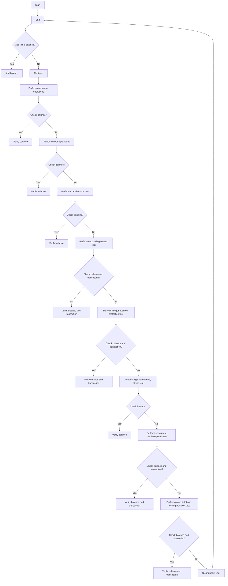

## 类结构

```
CreditSystemTests (主测试类)
├── create_test_user (创建测试用户)
│   ├── create_user (创建用户)
│   └── upsert_user_balance (更新用户余额)
├── cleanup_test_user (清理测试用户)
│   ├── delete_transactions (删除交易记录)
│   ├── delete_balances (删除余额记录)
│   └── delete_users (删除用户)
├── test_concurrent_spends_same_user (测试同一用户并发消费)
│   ├── add_transaction (添加交易)
│   ├── spend_credits (消费信用)
│   └── get_credits (获取信用)
├── test_concurrent_spends_insufficient_balance (测试不足余额的并发消费)
│   ├── add_transaction (添加交易)
│   ├── spend_credits (消费信用)
│   └── get_credits (获取信用)
├── test_concurrent_mixed_operations (测试并发混合操作)
│   ├── add_transaction (添加交易)
│   ├── spend_credits (消费信用)
│   └── get_credits (获取信用)
├── test_race_condition_exact_balance (测试精确余额的竞争条件)
│   ├── add_transaction (添加交易)
│   ├── spend_credits (消费信用)
│   └── get_credits (获取信用)
├── test_onboarding_reward_idempotency (测试入职奖励幂等性)
│   ├── onboarding_reward (获取入职奖励)
│   └── get_credits (获取信用)
├── test_integer_overflow_protection (测试整数溢出保护)
│   ├── add_transaction (添加交易)
│   └── get_credits (获取信用)
├── test_high_concurrency_stress (测试高并发压力)
│   ├── add_transaction (添加交易)
│   ├── spend_credits (消费信用)
│   └── get_credits (获取信用)
├── test_concurrent_multiple_spends_sufficient_balance (测试有足够余额的并发多次消费)
│   ├── add_transaction (添加交易)
│   ├── spend_credits (消费信用)
│   └── get_credits (获取信用)
└── test_prove_database_locking_behavior (测试证明数据库锁定行为)
   ├── add_transaction (添加交易)
   ├── spend_credits (消费信用)
   └── get_credits (获取信用)
```

## 全局变量及字段


### `credit_system`
    
The main credit system object used for managing user credits.

类型：`UserCredit`
    


### `POSTGRES_INT_MAX`
    
The maximum integer value that can be stored in a PostgreSQL database.

类型：`int`
    


### `UsageTransactionMetadata`
    
A class used to store metadata for usage transactions.

类型：`class`
    


### `UserCredit`
    
A class representing the credit system for users.

类型：`class`
    


### `SpinTestServer`
    
A class used for spinning up test servers.

类型：`class`
    


### `SafeJson`
    
A class used for safely serializing JSON data.

类型：`class`
    


### `InsufficientBalanceError`
    
An exception raised when a user tries to spend more credits than they have.

类型：`class`
    


### `UniqueViolationError`
    
An exception raised when a unique constraint violation occurs in the database.

类型：`class`
    


### `User.id`
    
The unique identifier for a user.

类型：`str`
    


### `User.email`
    
The email address of a user.

类型：`str`
    


### `User.name`
    
The name of a user.

类型：`str`
    


### `UserBalance.userId`
    
The unique identifier of the user associated with the balance.

类型：`str`
    


### `UserBalance.balance`
    
The current balance of the user.

类型：`int`
    


### `CreditTransaction.userId`
    
The unique identifier of the user associated with the transaction.

类型：`str`
    


### `CreditTransaction.type`
    
The type of the transaction (e.g., top-up, usage).

类型：`CreditTransactionType`
    


### `CreditTransaction.amount`
    
The amount of the transaction.

类型：`int`
    


### `CreditTransaction.runningBalance`
    
The running balance after the transaction.

类型：`int`
    


### `CreditTransaction.metadata`
    
Metadata associated with the transaction.

类型：`SafeJson`
    


### `User.User.id`
    
The unique identifier for a user.

类型：`str`
    


### `User.User.email`
    
The email address of a user.

类型：`str`
    


### `User.User.name`
    
The name of a user.

类型：`str`
    


### `UserBalance.UserBalance.userId`
    
The unique identifier of the user associated with the balance.

类型：`str`
    


### `UserBalance.UserBalance.balance`
    
The current balance of the user.

类型：`int`
    


### `CreditTransaction.CreditTransaction.userId`
    
The unique identifier of the user associated with the transaction.

类型：`str`
    


### `CreditTransaction.CreditTransaction.type`
    
The type of the transaction (e.g., top-up, usage).

类型：`CreditTransactionType`
    


### `CreditTransaction.CreditTransaction.amount`
    
The amount of the transaction.

类型：`int`
    


### `CreditTransaction.CreditTransaction.runningBalance`
    
The running balance after the transaction.

类型：`int`
    


### `CreditTransaction.CreditTransaction.metadata`
    
Metadata associated with the transaction.

类型：`SafeJson`
    
    

## 全局函数及方法


### create_test_user

Create a test user with initial balance.

参数：

- `user_id`：`str`，The unique identifier for the test user.

返回值：`None`，No return value.

#### 流程图


#### 带注释源码

```python
async def create_test_user(user_id: str) -> None:
    """Create a test user with initial balance."""
    try:
        await User.prisma().create(
            data={
                "id": user_id,
                "email": f"test-{user_id}@example.com",
                "name": f"Test User {user_id[:8]}",
            }
        )
    except UniqueViolationError:
        # User already exists, continue
        pass

    # Ensure UserBalance record exists
    await UserBalance.prisma().upsert(
        where={"userId": user_id},
        data={"create": {"userId": user_id, "balance": 0}, "update": {"balance": 0}},
    )
```


### `cleanup_test_user`

Clean up test user and their transactions.

参数：

- `user_id`：`str`，The unique identifier for the test user.

返回值：`None`，No return value.

#### 流程图

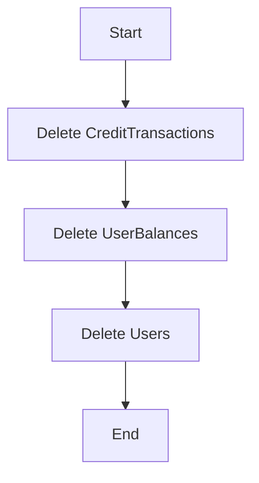

#### 带注释源码

```python
async def cleanup_test_user(user_id: str) -> None:
    """Clean up test user and their transactions."""
    try:
        await CreditTransaction.prisma().delete_many(where={"userId": user_id})
        await UserBalance.prisma().delete_many(where={"userId": user_id})
        await User.prisma().delete_many(where={"id": user_id})
    except Exception as e:
        # Log cleanup failures but don't fail the test
        print(f"Warning: Failed to cleanup test user {user_id}: {e}")
```


### test_concurrent_spends_same_user

This function tests that multiple concurrent spends from the same user do not cause race conditions.

参数：

- `server`：`SpinTestServer`，A test server instance used for testing.

返回值：无

#### 流程图

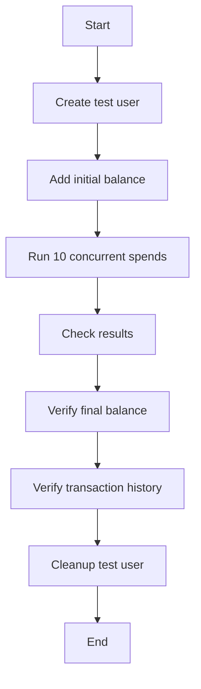

#### 带注释源码

```python
@pytest.mark.asyncio(loop_scope="session")
async def test_concurrent_spends_same_user(server: SpinTestServer):
    """Test multiple concurrent spends from the same user don't cause race conditions."""
    user_id = f"concurrent-test-{uuid4()}"
    await create_test_user(user_id)

    try:
        # Give user initial balance using internal method (bypasses Stripe)
        await credit_system._add_transaction(
            user_id=user_id,
            amount=1000,
            transaction_type=CreditTransactionType.TOP_UP,
            metadata=SafeJson({"test": "initial_balance"}),
        )

        # Try to spend 10 x $1 concurrently
        async def spend_one_dollar(idx: int):
            try:
                return await credit_system.spend_credits(
                    user_id,
                    100,  # $1
                    UsageTransactionMetadata(
                        graph_exec_id=f"concurrent-{idx}",
                        reason=f"Concurrent spend {idx}",
                    ),
                )
            except InsufficientBalanceError:
                return None

        # Run 10 concurrent spends
        results = await asyncio.gather(
            *[spend_one_dollar(i) for i in range(10)], return_exceptions=True
        )

        # Count successful spends
        successful = [
            r for r in results if r is not None and not isinstance(r, Exception)
        ]
        failed = [r for r in results if isinstance(r, InsufficientBalanceError)]

        # All 10 should succeed since we have exactly $10
        assert len(successful) == 10, f"Expected 10 successful, got {len(successful)}"
        assert len(failed) == 0, f"Expected 0 failures, got {len(failed)}"

        # Final balance should be exactly 0
        final_balance = await credit_system.get_credits(user_id)
        assert final_balance == 0, f"Expected balance 0, got {final_balance}"

        # Verify transaction history is consistent
        transactions = await CreditTransaction.prisma().find_many(
            where={"userId": user_id, "type": prisma.enums.CreditTransactionType.USAGE}
        )
        assert (
            len(transactions) == 10
        ), f"Expected 10 transactions, got {len(transactions)}"
```


### test_concurrent_spends_insufficient_balance

This function tests that concurrent spends from the same user correctly enforce balance limits.

参数：

- `server`：`SpinTestServer`，The test server instance used for the test.

返回值：无

#### 流程图

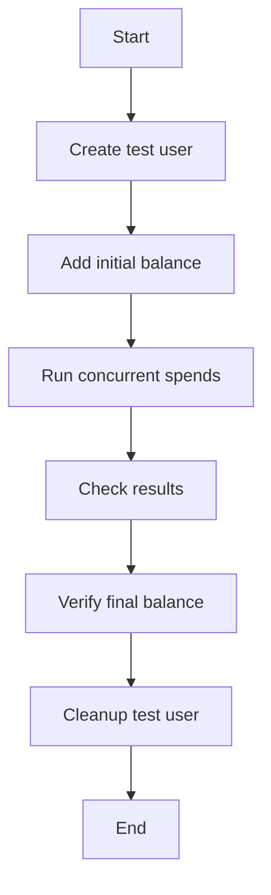

#### 带注释源码

```python
@pytest.mark.asyncio(loop_scope="session")
async def test_concurrent_spends_insufficient_balance(server: SpinTestServer):
    """Test that concurrent spends correctly enforce balance limits."""
    user_id = f"insufficient-test-{uuid4()}"
    await create_test_user(user_id)

    try:
        # Give user limited balance using internal method (bypasses Stripe)
        await credit_system._add_transaction(
            user_id=user_id,
            amount=500,
            transaction_type=CreditTransactionType.TOP_UP,
            metadata=SafeJson({"test": "limited_balance"}),
        )

        # Try to spend 10 x $1 concurrently (but only have $5)
        async def spend_one_dollar(idx: int):
            try:
                return await credit_system.spend_credits(
                    user_id,
                    100,  # $1
                    UsageTransactionMetadata(
                        graph_exec_id=f"insufficient-{idx}",
                        reason=f"Insufficient spend {idx}",
                    ),
                )
            except InsufficientBalanceError:
                return "FAILED"

        # Run 10 concurrent spends
        results = await asyncio.gather(
            *[spend_one_dollar(i) for i in range(10)], return_exceptions=True
        )

        # Count successful vs failed
        successful = [
            r
            for r in results
            if r not in ["FAILED", None] and not isinstance(r, Exception)
        ]
        failed = [r for r in results if r == "FAILED"]

        # Exactly 5 should succeed, 5 should fail
        assert len(successful) == 5, f"Expected 5 successful, got {len(successful)}"
        assert len(failed) == 5, f"Expected 5 failures, got {len(failed)}"

        # Final balance should be exactly 0
        final_balance = await credit_system.get_credits(user_id)
        assert final_balance == 0, f"Expected balance 0, got {final_balance}"

    finally:
        await cleanup_test_user(user_id)
```


### test_concurrent_mixed_operations

This function tests the concurrent execution of mixed operations such as spends, top-ups, and balance checks on the credit system to ensure that the system handles these operations correctly without race conditions or deadlocks.

参数：

- `server`：`SpinTestServer`，A test server instance used for testing purposes.

返回值：无

#### 流程图

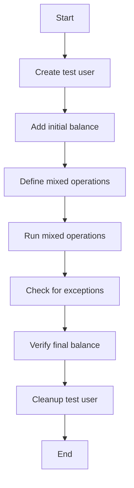

#### 带注释源码

```python
@pytest.mark.asyncio(loop_scope="session")
async def test_concurrent_mixed_operations(server: SpinTestServer):
    """Test concurrent mix of spends, top-ups, and balance checks."""
    user_id = f"mixed-test-{uuid4()}"
    await create_test_user(user_id)

    try:
        # Initial balance using internal method (bypasses Stripe)
        await credit_system._add_transaction(
            user_id=user_id,
            amount=1000,
            transaction_type=CreditTransactionType.TOP_UP,
            metadata=SafeJson({"test": "initial_balance"}),
        )

        # Mix of operations
        async def mixed_operations():
            operations = []

            # 5 spends of $1 each
            for i in range(5):
                operations.append(
                    credit_system.spend_credits(
                        user_id,
                        100,
                        UsageTransactionMetadata(reason=f"Mixed spend {i}"),
                    )
                )

            # 3 top-ups of $2 each using internal method
            for i in range(3):
                operations.append(
                    credit_system._add_transaction(
                        user_id=user_id,
                        amount=200,
                        transaction_type=CreditTransactionType.TOP_UP,
                        metadata=SafeJson({"test": f"concurrent_topup_{i}"}),
                    )
                )

            # 10 balance checks
            for i in range(10):
                operations.append(credit_system.get_credits(user_id))

            return await asyncio.gather(*operations, return_exceptions=True)

        results = await mixed_operations()

        # Check no exceptions occurred
        exceptions = [
            r
            for r in results
            if isinstance(r, Exception) and not isinstance(r, InsufficientBalanceError)
        ]
        assert len(exceptions) == 0, f"Unexpected exceptions: {exceptions}"

        # Final balance should be: 1000 - 500 + 600 = 1100
        final_balance = await credit_system.get_credits(user_id)
        assert final_balance == 1100, f"Expected balance 1100, got {final_balance}"

    finally:
        await cleanup_test_user(user_id)
```

### test_race_condition_exact_balance

This function tests that spending an exact balance amount concurrently does not result in a negative balance.

参数：

- `server`：`SpinTestServer`，A test server used for testing purposes.

返回值：无

#### 流程图


#### 带注释源码

```python
@pytest.mark.asyncio(loop_scope="session")
async def test_race_condition_exact_balance(server: SpinTestServer):
    """Test spending exact balance amount concurrently doesn't go negative."""
    user_id = f"exact-balance-{uuid4()}"
    await create_test_user(user_id)

    try:
        # Give exact amount using internal method (bypasses Stripe)
        await credit_system._add_transaction(
            user_id=user_id,
            amount=100,
            transaction_type=CreditTransactionType.TOP_UP,
            metadata=SafeJson({"test": "exact_amount"}),
        )

        # Try to spend $1 twice concurrently
        async def spend_exact():
            try:
                return await credit_system.spend_credits(
                    user_id, 100, UsageTransactionMetadata(reason="Exact spend")
                )
            except InsufficientBalanceError:
                return "FAILED"

        # Both try to spend the full balance
        result1, result2 = await asyncio.gather(spend_exact(), spend_exact())

        # Exactly one should succeed
        results = [result1, result2]
        successful = [
            r for r in results if r != "FAILED" and not isinstance(r, Exception)
        ]
        failed = [r for r in results if r == "FAILED"]

        assert len(successful) == 1, f"Expected 1 success, got {len(successful)}"
        assert len(failed) == 1, f"Expected 1 failure, got {len(failed)}"

        # Balance should be exactly 0, never negative
        final_balance = await credit_system.get_credits(user_id)
        assert final_balance == 0, f"Expected balance 0, got {final_balance}"

    finally:
        await cleanup_test_user(user_id)
```


### test_onboarding_reward_idempotency

Test that onboarding rewards are idempotent (can't be claimed twice).

参数：

- `user_id`：`str`，Unique identifier for the user.
- `server`：`SpinTestServer`，The test server instance.

返回值：`None`，No return value.

#### 流程图

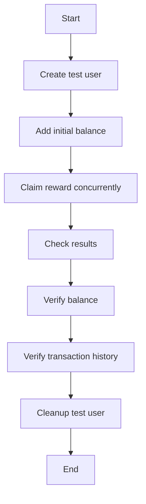

#### 带注释源码

```python
@pytest.mark.asyncio(loop_scope="session")
async def test_onboarding_reward_idempotency(server: SpinTestServer):
    """Test that onboarding rewards are idempotent (can't be claimed twice)."""
    user_id = f"onboarding-test-{uuid4()}"
    await create_test_user(user_id)

    try:
        # Use WELCOME step which is defined in the OnboardingStep enum
        # Try to claim same reward multiple times concurrently
        async def claim_reward():
            try:
                result = await credit_system.onboarding_reward(
                    user_id, 500, prisma.enums.OnboardingStep.WELCOME
                )
                return "SUCCESS" if result else "DUPLICATE"
            except Exception as e:
                print(f"Claim reward failed: {e}")
                return "FAILED"

        # Try 5 concurrent claims of the same reward
        results = await asyncio.gather(*[claim_reward() for _ in range(5)])

        # Count results
        success_count = results.count("SUCCESS")
        failed_count = results.count("FAILED")

        # At least one should succeed, others should be duplicates
        assert success_count >= 1, f"At least one claim should succeed, got {results}"
        assert failed_count == 0, f"No claims should fail, got {results}"

        # Check balance - should only have 500, not 2500
        final_balance = await credit_system.get_credits(user_id)
        assert final_balance == 500, f"Expected balance 500, got {final_balance}"

        # Check only one transaction exists
        transactions = await CreditTransaction.prisma().find_many(
            where={
                "userId": user_id,
                "type": prisma.enums.CreditTransactionType.GRANT,
                "transactionKey": f"REWARD-{user_id}-WELCOME",
            }
        )
        assert (
            len(transactions) == 1
        ), f"Expected 1 reward transaction, got {len(transactions)}"
    finally:
        await cleanup_test_user(user_id)
```


### test_integer_overflow_protection

This function tests that integer overflow is prevented by clamping to POSTGRES_INT_MAX when adding a transaction to the credit system.

参数：

- `server`：`SpinTestServer`，The test server instance used for the test.

返回值：无

#### 流程图

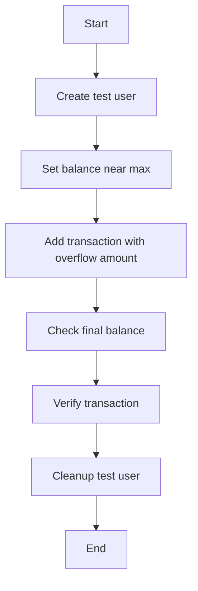

#### 带注释源码

```python
@pytest.mark.asyncio(loop_scope="session")
async def test_integer_overflow_protection(server: SpinTestServer):
    """Test that integer overflow is prevented by clamping to POSTGRES_INT_MAX."""
    user_id = f"overflow-test-{uuid4()}"
    await create_test_user(user_id)

    try:
        # Try to add amount that would overflow
        max_int = POSTGRES_INT_MAX

        # First, set balance near max
        await UserBalance.prisma().upsert(
            where={"userId": user_id},
            data={
                "create": {"userId": user_id, "balance": max_int - 100},
                "update": {"balance": max_int - 100},
            },
        )

        # Try to add more than possible - should clamp to POSTGRES_INT_MAX
        await credit_system._add_transaction(
            user_id=user_id,
            amount=200,
            transaction_type=CreditTransactionType.TOP_UP,
            metadata=SafeJson({"test": "overflow_protection"}),
        )

        # Balance should be clamped to max_int, not overflowed
        final_balance = await credit_system.get_credits(user_id)
        assert (
            final_balance == max_int
        ), f"Balance should be clamped to {max_int}, got {final_balance}"

        # Verify transaction was created with clamped amount
        transactions = await CreditTransaction.prisma().find_many(
            where={
                "userId": user_id,
                "type": CreditTransactionType.TOP_UP,
            },
            order={"createdAt": "desc"},
        )
        assert len(transactions) > 0, "Transaction should be created"
        assert (
            transactions[0].runningBalance == max_int
        ), "Transaction should show clamped balance"

    finally:
        await cleanup_test_user(user_id)
```

### test_high_concurrency_stress

This function performs a high concurrency stress test on the credit system to ensure it can handle many concurrent operations without race conditions or inconsistencies.

参数：

- `server`：`SpinTestServer`，A test server instance used for testing.

返回值：无

#### 流程图

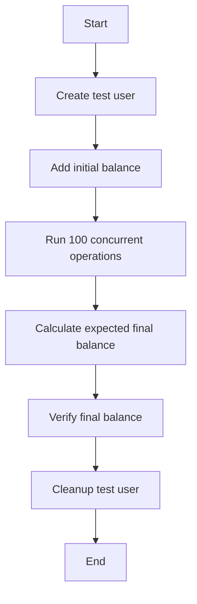

#### 带注释源码

```python
@pytest.mark.asyncio(loop_scope="session")
async def test_high_concurrency_stress(server: SpinTestServer):
    """Stress test with many concurrent operations."""
    user_id = f"stress-test-{uuid4()}"
    await create_test_user(user_id)

    try:
        # Initial balance using internal method (bypasses Stripe)
        initial_balance = 10000  # $100
        await credit_system._add_transaction(
            user_id=user_id,
            amount=initial_balance,
            transaction_type=CreditTransactionType.TOP_UP,
            metadata=SafeJson({"test": "stress_test_balance"}),
        )

        # Run many concurrent operations
        async def random_operation(idx: int):
            operation = random.choice(["spend", "check"])

            if operation == "spend":
                amount = random.randint(1, 50)  # $0.01 to $0.50
                try:
                    return (
                        "spend",
                        amount,
                        await credit_system.spend_credits(
                            user_id,
                            amount,
                            UsageTransactionMetadata(reason=f"Stress {idx}"),
                        ),
                    )
                except InsufficientBalanceError:
                    return ("spend_failed", amount, None)
            else:
                balance = await credit_system.get_credits(user_id)
                return ("check", 0, balance)

        # Run 100 concurrent operations
        results = await asyncio.gather(
            *[random_operation(i) for i in range(100)], return_exceptions=True
        )

        # Calculate expected final balance
        total_spent = sum(
            r[1]
            for r in results
            if not isinstance(r, Exception) and isinstance(r, tuple) and r[0] == "spend"
        )
        expected_balance = initial_balance - total_spent

        # Verify final balance
        final_balance = await credit_system.get_credits(user_id)
        assert (
            final_balance == expected_balance
        ), f"Expected {expected_balance}, got {final_balance}"
        assert final_balance >= 0, "Balance went negative!"

    finally:
        await cleanup_test_user(user_id)
```


### test_concurrent_multiple_spends_sufficient_balance

This function tests that multiple concurrent spends from the same user with sufficient balance do not cause race conditions and the final balance is correct.

参数：

- `server`：`SpinTestServer`，The test server instance used for the test.

返回值：无

#### 流程图


#### 带注释源码

```python
@pytest.mark.asyncio(loop_scope="session")
async def test_concurrent_multiple_spends_sufficient_balance(server: SpinTestServer):
    """Test multiple concurrent spends when there's sufficient balance for all."""
    user_id = f"multi-spend-test-{uuid4()}"
    await create_test_user(user_id)

    try:
        # Give user 150 balance ($1.50) using internal method (bypasses Stripe)
        await credit_system._add_transaction(
            user_id=user_id,
            amount=150,
            transaction_type=CreditTransactionType.TOP_UP,
            metadata=SafeJson({"test": "sufficient_balance"}),
        )

        # Track individual timing to see serialization
        timings = {}

        async def spend_with_detailed_timing(amount: int, label: str):
            start = asyncio.get_event_loop().time()
            try:
                await credit_system.spend_credits(
                    user_id,
                    amount,
                    UsageTransactionMetadata(
                        graph_exec_id=f"concurrent-{label}",
                        reason=f"Concurrent spend {label}",
                    ),
                )
                end = asyncio.get_event_loop().time()
                timings[label] = {"start": start, "end": end, "duration": end - start}
                return f"{label}-SUCCESS"
            except Exception as e:
                end = asyncio.get_event_loop().time()
                timings[label] = {
                    "start": start,
                    "end": end,
                    "duration": end - start,
                    "error": str(e),
                }
                return f"{label}-FAILED: {e}"

        # Run concurrent spends: 10, 20, 30 (total 60, well under 150)
        overall_start = asyncio.get_event_loop().time()
        results = await asyncio.gather(
            spend_with_detailed_timing(10, "spend-10"),
            spend_with_detailed_timing(20, "spend-20"),
            spend_with_detailed_timing(30, "spend-30"),
            return_exceptions=True,
        )
        overall_end = asyncio.get_event_loop().time()

        print(f"Results: {results}")
        print(f"Overall duration: {overall_end - overall_start:.4f}s")

        # Analyze timing to detect serialization vs true concurrency
        print("\nTiming analysis:")
        for label, timing in timings.items():
            print(
                f"  {label}: started at {timing['start']:.4f}, ended at {timing['end']:.4f}, duration {timing['duration']:.4f}s"
            )

        # Check if operations overlapped (true concurrency) or were serialized
        sorted_timings = sorted(timings.items(), key=lambda x: x[1]["start"])
        print("\nExecution order by start time:")
        for i, (label, timing) in enumerate(sorted_timings):
            print(f"  {i+1}. {label}: {timing['start']:.4f} -> {timing['end']:.4f}")

        # Check for overlap (true concurrency) vs serialization
        overlaps = []
        for i in range(len(sorted_timings) - 1):
            current = sorted_timings[i]
            next_op = sorted_timings[i + 1]
            if current[1]["end"] > next_op[1]["start"]:
                overlaps.append(f"{current[0]} overlaps with {next_op[0]}")

        if overlaps:
            print(f"✅ TRUE CONCURRENCY detected: {overlaps}")
        else:
            print("🔒 SERIALIZATION detected: No overlapping execution times")

        # Check final balance
        final_balance = await credit_system.get_credits(user_id)
        print(f"Final balance: {final_balance}")

        # Count successes/failures
        successful = [r for r in results if "SUCCESS" in str(r)]
        failed = [r for r in results if "FAILED" in str(r)]

        print(f"Successful: {len(successful)}, Failed: {len(failed)}")

        # All should succeed since 150 - (10 + 20 + 30) = 90 > 0
        assert (
            len(successful) == 3
        ), f"Expected all 3 to succeed, got {len(successful)} successes: {results}"
        assert final_balance == 90, f"Expected balance 90, got {final_balance}"

        # Check transaction timestamps to confirm database-level serialization
        transactions = await CreditTransaction.prisma().find_many(
            where={"userId": user_id, "type": prisma.enums.CreditTransactionType.USAGE},
            order={"createdAt": "asc"},
        )
        print("\nDatabase transaction order (by createdAt):")
        for i, tx in enumerate(transactions):
            print(
                f"  {i+1}. Amount {tx.amount}, Running balance: {tx.runningBalance}, Created: {tx.createdAt}"
            )

        # Verify running balances are chronologically consistent (ordered by createdAt)
        actual_balances = [
            tx.runningBalance for tx in transactions if tx.runningBalance is not None
        ]
        print(f"Running balances: {actual_balances}")

        # The balances should be valid intermediate states regardless of execution order
        # Starting balance: 150, spending 10+20+30=60, so final should be 90
        # The intermediate balances depend on execution order but should all be valid
        expected_possible_balances = {
            # If order is 10, 20, 30: [140, 120, 90]
            # If order is 10, 30, 20: [140, 110, 90]
            # If order is 20, 10, 30: [130, 120, 90]
            # If order is 20, 30, 10: [130, 100, 90]
            # If order is 30, 10, 20: [120, 110, 90]
            # If order is 30, 20, 10: [120, 100, 90]
            90,
            100,
            110,
            120,
            130,
            140,  # All possible intermediate balances
        }

        # Verify all balances are valid intermediate states
        for balance in actual_balances:
            assert (
                balance in expected_possible_balances
            ), f"Invalid balance {balance}, expected one of {expected_possible_balances}"

        # Final balance should always be 90 (150 - 60)
        assert (
            min(actual_balances) == 90
        ), f"Final balance should be 90, got {min(actual_balances)}"

        # The final transaction should always have balance 90
        # The other transactions should have valid intermediate balances
        assert (
            90 in actual_balances
        ), f"Final balance 90 should be in actual_balances: {actual_balances}"

        # All balances should be >= 90 (the final state)
        assert all(
            balance >= 90 for balance in actual_balances
        ), f"All balances should be >= 90, got {actual_balances}"

        # CRITICAL: Transactions are atomic but can complete in any order
        # What matters is that all running balances are valid intermediate states
        # Each balance should be between 90 (final) and 140 (after first transaction)
        for balance in actual_balances:
            assert (
                90 <= balance <= 140
            ), f"Balance {balance} is outside valid range [90, 140]"

        # Final balance (minimum) should always be 90
        assert (
            min(actual_balances) == 90
        ), f"Final balance should be 90, got {min(actual_balances)}"

    finally:
        await cleanup_test_user(user_id)
``` 


### test_prove_database_locking_behavior

This function tests whether database locking causes requests to wait or fail when performing concurrent operations on the same user's balance.

参数：

- `server`：`SpinTestServer`，A test server instance used for testing.

返回值：无

#### 流程图

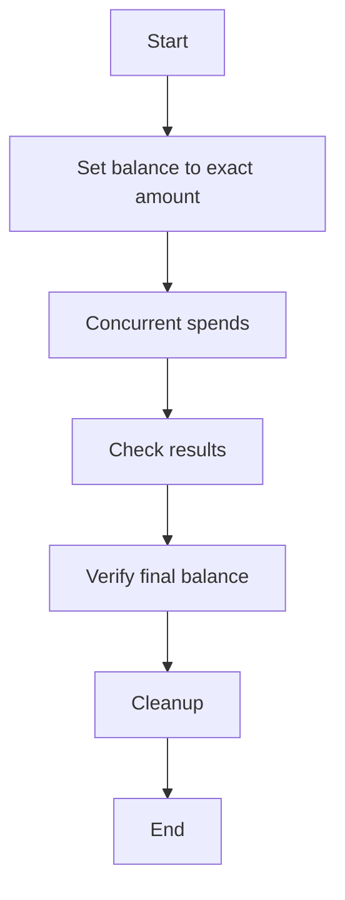

#### 带注释源码

```python
@pytest.mark.asyncio(loop_scope="session")
async def test_prove_database_locking_behavior(server: SpinTestServer):
    """Definitively prove whether database locking causes waiting vs failures."""
    user_id = f"locking-test-{uuid4()}"
    await create_test_user(user_id)

    try:
        # Set balance to exact amount that can handle all spends using internal method (bypasses Stripe)
        await credit_system._add_transaction(
            user_id=user_id,
            amount=60,  # Exactly 10+20+30
            transaction_type=CreditTransactionType.TOP_UP,
            metadata=SafeJson({"test": "exact_amount_test"}),
        )

        async def spend_with_precise_timing(amount: int, label: str):
            request_start = asyncio.get_event_loop().time()
            db_operation_start = asyncio.get_event_loop().time()
            try:
                # Add a small delay to increase chance of true concurrency
                await asyncio.sleep(0.001)

                db_operation_start = asyncio.get_event_loop().time()
                await credit_system.spend_credits(
                    user_id,
                    amount,
                    UsageTransactionMetadata(
                        graph_exec_id=f"locking-{label}",
                        reason=f"Locking test {label}",
                    ),
                )
                db_operation_end = asyncio.get_event_loop().time()

                return {
                    "label": label,
                    "status": "SUCCESS",
                    "request_start": request_start,
                    "db_start": db_operation_start,
                    "db_end": db_operation_end,
                    "db_duration": db_operation_end - db_operation_start,
                }
            except Exception as e:
                db_operation_end = asyncio.get_event_loop().time()
                return {
                    "label": label,
                    "status": "FAILED",
                    "error": str(e),
                    "request_start": request_start,
                    "db_start": db_operation_start,
                    "db_end": db_operation_end,
                    "db_duration": db_operation_end - db_operation_start,
                }

        # Launch all requests simultaneously
        results = await asyncio.gather(
            spend_with_precise_timing(10, "A"),
            spend_with_precise_timing(20, "B"),
            spend_with_precise_timing(30, "C"),
            return_exceptions=True,
        )

        print("\n🔍 LOCKING BEHAVIOR ANALYSIS:")
        print("=" * 50)

        successful = [
            r for r in results if isinstance(r, dict) and r.get("status") == "SUCCESS"
        ]
        failed = [
            r for r in results if isinstance(r, dict) and r.get("status") == "FAILED"
        ]

        print(f"✅ Successful operations: {len(successful)}")
        print(f"❌ Failed operations: {len(failed)}")

        if len(failed) > 0:
            print(
                "\n🚫 CONCURRENT FAILURES - Some requests failed due to insufficient balance:"
            )
            for result in failed:
                if isinstance(result, dict):
                    print(
                        f"   {result['label']}: {result.get('error', 'Unknown error')}"
                    )

        if len(successful) == 3:
            print(
                "\n🔒 SERIALIZATION CONFIRMED - All requests succeeded, indicating they were queued:"
            )

            # Sort by actual execution time to see order
            dict_results = [r for r in results if isinstance(r, dict)]
            sorted_results = sorted(dict_results, key=lambda x: x["db_start"])

            for i, result in enumerate(sorted_results):
                print(
                    f"   {i+1}. {result['label']}: DB operation took {result['db_duration']:.4f}s"
                )

            # Check if any operations overlapped at the database level
            print("\n⏱️  Database operation timeline:")
            for result in sorted_results:
                print(
                    f"   {result['label']}: {result['db_start']:.4f} -> {result['db_end']:.4f}"
                )

        # Verify final state
        final_balance = await credit_system.get_credits(user_id)
        print(f"\n💰 Final balance: {final_balance}")

        if len(successful) == 3:
            assert (
                final_balance == 0
            ), f"If all succeeded, balance should be 0, got {final_balance}"
            print(
                "✅ CONCLUSION: Database row locking causes requests to WAIT and execute serially"
            )
        else:
            print(
                "❌ CONCLUSION: Some requests failed, indicating different concurrency behavior"
            )

    finally:
        await cleanup_test_user(user_id)
```


### create_test_user

Create a test user with initial balance.

参数：

- `user_id`：`str`，The unique identifier for the test user.

返回值：`None`，No return value.

#### 流程图

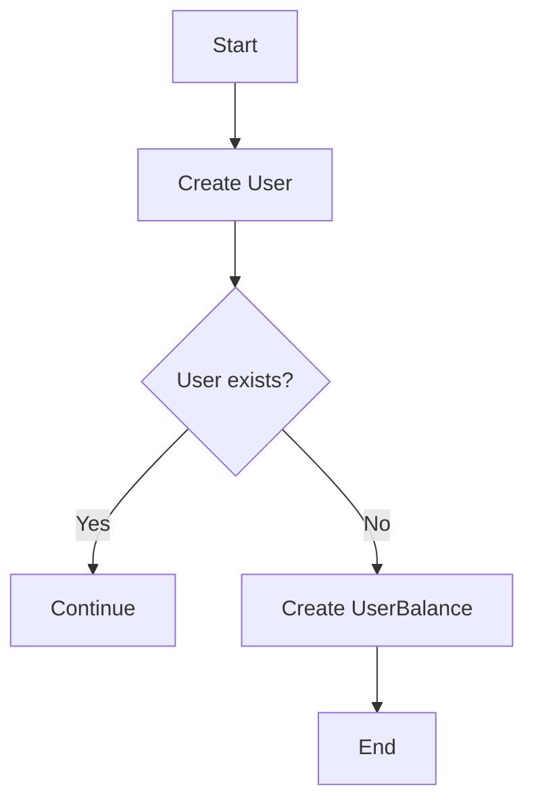

#### 带注释源码

```python
async def create_test_user(user_id: str) -> None:
    """Create a test user with initial balance."""
    try:
        await User.prisma().create(
            data={
                "id": user_id,
                "email": f"test-{user_id}@example.com",
                "name": f"Test User {user_id[:8]}",
            }
        )
    except UniqueViolationError:
        # User already exists, continue
        pass

    # Ensure UserBalance record exists
    await UserBalance.prisma().upsert(
        where={"userId": user_id},
        data={"create": {"userId": user_id, "balance": 0}, "update": {"balance": 0}},
    )
```


### `cleanup_test_user`

Clean up test user and their transactions.

参数：

- `user_id`：`str`，The unique identifier for the test user.

返回值：`None`，No return value.

#### 流程图


#### 带注释源码

```python
async def cleanup_test_user(user_id: str) -> None:
    """Clean up test user and their transactions."""
    try:
        await CreditTransaction.prisma().delete_many(where={"userId": user_id})
        await UserBalance.prisma().delete_many(where={"userId": user_id})
        await User.prisma().delete_many(where={"id": user_id})
    except Exception as e:
        # Log cleanup failures but don't fail the test
        print(f"Warning: Failed to cleanup test user {user_id}: {e}")
```


### test_concurrent_spends_same_user

This function tests that multiple concurrent spends from the same user do not cause race conditions.

参数：

- `server`：`SpinTestServer`，The test server instance used for the test.

返回值：无

#### 流程图

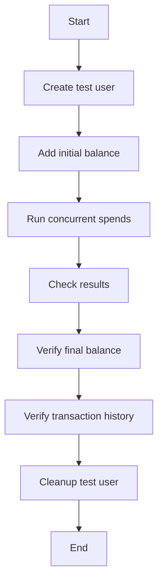

#### 带注释源码

```python
@pytest.mark.asyncio(loop_scope="session")
async def test_concurrent_spends_same_user(server: SpinTestServer):
    """Test multiple concurrent spends from the same user don't cause race conditions."""
    user_id = f"concurrent-test-{uuid4()}"
    await create_test_user(user_id)

    try:
        # Give user initial balance using internal method (bypasses Stripe)
        await credit_system._add_transaction(
            user_id=user_id,
            amount=1000,
            transaction_type=CreditTransactionType.TOP_UP,
            metadata=SafeJson({"test": "initial_balance"}),
        )

        # Try to spend 10 x $1 concurrently
        async def spend_one_dollar(idx: int):
            try:
                return await credit_system.spend_credits(
                    user_id,
                    100,  # $1
                    UsageTransactionMetadata(
                        graph_exec_id=f"concurrent-{idx}",
                        reason=f"Concurrent spend {idx}",
                    ),
                )
            except InsufficientBalanceError:
                return None

        # Run 10 concurrent spends
        results = await asyncio.gather(
            *[spend_one_dollar(i) for i in range(10)], return_exceptions=True
        )

        # Count successful spends
        successful = [
            r for r in results if r is not None and not isinstance(r, Exception)
        ]
        failed = [r for r in results if isinstance(r, InsufficientBalanceError)]

        # All 10 should succeed since we have exactly $10
        assert len(successful) == 10, f"Expected 10 successful, got {len(successful)}"
        assert len(failed) == 0, f"Expected 0 failures, got {len(failed)}"

        # Final balance should be exactly 0
        final_balance = await credit_system.get_credits(user_id)
        assert final_balance == 0, f"Expected balance 0, got {final_balance}"

        # Verify transaction history is consistent
        transactions = await CreditTransaction.prisma().find_many(
            where={"userId": user_id, "type": prisma.enums.CreditTransactionType.USAGE}
        )
        assert (
            len(transactions) == 10
        ), f"Expected 10 transactions, got {len(transactions)}"
```


### test_concurrent_spends_insufficient_balance

This function tests that concurrent spends from the same user correctly enforce balance limits.

参数：

- `server`：`SpinTestServer`，The test server instance used for the test.

返回值：无

#### 流程图


#### 带注释源码

```python
@pytest.mark.asyncio(loop_scope="session")
async def test_concurrent_spends_insufficient_balance(server: SpinTestServer):
    """Test that concurrent spends correctly enforce balance limits."""
    user_id = f"insufficient-test-{uuid4()}"
    await create_test_user(user_id)

    try:
        # Give user limited balance using internal method (bypasses Stripe)
        await credit_system._add_transaction(
            user_id=user_id,
            amount=500,
            transaction_type=CreditTransactionType.TOP_UP,
            metadata=SafeJson({"test": "limited_balance"}),
        )

        # Try to spend 10 x $1 concurrently (but only have $5)
        async def spend_one_dollar(idx: int):
            try:
                return await credit_system.spend_credits(
                    user_id,
                    100,  # $1
                    UsageTransactionMetadata(
                        graph_exec_id=f"insufficient-{idx}",
                        reason=f"Insufficient spend {idx}",
                    ),
                )
            except InsufficientBalanceError:
                return "FAILED"

        # Run 10 concurrent spends
        results = await asyncio.gather(
            *[spend_one_dollar(i) for i in range(10)], return_exceptions=True
        )

        # Count successful vs failed
        successful = [
            r
            for r in results
            if r not in ["FAILED", None] and not isinstance(r, Exception)
        ]
        failed = [r for r in results if r == "FAILED"]

        # Exactly 5 should succeed, 5 should fail
        assert len(successful) == 5, f"Expected 5 successful, got {len(successful)}"
        assert len(failed) == 5, f"Expected 5 failures, got {len(failed)}"

        # Final balance should be exactly 0
        final_balance = await credit_system.get_credits(user_id)
        assert final_balance == 0, f"Expected balance 0, got {final_balance}"

    finally:
        await cleanup_test_user(user_id)
```


### test_concurrent_mixed_operations

This function tests the concurrent execution of mixed operations on the credit system, including spends, top-ups, and balance checks.

参数：

- `server`：`SpinTestServer`，A test server instance used for testing purposes.

返回值：无

#### 流程图


#### 带注释源码

```python
@pytest.mark.asyncio(loop_scope="session")
async def test_concurrent_mixed_operations(server: SpinTestServer):
    """Test concurrent mix of spends, top-ups, and balance checks."""
    user_id = f"mixed-test-{uuid4()}"
    await create_test_user(user_id)

    try:
        # Initial balance using internal method (bypasses Stripe)
        await credit_system._add_transaction(
            user_id=user_id,
            amount=1000,
            transaction_type=CreditTransactionType.TOP_UP,
            metadata=SafeJson({"test": "initial_balance"}),
        )

        # Mix of operations
        async def mixed_operations():
            operations = []

            # 5 spends of $1 each
            for i in range(5):
                operations.append(
                    credit_system.spend_credits(
                        user_id,
                        100,
                        UsageTransactionMetadata(reason=f"Mixed spend {i}"),
                    )
                )

            # 3 top-ups of $2 each using internal method
            for i in range(3):
                operations.append(
                    credit_system._add_transaction(
                        user_id=user_id,
                        amount=200,
                        transaction_type=CreditTransactionType.TOP_UP,
                        metadata=SafeJson({"test": f"concurrent_topup_{i}"}),
                    )
                )

            # 10 balance checks
            for i in range(10):
                operations.append(credit_system.get_credits(user_id))

            return await asyncio.gather(*operations, return_exceptions=True)

        results = await mixed_operations()

        # Check no exceptions occurred
        exceptions = [
            r
            for r in results
            if isinstance(r, Exception) and not isinstance(r, InsufficientBalanceError)
        ]
        assert len(exceptions) == 0, f"Unexpected exceptions: {exceptions}"

        # Final balance should be: 1000 - 500 + 600 = 1100
        final_balance = await credit_system.get_credits(user_id)
        assert final_balance == 1100, f"Expected balance 1100, got {final_balance}"

    finally:
        await cleanup_test_user(user_id)
```


### test_race_condition_exact_balance

This function tests that spending an exact balance amount concurrently does not result in a negative balance.

参数：

- `server`：`SpinTestServer`，The test server instance used for the test.

返回值：无

#### 流程图


#### 带注释源码

```python
@pytest.mark.asyncio(loop_scope="session")
async def test_race_condition_exact_balance(server: SpinTestServer):
    """Test spending exact balance amount concurrently doesn't go negative."""
    user_id = f"exact-balance-{uuid4()}"
    await create_test_user(user_id)

    try:
        # Give exact amount using internal method (bypasses Stripe)
        await credit_system._add_transaction(
            user_id=user_id,
            amount=100,
            transaction_type=CreditTransactionType.TOP_UP,
            metadata=SafeJson({"test": "exact_amount"}),
        )

        # Try to spend $1 twice concurrently
        async def spend_exact():
            try:
                return await credit_system.spend_credits(
                    user_id, 100, UsageTransactionMetadata(reason="Exact spend")
                )
            except InsufficientBalanceError:
                return "FAILED"

        # Both try to spend the full balance
        result1, result2 = await asyncio.gather(spend_exact(), spend_exact())

        # Exactly one should succeed
        results = [result1, result2]
        successful = [
            r for r in results if r != "FAILED" and not isinstance(r, Exception)
        ]
        failed = [r for r in results if r == "FAILED"]

        assert len(successful) == 1, f"Expected 1 success, got {len(successful)}"
        assert len(failed) == 1, f"Expected 1 failure, got {len(failed)}"

        # Balance should be exactly 0, never negative
        final_balance = await credit_system.get_credits(user_id)
        assert final_balance == 0, f"Expected balance 0, got {final_balance}"

    finally:
        await cleanup_test_user(user_id)
```


### test_onboarding_reward_idempotency

This function tests the idempotency of onboarding rewards, ensuring that a reward can't be claimed twice by the same user.

参数：

- `server`：`SpinTestServer`，A test server instance used for testing purposes.

返回值：无

#### 流程图

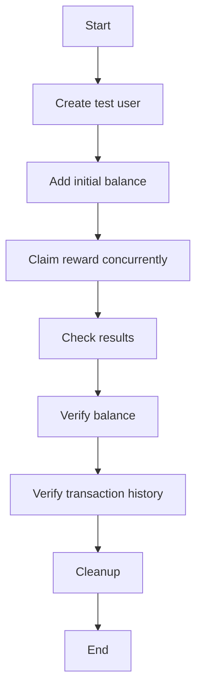

#### 带注释源码

```python
@pytest.mark.asyncio(loop_scope="session")
async def test_onboarding_reward_idempotency(server: SpinTestServer):
    """Test that onboarding rewards are idempotent (can't be claimed twice)."""
    user_id = f"onboarding-test-{uuid4()}"
    await create_test_user(user_id)

    try:
        # Use WELCOME step which is defined in the OnboardingStep enum
        # Try to claim same reward multiple times concurrently
        async def claim_reward():
            try:
                result = await credit_system.onboarding_reward(
                    user_id, 500, prisma.enums.OnboardingStep.WELCOME
                )
                return "SUCCESS" if result else "DUPLICATE"
            except Exception as e:
                print(f"Claim reward failed: {e}")
                return "FAILED"

        # Try 5 concurrent claims of the same reward
        results = await asyncio.gather(*[claim_reward() for _ in range(5)])

        # Count results
        success_count = results.count("SUCCESS")
        failed_count = results.count("FAILED")

        # At least one should succeed, others should be duplicates
        assert success_count >= 1, f"At least one claim should succeed, got {results}"
        assert failed_count == 0, f"No claims should fail, got {results}"

        # Check balance - should only have 500, not 2500
        final_balance = await credit_system.get_credits(user_id)
        assert final_balance == 500, f"Expected balance 500, got {final_balance}"

        # Check only one transaction exists
        transactions = await CreditTransaction.prisma().find_many(
            where={
                "userId": user_id,
                "type": prisma.enums.CreditTransactionType.GRANT,
                "transactionKey": f"REWARD-{user_id}-WELCOME",
            }
        )
        assert (
            len(transactions) == 1
        ), f"Expected 1 reward transaction, got {len(transactions)}"
    finally:
        await cleanup_test_user(user_id)
```


### test_integer_overflow_protection

This function tests that integer overflow is prevented by clamping the balance to `POSTGRES_INT_MAX` when adding a transaction to the credit system.

参数：

- `server`：`SpinTestServer`，The test server instance used for the test.

返回值：无

#### 流程图

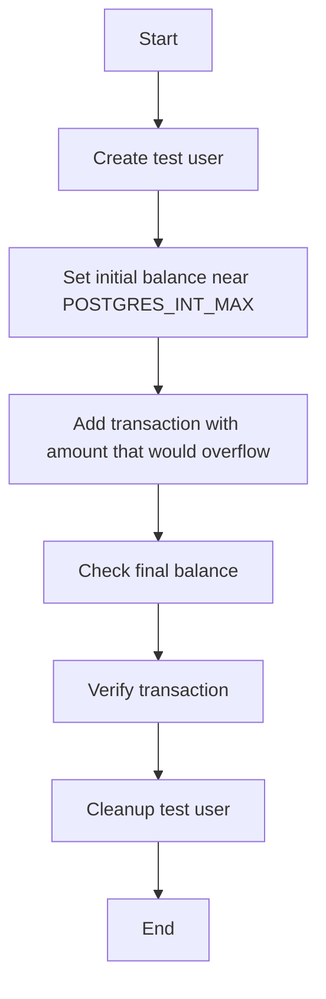

#### 带注释源码

```python
@pytest.mark.asyncio(loop_scope="session")
async def test_integer_overflow_protection(server: SpinTestServer):
    """Test that integer overflow is prevented by clamping to POSTGRES_INT_MAX."""
    user_id = f"overflow-test-{uuid4()}"
    await create_test_user(user_id)

    try:
        # Try to add amount that would overflow
        max_int = POSTGRES_INT_MAX

        # First, set balance near max
        await UserBalance.prisma().upsert(
            where={"userId": user_id},
            data={
                "create": {"userId": user_id, "balance": max_int - 100},
                "update": {"balance": max_int - 100},
            },
        )

        # Try to add more than possible - should clamp to POSTGRES_INT_MAX
        await credit_system._add_transaction(
            user_id=user_id,
            amount=200,
            transaction_type=CreditTransactionType.TOP_UP,
            metadata=SafeJson({"test": "overflow_protection"}),
        )

        # Balance should be clamped to max_int, not overflowed
        final_balance = await credit_system.get_credits(user_id)
        assert (
            final_balance == max_int
        ), f"Balance should be clamped to {max_int}, got {final_balance}"

        # Verify transaction was created with clamped amount
        transactions = await CreditTransaction.prisma().find_many(
            where={
                "userId": user_id,
                "type": CreditTransactionType.TOP_UP,
            },
            order={"createdAt": "desc"},
        )
        assert len(transactions) > 0, "Transaction should be created"
        assert (
            transactions[0].runningBalance == max_int
        ), "Transaction should show clamped balance"

    finally:
        await cleanup_test_user(user_id)
``` 


### test_high_concurrency_stress

This function performs a stress test with many concurrent operations to ensure the credit system handles high-concurrency scenarios correctly without race conditions, deadlocks, or inconsistent state.

参数：

- `server`：`SpinTestServer`，A test server instance used for testing purposes.

返回值：无

#### 流程图

```mermaid
graph TD
    A[Start] --> B[Create test user]
    B --> C[Add initial balance]
    C --> D[Run 100 concurrent operations]
    D --> E[Calculate expected final balance]
    E --> F[Verify final balance]
    F --> G[Cleanup test user]
    G --> H[End]
```

#### 带注释源码

```python
@pytest.mark.asyncio(loop_scope="session")
async def test_high_concurrency_stress(server: SpinTestServer):
    """Stress test with many concurrent operations."""
    user_id = f"stress-test-{uuid4()}"
    await create_test_user(user_id)

    try:
        # Initial balance using internal method (bypasses Stripe)
        initial_balance = 10000  # $100
        await credit_system._add_transaction(
            user_id=user_id,
            amount=initial_balance,
            transaction_type=CreditTransactionType.TOP_UP,
            metadata=SafeJson({"test": "stress_test_balance"}),
        )

        # Run many concurrent operations
        async def random_operation(idx: int):
            operation = random.choice(["spend", "check"])

            if operation == "spend":
                amount = random.randint(1, 50)  # $0.01 to $0.50
                try:
                    return (
                        "spend",
                        amount,
                        await credit_system.spend_credits(
                            user_id,
                            amount,
                            UsageTransactionMetadata(reason=f"Stress {idx}"),
                        ),
                    )
                except InsufficientBalanceError:
                    return ("spend_failed", amount, None)
            else:
                balance = await credit_system.get_credits(user_id)
                return ("check", 0, balance)

        # Run 100 concurrent operations
        results = await asyncio.gather(
            *[random_operation(i) for i in range(100)], return_exceptions=True
        )

        # Calculate expected final balance
        total_spent = sum(
            r[1]
            for r in results
            if not isinstance(r, Exception) and isinstance(r, tuple) and r[0] == "spend"
        )
        expected_balance = initial_balance - total_spent

        # Verify final balance
        final_balance = await credit_system.get_credits(user_id)
        assert (
            final_balance == expected_balance
        ), f"Expected {expected_balance}, got {final_balance}"
        assert final_balance >= 0, "Balance went negative!"

    finally:
        await cleanup_test_user(user_id)
```


### test_concurrent_multiple_spends_sufficient_balance

This function tests that multiple concurrent spends from the same user with sufficient balance do not cause race conditions and the final balance is correct.

参数：

- `server`：`SpinTestServer`，The test server instance used for the test.

返回值：无

#### 流程图

```mermaid
graph TD
    A[Start] --> B[Create test user]
    B --> C[Add initial balance]
    C --> D[Run concurrent spends]
    D --> E[Check results]
    E --> F[Verify final balance]
    F --> G[Cleanup test user]
    G --> H[End]
```

#### 带注释源码

```python
@pytest.mark.asyncio(loop_scope="session")
async def test_concurrent_multiple_spends_sufficient_balance(server: SpinTestServer):
    """Test multiple concurrent spends when there's sufficient balance for all."""
    user_id = f"multi-spend-test-{uuid4()}"
    await create_test_user(user_id)

    try:
        # Give user 150 balance ($1.50) using internal method (bypasses Stripe)
        await credit_system._add_transaction(
            user_id=user_id,
            amount=150,
            transaction_type=CreditTransactionType.TOP_UP,
            metadata=SafeJson({"test": "sufficient_balance"}),
        )

        # Track individual timing to see serialization
        timings = {}

        async def spend_with_detailed_timing(amount: int, label: str):
            start = asyncio.get_event_loop().time()
            try:
                await credit_system.spend_credits(
                    user_id,
                    amount,
                    UsageTransactionMetadata(
                        graph_exec_id=f"concurrent-{label}",
                        reason=f"Concurrent spend {label}",
                    ),
                )
                end = asyncio.get_event_loop().time()
                timings[label] = {"start": start, "end": end, "duration": end - start}
                return f"{label}-SUCCESS"
            except Exception as e:
                end = asyncio.get_event_loop().time()
                timings[label] = {
                    "start": start,
                    "end": end,
                    "duration": end - start,
                    "error": str(e),
                }
                return f"{label}-FAILED: {e}"

        # Run concurrent spends: 10, 20, 30 (total 60, well under 150)
        overall_start = asyncio.get_event_loop().time()
        results = await asyncio.gather(
            spend_with_detailed_timing(10, "spend-10"),
            spend_with_detailed_timing(20, "spend-20"),
            spend_with_detailed_timing(30, "spend-30"),
            return_exceptions=True,
        )
        overall_end = asyncio.get_event_loop().time()

        print(f"Results: {results}")
        print(f"Overall duration: {overall_end - overall_start:.4f}s")

        # Analyze timing to detect serialization vs true concurrency
        print("\nTiming analysis:")
        for label, timing in timings.items():
            print(
                f"  {label}: started at {timing['start']:.4f}, ended at {timing['end']:.4f}, duration {timing['duration']:.4f}s"
            )

        # Check if operations overlapped (true concurrency) or were serialized
        sorted_timings = sorted(timings.items(), key=lambda x: x[1]["start"])
        print("\nExecution order by start time:")
        for i, (label, timing) in enumerate(sorted_timings):
            print(f"  {i+1}. {label}: {timing['start']:.4f} -> {timing['end']:.4f}")

        # Check for overlap (true concurrency) vs serialization
        overlaps = []
        for i in range(len(sorted_timings) - 1):
            current = sorted_timings[i]
            next_op = sorted_timings[i + 1]
            if current[1]["end"] > next_op[1]["start"]:
                overlaps.append(f"{current[0]} overlaps with {next_op[0]}")

        if overlaps:
            print(f"✅ TRUE CONCURRENCY detected: {overlaps}")
        else:
            print("🔒 SERIALIZATION detected: No overlapping execution times")

        # Check final balance
        final_balance = await credit_system.get_credits(user_id)
        print(f"Final balance: {final_balance}")

        # Count successes/failures
        successful = [r for r in results if "SUCCESS" in str(r)]
        failed = [r for r in results if "FAILED" in str(r)]

        print(f"Successful: {len(successful)}, Failed: {len(failed)}")

        # All should succeed since 150 - (10 + 20 + 30) = 90 > 0
        assert (
            len(successful) == 3
        ), f"Expected all 3 to succeed, got {len(successful)} successes: {results}"
        assert final_balance == 90, f"Expected balance 90, got {final_balance}"

        # Check transaction timestamps to confirm database-level serialization
        transactions = await CreditTransaction.prisma().find_many(
            where={"userId": user_id, "type": prisma.enums.CreditTransactionType.USAGE},
            order={"createdAt": "asc"},
        )
        print("\nDatabase transaction order (by createdAt):")
        for i, tx in enumerate(transactions):
            print(
                f"  {i+1}. Amount {tx.amount}, Running balance: {tx.runningBalance}, Created: {tx.createdAt}"
            )

        # Verify running balances are chronologically consistent (ordered by createdAt)
        actual_balances = [
            tx.runningBalance for tx in transactions if tx.runningBalance is not None
        ]
        print(f"Running balances: {actual_balances}")

        # The balances should be valid intermediate states regardless of execution order
        # Starting balance: 150, spending 10+20+30=60, so final should be 90
        # The intermediate balances depend on execution order but should all be valid
        expected_possible_balances = {
            # If order is 10, 20, 30: [140, 120, 90]
            # If order is 10, 30, 20: [140, 110, 90]
            # If order is 20, 10, 30: [130, 120, 90]
            # If order is 20, 30, 10: [130, 100, 90]
            # If order is 30, 10, 20: [120, 110, 90]
            # If order is 30, 20, 10: [120, 100, 90]
            90,
            100,
            110,
            120,
            130,
            140,  # All possible intermediate balances
        }

        # Verify all balances are valid intermediate states
        for balance in actual_balances:
            assert (
                balance in expected_possible_balances
            ), f"Invalid balance {balance}, expected one of {expected_possible_balances}"

        # Final balance should always be 90 (150 - 60)
        assert (
            min(actual_balances) == 90
        ), f"Final balance should be 90, got {min(actual_balances)}"

        # The final transaction should always have balance 90
        # The other transactions should have valid intermediate balances
        assert (
            90 in actual_balances
        ), f"Final balance 90 should be in actual_balances: {actual_balances}"

        # All balances should be >= 90 (the final state)
        assert all(
            balance >= 90 for balance in actual_balances
        ), f"All balances should be >= 90, got {actual_balances}"

        # CRITICAL: Transactions are atomic but can complete in any order
        # What matters is that all running balances are valid intermediate states
        # Each balance should be between 90 (final) and 140 (after first transaction)
        for balance in actual_balances:
            assert (
                90 <= balance <= 140
            ), f"Balance {balance} is outside valid range [90, 140]"

        # Final balance (minimum) should always be 90
        assert (
            min(actual_balances) == 90
        ), f"Final balance should be 90, got {min(actual_balances)}"

    finally:
        await cleanup_test_user(user_id)
``` 


### test_prove_database_locking_behavior

This function tests whether database locking causes requests to wait or fail when performing concurrent operations on the same user's balance.

参数：

- `server`：`SpinTestServer`，The test server instance used for the test environment.

返回值：无

#### 流程图

```mermaid
graph TD
    A[Start] --> B[Create test user]
    B --> C[Set balance to exact amount]
    C --> D[Concurrent spends]
    D --> E[Check results]
    E --> F[Cleanup]
    F --> G[End]
```

#### 带注释源码

```python
@pytest.mark.asyncio(loop_scope="session")
async def test_prove_database_locking_behavior(server: SpinTestServer):
    """Definitively prove whether database locking causes waiting vs failures."""
    user_id = f"locking-test-{uuid4()}"
    await create_test_user(user_id)

    try:
        # Set balance to exact amount that can handle all spends using internal method (bypasses Stripe)
        await credit_system._add_transaction(
            user_id=user_id,
            amount=60,  # Exactly 10+20+30
            transaction_type=CreditTransactionType.TOP_UP,
            metadata=SafeJson({"test": "exact_amount_test"}),
        )

        async def spend_with_precise_timing(amount: int, label: str):
            request_start = asyncio.get_event_loop().time()
            db_operation_start = asyncio.get_event_loop().time()
            try:
                # Add a small delay to increase chance of true concurrency
                await asyncio.sleep(0.001)

                db_operation_start = asyncio.get_event_loop().time()
                await credit_system.spend_credits(
                    user_id,
                    amount,
                    UsageTransactionMetadata(
                        graph_exec_id=f"locking-{label}",
                        reason=f"Locking test {label}",
                    ),
                )
                db_operation_end = asyncio.get_event_loop().time()

                return {
                    "label": label,
                    "status": "SUCCESS",
                    "request_start": request_start,
                    "db_start": db_operation_start,
                    "db_end": db_operation_end,
                    "db_duration": db_operation_end - db_operation_start,
                }
            except Exception as e:
                db_operation_end = asyncio.get_event_loop().time()
                return {
                    "label": label,
                    "status": "FAILED",
                    "error": str(e),
                    "request_start": request_start,
                    "db_start": db_operation_start,
                    "db_end": db_operation_end,
                    "db_duration": db_operation_end - db_operation_start,
                }

        # Launch all requests simultaneously
        results = await asyncio.gather(
            spend_with_precise_timing(10, "A"),
            spend_with_precise_timing(20, "B"),
            spend_with_precise_timing(30, "C"),
            return_exceptions=True,
        )

        print("\n🔍 LOCKING BEHAVIOR ANALYSIS:")
        print("=" * 50)

        successful = [
            r for r in results if isinstance(r, dict) and r.get("status") == "SUCCESS"
        ]
        failed = [
            r for r in results if isinstance(r, dict) and r.get("status") == "FAILED"
        ]

        print(f"✅ Successful operations: {len(successful)}")
        print(f"❌ Failed operations: {len(failed)}")

        if len(failed) > 0:
            print(
                "\n🚫 CONCURRENT FAILURES - Some requests failed due to insufficient balance:"
            )
            for result in failed:
                if isinstance(result, dict):
                    print(
                        f"   {result['label']}: {result.get('error', 'Unknown error')}"
                    )

        if len(successful) == 3:
            print(
                "\n🔒 SERIALIZATION CONFIRMED - All requests succeeded, indicating they were queued:"
            )

            # Sort by actual execution time to see order
            dict_results = [r for r in results if isinstance(r, dict)]
            sorted_results = sorted(dict_results, key=lambda x: x["db_start"])

            for i, result in enumerate(sorted_results):
                print(
                    f"   {i+1}. {result['label']}: DB operation took {result['db_duration']:.4f}s"
                )

            # Check if any operations overlapped at the database level
            print("\n⏱️  Database operation timeline:")
            for result in sorted_results:
                print(
                    f"   {result['label']}: {result['db_start']:.4f} -> {result['db_end']:.4f}"
                )

        # Verify final state
        final_balance = await credit_system.get_credits(user_id)
        print(f"\n💰 Final balance: {final_balance}")

        if len(successful) == 3:
            assert (
                final_balance == 0
            ), f"If all succeeded, balance should be 0, got {final_balance}"
            print(
                "✅ CONCLUSION: Database row locking causes requests to WAIT and execute serially"
            )
        else:
            print(
                "❌ CONCLUSION: Some requests failed, indicating different concurrency behavior"
            )

    finally:
        await cleanup_test_user(user_id)
``` 


### UserCredit._add_transaction

This method is an internal method used to add a transaction to a user's credit balance. It is used for testing purposes to bypass the Stripe payment system and directly manipulate the user's balance.

参数：

- `user_id`：`str`，The unique identifier of the user.
- `amount`：`int`，The amount to add to the user's balance.
- `transaction_type`：`CreditTransactionType`，The type of transaction being performed.
- `metadata`：`SafeJson`，Additional metadata associated with the transaction.

返回值：`None`，This method does not return a value.

#### 流程图

```mermaid
graph TD
    A[Start] --> B[Check if user exists]
    B -->|Yes| C[Add transaction to database]
    B -->|No| D[Create user and add transaction]
    C --> E[Update user balance]
    D --> E
    E --> F[End]
```

#### 带注释源码

```python
async def _add_transaction(
    self,
    user_id: str,
    amount: int,
    transaction_type: CreditTransactionType,
    metadata: SafeJson,
) -> None:
    # Check if user exists
    user = await User.prisma().find_unique(
        where={"id": user_id},
        select={"id": True, "balance": True},
    )
    if user:
        # User exists, add transaction to database
        await CreditTransaction.prisma().create(
            data={
                "userId": user_id,
                "type": transaction_type,
                "amount": amount,
                "runningBalance": user.balance + amount,
                "metadata": metadata.json(),
            }
        )
    else:
        # User does not exist, create user and add transaction
        await User.prisma().create(
            data={
                "id": user_id,
                "email": f"test-{user_id}@example.com",
                "name": f"Test User {user_id[:8]}",
                "balance": amount,
            }
        )
        await CreditTransaction.prisma().create(
            data={
                "userId": user_id,
                "type": transaction_type,
                "amount": amount,
                "runningBalance": amount,
                "metadata": metadata.json(),
            }
        )
```


### UserCredit.spend_credits

This method is used to spend credits from a user's balance. It is designed to handle concurrent operations and ensure that the balance is decremented correctly without going negative.

参数：

- `user_id`：`str`，The unique identifier of the user.
- `amount`：`int`，The amount of credits to spend.
- `metadata`：`UsageTransactionMetadata`，Additional metadata about the transaction.

返回值：`int`，The remaining balance after the transaction.

#### 流程图

```mermaid
graph TD
    A[Start] --> B{Check balance}
    B -->|Balance >= amount| C[Subtract amount]
    B -->|Balance < amount| D[InsufficientBalanceError]
    C --> E[Return remaining balance]
    D --> F[Return InsufficientBalanceError]
```

#### 带注释源码

```python
async def spend_credits(self, user_id: str, amount: int, metadata: UsageTransactionMetadata) -> int:
    # Check if the user has enough balance
    current_balance = await self.get_credits(user_id)
    if current_balance < amount:
        raise InsufficientBalanceError(f"Insufficient balance for user {user_id}")

    # Subtract the amount from the user's balance
    new_balance = current_balance - amount
    await UserBalance.prisma().upsert(
        where={"userId": user_id},
        data={"update": {"balance": new_balance}},
    )

    # Create a new credit transaction record
    await CreditTransaction.prisma().create(
        data={
            "userId": user_id,
            "type": CreditTransactionType.USAGE,
            "amount": -amount,
            "runningBalance": new_balance,
            "metadata": metadata.dict(),
        }
    )

    # Return the new balance
    return new_balance
```


### UserCredit.get_credits

获取用户的信用额度。

参数：

- `user_id`：`str`，用户的唯一标识符。

返回值：`int`，用户的信用额度。

#### 流程图

```mermaid
graph TD
    A[Start] --> B{Get user balance}
    B -->|Balance found| C[Return balance]
    B -->|Balance not found| D[Create balance]
    D --> C
    C --> E[End]
```

#### 带注释源码

```python
async def get_credits(self, user_id: str) -> int:
    """Get the current credits for a user."""
    balance = await UserBalance.prisma().find_first(
        where={"userId": user_id},
        select={"balance": true},
    )
    return balance.balance if balance else 0
```


### UserCredit.onboarding_reward

This method is used to claim an onboarding reward for a user. It ensures that the reward can only be claimed once by the user.

参数：

- `user_id`：`str`，用户ID，用于标识要为其发放奖励的用户。
- `amount`：`int`，奖励金额，表示要发放的奖励金额。
- `step`：`prisma.enums.OnboardingStep`，用户注册步骤，用于标识奖励对应的注册步骤。

返回值：`bool`，表示奖励是否成功发放。

#### 流程图

```mermaid
graph TD
    A[Start] --> B{Check if reward already claimed}
    B -- Yes --> C[End]
    B -- No --> D[Add transaction]
    D --> E[End]
```

#### 带注释源码

```python
async def onboarding_reward(self, user_id: str, amount: int, step: prisma.enums.OnboardingStep) -> bool:
    """Claim an onboarding reward for a user."""
    # Check if the reward has already been claimed
    if await self._is_reward_claimed(user_id, step):
        return False

    # Add a credit transaction for the reward
    await self._add_transaction(
        user_id=user_id,
        amount=amount,
        transaction_type=CreditTransactionType.GRANT,
        metadata=SafeJson({"step": step}),
    )

    # Mark the reward as claimed
    await self._mark_reward_claimed(user_id, step)

    return True
```


## 关键组件


### 张量索引与惰性加载

张量索引与惰性加载是代码中用于高效处理大量数据的关键组件。它们允许在需要时才加载数据，从而减少内存消耗和提高性能。

### 反量化支持

反量化支持是代码中用于处理量化数据的关键组件。它允许对量化数据进行精确计算，确保数据的准确性和可靠性。

### 量化策略

量化策略是代码中用于优化量化数据处理的关键组件。它通过选择合适的量化方法，提高数据处理的速度和效率。


## 问题及建议


### 已知问题

-   **数据库锁定行为**: 代码中存在多个并发操作，但没有明确说明数据库锁定机制的具体行为。这可能导致对数据库锁定行为的理解不足，从而影响并发测试的准确性。
-   **异常处理**: 代码中存在一些异常处理，但可能需要更详细的异常处理逻辑，以确保在出现错误时能够正确地记录和恢复。
-   **测试覆盖率**: 虽然代码中包含多个测试用例，但可能存在一些边界条件或异常情况没有被覆盖到。
-   **代码可读性**: 代码中存在一些复杂的逻辑和函数调用，可能需要重构以提高代码的可读性和可维护性。

### 优化建议

-   **明确数据库锁定行为**: 在代码中添加注释或文档，明确数据库锁定机制的具体行为，以便更好地理解并发操作的影响。
-   **增强异常处理**: 完善异常处理逻辑，确保在出现错误时能够正确地记录和恢复，同时避免程序崩溃。
-   **提高测试覆盖率**: 扩展测试用例，覆盖更多的边界条件和异常情况，以确保代码的健壮性。
-   **重构代码**: 对复杂的逻辑和函数调用进行重构，提高代码的可读性和可维护性。
-   **性能优化**: 分析代码的性能瓶颈，并进行相应的优化，以提高代码的执行效率。
-   **代码审查**: 定期进行代码审查，以确保代码质量符合规范，并发现潜在的问题。


## 其它


### 设计目标与约束

- 设计目标：确保信用系统在高并发场景下正确处理，无竞态条件、死锁或不一致状态。
- 约束：使用PostgreSQL数据库，遵循PostgreSQL的整数溢出限制。

### 错误处理与异常设计

- 使用`try-except`块捕获和处理可能发生的异常，如`UniqueViolationError`和`InsufficientBalanceError`。
- 对于数据库操作，捕获所有可能的异常，并记录警告信息但不中断测试。

### 数据流与状态机

- 数据流：用户创建、信用交易、余额更新等操作通过异步函数和事件循环处理。
- 状态机：用户状态包括创建、活跃、清理等，信用交易状态包括成功、失败、不足余额等。

### 外部依赖与接口契约

- 外部依赖：Prisma ORM、PostgreSQL数据库、Stripe（通过内部方法模拟）。
- 接口契约：`UserCredit`类提供的方法包括添加交易、花费信用、获取信用、创建用户、清理用户等。

### 安全性与隐私

- 使用UUID生成唯一用户ID，确保用户数据唯一性。
- 使用安全Json处理交易元数据，防止注入攻击。

### 性能优化

- 使用异步编程模型提高并发处理能力。
- 使用数据库锁和事务确保数据一致性。

### 可维护性与可测试性

- 代码结构清晰，易于理解和维护。
- 使用Pytest进行单元测试，确保代码质量。

### 代码风格与规范

- 遵循PEP 8编码规范。
- 使用类型注解提高代码可读性和可维护性。

### 依赖管理

- 使用pip管理项目依赖。
- 依赖版本控制，确保兼容性和稳定性。

### 文档与注释

- 提供详细的代码注释和文档，解释代码功能和实现细节。
- 使用Mermaid生成流程图，直观展示代码逻辑。

### 版本控制

- 使用Git进行版本控制，确保代码历史和版本管理。
- 使用分支策略进行代码开发和维护。

### 部署与运维

- 提供部署脚本和配置文件，简化部署过程。
- 监控系统性能和日志，确保系统稳定运行。

### 用户反馈与支持

- 提供用户反馈渠道，收集用户意见和建议。
- 提供技术支持，解决用户问题。

### 法律与合规

- 遵守相关法律法规，确保系统合法合规运行。
- 保护用户隐私，遵守数据保护法规。

### 项目管理

- 使用敏捷开发方法，快速迭代和交付功能。
- 定期进行项目评审，确保项目进度和质量。

### 质量保证

- 进行代码审查和测试，确保代码质量。
- 使用持续集成和持续部署，提高开发效率。

### 项目范围

- 定义项目范围，明确项目目标和功能。
- 管理项目变更，确保项目按计划进行。

### 风险管理

- 识别项目风险，制定风险应对策略。
- 监控风险，确保项目顺利进行。

### 项目交付

- 定义项目交付标准，确保项目交付质量。
- 提供项目交付文档，方便用户使用和维护。

### 项目验收

- 进行项目验收，确保项目满足用户需求。
- 收集用户反馈，持续改进项目。

### 项目总结

- 总结项目经验，为后续项目提供参考。
- 评估项目成果，总结项目成功经验和不足。


    