# `.\AutoGPT\autogpt_platform\backend\backend\data\credit_integration_test.py` 详细设计文档

该代码是积分系统的集成测试文件，旨在通过实际的数据库操作验证 SQL 枚举类型转换的正确性，覆盖了不同类型的积分交易创建、自动充值触发机制、非激活交易的启用以及充值配置的存储与读取流程。

## 整体流程

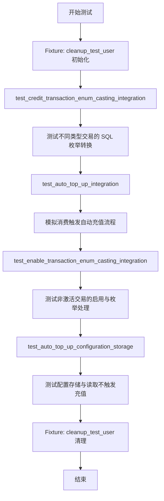

## 类结构

```
Test Module (test_credit_integration.py)
├── Fixtures
│   └── cleanup_test_user
├── Test Functions
│   ├── test_credit_transaction_enum_casting_integration
│   ├── test_auto_top_up_integration
│   ├── test_enable_transaction_enum_casting_integration
│   └── test_auto_top_up_configuration_storage
└── External Dependencies (Classes/Funcs)
    ├── BetaUserCredit
    ├── AutoTopUpConfig
    ├── UsageTransactionMetadata
    ├── SafeJson
    ├── get_auto_top_up
    └── set_auto_top_up
```

## 全局变量及字段


### `AutoTopUpConfig.threshold`
    
The credit balance limit that triggers an automatic top-up when the user's balance falls below it.

类型：`int`
    


### `AutoTopUpConfig.amount`
    
The specific number of credits to be added to the user's balance during an automatic top-up.

类型：`int`
    


### `UsageTransactionMetadata.reason`
    
A textual description explaining the specific context or cause of the credit usage transaction.

类型：`str`
    
    

## 全局函数及方法


### `cleanup_test_user`

一个 pytest 异步夹具（fixture），用于在测试前创建唯一的测试用户数据，在测试执行期间提供用户 ID，并在测试结束后自动清理所有相关的信用交易、余额及用户记录，以确保测试环境的隔离性。

参数：

无

返回值：`str`，生成的唯一用户 ID (UUID)。

#### 流程图

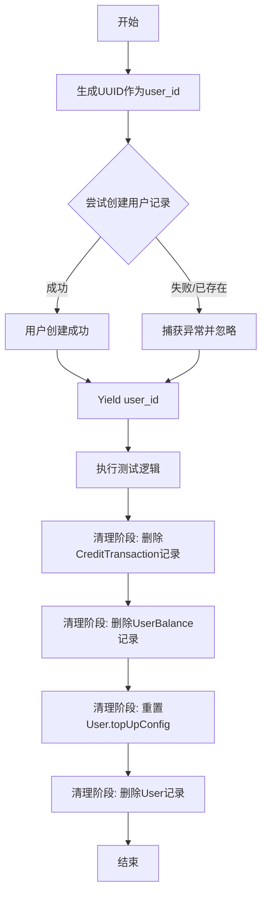

#### 带注释源码

```python
@pytest.fixture
async def cleanup_test_user():
    """Clean up test user data before and after tests."""
    import uuid

    user_id = str(uuid.uuid4())  # 生成唯一的用户ID，确保测试间互不干扰

    # Create the user first
    try:
        # 尝试在数据库中创建用户记录
        await User.prisma().create(
            data={
                "id": user_id,
                "email": f"test-{user_id}@example.com",
                "topUpConfig": SafeJson({}),
                "timezone": "UTC",
            }
        )
    except Exception:
        # User might already exist, that's fine
        # 如果用户已存在（极少数情况），忽略异常继续执行
        pass

    yield user_id  # 将 user_id 传递给测试函数，并在此处挂起，等待测试完成

    # Cleanup after test
    # 测试结束后执行清理逻辑
    
    # 删除该用户的所有信用交易记录
    await CreditTransaction.prisma().delete_many(where={"userId": user_id})
    
    # 删除该用户的所有余额记录
    await UserBalance.prisma().delete_many(where={"userId": user_id})
    
    # Clear auto-top-up config before deleting user
    # 清空用户的自动充值配置（为了满足可能的数据库外键约束或业务逻辑）
    await User.prisma().update(
        where={"id": user_id}, data={"topUpConfig": SafeJson({})}
    )
    
    # 最后删除用户记录
    await User.prisma().delete(where={"id": user_id})
```


### `test_credit_transaction_enum_casting_integration`

这是一个集成测试函数，用于验证信用交易类型在 SQL 查询中的枚举转换功能是否正常工作。该测试旨在捕捉潜在的枚举转换错误（如 PostgreSQL 期望特定的枚举格式但接收到通用格式），通过执行实际的数据库操作来确保各种交易类型（充值、使用、赠予、退款等）能够正确存储和检索。

参数：

-   `cleanup_test_user`：`str`，由 pytest fixture 提供的测试用户 ID，用于在测试中隔离数据并进行最终的清理工作。

返回值：`None`，该函数为测试用例，无明确的程序返回值。

#### 流程图

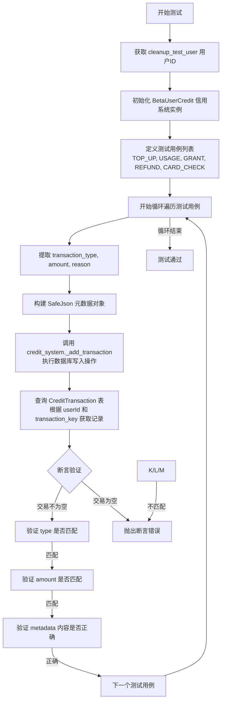

#### 带注释源码

```python
@pytest.mark.asyncio(loop_scope="session")
async def test_credit_transaction_enum_casting_integration(cleanup_test_user):
    """
    Integration test to verify CreditTransactionType enum casting works in SQL queries.

    This test would have caught the enum casting bug where PostgreSQL expected
    platform."CreditTransactionType" but got "CreditTransactionType".
    """
    # 从 fixture 获取测试用的用户 ID
    user_id = cleanup_test_user
    # 初始化信用系统对象，设置初始值为 1000
    credit_system = BetaUserCredit(1000)

    # 定义测试用例：包含不同的交易类型、金额和原因
    # 目的是覆盖所有可能的枚举值，确保在 SQL 查询中都能正确转换
    test_cases = [
        (CreditTransactionType.TOP_UP, 100, "Test top-up"),
        (CreditTransactionType.USAGE, -50, "Test usage"),
        (CreditTransactionType.GRANT, 200, "Test grant"),
        (CreditTransactionType.REFUND, -25, "Test refund"),
        (CreditTransactionType.CARD_CHECK, 0, "Test card check"),
    ]

    # 遍历所有测试用例
    for transaction_type, amount, reason in test_cases:
        # 构建交易元数据
        metadata = SafeJson({"reason": reason, "test": "enum_casting"})

        # 调用内部方法添加交易
        # 这一步会执行实际的 SQL 插入操作，如果枚举转换有问题，这里会抛出异常
        balance, tx_key = await credit_system._add_transaction(
            user_id=user_id,
            amount=amount,
            transaction_type=transaction_type,
            metadata=metadata,
            is_active=True,
        )

        # 从数据库查询刚才创建的交易，验证其是否被正确写入
        transaction = await CreditTransaction.prisma().find_first(
            where={"userId": user_id, "transactionKey": tx_key}
        )

        # 断言：交易记录必须存在
        assert transaction is not None
        # 断言：数据库中的类型必须与传入的枚举类型一致（验证枚举转换正确性）
        assert transaction.type == transaction_type
        # 断言：金额必须一致
        assert transaction.amount == amount
        # 断言：元数据字段不为空
        assert transaction.metadata is not None

        # 断言：验证元数据的具体内容是否正确存储和读取
        assert transaction.metadata["reason"] == reason
        assert transaction.metadata["test"] == "enum_casting"
```


### `test_auto_top_up_integration`

这是一个集成测试函数，用于验证自动充值（auto-top-up）功能的完整流程。该测试通过模拟用户消费触达阈值后的场景，确保涉及 `CreditTransactionType` 枚举的 SQL 查询能够正确执行，从而捕获潜在的枚举类型转换错误，并验证系统是否按预期触发了自动充值交易。

参数：

-   `cleanup_test_user`：`str` (由 fixture 提供)，用于提供测试环境的唯一用户 ID，并在测试前后自动清理用户及相关的交易、余额数据。
-   `monkeypatch`：`pytest.MonkeyPatch`，用于在运行时动态修改设置配置，以启用信用系统相关的功能开关（如启用信用、启用 Beta 月度额度等）。

返回值：`None`，该函数为测试用例，不返回具体的值，而是通过断言来验证系统行为是否符合预期。

#### 流程图

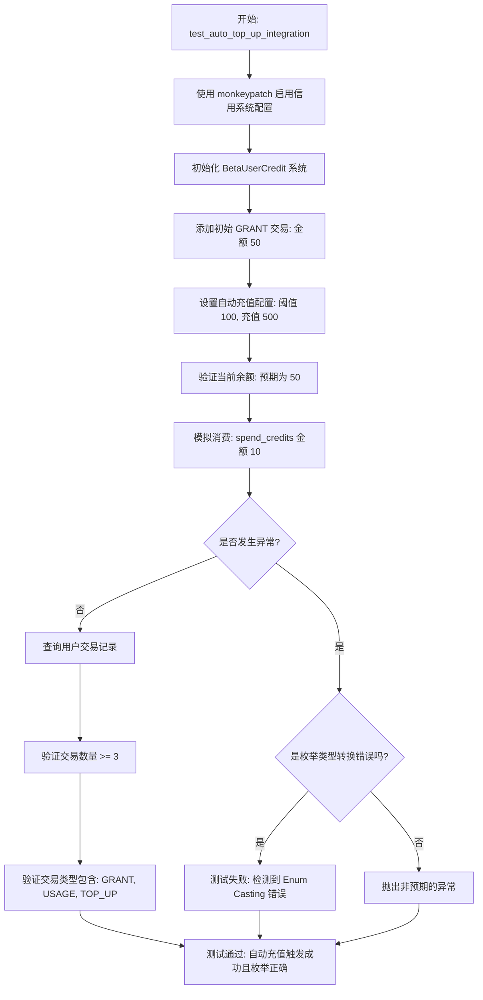

#### 带注释源码

```python
@pytest.mark.asyncio(loop_scope="session")
async def test_auto_top_up_integration(cleanup_test_user, monkeypatch):
    """
    Integration test for auto-top-up functionality that triggers enum casting.

    This tests the complete auto-top-up flow which involves SQL queries with
    CreditTransactionType enums, ensuring enum casting works end-to-end.
    """
    # 导入配置模块
    from backend.data.credit import settings

    # 使用 monkeypatch 修改配置，启用信用系统和 Beta 月度额度
    monkeypatch.setattr(settings.config, "enable_credit", True)
    monkeypatch.setattr(settings.config, "enable_beta_monthly_credit", True)
    monkeypatch.setattr(settings.config, "num_user_credits_refill", 1000)

    # 获取测试用户 ID 并初始化信用系统实例
    user_id = cleanup_test_user
    credit_system = BetaUserCredit(1000)

    # 步骤 1: 添加初始授信额度，使得余额低于稍后设置的阈值
    balance, _ = await credit_system._add_transaction(
        user_id=user_id,
        amount=50,  # 初始 50，低于即将设置的阈值 100
        transaction_type=CreditTransactionType.GRANT,
        metadata=SafeJson({"reason": "Initial credits before auto top-up config"}),
    )
    assert balance == 50

    # 步骤 2: 配置自动充值
    # 设置阈值为 100，自动充值金额为 500
    config = AutoTopUpConfig(threshold=100, amount=500)
    await set_auto_top_up(user_id, config)

    # 步骤 3: 验证配置保存后余额未立即改变
    current_balance = await credit_system.get_credits(user_id)
    assert current_balance == 50  # 余额应保持不变，不应立即触发充值

    # 步骤 4: 模拟消费以触发自动充值机制
    # 这个过程涉及多次包含枚举类型转换的 SQL 操作
    try:
        # 构建消费元数据
        metadata = UsageTransactionMetadata(reason="Test spend to trigger auto top-up")
        # 扣除 10 信用点，此时余额变为 40，依然低于阈值 100
        # 系统应在逻辑中检测到低于阈值并触发自动充值 (TOP_UP)
        await credit_system.spend_credits(user_id=user_id, cost=10, metadata=metadata)

        # 步骤 5: 验证自动充值机制是否被正确触发
        transactions = await CreditTransaction.prisma().find_many(
            where={"userId": user_id}, order={"createdAt": "desc"}
        )

        # 验证交易记录至少包含：初始的 GRANT、本次的 USAGE、触发的 TOP_UP
        assert len(transactions) >= 3

        # 验证交易类型集合中包含所有预期的枚举类型，确认枚举转换正确
        transaction_types = {t.type for t in transactions}
        assert CreditTransactionType.GRANT in transaction_types
        assert CreditTransactionType.USAGE in transaction_types
        assert (
            CreditTransactionType.TOP_UP in transaction_types
        )  # 确认自动充值交易已生成

    except Exception as e:
        # 错误处理：如果失败原因与枚举类型转换有关，则明确标记失败
        # 如果这是针对 enum casting bug 的复现测试，这里捕捉到了该错误
        if "CreditTransactionType" in str(e) and (
            "cast" in str(e).lower() or "type" in str(e).lower()
        ):
            pytest.fail(f"Enum casting error detected: {e}")
        else:
            # 如果是其他非预期错误，继续抛出
            raise
```


### `test_enable_transaction_enum_casting_integration`

集成测试函数，用于验证在激活非活跃交易（`_enable_transaction`）时，`CreditTransactionType` 枚举类型在 SQL 查询中的转换是否正常工作。该测试模拟了创建一个非活跃的交易记录，然后通过激活操作来更新数据库记录，确保涉及枚举类型的数据库操作能够正确执行。

参数：

- `cleanup_test_user`: `str`, 一个 Pytest fixture，提供测试用的唯一用户 ID，并在测试前后负责创建和清理相关的测试数据（用户、余额、交易记录等）。

返回值：`None`, 该函数是一个测试用例，不返回业务数据，主要通过断言（assert）验证逻辑正确性。

#### 流程图

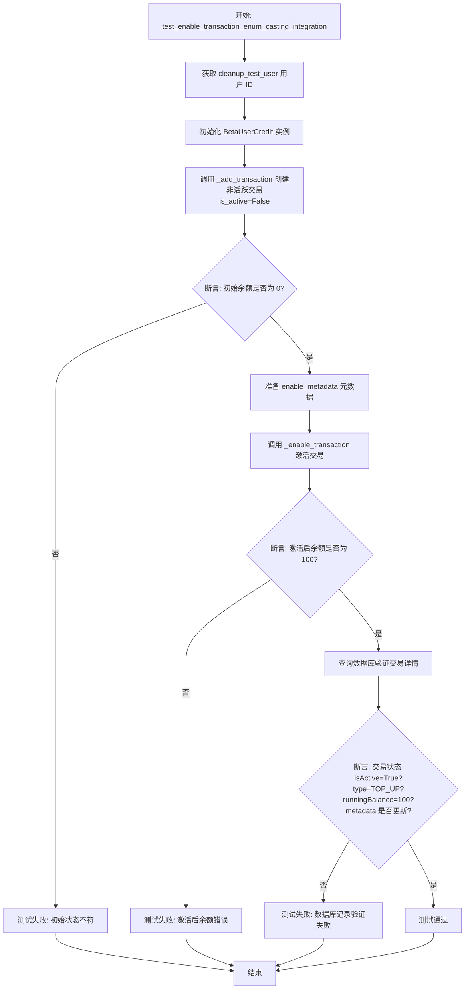

#### 带注释源码

```python
@pytest.mark.asyncio(loop_scope="session")
async def test_enable_transaction_enum_casting_integration(cleanup_test_user):
    """
    Integration test for _enable_transaction with enum casting.

    Tests the scenario where inactive transactions are enabled, which also
    involves SQL queries with CreditTransactionType enum casting.
    """
    # 获取测试用户 ID
    user_id = cleanup_test_user
    # 初始化信用系统实例
    credit_system = BetaUserCredit(1000)

    # 创建一个非活跃的交易，金额为 100，类型为 TOP_UP
    balance, tx_key = await credit_system._add_transaction(
        user_id=user_id,
        amount=100,
        transaction_type=CreditTransactionType.TOP_UP,
        metadata=SafeJson({"reason": "Inactive transaction test"}),
        is_active=False,  # 标记为非活跃
    )

    # 由于交易未激活，断言当前余额应为 0
    assert balance == 0

    # 准备激活交易时使用的新元数据
    enable_metadata = SafeJson(
        {
            "payment_method": "test_payment",
            "activation_reason": "Integration test activation",
        }
    )

    # 调用 _enable_transaction 激活交易
    # 在修复之前，这里可能因为 SQL 枚举转换问题而失败
    final_balance = await credit_system._enable_transaction(
        transaction_key=tx_key,
        user_id=user_id,
        metadata=enable_metadata,
    )

    # 断言激活后的最终余额应反映交易金额
    assert final_balance == 100

    # 从数据库查询交易记录以验证状态
    transaction = await CreditTransaction.prisma().find_first(
        where={"userId": user_id, "transactionKey": tx_key}
    )

    assert transaction is not None
    # 断言交易已激活
    assert transaction.isActive is True
    # 断言交易类型枚举转换正确
    assert transaction.type == CreditTransactionType.TOP_UP
    # 断言运行余额已更新
    assert transaction.runningBalance == 100

    # 断言元数据已成功更新
    assert transaction.metadata is not None
    assert transaction.metadata["payment_method"] == "test_payment"
    assert transaction.metadata["activation_reason"] == "Integration test activation"
```


### `test_auto_top_up_configuration_storage`

验证自动充值配置是否正确持久化到存储中并可被检索的集成测试。该测试重点在于配置本身的保存与读取逻辑，确认核心的 `set_auto_top_up` 函数不会触发即时的充值操作（即时充值逻辑由 API 路由处理）。

参数：

-  `cleanup_test_user`：`str`，测试 fixture，用于提供唯一的测试用户 ID 并在测试前后清理相关数据。
-  `monkeypatch`：`pytest.MonkeyPatch`，Pytest fixture，用于在运行时修改配置设置（如启用信用系统）。

返回值：`None`，该函数为异步测试函数，通过断言验证逻辑，不直接返回业务数据。

#### 流程图

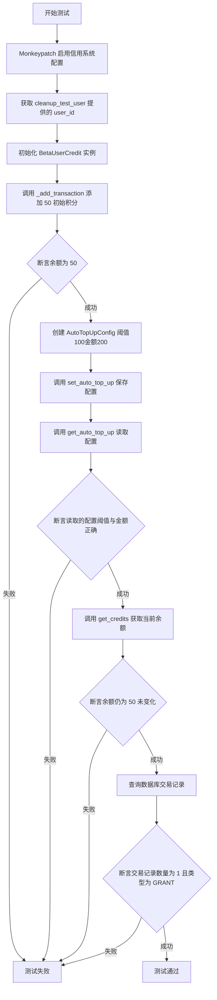

#### 带注释源码

```python
@pytest.mark.asyncio(loop_scope="session")
async def test_auto_top_up_configuration_storage(cleanup_test_user, monkeypatch):
    """
    Test that auto-top-up configuration is properly stored and retrieved.

    The immediate top-up logic is handled by the API routes, not the core
    set_auto_top_up function. This test verifies the configuration is correctly
    saved and can be retrieved.
    """
    # Enable credits for this test
    from backend.data.credit import settings

    # 使用 monkeypatch 修改运行时配置，强制启用信用系统和相关功能
    monkeypatch.setattr(settings.config, "enable_credit", True)
    monkeypatch.setattr(settings.config, "enable_beta_monthly_credit", True)
    monkeypatch.setattr(settings.config, "num_user_credits_refill", 1000)

    user_id = cleanup_test_user
    credit_system = BetaUserCredit(1000)

    # Set initial balance
    # 添加一笔初始的 GRANT 类型交易，设置初始余额为 50
    balance, _ = await credit_system._add_transaction(
        user_id=user_id,
        amount=50,
        transaction_type=CreditTransactionType.GRANT,
        metadata=SafeJson({"reason": "Initial balance for config test"}),
    )

    assert balance == 50

    # Configure auto top-up
    # 定义自动充值配置：阈值 100，充值金额 200
    config = AutoTopUpConfig(threshold=100, amount=200)
    # 保存配置，预期此操作不应触发立即充值
    await set_auto_top_up(user_id, config)

    # Verify the configuration was saved
    # 从存储中获取配置
    retrieved_config = await get_auto_top_up(user_id)
    # 验证获取的配置参数与保存的一致
    assert retrieved_config.threshold == config.threshold
    assert retrieved_config.amount == config.amount

    # Verify balance is unchanged (no immediate top-up from set_auto_top_up)
    # 再次获取余额，确认 set_auto_top_up 没有改变余额
    final_balance = await credit_system.get_credits(user_id)
    assert final_balance == 50  # Should be unchanged

    # Verify no immediate auto-top-up transaction was created by set_auto_top_up
    # 查询数据库中的交易记录
    transactions = await CreditTransaction.prisma().find_many(
        where={"userId": user_id}, order={"createdAt": "desc"}
    )

    # Should only have the initial GRANT transaction
    # 验证只有初始的 GRANT 交易存在，证明 set_auto_top_up 未产生新交易
    assert len(transactions) == 1
    assert transactions[0].type == CreditTransactionType.GRANT
```


### `backend.data.credit.get_auto_top_up`

**注意**：提供的代码是一个集成测试文件，其中导入了 `get_auto_top_up` 但未包含其具体实现源码。以下信息是根据测试代码中的调用签名和导入上下文推导出的接口定义。

该函数的核心功能是根据提供的用户ID，从持久层（数据库）检索该用户的自动充值配置。

参数：

-   `user_id`：`str`，目标用户的唯一标识符。

返回值：`AutoTopUpConfig`，包含用户自动充值设置（如触发阈值和充值金额）的配置对象。

#### 流程图

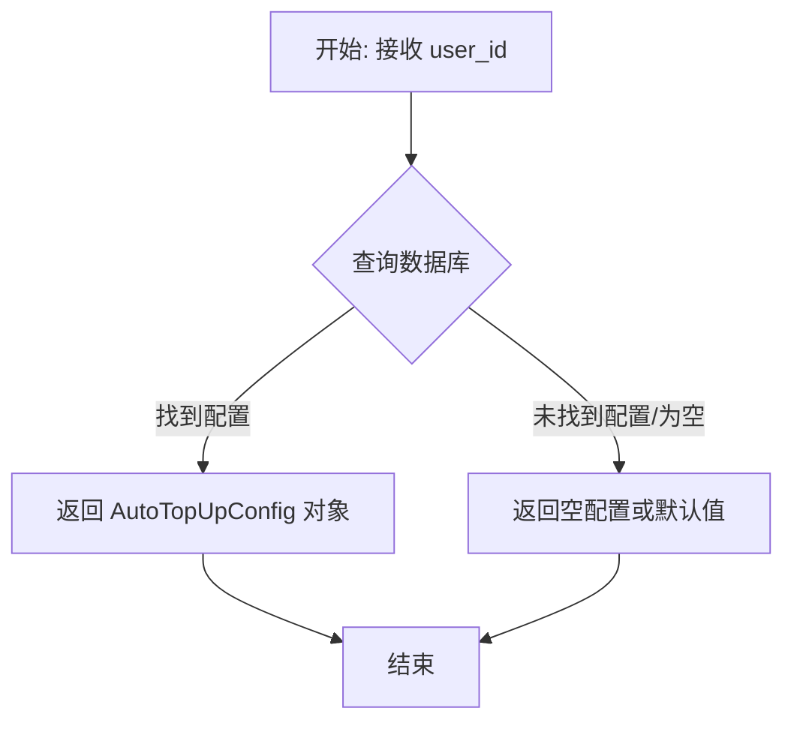

#### 带注释源码

```python
# 注意：以下为函数签名及调用上下文推导，非实际实现源码。
# 实际实现位于 backend.data.credit 模块中。

async def get_auto_top_up(user_id: str) -> AutoTopUpConfig:
    """
    从数据库获取用户的自动充值配置。
    
    根据测试代码 test_auto_top_up_configuration_storage 中的逻辑：
    1. 接收 user_id
    2. 返回一个包含 threshold 和 amount 的 AutoTopUpConfig 对象
    """
    # 实现源码不在提供的文件中
    pass

# -----------------------
# 提供的测试代码中的使用上下文：
# -----------------------
# from backend.data.credit import AutoTopUpConfig, get_auto_top_up
#
# ...
# # Configure auto top-up
# config = AutoTopUpConfig(threshold=100, amount=200)
# await set_auto_top_up(user_id, config)
#
# # Verify the configuration was saved
# # 调用该函数
# retrieved_config = await get_auto_top_up(user_id)
# # 验证返回值具有 threshold 和 amount 属性
# assert retrieved_config.threshold == config.threshold
# assert retrieved_config.amount == config.amount
```


### `set_auto_top_up`

该函数用于为指定用户配置自动充值功能。它接收用户ID和自动充值配置对象，将配置持久化存储，根据测试行为推断，该函数仅保存配置而不触发即时的充值操作。

参数：

- `user_id`：`str`，目标用户的唯一标识符。
- `config`：`AutoTopUpConfig`，自动充值配置对象，包含触发阈值和充值金额。

返回值：`None`，函数是异步调用的且在测试中未捕获返回值，推断无返回值或仅返回状态。

#### 流程图

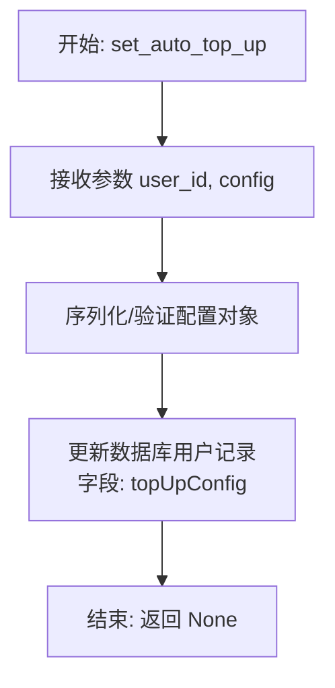

#### 带注释源码

```python
# 注意：提供的代码片段为集成测试文件，不包含 set_auto_top_up 的具体实现源码。
# 以下代码基于测试文件中的导入语句和调用方式推断出的函数签名及逻辑结构。

from backend.data.credit import AutoTopUpConfig

async def set_auto_top_up(user_id: str, config: AutoTopUpConfig):
    """
    设置用户的自动充值配置。
    
    根据集成测试 test_auto_top_up_configuration_storage 的逻辑推断：
    1. 该函数接收用户ID和配置对象。
    2. 配置会被保存，后续可以通过 get_auto_top_up 读取到。
    3. 调用此函数不会立即产生交易（余额不变），也不会创建 CreditTransaction。
    """
    # 实际实现位于 backend.data.credit 模块中
    # 逻辑可能涉及 Prisma Client 的 User.prisma().update 操作
    # 更新 data={"topUpConfig": config}
    pass
```


### `BetaUserCredit._add_transaction`

该方法用于向用户的积分账户中添加一笔交易记录。根据传入的参数（如交易类型、金额和是否激活），它会在数据库中创建相应的交易记录，并更新用户的积分余额。该方法主要用于处理充值、消费、退款等不同类型的积分变动，并确保通过 SQL 枚举类型正确记录交易类型。

参数：

-  `user_id`：`str`，目标用户的唯一标识符。
-  `amount`：`int`，交易的金额。正数表示增加积分（如充值、奖励），负数表示扣除积分（如消费、退款）。
-  `transaction_type`：`CreditTransactionType`，交易的类型枚举值（如 TOP_UP, USAGE, GRANT, REFUND, CARD_CHECK）。
-  `metadata`：`SafeJson`，包含交易详细信息的元数据对象（例如交易原因、备注等）。
-  `is_active`：`bool`，标识该交易是否立即生效并影响用户余额（默认为 True，若为 False 则仅记录交易不更新余额）。

返回值：`Tuple[int, str]`，返回一个元组，第一个元素是交易执行后的用户最新积分余额，第二个元素是生成的交易唯一键。

#### 流程图

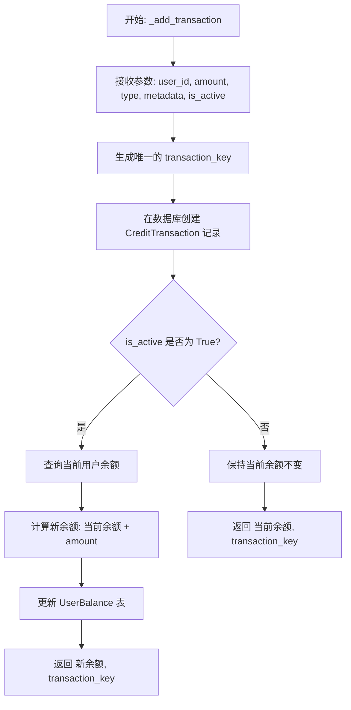

#### 带注释源码

```python
async def _add_transaction(
    self,
    user_id: str,
    amount: int,
    transaction_type: CreditTransactionType,
    metadata: SafeJson,
    is_active: bool = True
) -> Tuple[int, str]:
    """
    根据测试代码推断的接口定义与核心逻辑。
    该方法负责原子化地处理积分交易记录和余额更新。
    """
    # 1. 生成唯一的交易键，用于幂等性控制和记录查询
    tx_key = generate_unique_key()

    # 2. 在数据库中创建交易记录
    # 注意：transaction_type 需要正确处理枚举类型以匹配 SQL 数据库的预期类型
    # 这里涉及 CreditTransactionType 的枚举转换
    await CreditTransaction.prisma().create(
        data={
            "userId": user_id,
            "amount": amount,
            "type": transaction_type,  # 关键：确保此处枚举类型正确映射
            "metadata": metadata,
            "transactionKey": tx_key,
            "isActive": is_active
        }
    )

    # 3. 根据交易状态决定是否更新用户余额
    if is_active:
        # 获取当前余额并计算新余额
        # 实际实现可能涉及数据库行锁或乐观锁以保证并发安全
        current_balance = await self.get_credits(user_id)
        new_balance = current_balance + amount

        # 更新 UserBalance 记录
        await UserBalance.prisma().upsert(
            where={"userId": user_id},
            update={"balance": new_balance},
            create={"userId": user_id, "balance": new_balance}
        )
        
        return new_balance, tx_key
    else:
        # 如果交易未激活，仅获取当前余额用于返回，不进行更新
        # (例如：测试用例中 is_active=False 时，返回余额为 0 或未变动值)
        current_balance = await self.get_credits(user_id)
        return current_balance, tx_key
```


### `BetaUserCredit.spend_credits`

用于扣除用户信用额度并记录使用情况的方法。根据集成测试 `test_auto_top_up_integration` 的上下文，该方法在扣费后会触发自动充值的检查逻辑，如果余额低于设定阈值，则会执行自动充值操作。

参数：

-  `user_id`：`str`，目标用户的唯一标识符。
-  `cost`：`int`，本次操作需要扣除的信用额度数量。
-  `metadata`：`UsageTransactionMetadata`，交易的元数据信息，用于记录扣费原因或用途。

返回值：`None`（在提供的测试代码中，调用该方法时未捕获返回值，推断其主要为副作用操作，即更新数据库状态）。

#### 流程图

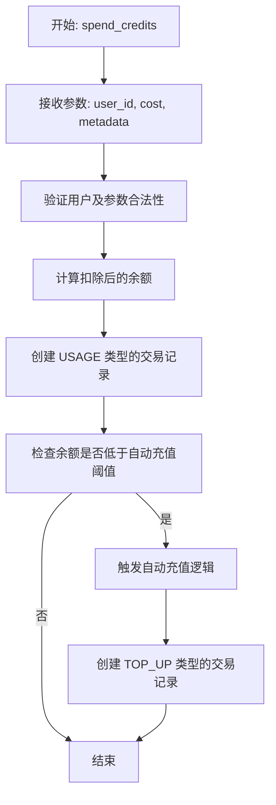

#### 带注释源码

```python
# 注意：提供的代码片段为集成测试代码，未包含 BetaUserCredit.spend_credits 的具体实现。
# 以下为测试代码中的调用示例，展示了该方法的参数类型及使用上下文。

from backend.data.credit import BetaUserCredit, UsageTransactionMetadata

# ... (在 test_auto_top_up_integration 函数中)

# 准备元数据
metadata = UsageTransactionMetadata(reason="Test spend to trigger auto top-up")

# 调用 spend_credits 方法
# 参数说明:
# user_id: 测试用户ID (str)
# cost: 消耗的信用点数 (int)
# metadata: 包含消耗原因等信息的元数据对象
await credit_system.spend_credits(user_id=user_id, cost=10, metadata=metadata)

# 预期副作用:
# 1. 用户余额减少 10
# 2. 生成一条 CreditTransactionType 为 USAGE 的记录
# 3. 如果余额低于阈值，触发自动充值并生成一条 TOP_UP 记录
```


### `BetaUserCredit.get_credits`

该方法用于从系统中检索指定用户的当前可用信用余额。它被设计为一个异步方法，通常在需要检查用户是否有足够额度进行操作或在交易完成后确认余额时调用。

参数：

- `user_id`：`str`，需要查询信用余额的用户的唯一标识符。

返回值：`int`，用户当前的信用余额数值。

#### 流程图

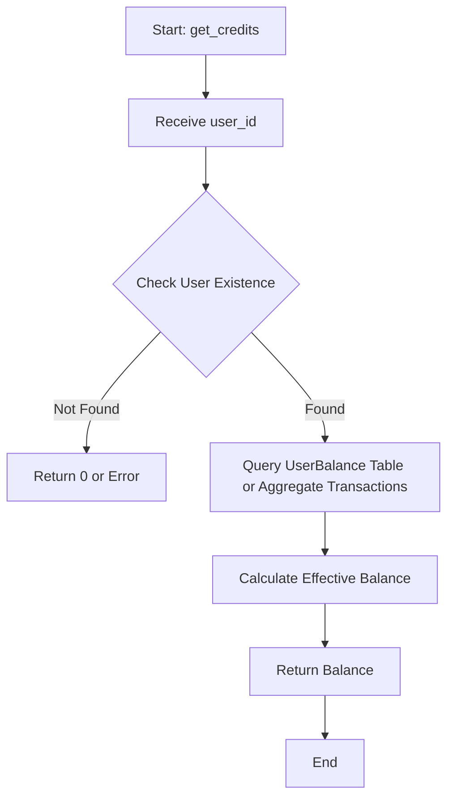

#### 带注释源码

```python
# 注意：提供的代码片段为集成测试文件，不包含 BetaUserCredit 类的具体实现代码。
# 该类从 backend.data.credit 导入。
# 基于测试代码中的调用上下文（第95行和第139行），该方法的接口和预期行为如下：

async def get_credits(self, user_id: str) -> int:
    """
    获取用户的当前信用余额。

    Args:
        user_id (str): 用户的唯一标识符。

    Returns:
        int: 用户的当前信用余额。在测试用例中，返回值被断言为整数（如 50）。

    Context from tests:
    - Used in test_auto_top_up_integration to verify balance is unchanged after config set.
    - Used in test_auto_top_up_configuration_storage to verify balance remains 50.
    - Likely queries the 'UserBalance' Prisma model or aggregates 'CreditTransaction' records.
    """
    # 实现细节在提供的代码片段中不可见，但逻辑应如下：
    # 1. 连接数据库。
    # 2. 查询 UserBalance 表中对应 user_id 的记录，或者
    #    汇总 CreditTransaction 表中该用户的活跃交易。
    # 3. 返回计算出的余额数值。
    pass
```


### `BetaUserCredit._enable_transaction`

该方法用于激活之前创建的非活跃（inactive）信用交易。它会根据交易键定位记录，更新交易元数据，将交易状态标记为活跃，并将交易金额计入用户的最终余额。

参数：

- `transaction_key`：`str`，用于唯一标识待激活交易的键值。
- `user_id`：`str`，与该交易关联的用户ID。
- `metadata`：`dict` 或 `SafeJson`，激活交易时需要更新或附加的元数据信息。

返回值：`int`，交易激活并计入后的用户最新信用余额。

#### 流程图

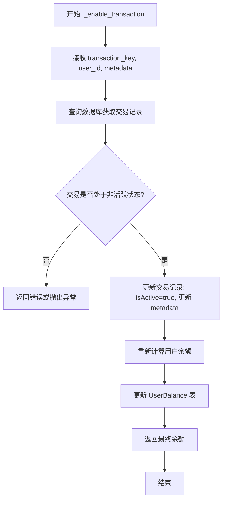

#### 带注释源码

```python
# 注意：提供的代码片段为集成测试文件（test_integration.py），并未包含 BetaUserCredit 类的具体实现源码。
# 该类定义位于 backend.data.credit 模块中。
# 以下为测试文件中对该方法的调用代码及上下文注释，展示了其使用方式：

# This would fail with enum casting error before the fix
# 在修复之前，这里的调用可能会因为枚举类型转换错误而失败
final_balance = await credit_system._enable_transaction(
    transaction_key=tx_key,       # 之前创建交易时返回的事务键
    user_id=user_id,               # 目标用户ID
    metadata=enable_metadata,      # 包含支付方式和激活原因的新元数据
)
```


## 关键组件


### 积分事务类型枚举转换验证

验证数据库操作中 `CreditTransactionType` 枚举正确转换的集成测试组件，旨在捕获 PostgreSQL 在处理枚举类型时的潜在转换错误，确保增删改查操作中类型字段的一致性。

### 自动充值逻辑集成测试

测试自动充值业务流程的完整组件，包括配置阈值与金额、监控用户余额消耗、自动触发充值事务以及验证不同事务类型（USAGE, TOP_UP）在数据库中的记录状态。

### 测试环境数据隔离与清理

基于 Pytest Fixture 的数据管理组件，负责为每个测试用例生成唯一的用户 ID，并在测试前后自动创建或销毁用户数据、积分记录及配置，确保测试间的相互独立性。

### 非活跃事务激活机制

测试将状态为非活跃的积分事务转换为活跃状态的逻辑组件，验证事务激活过程中的元数据更新、余额重新计算以及数据库状态变更的正确性。


## 问题及建议


### 已知问题

-   **测试代码破坏了封装性**：测试直接调用了 `_add_transaction` 和 `_enable_transaction` 等带下划线的私有方法，这会导致测试与内部实现细节强耦合。一旦内部逻辑重构，测试将不可避免地失败，增加了维护成本。
-   **Fixture 中的异常处理过于宽泛**：在 `cleanup_test_user` fixture 中创建用户时使用了 `try...except Exception` 而未区分具体的异常类型。这可能会掩盖真实的数据库连接问题、权限问题或数据校验错误，导致测试在错误的状态下通过或静默失败，难以排查。
-   **基于字符串匹配的错误检测脆弱**：在 `test_auto_top_up_integration` 中，通过检查错误信息字符串（如包含 "CreditTransactionType" 和 "cast"）来验证特定的 Enum Casting Bug。这种方式高度依赖数据库驱动或 ORM 抛出的具体错误文案，一旦数据库版本升级或底层库的报错格式变更，该断言逻辑将失效。

### 优化建议

-   **提取公共测试配置逻辑**：目前有多个测试函数（如 `test_auto_top_up_integration` 和 `test_auto_top_up_configuration_storage`）都包含相同的 `monkeypatch` 代码来修改 `settings.config`。建议将这些重复的配置逻辑提取到一个独立的 fixture 或辅助函数中，遵循 DRY（Don't Repeat Yourself）原则，提高代码的可读性和可维护性。
-   **引入数据库事务回滚机制**：目前的 `cleanup_test_user` 通过手动执行 `delete` 操作来清理环境，这种方式速度较慢且容易产生残留数据。如果测试框架和数据库驱动支持，建议在每个测试开始时开启数据库事务，在测试结束后直接执行回滚，这样可以显著提升测试速度并保证数据库环境的绝对隔离。
-   **优先测试公共接口**：虽然本测试的目的是验证 SQL 层的 Enum 转换，但应尽量通过系统的公共 API（如 `spend_credits`）来触发这些内部 SQL 操作，而不是直接调用私有方法。如果必须测试私有方法，建议在代码注释中明确标注其为“白盒测试”，并在未来重构时予以特别关注，或者考虑将关键 SQL 构建逻辑提取到独立的、可公开访问的模块中进行测试。


## 其它


### 设计目标与约束

本测试套件的设计目标是确保信用系统与数据库交互时的完整性与正确性，特别是针对 Prisma ORM 在处理 PostgreSQL 枚举类型时的潜在转换错误。具体目标包括：验证 `CreditTransactionType` 枚举在不同事务类型（TOP_UP, USAGE, GRANT 等）下的 SQL 注入正确性；测试自动充值逻辑在临界值触发时的端到端行为；确认非活跃事务激活后的状态更新及余额计算准确性。主要约束包括：必须运行在配置有效的 PostgreSQL 数据库环境中；测试依赖于 `pytest-asyncio` 的会话级作用域以管理异步生命周期；测试数据隔离依赖于 fixture 的清理机制，且无法在没有数据库连接的单元测试环境中运行。

### 错误处理与异常设计

测试代码中设计了特定的异常捕获逻辑以识别和验证特定的数据库错误。核心逻辑是通过 `try-except` 块捕获执行过程中的异常，并检查错误信息中是否包含 "CreditTransactionType" 以及 "cast" 或 "type" 关键字。如果匹配，则调用 `pytest.fail` 显式标记测试失败，证明枚举转换 Bug 存在；否则，重新抛出非预期的异常。此外，对于 Fixture 中的用户创建，采用了“存在即忽略”的防御性编程策略，防止因重复创建导致的唯一性约束异常中断测试流程。

### 数据流与状态机

该系统涉及的关键数据流是用户信用额度的变化及事务状态流转。
1.  **事务生命周期状态机**：
    ```mermaid
    stateDiagram-v2
      [*] --> Created: _add_transaction (is_active=True)
      [*] --> Inactive: _add_transaction (is_active=False)
      Created --> [*]: Balance Updated
      Inactive --> Active: _enable_transaction
      Active --> [*]: Balance Updated
    ```
2.  **自动充值触发流程**：
    当 `spend_credits` 被调用导致余额低于 `AutoTopUpConfig` 设定的阈值时，系统内部（通过 `BetaUserCredit` 逻辑）应自动触发一笔 `TOP_UP` 类型的事务，将余额提升至设定额度，同时记录相关事务记录。测试验证了从消费、触发条件检查到自动充值执行的完整链路。

### 外部依赖与接口契约

该测试模块严重依赖外部组件 `prisma`（ORM 客户端）和业务逻辑模块 `backend.data.credit`。
*   **Prisma 接口契约**：依赖 `User`, `CreditTransaction`, `UserBalance` 模型的 `prisma()` 客户端方法（如 `create`, `find_first`, `update`）来执行数据库操作。契约假设数据库 Schema 中存在对应的表结构及 `CreditTransactionType` 枚举类型。
*   **业务逻辑接口契约**：
    *   `BetaUserCredit(amount_limit)`: 初始化时需传入限额。
    *   `BetaUserCredit._add_transaction(user_id, amount, transaction_type, metadata, is_active)`: 返回 `(balance, tx_key)`。
    *   `BetaUserCredit._enable_transaction(transaction_key, user_id, metadata)`: 返回更新后的 `balance`。
    *   `BetaUserCredit.spend_credits(user_id, cost, metadata)`: 执行扣款逻辑。
    *   `set_auto_top_up(user_id, config)` / `get_auto_top_up(user_id)`: 配置的存储与读取接口。
    测试假设这些接口在数据库层面正确实现了原子性操作和事务隔离。


    