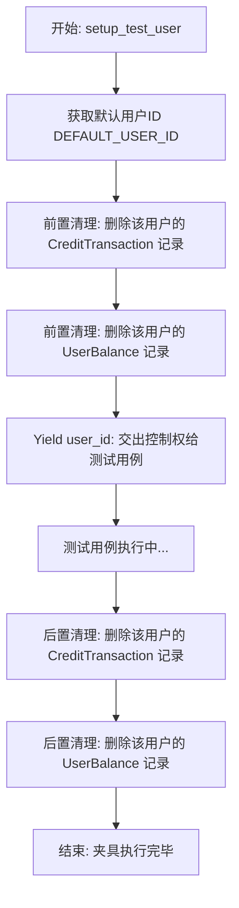
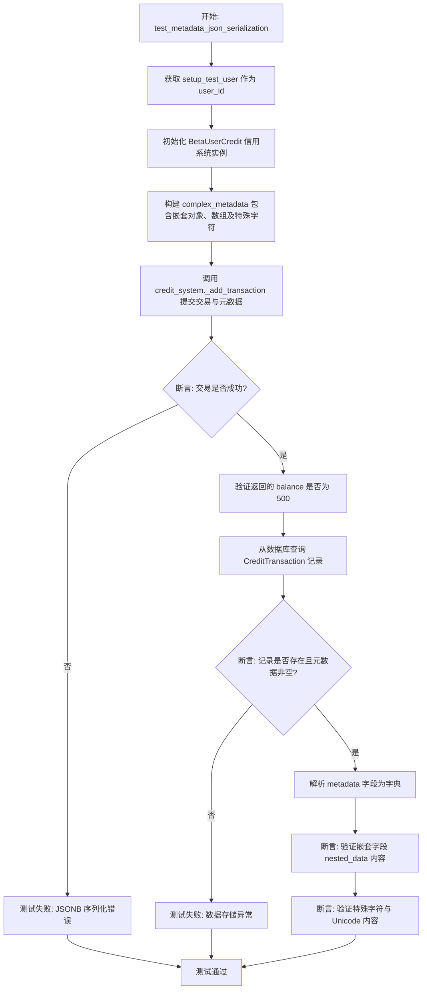
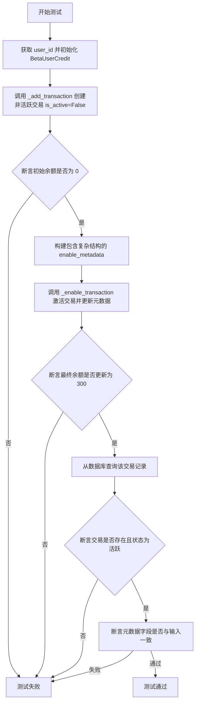
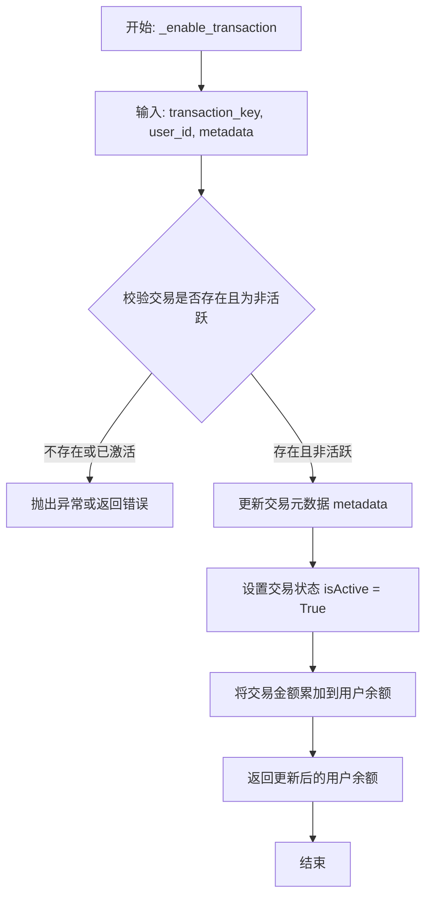

# `AutoGPT\autogpt_platform\backend\backend\data\credit_metadata_test.py` 详细设计文档

该代码文件包含针对信用系统元数据处理的集成测试，主要验证使用 SafeJson 封装的复杂数据结构（如嵌套字典、数组、特殊字符）在通过原始 SQL 写入数据库 JSONB 列时的序列化正确性，覆盖了事务创建和事务激活两个关键流程。

## 整体流程

```mermaid
graph TD
    Start[开始] --> Setup[setup_test_user: 清理并获取 user_id]
    Setup --> Case1[测试用例 1: 元数据 JSON 序列化]
    Case1 --> Init1[初始化 BetaUserCredit(1000)]
    Init1 --> CreateMeta1[创建 complex_metadata: SafeJson]
    CreateMeta1 --> AddTx[调用 _add_transaction 创建交易]
    AddTx --> Verify1[断言余额并查询数据库验证元数据]
    Verify1 --> Case2[测试用例 2: 激活事务元数据序列化]
    Case2 --> CreateInactive[_add_transaction 创建非激活交易]
    CreateInactive --> CreateMeta2[创建 enable_metadata: SafeJson]
    CreateMeta2 --> EnableTx[调用 _enable_transaction 激活交易]
    EnableTx --> Verify2[断言余额更新并验证新元数据]
    Verify2 --> Cleanup[Teardown: 清理用户数据]
    Cleanup --> End[结束]
```

## 类结构

```
Test File (test_credit_metadata.py)
├── Functions (测试函数)
│   ├── setup_test_user
│   ├── test_metadata_json_serialization
│   └── test_enable_transaction_metadata_serialization
└── Referenced Classes (引用类)
    ├── BetaUserCredit
    └── SafeJson
```

## 全局变量及字段


    

## 全局函数及方法


### `setup_test_user`

这是一个 pytest 异步夹具，用于初始化测试环境。它在测试执行前清理指定用户（默认用户）的信用交易和余额数据，并在测试执行完成后再次清理，以确保测试数据的隔离性和环境的一致性。

参数：

-  无

返回值：`str`，生成的默认测试用户 ID (`DEFAULT_USER_ID`)，供测试函数使用。

#### 流程图



#### 带注释源码

```python
@pytest.fixture
async def setup_test_user():
    """Setup test user and cleanup after test."""
    # 获取默认的用户ID作为测试对象
    user_id = DEFAULT_USER_ID

    # Cleanup before test
    # 测试前置清理：删除该用户的所有旧交易记录，防止干扰测试
    await CreditTransaction.prisma().delete_many(where={"userId": user_id})
    # 测试前置清理：删除该用户的所有旧余额记录
    await UserBalance.prisma().delete_many(where={"userId": user_id})

    # 将 user_id 暂停并传递给测试函数，等待测试函数执行完毕
    yield user_id

    # Cleanup after test
    # 测试后置清理：再次清理，确保不留下测试产生的数据
    await CreditTransaction.prisma().delete_many(where={"userId": user_id})
    await UserBalance.prisma().delete_many(where={"userId": user_id})
```


### `test_metadata_json_serialization`

该测试函数用于验证在向原始 SQL 查询传递带有 JSONB 列的元数据参数时，复杂的嵌套数据结构和特殊字符能否被正确序列化，确保数据库操作不会因为 JSONB 转换错误而失败，并且存储的数据与输入一致。

参数：

- `setup_test_user`：`Any`，通过 pytest fixture 提供的测试用户 ID，用于在测试中模拟用户操作。

返回值：`None`，该函数为测试函数，通过断言验证逻辑，无显式返回值。

#### 流程图



#### 带注释源码

```python
@pytest.mark.asyncio(loop_scope="session")
async def test_metadata_json_serialization(setup_test_user):
    """Test that metadata is properly serialized for JSONB column in raw SQL."""
    # 1. 获取测试用户 ID
    user_id = setup_test_user
    # 2. 初始化信用系统，初始额度为 1000
    credit_system = BetaUserCredit(1000)

    # 3. 构建复杂的元数据对象，用于测试 JSONB 序列化能力
    # 包含嵌套字典、列表、特殊引号和 Unicode 字符
    complex_metadata = SafeJson(
        {
            "graph_exec_id": "test-12345",
            "reason": "Testing metadata serialization",
            "nested_data": {
                "key1": "value1",
                "key2": ["array", "of", "values"],
                "key3": {"deeply": {"nested": "object"}},
            },
            "special_chars": "Testing 'quotes' and \"double quotes\" and unicode: 🚀",
        }
    )

    # 4. 调用内部方法添加交易，传入复杂元数据
    # 如果序列化逻辑有问题，此处会抛出 JSONB casting error
    balance, tx_key = await credit_system._add_transaction(
        user_id=user_id,
        amount=500,  # $5 top-up
        transaction_type=CreditTransactionType.TOP_UP,
        metadata=complex_metadata,
        is_active=True,
    )

    # 5. 验证交易写入后的余额是否正确
    assert balance == 500

    # 6. 从数据库中查询刚创建的交易记录
    transaction = await CreditTransaction.prisma().find_first(
        where={"userId": user_id, "transactionKey": tx_key}
    )

    # 7. 确保交易记录存在且元数据字段已保存
    assert transaction is not None
    assert transaction.metadata is not None

    # 8. 将元数据转换为字典并进行深度验证
    metadata_dict: dict[str, Any] = dict(transaction.metadata)  # type: ignore
    assert metadata_dict["graph_exec_id"] == "test-12345"
    assert metadata_dict["reason"] == "Testing metadata serialization"
    
    # 验证嵌套结构完整性
    assert metadata_dict["nested_data"]["key1"] == "value1"
    assert metadata_dict["nested_data"]["key3"]["deeply"]["nested"] == "object"
    
    # 验证特殊字符和 Unicode 字符正确转义和存储
    assert (
        metadata_dict["special_chars"]
        == "Testing 'quotes' and \"double quotes\" and unicode: 🚀"
    )
```


### `test_enable_transaction_metadata_serialization`

该函数是一个异步测试用例，用于验证在激活先前创建的非活跃交易时，`_enable_transaction` 方法是否能够正确处理复杂元数据的 JSON 序列化。测试确保了将包含字典、数组和特殊值的元数据更新到数据库的 JSONB 列时不会出现类型转换错误，并且数据能被正确存储和读取。

参数：

-   `setup_test_user`：`str`，由 pytest fixture 提供的测试用户 ID，用于在测试期间隔离用户数据。

返回值：`None`，该函数为测试用例，不返回业务数据，仅通过断言验证逻辑正确性。

#### 流程图



#### 带注释源码

```python
@pytest.mark.asyncio(loop_scope="session")
async def test_enable_transaction_metadata_serialization(setup_test_user):
    """Test that _enable_transaction also handles metadata JSON serialization correctly."""
    # 获取 fixture 提供的用户 ID
    user_id = setup_test_user
    # 初始化信用系统，设定初始信用额度为 1000
    credit_system = BetaUserCredit(1000)

    # 步骤 1: 创建一个初始状态为非活跃的交易
    balance, tx_key = await credit_system._add_transaction(
        user_id=user_id,
        amount=300,
        transaction_type=CreditTransactionType.TOP_UP,
        metadata=SafeJson({"initial": "inactive_transaction"}),
        is_active=False,  # 关键点：创建为非活跃状态
    )

    # 断言：由于交易未激活，余额应保持为 0
    assert balance == 0

    # 步骤 2: 准备复杂的元数据，用于激活交易时更新
    # 包含字符串、嵌套字典、数组、布尔值和 None 值，以测试 JSONB 兼容性
    enable_metadata = SafeJson(
        {
            "payment_method": "stripe",
            "payment_intent": "pi_test_12345",
            "activation_reason": "Payment confirmed",
            "complex_data": {"array": [1, 2, 3], "boolean": True, "null_value": None},
        }
    )

    # 步骤 3: 调用 _enable_transaction 激活交易，并传入新的元数据
    # 这是被测试的核心逻辑，确保不会抛出 JSONB 转换错误
    final_balance = await credit_system._enable_transaction(
        transaction_key=tx_key,
        user_id=user_id,
        metadata=enable_metadata,
    )

    # 断言：交易激活后，余额应增加 300
    assert final_balance == 300

    # 步骤 4: 验证数据库中存储的数据
    transaction = await CreditTransaction.prisma().find_first(
        where={"userId": user_id, "transactionKey": tx_key}
    )

    # 确保交易记录存在且已被激活
    assert transaction is not None
    assert transaction.isActive is True

    # 步骤 5: 验证元数据是否被正确序列化并存储
    metadata_dict: dict[str, Any] = dict(transaction.metadata)  # type: ignore
    assert metadata_dict["payment_method"] == "stripe"
    assert metadata_dict["payment_intent"] == "pi_test_12345"
    assert metadata_dict["complex_data"]["array"] == [1, 2, 3]
    assert metadata_dict["complex_data"]["boolean"] is True
    assert metadata_dict["complex_data"]["null_value"] is None
```


### `BetaUserCredit._add_transaction`

该方法用于为指定用户创建一笔新的信用交易记录。它负责处理金额计算、交易类型的区分、元数据的JSON序列化（以适配JSONB列），并根据交易的激活状态决定是否更新用户余额。

参数：

- `user_id`：`str` 或 `int`，目标用户的唯一标识符。
- `amount`：`int`，交易金额，通常以最小货币单位（如分）表示。
- `transaction_type`：`CreditTransactionType`，交易类型的枚举值（如 `TOP_UP`）。
- `metadata`：`SafeJson`，包含交易附加信息的对象，支持复杂的嵌套结构和特殊字符，将被序列化存储。
- `is_active`：`bool`，标志交易是否立即生效。如果为 `False`，则记录交易但不增加用户余额。

返回值：`tuple[int, str]`，包含更新后的用户余额（int）和生成的交易唯一键（str）的元组。

#### 流程图

```mermaid
graph TD
    A[开始: 接收交易参数] --> B{检查 is_active 状态}
    B -- True (激活) --> C[序列化 metadata]
    C --> D[写入数据库 CreditTransaction 表]
    D --> E[更新 UserBalance 余额]
    E --> F[返回 新余额, tx_key]
    B -- False (未激活) --> G[序列化 metadata]
    G --> H[写入数据库 CreditTransaction 表 (isActive=False)]
    H --> I[不更新余额]
    I --> J[返回 当前余额(0), tx_key]
```

#### 带注释源码

> **注意**：提供的代码片段为单元测试文件，未包含 `BetaUserCredit._add_transaction` 方法的具体实现源码。以下是基于测试用例调用方式推导出的函数签名及参数注释，反映了该方法的接口契约。

```python
async def _add_transaction(
    self,
    user_id: str | int,
    amount: int,
    transaction_type: CreditTransactionType,
    metadata: SafeJson,
    is_active: bool
) -> tuple[int, str]:
    """
    内部方法：添加一笔信用交易。
    
    :param user_id: 用户ID
    :param amount: 交易金额（例如：500 代表 $5.00）
    :param transaction_type: 交易类型枚举
    :param metadata: SafeJson 对象，包含复杂的元数据，需正确处理JSON序列化
    :param is_active: 是否立即激活交易（影响余额更新）
    :return: 元组 (新余额, 交易唯一键)
    """
    # 函数实现位于 backend.data.credit 模块中，具体逻辑不在当前提供的代码片段内。
    # 根据测试 test_metadata_json_serialization，该方法应能处理复杂嵌套的 SafeJson 对象
    # 并将其存入数据库的 JSONB 列而不抛出转换错误。
    # 根据测试 test_enable_transaction_metadata_serialization，当 is_active=False 时，
    # 返回的余额应为 0 或未增加状态。
    pass
```


### `BetaUserCredit._enable_transaction`

根据测试用例 `test_enable_transaction_metadata_serialization` 推断，该方法用于激活先前创建的非活跃状态（`isActive=False`）的交易，更新交易的元数据，并将交易金额计入用户余额。

参数：

-  `transaction_key`：`str`，用于唯一标识待激活交易的密钥。
-  `user_id`：`str`，交易所属用户的 ID。
-  `metadata`：`SafeJson` (或 `dict`)，与交易激活相关的元数据（例如支付确认信息、支付方式等）。

返回值：`int`，交易激活后的用户最新余额。

#### 流程图



#### 带注释源码

> **注意**：提供的代码片段中仅包含对该方法的**调用上下文**（测试代码），并未包含该方法的**具体实现源码**。以下为从测试代码中提取的调用方式及注释。

```python
    # 调用 BetaUserCredit 实例的 _enable_transaction 方法
    # 传入 tx_key (交易唯一标识), user_id (用户ID), 和 enable_metadata (更新后的元数据)
    final_balance = await credit_system._enable_transaction(
        transaction_key=tx_key,
        user_id=user_id,
        metadata=enable_metadata,
    )
```


## 关键组件


### SafeJson

一个用于安全处理JSON序列化的工具组件，用于将包含嵌套结构、数组、特殊字符和Unicode的复杂Python对象封装，确保其在传递给数据库JSONB列进行原始SQL操作时能被正确序列化，避免类型转换错误。

### BetaUserCredit

核心业务逻辑组件，负责管理用户信用额度和交易流程，提供了添加交易（`_add_transaction`）和启用交易（`_enable_transaction`）的功能，并支持在这些操作中处理和持久化复杂的元数据对象。

### 元数据验证机制

通过测试用例实现的验证逻辑组件，用于确保存储在数据库JSONB列中的元数据在序列化和反序列化过程中保持数据完整性，能够正确处理嵌套字典、列表、布尔值及null等复杂数据类型。


## 问题及建议


### 已知问题

-   **测试了私有实现细节**：代码直接调用了以下划线开头的私有方法（`_add_transaction`，`_enable_transaction`）。这违反了黑盒测试原则，一旦内部逻辑重构，即使对外行为未变，测试也会失败，增加了维护成本。
-   **全文件类型检查屏蔽**：文件头部使用了 `# type: ignore`，这会屏蔽整个文件的类型检查错误，可能导致潜在的类型相关 bug 在测试阶段未被发现，降低了代码质量保证。
-   **硬编码的用户 ID 依赖**：测试依赖全局常量 `DEFAULT_USER_ID`，在并发执行测试时可能导致数据冲突，且限制了测试在不同数据环境下的通用性和独立性。
-   **测试清理效率低且风险高**：使用 `delete_many` 进行数据清理，在数据量大时 I/O 开销高，且不如事务回滚安全。如果测试中途异常失败，yield 之后的清理代码可能不会执行，导致脏数据残留。
-   **耦合于特定实现细节**：测试注释和逻辑过于关注“raw SQL”和“JSONB casting”。这导致测试与数据库的具体实现方式（如使用原始 SQL 而非 ORM 方法）强耦合，如果底层驱动或 ORM 升级改变了处理 JSON 的方式，测试可能失效。

### 优化建议

-   **引入事务回滚机制**：建议在测试 fixture 中开启数据库事务，在测试完成后执行回滚（Rollback），而不是执行删除操作。这能显著提高测试速度，完美保证数据隔离性，并避免脏数据残留。
-   **优先测试公共接口**：应优先通过 `BetaUserCredit` 类暴露的公共方法进行测试。如果必须测试内部逻辑，建议通过重构将关键逻辑提取为独立的可测试单元，或确保私有方法极其稳定。
-   **移除全局类型忽略**：应逐行修复具体的类型错误，移除全局的 `# type: ignore`，利用 `mypy` 等静态分析工具保证测试代码本身的健壮性。
-   **使用参数化测试**：`test_metadata_json_serialization` 和 `test_enable_transaction_metadata_serialization` 两个用例的逻辑高度相似（构建复杂元数据 -> 调用方法 -> 验证 DB），可以使用 `pytest.mark.parametrize` 将它们合并，以减少代码重复，提高可维护性。
-   **动态生成测试数据**：不要依赖 `DEFAULT_USER_ID`，建议使用 UUID 或随机字符串动态生成 `user_id`，确保每个测试实例操作的数据完全独立，支持真正的并行测试执行。


## 其它


### 设计目标与约束

本模块旨在验证信用系统在处理涉及元数据的事务时，能够正确地将复杂的 Python 对象序列化为数据库兼容的 JSONB 格式。

**设计目标：**
1.  **数据完整性**：确保包含嵌套字典、数组、特殊字符（引号、Unicode）等复杂结构的元数据能够准确存储到数据库，并能无损读取。
2.  **类型安全**：验证 `SafeJson` 工具类能够有效地将 Python 字典转换为符合 PostgreSQL JSONB 列要求的格式，避免因类型转换导致的数据库错误。
3.  **事务一致性**：确保在事务创建和激活过程中，用户余额的计算与事务的激活状态保持严格一致。

**设计约束：**
1.  **依赖环境**：必须运行在支持异步 I/O 的环境中，且依赖 Prisma ORM 进行数据库操作。
2.  **用户标识**：测试逻辑默认使用 `DEFAULT_USER_ID` 作为操作主体，实际应用中需确保用户 ID 的隔离性。
3.  **数据清理**：测试执行前后必须彻底清理测试数据，防止脏数据影响测试结果的准确性。

### 错误处理与异常设计

本测试代码主要验证“无错误”场景下的正常运行，同时也隐式定义了系统应避免的错误类型。

**预期行为：**
1.  **序列化成功**：调用 `_add_transaction` 和 `_enable_transaction` 时传入 `SafeJson` 封装的复杂数据，不应抛出 JSONB 格式转换异常。
2.  **断言验证**：利用 `assert` 语句捕获逻辑错误。如果数据库返回的 `None` 或数据不匹配，测试框架（Pytest）将捕获并标记为失败。

**异常处理机制：**
1.  **数据库连接异常**：依赖于 Prisma 客户端的内部机制，若数据库不可达，测试将在 setup 或 query 阶段失败。
2.  **类型转换异常**：被测函数（`BetaUserCredit` 内部逻辑）必须能够处理 `SafeJson` 对象，若其无法正确解包或序列化为原始 SQL 接受的格式，将导致未捕获的异常。

### 数据流与状态机

**数据流：**
1.  **输入阶段**：构造包含多层嵌套结构的 Python 字典，使用 `SafeJson` 进行封装。
2.  **处理阶段**：
    *   调用 `_add_transaction`，将数据写入数据库的 `CreditTransaction` 表，元数据写入 `metadata` (JSONB) 列。
    *   根据事务状态（`is_active`）决定是否更新 `UserBalance` 表。
    *   调用 `_enable_transaction`，更新事务状态及元数据，并触发余额更新。
3.  **验证阶段**：从数据库查询记录，将 JSONB 数据反序列化回 Python 字典，与原始输入进行比对。

**状态机：**
主要关注 `CreditTransaction` 的生命周期状态：
1.  **Inactive (未激活)**：事务已创建，`isActive` 为 `False`，不计入用户总余额。
2.  **Active (已激活)**：通过 `_enable_transaction` 触发状态变更，`isActive` 变为 `True`，金额计入用户总余额。

### 外部依赖与接口契约

**外部依赖：**
1.  **数据库**：PostgreSQL（支持 JSONB 类型），通过 Prisma ORM 访问。
2.  **内部模块**：
    *   `backend.data.credit.BetaUserCredit`：核心业务逻辑模块，提供事务管理能力。
    *   `backend.util.json.SafeJson`：工具模块，提供安全的 JSON 序列化能力。
    *   `prisma.models`：数据库模型定义。

**接口契约：**
1.  **`BetaUserCredit._add_transaction`**：
    *   **输入**：`user_id` (str), `amount` (int), `transaction_type` (Enum), `metadata` (SafeJson), `is_active` (bool)。
    *   **输出**：`Tuple[int, str]`，分别表示更新后的余额和事务唯一键 (`tx_key`)。
    *   **契约**：必须成功将 `metadata` 存入 JSONB 字段，且根据 `is_active` 正确计算余额。
2.  **`BetaUserCredit._enable_transaction`**：
    *   **输入**：`transaction_key` (str), `user_id` (str), `metadata` (SafeJson)。
    *   **输出**：`int`，表示更新后的最终余额。
    *   **契约**：必须将指定事务的状态置为活跃，并更新元数据，同时正确增加用户余额。

### 测试策略

本模块采用黑盒测试与集成测试相结合的策略，专注于验证元数据处理逻辑的正确性。

1.  **Fixture 模式**：使用 `setup_test_user` fixture 实现测试环境的隔离，确保每次测试前后数据库状态的洁净。
2.  **边界值与特殊字符测试**：`complex_metadata` 包含了嵌套对象、数组、布尔值、`None` 值、特殊引号以及 Unicode 字符（如 Emoji），用于全面覆盖 JSON 序列化的边缘情况。
3.  **场景覆盖**：
    *   **基础写入**：测试直接创建并激活事务时的元数据存储。
    *   **状态流转**：测试先创建非活跃事务，再通过激活操作更新元数据的流程，确保 JSONB 字段的更新操作（Update）同样有效。
4.  **断言策略**：不仅断言数据库记录非空，还深度比较反序列化后的字典内容，确保数据存储的精确性。


    