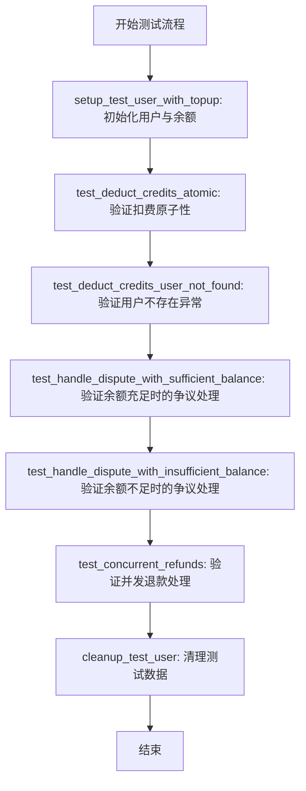
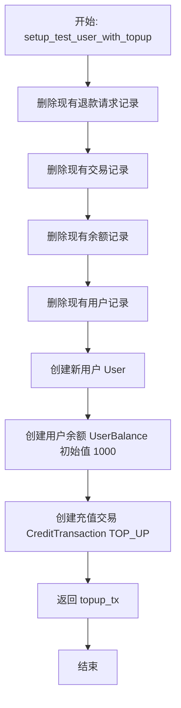
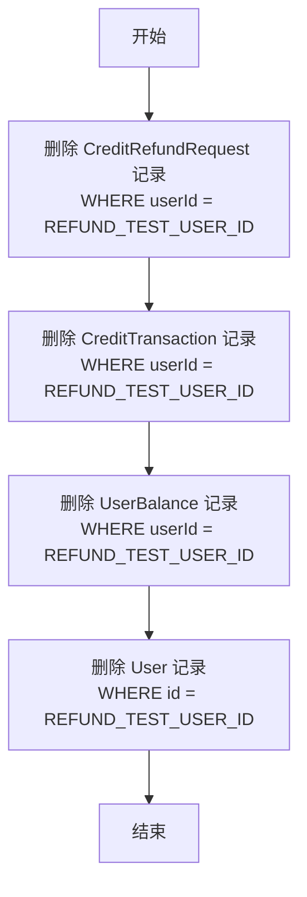
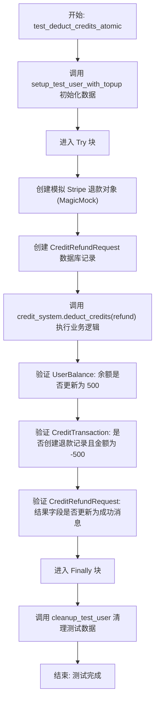
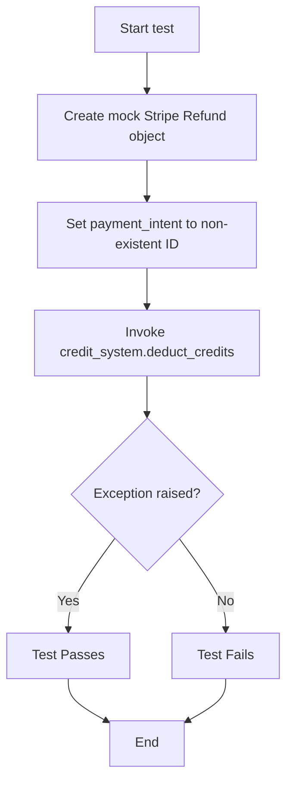
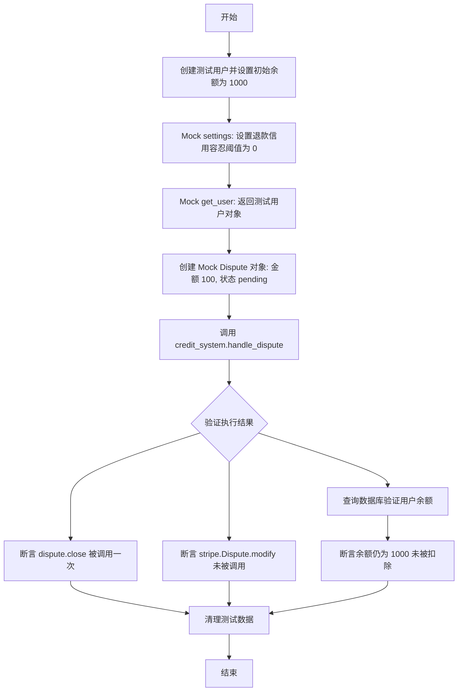
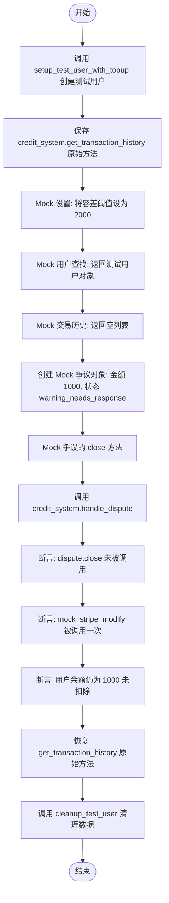
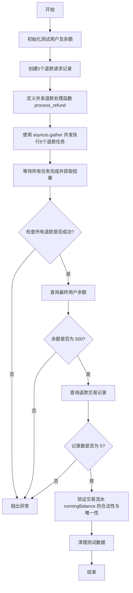

# `AutoGPT\autogpt_platform\backend\backend\data\credit_refund_test.py` 详细设计文档

该文件包含针对信用系统退款和争议操作的集成测试，旨在验证 `deduct_credits` 和 `handle_dispute` 方法的原子性、数据一致性以及并发场景下的正确性，通过模拟 Stripe 对象和操作数据库来确保业务逻辑符合预期。

## 整体流程



## 类结构

```
No custom classes defined (Test file using external models and utilities)
```

## 全局变量及字段


### `credit_system`
    
UserCredit 类的实例，用于在测试中执行信用扣除、退款处理和争议响应等核心业务逻辑。

类型：`UserCredit`
    


### `REFUND_TEST_USER_ID`
    
测试常量，指定了用于退款和争议功能测试的模拟用户 ID。

类型：`str`
    


    

## 全局函数及方法


### `setup_test_user_with_topup`

异步创建一个测试用户，初始化其余额，并生成一个 Top-up 交易记录，用于为退款和争议测试准备干净的测试数据环境。

参数：

-   (无)

返回值：`CreditTransaction`，返回创建的 Top-up 交易对象，包含交易 ID、金额及相关元数据。

#### 流程图



#### 带注释源码

```python
async def setup_test_user_with_topup():
    """Create a test user with initial balance and a top-up transaction."""
    # Clean up any existing data
    # 步骤 1: 清理现有数据 - 删除该用户的所有退款请求
    await CreditRefundRequest.prisma().delete_many(
        where={"userId": REFUND_TEST_USER_ID}
    )
    # 步骤 2: 清理现有数据 - 删除该用户的所有交易记录
    await CreditTransaction.prisma().delete_many(where={"userId": REFUND_TEST_USER_ID})
    # 步骤 3: 清理现有数据 - 删除该用户的所有余额记录
    await UserBalance.prisma().delete_many(where={"userId": REFUND_TEST_USER_ID})
    # 步骤 4: 清理现有数据 - 删除该用户的基本信息
    await User.prisma().delete_many(where={"id": REFUND_TEST_USER_ID})

    # Create user
    # 步骤 5: 创建新的测试用户
    await User.prisma().create(
        data={
            "id": REFUND_TEST_USER_ID,
            "email": f"{REFUND_TEST_USER_ID}@example.com",
            "name": "Refund Test User",
        }
    )

    # Create user balance
    # 步骤 6: 创建用户余额，初始化为 1000 (代表 $10)
    await UserBalance.prisma().create(
        data={
            "userId": REFUND_TEST_USER_ID,
            "balance": 1000,  # $10
        }
    )

    # Create a top-up transaction that can be refunded
    # 步骤 7: 创建一个充值交易，作为后续退款操作的源头
    topup_tx = await CreditTransaction.prisma().create(
        data={
            "userId": REFUND_TEST_USER_ID,
            "amount": 1000,
            "type": CreditTransactionType.TOP_UP,
            "transactionKey": "pi_test_12345",
            "runningBalance": 1000,
            "isActive": True,
            "metadata": SafeJson({"stripe_payment_intent": "pi_test_12345"}),
        }
    )

    # 步骤 8: 返回创建的交易对象
    return topup_tx
```


### `cleanup_test_user`

异步清理函数，用于从数据库中彻底删除指定测试用户的所有相关数据，包括退款请求、交易记录、用户余额以及用户实体本身，以确保测试环境的隔离性和数据的清洁。

参数：

返回值：`None`，表示清理操作执行完毕。

#### 流程图



#### 带注释源码

```python
async def cleanup_test_user():
    """Clean up test data."""
    # 删除该测试用户的所有退款请求记录
    await CreditRefundRequest.prisma().delete_many(
        where={"userId": REFUND_TEST_USER_ID}
    )
    # 删除该测试用户的所有信用交易记录
    await CreditTransaction.prisma().delete_many(where={"userId": REFUND_TEST_USER_ID})
    # 删除该测试用户的余额记录
    await UserBalance.prisma().delete_many(where={"userId": REFUND_TEST_USER_ID})
    # 删除该测试用户的基本账户记录
    await User.prisma().delete_many(where={"id": REFUND_TEST_USER_ID})
```


### `test_deduct_credits_atomic`

该测试函数旨在验证信用扣除操作（`deduct_credits`）的原子性，确保在处理模拟的 Stripe 退款对象时，用户余额被正确扣除，相应的退款交易记录被准确创建，且退款请求状态被成功更新，最终保证数据的一致性。

参数：

- `server`：`SpinTestServer`，用于提供测试上下文的服务器对象，通常作为 pytest fixture 注入。

返回值：`None`，该函数为异步测试函数，执行断言后无显式返回值。

#### 流程图



#### 带注释源码

```python
@pytest.mark.asyncio(loop_scope="session")
async def test_deduct_credits_atomic(server: SpinTestServer):
    """Test that deduct_credits is atomic and creates transaction correctly."""
    # 1. 准备测试环境：创建测试用户并初始化余额及充值交易
    topup_tx = await setup_test_user_with_topup()

    try:
        # 2. 构造模拟的 Stripe 退款对象
        refund = MagicMock(spec=stripe.Refund)
        refund.id = "re_test_refund_123"
        refund.payment_intent = topup_tx.transactionKey  # 关联原始充值交易的 Key
        refund.amount = 500  # 退款金额 $5 (原充值 $10)
        refund.status = "succeeded"
        refund.reason = "requested_by_customer"
        refund.created = int(datetime.now(timezone.utc).timestamp())

        # 3. 创建退款请求记录，模拟 Webhook 触发的流程
        await CreditRefundRequest.prisma().create(
            data={
                "userId": REFUND_TEST_USER_ID,
                "amount": 500,
                "transactionKey": topup_tx.transactionKey,
                "reason": "Test refund",
            }
        )

        # 4. 调用核心业务逻辑：执行扣款/退款处理
        await credit_system.deduct_credits(refund)

        # 5. 验证步骤：检查用户余额是否正确扣除 (1000 -> 500)
        user_balance = await UserBalance.prisma().find_unique(
            where={"userId": REFUND_TEST_USER_ID}
        )
        assert user_balance is not None
        assert (
            user_balance.balance == 500
        ), f"Expected balance 500, got {user_balance.balance}"

        # 6. 验证步骤：检查是否创建了正确的退款交易记录
        refund_tx = await CreditTransaction.prisma().find_first(
            where={
                "userId": REFUND_TEST_USER_ID,
                "type": CreditTransactionType.REFUND,
                "transactionKey": refund.id,
            }
        )
        assert refund_tx is not None
        assert refund_tx.amount == -500  # 退款交易金额通常为负数
        assert refund_tx.runningBalance == 500
        assert refund_tx.isActive

        # 7. 验证步骤：检查退款请求状态是否更新为成功
        refund_request = await CreditRefundRequest.prisma().find_first(
            where={
                "userId": REFUND_TEST_USER_ID,
                "transactionKey": topup_tx.transactionKey,
            }
        )
        assert refund_request is not None
        assert (
            refund_request.result
            == "The refund request has been approved, the amount will be credited back to your account."
        )

    finally:
        # 8. 清理测试数据，确保环境还原
        await cleanup_test_user()
```


### `test_deduct_credits_user_not_found`

测试在交易未找到（意味着用户不存在）的情况下，`deduct_credits` 方法是否会按预期引发错误。

参数：

-  `server`：`SpinTestServer`，由 pytest fixture 提供的测试服务器实例，用于模拟运行环境。

返回值：`None`，该函数为测试用例，主要验证异常抛出，无直接返回值。

#### 流程图



#### 带注释源码

```python
@pytest.mark.asyncio(loop_scope="session")
async def test_deduct_credits_user_not_found(server: SpinTestServer):
    """Test that deduct_credits raises error if transaction not found (which means user doesn't exist)."""
    # 创建一个模拟的 Stripe 退款对象
    refund = MagicMock(spec=stripe.Refund)
    refund.id = "re_test_refund_nonexistent"
    # 设置 payment_intent 为一个不存在的 ID，以触发“找不到交易”的错误场景
    refund.payment_intent = "pi_test_nonexistent"  # This payment intent doesn't exist
    refund.amount = 500
    refund.status = "succeeded"
    refund.reason = "requested_by_customer"
    refund.created = int(datetime.now(timezone.utc).timestamp())

    # 验证当交易缺失时，代码会抛出异常
    # 预期会抛出 Exception（具体应为 NotFoundError）
    with pytest.raises(Exception):  # Should raise NotFoundError for missing transaction
        await credit_system.deduct_credits(refund)
```


### `test_handle_dispute_with_sufficient_balance`

测试当用户拥有足够余额时处理争议的逻辑。该测试模拟用户余额大于争议金额的场景，验证系统是否选择关闭争议而非提交证据，并确保用户余额未被扣除。

参数：

- `mock_get_user`：`MagicMock`，模拟获取用户信息的函数，用于返回测试用户对象。
- `mock_stripe_modify`：`MagicMock`，模拟 Stripe 的 `Dispute.modify` API，用于验证未调用修改争议接口。
- `mock_settings`：`MagicMock`，模拟应用配置，用于设置退款信用容忍阈值为 0。
- `server`：`SpinTestServer`，测试服务器实例，用于提供测试环境上下文。

返回值：`None`，无返回值，主要执行断言逻辑。

#### 流程图



#### 带注释源码

```python
@pytest.mark.asyncio(loop_scope="session")
@patch("backend.data.credit.settings")
@patch("stripe.Dispute.modify")
@patch("backend.data.credit.get_user_by_id")
async def test_handle_dispute_with_sufficient_balance(
    mock_get_user, mock_stripe_modify, mock_settings, server: SpinTestServer
):
    """Test handling dispute when user has sufficient balance (dispute gets closed)."""
    # 1. 初始化测试环境：创建一个拥有1000余额的用户
    topup_tx = await setup_test_user_with_topup()

    try:
        # 2. 配置 Mock 对象
        # 设置容忍阈值为0，意味着只要有余额覆盖争议金额，就不容忍直接关闭
        mock_settings.config.refund_credit_tolerance_threshold = 0

        # Mock 用户查找返回值
        mock_user = MagicMock()
        mock_user.email = f"{REFUND_TEST_USER_ID}@example.com"
        mock_get_user.return_value = mock_user

        # 3. 创建一个模拟的 Stripe 争议对象
        # 用户余额 1000，争议金额 100，属于充足余额场景
        dispute = MagicMock(spec=stripe.Dispute)
        dispute.id = "dp_test_dispute_123"
        dispute.payment_intent = topup_tx.transactionKey
        dispute.amount = 100  # 小额争议
        dispute.status = "pending"
        dispute.reason = "fraudulent"
        dispute.created = int(datetime.now(timezone.utc).timestamp())

        # Mock close 方法防止实际 API 调用
        dispute.close = MagicMock()

        # 4. 执行核心逻辑：处理争议
        await credit_system.handle_dispute(dispute)

        # 5. 验证断言：检查系统行为是否符合预期
        
        # 验证争议被关闭（因为用户余额充足）
        dispute.close.assert_called_once()

        # 验证没有添加 Stripe 证据（因为争议已关闭，无需抗辩）
        mock_stripe_modify.assert_not_called()

        # 验证用户余额未被扣除
        # 说明在充足余额场景下，系统选择关闭争议，而不是扣除余额来应对
        user_balance = await UserBalance.prisma().find_unique(
            where={"userId": REFUND_TEST_USER_ID}
        )
        assert user_balance is not None
        assert (
            user_balance.balance == 1000
        ), f"Balance should remain 1000, got {user_balance.balance}"

    finally:
        # 6. 清理测试数据，确保不影响其他测试
        await cleanup_test_user()
```


### `test_handle_dispute_with_insufficient_balance`

测试当用户余额相对于容差阈值不足时系统如何处理争议。验证在这种情况下争议未被关闭，Stripe 证据被正确提交，且用户余额保持不变。

参数：

-   `mock_get_user`：`MagicMock`，模拟 `get_user_by_id` 函数，用于返回 Mock 的用户对象。
-   `mock_stripe_modify`：`MagicMock`，模拟 `stripe.Dispute.modify` 方法，用于验证是否提交了证据而不进行真实的 API 调用。
-   `mock_settings`：`MagicMock`，模拟应用程序设置对象，用于配置较高的 `refund_credit_tolerance_threshold` 以确保余额不足。
-   `server`：`SpinTestServer`，测试服务器 fixture，提供测试运行的应用上下文。

返回值：`None`，该函数为异步测试函数，无返回值，主要通过断言验证行为。

#### 流程图



#### 带注释源码

```python
@pytest.mark.asyncio(loop_scope="session")
@patch("backend.data.credit.settings")
@patch("stripe.Dispute.modify")
@patch("backend.data.credit.get_user_by_id")
async def test_handle_dispute_with_insufficient_balance(
    mock_get_user, mock_stripe_modify, mock_settings, server: SpinTestServer
):
    """Test handling dispute when user has insufficient balance (evidence gets added)."""
    # 初始化测试用户数据，初始余额为 1000
    topup_tx = await setup_test_user_with_topup()

    # 保存原始方法以便测试后恢复
    original_get_history = credit_system.get_transaction_history

    try:
        # Mock 设置：设置一个高容差阈值（2000），使得用户余额（1000）在扣除争议金额后相对于阈值被视为“不足”
        # 这样会阻止系统自动关闭争议
        mock_settings.config.refund_credit_tolerance_threshold = 2000

        # Mock 用户查找，返回测试用户对象
        mock_user = MagicMock()
        mock_user.email = f"{REFUND_TEST_USER_ID}@example.com"
        mock_get_user.return_value = mock_user

        # Mock 交易历史记录，返回空列表以简化测试环境
        from unittest.mock import AsyncMock

        mock_history = MagicMock()
        mock_history.transactions = []
        credit_system.get_transaction_history = AsyncMock(return_value=mock_history)

        # 创建一个 Mock 争议对象
        # 争议金额为 1000，等于用户当前余额
        dispute = MagicMock(spec=stripe.Dispute)
        dispute.id = "dp_test_dispute_pending"
        dispute.payment_intent = topup_tx.transactionKey
        dispute.amount = 1000
        dispute.status = "warning_needs_response"
        dispute.created = int(datetime.now(timezone.utc).timestamp())

        # Mock close 方法，防止真实的 API 调用
        dispute.close = MagicMock()

        # 调用核心逻辑处理争议
        # 预期行为：由于余额不足（相对于阈值），系统不会关闭争议，而是提交证据
        await credit_system.handle_dispute(dispute)

        # 验证：争议的 close 方法未被调用
        dispute.close.assert_not_called()

        # 验证：调用了 Stripe 的 modify 方法提交了证据
        mock_stripe_modify.assert_called_once()

        # 验证：用户余额未被扣除
        # handle_dispute 逻辑本身不扣款，或者因为余额不足而未通过扣款关闭争议的逻辑
        user_balance = await UserBalance.prisma().find_unique(
            where={"userId": REFUND_TEST_USER_ID}
        )
        assert user_balance is not None
        assert user_balance.balance == 1000, "Balance should remain unchanged"

    finally:
        # 恢复原始方法并清理测试数据
        credit_system.get_transaction_history = original_get_history
        await cleanup_test_user()
```


### `test_concurrent_refunds`

测试信用系统在并发场景下的原子性，确保多个退款操作同时进行时，系统能够正确处理数据一致性，避免因竞争条件导致的数据丢失或余额计算错误。

参数：

- `server`: `SpinTestServer`，由 pytest 提供的测试服务器 fixture，用于提供测试运行环境。

返回值：`None`，无返回值，若断言失败则抛出异常。

#### 流程图



#### 带注释源码

```python
@pytest.mark.asyncio(loop_scope="session")
async def test_concurrent_refunds(server: SpinTestServer):
    """Test that concurrent refunds are handled atomically."""
    import asyncio

    # 1. 准备测试环境：创建一个拥有1000分余额的测试用户
    topup_tx = await setup_test_user_with_topup()

    try:
        # 2. 在数据库中预先创建5个退款请求，每个金额为100分
        refund_requests = []
        for i in range(5):
            req = await CreditRefundRequest.prisma().create(
                data={
                    "userId": REFUND_TEST_USER_ID,
                    "amount": 100,  # $1 each
                    "transactionKey": topup_tx.transactionKey,
                    "reason": f"Test refund {i}",
                }
            )
            refund_requests.append(req)

        # 3. 定义内部协程函数，用于模拟单个退款处理流程
        async def process_refund(index: int):
            # 构造模拟的 Stripe 退款对象
            refund = MagicMock(spec=stripe.Refund)
            refund.id = f"re_test_concurrent_{index}"
            refund.payment_intent = topup_tx.transactionKey
            refund.amount = 100  # $1 refund
            refund.status = "succeeded"
            refund.reason = "requested_by_customer"
            refund.created = int(datetime.now(timezone.utc).timestamp())

            try:
                # 调用核心业务逻辑扣除信用
                await credit_system.deduct_credits(refund)
                return "success"
            except Exception as e:
                return f"error: {e}"

        # 4. 使用 asyncio.gather 并发启动5个退款任务
        # return_exceptions=True 确保一个任务失败不会立即终止其他任务
        results = await asyncio.gather(
            *[process_refund(i) for i in range(5)], return_exceptions=True
        )

        # 5. 验证并发执行结果：所有退款必须成功
        assert all(r == "success" for r in results), f"Some refunds failed: {results}"

        # 6. 验证最终余额：初始1000分 - 5*100分 = 500分
        # 如果存在并发竞争条件（Lost Update问题），余额可能会大于500
        user_balance = await UserBalance.prisma().find_unique(
            where={"userId": REFUND_TEST_USER_ID}
        )
        assert user_balance is not None

        print(f"DEBUG: Final balance = {user_balance.balance}, expected = 500")

        assert (
            user_balance.balance == 500
        ), f"Expected balance 500 after 5 refunds of 100 each, got {user_balance.balance}"

        # 7. 验证交易记录数量：应该生成了5笔REFUND类型的交易
        refund_txs = await CreditTransaction.prisma().find_many(
            where={
                "userId": REFUND_TEST_USER_ID,
                "type": CreditTransactionType.REFUND,
            }
        )
        assert (
            len(refund_txs) == 5
        ), f"Expected 5 refund transactions, got {len(refund_txs)}"

        # 8. 验证交易快照的合法性
        # 收集所有交易的 runningBalance（当时的余额快照）
        running_balances: set[int] = {
            tx.runningBalance for tx in refund_txs if tx.runningBalance is not None
        }

        # 检查每个余额快照都在合理范围内 (500 到 1000 之间)
        for balance in running_balances:
            assert (
                500 <= balance <= 1000
            ), f"Invalid balance {balance}, should be between 500 and 1000"

        # 检查最终余额快照是否存在
        assert (
            500 in running_balances
        ), f"Final balance 500 should be in {running_balances}"

        # 检查余额快照是否唯一（并发修改通常会导致记录相同的中间值）
        # 在理想的原子序列中，每次扣减后的余额应该是唯一的递减序列
        sorted_balances = sorted(running_balances, reverse=True)
        assert (
            len(sorted_balances) == 5
        ), f"Expected 5 unique balances, got {len(sorted_balances)}"

    finally:
        # 9. 清理测试数据，确保环境恢复
        await cleanup_test_user()
```


## 关键组件


### UserCredit System
The core service class encapsulating all business logic related to credit management, including refund processing and dispute handling.

### Refund Processing Logic (`deduct_credits`)
The operational workflow that handles incoming Stripe refund events to atomically deduct user credits, update balances, and record transaction history.

### Dispute Handling Logic (`handle_dispute`)
The component that evaluates incoming Stripe disputes against user balance and tolerance thresholds to determine whether to automatically close a dispute or submit defensive evidence.

### Prisma Data Persistence
The underlying data models (`CreditTransaction`, `UserBalance`, `CreditRefundRequest`) responsible for storing financial states and ensuring referential integrity within the database.

### Concurrency & Atomicity Control
Test mechanisms and logic designed to verify that financial operations remain consistent and atomic, preventing race conditions like lost updates during concurrent refund processing.

### Stripe Integration
The interface for interacting with external payment provider events, specifically handling `stripe.Refund` and `stripe.Dispute` objects to trigger internal credit workflows.


## 问题及建议


### 已知问题

-   **并发竞态条件风险**：测试用例 `test_concurrent_refunds` 专门用于验证并发退款的原子性。尽管代码断言期望最终余额正确，但注释中提到的“由于竞态条件”暗示底层 `deduct_credits` 逻辑可能存在“丢失更新”或“读-改-写”竞争的风险。若未在数据库层或应用层通过严格的悲观锁或乐观锁机制保护，高并发场景下极可能导致用户余额与流水账不平。
-   **测试数据清理机制不安全**：测试使用了全局变量 `REFUND_TEST_USER_ID`，并依赖 `finally` 块中的 `delete_many` 进行物理删除。如果测试过程中途崩溃或抛出未被捕获的异常，清理逻辑可能无法执行，导致“僵尸数据”残留，影响后续测试或环境的一致性。
-   **Mock 过度耦合内部实现**：在 `test_handle_dispute_with_insufficient_balance` 中，直接 Patch 了 `credit_system.get_transaction_history` 这一内部方法。这种白盒测试方式使得测试用例与代码的具体实现细节高度耦合，增加了重构成本，一旦内部逻辑调整，测试即告失效。

### 优化建议

-   **引入 Pytest Fixture 管理资源生命周期**：建议将 `setup_test_user_with_topup` 和 `cleanup_test_user` 重构为标准的 Pytest `fixture`，利用 `yield` 机制自动管理测试数据的创建与销毁。这不仅能简化测试代码，还能利用 Pytest 的作用域管理机制更好地隔离测试环境。
-   **采用数据库事务回滚替代物理删除**：目前的 `delete_many` 清理方式在大量数据测试时效率较低，且存在外键关联删除的风险。建议在测试开始时开启数据库事务，测试结束后直接执行 `rollback`。这样可以完全避免物理删除带来的副作用，并显著提升测试执行速度。
-   **使用参数化测试减少冗余代码**：`test_handle_dispute_with_sufficient_balance` 和 `test_handle_dispute_with_insufficient_balance` 逻辑相似，主要是配置和状态不同。建议使用 `@pytest.mark.parametrize` 将配置参数化，合并为同一个测试函数，以提高代码的复用性和可维护性。
-   **增强并发测试的健壮性**：在 `test_concurrent_refunds` 中，除了校验最终余额，应增加对 `CreditTransaction` 记录唯一性（如 transactionKey 或唯一索引）的校验，以及验证数据库并发控制机制（如版本号字段）是否生效，确保不仅仅在结果上正确，而且在锁机制层面也通过了验证。
-   **去除调试代码并规范化日志**：`test_concurrent_refunds` 中包含 `print(f"DEBUG: ...")` 调试语句，这在生产级代码或标准测试中是不规范的。建议移除或替换为标准的 Logger 记录，保持代码库的整洁。


## 其它


### 设计目标与约束

**设计目标：**
1. **原子性与一致性**：核心目标是确保信用系统的退款操作（`deduct_credits`）和争议处理（`handle_dispute`）是原子的，并且在各种场景下（包括并发情况）维持数据的一致性。
2. **并发安全**：验证系统在高并发场景下处理退款请求的能力，防止因竞态条件导致的数据不一致（如余额更新丢失）。
3. **异常处理**：确保系统在遇到无效交易或用户不存在时能够正确抛出异常，而不是静默失败或破坏数据完整性。

**约束条件：**
1. **测试隔离性**：每个测试用例必须在隔离的环境中运行，使用固定的测试用户 ID（`REFUND_TEST_USER_ID`），并在测试前后进行彻底的数据清理（`setup_test_user_with_topup` 和 `cleanup_test_user`）。
2. **模拟外部依赖**：严禁在测试中调用真实的 Stripe API 或产生实际财务变动。必须使用 `unittest.mock.MagicMock` 来模拟 Stripe 的 `Refund` 和 `Dispute` 对象及其行为。
3. **异步执行**：所有测试用例和数据库操作必须异步执行（`async/await`），并使用 `pytest.mark.asyncio` 进行标记。
4. **数据库状态**：测试依赖于 Prisma ORM 操作，假设数据库连接正常且模式与代码中使用的 `User`、`UserBalance`、`CreditTransaction` 等模型匹配。

### 错误处理与异常设计

**异常处理策略：**
1. **数据缺失异常**：当 `deduct_credits` 接收到引用不存在的 `payment_intent` 的退款请求时，系统预期会抛出异常（测试中使用 `pytest.raises(Exception)` 进行捕获）。
2. **并发冲突检测**：通过 `test_concurrent_refunds` 测试用例，设计特定的逻辑来检测非原子操作可能导致的数据竞争。如果实现不是线程安全的，断言将失败，从而暴露潜在的并发错误。
3. **状态验证**：在每个操作后，系统通过断言严格检查数据库状态（如 `user_balance` 是否正确，`transaction` 记录是否存在，`refund_request` 的结果字段是否更新），以此作为一种错误发现机制，确保未处理的异常不会导致静默的数据损坏。

### 数据流与状态机

**数据流：**
1. **初始化流**：
   - 删除旧数据 -> 创建 User 记录 -> 创建 UserBalance (初始 1000) -> 创建 CreditTransaction (TOP_UP)。
2. **退款处理流**：
   - 接收 Stripe Refund 对象 -> 创建 CreditRefundRequest 记录 -> 调用 `credit_system.deduct_credits()` -> 更新 UserBalance (减去金额) -> 创建 CreditTransaction (REFUND, 负金额) -> 更新 CreditRefundRequest 状态。
3. **争议处理流**：
   - 接收 Stripe Dispute 对象 -> 获取用户信息和交易历史 -> 检查当前余额是否大于 `refund_credit_tolerance_threshold`。
   - **路径 A (余额充足)**: 调用 `dispute.close()` 关闭争议。
   - **路径 B (余额不足)**: 调用 `stripe.Dispute.modify` 提交证据。

**状态机：**
1. **交易状态**:
   - `TOP_UP` (初始状态) -> `REFUND` (退款操作后生成负金额交易)。
2. **退款请求状态**:
   - Pending (初始创建) -> Processed (结果字段被填充为成功消息)。
3. **争议状态**:
   - `pending` / `warning_needs_response` (初始) -> `closed` (如果内部余额充足) 或 `evidence_submitted` (如果余额不足，调用 API 修改)。
4. **用户余额状态**:
   - 1000 (初始) -> 500 (单次退款 500 后) 或 变化 (并发退款后)。

### 外部依赖与接口契约

**外部依赖：**
1. **Prisma ORM**: 用于持久化数据操作。
   - 接口契约: 提供异步的 CRUD 方法（如 `create`, `delete_many`, `find_unique`, `find_first`, `find_many`）。
   - 依赖模型: `User`, `UserBalance`, `CreditTransaction` (含枚举 `CreditTransactionType`), `CreditRefundRequest`。
2. **Stripe API (Mocked)**: 支付服务提供商。
   - `stripe.Refund`: 契约包含字段 `id` (str), `payment_intent` (str), `amount` (int), `status` (str), `reason` (str), `created` (int)。
   - `stripe.Dispute`: 契约包含字段 `id`, `payment_intent`, `amount`, `status`, `reason`。包含方法 `close()`。
   - `stripe.Dispute.modify`: 函数契约，用于更新争议信息（如提交证据）。
3. **Backend Application Components**:
   - `backend.data.credit.UserCredit`: 核心业务逻辑类，提供 `deduct_credits` 和 `handle_dispute` 方法。
   - `backend.util.json.SafeJson`: 工具类，用于处理 JSON 元数据。
   - `backend.util.test.SpinTestServer`: 测试服务器上下文管理器。
   - `backend.data.credit.settings`: 配置对象，包含 `refund_credit_tolerance_threshold` 属性。
   - `backend.data.credit.get_user_by_id`: 获取用户信息的函数。

### 并发控制

**并发模型：**
测试代码利用 `asyncio.gather` 来模拟高并发的退款场景（`test_concurrent_refunds`）。

**控制机制：**
1. **原子性要求**：系统设计要求 `deduct_credits` 操作必须是原子的。这意味着在读取当前余额、计算新余额和写回数据库的过程中，不能有其他操作介入。
2. **竞态条件预防**：测试旨在验证是否存在“丢失更新”的问题。在正确的实现中，即使 5 个退款请求同时到达，最终余额也应是正确的（初始余额 - 总退款额），且生成的交易记录数量应与请求数量一致，且余额序列应逻辑正确。
3. **实现细节**：虽然测试代码不直接展示锁的实现，但它定义了并发控制的验证标准，即断言最终余额必须精确匹配预期值，且所有中间状态必须在有效范围内。


    