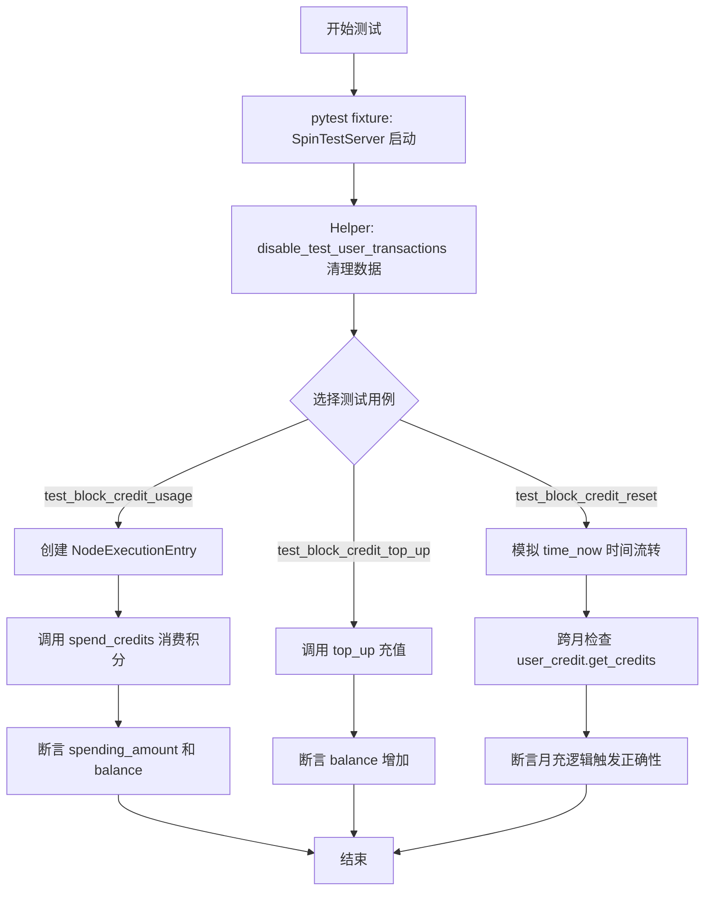
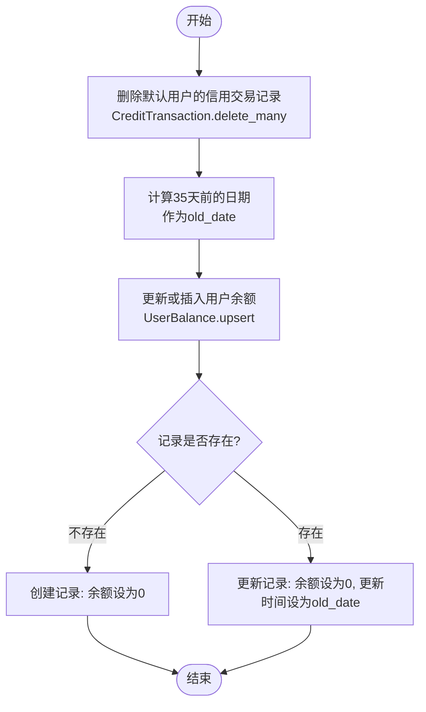
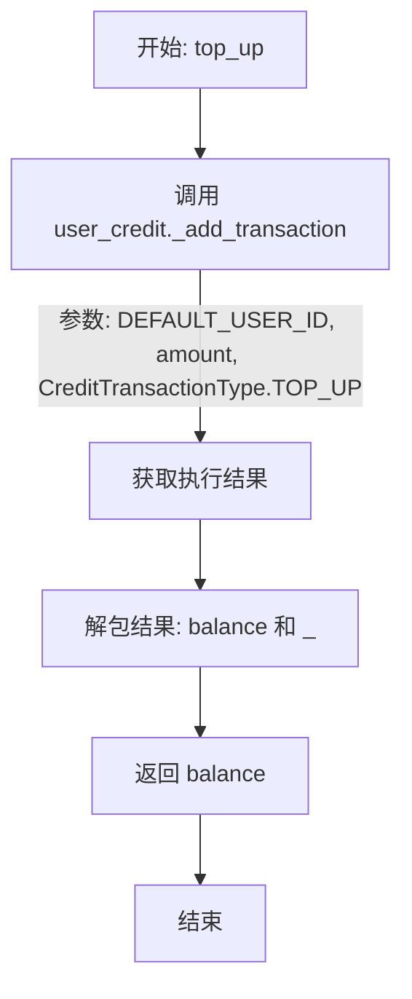
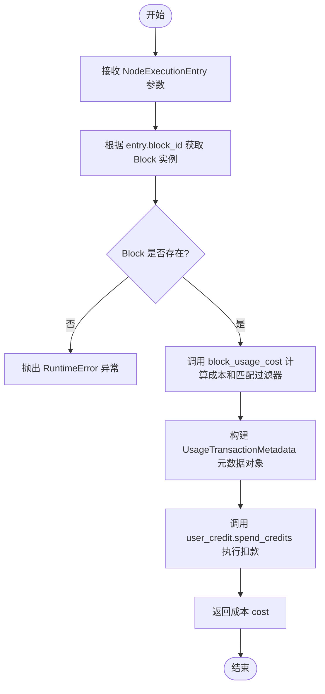
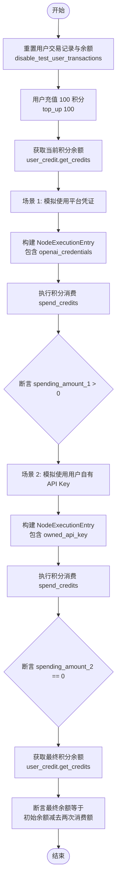
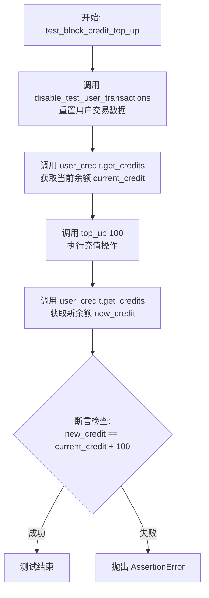
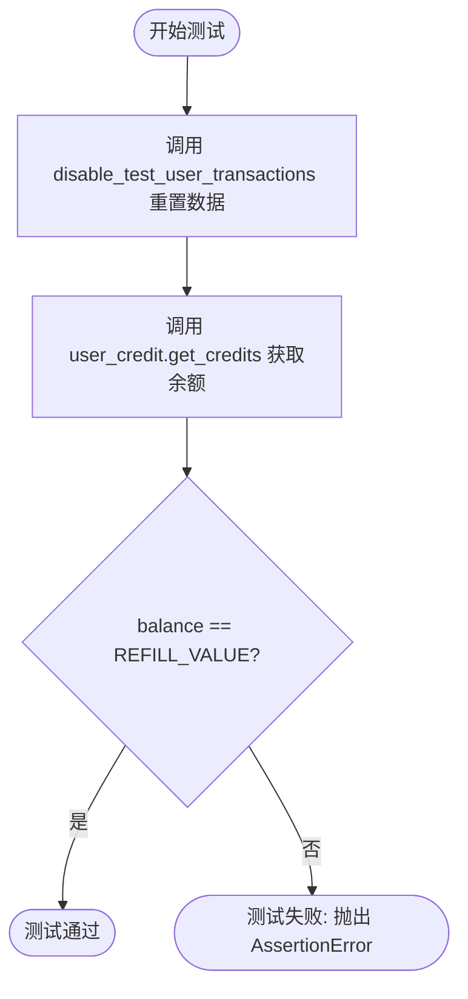
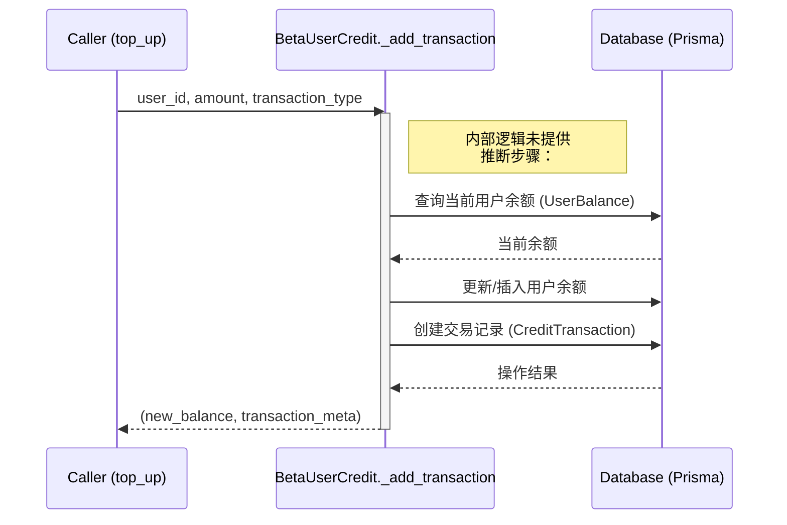
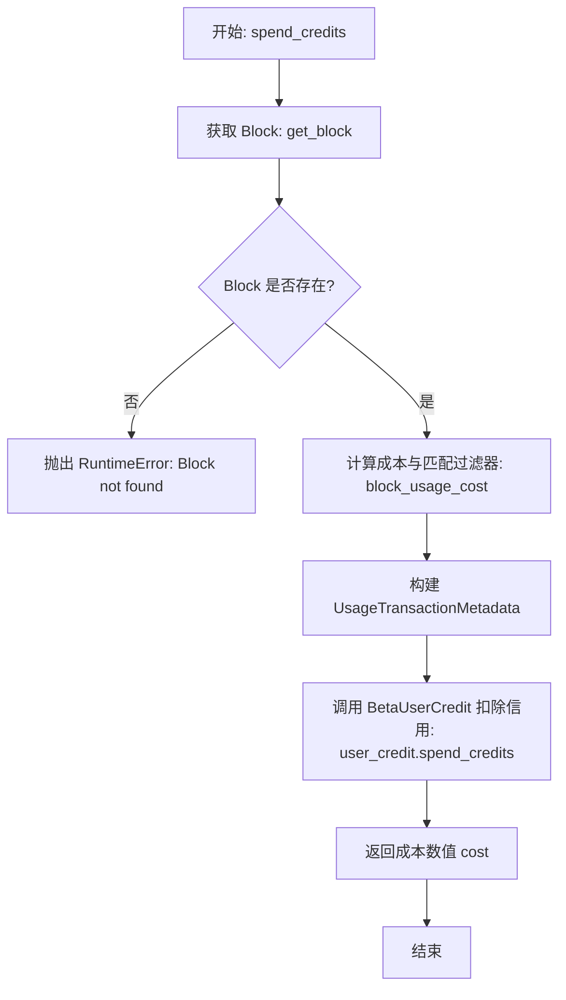

# `AutoGPT\autogpt_platform\backend\backend\data\credit_test.py` 详细设计文档

该文件包含了一系列针对后端信用系统的异步单元测试，主要验证了积点消费计算、手动充值以及基于月度的自动重置/补充逻辑。

## 整体流程



## 类结构

```
Test Suite Structure
├── Global Config
│   ├── REFILL_VALUE (常量)
│   └── user_credit (BetaUserCredit 实例)
├── Helper Functions
│   ├── disable_test_user_transactions
│   ├── top_up
│   └── spend_credits
├── Test Cases
│   ├── test_block_credit_usage
│   ├── test_block_credit_top_up
│   ├── test_block_credit_reset
│   └── test_credit_refill
└── External Dependencies
    ├── BetaUserCredit
    ├── NodeExecutionEntry
    └── AITextGeneratorBlock
```

## 全局变量及字段


### `REFILL_VALUE`
    
每月为测试用户充值的默认信用额度

类型：`int`
    


### `user_credit`
    
用于管理用户信用额度、交易记录和重置逻辑的实例

类型：`BetaUserCredit`
    


### `NodeExecutionEntry.user_id`
    
执行该节点的用户ID

类型：`str`
    


### `NodeExecutionEntry.graph_id`
    
所属的工作流图ID

类型：`str`
    


### `NodeExecutionEntry.node_id`
    
当前执行的节点ID

类型：`str`
    


### `NodeExecutionEntry.block_id`
    
节点对应的组件块ID

类型：`str`
    


### `NodeExecutionEntry.inputs`
    
传递给节点的输入数据

类型：`dict`
    


### `NodeExecutionEntry.execution_context`
    
节点执行的上下文信息，如时区设置

类型：`ExecutionContext`
    


### `AITextGeneratorBlock.id`
    
AI文本生成器块的唯一标识符

类型：`str`
    


### `AITextGeneratorBlock.name`
    
块的显示名称

类型：`str`
    


### `UserBalance.userId`
    
余额所属用户的唯一标识符

类型：`str`
    


### `UserBalance.balance`
    
用户当前的信用余额数值

类型：`int`
    


### `UserBalance.updatedAt`
    
余额最后更新的时间戳，用于判断是否触发月度重置

类型：`datetime`
    


### `CreditTransaction.userId`
    
交易所属用户的唯一标识符

类型：`str`
    


### `CreditTransaction.amount`
    
交易的金额，正数表示充值，负数表示消费

类型：`int`
    


### `CreditTransaction.type`
    
交易的类型枚举，如使用量、充值或补助

类型：`CreditTransactionType`
    


### `CreditTransaction.runningBalance`
    
交易完成后的账户余额

类型：`int`
    


### `CreditTransaction.isActive`
    
标记该交易记录是否处于活动状态

类型：`bool`
    


### `CreditTransaction.createdAt`
    
交易创建的时间戳

类型：`datetime`
    


### `CreditTransaction.transactionKey`
    
用于标识特定交易或业务逻辑的唯一键，如月度重置标识

类型：`str`
    
    

## 全局函数及方法


### `disable_test_user_transactions`

该函数用于在测试环境中重置默认用户的信用状态，具体包括删除所有信用交易记录，并将用户余额归零，同时将最后更新时间回溯至一个月前，以模拟触发月度充值的过期状态，从而确保测试用例运行在干净且可预测的数据环境中。

参数：无

返回值：`None`，无返回值。

#### 流程图



#### 带注释源码

```python
async def disable_test_user_transactions():
    # 清理数据：删除默认测试用户的所有信用交易记录
    await CreditTransaction.prisma().delete_many(where={"userId": DEFAULT_USER_ID})
    
    # Also reset the balance to 0 and set updatedAt to old date to trigger monthly refill
    # 准备时间数据：计算当前时间减去35天的日期
    # 目的：将updatedAt字段设为过去的时间，模拟余额已过期，以便在测试中触发每月的自动重置/充值逻辑
    old_date = datetime.now(timezone.utc) - timedelta(days=35)  # More than a month ago
    
    # 重置状态：通过upsert操作确保用户余额记录存在，且余额为0，时间戳为旧日期
    await UserBalance.prisma().upsert(
        where={"userId": DEFAULT_USER_ID},
        data={
            # 如果记录不存在，则创建新记录，余额初始化为0
            "create": {"userId": DEFAULT_USER_ID, "balance": 0},
            # 如果记录存在，则更新余额为0，并将更新时间修改为old_date
            "update": {"balance": 0, "updatedAt": old_date},
        },
    )
```


### `top_up`

该函数用于为默认测试用户（`DEFAULT_USER_ID`）充值指定数量的积分。它通过调用全局 `user_credit` 对象的内部方法 `_add_transaction` 来记录一笔交易类型为 `TOP_UP` 的记录，并返回更新后的账户余额。

参数：

- `amount`：`int`，需要充值的积分数量

返回值：`int`，充值后的用户最新积分余额

#### 流程图



#### 带注释源码

```python
async def top_up(amount: int):
    # 调用 user_credit 对象的 _add_transaction 方法，为默认用户添加一笔“充值”类型的交易记录
    # 方法返回一个元组：第一个元素是交易后的最新余额，第二个元素是交易详情对象（此处用下划线 _ 忽略）
    balance, _ = await user_credit._add_transaction(
        DEFAULT_USER_ID,
        amount,
        CreditTransactionType.TOP_UP,
    )
    # 返回计算得到的最新余额
    return balance
```


### `spend_credits`

根据节点执行条目计算特定 Block 的执行成本，从用户余额中扣除相应信用额度，并记录包含详细上下文的交易元数据。

参数：

- `entry`：`NodeExecutionEntry`，包含节点执行信息的条目对象，包含用户 ID、Block ID、输入数据及执行上下文等。

返回值：`int`，扣除的信用点数（即 Block 执行成本）。

#### 流程图



#### 带注释源码

```python
async def spend_credits(entry: NodeExecutionEntry) -> int:
    # 1. 根据 entry 中的 block_id 获取对应的 Block 实例
    block = get_block(entry.block_id)
    # 2. 检查 Block 是否存在，如果不存在则抛出运行时错误
    if not block:
        raise RuntimeError(f"Block {entry.block_id} not found")

    # 3. 计算 Block 执行的成本以及匹配的输入过滤器
    # block_usage_cost 会根据 Block 类型和输入数据决定消耗多少积分
    cost, matching_filter = block_usage_cost(block=block, input_data=entry.inputs)
    
    # 4. 调用用户信用模块的 spend_credits 方法扣除积分
    # 同时传入构建好的 UsageTransactionMetadata 以记录交易详情（如图 ID、节点 ID、原因等）
    await user_credit.spend_credits(
        entry.user_id,
        cost,
        UsageTransactionMetadata(
            graph_exec_id=entry.graph_exec_id,
            graph_id=entry.graph_id,
            node_id=entry.node_id,
            node_exec_id=entry.node_exec_id,
            block_id=entry.block_id,
            block=entry.block_id,
            input=matching_filter,
            reason=f"Ran block {entry.block_id} {block.name}",
        ),
    )

    # 5. 返回扣除的信用成本
    return cost
```


### `test_block_credit_usage`

该异步测试函数旨在验证特定 LLM 模块（`AITextGeneratorBlock`）在使用不同类型凭证时的积分扣除逻辑。它测试了两种场景：一是使用平台托管凭证时应扣除积分，二是使用用户自有 API Key 时不扣除积分，最终确认积分余额计算的正确性。

参数：

- `server`：`SpinTestServer`，Pytest 测试夹具，用于提供测试服务器的运行环境和上下文。

返回值：`None`，该函数为测试函数，通过断言验证逻辑正确性，无返回值。

#### 流程图



#### 带注释源码

```python
@pytest.mark.asyncio(loop_scope="session")
async def test_block_credit_usage(server: SpinTestServer):
    # 步骤 1: 清理测试用户的历史交易数据并重置余额，确保测试环境干净
    await disable_test_user_transactions()
    
    # 步骤 2: 为测试用户充值 100 积分
    await top_up(100)
    
    # 步骤 3: 获取当前用户积分余额作为基准
    current_credit = await user_credit.get_credits(DEFAULT_USER_ID)

    # 步骤 4: 模拟场景 1 - 运行使用平台托管凭证的区块
    spending_amount_1 = await spend_credits(
        NodeExecutionEntry(
            user_id=DEFAULT_USER_ID,
            graph_id="test_graph",
            graph_version=1,
            node_id="test_node",
            graph_exec_id="test_graph_exec",
            node_exec_id="test_node_exec",
            block_id=AITextGeneratorBlock().id,
            inputs={
                "model": "gpt-4-turbo",
                # 关键点：使用了系统中的 openai_credentials
                "credentials": {
                    "id": openai_credentials.id,
                    "provider": openai_credentials.provider,
                    "type": openai_credentials.type,
                },
            },
            execution_context=ExecutionContext(user_timezone="UTC"),
        ),
    )
    # 断言: 使用平台凭证应产生费用 (cost > 0)
    assert spending_amount_1 > 0

    # 步骤 5: 模拟场景 2 - 运行使用用户自有 API Key 的区块
    spending_amount_2 = await spend_credits(
        NodeExecutionEntry(
            user_id=DEFAULT_USER_ID,
            graph_id="test_graph",
            graph_version=1,
            node_id="test_node",
            graph_exec_id="test_graph_exec",
            node_exec_id="test_node_exec",
            block_id=AITextGeneratorBlock().id,
            inputs={"model": "gpt-4-turbo", "api_key": "owned_api_key"}, # 关键点：使用了用户提供的 API Key
            execution_context=ExecutionContext(user_timezone="UTC"),
        ),
    )
    # 断言: 使用用户自有 API Key 不应产生费用 (cost == 0)
    assert spending_amount_2 == 0

    # 步骤 6: 获取最终余额并验证计算逻辑
    new_credit = await user_credit.get_credits(DEFAULT_USER_ID)
    # 断言: 最终余额应等于 初始余额 - 场景1消费 - 场景2消费
    assert new_credit == current_credit - spending_amount_1 - spending_amount_2
```


### `test_block_credit_top_up`

测试用户余额充值功能的正确性。该函数通过重置测试用户数据，获取初始余额，执行充值操作，并断言最终余额是否正确增加了相应的充值金额，从而验证 `top_up` 逻辑的有效性。

参数：

- `server`：`SpinTestServer`，测试服务器实例，用于提供测试运行环境。

返回值：`None`，该函数为测试用例，无返回值，通过断言验证逻辑正确性。

#### 流程图



#### 带注释源码

```python
@pytest.mark.asyncio(loop_scope="session")
async def test_block_credit_top_up(server: SpinTestServer):
    # 重置测试用户的交易记录和余额状态，确保测试环境干净
    await disable_test_user_transactions()

    # 获取充值前的用户当前余额
    current_credit = await user_credit.get_credits(DEFAULT_USER_ID)

    # 执行充值操作，增加100个信用点
    await top_up(100)

    # 获取充值后的用户新余额
    new_credit = await user_credit.get_credits(DEFAULT_USER_ID)

    # 验证新余额是否等于原余额加上充值金额，确保充值逻辑正确
    assert new_credit == current_credit + 100
```


### `test_block_credit_reset`

该函数用于测试 `BetaUserCredit` 的月度信用重置（充值）机制，通过模拟不同月份的时间点，验证系统是否正确在跨月且余额低于阈值时触发充值，以及在余额充足时不触发充值。

参数：

-  `server`：`SpinTestServer`，用于测试环境的 Pytest fixture，提供测试服务器上下文。

返回值：`None`，该函数为异步测试函数，无返回值，通过断言验证逻辑正确性。

#### 流程图

```mermaid
flowchart TD
    A[开始: test_block_credit_reset] --> B[清理测试用户交易数据]
    B --> C[保存原始 user_credit.time_now 方法]
    C --> D[进入 Try 块]
    
    subgraph Phase1 [第一阶段: 初始充值测试]
        D --> E[模拟时间: 1月]
        E --> F[设置 updatedAt 为去年12月]
        F --> G[调用 get_credits 获取余额]
        G --> H{余额是否为 1000?}
        H -- 是 --> I[手动创建 +100 交易]
        I --> J[更新余额为 1100]
    end

    subgraph Phase2 [第二阶段: 余额充足不充值测试]
        J --> K[模拟时间: 2月]
        K --> L[调用 get_credits 获取余额]
        L --> M{余额是否为 1100?}
        M -- 是 (未充值) --> N[强制更新余额为 400]
        N --> O[创建 -700 的 USAGE 交易以更新时间戳]
    end

    subgraph Phase3 [第三阶段: 余额不足充值测试]
        O --> P[模拟时间: 3月]
        P --> Q[调用 get_credits 获取余额]
        Q --> R{余额是否重置为 1000?}
        R -- 是 --> S[查询 GRANT 类型的充值记录]
        S --> T[验证充值金额是否为 600 (1000-400)]
    end
    
    T --> U[Finally 块]
    U --> V[恢复原始 user_credit.time_now 方法]
    V --> W[结束]
```

#### 带注释源码

```python
@pytest.mark.asyncio(loop_scope="session")
async def test_block_credit_reset(server: SpinTestServer):
    """Test that BetaUserCredit provides monthly refills correctly."""
    # 1. 初始化：清理测试环境，重置用户交易和余额状态
    await disable_test_user_transactions()

    # 2. 准备 Mock：保存原始的时间获取函数，以便测试结束后恢复
    original_time_now = user_credit.time_now

    try:
        # ==========================================
        # 场景 1: 测试初始充值行为 (1月)
        # ==========================================
        # 设置当前模拟时间为 1月1日
        month1 = datetime.now(timezone.utc).replace(month=1, day=1)
        user_credit.time_now = lambda: month1

        # 关键步骤：将 updatedAt 设置为去年12月。
        # 这是为了确保与 month1 (1月) 处于不同的月份，从而触发重置逻辑。
        # 这修复了一个潜在的 Bug：如果测试在2月初运行，35天前可能是1月，与 Mock 时间同月导致充值失败。
        dec_previous_year = month1.replace(year=month1.year - 1, month=12, day=15)
        await UserBalance.prisma().update(
            where={"userId": DEFAULT_USER_ID},
            data={"updatedAt": dec_previous_year},
        )

        # 首次调用 get_credits 应该触发月度充值
        balance = await user_credit.get_credits(DEFAULT_USER_ID)
        assert balance == REFILL_VALUE  # 验证余额变为 1000

        # 手动构造数据：创建一笔交易，将余额提升到 1100，为下一个场景做准备
        await CreditTransaction.prisma().create(
            data={
                "userId": DEFAULT_USER_ID,
                "amount": 100,
                "type": CreditTransactionType.TOP_UP,
                "runningBalance": 1100,
                "isActive": True,
                "createdAt": month1,  # 时间戳设为 1月
            }
        )

        # 同步更新 UserBalance 表
        await UserBalance.prisma().upsert(
            where={"userId": DEFAULT_USER_ID},
            data={
                "create": {"userId": DEFAULT_USER_ID, "balance": 1100},
                "update": {"balance": 1100},
            },
        )

        # ==========================================
        # 场景 2: 测试余额充足时不充值 (2月)
        # ==========================================
        month2 = datetime.now(timezone.utc).replace(month=2, day=1)
        user_credit.time_now = lambda: month2

        # 在 2月，因为当前余额 (1100) > 充值阈值 (1000)，不应触发充值
        month2_balance = await user_credit.get_credits(DEFAULT_USER_ID)
        assert month2_balance == 1100  # 验证余额保持不变

        # ==========================================
        # 场景 3: 准备测试低余额充值 (仍在2月操作数据)
        # ==========================================
        # 强制将余额设置为 400 (低于 1000)
        await UserBalance.prisma().update(
            where={"userId": DEFAULT_USER_ID}, data={"balance": 400}
        )

        # 创建一笔 2月 的交易，消耗 700，目的是更新最后交易时间戳，确保"上次交易时间"是 2月
        await CreditTransaction.prisma().create(
            data={
                "userId": DEFAULT_USER_ID,
                "amount": -700,  # 1100 - 700 = 400
                "type": CreditTransactionType.USAGE,
                "runningBalance": 400,
                "isActive": True,
                "createdAt": month2,
            }
        )

        # ==========================================
        # 场景 4: 测试低余额时的月度充值 (3月)
        # ==========================================
        month3 = datetime.now(timezone.utc).replace(month=3, day=1)
        user_credit.time_now = lambda: month3

        # 跨入 3月，余额 (400) < 充值值 (1000)，应该触发充值
        month3_balance = await user_credit.get_credits(DEFAULT_USER_ID)
        assert month3_balance == REFILL_VALUE  # 验证余额补齐到了 1000

        # 验证数据库中是否生成了对应的 GRANT (补助) 交易记录
        refill_tx = await CreditTransaction.prisma().find_first(
            where={
                "userId": DEFAULT_USER_ID,
                "type": CreditTransactionType.GRANT,
                "transactionKey": {"contains": "MONTHLY-CREDIT-TOP-UP"},
            },
            order={"createdAt": "desc"},
        )
        assert refill_tx is not None, "Monthly refill transaction should be created"
        # 验证充值金额逻辑：1000 (目标) - 400 (现有) = 600
        assert refill_tx.amount == 600, "Refill should be 600 (1000 - 400)"
    finally:
        # 清理：无论测试成功失败，恢复原始的时间函数，避免影响其他测试
        user_credit.time_now = original_time_now
```


### `test_credit_refill`

该测试函数用于验证用户的月度信用充值机制是否正常工作。它首先重置用户的交易记录并将余额更新时间设定为过去，然后获取用户余额，断言系统是否正确触发了充值逻辑，将余额恢复至预设的默认充值值（REFILL_VALUE）。

参数：

- `server`：`SpinTestServer`，pytest 提供的测试服务器夹具实例，用于在测试会话期间模拟后端环境。

返回值：`None`，无返回值；如果余额不等于预期值，将抛出 `AssertionError` 异常。

#### 流程图



#### 带注释源码

```python
@pytest.mark.asyncio(loop_scope="session")
async def test_credit_refill(server: SpinTestServer):
    # 步骤 1: 清理测试用户的事务数据，并将余额归零
    # 同时将 updatedAt 时间戳设置为 35 天前，以满足“超过一个月”的充值触发条件
    await disable_test_user_transactions()

    # 步骤 2: 获取当前用户信用余额
    # 此调用内部会检测到最后更新时间早于当前时间一个月以上，
    # 因此应触发月度充值逻辑，将余额增加至 REFILL_VALUE (1000)
    balance = await user_credit.get_credits(DEFAULT_USER_ID)

    # 步骤 3: 验证余额是否已正确重置为预期的充值值
    assert balance == REFILL_VALUE
```


### `BetaUserCredit._add_transaction`

该方法是在 `top_up` 函数中被调用的核心方法，用于处理用户信用的变更操作。虽然该方法的内部实现未在提供的代码片段中给出，但根据其调用上下文，可以推断它负责接收用户ID、变动金额和交易类型，更新数据库中的用户余额，记录交易日志，并返回更新后的余额及相关数据。

参数：

- `user_id`：`str` 或 `int`，执行交易操作的用户唯一标识符（此处使用了 `DEFAULT_USER_ID`）。
- `amount`：`int`，信用的变动数量，正数表示增加（如充值），负数表示减少（如消耗）。
- `transaction_type`：`CreditTransactionType`，交易类型的枚举值，用于标识交易的来源或性质（例如 `TOP_UP` 或 `USAGE`）。

返回值：`Tuple[int, Any]`，返回一个元组，第一个元素为交易后的最新用户余额（`balance`），第二个元素通常包含交易记录的详细信息或元数据（在 `top_up` 函数中被下划线 `_` 忽略）。

#### 流程图



#### 带注释源码

**注意**：提供的代码片段中未包含 `BetaUserCredit` 类及 `_add_transaction` 方法的具体定义。以下展示了调用该方法的 `top_up` 函数代码，从中可以提取出该方法的接口信息。

```python
async def top_up(amount: int):
    """
    执行用户信用充值操作的辅助函数。
    调用 BetaUserCredit 实例的 _add_transaction 方法来处理具体的业务逻辑。
    """
    # 调用 _add_transaction 方法：
    # 参数1: DEFAULT_USER_ID (用户ID)
    # 参数2: amount (充值金额)
    # 参数3: CreditTransactionType.TOP_UP (交易类型：充值)
    # 返回值: 解构为 balance (新余额) 和 _ (忽略的交易详情)
    balance, _ = await user_credit._add_transaction(
        DEFAULT_USER_ID,
        amount,
        CreditTransactionType.TOP_UP,
    )
    # 返回更新后的余额
    return balance
```


### `spend_credits`

该函数是一个异步辅助函数，用于根据节点执行条目计算运行特定 Block 的成本，并通过 `BetaUserCredit` 系统扣除对应用户的信用额度。它还负责构建详细的交易元数据以记录扣费原因和上下文。

参数：

-   `entry`：`NodeExecutionEntry`，包含节点执行的详细信息，如用户 ID、Block ID、输入数据、图形 ID 等必要的上下文信息。

返回值：`int`，表示计算出的扣除成本数值。

#### 流程图



#### 带注释源码

```python
async def spend_credits(entry: NodeExecutionEntry) -> int:
    # 根据 entry 中的 block_id 获取对应的 Block 实例
    block = get_block(entry.block_id)
    # 如果找不到对应的 Block，抛出运行时错误
    if not block:
        raise RuntimeError(f"Block {entry.block_id} not found")

    # 计算运行该 Block 的成本以及匹配的输入过滤器
    cost, matching_filter = block_usage_cost(block=block, input_data=entry.inputs)
    
    # 调用 user_credit 对象的 spend_credits 方法执行实际的扣费操作
    # 传入用户 ID、计算出的成本以及详细的元数据对象
    await user_credit.spend_credits(
        entry.user_id,
        cost,
        UsageTransactionMetadata(
            graph_exec_id=entry.graph_exec_id,
            graph_id=entry.graph_id,
            node_id=entry.node_id,
            node_exec_id=entry.node_exec_id,
            block_id=entry.block_id,
            block=entry.block_id,
            input=matching_filter,
            reason=f"Ran block {entry.block_id} {block.name}", # 记录扣费原因
        ),
    )

    # 返回扣除的金额（成本）
    return cost
```


### `BetaUserCredit.get_credits`

检索指定用户的信用余额，并在检测到月份变化且当前余额低于充值阈值（`REFILL_VALUE`）时，自动触发每月信用重置/充值逻辑，将余额补充至阈值水平。

参数：

- `user_id`：`str`，目标用户的唯一标识符。

返回值：`int`，用户的当前信用余额。

#### 流程图

```mermaid
graph TD
    A[开始: get_credits] --> B[获取用户当前 UserBalance 记录]
    B --> C{当前月份是否<br>不同于最后更新月份?}
    C -- 否 --> D[返回当前余额]
    C -- 是 --> E{当前余额 < REFILL_VALUE?}
    E -- 否 --> F[保持当前余额不变]
    F --> G[更新记录的更新时间]
    G --> D
    E -- 是 --> H[计算充值差额 = REFILL_VALUE - 余额]
    H --> I[创建 GRANT 类型的交易记录<br>(标记为 MONTHLY-CREDIT-TOP-UP)]
    I --> J[更新 UserBalance 余额为 REFILL_VALUE]
    J --> D
```

#### 带注释源码

```python
# 注意：提供的代码片段为测试文件，未包含 BetaUserCredit 类的具体实现源码。
# 以下内容是根据测试用例（特别是 test_block_credit_reset）推断出的方法逻辑结构和伪代码。

async def get_credits(self, user_id: str) -> int:
    """
    获取用户信用余额，并在必要时处理月度重置。
    """
    # 1. 从数据库获取用户余额记录
    # 假设使用 prisma 客户端查询
    balance_record = await UserBalance.prisma().find_unique(
        where={"userId": user_id}
    )
    
    # 2. 获取当前时间
    # 注意：测试中使用了 user_credit.time_now = lambda: ... 来模拟时间
    now = self.time_now()
    
    # 3. 检查是否需要进行月度重置逻辑
    # 比较 now 和 balance_record.updatedAt 的月份
    if balance_record and now.month != balance_record.updatedAt.month:
        
        # 4. 检查余额是否低于充值阈值 (REFILL_VALUE)
        if balance_record.balance < self.REFILL_VALUE:
            
            # 5. 计算需要充值的金额
            refill_amount = self.REFILL_VALUE - balance_record.balance
            
            # 6. 创建交易记录
            # 测试中验证了 type 为 GRANT 且 transactionKey 包含 'MONTHLY-CREDIT-TOP-UP'
            await self._add_transaction(
                user_id,
                refill_amount,
                CreditTransactionType.GRANT,
                metadata={"transactionKey": f"MONTHLY-CREDIT-TOP-UP-{now.strftime('%Y-%m')}"}
            )
            
            # 7. 更新用户余额为充值阈值
            balance_record.balance = self.REFILL_VALUE
            
            # 8. 更新数据库记录
            await UserBalance.prisma().update(
                where={"userId": user_id},
                data={"balance": self.REFILL_VALUE, "updatedAt": now}
            )
    
    # 9. 返回最终余额
    return balance_record.balance if balance_record else 0
```


## 关键组件


### BetaUserCredit

用户信用额度管理的核心服务，处理积分的支出、充值和基于时间的月度自动重置逻辑。

### CreditTransaction

持久层组件，用于记录用户的所有信用额度变动历史（如使用、充值、授权），确保账目可追溯。

### UserBalance

状态管理组件，维护用户的当前信用余额及最后更新时间，用于触发周期性的信用重置机制。

### Block Usage Cost Calculation

计算逻辑组件，根据具体的区块配置（如模型名称、凭证类型）确定执行操作所需的积分成本。


## 问题及建议


### 已知问题

-   **测试隔离性差与硬编码用户依赖**：测试代码过度依赖全局常量 `DEFAULT_USER_ID`。虽然当前测试配置为 `loop_scope="session"`（串行执行），但在并发测试场景下，或者在清理逻辑（`disable_test_user_transactions`）执行失败时，不同测试用例之间会存在数据污染的风险，导致测试结果不稳定。
-   **脆弱的 Mock 实现方式**：在 `test_block_credit_reset` 中，直接通过赋值 `user_credit.time_now = lambda: ...` 来修改内部时间逻辑。这种方式破坏了类的封装性，假设了 `BetaUserCredit` 的内部结构支持这种动态替换，如果类重构（如将 `time_now` 改为属性或通过依赖注入获取），测试代码将直接崩溃。
-   **重复生产逻辑导致测试脆弱**：在 `test_block_credit_reset` 中，手动创建 `CreditTransaction` 并硬编码 `runningBalance`（例如 1100）。这实际上是在测试中复制了生产环境的余额计算逻辑。如果生产代码的余额计算方式发生变化（例如引入手续费或精度变化），测试用例会因为数据不一致而失败，即使业务逻辑本身是正确的。
-   **时间逻辑处理的脆弱性**：`disable_test_user_transactions` 函数中依赖 `timedelta(days=35)` 来触发月度重置逻辑，且源码注释承认这存在“时机 bug”，需要特定月份运行才能触发正确的逻辑。这种对自然日历的硬编码依赖使得测试在不同时间运行时行为可能不一致。

### 优化建议

-   **使用数据库事务进行数据隔离**：建议将测试数据清理逻辑从 `delete_many` 改为使用数据库事务（Transaction）。在每个测试开始时开启事务，测试结束后回滚（Rollback）。这不仅能彻底解决测试间的数据干扰问题，还能显著提高测试执行速度（因为无需执行物理删除操作）。
-   **采用标准的 Mock 工具**：建议使用 `unittest.mock.patch` 或 `pytest-mock` 插件来模拟 `time_now` 方法。例如使用 `with patch.object(user_credit, 'time_now', return_value=month1):`。这种方式更符合 Python 的最佳实践，作用域控制更精准，且能自动恢复原状态，无需手动编写 `try...finally`。
-   **使用参数化测试减少重复代码**：在 `test_block_credit_usage` 中，两次调用 `spend_credits` 的代码结构高度相似，仅 `inputs` 参数不同。建议使用 `@pytest.mark.parametrize` 装饰器将这两组输入数据参数化，从而合并为一个测试函数，提高代码的可读性和维护性。
-   **消除魔法字符串，引入测试 Fixture**：代码中存在大量硬编码字符串（如 `"gpt-4-turbo"`, `"test_graph"`, `AITextGeneratorBlock().id`）。建议将这些定义为模块级别的常量或 Pytest Fixture，以便统一管理和修改，同时提高测试代码的语义清晰度。
-   **重构余额验证逻辑**：在测试月度重置时，避免手动设置 `runningBalance`。相反，应通过合法的业务操作（如连续调用 `spend_credits` 和 `top_up`）将余额调整到目标状态，然后再进行时间跳跃测试。这样测试的是真实的业务流程而非特定的数据快照。


## 其它


### 设计目标与约束

**设计目标**：
本测试模块旨在验证 `BetaUserCredit` 系统在用户生命周期内的积分扣除、充值、及月度重置逻辑的正确性。核心目标包括确保积分计算与实际执行成本（Block Usage Cost）一致，验证每月积分发放机制在特定时间跨度和余额条件下能正确触发，以及保证并发场景下事务记录与用户余额的最终一致性。

**约束条件**：
1.  **异步执行环境**：所有测试用例必须运行在 `pytest.mark.asyncio` 的异步循环作用域内，依赖 `SpinTestServer` 提供后端服务上下文。
2.  **数据库隔离与状态重置**：测试前必须清空特定用户（`DEFAULT_USER_ID`）的交易记录并重置余额，以确保测试的独立性和可重复性。
3.  **时间模拟依赖**：由于月度重置逻辑依赖时间跨度，测试代码通过修改 `user_credit.time_now` 函数来模拟时间流逝，这要求被测对象支持时间注入或模拟。
4.  **外部凭证依赖**：测试 `AITextGeneratorBlock` 的扣费逻辑时，依赖 `openai_credentials` 存储中存在的有效凭证结构。

### 数据流与状态机

**数据流**：
1.  **执行流**：`NodeExecutionEntry` (输入) -> `block_usage_cost` (计算成本) -> `user_credit.spend_credits` (扣除积分) -> 数据库更新 (`CreditTransaction` & `UserBalance`)。
2.  **充值流**：调用 `top_up` -> `user_credit._add_transaction` -> 数据库更新余额并记录流水。
3.  **重置流**：`get_credits` 触发 -> 检查当前时间与上次更新时间 (跨月判断) -> 检查余额阈值 -> 若满足条件则创建 `GRANT` 类型交易并更新余额。

**状态机 (积分重置逻辑)**：
状态机主要由“余额检查”与“时间推进”驱动：
*   **状态：正常/检查中**
    *   *事件：获取积分/时间流逝*
    *   *条件 A*：未跨月 OR 余额 >= 设定值 -> **保持状态** (不充值)。
    *   *条件 B*：跨月 AND 余额 < 设定值 -> **执行充值** -> 更新最后交易时间 -> **状态：已充值**。

### 外部依赖与接口契约

**外部依赖**：
1.  **Prisma ORM**：用于直接操作数据库模型 (`CreditTransaction`, `UserBalance`)，提供 `delete_many`, `upsert`, `create`, `find_first` 等数据持久化能力。
2.  **Backend Blocks (`backend.blocks`)**：提供具体的业务逻辑块（如 `AITextGeneratorBlock`），用于计算实际执行成本。
3.  **Credit System (`backend.data.credit`)**：核心业务逻辑模块，包含 `BetaUserCredit` 类，处理积分事务和余额管理。
4.  **Credentials Store**：用于集成第三方服务（如 OpenAI）的凭证管理。

**接口契约**：
1.  **`block_usage_cost(block, input_data)`**：
    *   *输入*：Block 实例，用户输入数据（含模型名、凭证等）。
    *   *输出*：`cost` (int, 耗费积分数), `matching_filter` (dict, 匹配的计费规则)。
    *   *契约*：若输入包含自有 API Key，积分数应返回 0；否则应根据模型定价返回正整数。
2.  **`user_credit.get_credits(user_id)`**：
    *   *输入*：用户 ID。
    *   *输出*：当前可用余额 (int)。
    *   *契约*：触发副作用，如果满足月度重置条件，自动执行数据库写入操作（增加余额和交易记录）。

### 错误处理与异常设计

**异常抛出与捕获**：
*   **Block 未找到异常**：在 `spend_credits` 函数中，如果根据 `entry.block_id` 无法获取对应的 Block 对象，系统将抛出 `RuntimeError("Block {block_id} not found")`，阻断后续的扣费流程。
*   **断言失败**：测试代码使用 `assert` 严格验证业务逻辑的正确性。包括验证消费金额必须大于 0、自有 API Key 消费金额必须为 0、充值后余额增量准确、以及月度重置逻辑仅在特定条件下触发。

**事务一致性保障**：
*   使用 `upsert` 操作确保 `UserBalance` 记录的存在性，避免主键冲突或记录缺失。
*   通过手动构造 `CreditTransaction` 记录并显式设置 `runningBalance`，在测试模拟场景中维护账本的平衡状态。

### 测试策略与模拟机制

**测试策略**：
1.  **隔离策略**：每个测试用例开始前调用 `disable_test_user_transactions` 清理脏数据，确保测试环境纯净。
2.  **边界测试**：重点测试月度重置的边界条件，如“刚好跨月”、“余额高于阈值不充值”、“余额低于阈值触发充值”。
3.  **逻辑分支覆盖**：覆盖了正常计费（使用平台凭证）和免费计费（使用用户自有 API Key）两种分支。

**模拟机制**：
*   **时间模拟**：通过替换 `user_credit.time_now` 为返回固定日期的 Lambda 函数，模拟不同月份的时间点，从而在不等待真实时间流逝的情况下验证定时任务逻辑。
*   **数据注入**：直接使用 Prisma Client 插入带有特定时间戳的历史交易记录，以构建符合测试场景预设的历史状态（如上个月有消费记录）。
    