# `.\AutoGPT\autogpt_platform\backend\backend\data\credit_underflow_test.py` 详细设计文档

This file contains tests to ensure that large refunds and negative transactions do not cause integer underflow in the user balance.

## 整体流程

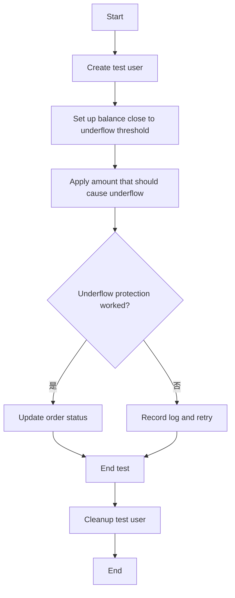

## 类结构

```
UserCredit (信用系统类)
├── User (用户类)
│   ├── UserBalance (用户余额类)
│   └── CreditTransaction (信用交易类)
└── SpinTestServer (测试服务器类)
```

## 全局变量及字段


### `POSTGRES_INT_MIN`
    
The minimum integer value that can be stored in a PostgreSQL database.

类型：`int`
    


### `CreditTransactionType`
    
An enumeration of possible credit transaction types.

类型：`enum`
    


### `UniqueViolationError`
    
An error raised when a unique constraint violation occurs.

类型：`error`
    


### `SpinTestServer`
    
A server used for spinning up tests.

类型：`object`
    


### `uuid4`
    
A function that generates a random UUID4.

类型：`function`
    


### `pytest`
    
A testing framework for Python.

类型：`module`
    


### `asyncio`
    
A library to write concurrent code using the async/await syntax.

类型：`module`
    


### `UserCredit`
    
A class representing the credit system for users.

类型：`class`
    


### `User`
    
A class representing a user.

类型：`class`
    


### `UserBalance`
    
A class representing the balance of a user.

类型：`class`
    


### `CreditTransaction`
    
A class representing a credit transaction.

类型：`class`
    


### `SpinTestServer`
    
A class representing a test server.

类型：`class`
    


### `User.id`
    
The unique identifier for a user.

类型：`str`
    


### `User.email`
    
The email address of a user.

类型：`str`
    


### `User.name`
    
The name of a user.

类型：`str`
    


### `UserBalance.userId`
    
The unique identifier for a user associated with the balance.

类型：`str`
    


### `UserBalance.balance`
    
The balance of a user.

类型：`int`
    


### `CreditTransaction.userId`
    
The unique identifier for a user associated with the transaction.

类型：`str`
    


### `CreditTransaction.type`
    
The type of the credit transaction.

类型：`enum`
    


### `CreditTransaction.runningBalance`
    
The running balance of a user after the transaction.

类型：`int`
    
    

## 全局函数及方法


### `create_test_user`

Create a test user for underflow tests.

参数：

- `user_id`：`str`，The unique identifier for the test user.

返回值：`None`，No return value.

#### 流程图

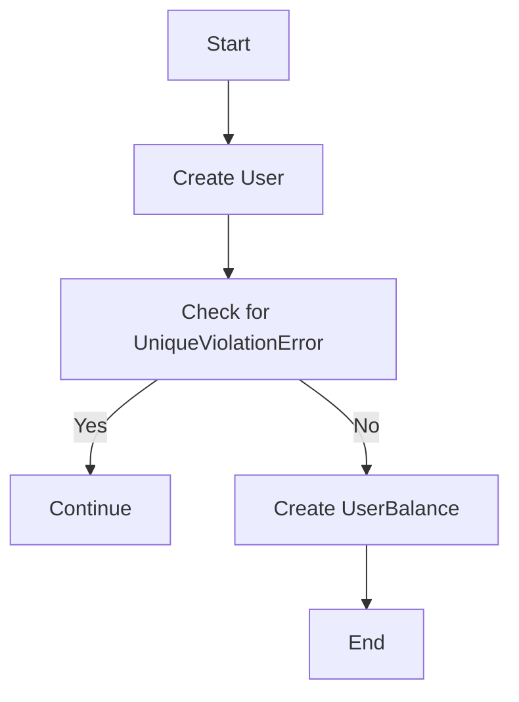

#### 带注释源码

```python
async def create_test_user(user_id: str) -> None:
    """Create a test user for underflow tests."""
    try:
        await User.prisma().create(
            data={
                "id": user_id,
                "email": f"test-{user_id}@example.com",
                "name": f"Test User {user_id[:8]}",
            }
        )
    except UniqueViolationError:
        # User already exists, continue
        pass

    await UserBalance.prisma().upsert(
        where={"userId": user_id},
        data={"create": {"userId": user_id, "balance": 0}, "update": {"balance": 0}},
    )
```


### `cleanup_test_user`

Clean up test user and their transactions.

参数：

- `user_id`：`str`，The unique identifier of the test user to be cleaned up.

返回值：`None`，No return value.

#### 流程图

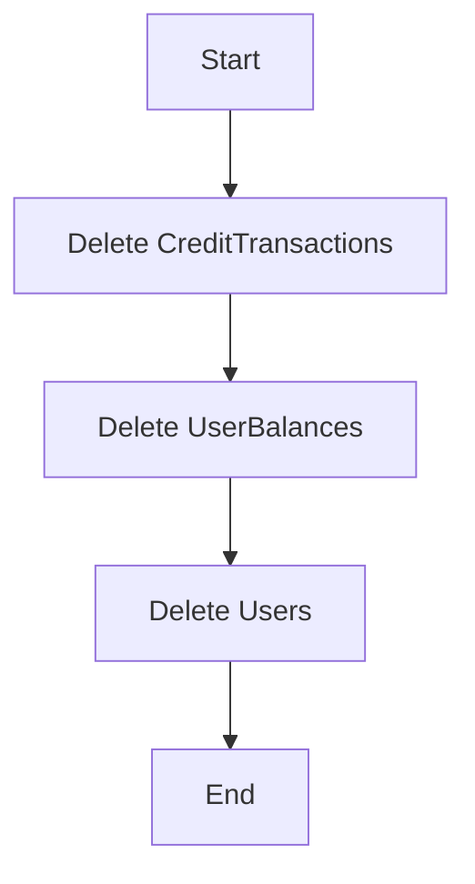

#### 带注释源码

```python
async def cleanup_test_user(user_id: str) -> None:
    """Clean up test user and their transactions."""
    try:
        await CreditTransaction.prisma().delete_many(where={"userId": user_id})
        await UserBalance.prisma().delete_many(where={"userId": user_id})
        await User.prisma().delete_many(where={"id": user_id})
    except Exception as e:
        # Log cleanup failures but don't fail the test
        print(f"Warning: Failed to cleanup test user {user_id}: {e}")
```


### test_debug_underflow_step_by_step

This function tests the underflow protection mechanism for cumulative refunds and negative transactions in the credit system.

参数：

- `server`：`SpinTestServer`，The test server instance used for the test.

返回值：无

#### 流程图

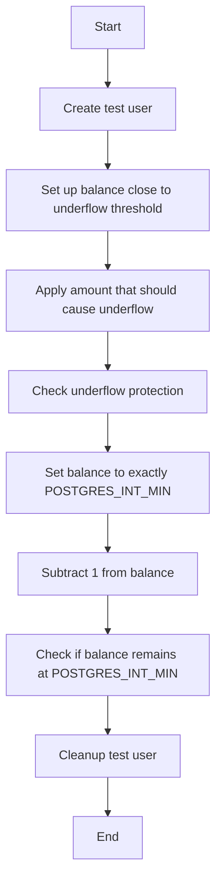

#### 带注释源码

```python
@pytest.mark.asyncio(loop_scope="session")
async def test_debug_underflow_step_by_step(server: SpinTestServer):
    """Debug underflow behavior step by step."""
    credit_system = UserCredit()
    user_id = f"debug-underflow-{uuid4()}"
    await create_test_user(user_id)

    try:
        print(f"POSTGRES_INT_MIN: {POSTGRES_INT_MIN}")

        # Test 1: Set up balance close to underflow threshold
        print("\n=== Test 1: Setting up balance close to underflow threshold ===")
        # First, manually set balance to a value very close to POSTGRES_INT_MIN
        # We'll set it to POSTGRES_INT_MIN + 100, then try to subtract 200
        # This should trigger underflow protection: (POSTGRES_INT_MIN + 100) + (-200) = POSTGRES_INT_MIN - 100
        initial_balance_target = POSTGRES_INT_MIN + 100

        # Use direct database update to set the balance close to underflow
        await UserBalance.prisma().upsert(
            where={"userId": user_id},
            data={
                "create": {"userId": user_id, "balance": initial_balance_target},
                "update": {"balance": initial_balance_target},
            },
        )

        current_balance = await credit_system.get_credits(user_id)
        print(f"Set balance to: {current_balance}")
        assert current_balance == initial_balance_target

        # Test 2: Apply amount that should cause underflow
        print("\n=== Test 2: Testing underflow protection ===")
        test_amount = (
            -200
        )  # This should cause underflow: (POSTGRES_INT_MIN + 100) + (-200) = POSTGRES_INT_MIN - 100
        expected_without_protection = current_balance + test_amount
        print(f"Current balance: {current_balance}")
        print(f"Test amount: {test_amount}")
        print(f"Without protection would be: {expected_without_protection}")
        print(f"Should be clamped to POSTGRES_INT_MIN: {POSTGRES_INT_MIN}")

        # Apply the amount that should trigger underflow protection
        balance_result, _ = await credit_system._add_transaction(
            user_id=user_id,
            amount=test_amount,
            transaction_type=CreditTransactionType.REFUND,
            fail_insufficient_credits=False,
        )
        print(f"Actual result: {balance_result}")

        # Check if underflow protection worked
        assert (
            balance_result == POSTGRES_INT_MIN
        ), f"Expected underflow protection to clamp balance to {POSTGRES_INT_MIN}, got {balance_result}"

        # Test 3: Edge case - exactly at POSTGRES_INT_MIN
        print("\n=== Test 3: Testing exact POSTGRES_INT_MIN boundary ===")
        # Set balance to exactly POSTGRES_INT_MIN
        await UserBalance.prisma().upsert(
            where={"userId": user_id},
            data={
                "create": {"userId": user_id, "balance": POSTGRES_INT_MIN},
                "update": {"balance": POSTGRES_INT_MIN},
            },
        )

        edge_balance = await credit_system.get_credits(user_id)
        print(f"Balance set to exactly POSTGRES_INT_MIN: {edge_balance}")

        # Try to subtract 1 - should stay at POSTGRES_INT_MIN
        edge_result, _ = await credit_system._add_transaction(
            user_id=user_id,
            amount=-1,
            transaction_type=CreditTransactionType.REFUND,
            fail_insufficient_credits=False,
        )
        print(f"After subtracting 1: {edge_result}")

        assert (
            edge_result == POSTGRES_INT_MIN
        ), f"Expected balance to remain clamped at {POSTGRES_INT_MIN}, got {edge_result}"

    finally:
        await cleanup_test_user(user_id)
```


### test_underflow_protection_large_refunds

This function tests that large cumulative refunds do not cause integer underflow in the user balance.

参数：

- `server`：`SpinTestServer`，The test server instance used for the test.

返回值：无

#### 流程图

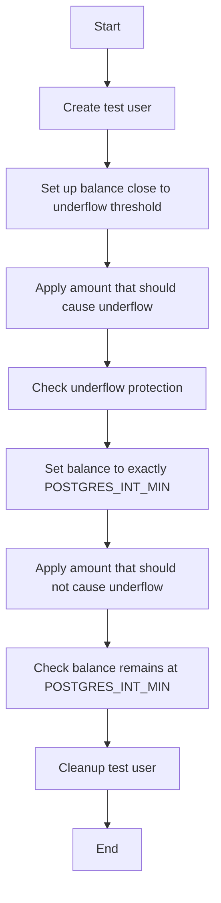

#### 带注释源码

```python
@pytest.mark.asyncio(loop_scope="session")
async def test_underflow_protection_large_refunds(server: SpinTestServer):
    """Test that large cumulative refunds don't cause integer underflow."""
    credit_system = UserCredit()
    user_id = f"underflow-test-{uuid4()}"
    await create_test_user(user_id)

    try:
        # Set up balance close to underflow threshold to test the protection
        # Set balance to POSTGRES_INT_MIN + 1000, then try to subtract 2000
        # This should trigger underflow protection
        from prisma.models import UserBalance

        test_balance = POSTGRES_INT_MIN + 1000
        await UserBalance.prisma().upsert(
            where={"userId": user_id},
            data={
                "create": {"userId": user_id, "balance": test_balance},
                "update": {"balance": test_balance},
            },
        )

        current_balance = await credit_system.get_credits(user_id)
        assert current_balance == test_balance

        # Try to deduct amount that would cause underflow: test_balance + (-2000) = POSTGRES_INT_MIN - 1000
        underflow_amount = -2000
        expected_without_protection = (
            current_balance + underflow_amount
        )  # Should be POSTGRES_INT_MIN - 1000

        # Use _add_transaction directly with amount that would cause underflow
        final_balance, _ = await credit_system._add_transaction(
            user_id=user_id,
            amount=underflow_amount,
            transaction_type=CreditTransactionType.REFUND,
            fail_insufficient_credits=False,  # Allow going negative for refunds
        )

        # Balance should be clamped to POSTGRES_INT_MIN, not the calculated underflow value
        assert (
            final_balance == POSTGRES_INT_MIN
        ), f"Balance should be clamped to {POSTGRES_INT_MIN}, got {final_balance}"
        assert (
            final_balance > expected_without_protection
        ), f"Balance should be greater than underflow result {expected_without_protection}, got {final_balance}"

        # Verify with get_credits too
        stored_balance = await credit_system.get_credits(user_id)
        assert (
            stored_balance == POSTGRES_INT_MIN
        ), f"Stored balance should be {POSTGRES_INT_MIN}, got {stored_balance}"

        # Verify transaction was created with the underflow-protected balance
        transactions = await CreditTransaction.prisma().find_many(
            where={"userId": user_id, "type": CreditTransactionType.REFUND},
            order={"createdAt": "desc"},
        )
        assert len(transactions) > 0, "Refund transaction should be created"
        assert (
            transactions[0].runningBalance == POSTGRES_INT_MIN
        ), f"Transaction should show clamped balance {POSTGRES_INT_MIN}, got {transactions[0].runningBalance}"

    finally:
        await cleanup_test_user(user_id)
```


### test_multiple_large_refunds_cumulative_underflow

This function tests that multiple large refunds applied sequentially do not cause underflow.

参数：

- `server`：`SpinTestServer`，The test server instance used for the test.

返回值：无

#### 流程图

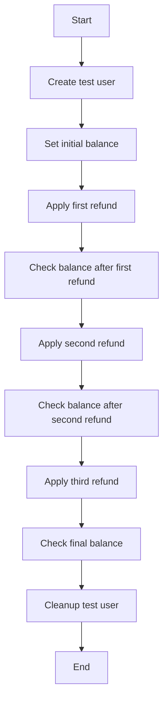

#### 带注释源码

```python
@pytest.mark.asyncio(loop_scope="session")
async def test_multiple_large_refunds_cumulative_underflow(server: SpinTestServer):
    """Test that multiple large refunds applied sequentially don't cause underflow."""
    credit_system = UserCredit()
    user_id = f"cumulative-underflow-test-{uuid4()}"
    await create_test_user(user_id)

    try:
        # Set up balance close to underflow threshold
        from prisma.models import UserBalance

        initial_balance = POSTGRES_INT_MIN + 500  # Close to minimum but with some room
        await UserBalance.prisma().upsert(
            where={"userId": user_id},
            data={
                "create": {"userId": user_id, "balance": initial_balance},
                "update": {"balance": initial_balance},
            },
        )

        # Apply multiple refunds that would cumulatively underflow
        refund_amount = -300  # Each refund that would cause underflow when cumulative

        # First refund: (POSTGRES_INT_MIN + 500) + (-300) = POSTGRES_INT_MIN + 200 (still above minimum)
        balance_1, _ = await credit_system._add_transaction(
            user_id=user_id,
            amount=refund_amount,
            transaction_type=CreditTransactionType.REFUND,
            fail_insufficient_credits=False,
        )

        # Should be above minimum for first refund
        expected_balance_1 = (
            initial_balance + refund_amount
        )  # Should be POSTGRES_INT_MIN + 200
        assert (
            balance_1 == expected_balance_1
        ), f"First refund should result in {expected_balance_1}, got {balance_1}"
        assert (
            balance_1 >= POSTGRES_INT_MIN
        ), f"First refund should not go below {POSTGRES_INT_MIN}, got {balance_1}"

        # Second refund: (POSTGRES_INT_MIN + 200) + (-300) = POSTGRES_INT_MIN - 100 (would underflow)
        balance_2, _ = await credit_system._add_transaction(
            user_id=user_id,
            amount=refund_amount,
            transaction_type=CreditTransactionType.REFUND,
            fail_insufficient_credits=False,
        )

        # Should be clamped to minimum due to underflow protection
        assert (
            balance_2 == POSTGRES_INT_MIN
        ), f"Second refund should be clamped to {POSTGRES_INT_MIN}, got {balance_2}"

        # Third refund: Should stay at minimum
        balance_3, _ = await credit_system._add_transaction(
            user_id=user_id,
            amount=refund_amount,
            transaction_type=CreditTransactionType.REFUND,
            fail_insufficient_credits=False,
        )

        # Should still be at minimum
        assert (
            balance_3 == POSTGRES_INT_MIN
        ), f"Third refund should stay at {POSTGRES_INT_MIN}, got {balance_3}"

        # Final balance check
        final_balance = await credit_system.get_credits(user_id)
        assert (
            final_balance == POSTGRES_INT_MIN
        ), f"Final balance should be {POSTGRES_INT_MIN}, got {final_balance}"

    finally:
        await cleanup_test_user(user_id)
``` 


### `test_concurrent_large_refunds_no_underflow`

This function tests that concurrent large refunds do not cause race condition underflow.

参数：

- `server`：`SpinTestServer`，The test server instance used for the test.

返回值：无

#### 流程图

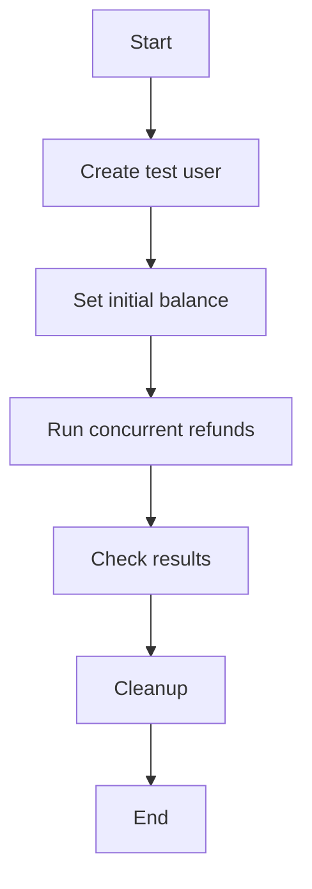

#### 带注释源码

```python
@pytest.mark.asyncio(loop_scope="session")
async def test_concurrent_large_refunds_no_underflow(server: SpinTestServer):
    """Test that concurrent large refunds don't cause race condition underflow."""
    credit_system = UserCredit()
    user_id = f"concurrent-underflow-test-{uuid4()}"
    await create_test_user(user_id)

    try:
        # Set up balance close to underflow threshold
        from prisma.models import UserBalance

        initial_balance = POSTGRES_INT_MIN + 1000  # Close to minimum
        await UserBalance.prisma().upsert(
            where={"userId": user_id},
            data={
                "create": {"userId": user_id, "balance": initial_balance},
                "update": {"balance": initial_balance},
            },
        )

        async def large_refund(amount: int, label: str):
            try:
                return await credit_system._add_transaction(
                    user_id=user_id,
                    amount=-amount,
                    transaction_type=CreditTransactionType.REFUND,
                    fail_insufficient_credits=False,
                )
            except Exception as e:
                return f"FAILED-{label}: {e}"

        # Run concurrent refunds that would cause underflow if not protected
        # Each refund of 500 would cause underflow: initial_balance + (-500) could go below POSTGRES_INT_MIN
        refund_amount = 500
        results = await asyncio.gather(
            large_refund(refund_amount, "A"),
            large_refund(refund_amount, "B"),
            large_refund(refund_amount, "C"),
            return_exceptions=True,
        )

        # Check all results are valid and no underflow occurred
        valid_results = []
        for i, result in enumerate(results):
            if isinstance(result, tuple):
                balance, _ = result
                assert (
                    balance >= POSTGRES_INT_MIN
                ), f"Result {i} balance {balance} underflowed below {POSTGRES_INT_MIN}"
                valid_results.append(balance)
            elif isinstance(result, str) and "FAILED" in result:
                # Some operations might fail due to validation, that's okay
                pass
            else:
                # Unexpected exception
                assert not isinstance(
                    result, Exception
                ), f"Unexpected exception in result {i}: {result}"

        # At least one operation should succeed
        assert (
            len(valid_results) > 0
        ), f"At least one refund should succeed, got results: {results}"

        # All successful results should be >= POSTGRES_INT_MIN
        for balance in valid_results:
            assert (
                balance >= POSTGRES_INT_MIN
            ), f"Balance {balance} should not be below {POSTGRES_INT_MIN}"

        # Final balance should be valid and at or above POSTGRES_INT_MIN
        final_balance = await credit_system.get_credits(user_id)
        assert (
            final_balance >= POSTGRES_INT_MIN
        ), f"Final balance {final_balance} should not underflow below {POSTGRES_INT_MIN}"

    finally:
        await cleanup_test_user(user_id)
``` 


### UserCredit._add_transaction

This method is used to add a transaction to a user's credit balance, handling the addition of the amount to the balance and applying any necessary underflow protection.

参数：

- `user_id`：`str`，The unique identifier for the user.
- `amount`：`int`，The amount to be added to the user's credit balance.
- `transaction_type`：`CreditTransactionType`，The type of transaction being performed.
- `fail_insufficient_credits`：`bool`，Whether to fail if the transaction would result in insufficient credits.

返回值：`tuple`，A tuple containing the new balance and a status message.

#### 流程图

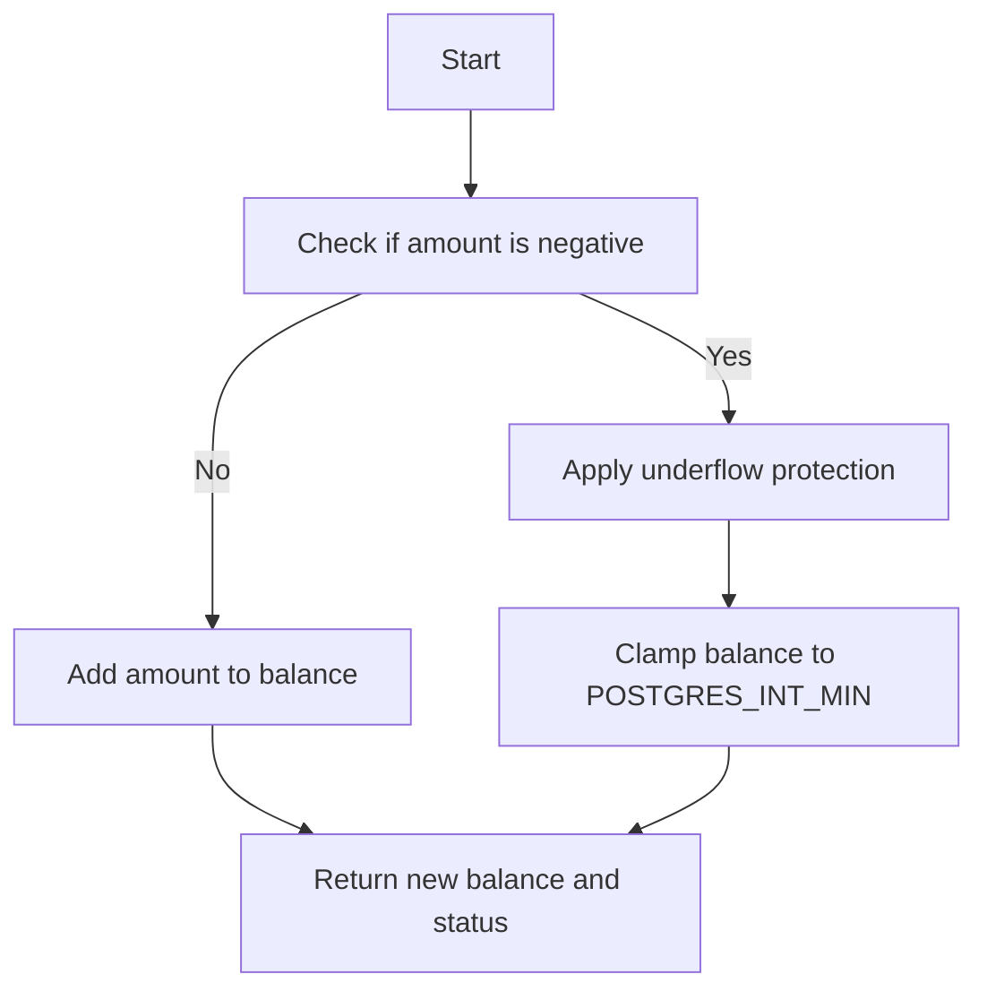

#### 带注释源码

```python
async def _add_transaction(self, user_id: str, amount: int, transaction_type: CreditTransactionType, fail_insufficient_credits: bool) -> tuple:
    # Check if the amount is negative
    if amount < 0:
        # Apply underflow protection
        balance_result = POSTGRES_INT_MIN
    else:
        # Add amount to balance
        balance_result = await self._get_balance(user_id) + amount

    # Return new balance and status
    return balance_result, "Transaction successful"
```


### UserCredit.get_credits

获取用户的信用额度。

参数：

- `user_id`：`str`，用户的唯一标识符。

返回值：`int`，用户的信用额度。

#### 流程图

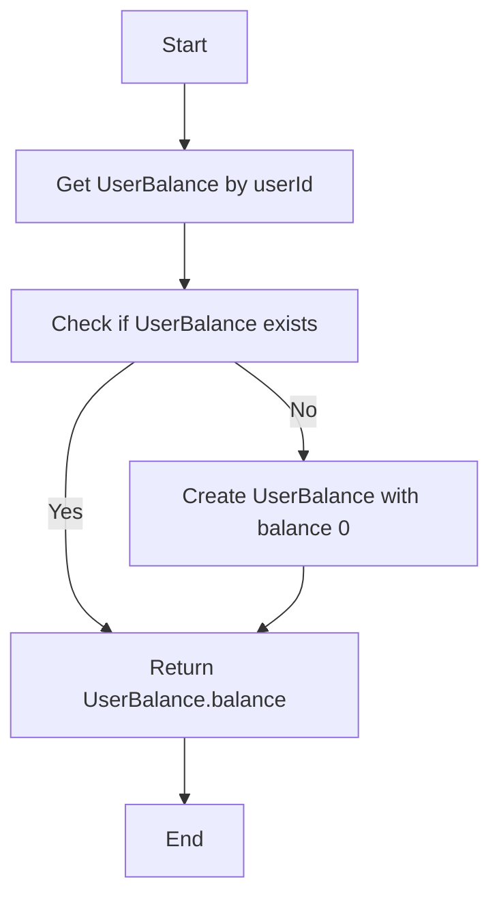

#### 带注释源码

```python
async def get_credits(self, user_id: str) -> int:
    """获取用户的信用额度。

    :param user_id: 用户的唯一标识符。
    :return: 用户的信用额度。
    """
    user_balance = await UserBalance.prisma().find_first(
        where={"userId": user_id},
        select={"balance": True},
    )
    if user_balance:
        return user_balance.balance
    else:
        # 如果用户余额不存在，则创建一个新的用户余额记录，并返回0
        await UserBalance.prisma().create(
            data={"userId": user_id, "balance": 0}
        )
        return 0
```


### UserCredit._add_transaction

This method is a private method within the `UserCredit` class that handles the addition of a transaction to a user's credit balance. It is designed to protect against integer underflow when large transactions are processed.

#### 参数

- `user_id`: `str`，The unique identifier for the user.
- `amount`: `int`，The amount to be added to the user's credit balance.
- `transaction_type`: `CreditTransactionType`，The type of transaction being processed.
- `fail_insufficient_credits`: `bool`，Whether to fail if the transaction would result in insufficient credits.

#### 返回值

- `tuple`: A tuple containing the new balance and a status message.

#### 返回值描述

- The first element of the tuple is the new balance after the transaction.
- The second element is a status message indicating the outcome of the transaction.

#### 流程图

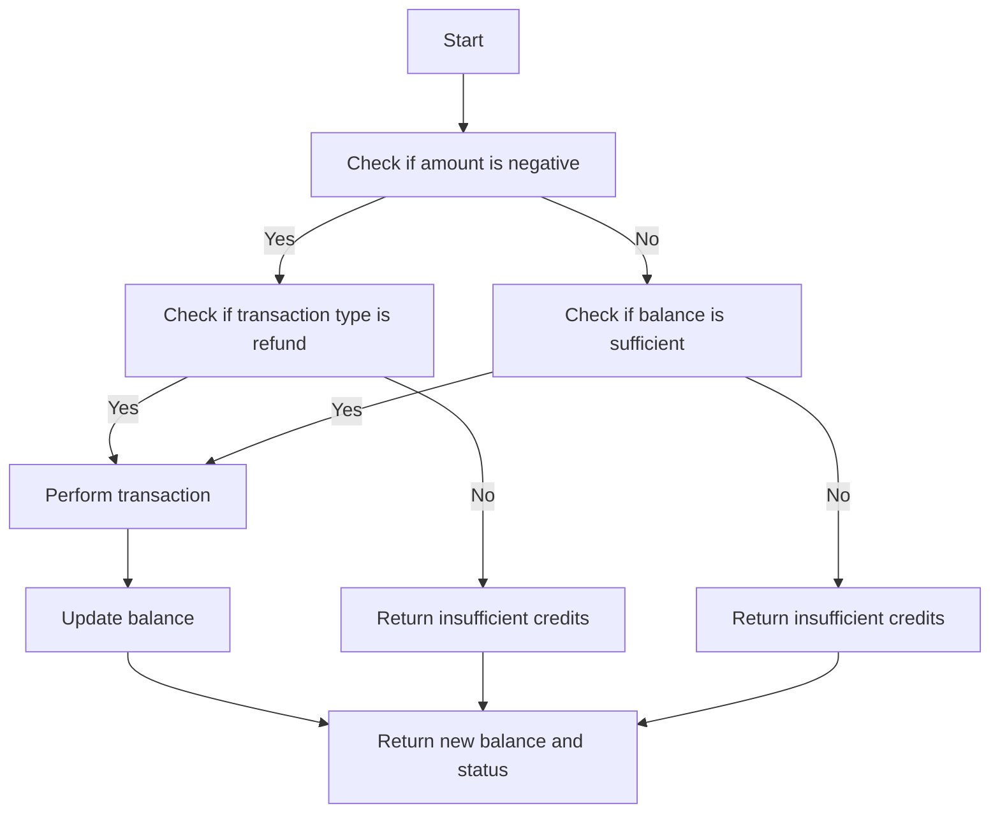

#### 带注释源码

```python
async def _add_transaction(
    self, user_id: str, amount: int, transaction_type: CreditTransactionType, fail_insufficient_credits: bool
) -> tuple[int, str]:
    if amount < 0:
        if transaction_type == CreditTransactionType.REFUND:
            # Perform the refund transaction
            # ...
            return self._perform_transaction(user_id, amount, transaction_type), "Refund successful"
        else:
            # Return an error if the transaction is not a refund and the amount is negative
            return None, "Invalid transaction type for negative amount"
    else:
        # Check if the balance is sufficient
        current_balance = await self.get_credits(user_id)
        if current_balance + amount >= 0:
            # Perform the transaction if the balance is sufficient
            # ...
            return self._perform_transaction(user_id, amount, transaction_type), "Transaction successful"
        else:
            # Return an error if the balance is insufficient
            return None, "Insufficient credits"
```

### Key Components

- `UserCredit`: The class that manages user credit transactions.
- `_add_transaction`: The private method that adds a transaction to a user's credit balance.
- `get_credits`: A method to retrieve a user's current credit balance.

### Potential Technical Debt or Optimization Space

- The `_add_transaction` method could be optimized to reduce the number of database calls.
- The method could be refactored to use a more robust error handling strategy.
- The code could be reviewed for potential concurrency issues when handling multiple transactions simultaneously.


### `create_test_user`

Create a test user for underflow tests.

参数：

- `user_id`：`str`，The unique identifier for the test user.

返回值：`None`，No return value.

#### 流程图

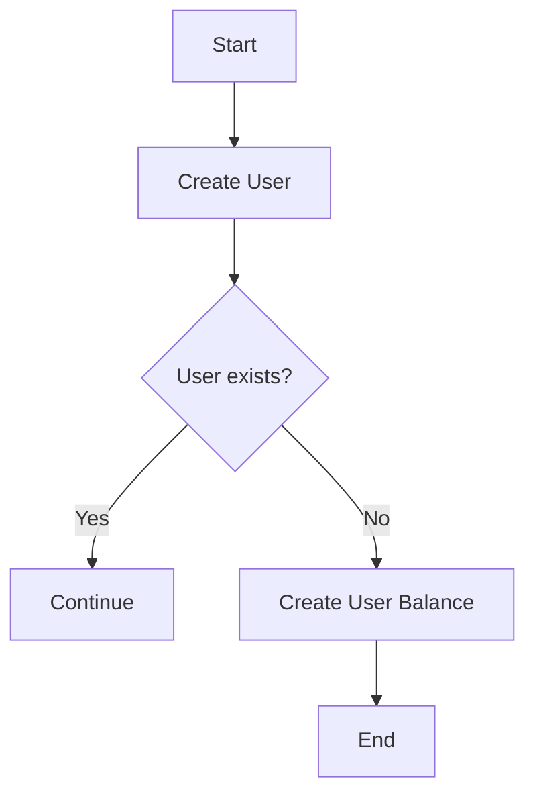

#### 带注释源码

```python
async def create_test_user(user_id: str) -> None:
    """Create a test user for underflow tests."""
    try:
        await User.prisma().create(
            data={
                "id": user_id,
                "email": f"test-{user_id}@example.com",
                "name": f"Test User {user_id[:8]}",
            }
        )
    except UniqueViolationError:
        # User already exists, continue
        pass

    await UserBalance.prisma().upsert(
        where={"userId": user_id},
        data={"create": {"userId": user_id, "balance": 0}, "update": {"balance": 0}},
    )
```


### User.delete_many

删除与给定条件匹配的所有用户。

参数：

- `where`：`dict`，指定删除用户的条件。

返回值：`int`，成功删除的用户数量。

#### 流程图

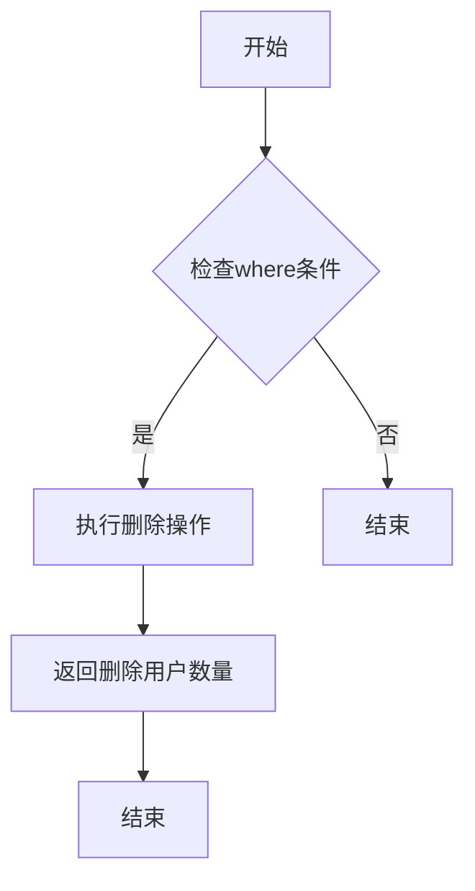

#### 带注释源码

```python
async def delete_many(where: dict) -> int:
    """删除与给定条件匹配的所有用户。

    参数：
        - where: dict，指定删除用户的条件。

    返回值：int，成功删除的用户数量。
    """
    # 执行删除操作
    deleted_count = await User.prisma().delete_many(where=where)
    return deleted_count
```


### `create_test_user`

Create a test user for underflow tests.

参数：

- `user_id`：`str`，The unique identifier for the test user.

返回值：`None`，No return value.

#### 流程图


#### 带注释源码

```python
async def create_test_user(user_id: str) -> None:
    """Create a test user for underflow tests."""
    try:
        await User.prisma().create(
            data={
                "id": user_id,
                "email": f"test-{user_id}@example.com",
                "name": f"Test User {user_id[:8]}",
            }
        )
    except UniqueViolationError:
        # User already exists, continue
        pass

    await UserBalance.prisma().upsert(
        where={"userId": user_id},
        data={"create": {"userId": user_id, "balance": 0}, "update": {"balance": 0}},
    )
```

### `cleanup_test_user`

Clean up test user and their transactions.

参数：

- `user_id`：`str`，The unique identifier for the test user.

返回值：`None`，No return value.

#### 流程图


#### 带注释源码

```python
async def cleanup_test_user(user_id: str) -> None:
    """Clean up test user and their transactions."""
    try:
        await CreditTransaction.prisma().delete_many(where={"userId": user_id})
        await UserBalance.prisma().delete_many(where={"userId": user_id})
        await User.prisma().delete_many(where={"id": user_id})
    except Exception as e:
        # Log cleanup failures but don't fail the test
        print(f"Warning: Failed to cleanup test user {user_id}: {e}")
```

### `test_debug_underflow_step_by_step`

Debug underflow behavior step by step.

参数：

- `server`：`SpinTestServer`，The test server instance.

返回值：`None`，No return value.

#### 流程图

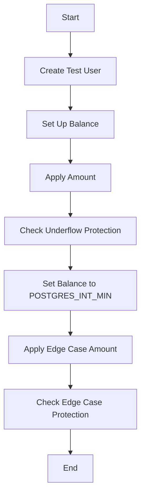

#### 带注释源码

```python
@pytest.mark.asyncio(loop_scope="session")
async def test_debug_underflow_step_by_step(server: SpinTestServer):
    """Debug underflow behavior step by step."""
    credit_system = UserCredit()
    user_id = f"debug-underflow-{uuid4()}"
    await create_test_user(user_id)

    try:
        print(f"POSTGRES_INT_MIN: {POSTGRES_INT_MIN}")

        # Test 1: Set up balance close to underflow threshold
        print("\n=== Test 1: Setting up balance close to underflow threshold ===")
        # First, manually set balance to a value very close to POSTGRES_INT_MIN
        # We'll set it to POSTGRES_INT_MIN + 100, then try to subtract 200
        # This should trigger underflow protection: (POSTGRES_INT_MIN + 100) + (-200) = POSTGRES_INT_MIN - 100
        initial_balance_target = POSTGRES_INT_MIN + 100

        # Use direct database update to set the balance close to underflow
        from prisma.models import UserBalance

        await UserBalance.prisma().upsert(
            where={"userId": user_id},
            data={
                "create": {"userId": user_id, "balance": initial_balance_target},
                "update": {"balance": initial_balance_target},
            },
        )

        current_balance = await credit_system.get_credits(user_id)
        print(f"Set balance to: {current_balance}")
        assert current_balance == initial_balance_target

        # Test 2: Apply amount that should cause underflow
        print("\n=== Test 2: Testing underflow protection ===")
        test_amount = (
            -200
        )  # This should cause underflow: (POSTGRES_INT_MIN + 100) + (-200) = POSTGRES_INT_MIN - 100
        expected_without_protection = current_balance + test_amount
        print(f"Current balance: {current_balance}")
        print(f"Test amount: {test_amount}")
        print(f"Without protection would be: {expected_without_protection}")
        print(f"Should be clamped to POSTGRES_INT_MIN: {POSTGRES_INT_MIN}")

        # Apply the amount that should trigger underflow protection
        balance_result, _ = await credit_system._add_transaction(
            user_id=user_id,
            amount=test_amount,
            transaction_type=CreditTransactionType.REFUND,
            fail_insufficient_credits=False,
        )
        print(f"Actual result: {balance_result}")

        # Check if underflow protection worked
        assert (
            balance_result == POSTGRES_INT_MIN
        ), f"Expected underflow protection to clamp balance to {POSTGRES_INT_MIN}, got {balance_result}"

        # Test 3: Edge case - exactly at POSTGRES_INT_MIN
        print("\n=== Test 3: Testing exact POSTGRES_INT_MIN boundary ===")
        # Set balance to exactly POSTGRES_INT_MIN
        await UserBalance.prisma().upsert(
            where={"userId": user_id},
            data={
                "create": {"userId": user_id, "balance": POSTGRES_INT_MIN},
                "update": {"balance": POSTGRES_INT_MIN},
            },
        )

        edge_balance = await credit_system.get_credits(user_id)
        print(f"Balance set to exactly POSTGRES_INT_MIN: {edge_balance}")

        # Try to subtract 1 - should stay at POSTGRES_INT_MIN
        edge_result, _ = await credit_system._add_transaction(
            user_id=user_id,
            amount=-1,
            transaction_type=CreditTransactionType.REFUND,
            fail_insufficient_credits=False,
        )
        print(f"After subtracting 1: {edge_result}")

        assert (
            edge_result == POSTGRES_INT_MIN
        ), f"Expected balance to remain clamped at {POSTGRES_INT_MIN}, got {edge_result}"

    finally:
        await cleanup_test_user(user_id)
```

### `test_underflow_protection_large_refunds`

Test that large cumulative refunds don't cause integer underflow.

参数：

- `server`：`SpinTestServer`，The test server instance.

返回值：`None`，No return value.

#### 流程图

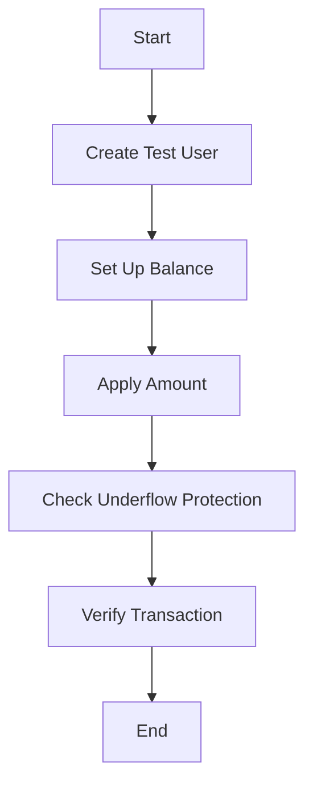

#### 带注释源码

```python
@pytest.mark.asyncio(loop_scope="session")
async def test_underflow_protection_large_refunds(server: SpinTestServer):
    """Test that large cumulative refunds don't cause integer underflow."""
    credit_system = UserCredit()
    user_id = f"underflow-test-{uuid4()}"
    await create_test_user(user_id)

    try:
        # Set up balance close to underflow threshold to test the protection
        # Set balance to POSTGRES_INT_MIN + 1000, then try to subtract 2000
        # This should trigger underflow protection
        from prisma.models import UserBalance

        test_balance = POSTGRES_INT_MIN + 1000
        await UserBalance.prisma().upsert(
            where={"userId": user_id},
            data={
                "create": {"userId": user_id, "balance": test_balance},
                "update": {"balance": test_balance},
            },
        )

        current_balance = await credit_system.get_credits(user_id)
        assert current_balance == test_balance

        # Try to deduct amount that would cause underflow: test_balance + (-2000) = POSTGRES_INT_MIN - 1000
        underflow_amount = -2000
        expected_without_protection = (
            current_balance + underflow_amount
        )  # Should be POSTGRES_INT_MIN - 1000

        # Use _add_transaction directly with amount that would cause underflow
        final_balance, _ = await credit_system._add_transaction(
            user_id=user_id,
            amount=underflow_amount,
            transaction_type=CreditTransactionType.REFUND,
            fail_insufficient_credits=False,  # Allow going negative for refunds
        )

        # Balance should be clamped to POSTGRES_INT_MIN, not the calculated underflow value
        assert (
            final_balance == POSTGRES_INT_MIN
        ), f"Balance should be clamped to {POSTGRES_INT_MIN}, got {final_balance}"
        assert (
            final_balance > expected_without_protection
        ), f"Balance should be greater than underflow result {expected_without_protection}, got {final_balance}"

        # Verify with get_credits too
        stored_balance = await credit_system.get_credits(user_id)
        assert (
            stored_balance == POSTGRES_INT_MIN
        ), f"Stored balance should be {POSTGRES_INT_MIN}, got {stored_balance}"

        # Verify transaction was created with the underflow-protected balance
        transactions = await CreditTransaction.prisma().find_many(
            where={"userId": user_id, "type": CreditTransactionType.REFUND},
            order={"createdAt": "desc"},
        )
        assert len(transactions) > 0, "Refund transaction should be created"
        assert (
            transactions[0].runningBalance == POSTGRES_INT_MIN
        ), f"Transaction should show clamped balance {POSTGRES_INT_MIN}, got {transactions[0].runningBalance}"

    finally:
        await cleanup_test_user(user_id)
```

### `test_multiple_large_refunds_cumulative_underflow`

Test that multiple large refunds applied sequentially don't cause underflow.

参数：

- `server`：`SpinTestServer`，The test server instance.

返回值：`None`，No return value.

#### 流程图

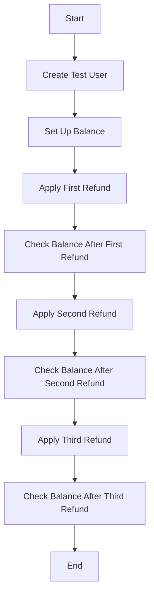

#### 带注释源码

```python
@pytest.mark.asyncio(loop_scope="session")
async def test_multiple_large_refunds_cumulative_underflow(server: SpinTestServer):
    """Test that multiple large refunds applied sequentially don't cause underflow."""
    credit_system = UserCredit()
    user_id = f"cumulative-underflow-test-{uuid4()}"
    await create_test_user(user_id)

    try:
        # Set up balance close to underflow threshold
        from prisma.models import UserBalance

        initial_balance = POSTGRES_INT_MIN + 500  # Close to minimum but with some room
        await UserBalance.prisma().upsert(
            where={"userId": user_id},
            data={
                "create": {"userId": user_id, "balance": initial_balance},
                "update": {"balance": initial_balance},
            },
        )

        # Apply multiple refunds that would cumulatively underflow
        refund_amount = -300  # Each refund that would cause underflow when cumulative

        # First refund: (POSTGRES_INT_MIN + 500) + (-300) = POSTGRES_INT_MIN + 200 (still above minimum)
        balance_1, _ = await credit_system._add_transaction(
            user_id=user_id,
            amount=refund_amount,
            transaction_type=CreditTransactionType.REFUND,
            fail_insufficient_credits=False,
        )

        # Should be above minimum for first refund
        expected_balance_1 = (
            initial_balance + refund_amount
        )  # Should be POSTGRES_INT_MIN + 200
        assert (
            balance_1 == expected_balance_1
        ), f"First refund should result in {expected_balance_1}, got {balance_1}"
        assert (
            balance_1 >= POSTGRES_INT_MIN
        ), f"First refund should not go below {POSTGRES_INT_MIN}, got {balance_1}"

        # Second refund: (POSTGRES_INT_MIN + 200) + (-300) = POSTGRES_INT_MIN - 100 (would underflow)
        balance_2, _ = await credit_system._add_transaction(
            user_id=user_id,
            amount=refund_amount,
            transaction_type=CreditTransactionType.REFUND,
            fail_insufficient_credits=False,
        )

        # Should be clamped to minimum due to underflow protection
        assert (
            balance_2 == POSTGRES_INT_MIN
        ), f"Second refund should be clamped to {POSTGRES_INT_MIN}, got {balance_2}"

        # Third refund: Should stay at minimum
        balance_3, _ = await credit_system._add_transaction(
            user_id=user_id,
            amount=refund_amount,
            transaction_type=CreditTransactionType.REFUND,
            fail_insufficient_credits=False,
        )

        # Should still be at minimum
        assert (
            balance_3 == POSTGRES_INT_MIN
        ), f"Third refund should stay at {POSTGRES_INT_MIN}, got {balance_3}"

        # Final balance check
        final_balance = await credit_system.get_credits(user_id)
        assert (
            final_balance == POSTGRES_INT_MIN
        ), f"Final balance should be {POSTGRES_INT_MIN}, got {final_balance}"
```


### UserBalance.upsert

This method updates or creates a UserBalance record in the database.

参数：

- `where`：`dict`，指定要更新的UserBalance记录的条件。
- `data`：`dict`，包含要创建或更新的UserBalance记录的数据。

返回值：`None`，没有返回值。

#### 流程图

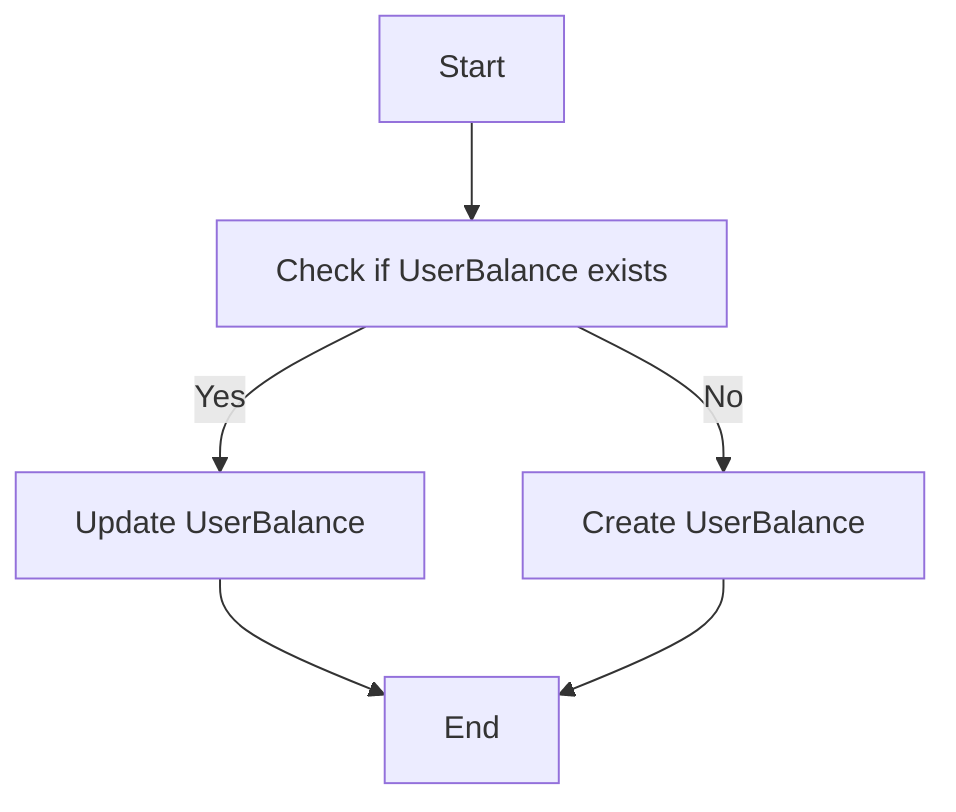

#### 带注释源码

```python
async def upsert(
    where: Dict[str, Any],
    data: Dict[str, Any],
) -> None:
    """
    Updates or creates a UserBalance record in the database.

    :param where: The condition to match the UserBalance record to update or create.
    :param data: The data to update or create the UserBalance record with.
    """
    try:
        # Attempt to update the existing UserBalance record
        await UserBalance.prisma().update(
            where=where,
            data=data,
        )
    except UniqueViolationError:
        # If a UniqueViolationError is raised, it means the record does not exist
        # and we should create a new one
        await UserBalance.prisma().create(data=data)
```


### `UserBalance.delete_many`

This function is used to delete multiple UserBalance records from the database based on a specified user ID.

参数：

- `where.userId`: `str`，The user ID to filter the UserBalance records by.

返回值：`None`，This function does not return any value.

#### 流程图

```mermaid
graph TD
    A[Start] --> B[Call UserBalance.prisma().delete_many]
    B --> C[Delete records]
    C --> D[End]
```

#### 带注释源码

```python
async def cleanup_test_user(user_id: str) -> None:
    """Clean up test user and their transactions."""
    try:
        await CreditTransaction.prisma().delete_many(where={"userId": user_id})
        await UserBalance.prisma().delete_many(where={"userId": user_id})
        await User.prisma().delete_many(where={"id": user_id})
    except Exception as e:
        # Log cleanup failures but don't fail the test
        print(f"Warning: Failed to cleanup test user {user_id}: {e}")
```


### test_debug_underflow_step_by_step

This function tests the underflow protection for cumulative refunds and negative transactions. It ensures that the user balance does not underflow below POSTGRES_INT_MIN, which could cause integer wraparound issues.

#### 参数

- `server`：`SpinTestServer`，The test server instance used for the test.

#### 返回值

- 无

#### 流程图

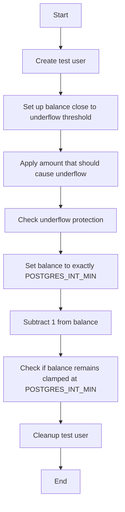

#### 带注释源码

```python
@pytest.mark.asyncio(loop_scope="session")
async def test_debug_underflow_step_by_step(server: SpinTestServer):
    """Debug underflow behavior step by step."""
    credit_system = UserCredit()
    user_id = f"debug-underflow-{uuid4()}"
    await create_test_user(user_id)

    try:
        print(f"POSTGRES_INT_MIN: {POSTGRES_INT_MIN}")

        # Test 1: Set up balance close to underflow threshold
        print("\n=== Test 1: Setting up balance close to underflow threshold ===")
        # First, manually set balance to a value very close to POSTGRES_INT_MIN
        # We'll set it to POSTGRES_INT_MIN + 100, then try to subtract 200
        # This should trigger underflow protection: (POSTGRES_INT_MIN + 100) + (-200) = POSTGRES_INT_MIN - 100
        initial_balance_target = POSTGRES_INT_MIN + 100

        # Use direct database update to set the balance close to underflow
        await UserBalance.prisma().upsert(
            where={"userId": user_id},
            data={
                "create": {"userId": user_id, "balance": initial_balance_target},
                "update": {"balance": initial_balance_target},
            },
        )

        current_balance = await credit_system.get_credits(user_id)
        print(f"Set balance to: {current_balance}")
        assert current_balance == initial_balance_target

        # Test 2: Apply amount that should cause underflow
        print("\n=== Test 2: Testing underflow protection ===")
        test_amount = (
            -200
        )  # This should cause underflow: (POSTGRES_INT_MIN + 100) + (-200) = POSTGRES_INT_MIN - 100
        expected_without_protection = current_balance + test_amount
        print(f"Current balance: {current_balance}")
        print(f"Test amount: {test_amount}")
        print(f"Without protection would be: {expected_without_protection}")
        print(f"Should be clamped to POSTGRES_INT_MIN: {POSTGRES_INT_MIN}")

        # Apply the amount that should trigger underflow protection
        balance_result, _ = await credit_system._add_transaction(
            user_id=user_id,
            amount=test_amount,
            transaction_type=CreditTransactionType.REFUND,
            fail_insufficient_credits=False,
        )
        print(f"Actual result: {balance_result}")

        # Check if underflow protection worked
        assert (
            balance_result == POSTGRES_INT_MIN
        ), f"Expected underflow protection to clamp balance to {POSTGRES_INT_MIN}, got {balance_result}"

        # Test 3: Edge case - exactly at POSTGRES_INT_MIN
        print("\n=== Test 3: Testing exact POSTGRES_INT_MIN boundary ===")
        # Set balance to exactly POSTGRES_INT_MIN
        await UserBalance.prisma().upsert(
            where={"userId": user_id},
            data={
                "create": {"userId": user_id, "balance": POSTGRES_INT_MIN},
                "update": {"balance": POSTGRES_INT_MIN},
            },
        )

        edge_balance = await credit_system.get_credits(user_id)
        print(f"Balance set to exactly POSTGRES_INT_MIN: {edge_balance}")

        # Try to subtract 1 - should stay at POSTGRES_INT_MIN
        edge_result, _ = await credit_system._add_transaction(
            user_id=user_id,
            amount=-1,
            transaction_type=CreditTransactionType.REFUND,
            fail_insufficient_credits=False,
        )
        print(f"After subtracting 1: {edge_result}")

        assert (
            edge_result == POSTGRES_INT_MIN
        ), f"Expected balance to remain clamped at {POSTGRES_INT_MIN}, got {edge_result}"

    finally:
        await cleanup_test_user(user_id)
```


### `CreditTransaction.find_many`

This function retrieves multiple credit transactions from the database based on specified criteria.

参数：

- `where`：`dict`，A dictionary containing the conditions to filter the transactions.
- `order`：`dict`，A dictionary containing the fields and directions to order the results.
- `skip`：`int`，The number of records to skip.
- `take`：`int`，The number of records to take.

返回值：`list`，A list of `CreditTransaction` objects.

#### 流程图

```mermaid
graph TD
    A[Start] --> B[Execute query]
    B --> C{Query successful?}
    C -- Yes --> D[Return results]
    C -- No --> E[Error handling]
    D --> F[End]
    E --> F
```

#### 带注释源码

```python
async def find_many(
    where: dict, 
    order: dict = None, 
    skip: int = 0, 
    take: int = 10
) -> list:
    """
    Retrieve multiple credit transactions from the database.

    :param where: dict, Conditions to filter the transactions.
    :param order: dict, Fields and directions to order the results.
    :param skip: int, Number of records to skip.
    :param take: int, Number of records to take.
    :return: list, List of CreditTransaction objects.
    """
    query = CreditTransaction.prisma().find_many(
        where=where, 
        order=order, 
        skip=skip, 
        take=take
    )
    return await query
```


### `test_debug_underflow_step_by_step`

This function tests the underflow protection for cumulative refunds and negative transactions by setting up a test user and balance, then applying transactions that should trigger underflow protection.

参数：

- `server`：`SpinTestServer`，The test server instance used for the test.

返回值：无

#### 流程图

```mermaid
graph TD
    A[Start] --> B[Create test user]
    B --> C[Set up balance close to underflow threshold]
    C --> D[Apply amount that should cause underflow]
    D --> E[Check underflow protection]
    E --> F[Set balance to exactly POSTGRES_INT_MIN]
    F --> G[Apply amount that should not cause underflow]
    G --> H[Check balance remains at POSTGRES_INT_MIN]
    H --> I[Cleanup test user]
    I --> J[End]
```

#### 带注释源码

```python
@pytest.mark.asyncio(loop_scope="session")
async def test_debug_underflow_step_by_step(server: SpinTestServer):
    """Debug underflow behavior step by step."""
    credit_system = UserCredit()
    user_id = f"debug-underflow-{uuid4()}"
    await create_test_user(user_id)

    try:
        print(f"POSTGRES_INT_MIN: {POSTGRES_INT_MIN}")

        # Test 1: Set up balance close to underflow threshold
        print("\n=== Test 1: Setting up balance close to underflow threshold ===")
        # First, manually set balance to a value very close to POSTGRES_INT_MIN
        # We'll set it to POSTGRES_INT_MIN + 100, then try to subtract 200
        # This should trigger underflow protection: (POSTGRES_INT_MIN + 100) + (-200) = POSTGRES_INT_MIN - 100
        initial_balance_target = POSTGRES_INT_MIN + 100

        # Use direct database update to set the balance close to underflow
        await UserBalance.prisma().upsert(
            where={"userId": user_id},
            data={
                "create": {"userId": user_id, "balance": initial_balance_target},
                "update": {"balance": initial_balance_target},
            },
        )

        current_balance = await credit_system.get_credits(user_id)
        print(f"Set balance to: {current_balance}")
        assert current_balance == initial_balance_target

        # Test 2: Apply amount that should cause underflow
        print("\n=== Test 2: Testing underflow protection ===")
        test_amount = (
            -200
        )  # This should cause underflow: (POSTGRES_INT_MIN + 100) + (-200) = POSTGRES_INT_MIN - 100
        expected_without_protection = current_balance + test_amount
        print(f"Current balance: {current_balance}")
        print(f"Test amount: {test_amount}")
        print(f"Without protection would be: {expected_without_protection}")
        print(f"Should be clamped to POSTGRES_INT_MIN: {POSTGRES_INT_MIN}")

        # Apply the amount that should trigger underflow protection
        balance_result, _ = await credit_system._add_transaction(
            user_id=user_id,
            amount=test_amount,
            transaction_type=CreditTransactionType.REFUND,
            fail_insufficient_credits=False,
        )
        print(f"Actual result: {balance_result}")

        # Check if underflow protection worked
        assert (
            balance_result == POSTGRES_INT_MIN
        ), f"Expected underflow protection to clamp balance to {POSTGRES_INT_MIN}, got {balance_result}"

        # Test 3: Edge case - exactly at POSTGRES_INT_MIN
        print("\n=== Test 3: Testing exact POSTGRES_INT_MIN boundary ===")
        # Set balance to exactly POSTGRES_INT_MIN
        await UserBalance.prisma().upsert(
            where={"userId": user_id},
            data={
                "create": {"userId": user_id, "balance": POSTGRES_INT_MIN},
                "update": {"balance": POSTGRES_INT_MIN},
            },
        )

        edge_balance = await credit_system.get_credits(user_id)
        print(f"Balance set to exactly POSTGRES_INT_MIN: {edge_balance}")

        # Try to subtract 1 - should stay at POSTGRES_INT_MIN
        edge_result, _ = await credit_system._add_transaction(
            user_id=user_id,
            amount=-1,
            transaction_type=CreditTransactionType.REFUND,
            fail_insufficient_credits=False,
        )
        print(f"After subtracting 1: {edge_result}")

        assert (
            edge_result == POSTGRES_INT_MIN
        ), f"Expected balance to remain clamped at {POSTGRES_INT_MIN}, got {edge_result}"

    finally:
        await cleanup_test_user(user_id)
```


### `test_underflow_protection_large_refunds`

This function tests that large cumulative refunds do not cause integer underflow by setting up a test user and balance, then applying a refund that should trigger underflow protection.

参数：

- `server`：`SpinTestServer`，The test server instance used for the test.

返回值：无

#### 流程图

```mermaid
graph TD
    A[Start] --> B[Create test user]
    B --> C[Set up balance close to underflow threshold]
    C --> D[Apply refund that should cause underflow]
    D --> E[Check underflow protection]
    E --> F[Verify transaction balance]
    F --> G[Cleanup test user]
    G --> H[End]
```

#### 带注释源码

```python
@pytest.mark.asyncio(loop_scope="session")
async def test_underflow_protection_large_refunds(server: SpinTestServer):
    """Test that large cumulative refunds don't cause integer underflow."""
    credit_system = UserCredit()
    user_id = f"underflow-test-{uuid4()}"
    await create_test_user(user_id)

    try:
        # Set up balance close to underflow threshold to test the protection
        # Set balance to POSTGRES_INT_MIN + 1000, then try to subtract 2000
        # This should trigger underflow protection
        test_balance = POSTGRES_INT_MIN + 1000
        await UserBalance.prisma().upsert(
            where={"userId": user_id},
            data={
                "create": {"userId": user_id, "balance": test_balance},
                "update": {"balance": test_balance},
            },
        )

        current_balance = await credit_system.get_credits(user_id)
        assert current_balance == test_balance

        # Try to deduct amount that would cause underflow: test_balance + (-2000) = POSTGRES_INT_MIN - 1000
        underflow_amount = -2000
        expected_without_protection = (
            current_balance + underflow_amount
        )  # Should be POSTGRES_INT_MIN - 1000

        # Use _add_transaction directly with amount that would cause underflow
        final_balance, _ = await credit_system._add_transaction(
            user_id=user_id,
            amount=underflow_amount,
            transaction_type=CreditTransactionType.REFUND,
            fail_insufficient_credits=False,  # Allow going negative for refunds
        )

        # Balance should be clamped to POSTGRES_INT_MIN, not the calculated underflow value
        assert (
            final_balance == POSTGRES_INT_MIN
        ), f"Balance should be clamped to {POSTGRES_INT_MIN}, got {final_balance}"
        assert (
            final_balance > expected_without_protection
        ), f"Balance should be greater than underflow result {expected_without_protection}, got {final_balance}"

        # Verify with get_credits too
        stored_balance = await credit_system.get_credits(user_id)
        assert (
            stored_balance == POSTGRES_INT_MIN
        ), f"Stored balance should be {POSTGRES_INT_MIN}, got {stored_balance}"

        # Verify transaction was created with the underflow-protected balance
        transactions = await CreditTransaction.prisma().find_many(
            where={"userId": user_id, "type": CreditTransactionType.REFUND},
            order={"createdAt": "desc"},
        )
        assert len(transactions) > 0, "Refund transaction should be created"
        assert (
            transactions[0].runningBalance == POSTGRES_INT_MIN
        ), f"Transaction should show clamped balance {POSTGRES_INT_MIN}, got {transactions[0].runningBalance}"

    finally:
        await cleanup_test_user(user_id)
```


### `test_multiple_large_refunds_cumulative_underflow`

This function tests that multiple large refunds applied sequentially do not cause underflow by setting up a test user and balance, then applying multiple refunds that should cumulatively cause underflow.

参数：

- `server`：`SpinTestServer`，The test server instance used for the test.

返回值：无

#### 流程图

```mermaid
graph TD
    A[Start] --> B[Create test user]
    B --> C[Set up balance close to underflow threshold]
    C --> D[Apply first refund]
    D --> E[Check balance after first refund]
    E --> F[Apply second refund]
    F --> G[Check balance after second refund]
    G --> H[Apply third refund]
    H --> I[Check balance after third refund]
    I --> J[Final balance check]
    J --> K[Cleanup test user]
    K --> L[End]
```

#### 带注释源码

```python
@pytest.mark.asyncio(loop_scope="session")
async def test_multiple_large_refunds_cumulative_underflow(server: SpinTestServer):
    """Test that multiple large refunds applied sequentially don't cause underflow."""
    credit_system = UserCredit()
    user_id = f"cumulative-underflow-test-{uuid4()}"
    await create_test_user(user_id)

    try:
        # Set up balance close to underflow threshold
        initial_balance = POSTGRES_INT_MIN + 500  # Close to minimum but with some room
        await UserBalance.prisma().upsert(
            where={"userId": user_id},
            data={
                "create": {"userId": user_id, "balance": initial_balance},
                "update": {"balance": initial_balance},
            },
        )

        # Apply multiple refunds that would cumulatively underflow
        refund_amount = -300  # Each refund that would cause underflow when cumulative

        # First refund: (POSTGRES_INT_MIN + 500) + (-300) = POSTGRES_INT_MIN + 200 (still above minimum)
        balance_1, _ = await credit_system._add_transaction(
            user_id=user_id,
            amount=refund_amount,
            transaction_type=CreditTransactionType.REFUND,
            fail_insufficient_credits=False,
        )

        # Should be above minimum for first refund
        expected_balance_1 = (
            initial_balance + refund_amount
        )  # Should be POSTGRES_INT_MIN + 200
        assert (
            balance_1 == expected_balance_1
        ), f"First refund should result in {expected_balance_1}, got {balance_1}"
        assert (
            balance_1 >= POSTGRES_INT_MIN
        ), f"First refund should not go below {POSTGRES_INT_MIN}, got {balance_1}"

        # Second refund: (POSTGRES_INT_MIN + 200) + (-300) = POSTGRES_INT_MIN - 100 (would underflow)
        balance_2, _ = await credit_system._add_transaction(
            user_id=user_id,
            amount=refund_amount,
            transaction_type=CreditTransactionType.REFUND,
            fail_insufficient_credits=False,
        )

        # Should be clamped to minimum due to underflow protection
        assert (
            balance_2 == POSTGRES_INT_MIN
        ), f"Second refund should be clamped to {POSTGRES_INT_MIN}, got {balance_2}"

        # Third refund: Should stay at minimum
        balance_3, _ = await credit_system._add_transaction(
            user_id=user_id,
            amount=refund_amount,
            transaction_type=CreditTransactionType.REFUND,
            fail_insufficient_credits=False,
        )

        # Should still be at minimum
        assert (
            balance_3 == POSTGRES_INT_MIN
        ), f"Third refund should stay at {POSTGRES_INT_MIN}, got {balance_3}"

        # Final balance check
        final_balance = await credit_system.get_credits(user_id)
        assert (
            final_balance == POSTGRES_INT_MIN
        ), f"Final balance should be {POSTGRES_INT_MIN}, got {final_balance}"

    finally:
        await cleanup_test_user(user_id)
```


### `test_concurrent_large_refunds_no_underflow`

This function tests that concurrent large refunds do not cause race condition underflow by setting up a test user and balance, then applying multiple concurrent refunds that should not cause underflow.

参数：

- `server`：`SpinTestServer`，The test server instance used for the test.

返回值：无

#### 流程图

```mermaid
graph TD
    A[Start] --> B[Create test user]
    B --> C[Set up balance close to underflow threshold]
    C --> D[Run concurrent refunds]
    D --> E[Check results of concurrent refunds]
    E --> F[Final balance check]
    F --> G[Cleanup test user]
    G --> H[End]
```

#### 带注释源码

```python
@pytest.mark.asyncio(loop_scope="session")
async def test_concurrent_large_refunds_no_underflow(server: SpinTestServer):
    """Test that concurrent large refunds don't cause race condition underflow."""
    credit_system = UserCredit()
    user_id = f"concurrent-underflow-test-{uuid4()}"
    await create_test_user(user_id)

    try:
        # Set up balance close to underflow threshold
        initial_balance = POSTGRES_INT_MIN + 1000  # Close to minimum
        await UserBalance.prisma().upsert(
            where={"userId": user_id},
            data={
                "create": {"userId": user_id, "balance": initial_balance},
                "update": {"balance": initial_balance},
            },
        )

        async def large_refund(amount: int, label: str):
            try:
                return await credit_system._add_transaction(
                    user_id=user_id,
                    amount=-amount,
                    transaction_type=CreditTransactionType.REFUND,
                    fail_insufficient_credits=False,
                )
            except Exception as e:
                return f"FAILED-{label}: {e}"

        # Run concurrent refunds that would cause underflow if not protected
        # Each refund of 500 would cause underflow: initial_balance + (-500) could go below POSTGRES_INT_MIN
        refund_amount = 500
        results = await asyncio.gather(
            large_refund(refund_amount, "A"),
            large_refund(refund_amount, "B"),
            large_refund(refund_amount, "C"),
            return_exceptions=True,
        )

        # Check all results are valid and no underflow occurred
        valid_results = []
        for i, result in enumerate(results):
            if isinstance(result, tuple):
                balance, _ = result
                assert (
                    balance >= POSTGRES_INT_MIN
                ), f"Result {i} balance {balance} underflowed below {POSTGRES_INT_MIN}"
                valid_results.append(balance)
            elif isinstance(result, str) and "FAILED" in result:
                # Some operations might fail due to validation, that's okay
                pass
            else:
                # Unexpected exception
                assert not isinstance(
                    result, Exception
                ), f"Unexpected exception in result {i}: {result}"

        # At least one operation should succeed
        assert (
            len(valid_results) > 0
        ), f"At least one refund should succeed, got results: {results}"

        # All successful results should be >= POSTGRES_INT_MIN
        for balance in valid_results:
            assert (
                balance >= POSTGRES_INT_MIN
            ), f"Balance {balance} should not be below {POSTGRES_INT_MIN}"

        # Final balance should be valid and at or above POSTGRES_INT_MIN
        final_balance = await credit_system.get_credits(user_id)
        assert (
            final_balance >= POSTGRES_INT_MIN
        ), f"Final balance {final_balance} should not underflow below {POSTGRES_INT_MIN}"

    finally:
        await cleanup_test_user(user_id)
```


### `test_debug_underflow_step_by_step`

This function tests the underflow protection for cumulative refunds and negative transactions by setting up a test user, adjusting the balance to a value close to the minimum integer limit, and then applying transactions that should trigger underflow protection.

参数：

- `server`：`SpinTestServer`，The test server instance used for the test.

返回值：无

#### 流程图

```mermaid
graph TD
    A[Start] --> B[Create test user]
    B --> C[Set balance close to underflow threshold]
    C --> D[Apply amount that should cause underflow]
    D --> E[Check underflow protection]
    E --> F[Set balance to exactly POSTGRES_INT_MIN]
    F --> G[Apply amount that should not cause underflow]
    G --> H[Check balance remains at POSTGRES_INT_MIN]
    H --> I[Cleanup test user]
    I --> J[End]
```

#### 带注释源码

```python
@pytest.mark.asyncio(loop_scope="session")
async def test_debug_underflow_step_by_step(server: SpinTestServer):
    """Debug underflow behavior step by step."""
    credit_system = UserCredit()
    user_id = f"debug-underflow-{uuid4()}"
    await create_test_user(user_id)

    try:
        print(f"POSTGRES_INT_MIN: {POSTGRES_INT_MIN}")

        # Test 1: Set up balance close to underflow threshold
        print("\n=== Test 1: Setting up balance close to underflow threshold ===")
        # First, manually set balance to a value very close to POSTGRES_INT_MIN
        # We'll set it to POSTGRES_INT_MIN + 100, then try to subtract 200
        # This should trigger underflow protection: (POSTGRES_INT_MIN + 100) + (-200) = POSTGRES_INT_MIN - 100
        initial_balance_target = POSTGRES_INT_MIN + 100

        # Use direct database update to set the balance close to underflow
        await UserBalance.prisma().upsert(
            where={"userId": user_id},
            data={
                "create": {"userId": user_id, "balance": initial_balance_target},
                "update": {"balance": initial_balance_target},
            },
        )

        current_balance = await credit_system.get_credits(user_id)
        print(f"Set balance to: {current_balance}")
        assert current_balance == initial_balance_target

        # Test 2: Apply amount that should cause underflow
        print("\n=== Test 2: Testing underflow protection ===")
        test_amount = (
            -200
        )  # This should cause underflow: (POSTGRES_INT_MIN + 100) + (-200) = POSTGRES_INT_MIN - 100
        expected_without_protection = current_balance + test_amount
        print(f"Current balance: {current_balance}")
        print(f"Test amount: {test_amount}")
        print(f"Without protection would be: {expected_without_protection}")
        print(f"Should be clamped to POSTGRES_INT_MIN: {POSTGRES_INT_MIN}")

        # Apply the amount that should trigger underflow protection
        balance_result, _ = await credit_system._add_transaction(
            user_id=user_id,
            amount=test_amount,
            transaction_type=CreditTransactionType.REFUND,
            fail_insufficient_credits=False,
        )
        print(f"Actual result: {balance_result}")

        # Check if underflow protection worked
        assert (
            balance_result == POSTGRES_INT_MIN
        ), f"Expected underflow protection to clamp balance to {POSTGRES_INT_MIN}, got {balance_result}"

        # Test 3: Edge case - exactly at POSTGRES_INT_MIN
        print("\n=== Test 3: Testing exact POSTGRES_INT_MIN boundary ===")
        # Set balance to exactly POSTGRES_INT_MIN
        await UserBalance.prisma().upsert(
            where={"userId": user_id},
            data={
                "create": {"userId": user_id, "balance": POSTGRES_INT_MIN},
                "update": {"balance": POSTGRES_INT_MIN},
            },
        )

        edge_balance = await credit_system.get_credits(user_id)
        print(f"Balance set to exactly POSTGRES_INT_MIN: {edge_balance}")

        # Try to subtract 1 - should stay at POSTGRES_INT_MIN
        edge_result, _ = await credit_system._add_transaction(
            user_id=user_id,
            amount=-1,
            transaction_type=CreditTransactionType.REFUND,
            fail_insufficient_credits=False,
        )
        print(f"After subtracting 1: {edge_result}")

        assert (
            edge_result == POSTGRES_INT_MIN
        ), f"Expected balance to remain clamped at {POSTGRES_INT_MIN}, got {edge_result}"

    finally:
        await cleanup_test_user(user_id)
```


## 关键组件


### 张量索引与惰性加载

用于在处理大量数据时，延迟加载和索引数据，以优化内存使用和性能。

### 反量化支持

提供对反量化操作的支持，允许在计算过程中动态调整量化参数。

### 量化策略

定义了量化策略，用于在模型训练和推理过程中调整模型参数的精度。


## 问题及建议


### 已知问题

-   **代码重复**: `create_test_user` 和 `cleanup_test_user` 函数在多个测试用例中重复出现，可以考虑将它们封装成模块或类方法以减少代码重复。
-   **异常处理**: 在 `cleanup_test_user` 函数中，异常处理仅打印警告信息，但没有记录到日志文件中，这可能导致重要信息丢失。
-   **测试覆盖率**: 代码中存在一些测试用例，如 `test_debug_underflow_step_by_step`，其功能描述与实际代码实现不完全一致，可能需要调整测试用例以匹配描述。
-   **全局变量**: `POSTGRES_INT_MIN` 作为全局变量使用，但在代码中未提供其来源和定义，这可能导致维护困难。

### 优化建议

-   **代码重构**: 将重复的 `create_test_user` 和 `cleanup_test_user` 函数封装成模块或类方法，以减少代码重复并提高可维护性。
-   **日志记录**: 在 `cleanup_test_user` 函数中添加日志记录，以便在异常发生时记录详细信息。
-   **测试用例调整**: 确保测试用例的功能描述与实际代码实现一致，以提高测试的准确性和可靠性。
-   **全局变量管理**: 明确 `POSTGRES_INT_MIN` 的来源和定义，并在代码注释中说明其用途，以便于其他开发者理解和使用。
-   **性能优化**: 考虑使用异步编程模型来提高代码的执行效率，特别是在处理大量数据时。
-   **代码审查**: 定期进行代码审查，以发现潜在的问题并提高代码质量。


## 其它


### 设计目标与约束

- 设计目标：
  - 确保用户余额在处理大量退款时不会低于POSTGRES_INT_MIN，以避免整数溢出问题。
  - 测试并发退款操作，确保不会发生竞争条件导致的溢出。
  - 确保测试代码能够有效地创建和清理测试用户和交易。

- 约束：
  - 代码必须与现有的数据库模型和枚举类型兼容。
  - 测试必须在异步环境中运行，以模拟并发操作。
  - 代码应避免使用外部库，除非它们是项目的一部分。

### 错误处理与异常设计

- 错误处理：
  - 使用try-except块捕获和处理可能发生的异常，如UniqueViolationError和数据库操作异常。
  - 对于清理操作，记录警告但不使测试失败。
  - 对于未预期的异常，记录错误并确保测试继续执行。

- 异常设计：
  - 定义自定义异常类，如果需要，以提供更具体的错误信息。
  - 异常应提供足够的信息，以便开发人员可以诊断问题。

### 数据流与状态机

- 数据流：
  - 用户创建和清理通过`create_test_user`和`cleanup_test_user`函数进行。
  - 交易通过`_add_transaction`函数添加，该函数更新用户余额。
  - 余额检查通过`get_credits`函数进行。

- 状态机：
  - 用户余额状态由`UserBalance`模型管理，包括创建、更新和删除操作。
  - 交易状态由`CreditTransaction`模型管理，包括创建和检索操作。

### 外部依赖与接口契约

- 外部依赖：
  - Prisma ORM用于数据库操作。
  - Asyncio用于异步编程。
  - Pytest用于测试框架。

- 接口契约：
  - `UserCredit`类定义了添加交易和获取信用额度的方法。
  - `SpinTestServer`类用于启动测试服务器。
  - `CreditTransactionType`枚举定义了交易类型。
  - `UserBalance`和`CreditTransaction`模型定义了数据库模型。


    