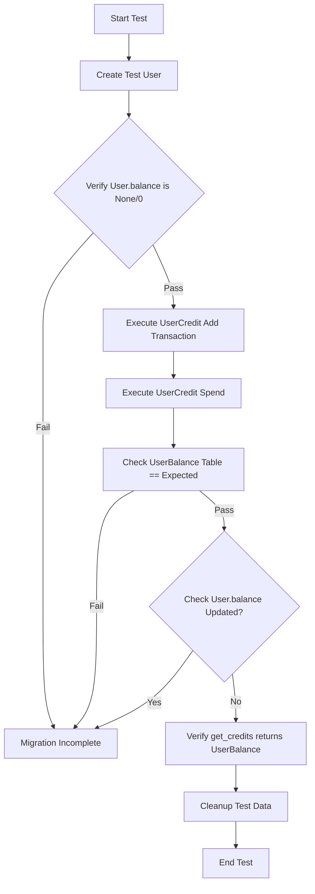
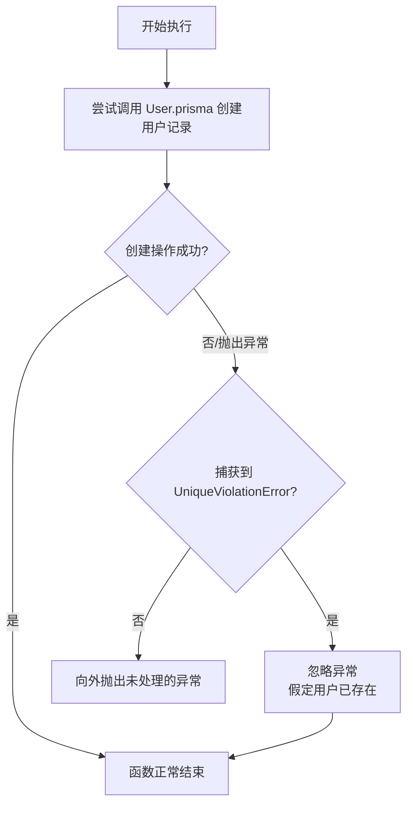
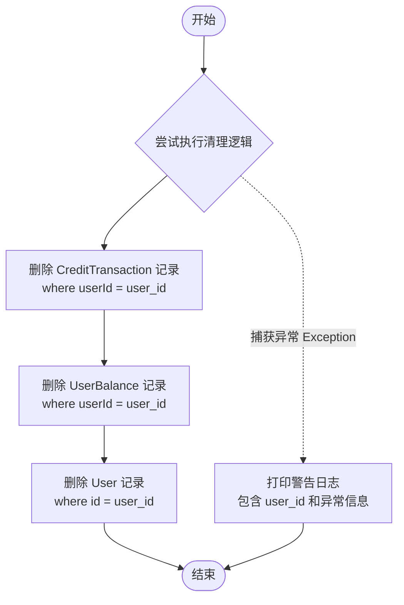
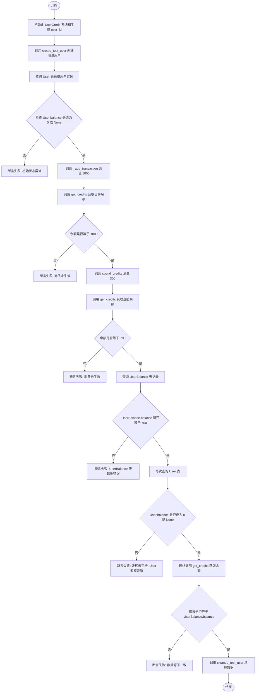
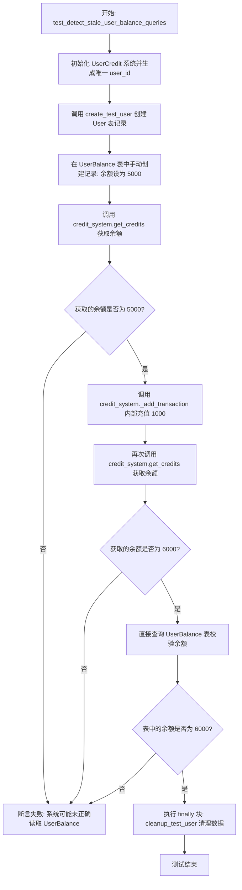
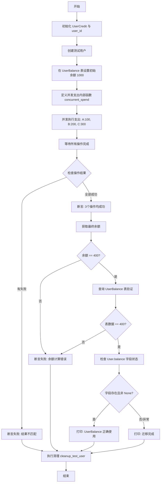

# `AutoGPT\autogpt_platform\backend\backend\data\credit_user_balance_migration_test.py` 详细设计文档

Integration test suite to verify the complete migration of user balance data from the User.balance column to a dedicated UserBalance table, ensuring data consistency, atomicity, and correct source of truth handling.

## 整体流程



## 类结构

```
No classes defined in this file
Global Functions:
├── create_test_user
├── cleanup_test_user
├── test_user_balance_migration_complete
├── test_detect_stale_user_balance_queries
└── test_concurrent_operations_use_userbalance_only
```

## 全局变量及字段


    

## 全局函数及方法


### `create_test_user`

用于迁移测试的辅助函数，负责创建具有指定ID、邮箱和名称的测试用户。如果用户已存在（违反唯一性约束），则静默继续，确保测试的可重复性。

参数：

-  `user_id`：`str`，要创建的测试用户的唯一标识符。

返回值：`None`，无返回值。

#### 流程图



#### 带注释源码

```python
async def create_test_user(user_id: str) -> None:
    """Create a test user for migration tests."""
    try:
        # 尝试在数据库中创建一个新的 User 记录
        # 数据包含 ID、自动生成的邮箱和名称
        await User.prisma().create(
            data={
                "id": user_id,
                "email": f"test-{user_id}@example.com",
                "name": f"Test User {user_id[:8]}",
            }
        )
    except UniqueViolationError:
        # 如果捕获到唯一性约束违反错误，说明该用户 ID 已存在
        # 捕获该异常以防止测试失败，允许后续逻辑继续（幂等性处理）
        # User already exists, continue
        pass
```


### `cleanup_test_user`

该函数用于清理测试数据，通过删除与指定用户ID关联的信用交易记录、用户余额记录以及用户记录本身，来确保测试环境的干净。它捕获所有异常以防止清理失败导致测试用例本身报错中断。

参数：

- `user_id`：`str`，需要清理的测试用户的唯一标识符。

返回值：`None`，无返回值，主要执行数据库的删除操作。

#### 流程图



#### 带注释源码

```python
async def cleanup_test_user(user_id: str) -> None:
    """Clean up test user and their data."""
    try:
        # 1. 删除该用户相关的所有信用交易记录
        await CreditTransaction.prisma().delete_many(where={"userId": user_id})
        # 2. 删除该用户的余额记录
        await UserBalance.prisma().delete_many(where={"userId": user_id})
        # 3. 删除该用户的基本信息记录
        await User.prisma().delete_many(where={"id": user_id})
    except Exception as e:
        # 4. 异常处理：记录清理失败日志，但不抛出异常，避免影响测试结果
        # Log cleanup failures but don't fail the test
        print(f"Warning: Failed to cleanup test user {user_id}: {e}")
```


### `test_user_balance_migration_complete`

这是一个集成测试函数，用于验证系统是否已完全从 `User.balance` 迁移到 `UserBalance` 表。它通过执行充值和消费操作，确保所有业务逻辑仅更新 `UserBalance` 表，并断言 `User` 表中的余额字段从未被修改，从而保证 `UserBalance` 作为唯一事实来源。

参数：

-  `server`：`SpinTestServer`，测试服务器的实例，由 pytest fixture 提供，用于在测试环境中运行代码。

返回值：`None`，该函数为异步测试函数，没有返回值。

#### 流程图



#### 带注释源码

```python
@pytest.mark.asyncio(loop_scope="session")
async def test_user_balance_migration_complete(server: SpinTestServer):
    """Test that User table balance is never used and UserBalance is source of truth."""
    # 初始化信用系统
    credit_system = UserCredit()
    # 生成唯一的测试用户ID
    user_id = f"migration-test-{datetime.now().timestamp()}"
    # 创建测试用户数据
    await create_test_user(user_id)

    try:
        # 1. 验证初始状态下 User 表没有设置余额
        user = await User.prisma().find_unique(where={"id": user_id})
        assert user is not None
        # 获取 User.balance 属性，默认为 None
        user_balance_attr = getattr(user, "balance", None)
        if user_balance_attr is not None:
            # 如果存在，必须为 0，否则测试失败
            assert (
                user_balance_attr == 0 or user_balance_attr is None
            ), f"User.balance should be 0 or None, got {user_balance_attr}"

        # 2. 执行各种信用操作（使用内部方法绕过 Stripe）
        # 充值 1000
        await credit_system._add_transaction(
            user_id=user_id,
            amount=1000,
            transaction_type=CreditTransactionType.TOP_UP,
            metadata=SafeJson({"test": "migration_test"}),
        )
        # 检查余额是否为 1000
        balance1 = await credit_system.get_credits(user_id)
        assert balance1 == 1000

        # 消费 300
        await credit_system.spend_credits(
            user_id,
            300,
            UsageTransactionMetadata(
                graph_exec_id="test", reason="Migration test spend"
            ),
        )
        # 检查余额是否为 700
        balance2 = await credit_system.get_credits(user_id)
        assert balance2 == 700

        # 3. 验证 UserBalance 表拥有正确的值
        user_balance = await UserBalance.prisma().find_unique(where={"userId": user_id})
        assert user_balance is not None
        assert (
            user_balance.balance == 700
        ), f"UserBalance should be 700, got {user_balance.balance}"

        # 4. 关键验证：确认 User.balance 在操作过程中从未被更新
        user_after = await User.prisma().find_unique(where={"id": user_id})
        assert user_after is not None
        user_balance_after = getattr(user_after, "balance", None)
        if user_balance_after is not None:
            # 如果 User.balance 字段存在，它应该保持为 0（从未被更新过）
            assert (
                user_balance_after == 0 or user_balance_after is None
            ), f"User.balance should remain 0/None after operations, got {user_balance_after}. This indicates User.balance is still being used!"

        # 5. 验证 get_credits 始终返回 UserBalance 的值，而不是 User.balance
        final_balance = await credit_system.get_credits(user_id)
        assert (
            final_balance == user_balance.balance
        ), f"get_credits should return UserBalance value {user_balance.balance}, got {final_balance}"

    finally:
        # 无论测试成功与否，清理测试用户数据
        await cleanup_test_user(user_id)
```


### `test_detect_stale_user_balance_queries`

该函数用于集成测试，旨在检测系统中是否存在仍使用旧的 `User.balance` 字段而非新的 `UserBalance` 表的操作，确保余额读取和数据源的正确性。

参数：

- `server`：`SpinTestServer`，用于运行集成测试的测试服务器实例。

返回值：`None`，无返回值，函数通过断言验证逻辑正确性，若验证失败则抛出异常。

#### 流程图



#### 带注释源码

```python
@pytest.mark.asyncio(loop_scope="session")
async def test_detect_stale_user_balance_queries(server: SpinTestServer):
    """Test to detect if any operations are still using User.balance instead of UserBalance."""
    # 初始化信用系统对象
    credit_system = UserCredit()
    # 生成唯一的测试用户ID，基于当前时间戳
    user_id = f"stale-query-test-{datetime.now().timestamp()}"
    # 创建基础用户数据（User表）
    await create_test_user(user_id)

    try:
        # 核心步骤：在 UserBalance 表中创建一个特定的余额记录 (5000)
        # 模拟已经迁移或存在的 UserBalance 数据
        await UserBalance.prisma().create(
            data={"userId": user_id, "balance": 5000}  # $50
        )

        # 验证 get_credits 方法返回的是 UserBalance 的值 (5000)
        # 而不是任何可能陈旧的 User.balance 值
        balance = await credit_system.get_credits(user_id)
        assert (
            balance == 5000
        ), f"Expected get_credits to return 5000 from UserBalance, got {balance}"

        # 使用内部方法绕过 Stripe 直接进行信用交易，验证所有操作均使用 UserBalance
        await credit_system._add_transaction(
            user_id=user_id,
            amount=1000,
            transaction_type=CreditTransactionType.TOP_UP,
            metadata=SafeJson({"test": "final_verification"}),
        )
        # 获取更新后的余额
        final_balance = await credit_system.get_credits(user_id)
        assert final_balance == 6000, f"Expected 6000, got {final_balance}"

        # 直接查询 UserBalance 表以验证数据库中的实际值
        user_balance = await UserBalance.prisma().find_unique(where={"userId": user_id})
        assert user_balance is not None
        assert (
            user_balance.balance == 6000
        ), f"UserBalance should be 6000, got {user_balance.balance}"

    finally:
        # 无论测试成功与否，最终都清理测试用户数据
        await cleanup_test_user(user_id)
```


### `test_concurrent_operations_use_userbalance_only`

该函数是一个集成测试，旨在验证在并发场景下，系统对用户余额的操作完全基于 `UserBalance` 表及其锁定机制，而不是使用过时的 `User.balance` 字段，确保并发扣减操作后的余额准确性和数据一致性。

参数：

-  `server`：`SpinTestServer`，由 pytest fixture 提供的测试服务器实例，用于在测试环境中运行服务。

返回值：`None`，无返回值（异步测试函数）。

#### 流程图



#### 带注释源码

```python
@pytest.mark.asyncio(loop_scope="session")
async def test_concurrent_operations_use_userbalance_only(server: SpinTestServer):
    """Test that concurrent operations all use UserBalance locking, not User.balance."""
    # 初始化信用系统
    credit_system = UserCredit()
    # 生成唯一的测试用户ID
    user_id = f"concurrent-userbalance-test-{datetime.now().timestamp()}"
    # 创建测试用户
    await create_test_user(user_id)

    try:
        # 在 UserBalance 表中设置初始余额为 1000
        await UserBalance.prisma().create(data={"userId": user_id, "balance": 1000})

        # 定义并发扣款操作的异步函数
        async def concurrent_spend(amount: int, label: str):
            try:
                # 调用 spend_credits 执行扣款，附带事务元数据
                await credit_system.spend_credits(
                    user_id,
                    amount,
                    UsageTransactionMetadata(
                        graph_exec_id=f"concurrent-{label}",
                        reason=f"Concurrent test {label}",
                    ),
                )
                return f"{label}-SUCCESS"
            except Exception as e:
                return f"{label}-FAILED: {e}"

        # 使用 asyncio.gather 并发执行三个扣款操作：100, 200, 300
        # 总扣款金额为 600，初始 1000 应该足够
        results = await asyncio.gather(
            concurrent_spend(100, "A"),
            concurrent_spend(200, "B"),
            concurrent_spend(300, "C"),
            return_exceptions=True,
        )

        # 验证所有操作均成功
        successful = [r for r in results if "SUCCESS" in str(r)]
        assert len(successful) == 3, f"All operations should succeed, got {results}"

        # 验证最终余额应为 1000 - 600 = 400
        final_balance = await credit_system.get_credits(user_id)
        assert final_balance == 400, f"Expected final balance 400, got {final_balance}"

        # 验证 UserBalance 表中的数据确实为 400
        user_balance = await UserBalance.prisma().find_unique(where={"userId": user_id})
        assert user_balance is not None
        assert (
            user_balance.balance == 400
        ), f"UserBalance should be 400, got {user_balance.balance}"

        # 关键检查：确认 User.balance 没有被错误使用
        try:
            user = await User.prisma().find_unique(where={"id": user_id})
            user_balance_attr = getattr(user, "balance", None)
            if user_balance_attr is not None:
                # 如果 User.balance 字段存在，确认它未被更新或使用，因为 UserBalance 才是单一事实来源
                print(
                    f"✅ User.balance exists ({user_balance_attr}) but UserBalance ({user_balance.balance}) is being used correctly"
                )
        except Exception:
            # 如果获取 User.balance 报错（字段不存在），说明迁移彻底完成
            print("✅ User.balance column doesn't exist - migration is complete")

    finally:
        # 无论测试结果如何，都清理测试用户数据
        await cleanup_test_user(user_id)
```


## 关键组件


### UserCredit

负责执行积分增加、消费及查询的核心服务类，确保所有操作逻辑基于 UserBalance 表而非 User 表的旧字段。

### UserBalance

专门用于存储用户余额的数据模型，是系统中用户积分数据的唯一真实来源。

### CreditTransaction

积分交易流水的数据模型，用于持久化记录所有类型的积分变动（如充值、消费）以供审计。

### UsageTransactionMetadata

封装积分消费上下文信息的结构体，包含图执行ID（graph_exec_id）和操作原因等元数据。

### User

用户基础实体模型，其中包含的旧版 balance 字段在迁移后应保持未使用状态，数据需与 UserBalance 同步。


## 问题及建议


### 已知问题

-   **测试清理逻辑的静默失败风险**：`cleanup_test_user` 函数捕获了所有异常（`Exception`）并仅打印警告，而不抛出错误。如果清理失败（例如数据库连接问题或外键约束），可能会导致测试数据库中残留脏数据，影响后续测试的隔离性。
-   **依赖私有方法进行测试**：测试代码直接调用了 `credit_system._add_transaction`（以下划线开头的私有方法）。这违反了封装原则，使得测试用例与内部实现细节强耦合，一旦内部实现重构，测试将容易失败。
-   **用户ID生成策略存在冲突风险**：使用 `datetime.now().timestamp()` 生成用户ID后缀依赖于系统时间精度和执行速度。在极高并发测试场景或快速循环执行下，理论上存在生成重复ID的风险，导致测试数据污染。
-   **硬编码的魔法数值**：测试代码中使用了大量的硬编码数值（如 `1000`, `300`, `5000`, `700` 等）。这些“魔法数字”降低了代码的可读性，且在调整业务逻辑阈值时难以统一维护。

### 优化建议

-   **引入 Pytest Fixture 管理资源**：建议将 `create_test_user` 和 `cleanup_test_user` 的逻辑重构为标准的 `@pytest.fixture`（带有 `yield`），利用 Pytest 的依赖注入和自动生命周期管理机制，使测试代码更简洁且资源释放更可靠。
-   **优化并发测试的异常判断**：在 `test_concurrent_operations_use_userbalance_only` 中，判断结果是否成功时使用了字符串包含检查（`"SUCCESS" in str(r)`）。建议改为直接检查返回值类型或特定异常对象（如 `isinstance(r, Exception)`），以提高判断的准确性和鲁棒性。
-   **使用标准库生成唯一标识符**：建议使用 Python 标准库 `uuid` 来生成唯一的测试用户 ID，替代基于时间戳的字符串拼接，确保全局唯一性且代码语义更清晰。
-   **提取测试常量**：将测试中用到的充值金额、消耗金额等定义为常量（如 `INITIAL_BALANCE = 1000`），或者使用 `@pytest.mark.parametrize` 进行参数化测试，以覆盖更多边界场景并提高代码可维护性。
-   **增强断言信息**：尽管当前代码已有部分断言信息，建议进一步标准化错误输出格式，例如在验证 `User.balance` 未被使用时，明确输出旧字段的值与新字段的值对比，以便快速定位迁移失败的原因。


## 其它


### 设计目标与约束

**设计目标：**
该测试套件的核心设计目标是全面验证从 `User.balance` 字段到独立 `UserBalance` 表的数据迁移已完成且系统行为符合预期。具体目标包括：
1.  **唯一数据源验证**：确保系统不再依赖 `User` 表中的 `balance` 字段，所有余额读写操作均指向 `UserBalance` 表。
2.  **数据一致性**：验证在充值、消费等操作下，`UserBalance` 表的数据始终是准确的，且与系统返回的余额 (`get_credits`) 保持一致。
3.  **存量数据隔离**：确认即使数据库中仍存在 `User.balance` 字段，系统逻辑也不会对其进行修改。

**约束条件：**
1.  **测试隔离性**：每个测试用例必须使用唯一的 `user_id`，并确保测试完成后数据被清理，不影响后续测试。
2.  **原子性约束**：系统必须保证在高并发场景下，余额扣减操作是原子的，不能出现超扣或数据竞争。
3.  **幂等性处理**：辅助函数（如 `create_test_user`）需支持重复调用而不报错，以适应测试框架的潜在重试机制。

### 错误处理与异常设计

**异常捕获与处理策略：**
1.  **资源创建冲突处理**：在 `create_test_user` 函数中，显式捕获 `prisma.errors.UniqueViolationError`。当用户 ID 已存在时，捕获异常并忽略，视为用户已就绪，防止因唯一键冲突导致测试中断。
2.  **资源清理容错**：在 `cleanup_test_user` 函数中，使用通用的 `Exception` 捕获所有清理过程中的错误（如数据库连接中断、记录已被删除等）。清理失败仅打印警告日志 (`print`)，而不抛出异常 (`raise`)，确保测试结果仅由核心测试逻辑决定。
3.  **业务逻辑断言**：测试核心路径不捕获业务异常。若 `UserCredit` 系统抛出异常或断言（`assert`）失败（如发现 `User.balance` 被意外更新），测试应立即失败并报错，以暴露系统缺陷。

### 外部依赖与接口契约

**外部依赖组件：**
1.  **数据库层**：依赖 `Prisma ORM` 进行数据持久化。主要操作模型包括 `User`, `UserBalance`, 和 `CreditTransaction`。
2.  **业务逻辑层**：依赖 `backend.data.credit.UserCredit` 类。这是被测试的核心组件，提供了 `get_credits`（查询余额）、`spend_credits`（消费积分）和 `_add_transaction`（内部添加交易）等关键接口。
3.  **测试基础设施**：依赖 `pytest` 框架及其异步插件 (`pytest.mark.asyncio`)，以及 `SpinTestServer` 用于提供模拟的服务器运行环境。

**接口契约：**
*   **UserCredit._add_transaction**：契约规定调用此方法将导致 `UserBalance` 表余额增加，且必须生成对应的 `CreditTransaction` 记录。
*   **UserCredit.spend_credits**：契约规定此方法需处理并发扣减，若余额不足应抛出特定异常，成功则更新 `UserBalance`。
*   **数据库模型契约**：`UserBalance` 表被定义为余额的唯一真实来源。测试隐含的契约是 `User` 模型即使包含 `balance` 属性，该属性也应被视为“废弃”或“只读”的。

### 数据流与状态机

**数据流转过程：**
1.  **初始化阶段**：数据流始于 `create_test_user`，创建 `User` 记录。此时 `UserBalance` 记录可能不存在或为零，`User.balance` 必须为 0 或 None。
2.  **操作阶段**：
    *   **充值流**：调用 `_add_transaction` -> 数据写入 `CreditTransaction` -> `UserBalance.balance` 增加。
    *   **消费流**：调用 `spend_credits` -> 检查余额 -> `UserBalance.balance` 减少 -> 写入消费记录。
3.  **验证阶段**：通过 `get_credits` 读取当前状态，同时直接查询数据库 (`UserBalance.prisma().find_unique`) 进行比对。

**状态转换：**
*   **Initial State (初始态)**: `UserBalance` 余额 = 0 或初始值，`User.balance` = 0。
*   **Transaction State (交易态)**: 系统处理 TopUp 或 Spend 操作，数据处于事务中。
*   **Consistent State (一致态)**: 事务提交后，`UserBalance.balance` 更新为新值，且 `get_credits` 返回值与之匹配。`User.balance` 保持不变。

### 并发与一致性控制

**并发测试设计：**
在 `test_concurrent_operations_use_userbalance_only` 测试中，设计了专门的状态机来验证并发控制能力。

*   **并发场景**：使用 `asyncio.gather` 同时发起三个消费任务（100, 200, 300），初始余额为 1000。
*   **一致性要求**：
    1.  **最终一致性**：无论并发执行顺序如何，最终余额必须严格等于 `1000 - (100 + 200 + 300) = 400`。
    2.  **隔离性**：所有操作必须在数据库层面施加锁或使用乐观并发控制，防止“丢失更新”问题。
*   **验证逻辑**：测试不仅验证最终结果数值的正确性，还通过检查 `User.balance` 是否被并发写入来隔离错误来源。如果 `User.balance` 在并发过程中发生变化，说明系统存在脏写或错误字段依赖。

    