# `.\AutoGPT\autogpt_platform\backend\backend\data\db.py` 详细设计文档

This code provides a database connection management system using Prisma, including connection setup, transaction handling, and schema extraction.

## 整体流程

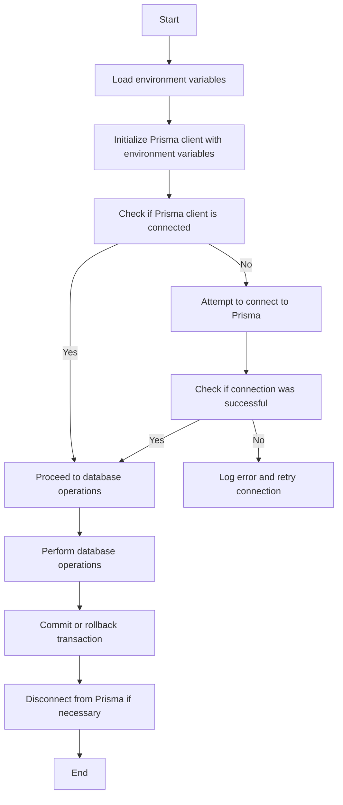

## 类结构

```
BaseDbModel (Base Model)
├── Prisma (Database Client)
│   ├── connect (async function)
│   ├── disconnect (async function)
│   ├── is_connected (function)
│   ├── tx (async contextmanager)
│   └── ...
└── Database Utilities (Functions)
    ├── add_param (function)
    ├── get_database_schema (function)
    ├── _raw_with_schema (async function)
    ├── query_raw_with_schema (async function)
    └── execute_raw_with_schema (async function)
```

## 全局变量及字段


### `PRISMA_SCHEMA`
    
The Prisma schema file path.

类型：`str`
    


### `DATABASE_URL`
    
The database connection URL.

类型：`str`
    


### `CONN_LIMIT`
    
The database connection limit.

类型：`str`
    


### `CONN_TIMEOUT`
    
The database connection timeout.

类型：`str`
    


### `POOL_TIMEOUT`
    
The database connection pool timeout.

类型：`str`
    


### `HTTP_TIMEOUT`
    
The HTTP request timeout, derived from POOL_TIMEOUT.

类型：`int`
    


### `prisma`
    
The Prisma client instance.

类型：`Prisma`
    


### `logger`
    
The logger instance for logging purposes.

类型：`logging.Logger`
    


### `TRANSACTION_TIMEOUT`
    
The transaction timeout duration set to 30 seconds.

类型：`timedelta`
    


### `BaseDbModel.id`
    
The unique identifier for the model, generated using UUID4.

类型：`str`
    
    

## 全局函数及方法

### load_dotenv

该函数用于加载环境变量，从`.env`文件中读取环境变量并设置到当前环境中。

#### 参数

- 无

#### 返回值

- 无

#### 流程图

```mermaid
graph LR
A[load_dotenv()] --> B{设置环境变量}
B --> C[完成]
```

#### 带注释源码

```python
# 导入dotenv库
from dotenv import load_dotenv

# 加载环境变量
load_dotenv()
```

### os.getenv

获取环境变量的值。

#### 参数

- `key`：`str`，环境变量的键。

#### 返回值

- `str`，环境变量的值。

#### 流程图

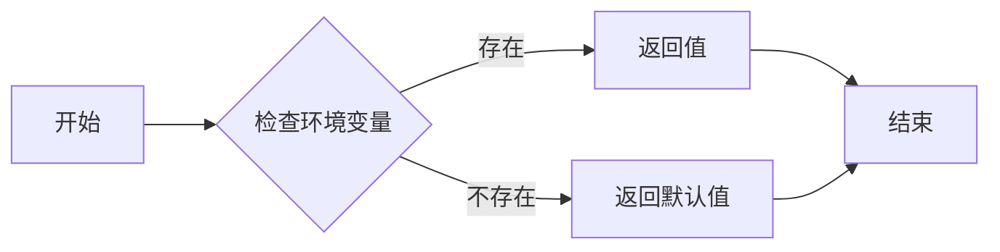

#### 带注释源码

```python
def os.getenv(key: str, default: str = None) -> str:
    """
    Get the value of an environment variable.

    Args:
        key: The key of the environment variable.
        default: The default value to return if the environment variable is not found.

    Returns:
        The value of the environment variable, or the default value if not found.
    """
    return os.environ.get(key, default)
```

### urlparse

解析URL并返回其组件。

参数：

- `url`：`str`，要解析的URL。

返回值：`ParseResult`，包含URL的各个组件。

#### 流程图

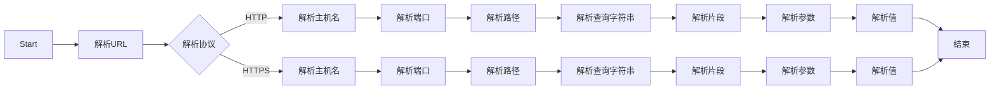

#### 带注释源码

```python
from urllib.parse import urlparse

def urlparse(url: str) -> ParseResult:
    """
    Parse a URL into components.

    Args:
        url: str, the URL to parse.

    Returns:
        ParseResult, containing the components of the URL.
    """
    return urlparse(url)
```

### parse_qsl

`parse_qsl` 是 `urllib.parse` 模块中的一个函数，用于解析 URL 查询字符串并将其转换为键值对列表。

#### 描述

解析 URL 查询字符串，返回一个列表，其中包含键值对元组。

#### 参数

- `query`: `str`，要解析的查询字符串。

#### 返回值

- `list`，包含键值对元组的列表。

#### 流程图

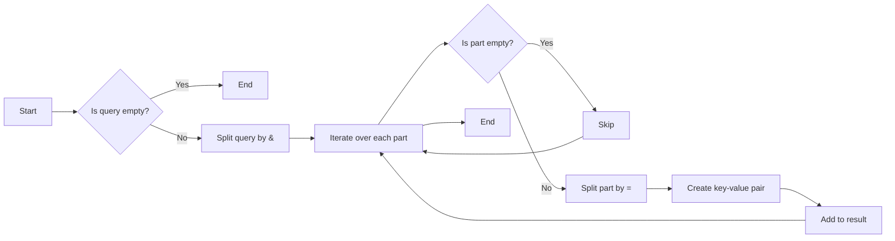

#### 带注释源码

```python
from urllib.parse import parse_qsl

def parse_qsl(query: str) -> list:
    """
    Parse a query string into a list of key-value pairs.

    Args:
        query: str, the query string to parse.

    Returns:
        list, a list of key-value pairs.
    """
    return parse_qsl(query)
```

### add_param

This function appends a query parameter to a URL.

#### 参数

- `url`：`str`，The URL to which the parameter will be added.
- `key`：`str`，The key of the query parameter.
- `value`：`str`，The value of the query parameter.

#### 返回值

- `str`：The URL with the added query parameter.

#### 流程图

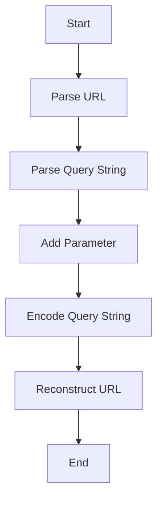

#### 带注释源码

```python
def add_param(url: str, key: str, value: str) -> str:
    p = urlparse(url)
    qs = dict(parse_qsl(p.query))
    qs[key] = value
    return urlunparse(p._replace(query=urlencode(qs)))
```

### urlunparse

`urlunparse` 是一个全局函数，用于将 URL 组件重新组合成一个完整的 URL 字符串。

#### 描述

`urlunparse` 函数将 URL 的各个组件（协议、主机、端口、路径、查询和片段）组合成一个完整的 URL 字符串。

#### 参数

- `scheme`：URL 的协议部分，例如 "http" 或 "https"。
- `netloc`：网络位置部分，通常是域名。
- `path`：路径部分，表示从根目录到资源的位置。
- `params`：查询参数部分，通常以键值对形式出现。
- `query`：查询字符串部分，通常包含多个键值对。
- `fragment`：片段标识符部分，通常用于定位页面中的某个部分。

#### 返回值

- 返回一个字符串，表示重新组合后的完整 URL。

#### 流程图

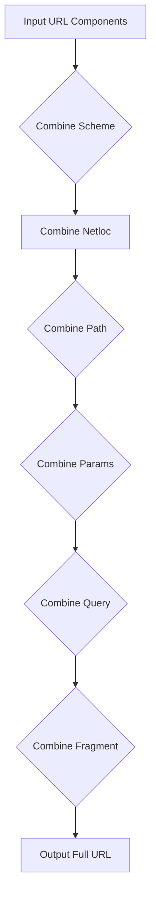

#### 带注释源码

```python
from urllib.parse import urlparse, urlunparse

def urlunparse(scheme: str, netloc: str, path: str, params: str, query: str, fragment: str) -> str:
    """
    Reconstructs a URL from its components.

    :param scheme: The scheme part of the URL (e.g., "http", "https").
    :param netloc: The network location part of the URL (e.g., "www.example.com").
    :param path: The path part of the URL (e.g., "/").
    :param params: The parameters part of the URL (e.g., "a=b").
    :param query: The query part of the URL (e.g., "key=value").
    :param fragment: The fragment part of the URL (e.g., "#section").
    :return: A string representing the reconstructed URL.
    """
    return urlunparse((scheme, netloc, path, params, query, fragment))
```


### `uuid4`

生成一个唯一的UUID字符串。

参数：

- 无

返回值：`str`，一个唯一的UUID字符串

#### 流程图

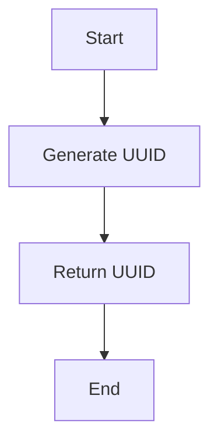

#### 带注释源码

```python
from uuid import uuid4

def uuid4():
    # Generate a unique UUID string
    return str(uuid4())
```


### conn_retry

The `conn_retry` function is a decorator that retries a function if it fails due to connection issues with Prisma.

#### 参数

- `name`: `str`，The name of the Prisma client that is being used.
- `action`: `str`，The action being performed (e.g., "Acquiring connection" or "Releasing connection").

#### 返回值

- `None`：The function being decorated is executed.

#### 流程图

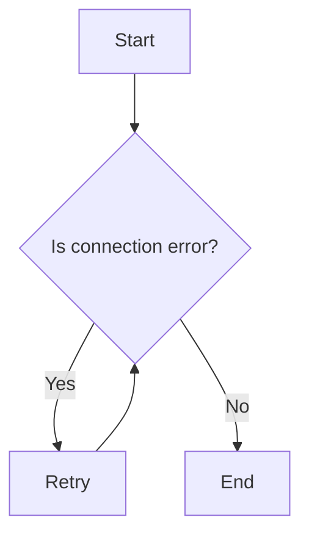

#### 带注释源码

```python
from functools import wraps
from prisma.exceptions import PrismaError

def conn_retry(name: str, action: str):
    def decorator(func):
        @wraps(func)
        async def wrapper(*args, **kwargs):
            retries = 0
            while True:
                try:
                    return await func(*args, **kwargs)
                except PrismaError as e:
                    if "ConnectionError" in str(e) and retries < 3:
                        retries += 1
                        logger.warning(f"{action} failed for {name}, retrying ({retries}/3): {e}")
                        await asyncio.sleep(1)
                    else:
                        raise
        return wrapper
    return decorator
```

### `transaction`

Create a database transaction with optional timeout.

参数：

- `timeout`：`timedelta`，Transaction timeout as a timedelta. Defaults to `TRANSACTION_TIMEOUT` (30s).

返回值：`PrismaClient`，The Prisma client within the transaction.

#### 流程图

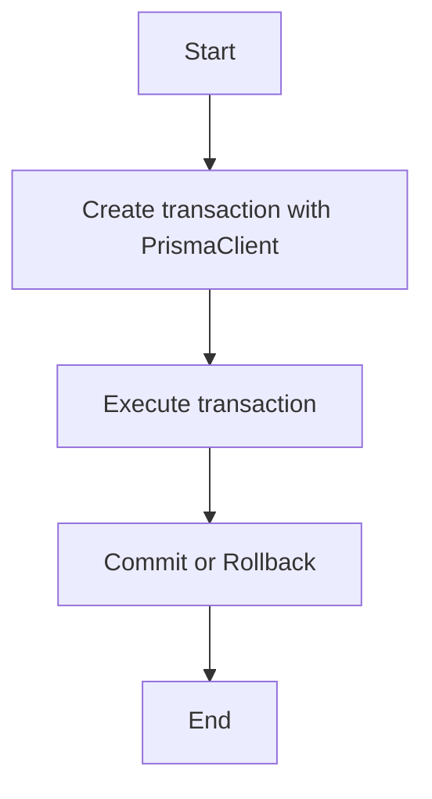

#### 带注释源码

```python
@asynccontextmanager
async def transaction(timeout: timedelta = TRANSACTION_TIMEOUT):
    """
    Create a database transaction with optional timeout.

    Args:
        timeout: Transaction timeout as a timedelta.
            Defaults to `TRANSACTION_TIMEOUT` (30s).
    """
    async with prisma.tx(timeout=timeout) as tx:
        yield tx
```

### timedelta

The `timedelta` function is a built-in Python function that represents the difference between two dates or times.

#### 参数

- `days`：`int`，表示天数。
- `seconds`：`int`，表示秒数。
- `microseconds`：`int`，表示微秒数。
- `milliseconds`：`int`，表示毫秒数。
- `minutes`：`int`，表示分钟数。
- `hours`：`int`，表示小时数。
- `weeks`：`int`，表示周数。

#### 返回值

- `timedelta`对象，表示两个日期或时间的差异。

#### 流程图

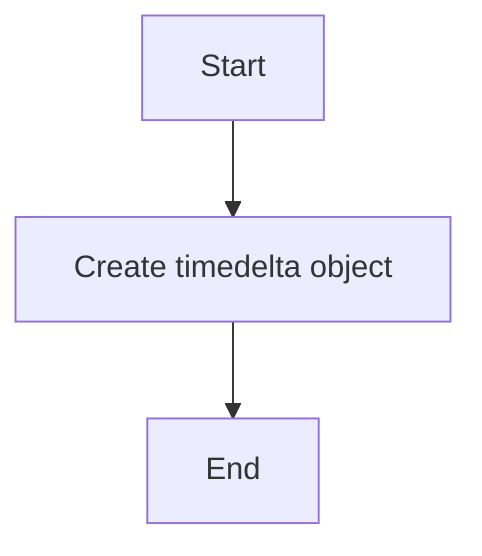

#### 带注释源码

```python
from datetime import timedelta

def timedelta(days=0, seconds=0, microseconds=0, milliseconds=0, minutes=0, hours=0, weeks=0):
    """
    Return a new timedelta instance with the specified difference.

    Args:
        days (int): Number of days.
        seconds (int): Number of seconds.
        microseconds (int): Number of microseconds.
        milliseconds (int): Number of milliseconds.
        minutes (int): Number of minutes.
        hours (int): Number of hours.
        weeks (int): Number of weeks.

    Returns:
        timedelta: A new timedelta instance.
    """
    return timedelta(days=days, seconds=seconds, microseconds=microseconds, milliseconds=milliseconds, minutes=minutes, hours=hours, weeks=weeks)
```


### `get_database_schema()`

Extract database schema from `DATABASE_URL`.

参数：

- 无

返回值：`str`，The database schema name extracted from `DATABASE_URL`.

#### 流程图

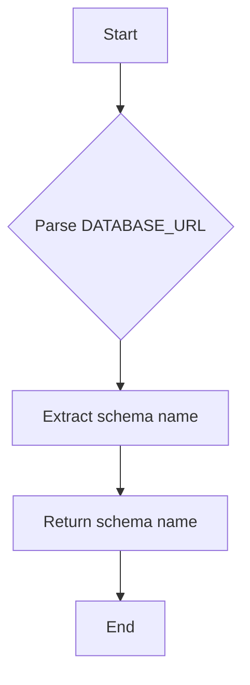

#### 带注释源码

```python
def get_database_schema() -> str:
    """Extract database schema from DATABASE_URL."""
    parsed_url = urlparse(DATABASE_URL)
    query_params = dict(parse_qsl(parsed_url.query))
    return query_params.get("schema", "public")
```


### _raw_with_schema

Internal: Execute raw SQL with proper schema handling.

参数：

- `query_template`：`str`，SQL查询模板，包含 `{schema_prefix}` 和/或 `{schema}` 占位符
- `*args`：查询参数
- `execute`：`bool`，如果为 `False`，则执行 SELECT 查询。如果为 `True`，则执行 INSERT/UPDATE/DELETE。
- `client`：`Prisma | None`，可选的 Prisma 客户端，用于事务（仅在 `execute=True` 时使用）

返回值：`list[dict] | int`，如果 `execute=False`，则返回查询结果列表（字典）。如果 `execute=True`，则返回受影响的行数。

#### 流程图

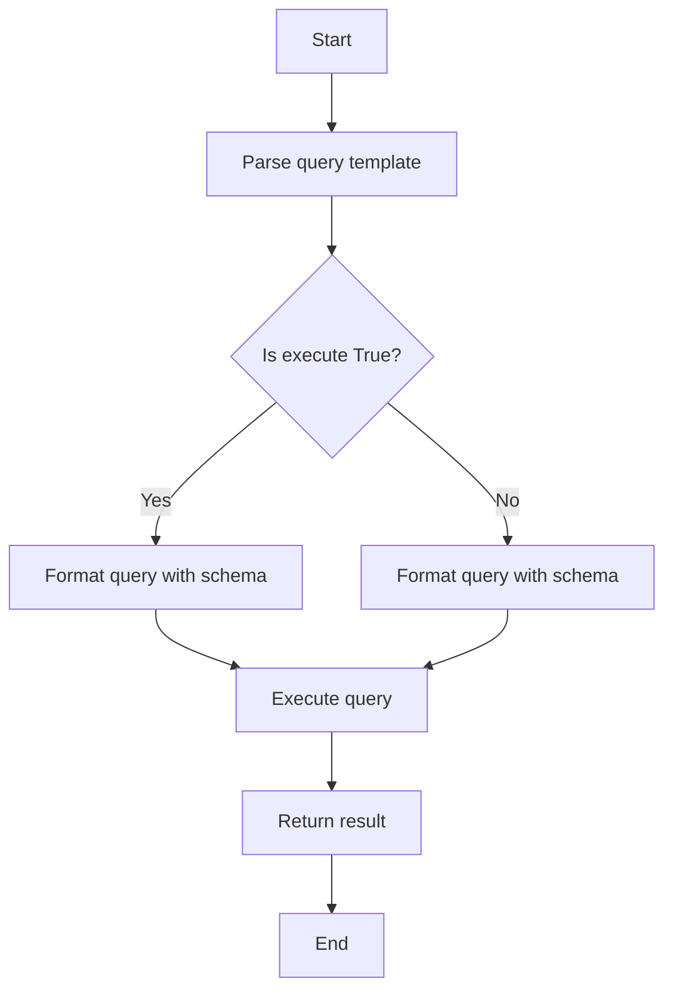

#### 带注释源码

```python
async def _raw_with_schema(
    query_template: str,
    *args,
    execute: bool = False,
    client: Prisma | None = None,
) -> list[dict] | int:
    """Internal: Execute raw SQL with proper schema handling.

    Args:
        query_template: SQL query with {schema_prefix} and/or {schema} placeholders
        *args: Query parameters
        execute: If False, executes SELECT query. If True, executes INSERT/UPDATE/DELETE.
        client: Optional Prisma client for transactions (only used when execute=True).

    Returns:
        - list[dict] if execute=False (query results)
        - int if execute=True (number of affected rows)
    """
    schema = get_database_schema()
    schema_prefix = f'"{schema}".' if schema != "public" else ""

    formatted_query = query_template.format(
        schema_prefix=schema_prefix,
        schema=schema,
    )

    db_client = client if client else prisma_module.get_client()

    if execute:
        result = await db_client.execute_raw(formatted_query, *args)  # type: ignore
    else:
        result = await db_client.query_raw(formatted_query, *args)  # type: ignore

    return result
```

### query_raw_with_schema

Execute raw SQL SELECT query with proper schema handling.

参数：

- `query_template`：`str`，SQL query with `{schema_prefix}` and/or `{schema}` placeholders
- `*args`：Query parameters

返回值：`list[dict]`，List of result rows as dictionaries

#### 流程图

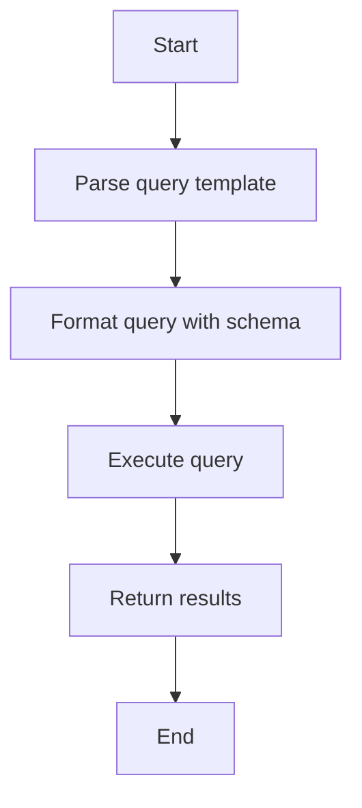

#### 带注释源码

```python
async def query_raw_with_schema(query_template: str, *args) -> list[dict]:
    """Execute raw SQL SELECT query with proper schema handling.

    Args:
        query_template: SQL query with {schema_prefix} and/or {schema} placeholders
        *args: Query parameters

    Returns:
        List of result rows as dictionaries

    Example:
        results = await query_raw_with_schema(
            'SELECT * FROM {schema_prefix}"User" WHERE id = $1',
            user_id
        )
    """
    return await _raw_with_schema(query_template, *args, execute=False)  # type: ignore
```


### `execute_raw_with_schema`

Execute raw SQL command (INSERT/UPDATE/DELETE) with proper schema handling.

参数：

- `query_template`：`str`，SQL query with `{schema_prefix}` and/or `{schema}` placeholders
- `*args`：Query parameters
- `client`：Optional Prisma client for transactions

返回值：`int`，Number of affected rows

#### 流程图

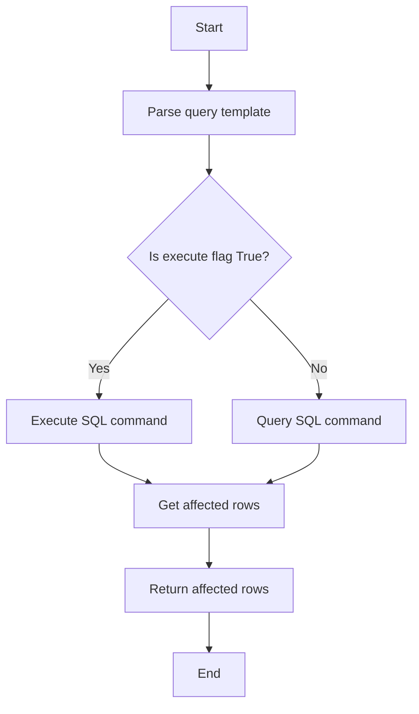

#### 带注释源码

```python
async def execute_raw_with_schema(
    query_template: str,
    *args,
    client: Prisma | None = None,
) -> int:
    """Execute raw SQL command (INSERT/UPDATE/DELETE) with proper schema handling.

    Args:
        query_template: SQL query with {schema_prefix} and/or {schema} placeholders
        *args: Query parameters
        client: Optional Prisma client for transactions

    Returns:
        Number of affected rows
    """
    return await _raw_with_schema(query_template, *args, execute=True, client=client)
``` 


### is_connected

检查Prisma数据库连接是否已建立。

参数：

- 无

返回值：`bool`，表示数据库连接是否已建立。

#### 流程图

```mermaid
graph TD
    A[Start] --> B{is_connected()}
    B -->|True| C[Connected]
    B -->|False| D[Not Connected]
    D --> E[End]
    C --> E
```

#### 带注释源码

```python
def is_connected():
    return prisma.is_connected()
```


### connect()

连接到Prisma数据库。

参数：

- 无

返回值：`None`，无返回值，但会更新Prisma客户端的连接状态。

#### 流程图

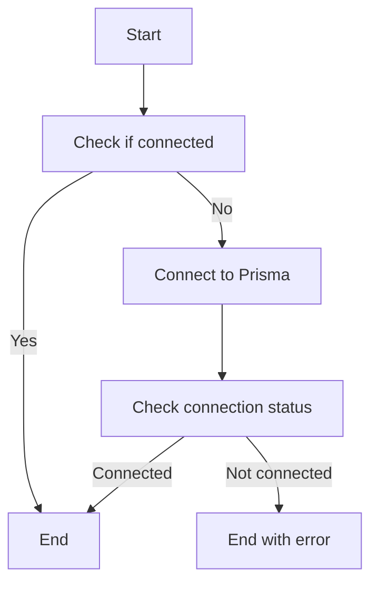

#### 带注释源码

```python
@conn_retry("Prisma", "Acquiring connection")
async def connect():
    if prisma.is_connected():
        return

    await prisma.connect()

    if not prisma.is_connected():
        raise ConnectionError("Failed to connect to Prisma.")
```


### `disconnect`

Disconnects the Prisma client from the database.

参数：

- `None`：无参数，该函数不需要任何参数。

返回值：`None`，该函数没有返回值。

#### 流程图

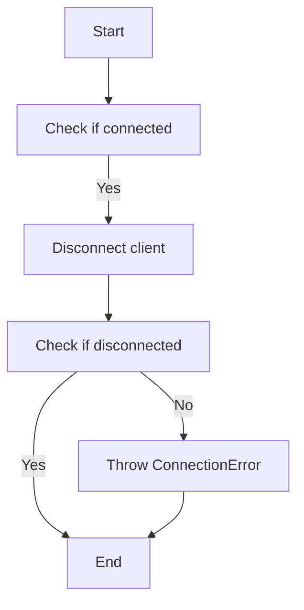

#### 带注释源码

```python
@conn_retry("Prisma", "Releasing connection")
async def disconnect():
    if not prisma.is_connected():
        return

    await prisma.disconnect()

    if prisma.is_connected():
        raise ConnectionError("Failed to disconnect from Prisma.")
```


### transaction

Create a database transaction with optional timeout.

参数：

- `timeout`：`timedelta`，Transaction timeout as a timedelta. Defaults to `TRANSACTION_TIMEOUT` (30s).

返回值：`Prisma`，The Prisma transaction object.

#### 流程图

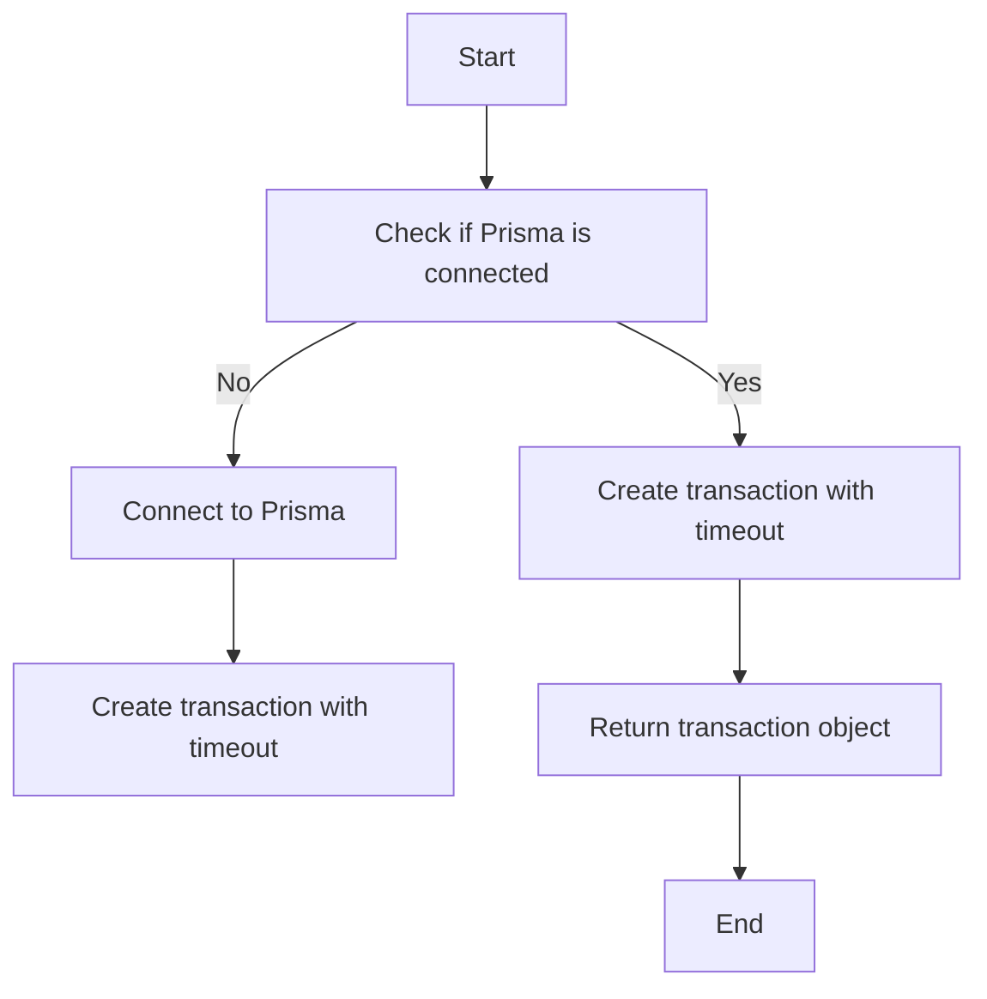

#### 带注释源码

```python
@asynccontextmanager
async def transaction(timeout: timedelta = TRANSACTION_TIMEOUT):
    """
    Create a database transaction with optional timeout.

    Args:
        timeout: Transaction timeout as a timedelta.
            Defaults to `TRANSACTION_TIMEOUT` (30s).
    """
    async with prisma.tx(timeout=timeout) as tx:
        yield tx
```


### BaseDbModel.set_model_id

This method sets the model ID for the BaseDbModel class. If an empty ID is provided, it generates a new UUID.

参数：

- `id`：`str`，The ID to be set for the model. If an empty string is provided, a new UUID is generated.

返回值：`str`，The ID set for the model.

#### 流程图

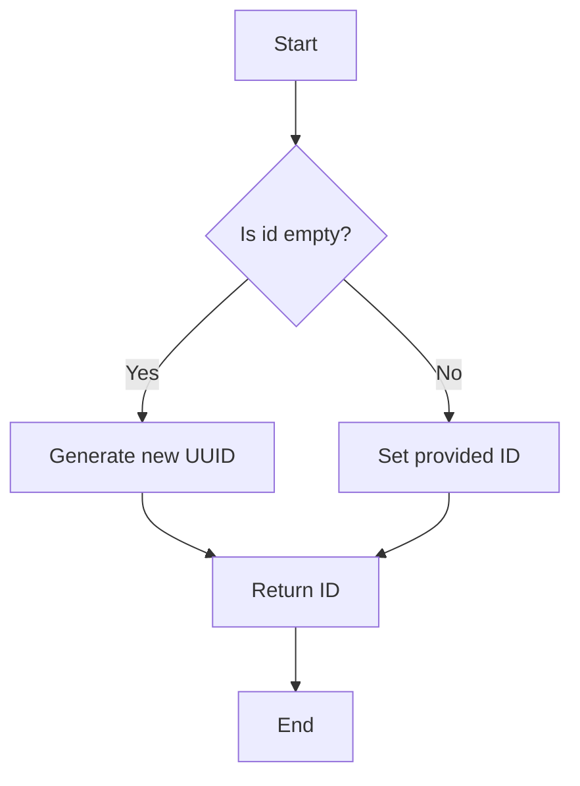

#### 带注释源码

```python
@field_validator("id", mode="before")
def set_model_id(cls, id: str) -> str:
    # In case an empty ID is submitted
    return id or str(uuid4())
```


### Prisma.connect

Prisma.connect 是一个用于连接 Prisma 数据库客户端的函数。

#### 描述

该函数用于创建一个 Prisma 客户端实例，该实例用于与 Prisma 数据库进行交互。它接受配置参数，如自动注册、HTTP 超时和数据源 URL。

#### 参数

- `auto_register`: `bool`，默认为 `True`。如果为 `True`，则自动注册所有模型。
- `http`: `dict`，包含 HTTP 配置，如超时。
- `datasource`: `dict`，包含数据源配置，如 URL。

#### 返回值

- `Prisma` 实例，用于与 Prisma 数据库进行交互。

#### 流程图

```mermaid
graph TD
    A[Start] --> B[Create Prisma instance]
    B --> C[Set auto_register]
    C --> D[Set http configuration]
    D --> E[Set datasource configuration]
    E --> F[Return Prisma instance]
    F --> G[End]
```

#### 带注释源码

```python
prisma = Prisma(
    auto_register=True,
    http={"timeout": HTTP_TIMEOUT},
    datasource={"url": DATABASE_URL},
)
```


### `Prisma.disconnect`

断开与Prisma数据库的连接。

参数：

- 无

返回值：`None`，无返回值

#### 流程图

```mermaid
graph TD
    A[开始] --> B[检查是否已连接]
    B -->|是| C[返回]
    B -->|否| D[断开连接]
    D --> E[检查是否成功断开]
    E -->|是| C[返回]
    E -->|否| F[抛出异常]
    F --> G[结束]
```

#### 带注释源码

```python
@conn_retry("Prisma", "Releasing connection")
async def disconnect():
    if not prisma.is_connected():
        return

    await prisma.disconnect()

    if prisma.is_connected():
        raise ConnectionError("Failed to disconnect from Prisma.")
```


### Prisma.is_connected

检查Prisma数据库连接是否已建立。

参数：

- 无

返回值：`bool`，表示连接是否已建立。

#### 流程图

```mermaid
graph TD
    A[Start] --> B{Is connected?}
    B -- Yes --> C[Connected]
    B -- No --> D[Not connected]
    C --> E[End]
    D --> E
```

#### 带注释源码

```python
def is_connected():
    return prisma.is_connected()
```


### transaction

Create a database transaction with optional timeout.

参数：

- `timeout`：`timedelta`，Transaction timeout as a timedelta. Defaults to `TRANSACTION_TIMEOUT` (30s).

返回值：`Prisma`，The Prisma client instance within the transaction.

#### 流程图

```mermaid
graph TD
    A[Start] --> B[Check if Prisma is connected]
    B -->|Yes| C[Create transaction with timeout]
    B -->|No| D[Connect to Prisma]
    C --> E[Execute transaction]
    E --> F[Commit or rollback transaction]
    F --> G[End]
```

#### 带注释源码

```python
@asynccontextmanager
async def transaction(timeout: timedelta = TRANSACTION_TIMEOUT):
    """
    Create a database transaction with optional timeout.

    Args:
        timeout: Transaction timeout as a timedelta.
            Defaults to `TRANSACTION_TIMEOUT` (30s).
    """
    async with prisma.tx(timeout=timeout) as tx:
        yield tx
```

## 关键组件


### 张量索引与惰性加载

张量索引与惰性加载是代码中用于高效处理大型数据集的关键组件，通过延迟加载和索引优化，减少内存消耗并提高查询效率。

### 反量化支持

反量化支持是代码中用于处理量化数据的关键组件，它允许对量化数据进行精确计算和转换，确保数据处理的准确性和一致性。

### 量化策略

量化策略是代码中用于优化数据存储和计算效率的关键组件，通过选择合适的量化方法，减少数据存储空间和计算资源消耗，同时保持数据精度。


## 问题及建议


### 已知问题

-   **环境变量依赖**: 代码依赖于环境变量来配置数据库连接和超时设置。如果环境变量未正确设置，可能会导致连接失败或配置错误。
-   **硬编码**: `PRISMA_SCHEMA` 和 `DATABASE_URL` 的默认值可能不适合所有环境，应该提供更灵活的配置方式。
-   **异常处理**: 代码中存在一些异常处理，但可能需要更详细的异常处理逻辑，以提供更清晰的错误信息。
-   **代码重复**: `add_param` 函数被多次调用，可以考虑将其封装成一个类方法或全局函数以减少代码重复。
-   **日志记录**: 代码中缺少详细的日志记录，这可能会在调试和监控时造成困难。

### 优化建议

-   **配置管理**: 引入配置管理库或自定义配置解析器，以更灵活地处理配置文件和环境变量。
-   **参数化配置**: 提供参数化配置选项，允许用户在部署时指定数据库连接和超时设置。
-   **增强异常处理**: 在关键操作中添加更详细的异常处理，并记录详细的错误信息。
-   **代码重构**: 将重复的 `add_param` 调用重构为类方法或全局函数。
-   **日志记录**: 增加日志记录，记录关键操作和潜在的错误，以便于调试和监控。
-   **代码测试**: 为代码编写单元测试，以确保代码质量和功能正确性。
-   **性能优化**: 分析数据库查询和操作，寻找可能的性能瓶颈，并进行优化。
-   **代码风格**: 确保代码遵循一致的代码风格指南，以提高代码可读性和可维护性。


## 其它


### 设计目标与约束

- 设计目标：
  - 提供一个通用的数据库操作接口，支持CRUD操作。
  - 支持异步操作，以适应高并发场景。
  - 提供灵活的查询和更新功能，支持SQL模板和参数化查询。
  - 确保数据库连接的安全性和稳定性。

- 约束：
  - 必须使用Prisma ORM进行数据库操作。
  - 需要处理数据库连接池配置和超时设置。
  - 需要支持环境变量配置，以便于在不同环境中部署。

### 错误处理与异常设计

- 错误处理：
  - 使用Prisma的异常处理机制，捕获并处理数据库操作相关的异常。
  - 自定义异常类，以便于更清晰地表达错误信息。
  - 在关键操作中添加异常捕获，确保程序的健壮性。

- 异常设计：
  - 定义自定义异常类，如`ConnectionError`，用于处理连接相关错误。
  - 使用`conn_retry`装饰器实现连接重试机制。

### 数据流与状态机

- 数据流：
  - 数据流从客户端传入，经过参数处理和SQL模板替换，最终发送到数据库执行。
  - 执行结果返回给客户端。

- 状态机：
  - 状态机用于管理数据库连接的生命周期，包括连接获取、使用和释放。

### 外部依赖与接口契约

- 外部依赖：
  - Prisma ORM：用于数据库操作。
  - Pydantic：用于数据验证和模型定义。
  - Python标准库：用于日志记录、环境变量处理等。

- 接口契约：
  - 提供统一的接口契约，确保代码的可维护性和可扩展性。
  - 使用类型注解和Pydantic模型定义数据结构。


    