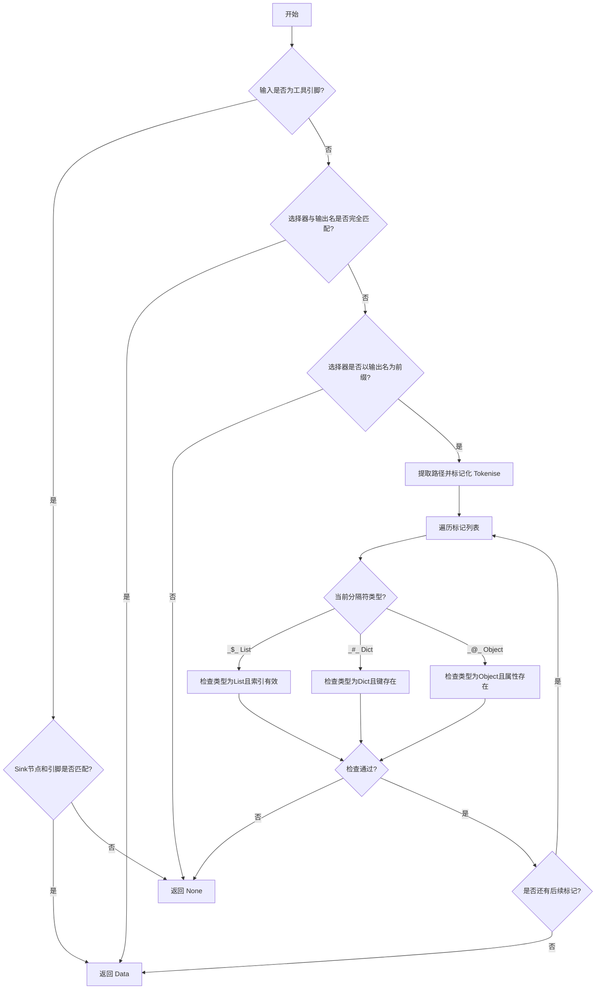
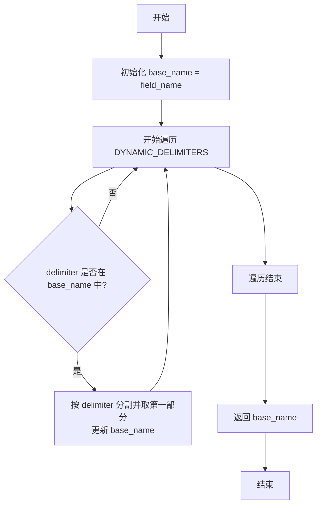
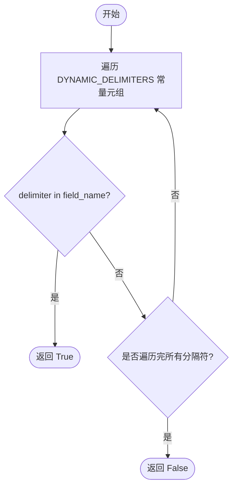
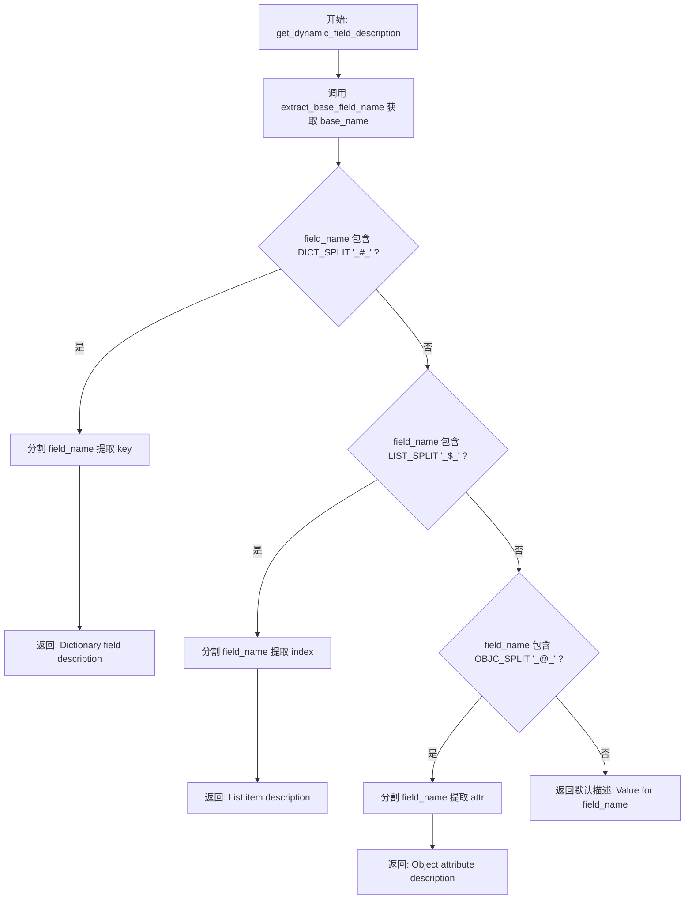
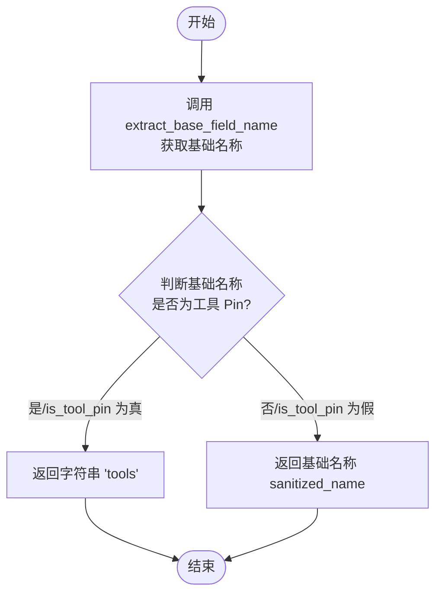
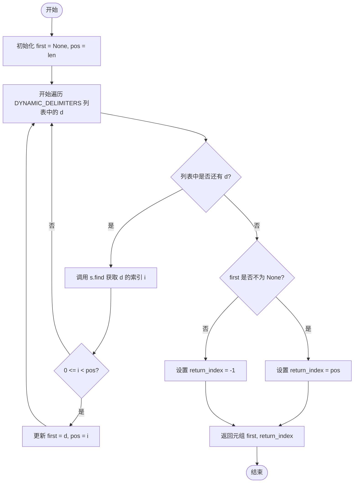

# `AutoGPT\autogpt_platform\backend\backend\data\dynamic_fields.py` 详细设计文档

该模块提供了一套用于处理动态字段名的实用工具，通过特定的分隔符（_$_, _#_, _@_）来表示对列表索引、字典键和对象属性的访问。它支持从扁平化的键名中解析嵌套数据结构，以及在节点图执行上下文中处理特殊的工具引脚路由和输出选择。

## 整体流程



## 类结构

```
Module: dynamic_fields
├── Constants (常量)
│   ├── LIST_SPLIT
│   ├── DICT_SPLIT
│   ├── OBJC_SPLIT
│   └── DYNAMIC_DELIMITERS
├── Field Inspection (字段检查)
│   ├── extract_base_field_name
│   ├── is_dynamic_field
│   └── get_dynamic_field_description
├── Pin Handling (引脚处理)
│   ├── is_tool_pin
│   └── sanitize_pin_name
├── Internal Parsers (内部解析器)
│   ├── _next_delim
│   └── _tokenise
└── Execution Logic (执行逻辑)
    ├── parse_execution_output
    ├── _assign
    └── merge_execution_input
```

## 全局变量及字段


### `LIST_SPLIT`
    
Delimiter string used to separate a base field name from a list index (e.g., '_$_').

类型：`str`
    


### `DICT_SPLIT`
    
Delimiter string used to separate a base field name from a dictionary key (e.g., '_#_').

类型：`str`
    


### `OBJC_SPLIT`
    
Delimiter string used to separate a base field name from an object attribute (e.g., '_@_').

类型：`str`
    


### `DYNAMIC_DELIMITERS`
    
A tuple containing all supported dynamic delimiters for field parsing and validation.

类型：`tuple[str, str, str]`
    


    

## 全局函数及方法


### `extract_base_field_name`

通过移除所有动态后缀，从动态字段名中提取基础字段名。

参数：

-  `field_name`：`str`，可能包含动态分隔符的字段名

返回值：`str`，不含任何动态后缀的基础字段名

#### 流程图



#### 带注释源码

```python
def extract_base_field_name(field_name: str) -> str:
    """
    Extract the base field name from a dynamic field name by removing all dynamic suffixes.

    Examples:
        extract_base_field_name("values_#_name") → "values"
        extract_base_field_name("items_$_0") → "items"
        extract_base_field_name("obj_@_attr") → "obj"
        extract_base_field_name("regular_field") → "regular_field"

    Args:
        field_name: The field name that may contain dynamic delimiters

    Returns:
        The base field name without any dynamic suffixes
    """
    # 初始化 base_name 为输入的完整字段名
    base_name = field_name
    # 遍历所有定义的全局动态分隔符
    for delimiter in DYNAMIC_DELIMITERS:
        # 检查当前基础名称中是否包含该分隔符
        if delimiter in base_name:
            # 如果包含，则使用该分隔符分割字符串，并取第一个元素（即基础部分）
            # 这会逐步剥离掉列表索引、字典键或对象属性等后缀
            base_name = base_name.split(delimiter)[0]
    # 返回最终清理后的基础字段名
    return base_name
```


### `is_dynamic_field`

检查字段名是否包含动态分隔符（`_$_`, `_#_`, `_@_`），用于判断该字段是否为动态字段。

参数：

- `field_name`：`str`，需要检查的字段名称。

返回值：`bool`，如果字段包含任何动态分隔符则为 True，否则为 False。

#### 流程图



#### 带注释源码

```python
def is_dynamic_field(field_name: str) -> bool:
    """
    Check if a field name contains dynamic delimiters.

    Args:
        field_name: The field name to check

    Returns:
        True if the field contains any dynamic delimiters, False otherwise
    """
    # 使用生成器表达式检查 DYNAMIC_DELIMITERS 元组中的任意一个分隔符是否存在于 field_name 中
    # 只要存在一个即返回 True，否则返回 False
    return any(delimiter in field_name for delimiter in DYNAMIC_DELIMITERS)
```


### `get_dynamic_field_description`

根据字段名结构生成动态字段的描述。它分析字段名中的特定分隔符（用于字典键的 `_#_`，用于列表索引的 `_$_`，用于对象属性的 `_@_`），以创建一个描述基础名称和特定访问路径（如键、索引或属性）的可读字符串。

参数：

- `field_name`：`str`，包含潜在动态分隔符的完整动态字段名（例如 "values_#_name"）。

返回值：`str`，解释该动态字段代表什么的描述性字符串（例如 "Dictionary field 'name' for base field 'values' (values['name'])"）。

#### 流程图



#### 带注释源码

```python
def get_dynamic_field_description(field_name: str) -> str:
    """
    Generate a description for a dynamic field based on its structure.

    Args:
        field_name: The full dynamic field name (e.g., "values_#_name")

    Returns:
        A descriptive string explaining what this dynamic field represents
    """
    # 提取基础字段名（去除所有动态后缀）
    base_name = extract_base_field_name(field_name)

    if DICT_SPLIT in field_name:
        # 提取 _#_ 之后的部分作为字典键
        parts = field_name.split(DICT_SPLIT)
        if len(parts) > 1:
            # 获取键名，处理可能存在的额外下划线
            key = parts[1].split("_")[0] if "_" in parts[1] else parts[1]
            return f"Dictionary field '{key}' for base field '{base_name}' ({base_name}['{key}'])"
    elif LIST_SPLIT in field_name:
        # 提取 $_$ 之后的部分作为列表索引
        parts = field_name.split(LIST_SPLIT)
        if len(parts) > 1:
            # 获取索引，处理可能存在的额外下划线
            index = parts[1].split("_")[0] if "_" in parts[1] else parts[1]
            return (
                f"List item {index} for base field '{base_name}' ({base_name}[{index}])"
            )
    elif OBJC_SPLIT in field_name:
        # 提取 _@_ 之后的部分作为对象属性名
        parts = field_name.split(OBJC_SPLIT)
        if len(parts) > 1:
            # 获取完整的属性名（即 _@_ 之后的所有内容）
            attr = parts[1]
            return f"Object attribute '{attr}' for base field '{base_name}' ({base_name}.{attr})"

    # 如果不包含任何动态分隔符，返回默认描述
    return f"Value for {field_name}"
```


### `is_tool_pin`

判断给定的引脚名称是否代表工具连接节点。

参数：

-  `name`：`str`，待检查的引脚名称字符串

返回值：`bool`，如果名称是 "tools" 或以 "tools_^_" 开头则返回 True，否则返回 False

#### 流程图

```mermaid
flowchart TD
    Start([开始]) --> CheckExact{name == 'tools'?}
    CheckExact -- 是 --> ReturnTrue([返回 True])
    CheckExact -- 否 --> CheckPrefix{name.startswith<br>('tools_^_')?}
    CheckPrefix -- 是 --> ReturnTrue
    CheckPrefix -- 否 --> ReturnFalse([返回 False])
```

#### 带注释源码

```python
def is_tool_pin(name: str) -> bool:
    """
    Check if a pin name represents a tool connection.
    检查引脚名称是否代表工具连接。
    """
    # 判断名称是否严格等于 "tools"，或者是否以特定前缀 "tools_^_" 开头
    return name.startswith("tools_^_") or name == "tools"
```


### `sanitize_pin_name`

该函数用于清理 Pin 名称，通过提取基础字段名称去除动态后缀，并规范化处理工具 Pin 的标识符，如果提取后的基础名称属于工具 Pin，则统一返回 "tools"，否则返回基础名称。

参数：

- `name`：`str`，需要清理的原始 Pin 名称字符串，可能包含动态后缀。

返回值：`str`，清理后的 Pin 名称。如果是工具 Pin 则返回 "tools"，否则返回提取出的基础字段名称。

#### 流程图



#### 带注释源码

```python
def sanitize_pin_name(name: str) -> str:
    # 提取基础字段名称，移除所有动态后缀（如 _$_0, _#_key, _@_attr）
    sanitized_name = extract_base_field_name(name)
    
    # 检查提取的基础名称是否代表工具连接（以 tools_^_ 开头或等于 tools）
    if is_tool_pin(sanitized_name):
        # 如果是工具 Pin，统一返回 "tools" 作为标准化名称
        return "tools"
    
    # 对于普通 Pin，直接返回清理后的基础名称
    return sanitized_name
```


### `_next_delim`

返回字符串 `s` 中出现的最早（索引最小）的分隔符及其索引位置。如果字符串中不包含任何定义的分隔符，则返回空。

参数：

- `s`：`str`，需要扫描查找分隔符的输入字符串。

返回值：`tuple[str | None, int]`，一个元组，包含最早出现的分隔符字符串（若无则为 None）和其在字符串中的索引位置（若无则为 -1）。

#### 流程图



#### 带注释源码

```python
def _next_delim(s: str) -> tuple[str | None, int]:
    """
    Return the *earliest* delimiter appearing in `s` and its index.

    If none present → (None, -1).
    """
    # 初始化变量，用于记录最早找到的分隔符和位置
    first: str | None = None
    # 将位置初始化为字符串长度，作为一个哨兵值，确保任何实际找到的索引都小于它
    pos = len(s)  # sentinel: larger than any real index
    
    # 遍历所有定义的全局动态分隔符
    for d in DYNAMIC_DELIMITERS:
        # 在字符串 s 中查找当前分隔符 d 的位置
        i = s.find(d)
        # 如果找到了分隔符 (i >= 0) 且其位置比当前记录的最早位置 pos 更靠前
        if 0 <= i < pos:
            # 更新最早分隔符及其位置
            first, pos = d, i
            
    # 返回结果：如果找到了分隔符 first 则返回位置 pos，否则返回 -1
    return first, (pos if first else -1)
```


### `_tokenise`

该函数用于将包含动态分隔符的原始路径字符串解析为一系列分隔符和标识符的元组列表。它通过循环检测字符串开头的合法分隔符，截取后续内容作为标识符，并处理剩余路径，直到整个字符串被完全解析。若遇到无效语法（如不以分隔符开头或标识符为空），则返回 None。

参数：

-  `path`：`str`，需要被解析的原始路径字符串，通常以动态分隔符开头。

返回值：`list[tuple[str, str]] | None`，解析后的元组列表，每个元组包含 (分隔符, 标识符)；如果路径语法格式错误，则返回 None。

#### 流程图

```mermaid
graph TD
    A([开始]) --> B[初始化 tokens 列表]
    B --> C{path 是否非空?}
    C -- 否 --> D([返回 tokens])
    C -- 是 --> E[查找 path 开头的分隔符 delim]
    E --> F{是否找到分隔符?}
    F -- 否 --> G([返回 None: 语法无效])
    F -- 是 --> H[从 path 中移除 delim]
    H --> I[查找下一个分隔符及其位置 pos]
    I --> J[截取 token: path 开始到 pos/末尾]
    J --> K[更新 path: pos/末尾 到结束]
    K --> L{token 是否为空?}
    L -- 是 --> M([返回 None: 标识符无效])
    L -- 否 --> N[将 (delim, token) 追加到 tokens]
    N --> C
```

#### 带注释源码

```python
def _tokenise(path: str) -> list[tuple[str, str]] | None:
    """
    Convert the raw path string (starting with a delimiter) into
    [ (delimiter, identifier), … ] or None if the syntax is malformed.
    """
    # 存储解析结果的列表
    tokens: list[tuple[str, str]] = []

    # 循环处理路径字符串，直到其为空
    while path:
        # 1. 确定哪个分隔符开始此块
        # 检查 path 是否以已定义的任一动态分隔符开头
        delim = next((d for d in DYNAMIC_DELIMITERS if path.startswith(d)), None)
        
        # 如果没有找到分隔符，说明语法无效（必须以分隔符开头）
        if delim is None:
            return None  # invalid syntax

        # 2. 切掉分隔符，然后切取直到下一个分隔符（或字符串末尾）的部分
        # 移除当前已处理的分隔符前缀
        path = path[len(delim) :]
        
        # 在剩余的 path 中查找下一个出现的分隔符及其位置
        nxt_delim, pos = _next_delim(path)
        
        # 提取当前的标识符 token：
        # 如果找到下一个分隔符，截取到该位置；否则截取到字符串末尾
        # 更新 path 为剩余未处理的部分：
        # 从下一个分隔符位置开始，或者直接设为空（如果已到末尾）
        token, path = (
            path[: pos if pos != -1 else len(path)],
            path[pos if pos != -1 else len(path) :],
        )
        
        # 如果提取的 token 为空字符串，说明存在连续的分隔符（如 "__"），视为无效
        if token == "":
            return None  # empty identifier is invalid
            
        # 将 (分隔符, 标识符) 对添加到结果列表中
        tokens.append((delim, token))
        
    # 返回所有解析出的 token 列表
    return tokens
```


### `parse_execution_output`

该函数主要用于根据扁平化的链接输出选择器（`link_output_selector`）从输出数据项（`output_item`）中检索嵌套值。它处理常规字段的深层嵌套访问（列表索引、字典键、对象属性），并包含对工具引脚（Tool Pins）的特殊路由逻辑。如果路径无效、类型不匹配或越界，函数返回 `None`。

参数：

- `output_item`：`tuple[str, Any]`，代表一个块输出条目的元组，包含基础名称和对应的数据。
- `link_output_selector`：`str`，扁平化的字段名，用于指示从输出数据中提取哪一部分内容。
- `sink_node_id`：`str | None`，目标节点的ID，用于工具使用的路由匹配。
- `sink_pin_name`：`str | None`，目标引脚的名称，用于工具使用的路由匹配。

返回值：`Any`，指定路径处的值，如果未找到或无效则返回 `None`。

#### 流程图

```mermaid
flowchart TD
    A([开始]) --> B[解包 output_pin_name 和 data]
    B --> C{是否为工具引脚且<br/>output_pin_name 包含工具路由信息?}
    C -- 是 --> D{sink_node_id 和 sink_pin_name 是否存在?}
    D -- 否 --> E[抛出 ValueError]
    D -- 是 --> F[从 output_pin_name 解析 target_node_id 和 target_input_pin]
    F --> G{目标节点/引脚与 Sink 是否匹配?}
    G -- 是 --> H[返回 data]
    G -- 否 --> I[返回 None]
    C -- 否 --> J{link_output_selector 是否等于 output_pin_name?}
    J -- 是 --> K[返回 data]
    J -- 否 --> L{link_output_selector 是否以 output_pin_name 开头?}
    L -- 否 --> M[返回 None]
    L -- 是 --> N[提取路径后缀 path]
    N --> O[调用 _tokenise 解析路径]
    O --> P{解析是否成功?}
    P -- 否 --> Q[返回 None]
    P -- 是 --> R[初始化 cur = data]
    R --> S{遍历 tokens}
    S -- 遍历结束 --> T[返回 cur]
    S -- 当前 token 为 List 分隔符 --> U[检查 cur 为 list 且索引合法]
    U -- 失败 --> Q
    U -- 成功 --> V[更新 cur = cur[index]]
    S -- 当前 token 为 Dict 分隔符 --> W[检查 cur 为 dict 且键存在]
    W -- 失败 --> Q
    W -- 成功 --> X[更新 cur = cur[key]]
    S -- 当前 token 为 Object 分隔符 --> Y[检查对象属性存在]
    Y -- 失败 --> Q
    Y -- 成功 --> Z[更新 cur = getattr[cur, attr]]
    V --> S
    X --> S
    Z --> S
```

#### 带注释源码

```python
def parse_execution_output(
    output_item: tuple[str, Any],
    link_output_selector: str,
    sink_node_id: str | None = None,
    sink_pin_name: str | None = None,
) -> Any:
    """
    Retrieve a nested value out of `output` using the flattened `link_output_selector`.

    On any failure (wrong name, wrong type, out-of-range, bad path) returns **None**.

    ### Special Case: Tool pins
    For regular output pins, the `output_item`'s name will simply be the field name, and
    `link_output_selector` (= the `source_name` of the link) may provide a "selector"
    used to extract part of the output value and route it through the link
    to the next node.

    However, for tool pins, it is the other way around: the `output_item`'s name
    provides the routing information (`tools_^_{sink_node_id}_~_{field_name}`),
    and the `link_output_selector` is simply `"tools"`
    (or `"tools_^_{tool_name}_~_{field_name}"` for backward compatibility).

    Args:
        output_item: Tuple of (base_name, data) representing a block output entry.
        link_output_selector: The flattened field name to extract from the output data.
        sink_node_id: Sink node ID, used for tool use routing.
        sink_pin_name: Sink pin name, used for tool use routing.

    Returns:
        The value at the specified path, or `None` if not found/invalid.
    """
    # 解构输出项，获取引脚名称和对应的数据
    output_pin_name, data = output_item

    # ------------------------------------------------------------------
    # 特殊处理：工具引脚
    # 这里的逻辑与常规字段不同，路由信息在 output_pin_name 中
    # ------------------------------------------------------------------
    if is_tool_pin(link_output_selector) and (  # "tools" or "tools_^_…"
        output_pin_name.startswith("tools_^_") and "_~_" in output_pin_name
    ):
        # 必须提供目标节点和引脚信息才能进行路由判断
        if not (sink_node_id and sink_pin_name):
            raise ValueError(
                "sink_node_id and sink_pin_name must be provided for tool pin routing"
            )

        # 从输出键中提取路由信息: tools_^_{node_id}_~_{field}
        selector = output_pin_name[8:]  # 移除 "tools_^_" 前缀
        target_node_id, target_input_pin = selector.split("_~_", 1)
        
        # 检查路由目标是否匹配当前接收节点
        if target_node_id == sink_node_id and target_input_pin == sink_pin_name:
            return data
        else:
            return None

    # ------------------------------------------------------------------
    # 常规字段处理
    # ------------------------------------------------------------------
    
    # 如果选择器完全匹配引脚名称，直接返回整个数据对象
    if link_output_selector == output_pin_name:
        return data

    # 选择器必须以引脚名称开头（例如 data_$_0 必须基于 data）
    if not link_output_selector.startswith(output_pin_name):
        return None
    
    # 提取剩余的路径部分（例如 "_$_0"）
    path = link_output_selector[len(output_pin_name) :]
    if not path:
        return None  # 没有剩余内容需要解析

    # 将路径字符串转换为 token 列表 [ (delim, ident), ... ]
    tokens = _tokenise(path)
    if tokens is None:
        return None  # 语法错误

    # 遍历 token 链以获取嵌套值
    cur: Any = data
    for delim, ident in tokens:
        # 处理列表索引 _$_
        if delim == LIST_SPLIT:
            try:
                idx = int(ident)
            except ValueError:
                return None
            # 类型检查和边界检查
            if not isinstance(cur, list) or idx >= len(cur):
                return None
            cur = cur[idx]

        # 处理字典键 _#_
        elif delim == DICT_SPLIT:
            if not isinstance(cur, dict) or ident not in cur:
                return None
            cur = cur[ident]

        # 处理对象属性 _@_
        elif delim == OBJC_SPLIT:
            if not hasattr(cur, ident):
                return None
            cur = getattr(cur, ident)

        else:
            return None  # 理论上不可达

    return cur
```


### `_assign`

递归辅助函数，用于根据给定的标记化路径将值赋给容器（列表、字典或对象）。如果容器不存在或类型不匹配，该函数会负责初始化或转换容器，并返回（可能新建的）容器结构。

参数：

-  `container`：`Any`，当前层级的容器对象（可以是列表、字典、对象或 None）。
-  `tokens`：`list[tuple[str, str]]`，表示剩余路径的标记列表，每个元素由 (分隔符, 标识符) 组成。
-  `value`：`Any`，需要最终赋给路径末尾的值。

返回值：`Any`，更新后的容器对象。

#### 流程图

```mermaid
flowchart TD
    Start([开始]) --> CheckTokens{tokens 是否为空?}
    
    CheckTokens -- 是 --> ReturnValue[返回 value]
    CheckTokens -- 否 --> PopToken[取出首个 token: delim, ident]
    PopToken --> GetRest[获取剩余路径 rest]
    
    GetRest --> CheckType{delim 类型判断}
    
    CheckType -- LIST_SPLIT '_$_' --> HandleList[解析 ident 为整数 idx]
    HandleList --> CheckListContainer{container 是否为 None<br>或非 List?}
    CheckListContainer -- 是或非List --> InitList[初始化为空列表 []]
    CheckListContainer -- 否 --> KeepList[保持原容器]
    InitList --> FillList[填充列表直到长度 > idx]
    KeepList --> FillList
    
    FillList --> RecursiveList[递归调用: container[idx] = _assign<br>(container[idx], rest, value)]
    RecursiveList --> ReturnList[返回 container]
    
    CheckType -- DICT_SPLIT '_#_' --> HandleDict
    HandleDict --> CheckDictContainer{container 是否为 None<br>或非 Dict?}
    CheckDictContainer -- 是或非Dict --> InitDict[初始化为空字典 {}]
    CheckDictContainer -- 否 --> KeepDict[保持原容器]
    InitDict --> RecursiveDict[递归调用: container[ident] = _assign<br>(container.get(ident), rest, value)]
    KeepDict --> RecursiveDict
    RecursiveDict --> ReturnDict[返回 container]
    
    CheckType -- OBJC_SPLIT '_@_' --> HandleObj
    HandleObj --> CheckObjContainer{container 是否为 None<br>或无 __dict__?}
    CheckObjContainer -- 是或无__dict__ --> InitObj[初始化 MockObject]
    CheckObjContainer -- 否 --> KeepObj[保持原容器]
    InitObj --> RecursiveObj[递归调用: setattr(container, ident,<br>_assign(getattr(...), rest, value))]
    KeepObj --> RecursiveObj
    RecursiveObj --> ReturnObj[返回 container]
    
    ReturnList --> End([结束])
    ReturnDict --> End
    ReturnObj --> End
    ReturnValue --> End
```

#### 带注释源码

```python
def _assign(container: Any, tokens: list[tuple[str, str]], value: Any) -> Any:
    """
    Recursive helper that *returns* the (possibly new) container with
    `value` assigned along the remaining `tokens` path.
    """
    # 基本情况：如果没有剩余 token，说明已到达路径末端，直接返回要赋的值
    if not tokens:
        return value  # leaf reached

    # 获取当前层级的分隔符和标识符
    delim, ident = tokens[0]
    # 获取剩余的路径 token
    rest = tokens[1:]

    # ---------- 处理列表类型 ----------
    if delim == LIST_SPLIT:
        # 尝试将标识符转换为整数索引
        try:
            idx = int(ident)
        except ValueError:
            raise ValueError("index must be an integer")

        # 如果容器为空，初始化为列表
        if container is None:
            container = []
        # 如果容器不是列表但可迭代，尝试转换为列表；否则重置为空列表
        elif not isinstance(container, list):
            container = list(container) if hasattr(container, "__iter__") else []

        # 扩展列表以确保索引 idx 存在（用 None 填充）
        while len(container) <= idx:
            container.append(None)
        
        # 递归调用：为当前索引位置的值赋值（处理剩余路径）
        container[idx] = _assign(container[idx], rest, value)
        return container

    # ---------- 处理字典类型 ----------
    if delim == DICT_SPLIT:
        # 如果容器为空，初始化为字典
        if container is None:
            container = {}
        # 如果容器不是字典但具有 items 属性，尝试转换；否则重置为空字典
        elif not isinstance(container, dict):
            container = dict(container) if hasattr(container, "items") else {}
        
        # 递归调用：为当前键的值赋值（处理剩余路径）
        # 使用 .get(ident) 获取现有值（如果键不存在则为 None），以便进行合并更新
        container[ident] = _assign(container.get(ident), rest, value)
        return container

    # ---------- 处理对象类型 ----------
    if delim == OBJC_SPLIT:
        # 如果容器为空，初始化为 MockObject
        if container is None:
            container = MockObject()
        # 如果容器不是对象（没有 __dict__），创建一个新的 MockObject
        elif not hasattr(container, "__dict__"):
            # If it's not an object, create a new one
            container = MockObject()
        
        # 递归调用：为当前属性赋值（处理剩余路径）
        setattr(
            container,
            ident,
            _assign(getattr(container, ident, None), rest, value),
        )
        return container

    # 理论上不可达，除非有未定义的分隔符
    return value  # unreachable
```


### `merge_execution_input`

该函数用于将包含扁平化动态字段键的字典转换为嵌套的数据结构。它通过解析键中的特定分隔符（`_$_`, `_#_`, `_@_`）来重建列表、字典和对象的层级关系，并将重建后的嵌套数据合并回原字典中。

参数：

-  `data`：`dict[str, Any]`，输入的字典，其键可能包含动态分隔符（例如 "items_$_0"），值为对应的数据。

返回值：`dict[str, Any]`，返回处理后的字典，其中包含根据扁平键重建的嵌套对象。注意，该函数也会直接修改传入的 `data` 参数。

#### 流程图

```mermaid
flowchart TD
    A[开始] --> B[初始化空字典 merged]
    B --> C{遍历 data 中的 key, value}
    C -->|循环结束| J[将 merged 更新回 data]
    J --> K[返回 merged]
    C --> D[调用 _next_delim 查找分隔符]
    D --> E{是否找到分隔符?}
    E -->|否| F[直接赋值 merged[key] = value]
    E -->|是| G[拆分键为 base 和 path]
    G --> H[调用 _tokenise 解析 path 为 tokens]
    H --> I{tokens 是否有效?}
    I -->|否| F
    I -->|是| L[调用 _assign 递归构建并赋值 merged[base]]
    L --> C
    F --> C
```

#### 带注释源码

```python
def merge_execution_input(data: dict[str, Any]) -> dict[str, Any]:
    """
    Reconstruct nested objects from a *flattened* dict of key → value.

    Raises ValueError on syntactically invalid list indices.

    Args:
        data: Dictionary with potentially flattened dynamic field keys

    Returns:
        Dictionary with nested objects reconstructed from flattened keys
    """
    merged: dict[str, Any] = {}

    for key, value in data.items():
        # 查找键中最早出现的动态分隔符及其位置
        # Split off the base name (before the first delimiter, if any)
        delim, pos = _next_delim(key)
        
        # 如果没有分隔符，说明是普通字段，直接存入 merged
        if delim is None:
            merged[key] = value
            continue

        # 分离基础名称和路径部分
        base, path = key[:pos], key[pos:]
        
        # 将路径字符串解析为 (分隔符, 标识符) 的令牌列表
        tokens = _tokenise(path)
        
        # 如果解析失败（语法错误），则将其作为普通标量处理
        if tokens is None:
            # Invalid key; treat as scalar under the raw name
            merged[key] = value
            continue

        # 递归地构建嵌套结构并将值赋给 merged 中对应的 base 键
        merged[base] = _assign(merged.get(base), tokens, value)

    # 将合并后的结果更新回原始字典（副作用）
    data.update(merged)
    return merged
```


## 关键组件


### 动态字段分隔符
定义了一组特殊常量（如 `_$_`, `_#_`），用于在扁平化字符串中表示字典键、列表索引和对象属性。

### 动态字段解析引擎
由 `_next_delim` 和 `_tokenise` 等底层函数组成，负责将包含分隔符的路径字符串解析为结构化的标记序列。

### 嵌套值提取
`parse_execution_output` 函数及相关逻辑，负责根据扁平化的选择器路径安全地从嵌套数据结构中检索特定值。

### 数据重构与合并
通过 `_assign` 递归辅助函数和 `merge_execution_input` 主函数，将扁平化的键值对字典重建为复杂嵌套数据结构（如列表、字典、对象）的组件。

### 字段名称工具
提供提取基础名称、判断是否为动态字段、清理引脚名称以及生成字段描述等辅助功能的函数集合。

### 工具连接处理
包含识别工具引脚 (`is_tool_pin`) 和处理工具路由特定逻辑的组件，用于处理节点图中的工具数据流。


## 问题及建议


### 已知问题

-   **输入参数的可变副作用**：`merge_execution_input` 函数直接修改了传入的 `data` 字典（`data.update(merged)`）。这种原地修改的方式违反了函数式编程的最佳实践，容易导致调用方在不知情的情况下数据被篡改，增加了调试难度。
-   **隐式类型转换与数据丢失风险**：在 `_assign` 辅助函数中，当遇到类型不匹配时（例如期望是列表但实际是字符串或整数），代码会尝试进行强制类型转换（如 `list(container)`）。这种隐式转换可能会导致数据语义错误或非预期的数据结构，掩盖了数据源格式不匹配的真实错误。
-   **生产环境依赖测试 Mock 对象**：代码中直接使用 `backend.util.mock.MockObject` 来处理动态属性赋值。Mock 对象通常用于测试环境，在生产代码中依赖它表明缺乏明确的数据传输对象（DTO）或动态属性的规范模型，这可能引入不稳定因素。
-   **错误处理策略不一致**：`parse_execution_output` 函数在大多数错误情况下（如类型错误、索引越界）选择静默返回 `None`，但在处理 Tool Pin 时如果缺少参数则直接抛出 `ValueError`。这种不一致的异常处理策略使得调用方难以建立统一的错误捕获机制。

### 优化建议

-   **消除副作用，保证不可变性**：重构 `merge_execution_input`，使其不再修改输入字典 `data`，而是返回一个新的合并后的字典对象。通过深拷贝或构建新字典来确保输入数据的完整性，符合“纯函数”的设计原则。
-   **采用严格模式与显式异常**：在 `_assign` 和 `parse_execution_output` 中引入严格的数据校验。当路径中间节点的类型与预期不符（如期望字典却得到列表）时，应抛出明确的 `TypeError` 或 `ValueError`，而不是尝试强制转换或返回 `None`，以便尽早暴露数据格式问题。
-   **引入正规的数据结构处理类**：替换 `MockObject`。定义一个简单的 `DynamicObject` 或 `AttrDict` 类专门用于处理动态属性，或者使用 `types.SimpleNamespace`。这样可以明确代码意图，减少对测试工具类的隐式依赖。
-   **解耦特定领域逻辑**：将 Tool Pin 的特殊处理逻辑（`tools_^_` 前缀解析等）从通用的 `parse_execution_output` 函数中剥离出来。可以使用策略模式或独立的处理函数，使核心的字段解析逻辑保持纯净，提高代码的可复用性和可维护性。


## 其它


### 设计目标与约束

**设计目标**：
该模块旨在为基于图的执行环境（如自动化工作流或数据处理流）提供一种灵活的机制，以通过扁平化的字符串名称访问和操作嵌套的数据结构（字典、列表、对象）。它允许节点间通过特定的分隔符（`_$_`, `_#_`, `_@_`）传递复杂数据，而无需预先定义严格的数据模式。

**设计约束**：
1.  **分隔符固定性**：必须使用预定义的三个分隔符（`_$_` for list, `_#_` for dict, `_@_` for object），不支持自定义分隔符。
2.  **类型安全限制**：列表索引必须能够转换为整数；字典键和对象属性必须是有效的标识符或字符串。
3.  **对象创建策略**：当路径指向不存在的对象属性时，模块依赖 `MockObject` 来动态创建属性，这可能不适用于需要特定类型的复杂对象。
4.  **解析单向性**：设计主要用于从扁平化名称解析到嵌套结构，不支持反向（从嵌套结构生成带特定分隔符的扁平化名称）。

### 数据流与状态机

**数据流**：
1.  **输入阶段**：接收原始的包含特殊分隔符的字符串（如 `data_#_key_$_0`）或包含此类键的扁平字典。
2.  **解析/标记化阶段**：
    *   系统扫描字符串，识别下一个出现的分隔符。
    *   将字符串分解为 `(delimiter, token)` 对的列表。例如：`_$_0_@_name` → `[('_$_', '0'), ('_@_', 'name')]`。
3.  **执行阶段**：
    *   **读取流 (`parse_execution_output`)**：根据 token 列表递归遍历数据结构（List -> Dict -> Object），提取最终值。
    *   **写入流 (`merge_execution_input`)**：根据 token 列表递归构建或修改数据结构，处理 `None` 容器并填充数据。
4.  **输出阶段**：返回提取的值或合并后的嵌套字典。

**状态机逻辑 (Tokenization)**：
解析过程本质上的状态转换如下：
*   **Start**：读取字符串。
*   **Find Delimiter**：查找下一个最近的分隔符。
    *   *未找到*：结束（普通字符串）。
    *   *找到*：移动到 **Extract Token**。
*   **Extract Token**：提取分隔符后的内容直到下一个分隔符或结尾。
    *   *Token 为空*：**Error**（返回 None）。
    *   *Token 有效*：保存对，截断字符串，循环回 **Find Delimiter**。

### 错误处理与异常设计

该模块采用了混合的错误处理策略，区分了“静默失败”和“显式异常”：

1.  **静默失败**：
    *   **场景**：`parse_execution_output` 和 `_tokenise`。
    *   **策略**：当遇到无效的语法（如空标识符）、类型不匹配（如对非列表对象使用列表索引）或路径越界时，函数返回 `None`。
    *   **原因**：在图遍历或数据查询场景中，某个分支的数据缺失或格式错误不应中断整个流程，允许调用方进行默认值处理。

2.  **显式异常**：
    *   **场景**：`_assign`（进而影响 `merge_execution_input`）。
    *   **策略**：当遇到无法转换列表索引（非整数字符串）时，抛出 `ValueError`。
    *   **原因**：数据合并/构建阶段通常意味着严格的输入契约，格式错误通常代表配置或上游数据的严重逻辑错误，需要立即中断并通知开发者。

3.  **特定逻辑检查**：
    *   `parse_execution_output` 中包含针对 Tool Pin 的特定校验，如果缺少必要的上下文（`sink_node_id`, `sink_pin_name`），会抛出 `ValueError`，防止逻辑死循环或错误路由。

### 外部依赖与接口契约

**外部依赖**：
1.  **标准库 `typing`**：使用 `Any` 类型注解，表明对输入数据类型的宽泛接受度。
2.  **`backend.util.mock.MockObject`**：动态对象构建依赖。
    *   **契约**：该对象必须支持动态属性赋值（即可以通过 `setattr(obj, key, value)` 添加任意属性）。通常用于模拟无预定义类的简单数据对象。

**接口契约**：
1.  **输入格式契约**：
    *   字符串键必须严格遵循 `Base_Delimiter_Token` 的格式。
    *   列表索引 Token 必须可被 `int()` 解析。
2.  **输出行为契约**：
    *   `parse_execution_output`：保证成功时返回目标值，失败时返回 `None`，绝不抛出路径相关的异常。
    *   `merge_execution_input`：直接修改传入的字典（`data.update(merged)`），并返回修改后的字典引用（副作用编程）。
3.  **Tool Pin 路由契约**：
    *   涉及 Tool Pin 的特殊逻辑依赖于特定的字符串前缀（`tools_^_`）和中间格式（`_~_`），这是与系统其他部分（节点路由）的隐性契约。

    