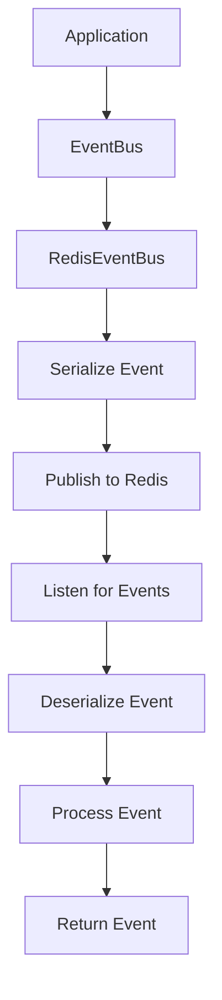
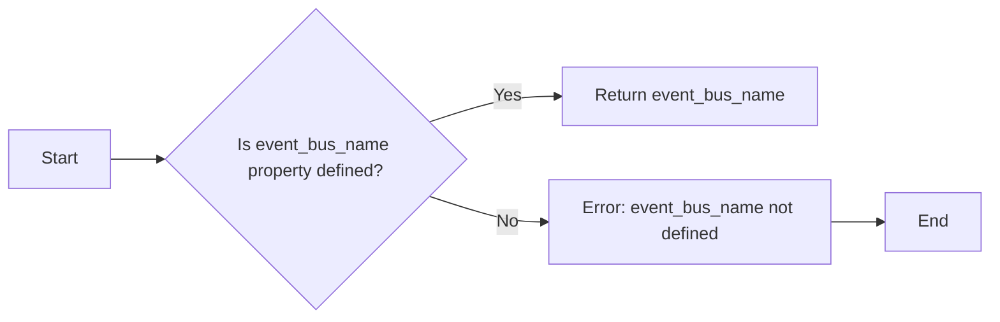
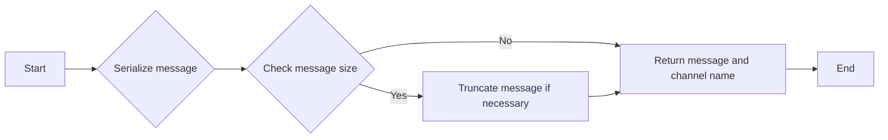
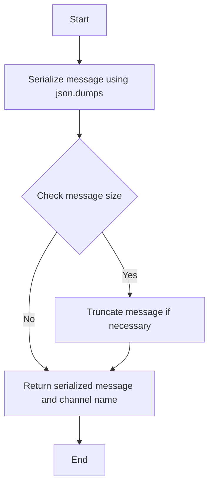
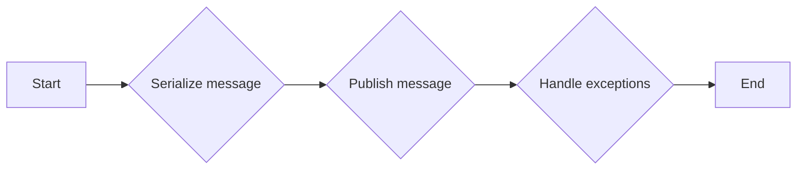
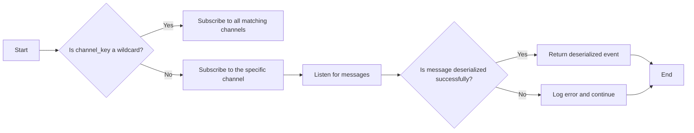
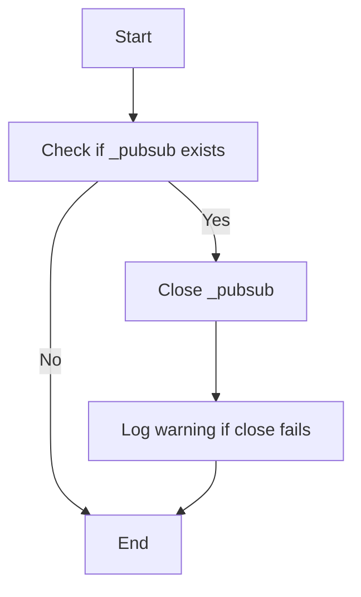
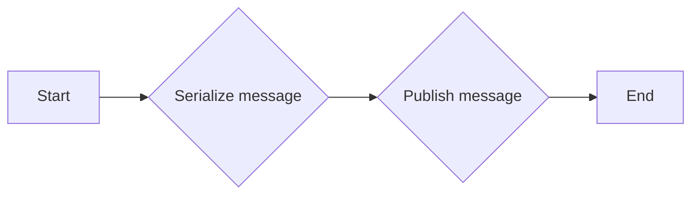
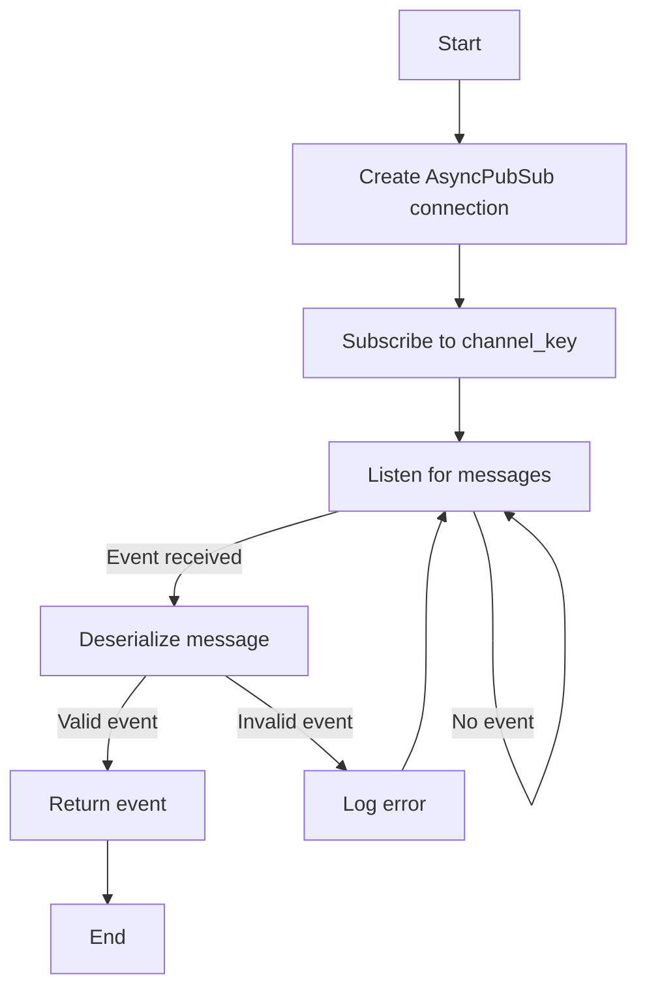
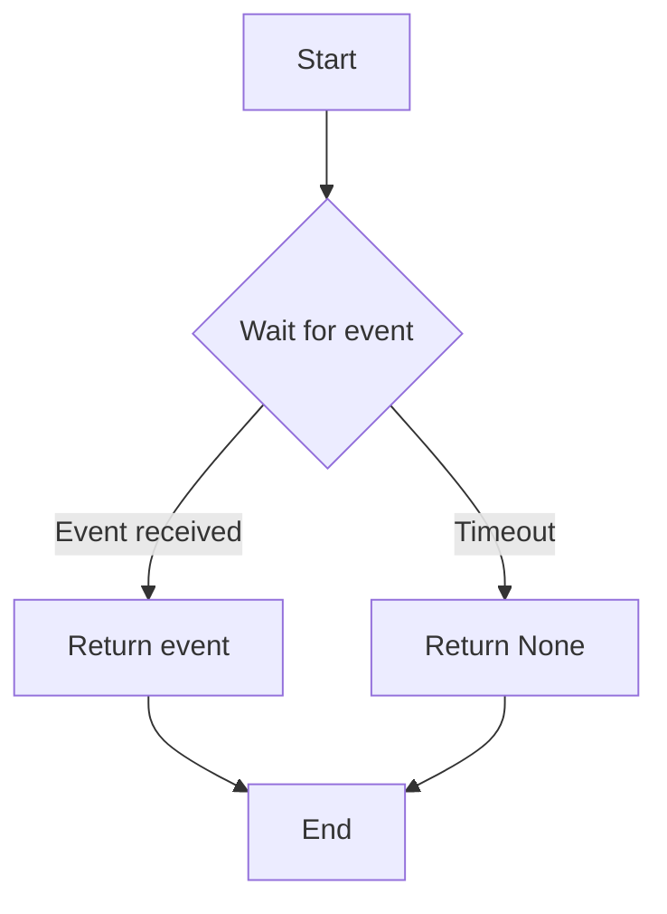

# `.\AutoGPT\autogpt_platform\backend\backend\data\event_bus.py` 详细设计文档

The code provides an asynchronous and synchronous event bus system using Redis for communication between different parts of an application.

## 整体流程



## 类结构

```
BaseRedisEventBus (抽象基类)
├── RedisEventBus (继承自BaseRedisEventBus)
│   ├── AsyncRedisEventBus (继承自BaseRedisEventBus)
```

## 全局变量及字段


### `logger`
    
Logger instance for logging messages.

类型：`logging.Logger`
    


### `config`
    
Configuration settings for the application.

类型：`Settings`
    


### `MAX_MESSAGE_SIZE`
    
Maximum allowed size for a message in bytes.

类型：`int`
    


### `redis_client`
    
Redis client instance for synchronous operations.

类型：`redis.Redis`
    


### `{'name': 'BaseRedisEventBus', 'fields': ['Model'], 'methods': ['event_bus_name', 'Message', '_serialize_message', '_deserialize_message', '_get_pubsub_channel']}.Model`
    
Type variable for the model type used in the event bus.

类型：`TypeVar`
    


### `{'name': '_EventPayloadWrapper', 'fields': ['payload'], 'methods': []}.payload`
    
Payload model for wrapping the event data.

类型：`BaseModel`
    


### `BaseRedisEventBus.Model`
    
Type variable for the model type used in the event bus.

类型：`TypeVar`
    


### `_EventPayloadWrapper.payload`
    
Payload of the event data wrapped by the model.

类型：`BaseModel`
    
    

## 全局函数及方法


### `BaseRedisEventBus.event_bus_name`

该函数用于获取事件总线名称。

参数：

- 无

返回值：`str`，事件总线名称

#### 流程图



#### 带注释源码

```python
class BaseRedisEventBus(Generic[M], ABC):
    # ...

    @property
    @abstractmethod
    def event_bus_name(self) -> str:
        """
        Get the name of the event bus.
        """
        pass
```


### BaseRedisEventBus._serialize_message

Serialize a message object into a JSON string and prepare it for Redis publication.

参数：

- `item`：`M`，The message object to serialize.
- `channel_key`：`str`，The key of the channel to which the message will be published.

返回值：`tuple[str, str]`，A tuple containing the serialized message and the full channel name.

#### 流程图



#### 带注释源码

```python
def _serialize_message(self, item: M, channel_key: str) -> tuple[str, str]:
    MAX_MESSAGE_SIZE = config.max_message_size_limit

    try:
        # Use backend.util.json.dumps which handles datetime and other complex types
        message = json.dumps(
            self.Message(payload=item), ensure_ascii=False, separators=(",", ":")
        )
    except UnicodeError:
        # Fallback to ASCII encoding if Unicode causes issues
        message = json.dumps(
            self.Message(payload=item), ensure_ascii=True, separators=(",", ":")
        )
        logger.warning(
            f"Unicode serialization failed, falling back to ASCII for channel {channel_key}"
        )

    # Check message size and truncate if necessary
    message_size = len(message.encode("utf-8"))
    if message_size > MAX_MESSAGE_SIZE:
        logger.warning(
            f"Message size {message_size} bytes exceeds limit {MAX_MESSAGE_SIZE} bytes for channel {channel_key}. "
            "Truncating payload to prevent Redis connection issues."
        )
        error_payload = {
            "payload": {
                "event_type": "error_comms_update",
                "error": "Payload too large for Redis transmission",
                "original_size_bytes": message_size,
                "max_size_bytes": MAX_MESSAGE_SIZE,
            }
        }
        message = json.dumps(
            error_payload, ensure_ascii=False, separators=(",", ":")
        )

    channel_name = f"{self.event_bus_name}/{channel_key}"
    logger.debug(f"[{channel_name}] Publishing an event to Redis {message}")
    return message, channel_name
```


### `_serialize_message`

This method serializes a message object into a JSON string and prepares it for publishing to Redis. It handles potential Unicode serialization issues and message size limitations.

参数：

- `item`：`M`，The message object to serialize.
- `channel_key`：`str`，The key of the channel to which the message will be published.

返回值：`tuple[str, str]`，A tuple containing the serialized message as a string and the full channel name.

#### 流程图



#### 带注释源码

```python
def _serialize_message(self, item: M, channel_key: str) -> tuple[str, str]:
    MAX_MESSAGE_SIZE = config.max_message_size_limit

    try:
        # Use backend.util.json.dumps which handles datetime and other complex types
        message = json.dumps(
            self.Message(payload=item), ensure_ascii=False, separators=(",", ":")
        )
    except UnicodeError:
        # Fallback to ASCII encoding if Unicode causes issues
        message = json.dumps(
            self.Message(payload=item), ensure_ascii=True, separators=(",", ":")
        )
        logger.warning(
            f"Unicode serialization failed, falling back to ASCII for channel {channel_key}"
        )

    # Check message size and truncate if necessary
    message_size = len(message.encode("utf-8"))
    if message_size > MAX_MESSAGE_SIZE:
        logger.warning(
            f"Message size {message_size} bytes exceeds limit {MAX_MESSAGE_SIZE} bytes for channel {channel_key}. "
            "Truncating payload to prevent Redis connection issues."
        )
        error_payload = {
            "payload": {
                "event_type": "error_comms_update",
                "error": "Payload too large for Redis transmission",
                "original_size_bytes": message_size,
                "max_size_bytes": MAX_MESSAGE_SIZE,
            }
        }
        message = json.dumps(
            error_payload, ensure_ascii=False, separators=(",", ":")
        )

    channel_name = f"{self.event_bus_name}/{channel_key}"
    logger.debug(f"[{channel_name}] Publishing an event to Redis {message}")
    return message, channel_name
```


### `_deserialize_message`

Deserialize a message received from Redis.

参数：

- `msg`：`Any`，The message received from Redis.
- `channel_key`：`str`，The key of the channel from which the message was received.

返回值：`M | None`，The deserialized event object if successful, otherwise `None`.

#### 流程图

```mermaid
graph LR
A[Start] --> B{Check message type}
B -- "pmessage" or "message"? --> C[Deserialize message]
C --> D{Validate JSON}
D -- Success? --> E[Return deserialized event]
D -- Failure --> F[Log error]
F --> G[End]
```

#### 带注释源码

```python
def _deserialize_message(self, msg: Any, channel_key: str) -> M | None:
    message_type = "pmessage" if "*" in channel_key else "message"
    if msg["type"] != message_type:
        return None
    try:
        logger.debug(f"[{channel_key}] Consuming an event from Redis {msg['data']}")
        return self.Message.model_validate_json(msg["data"]).payload
    except Exception as e:
        logger.error(f"Failed to parse event result from Redis {msg} {e}")
``` 


### `_get_pubsub_channel`

This method retrieves the PubSub connection and the full channel name for a specified channel key.

参数：

- `connection`：`redis.Redis | redis.AsyncRedis`，The Redis connection object.
- `channel_key`：`str`，The key of the channel to retrieve the PubSub connection for.

返回值：`tuple[PubSub | AsyncPubSub, str]`，A tuple containing the PubSub connection and the full channel name.

#### 流程图

```mermaid
graph TD
    A[Start] --> B[Check connection type]
    B -->|AsyncRedis| C[Create AsyncPubSub]
    B -->|Redis| D[Create PubSub]
    C --> E[Return (AsyncPubSub, full_channel_name)]
    D --> E
    E --> F[End]
```

#### 带注释源码

```python
def _get_pubsub_channel(
    self, connection: redis.Redis | redis.AsyncRedis, channel_key: str
) -> tuple[PubSub | AsyncPubSub, str]:
    full_channel_name = f"{self.event_bus_name}/{channel_key}"
    pubsub = connection.pubsub()
    return pubsub, full_channel_name
```


### RedisEventBus.publish_event

Publish an event to Redis. Gracefully handles connection failures by logging the error instead of raising exceptions.

参数：

- `event`：`M`，The event to be published. This should be an instance of the `Model` class defined in the subclass of `RedisEventBus`.
- `channel_key`：`str`，The key for the channel to which the event should be published.

返回值：`None`，This method does not return a value.

#### 流程图



#### 带注释源码

```python
def publish_event(self, event: M, channel_key: str):
    """
    Publish an event to Redis. Gracefully handles connection failures
    by logging the error instead of raising exceptions.
    """
    try:
        message, full_channel_name = self._serialize_message(event, channel_key)
        self.connection.publish(full_channel_name, message)
    except Exception:
        logger.exception(
            f"Failed to publish event to Redis channel {channel_key}. "
            "Event bus operation will continue without Redis connectivity."
        )
``` 


### RedisEventBus.listen_events

This method listens for events on a specified Redis channel and yields the deserialized event objects.

参数：

- `channel_key`：`str`，The key of the Redis channel to listen to. It can include a wildcard to listen to multiple channels.

返回值：`Generator[M, None, None]`，A generator that yields deserialized event objects of type `M`.

#### 流程图



#### 带注释源码

```python
async def listen_events(self, channel_key: str) -> AsyncGenerator[M, None]:
    pubsub, full_channel_name = self._get_pubsub_channel(
        await self.connection, channel_key
    )
    assert isinstance(pubsub, AsyncPubSub)
    self._pubsub = pubsub

    if "*" in channel_key:
        await pubsub.psubscribe(full_channel_name)
    else:
        await pubsub.subscribe(full_channel_name)

    async for message in pubsub.listen():
        if event := self._deserialize_message(message, channel_key):
            yield event
```


### AsyncRedisEventBus.close

Close the PubSub connection if it exists.

参数：

- 无

返回值：`None`，无返回值

#### 流程图



#### 带注释源码

```python
async def close(self) -> None:
    """Close the PubSub connection if it exists."""
    if self._pubsub is not None:
        try:
            await self._pubsub.close()
        except Exception:
            logger.warning("Failed to close PubSub connection", exc_info=True)
        finally:
            self._pubsub = None
```


### AsyncRedisEventBus.publish_event

Publish an event to Redis. Gracefully handles connection failures by logging the error instead of raising exceptions.

参数：

- `event`：`M`，The event to be published. This should be an instance of the `Model` class defined in the subclass of `BaseRedisEventBus`.
- `channel_key`：`str`，The key of the channel to which the event should be published.

返回值：`None`，This method does not return a value.

#### 流程图



#### 带注释源码

```python
async def publish_event(self, event: M, channel_key: str):
    """
    Publish an event to Redis. Gracefully handles connection failures
    by logging the error instead of raising exceptions.
    """
    try:
        message, full_channel_name = self._serialize_message(event, channel_key)
        connection = await self.connection
        await connection.publish(full_channel_name, message)
    except Exception:
        logger.exception(
            f"Failed to publish event to Redis channel {channel_key}. "
            "Event bus operation will continue without Redis connectivity."
        )
```


### AsyncRedisEventBus.listen_events

This method listens for events on a specified Redis channel and yields events as they are received.

参数：

- `channel_key`：`str`，The key of the Redis channel to listen to. If the key contains an asterisk (*), it will listen to all channels that match the pattern.

返回值：`AsyncGenerator[M, None]`，An asynchronous generator that yields events of type `M` as they are received.

#### 流程图



#### 带注释源码

```python
async def listen_events(self, channel_key: str) -> AsyncGenerator[M, None]:
    pubsub, full_channel_name = self._get_pubsub_channel(
        await self.connection, channel_key
    )
    assert isinstance(pubsub, AsyncPubSub)
    self._pubsub = pubsub

    if "*" in channel_key:
        await pubsub.psubscribe(full_channel_name)
    else:
        await pubsub.subscribe(full_channel_name)

    async for message in pubsub.listen():
        if event := self._deserialize_message(message, channel_key):
            yield event
```


### AsyncRedisEventBus.wait_for_event

This function waits for an event to be published on a specified Redis channel.

参数：

- `channel_key`：`str`，The key of the Redis channel to listen for events on.
- `timeout`：`Optional[float]`，The timeout in seconds to wait for an event. If not provided, there is no timeout.

返回值：`M | None`，The event object if one is received within the timeout period, otherwise `None`.

#### 流程图



#### 带注释源码

```python
async def wait_for_event(self, channel_key: str, timeout: Optional[float] = None) -> M | None:
    try:
        return await asyncio.wait_for(
            anext(aiter(self.listen_events(channel_key))), timeout
        )
    except TimeoutError:
        return None
``` 


## 关键组件


### 张量索引与惰性加载

张量索引与惰性加载是代码中处理数据结构的核心组件，它允许对大型数据集进行高效访问，同时减少内存消耗。

### 反量化支持

反量化支持是代码中用于处理量化数据的核心组件，它允许对量化数据进行反量化处理，以便进行进一步的分析或操作。

### 量化策略

量化策略是代码中用于处理数据量化的核心组件，它定义了如何将数据转换为量化形式，以便在特定环境中进行优化或压缩。


## 问题及建议


### 已知问题

-   **全局变量和函数的依赖性**：代码中使用了全局变量 `logger` 和 `config`，这可能导致代码的可测试性和可维护性降低。全局变量和函数的使用应该尽量避免，除非有充分的理由。
-   **异常处理**：在 `publish_event` 和 `listen_events` 方法中，异常被捕获并记录，但没有进一步的错误处理逻辑。这可能需要根据具体的应用场景来设计更详细的错误处理策略。
-   **代码重复**：`_serialize_message` 和 `_deserialize_message` 方法在 `BaseRedisEventBus` 和其子类 `RedisEventBus` 和 `AsyncRedisEventBus` 中重复出现。可以考虑将这些方法提取到基类或单独的模块中，以减少代码重复。
-   **类型注解**：代码中使用了大量的类型注解，这有助于代码的可读性和可维护性，但过多的类型注解也可能导致代码难以阅读。需要平衡类型注解的使用。

### 优化建议

-   **移除全局变量**：考虑将 `logger` 和 `config` 作为参数传递给类的方法，而不是使用全局变量。
-   **改进异常处理**：在捕获异常后，根据异常的类型和上下文，实现更具体的错误处理逻辑，例如重试机制、错误通知等。
-   **减少代码重复**：将 `_serialize_message` 和 `_deserialize_message` 方法提取到基类或单独的模块中，以减少代码重复并提高代码的可维护性。
-   **优化类型注解**：对于复杂的类型注解，可以考虑使用文档字符串来解释其含义，以减少代码的复杂性。
-   **异步编程**：在 `AsyncRedisEventBus` 中，`await` 关键字的使用可能导致代码难以阅读。考虑使用更清晰的异步编程模式，例如 `asyncio` 的 `run_coroutine_threadsafe` 或 `run_in_executor`。
-   **性能优化**：在处理大量消息时，考虑使用批处理或流式处理来优化性能。


## 其它


### 设计目标与约束

- 设计目标：
  - 实现一个基于Redis的事件总线，用于异步和同步消息传递。
  - 提供灵活的事件发布和订阅机制。
  - 确保消息的可靠性和完整性。
  - 支持不同类型的事件模型。

- 约束：
  - 事件消息大小限制为配置的最大值。
  - 支持异步和同步两种模式。
  - 必须处理Redis连接失败的情况。

### 错误处理与异常设计

- 错误处理：
  - 在序列化和反序列化过程中捕获异常，并记录警告或错误日志。
  - 在发布和订阅过程中捕获异常，并记录异常日志，但不中断程序执行。

- 异常设计：
  - 使用try-except块捕获可能发生的异常。
  - 使用logger记录异常信息。

### 数据流与状态机

- 数据流：
  - 事件通过Redis通道进行发布和订阅。
  - 发布者将事件序列化后发送到Redis。
  - 订阅者从Redis接收事件并进行反序列化。

- 状态机：
  - 发布者状态：空闲、发布中、错误。
  - 订阅者状态：空闲、订阅中、错误。

### 外部依赖与接口契约

- 外部依赖：
  - Redis客户端库。
  - Pydantic库用于数据验证。

- 接口契约：
  - `BaseRedisEventBus`和`_EventPayloadWrapper`类定义了事件总线的接口。
  - `RedisEventBus`和`AsyncRedisEventBus`类实现了具体的事件总线逻辑。
  - `Settings`类提供配置信息。

### 安全性与权限

- 安全性：
  - 确保Redis连接的安全性，使用适当的认证机制。
  - 对事件内容进行加密，以防止数据泄露。

### 性能考量

- 性能考量：
  - 优化消息序列化和反序列化过程，减少资源消耗。
  - 使用异步编程模型提高事件处理的效率。

### 可维护性与可扩展性

- 可维护性：
  - 代码结构清晰，易于理解和维护。
  - 使用面向对象设计，便于扩展和修改。

- 可扩展性：
  - 支持添加新的事件类型和通道。
  - 支持自定义消息序列化和反序列化逻辑。

### 测试与部署

- 测试：
  - 编写单元测试和集成测试，确保代码质量。
  - 使用持续集成工具自动化测试过程。

- 部署：
  - 提供部署指南，确保事件总线在目标环境中正常运行。
  - 支持不同环境下的配置管理。


    