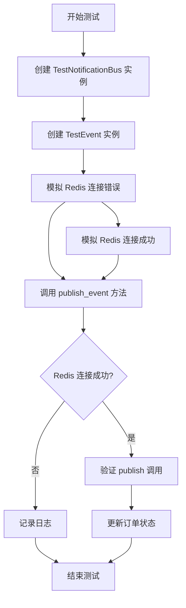
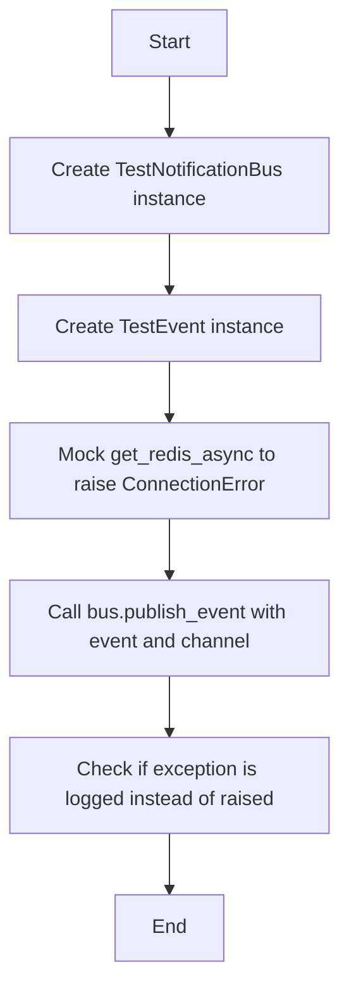
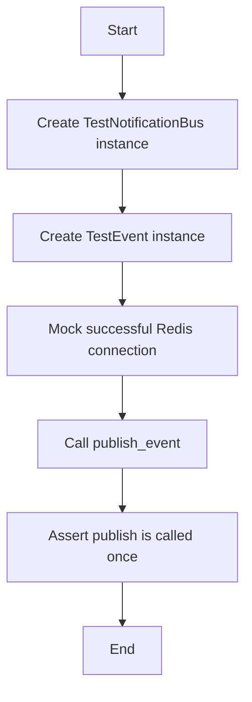
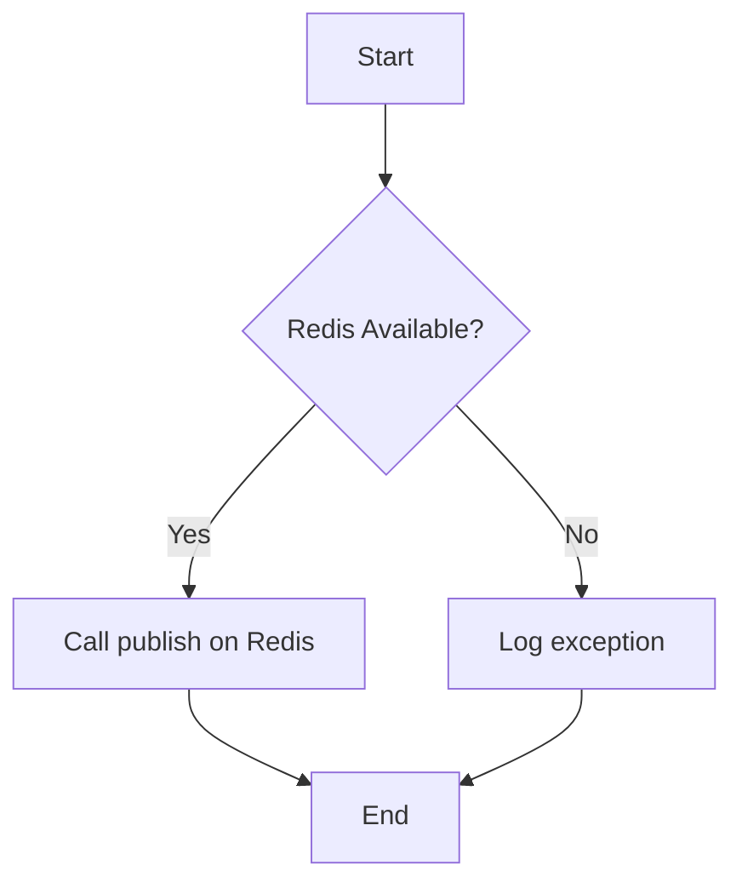

# `.\AutoGPT\autogpt_platform\backend\backend\data\event_bus_test.py` 详细设计文档

This code tests the graceful degradation of an event bus system when Redis is unavailable, ensuring that it logs exceptions instead of raising errors.

## 整体流程



## 类结构

```
TestNotificationBus (子类, AsyncRedisEventBus)
├── TestEvent (基类, BaseModel)
```

## 全局变量及字段


### `message`
    
The message content of the event.

类型：`str`
    


### `TestEvent.message`
    
The message content of the event.

类型：`str`
    
    

## 全局函数及方法


### test_publish_event_handles_connection_failure_gracefully

This function tests the graceful degradation of the event bus when Redis is unavailable.

参数：

- `bus`：`TestNotificationBus`，The event bus instance to be tested.
- `event`：`TestEvent`，The event to be published.
- `channel`：`str`，The channel to which the event should be published.

返回值：`None`，This function does not return any value.

#### 流程图



#### 带注释源码

```python
@pytest.mark.asyncio
async def test_publish_event_handles_connection_failure_gracefully():
    """Test that publish_event logs exception instead of raising when Redis is unavailable."""
    bus = TestNotificationBus()
    event = TestEvent(message="test message")

    # Mock get_redis_async to raise connection error
    with patch(
        "backend.data.event_bus.redis.get_redis_async",
        side_effect=ConnectionError("Authentication required."),
    ):
        # Should not raise exception
        await bus.publish_event(event, "test_channel")
```


### test_publish_event_works_with_redis_available

This function tests that the `publish_event` method works normally when Redis is available.

参数：

- `bus`：`TestNotificationBus`，The event bus instance to publish the event to.
- `event`：`TestEvent`，The event to be published.
- `channel`：`str`，The channel to which the event should be published.

返回值：`None`，This function does not return any value.

#### 流程图



#### 带注释源码

```python
@pytest.mark.asyncio
async def test_publish_event_works_with_redis_available():
    """Test that publish_event works normally when Redis is available."""
    bus = TestNotificationBus()
    event = TestEvent(message="test message")

    # Mock successful Redis connection
    mock_redis = AsyncMock()
    mock_redis.publish = AsyncMock()

    with patch("backend.data.event_bus.redis.get_redis_async", return_value=mock_redis):
        await bus.publish_event(event, "test_channel")
        mock_redis.publish.assert_called_once()
```


### TestNotificationBus.publish_event

该函数用于测试事件总线在Redis不可用时的优雅降级处理。

参数：

- `event`：`TestEvent`，事件对象，包含要发布的事件信息。
- `channel`：`str`，事件通道名称，用于指定事件发布的目标通道。

返回值：无

#### 流程图



#### 带注释源码

```python
@pytest.mark.asyncio
async def test_publish_event_handles_connection_failure_gracefully():
    """Test that publish_event logs exception instead of raising when Redis is unavailable."""
    bus = TestNotificationBus()
    event = TestEvent(message="test message")

    # Mock get_redis_async to raise connection error
    with patch(
        "backend.data.event_bus.redis.get_redis_async",
        side_effect=ConnectionError("Authentication required."),
    ):
        # Should not raise exception
        await bus.publish_event(event, "test_channel")
```

```python
@pytest.mark.asyncio
async def test_publish_event_works_with_redis_available():
    """Test that publish_event works normally when Redis is available."""
    bus = TestNotificationBus()
    event = TestEvent(message="test message")

    # Mock successful Redis connection
    mock_redis = AsyncMock()
    mock_redis.publish = AsyncMock()

    with patch("backend.data.event_bus.redis.get_redis_async", return_value=mock_redis):
        await bus.publish_event(event, "test_channel")
        mock_redis.publish.assert_called_once()
```


## 关键组件


### 张量索引与惰性加载

用于在事件总线中实现高效的事件索引和延迟加载机制。

### 反量化支持

提供对事件反量化的支持，以便在事件处理过程中进行数据转换和优化。

### 量化策略

定义了事件量化的策略，用于在事件发布和订阅过程中进行数据压缩和优化。


## 问题及建议


### 已知问题

-   {问题1}：代码中使用了`AsyncMock`和`patch`来模拟Redis的连接和发布事件，但没有模拟Redis的认证过程。这可能导致测试在Redis认证失败时不会按预期失败。
-   {问题2}：`TestNotificationBus`类继承自`AsyncRedisEventBus`，但没有覆盖或修改基类的任何方法。如果基类的方法在Redis不可用时没有适当的错误处理，那么这些方法可能会在测试中失败。
-   {问题3}：测试函数`test_publish_event_handles_connection_failure_gracefully`和`test_publish_event_works_with_redis_available`都使用了`patch`来模拟`get_redis_async`函数。如果`get_redis_async`函数在测试之外的其他地方也被调用，那么这些调用可能会失败，因为它们没有模拟。

### 优化建议

-   {建议1}：在测试中模拟Redis的认证过程，以确保在Redis认证失败时测试能够正确地失败。
-   {建议2}：如果`AsyncRedisEventBus`基类的方法在Redis不可用时没有适当的错误处理，那么应该考虑在`TestNotificationBus`类中覆盖这些方法，以确保它们能够优雅地处理错误。
-   {建议3}：确保所有调用`get_redis_async`的地方都被适当地模拟，以避免在测试之外的其他地方调用时出现失败。
-   {建议4}：考虑使用更高级的测试框架特性，如参数化测试，以减少重复代码并提高测试的灵活性。
-   {建议5}：增加更多的测试用例，包括测试Redis连接的其他潜在问题，如网络问题或Redis服务器配置错误。


## 其它


### 设计目标与约束

- 设计目标：
  - 确保事件总线在Redis不可用的情况下能够优雅降级，不中断应用程序的运行。
  - 确保事件发布和订阅功能在Redis可用时正常工作。
  - 提供清晰的接口和易于维护的代码结构。

- 约束：
  - 必须使用异步编程模型，以支持非阻塞操作。
  - 必须遵循Pydantic模型验证原则。
  - 必须兼容现有的Redis客户端库。

### 错误处理与异常设计

- 错误处理：
  - 当Redis连接失败时，`publish_event`方法应记录异常信息，而不是抛出异常。
  - 异常信息应记录在日志中，以便于问题追踪和调试。

- 异常设计：
  - 使用`ConnectionError`来模拟Redis连接失败的情况。
  - 使用`pytest`的`patch`装饰器来模拟外部依赖的行为。

### 数据流与状态机

- 数据流：
  - 事件通过`TestNotificationBus`类进行发布和订阅。
  - 事件数据通过`TestEvent`模型进行验证和序列化。

- 状态机：
  - 事件总线在Redis可用和不可用之间切换，但没有明确的状态机实现。
  - 状态切换由外部条件（如Redis连接状态）触发。

### 外部依赖与接口契约

- 外部依赖：
  - Redis客户端库：用于处理事件数据的发布和订阅。
  - Pydantic：用于数据验证和模型定义。

- 接口契约：
  - `AsyncRedisEventBus`类定义了事件总线的接口，包括`publish_event`和`subscribe_event`方法。
  - `TestNotificationBus`类实现了`AsyncRedisEventBus`接口，并提供了具体的实现细节。


    