# `.\AutoGPT\autogpt_platform\backend\backend\data\execution.py` 详细设计文档

The code defines the core data models, database access layer, and event bus mechanisms for managing Agent Graph Executions. It handles the lifecycle of graph and node executions, including creation, status updates, input/output persistence, statistics tracking, and real-time event broadcasting via Redis.

## 整体流程

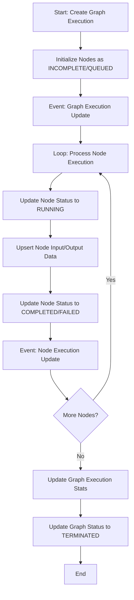

## 类结构

```
ExecutionContext (Context Data)
BlockErrorStats (Statistics)
VALID_STATUS_TRANSITIONS (Constants)
GraphExecutionMeta (Base DB Model)
├── Stats (Nested Model)
├── GraphExecution (Extends Meta, adds I/O)
│   └── GraphExecutionWithNodes (Extends Graph, adds Nodes)
│       └── GraphExecutionEvent (Event Wrapper)
NodeExecutionResult (Node DB Model)
└── NodeExecutionEvent (Event Wrapper)
GraphExecutionsPaginated (Response Wrapper)
Entry Models
├── GraphExecutionEntry
└── NodeExecutionEntry
Infrastructure
├── ExecutionQueue
├── RedisExecutionEventBus
└── AsyncRedisExecutionEventBus
```

## 全局变量及字段


### `logger`
    
Instance for recording runtime logs and debugging information within this module.

类型：`logging.Logger`
    


### `config`
    
Configuration settings loader for accessing application-level settings.

类型：`Config`
    


### `T`
    
Generic type variable used for type hinting in generic classes or functions.

类型：`TypeVar`
    


### `ExecutionStatus`
    
Enumeration representing the current state of a graph or node execution (e.g., RUNNING, COMPLETED).

类型：`AgentExecutionStatus`
    


### `VALID_STATUS_TRANSITIONS`
    
State machine definition mapping each execution status to the list of permissible statuses it can transition to.

类型：`dict[ExecutionStatus, list[ExecutionStatus]]`
    


### `ExecutionContext.user_id`
    
The unique identifier of the user initiating or associated with the execution.

类型：`Optional[str]`
    


### `ExecutionContext.graph_id`
    
The unique identifier of the agent graph being executed.

类型：`Optional[str]`
    


### `ExecutionContext.graph_exec_id`
    
The unique identifier of the current graph execution instance.

类型：`Optional[str]`
    


### `ExecutionContext.graph_version`
    
The version number of the agent graph being executed.

类型：`Optional[int]`
    


### `ExecutionContext.node_id`
    
The unique identifier of the specific node within the graph.

类型：`Optional[str]`
    


### `ExecutionContext.node_exec_id`
    
The unique identifier of the current node execution instance.

类型：`Optional[str]`
    


### `ExecutionContext.human_in_the_loop_safe_mode`
    
Safety flag indicating if human intervention/confirmation is required for actions.

类型：`bool`
    


### `ExecutionContext.sensitive_action_safe_mode`
    
Safety flag indicating if sensitive actions are restricted.

类型：`bool`
    


### `ExecutionContext.user_timezone`
    
The timezone context for the user, defaulting to 'UTC'.

类型：`str`
    


### `ExecutionContext.root_execution_id`
    
ID of the top-level execution if this is a sub-graph execution.

类型：`Optional[str]`
    


### `ExecutionContext.parent_execution_id`
    
ID of the immediate parent execution in a hierarchy.

类型：`Optional[str]`
    


### `ExecutionContext.workspace_id`
    
Identifier for the workspace containing the execution.

类型：`Optional[str]`
    


### `ExecutionContext.session_id`
    
Identifier for the specific user session.

类型：`Optional[str]`
    


### `BlockErrorStats.block_id`
    
The unique identifier of the block being analyzed.

类型：`str`
    


### `BlockErrorStats.total_executions`
    
The total count of times the block has been executed.

类型：`int`
    


### `BlockErrorStats.failed_executions`
    
The count of times the block execution has resulted in a failure.

类型：`int`
    


### `GraphExecutionMeta.id`
    
The unique identifier of the graph execution record.

类型：`str`
    


### `GraphExecutionMeta.user_id`
    
The unique identifier of the user who owns the execution.

类型：`str`
    


### `GraphExecutionMeta.graph_id`
    
The unique identifier of the agent graph being executed.

类型：`str`
    


### `GraphExecutionMeta.graph_version`
    
The version of the agent graph used for this execution.

类型：`int`
    


### `GraphExecutionMeta.inputs`
    
The initial input data provided to the graph execution.

类型：`Optional[BlockInput]`
    


### `GraphExecutionMeta.credential_inputs`
    
Mapping of credentials required for the execution, if any.

类型：`Optional[dict[str, CredentialsMetaInput]]`
    


### `GraphExecutionMeta.nodes_input_masks`
    
Masks applied to node inputs, often used for security or privacy.

类型：`Optional[dict[str, BlockInput]]`
    


### `GraphExecutionMeta.preset_id`
    
The identifier of the preset configuration used, if applicable.

类型：`Optional[str]`
    


### `GraphExecutionMeta.status`
    
The current status of the graph execution (e.g., QUEUED, RUNNING, COMPLETED).

类型：`ExecutionStatus`
    


### `GraphExecutionMeta.started_at`
    
Timestamp indicating when the execution started running.

类型：`Optional[datetime]`
    


### `GraphExecutionMeta.ended_at`
    
Timestamp indicating when the execution finished or was terminated.

类型：`Optional[datetime]`
    


### `GraphExecutionMeta.is_shared`
    
Flag indicating whether the execution results are publicly shared.

类型：`bool`
    


### `GraphExecutionMeta.share_token`
    
The token used to access the shared execution results.

类型：`Optional[str]`
    


### `GraphExecutionMeta.stats`
    
Aggregated statistics about the execution (cost, duration, errors, etc.).

类型：`Stats | None`
    


### `GraphExecutionMeta.Stats.cost`
    
The monetary cost of the execution in cents.

类型：`int`
    


### `GraphExecutionMeta.Stats.duration`
    
The total wall-clock time of the execution in seconds.

类型：`float`
    


### `GraphExecutionMeta.Stats.duration_cpu_only`
    
The CPU time consumed during the execution in seconds.

类型：`float`
    


### `GraphExecutionMeta.Stats.node_exec_time`
    
Total time spent executing nodes in seconds.

类型：`float`
    


### `GraphExecutionMeta.Stats.node_exec_time_cpu_only`
    
Total CPU time spent executing nodes in seconds.

类型：`float`
    


### `GraphExecutionMeta.Stats.node_exec_count`
    
The total number of node executions performed.

类型：`int`
    


### `GraphExecutionMeta.Stats.node_error_count`
    
The total number of errors encountered during node execution.

类型：`int`
    


### `GraphExecutionMeta.Stats.error`
    
The error message if the execution failed, otherwise null.

类型：`str | None`
    


### `GraphExecutionMeta.Stats.activity_status`
    
AI-generated summary of the agent's activities during execution.

类型：`str | None`
    


### `GraphExecutionMeta.Stats.correctness_score`
    
AI-generated score (0.0-1.0) evaluating how well the execution met its goal.

类型：`float | None`
    


### `GraphExecution.inputs`
    
Merged input data used for the execution.

类型：`BlockInput`
    


### `GraphExecution.outputs`
    
The final output data produced by the graph execution.

类型：`CompletedBlockOutput`
    


### `GraphExecutionWithNodes.node_executions`
    
List of all node execution results associated with this graph execution.

类型：`list[NodeExecutionResult]`
    


### `NodeExecutionResult.user_id`
    
The ID of the user associated with the execution.

类型：`str`
    


### `NodeExecutionResult.graph_id`
    
The ID of the graph this node belongs to.

类型：`str`
    


### `NodeExecutionResult.graph_version`
    
The version of the graph this node belongs to.

类型：`int`
    


### `NodeExecutionResult.graph_exec_id`
    
The ID of the parent graph execution.

类型：`str`
    


### `NodeExecutionResult.node_exec_id`
    
The unique identifier for this specific node execution.

类型：`str`
    


### `NodeExecutionResult.node_id`
    
The ID of the node definition within the graph.

类型：`str`
    


### `NodeExecutionResult.block_id`
    
The ID of the block implementation being executed by this node.

类型：`str`
    


### `NodeExecutionResult.status`
    
The current status of this node execution.

类型：`ExecutionStatus`
    


### `NodeExecutionResult.input_data`
    
The input data provided to the node.

类型：`BlockInput`
    


### `NodeExecutionResult.output_data`
    
The output data produced by the node.

类型：`CompletedBlockOutput`
    


### `NodeExecutionResult.add_time`
    
Timestamp when the node execution record was created/added.

类型：`datetime`
    


### `NodeExecutionResult.queue_time`
    
Timestamp when the node execution was queued for processing.

类型：`datetime | None`
    


### `NodeExecutionResult.start_time`
    
Timestamp when the node execution actually started.

类型：`datetime | None`
    


### `NodeExecutionResult.end_time`
    
Timestamp when the node execution finished.

类型：`datetime | None`
    


### `GraphExecutionsPaginated.executions`
    
List of graph execution metadata for the current page.

类型：`list[GraphExecutionMeta]`
    


### `GraphExecutionsPaginated.pagination`
    
Metadata describing the pagination details (total items, pages, etc.).

类型：`Pagination`
    


### `GraphExecutionEntry.user_id`
    
The ID of the user running the execution.

类型：`str`
    


### `GraphExecutionEntry.graph_exec_id`
    
The ID of the graph execution.

类型：`str`
    


### `GraphExecutionEntry.graph_id`
    
The ID of the graph.

类型：`str`
    


### `GraphExecutionEntry.graph_version`
    
The version of the graph.

类型：`int`
    


### `GraphExecutionEntry.nodes_input_masks`
    
Input masks applied to nodes.

类型：`Optional[NodesInputMasks]`
    


### `GraphExecutionEntry.nodes_to_skip`
    
Set of node IDs to skip during execution.

类型：`set[str]`
    


### `GraphExecutionEntry.execution_context`
    
The unified execution context object.

类型：`ExecutionContext`
    


### `NodeExecutionEntry.user_id`
    
The ID of the user.

类型：`str`
    


### `NodeExecutionEntry.graph_exec_id`
    
The ID of the graph execution.

类型：`str`
    


### `NodeExecutionEntry.graph_id`
    
The ID of the graph.

类型：`str`
    


### `NodeExecutionEntry.graph_version`
    
The version of the graph.

类型：`int`
    


### `NodeExecutionEntry.node_exec_id`
    
The ID of the node execution.

类型：`str`
    


### `NodeExecutionEntry.node_id`
    
The ID of the node.

类型：`str`
    


### `NodeExecutionEntry.block_id`
    
The ID of the block.

类型：`str`
    


### `NodeExecutionEntry.inputs`
    
The inputs for the node execution.

类型：`BlockInput`
    


### `NodeExecutionEntry.execution_context`
    
The execution context.

类型：`ExecutionContext`
    


### `ExecutionQueue.queue`
    
Thread-safe queue storing items to be executed.

类型：`queue.Queue[T]`
    


### `RedisExecutionEventBus.Model`
    
The Pydantic model class used for event validation and serialization.

类型：`ExecutionEvent`
    


### `AsyncRedisExecutionEventBus.Model`
    
The Pydantic model class used for event validation and serialization.

类型：`ExecutionEvent`
    
    

## 全局函数及方法


### `get_graph_executions`

根据提供的过滤条件（如执行ID、图ID、用户ID、状态、时间范围等）从数据库查询图执行记录，并将其转换为领域模型返回的异步函数。

参数：

- `graph_exec_id`: `Optional[str]`，要查询的特定图执行ID。
- `graph_id`: `Optional[str]`，关联的Agent Graph ID，用于筛选特定图的执行记录。
- `graph_version`: `Optional[int]`，关联的Agent Graph版本号，用于筛选特定版本的执行记录。
- `user_id`: `Optional[str]`，执行该图的用户ID。注意：文档标注此检查是可选的，在面向用户的端点中必须进行显式检查。
- `statuses`: `Optional[list[ExecutionStatus]]`，执行状态列表（如 QUEUED, RUNNING），用于筛选处于特定状态的执行记录。
- `created_time_gte`: `Optional[datetime]`，创建时间的起始边界（大于等于），用于时间范围筛选。
- `created_time_lte`: `Optional[datetime]`，创建时间的结束边界（小于等于），用于时间范围筛选。
- `limit`: `Optional[int]`，返回结果的最大数量限制。

返回值：`list[GraphExecutionMeta]`，包含图执行元数据的对象列表，每个对象包含执行状态、时间戳、统计信息等。

#### 流程图

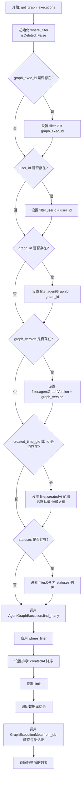

#### 带注释源码

```python
async def get_graph_executions(
    graph_exec_id: Optional[str] = None,
    graph_id: Optional[str] = None,
    graph_version: Optional[int] = None,
    user_id: Optional[str] = None,
    statuses: Optional[list[ExecutionStatus]] = None,
    created_time_gte: Optional[datetime] = None,
    created_time_lte: Optional[datetime] = None,
    limit: Optional[int] = None,
) -> list[GraphExecutionMeta]:
    """⚠️ **Optional `user_id` check**: MUST USE check in user-facing endpoints."""
    # 初始化查询过滤器，基础条件为未删除
    where_filter: AgentGraphExecutionWhereInput = {
        "isDeleted": False,
    }
    # 添加图执行ID过滤
    if graph_exec_id:
        where_filter["id"] = graph_exec_id
    # 添加用户ID过滤
    if user_id:
        where_filter["userId"] = user_id
    # 添加图ID过滤
    if graph_id:
        where_filter["agentGraphId"] = graph_id
    # 添加图版本过滤
    if graph_version is not None:
        where_filter["agentGraphVersion"] = graph_version
    # 添加创建时间范围过滤，若未提供则使用最小/最大时间戳
    if created_time_gte or created_time_lte:
        where_filter["createdAt"] = {
            "gte": created_time_gte or datetime.min.replace(tzinfo=timezone.utc),
            "lte": created_time_lte or datetime.max.replace(tzinfo=timezone.utc),
        }
    # 添加状态列表过滤，使用OR逻辑匹配任意一个指定状态
    if statuses:
        where_filter["OR"] = [{"executionStatus": status} for status in statuses]

    # 执行数据库查询
    executions = await AgentGraphExecution.prisma().find_many(
        where=where_filter,
        order={"createdAt": "desc"}, # 按创建时间倒序排列
        take=limit,                 # 限制返回数量
    )
    # 将数据库模型转换为领域模型 GraphExecutionMeta
    return [GraphExecutionMeta.from_db(execution) for execution in executions]
```


### `get_graph_executions_count`

获取满足特定筛选条件的图执行数量，支持按用户ID、图ID、状态和创建时间范围进行过滤。

参数：

- `user_id`：`Optional[str]`，可选的用户ID，用于筛选特定用户的执行记录。
- `graph_id`：`Optional[str]`，可选的图ID，用于筛选特定图的执行记录。
- `statuses`：`Optional[list[ExecutionStatus]]`，可选的执行状态列表，用于筛选处于特定状态的记录。
- `created_time_gte`：`Optional[datetime]`，可选的创建时间下限，筛选在该时间之后（含）创建的记录。
- `created_time_lte`：`Optional[datetime]`，可选的创建时间上限，筛选在该时间之前（含）创建的记录。

返回值：`int`，符合条件的图执行记录总数。

#### 流程图

```mermaid
flowchart TD
    A[开始: get_graph_executions_count] --> B[初始化 where_filter<br/>设置 isDeleted = False]
    B --> C{user_id 是否存在?}
    C -- 是 --> D[添加 userId 过滤条件]
    C -- 否 --> E{graph_id 是否存在?}
    D --> E
    E -- 是 --> F[添加 agentGraphId 过滤条件]
    E -- 否 --> G{created_time_gte 或<br/>created_time_lte 是否存在?}
    F --> G
    G -- 是 --> H[添加 createdAt 时间范围过滤<br/>默认最小/最大时间补全]
    G -- 否 --> I{statuses 是否存在?}
    H --> I
    I -- 是 --> J[添加 executionStatus OR 逻辑过滤]
    I -- 否 --> K[执行数据库查询:<br/>AgentGraphExecution.prisma().count]
    J --> K
    K --> L[返回计数结果 count]
    L --> M[结束]
```

#### 带注释源码

```python
async def get_graph_executions_count(
    user_id: Optional[str] = None,
    graph_id: Optional[str] = None,
    statuses: Optional[list[ExecutionStatus]] = None,
    created_time_gte: Optional[datetime] = None,
    created_time_lte: Optional[datetime] = None,
) -> int:
    """
    Get count of graph executions with optional filters.

    Args:
        user_id: Optional user ID to filter by
        graph_id: Optional graph ID to filter by
        statuses: Optional list of execution statuses to filter by
        created_time_gte: Optional minimum creation time
        created_time_lte: Optional maximum creation time

    Returns:
        Count of matching graph executions
    """
    # 初始化 Prisma 查询过滤器，默认排除已删除的记录
    where_filter: AgentGraphExecutionWhereInput = {
        "isDeleted": False,
    }

    # 如果提供了 user_id，将其添加到过滤器中
    if user_id:
        where_filter["userId"] = user_id

    # 如果提供了 graph_id，将其添加到过滤器中（对应数据库字段 agentGraphId）
    if graph_id:
        where_filter["agentGraphId"] = graph_id

    # 如果提供了创建时间范围（上限或下限），构建 createdAt 时间范围过滤器
    if created_time_gte or created_time_lte:
        where_filter["createdAt"] = {
            "gte": created_time_gte or datetime.min.replace(tzinfo=timezone.utc),
            "lte": created_time_lte or datetime.max.replace(tzinfo=timezone.utc),
        }

    # 如果提供了状态列表，构建 OR 逻辑的过滤器，匹配列表中的任一状态
    if statuses:
        where_filter["OR"] = [{"executionStatus": status} for status in statuses]

    # 调用 Prisma 客户端的 count 方法执行查询
    count = await AgentGraphExecution.prisma().count(where=where_filter)
    return count
```


### `get_graph_executions_paginated`

获取特定用户的图执行记录列表，支持根据图ID、状态、创建时间进行筛选，并提供分页功能。

参数：

- `user_id`：`str`，用户ID，用于筛选属于该用户的执行记录。
- `graph_id`：`Optional[str]`，(可选) 图ID，用于筛选特定图的执行记录。
- `page`：`int`，页码，默认为1。
- `page_size`：`int`，每页记录数，默认为25。
- `statuses`：`Optional[list[ExecutionStatus]]`，(可选) 执行状态列表，用于筛选特定状态的记录。
- `created_time_gte`：`Optional[datetime]`，(可选) 创建时间起始点（大于等于）。
- `created_time_lte`：`Optional[datetime]`，(可选) 创建时间结束点（小于等于）。

返回值：`GraphExecutionsPaginated`，包含执行记录列表（`executions`）和分页元数据（`pagination`）的对象。

#### 流程图

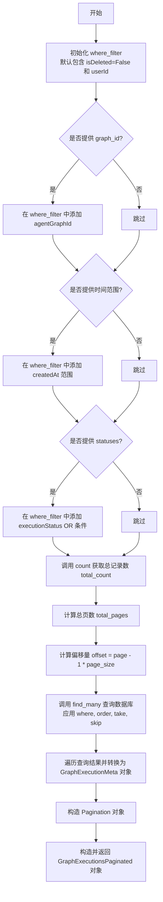

#### 带注释源码

```python
async def get_graph_executions_paginated(
    user_id: str,
    graph_id: Optional[str] = None,
    page: int = 1,
    page_size: int = 25,
    statuses: Optional[list[ExecutionStatus]] = None,
    created_time_gte: Optional[datetime] = None,
    created_time_lte: Optional[datetime] = None,
) -> GraphExecutionsPaginated:
    """Get paginated graph executions for a specific graph."""
    # 构建数据库查询的过滤条件
    where_filter: AgentGraphExecutionWhereInput = {
        "isDeleted": False,
        "userId": user_id,
    }

    # 如果提供了 graph_id，则添加到过滤条件中
    if graph_id:
        where_filter["agentGraphId"] = graph_id
    
    # 如果提供了时间范围（gte 或 lte），则添加到过滤条件中
    if created_time_gte or created_time_lte:
        where_filter["createdAt"] = {
            "gte": created_time_gte or datetime.min.replace(tzinfo=timezone.utc),
            "lte": created_time_lte or datetime.max.replace(tzinfo=timezone.utc),
        }
    
    # 如果提供了状态列表，则构建 OR 条件添加到过滤条件中
    if statuses:
        where_filter["OR"] = [{"executionStatus": status} for status in statuses]

    # 查询符合条件的数据总数
    total_count = await AgentGraphExecution.prisma().count(where=where_filter)
    # 计算总页数（向上取整）
    total_pages = (total_count + page_size - 1) // page_size

    # 计算当前页的偏移量
    offset = (page - 1) * page_size
    
    # 查询数据库获取当前页的执行记录，按创建时间倒序排列
    executions = await AgentGraphExecution.prisma().find_many(
        where=where_filter,
        order={"createdAt": "desc"},
        take=page_size,
        skip=offset,
    )

    # 返回包含转换后的执行记录列表和分页信息的对象
    return GraphExecutionsPaginated(
        executions=[GraphExecutionMeta.from_db(execution) for execution in executions],
        pagination=Pagination(
            total_items=total_count,
            total_pages=total_pages,
            current_page=page,
            page_size=page_size,
        ),
    )
```


### `get_graph_execution_meta`

根据用户ID和执行ID从数据库中检索图执行元数据。该函数会验证执行是否存在、未被标记为删除以及是否属于指定的用户，然后将数据库实体转换为应用程序模型 `GraphExecutionMeta`。

参数：

-   `user_id`：`str`，执行所属用户的标识符，用于权限校验。
-   `execution_id`：`str`，图执行记录的唯一标识符。

返回值：`GraphExecutionMeta | None`，返回包含元数据的 `GraphExecutionMeta` 对象；如果未找到记录或记录已删除，则返回 `None`。

#### 流程图

```mermaid
flowchart TD
    Start((开始)) --> Query[查询数据库: AgentGraphExecution.prisma().find_first<br/>筛选条件: id, isDeleted=False, userId]
    Query --> CheckResult{执行记录是否存在?}
    CheckResult -- 是 --> Convert[转换模型: GraphExecutionMeta.from_db]
    Convert --> ReturnMeta[返回 GraphExecutionMeta]
    CheckResult -- 否 --> ReturnNull[返回 None]
    ReturnMeta --> End((结束))
    ReturnNull --> End
```

#### 带注释源码

```python
async def get_graph_execution_meta(
    user_id: str, execution_id: str
) -> GraphExecutionMeta | None:
    # 使用 Prisma 客户端查询数据库
    # 查找条件：
    # 1. ID 匹配 execution_id
    # 2. isDeleted 为 False (未删除)
    # 3. userId 匹配 user_id (所有权校验)
    execution = await AgentGraphExecution.prisma().find_first(
        where={"id": execution_id, "isDeleted": False, "userId": user_id}
    )
    
    # 如果查询到 execution 对象，调用 GraphExecutionMeta.from_db 将数据库模型转换为领域模型
    # 如果 execution 为 None (未找到)，则返回 None
    return GraphExecutionMeta.from_db(execution) if execution else None
```


### `get_graph_execution`

根据用户ID和执行ID从数据库检索图执行记录。该函数支持通过参数控制是否包含详细的节点执行信息，并返回相应的数据模型对象。

参数：

-  `user_id`：`str`，执行记录所属的用户ID，用于权限过滤。
-  `execution_id`：`str`，要查询的图执行记录的唯一标识符。
-  `include_node_executions`：`bool`，可选参数（默认为 False），标志位，决定是否在查询结果中包含关联的节点执行列表。

返回值：`GraphExecution | GraphExecutionWithNodes | None`，如果找到记录，根据参数返回包含基本输入输出的 `GraphExecution` 对象，或包含完整节点列表的 `GraphExecutionWithNodes` 对象；如果未找到记录则返回 None。

#### 流程图

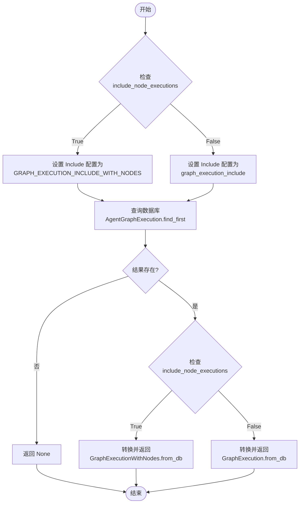

#### 带注释源码

```python
@overload
async def get_graph_execution(
    user_id: str,
    execution_id: str,
    include_node_executions: Literal[True],
) -> GraphExecutionWithNodes | None: ...


@overload
async def get_graph_execution(
    user_id: str,
    execution_id: str,
    include_node_executions: Literal[False] = False,
) -> GraphExecution | None: ...


@overload
async def get_graph_execution(
    user_id: str,
    execution_id: str,
    include_node_executions: bool = False,
) -> GraphExecution | GraphExecutionWithNodes | None: ...


async def get_graph_execution(
    user_id: str,
    execution_id: str,
    include_node_executions: bool = False,
) -> GraphExecution | GraphExecutionWithNodes | None:
    # 构建查询条件：匹配执行ID、未删除且属于指定用户
    execution = await AgentGraphExecution.prisma().find_first(
        where={"id": execution_id, "isDeleted": False, "userId": user_id},
        # 根据参数决定加载的关联数据深度
        include=(
            GRAPH_EXECUTION_INCLUDE_WITH_NODES
            if include_node_executions
            else graph_execution_include(
                [*get_io_block_ids(), *get_webhook_block_ids()]
            )
        ),
    )
    # 如果未找到记录，返回 None
    if not execution:
        return None

    # 根据参数决定返回包含完整节点信息的对象还是仅包含IO信息的对象
    return (
        GraphExecutionWithNodes.from_db(execution)
        if include_node_executions
        else GraphExecution.from_db(execution)
    )
```


### `get_child_graph_executions`

获取指定父图执行记录的所有子图执行记录。

参数：

- `parent_exec_id`：`str`，父图执行的唯一标识符。

返回值：`list[GraphExecutionMeta]`，包含所有符合查询条件的子图执行元数据对象的列表。

#### 流程图

```mermaid
flowchart TD
    A[开始: 输入 parent_exec_id] --> B[查询数据库 AgentGraphExecution]
    B --> C{应用过滤条件}
    C -->|parentGraphExecutionId 匹配| D[筛选父执行关联]
    C -->|isDeleted 为 False| E[排除已删除记录]
    D & E --> F[获取查询结果 children]
    F --> G[遍历结果集]
    G --> H[调用 GraphExecutionMeta.from_db 映射]
    H --> I[返回列表 list[GraphExecutionMeta]]
```

#### 带注释源码

```python
async def get_child_graph_executions(
    parent_exec_id: str,
) -> list[GraphExecutionMeta]:
    """
    Get all child executions of a parent execution.

    Args:
        parent_exec_id: Parent graph execution ID

    Returns:
        List of child graph executions
    """
    # 使用 Prisma 客户端查询数据库
    # 条件：parentGraphExecutionId 必须等于传入的 parent_exec_id
    # 且 isDeleted 必须为 False（即未删除）
    children = await AgentGraphExecution.prisma().find_many(
        where={"parentGraphExecutionId": parent_exec_id, "isDeleted": False}
    )

    # 将数据库返回的原始模型对象转换为领域模型 GraphExecutionMeta
    # 并以列表形式返回
    return [GraphExecutionMeta.from_db(child) for child in children]
```


### `create_graph_execution`

在数据库中创建一个新的 `AgentGraphExecution` 记录，并根据提供的起始节点列表初始化相应的 `AgentNodeExecution` 记录及其输入数据。

参数：

- `graph_id`：`str`，要执行的 Agent Graph 的 ID。
- `graph_version`：`int`，Agent Graph 的版本号。
- `starting_nodes_input`：`list[tuple[str, BlockInput]]`，起始节点列表及其对应的输入数据。列表中的每个元素是一个元组，包含节点 ID 和该节点的输入数据。
- `inputs`：`Mapping[str, JsonValue]`，本次执行的整体输入数据。
- `user_id`：`str`，发起执行的用户 ID。
- `preset_id`：`Optional[str]`，可选参数，关联的 Agent Preset ID。
- `credential_inputs`：`Optional[Mapping[str, CredentialsMetaInput]]`，可选参数，执行所需的凭证元数据输入。
- `nodes_input_masks`：`Optional[NodesInputMasks]`，可选参数，节点输入掩码，用于控制特定节点的输入可见性。
- `parent_graph_exec_id`：`Optional[str]`，可选参数，父图执行的 ID，用于子图执行场景。

返回值：`GraphExecutionWithNodes`，返回包含完整信息的图执行对象，其中包含已创建的节点执行列表。

#### 流程图

```mermaid
flowchart TD
    A[开始: create_graph_execution] --> B[构造基础执行数据]
    B --> C[遍历 starting_nodes_input]
    C --> D[为每个节点构造 NodeExecutions 创建输入]
    D --> E[包含节点输入数据 Input 创建]
    E --> F{是否还有下一个节点?}
    F -- 是 --> C
    F -- 否 --> G[调用 AgentGraphExecution.prisma().create]
    G --> H[设置 include GRAPH_EXECUTION_INCLUDE_WITH_NODES]
    H --> I[获取数据库返回结果]
    I --> J[调用 GraphExecutionWithNodes.from_db 转换模型]
    J --> K[返回 GraphExecutionWithNodes 对象]
    K --> L[结束]
```

#### 带注释源码

```python
async def create_graph_execution(
    graph_id: str,
    graph_version: int,
    starting_nodes_input: list[tuple[str, BlockInput]],  # list[(node_id, BlockInput)]
    inputs: Mapping[str, JsonValue],
    user_id: str,
    preset_id: Optional[str] = None,
    credential_inputs: Optional[Mapping[str, CredentialsMetaInput]] = None,
    nodes_input_masks: Optional[NodesInputMasks] = None,
    parent_graph_exec_id: Optional[str] = None,
) -> GraphExecutionWithNodes:
    """
    Create a new AgentGraphExecution record.
    Returns:
        The id of the AgentGraphExecution and the list of ExecutionResult for each node.
    """
    # 使用 Prisma ORM 创建 AgentGraphExecution 记录
    result = await AgentGraphExecution.prisma().create(
        data={
            "agentGraphId": graph_id,
            "agentGraphVersion": graph_version,
            # 初始状态设为 INCOMPLETE
            "executionStatus": ExecutionStatus.INCOMPLETE,
            # 存储全局输入，使用 SafeJson 确保序列化安全
            "inputs": SafeJson(inputs),
            # 存储凭证输入，如果没有则设为空 Json 对象
            "credentialInputs": (
                SafeJson(credential_inputs) if credential_inputs else Json({})
            ),
            # 存储节点输入掩码
            "nodesInputMasks": (
                SafeJson(nodes_input_masks) if nodes_input_masks else Json({})
            ),
            # 嵌套创建节点执行记录
            "NodeExecutions": {
                "create": [
                    # 遍历起始节点输入列表，为每个节点创建一个 AgentNodeExecution
                    AgentNodeExecutionCreateInput(
                        agentNodeId=node_id,
                        # 初始节点状态设为 QUEUED
                        executionStatus=ExecutionStatus.QUEUED,
                        # 记录排队时间
                        queuedTime=datetime.now(tz=timezone.utc),
                        # 嵌套创建该节点的输入数据 Input 记录
                        Input={
                            "create": [
                                {"name": name, "data": SafeJson(data)}
                                for name, data in node_input.items()
                            ]
                        },
                    )
                    for node_id, node_input in starting_nodes_input
                ]
            },
            "userId": user_id,
            "agentPresetId": preset_id,
            "parentGraphExecutionId": parent_graph_exec_id,
        },
        # 包含节点执行信息以便即时转换
        include=GRAPH_EXECUTION_INCLUDE_WITH_NODES,
    )

    # 将数据库返回的原始模型转换为业务逻辑模型 GraphExecutionWithNodes
    return GraphExecutionWithNodes.from_db(result)
```


### `upsert_execution_input`

插入 `AgentNodeExecutionInputOutput` 记录作为 `AgentNodeExecution.Input` 的一部分。如果不存在缺少 `input_name` 输入的 `AgentNodeExecution`，则创建一个新的。

参数：

-  `node_id`：`str`，AgentNode 的 ID。
-  `graph_exec_id`：`str`，AgentGraphExecution 的 ID。
-  `input_name`：`str`，输入数据的名称。
-  `input_data`：`JsonValue`，要插入的输入数据。
-  `node_exec_id`：`str | None`，可选的 AgentNodeExecution ID，该执行记录应不包含 `input_name` 作为输入。如果未提供，它将查找符合条件的未完成（INCOMPLETE）状态的 AgentNodeExecution 或创建一个新的。

返回值：`tuple[NodeExecutionResult, BlockInput]`，包含被创建或已存在的 AgentNodeExecution 结果对象，以及节点输入数据字典（键为输入名称，值为输入数据）。

#### 流程图

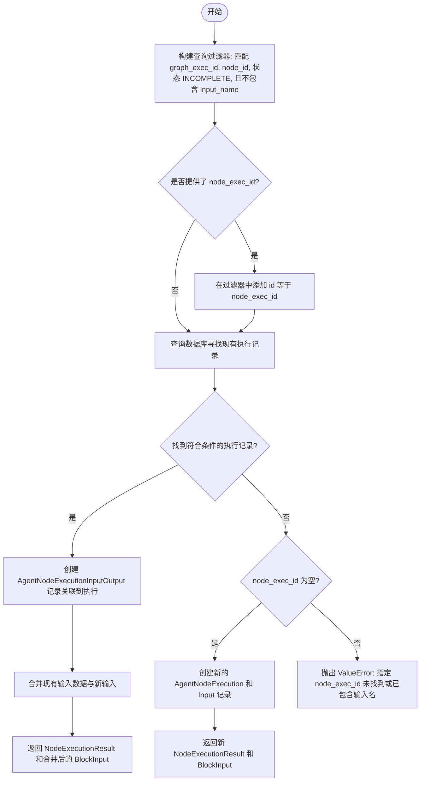

#### 带注释源码

```python
async def upsert_execution_input(
    node_id: str,
    graph_exec_id: str,
    input_name: str,
    input_data: JsonValue,
    node_exec_id: str | None = None,
) -> tuple[NodeExecutionResult, BlockInput]:
    """
    Insert AgentNodeExecutionInputOutput record for as one of AgentNodeExecution.Input.
    If there is no AgentNodeExecution that has no `input_name` as input, create new one.

    Args:
        node_id: The id of the AgentNode.
        graph_exec_id: The id of the AgentGraphExecution.
        input_name: The name of the input data.
        input_data: The input data to be inserted.
        node_exec_id: [Optional] The id of the AgentNodeExecution that has no `input_name` as input. If not provided, it will find the eligible incomplete AgentNodeExecution or create a new one.

    Returns:
        str: The id of the created or existing AgentNodeExecution.
        dict[str, Any]: Node input data; key is the input name, value is the input data.
    """
    # 构建查询过滤器：寻找属于特定图执行、特定节点、状态为 INCOMPLETE
    # 且在最近24小时内没有名为 input_name 的输入记录的 AgentNodeExecution
    existing_exec_query_filter: AgentNodeExecutionWhereInput = {
        "agentGraphExecutionId": graph_exec_id,
        "agentNodeId": node_id,
        "executionStatus": ExecutionStatus.INCOMPLETE,
        "Input": {
            "none": {
                "name": input_name,
                "time": {"gte": datetime.now(tz=timezone.utc) - timedelta(days=1)},
            }
        },
    }
    # 如果提供了具体的 node_exec_id，则必须精确匹配该 ID
    if node_exec_id:
        existing_exec_query_filter["id"] = node_exec_id

    # 尝试查找符合条件的现有执行记录，按添加时间升序排列
    existing_execution = await AgentNodeExecution.prisma().find_first(
        where=existing_exec_query_filter,
        order={"addedTime": "asc"},
        include={"Input": True, "GraphExecution": True},
    )
    json_input_data = SafeJson(input_data)

    # 情况 1: 找到了现有的执行记录 -> 更新（Upsert 中的 Update）
    if existing_execution:
        # 创建新的输入输出记录，关联到现有的执行 ID
        await AgentNodeExecutionInputOutput.prisma().create(
            data=AgentNodeExecutionInputOutputCreateInput(
                name=input_name,
                data=json_input_data,
                referencedByInputExecId=existing_execution.id,
            )
        )
        # 返回更新后的执行结果和合并后的输入数据字典
        return NodeExecutionResult.from_db(existing_execution), {
            **{
                input_data.name: type_utils.convert(input_data.data, JsonValue)
                for input_data in existing_execution.Input or []
            },
            input_name: input_data,
        }

    # 情况 2: 未找到现有记录，且未指定 node_exec_id -> 创建新记录（Upsert 中的 Insert）
    elif not node_exec_id:
        # 创建新的 AgentNodeExecution 并初始化输入数据
        result = await AgentNodeExecution.prisma().create(
            data=AgentNodeExecutionCreateInput(
                agentNodeId=node_id,
                agentGraphExecutionId=graph_exec_id,
                executionStatus=ExecutionStatus.INCOMPLETE,
                Input={"create": {"name": input_name, "data": json_input_data}},
            ),
            include={"GraphExecution": True},
        )
        return NodeExecutionResult.from_db(result), {input_name: input_data}

    # 情况 3: 指定了 node_exec_id 但未找到符合条件的记录（可能已存在该输入或ID无效）
    else:
        raise ValueError(
            f"NodeExecution {node_exec_id} not found or already has input {input_name}."
        )
```


### `upsert_execution_output`

该函数用于向数据库中插入一条记录，将特定的输出数据与节点执行关联起来，作为节点执行结果的一部分。

参数：

- `node_exec_id`：`str`，节点执行记录的唯一标识符。
- `output_name`：`str`，输出数据的名称或键。
- `output_data`：`Any | None`，要存储的输出数据内容，如果为 None 则不存储数据值。

返回值：`None`，无返回值，主要执行数据库插入操作。

#### 流程图

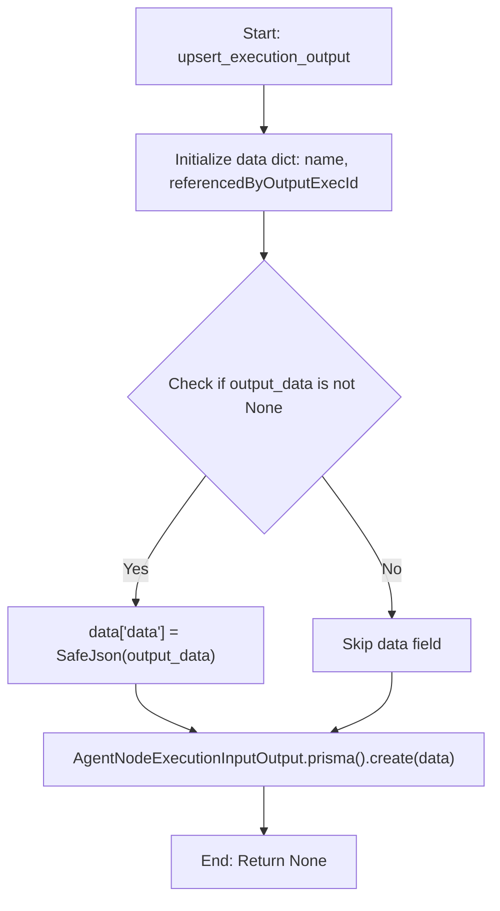

#### 带注释源码

```python
async def upsert_execution_output(
    node_exec_id: str,
    output_name: str,
    output_data: Any | None,
) -> None:
    """
    Insert AgentNodeExecutionInputOutput record for as one of AgentNodeExecution.Output.
    """
    # 准备创建数据库记录所需的基础数据字典
    # 包含输出名称和关联的节点执行ID
    data: AgentNodeExecutionInputOutputCreateInput = {
        "name": output_name,
        "referencedByOutputExecId": node_exec_id,
    }
    
    # 检查输出数据是否不为 None
    if output_data is not None:
        # 如果有数据，使用 SafeJson 包装以确保安全存入 JSON 字段
        data["data"] = SafeJson(output_data)
    
    # 调用 Prisma 客户端在数据库中创建新的输入输出记录
    await AgentNodeExecutionInputOutput.prisma().create(data=data)
```


### `get_execution_outputs_by_node_exec_id`

Get all execution outputs for a specific node execution ID.

参数：

-   `node_exec_id`：`str`，The node execution ID to get outputs for

返回值：`dict[str, Any]`，Dictionary mapping output names to their data values

#### 流程图

```mermaid
flowchart TD
    A[开始: get_execution_outputs_by_node_exec_id] --> B[输入参数: node_exec_id]
    B --> C[查询数据库: AgentNodeExecutionInputOutput]
    C --> D[筛选条件: referencedByOutputExecId == node_exec_id]
    D --> E[初始化空字典 result]
    E --> F[遍历查询结果 outputs]
    F --> G{检查 output.data 是否为 None?}
    G -- 是 --> F
    G -- 否 --> H[转换数据类型: type_utils.convert]
    H --> I[添加至 result 字典: result[output.name] = data]
    I --> F
    F -- 遍历结束 --> J[返回 result]
    J --> K[结束]
```

#### 带注释源码

```python
async def get_execution_outputs_by_node_exec_id(
    node_exec_id: str,
) -> dict[str, Any]:
    """
    Get all execution outputs for a specific node execution ID.

    Args:
        node_exec_id: The node execution ID to get outputs for

    Returns:
        Dictionary mapping output names to their data values
    """
    # 根据节点执行ID从数据库查询所有相关的输入输出记录
    outputs = await AgentNodeExecutionInputOutput.prisma().find_many(
        where={"referencedByOutputExecId": node_exec_id}
    )

    # 初始化结果字典
    result = {}
    # 遍历查询到的输出记录
    for output in outputs:
        # 如果数据不为空，则进行类型转换并存入结果字典
        if output.data is not None:
            result[output.name] = type_utils.convert(output.data, JsonValue)

    return result
```


### `update_graph_execution_start_time`

该函数用于将指定的图执行（Graph Execution）的状态更新为“运行中”（RUNNING），并将当前时间记录为开始时间（startedAt），同时返回包含详细信息的更新后的图执行对象。

参数：

-   `graph_exec_id`：`str`，需要更新的图执行的唯一标识符。

返回值：`GraphExecution | None`，返回更新后的 `GraphExecution` 对象（包含输入和Webhook块信息），如果未找到对应记录则返回 `None`。

#### 流程图

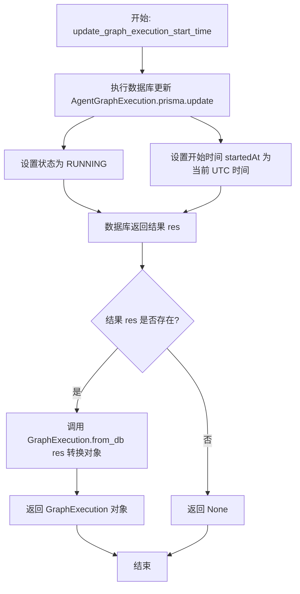

#### 带注释源码

```python
async def update_graph_execution_start_time(
    graph_exec_id: str,
) -> GraphExecution | None:
    # 使用 Prisma 客户端执行数据库更新操作
    res = await AgentGraphExecution.prisma().update(
        # 指定更新条件：ID 匹配传入的 graph_exec_id
        where={"id": graph_exec_id},
        # 指定更新数据
        data={
            # 将执行状态更改为 RUNNING
            "executionStatus": ExecutionStatus.RUNNING,
            # 将开始时间设置为当前的 UTC 时间
            "startedAt": datetime.now(tz=timezone.utc),
        },
        # 指定查询包含的数据：包含所有 Input Block 和 Webhook Block 的 ID 信息
        include=graph_execution_include(
            [*get_io_block_ids(), *get_webhook_block_ids()]
        ),
    )
    # 如果数据库查询结果存在，则将其转换为业务模型 GraphExecution；否则返回 None
    return GraphExecution.from_db(res) if res else None
```


### `update_graph_execution_stats`

更新指定图执行记录的状态和统计信息（如耗时、成本等）。此函数会验证状态转换的合法性，并在执行终端状态时自动设置结束时间。

参数：

-  `graph_exec_id`：`str`，要更新的图执行记录的唯一标识符。
-  `status`：`ExecutionStatus | None`，新的执行状态（如 RUNNING, COMPLETED 等），如果为 None 则不更新状态。
-  `stats`：`GraphExecutionStats | None`，包含执行统计数据（如成本、持续时间、节点数量等）的 Pydantic 模型，如果为 None 则不更新统计数据。

返回值：`GraphExecution | None`，更新后的图执行对象（GraphExecution），如果查询不到记录或更新失败则可能返回 None 或抛出异常（具体行为取决于 Prisma 客户端的实现，代码中使用 `find_unique_or_raise` 意味着记录不存在时会抛出异常）。

#### 流程图

```mermaid
flowchart TD
    A[开始: update_graph_execution_stats] --> B{检查 status 和 stats}
    B -- 两者均为 None --> C[抛出 ValueError 异常]
    B -- 至少有一个不为 None --> D[初始化 update_data 字典]
    D --> E{提供了 stats?}
    E -- 是 --> F[将 stats 转换为字典<br/>处理 error 字段为字符串]
    F --> G[将 SafeJson(stats) 加入 update_data]
    E -- 否 --> G
    G --> H{提供了 status?}
    H -- 是 --> I[将 status 加入 update_data]
    I --> J{status 是终止状态?<br/>COMPLETED/FAILED/TERMINATED}
    J -- 是 --> K[设置 endedAt 为当前 UTC 时间]
    J -- 否 --> L[构建基础 where 条件: id]
    K --> L
    H -- 否 --> L
    L --> M{提供了 status?}
    M -- 是 --> N[获取 VALID_STATUS_TRANSITIONS]
    N --> O{存在有效的源状态转换?}
    O -- 否 --> P[抛出 ValueError 异常]
    O -- 是 --> Q[扩展 where 条件:<br/>当前状态 IN 允许的源状态列表]
    M -- 否 --> R[仅使用 id 作为 where 条件]
    Q --> S[执行 DB update_many 更新操作]
    R --> S
    S --> T[通过 find_unique_or_raise 获取最新记录]
    T --> U[将 DB 记录转换为 GraphExecution 模型]
    U --> V[返回 GraphExecution 对象]
```

#### 带注释源码

```python
async def update_graph_execution_stats(
    graph_exec_id: str,
    status: ExecutionStatus | None = None,
    stats: GraphExecutionStats | None = None,
) -> GraphExecution | None:
    # 参数校验：必须提供 status 或 stats 中的至少一个
    if not status and not stats:
        raise ValueError(
            f"Must provide either status or stats to update for execution {graph_exec_id}"
        )

    # 准备更新数据字典
    update_data: AgentGraphExecutionUpdateManyMutationInput = {}

    # 处理统计数据更新
    if stats:
        stats_dict = stats.model_dump()
        # 如果 error 字段是 Exception 对象，将其转换为字符串以便序列化
        if isinstance(stats_dict.get("error"), Exception):
            stats_dict["error"] = str(stats_dict["error"])
        # 使用 SafeJson 包装以确保数据安全
        update_data["stats"] = SafeJson(stats_dict)

    # 处理状态更新
    if status:
        update_data["executionStatus"] = status
        # 定义终止状态列表
        terminal_statuses = [
            ExecutionStatus.COMPLETED,
            ExecutionStatus.FAILED,
            ExecutionStatus.TERMINATED,
        ]
        # 如果状态变为终止状态，自动设置结束时间
        if status in terminal_statuses:
            update_data["endedAt"] = datetime.now(tz=timezone.utc)

    # 初始化查询条件：必须匹配 ID
    where_clause: AgentGraphExecutionWhereInput = {"id": graph_exec_id}

    # 如果提供了状态，需要进行状态转换合法性检查
    if status:
        # 获取允许转换到当前状态的源状态列表
        if allowed_from := VALID_STATUS_TRANSITIONS.get(status, []):
            # 构建 AND 条件：ID 匹配 且 (当前状态在允许的源状态列表中)
            # 这确保了只有在特定状态下才能更新到目标状态
            where_clause["AND"] = [
                {"id": graph_exec_id},
                {"OR": [{"executionStatus": s} for s in allowed_from]},
            ]
        else:
            # 如果找不到允许的转换规则，抛出异常
            raise ValueError(
                f"Status {status} cannot be set via update for execution {graph_exec_id}. "
                f"This status can only be set at creation or is not a valid target status."
            )

    # 执行批量更新操作（使用 where_clause 确保只更新符合条件的行）
    await AgentGraphExecution.prisma().update_many(
        where=where_clause,
        data=update_data,
    )

    # 重新查询并返回更新后的完整图执行对象
    # find_unique_or_raise 在找不到记录时会抛出异常
    graph_exec = await AgentGraphExecution.prisma().find_unique_or_raise(
        where={"id": graph_exec_id},
        include=graph_execution_include(
            [*get_io_block_ids(), *get_webhook_block_ids()]
        ),
    )

    return GraphExecution.from_db(graph_exec)
```


### `update_node_execution_status_batch`

批量更新指定节点执行记录的状态。该函数会验证状态转换的合法性，仅更新那些当前状态允许转换为目标状态的节点，并根据状态类型自动设置相应的时间戳（如排队时间、开始时间、结束时间）以及统计信息。

参数：

- `node_exec_ids`：`list[str]`，需要更新状态的节点执行记录ID列表。
- `status`：`ExecutionStatus`，目标执行状态（枚举类型）。
- `stats`：`dict[str, Any] | None`，可选参数，包含节点执行统计数据的字典，将更新到数据库中。

返回值：`int`，数据库中受影响的行数（即实际成功更新的节点执行记录数量）。

#### 流程图

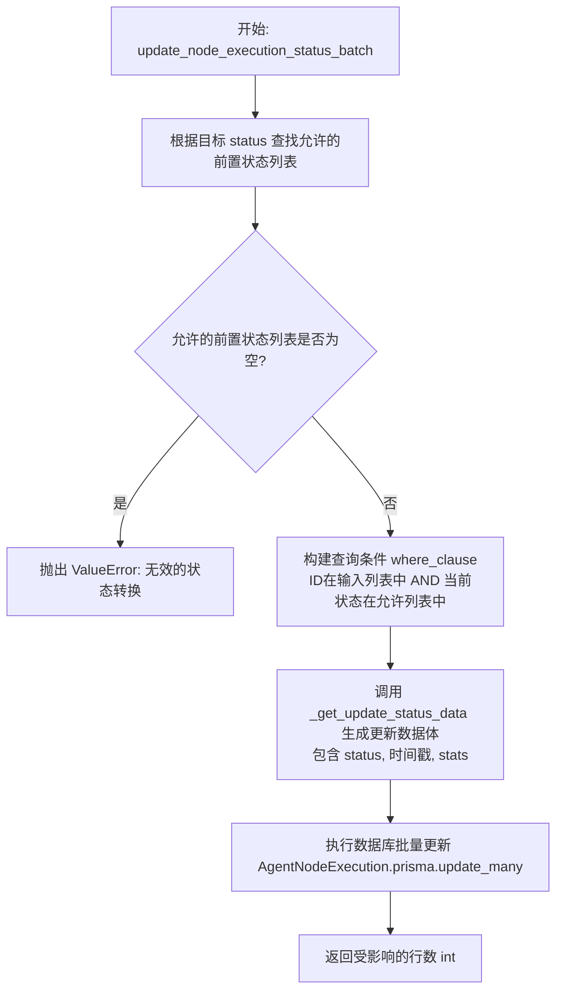

#### 带注释源码

```python
async def update_node_execution_status_batch(
    node_exec_ids: list[str],
    status: ExecutionStatus,
    stats: dict[str, Any] | None = None,
) -> int:
    # 获取允许转换到目标 status 的前置状态列表
    # 如果传入的 status 不是一个合法的目标状态，allowed_from 将为空
    allowed_from = VALID_STATUS_TRANSITIONS.get(status, [])
    if not allowed_from:
        raise ValueError(
            f"Invalid status transition: {status} has no valid source statuses"
        )

    # 构造批量更新的过滤条件
    # 仅更新 ID 在列表中 且 当前状态处于允许转换状态 的记录
    where_clause = cast(
        AgentNodeExecutionWhereInput,
        {
            "id": {"in": node_exec_ids},
            "executionStatus": {"in": [s.value for s in allowed_from]},
        },
    )

    # 执行数据库批量更新
    # _get_update_status_data 会根据 status 自动设置 queuedTime, startedTime 或 endedTime
    # 并合并传入的 stats 数据
    return await AgentNodeExecution.prisma().update_many(
        where=where_clause,
        data=_get_update_status_data(status, None, stats),
    )
```


### `update_node_execution_status`

更新特定节点执行记录的状态，包括处理状态转换验证、更新相关时间戳（如排队时间、开始时间、结束时间）以及存储执行数据和统计信息。

参数：

- `node_exec_id`：`str`，要更新的节点执行记录的唯一标识符。
- `status`：`ExecutionStatus`，要设置的新状态（例如：QUEUED, RUNNING, COMPLETED）。
- `execution_data`：`BlockInput | None`，与执行相关的输入或输出数据。当状态为 QUEUED 时，此参数不能为 None。
- `stats`：`dict[str, Any] | None`，可选的统计信息字典（例如：运行时间、错误信息等），将存储在节点执行记录中。

返回值：`NodeExecutionResult`，更新后的节点执行结果对象，包含最新的状态、时间戳和数据。

#### 流程图

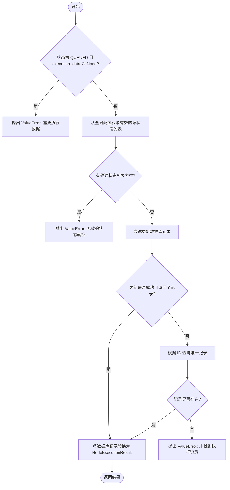

#### 带注释源码

```python
async def update_node_execution_status(
    node_exec_id: str,
    status: ExecutionStatus,
    execution_data: BlockInput | None = None,
    stats: dict[str, Any] | None = None,
) -> NodeExecutionResult:
    # 校验：如果状态是 QUEUED，必须提供 execution_data
    if status == ExecutionStatus.QUEUED and execution_data is None:
        raise ValueError("Execution data must be provided when queuing an execution.")

    # 校验：检查状态转换是否合法，从全局字典 VALID_STATUS_TRANSITIONS 获取允许的前置状态
    allowed_from = VALID_STATUS_TRANSITIONS.get(status, [])
    if not allowed_from:
        raise ValueError(
            f"Invalid status transition: {status} has no valid source statuses"
        )

    # 尝试在数据库中更新记录
    # where 条件确保记录 ID 匹配且当前状态在允许的前置状态列表中
    if res := await AgentNodeExecution.prisma().update(
        where=cast(
            AgentNodeExecutionWhereUniqueInput,
            {
                "id": node_exec_id,
                "executionStatus": {"in": [s.value for s in allowed_from]},
            },
        ),
        data=_get_update_status_data(status, execution_data, stats),
        include=EXECUTION_RESULT_INCLUDE,
    ):
        # 如果更新成功，返回转换后的结果对象
        return NodeExecutionResult.from_db(res)

    # 如果更新没有返回结果（通常是因为当前状态不匹配允许的前置状态），尝试直接查询记录
    # 这种情况通常发生在状态已经是目标状态，或者并发更新导致的状态不匹配
    if res := await AgentNodeExecution.prisma().find_unique(
        where={"id": node_exec_id}, include=EXECUTION_RESULT_INCLUDE
    ):
        return NodeExecutionResult.from_db(res)

    # 如果既没有更新成功也没有查到记录，说明记录不存在
    raise ValueError(f"Execution {node_exec_id} not found.")
```


### `_get_update_status_data`

根据执行状态和相关数据，构造用于更新数据库中节点执行记录的输入数据字典。

参数：

- `status`：`ExecutionStatus`，目标执行状态（如 QUEUED, RUNNING, COMPLETED 等）。
- `execution_data`：`BlockInput | None`，可选参数，节点执行的输入数据，如果提供则会被序列化并存入数据库。
- `stats`：`dict[str, Any] | None`，可选参数，节点执行的统计数据（如耗时、错误信息等），如果提供则会被序列化并存入数据库。

返回值：`AgentNodeExecutionUpdateInput`，包含更新后的状态、对应的时间戳以及可选的序列化数据和统计信息的字典对象，用于 Prisma 更新操作。

#### 流程图

```mermaid
graph TD
    A[开始] --> B[获取当前 UTC 时间 now]
    B --> C[初始化 update_data 并设置 executionStatus]
    C --> D{检查 status 的值}
    D -- QUEUED --> E[设置 update_data['queuedTime'] = now]
    D -- RUNNING --> F[设置 update_data['startedTime'] = now]
    D -- FAILED 或 COMPLETED --> G[设置 update_data['endedTime'] = now]
    E --> H{execution_data 是否存在?}
    F --> H
    G --> H
    H -- 是 --> I[使用 SafeJson 封装 execution_data 并存入 update_data]
    H -- 否 --> J{stats 是否存在?}
    I --> J
    J -- 是 --> K[使用 SafeJson 封装 stats 并存入 update_data]
    J -- 否 --> L[返回 update_data]
    K --> L
```

#### 带注释源码

```python
def _get_update_status_data(
    status: ExecutionStatus,
    execution_data: BlockInput | None = None,
    stats: dict[str, Any] | None = None,
) -> AgentNodeExecutionUpdateInput:
    # 获取当前的 UTC 时间，用于设置时间戳
    now = datetime.now(tz=timezone.utc)
    
    # 初始化更新数据字典，始终包含新的状态
    update_data: AgentNodeExecutionUpdateInput = {"executionStatus": status}

    # 根据目标状态设置相应的时间戳字段
    if status == ExecutionStatus.QUEUED:
        # 如果状态为排队，设置排队时间
        update_data["queuedTime"] = now
    elif status == ExecutionStatus.RUNNING:
        # 如果状态为运行中，设置开始时间
        update_data["startedTime"] = now
    elif status in (ExecutionStatus.FAILED, ExecutionStatus.COMPLETED):
        # 如果状态为失败或完成，设置结束时间
        update_data["endedTime"] = now

    # 如果提供了执行数据，使用 SafeJson 封装并存入更新字典
    if execution_data:
        update_data["executionData"] = SafeJson(execution_data)
    
    # 如果提供了统计数据，使用 SafeJson 封装并存入更新字典
    if stats:
        update_data["stats"] = SafeJson(stats)

    # 返回构造好的更新数据
    return update_data
```


### `delete_graph_execution`

用于删除指定的图执行记录。该函数支持软删除（标记为已删除）和硬删除（从数据库中永久移除），并通过用户ID进行权限校验，确保只有所属用户才能删除对应的执行记录。

参数：

-   `graph_exec_id`：`str`，要删除的图执行记录的唯一标识符。
-   `user_id`：`str`，执行删除操作的用户ID，用于校验权限。
-   `soft_delete`：`bool`，指示是否执行软删除。如果为 True（默认），则将 `isDeleted` 标记设为 True；如果为 False，则从数据库中永久删除该记录。

返回值：`None`，无返回值。如果找不到指定的执行记录或记录不属于该用户，则抛出 `DatabaseError` 异常。

#### 流程图

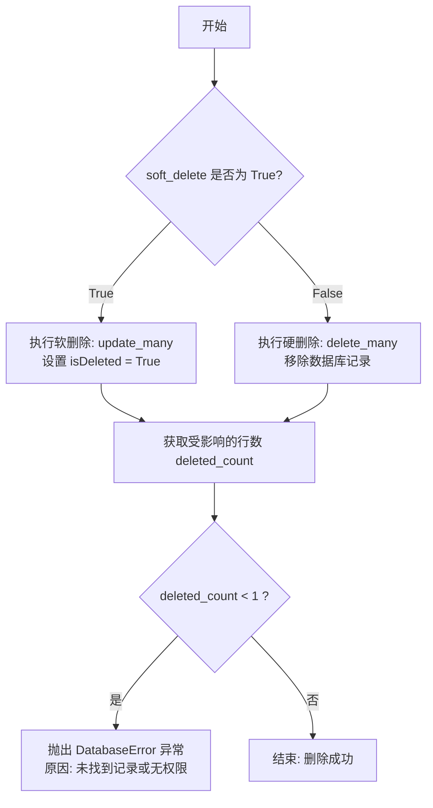

#### 带注释源码

```python
async def delete_graph_execution(
    graph_exec_id: str, user_id: str, soft_delete: bool = True
) -> None:
    # 判断是否执行软删除，默认为 True
    if soft_delete:
        # 软删除操作：使用 update_many 更新记录的 isDeleted 字段为 True
        # where 条件确保只删除指定 ID 且属于指定 user_id 的记录，保证安全性
        deleted_count = await AgentGraphExecution.prisma().update_many(
            where={"id": graph_exec_id, "userId": user_id}, data={"isDeleted": True}
        )
    else:
        # 硬删除操作：直接从数据库中物理删除记录
        # 同样通过 where 条件进行权限和存在性校验
        deleted_count = await AgentGraphExecution.prisma().delete_many(
            where={"id": graph_exec_id, "userId": user_id}
        )
    
    # 检查受影响的行数，如果小于 1，说明没有匹配的记录被更新或删除
    if deleted_count < 1:
        # 抛出数据库错误，提示找不到对应的图执行记录
        raise DatabaseError(
            f"Could not delete graph execution #{graph_exec_id}: not found"
        )
```


### `get_node_execution`

通过 ID 从数据库获取特定节点的执行记录详情，并将其转换为应用层的 `NodeExecutionResult` 对象。注意：此函数内部不执行用户 ID 权限检查，因此在面向用户的端点调用时必须先进行权限验证。

参数：

-   `node_exec_id`：`str`，需要查询的节点执行记录的唯一标识符。

返回值：`NodeExecutionResult | None`，如果找到对应的执行记录，则返回包含详细信息的 `NodeExecutionResult` 对象；如果未找到，则返回 `None`。

#### 流程图

```mermaid
flowchart TD
    A[开始: get_node_execution] --> B[接收参数 node_exec_id]
    B --> C[执行数据库查询 AgentNodeExecution.prisma().find_first]
    C --> D{查询结果是否存在?}
    D -- 是 --> E[调用 NodeExecutionResult.from_db 映射数据]
    E --> F[返回 NodeExecutionResult 对象]
    D -- 否 --> G[返回 None]
    F --> H[结束]
    G --> H
```

#### 带注释源码

```python
async def get_node_execution(node_exec_id: str) -> NodeExecutionResult | None:
    """⚠️ No `user_id` check: DO NOT USE without check in user-facing endpoints."""
    # 使用 Prisma Client 查询单个节点执行记录
    # EXECUTION_RESULT_INCLUDE 定义了需要包含的关联数据（如 Node, GraphExecution, Input, Output 等）
    execution = await AgentNodeExecution.prisma().find_first(
        where={"id": node_exec_id},
        include=EXECUTION_RESULT_INCLUDE,
    )
    # 如果查询结果为空，说明不存在该 ID 的执行记录，返回 None
    if not execution:
        return None
    # 将数据库返回的原始模型对象转换为业务逻辑使用的 NodeExecutionResult 对象
    return NodeExecutionResult.from_db(execution)
```


### `_build_node_execution_where_clause`

该函数的核心功能是构建一个用于查询节点执行记录（Node Execution）的数据库过滤条件字典。它根据传入的可选参数（如图执行ID、节点ID、块ID列表、状态列表和时间范围），动态生成符合 Prisma 客户端查询语法的 `AgentNodeExecutionWhereInput` 对象。

参数：

- `graph_exec_id`：`str | None`，可选参数，用于指定所属的图执行ID。
- `node_id`：`str | None`，可选参数，用于指定具体的节点ID。
- `block_ids`：`list[str] | None`，可选参数，用于筛选与特定块ID列表关联的节点执行。
- `statuses`：`list[ExecutionStatus] | None`，可选参数，用于筛选处于特定状态列表中的节点执行。
- `created_time_gte`：`datetime | None`，可选参数，用于筛选创建时间大于等于该值的记录。
- `created_time_lte`：`datetime | None`，可选参数，用于筛选创建时间小于等于该值的记录。

返回值：`AgentNodeExecutionWhereInput`，返回一个字典对象，包含构建好的数据库查询过滤条件。

#### 流程图

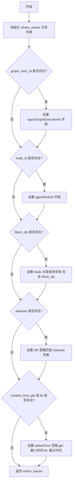

#### 带注释源码

```python
def _build_node_execution_where_clause(
    graph_exec_id: str | None = None,
    node_id: str | None = None,
    block_ids: list[str] | None = None,
    statuses: list[ExecutionStatus] | None = None,
    created_time_gte: datetime | None = None,
    created_time_lte: datetime | None = None,
) -> AgentNodeExecutionWhereInput:
    """
    Build where clause for node execution queries.
    """
    # 初始化空的过滤条件字典，类型为 AgentNodeExecutionWhereInput
    where_clause: AgentNodeExecutionWhereInput = {}
    
    # 如果提供了图执行 ID，则添加对应字段的过滤条件
    if graph_exec_id:
        where_clause["agentGraphExecutionId"] = graph_exec_id
        
    # 如果提供了节点 ID，则添加对应字段的过滤条件
    if node_id:
        where_clause["agentNodeId"] = node_id
        
    # 如果提供了块 ID 列表，则构建关联查询条件
    # 这里假设 NodeExecution 关联了 Node 表，通过 Node 表的 agentBlockId 字段进行过滤
    if block_ids:
        where_clause["Node"] = {"is": {"agentBlockId": {"in": block_ids}}}
        
    # 如果提供了状态列表，则构建 OR 逻辑的过滤条件
    # 只要执行状态匹配列表中的任意一个状态即可
    if statuses:
        where_clause["OR"] = [{"executionStatus": status} for status in statuses]

    # 如果提供了时间范围（起始或结束），则构建 addedTime 的范围过滤
    # 如果只提供一边，另一边会使用 datetime.min 或 datetime.max 作为默认值
    if created_time_gte or created_time_lte:
        where_clause["addedTime"] = {
            "gte": created_time_gte or datetime.min.replace(tzinfo=timezone.utc),
            "lte": created_time_lte or datetime.max.replace(tzinfo=timezone.utc),
        }

    return where_clause
```


### `get_node_executions`

检索节点执行记录，根据图执行ID、节点ID、块ID、状态或创建时间等条件进行过滤。支持限制结果数量，并可选择是否包含详细的执行数据。

参数：

-  `graph_exec_id`：`str | None`，要筛选的图执行ID（AgentGraphExecution ID）。
-  `node_id`：`str | None`，要筛选的特定节点ID（AgentNode ID）。
-  `block_ids`：`list[str] | None`，要筛选的块ID列表。
-  `statuses`：`list[ExecutionStatus] | None`，要筛选的执行状态列表。
-  `limit`：`int | None`，返回结果的最大数量限制。
-  `created_time_gte`：`datetime | None`，创建时间的筛选起始值（大于等于）。
-  `created_time_lte`：`datetime | None`，创建时间的筛选结束值（小于等于）。
-  `include_exec_data`：`bool`，是否在结果中包含完整的执行数据（如输入输出），默认为 True。

返回值：`list[NodeExecutionResult]`，包含符合条件的节点执行结果对象的列表。

#### 流程图

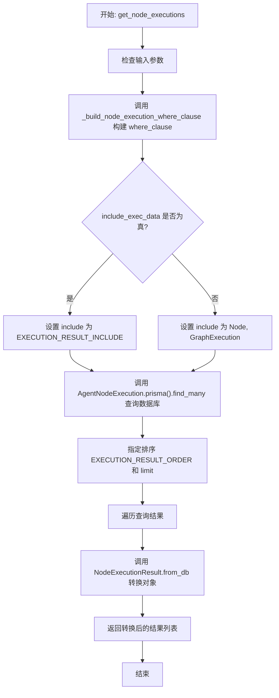

#### 带注释源码

```python
async def get_node_executions(
    graph_exec_id: str | None = None,
    node_id: str | None = None,
    block_ids: list[str] | None = None,
    statuses: list[ExecutionStatus] | None = None,
    limit: int | None = None,
    created_time_gte: datetime | None = None,
    created_time_lte: datetime | None = None,
    include_exec_data: bool = True,
) -> list[NodeExecutionResult]:
    """⚠️ No `user_id` check: DO NOT USE without check in user-facing endpoints."""
    # 构建数据库查询的 where 过滤条件
    where_clause = _build_node_execution_where_clause(
        graph_exec_id=graph_exec_id,
        node_id=node_id,
        block_ids=block_ids,
        statuses=statuses,
        created_time_gte=created_time_gte,
        created_time_lte=created_time_lte,
    )

    # 执行数据库查询
    executions = await AgentNodeExecution.prisma().find_many(
        where=where_clause,
        # 根据 include_exec_data 参数决定包含的关联数据深度
        include=(
            EXECUTION_RESULT_INCLUDE
            if include_exec_data
            else {"Node": True, "GraphExecution": True}
        ),
        # 设置排序规则
        order=EXECUTION_RESULT_ORDER,
        # 设置获取数量限制
        take=limit,
    )
    # 将数据库返回的原始模型转换为业务层的 NodeExecutionResult 对象
    res = [NodeExecutionResult.from_db(execution) for execution in executions]
    return res
```


### `get_latest_node_execution`

根据节点ID和图执行ID，检索该节点在指定图执行上下中最新的一条执行记录，且仅返回状态为队列中、运行中、已完成、终止或失败的非未完成状态记录。

参数：

- `node_id`：`str`，代理节点的ID，用于指定查询哪个节点的执行记录。
- `graph_eid`：`str`，代理图执行的ID，用于限定查询的图执行上下文。

返回值：`NodeExecutionResult | None`，返回包含详细信息的节点执行结果对象，如果未找到匹配记录则返回 None。

#### 流程图

```mermaid
flowchart TD
    A[开始: 接收 node_id 和 graph_eid] --> B[构建数据库查询条件<br/>匹配 graph_eid 和 node_id]
    B --> C[添加状态过滤 OR 条件<br/>QUEUED/RUNNING/COMPLETED/TERMINATED/FAILED]
    C --> D[执行查询 AgentNodeExecution.find_first<br/>指定包含字段和排序规则]
    D --> E{查询结果是否存在?}
    E -- 否 --> F[返回 None]
    E -- 是 --> G[调用 NodeExecutionResult.from_db<br/>将数据库对象转换为领域模型]
    G --> H[返回转换后的 NodeExecutionResult]
```

#### 带注释源码

```python
async def get_latest_node_execution(
    node_id: str, graph_eid: str
) -> NodeExecutionResult | None:
    """
    ⚠️ 无 `user_id` 检查：不要在面向用户的端点中使用，除非进行检查。
    
    获取特定节点在特定图执行上下文中的最新执行记录。
    过滤条件排除 'INCOMPLETE' 状态，专注于已激活或已结束的执行。
    """
    # 构建并执行数据库查询
    # 1. where: 筛选指定图执行 ID 和 节点 ID
    # 2. OR: 筛选特定的执行状态（排除 INCOMPLETE）
    # 3. include: 包含执行结果所需的关联数据（如 Input, Output, Node, GraphExecution）
    # 4. order: 按预设规则排序（通常基于时间倒序），以获取最新的一条
    execution = await AgentNodeExecution.prisma().find_first(
        where={
            "agentGraphExecutionId": graph_eid,
            "agentNodeId": node_id,
            "OR": [
                {"executionStatus": ExecutionStatus.QUEUED},
                {"executionStatus": ExecutionStatus.RUNNING},
                {"executionStatus": ExecutionStatus.COMPLETED},
                {"executionStatus": ExecutionStatus.TERMINATED},
                {"executionStatus": ExecutionStatus.FAILED},
            ],
        },
        include=EXECUTION_RESULT_INCLUDE,
        order=EXECUTION_RESULT_ORDER,
    )
    
    # 如果未找到符合条件的执行记录，返回 None
    if not execution:
        return None
        
    # 将数据库中的原始执行记录转换为领域模型对象 NodeExecutionResult
    return NodeExecutionResult.from_db(execution)
```


### `get_execution_kv_data`

根据用户ID和键名获取执行键值对数据。

参数：

- `user_id`：`str`，用户的ID。
- `key`：`str`，要检索数据的键名。

返回值：`Any | None`，与键关联的数据，如果未找到记录或数据为空则返回 None。

#### 流程图

```mermaid
flowchart TD
    A[开始: get_execution_kv_data] --> B[调用 AgentNodeExecutionKeyValueData.prisma().find_unique]
    B --> C{查询是否成功 且 data 字段非空?}
    C -- 是 --> D[使用 type_utils.convert 将数据转换为 Python 类型]
    D --> E[返回转换后的数据]
    C -- 否 --> F[返回 None]
    E --> G[结束]
    F --> G
```

#### 带注释源码

```python
async def get_execution_kv_data(user_id: str, key: str) -> Any | None:
    """
    Get key-value data for a user and key.

    Args:
        user_id: The id of the User.
        key: The key to retrieve data for.

    Returns:
        The data associated with the key, or None if not found.
    """
    # 使用 Prisma 客户端，根据复合唯一索引 {userId, key} 查找数据
    kv_data = await AgentNodeExecutionKeyValueData.prisma().find_unique(
        where={"userId_key": {"userId": user_id, "key": key}}
    )
    
    # 如果找到记录且记录中的 data 字段不为空，则将数据库中的 Json 类型转换为 Python 的 Any 类型
    # 否则返回 None
    return (
        type_utils.convert(kv_data.data, type[Any])
        if kv_data and kv_data.data
        else None
    )
```


### `set_execution_kv_data`

为指定的用户和键设置键值数据。该函数执行数据库的 Upsert（更新或插入）操作，将任意类型的数据与特定的用户 ID、键和节点执行 ID 关联起来。如果记录已存在，则更新其关联的节点执行 ID 和数据；如果不存在，则创建新记录。

参数：

-   `user_id`：`str`，用户的 ID。
-   `node_exec_id`：`str`，代理节点执行的 ID。
-   `key`：`str`，用于存储数据的键名。
-   `data`：`Any`，需要存储的数据，可以是任意类型。

返回值：`Any | None`，返回存储在数据库中的数据（已转换为 Python 类型），如果响应无效则返回 None。

#### 流程图

```mermaid
flowchart TD
    A([开始]) --> B[接收参数: user_id, node_exec_id, key, data]
    B --> C{数据 data 为 None?}
    C -- 是 --> D[处理为: None]
    C -- 否 --> E[使用 SafeJson 包装数据]
    D --> F[执行 Prisma Upsert 操作]
    E --> F
    F --> G{数据库中是否存在 userId_key?}
    G -- 是 --> H[更新: 设置 agentNodeExecutionId 和 data]
    G -- 否 --> I[创建: 插入新记录]
    H --> J[获取操作响应 resp]
    I --> J
    J --> K{resp.data 存在且有效?}
    K -- 是 --> L[使用 type_utils.convert 转换类型并返回]
    K -- 否 --> M[返回 None]
    L --> N([结束])
    M --> N
```

#### 带注释源码

```python
async def set_execution_kv_data(
    user_id: str, node_exec_id: str, key: str, data: Any
) -> Any | None:
    """
    Set key-value data for a user and key.

    Args:
        user_id: The id of the User.
        node_exec_id: The id of the AgentNodeExecution.
        key: The key to store data under.
        data: The data to store.
    """
    # 使用 Prisma 客户端执行 upsert 操作
    # where: 定义唯一查找条件，由 userId 和 key 组成的复合键
    # data: 包含 create（如果不存在则创建）和 update（如果存在则更新）的逻辑
    resp = await AgentNodeExecutionKeyValueData.prisma().upsert(
        where={"userId_key": {"userId": user_id, "key": key}},
        data={
            "create": AgentNodeExecutionKeyValueDataCreateInput(
                userId=user_id,
                agentNodeExecutionId=node_exec_id,
                key=key,
                # 如果数据不为 None，则使用 SafeJson 包装以确保安全序列化
                data=SafeJson(data) if data is not None else None,
            ),
            "update": {
                "agentNodeExecutionId": node_exec_id,
                # 更新时同样处理数据
                "data": SafeJson(data) if data is not None else None,
            },
        },
    )
    # 返回转换后的数据，如果响应为空或数据无效则返回 None
    return type_utils.convert(resp.data, type[Any]) if resp and resp.data else None
```


### `get_block_error_stats`

该函数通过执行高效的 SQL 聚合查询，获取指定时间范围内模块执行的错误统计数据。它计算每个模块的总执行次数和失败次数，并仅返回执行次数达到特定阈值的模块统计结果，以用于监控和分析系统稳定性。

参数：

- `start_time`：`datetime`，统计时间范围的开始时间。
- `end_time`：`datetime`，统计时间范围的结束时间。

返回值：`list[BlockErrorStats]`，包含模块错误统计对象的列表，每个对象包含模块 ID、总执行次数和失败执行次数。

#### 流程图

```mermaid
flowchart TD
    A[开始: get_block_error_stats] --> B[定义 SQL 查询模板]
    B --> C[调用 query_raw_with_schema<br>传入时间范围参数]
    C --> D[获取查询结果]
    D --> E[遍历结果集中的每一行]
    E --> F[将行数据转换为<br>BlockErrorStats 对象]
    F --> E
    E -- 遍历结束 --> G[返回 BlockErrorStats 对象列表]
```

#### 带注释源码

```python
async def get_block_error_stats(
    start_time: datetime, end_time: datetime
) -> list[BlockErrorStats]:
    """Get block execution stats using efficient SQL aggregation."""

    # 定义原始 SQL 查询模板
    # 1. 从 AgentNodeExecution 表 (ne) 和 AgentNode 表 (n) 进行连接
    # 2. 根据 addedTime 筛选处于指定时间范围内的记录
    # 3. 按 agentBlockId (模块 ID) 进行分组
    # 4. 计算总执行次数 COUNT(*)
    # 5. 使用条件聚合 SUM(CASE...) 计算失败执行次数
    # 6. 使用 HAVING 子句过滤掉执行次数少于 10 次的模块，确保数据量级具有统计意义
    query_template = """
    SELECT 
        n."agentBlockId" as block_id,
        COUNT(*) as total_executions,
        SUM(CASE WHEN ne."executionStatus" = 'FAILED' THEN 1 ELSE 0 END) as failed_executions
    FROM {schema_prefix}"AgentNodeExecution" ne
    JOIN {schema_prefix}"AgentNode" n ON ne."agentNodeId" = n.id
    WHERE ne."addedTime" >= $1::timestamp AND ne."addedTime" <= $2::timestamp
    GROUP BY n."agentBlockId"
    HAVING COUNT(*) >= 10
    """

    # 执行原始 SQL 查询，并传入 start_time 和 end_time 作为参数
    result = await query_raw_with_schema(query_template, start_time, end_time)

    # 将查询返回的字典列表转换为强类型的 BlockErrorStats 对象列表
    return [
        BlockErrorStats(
            block_id=row["block_id"],
            total_executions=int(row["total_executions"]),
            failed_executions=int(row["failed_executions"]),
        )
        for row in result
    ]
```


### `update_graph_execution_share_status`

更新图执行记录的共享状态，包括共享标志、访问令牌以及共享时间戳。

参数：

- `execution_id`：`str`，需要更新的图执行记录的 ID。
- `user_id`：`str`，拥有该图执行的用户 ID（注：虽然包含在函数签名中，但在当前代码实现中未用于数据库查询过滤）。
- `is_shared`：`bool`，指示该执行是否已共享。
- `share_token`：`str | None`，用于访问共享执行的令牌。
- `shared_at`：`datetime | None`，执行被共享的时间戳。

返回值：`None`，无返回值。

#### 流程图

```mermaid
flowchart TD
    Start([开始]) --> Input[接收参数: execution_id, user_id, is_shared, share_token, shared_at]
    Input --> UpdateDB[执行数据库更新操作]
    UpdateDB --> Filter[设置过滤条件: id = execution_id]
    Filter --> SetFields[设置更新字段: isShared, shareToken, sharedAt]
    SetFields --> Save[保存记录]
    Save --> End([结束])
```

#### 带注释源码

```python
async def update_graph_execution_share_status(
    execution_id: str,
    user_id: str,
    is_shared: bool,
    share_token: str | None,
    shared_at: datetime | None,
) -> None:
    """
    Update the sharing status of a graph execution.
    更新特定图执行记录的共享状态，包括共享标志、共享令牌和共享时间。
    """
    await AgentGraphExecution.prisma().update(
        # 设置查询条件：根据执行 ID 查找
        # 注意：此处仅使用了 execution_id，user_id 未包含在过滤条件中
        where={"id": execution_id},
        data={
            "isShared": is_shared,         # 更新是否共享的标志
            "shareToken": share_token,     # 更新共享访问令牌
            "sharedAt": shared_at,         # 更新共享发生的时间
        },
    )
```


### `get_graph_execution_by_share_token`

根据提供的分享令牌（share token）从数据库中检索共享的图执行记录。该函数不仅验证记录是否存在、是否已标记为共享且未删除，还会聚合相关的图元数据和仅来自输出块（Output Block）的最终结果，构造一个安全的、面向公众的响应对象。

参数：

-  `share_token`：`str`，用于唯一标识共享执行记录的令牌字符串。

返回值：`SharedExecutionResponse | None`，如果找到匹配的执行记录，返回包含图名称、描述、状态、创建时间及输出数据的公开安全响应对象；如果未找到记录或记录无效，则返回 None。

#### 流程图

```mermaid
flowchart TD
    A[开始: 接收 share_token] --> B[数据库查询: 查找 AgentGraphExecution]
    B --> C{找到记录且 isShared=True<br/>且 isDeleted=False?}
    C -- 否 --> D[返回 None]
    C -- 是 --> E[初始化 outputs: CompletedBlockOutput]
    E --> F[遍历 NodeExecutions 列表]
    F --> G{节点存在 Node 关联<br/>且 agentBlockId 存在?}
    G -- 否 --> F
    G -- 是 --> H[获取 Block 定义: get_block]
    H --> I{Block 类型是 OUTPUT?}
    I -- 否 --> F
    I -- 是 --> J{executionData 存在?}
    J -- 是 --> K[从 executionData 提取 name 和 value]
    J -- 否 --> L[从 Input 关联提取 name 和 value]
    K --> M[追加到 outputs[name] 列表]
    L --> M
    M --> F
    F -- 遍历结束 --> N[构造 SharedExecutionResponse 对象]
    N --> O[返回 Response 对象]
```

#### 带注释源码

```python
async def get_graph_execution_by_share_token(
    share_token: str,
) -> SharedExecutionResponse | None:
    """Get a shared execution with limited public-safe data."""
    # 1. 查询数据库，根据 share_token 查找图执行记录
    # 约束条件：token匹配、已共享、未删除
    # 包含关联数据：AgentGraph (元数据) 和 NodeExecutions (节点执行详情)
    execution = await AgentGraphExecution.prisma().find_first(
        where={
            "shareToken": share_token,
            "isShared": True,
            "isDeleted": False,
        },
        include={
            "AgentGraph": True,
            "NodeExecutions": {
                "include": {
                    "Output": True,
                    "Node": {
                        "include": {
                            "AgentBlock": True,
                        }
                    },
                },
            },
        },
    )

    # 2. 如果未找到执行记录，直接返回 None
    if not execution:
        return None

    # 3. 提取并聚合输出数据
    # 仅从 OUTPUT 类型的块中提取数据，以确保不泄露中间处理数据
    outputs: CompletedBlockOutput = defaultdict(list)
    if execution.NodeExecutions:
        for node_exec in execution.NodeExecutions:
            # 确保节点存在且关联了 Block ID
            if node_exec.Node and node_exec.Node.agentBlockId:
                # 获取块定义以检查其类型
                block = get_block(node_exec.Node.agentBlockId)

                if block and block.block_type == BlockType.OUTPUT:
                    # 尝试从 executionData 获取数据 (首选)
                    if hasattr(node_exec, "executionData") and node_exec.executionData:
                        exec_data = type_utils.convert(
                            node_exec.executionData, dict[str, Any]
                        )
                        if "name" in exec_data:
                            name = exec_data["name"]
                            value = exec_data.get("value")
                            outputs[name].append(value)
                    # 备选方案：如果 executionData 为空，尝试从 Input 关联表中构建
                    elif node_exec.Input:
                        input_data = {}
                        for data in node_exec.Input:
                            if data.name and data.data is not None:
                                input_data[data.name] = type_utils.convert(
                                    data.data, JsonValue
                                )

                        if "name" in input_data:
                            name = input_data["name"]
                            value = input_data.get("value")
                            outputs[name].append(value)

    # 4. 构造并返回公开的响应对象
    return SharedExecutionResponse(
        id=execution.id,
        # 获取图名称，如果为空则使用默认名称
        graph_name=(
            execution.AgentGraph.name
            if (execution.AgentGraph and execution.AgentGraph.name)
            else "Untitled Agent"
        ),
        # 获取图描述
        graph_description=(
            execution.AgentGraph.description if execution.AgentGraph else None
        ),
        # 映射执行状态
        status=ExecutionStatus(execution.executionStatus),
        # 记录创建时间
        created_at=execution.createdAt,
        # 填充聚合后的输出数据
        outputs=outputs,
    )
```


### `get_frequently_executed_graphs`

该函数用于查询和统计在指定时间范围内执行频繁的图表（Graph），主要用于系统监控。它通过执行原生 SQL 查询，筛选出执行次数达到最小阈值的已完成、失败或终止的图表执行记录，并按用户和图表 ID 进行分组统计。

参数：

- `days_back`：`int`，查询的时间范围（回溯天数），默认为 30 天。
- `min_executions`：`int`，判定为“频繁执行”的最小执行次数阈值，默认为 10 次。

返回值：`list[dict]`，包含频繁执行图表信息的字典列表。每个字典包含 `graph_id`（图表 ID）、`user_id`（用户 ID）和 `execution_count`（执行次数）。

#### 流程图

```mermaid
flowchart TD
    A[开始] --> B[计算起始日期<br>datetime.now - timedelta(days=days_back)]
    B --> C[构建 SQL 查询模板<br>按 agentGraphId 和 userId 分组<br>过滤非删除及特定状态记录]
    C --> D[调用 query_raw_with_schema<br>执行原始 SQL 查询]
    D --> E[接收查询结果]
    E --> F[遍历结果集]
    F --> G[构建字典列表<br>包含 graph_id, user_id, execution_count]
    G --> H[返回列表]
    H --> I[结束]
```

#### 带注释源码

```python
async def get_frequently_executed_graphs(
    days_back: int = 30,
    min_executions: int = 10,
) -> list[dict]:
    """Get graphs that have been frequently executed for monitoring."""
    # 定义 SQL 查询模板
    # 1. 查询非删除状态且为终态（COMPLETED, FAILED, TERMINATED）的执行记录
    # 2. 按图表ID(agentGraphId)和用户ID(userId)分组
    # 3. 计算每组的执行总数，并筛选出执行次数大于等于 min_executions 的组
    # 4. 按执行次数降序排列
    query_template = """
    SELECT DISTINCT 
        e."agentGraphId" as graph_id,
        e."userId" as user_id,
        COUNT(*) as execution_count
    FROM {schema_prefix}"AgentGraphExecution" e
    WHERE e."createdAt" >= $1::timestamp
        AND e."isDeleted" = false
        AND e."executionStatus" IN ('COMPLETED', 'FAILED', 'TERMINATED')
    GROUP BY e."agentGraphId", e."userId"
    HAVING COUNT(*) >= $2
    ORDER BY execution_count DESC
    """

    # 计算查询的起始时间
    start_date = datetime.now(timezone.utc) - timedelta(days=days_back)
    
    # 执行查询并传入参数：起始时间和最小执行次数
    result = await query_raw_with_schema(query_template, start_date, min_executions)

    # 将查询结果转换为字典列表格式返回
    return [
        {
            "graph_id": row["graph_id"],
            "user_id": row["user_id"],
            "execution_count": int(row["execution_count"]),
        }
        for row in result
    ]
```


### `BlockErrorStats.error_rate`

计算并返回块执行的错误率百分比。

参数：

-   `self`: `BlockErrorStats`，该属性所属的类实例，包含 `total_executions` 和 `failed_executions` 字段。

返回值：`float`，错误率百分比，范围在 0.0 到 100.0 之间。

#### 流程图

```mermaid
flowchart TD
    A[开始计算错误率] --> B{total_executions 是否为 0?}
    B -- 是 --> C[返回 0.0]
    B -- 否 --> D[计算: failed_executions / total_executions * 100]
    D --> E[返回计算结果]
```

#### 带注释源码

```python
@property
def error_rate(self) -> float:
    """Calculate error rate as a percentage."""
    # 防御性编程：检查总执行数是否为0，避免除以零错误
    if self.total_executions == 0:
        return 0.0
    # 计算公式：(失败次数 / 总次数) * 100
    return (self.failed_executions / self.total_executions) * 100
```


### `GraphExecutionMeta.from_db`

该静态方法充当工厂方法，负责将从数据库查询到的原始 `AgentGraphExecution` Prisma 模型对象转换为领域层的 `GraphExecutionMeta` Pydantic 模型。它处理字段映射、类型转换、嵌套结构（如统计数据和凭证输入）的解析，并对无效的统计数据格式进行容错处理。

参数：

-  `_graph_exec`：`AgentGraphExecution`，从数据库查询返回的图执行记录对象，包含原始的数据库字段和关联数据。

返回值：`GraphExecutionMeta`，构造完成并经过验证的图执行元数据对象。

#### 流程图

```mermaid
flowchart TD
    A[开始: 接收 _graph_exec] --> B[提取 startedAt 和 endedAt]
    B --> C{尝试解析 stats 字段}
    C -- 成功 --> D[stats = 解析后的 GraphExecutionStats]
    C -- 失败 --> E[记录警告日志, stats = None]
    D --> F[处理 credential_inputs<br/>遍历并验证每个 CredentialsMetaInput]
    E --> F
    F --> G[构造 GraphExecutionMeta.Stats 对象<br/>转换字段名称如 walltime -> duration]
    H[映射基础字段<br/>id, user_id, graph_id 等]
    G --> I[实例化 GraphExecutionMeta]
    H --> I
    I --> J[返回 GraphExecutionMeta 实例]
```

#### 带注释源码

```python
    @staticmethod
    def from_db(_graph_exec: AgentGraphExecution):
        # 提取时间戳字段
        start_time = _graph_exec.startedAt
        end_time = _graph_exec.endedAt

        # 尝试验证并解析 stats 字段
        try:
            stats = GraphExecutionStats.model_validate(_graph_exec.stats)
        except ValueError as e:
            # 如果解析失败（例如数据库中存储了旧的或无效的JSON格式），记录警告并将 stats 设为 None
            if _graph_exec.stats is not None:
                logger.warning(
                    "Failed to parse invalid graph execution stats "
                    f"{_graph_exec.stats}: {e}"
                )
            stats = None

        # 构造并返回 GraphExecutionMeta 实例
        return GraphExecutionMeta(
            # 基础 ID 和用户信息映射
            id=_graph_exec.id,
            user_id=_graph_exec.userId,
            graph_id=_graph_exec.agentGraphId,
            graph_version=_graph_exec.agentGraphVersion,
            
            # 输入数据映射，使用 cast 进行类型提示转换
            inputs=cast(BlockInput | None, _graph_exec.inputs),
            
            # 凭证输入处理：如果存在，则将每个条目验证为 CredentialsMetaInput
            credential_inputs=(
                {
                    name: CredentialsMetaInput.model_validate(cmi)
                    for name, cmi in cast(dict, _graph_exec.credentialInputs).items()
                }
                if _graph_exec.credentialInputs
                else None
            ),
            
            # 节点输入掩码映射
            nodes_input_masks=cast(
                dict[str, BlockInput] | None, _graph_exec.nodesInputMasks
            ),
            
            # 预设 ID 和状态
            preset_id=_graph_exec.agentPresetId,
            status=ExecutionStatus(_graph_exec.executionStatus),
            
            # 时间字段
            started_at=start_time,
            ended_at=end_time,
            
            # 统计数据映射：将数据库字段名转换为模型字段名，并处理类型
            stats=(
                GraphExecutionMeta.Stats(
                    cost=stats.cost,
                    duration=stats.walltime, # walltime -> duration
                    duration_cpu_only=stats.cputime, # cputime -> duration_cpu_only
                    node_exec_time=stats.nodes_walltime, # nodes_walltime -> node_exec_time
                    node_exec_time_cpu_only=stats.nodes_cputime, # nodes_cputime -> node_exec_time_cpu_only
                    node_exec_count=stats.node_count,
                    node_error_count=stats.node_error_count,
                    error=(
                        str(stats.error)
                        if isinstance(stats.error, Exception)
                        else stats.error
                    ),
                    activity_status=stats.activity_status,
                    correctness_score=stats.correctness_score,
                )
                if stats
                else None
            ),
            
            # 共享状态映射
            is_shared=_graph_exec.isShared,
            share_token=_graph_exec.shareToken,
        )
```


### `GraphExecutionMeta.Stats.to_db`

将当前 `Stats` 实例转换为 `GraphExecutionStats` 数据库模型实例，主要用于将内存中的统计数据字段映射并持久化到数据库模型中。

参数：

（无）

返回值：`GraphExecutionStats`，包含已映射数据的数据库模型对象。

#### 流程图

```mermaid
graph TD
    A[开始: 调用 to_db] --> B[实例化 GraphExecutionStats]
    B --> C[映射 cost 字段]
    B --> D[映射 duration -> walltime 字段]
    B --> E[映射 duration_cpu_only -> cputime 字段]
    B --> F[映射 node_exec_time -> nodes_walltime 字段]
    B --> G[映射 node_exec_time_cpu_only -> nodes_cputime 字段]
    B --> H[映射 node_exec_count -> node_count 字段]
    B --> I[映射 node_error_count -> node_error_count 字段]
    B --> J[映射 error 字段]
    B --> K[映射 activity_status 字段]
    B --> L[映射 correctness_score 字段]
    C & D & E & F & G & H & I & J & K & L --> M[返回 GraphExecutionStats 对象]
    M --> N[结束]
```

#### 带注释源码

```python
        def to_db(self) -> GraphExecutionStats:
            return GraphExecutionStats(
                cost=self.cost,  # 传递执行成本
                walltime=self.duration,  # 将 duration 映射为 walltime (总时长)
                cputime=self.duration_cpu_only,  # 将 duration_cpu_only 映射为 cputime (CPU时长)
                nodes_walltime=self.node_exec_time,  # 将 node_exec_time 映射为 nodes_walltime (节点总时长)
                nodes_cputime=self.node_exec_time_cpu_only,  # 将 node_exec_time_cpu_only 映射为 nodes_cputime (节点CPU时长)
                node_count=self.node_exec_count,  # 将 node_exec_count 映射为 node_count (节点执行数量)
                node_error_count=self.node_error_count,  # 传递节点错误计数
                error=self.error,  # 传递错误信息
                activity_status=self.activity_status,  # 传递AI生成的活动状态摘要
                correctness_score=self.correctness_score,  # 传递AI生成的正确性评分
            )
```


### `GraphExecutionMeta.Stats.without_activity_features`

该方法用于返回当前统计信息对象的副本，并将其中的人工智能生成的活动特征字段（`activity_status` 和 `correctness_score`）设置为 `None`。

参数：

-   `self`：`GraphExecutionMeta.Stats`，当前统计信息对象的实例。

返回值：`GraphExecutionMeta.Stats`，一个新的 `Stats` 对象副本，其中 `activity_status` 和 `correctness_score` 字段已被置空。

#### 流程图

```mermaid
flowchart TD
    A[开始: without_activity_features] --> B[调用 self.model_copy 方法]
    B --> C[构造 update 字典]
    C --> D[设置 activity_status 为 None]
    C --> E[设置 correctness_score 为 None]
    D & E --> F[生成新的 Stats 对象副本]
    F --> G[返回新副本]
    G --> H[结束]
```

#### 带注释源码

```python
def without_activity_features(self) -> "GraphExecutionMeta.Stats":
    """Return a copy of stats with activity features (activity_status, correctness_score) set to None."""
    # 使用 Pydantic BaseModel 的 model_copy 方法创建当前对象的浅拷贝
    # update 参数允许在拷贝的同时覆盖指定的字段
    return self.model_copy(
        update={
            "activity_status": None,    # 将 AI 生成的活动摘要置空
            "correctness_score": None  # 将 AI 生成的正确性评分置空
        }
    )
```


### `GraphExecution.from_db`

该静态方法将数据库中的原始执行记录模型（`AgentGraphExecution`）转换为领域模型（`GraphExecution`）。它会解析关联的节点执行数据，专门从 Input 和 Webhook 类型的块中提取输入数据，并从 Output 类型的块中聚合并提取输出数据，从而构建出完整的执行视图。

参数：

-  `_graph_exec`：`AgentGraphExecution`，数据库查询返回的图执行记录对象，必须包含关联的 `NodeExecutions` 数据。

返回值：`GraphExecution`，转换后的领域模型对象，包含计算后的输入和输出字典以及完整的图执行元数据。

#### 流程图

```mermaid
flowchart TD
    A[开始: from_db] --> B{检查 _graph_exec.NodeExecutions 是否存在?}
    B -- 否 --> C[抛出 ValueError 异常]
    B -- 是 --> D[调用 GraphExecutionMeta.from_db 获取基础元数据]
    
    D --> E[筛选状态不为 INCOMPLETE 的节点执行]
    E --> F[按 queue_time 或 add_time 对节点执行排序]
    
    F --> G[构建 inputs 字典]
    G --> G1{基础 inputs 是否存在?}
    G1 -- 是 --> G2[使用基础 inputs]
    G1 -- 否 --> G3[遍历节点: 若为 Input 块则提取 name 和 value]
    G2 --> G4[合并 Webhook 块的 payload]
    G3 --> G4
    
    G4 --> H[构建 outputs defaultdict]
    H --> I[遍历节点: 若为 Output 块则提取 value 并追加到列表]
    
    I --> J[实例化 GraphExecution 对象]
    J --> K[返回 GraphExecution 对象]
```

#### 带注释源码

```python
@staticmethod
def from_db(_graph_exec: AgentGraphExecution):
    # 验证传入的数据库对象是否包含了必要的节点执行数据
    if _graph_exec.NodeExecutions is None:
        raise ValueError("Node executions must be included in query")

    # 利用父类方法先转换通用的元数据部分（如 ID, 状态, 统计信息等）
    graph_exec = GraphExecutionMeta.from_db(_graph_exec)

    # 过滤出已完成的节点执行（非 INCOMPLETE 状态），并按时间顺序排序
    complete_node_executions = sorted(
        [
            NodeExecutionResult.from_db(ne, _graph_exec.userId)
            for ne in _graph_exec.NodeExecutions
            if ne.executionStatus != ExecutionStatus.INCOMPLETE
        ],
        key=lambda ne: (ne.queue_time is None, ne.queue_time or ne.add_time),
    )

    # 构建图执行的输入数据
    # 逻辑：优先使用已有的 inputs 字段；若无，则从 Input 类型的 Block 中提取；最后合并 Webhook 类型的 payload
    inputs = {
        **(
            graph_exec.inputs
            or {
                # 回退逻辑：从 Agent Input Blocks 中提取输入
                exec.input_data["name"]: exec.input_data.get("value")
                for exec in complete_node_executions
                if (
                    (block := get_block(exec.block_id))
                    and block.block_type == BlockType.INPUT
                )
            }
        ),
        **{
            # 额外逻辑：从 webhook 触发的块中提取 payload
            "payload": exec.input_data["payload"]
            for exec in complete_node_executions
            if (
                (block := get_block(exec.block_id))
                and block.block_type
                in [BlockType.WEBHOOK, BlockType.WEBHOOK_MANUAL]
            )
        },
    }

    # 构建图执行的输出数据
    # 逻辑：遍历所有节点，如果是 Output 类型的 Block，则将其输出按名称聚合成列表
    outputs: CompletedBlockOutput = defaultdict(list)
    for exec in complete_node_executions:
        if (
            block := get_block(exec.block_id)
        ) and block.block_type == BlockType.OUTPUT:
            outputs[exec.input_data["name"]].append(exec.input_data.get("value"))

    # 组装所有字段，创建并返回 GraphExecution 实例
    return GraphExecution(
        **{
            field_name: getattr(graph_exec, field_name)
            for field_name in GraphExecutionMeta.model_fields
            if field_name != "inputs"
        },
        inputs=inputs,
        outputs=outputs,
    )
```


### `GraphExecutionWithNodes.from_db`

该方法是 `GraphExecutionWithNodes` 类的静态工厂方法，用于将数据库中的原始 Prisma 模型对象 `AgentGraphExecution` 转换为包含详细节点执行信息的领域模型对象 `GraphExecutionWithNodes`。它会复用父类的转换逻辑来处理基本的执行元数据、输入和输出，并专门处理所有关联的节点执行记录，将其转换为 `NodeExecutionResult` 对象列表并进行排序。

参数：

- `_graph_exec`: `AgentGraphExecution`，从数据库查询出的图执行记录对象，必须包含关联的 `NodeExecutions` 数据。

返回值：`GraphExecutionWithNodes`，转换后的领域模型对象，包含完整的图执行信息及排好序的节点执行列表。

#### 流程图

```mermaid
flowchart TD
    A[开始: from_db] --> B{检查 NodeExecutions 是否为 None}
    B -- 是 --> C[抛出 ValueError 异常]
    B -- 否 --> D[调用父类 GraphExecution.from_db]
    D --> E[获取基础图执行对象 graph_exec_with_io]
    E --> F[遍历 _graph_exec.NodeExecutions]
    F --> G[调用 NodeExecutionResult.from_db 转换每个节点记录]
    G --> H[生成 node_executions 列表]
    H --> I[对列表进行排序: 优先 queue_time 为 None, 其次按时间]
    I --> J[实例化 GraphExecutionWithNodes 对象]
    J --> K[返回结果]
```

#### 带注释源码

```python
    @staticmethod
    def from_db(_graph_exec: AgentGraphExecution):
        # 检查关联的节点执行数据是否存在，若不存在则抛出异常
        if _graph_exec.NodeExecutions is None:
            raise ValueError("Node executions must be included in query")

        # 调用父类 GraphExecution.from_db 方法
        # 该方法处理元数据、统计信息，以及从 Input/Output/Webhook 块中聚合 inputs 和 outputs
        graph_exec_with_io = GraphExecution.from_db(_graph_exec)

        # 将数据库中的节点执行记录转换为 NodeExecutionResult 对象列表
        node_executions = sorted(
            [
                NodeExecutionResult.from_db(ne, _graph_exec.userId)
                for ne in _graph_exec.NodeExecutions
            ],
            # 排序逻辑：
            # 1. 优先处理 queue_time 为 None 的节点（元组第一个元素 False 排在 True 之前）
            # 2. 其次按 queue_time 或 add_time 升序排序
            key=lambda ne: (ne.queue_time is None, ne.queue_time or ne.add_time),
        )

        # 实例化并返回 GraphExecutionWithNodes 对象
        # 继承父类 graph_exec_with_io 的所有字段，并添加 node_executions 字段
        return GraphExecutionWithNodes(
            **{
                field_name: getattr(graph_exec_with_io, field_name)
                for field_name in GraphExecution.model_fields
            },
            node_executions=node_executions,
        )
```


### `GraphExecutionWithNodes.to_graph_execution_entry`

该方法负责将包含完整节点执行信息的 `GraphExecutionWithNodes` 对象转换为用于执行的 `GraphExecutionEntry` 对象，整合了执行上下文、节点输入掩码及需要跳过的节点信息，为图执行的初始化做准备。

参数：

- `execution_context`：`ExecutionContext`，携带执行层级数据的统一上下文对象，包含用户ID、图ID、安全设置等。
- `compiled_nodes_input_masks`：`Optional[NodesInputMasks]`，可选参数，表示经过编译的节点输入掩码映射，用于特定节点的输入约束。
- `nodes_to_skip`：`Optional[set[str]]`，可选参数，表示在执行过程中应当跳过的节点ID集合（通常因凭证未配置）。

返回值：`GraphExecutionEntry`，返回一个包含执行所需所有元数据和配置的图执行条目对象。

#### 流程图

```mermaid
graph TD
    A[开始] --> B[接收参数: execution_context, compiled_nodes_input_masks, nodes_to_skip]
    B --> C[实例化 GraphExecutionEntry]
    C --> D[设置 user_id: self.user_id]
    D --> E[设置 graph_id: self.graph_id]
    E --> F[设置 graph_version: self.graph_version or 0]
    F --> G[设置 graph_exec_id: self.id]
    G --> H[设置 nodes_input_masks: compiled_nodes_input_masks]
    H --> I[设置 nodes_to_skip: nodes_to_skip or set]
    I --> J[设置 execution_context: execution_context]
    J --> K[返回 GraphExecutionEntry 对象]
    K --> L[结束]
```

#### 带注释源码

```python
def to_graph_execution_entry(
    self,
    execution_context: ExecutionContext,
    compiled_nodes_input_masks: Optional[NodesInputMasks] = None,
    nodes_to_skip: Optional[set[str]] = None,
):
    # 构建并返回 GraphExecutionEntry 对象
    return GraphExecutionEntry(
        # 从当前对象中提取用户ID
        user_id=self.user_id,
        # 从当前对象中提取图ID
        graph_id=self.graph_id,
        # 从当前对象中提取图版本，若为空则默认为0
        graph_version=self.graph_version or 0,
        # 从当前对象中提取图执行ID
        graph_exec_id=self.id,
        # 设置节点输入掩码，用于控制节点输入
        nodes_input_masks=compiled_nodes_input_masks,
        # 设置需要跳过的节点集合，若未提供则默认为空集合
        nodes_to_skip=nodes_to_skip or set(),
        # 传入执行上下文对象
        execution_context=execution_context,
    )
```


### `NodeExecutionResult.from_db`

该静态方法是一个工厂方法，用于将数据库中的 `AgentNodeExecution` 原始模型对象转换为应用程序领域的 `NodeExecutionResult` Pydantic 模型。它负责解析执行统计数据、处理输入/输出数据的优先级逻辑（优先使用清理后的数据，其次是执行数据，最后是关联的输入/输出表），并确保必要上下文（如 `user_id`）的完整性。

参数：

-  `_node_exec`：`AgentNodeExecution`，从数据库查询返回的节点执行原始对象，包含执行状态、时间戳及关联的输入输出数据。
-  `user_id`：`Optional[str]`，可选的用户ID。如果提供，则直接使用；否则尝试从 `_node_exec` 关联的 `GraphExecution` 中获取。

返回值：`NodeExecutionResult`，构建好的领域模型对象，包含处理后的输入数据、输出数据及执行元信息。

#### 流程图

```mermaid
flowchart TD
    A[开始: from_db] --> B[尝试解析 stats 统计数据]
    B --> C{stats.cleared_inputs 存在?}
    C -->|是| D[从 stats.cleared_inputs 构建输入数据]
    C -->|否| E{_node_exec.executionData 存在?}
    E -->|是| F[从 executionData 转换构建输入数据]
    E -->|否| G[遍历 Input 关联表构建输入数据]
    D --> H{stats.cleared_outputs 存在?}
    F --> H
    G --> H
    H -->|是| I[从 stats.cleared_outputs 构建输出数据]
    H -->|否| J[遍历 Output 关联表构建输出数据]
    I --> K{user_id 参数是否已提供?}
    J --> K
    K -->|否| L{_node_exec.GraphExecution 存在?}
    L -->|是| M[从 GraphExecution 获取 userId]
    L -->|否| N[抛出 ValueError 异常]
    M --> O[实例化 NodeExecutionResult 对象]
    K -->|是| O
    O --> P[返回 NodeExecutionResult]
```

#### 带注释源码

```python
    @staticmethod
    def from_db(_node_exec: AgentNodeExecution, user_id: Optional[str] = None):
        # 尝试验证并解析节点的统计信息，如果解析失败则使用空对象
        try:
            stats = NodeExecutionStats.model_validate(_node_exec.stats or {})
        except (ValueError, ValidationError):
            stats = NodeExecutionStats()

        # 构建输入数据 (input_data)
        # 优先级 1: 使用经过清理/处理的统计输入数据
        if stats.cleared_inputs:
            input_data: BlockInput = defaultdict()
            for name, messages in stats.cleared_inputs.items():
                # 如果有消息列表，取最后一条；否则为空字符串
                input_data[name] = messages[-1] if messages else ""
        # 优先级 2: 使用执行数据中的原始 JSON 数据
        elif _node_exec.executionData:
            input_data = type_utils.convert(_node_exec.executionData, dict[str, Any])
        # 优先级 3: 遍历关联的 Input 表记录构建数据
        else:
            input_data: BlockInput = defaultdict()
            for data in _node_exec.Input or []:
                input_data[data.name] = type_utils.convert(data.data, JsonValue)

        # 构建输出数据 (output_data)
        output_data: CompletedBlockOutput = defaultdict(list)

        # 优先级 1: 使用经过清理/处理的统计输出数据
        if stats.cleared_outputs:
            for name, messages in stats.cleared_outputs.items():
                output_data[name].extend(messages)
        # 优先级 2: 遍历关联的 Output 表记录构建数据
        else:
            for data in _node_exec.Output or []:
                output_data[data.name].append(type_utils.convert(data.data, JsonValue))

        # 确定 user_id
        graph_execution: AgentGraphExecution | None = _node_exec.GraphExecution
        if graph_execution:
            # 如果关联了图执行，从中获取 userId
            user_id = graph_execution.userId
        elif not user_id:
            # 如果既没有从参数传入，也无法从关联数据获取，则抛出错误
            raise ValueError(
                "AgentGraphExecution must be included or user_id passed in"
            )

        # 实例化并返回 NodeExecutionResult 对象，映射所有必要字段
        return NodeExecutionResult(
            user_id=user_id,
            graph_id=graph_execution.agentGraphId if graph_execution else "",
            graph_version=graph_execution.agentGraphVersion if graph_execution else 0,
            graph_exec_id=_node_exec.agentGraphExecutionId,
            block_id=_node_exec.Node.agentBlockId if _node_exec.Node else "",
            node_exec_id=_node_exec.id,
            node_id=_node_exec.agentNodeId,
            status=_node_exec.executionStatus,
            input_data=input_data,
            output_data=output_data,
            add_time=_node_exec.addedTime,
            queue_time=_node_exec.queuedTime,
            start_time=_node_exec.startedTime,
            end_time=_node_exec.endedTime,
        )
```


### `NodeExecutionResult.to_node_execution_entry`

该方法负责将节点执行结果对象（`NodeExecutionResult`）转换为节点执行条目对象（`NodeExecutionEntry`），主要用于在执行流程中传递标准化的节点执行信息。

参数：

-   `execution_context`：`ExecutionContext`，统一的上下文对象，携带贯穿整个执行流程的执行级别数据（如用户ID、图ID、安全设置等）。

返回值：`NodeExecutionEntry`，包含节点执行详情及执行上下文的条目对象。

#### 流程图

```mermaid
flowchart TD
    Start([开始]) --> Extract[提取 self 属性<br/>user_id, graph_id, inputs 等]
    Extract --> Instantiate[实例化 NodeExecutionEntry<br/>传入提取的属性与 execution_context]
    Instantiate --> End([返回 NodeExecutionEntry 实例])
```

#### 带注释源码

```python
def to_node_execution_entry(
    self, execution_context: ExecutionContext
) -> "NodeExecutionEntry":
    return NodeExecutionEntry(
        user_id=self.user_id,              # 用户 ID
        graph_exec_id=self.graph_exec_id,  # 所属图执行记录的 ID
        graph_id=self.graph_id,            # 所属图 ID
        graph_version=self.graph_version,  # 图版本号
        node_exec_id=self.node_exec_id,    # 节点执行记录的 ID
        node_id=self.node_id,              # 节点 ID
        block_id=self.block_id,            # 对应的 Block ID
        inputs=self.input_data,            # 节点输入数据
        execution_context=execution_context, # 执行上下文对象
    )
```


### `ExecutionQueue.add`

将一个执行项添加到内部线程安全的队列中。

参数：

- `execution`：`T`，需要加入队列的执行对象。

返回值：`T`，返回被添加的执行对象。

#### 流程图

```mermaid
graph TD
    A[开始] --> B[接收参数 execution: T]
    B --> C[调用 self.queue.put: T]
    C --> D[返回 execution]
    D --> E[结束]
```

#### 带注释源码

```python
def add(self, execution: T) -> T:
    # 将执行对象放入内部线程安全的队列中
    self.queue.put(execution)
    # 返回放入的执行对象，方便链式调用或确认
    return execution
```


### `ExecutionQueue.get`

从执行队列中获取并移除一个元素。此方法委托给底层 `queue.Queue` 的 `get` 方法，如果队列为空，它将阻塞直到有元素可用。

参数：

*   无

返回值：`T`，从队列中获取的执行项对象。

#### 流程图

```mermaid
flowchart TD
    A[开始] --> B[调用 self.queue.get<br>阻塞直到有数据]
    B --> C[返回获取到的元素]
    C --> D[结束]
```

#### 带注释源码

```python
    def get(self) -> T:
        # 调用底层标准库 queue.Queue 的 get 方法
        # 该方法会阻塞当前线程，直到队列中有元素被放入并成功获取
        return self.queue.get()
```


### `ExecutionQueue.empty`

检查执行队列是否为空。该方法通过调用底层线程安全队列（`queue.Queue`）的 `empty` 方法来判断当前是否有待处理的节点执行任务。

参数：

- 无

返回值：`bool`，如果内部队列为空返回 `True`，否则返回 `False`。

#### 流程图

```mermaid
flowchart TD
    A[开始: 调用 empty 方法] --> B[访问 self.queue]
    B --> C[调用 queue.empty 方法]
    C --> D[返回布尔值结果<br/>True: 空 / False: 非空]
    D --> E[结束]
```

#### 带注释源码

```python
def empty(self) -> bool:
    """
    判断队列是否为空。

    Returns:
        bool: 如果队列为空返回 True，否则返回 False。
    """
    # 直接委托给标准库 queue.Queue 的 empty 方法。
    # 返回 True 表示队列中没有待处理的元素。
    return self.queue.empty()
```


### `ExecutionQueue.get_or_none`

从执行队列中立即获取一个元素，如果队列为空则返回 None，而不进行阻塞等待。

参数：

-  无

返回值：`T | None`，如果队列中有元素，则返回类型为 `T` 的队列元素；如果队列为空，则返回 `None`。

#### 流程图

```mermaid
flowchart TD
    A([开始调用]) --> B[调用 queue.Queue.get_nowait]
    B --> C{是否抛出 queue.Empty 异常?}
    C -- 否 (队列有元素) --> D[返回获取到的元素 T]
    C -- 是 (队列为空) --> E[捕获异常]
    E --> F[返回 None]
    D --> G([结束])
    F --> G
```

#### 带注释源码

```python
    def get_or_none(self) -> T | None:
        # 尝试立即从队列中获取一个元素
        # 如果队列为空，get_nowait() 会抛出 queue.Empty 异常
        try:
            return self.queue.get_nowait()
        except queue.Empty:
            # 捕获队列为空的异常，返回 None 而不是阻塞或抛出错误
            return None
```


### `RedisExecutionEventBus.event_bus_name`

这是一个属性方法，用于获取当前 Redis 执行事件总线（Event Bus）的名称标识。它通过访问全局配置对象 (`config`) 来返回预定义的事件总线名称，确保了配置的集中管理。

参数：

-   无

返回值：`str`，表示执行事件总线的名称字符串，该值取自全局配置中的 `execution_event_bus_name` 字段。

#### 流程图

```mermaid
flowchart TD
    A[开始: 获取 event_bus_name] --> B[访问全局配置对象 config]
    B --> C[读取属性 execution_event_bus_name]
    C --> D[返回名称字符串]
    D --> E[结束]
```

#### 带注释源码

```python
    @property
    def event_bus_name(self) -> str:
        # 返回配置文件中定义的执行事件总线名称
        return config.execution_event_bus_name
```


### `RedisExecutionEventBus.publish`

该方法是用于将执行状态更新事件发布到 Redis 事件总线的核心接口。它接收图执行或节点执行的结果对象，根据类型将其转换为特定的事件格式，并对数据内容进行截断以防止超过消息大小限制，最后通过父类机制发布到对应的 Redis 频道。

参数：

-  `res`：`GraphExecution | NodeExecutionResult`，包含要发布的执行更新数据的对象。可以是图级别的执行结果（`GraphExecution`）或节点级别的执行结果（`NodeExecutionResult`）。

返回值：`None`，该方法不返回值，主要副作用是向 Redis 发布消息。

#### 流程图

```mermaid
graph TD
    Start([开始]) --> Input[接收参数 res]
    Input --> CheckType{判断 res 实例类型}
    
    CheckType -- isinstance GraphExecution --> GraphHandler[调用 _publish_graph_exec_update]
    CheckType -- 否则 --> NodeHandler[调用 _publish_node_exec_update]
    
    GraphHandler --> GraphEvent[创建 GraphExecutionEvent 对象]
    NodeHandler --> NodeEvent[创建 NodeExecutionEvent 对象]
    
    GraphEvent --> PublishCall[调用 _publish 方法]
    NodeEvent --> PublishCall
    
    PublishCall --> CalcLimit[计算消息大小限制 limit]
    CalcLimit --> CheckEvent{判断 Event 类型}
    
    CheckEvent -- GraphExecutionEvent --> TruncateGraph[截断 inputs 和 outputs]
    CheckEvent -- NodeExecutionEvent --> TruncateNode[截断 input_data 和 output_data]
    
    TruncateGraph --> SuperCall[调用 super().publish_event]
    TruncateNode --> SuperCall
    
    SuperCall --> End([结束])
```

#### 带注释源码

```python
    def publish(self, res: GraphExecution | NodeExecutionResult):
        """
        发布执行更新事件。
        根据输入参数 res 的类型，分发给不同的私有方法处理。
        """
        if isinstance(res, GraphExecution):
            # 如果是图执行结果，调用图执行更新发布逻辑
            self._publish_graph_exec_update(res)
        else:
            # 否则作为节点执行结果，调用节点执行更新发布逻辑
            self._publish_node_exec_update(res)

    def _publish_node_exec_update(self, res: NodeExecutionResult):
        """
        处理节点执行更新的发布。
        """
        # 将 NodeExecutionResult 转换为 NodeExecutionEvent
        event = NodeExecutionEvent.model_validate(res.model_dump())
        # 构建频道名称：user_id/graph_id/graph_exec_id，并调用内部发布方法
        self._publish(event, f"{res.user_id}/{res.graph_id}/{res.graph_exec_id}")

    def _publish_graph_exec_update(self, res: GraphExecution):
        """
        处理图执行更新的发布。
        """
        # 将 GraphExecution 转换为 GraphExecutionEvent
        event = GraphExecutionEvent.model_validate(res.model_dump())
        # 构建频道名称：user_id/graph_id/id（即 graph_exec_id），并调用内部发布方法
        self._publish(event, f"{res.user_id}/{res.graph_id}/{res.id}")

    def _publish(self, event: ExecutionEvent, channel: str):
        """
        实际执行发布的内部方法，包含数据截断逻辑以避免大负载。
        """
        # 计算最大消息大小限制的一半作为截断阈值
        limit = config.max_message_size_limit // 2
        
        if isinstance(event, GraphExecutionEvent):
            # 如果是图事件，截断 inputs 和 outputs 数据
            event.inputs = truncate(event.inputs, limit)
            event.outputs = truncate(event.outputs, limit)
        elif isinstance(event, NodeExecutionEvent):
            # 如果是节点事件，截断 input_data 和 output_data 数据
            event.input_data = truncate(event.input_data, limit)
            event.output_data = truncate(event.output_data, limit)

        # 调用父类 RedisEventBus 的 publish_event 方法将事件发送到指定频道
        super().publish_event(event, channel)
```


### `RedisExecutionEventBus._publish_node_exec_update`

发布节点执行更新事件到 Redis。该方法将节点执行结果封装为特定的事件对象（NodeExecutionEvent），并将其推送到由用户 ID、图 ID 和执行 ID 构成的特定 Redis 频道中，以便监听该频道的订阅者（如前端界面或其它服务）能够实时接收到节点的执行状态更新。

参数：

-   `res`：`NodeExecutionResult`，包含节点执行结果的详细信息对象，如执行状态、输入输出数据等。

返回值：`None`，该方法无返回值。

#### 流程图

```mermaid
graph TD
    A[开始: _publish_node_exec_update] --> B[接收 NodeExecutionResult 对象 res]
    B --> C[调用 res.model_dump 序列化数据]
    C --> D[使用 NodeExecutionEvent.model_validate 创建并验证事件对象]
    D --> E[构建频道字符串: user_id/graph_id/graph_exec_id]
    E --> F[调用 self._publish 将事件发布到 Redis 频道]
    F --> G[结束]
```

#### 带注释源码

```python
    def _publish_node_exec_update(self, res: NodeExecutionResult):
        # 将传入的 NodeExecutionResult 对象转换为字典，并验证为 NodeExecutionEvent 模型实例
        event = NodeExecutionEvent.model_validate(res.model_dump())
        
        # 调用内部 _publish 方法，将事件对象发布到特定格式的 Redis 频道
        # 频道格式为 "{user_id}/{graph_id}/{graph_exec_id}"
        self._publish(event, f"{res.user_id}/{res.graph_id}/{res.graph_exec_id}")
```


### `RedisExecutionEventBus._publish_graph_exec_update`

该方法负责将图执行的更新事件发布到Redis事件总线。它接收一个图执行对象，将其验证并转换为特定的事件模型，然后通过特定的频道模式发送该事件。

参数：

- `res`：`GraphExecution`，包含详细信息的图执行对象，包括用户ID、图ID、执行ID以及输入输出数据等。

返回值：`None`，该方法主要用于执行发布操作（副作用），不返回具体数值。

#### 流程图

```mermaid
flowchart TD
    A[开始] --> B[接收 GraphExecution 对象 res]
    B --> C[将 res 序列化为字典并验证为 GraphExecutionEvent]
    C --> D[构造 Redis 频道字符串: {user_id}/{graph_id}/{id}]
    D --> E[调用 _publish 方法发送事件]
    E --> F[结束]
```

#### 带注释源码

```python
    def _publish_graph_exec_update(self, res: GraphExecution):
        # 将 GraphExecution 对象的数据模型转换为字典，并验证为 GraphExecutionEvent 模型
        event = GraphExecutionEvent.model_validate(res.model_dump())
        
        # 调用内部发布方法，将事件发送到特定的 Redis 频道
        # 频道格式为 "用户ID/图ID/执行ID"，以便监听者可以精确订阅
        self._publish(event, f"{res.user_id}/{res.graph_id}/{res.id}")
```


### `RedisExecutionEventBus._publish`

该方法用于将执行事件发布到 Redis 通道。为了防止消息过大，它会对事件中的输入和输出数据进行截断处理，使其适应配置的最大消息大小限制，最后调用父类的发布方法。

参数：

-  `event`：`ExecutionEvent`，要发布的执行事件对象，可以是图执行事件（GraphExecutionEvent）或节点执行事件（NodeExecutionEvent）。
-  `channel`：`str`，Redis 发布订阅的通道标识，通常格式为 `user_id/graph_id/graph_exec_id`。

返回值：`None`，此方法不返回值，仅执行发布操作。

#### 流程图

```mermaid
flowchart TD
    A[开始: _publish] --> B[计算截断限制<br>limit = max_message_size_limit // 2]
    B --> C{检查 event 类型}
    C -->|GraphExecutionEvent| D[截断 event.inputs<br>截断 event.outputs]
    C -->|NodeExecutionEvent| E[截断 event.input_data<br>截断 event.output_data]
    D --> F[调用父类 publish_event<br>发布事件到指定 channel]
    E --> F
    F --> G[结束]
```

#### 带注释源码

```python
    def _publish(self, event: ExecutionEvent, channel: str):
        """
        truncate inputs and outputs to avoid large payloads
        """
        # 计算数据截断的阈值，取最大消息限制的一半，确保 inputs 和 outputs 各有空间
        limit = config.max_message_size_limit // 2

        # 如果事件类型是图执行事件，处理图级别的输入和输出
        if isinstance(event, GraphExecutionEvent):
            # 对图的输入数据进行截断，防止载荷过大
            event.inputs = truncate(event.inputs, limit)
            # 对图的输出数据进行截断
            event.outputs = truncate(event.outputs, limit)

        # 如果事件类型是节点执行事件，处理节点级别的输入和输出
        elif isinstance(event, NodeExecutionEvent):
            # 对节点的输入数据进行截断
            event.input_data = truncate(event.input_data, limit)
            # 对节点的输出数据进行截断
            event.output_data = truncate(event.output_data, limit)

        # 调用父类 RedisEventBus 的 publish_event 方法，将处理后的事件发布到 Redis 通道
        super().publish_event(event, channel)
```


### `RedisExecutionEventBus.listen`

该方法用于监听特定的 Redis 频道，该频道由用户 ID、图 ID 和图执行 ID 组成，并以生成器的形式返回捕获到的执行事件。

参数：

-  `user_id`：`str`，用于筛选执行事件的用户 ID。
-  `graph_id`：`str`，用于筛选事件的图 ID，默认为 "*"，表示监听该用户下的所有图。
-  `graph_exec_id`：`str`，用于筛选事件的图执行 ID，默认为 "*"，表示监听该图下的所有执行实例。

返回值：`Generator[ExecutionEvent, None, None]`，返回一个生成器，用于按顺序产生监听到的执行事件对象。

#### 流程图

```mermaid
flowchart TD
    A[开始] --> B[拼接频道字符串 user_id/graph_id/graph_exec_id]
    B --> C[调用基类 listen_events 方法]
    C --> D{循环获取事件流}
    D -- 有事件 --> E[Yield 产出 ExecutionEvent]
    E --> D
    D -- 结束/无事件 --> F[结束]
```

#### 带注释源码

```python
    def listen(
        self, user_id: str, graph_id: str = "*", graph_exec_id: str = "*"
    ) -> Generator[ExecutionEvent, None, None]:
        # 构造用于订阅的 Redis 频道名称，格式为 "{user_id}/{graph_id}/{graph_exec_id}"
        # 支持使用 "*" 作为通配符进行监听
        for event in self.listen_events(f"{user_id}/{graph_id}/{graph_exec_id}"):
            # 将监听到的事件逐个 yield 给调用方
            yield event
```


### `AsyncRedisExecutionEventBus.event_bus_name`

获取执行事件总线在 Redis 中使用的通道名称。

参数：

-   `self`：`AsyncRedisExecutionEventBus`，事件总线实例本身

返回值：`str`，执行事件总线的名称配置项

#### 流程图

```mermaid
graph LR
    A[访问 event_bus_name 属性] --> B[获取全局配置对象 config]
    B --> C[读取 config.execution_event_bus_name 字段]
    C --> D[返回该字符串值]
```

#### 带注释源码

```python
    @property
    def event_bus_name(self) -> str:
        # 返回全局配置对象中定义的执行事件总线名称
        # 该名称通常用于作为 Redis Pub/Sub 的频道前缀或标识符
        return config.execution_event_bus_name
```


### `AsyncRedisExecutionEventBus.publish`

该方法负责异步发布执行事件到Redis事件总线。它会根据传入参数的类型（图执行元数据或节点执行结果）进行区分，分别调用对应的内部发布方法来处理特定的事件类型，并且使用了重试机制以确保发布的可靠性。

参数：

-  `res`：`GraphExecutionMeta | NodeExecutionResult`，需要发布的执行结果对象。可以是图执行的元数据摘要，也可以是特定的节点执行结果。

返回值：`None`，该方法是一个异步协程，没有返回值。

#### 流程图

```mermaid
flowchart TD
    Start([开始]) --> CheckType{判断 res 类型}
    
    CheckType -->|GraphExecutionMeta| PublishGraph[调用 self._publish_graph_exec_update<br/>发布图执行更新事件]
    CheckType -->|NodeExecutionResult| PublishNode[调用 self._publish_node_exec_update<br/>发布节点执行更新事件]
    
    PublishGraph --> End([结束])
    PublishNode --> End
```

#### 带注释源码

```python
    @func_retry
    async def publish(self, res: GraphExecutionMeta | NodeExecutionResult):
        # 检查传入的 res 是否为 GraphExecutionMeta 类型
        if isinstance(res, GraphExecutionMeta):
            # 如果是图级别的执行元数据，调用专门的方法发布图更新事件
            await self._publish_graph_exec_update(res)
        else:
            # 否则（通常是 NodeExecutionResult），调用专门的方法发布节点更新事件
            await self._publish_node_exec_update(res)
```


### `AsyncRedisExecutionEventBus._publish_node_exec_update`

将节点执行结果对象封装为特定的事件类型，并通过异步Redis事件总线发布到对应的频道。

参数：

-  `res`：`NodeExecutionResult`，包含节点执行详细信息的结果对象。

返回值：`None`，无返回值。

#### 流程图

```mermaid
graph TD
    Start(开始) --> Input[接收参数 res: NodeExecutionResult]
    Input --> Dump[调用 res.model_dump 序列化对象]
    Dump --> Validate[创建 NodeExecutionEvent 实例并进行模型验证]
    Validate --> BuildChannel[构建频道字符串 user_id/graph_id/graph_exec_id]
    BuildChannel --> Publish[调用 self._publish 发布事件和频道]
    Publish --> End(结束)
```

#### 带注释源码

```python
    async def _publish_node_exec_update(self, res: NodeExecutionResult):
        # 将 NodeExecutionResult 对象转换为字典，并用其验证并创建一个 NodeExecutionEvent 实例
        event = NodeExecutionEvent.model_validate(res.model_dump())
        
        # 将事件发布到格式化后的 Redis 频道中
        # 频道格式为: {user_id}/{graph_id}/{graph_exec_id}
        await self._publish(event, f"{res.user_id}/{res.graph_id}/{res.graph_exec_id}")
```


### `AsyncRedisExecutionEventBus._publish_graph_exec_update`

该方法负责接收图执行的元数据对象，将其转换为符合事件总线要求的 `GraphExecutionEvent` 格式，并通过 Redis 异步发布更新事件。由于传入的 `GraphExecutionMeta` 对象可能缺少 `GraphExecutionEvent` 模型所需的 `inputs` 和 `outputs` 字段，该方法会为这些字段设置默认的空字典以确保数据兼容性，随后构建发布频道字符串（包含用户ID、图ID和执行ID）进行发布。

参数：

-  `res`：`GraphExecutionMeta`，包含图执行状态及元信息的对象，需要被转换为更新事件发布出去。

返回值：`None`，该方法是一个异步操作，主要执行发布逻辑，不直接返回数据给调用者。

#### 流程图

```mermaid
flowchart TD
    A[开始: _publish_graph_exec_update] --> B[输入参数: res]
    B --> C[将 res 序列化为字典 event_data]
    C --> D[确保 event_data 包含 'inputs' 字段<br>默认设为 {}]
    D --> E[确保 event_data 包含 'outputs' 字段<br>默认设为 {}]
    E --> F[使用 event_data 校验并创建<br>GraphExecutionEvent 对象]
    F --> G[构建频道字符串: user_id/graph_id/id]
    G --> H[调用 self._publish 发布事件]
    H --> I[结束]
```

#### 带注释源码

```python
    async def _publish_graph_exec_update(self, res: GraphExecutionMeta):
        # GraphExecutionEvent 模型继承自 GraphExecution，因此要求 inputs 和 outputs 字段。
        # 但是传入的 res 是 GraphExecutionMeta，它不包含这两个字段。
        # 为了兼容性，这里从 res 的字典表示中设置这两个字段的默认值为空字典。
        event_data = res.model_dump()
        event_data.setdefault("inputs", {})
        event_data.setdefault("outputs", {})

        # 使用处理后的 event_data 创建并验证 GraphExecutionEvent 对象
        event = GraphExecutionEvent.model_validate(event_data)

        # 构建频道字符串，格式为 "用户ID/图ID/执行ID"，并调用内部 _publish 方法发送事件
        await self._publish(event, f"{res.user_id}/{res.graph_id}/{res.id}")
```


### `AsyncRedisExecutionEventBus._publish`

该方法用于在发布执行事件到 Redis 之前，对事件对象中的输入输出数据进行截断处理，以防止消息负载过大超过配置的大小限制，随后调用父类方法将事件发布到指定的 Redis 频道。

参数：

- `event`：`ExecutionEvent`，包含图执行或节点执行详细信息的事件对象。
- `channel`：`str`，目标 Redis 频道的名称字符串。

返回值：`None`，无显式返回值，主要执行发布事件的副作用操作。

#### 流程图

```mermaid
flowchart TD
    A[开始: _publish 方法调用] --> B[获取最大消息大小限制的一半]
    B --> C{判断事件类型}
    C -->|是 GraphExecutionEvent| D[截断 event.inputs 和 event.outputs]
    C -->|是 NodeExecutionEvent| E[截断 event.input_data 和 event.output_data]
    D --> F[调用 super().publish_event 发布事件]
    E --> F
    F --> G[结束]
```

#### 带注释源码

```python
    async def _publish(self, event: ExecutionEvent, channel: str):
        """
        truncate inputs and outputs to avoid large payloads
        """
        # 计算截断限制，取配置的最大消息大小限制的一半
        limit = config.max_message_size_limit // 2
        
        # 如果事件是图执行事件，截断其 inputs 和 outputs 字段
        if isinstance(event, GraphExecutionEvent):
            event.inputs = truncate(event.inputs, limit)
            event.outputs = truncate(event.outputs, limit)
            
        # 如果事件是节点执行事件，截断其 input_data 和 output_data 字段
        elif isinstance(event, NodeExecutionEvent):
            event.input_data = truncate(event.input_data, limit)
            event.output_data = truncate(event.output_data, limit)

        # 调用父类的异步发布方法，将处理后的事件发送到指定频道
        await super().publish_event(event, channel)
```


### `AsyncRedisExecutionEventBus.listen`

该方法是一个异步生成器，用于从 Redis 事件总线监听特定的执行事件。它通过组合用户ID、图ID和图执行ID构建订阅通道，支持使用通配符进行模糊匹配，从而实时获取图或节点执行的状态更新。

参数：

-  `user_id`：`str`，用户标识符，用于限定事件监听的范围。
-  `graph_id`：`str`，图标识符，默认值为 "*"（通配符），表示监听该用户下的所有图。
-  `graph_exec_id`：`str`，图执行实例标识符，默认值为 "*"（通配符），表示监听该图下的所有执行实例。

返回值：`AsyncGenerator[ExecutionEvent, None]`，异步生成器对象，按接收顺序产生执行事件对象。

#### 流程图

```mermaid
flowchart TD
    A([开始监听]) --> B[构建通道名称 f\"{user_id}/{graph_id}/{graph_exec_id}\"]
    B --> C[调用 listen_events 开始异步订阅]
    C --> D{是否接收到新事件?}
    D -- 是 --> E[通过 yield 返回事件]
    E --> D
    D -- 否/流结束 --> F([结束监听])
```

#### 带注释源码

```python
async def listen(
    self, user_id: str, graph_id: str = "*", graph_exec_id: str = "*"
) -> AsyncGenerator[ExecutionEvent, None]:
    # 构造订阅频道字符串，格式为 "user_id/graph_id/graph_exec_id"
    # 支持使用 "*" 作为通配符来匹配多个通道
    async for event in self.listen_events(f"{user_id}/{graph_id}/{graph_exec_id}"):
        # 将从底层事件总线接收到的事件 yield 给调用者
        yield event
```


## 关键组件


### ExecutionContext

Unified context that carries execution-level data (such as user_id, graph_id, and safety settings) throughout the entire execution flow.

### ExecutionStatusStateMachine

Defines valid state transitions (e.g., QUEUED -> RUNNING) for both graph and node executions to maintain state consistency.

### GraphExecutionModels

Data models (GraphExecutionMeta, GraphExecution, NodeExecutionResult) that represent the database entities and handle input/output data serialization, statistics tracking, and conversion from database objects.

### RedisExecutionEventBus

An event bus implementation using Redis to publish and listen to real-time updates for graph and node executions, handling payload truncation for efficiency.

### ExecutionQueue

A thread-safe queue wrapper for managing node execution tasks within the scope of a single graph execution process.


## 问题及建议


### 已知问题

-   **数据存储来源不一致**：在 `NodeExecutionResult.from_db` 方法中，输入/输出数据的获取逻辑复杂，存在多个潜在的数据来源（`stats.cleared_inputs`、`executionData` 字段或 `Input`/`Output` 关联表）。这种缺乏单一数据源的设计增加了代码维护难度，并可能导致数据读取的不一致性。
-   **并发模型限制**：`ExecutionQueue` 使用了 `queue.Queue`，它是线程安全的但仅限于单进程内。这意味着执行引擎受限于 Python 的全局解释器锁（GIL），对于 CPU 密集型的任务无法实现真正的并行处理，限制了系统的横向扩展能力。
-   **原生 SQL 的硬编码风险**：在 `get_block_error_stats` 等函数中使用了原生 SQL 查询，并通过 f-string 的方式插入 `{schema_prefix}`。虽然查询参数使用了占位符防止 SQL 注入，但表名/Schema 前缀的字符串拼接方式较为脆弱，如果数据库结构或命名规范发生变化，容易导致运行时错误。
-   **错误处理策略不统一**：部分数据库查询函数在找不到记录时返回 `None`（如 `get_graph_execution_meta`），而另一些则抛出异常（如 `delete_graph_execution`）。这种不一致性增加了上层调用代码的复杂度，容易导致未处理的异常或空值引用。

### 优化建议

-   **引入分页机制处理海量节点数据**：当前的 `get_graph_execution` 在 `include_node_executions=True` 时会一次性加载所有节点执行数据。对于执行时间较长或节点较多的图谱，这会导致巨大的内存开销和响应延迟。建议对节点执行数据实现分页查询或基于游标的流式传输。
-   **优化数据库索引策略**：代码中存在大量包含 `OR` 条件的时间范围查询（如 `get_graph_executions`）。确保数据库中对 `AgentGraphExecution` 和 `AgentNodeExecution` 表的 `created_at`、`execution_status` 以及 `user_id` 字段建立了复合索引，以避免全表扫描带来的性能瓶颈。
-   **缓存 Block 定义**：在 `GraphExecution.from_db` 等方法中，循环调用 `get_block` 获取块定义信息。如果 `get_block` 涉及数据库查询或复杂计算，建议引入缓存层（如 Redis 或内存缓存），以减少重复计算和数据库访问开销。
-   **改进事件总线的大数据传输**：`RedisExecutionEventBus` 目前通过截断数据来避免消息过大。对于需要传输大量输入/输出数据的场景，建议将实际数据存储到对象存储（如 S3）中，而仅通过 Redis 传递数据的引用指针，以保证数据完整性和事件总线的轻量级。
-   **统一状态机验证**：虽然代码中定义了 `VALID_STATUS_TRANSITIONS`，但在部分更新逻辑中仍需手动检查。建议将状态转换逻辑进一步抽象，确保所有的状态更新都统一通过这一验证层，避免出现非法状态流转。


## 其它


### 设计目标与约束

**设计目标：**
1.  **执行状态全生命周期管理**：提供对 Agent 图执行和节点执行从创建、排队、运行到结束（成功/失败/终止）的完整状态跟踪。
2.  **实时性保障**：通过 Redis 事件总线实现执行状态的实时推送，确保前端或下游服务能及时感知进度变化。
3.  **数据可观测性**：详细记录执行过程中的输入、输出、统计数据（耗时、成本、错误率等），支持后续的审计、分析和调试。
4.  **层级执行支持**：支持父子图执行关系，允许在执行过程中嵌套调用子图。

**约束：**
1.  **消息大小限制**：通过 Redis 发布事件时，受到 `max_message_size_limit` 配置约束，大 payload（如 Input/Output）会被截断（Truncate）以传输。
2.  **状态机严格性**：状态转换必须遵循 `VALID_STATUS_TRANSITIONS` 定义的规则，非法的状态更新将被拒绝，以防止数据不一致。
3.  **并发模型限制**：`ExecutionQueue` 使用 `queue.Queue`，设计为同进程内的线程安全队列，不支持跨进程通信（如不支持 `multiprocessing`），限制了执行器的部署架构。
4.  **数据库模式耦合**：代码与 Prisma ORM 紧密耦合，所有数据模型必须与数据库 Schema 保持一致。

### 错误处理与异常设计

1.  **状态转换校验**：
    *   在更新图或节点执行状态（`update_graph_execution_stats`, `update_node_execution_status`）时，系统会检查当前状态是否在允许的转换来源列表中。
    *   如果转换非法（例如直接从 `QUEUED` 跳到 `COMPLETED`），将抛出 `ValueError`。

2.  **数据库操作异常**：
    *   删除操作（`delete_graph_execution`）若未找到记录，会抛出自定义的 `DatabaseError`。
    *   数据库连接或查询错误通常由 Prisma 客户端抛出，上层调用者需处理潜在的 `PrismaError`。

3.  **数据解析容错**：
    *   在解析统计信息（Stats）时，如果发生 `ValueError` 或 `ValidationError`，系统会记录警告日志并回退到默认的空统计对象，避免因元数据损坏导致整个执行流程中断。
    *   使用 `SafeJson` 和 `type_utils.convert` 处理 JSON 序列化和类型转换，防止因非标准类型导致崩溃。

4.  **重试机制**：
    *   `AsyncRedisExecutionEventBus` 的 `publish` 方法使用了 `@func_retry` 装饰器，对 Redis 发布操作进行自动重试，以应对网络抖动或瞬时不可用。

5.  **软删除策略**：
    *   默认采用软删除（`soft_delete=True`），通过标记 `isDeleted` 字段而非物理删除数据，以保留历史记录和审计追踪能力。

### 数据流与状态机

**状态机：**
执行状态由 `ExecutionStatus` 枚举定义，并通过 `VALID_STATUS_TRANSITIONS` 字典严格控制流转路径。核心流转如下：
*   **初始状态**：`INCOMPLETE` (创建时), `QUEUED` (排队时)。
*   **进行中**：`RUNNING` (执行中)。
*   **终止状态**：`COMPLETED` (成功), `FAILED` (失败), `TERMINATED` (人工终止), `REVIEW` (人工审核)。
*   **特殊流转**：支持从 `RUNNING` 回退到 `QUEUED` 或 `INCOMPLETE`，支持从 `QUEUED` 跳转到 `TERMINATED` 或 `REVIEW`。

**数据流：**
1.  **输入阶段**：
    *   调用 `create_graph_execution` 初始化图执行及初始节点。
    *   调用 `upsert_execution_input` 将数据写入 `AgentNodeExecutionInputOutput` 表，关联到特定的 Node Execution。
2.  **执行阶段**：
    *   节点被调度，状态更新为 `RUNNING`。
    *   执行引擎读取 Input 数据。
3.  **输出与持久化阶段**：
    *   节点执行完毕，调用 `upsert_execution_output` 存储结果。
    *   调用 `update_node_execution_status` 更新状态及统计数据（CPU 时间、Wall Time 等）。
    *   调用 `update_graph_execution_stats` 汇总节点数据到图层级统计。
4.  **通知阶段**：
    *   更新操作触发 `RedisExecutionEventBus`，序列化 `GraphExecutionEvent` 或 `NodeExecutionEvent` 并发布到 Redis 通道（`user_id/graph_id/graph_exec_id`）。

### 外部依赖与接口契约

1.  **Prisma ORM (数据库层)**：
    *   **依赖**：`AgentGraphExecution`, `AgentNodeExecution`, `AgentNodeExecutionInputOutput`, `AgentNodeExecutionKeyValueData` 模型。
    *   **契约**：
        *   查询时必须正确处理 `include` 关系以获取关联的 Node 或 Input/Output 数据。
        *   更新操作需遵守 `where` 唯一约束（如 `id`, `userId_key`）。
        *   JSON 字段（如 `inputs`, `stats`, `executionData`）存储需符合数据库的 JSON 类型要求。

2.  **Redis (事件总线)**：
    *   **依赖**：`RedisEventBus`, `AsyncRedisEventBus` 基类，Redis 服务器实例。
    *   **契约**：
        *   **通道命名**：遵循 `{user_id}/{graph_id}/{graph_exec_id}` 格式，支持通配符订阅。
        *   **消息格式**：发布的载荷必须是 `ExecutionEvent` 的子类（`GraphExecutionEvent` 或 `NodeExecutionEvent`），且可被 Pydantic 序列化。
        *   **截断策略**：消息大小超过配置限制时，`truncate` 函数将截断 Input/Output 数据字段。

3.  **内部模块 (`.block`)**：
    *   **依赖**：`get_block`, `get_io_block_ids`, `get_webhook_block_ids` 函数。
    *   **契约**：`get_block(block_id)` 必须返回有效的 Block 对象，用于判断 Block Type（如 `INPUT`, `OUTPUT`, `WEBHOOK`）以决定如何提取输入输出数据。

4.  **配置服务 (`backend.util.settings.Config`)**：
    *   **契约**：必须提供 `execution_event_bus_name` 和 `max_message_size_limit` 配置项。

### 并发模型

1.  **I/O 模型**：
    *   数据库访问（Prisma 客户端）和 Redis 交互均基于 `async/await` 异步 I/O 模型，适合高并发场景，避免阻塞事件循环。

2.  **内存队列**：
    *   `ExecutionQueue` 基于 `queue.Queue` 实现，这是**线程安全**的队列，专门用于同一进程内的多线程环境。
    *   **设计约束**：文档明确指出该队列非 `multiprocessing.Queue`，意味着不支持跨进程共享。这暗示了执行调度器必须与主服务运行在同一进程空间内，或者通过其他机制（如 Redis Stream）跨进程通信，但当前代码仅支持进程内线程间传递待执行的任务（`NodeExecutionEntry`）。

### 数据序列化与转换

1.  **JSON 处理**：
    *   **SafeJson**：用于将 Python 对象封装为数据库可接受的 JSON 格式，处理特殊类型或防止注入。
    *   **Truncate**：在事件发布前，递归截断过大的输入/输出数据（如长文本、Base64 图片），仅保留首尾部分或指定长度，以保护 Redis 网络带宽。

2.  **类型转换**：
    *   **type_utils.convert**：在数据库读取（Prisma 返回的是原始 JSON/字典）到 Python Pydantic 模型之间进行双向转换。确保 `datetime`、`dict` 等类型正确映射。
    *   **Pydantic Validation**：所有的数据模型（`GraphExecutionMeta`, `NodeExecutionResult` 等）均继承自 `BaseModel`，利用 Pydantic 进行严格的数据校验和序列化，确保数据结构的健壮性。

    