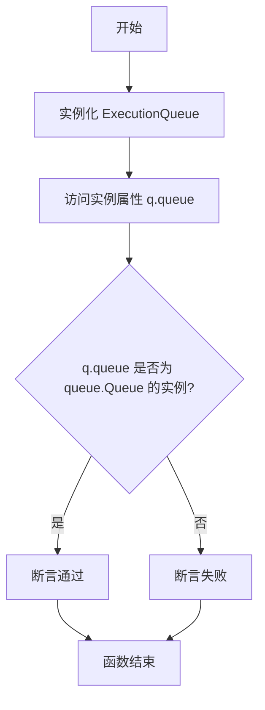
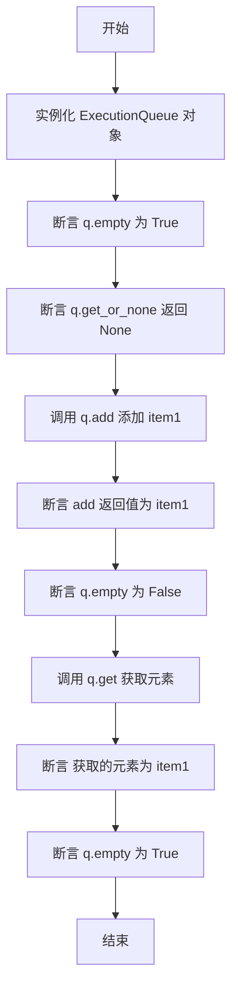
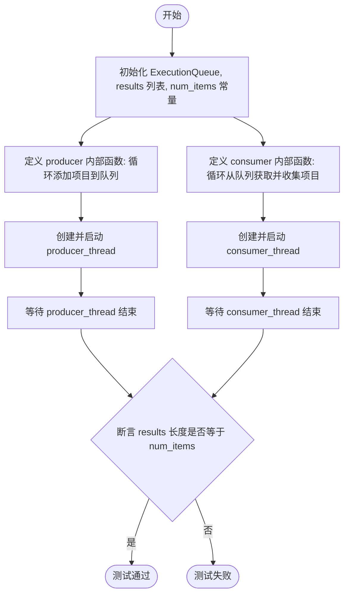

# `AutoGPT\autogpt_platform\backend\backend\data\execution_queue_test.py` 详细设计文档

该代码文件是一个针对 `ExecutionQueue` 组件的单元测试模块，旨在验证该队列在并发场景下的线程安全性及基本功能的正确性，包括确认其内部实现基于标准库 `queue.Queue`，以及对添加、获取、空状态判断等核心操作的测试。

## 整体流程

```mermaid
graph TD
    A[Start: test_thread_safety] --> B[Initialize ExecutionQueue & results list]
    B --> C[Define Producer: Add items to queue]
    B --> D[Define Consumer: Get items from queue]
    C & D --> E[Create & Start Producer and Consumer Threads]
    E --> F[Join Threads (wait for completion)]
    F --> G{Check results count}
    G -- Count == 100 --> H[Test Pass]
    G -- Count != 100 --> I[Test Fail]
```

## 类结构

```

```

## 全局变量及字段


### `ExecutionQueue.queue`
    
ExecutionQueue 内部使用的标准库队列实例，用于线程安全地存储和获取任务。

类型：`queue.Queue`
    
    

## 全局函数及方法


### `test_execution_queue_uses_stdlib_queue`

验证 `ExecutionQueue` 内部使用的队列实现是否为标准库的 `queue.Queue`，以确保其使用了预期的线程安全队列而非多进程队列。

参数：

-  无

返回值：`None`，该函数为测试函数，无显式返回值，通过断言进行验证。

#### 流程图



#### 带注释源码

```python
def test_execution_queue_uses_stdlib_queue():
    """Verify ExecutionQueue uses queue.Queue (not multiprocessing)."""
    # 实例化 ExecutionQueue 对象
    q = ExecutionQueue()
    
    # 断言检查 q 对象的 queue 属性是否为 queue.Queue 的实例
    # 这用于确保底层实现使用的是标准库的线程安全队列，而非 multiprocessing 模块中的队列
    assert isinstance(q.queue, queue.Queue)
```


### `test_basic_operations`

该测试函数用于验证 `ExecutionQueue` 的核心功能，包括添加元素、获取元素、检查队列是否为空以及非阻塞式获取元素。它通过断言队列在不同操作下的状态变化，确保队列的基本行为符合预期。

参数：

-  无

返回值：`None`，无返回值（该函数为测试用例，通过断言验证逻辑正确性，不返回具体数据）。

#### 流程图



#### 带注释源码

```python
def test_basic_operations():
    """Test add, get, empty, and get_or_none."""
    # 初始化 ExecutionQueue 实例
    q = ExecutionQueue()

    # 验证初始状态下队列是否为空
    assert q.empty() is True
    
    # 验证在空队列上调用非阻塞获取方法是否返回 None
    assert q.get_or_none() is None

    # 向队列中添加字符串 "item1"，并获取返回结果
    result = q.add("item1")
    
    # 验证 add 方法返回了添加的元素
    assert result == "item1"
    
    # 验证添加元素后队列不再为空
    assert q.empty() is False

    # 从队列中阻塞获取元素
    item = q.get()
    
    # 验证获取到的元素确实是 "item1"
    assert item == "item1"
    
    # 验证元素取出后队列恢复为空状态
    assert q.empty() is True
```


### `test_thread_safety`

该函数用于测试 `ExecutionQueue` 在多线程环境下的线程安全性，具体模拟了一个生产者-消费者模型，验证并发操作下数据的完整性。

参数：

-  无

返回值：`None`，该函数为测试函数，通过断言验证结果，不返回显式值。

#### 流程图



#### 带注释源码

```python
def test_thread_safety():
    """Test concurrent access from multiple threads."""
    # 1. 初始化测试环境：创建队列实例、结果列表和待处理的项目总数
    q = ExecutionQueue()
    results = []
    num_items = 100

    # 2. 定义生产者函数：负责向队列中添加数据
    def producer():
        for i in range(num_items):
            # 将格式化的字符串添加到队列中
            q.add(f"item_{i}")

    # 3. 定义消费者函数：负责从队列中获取数据
    def consumer():
        count = 0
        # 只要未获取够指定数量的项目，就一直尝试获取
        while count < num_items:
            # 使用非阻塞方式获取项目，避免死锁（假设队列为空时返回None）
            item = q.get_or_none()
            if item is not None:
                results.append(item)
                count += 1

    # 4. 创建生产者和消费者线程
    producer_thread = threading.Thread(target=producer)
    consumer_thread = threading.Thread(target=consumer)

    # 5. 启动线程，开始并发执行
    producer_thread.start()
    consumer_thread.start()

    # 6. 等待线程执行完成，设置超时时间防止测试卡死
    producer_thread.join(timeout=5)
    consumer_thread.join(timeout=5)

    # 7. 验证结果：检查是否成功获取了所有生成的项目，确保没有数据丢失或重复（虽然此处未检查顺序）
    assert len(results) == num_items
```


## 关键组件


### ExecutionQueue

从 `backend.data.execution` 导入的被测核心类，负责管理任务队列的添加、获取和状态查询。

### queue.Queue

`ExecutionQueue` 内部使用的标准库实现，用于保证基础队列操作的线程安全性。

### threading.Thread

用于在测试场景中模拟并发执行，以验证 `ExecutionQueue` 在多线程环境下的行为。

### Producer-Consumer Pattern

在 `test_thread_safety` 函数中实现的并发逻辑，用于模拟多个线程同时对队列进行写入和读取操作。


## 问题及建议


### 已知问题

-   **消费者线程存在忙等待**: 在 `test_thread_safety` 测试中，消费者函数通过 `while` 循环不断调用 `get_or_none()` 检查队列。当队列为空时，这种轮询机制会持续占用 CPU 时间片，导致测试效率低下。
-   **违反封装原则**: 测试用例 `test_execution_queue_uses_stdlib_queue` 直接断言 `q.queue` 的类型为 `queue.Queue`。这种测试方式依赖于类的私有实现细节而非公开接口，若后续重构将底层容器替换为其他兼容类型，该测试将失败，阻碍了代码演进。
-   **测试覆盖不完整**: `test_thread_safety` 仅测试了一个生产者对一个消费者的场景，未覆盖多生产者多消费者并发写入与读取的高压场景，可能无法暴露更深层次的竞态条件。

### 优化建议

-   **使用阻塞式队列操作**: 建议将消费者逻辑中的 `get_or_none()` 轮询替换为 `q.get()`。`queue.Queue` 的 `get()` 方法是阻塞的，当队列为空时会自动挂起线程等待新数据，从而彻底消除忙等待，显著降低 CPU 占用率。
-   **关注行为而非实现**: 移除 `test_execution_queue_uses_stdlib_queue` 或将其改为验证队列的行为特征（如 FIFO 顺序、阻塞特性）。测试应针对接口契约进行验证，以确保内部实现的灵活性。
-   **利用队列同步机制**: 如果必须验证所有元素都被处理，可以利用 `queue.Queue` 自带的 `task_done()` 和 `join()` 方法来确保队列完全清空，而不是依赖手动计数，这样逻辑更加严谨。
-   **扩展并发测试场景**: 建议增加多个生产者和多个消费者的测试用例，以更全面地验证 `ExecutionQueue` 在高并发环境下的线程安全性和稳定性。


## 其它


### 设计目标与约束

**设计目标**：
1.  **线程安全性**：核心目标是确保 `ExecutionQueue` 在多线程环境下的操作是安全的，支持多生产者和多消费者并发访问数据而不发生竞态条件。
2.  **功能封装**：封装标准库 `queue.Queue` 的功能，提供简洁的接口（如 `add`, `get`, `empty`, `get_or_none`）以满足业务逻辑需求。
3.  **非阻塞查询支持**：提供 `get_or_none` 方法，支持在队列为空时立即返回 `None` 而非阻塞等待，适用于轮询或特定控制流场景。

**约束条件**：
1.  **底层实现限制**：`ExecutionQueue` 必须基于 Python 标准库的 `queue.Queue` 实现，而非 `multiprocessing.Queue`。这意味着它主要用于线程间通信，而非进程间通信。
2.  **行为一致性**：接口的行为需符合测试断言，例如 `add` 方法应返回添加的项目，`empty` 方法需准确反映队列状态。

### 错误处理与异常设计

**错误处理策略**：
1.  **空队列处理**：设计中不通过抛出异常来处理空队列情况。当队列为空时，`get_or_none` 方法约定返回 `None`，这是一种显式的错误处理设计，避免了调用方必须捕获 `queue.Empty` 异常，简化了调用逻辑。
2.  **并发冲突规避**：依赖 `queue.Queue` 内部的锁机制，因此 `ExecutionQueue` 自身无需显式处理并发冲突导致的异常。

**异常设计**：
1.  **测试覆盖**：尽管代码未显式展示异常抛出，但基于标准库 `queue.Queue` 的特性，若 `get` 方法在队列为空且无超时设置时被调用，理论上会抛出阻塞行为（或异常，取决于具体实现封装）。当前设计倾向于通过 `empty()` 或 `get_or_none()` 来预防此类阻塞/异常情况。

### 数据流与状态机

**数据流**：
1.  **入队流程**：外部调用方（生产者线程） -> `ExecutionQueue.add(item)` -> 内部 `queue.Queue` -> 数据存储。
2.  **出队流程（阻塞/获取）**：外部调用方（消费者线程） -> `ExecutionQueue.get()` -> 从内部 `queue.Queue` 取出数据 -> 返回给调用方。
3.  **出队流程（非阻塞）**：外部调用方（消费者线程） -> `ExecutionQueue.get_or_none()` -> 检查内部队列 -> 若有数据则返回，若无则返回 `None`。

**状态机**：
`ExecutionQueue` 的状态主要由其内部队列的负载决定：
1.  **空闲状态**：队列为空 (`empty()` 返回 `True`)。此时 `get_or_none()` 必定返回 `None`。
2.  **工作状态**：队列非空 (`empty()` 返回 `False`)。此时可以执行 `get()` 或 `get_or_none()` 获取数据。
3.  状态转换由 `add()`（空闲 -> 工作）和 `get()`（工作 -> 空闲）触发。

### 外部依赖与接口契约

**外部依赖**：
1.  **Python 标准库 `queue`**：提供底层的线程安全队列数据结构 (`queue.Queue`)。
2.  **Python 标准库 `threading`**：用于测试环境中的多线程模拟，验证并发安全性。
3.  **业务模块 `backend.data.execution`**：依赖被测类 `ExecutionQueue`。

**接口契约**：
1.  **`add(item: Any) -> Any`**：
    *   *契约*：接收任意类型对象，将其放入队列尾部。成功后返回传入的对象。
2.  **`get() -> Any`**：
    *   *契约*：从队列头部移除并返回一个对象。如果队列为空，行为依赖于底层封装（通常为阻塞，直到有数据可用）。
3.  **`empty() -> bool`**：
    *   *契约*：返回 `True` 表示队列内部无元素，`False` 表示有元素。该状态是瞬时的，在并发环境下可能随时改变。
4.  **`get_or_none() -> Any | None`**：
    *   *契约*：尝试从队列头部获取元素。如果队列非空，返回元素并将其移除；如果队列为空，立即返回 `None`，不进行阻塞。

### 并发模型与锁机制

**并发模型**：
采用典型的 **生产者-消费者** 模型。代码示例中展示了单生产者单消费者的并发场景，但设计目标是支持多生产者和多消费者。

**锁机制**：
1.  **委托式锁管理**：`ExecutionQueue` 并未实现自定义的锁逻辑（如 `threading.Lock`），而是将线程同步的责任完全委托给底层的 `queue.Queue`。
2.  **原子性保证**：`queue.Queue` 内部已经实现了 `put`（对应 `add`）和 `get` 操作的原子性与互斥锁，确保了在多线程环境下数据的一致性和完整性。

    