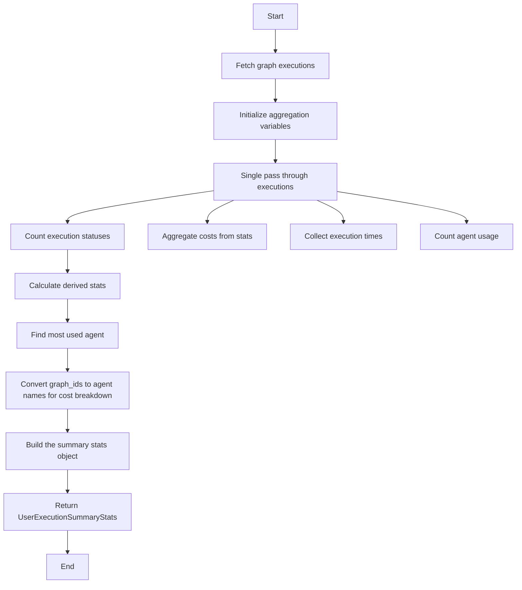

# `.\AutoGPT\autogpt_platform\backend\backend\data\generate_data.py` 详细设计文档

The code provides an asynchronous function to gather and aggregate summary data for a user's graph executions within a specified time range.

## 整体流程

```mermaid
graph TD
    A[Start] --> B[Get graph executions for user]
    B --> C{Are there executions?}
    C -- Yes --> D[Initialize aggregation variables]
    C -- No --> E[Return empty summary stats]
    D --> F[Iterate through executions]
    F --> G{Is execution status COMPLETED?}
    G -- Yes --> H[Increment successful runs]
    G -- No --> I{Is execution status FAILED?}
    I -- Yes --> J[Increment failed runs]
    I -- No --> K{Is execution status TERMINATED?}
    K -- Yes --> L[Increment failed runs]
    I -- No | K -- No --> M[Continue to next execution]
    M --> N{Does execution have stats?}
    N -- Yes --> O[Aggregate costs and execution times]
    N -- No --> P[Continue to next execution]
    O --> Q{Does execution stats have cost?}
    Q -- Yes --> R[Aggregate cost by graph ID]
    Q -- No --> S[Continue to next execution]
    R --> T[Increment total credits used]
    S --> U[Continue to next execution]
    U --> V{Does execution stats have duration?}
    V -- Yes --> W[Collect execution time]
    V -- No --> X[Continue to next execution]
    W --> Y[Add to execution times list]
    X --> Z[Continue to next execution]
    Z --> AA{Does execution have graph ID?}
    AA -- Yes --> AB[Count agent usage]
    AA -- No --> AC[Continue to next execution]
    AB --> AD[Increment agent usage by graph ID]
    AC --> AD[Continue to next execution]
    AD --> AE[Continue to next execution]
    AE --> AF[Calculate derived stats]
    AF --> AG[Find most used agent]
    AG --> AH[Build cost breakdown]
    AH --> AI[Build summary stats object]
    AI --> B[Return summary stats object]
    B --> C[End]
```

## 类结构

```
UserExecutionSummaryStats
├── total_credits_used
│   ├── float
│   └── Total credits used by the user
├── total_executions
│   ├── int
│   └── Total number of executions
├── successful_runs
│   ├── int
│   └── Number of successful executions
├── failed_runs
│   ├── int
│   └── Number of failed executions
├── terminated_runs
│   ├── int
│   └── Number of terminated executions
├── most_used_agent
│   ├── str
│   └── Name of the most used agent
├── total_execution_time
│   ├── int
│   └── Total execution time
├── average_execution_time
│   ├── float
│   └── Average execution time
└── cost_breakdown
   ├── dict
   └── Cost breakdown by agent
```

## 全局变量及字段


### `logger`
    
Logger instance for the SummaryData module.

类型：`TruncatedLogger`
    


### `executions`
    
List of graph executions for the specified user and time range.

类型：`List[Execution]`
    


### `total_credits_used`
    
Total credits used by the user in the specified time range.

类型：`float`
    


### `total_executions`
    
Total number of executions performed by the user in the specified time range.

类型：`int`
    


### `successful_runs`
    
Number of successful executions by the user in the specified time range.

类型：`int`
    


### `failed_runs`
    
Number of failed executions by the user in the specified time range.

类型：`int`
    


### `terminated_runs`
    
Number of terminated executions by the user in the specified time range.

类型：`int`
    


### `execution_times`
    
List of execution durations in milliseconds.

类型：`List[int]`
    


### `agent_usage`
    
Dictionary counting the number of times each agent was used.

类型：`defaultdict(int)`
    


### `cost_by_graph_id`
    
Dictionary tracking the cost of each graph execution in dollars.

类型：`defaultdict(float)`
    


### `total_execution_time`
    
Total execution time for all executions in milliseconds.

类型：`int`
    


### `average_execution_time`
    
Average execution time for all executions in milliseconds.

类型：`float`
    


### `most_used_agent`
    
Name of the most used agent by the user in the specified time range.

类型：`str`
    


### `cost_breakdown`
    
Dictionary with the cost breakdown by agent name.

类型：`dict`
    


### `UserExecutionSummaryStats`
    
Summary statistics object containing all the aggregated data.

类型：`UserExecutionSummaryStats`
    


### `UserExecutionSummaryStats.total_credits_used`
    
Total credits used by the user.

类型：`float`
    


### `UserExecutionSummaryStats.total_executions`
    
Total number of executions performed by the user.

类型：`int`
    


### `UserExecutionSummaryStats.successful_runs`
    
Number of successful executions by the user.

类型：`int`
    


### `UserExecutionSummaryStats.failed_runs`
    
Number of failed executions by the user.

类型：`int`
    


### `UserExecutionSummaryStats.terminated_runs`
    
Number of terminated executions by the user.

类型：`int`
    


### `UserExecutionSummaryStats.most_used_agent`
    
Name of the most used agent by the user.

类型：`str`
    


### `UserExecutionSummaryStats.total_execution_time`
    
Total execution time for all executions.

类型：`int`
    


### `UserExecutionSummaryStats.average_execution_time`
    
Average execution time for all executions.

类型：`float`
    


### `UserExecutionSummaryStats.cost_breakdown`
    
Cost breakdown by agent name.

类型：`dict`
    
    

## 全局函数及方法


### get_user_execution_summary_data

Gather all summary data for a user in a time range.

参数：

- `user_id`：`str`，The unique identifier for the user.
- `start_time`：`datetime`，The start time of the time range.
- `end_time`：`datetime`，The end time of the time range.

返回值：`UserExecutionSummaryStats`，An object containing the aggregated statistics for the user's executions within the specified time range.

#### 流程图



#### 带注释源码

```python
async def get_user_execution_summary_data(
    user_id: str, start_time: datetime, end_time: datetime
) -> UserExecutionSummaryStats:
    """Gather all summary data for a user in a time range.

    This function fetches graph executions once and aggregates all required
    statistics in a single pass for efficiency.
    """
    try:
        # Fetch graph executions once
        executions = await get_graph_executions(
            user_id=user_id,
            created_time_gte=start_time,
            created_time_lte=end_time,
        )

        # Initialize aggregation variables
        total_credits_used = 0.0
        total_executions = len(executions)
        successful_runs = 0
        failed_runs = 0
        terminated_runs = 0
        execution_times = []
        agent_usage = defaultdict(int)
        cost_by_graph_id = defaultdict(float)

        # Single pass through executions to aggregate all stats
        for execution in executions:
            # Count execution statuses (including TERMINATED as failed)
            if execution.status == AgentExecutionStatus.COMPLETED:
                successful_runs += 1
            elif execution.status == AgentExecutionStatus.FAILED:
                failed_runs += 1
            elif execution.status == AgentExecutionStatus.TERMINATED:
                terminated_runs += 1

            # Aggregate costs from stats
            if execution.stats and hasattr(execution.stats, "cost"):
                cost_in_dollars = execution.stats.cost / 100
                total_credits_used += cost_in_dollars
                cost_by_graph_id[execution.graph_id] += cost_in_dollars

            # Collect execution times
            if execution.stats and hasattr(execution.stats, "duration"):
                execution_times.append(execution.stats.duration)

            # Count agent usage
            agent_usage[execution.graph_id] += 1

        # Calculate derived stats
        total_execution_time = sum(execution_times)
        average_execution_time = (
            total_execution_time / len(execution_times) if execution_times else 0
        )

        # Find most used agent
        most_used_agent = "No agents used"
        if agent_usage:
            most_used_agent_id = max(agent_usage, key=lambda k: agent_usage[k])
            try:
                graph_meta = await get_graph_metadata(graph_id=most_used_agent_id)
                most_used_agent = (
                    graph_meta.name if graph_meta else f"Agent {most_used_agent_id[:8]}"
                )
            except Exception:
                logger.warning(f"Could not get metadata for graph {most_used_agent_id}")
                most_used_agent = f"Agent {most_used_agent_id[:8]}"

        # Convert graph_ids to agent names for cost breakdown
        cost_breakdown = {}
        for graph_id, cost in cost_by_graph_id.items():
            try:
                graph_meta = await get_graph_metadata(graph_id=graph_id)
                agent_name = graph_meta.name if graph_meta else f"Agent {graph_id[:8]}"
            except Exception:
                logger.warning(f"Could not get metadata for graph {graph_id}")
                agent_name = f"Agent {graph_id[:8]}"
            cost_breakdown[agent_name] = cost

        # Build the summary stats object (include terminated runs as failed)
        return UserExecutionSummaryStats(
            total_credits_used=total_credits_used,
            total_executions=total_executions,
            successful_runs=successful_runs,
            failed_runs=failed_runs + terminated_runs,
            most_used_agent=most_used_agent,
            total_execution_time=total_execution_time,
            average_execution_time=average_execution_time,
            cost_breakdown=cost_breakdown,
        )

    except Exception as e:
        logger.error(f"Failed to get user summary data: {e}")
        raise DatabaseError(f"Failed to get user summary data: {e}") from e
```


## 关键组件


### 张量索引与惰性加载

张量索引与惰性加载是代码中用于高效处理大量数据的方法，通过延迟加载和按需索引数据，减少内存消耗和提高处理速度。

### 反量化支持

反量化支持是代码中实现的一种功能，允许对量化策略进行逆操作，以便在需要时恢复原始数据。

### 量化策略

量化策略是代码中用于优化数据表示和存储的方法，通过减少数据精度来降低内存使用和计算成本。


## 问题及建议


### 已知问题

-   **数据库错误处理**: 代码中使用了`DatabaseError`来捕获所有异常，这可能包括非数据库相关的错误。建议将异常处理更加细化，以便更好地诊断问题。
-   **日志记录**: 日志记录可能过于简单，没有提供足够的信息来追踪问题。建议增加更详细的日志记录，包括错误的具体类型和上下文信息。
-   **异常处理**: 在`get_graph_metadata`调用中捕获了所有异常，这可能导致隐藏了其他潜在的错误。建议只捕获与该函数相关的异常。
-   **性能**: 如果`executions`列表很大，那么对每个执行进行循环可能会影响性能。可以考虑使用并行处理或批处理来提高效率。
-   **代码复用**: `get_graph_metadata`被多次调用，可以考虑将其结果缓存起来以减少数据库访问次数。

### 优化建议

-   **细化异常处理**: 将异常处理逻辑细化为针对不同类型的异常进行处理，以便更好地诊断和解决问题。
-   **增强日志记录**: 在关键步骤和异常处理中增加详细的日志记录，包括时间戳、错误代码和上下文信息。
-   **优化性能**: 对于大量数据的处理，考虑使用异步编程模型中的并发执行或批处理技术。
-   **缓存机制**: 实现缓存机制，对于频繁访问的数据（如`get_graph_metadata`的结果），减少数据库访问次数。
-   **代码重构**: 对重复的代码进行重构，提高代码的可读性和可维护性。


## 其它


### 设计目标与约束

- 设计目标：实现一个高效、可靠的系统来汇总用户在指定时间范围内的执行数据。
- 约束：
  - 确保数据汇总过程在单个数据库查询中完成，以减少数据库负载。
  - 确保异常处理能够捕获并记录所有可能的错误，同时向上抛出`DatabaseError`异常。

### 错误处理与异常设计

- 错误处理：使用`try-except`块捕获所有可能的异常，记录错误信息，并抛出`DatabaseError`异常。
- 异常设计：定义自定义异常`DatabaseError`，用于向上层模块报告数据库访问错误。

### 数据流与状态机

- 数据流：函数从数据库获取执行数据，对数据进行聚合统计，并构建`UserExecutionSummaryStats`对象返回。
- 状态机：无状态机，函数直接处理数据并返回结果。

### 外部依赖与接口契约

- 外部依赖：
  - `prisma.enums.AgentExecutionStatus`：枚举类型，定义执行状态。
  - `backend.data.execution.get_graph_executions`：获取图执行数据的函数。
  - `backend.data.graph.get_graph_metadata`：获取图元数据的函数。
  - `backend.data.model.UserExecutionSummaryStats`：用户执行摘要统计模型。
  - `backend.util.exceptions.DatabaseError`：自定义数据库异常。
  - `backend.util.logging.TruncatedLogger`：日志记录工具。
- 接口契约：
  - `get_user_execution_summary_data`函数接受用户ID、开始时间和结束时间作为参数，返回`UserExecutionSummaryStats`对象。


    