# `.\AutoGPT\autogpt_platform\backend\backend\data\graph.py` 详细设计文档

该文件定义了基于块的自动代理系统中Agent图的核心数据模型、验证逻辑和数据库交互。它涵盖了图的创建、检索、版本控制、权限验证、市场列表以及与图结构相关的元数据和设置管理。

## 整体流程

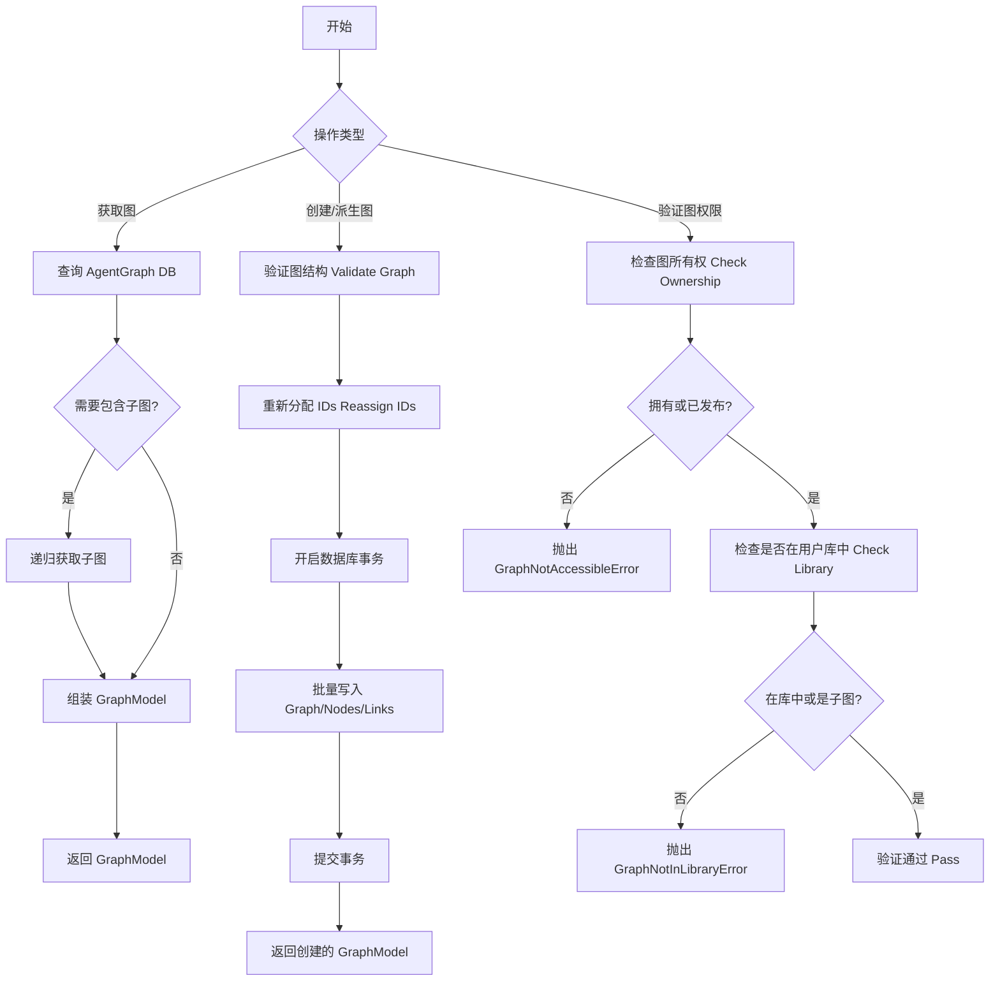

## 类结构

```
GraphBaseMeta (BaseDbModel)
├── GraphMeta (元数据模型)
└── BaseGraph (结构模型)
    ├── Graph (创建模型)
    │   └── GraphModel (完整模型, 继承Graph和GraphMeta)
    │       └── GraphModelWithoutNodes (隐藏节点模型)
    └── GraphTriggerInfo (触发信息)
Node (BaseDbModel)
└── NodeModel
Link (BaseDbModel)
GraphSettings (BaseModel)
GraphsPaginated (BaseModel)
_UnknownBlockBase (Block)
```

## 全局变量及字段


### `logger`
    
Logger instance for the module, used to record events and errors.

类型：`logging.Logger`
    


### `GraphSettings.model_config`
    
Configuration for the Pydantic model specifying that extra fields should be ignored.

类型：`dict[str, Any]`
    


### `GraphSettings.human_in_the_loop_safe_mode`
    
Flag indicating whether human-in-the-loop interactions are enabled in safe mode.

类型：`bool`
    


### `GraphSettings.sensitive_action_safe_mode`
    
Flag indicating whether sensitive actions are enabled in safe mode.

类型：`bool`
    


### `Link.source_id`
    
The ID of the source node in the connection.

类型：`str`
    


### `Link.sink_id`
    
The ID of the target (sink) node in the connection.

类型：`str`
    


### `Link.source_name`
    
The name of the output pin on the source node.

类型：`str`
    


### `Link.sink_name`
    
The name of the input pin on the sink node.

类型：`str`
    


### `Link.is_static`
    
Indicates if the link represents a static output connection.

类型：`bool`
    


### `Node.block_id`
    
The ID of the block type that this node executes.

类型：`str`
    


### `Node.input_default`
    
A dictionary containing default values for the node's input fields.

类型：`BlockInput`
    


### `Node.metadata`
    
Additional metadata associated with the node.

类型：`dict[str, Any]`
    


### `Node.input_links`
    
List of links connecting to the input pins of this node.

类型：`list[Link]`
    


### `Node.output_links`
    
List of links connecting from the output pins of this node.

类型：`list[Link]`
    


### `NodeModel.graph_id`
    
The ID of the graph to which this node belongs.

类型：`str`
    


### `NodeModel.graph_version`
    
The version of the graph to which this node belongs.

类型：`int`
    


### `NodeModel.webhook_id`
    
The optional ID of the webhook associated with this node.

类型：`Optional[str]`
    


### `NodeModel.webhook`
    
The optional webhook object associated with this node.

类型：`Optional[Webhook]`
    


### `GraphBaseMeta.version`
    
The version number of the graph.

类型：`int`
    


### `GraphBaseMeta.is_active`
    
Flag indicating whether this graph version is currently active.

类型：`bool`
    


### `GraphBaseMeta.name`
    
The name of the graph.

类型：`str`
    


### `GraphBaseMeta.description`
    
A text description of the graph's purpose.

类型：`str`
    


### `GraphBaseMeta.instructions`
    
Optional human-readable instructions for using the graph.

类型：`str | None`
    


### `GraphBaseMeta.recommended_schedule_cron`
    
Optional cron expression for the recommended execution schedule.

类型：`str | None`
    


### `GraphBaseMeta.forked_from_id`
    
The ID of the graph this graph was originally forked from.

类型：`str | None`
    


### `GraphBaseMeta.forked_from_version`
    
The version of the graph this graph was originally forked from.

类型：`int | None`
    


### `BaseGraph.nodes`
    
A list of nodes that make up the graph structure.

类型：`list[Node]`
    


### `BaseGraph.links`
    
A list of connections (links) between the nodes in the graph.

类型：`list[Link]`
    


### `GraphTriggerInfo.provider`
    
The name of the provider that handles the external trigger.

类型：`ProviderName`
    


### `GraphTriggerInfo.config_schema`
    
The JSON schema defining the configuration for the trigger block.

类型：`dict[str, Any]`
    


### `GraphTriggerInfo.credentials_input_name`
    
The name of the input field that holds the required credentials.

类型：`Optional[str]`
    


### `Graph.sub_graphs`
    
A flattened list of sub-graphs referenced within this graph.

类型：`list[BaseGraph]`
    


### `GraphMeta.id`
    
The unique identifier for the graph.

类型：`str`
    


### `GraphMeta.user_id`
    
The ID of the user who owns the graph.

类型：`str`
    


### `GraphMeta.created_at`
    
The timestamp when the graph was created.

类型：`datetime`
    


### `GraphModel.nodes`
    
A list of node models with full database details included in this graph.

类型：`list[NodeModel]`
    


### `GraphsPaginated.graphs`
    
The list of graph metadata objects for the current page.

类型：`list[GraphMeta]`
    


### `GraphsPaginated.pagination`
    
Object containing pagination metadata such as current page and total items.

类型：`Pagination`
    
    

## 全局函数及方法


### `get_node`

该函数用于根据节点 ID 从数据库中检索特定的节点记录，并将其转换为 `NodeModel` 对象返回。**注意：** 该函数不执行用户权限检查，因此在面向用户的端点中使用时必须先进行额外的权限验证。

参数：

- `node_id`: `str`, 需要检索的节点的唯一标识符。

返回值：`NodeModel`, 包含数据库中节点数据的模型对象。

#### 流程图

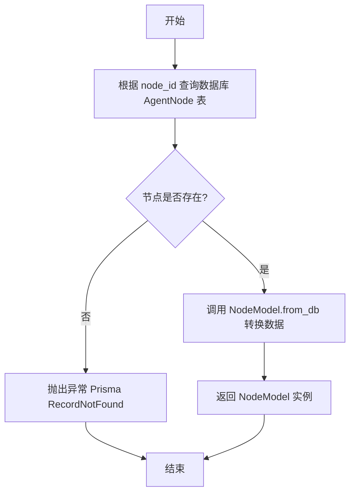

#### 带注释源码

```python
async def get_node(node_id: str) -> NodeModel:
    """⚠️ No `user_id` check: DO NOT USE without check in user-facing endpoints."""
    # 使用 Prisma 客户端根据提供的 ID 查找唯一节点记录
    # find_unique_or_raise: 如果找不到记录会自动抛出异常
    # AGENT_NODE_INCLUDE: 预定义的包含配置，用于加载关联数据（如 Webhook, Links 等）
    node = await AgentNode.prisma().find_unique_or_raise(
        where={"id": node_id},
        include=AGENT_NODE_INCLUDE,
    )
    # 将原始的数据库记录对象 (AgentNode) 转换为应用层的 NodeModel 对象
    return NodeModel.from_db(node)
```


### `set_node_webhook`

该函数用于更新指定节点的 webhook 配置。根据传入的 `webhook_id` 是否存在，它会将节点与相应的 webhook 建立连接或断开现有连接，并将更新后的数据库记录转换为 `NodeModel` 返回。注意：该函数不包含 `user_id` 权限校验，必须在用户可见端点调用前进行权限检查。

参数：

- `node_id`：`str`，需要设置 webhook 的节点 ID。
- `webhook_id`：`str | None`，要关联的 webhook ID。如果为 `None`，则会断开该节点现有的 webhook 连接。

返回值：`NodeModel`，包含更新后 webhook 关联信息的节点模型实例。

#### 流程图

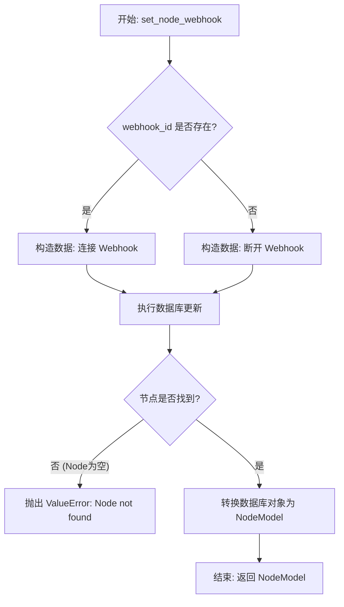

#### 带注释源码

```python
async def set_node_webhook(node_id: str, webhook_id: str | None) -> NodeModel:
    """⚠️ No `user_id` check: DO NOT USE without check in user-facing endpoints."""
    # 根据 webhook_id 是否有值，决定是建立连接还是断开连接
    # Prisma 的 connect 用于关联记录，disconnect 用于移除关联
    node = await AgentNode.prisma().update(
        where={"id": node_id},
        data=(
            {"Webhook": {"connect": {"id": webhook_id}}}
            if webhook_id
            else {"Webhook": {"disconnect": True}}
        ),
        include=AGENT_NODE_INCLUDE,  # 包含 Webhook 等关联数据，以便完整转换
    )
    
    # 如果更新后未找到节点（通常是因为原 ID 不存在），抛出错误
    if not node:
        raise ValueError(f"Node #{node_id} not found")
        
    # 将数据库中的 AgentNode 对象转换为业务层的 NodeModel 对象返回
    return NodeModel.from_db(node)
```


### `list_graphs_paginated`

根据用户ID和可选的激活状态过滤，检索分页的图元数据对象列表。

参数：

-   `user_id`：`str`，拥有这些图的用户的ID。
-   `page`：`int`，页码（1-based，即从1开始）。
-   `page_size`：`int`，每页返回的图数量。
-   `filter_by`：`Literal["active"] | None`，可选过滤器，若为 "active" 则仅选择 `isActive` 为 true 的图。

返回值：`GraphsPaginated`，包含图元数据列表和分页信息（总条目数、总页数等）的对象。

#### 流程图

```mermaid
flowchart TD
    A[开始: list_graphs_paginated] --> B[构建查询条件 where_clause<br/>设置 userId]
    B --> C{filter_by == 'active'?}
    C -- 是 --> D[设置 where_clause.isActive = True]
    C -- 否 --> E[保持 where_clause 不变]
    D --> F[查询数据库获取总条目数 total_count]
    E --> F
    F --> G[计算总页数 total_pages]
    G --> H[计算偏移量 offset = (page - 1) * page_size]
    H --> I[执行分页查询<br/>find_many 并按 version 降序]
    I --> J[将数据库结果转换为 GraphMeta 列表]
    J --> K[构造并返回 GraphsPaginated 对象]
    K --> L[结束]
```

#### 带注释源码

```python
async def list_graphs_paginated(
    user_id: str,
    page: int = 1,
    page_size: int = 25,
    filter_by: Literal["active"] | None = "active",
) -> GraphsPaginated:
    """
    Retrieves paginated graph metadata objects.

    Args:
        user_id: The ID of the user that owns the graphs.
        page: Page number (1-based).
        page_size: Number of graphs per page.
        filter_by: An optional filter to either select graphs.

    Returns:
        GraphsPaginated: Paginated list of graph metadata.
    """
    # 初始化数据库查询条件，指定用户ID
    where_clause: AgentGraphWhereInput = {"userId": user_id}

    # 如果过滤器要求仅显示活跃图，则添加 isActive 条件
    if filter_by == "active":
        where_clause["isActive"] = True

    # 获取符合条件的图总数，用于计算分页信息
    total_count = await AgentGraph.prisma().count(where=where_clause)
    # 计算总页数，向上取整
    total_pages = (total_count + page_size - 1) // page_size

    # 计算当前页的偏移量（跳过的记录数）
    offset = (page - 1) * page_size
    
    # 执行数据库查询
    # find_many: 获取多条记录
    # where: 应用查询条件
    # distinct: 确保结果不包含重复的ID（尽管通常ID是唯一的）
    # order: 按版本号降序排列
    # skip: 跳过前 offset 条记录
    # take: 仅取 page_size 条记录
    graphs = await AgentGraph.prisma().find_many(
        where=where_clause,
        distinct=["id"],
        order={"version": "desc"},
        skip=offset,
        take=page_size,
    )

    # 将数据库返回的原始模型转换为领域模型 GraphMeta
    graph_models = [GraphMeta.from_db(graph) for graph in graphs]

    # 构造包含结果和分页元数据的响应对象
    return GraphsPaginated(
        graphs=graph_models,
        pagination=Pagination(
            total_items=total_count,
            total_pages=total_pages,
            current_page=page,
            page_size=page_size,
        ),
    )
```


### `get_graph_metadata`

该函数用于从数据库中检索特定图（Graph）的元数据。它根据提供的 `graph_id` 和可选的 `version` 查询数据库记录，并返回一个包含基本图信息（如名称、描述、版本等）的轻量级 `Graph` 对象，而不包含具体的节点和链接数据。

参数：

-  `graph_id`：`str`，要检索的图的唯一标识符。
-  `version`：`int | None`，可选参数，指定要检索的图的特定版本。如果未提供，则默认获取最新版本。

返回值：`Graph | None`，如果找到图记录，则返回包含元数据的 `Graph` 对象；如果未找到，则返回 `None`。

#### 流程图

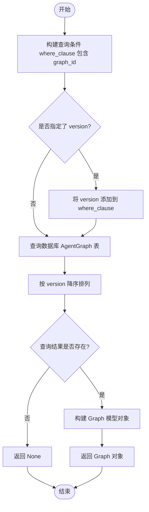

#### 带注释源码

```python
async def get_graph_metadata(graph_id: str, version: int | None = None) -> Graph | None:
    # 初始化数据库查询条件，必须包含图ID
    where_clause: AgentGraphWhereInput = {
        "id": graph_id,
    }

    # 如果调用者指定了版本号，则将其加入查询条件
    if version is not None:
        where_clause["version"] = version

    # 执行数据库查询
    # find_first: 查找匹配的第一条记录
    # order={"version": "desc"}: 如果未指定版本，确保获取最新的版本
    graph = await AgentGraph.prisma().find_first(
        where=where_clause,
        order={"version": "desc"},
    )

    # 如果数据库中未找到匹配的图，返回 None
    if not graph:
        return None

    # 找到记录后，构建并返回一个 Graph 对象
    # 该对象仅包含元数据字段，不包含 nodes 和 links
    return Graph(
        id=graph.id,
        name=graph.name or "",
        description=graph.description or "",
        version=graph.version,
        is_active=graph.isActive,
    )
```


### `get_graph`

从数据库检索图（Graph）对象。该函数处理了多种检索逻辑，包括基于用户所有权的查询、基于已批准商店列表（公开访问）的查询、版本控制、子图的递归获取以及导出时的数据脱敏处理。如果在任何检索路径中均未找到记录，则返回 None。

参数：

- `graph_id`：`str`，要检索的图的唯一标识符。
- `version`：`int | None`，要检索的特定版本号。如果为 None，通常默认获取最新版本（取决于具体的排序逻辑）。
- `user_id`：`str | None`，尝试访问图的用户的 ID。用于验证所有权。如果 `skip_access_check` 为 True，则此参数可为 None。
- `for_export`：`bool`，指示是否正在导出图。如果为 True，将从返回的模型中移除敏感数据（如凭证）。默认为 `False`。
- `include_subgraphs`：`bool`，指示是否获取并包含嵌套的子图。默认为 `False`。
- `skip_access_check`：`bool`，指示是否跳过用户所有权检查（通常用于管理员任务或内部逻辑）。默认为 `False`。

返回值：`GraphModel | None`，如果找到记录，则返回填充了数据和元数据的 `GraphModel` 对象；否则返回 `None`。

#### 流程图

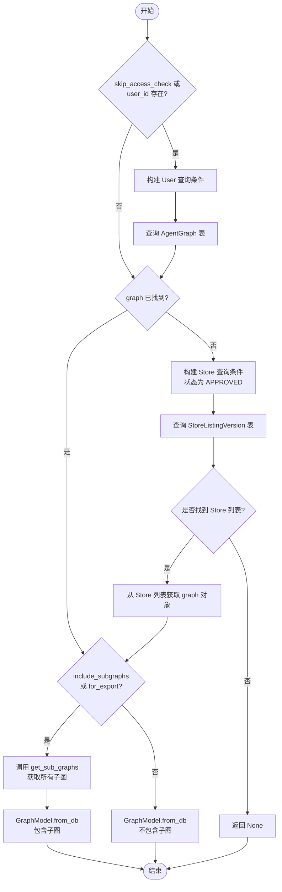

#### 带注释源码

```python
async def get_graph(
    graph_id: str,
    version: int | None,
    user_id: str | None,
    *,
    for_export: bool = False,
    include_subgraphs: bool = False,
    skip_access_check: bool = False,
) -> GraphModel | None:
    """
    从数据库检索图。
    如果未传递 `version`，默认获取带有 `is_active` 的版本（代码逻辑实际按版本倒序取第一个）。

    如果未找到记录，则返回 `None`。
    """
    graph = None

    # 仅在拥有的图上直接搜索（或跳过访问检查）
    if skip_access_check or user_id is not None:
        graph_where_clause: AgentGraphWhereInput = {
            "id": graph_id,
        }
        if version is not None:
            graph_where_clause["version"] = version
        # 如果未跳过检查且提供了 user_id，则限制为该用户的图
        if not skip_access_check and user_id is not None:
            graph_where_clause["userId"] = user_id

        # 查询用户拥有的图，按版本倒序排列
        graph = await AgentGraph.prisma().find_first(
            where=graph_where_clause,
            include=AGENT_GRAPH_INCLUDE,
            order={"version": "desc"},
        )

    # 如果用户未拥有该图，尝试从商店列出的图中查找（公开可用）
    if graph is None:
        store_where_clause: StoreListingVersionWhereInput = {
            "agentGraphId": graph_id,
            "submissionStatus": SubmissionStatus.APPROVED,
            "isDeleted": False,
        }
        if version is not None:
            store_where_clause["agentGraphVersion"] = version

        # 查询商店列表中已批准的版本
        if store_listing := await StoreListingVersion.prisma().find_first(
            where=store_where_clause,
            order={"agentGraphVersion": "desc"},
            include={"AgentGraph": {"include": AGENT_GRAPH_INCLUDE}},
        ):
            graph = store_listing.AgentGraph

    # 如果仍未找到，返回 None
    if graph is None:
        return None

    # 如果需要包含子图或处于导出模式，则需要递归获取子图数据
    if include_subgraphs or for_export:
        sub_graphs = await get_sub_graphs(graph)
        return GraphModel.from_db(
            graph=graph,
            sub_graphs=sub_graphs,
            for_export=for_export,
        )

    # 标准返回，不包含子图
    return GraphModel.from_db(graph, for_export)
```


### `get_store_listed_graphs`

批量获取多个具有已批准商店列表的图表。仅返回公开可用（即已批准且未删除）的图表。由于这些是商店图表，因此不需要执行权限检查。

参数：

-  `*graph_ids`：`str`，要获取的图表 ID 列表（可变参数）。

返回值：`dict[str, GraphModel]`，将图表 ID 映射到 GraphModel 对象的字典，仅包含具有已批准商店列表的图表。

#### 流程图

```mermaid
graph TD
    A[开始: get_store_listed_graphs] --> B{检查 graph_ids 是否为空}
    B -- 是 --> C[返回空字典 {}]
    B -- 否 --> D[构建查询条件: ID 在列表中, 状态为 APPROVED, 未删除]
    D --> E[执行数据库查询 StoreListingVersion]
    E --> F[处理查询结果: 按 ID 去重, 按版本降序排序]
    F --> G[遍历返回的列表记录]
    G --> H{AgentGraph 是否存在}
    H -- 否 --> G
    H -- 是 --> I[通过 GraphModel.from_db 构建模型]
    I --> J[添加到结果字典 <ID, GraphModel>]
    J --> G
    G -- 遍历结束 --> K[返回结果字典]
```

#### 带注释源码

```python
async def get_store_listed_graphs(*graph_ids: str) -> dict[str, GraphModel]:
    """Batch-fetch multiple store-listed graphs by their IDs.

    Only returns graphs that have approved store listings (publicly available).
    Does not require permission checks since store-listed graphs are public.

    Args:
        *graph_ids: Variable number of graph IDs to fetch

    Returns:
        Dict mapping graph_id to GraphModel for graphs with approved store listings
    """
    # 如果没有提供 ID，直接返回空字典
    if not graph_ids:
        return {}

    # 查询数据库中的 StoreListingVersion 表
    # 筛选条件：
    # 1. agentGraphId 在传入的 graph_ids 列表中
    # 2. submissionStatus (提交状态) 为 APPROVED (已批准)
    # 3. isDeleted (是否删除) 为 False
    # 包含 (include) 关联的 AgentGraph 数据及其节点和链接 (AGENT_GRAPH_INCLUDE)
    store_listings = await StoreListingVersion.prisma().find_many(
        where={
            "agentGraphId": {"in": list(graph_ids)},
            "submissionStatus": SubmissionStatus.APPROVED,
            "isDeleted": False,
        },
        include={"AgentGraph": {"include": AGENT_GRAPH_INCLUDE}},
        distinct=["agentGraphId"],  # 确保每个 graph_id 只返回一条记录
        order={"agentGraphVersion": "desc"},  # 按版本降序排列，确保获取的是最新版本
    )

    # 将查询结果转换为字典
    # 键为 graph_id，值为通过 GraphModel.from_db 转换后的模型实例
    return {
        listing.agentGraphId: GraphModel.from_db(listing.AgentGraph)
        for listing in store_listings
        if listing.AgentGraph  # 安全检查，确保关联的 AgentGraph 存在
    }
```


### `get_graph_as_admin`

该函数用于以管理员权限获取指定的图数据。它可以获取任何已提交的图，但仍需检查请求用户是否拥有该图或该图是否已在市场上公开发布。支持指定版本或获取默认活跃版本，并支持导出模式（包含子图）。

参数：

-   `graph_id`：`str`，要检索的图的唯一标识符。
-   `version`：`int | None`，要检索的图的特定版本。如果未提供，默认获取版本号最大的记录（通常对应活跃版本）。
-   `user_id`：`str | None`，发起请求的用户ID。用于验证访问权限：用户必须拥有该图，或者该图已公开发布。
-   `for_export`：`bool`，是否处于导出模式。如果为 True，则获取并包含所有子图，并进行导出相关的数据处理。

返回值：`GraphModel | None`，如果找到图并通过访问权限验证，则返回完整的图模型对象；否则（如记录不存在或无权访问）返回 None。

#### 流程图

```mermaid
flowchart TD
    A[开始: get_graph_as_admin] --> B[记录警告日志]
    B --> C[构建查询条件: graph_id]
    C --> D{version 是否为 None?}
    D -- 否 --> E[添加 version 到查询条件]
    D -- 是 --> F[查询数据库 AgentGraph]
    E --> F
    F --> G{图是否存在 且<br/>(拥有者匹配 或 已公开发布)?}
    G -- 否 --> H[返回 None]
    G -- 是 --> I{for_export 是否为 True?}
    I -- 是 --> J[获取所有子图 get_sub_graphs]
    J --> K[构建 GraphModel 实例<br/>包含 sub_graphs 和 for_export 标志]
    I -- 否 --> L[构建 GraphModel 实例<br/>仅传递 for_export 标志]
    K --> M[返回 GraphModel]
    L --> M
```

#### 带注释源码

```python
async def get_graph_as_admin(
    graph_id: str,
    version: int | None = None,
    user_id: str | None = None,
    for_export: bool = False,
) -> GraphModel | None:
    """
    Intentionally parallels the get_graph but should only be used for admin tasks, because can return any graph that's been submitted
    Retrieves a graph from the DB.
    Defaults to the version with `is_active` if `version` is not passed.

    Returns `None` if the record is not found.
    """
    # 记录警告日志，表明这是以管理员身份进行的敏感操作
    logger.warning(f"Getting {graph_id=} {version=} as ADMIN {user_id=} {for_export=}")
    
    # 初始化数据库查询条件
    where_clause: AgentGraphWhereInput = {
        "id": graph_id,
    }

    # 如果指定了版本号，则将其加入查询条件
    if version is not None:
        where_clause["version"] = version

    # 执行数据库查询，获取图数据及其关联的节点和链接等
    graph = await AgentGraph.prisma().find_first(
        where=where_clause,
        include=AGENT_GRAPH_INCLUDE,
        order={"version": "desc"},
    )

    # 访问控制逻辑：
    # 1. 如果图不存在 (graph is None)
    # 2. 或者 图不属于当前用户 且 图未在市场上公开发布
    # 则返回 None，拒绝访问
    if graph is None or (
        graph.userId != user_id
        and not await is_graph_published_in_marketplace(
            graph_id, version or graph.version
        )
    ):
        return None

    # 如果是为了导出（例如分享或保存为文件）
    if for_export:
        # 递归获取该图的所有子图
        sub_graphs = await get_sub_graphs(graph)
        # 构建完整的 GraphModel，包含子图信息
        return GraphModel.from_db(
            graph=graph,
            sub_graphs=sub_graphs,
            for_export=for_export,
        )

    # 普通查询，直接构建 GraphModel，不获取子图（节省资源）
    return GraphModel.from_db(graph, for_export)
```


### `get_sub_graphs`

迭代获取给定图表的所有子图表，并将它们扁平化为一个列表。该调用执行分层的广度优先批量数据库获取。在每个层级中，仅检索尚未在列表中的子图表，以确保效率和唯一性。

参数：

-   `graph`：`AgentGraph`，要分析并获取其子图表的输入图表对象。

返回值：`list[AgentGraph]`，包含所有找到的子图表的扁平化列表，已排除原始输入图表本身。

#### 流程图

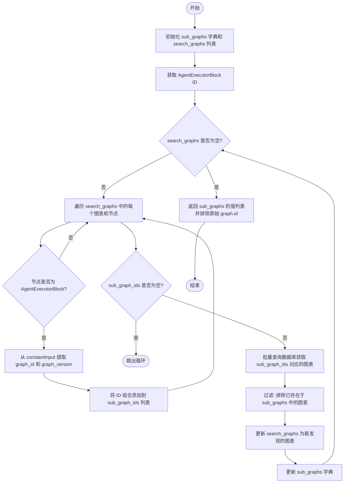

#### 带注释源码

```python
async def get_sub_graphs(graph: AgentGraph) -> list[AgentGraph]:
    """
    Iteratively fetches all sub-graphs of a given graph, and flattens them into a list.
    This call involves a DB fetch in batch, breadth-first, per-level of graph depth.
    On each DB fetch we will only fetch the sub-graphs that are not already in the list.
    """
    # 使用字典存储已找到的子图表，键为 graph_id，去重并加速查找
    # 初始包含父图本身
    sub_graphs = {graph.id: graph}
    # 待搜索的图表队列，初始包含父图，实现广度优先搜索 (BFS)
    search_graphs = [graph]
    # 获取 AgentExecutorBlock 的 ID，用于识别哪些节点包含了子图引用
    agent_block_id = AgentExecutorBlock().id

    while search_graphs:
        # 1. 提取当前层级所有图表节点中引用的子图 ID
        sub_graph_ids = [
            (graph_id, graph_version)
            for graph in search_graphs
            for node in graph.Nodes or []
            if (
                node.AgentBlock
                and node.AgentBlock.id == agent_block_id  # 确认是 Agent 节点
                and (graph_id := cast(str, dict(node.constantInput).get("graph_id")))
                and (
                    graph_version := cast(
                        int, dict(node.constantInput).get("graph_version")
                    )
                )
            )
        ]
        
        # 如果没有找到新的子图引用，结束搜索
        if not sub_graph_ids:
            break

        # 2. 批量从数据库获取这些子图数据
        # 注意：这里确保了子图必须属于同一个用户
        graphs = await AgentGraph.prisma().find_many(
            where={
                "OR": [
                    {
                        "id": graph_id,
                        "version": graph_version,
                        "userId": graph.userId,  # Ensure the sub-graph is owned by the same user
                    }
                    for graph_id, graph_version in sub_graph_ids
                ]
            },
            include=AGENT_GRAPH_INCLUDE, # 包含节点和链接等详细信息
        )

        # 3. 准备下一轮搜索
        # 过滤掉已经处理过的图表，防止循环引用导致的无限循环
        search_graphs = [graph for graph in graphs if graph.id not in sub_graphs]
        # 将新获取的图表合并到结果字典中
        sub_graphs.update({graph.id: graph for graph in search_graphs})

    # 返回所有子图表，但排除掉最开始传入的父图
    return [g for g in sub_graphs.values() if g.id != graph.id]
```


### `get_connected_output_nodes`

该函数用于从数据库中检索指定节点（源节点）的所有输出链接，并获取这些链接所连接的目标节点（Sink节点）信息，返回链接对象与节点对象的元组列表。

参数：

-  `node_id`：`str`，要查询的源节点的ID。

返回值：`list[tuple[Link, Node]]`，包含元组的列表，每个元组由连接两端的 `Link` 对象和目标 `Node` 对象组成。

#### 流程图

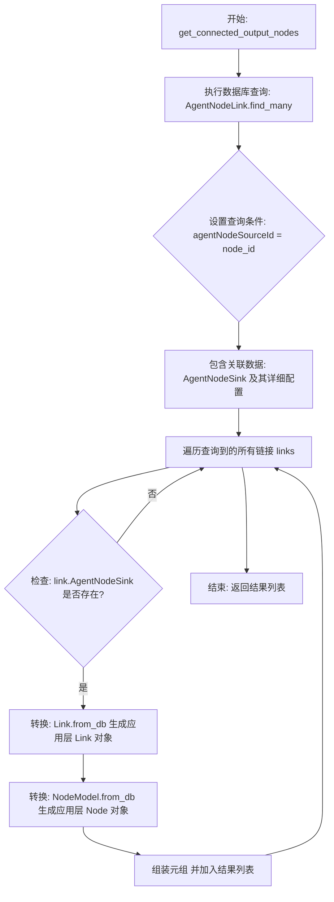

#### 带注释源码

```python
async def get_connected_output_nodes(node_id: str) -> list[tuple[Link, Node]]:
    # 使用 Prisma 客户端查询数据库中的 AgentNodeLink 表
    links = await AgentNodeLink.prisma().find_many(
        where={"agentNodeSourceId": node_id},  # 筛选条件：源节点ID等于输入参数 node_id
        include={                              # 包含关联表数据
            "AgentNodeSink": {                 # 包含目标节点信息
                "include": AGENT_NODE_INCLUDE  # 包含节点相关的完整配置（如 Webhook, Input 等）
            }
        },
    )
    
    # 遍历查询结果，将数据库模型转换为应用层模型
    return [
        (
            Link.from_db(link),                 # 将数据库的 Link 记录转换为 Link 对象
            NodeModel.from_db(link.AgentNodeSink) # 将数据库的 Node 记录转换为 NodeModel 对象
        )
        for link in links
        if link.AgentNodeSink                  # 过滤掉目标节点为空的情况
    ]
```


### `set_graph_active_version`

该函数用于将特定用户拥有的图的指定版本设置为活跃版本（Active Version），同时将该图的其他所有版本设置为非活跃状态。

参数：

-  `graph_id`：`str`，需要设置活跃版本的图的唯一标识符。
-  `version`：`int`，需要设置为活跃状态的版本号。
-  `user_id`：`str`，拥有该图的用户的ID，用于确保只有所有者能修改图的版本状态。

返回值：`None`，该函数不返回具体数据，执行成功时无返回，失败时抛出异常。

#### 流程图

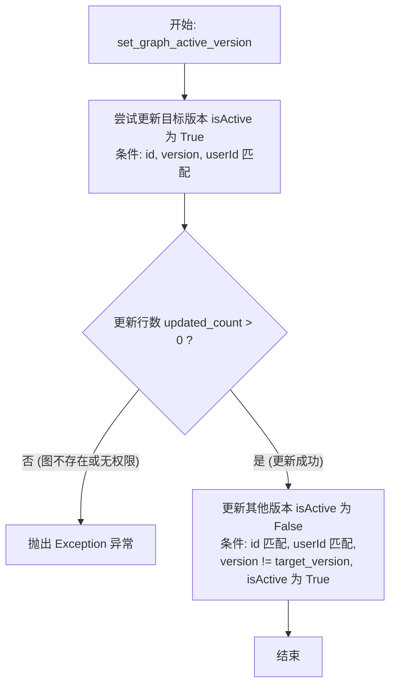

#### 带注释源码

```python
async def set_graph_active_version(graph_id: str, version: int, user_id: str) -> None:
    # 激活请求的版本，前提是该版本存在且归用户所有。
    # 使用 update_many 确保只更新匹配所有条件（id, version, userId）的记录
    updated_count = await AgentGraph.prisma().update_many(
        data={"isActive": True},
        where={
            "id": graph_id,
            "version": version,
            "userId": user_id,
        },
    )
    # 如果更新计数为0，说明没找到匹配的记录（图不存在或用户无权操作）
    if updated_count == 0:
        raise Exception(f"Graph #{graph_id} v{version} not found or not owned by user")

    # 将该图的所有其他版本设置为非活跃状态。
    # 条件：同一图ID，同一用户ID，版本号不是当前激活的版本号，且当前状态为活跃
    await AgentGraph.prisma().update_many(
        data={"isActive": False},
        where={
            "id": graph_id,
            "version": {"not": version},
            "userId": user_id,
            "isActive": True,
        },
    )
```


### `get_graph_all_versions`

获取特定用户拥有的某个图表的所有版本，按版本号降序排列，并限制返回的数量。

参数：

- `graph_id`：`str`，要获取版本的图表 ID。
- `user_id`：`str`，拥有该图表的用户 ID。
- `limit`：`int`，返回的最大图表版本数量，默认为 `MAX_GRAPH_VERSIONS_FETCH`。

返回值：`list[GraphModel]`，包含所有版本的 `GraphModel` 对象列表，如果未找到则返回空列表。

#### 流程图

```mermaid
flowchart TD
    A[开始: get_graph_all_versions] --> B[查询数据库]
    B --> B1[条件: graph_id AND user_id]
    B --> B2[排序: version DESC]
    B --> B3[包含: AGENT_GRAPH_INCLUDE]
    B --> B4[限制: limit]
    B1 & B2 & B3 & B4 --> C{获取到数据?}
    C -- 否 --> D[返回空列表 []]
    C -- 是 --> E[遍历数据并映射为 GraphModel]
    E --> F[返回 GraphModel 列表]
```

#### 带注释源码

```python
async def get_graph_all_versions(
    graph_id: str, user_id: str, limit: int = MAX_GRAPH_VERSIONS_FETCH
) -> list[GraphModel]:
    # 从数据库查询满足条件的图表版本
    graph_versions = await AgentGraph.prisma().find_many(
        where={"id": graph_id, "userId": user_id},  # 筛选特定 ID 和用户拥有的图表
        order={"version": "desc"},                  # 按版本号降序排列
        include=AGENT_GRAPH_INCLUDE,                # 包含节点、链接等关联数据
        take=limit,                                 # 限制返回数量
    )

    # 如果没有找到任何版本，返回空列表
    if not graph_versions:
        return []

    # 将数据库模型转换为业务模型 GraphModel 并返回
    return [GraphModel.from_db(graph) for graph in graph_versions]
```


### `delete_graph`

该函数用于从数据库中异步删除指定 ID 的图（Graph），且仅限于特定用户拥有的图。它通过数据库操作删除匹配的记录，并根据删除的条目数量返回结果，同时记录相应的日志信息。

参数：

-  `graph_id`：`str`，需要删除的图的唯一标识符。
-  `user_id`：`str`，拥有该图的用户的唯一标识符，用于确保权限控制。

返回值：`int`，表示成功删除的数据库记录的数量。

#### 流程图

```mermaid
flowchart TD
    A[开始: 接收 graph_id, user_id] --> B[执行数据库删除操作<br>AgentGraph.prisma().delete_many]
    B --> C[获取删除的记录数 entries_count]
    C --> D{entries_count > 0?}
    D -- 是 --> E[记录日志: 删除成功]
    D -- 否 --> F[不记录日志]
    E --> G[返回 entries_count]
    F --> G
    G --> H[结束]
```

#### 带注释源码

```python
async def delete_graph(graph_id: str, user_id: str) -> int:
    # 调用 Prisma 客户端执行删除操作
    # where 条件确保只能删除属于指定用户 (user_id) 的指定图 (graph_id)
    entries_count = await AgentGraph.prisma().delete_many(
        where={"id": graph_id, "userId": user_id}
    )
    
    # 如果删除了记录（entries_count 大于 0），则记录信息日志
    if entries_count:
        logger.info(f"Deleted {entries_count} graph entries for Graph #{graph_id}")
        
    # 返回受影响的记录行数
    return entries_count
```


### `get_graph_settings`

根据用户ID和图表ID从LibraryAgent表中获取图表的特定设置。如果记录不存在、已删除/归档，或设置数据损坏，则返回默认的GraphSettings实例。

参数：

-  `user_id`：`str`，图表所有者的用户ID。
-  `graph_id`：`str`，需要查询设置的图表ID。

返回值：`GraphSettings`，包含图表安全模式等配置的设置对象，若查询失败或数据无效则返回默认值。

#### 流程图

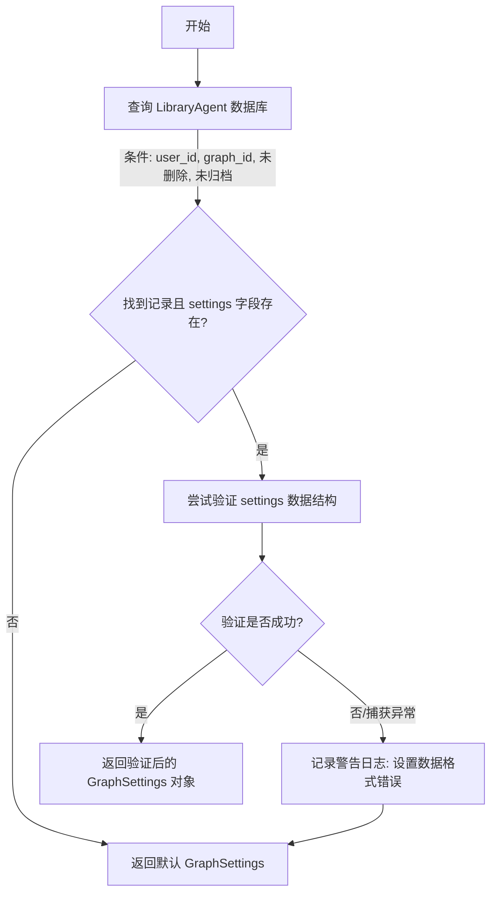

#### 带注释源码

```python
async def get_graph_settings(user_id: str, graph_id: str) -> GraphSettings:
    # 查询 LibraryAgent 表，寻找匹配用户ID和图表ID且未删除、未归档的记录
    # 按版本倒序排列，取最新的版本
    lib = await LibraryAgent.prisma().find_first(
        where={
            "userId": user_id,
            "agentGraphId": graph_id,
            "isDeleted": False,
            "isArchived": False,
        },
        order={"agentGraphVersion": "desc"},
    )
    
    # 如果找不到记录，或者记录中的 settings 字段为空
    if not lib or not lib.settings:
        # 返回一个包含默认值的 GraphSettings 实例
        return GraphSettings()

    try:
        # 尝试将数据库中的 settings 数据解析并验证为 GraphSettings 模型
        return GraphSettings.model_validate(lib.settings)
    except Exception:
        # 如果数据结构损坏或不符合模型定义（验证失败）
        logger.warning(
            f"Malformed settings for LibraryAgent user={user_id} graph={graph_id}"
        )
        # 返回默认设置以保证系统稳定性
        return GraphSettings()
```


### `validate_graph_execution_permissions`

验证用户是否有权限执行特定的图。该函数执行全面的授权检查，检查用户是否拥有该图或该图是否已在市场发布，并确认该图（除非作为子图执行）是否存在于用户的库中。

参数：

-   `user_id`：`str`，请求执行操作的用户 ID。
-   `graph_id`：`str`，待检查的图的 ID。
-   `graph_version`：`int`，待检查的图的版本号。
-   `is_sub_graph`：`bool`，标识该图是否作为子图执行。若为 `True`，则不强制要求该图必须在用户的库中。

返回值：`None`，无返回值。如果验证失败，将抛出 `GraphNotAccessibleError`（图不可访问）或 `GraphNotInLibraryError`（图不在库中）异常。

#### 流程图

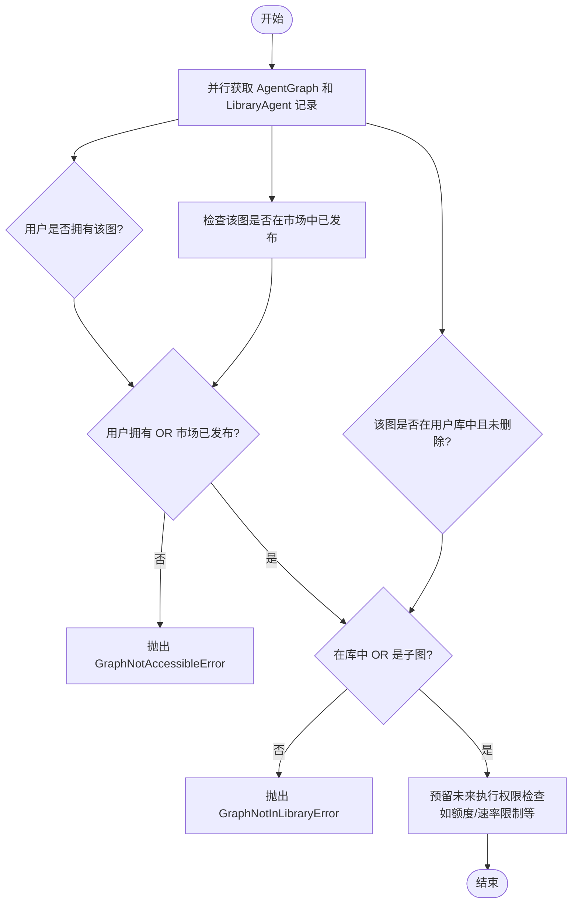

#### 带注释源码

```python
async def validate_graph_execution_permissions(
    user_id: str, graph_id: str, graph_version: int, is_sub_graph: bool = False
) -> None:
    """
    Validate that a user has permission to execute a specific graph.

    This function performs comprehensive authorization checks and raises specific
    exceptions for different types of failures to enable appropriate error handling.

    ## Logic
    A user can execute a graph if any of these is true:
    1. They own the graph and some version of it is still listed in their library
    2. The graph is published in the marketplace and listed in their library
    3. The graph is published in the marketplace and is being executed as a sub-agent

    Args:
        graph_id: The ID of the graph to check
        user_id: The ID of the user
        graph_version: The version of the graph to check
        is_sub_graph: Whether this is being executed as a sub-graph.
            If `True`, the graph isn't required to be in the user's Library.

    Raises:
        GraphNotAccessibleError: If the graph is not accessible to the user.
        GraphNotInLibraryError: If the graph is not in the user's library (deleted/archived).
        NotAuthorizedError: If the user lacks execution permissions for other reasons
    """
    # 并行查询图的基础信息和用户的库信息，以减少延迟
    graph, library_agent = await asyncio.gather(
        AgentGraph.prisma().find_unique(
            where={"graphVersionId": {"id": graph_id, "version": graph_version}}
        ),
        LibraryAgent.prisma().find_first(
            where={
                "userId": user_id,
                "agentGraphId": graph_id,
                "isDeleted": False,
                "isArchived": False,
            }
        ),
    )

    # 步骤 1: 检查用户是否拥有此图
    user_owns_graph = graph and graph.userId == user_id

    # 步骤 2: 检查代理是否在用户库中 *且未被删除*
    user_has_in_library = library_agent is not None

    # 步骤 3: 应用权限逻辑
    # 首先检查基本访问权限：用户拥有 或者 图已发布在市场
    if not (
        user_owns_graph
        or await is_graph_published_in_marketplace(graph_id, graph_version)
    ):
        # 如果既不是所有者也不是公开市场图，则无权访问
        raise GraphNotAccessibleError(
            f"You do not have access to graph #{graph_id} v{graph_version}: "
            "it is not owned by you and not available in the Marketplace"
        )
    # 其次检查库状态：在库中 或者 是子图调用
    elif not (user_has_in_library or is_sub_graph):
        # 如果不在库中且不是子图，说明无法使用（可能是已删除或未添加）
        raise GraphNotInLibraryError(f"Graph #{graph_id} is not in your library")

    # 步骤 6: 检查执行特定的权限（此处抛出通用的 NotAuthorizedError）
    # 附加授权检查：
    # 1. 检查用户是否有执行额度（未来）
    # 2. 检查图是否被暂停/禁用（未来）
    # 3. 检查速率限制规则（未来）
    # 4. 检查组织级别权限（未来）

    # 目前，上述检查逻辑对于执行权限已经足够。
    # 未来增强可以在此处添加更细粒度的权限检查。
    # 添加新检查时，针对非库问题引发 NotAuthorizedError。
```


### `is_graph_published_in_marketplace`

检查指定的图表版本是否已在市场上发布并批准。

参数：

- `graph_id`：`str`，要检查的图表 ID
- `graph_version`：`int`，要检查的图表版本

返回值：`bool`，如果图表已在市场上发布并批准，则返回 True，否则返回 False。

#### 流程图

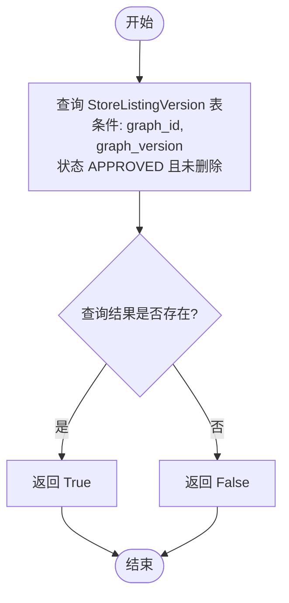

#### 带注释源码

```python
async def is_graph_published_in_marketplace(graph_id: str, graph_version: int) -> bool:
    """
    Check if a graph is published in the marketplace.

    Params:
        graph_id: The ID of the graph to check
        graph_version: The version of the graph to check

    Returns:
        True if the graph is published and approved in the marketplace, False otherwise
    """
    # 查询数据库中的 StoreListingVersion 表
    # 筛选条件包括：匹配的 agentGraphId, 匹配的 agentGraphVersion,
    # 提交状态为 APPROVED (已批准), 且未被标记为删除 (isDeleted 为 False)
    marketplace_listing = await StoreListingVersion.prisma().find_first(
        where={
            "agentGraphId": graph_id,
            "agentGraphVersion": graph_version,
            "submissionStatus": SubmissionStatus.APPROVED,
            "isDeleted": False,
        }
    )
    # 如果查询结果不为 None，说明存在已批准的市场列表，返回 True；否则返回 False
    return marketplace_listing is not None
```


### `create_graph`

将一个新的图结构（包括其节点、链接和子图）原子化地持久化到数据库中。该函数在一个数据库事务中完成所有相关记录的创建，随后通过查询验证创建结果，并返回完整的图模型。

参数：

- `graph`：`Graph`，要创建的图对象，包含图的元数据、节点列表、链接列表以及子图信息。
- `user_id`：`str`，该图拥有者的用户ID。

返回值：`GraphModel`，成功创建后从数据库检索并返回的完整图模型实例。

#### 流程图

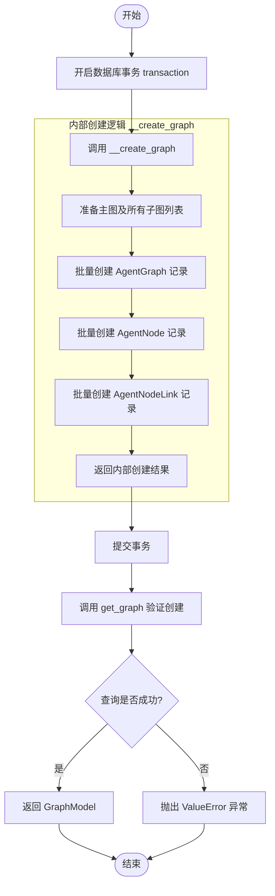

#### 带注释源码

```python
async def create_graph(graph: Graph, user_id: str) -> GraphModel:
    # 使用事务上下文管理器，确保图、节点和链接的创建是原子性的
    # 要么全部成功，要么全部回滚
    async with transaction() as tx:
        # 调用内部辅助函数 __create_graph 执行具体的数据库插入操作
        # 包括 AgentGraph, AgentNode, AgentNodeLink 的批量创建
        await __create_graph(tx, graph, user_id)

    # 事务提交后，通过查询数据库来验证图是否确实存在并获取完整数据
    if created_graph := await get_graph(graph.id, graph.version, user_id=user_id):
        return created_graph

    # 如果验证失败（理论上不应发生，除非数据库有瞬态问题），抛出异常
    raise ValueError(f"Created graph {graph.id} v{graph.version} is not in DB")


async def __create_graph(tx, graph: Graph, user_id: str):
    # 合并主图和所有子图到一个列表中，以便批量处理
    graphs = [graph] + graph.sub_graphs

    # 第一步：批量创建图记录
    # 将主图和子图的元数据插入数据库
    await AgentGraph.prisma(tx).create_many(
        data=[
            AgentGraphCreateInput(
                id=graph.id,
                version=graph.version,
                name=graph.name,
                description=graph.description,
                recommendedScheduleCron=graph.recommended_schedule_cron,
                isActive=graph.is_active,
                userId=user_id,
                forkedFromId=graph.forked_from_id,
                forkedFromVersion=graph.forked_from_version,
            )
            for graph in graphs
        ]
    )

    # 第二步：批量创建节点记录
    # 遍历所有图（主图及子图），收集所有节点并批量插入
    await AgentNode.prisma(tx).create_many(
        data=[
            AgentNodeCreateInput(
                id=node.id,
                agentGraphId=graph.id,
                agentGraphVersion=graph.version,
                agentBlockId=node.block_id,
                constantInput=SafeJson(node.input_default),
                metadata=SafeJson(node.metadata),
            )
            for graph in graphs
            for node in graph.nodes
        ]
    )

    # 第三步：批量创建链接记录
    # 遍历所有图（主图及子图），收集所有节点间的连接并批量插入
    await AgentNodeLink.prisma(tx).create_many(
        data=[
            AgentNodeLinkCreateInput(
                id=str(uuid.uuid4()), # 为每个链接生成新的UUID
                sourceName=link.source_name,
                sinkName=link.sink_name,
                agentNodeSourceId=link.source_id,
                agentNodeSinkId=link.sink_id,
                isStatic=link.is_static,
            )
            for graph in graphs
            for link in graph.links
        ]
    )
```


### `fork_graph`

通过复制图及其所有节点和链接来创建一个新的分支图。

参数：

-  `graph_id`：`str`，要分支的图的ID。
-  `graph_version`：`int`，要分支的图的版本号。
-  `user_id`：`str`，创建该分支的用户的ID。

返回值：`GraphModel`，新创建的图模型实例。

#### 流程图

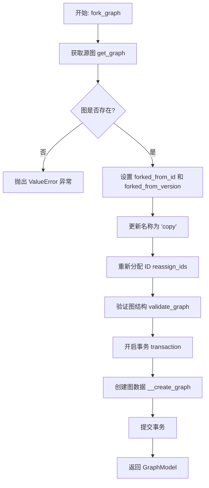

#### 带注释源码

```python
async def fork_graph(graph_id: str, graph_version: int, user_id: str) -> GraphModel:
    """
    Forks a graph by copying it and all its nodes and links to a new graph.
    """
    # 1. 获取源图，for_export=True 确保获取完整结构（包括子图等），并检查用户权限
    graph = await get_graph(graph_id, graph_version, user_id=user_id, for_export=True)
    if not graph:
        raise ValueError(f"Graph {graph_id} v{graph_version} not found")

    # 2. 更新图的元数据，记录源图信息和修改名称
    # Set forked from ID and version as itself as it's about ot be copied
    graph.forked_from_id = graph.id
    graph.forked_from_version = graph.version
    graph.name = f"{graph.name} (copy)"
    
    # 3. 重新分配所有相关 ID（节点、链接、图本身）以确保在新数据库记录中的唯一性
    graph.reassign_ids(user_id=user_id, reassign_graph_id=True)
    
    # 4. 验证新图的结构是否有效
    graph.validate_graph(for_run=False)

    # 5. 在事务中创建新图数据，确保原子性
    async with transaction() as tx:
        await __create_graph(tx, graph, user_id)

    # 6. 返回新创建的 GraphModel 对象
    return graph
```


### `__create_graph`

该函数是一个内部辅助方法，用于在数据库事务中持久化存储一个 `Graph` 对象及其所有子图。它批量创建图的元数据、节点和节点之间的连接关系。

参数：

- `tx`：`Any` (Prisma Transaction)，数据库事务对象，用于确保数据写入的原子性。
- `graph`：`Graph`，包含待创建的图结构、节点、链接以及子图的对象。
- `user_id`：`str`，创建该图的用户的唯一标识符。

返回值：`None`，无返回值，直接将数据写入数据库。

#### 流程图

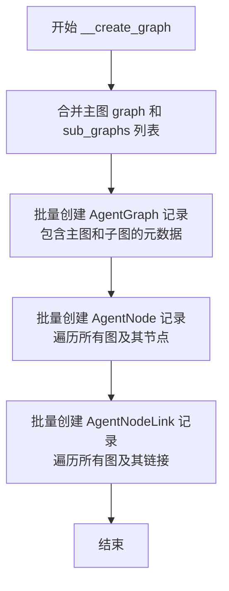

#### 带注释源码

```python
async def __create_graph(tx, graph: Graph, user_id: str):
    # 将主图及其所有子图合并到一个列表中，以便统一处理
    graphs = [graph] + graph.sub_graphs

    # 第一步：批量创建 AgentGraph 记录（图的元数据）
    await AgentGraph.prisma(tx).create_many(
        data=[
            AgentGraphCreateInput(
                id=graph.id,                                   # 图的唯一ID
                version=graph.version,                         # 图版本号
                name=graph.name,                               # 图名称
                description=graph.description,                 # 图描述
                recommendedScheduleCron=graph.recommended_schedule_cron, # 建议的执行计划
                isActive=graph.is_active,                      # 是否激活
                userId=user_id,                                # 所属用户ID
                forkedFromId=graph.forked_from_id,             # 源图ID（如果是复制的）
                forkedFromVersion=graph.forked_from_version,   # 源图版本（如果是复制的）
            )
            for graph in graphs
        ]
    )

    # 第二步：批量创建 AgentNode 记录（图中的节点）
    await AgentNode.prisma(tx).create_many(
        data=[
            AgentNodeCreateInput(
                id=node.id,                                    # 节点唯一ID
                agentGraphId=graph.id,                        # 所属图的ID
                agentGraphVersion=graph.version,              # 所属图的版本
                agentBlockId=node.block_id,                  # 节点使用的Block ID
                constantInput=SafeJson(node.input_default),   # 节点的常量输入数据（JSON格式）
                metadata=SafeJson(node.metadata),             # 节点的元数据（JSON格式）
            )
            for graph in graphs                               # 遍历所有图（含子图）
            for node in graph.nodes                           # 遍历每个图下的节点
        ]
    )

    # 第三步：批量创建 AgentNodeLink 记录（节点间的连接线）
    await AgentNodeLink.prisma(tx).create_many(
        data=[
            AgentNodeLinkCreateInput(
                id=str(uuid.uuid4()),                         # 生成新的链接ID
                sourceName=link.source_name,                  # 源节点的输出引脚名称
                sinkName=link.sink_name,                      # 目标节点的输入引脚名称
                agentNodeSourceId=link.source_id,             # 源节点ID
                agentNodeSinkId=link.sink_id,                 # 目标节点ID
                isStatic=link.is_static,                      # 是否为静态连接
            )
            for graph in graphs                               # 遍历所有图（含子图）
            for link in graph.links                           # 遍历每个图下的连接线
        ]
    )
```


### `make_graph_model`

将一个可创建的图对象（`Graph`）转换为完整的图模型（`GraphModel`），在此过程中将 `graph_id` 和 `graph_version` 注入到所有节点中，并设置创建时间和所有者 ID。

参数：

- `creatable_graph`：`Graph`，待转换的可创建图对象，包含图的结构、元数据及节点列表。
- `user_id`：`str`，创建该图的用户的 ID。

返回值：`GraphModel`，转换后的完整图模型对象，已填充数据库所需的元数据（如 `created_at`, `user_id`）及节点关联信息。

#### 流程图

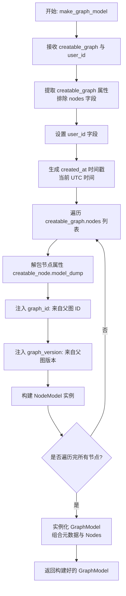

#### 带注释源码

```python
def make_graph_model(creatable_graph: Graph, user_id: str) -> GraphModel:
    """
    Convert a Graph to a GraphModel, setting graph_id and graph_version on all nodes.
    将 Graph 转换为 GraphModel，并在所有节点上设置 graph_id 和 graph_version。

    Args:
        creatable_graph (Graph): The creatable graph to convert.
        user_id (str): The ID of the user creating the graph.

    Returns:
        GraphModel: The converted Graph object.
    """
    # Create a new Graph object, inheriting properties from CreatableGraph
    # 创建一个新的 Graph 对象，继承自 CreatableGraph 的属性
    return GraphModel(
        # 解包 creatable_graph 的所有字段数据，但排除 'nodes'（因为节点需要特殊处理）
        **creatable_graph.model_dump(exclude={"nodes"}),
        # 设置用户 ID
        user_id=user_id,
        # 设置创建时间为当前的 UTC 时间
        created_at=datetime.now(tz=timezone.utc),
        # 处理节点列表：遍历源图中的每个节点并构建 NodeModel
        nodes=[
            NodeModel(
                # 解包单个节点的所有属性
                **creatable_node.model_dump(),
                # 为节点注入所属图的 ID
                graph_id=creatable_graph.id,
                # 为节点注入所属图的版本号
                graph_version=creatable_graph.version,
            )
            for creatable_node in creatable_graph.nodes
        ],
    )
```


### `fix_llm_provider_credentials`

修复节点中提供者（provider）设置为 `llm` 的凭据数据。该函数扫描数据库中所有使用 `llm` 作为提供者的节点，根据 API Key 的前缀自动推断真实的提供者（如 OpenAI, Anthropic, Groq），并同步更新集成存储中的凭据记录和节点输入配置。

参数：

无

返回值：`None`，无返回值。

#### 流程图

```mermaid
flowchart TD
    Start([开始]) --> InitStore[初始化 IntegrationCredentialsStore]
    InitStore --> QueryDB[执行 SQL 查询: 查找 constantInput->credentials->provider 为 'llm' 的节点]
    QueryDB --> CheckError{查询是否出错?}
    CheckError -- 是 --> LogError[记录错误日志] --> End([结束])
    CheckError -- 否 --> LoopNodes[遍历所有损坏的节点]
    LoopNodes --> CheckUser{用户ID是否变化?}
    CheckUser -- 是 --> FetchIntegrations[获取该用户的 Integrations]
    CheckUser -- 否 --> CheckCredential
    FetchIntegrations --> CheckCredential[在用户集成中查找凭证对象]
    CheckCredential --> FoundCred{凭证是否存在且类型为 'api_key'?}
    FoundCred -- 否 --> NextNode[继续处理下一个节点]
    FoundCred -- 是 --> IdentifyProvider[根据 API Key 前缀识别提供者]
    IdentifyProvider --> MatchPrefix{匹配到有效前缀?}
    MatchPrefix -- 否 --> LogWarning[记录警告日志: 无法识别提供者] --> NextNode
    MatchPrefix -- 是 --> UpdateCreds[更新凭证对象中的 provider 字段]
    UpdateCreds --> SaveCreds[保存更新后的凭证到存储]
    SaveCreds --> UpdateNode[更新数据库中节点的 constantInput]
    UpdateNode --> NextNode
    NextNode --> LoopNodes
```

#### 带注释源码

```python
async def fix_llm_provider_credentials():
    """Fix node credentials with provider `llm`"""
    from backend.integrations.credentials_store import IntegrationCredentialsStore

    from .user import get_user_integrations

    # 初始化凭据存储对象，用于后续更新凭据
    store = IntegrationCredentialsStore()

    broken_nodes = []
    try:
        # 执行原生 SQL 查询，查找所有 credentials.provider 为 'llm' 的节点
        # 返回结果包含 user_id, node_id 和 node_preset_input
        broken_nodes = await query_raw_with_schema(
            """
            SELECT    graph."userId"       user_id,
                  node.id              node_id,
                  node."constantInput" node_preset_input
            FROM      {schema_prefix}"AgentNode"  node
            LEFT JOIN {schema_prefix}"AgentGraph" graph
            ON        node."agentGraphId" = graph.id
            WHERE     node."constantInput"::jsonb->'credentials'->>'provider' = 'llm'
            ORDER BY  graph."userId";
            """
        )
        logger.info(f"Fixing LLM credential inputs on {len(broken_nodes)} nodes")
    except Exception as e:
        logger.error(f"Error fixing LLM credential inputs: {e}")

    user_id: str = ""
    user_integrations = None
    # 遍历所有需要修复的节点
    for node in broken_nodes:
        # 按用户ID批量获取集成信息，以减少数据库查询次数
        if node["user_id"] != user_id:
            # Save queries by only fetching once per user
            user_id = node["user_id"]
            user_integrations = await get_user_integrations(user_id)
        elif not user_integrations:
            # 理论上不应该发生，如果在同一循环中 user_integrations 为空
            raise RuntimeError(f"Impossible state while processing node {node}")

        node_id: str = node["node_id"]
        node_preset_input: dict = node["node_preset_input"]
        credentials_meta: dict = node_preset_input["credentials"]

        # 在用户的集成列表中查找匹配 ID 的凭据对象
        credentials = next(
            (
                c
                for c in user_integrations.credentials
                if c.id == credentials_meta["id"]
            ),
            None,
        )
        if not credentials:
            continue
        
        # 检查凭据类型，当前逻辑仅处理 'api_key' 类型
        if credentials.type != "api_key":
            logger.warning(
                f"User {user_id} credentials {credentials.id} with provider 'llm' "
                f"has invalid type '{credentials.type}'"
            )
            continue

        # 获取 API Key 的值
        api_key = credentials.api_key.get_secret_value()
        
        # 根据 API Key 前缀推断具体的 LLM 提供者
        if api_key.startswith("sk-ant-api03-"):
            # Anthropic Claude Key
            credentials.provider = credentials_meta["provider"] = "anthropic"
        elif api_key.startswith("sk-"):
            # OpenAI Key
            credentials.provider = credentials_meta["provider"] = "openai"
        elif api_key.startswith("gsk_"):
            # Groq Key
            credentials.provider = credentials_meta["provider"] = "groq"
        else:
            # 无法识别的 Key 前缀，跳过
            logger.warning(
                f"Could not identify provider from key prefix {api_key[:13]}*****"
            )
            continue

        # 更新凭据存储中的 provider 字段
        await store.update_creds(user_id, credentials)
        
        # 更新数据库中节点的 constantInput JSON 数据，修正 provider 字段
        await AgentNode.prisma().update(
            where={"id": node_id},
            data={"constantInput": SafeJson(node_preset_input)},
        )
```


### `migrate_llm_models`

更新所有 AI 区块中无效的 LLM 模型。该函数扫描系统中所有已注册的区块，查找输入字段中包含 `LlmModel` 类型的区块，并针对对应的数据库节点记录执行更新操作：若节点中配置的模型名称不在当前枚举定义的有效值范围内，则将其替换为指定的目标模型。

参数：

-   `migrate_to`：`LlmModel`，迁移的目标 LLM 模型枚举值。

返回值：`None`，该函数不返回任何值，仅执行数据库更新操作。

#### 流程图

```mermaid
flowchart TD
    A[开始: migrate_llm_models] --> B[初始化字段字典 llm_model_fields]
    B --> C[遍历所有已注册的区块 get_blocks]
    C --> D{检查区块输入字段}
    D -- 字段类型为 LlmModel --> E[记录区块ID和字段名到字典]
    D -- 不是 LlmModel --> F[继续下一个字段]
    E --> F
    F --> G{是否还有更多区块}
    G -- 是 --> C
    G -- 否 --> H[提取 LlmModel 枚举的所有有效值]
    H --> I[遍历 llm_model_fields 字典]
    I --> J[构建 SQL UPDATE 语句]
    J --> K[执行数据库更新: constantInput->>field_name NOT IN valid_values]
    K --> L{是否还有更多字段}
    L -- 是 --> I
    L -- 否 --> M[结束]
```

#### 带注释源码

```python
async def migrate_llm_models(migrate_to: LlmModel):
    """
    Update all LLM models in all AI blocks that don't exist in the enum.
    Note: Only updates top level LlmModel SchemaFields of blocks (won't update nested fields).
    """
    logger.info("Migrating LLM models")
    # 用于存储 {block_id: field_name} 的映射，标识哪些区块的哪个字段是 LLM 模型字段
    llm_model_fields: dict[str, str] = {}  # {block_id: field_name}

    # Search for all LlmModel fields
    # 遍历系统中所有已发现的区块类型
    for block_type in get_blocks().values():
        block = block_type()
        from pydantic.fields import FieldInfo

        # 获取区块输入 Schema 的字段定义
        fields: dict[str, FieldInfo] = block.input_schema.model_fields

        # Collect top-level LlmModel fields
        # 检查字段注解是否为 LlmModel 类型
        for field_name, field in fields.items():
            if field.annotation == LlmModel:
                # 如果是，则记录该区块 ID 和对应的字段名
                llm_model_fields[block.id] = field_name

    # Convert enum values to a list of strings for the SQL query
    # 获取当前 LlmModel 枚举中所有有效的字符串值
    enum_values = [v.value for v in LlmModel]
    # 将列表转换为 SQL 查询中可用的 IN 子句字符串格式，例如 ('value1', 'value2')
    escaped_enum_values = repr(tuple(enum_values))  # hack but works

    # Update each block
    # 遍历所有包含 LLM 模型字段的区块
    for id, path in llm_model_fields.items():
        # 构造原始 SQL 更新语句
        # 使用 jsonb_set 修改 JSONB 字段 "constantInput" 中指定路径的值
        query = f"""
            UPDATE platform."AgentNode"
            SET "constantInput" = jsonb_set("constantInput", $1, to_jsonb($2), true)
            WHERE "agentBlockId" = $3
            AND "constantInput" ? ($4)::text
            AND "constantInput"->>($4)::text NOT IN {escaped_enum_values}
            """

        # 执行 SQL 语句
        # 参数: [$1=path, $2=migrate_to.value, $3=block_id, $4=path]
        await db.execute_raw(
            query,  # type: ignore - is supposed to be LiteralString
            [path],
            migrate_to.value,
            id,
            path,
        )
```


### `GraphSettings.from_graph`

这是一个类方法工厂函数，用于根据传入的图模型以及特定的安全模式参数，实例化并返回一个 `GraphSettings` 对象。该方法主要处理人机交互（HITL）安全模式的默认逻辑，确保在未明确指定时默认开启安全模式。

参数：

-   `graph`：`"GraphModel"`，图模型对象（当前逻辑中未直接读取其属性，但作为方法签名的一部分保留）。
-   `hitl_safe_mode`：`bool | None`，人机交互安全模式开关。如果传入 `None`，则默认设置为 `True`。
-   `sensitive_action_safe_mode`：`bool`，敏感操作安全模式开关。默认为 `False`。

返回值：`"GraphSettings"`，包含指定或默认安全配置设置的新 `GraphSettings` 实例。

#### 流程图

```mermaid
flowchart TD
    A[开始: from_graph] --> B{检查 hitl_safe_mode<br/>是否为 None?}
    B -- 是 --> C[设置 hitl_safe_mode = True]
    B -- 否 --> D[保持 hitl_safe_mode 原值]
    C --> E[实例化 GraphSettings]
    D --> E
    E --> F[返回 GraphSettings 实例]
    F --> G[结束]
```

#### 带注释源码

```python
    @classmethod
    def from_graph(
        cls,
        graph: "GraphModel",
        hitl_safe_mode: bool | None = None,
        sensitive_action_safe_mode: bool = False,
    ) -> "GraphSettings":
        # 如果未明确设置人机交互安全模式，则默认为 True
        if hitl_safe_mode is None:
            hitl_safe_mode = True
        
        # 使用处理后的参数创建并返回 GraphSettings 实例
        return cls(
            human_in_the_loop_safe_mode=hitl_safe_mode,
            sensitive_action_safe_mode=sensitive_action_safe_mode,
        )
```


### `Link.from_db`

这是一个静态工厂方法，用于将数据库中检索到的原始代理节点链接实体（`AgentNodeLink`）转换为应用程序定义的领域模型对象（`Link`），主要负责字段映射和对象实例化。

参数：

- `link`：`AgentNodeLink`，从数据库中查询得到的原始代理节点链接对象，包含源节点、目标节点及连接属性等信息。

返回值：`Link`，转换并初始化后的 `Link` 领域模型实例。

#### 流程图

```mermaid
flowchart TD
    A[开始: 接收 link 参数] --> B[初始化 Link 实例]
    B --> C[映射 id: link.id]
    C --> D[映射 source_name: link.sourceName]
    D --> E[映射 source_id: link.agentNodeSourceId]
    E --> F[映射 sink_name: link.sinkName]
    F --> G[映射 sink_id: link.agentNodeSinkId]
    G --> H[映射 is_static: link.isStatic]
    H --> I[返回 Link 实例]
```

#### 带注释源码

```python
    @staticmethod
    def from_db(link: AgentNodeLink):
        return Link(
            id=link.id,                      # 映射主键 ID
            source_name=link.sourceName,    # 映射源节点输出引脚名称
            source_id=link.agentNodeSourceId, # 映射源节点 ID
            sink_name=link.sinkName,        # 映射目标节点输入引脚名称
            sink_id=link.agentNodeSinkId,   # 映射目标节点 ID
            is_static=link.isStatic,        # 映射是否为静态连接
        )
```


### `Link.__hash__`

该方法用于计算 `Link` 对象的哈希值。它基于连接的核心属性（源节点ID、汇聚节点ID、源名称、汇聚名称）生成哈希码，这使得 `Link` 对象可以被安全地用作集合的元素或字典的键，确保了连接两端相同的链接对象被视为逻辑上的同一个键。

参数：

- `self`：`Link`，`Link` 类的实例对象。

返回值：`int`，由连接属性元组计算得出的整数哈希值。

#### 流程图

```mermaid
graph TD
    Start([开始 __hash__]) --> AccessFields[访问 self.source_id, sink_id, source_name, sink_name]
    AccessFields --> CreateTuple[构建元组 source_id, sink_id, source_name, sink_name]
    CreateTuple --> HashCall[调用内置 hash 函数处理元组]
    HashCall --> End([返回哈希整数值])
```

#### 带注释源码

```python
    def __hash__(self):
        # 通过对包含四个核心标识字段的元组进行哈希运算，
        # 确保连接相同节点和针脚的链接对象具有相同的哈希值。
        # 这使得 Link 对象可以在 set 中去重或在 dict 中作为键使用。
        return hash((self.source_id, self.sink_id, self.source_name, self.sink_name))
```


### `Node.credentials_optional`

这是一个属性，用于指示当前节点的凭据是否为可选配置。当该属性返回 `True` 时，如果未配置凭据，该节点在执行过程中将被跳过，而不是导致验证错误；反之，若为 `False`，则必须配置凭据。

参数：

-  无

返回值：`bool`，如果节点的元数据中标记了凭据为可选，则返回 `True`，否则返回 `False`。

#### 流程图

```mermaid
flowchart TD
    Start([开始]) --> AccessMetadata[访问 self.metadata 字典]
    AccessMetadata --> CheckKey{检查是否存在键<br>'credentials_optional'}
    CheckKey -- 存在 --> GetValue[获取该键对应的布尔值]
    CheckKey -- 不存在 --> ReturnDefault[返回默认值 False]
    GetValue --> ReturnTrue([返回 True])
    ReturnDefault --> ReturnFalse([返回 False])
```

#### 带注释源码

```python
@property
def credentials_optional(self) -> bool:
    """
    Whether credentials are optional for this node.
    When True and credentials are not configured, the node will be skipped
    during execution rather than causing a validation error.
    """
    # 从节点的元数据字典中获取 'credentials_optional' 键的值
    # 如果该键不存在，则默认返回 False
    return self.metadata.get("credentials_optional", False)
```


### `Node.block`

该属性用于获取当前节点关联的 Block 对象。通过节点存储的 `block_id` 查找对应的 Block 类。如果找不到对应的 Block（例如 Block 已被删除或 ID 无效），该方法会记录警告日志并返回一个 `_UnknownBlockBase` 占位符对象，以防止系统因 Block 缺失而崩溃。

参数：

- 无

返回值：`AnyBlockSchema | "_UnknownBlockBase"`，节点对应的 Block 实例；如果 Block 不存在，则返回未知 Block 的占位符实例。

#### 流程图

```mermaid
flowchart TD
    A[开始: 访问 Node.block] --> B[调用 get_block self.block_id]
    B --> C{Block 是否存在?}
    C -- 是 --> D[返回查找到的 Block 实例]
    C -- 否 --> E[记录警告日志: Block 缺失]
    E --> F[实例化 _UnknownBlockBase<br/>传入 self.block_id]
    F --> G[返回 _UnknownBlockBase 实例]
```

#### 带注释源码

```python
    @property
    def block(self) -> AnyBlockSchema | "_UnknownBlockBase":
        """
        Get the block for this node. Returns UnknownBlock if block is deleted/missing.
        获取此节点的 Block。如果 Block 已被删除或缺失，则返回 UnknownBlock。
        """
        # 根据节点存储的 block_id 获取对应的 Block 类定义
        block = get_block(self.block_id)
        
        # 如果没有找到对应的 Block（可能已被删除或 ID 错误）
        if not block:
            # 记录警告日志，但不抛出异常 - 返回一个已删除 Block 的占位符
            logger.warning(
                f"Block #{self.block_id} does not exist for Node #{self.id} (deleted/missing block), using UnknownBlock"
            )
            # 返回一个未知的 Block 基类实例，保持系统稳定性
            return _UnknownBlockBase(self.block_id)
        
        # 返回找到的有效 Block 实例
        return block
```


### `NodeModel.from_db`

一个静态工厂方法，负责将数据库中的 `AgentNode` 实体转换为应用程序领域模型 `NodeModel`。此过程包括类型转换、关联数据（如 Webhook 和 Links）的加载，以及根据导出需求对敏感数据进行过滤。

参数：

-  `node`：`AgentNode`，从数据库查询到的原始代理节点数据对象。
-  `for_export`：`bool`，可选参数，默认为 `False`。指示是否正在准备导出节点，若为 `True` 则会移除敏感信息（如凭证）。

返回值：`NodeModel`，构造完成并填充了所有相关数据和链接关系的节点模型实例。

#### 流程图

```mermaid
flowchart TD
    A[开始: NodeModel.from_db] --> B[导入 Webhook 类]
    B --> C[创建 NodeModel 实例 obj]
    C --> D[转换 constantInput 为 dict]
    D --> E[转换 metadata 为 dict]
    E --> F[判断 node.Webhook 是否存在]
    F -- 是 --> G[使用 Webhook.from_db 转换]
    F -- 否 --> H[设为 None]
    G & H --> I[处理 input_links 列表]
    I --> J[处理 output_links 列表]
    J --> K{for_export 是否为 True?}
    K -- 是 --> L[调用 obj.stripped_for_export 过滤敏感信息]
    L --> M[返回处理后的 NodeModel]
    K -- 否 --> N[直接返回原始 NodeModel]
```

#### 带注释源码

```python
    @staticmethod
    def from_db(node: AgentNode, for_export: bool = False) -> "NodeModel":
        # 延迟导入 Webhook 以避免潜在的循环依赖
        from .integrations import Webhook

        # 初始化 NodeModel 对象，映射数据库字段到模型属性
        obj = NodeModel(
            id=node.id,
            block_id=node.agentBlockId,
            # 使用类型工具将数据库中的 JSON/常量输入转换为字典
            input_default=type_utils.convert(node.constantInput, dict[str, Any]),
            metadata=type_utils.convert(node.metadata, dict[str, Any]),
            graph_id=node.agentGraphId,
            graph_version=node.agentGraphVersion,
            webhook_id=node.webhookId,
            # 如果存在关联的 Webhook，则进行转换，否则为 None
            webhook=Webhook.from_db(node.Webhook) if node.Webhook else None,
        )
        
        # 转换并填充输入链接，使用 Link.from_db 处理每个链接对象
        obj.input_links = [Link.from_db(link) for link in node.Input or []]
        
        # 转换并填充输出链接
        obj.output_links = [Link.from_db(link) for link in node.Output or []]
        
        # 如果是为了导出（例如分享模板），则需要剥离敏感数据
        if for_export:
            return obj.stripped_for_export()
            
        return obj
```


### `NodeModel.is_triggered_by_event_type`

该方法用于判断当前节点实例是否由特定类型的事件触发。它通过委托给节点关联的 Block（块）对象来执行具体的触发逻辑检查。

参数：

-  `event_type`：`str`，需要检查的事件类型标识符。

返回值：`bool`，如果节点配置为被该事件类型触发，则返回 True；否则返回 False。

#### 流程图

```mermaid
flowchart TD
    Start([开始]) --> AccessBlock[获取 self.block 实例]
    AccessBlock --> CallMethod[调用 block.is_triggered_by_event_type]
    CallMethod --> PassArgs[传入参数: self.input_default, event_type]
    PassArgs --> ReturnResult[返回布尔值结果]
    ReturnResult --> End([结束])
```

#### 带注释源码

```python
    def is_triggered_by_event_type(self, event_type: str) -> bool:
        # 委托调用底层 Block 的同名方法，将节点的默认输入和事件类型传递给 Block 进行判断
        return self.block.is_triggered_by_event_type(self.input_default, event_type)
```


### `NodeModel.stripped_for_export`

该方法用于导出经过清理的节点模型副本。它通过移除敏感数据（如凭据、API密钥）和运行时特定数据（如Webhook信息），确保节点数据可以安全地共享或导出，而不会泄露机密信息。

参数：

- 无

返回值：`NodeModel`，已清理敏感信息和Webhook配置的节点模型副本。

#### 流程图

```mermaid
flowchart TD
    A[开始: stripped_for_export] --> B[创建当前对象的深拷贝 stripped_node]
    B --> C{stripped_node.input_default 是否存在?}
    C -- 是 --> D[调用 _filter_secrets_from_node_input 过滤敏感字段]
    D --> E{判断: 块类型为 INPUT<br>且 secret=True<br>且包含 'value' 字段?}
    C -- 否 --> E
    E -- 是 --> F[从 input_default 中删除 'value' 字段]
    E -- 否 --> G[将 webhook_id 置为 None]
    F --> G
    G --> H[将 webhook 置为 None]
    H --> I[返回 stripped_node]
```

#### 带注释源码

```python
def stripped_for_export(self) -> "NodeModel":
    """
    Returns a copy of the node model, stripped of any non-transferable properties
    """
    # 1. 创建当前节点的深拷贝，避免修改原始对象
    stripped_node = self.model_copy(deep=True)

    # 2. 如果存在默认输入数据，则过滤其中的敏感信息
    if stripped_node.input_default:
        # 根据块的 JSON Schema 递归检查并移除敏感字段（如 credentials, api_key 等）
        stripped_node.input_default = NodeModel._filter_secrets_from_node_input(
            stripped_node.input_default, self.block.input_schema.jsonschema()
        )

    # 3. 特殊处理：如果是输入块且标记为 secret=True，则移除其存储的具体值
    if (
        stripped_node.block.block_type == BlockType.INPUT
        and stripped_node.input_default.get("secret", False) is True
        and "value" in stripped_node.input_default
    ):
        del stripped_node.input_default["value"]

    # 4. 移除 Webhook 相关信息，因为这些是特定于运行环境的
    stripped_node.webhook_id = None
    stripped_node.webhook = None

    return stripped_node
```


### `NodeModel._filter_secrets_from_node_input`

该静态方法用于递归地过滤节点输入数据中的敏感信息（如凭证、API 密钥、密码等），以确保在导出或不安全环境下不会泄露机密数据。它会根据字段名称的特定关键词或 JSON Schema 中定义的 `secret` 标志来识别并移除敏感字段。

参数：

- `input_data`：`dict[str, Any]`，需要被过滤和清理的节点输入数据字典。
- `schema`：`dict[str, Any] | None`，输入数据对应的 JSON Schema 定义，用于检查特定字段是否被显式标记为 "secret"。

返回值：`dict[str, Any]`，经过清理后的节点输入数据字典，不包含任何敏感键值对。

#### 流程图

```mermaid
flowchart TD
    A[开始: _filter_secrets_from_node_input] --> B[定义敏感关键词列表: credentials, api_key, etc.]
    B --> C[从 schema 获取 properties 字段]
    C --> D[初始化 result 字典]
    D --> E{遍历 input_data 中的 key, value}
    E --> F[获取当前 key 对应的 field_schema]
    F --> G{判断: Schema 标记为 secret<br>OR <br>Key 包含敏感词且 value 非布尔值?}
    G -- 是 --> H[跳过此键值对: 过滤掉敏感数据]
    H --> E
    G -- 否 --> I{判断: value 是否为字典类型?}
    I -- 是 --> J[递归调用: _filter_secrets_from_node_input<br>处理子字典]
    J --> K[将处理后的 value 存入 result]
    K --> E
    I -- 否 --> L[将原始 value 存入 result]
    L --> E
    E -- 遍历结束 --> M[返回 result]
    M --> N[结束]
```

#### 带注释源码

```python
    @staticmethod
    def _filter_secrets_from_node_input(
        input_data: dict[str, Any], schema: dict[str, Any] | None
    ) -> dict[str, Any]:
        # 定义包含敏感信息的关键词列表，用于基于名称的模糊匹配
        sensitive_keys = ["credentials", "api_key", "password", "token", "secret"]
        
        # 尝试从 schema 中提取属性定义，如果 schema 不存在则为空字典
        field_schemas = schema.get("properties", {}) if schema else {}
        
        # 初始化结果字典，用于存放过滤后的数据
        result = {}
        
        # 遍历输入数据的每一个键值对
        for key, value in input_data.items():
            # 获取当前键对应的字段 schema 定义
            field_schema: dict | None = field_schemas.get(key)
            
            # 判断条件：
            # 1. Schema 显式标记了 "secret": True，或者
            # 2. 键名（小写）包含敏感关键词，并且值不是布尔类型（防止误删 'secret': True 这种配置标志）
            if (field_schema and field_schema.get("secret", False)) or (
                any(sensitive_key in key.lower() for sensitive_key in sensitive_keys)
                # 防止移除输入节点上的 `secret` 标志位
                and type(value) is not bool
            ):
                # 如果是敏感值，则跳过（不添加到 result 中），即过滤掉
                continue
            
            # 如果值是字典类型，进行递归过滤，以处理嵌套的敏感数据
            elif isinstance(value, dict):
                result[key] = NodeModel._filter_secrets_from_node_input(
                    value, field_schema
                )
            
            # 普通值直接添加到结果字典中
            else:
                result[key] = value
                
        return result
```


### `BaseGraph.input_schema`

该属性是 `BaseGraph` 类的一个计算属性，用于生成整个图的输入模式。它通过收集图中所有类型为 `INPUT` 的节点，并提取其对应的输入块模式（Block Schema）和默认值，最终调用 `_generate_schema` 静态方法生成一个符合 JSON Schema 规范的字典，用于描述执行该图所需的输入数据结构。

参数：

-  无

返回值：`dict[str, Any]`，表示该图输入接口的 JSON Schema 字典。

#### 流程图

```mermaid
graph TD
    A[开始: 访问 input_schema] --> B[遍历 self.nodes 中的所有节点]
    B --> C{节点块类型是否为 BlockType.INPUT?}
    C -- 否 --> B
    C -- 是 --> D{节点 block.input_schema 是否为 AgentInputBlock.Input 的子类?}
    D -- 否 --> B
    D -- 是 --> E[收集元组 (block.input_schema, node.input_default)]
    E --> F[将所有收集到的元组解包并传递给 self._generate_schema]
    F --> G[返回生成的 JSON Schema 字典]
```

#### 带注释源码

```python
    @computed_field
    @property
    def input_schema(self) -> dict[str, Any]:
        # 调用 _generate_schema 静态方法生成最终的 schema
        return self._generate_schema(
            *(
                # 生成一个生成器表达式，遍历所有节点
                (block.input_schema, node.input_default)
                for node in self.nodes
                # 筛选条件：获取节点的 block 实例
                if (block := node.block).block_type == BlockType.INPUT
                # 筛选条件：确保 block 的 input_schema 是 AgentInputBlock.Input 的子类
                and issubclass(block.input_schema, AgentInputBlock.Input)
            )
        )
```


### `BaseGraph.output_schema`

该属性是一个计算字段，用于生成当前图的输出模式的 JSON Schema 定义。它通过遍历图中的所有节点，筛选出类型为 `BlockType.OUTPUT` 的节点，并结合这些节点的输入模式和默认值，聚合生成一个统一的输出结构描述。

参数：

-   `self`：`BaseGraph`，当前图对象实例（隐式参数）。

返回值：`dict[str, Any]`，符合 JSON Schema 规范的字典，描述了该图的输出接口，包含属性列表、必填字段及其元数据（如标题、描述、默认值等）。

#### 流程图

```mermaid
flowchart TD
    Start([开始: 访问 output_schema]) --> Iterate[遍历 self.nodes 列表]
    Iterate --> CheckType{节点 block.block_type<br/>是否为 OUTPUT?}
    CheckType -- 否 --> Iterate
    CheckType -- 是 --> CheckSubclass{block.input_schema<br/>是否继承自 AgentOutputBlock.Input?}
    CheckSubclass -- 否 --> Iterate
    CheckSubclass -- 是 --> Collect[(收集元组:<br/>(block.input_schema, node.input_default))]
    Collect --> Iterate
    Iterate --> EndCheck{所有节点遍历完成?}
    EndCheck -- 否 --> Iterate
    EndCheck -- 是 --> CallGenerate[调用 self._generate_schema<br/>解构传入收集到的参数]
    CallGenerate --> Return([返回生成的输出 Schema 字典])
    Return --> End([结束])
```

#### 带注释源码

```python
    @computed_field
    @property
    def output_schema(self) -> dict[str, Any]:
        # 调用内部静态方法 _generate_schema 来生成模式
        return self._generate_schema(
            *(
                # 使用生成器表达式遍历图中的所有节点
                (block.input_schema, node.input_default)
                for node in self.nodes
                # 筛选条件：获取节点的块对象
                if (block := node.block).block_type == BlockType.OUTPUT
                # 进一步筛选：确保块的输入模式是 AgentOutputBlock.Input 的子类
                and issubclass(block.input_schema, AgentOutputBlock.Input)
            )
        )
```


### `BaseGraph.has_external_trigger`

该属性是一个计算字段，用于确定当前图是否包含外部触发机制（如 Webhook）。它通过检查是否存在 `webhook_input_node` 来判断该图是否可以通过外部事件进行激活。

参数：

-  无

返回值：`bool`，如果图中存在 Webhook 输入节点则返回 `True`，否则返回 `False`。

#### 流程图

```mermaid
flowchart TD
    A([Start: Access has_external_trigger]) --> B[Access property: self.webhook_input_node]
    B --> C{Is webhook_input_node not None?}
    C -- Yes --> D([Return True])
    C -- No --> E([Return False])
```

#### 带注释源码

```python
    @computed_field
    @property
    def has_external_trigger(self) -> bool:
        # 检查 webhook_input_node 属性是否不为 None
        # webhook_input_node 会查找 nodes 列表中 block_type 为 WEBHOOK 或 WEBHOOK_MANUAL 的节点
        # 如果找到此类节点，说明图具有外部触发能力，返回 True
        return self.webhook_input_node is not None
```


### `BaseGraph.has_human_in_the_loop`

检查图中是否包含任何类型为“人在回路”的节点。

参数：

无

返回值：`bool`，如果图中存在至少一个类型为 `BlockType.HUMAN_IN_THE_LOOP` 的节点，则返回 `True`，否则返回 `False`。

#### 流程图

```mermaid
flowchart TD
    Start((开始)) --> Iterate[遍历 self.nodes 中的每个节点]
    Iterate --> CheckType{节点 block_type 是否为 HUMAN_IN_THE_LOOP?}
    
    CheckType -- 是 --> YieldId[生成 node.block_id]
    YieldId --> CheckAny{any() 判断是否存在?}
    
    CheckType -- 否 --> Iterate
    
    CheckAny -- 是 --> ReturnTrue[返回 True]
    CheckAny -- 否 (遍历结束) --> ReturnFalse[返回 False]
```

#### 带注释源码

```python
    @computed_field
    @property
    def has_human_in_the_loop(self) -> bool:
        return any(
            # 生成表达式：对于每个满足条件的节点，生成其 block_id
            node.block_id
            for node in self.nodes
            # 筛选条件：检查该节点对应的 block 类型是否为“人在回路”
            if node.block.block_type == BlockType.HUMAN_IN_THE_LOOP
        )
```


### `BaseGraph.has_sensitive_action`

检查图中是否存在任何被标记为“敏感操作”（sensitive action）的节点。

参数：

- 无

返回值：`bool`，如果图中包含至少一个 `is_sensitive_action` 为 True 的节点则返回 `True`，否则返回 `False`。

#### 流程图

```mermaid
flowchart TD
    Start([开始]) --> Iterate[遍历 self.nodes 中的每个节点]
    Iterate --> Check{node.block.is_sensitive_action 是否为 True?}
    Check -- 是 --> ReturnTrue([返回 True])
    Check -- 否 --> NextNode{是否还有节点?}
    NextNode -- 是 --> Iterate
    NextNode -- 否 --> ReturnFalse([返回 False])
```

#### 带注释源码

```python
    @computed_field
    @property
    def has_sensitive_action(self) -> bool:
        # 使用生成器表达式遍历图中的所有节点
        # 检查是否存在任意节点的 block 属性其 is_sensitive_action 标记为真
        # any() 函数会在找到第一个满足条件的元素时立即返回 True，提高效率
        return any(
            node.block_id for node in self.nodes if node.block.is_sensitive_action
        )
```


### `BaseGraph.webhook_input_node`

该属性方法用于在图的节点列表中查找并返回充当Webhook触发器的节点。它遍历当前图的所有节点，检查其对应的Block类型是否为`WEBHOOK`或`WEBHOOK_MANUAL`，并返回找到的第一个符合条件的节点；如果没有找到，则返回None。

参数：

- `self`：`BaseGraph`，图实例对象。

返回值：`Node | None`，如果找到类型为Webhook的节点则返回该`Node`对象，否则返回`None`。

#### 流程图

```mermaid
flowchart TD
    A[开始] --> B[遍历 self.nodes 列表]
    B --> C{是否还有节点?}
    C -- 否 --> D[返回 None]
    C -- 是 --> E[获取当前节点的 block.block_type]
    E --> F{block_type 在 WEBHOOK 或 WEBHOOK_MANUAL 中?}
    F -- 是 --> G[返回当前节点 node]
    F -- 否 --> B
```

#### 带注释源码

```python
@property
def webhook_input_node(self) -> Node | None:
    # 使用生成器表达式遍历图中的所有节点
    return next(
        (
            node
            for node in self.nodes
            # 检查节点的 block_type 是否为 WEBHOOK 或 WEBHOOK_MANUAL
            if node.block.block_type
            in (BlockType.WEBHOOK, BlockType.WEBHOOK_MANUAL)
        ),
        None,  # 如果没有找到匹配的节点，next() 函数返回 None
    )
```


### `BaseGraph.trigger_setup_info`

该属性方法用于获取当前图的触发器设置信息。如果图中包含一个有效的 Webhook 输入节点（即触发器节点），它将返回一个包含提供者名称、配置模式（已过滤掉凭证字段）和凭证输入名称的对象；如果图中没有触发器节点，则返回 None。

参数：

无

返回值：`GraphTriggerInfo | None`，返回包含触发器配置信息的对象，如果不存在触发器节点则返回 None。

#### 流程图

```mermaid
flowchart TD
    A[开始: 访问 trigger_setup_info] --> B{检查是否存在 webhook_input_node?}
    B -- 否 --> Z[返回 None]
    B -- 是 --> C{检查节点 block 是否存在 webhook_config?}
    C -- 否 --> Z
    C -- 是 --> D[获取 trigger_block: webhook_input_node.block]
    D --> E[获取 JSON Schema: trigger_block.input_schema.jsonschema]
    E --> F[构建 config_schema: 过滤 properties 中的凭证字段]
    F --> G[更新 config_schema: 过滤 required 中的凭证字段]
    G --> H[获取 credentials_input_name: 获取第一个凭证字段名]
    H --> I[实例化 GraphTriggerInfo 并返回]
```

#### 带注释源码

```python
    @computed_field
    @property
    def trigger_setup_info(self) -> "GraphTriggerInfo | None":
        # 检查是否存在 Webhook 输入节点，以及该节点对应的 Block 是否配置了 Webhook
        if not (
            self.webhook_input_node
            and (trigger_block := self.webhook_input_node.block).webhook_config
        ):
            # 如果没有触发器节点或配置，返回 None
            return None

        # 构造并返回 GraphTriggerInfo 对象
        return GraphTriggerInfo(
            # 从触发器配置中获取提供者名称
            provider=trigger_block.webhook_config.provider,
            # 构造配置 Schema
            config_schema={
                # 复制原始 JSON Schema
                **(json_schema := trigger_block.input_schema.jsonschema()),
                # 过滤掉 properties 中的凭证字段，避免前端暴露敏感配置项名称
                "properties": {
                    pn: sub_schema
                    for pn, sub_schema in json_schema["properties"].items()
                    if not is_credentials_field_name(pn)
                },
                # 过滤掉 required 列表中的凭证字段
                "required": [
                    pn
                    for pn in json_schema.get("required", [])
                    if not is_credentials_field_name(pn)
                ],
            },
            # 获取凭证字段的输入名称，通常用于前端显示凭证输入框
            credentials_input_name=next(
                iter(trigger_block.input_schema.get_credentials_fields()), None
            ),
        )
```


### `BaseGraph._generate_schema`

根据提供的输入/输出块类及其默认值，生成并聚合一个 JSON Schema 定义。该方法用于构建图的输入或输出接口结构，处理字段属性（如标题、描述、默认值、是否敏感、是否高级），并确定哪些字段是必填的。

参数：

-   `props`：`tuple[type[AgentInputBlock.Input] | type[AgentOutputBlock.Input], dict]`，可变长度参数列表，每个元素是一个元组，包含输入或输出块的类类型及其默认输入值的字典。

返回值：`dict[str, Any]`，生成的 JSON Schema 字典，包含类型定义、属性集合和必填字段列表。

#### 流程图

```mermaid
flowchart TD
    A([开始]) --> B[初始化 schema_fields 空列表]
    B --> C{遍历 props 参数}
    C --> D[解构 type_class 与 input_default]
    D --> E{尝试使用 input_default 构建实例}
    E -- 成功 --> F[将实例加入 schema_fields]
    E -- 失败 --> G[记录错误日志]
    F --> C
    G --> C
    C -- 循环结束 --> H[初始化返回字典结构 type: object]
    H --> I[构建 properties 字典]
    I --> J{遍历 schema_fields}
    J --> K[获取字段基础 schema 并过滤描述与默认值]
    K --> L[添加 secret, advanced, title 字段]
    L --> M{判断描述与默认值是否存在}
    M -- 存在 --> N[添加 description 或 default 字段]
    M -- 不存在 --> J
    N --> J
    J -- 循环结束 --> O[构建 required 列表]
    O --> P{遍历 schema_fields}
    P --> Q{检查字段 value 是否为 None}
    Q -- 是 --> R[添加字段名到 required 列表]
    Q -- 否 --> P
    R --> P
    P -- 循环结束 --> S([返回最终 Schema 字典])
```

#### 带注释源码

```python
    @staticmethod
    def _generate_schema(
        *props: tuple[type[AgentInputBlock.Input] | type[AgentOutputBlock.Input], dict],
    ) -> dict[str, Any]:
        # 初始化一个列表来存储所有构建成功的字段实例
        schema_fields: list[AgentInputBlock.Input | AgentOutputBlock.Input] = []
        
        # 遍历传入的所有属性元组 (类类型, 默认输入值)
        for type_class, input_default in props:
            try:
                # 尝试使用默认值构造该输入/输出类的实例
                schema_fields.append(type_class.model_construct(**input_default))
            except Exception as e:
                # 如果构造失败（例如数据不合法），记录错误并跳过该字段
                logger.error(f"Invalid {type_class}: {input_default}, {e}")

        # 构建 JSON Schema 结构
        return {
            "type": "object",
            "properties": {
                # 遍历所有有效的字段实例，生成具体的属性定义
                p.name: {
                    **{
                        # 获取字段生成的 schema，并排除掉描述和默认值（后续会手动处理）
                        k: v
                        for k, v in p.generate_schema().items()
                        if k not in ["description", "default"]
                    },
                    # 添加是否为敏感字段的标记
                    "secret": p.secret,
                    # 设置是否为高级字段：如果是高级字段且有值，则标记为 True
                    # 默认值必须为高级字段设置，以便前端正确渲染
                    "advanced": p.advanced and p.value is not None,
                    # 设置标题，优先使用字段自定义的 title，否则使用字段名
                    "title": p.title or p.name,
                    # 如果字段有描述，则添加回描述
                    **({"description": p.description} if p.description else {}),
                    # 如果字段有值，则添加回默认值
                    **({"default": p.value} if p.value is not None else {}),
                }
                for p in schema_fields
            },
            # 收集所有值为 None 的字段名作为必填字段
            "required": [p.name for p in schema_fields if p.value is None],
        }
```


### `GraphMeta.from_db`

该类方法用于将数据库模型（`AgentGraph`）转换为应用程序层的轻量级图元数据模型（`GraphMeta`）。它主要负责字段映射，并处理某些字段的默认值（如将 `None` 的 name 或 description 转换为空字符串）。

参数：

-   `graph`：`AgentGraph`，数据库查询返回的图记录对象，包含原始的图数据。

返回值：`GraphMeta`，填充了数据库数据的 `GraphMeta` 实例对象。

#### 流程图

```mermaid
graph TD
    A[开始: 接收 AgentGraph 对象] --> B[实例化 GraphMeta 类]
    B --> C[映射 ID 和 Version]
    C --> D[映射元数据: isActive, name, description]
    D --> E[处理空值: name, description 默认为空字符串]
    E --> F[映射其他字段: instructions, schedule, fork 信息]
    F --> G[映射用户和系统字段: user_id, created_at]
    G --> H[返回 GraphMeta 实例]
```

#### 带注释源码

```python
    @classmethod
    def from_db(cls, graph: "AgentGraph") -> Self:
        return cls(
            id=graph.id,
            version=graph.version,
            is_active=graph.isActive,
            # 将 name 映射为空字符串，如果原值为 None
            name=graph.name or "",
            # 将 description 映射为空字符串，如果原值为 None
            description=graph.description or "",
            instructions=graph.instructions,
            recommended_schedule_cron=graph.recommendedScheduleCron,
            forked_from_id=graph.forkedFromId,
            forked_from_version=graph.forkedFromVersion,
            user_id=graph.userId,
            created_at=graph.createdAt,
        )
```


### `GraphModel.starting_nodes`

该方法用于识别并返回图中的起始节点列表。起始节点被定义为没有输入连接（即没有其他节点指向该节点）的节点，或者是显式标记为输入类型的节点。这些节点通常作为图执行流程的入口点。

参数：

- `self`：`GraphModel`，图模型的实例，包含需要分析的节点和连接关系数据。

返回值：`list[NodeModel]`，符合条件的起始节点对象列表。

#### 流程图

```mermaid
flowchart TD
    A[开始: 访问 starting_nodes 属性] --> B[收集所有连接的目标节点 ID]
    B --> C[从 self.links 中提取所有 sink_id<br>生成 outbound_nodes 集合]
    C --> D[识别所有输入类型的节点 ID]
    D --> E[遍历 self.nodes]
    E --> F{节点 ID 不在 outbound_nodes 中<br>或<br>节点 ID 在 input_nodes 中?}
    F -- 是 --> G[将节点加入结果列表]
    F -- 否 --> H[跳过该节点]
    G --> I[遍历下一个节点]
    H --> I
    I --> J{还有未遍历的节点?}
    J -- 是 --> E
    J -- 否 --> K[结束: 返回起始节点列表]
```

#### 带注释源码

```python
@property
def starting_nodes(self) -> list[NodeModel]:
    # 步骤 1: 收集所有作为连接目标的节点 ID (sink_id)。
    # 如果一个节点出现在这个集合中，说明它有来自其他节点的输入。
    outbound_nodes = {link.sink_id for link in self.links}

    # 步骤 2: 收集所有块类型为 INPUT 的节点 ID。
    # 输入节点通常作为数据注入点，即使有连接指向它，也被视为起始点。
    input_nodes = {
        node.id for node in self.nodes if node.block.block_type == BlockType.INPUT
    }

    # 步骤 3: 过滤节点列表，返回满足以下任一条件的节点：
    # 1. 节点 ID 不在 outbound_nodes 中 (即没有入边，是拓扑排序的起点)。
    # 2. 节点 ID 在 input_nodes 中 (即显式的输入块)。
    return [
        node
        for node in self.nodes
        if node.id not in outbound_nodes or node.id in input_nodes
    ]
```


### `GraphModel.credentials_input_schema`

该计算属性用于聚合当前图及其子图中所有节点所需的凭证输入，并生成一个统一的 JSON Schema。它通过合并相同提供商和类型的凭证字段，为前端执行环境提供结构化的凭证配置规范。

参数：

-  无

返回值：`dict[str, Any]`，描述图所需凭证的 JSON Schema 字典，包含属性定义和必填字段列表。

#### 流程图

```mermaid
graph TD
    A[开始: 访问 credentials_input_schema] --> B[调用 aggregate_credentials_inputs]
    B --> C[获取聚合后的凭证字段信息]
    C --> D[记录调试日志]
    D --> E[遍历字段检查同提供商冲突]
    E --> F[发现冲突则记录警告日志]
    F --> G[初始化 properties 和 required_fields]
    G --> H[遍历聚合凭证信息构建 Schema]
    H --> I[构建字段基础结构]
    I --> J[合并额外元数据到 Schema]
    J --> K[验证字段 Schema 的合法性]
    K --> L{字段是否必填?}
    L -->|是| M[添加到 required_fields 列表]
    L -->|否| N[跳过]
    M --> O[将字段添加到 properties 字典]
    N --> O
    O --> H
    H --> P[返回包含 type, properties, required 的最终 Schema]
```

#### 带注释源码

```python
    @computed_field
    @property
    def credentials_input_schema(self) -> dict[str, Any]:
        # 1. 聚合所有节点（包括子图）的凭证输入信息
        graph_credentials_inputs = self.aggregate_credentials_inputs()

        # 2. 记录调试日志，展示合并后的凭证输入字段详情
        logger.debug(
            f"Combined credentials input fields for graph #{self.id} ({self.name}): "
            f"{graph_credentials_inputs}"
        )

        # 3. 警告检查：如果同一提供商的凭证输入无法合并（可能导致用户体验不佳）
        graph_cred_fields = list(graph_credentials_inputs.values())
        for i, (field, keys, _) in enumerate(graph_cred_fields):
            for other_field, other_keys, _ in list(graph_cred_fields)[i + 1 :]:
                if field.provider != other_field.provider:
                    continue
                if ProviderName.HTTP in field.provider:
                    continue

                # 如果出现这种情况，通常意味着某个 block 的实现需要更新
                logger.warning(
                    "Multiple combined credentials fields "
                    f"for provider {field.provider} "
                    f"on graph #{self.id} ({self.name}); "
                    f"fields: {field} <> {other_field};"
                    f"keys: {keys} <> {other_keys}."
                )

        # 4. 直接构建 JSON Schema 以避免使用 create_model 导致的昂贵验证开销
        properties = {}
        required_fields = []

        # 5. 遍历聚合后的凭证信息，构建每个字段的 Schema 定义
        for agg_field_key, (
            field_info,
            _,
            is_required,
        ) in graph_credentials_inputs.items():
            providers = list(field_info.provider)
            cred_types = list(field_info.supported_types)

            # 定义凭证字段的标准 JSON Schema 结构
            field_schema: dict[str, Any] = {
                "credentials_provider": providers,
                "credentials_types": cred_types,
                "type": "object",
                "properties": {
                    "id": {"title": "Id", "type": "string"},
                    "title": {
                        "anyOf": [{"type": "string"}, {"type": "null"}],
                        "default": None,
                        "title": "Title",
                    },
                    "provider": {
                        "title": "Provider",
                        "type": "string",
                        **(
                            {"enum": providers}
                            if len(providers) > 1
                            else {"const": providers[0]}
                        ),
                    },
                    "type": {
                        "title": "Type",
                        "type": "string",
                        **(
                            {"enum": cred_types}
                            if len(cred_types) > 1
                            else {"const": cred_types[0]}
                        ),
                    },
                },
                "required": ["id", "provider", "type"],
            }

            # 6. 添加其他（可选）的字段信息项，排除已处理的 provider 和 supported_types
            field_schema.update(
                field_info.model_dump(
                    by_alias=True,
                    exclude_defaults=True,
                    exclude={"provider", "supported_types"},
                )
            )

            # 7. 确保字段 Schema 结构完整有效
            CredentialsMetaInput.validate_credentials_field_schema(
                field_schema, agg_field_key
            )

            # 8. 将构建好的字段 Schema 加入总 properties
            properties[agg_field_key] = field_schema
            
            # 9. 如果字段是必填的，加入 required 列表
            if is_required:
                required_fields.append(agg_field_key)

        # 10. 返回最终的 JSON Schema 对象
        return {
            "type": "object",
            "properties": properties,
            "required": required_fields,
        }
```


### `GraphModel.aggregate_credentials_inputs`

该方法用于聚合图中所有节点（包括子图）的凭证输入字段。它会遍历所有图和节点，收集每个节点所需的凭证字段信息，并根据鉴别器（discriminator）细化凭证类型。最终，它将兼容的凭证字段合并，确定每个聚合字段是否为必填项，并返回一个包含详细信息的字典。

参数：

-  `self`：`GraphModel`，GraphModel 类实例，代表当前的图对象。

返回值：`dict[str, tuple[CredentialsFieldInfo, set[tuple[str, str]], bool]]`，返回一个字典，其中键为聚合后的字段名，值为一个元组，包含：
1. `CredentialsFieldInfo`：聚合后的凭证字段规范。
2. `set[tuple[str, str]]`：与该规范兼容的节点字段集合（包含节点ID和字段名）。
3. `bool`：布尔值，如果该字段是必填的则为 `True`（即只要有一个相关节点的 `credentials_optional` 为 `False`）。

#### 流程图

```mermaid
graph TD
    A[开始: aggregate_credentials_inputs] --> B[初始化 node_credential_data 列表和 node_required_map 字典]
    B --> C[遍历所有图: self 和 self.sub_graphs]
    C --> D[遍历当前图中的所有节点 node]
    D --> E[判断: node.credentials_optional?]
    E -- False (必填) --> F[将 node.id 设为 True 存入 node_required_map]
    E -- True (可选) --> G[将 node.id 设为 False 存入 node_required_map]
    F --> H[获取节点块输入模式中的凭证字段信息]
    G --> H
    H --> I[遍历凭证字段信息 field_name, field_info]
    I --> J{field_info 是否存在 discriminator?}
    J -- 否 --> K[将 field_info 和 node_id, field_name 添加到 node_credential_data]
    J -- 是 --> L[从 node.input_default 获取 discriminator 对应的值]
    L --> M{discriminator_value 是否为 None?}
    M -- 是 --> K
    M -- 否 --> N[调用 field_info.discriminate 获取细化的字段信息]
    N --> O[更新细化后字段信息的 discriminator_values]
    O --> P[将细化后的 field_info 和 node_id, field_name 添加到 node_credential_data]
    P --> I
    K --> I
    I -- 遍历结束 --> D
    D -- 遍历结束 --> C
    C -- 遍历结束 --> Q[调用 CredentialsFieldInfo.combine 合并收集到的凭证字段]
    Q --> R[初始化结果字典并遍历合并后的字段]
    R --> S[检查该字段关联的所有节点]
    S --> T[根据 node_required_map 判断该字段是否为必填]
    T --> U[构造包含 字段信息, 节点集合, 必填状态 的元组]
    U --> V[结束: 返回聚合结果字典]
```

#### 带注释源码

```python
    def aggregate_credentials_inputs(
        self,
    ) -> dict[str, tuple[CredentialsFieldInfo, set[tuple[str, str]], bool]]:
        """
        Returns:
            dict[aggregated_field_key, tuple(
                CredentialsFieldInfo: A spec for one aggregated credentials field
                    (now includes discriminator_values from matching nodes)
                set[(node_id, field_name)]: Node credentials fields that are
                    compatible with this aggregated field spec
                bool: True if the field is required (any node has credentials_optional=False)
            )]
        """
        # 初始化变量：node_credential_data 用于存储收集到的凭证字段数据
        # node_required_map 用于跟踪每个节点是否强制需要凭证
        node_credential_data: list[tuple[CredentialsFieldInfo, tuple[str, str]]] = []
        node_required_map: dict[str, bool] = {}  # node_id -> is_required

        # 遍历主图及其所有子图
        for graph in [self] + self.sub_graphs:
            for node in graph.nodes:
                # 记录节点是否需要凭证（credentials_optional=False 表示必须）
                node_required_map[node.id] = not node.credentials_optional

                # 获取当前节点块输入模式中的所有凭证字段信息
                for (
                    field_name,
                    field_info,
                ) in node.block.input_schema.get_credentials_fields_info().items():

                    discriminator = field_info.discriminator
                    # 如果没有鉴别器，直接收集该字段信息
                    if not discriminator:
                        node_credential_data.append((field_info, (node.id, field_name)))
                        continue

                    # 如果有鉴别器，尝试从节点的默认输入中获取鉴别值
                    discriminator_value = node.input_default.get(discriminator)
                    if discriminator_value is None:
                        # 如果没有具体的鉴别值，按未处理的情况收集
                        node_credential_data.append((field_info, (node.id, field_name)))
                        continue

                    # 使用鉴别值细化字段信息，并记录该鉴别值
                    discriminated_info = field_info.discriminate(discriminator_value)
                    discriminated_info.discriminator_values.add(discriminator_value)

                    # 收集细化后的字段信息
                    node_credential_data.append(
                        (discriminated_info, (node.id, field_name))
                    )

        # 合并所有收集到的凭证字段信息（自动合并鉴别值）
        combined = CredentialsFieldInfo.combine(*node_credential_data)

        # 为每个聚合字段添加 is_required 标志
        # 逻辑：只要有一个使用该字段的节点是必填的，则该聚合字段为必填
        return {
            key: (
                field_info,
                node_field_pairs,
                any(
                    node_required_map.get(node_id, True)
                    for node_id, _ in node_field_pairs
                ),
            )
            for key, (field_info, node_field_pairs) in combined.items()
        }
```


### `GraphModel.reassign_ids`

重新分配图中所有实体（节点、连线）的ID为新的UUID，并可选择是否重新分配图本身的ID。该方法通常用于在将新图或复制的图存储到数据库之前，确保数据的唯一性和隔离性，同时更新特定节点（如Agent执行器）中的用户关联。

参数：

-  `user_id`：`str`，需要关联到图中Agent执行器节点的用户ID。
-  `reassign_graph_id`：`bool`，一个标志位，指示是否为主图及其所有子图生成新的图ID。如果为False，则保留原有的图ID。

返回值：`None`，无返回值。

#### 流程图

```mermaid
graph TD
    A[开始: reassign_ids] --> B{检查 reassign_graph_id};
    B -- True --> C[生成 graph_id_map<br/>包含主图和子图的新UUID];
    B -- False --> D[初始化空的 graph_id_map];
    C --> E[调用 _reassign_ids 处理主图];
    D --> E;
    E --> F[遍历 sub_graphs 列表];
    F --> G{是否还有子图?};
    G -- Yes --> H[调用 _reassign_ids 处理当前子图];
    H --> F;
    G -- No --> I[结束];
```

#### 带注释源码

```python
    def reassign_ids(self, user_id: str, reassign_graph_id: bool = False):
        """
        Reassigns all IDs in the graph to new UUIDs.
        This method can be used before storing a new graph to the database.
        """
        # 根据参数决定是否需要重新生成图ID
        if reassign_graph_id:
            # 创建映射表：旧ID -> 新生成的UUID
            # 包含主图的ID和所有子图的ID
            graph_id_map = {
                self.id: str(uuid.uuid4()),
                **{sub_graph.id: str(uuid.uuid4()) for sub_graph in self.sub_graphs},
            }
        else:
            # 如果不需要更改图ID，则映射表为空
            graph_id_map = {}

        # 调用静态辅助方法处理主图的内部实体（节点、连线等）
        # 传入 graph_id_map 以便在节点内部引用时更新图ID（如Agent执行器节点）
        self._reassign_ids(self, user_id, graph_id_map)
        
        # 遍历所有子图，分别调用辅助方法进行ID重置
        for sub_graph in self.sub_graphs:
            self._reassign_ids(sub_graph, user_id, graph_id_map)
```


### `GraphModel._reassign_ids`

该方法是一个静态方法，用于重新分配图及其内部组件（节点、链接）的 ID，并更新特定节点的用户 ID 和子图引用。这通常在复制或 Fork 图时使用，以确保新的副本拥有唯一的标识符，同时维持内部结构的完整性。

参数：

- `graph`：`BaseGraph`，需要重新分配 ID 的图对象（可以是主图或子图）。
- `user_id`：`str`，新拥有该图的用户的 ID，将用于更新 Agent 执行器节点的上下文。
- `graph_id_map`：`dict[str, str]`，旧图 ID 到新图 ID 的映射字典。用于在节点内部引用子图时，将旧的图 ID 替换为新的图 ID。

返回值：`None`，无返回值，直接在内存中修改传入的 `graph` 对象及其包含的节点和链接。

#### 流程图

```mermaid
flowchart TD
    Start([开始]) --> CheckGraphID{当前 Graph ID<br/>在 graph_id_map 中?}
    CheckGraphID -- 是 --> UpdateGraphID[更新 graph.id 为新 ID]
    CheckGraphID -- 否 --> GenerateNodeMap[生成所有 Node 的新 UUID 映射 id_map]
    UpdateGraphID --> GenerateNodeMap

    GenerateNodeMap --> UpdateNodes[遍历 Nodes 并应用新 ID]
    UpdateNodes --> IterateLinks[遍历 Links]

    subgraph LinkLoop [处理链接引用]
        IterateLinks --> CheckSource{link.source_id<br/>在 id_map 中?}
        CheckSource -- 是 --> UpdateSource[更新 link.source_id]
        CheckSource -- 否 --> CheckSink
        UpdateSource --> CheckSink{link.sink_id<br/>在 id_map 中?}
        CheckSink -- 是 --> UpdateSink[更新 link.sink_id]
        CheckSink -- 否 --> NextLink
        UpdateSink --> NextLink[继续下一个 Link]
        NextLink --> IterateLinks
    end

    IterateLinks --> AllLinksDone[遍历 Nodes 处理特殊块]

    subgraph AgentLoop [处理 Agent 节点]
        AllLinksDone --> CurrentNode[获取当前 Node]
        CurrentNode --> IsAgentBlock{是否为<br/>AgentExecutorBlock?}
        IsAgentBlock -- 否 --> NextNode[继续下一个 Node]
        IsAgentBlock -- 是 --> UpdateUserID[更新 input_default 中的 user_id]
        
        UpdateUserID --> EnsureInputs[确保 input_default 中有 inputs 字典]
        EnsureInputs --> HasGraphID{Node 是否包含<br/>graph_id 引用?}
        HasGraphID -- 否 --> NextNode
        HasGraphID -- 是 --> RefInMap{该 graph_id<br/>在 graph_id_map 中?}
        
        RefInMap -- 否 --> NextNode
        RefInMap -- 是 --> UpdateRef[更新 Node 中的 graph_id 引用]
        UpdateRef --> NextNode
        NextNode --> CurrentNode
    end

    AllLinksDone --> End([结束])
```

#### 带注释源码

```python
    @staticmethod
    def _reassign_ids(
        graph: BaseGraph,
        user_id: str,
        graph_id_map: dict[str, str],
    ):
        # 1. 处理图本身的 ID
        # 如果当前图的 ID 在映射表中（通常发生在 Fork 主图时），则更新为新的 ID
        if graph.id in graph_id_map:
            graph.id = graph_id_map[graph.id]

        # 2. 处理节点 ID
        # 为图中的每个节点生成一个新的 UUID，并建立旧 ID 到新 ID 的映射关系
        id_map = {node.id: str(uuid.uuid4()) for node in graph.nodes}
        # 遍历节点，应用新 ID
        for node in graph.nodes:
            node.id = id_map[node.id]

        # 3. 处理连接 ID (Link IDs)
        # 遍历所有连接，更新 source_id 和 sink_id 以指向新的节点 ID
        for link in graph.links:
            if link.source_id in id_map:
                link.source_id = id_map[link.source_id]
            if link.sink_id in id_map:
                link.sink_id = id_map[link.sink_id]

        # 4. 处理 Agent 执行器节点的特定引用
        # 某些节点（如 AgentExecutorBlock）内部包含子图的引用和用户上下文，需要单独更新
        for node in graph.nodes:
            # 仅处理块类型为 AgentExecutorBlock 的节点
            if node.block_id != AgentExecutorBlock().id:
                continue
            
            # 将节点输入中的用户 ID 设置为新的所有者 ID
            node.input_default["user_id"] = user_id
            node.input_default.setdefault("inputs", {})
            
            # 如果该节点引用了一个子图 ID，并且该子图 ID 也在本次重分配的映射表中
            # 则更新节点内部的引用，指向新的子图 ID
            if (
                graph_id := node.input_default.get("graph_id")
            ) and graph_id in graph_id_map:
                node.input_default["graph_id"] = graph_id_map[graph_id]
```


### `GraphModel.validate_graph`

验证当前图及其所有子图的结构和配置。如果发现任何验证错误（如结构问题、必填字段缺失或依赖项未满足），将抛出 `ValueError`。

参数：

-  `self`：`GraphModel`，图模型的实例，代表当前要验证的图。
-  `for_run`：`bool`，指示验证是否为执行做准备。如果为 `True`，可能会应用更严格的检查或包含运行时特定的验证逻辑。
-  `nodes_input_masks`：`Optional["NodesInputMasks"]`，可选的节点输入掩码，用于提供额外的输入上下文进行验证。

返回值：`None`，验证通过时无返回值；验证失败时抛出 `ValueError` 异常。

#### 流程图

```mermaid
flowchart TD
    A([开始]) --> B[调用 _validate_graph 验证主图 self]
    B --> C{是否有异常?}
    C -- 是: 抛出 ValueError --> E([结束])
    C -- 否 --> F{遍历 sub_graphs}
    
    F -- 有子图 --> G[获取下一个 sub_graph]
    G --> H[调用 _validate_graph 验证子图]
    H --> I{是否有异常?}
    I -- 是: 抛出 ValueError --> E
    I -- 否 --> F
    
    F -- 无子图 --> J([正常结束])
```

#### 带注释源码

```python
    def validate_graph(
        self,
        for_run: bool = False,
        nodes_input_masks: Optional["NodesInputMasks"] = None,
    ):
        """
        Validate graph structure and raise `ValueError` on issues.
        For structured error reporting, use `validate_graph_get_errors`.
        """
        # 1. 验证主图（self）的结构和内容。
        # _validate_graph 是静态方法，如果发现错误会抛出 ValueError。
        self._validate_graph(self, for_run, nodes_input_masks)

        # 2. 遍历所有子图（sub_graphs）。
        for sub_graph in self.sub_graphs:
            # 3. 对每个子图执行相同的验证逻辑。
            # 如果任一子图无效，同样会抛出 ValueError。
            self._validate_graph(sub_graph, for_run, nodes_input_masks)
```


### `GraphModel._validate_graph`

验证图结构和节点输入。如果验证失败，它会抛出包含第一个检测到的错误信息的 `ValueError`。它是 `_validate_graph_get_errors` 的一个兼容性包装器，用于在发现错误时立即中断。

参数：

-   `graph`：`BaseGraph`，需要验证的图实例对象。
-   `for_run`：`bool`，指示验证是否为了执行（通常意味着更严格的检查）。默认为 `False`。
-   `nodes_input_masks`：`Optional["NodesInputMasks"]`，用于动态节点输入的可选输入掩码字典。默认为 `None`。

返回值：`None`，无返回值；如果验证失败则抛出 `ValueError`。

#### 流程图

```mermaid
flowchart TD
    A[开始: _validate_graph] --> B[调用 _validate_graph_get_errors 获取错误集合]
    B --> C{是否存在错误?}
    C -- 否 --> D[结束: 验证通过]
    C -- 是 --> E[获取第一个节点的错误字典]
    E --> F[获取第一个字段的错误消息]
    F --> G[抛出 ValueError 异常]
    G --> H[结束]
```

#### 带注释源码

```python
    @staticmethod
    def _validate_graph(
        graph: BaseGraph,
        for_run: bool = False,
        nodes_input_masks: Optional["NodesInputMasks"] = None,
    ) -> None:
        # 步骤 1: 调用内部方法获取所有验证错误的字典
        # 字典结构为: {node_id: {field_name: error_message}}
        errors = GraphModel._validate_graph_get_errors(
            graph, for_run, nodes_input_masks
        )
        
        # 步骤 2: 如果存在错误，抛出异常以保持向后兼容性
        if errors:
            # 为了向后兼容，仅抛出第一个遇到的错误
            # 获取第一个出错节点的错误详情字典
            first_error = next(iter(errors.values()))
            # 获取该节点中第一个出错字段的错误信息
            first_field_error = next(iter(first_error.values()))
            # 抛出包含错误信息的 ValueError
            raise ValueError(first_field_error)
```


### `GraphModel.validate_graph_get_errors`

验证主图及其所有子图的结构和逻辑完整性，将发现的错误汇总到一个结构化的字典中返回，而不是直接抛出异常。此方法会递归检查所有节点的必填字段、输入连接以及字段间的依赖关系。

参数：

- `for_run`：`bool`，指示验证是否是为了执行。
  - 如果为 `True`，则会检查字段依赖关系（`depends_on`）。
  - 如果为 `False`，则主要进行图设置时的结构验证，仅检查输入/输出节点和代理节点 的必填项。
- `nodes_input_masks`：`Optional["NodesInputMasks"]`，应用于节点输入的动态掩码。
  - 这是一个字典，模拟了外部提供的数据，用于验证在没有显式连接或默认值的情况下，字段是否通过掩码获得了有效值。

返回值：`dict[str, dict[str, str]]`，包含所有验证错误的嵌套字典。
- 外层字典的键是节点 ID (`node_id`)。
- 内层字典的键是字段名称 (`field_name`)，值是具体的错误信息 (`error_message`)。

#### 流程图

```mermaid
flowchart TD
    A[开始: validate_graph_get_errors] --> B[验证主图 self]
    B --> C[调用 _validate_graph_get_errors 处理主图]
    C --> D[获取主图错误字典]
    D --> E[初始化结果字典]
    E --> F{遍历 sub_graphs 子图列表}
    F -- 存在子图 --> G[对当前子图调用 _validate_graph_get_errors]
    G --> H[获取子图错误字典]
    H --> I[将子图错误合并到结果字典]
    I --> F
    F -- 无子图或遍历结束 --> J[返回合并后的完整错误字典]
    J --> K[结束]
```

#### 带注释源码

```python
    def validate_graph_get_errors(
        self,
        for_run: bool = False,
        nodes_input_masks: Optional["NodesInputMasks"] = None,
    ) -> dict[str, dict[str, str]]:
        """
        Validate graph and return structured errors per node.

        Returns: dict[node_id, dict[field_name, error_message]]
        """
        # 使用字典解包 (**) 合并错误
        # 1. 第一个字典来自对主图 (self) 的验证
        # 2. 第二个字典是推导式生成的，用于收集所有子图 的验证错误
        return {
            **self._validate_graph_get_errors(self, for_run, nodes_input_masks),
            **{
                node_id: error
                for sub_graph in self.sub_graphs
                for node_id, error in self._validate_graph_get_errors(
                    sub_graph, for_run, nodes_input_masks
                ).items()
            },
        }
```


### `GraphModel._validate_graph_get_errors`

该方法用于验证图的结构完整性以及节点输入的合法性，并返回结构化的错误信息。它会首先检查图的链接结构，然后遍历所有节点，根据运行模式（`for_run`）和提供的输入掩码（`nodes_input_masks`）来判断节点的必填字段是否缺失，以及字段之间的依赖关系（如 `discriminator`）是否满足。

参数：

- `graph`：`BaseGraph`，待校验的图对象，包含节点和链接列表。
- `for_run`：`bool`，标识是否为执行前的校验。如果为 `True`，则强制校验所有节点的必填字段；如果为 `False`，通常只校验 Input、Output 和 Agent 类型的节点。
- `nodes_input_masks`：`Optional["NodesInputMasks"]`，可选参数，用于在执行过程中提供动态的输入值掩码，以辅助校验。

返回值：`dict[str, dict[str, str]]`，返回一个嵌套字典，外层键为节点 ID，内层字典键为字段名，值为具体的错误消息字符串。如果没有错误，字典为空。

#### 流程图

```mermaid
flowchart TD
    A[开始: _validate_graph_get_errors] --> B[调用 _validate_graph_structure 校验图结构]
    B --> C{结构校验通过?}
    C -- 否 --> D[抛出 ValueError]
    C -- 是 --> E[初始化 node_errors 字典]
    E --> F[构建 nodes_block 映射: node_id -> Block]
    F --> G[构建 input_links 映射: sink_id -> List[Link]]
    G --> H[遍历 graph.nodes 中的每个 node]
    
    H --> I{获取 Block 实例}
    I -- 失败/Block不存在 --> D
    I -- Block 被禁用 --> D
    
    I --> J[确定 node_input_mask]
    J --> K[收集 provided_inputs: 默认值 + 链接输入 + 动态掩码]
    K --> L[获取 InputSchema 和必填字段列表]
    
    L --> M[遍历必填字段 required_fields]
    M --> N{字段在 provided_inputs 中?}
    N -- 否 --> O{是否为执行模式或特定类型节点?}
    O -- 是 --> P[记录错误: 字段为必填]
    O -- 否 --> M
    N -- 是 --> M
    
    M --> Q{节点类型为 Input 且包含保留凭证字段?}
    Q -- 是 --> R[记录错误: 保留名称冲突]
    Q -- 否 --> S[遍历所有 input_fields 检查依赖]
    
    S --> T[获取字段定义和依赖列表 depends_on/discriminator]
    T --> U{存在依赖?}
    U -- 否 --> S
    U -- 是 --> V[检查依赖字段是否有值]
    V --> W{依赖缺失 且 (当前字段有值 或 当前字段必填)?}
    W -- 是 --> X[记录错误: 缺少依赖项]
    W -- 否 --> S
    
    S --> H
    H -- 遍历结束 --> Y[返回 node_errors]
```

#### 带注释源码

```python
    @staticmethod
    def _validate_graph_get_errors(
        graph: BaseGraph,
        for_run: bool = False,
        nodes_input_masks: Optional["NodesInputMasks"] = None,
    ) -> dict[str, dict[str, str]]:
        """
        Validate graph and return structured errors per node.

        Returns: dict[node_id, dict[field_name, error_message]]
        """
        # 第一步：检查图的基础结构（如链接有效性、节点存在性）
        # 如果结构有问题，直接抛出异常，因为无法按节点进行细粒度错误报告
        try:
            GraphModel._validate_graph_structure(graph)
        except ValueError:
            # If structural validation fails, we can't provide per-node errors
            # so we re-raise as is
            raise

        # 初始化用于存储每个节点错误的字典
        node_errors: dict[str, dict[str, str]] = defaultdict(dict)

        # 构建节点 ID 到 Block 实例的映射，方便后续快速查找
        # 注意：这里过滤掉了 get_block 返回 None 的情况，但后续逻辑会处理无效 block
        nodes_block = {
            node.id: block
            for node in graph.nodes
            if (block := get_block(node.block_id)) is not None
        }

        # 构建输入链接映射：sink_id -> [Link]，用于快速查找某个节点的输入链接
        input_links: dict[str, list[Link]] = defaultdict(list)

        for link in graph.links:
            input_links[link.sink_id].append(link)

        # 遍历图中所有节点进行详细校验
        for node in graph.nodes:
            # 获取节点对应的 Block，如果不存在则抛出异常（视为结构错误）
            if (block := nodes_block.get(node.id)) is None:
                # For invalid blocks, we still raise immediately as this is a structural issue
                raise ValueError(f"Invalid block {node.block_id} for node #{node.id}")

            # 检查 Block 是否被禁用
            if block.disabled:
                raise ValueError(
                    f"Block {node.block_id} is disabled and cannot be used in graphs"
                )

            # 获取当前节点的动态输入掩码（如果存在）
            node_input_mask = (
                nodes_input_masks.get(node.id, {}) if nodes_input_masks else {}
            )
            
            # 收集所有已提供的输入名称集合
            # 来源包括：1. 节点默认输入 2. 输入链接的目标名称 3. 运行时动态掩码
            provided_inputs = set(
                [sanitize_pin_name(name) for name in node.input_default]
                + [
                    sanitize_pin_name(link.sink_name)
                    for link in input_links.get(node.id, [])
                ]
                + ([name for name in node_input_mask] if node_input_mask else [])
            )
            
            # 获取 Block 的输入 Schema 类
            InputSchema = block.input_schema

            # 校验必填字段
            for name in (required_fields := InputSchema.get_required_fields()):
                # 检查必填字段是否在 provided_inputs 中
                if (
                    name not in provided_inputs
                    # 凭证字段的可用性由 ExecutionManager 管理，此处跳过
                    and name not in InputSchema.get_credentials_fields()
                    # 校验逻辑：
                    # 1. 如果是运行模式 (for_run=True)，则校验所有字段
                    # 2. 否则，仅校验 INPUT, OUTPUT, AGENT 类型的节点（保存时的弱校验）
                    and (
                        for_run
                        or block.block_type
                        in [
                            BlockType.INPUT,
                            BlockType.OUTPUT,
                            BlockType.AGENT,
                        ]
                    )
                ):
                    node_errors[node.id][name] = "This field is required"

                # 特殊检查：对于 Input 类型的节点，确保其 'name' 字段不使用保留的凭证名称
                if (
                    block.block_type == BlockType.INPUT
                    and (input_key := node.input_default.get("name"))
                    and is_credentials_field_name(input_key)
                ):
                    node_errors[node.id]["name"] = (
                        f"'{input_key}' is a reserved input name: "
                        "'credentials' and `*_credentials` are reserved"
                    )

            # 获取输入字段的定义，准备进行依赖关系检查
            input_fields = InputSchema.model_fields

            # 内部辅助函数：判断节点某个字段是否有值
            # 检查顺序：input_default -> model_field default -> input_mask
            def has_value(node: Node, name: str):
                return (
                    (
                        name in node.input_default
                        and node.input_default[name] is not None
                        and str(node.input_default[name]).strip() != ""
                    )
                    or (name in input_fields and input_fields[name].default is not None)
                    or (
                        name in node_input_mask
                        and node_input_mask[name] is not None
                        and str(node_input_mask[name]).strip() != ""
                    )
                )

            # 校验字段之间的依赖关系（如 discriminator 机制）
            for field_name in input_fields.keys():
                field_json_schema = InputSchema.get_field_schema(field_name)

                dependencies: list[str] = []

                # 1. 检查常规的 depends_on 声明（仅在运行时校验）
                if for_run:
                    dependencies.extend(field_json_schema.get("depends_on", []))

                # 2. 检查 discriminator 依赖（始终校验）
                # discriminator 是用于区分多态类型的字段名
                if (
                    discriminator := field_json_schema.get("discriminator")
                ) and isinstance(discriminator, str):
                    dependencies.append(discriminator)

                # 如果没有依赖，跳过
                if not dependencies:
                    continue

                # 检查依赖字段是否有值
                field_has_value = has_value(node, field_name)
                field_is_required = field_name in required_fields

                # 找出缺失的依赖项
                missing_deps = [dep for dep in dependencies if not has_value(node, dep)]
                
                # 如果依赖缺失，且（当前字段有值 或 当前字段必填），则报错
                if missing_deps and (field_has_value or field_is_required):
                    node_errors[node.id][
                        field_name
                    ] = f"Requires {', '.join(missing_deps)} to be set"

        return node_errors
```


### `GraphModel._validate_graph_structure`

该方法是 `GraphModel` 类的一个静态方法，负责验证图的结构完整性。它遍历图中的所有连接，检查源节点和目标节点是否存在、对应的 Block 是否有效、以及连接的 Pin 名称（字段名）是否匹配 Block 的输入或输出 schema 定义。如果验证失败，将抛出 `ValueError`。

参数：

-  `graph`：`BaseGraph`，待验证的图对象，包含节点列表和连接列表。

返回值：`None`，如果验证通过则无返回值；若发现结构错误（如节点不存在、Block 无效、Pin 不匹配等），则抛出 `ValueError`。

#### 流程图

```mermaid
flowchart TD
    A([开始]) --> B[创建节点ID到节点对象的映射 Map]
    B --> C{遍历 graph.links 中的每一个 Link}
    C --> D[提取 source_id, source_name, sink_id, sink_name]
    D --> E{遍历 Source 和 Sink (2次循环)}
    E --> F{检查 node_id 是否存在于 Map 中}
    F -- 否 --> G[抛出 ValueError: 无效的节点 ID]
    F -- 是 --> H[获取对应的 Block 对象]
    H --> I{Block 是否有效?}
    I -- 否 --> J[抛出 ValueError: 无效的 Block ID]
    I -- 是 --> K[判断是 Source 还是 Sink]
    K -- Source --> L[获取 Block 的 output_schema 字段]
    K -- Sink --> M[获取 Block 的 input_schema 字段]
    L --> N{处理 Agent 类型 Block 的特殊情况}
    M --> N
    N --> O[检查 pin_name 是否在有效字段列表中]
    O -- 不在且不是 tool_pin --> P[抛出 ValueError: 无效的 pin 名称]
    O -- 有效 --> C
    C -- 循环结束 --> Q{Source 节点是否为静态输出 Block?}
    Q -- 是 --> R[设置 link.is_static = True]
    Q -- 否 --> S([结束])
    R --> S
```

#### 带注释源码

```python
    @staticmethod
    def _validate_graph_structure(graph: BaseGraph):
        """Validate graph structure (links, connections, etc.)"""
        # 创建一个节点字典以便通过 ID 快速查找节点
        node_map = {v.id: v for v in graph.nodes}

        def is_static_output_block(nid: str) -> bool:
            """辅助函数：判断指定节点是否为静态输出 Block"""
            return node_map[nid].block.static_output

        # 遍历图中的所有连接
        # Links: links are connected and the connected pin data type are compatible.
        for link in graph.links:
            source = (link.source_id, link.source_name)
            sink = (link.sink_id, link.sink_name)
            prefix = f"Link {source} <-> {sink}"

            # 对连接的源端和汇端分别进行验证
            for i, (node_id, name) in enumerate([source, sink]):
                node = node_map.get(node_id)
                # 1. 验证节点是否存在
                if not node:
                    raise ValueError(
                        f"{prefix}, {node_id} is invalid node id, available nodes: {node_map.keys()}"
                    )

                # 2. 验证 Block 是否存在且有效
                block = get_block(node.block_id)
                if not block:
                    # 收集所有可用的 Block 信息用于报错
                    blocks = {v().id: v().name for v in get_blocks().values()}
                    raise ValueError(
                        f"{prefix}, {node.block_id} is invalid block id, available blocks: {blocks}"
                    )

                # 获取经过清洗的 Pin 名称
                sanitized_name = sanitize_pin_name(name)
                vals = node.input_default
                
                # 3. 确定要验证的字段集合 (Input 或 Output)
                if i == 0:
                    # i == 0 代表 Source，验证输出字段
                    # 如果是 Agent Block，使用动态 schema；否则使用 Block 固定的 output_schema
                    fields = (
                        block.output_schema.get_fields()
                        if block.block_type not in [BlockType.AGENT]
                        else vals.get("output_schema", {}).get("properties", {}).keys()
                    )
                else:
                    # i == 1 代表 Sink，验证输入字段
                    # 如果是 Agent Block，使用动态 schema；否则使用 Block 固定的 input_schema
                    fields = (
                        block.input_schema.get_fields()
                        if block.block_type not in [BlockType.AGENT]
                        else vals.get("input_schema", {}).get("properties", {}).keys()
                    )
                
                # 4. 验证 Pin 名称是否合法 (在字段列表中，或者是 tool 类型的 pin)
                if sanitized_name not in fields and not is_tool_pin(name):
                    fields_msg = f"Allowed fields: {fields}"
                    raise ValueError(f"{prefix}, `{name}` invalid, {fields_msg}")

            # 5. 特殊处理：如果源节点是静态输出 Block，标记该连接为静态
            if is_static_output_block(link.source_id):
                link.is_static = True  # Each value block output should be static.
```


### `GraphModel.from_db`

该类方法充当工厂函数，用于将从数据库检索的原始 `AgentGraph` 数据对象及其关联的节点、链接和子图转换为领域层的 `GraphModel` 实例，并支持导出时的数据脱敏。

参数：

-  `graph`：`AgentGraph`，从数据库查询得到的原始图数据对象，包含图的基本元数据。
-  `for_export`：`bool`，标志位，指示是否正在为导出准备数据（为 `True` 时会清除用户 ID 并对敏感数据进行脱敏处理）。
-  `sub_graphs`：`list[AgentGraph] | None`，可选参数，包含该图引用的嵌套子图的数据库对象列表。

返回值：`GraphModel`，完全填充好的图领域模型，包含节点列表、链接列表和子图列表。

#### 流程图

```mermaid
graph TD
    A[开始: from_db] --> B[提取图元数据]
    B --> C{检查 for_export 标志}
    C -- 是 --> D[设置 user_id 为空字符串]
    C -- 否 --> E[设置 user_id 为 graph.userId]
    D --> F[处理节点]
    F --> G[遍历 graph.Nodes]
    G --> H[调用 NodeModel.from_db 构建 NodeModel]
    H --> I[处理链接]
    I --> J[遍历 graph.Nodes 的 Input 和 Output 关系]
    J --> K[调用 Link.from_db 并使用集合去重]
    K --> L{检查 sub_graphs 是否存在}
    L -- 是 --> M[递归调用 GraphModel.from_db 处理子图]
    L -- 否 --> N[sub_graphs 设为空列表]
    M --> O[实例化 GraphModel]
    N --> O
    O --> P[返回 GraphModel 实例]
```

#### 带注释源码

```python
    @classmethod
    def from_db(  # type: ignore[reportIncompatibleMethodOverride]
        cls,
        graph: AgentGraph,
        for_export: bool = False,
        sub_graphs: list[AgentGraph] | None = None,
    ) -> Self:
        # 调用构造函数创建 GraphModel 实例
        return cls(
            # 基础字段映射
            id=graph.id,
            # 如果是导出模式，清空 user_id，否则使用数据库中的 userId
            user_id=graph.userId if not for_export else "",
            version=graph.version,
            forked_from_id=graph.forkedFromId,
            forked_from_version=graph.forkedFromVersion,
            created_at=graph.createdAt,
            is_active=graph.isActive,
            name=graph.name or "",
            description=graph.description or "",
            instructions=graph.instructions,
            recommended_schedule_cron=graph.recommendedScheduleCron,
            # 处理节点列表：遍历数据库节点并转换为 NodeModel
            nodes=[NodeModel.from_db(node, for_export) for node in graph.Nodes or []],
            # 处理链接列表：从节点的输入输出关系中提取并去重
            links=list(
                {
                    Link.from_db(link)
                    for node in graph.Nodes or []
                    for link in (node.Input or []) + (node.Output or [])
                }
            ),
            # 处理子图列表：递归调用 from_db 处理每个子图
            sub_graphs=[
                GraphModel.from_db(sub_graph, for_export)
                for sub_graph in sub_graphs or []
            ],
        )
```


### `GraphModel.hide_nodes`

该方法用于返回一个`GraphModel`的副本，该副本在序列化时会隐藏节点、连接和子图。这些结构仍然存在于模型实例中，以确保所有计算字段（例如 `credentials_input_schema`）仍然可以正常工作。这通常用于在商店列表等场景中展示图元数据而不暴露内部拓扑结构。

参数：

- `self`：`GraphModel`，当前的图模型实例。

返回值：`GraphModelWithoutNodes`，一个排除了内部节点、连接和子图序列化的图模型实例。

#### 流程图

```mermaid
flowchart LR
    A["GraphModel instance: self"] --> B["GraphModelWithoutNodes.model_validate"]
    B --> C["Return GraphModelWithoutNodes<br/>(Internal nodes hidden)"]
```

#### 带注释源码

```python
    def hide_nodes(self) -> "GraphModelWithoutNodes":
        """
        Returns a copy of the `GraphModel` with nodes, links, and sub-graphs hidden
        (excluded from serialization). They are still present in the model instance
        so all computed fields (e.g. `credentials_input_schema`) still work.
        """
        # 使用 Pydantic 的 model_validate 方法将当前的 GraphModel 实例
        # 转换（验证）为 GraphModelWithoutNodes 实例。
        # GraphModelWithoutNodes 类定义中将 nodes, links, sub_graphs 字段
        # 标记为 exclude=True，因此在序列化时这些字段会被忽略。
        # from_attributes=True 允许从对象属性（而非字典）进行验证。
        return GraphModelWithoutNodes.model_validate(self, from_attributes=True)
```


### `_UnknownBlockBase.name`

获取未知块的名称。这是一个属性方法，用于返回一个固定的字符串 "UnknownBlock"，作为已删除或丢失块的占位符名称。

参数：

-  无

返回值：`str`，固定返回字符串 "UnknownBlock"。

#### 流程图

```mermaid
graph TD
    A[访问 name 属性] --> B[返回字符串 'UnknownBlock']
    B --> C[结束]
```

#### 带注释源码

```python
    @property
    def name(self):
        # 返回固定字符串 "UnknownBlock" 作为未知块的名称
        return "UnknownBlock"
```


### `_UnknownBlockBase.run`

处理已删除或缺失的块的执行逻辑，确保当执行引用了注册表中不存在的块ID时，系统能优雅地失败并返回特定的错误信息，而不是导致程序崩溃。

参数：

-   `input_data`：`Any`，传递给该块节点的输入数据。
-   `**kwargs`：`dict[str, Any]`，额外的关键字参数，可能包含执行上下文、回调函数或凭据等。

返回值：`AsyncGenerator[tuple[str, str], None]`，异步生成器，产生一个元组，第一个元素为字符串 "error"，第二个元素为描述块不存在的错误信息。

#### 流程图

```mermaid
flowchart TD
    Start([开始执行]) --> CheckBlock{检查块是否存在}
    CheckBlock -->|不存在| YieldError[生成错误信息: Block {self.id} no longer exists]
    YieldError --> End([结束])
```

#### 带注释源码

```python
    async def run(self, input_data, **kwargs):
        """Always yield an error for missing blocks."""
        # 这是一个占位实现，用于处理已删除或丢失的 Block。
        # 当执行流程尝试运行一个找不到对应类的 Block 时，此方法会被调用。
        # 它产生一个包含 "error" 键和一个描述性消息的元组，以便执行系统能捕获并处理该错误。
        yield "error", f"Block {self.id} no longer exists"
```


## 关键组件


### GraphModel
核心领域模型，用于表示包含节点、链接、子图、版本控制及元数据的完整 AI 工作流图，并提供了用于前端配置和后端执行的输入/输出 Schema 计算能力。

### NodeModel
工作流中的单个可执行单元（节点）的数据模型，封装了 Block 定义、常量输入、元数据、Webhook 配置以及与其他节点的连接关系（Link）。

### Graph Validation Logic
负责校验图结构完整性（如链接有效性、数据类型兼容性）以及节点输入依赖关系满足情况的逻辑，确保图在执行前是合法且可运行的。

### Credential Aggregation
一种动态合并机制，用于聚合图中多个节点所需的凭证字段，自动去重并生成统一的凭证输入 Schema，简化用户配置流程。

### Database Transaction & CRUD
一套基于 Prisma ORM 的异步数据库操作函数集合，处理图的创建、读取、分页查询、更新、删除以及版本切换，同时支持嵌套子图的持久化。

### Sub-graph Support
支持递归获取和处理嵌套子图的逻辑，允许图作为节点被其他图引用，实现复杂工作流的模块化与组合。

### Export & Security Filtering
导出图时使用的安全过滤逻辑，负责剥离敏感信息（如凭证值、内部 ID）和特定运行时数据（如 Webhook），以保护知识产权和用户隐私。


## 问题及建议


### 已知问题

-   **SQL注入风险**: 在 `migrate_llm_models` 函数中，构建 SQL 查询时使用了字符串插值 (`f-string`) 将 `escaped_enum_values` 直接嵌入 SQL 语句。尽管这些值源自枚举，但这种模式违背了参数化查询的最佳实践，如果枚举值包含特殊字符（如单引号），可能导致查询失败或潜在的安全风险。
-   **递归查询性能瓶颈**: `get_sub_graphs` 方法采用广度优先策略（BFS）逐层获取子图。对于层级较深的图结构，这会导致多次数据库往返查询（Round-trips），显著增加延迟。
-   **类职责过重**: `GraphModel` 类承担了过多的职责，包括数据模型定义、数据库模型转换、图结构验证、Schema 生成、ID 重新分配等。这种“上帝类”设计导致代码难以维护、测试和扩展。
-   **脆弱的发现机制绕过**: `_UnknownBlockBase` 类利用命名约定（不以 "Block" 结尾）来绕过自动发现机制。这是一种非常脆弱的 Hack，严重依赖于 Block 加载器的实现细节，容易在重构中出错。
-   **计算属性性能开销**: `BaseGraph` 中的 `input_schema` 和 `output_schema` 是计算属性，每次访问都会遍历所有相关节点重新生成 Schema。对于大型图或在频繁调用的上下文中，这会造成不必要的 CPU 消耗。
-   **错误处理不够精细**: 在 `_validate_graph_structure` 和验证逻辑中，主要抛出通用的 `ValueError`。这导致上层调用者难以通过异常类型区分是结构错误、节点缺失还是类型不匹配，不利于精细化的错误处理。
-   **数据一致性与事务隔离**: `fork_graph` 函数在事务开始之前就已经调用了 `graph.reassign_ids` 修改了内存中的对象状态。虽然这不会影响数据库一致性，但如果后续事务失败，内存中的对象状态已被改变且无法回滚，导致对象状态处于未定义的中间态。

### 优化建议

-   **使用参数化查询**: 重构 `migrate_llm_models` 和 `fix_llm_provider_credentials` 中的原始 SQL 查询，使用数据库驱动支持的参数化查询（如数组参数）来处理动态列表，或确保所有拼接内容都经过严格的转义和验证。
-   **优化子图获取策略**: 改进 `get_sub_graphs` 的实现，考虑使用数据库的递归 CTE（Common Table Expressions）一次性获取所有关联的子图，或者先批量查询所有关联的 ID 再进行一次性加载，以减少数据库交互次数。
-   **重构 GraphModel 职责**: 应用单一职责原则（SRP），将 `GraphModel` 拆分为多个专职类。例如，将验证逻辑提取到 `GraphValidator` 服务类，将 Schema 生成逻辑提取到 `GraphSchemaBuilder` 类，保留 `GraphModel` 仅作为纯数据容器。
-   **引入缓存机制**: 对于 `input_schema` 和 `output_schema` 等计算开销大的属性，引入缓存机制（例如使用 `cached_property` 或手动缓存），确保在 Graph 对象生命周期内只计算一次，前提是 Graph 结构在加载后不可变。
-   **实现专用异常体系**: 定义并使用特定的异常类（如 `GraphValidationError`、`GraphStructureError`、`NodeNotFoundError`）来替换通用的 `ValueError`，从而允许调用方根据异常类型执行不同的恢复或处理逻辑。
-   **改进未知块处理**: 修改 Block 的自动发现逻辑，允许通过显式的注册表或白名单/黑名单机制来排除特定块，而不是依赖于类名后缀这种隐式约定。
-   **延迟计算与按需加载**: 在 `GraphModel` 中，对于像 `webhook` 或 `credentials_input_schema` 这样可能不需要立即使用的复杂关联数据或计算结果，考虑实现更严格的按需加载或惰性初始化，以减少对象实例化的开销。


## 其它


### 设计目标与约束

1.  **数据模型与数据库解耦**：使用 Pydantic 模型（`GraphModel`, `NodeModel` 等）作为业务逻辑的核心数据结构，与 Prisma 生成的数据库模型（`AgentGraph`, `AgentNode`）分离。这允许在数据库层之上进行复杂的数据验证、计算字段生成和序列化控制。
2.  **图结构的版本控制**：设计要求支持图的版本管理。每个 `AgentGraph` 记录包含 `version` 和 `isActive` 字段。系统必须确保同一图 ID 下只有一个激活版本，且能够通过 `forked_from_id` 和 `forked_from_version` 追溯图的来源。
3.  **子图递归支持**：系统设计支持图的嵌套，即一个节点可以引用另一个图作为子图。数据获取逻辑（`get_sub_graphs`）需要能够递归地解析和加载这些嵌套结构，同时防止循环引用导致的无限递归（当前通过广度优先搜索和已访问集合实现）。
4.  **敏感信息隔离与导出安全**：在导出图（`for_export=True`）时，系统强制要求过滤掉敏感字段（如 API keys、密码、凭证），确保图结构可以在不泄露用户机密的情况下共享或迁移。
5.  **异步 I/O 约束**：所有数据库交互必须通过 `async/await` 语法执行，以适应高并发环境下的非阻塞 I/O 要求。
6.  **动态凭证聚合**：设计目标是将图中不同节点的凭证需求聚合为一个统一的输入 Schema。系统必须能够处理不同提供商和类型的凭证，并将其合并以优化用户体验。

### 错误处理与异常设计

1.  **结构化验证错误**：
    *   图验证不采用简单的布尔值或抛出异常，而是通过 `validate_graph_get_errors` 返回一个嵌套字典 `dict[node_id, dict[field_name, error_message]]`。
    *   这种设计允许前端精确地将错误信息定位到具体的节点和字段上，提升用户体验。
2.  **自定义业务异常**：
    *   使用 `GraphNotAccessibleError` 和 `GraphNotInLibraryError` 来区分不同类型的权限拒绝。前者表示用户根本没有访问权限（既不是所有者也不是公开的），后者表示用户有基本访问权限但该图未在其库中激活或存档。
3.  **缺失块的容错处理**：
    *   当遇到数据库中存在但代码中未定义的 Block（例如 Block 被删除）时，系统不会崩溃，而是使用 `_UnknownBlockBase` 作为一个占位符。
    *   同时记录 `logger.warning`，并在执行时通过该占位符返回明确的错误信息，保证系统的健壮性。
4.  **数据一致性检查**：
    *   在 `GraphModel._validate_graph_structure` 中，严格检查链接的 `source_id` 和 `sink_id` 是否有效，以及 Pin 名称是否符合 Block 的 Schema 定义。
    *   如果发现无效的 Block ID 或 Node ID，抛出 `ValueError` 并附带可用的 ID 列表，便于调试。

### 数据流与状态机

1.  **数据流：从数据库到领域模型**
    *   **加载**：请求进入 -> Prisma 查询 `AgentGraph` 及关联的 `AgentNode` 和 `AgentNodeLink` -> `GraphModel.from_db` 工厂方法将 DB 对象转换为 Pydantic 模型。
    *   **链接重建**：从数据库加载的 Link 数据附着在 Node 上，`GraphModel` 初始化时会将这些分散的 Link 收集到顶层的 `links` 列表中，形成完整的图拓扑。
    *   **子图解析**：`get_graph` 函数检测到 `AgentExecutorBlock` 时，调用 `get_sub_graphs` 递归获取子图数据并注入到 `sub_graphs` 字段。
2.  **数据流：导出与清理**
    *   用户请求导出 -> `for_export=True` 标志传递 -> `NodeModel.stripped_for_export` 遍历所有节点。
    *   **清洗逻辑**：调用 `_filter_secrets_from_node_input`，依据 Schema 中的 `secret` 标记或关键词黑名单（如 'credentials', 'token'）移除敏感数据 -> 返回清洗后的 `GraphModel`。
3.  **状态管理（图生命周期）**
    *   **Active 状态**：通过 `set_graph_active_version` 切换。这是一个事务性操作：先将目标版本设为 Active，再将同一 ID 下的其他版本设为 Inactive。
    *   **Fork 状态**：`fork_graph` 创建一个新的图实例，原 ID 和版本记录在 `forked_from` 字段中，所有资源 ID（Node, Link, Graph）被重新生成（UUID），实现完全的数据隔离。

### 外部依赖与接口契约

1.  **数据库层 (Prisma ORM)**
    *   **AgentGraph**：契约包括字段 `id`, `version`, `isActive`, `userId` 等。查询通常需要 `include` 关联的 Nodes。
    *   **AgentNode**：存储节点配置。契约要求 `constantInput` 为 JSON 类型，存储输入的默认值。
    *   **AgentNodeLink**：存储连接关系。契约依赖 `agentNodeSourceId` 和 `agentNodeSinkId` 外键。
    *   **StoreListingVersion**：用于公开市场的图检索，契约要求 `submissionStatus` 为 `APPROVED`。
2.  **块系统 (`backend.blocks`)**
    *   **`get_block(block_id)`**：核心接口，必须根据 ID 返回一个继承自 `Block` 的类实例。
    *   **Block Schema**：Block 对象必须提供 `input_schema` 和 `output_schema` (Pydantic BaseModel)，用于图验证和 Schema 生成。
    *   **`BlockType`**：枚举依赖，用于区分输入、输出、代理等不同类型的节点逻辑。
3.  **凭证系统 (`backend.integrations`)**
    *   **`CredentialsFieldInfo`**：用于定义节点所需的凭证元数据。系统依赖该类来聚合凭证输入。
    *   **`IntegrationCredentialsStore`**：用于存储和检索凭证的抽象接口（在 `fix_llm_provider_credentials` 中使用）。

### 安全性与隐私设计

1.  **输入过滤与清理 (`sanitize_pin_name`)**：在处理节点输入和链接名称时，使用 `sanitize_pin_name` 确保名称符合安全规范，防止注入或命名冲突。
2.  **凭证字段保护**：`GraphModel` 在生成 `credentials_input_schema` 时，会明确移除凭证字段本身所需的凭证字段（如配置凭证所需的 `credentials` 字段），防止递归依赖或死循环，同时也防止前端误暴露。
3.  **强制凭证实体验证**：在 `validate_graph_get_errors` 中，系统会检查输入节点是否使用了保留的凭据名称（如 `credentials`），防止用户覆盖系统级的凭证字段。
4.  **基于所有权的访问控制**：所有的数据修改和私有读取操作（如 `delete_graph`, `set_graph_active_version`）均强制校验 `user_id` 参数与数据库中的 `userId` 字段是否一致，防止越权访问。


    