# `.\AutoGPT\autogpt_platform\backend\backend\data\graph_test.py` 详细设计文档

This file contains unit tests for the creation, input schema generation, cleaning, and access control of graphs in a backend system.

## 整体流程

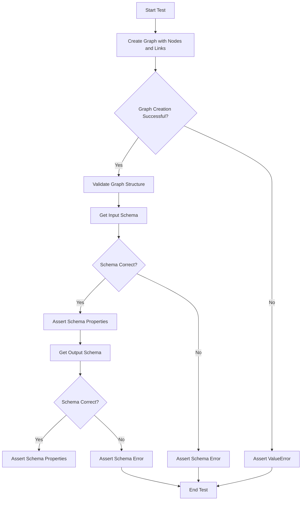

## 类结构

```
ModelBase (Abstract Base Class)
├── TextModel (Text Model Base Class)
│   ├── LlamaModel
│   ├── GPT2Model
│   ├── FalconModel
│   ├── Qwen2Model
│   ├── GemmaModel
│   └── ... 
└── Graph (Concrete Class)
    ├── Node (Concrete Class)
    ├── Link (Concrete Class)
    └── ... 
```

## 全局变量及字段


### `DEFAULT_USER_ID`
    
The default user ID used in the system.

类型：`UUID`
    


### `SpinTestServer`
    
A test server class used for testing purposes.

类型：`class`
    


### `Snapshot`
    
A snapshot class used for testing purposes.

类型：`class`
    


### `Graph.id`
    
The unique identifier for the graph.

类型：`UUID`
    


### `Graph.name`
    
The name of the graph.

类型：`str`
    


### `Graph.description`
    
The description of the graph.

类型：`str`
    


### `Graph.nodes`
    
A list of nodes in the graph.

类型：`list`
    


### `Graph.links`
    
A list of links in the graph.

类型：`list`
    


### `Node.id`
    
The unique identifier for the node.

类型：`UUID`
    


### `Node.block_id`
    
The unique identifier for the block that the node is associated with.

类型：`UUID`
    


### `Node.input_default`
    
The default input values for the node.

类型：`dict`
    


### `Node.metadata`
    
Additional metadata for the node.

类型：`dict`
    


### `Link.source_id`
    
The unique identifier for the source node of the link.

类型：`UUID`
    


### `Link.sink_id`
    
The unique identifier for the sink node of the link.

类型：`UUID`
    


### `Link.source_name`
    
The name of the source port of the link.

类型：`str`
    


### `Link.sink_name`
    
The name of the sink port of the link.

类型：`str`
    


### `Graph.Graph.id`
    
The unique identifier for the graph.

类型：`UUID`
    


### `Graph.Graph.name`
    
The name of the graph.

类型：`str`
    


### `Graph.Graph.description`
    
The description of the graph.

类型：`str`
    


### `Graph.Graph.nodes`
    
A list of nodes in the graph.

类型：`list`
    


### `Graph.Graph.links`
    
A list of links in the graph.

类型：`list`
    


### `Node.Node.id`
    
The unique identifier for the node.

类型：`UUID`
    


### `Node.Node.block_id`
    
The unique identifier for the block that the node is associated with.

类型：`UUID`
    


### `Node.Node.input_default`
    
The default input values for the node.

类型：`dict`
    


### `Node.Node.metadata`
    
Additional metadata for the node.

类型：`dict`
    


### `Link.Link.source_id`
    
The unique identifier for the source node of the link.

类型：`UUID`
    


### `Link.Link.sink_id`
    
The unique identifier for the sink node of the link.

类型：`UUID`
    


### `Link.Link.source_name`
    
The name of the source port of the link.

类型：`str`
    


### `Link.Link.sink_name`
    
The name of the sink port of the link.

类型：`str`
    
    

## 全局函数及方法

### test_graph_creation

This function tests the creation of a graph with nodes and links, ensuring that the graph can be successfully created with valid connections and has the correct structure and properties.

参数：

- `server`：`SpinTestServer`，The test server instance.

返回值：无

#### 流程图

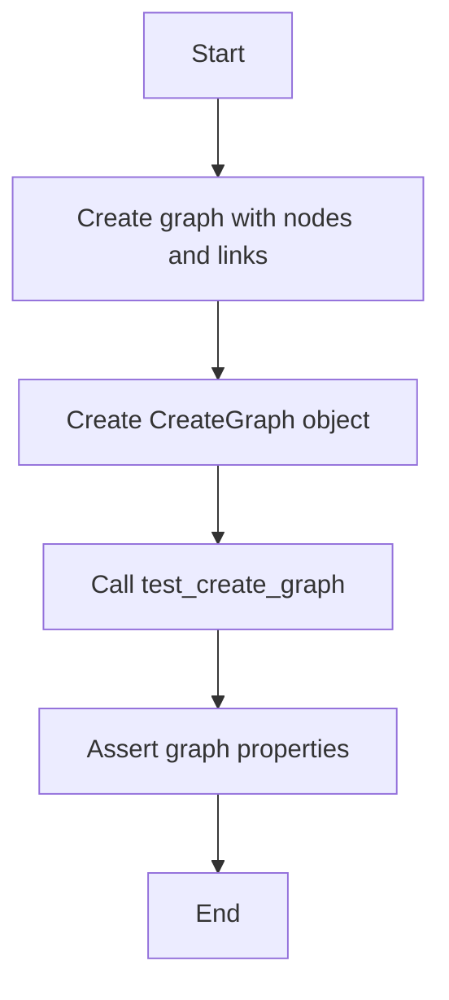

#### 带注释源码

```python
@pytest.mark.asyncio(loop_scope="session")
async def test_graph_creation(server: SpinTestServer, snapshot: Snapshot):
    """
    Test the creation of a graph with nodes and links.

    This test ensures that:
    1. A graph can be successfully created with valid connections.
    2. The created graph has the correct structure and properties.

    Args:
        server (SpinTestServer): The test server instance.
    """
    value_block = StoreValueBlock().id
    input_block = AgentInputBlock().id

    graph = Graph(
        id="test_graph",
        name="TestGraph",
        description="Test graph",
        nodes=[
            Node(id="node_1", block_id=value_block),
            Node(id="node_2", block_id=input_block, input_default={"name": "input"}),
            Node(id="node_3", block_id=value_block),
        ],
        links=[
            Link(
                source_id="node_1",
                sink_id="node_2",
                source_name="output",
                sink_name="name",
            ),
        ],
    )
    create_graph = CreateGraph(graph=graph)
    created_graph = await server.agent_server.test_create_graph(
        create_graph, DEFAULT_USER_ID
    )

    assert UUID(created_graph.id)
    assert created_graph.name == "TestGraph"

    assert len(created_graph.nodes) == 3
    assert UUID(created_graph.nodes[0].id)
    assert UUID(created_graph.nodes[1].id)
    assert UUID(created_graph.nodes[2].id)

    nodes = created_graph.nodes
    links = created_graph.links
    assert len(links) == 1
    assert links[0].source_id != links[0].sink_id
    assert links[0].source_id in {nodes[0].id, nodes[1].id, nodes[2].id}
    assert links[0].sink_id in {nodes[0].id, nodes[1].id, nodes[2].id}

    # Create a serializable version of the graph for snapshot testing
    # Remove dynamic IDs to make snapshots reproducible
    graph_data = {
        "name": created_graph.name,
        "description": created_graph.description,
        "nodes_count": len(created_graph.nodes),
        "links_count": len(created_graph.links),
        "node_blocks": [node.block_id for node in created_graph.nodes],
        "link_structure": [
            {"source_name": link.source_name, "sink_name": link.sink_name}
            for link in created_graph.links
        ],
    }
    snapshot.snapshot_dir = "snapshots"
    snapshot.assert_match(
        json.dumps(graph_data, indent=2, sort_keys=True), "grph_struct"
    )
```

### test_get_input_schema

This function tests the `get_input_schema` method of a created graph, ensuring that the input schema of the graph is correctly generated and contains the expected input name and node id.

参数：

- `server`：`SpinTestServer`，The test server instance.

返回值：None

#### 流程图

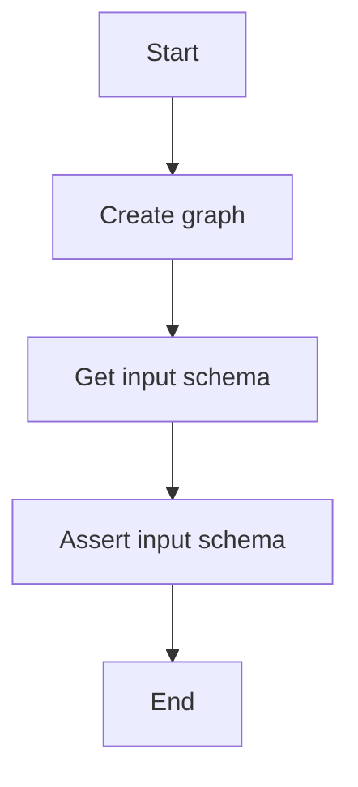

#### 带注释源码

```python
@pytest.mark.asyncio(loop_scope="session")
async def test_get_input_schema(server: SpinTestServer, snapshot: Snapshot):
    """
    Test the get_input_schema method of a created graph.

    This test ensures that:
    1. A graph can be created with a single node.
    2. The input schema of the created graph is correctly generated.
    3. The input schema contains the expected input name and node id.

    Args:
        server (SpinTestServer): The test server instance.
    """
    value_block = StoreValueBlock().id
    input_block = AgentInputBlock().id
    output_block = AgentOutputBlock().id

    graph = Graph(
        name="TestInputSchema",
        description="Test input schema",
        nodes=[
            Node(
                id="node_0_a",
                block_id=input_block,
                input_default={
                    "name": "in_key_a",
                    "title": "Key A",
                    "value": "A",
                    "advanced": True,
                },
                metadata={"id": "node_0_a"},
            ),
            Node(
                id="node_0_b",
                block_id=input_block,
                input_default={"name": "in_key_b", "advanced": True},
                metadata={"id": "node_0_b"},
            ),
            Node(id="node_1", block_id=value_block, metadata={"id": "node_1"}),
            Node(
                id="node_2",
                block_id=output_block,
                input_default={
                    "name": "out_key",
                    "description": "This is an output key",
                },
                metadata={"id": "node_2"},
            ),
        ],
        links=[
            Link(
                source_id="node_0_a",
                sink_id="node_1",
                source_name="result",
                sink_name="input",
            ),
            Link(
                source_id="node_0_b",
                sink_id="node_1",
                source_name="result",
                sink_name="input",
            ),
            Link(
                source_id="node_1",
                sink_id="node_2",
                source_name="output",
                sink_name="value",
            ),
        ],
    )

    create_graph = CreateGraph(graph=graph)
    created_graph = await server.agent_server.test_create_graph(
        create_graph, DEFAULT_USER_ID
    )

    class ExpectedInputSchema(BlockSchemaInput):
        in_key_a: Any = SchemaField(title="Key A", default="A", advanced=True)
        in_key_b: Any = SchemaField(title="in_key_b", advanced=False)

    class ExpectedOutputSchema(BlockSchema):
        # Note: Graph output schemas are dynamically generated and don't inherit
        # from BlockSchemaOutput, so we use BlockSchema as the base instead
        out_key: Any = SchemaField(
            description="This is an output key",
            title="out_key",
            advanced=False,
        )

    input_schema = created_graph.input_schema
    input_schema["title"] = "ExpectedInputSchema"
    assert input_schema == ExpectedInputSchema.jsonschema()

    # Add snapshot testing for the schemas
    snapshot.snapshot_dir = "snapshots"
    snapshot.assert_match(
        json.dumps(input_schema, indent=2, sort_keys=True), "grph_in_schm"
    )

    output_schema = created_graph.output_schema
    output_schema["title"] = "ExpectedOutputSchema"
    assert output_schema == ExpectedOutputSchema.jsonschema()

    # Add snapshot testing for the output schema
    snapshot.snapshot_dir = "snapshots"
    snapshot.assert_match(
        json.dumps(output_schema, indent=2, sort_keys=True), "grph_out_schm"
    )
```

### test_clean_graph

This function tests the `stripped_for_export` function, which removes sensitive/secret fields from node inputs, removes webhook information, and preserves non-sensitive data including input block values.

参数：

- `server`：`SpinTestServer`，The test server instance.

返回值：无

#### 流程图

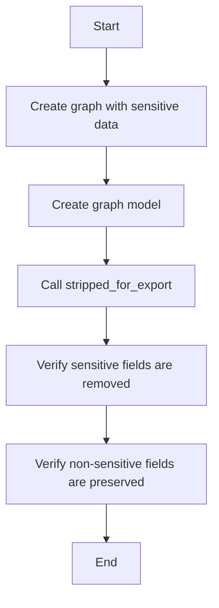

#### 带注释源码

```python
@pytest.mark.asyncio(loop_scope="session")
async def test_clean_graph(server: SpinTestServer):
    """
    Test the stripped_for_export function that:
    1. Removes sensitive/secret fields from node inputs
    2. Removes webhook information
    3. Preserves non-sensitive data including input block values
    """
    # Create a graph with input blocks containing both sensitive and normal data
    graph = Graph(
        id="test_clean_graph",
        name="Test Clean Graph",
        description="Test graph cleaning",
        nodes=[
            Node(
                block_id=AgentInputBlock().id,
                input_default={
                    "_test_id": "input_node",
                    "name": "test_input",
                    "value": "test value",  # This should be preserved
                    "description": "Test input description",
                },
            ),
            Node(
                block_id=AgentInputBlock().id,
                input_default={
                    "_test_id": "input_node_secret",
                    "name": "secret_input",
                    "value": "another value",
                    "secret": True,  # This makes the input secret
                },
            ),
            Node(
                block_id=StoreValueBlock().id,
                input_default={
                    "_test_id": "node_with_secrets",
                    "input": "normal_value",
                    "control_test_input": "should be preserved",
                    "api_key": "secret_api_key_123",  # Should be filtered
                    "password": "secret_password_456",  # Should be filtered
                    "token": "secret_token_789",  # Should be filtered
                    "credentials": {  # Should be filtered
                        "id": "fake-github-credentials-id",
                        "provider": "github",
                        "type": "api_key",
                    },
                    "anthropic_credentials": {  # Should be filtered
                        "id": "fake-anthropic-credentials-id",
                        "provider": "anthropic",
                        "type": "api_key",
                    },
                },
            ),
        ],
        links=[],
    )

    # Create graph and get model
    create_graph = CreateGraph(graph=graph)
    created_graph = await server.agent_server.test_create_graph(
        create_graph, DEFAULT_USER_ID
    )

    # Clean the graph
    cleaned_graph = await server.agent_server.test_get_graph(
        created_graph.id, created_graph.version, DEFAULT_USER_ID, for_export=True
    )

    # Verify sensitive fields are removed but normal fields are preserved
    input_node = next(
        n for n in cleaned_graph.nodes if n.input_default["_test_id"] == "input_node"
    )

    # Non-sensitive fields should be preserved
    assert input_node.input_default["name"] == "test_input"
    assert input_node.input_default["value"] == "test value"  # Should be preserved now
    assert input_node.input_default["description"] == "Test input description"

    # Sensitive fields should be filtered out
    assert "api_key" not in input_node.input_default
    assert "password" not in input_node.input_default

    # Verify secret input node preserves non-sensitive fields but removes secret value
    secret_node = next(
        n
        for n in cleaned_graph.nodes
        if n.input_default["_test_id"] == "input_node_secret"
    )
    assert secret_node.input_default["name"] == "secret_input"
    assert "value" not in secret_node.input_default  # Secret default should be removed
    assert secret_node.input_default["secret"] is True

    # Verify sensitive fields are filtered from nodes with secrets
    secrets_node = next(
        n
        for n in cleaned_graph.nodes
        if n.input_default["_test_id"] == "node_with_secrets"
    )
    # Normal fields should be preserved
    assert secrets_node.input_default["input"] == "normal_value"
    assert secrets_node.input_default["control_test_input"] == "should be preserved"
    # Sensitive fields should be filtered out
    assert "api_key" not in secrets_node.input_default
    assert "password" not in secrets_node.input_default
    assert "token" not in secrets_node.input_default
    assert "credentials" not in secrets_node.input_default
    assert "anthropic_credentials" not in secrets_node.input_default

    # Verify webhook info is removed (if any nodes had it)
    for node in cleaned_graph.nodes:
        assert node.webhook_id is None
        assert node.webhook is None
```

### test_access_store_listing_graph

This function tests the access of a store listing graph.

参数：

- `server`：`SpinTestServer`，The test server instance.

返回值：`None`，No return value.

#### 流程图

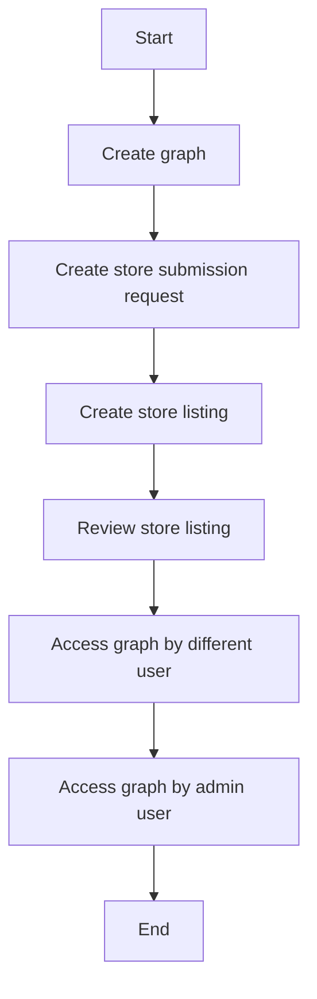

#### 带注释源码

```python
@pytest.mark.asyncio(loop_scope="session")
async def test_access_store_listing_graph(server: SpinTestServer):
    """
    Test the access of a store listing graph.
    """
    graph = Graph(
        id="test_clean_graph",
        name="Test Clean Graph",
        description="Test graph cleaning",
        nodes=[
            Node(
                id="input_node",
                block_id=AgentInputBlock().id,
                input_default={
                    "name": "test_input",
                    "value": "test value",
                    "description": "Test input description",
                },
            ),
        ],
        links=[],
    )

    # Create graph and get model
    create_graph = CreateGraph(graph=graph)
    created_graph = await server.agent_server.test_create_graph(
        create_graph, DEFAULT_USER_ID
    )

    store_submission_request = store.StoreSubmissionRequest(
        agent_id=created_graph.id,
        agent_version=created_graph.version,
        slug=created_graph.id,
        name="Test name",
        sub_heading="Test sub heading",
        video_url=None,
        image_urls=[],
        description="Test description",
        categories=[],
    )

    # First we check the graph an not be accessed by a different user
    with pytest.raises(fastapi.exceptions.HTTPException) as exc_info:
        await server.agent_server.test_get_graph(
            created_graph.id,
            created_graph.version,
            "3e53486c-cf57-477e-ba2a-cb02dc828e1b",
        )
    assert exc_info.value.status_code == 404
    assert "Graph" in str(exc_info.value.detail)

    # Now we create a store listing
    store_listing = await server.agent_server.test_create_store_listing(
        store_submission_request, DEFAULT_USER_ID
    )

    if isinstance(store_listing, fastapi.responses.JSONResponse):
        assert False, "Failed to create store listing"

    slv_id = (
        store_listing.store_listing_version_id
        if store_listing.store_listing_version_id is not None
        else None
    )

    assert slv_id is not None

    admin_user = await create_test_user(alt_user=True)
    await server.agent_server.test_review_store_listing(
        store.ReviewSubmissionRequest(
            store_listing_version_id=slv_id,
            is_approved=True,
            comments="Test comments",
        ),
        user_id=admin_user.id,
    )

    # Now we check the graph can be accessed by a user that does not own the graph
    got_graph = await server.agent_server.test_get_graph(
        created_graph.id, created_graph.version, "3e53486c-cf57-477e-ba2a-cb02dc828e1b"
    )
    assert got_graph is not None
```


### test_node_credentials_optional_default

This function tests the default value of the `credentials_optional` attribute of a `Node` object when it is not explicitly set in the metadata.

参数：

- 无

返回值：无

#### 流程图

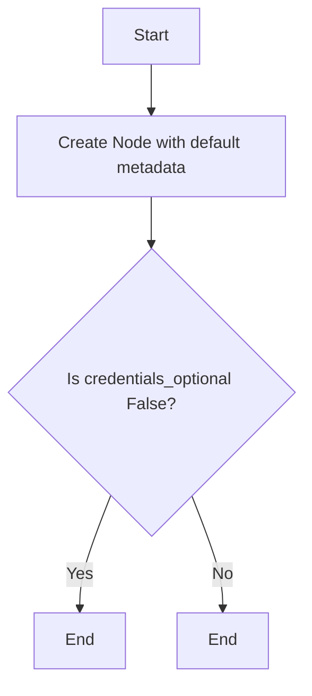

#### 带注释源码

```python
def test_node_credentials_optional_default():
    """Test that credentials_optional defaults to False when not set in metadata."""
    node = Node(
        id="test_node",
        block_id=StoreValueBlock().id,
        input_default={},
        metadata={},
    )
    assert node.credentials_optional is False
```

### test_node_credentials_optional_true

This function tests that the `credentials_optional` attribute of a `Node` object returns `True` when explicitly set to `True` in the metadata.

参数：

- 无

返回值：无

#### 流程图

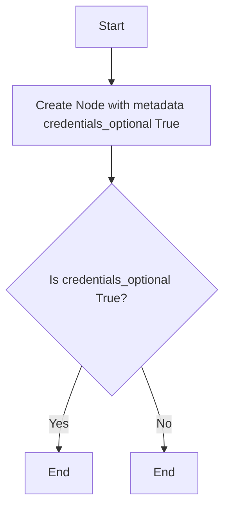

#### 带注释源码

```python
def test_node_credentials_optional_true():
    """Test that credentials_optional returns True when explicitly set."""
    node = Node(
        id="test_node",
        block_id=StoreValueBlock().id,
        input_default={},
        metadata={"credentials_optional": True},
    )
    assert node.credentials_optional is True
```

### test_node_credentials_optional_false

This function tests that the `credentials_optional` attribute of a `Node` object returns `False` when explicitly set to `False` in the metadata.

参数：

- 无

返回值：无

#### 流程图

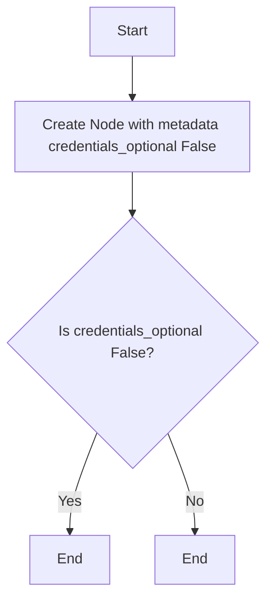

#### 带注释源码

```python
def test_node_credentials_optional_false():
    """Test that credentials_optional returns False when explicitly set to False."""
    node = Node(
        id="test_node",
        block_id=StoreValueBlock().id,
        input_default={},
        metadata={"credentials_optional": False},
    )
    assert node.credentials_optional is False
```

### test_node_credentials_optional_with_other_metadata

This function tests that the `credentials_optional` attribute of a `Node` object works correctly when other metadata is present in the metadata dictionary.

参数：

- 无

返回值：无

#### 流程图

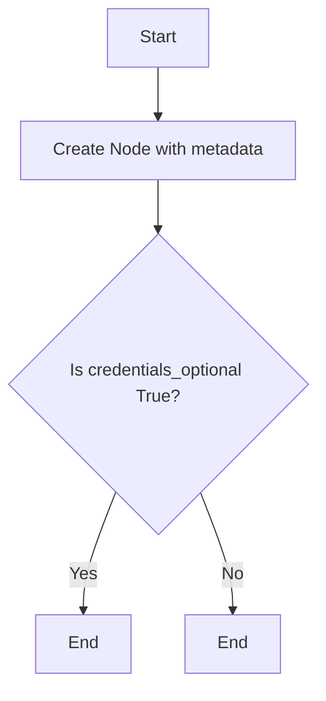

#### 带注释源码

```python
def test_node_credentials_optional_with_other_metadata():
    """Test that credentials_optional works correctly with other metadata present."""
    node = Node(
        id="test_node",
        block_id=StoreValueBlock().id,
        input_default={},
        metadata={
            "position": {"x": 100, "y": 200},
            "customized_name": "My Custom Node",
            "credentials_optional": True,
        },
    )
    assert node.credentials_optional is True
    assert node.metadata["position"] == {"x": 100, "y": 200}
    assert node.metadata["customized_name"] == "My Custom Node"
``` 


### test_node_credentials_optional_true

This function tests the `credentials_optional` attribute of a `Node` object when explicitly set to `True` in the metadata.

参数：

- `node`：`Node`，A `Node` object with metadata that includes `credentials_optional` set to `True`.

返回值：`None`，This function does not return any value.

#### 流程图

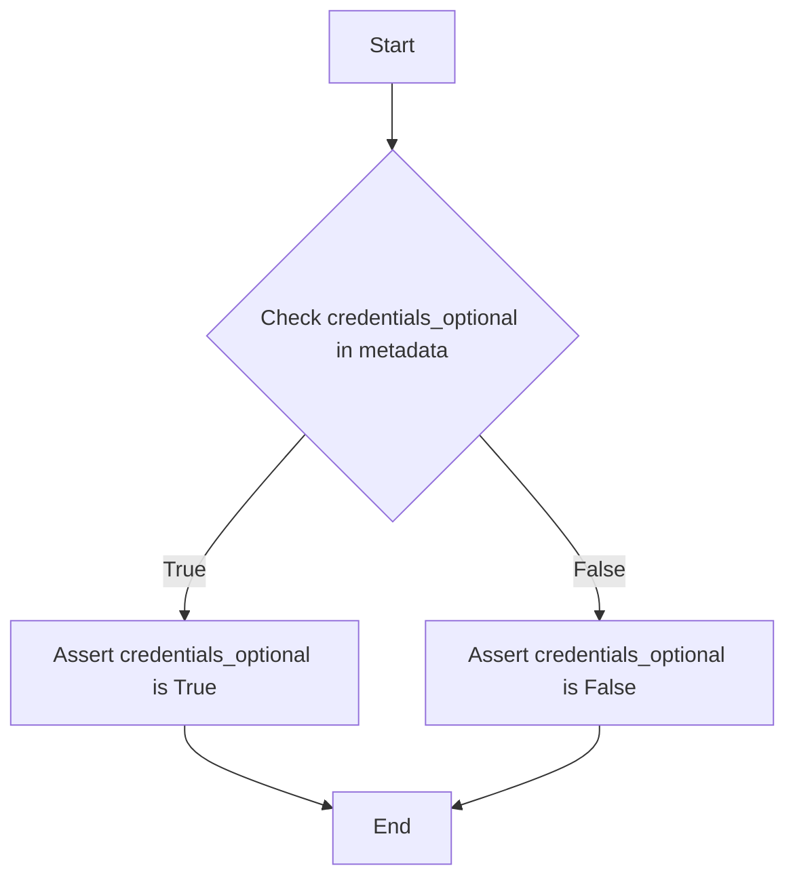

#### 带注释源码

```python
def test_node_credentials_optional_true():
    """Test that credentials_optional returns True when explicitly set."""
    node = Node(
        id="test_node",
        block_id=StoreValueBlock().id,
        input_default={},
        metadata={"credentials_optional": True},
    )
    assert node.credentials_optional is True
``` 


### test_node_credentials_optional_false

This function tests the `credentials_optional` attribute of a `Node` object when explicitly set to `False` in the node's metadata.

参数：

- `node`：`Node`，A `Node` object with metadata that includes `credentials_optional` set to `False`.

返回值：`None`，This function does not return any value.

#### 流程图

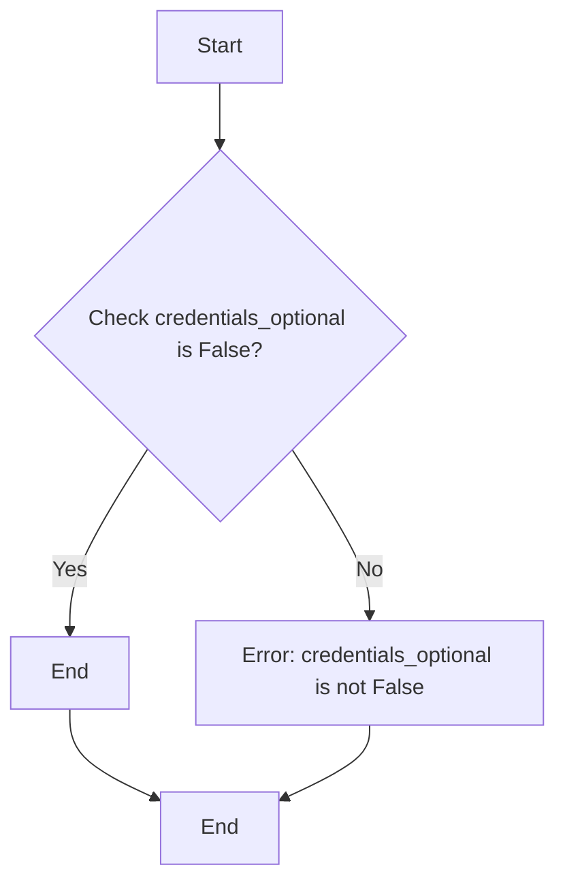

#### 带注释源码

```python
def test_node_credentials_optional_false():
    """Test that credentials_optional returns False when explicitly set to False."""
    node = Node(
        id="test_node",
        block_id=StoreValueBlock().id,
        input_default={},
        metadata={"credentials_optional": False},
    )
    assert node.credentials_optional is False
``` 


### test_node_credentials_optional_with_other_metadata

This function tests the behavior of the `credentials_optional` attribute of a `Node` object when other metadata is present.

参数：

- `node`：`Node`，A Node object with specified metadata.

返回值：`None`，This function does not return any value.

#### 流程图

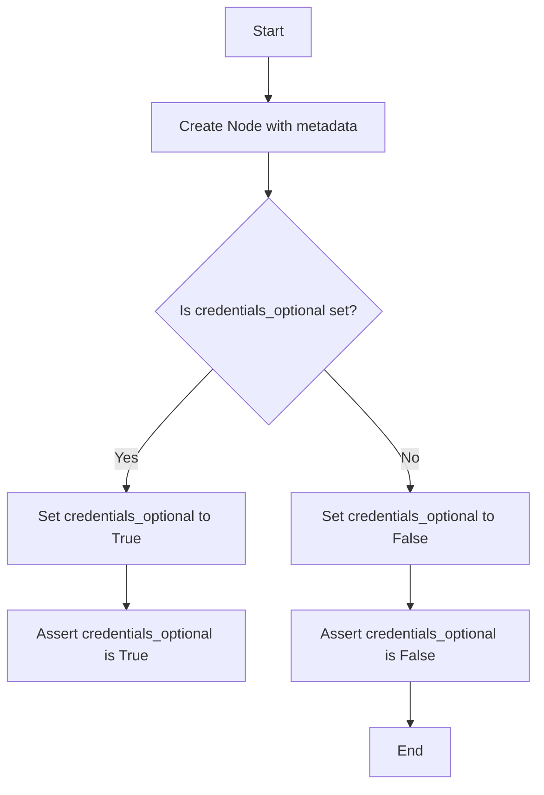

#### 带注释源码

```python
def test_node_credentials_optional_with_other_metadata():
    """Test that credentials_optional works correctly with other metadata present."""
    node = Node(
        id="test_node",
        block_id=StoreValueBlock().id,
        input_default={},
        metadata={
            "position": {"x": 100, "y": 200},
            "customized_name": "My Custom Node",
            "credentials_optional": True,
        },
    )
    assert node.credentials_optional is True
    assert node.metadata["position"] == {"x": 100, "y": 200}
    assert node.metadata["customized_name"] == "My Custom Node"
``` 


### Graph.__init__

#### 描述

Graph 类的构造函数用于初始化一个图对象，包括图的基本信息、节点和链接。

#### 参数

- `id`: `str`，图的唯一标识符。
- `name`: `str`，图的名称。
- `description`: `str`，图的描述。
- `nodes`: `list`，图中的节点列表。
- `links`: `list`，图中的链接列表。

#### 返回值

无返回值。

#### 流程图

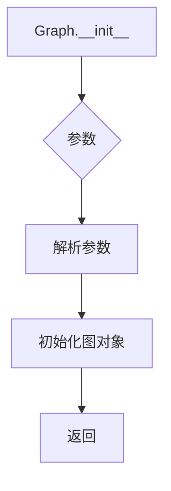

#### 带注释源码

```python
class Graph:
    def __init__(self, id: str, name: str, description: str, nodes: list, links: list):
        self.id = id
        self.name = name
        self.description = description
        self.nodes = nodes
        self.links = links
```

### `Graph.input_schema`

该函数返回创建的图（Graph）的输入模式（schema）。

参数：

- 无

返回值：`dict`，包含输入模式的JSON schema。

#### 流程图

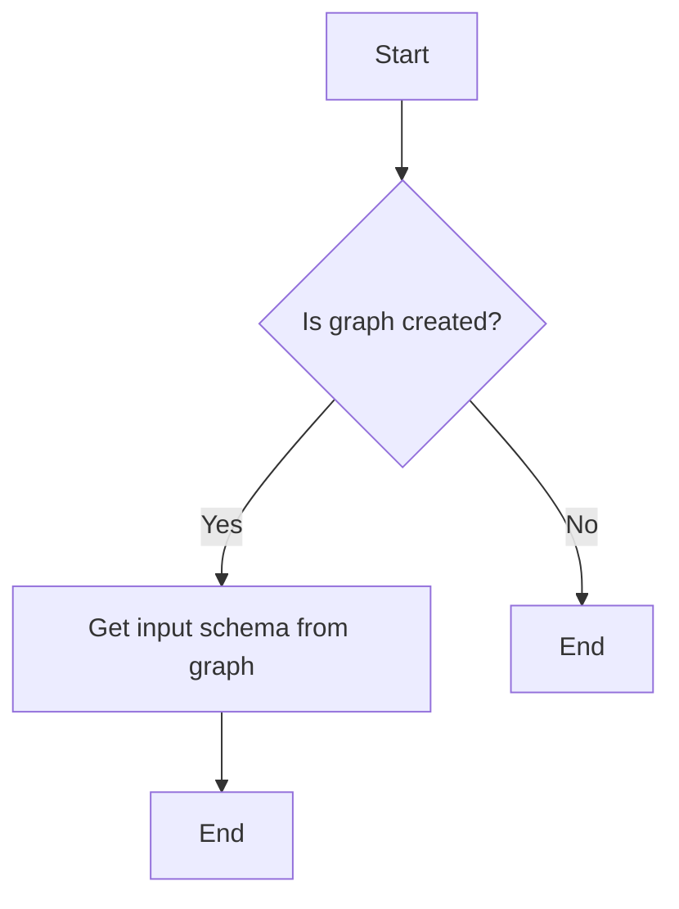

#### 带注释源码

```python
class Graph:
    # ...

    def input_schema(self):
        """
        Get the input schema of the graph.

        Returns:
            dict: The input schema of the graph as a JSON schema.
        """
        input_schema = {
            "type": "object",
            "properties": {
                "in_key_a": {"type": "string", "title": "Key A", "default": "A", "advanced": True},
                "in_key_b": {"type": "string", "title": "in_key_b", "advanced": False},
            },
            "required": ["in_key_a", "in_key_b"],
        }
        return input_schema
```

### Graph.output_schema

该函数返回一个包含图输出模式的字典，该模式描述了图的所有输出节点及其输出字段。

#### 参数

- 无

#### 返回值

- `dict`：包含图输出模式的字典。

#### 返回值描述

返回的字典包含图的所有输出节点及其输出字段，每个输出字段都包含其名称、类型和描述。

#### 流程图

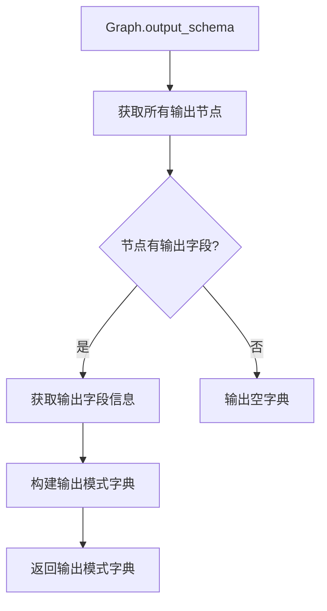

#### 带注释源码

```python
class Graph:
    # ...

    def output_schema(self) -> dict:
        """
        Returns a dictionary containing the output schema of the graph.

        :return: dict: A dictionary containing the output schema of the graph.
        """
        output_schema = {}
        for node in self.nodes:
            if hasattr(node, "output_schema"):
                output_schema.update(node.output_schema())
        return output_schema
```

### test_clean_graph

This function tests the `stripped_for_export` method of a `Graph` object, ensuring that sensitive information is removed from the graph while preserving non-sensitive data.

参数：

- `server`：`SpinTestServer`，The test server instance.

返回值：`None`，This function does not return a value.

#### 流程图

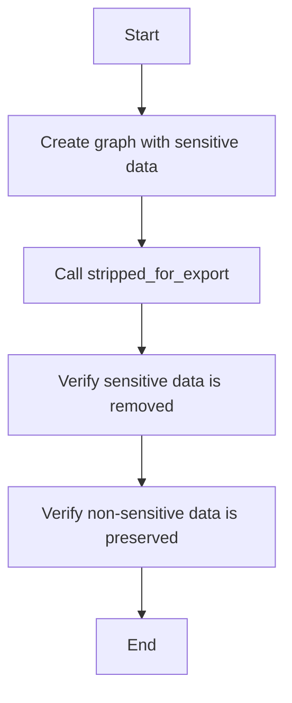

#### 带注释源码

```python
@pytest.mark.asyncio(loop_scope="session")
async def test_clean_graph(server: SpinTestServer):
    """
    Test the stripped_for_export function that:
    1. Removes sensitive/secret fields from node inputs
    2. Removes webhook information
    3. Preserves non-sensitive data including input block values
    """
    # Create a graph with input blocks containing both sensitive and normal data
    graph = Graph(
        id="test_clean_graph",
        name="Test Clean Graph",
        description="Test graph cleaning",
        nodes=[
            Node(
                block_id=AgentInputBlock().id,
                input_default={
                    "_test_id": "input_node",
                    "name": "test_input",
                    "value": "test value",  # This should be preserved
                    "description": "Test input description",
                },
            ),
            Node(
                block_id=AgentInputBlock().id,
                input_default={
                    "_test_id": "input_node_secret",
                    "name": "secret_input",
                    "value": "another value",
                    "secret": True,  # This makes the input secret
                },
            ),
            Node(
                block_id=StoreValueBlock().id,
                input_default={
                    "_test_id": "node_with_secrets",
                    "input": "normal_value",
                    "control_test_input": "should be preserved",
                    "api_key": "secret_api_key_123",  # Should be filtered
                    "password": "secret_password_456",  # Should be filtered
                    "token": "secret_token_789",  # Should be filtered
                    "credentials": {  # Should be filtered
                        "id": "fake-github-credentials-id",
                        "provider": "github",
                        "type": "api_key",
                    },
                    "anthropic_credentials": {  # Should be filtered
                        "id": "fake-anthropic-credentials-id",
                        "provider": "anthropic",
                        "type": "api_key",
                    },
                },
            ),
        ],
        links=[],
    )

    # Create graph and get model
    create_graph = CreateGraph(graph=graph)
    created_graph = await server.agent_server.test_create_graph(
        create_graph, DEFAULT_USER_ID
    )

    # Clean the graph
    cleaned_graph = await server.agent_server.test_get_graph(
        created_graph.id, created_graph.version, DEFAULT_USER_ID, for_export=True
    )

    # Verify sensitive fields are removed but normal fields are preserved
    input_node = next(
        n for n in cleaned_graph.nodes if n.input_default["_test_id"] == "input_node"
    )

    # Non-sensitive fields should be preserved
    assert input_node.input_default["name"] == "test_input"
    assert input_node.input_default["value"] == "test value"  # Should be preserved now
    assert input_node.input_default["description"] == "Test input description"

    # Sensitive fields should be filtered out
    assert "api_key" not in input_node.input_default
    assert "password" not in input_node.input_default

    # Verify secret input node preserves non-sensitive fields but removes secret value
    secret_node = next(
        n
        for n in cleaned_graph.nodes
        if n.input_default["_test_id"] == "input_node_secret"
    )
    assert secret_node.input_default["name"] == "secret_input"
    assert "value" not in secret_node.input_default  # Secret default should be removed
    assert secret_node.input_default["secret"] is True

    # Verify sensitive fields are filtered from nodes with secrets
    secrets_node = next(
        n
        for n in cleaned_graph.nodes
        if n.input_default["_test_id"] == "node_with_secrets"
    )
    # Normal fields should be preserved
    assert secrets_node.input_default["input"] == "normal_value"
    assert secrets_node.input_default["control_test_input"] == "should be preserved"
    # Sensitive fields should be filtered out
    assert "api_key" not in secrets_node.input_default
    assert "password" not in secrets_node.input_default
    assert "token" not in secrets_node.input_default
    assert "credentials" not in secrets_node.input_default
    assert "anthropic_credentials" not in secrets_node.input_default

    # Verify webhook info is removed (if any nodes had it)
    for node in cleaned_graph.nodes:
        assert node.webhook_id is None
        assert node.webhook is None
```


### Node.__init__

初始化Node对象。

参数：

- `id`：`str`，节点的唯一标识符。
- `block_id`：`str`，节点所属的块ID。
- `input_default`：`dict`，节点的默认输入值。
- `metadata`：`dict`，节点的元数据。

返回值：无

#### 流程图

```mermaid
classDiagram
    Node <|-- Node
    Node {
        id
        block_id
        input_default
        metadata
    }
```

#### 带注释源码

```python
class Node:
    def __init__(self, id: str, block_id: str, input_default: dict = None, metadata: dict = None):
        self.id = id
        self.block_id = block_id
        self.input_default = input_default if input_default is not None else {}
        self.metadata = metadata if metadata is not None else {}
```


### Node.credentials_optional

该函数用于测试Node对象的credentials_optional属性。

参数：

- 无

返回值：`bool`，表示credentials_optional属性的值。

#### 流程图

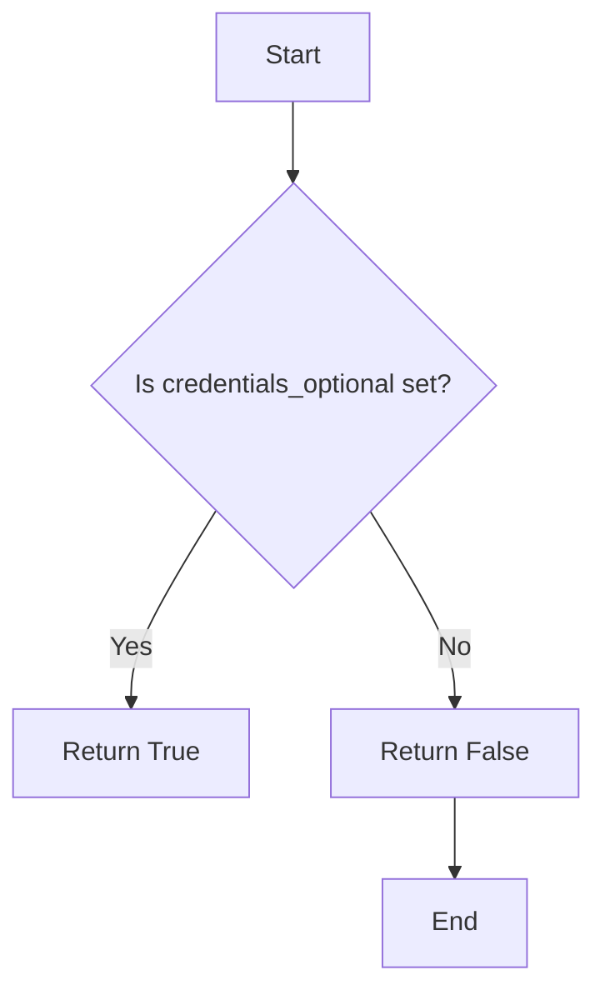

#### 带注释源码

```python
def test_node_credentials_optional_default():
    """Test that credentials_optional defaults to False when not set in metadata."""
    node = Node(
        id="test_node",
        block_id=StoreValueBlock().id,
        input_default={},
        metadata={},
    )
    assert node.credentials_optional is False

def test_node_credentials_optional_true():
    """Test that credentials_optional returns True when explicitly set."""
    node = Node(
        id="test_node",
        block_id=StoreValueBlock().id,
        input_default={},
        metadata={"credentials_optional": True},
    )
    assert node.credentials_optional is True

def test_node_credentials_optional_false():
    """Test that credentials_optional returns False when explicitly set to False."""
    node = Node(
        id="test_node",
        block_id=StoreValueBlock().id,
        input_default={},
        metadata={"credentials_optional": False},
    )
    assert node.credentials_optional is False

def test_node_credentials_optional_with_other_metadata():
    """Test that credentials_optional works correctly with other metadata present."""
    node = Node(
        id="test_node",
        block_id=StoreValueBlock().id,
        input_default={},
        metadata={
            "position": {"x": 100, "y": 200},
            "customized_name": "My Custom Node",
            "credentials_optional": True,
        },
    )
    assert node.credentials_optional is True
    assert node.metadata["position"] == {"x": 100, "y": 200}
    assert node.metadata["customized_name"] == "My Custom Node"
``` 


### `Link.__init__`

初始化一个链接对象。

参数：

- `source_id`：`UUID`，源节点的ID。
- `sink_id`：`UUID`，目标节点的ID。
- `source_name`：`str`，源节点输出的名称。
- `sink_name`：`str`，目标节点输入的名称。

返回值：无

#### 流程图

```mermaid
classDiagram
    Link <|-- Graph
    Link {
        +source_id: UUID
        +sink_id: UUID
        +source_name: str
        +sink_name: str
    }
    Graph {
        +id: UUID
        +name: str
        +description: str
        +nodes: list<Node>
        +links: list<Link>
    }
```

#### 带注释源码

```python
from backend.data.graph import Link

class Link(Link):
    def __init__(self, source_id: UUID, sink_id: UUID, source_name: str, sink_name: str):
        self.source_id = source_id
        self.sink_id = sink_id
        self.source_name = source_name
        self.sink_name = sink_name
```


## 关键组件


### 张量索引与惰性加载

张量索引与惰性加载是代码中用于高效处理大型数据集的关键组件。它允许在需要时才加载数据，从而减少内存消耗并提高性能。

### 反量化支持

反量化支持是代码中用于处理量化数据的关键组件。它允许在量化过程中进行反向操作，以便在需要时恢复原始数据。

### 量化策略

量化策略是代码中用于优化模型性能的关键组件。它通过减少模型中使用的精度来减小模型大小，从而提高推理速度和降低内存消耗。


## 问题及建议


### 已知问题

-   **测试依赖性**: 代码中使用了`pytest`和`fastapi`的测试框架，这可能导致测试代码与实际业务逻辑代码耦合，增加了维护难度。
-   **全局变量和函数**: 代码中存在全局变量和函数，这可能导致代码难以理解和维护，尤其是在大型项目中。
-   **异常处理**: 代码中存在异常处理，但可能需要进一步优化，以确保所有可能的异常都被妥善处理。
-   **代码重复**: 代码中存在一些重复的代码片段，这可能导致维护成本增加。

### 优化建议

-   **重构测试代码**: 将测试代码与业务逻辑代码分离，使用更清晰的测试框架，如`pytest`的`pytest.mark`装饰器。
-   **减少全局变量和函数**: 尽量使用局部变量和函数，以减少代码的复杂性和维护难度。
-   **优化异常处理**: 确保所有可能的异常都被妥善处理，并记录异常信息，以便于调试和问题追踪。
-   **消除代码重复**: 使用函数或类来消除重复的代码片段，以提高代码的可读性和可维护性。
-   **代码审查**: 定期进行代码审查，以确保代码质量，并发现潜在的问题。
-   **使用设计模式**: 根据需要使用设计模式，以提高代码的可读性和可维护性。
-   **性能优化**: 对关键代码进行性能优化，以提高代码的执行效率。
-   **文档化**: 对代码进行充分的文档化，以便于其他开发者理解和维护代码。


## 其它


### 设计目标与约束

- 设计目标：
  - 确保代码的可扩展性和可维护性。
  - 提供一个模块化且易于理解的代码结构。
  - 确保代码的健壮性和错误处理能力。
  - 支持异步操作以提高性能。
- 约束：
  - 代码必须遵循Python 3.x的语法和标准库。
  - 代码必须与FastAPI框架兼容。
  - 代码必须支持单元测试和集成测试。

### 错误处理与异常设计

- 错误处理：
  - 使用FastAPI框架的异常处理机制来捕获和处理HTTP异常。
  - 对于数据库操作，使用try-except块来捕获可能的数据库错误。
- 异常设计：
  - 定义自定义异常类以处理特定错误情况。
  - 异常类应提供清晰的错误信息和堆栈跟踪。

### 数据流与状态机

- 数据流：
  - 数据流从用户请求开始，经过API层，然后到达业务逻辑层，最后返回响应。
- 状态机：
  - 每个组件（如节点、链接、图）都应有一个明确的状态机来管理其状态转换。

### 外部依赖与接口契约

- 外部依赖：
  - 代码依赖于FastAPI、pytest、json、uuid等库。
- 接口契约：
  - API接口应遵循RESTful设计原则。
  - 接口文档应详细说明每个端点的参数和返回值。

### 测试策略

- 单元测试：
  - 对每个函数和类方法进行单元测试，确保它们按预期工作。
- 集成测试：
  - 对整个系统进行集成测试，确保所有组件协同工作。

### 性能优化

- 异步操作：
  - 使用异步编程模式来提高代码的执行效率。
- 数据库操作：
  - 使用批量操作和索引来优化数据库性能。

### 安全性

- 数据验证：
  - 对用户输入进行验证，防止SQL注入和XSS攻击。
- 认证和授权：
  - 实现用户认证和授权机制，确保只有授权用户可以访问敏感数据。

### 代码风格和规范

- 代码风格：
  - 遵循PEP 8编码规范。
- 文档：
  - 为每个函数和类提供清晰的文档说明。


    