# `.\AutoGPT\autogpt_platform\backend\backend\data\human_review.py` 详细设计文档

The code provides a data layer for handling human-in-the-loop (HITL) review operations, including database operations for pending human reviews, approval checks, and review processing.

## 整体流程

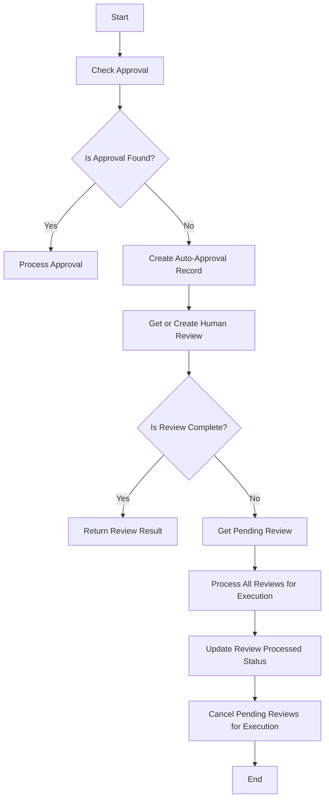

## 类结构

```
ReviewOperations (主类)
├── ReviewResult (模型类)
├── PendingHumanReview (模型类)
├── SafeJsonData (模型类)
└── ReviewStatus (枚举类)
```

## 全局变量及字段


### `logger`
    
Logger instance for logging messages.

类型：`logging.Logger`
    


### `ReviewResult`
    
Pydantic model representing the result of a review operation.

类型：`pydantic.BaseModel`
    


### `PendingHumanReview`
    
Pydantic model representing a pending human review.

类型：`pydantic.BaseModel`
    


### `SafeJsonData`
    
Pydantic model representing safe JSON data.

类型：`pydantic.BaseModel`
    


### `ReviewResult.data`
    
The data associated with the review result.

类型：`Optional[SafeJsonData]`
    


### `ReviewResult.status`
    
The status of the review operation.

类型：`ReviewStatus`
    


### `ReviewResult.message`
    
The message associated with the review result.

类型：`str`
    


### `ReviewResult.processed`
    
Indicates whether the review has been processed.

类型：`bool`
    


### `ReviewResult.node_exec_id`
    
The ID of the node execution associated with the review result.

类型：`str`
    


### `PendingHumanReview.nodeExecId`
    
The ID of the node execution associated with the review.

类型：`str`
    


### `PendingHumanReview.userId`
    
The ID of the user who performed the review.

类型：`str`
    


### `PendingHumanReview.graphExecId`
    
The ID of the graph execution associated with the review.

类型：`str`
    


### `PendingHumanReview.graphId`
    
The ID of the graph template associated with the review.

类型：`str`
    


### `PendingHumanReview.graphVersion`
    
The version of the graph template associated with the review.

类型：`int`
    


### `PendingHumanReview.payload`
    
The payload data associated with the review.

类型：`SafeJsonData`
    


### `PendingHumanReview.instructions`
    
The instructions associated with the review.

类型：`str`
    


### `PendingHumanReview.editable`
    
Indicates whether the review data can be edited.

类型：`bool`
    


### `PendingHumanReview.status`
    
The status of the review.

类型：`ReviewStatus`
    


### `PendingHumanReview.processed`
    
Indicates whether the review has been processed.

类型：`bool`
    


### `PendingHumanReview.reviewedAt`
    
The timestamp when the review was reviewed.

类型：`datetime.datetime`
    


### `SafeJsonData.data`
    
The data associated with the safe JSON model.

类型：`SafeJsonData`
    
    

## 全局函数及方法


### `get_auto_approve_key`

Generate the special nodeExecId key for auto-approval records.

参数：

- `graph_exec_id`：`str`，Graph execution ID
- `node_id`：`str`，ID of the node definition (not execution)

返回值：`str`，The special nodeExecId key for auto-approval records

#### 流程图

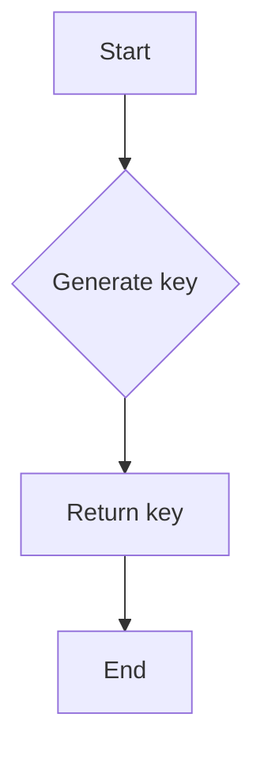

#### 带注释源码

```python
def get_auto_approve_key(graph_exec_id: str, node_id: str) -> str:
    """Generate the special nodeExecId key for auto-approval records."""
    return f"auto_approve_{graph_exec_id}_{node_id}"
```


### `check_approval`

Check if there's an existing approval for this node execution.

参数：

- `node_exec_id`：`str`，ID of the node execution
- `graph_exec_id`：`str`，ID of the graph execution
- `node_id`：`str`，ID of the node definition (not execution)
- `user_id`：`str`，ID of the user (for data isolation)
- `input_data`：`SafeJsonData | None`，Current input data (used for auto-approvals to avoid stale data)

返回值：`Optional[ReviewResult]`，ReviewResult if approval found (either normal or auto), None otherwise

#### 流程图

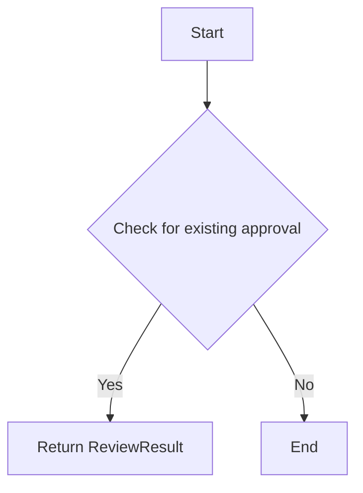

#### 带注释源码

```python
async def check_approval(
    node_exec_id: str,
    graph_exec_id: str,
    node_id: str,
    user_id: str,
    input_data: SafeJsonData | None = None,
) -> Optional[ReviewResult]:
    """
    Check if there's an existing approval for this node execution.

    Checks both:
    1. Normal approval by node_exec_id (previous run of the same node execution)
    2. Auto-approval by special key pattern "auto_approve_{graph_exec_id}_{node_id}"

    Args:
        node_exec_id: ID of the node execution
        graph_exec_id: ID of the graph execution
        node_id: ID of the node definition (not execution)
        user_id: ID of the user (for data isolation)
        input_data: Current input data (used for auto-approvals to avoid stale data)

    Returns:
        ReviewResult if approval found (either normal or auto), None otherwise
    """
    auto_approve_key = get_auto_approve_key(graph_exec_id, node_id)

    # Check for either normal approval or auto-approval in a single query
    existing_review = await PendingHumanReview.prisma().find_first(
        where={
            "OR": [
                {"nodeExecId": node_exec_id},
                {"nodeExecId": auto_approve_key},
            ],
            "status": ReviewStatus.APPROVED,
            "userId": user_id,
        },
    )

    if existing_review:
        is_auto_approval = existing_review.nodeExecId == auto_approve_key
        logger.info(
            f"Found {'auto-' if is_auto_approval else ''}approval for node {node_id} "
            f"(exec: {node_exec_id}) in execution {graph_exec_id}"
        )
        # For auto-approvals, use current input_data to avoid replaying stale payload
        # For normal approvals, use the stored payload (which may have been edited)
        return ReviewResult(
            data=(
                input_data
                if is_auto_approval and input_data is not None
                else existing_review.payload
            ),
            status=ReviewStatus.APPROVED,
            message=(
                "Auto-approved (user approved all future actions for this node)"
                if is_auto_approval
                else existing_review.reviewMessage or ""
            ),
            processed=True,
            node_exec_id=existing_review.nodeExecId,
        )

    return None
```


### `create_auto_approval_record`

Create an auto-approval record for a node in this execution.

参数：

- `user_id`：`str`，User ID for data isolation.
- `graph_exec_id`：`str`，ID of the graph execution.
- `graph_id`：`str`，ID of the graph template.
- `graph_version`：`int`，Version of the graph template.
- `node_id`：`str`，ID of the node definition (not execution).
- `payload`：`SafeJsonData`，Current input data (used for auto-approvals to avoid stale data).

返回值：`None`，No return value.

#### 流程图

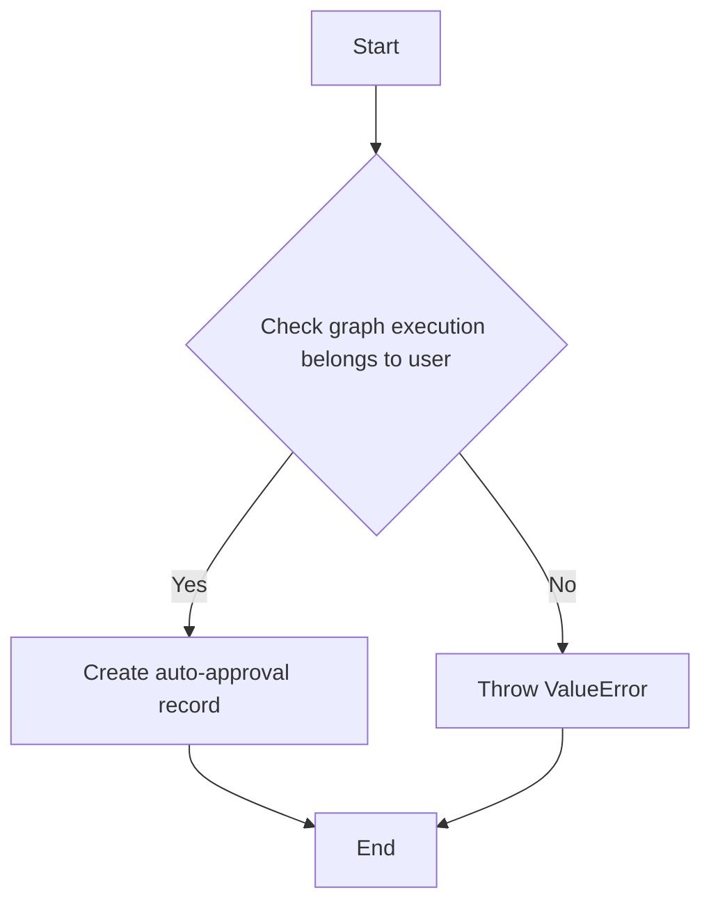

#### 带注释源码

```python
async def create_auto_approval_record(
    user_id: str,
    graph_exec_id: str,
    graph_id: str,
    graph_version: int,
    node_id: str,
    payload: SafeJsonData,
) -> None:
    """
    Create an auto-approval record for a node in this execution.

    This is stored as a PendingHumanReview with a special nodeExecId pattern
    and status=APPROVED, so future executions of the same node can skip review.

    Raises:
        ValueError: If the graph execution doesn't belong to the user
    """
    # Validate that the graph execution belongs to this user (defense in depth)
    graph_exec = await get_graph_execution_meta(
        user_id=user_id, execution_id=graph_exec_id
    )
    if not graph_exec:
        raise ValueError(
            f"Graph execution {graph_exec_id} not found or doesn't belong to user {user_id}"
        )

    auto_approve_key = get_auto_approve_key(graph_exec_id, node_id)

    await PendingHumanReview.prisma().upsert(
        where={"nodeExecId": auto_approve_key},
        data={
            "create": {
                "nodeExecId": auto_approve_key,
                "userId": user_id,
                "graphExecId": graph_exec_id,
                "graphId": graph_id,
                "graphVersion": graph_version,
                "payload": SafeJson(payload),
                "instructions": "Auto-approval record",
                "editable": False,
                "status": ReviewStatus.APPROVED,
                "processed": True,
                "reviewedAt": datetime.now(timezone.utc),
            },
            "update": {},  # Already exists, no update needed
        },
    )
```


### `get_or_create_human_review`

Get existing review or create a new pending review entry.

参数：

- `user_id`：`str`，The ID of the user who owns this review
- `node_exec_id`：`str`，ID of the node execution
- `graph_exec_id`：`str`，ID of the graph execution
- `graph_id`：`str`，ID of the graph template
- `graph_version`：`int`，Version of the graph template
- `input_data`：`SafeJsonData`，The data to be reviewed
- `message`：`str`，Instructions for the reviewer
- `editable`：`bool`，Whether the data can be edited

返回值：`Optional[ReviewResult]`，ReviewResult if the review is complete, None if waiting for human input

#### 流程图

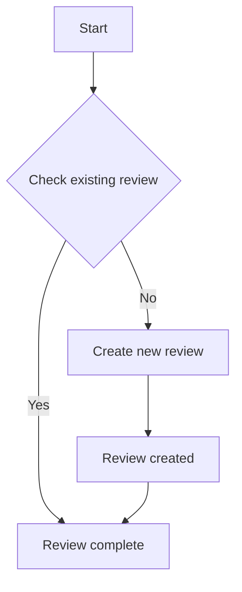

#### 带注释源码

```python
async def get_or_create_human_review(
    user_id: str,
    node_exec_id: str,
    graph_exec_id: str,
    graph_id: str,
    graph_version: int,
    input_data: SafeJsonData,
    message: str,
    editable: bool,
) -> Optional[ReviewResult]:
    """
    Get existing review or create a new pending review entry.

    Args:
        user_id: ID of the user who owns this review
        node_exec_id: ID of the node execution
        graph_exec_id: ID of the graph execution
        graph_id: ID of the graph template
        graph_version: Version of the graph template
        input_data: The data to be reviewed
        message: Instructions for the reviewer
        editable: Whether the data can be edited

    Returns:
        ReviewResult if the review is complete, None if waiting for human input
    """
    try:
        logger.debug(f"Getting or creating review for node {node_exec_id}")

        # Upsert - get existing or create new review
        review = await PendingHumanReview.prisma().upsert(
            where={"nodeExecId": node_exec_id},
            data={
                "create": {
                    "userId": user_id,
                    "nodeExecId": node_exec_id,
                    "graphExecId": graph_exec_id,
                    "graphId": graph_id,
                    "graphVersion": graph_version,
                    "payload": SafeJson(input_data),
                    "instructions": message,
                    "editable": editable,
                    "status": ReviewStatus.WAITING,
                },
                "update": {},  # Do nothing on update - keep existing review as is
            },
        )

        logger.info(
            f"Review {'created' if review.createdAt == review.updatedAt else 'retrieved'} for node {node_exec_id} with status {review.status}"
        )
    except Exception as e:
        logger.error(
            f"Database error in get_or_create_human_review for node {node_exec_id}: {str(e)}"
        )
        raise

    # Early return if already processed
    if review.processed:
        return None

    # If pending, return None to continue waiting, otherwise return the review result
    if review.status == ReviewStatus.WAITING:
        return None
    else:
        return ReviewResult(
            data=review.payload,
            status=review.status,
            message=review.reviewMessage or "",
            processed=review.processed,
            node_exec_id=review.nodeExecId,
        )
```


### `get_pending_review_by_node_exec_id`

Get a pending review by its node execution ID.

参数：

- `node_exec_id`：`str`，The node execution ID to look up
- `user_id`：`str`，User ID for authorization (only returns if review belongs to this user)

返回值：`Optional["PendingHumanReviewModel"]`，The pending review if found and belongs to user, None otherwise

#### 流程图

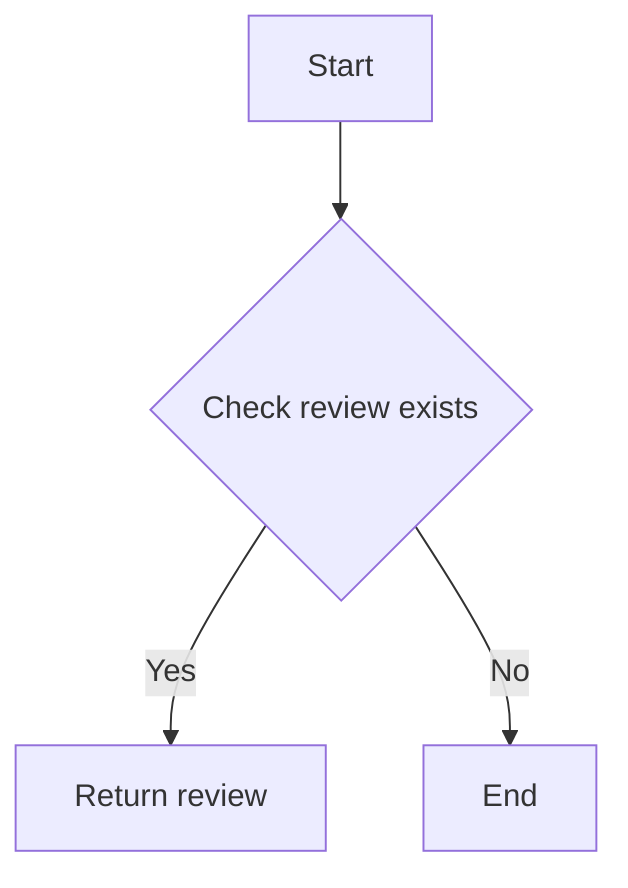

#### 带注释源码

```python
async def get_pending_review_by_node_exec_id(
    node_exec_id: str, user_id: str
) -> Optional["PendingHumanReviewModel"]:
    """
    Get a pending review by its node execution ID.

    Args:
        node_exec_id: The node execution ID to look up
        user_id: User ID for authorization (only returns if review belongs to this user)

    Returns:
        The pending review if found and belongs to user, None otherwise
    """
    review = await PendingHumanReview.prisma().find_first(
        where={
            "nodeExecId": node_exec_id,
            "userId": user_id,
            "status": ReviewStatus.WAITING,
        }
    )

    if not review:
        return None

    # Local import to avoid event loop conflicts in tests
    from backend.data.execution import get_node_execution

    node_exec = await get_node_execution(review.nodeExecId)
    node_id = node_exec.node_id if node_exec else review.nodeExecId
    return PendingHumanReviewModel.from_db(review, node_id=node_id)
```


### `get_reviews_by_node_exec_ids`

Get multiple reviews by their node execution IDs regardless of status.

参数：

- `node_exec_ids`：`list[str]`，List of node execution IDs to look up
- `user_id`：`str`，User ID for authorization (only returns reviews belonging to this user)

返回值：`dict[str, PendingHumanReviewModel]`，Dictionary mapping node_exec_id -> PendingHumanReviewModel for found reviews

#### 流程图

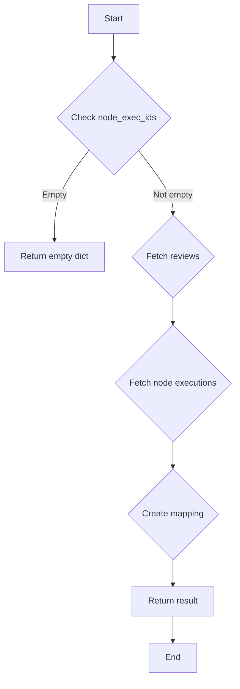

#### 带注释源码

```python
async def get_reviews_by_node_exec_ids(
    node_exec_ids: list[str], user_id: str
) -> dict[str, "PendingHumanReviewModel"]:
    """
    Get multiple reviews by their node execution IDs regardless of status.

    Args:
        node_exec_ids: List of node execution IDs to look up
        user_id: User ID for authorization (only returns reviews belonging to this user)

    Returns:
        Dictionary mapping node_exec_id -> PendingHumanReviewModel for found reviews
    """
    if not node_exec_ids:
        return {}

    reviews = await PendingHumanReview.prisma().find_many(
        where={
            "nodeExecId": {"in": node_exec_ids},
            "userId": user_id,
        }
    )

    if not reviews:
        return {}

    # Batch fetch all node executions to avoid N+1 queries
    node_exec_ids_to_fetch = [review.nodeExecId for review in reviews]
    node_execs = await AgentNodeExecution.prisma().find_many(
        where={"id": {"in": node_exec_ids_to_fetch}},
        include={"Node": True},
    )

    # Create mapping from node_exec_id to node_id
    node_exec_id_to_node_id = {
        node_exec.id: node_exec.agentNodeId for node_exec in node_execs
    }

    result = {}
    for review in reviews:
        node_id = node_exec_id_to_node_id.get(review.nodeExecId, review.nodeExecId)
        result[review.nodeExecId] = PendingHumanReviewModel.from_db(
            review, node_id=node_id
        )

    return result
```


### `has_pending_reviews_for_graph_exec`

Check if a graph execution has any pending reviews.

参数：

- `graph_exec_id`：`str`，The graph execution ID to check

返回值：`bool`，True if there are reviews waiting for human input, False otherwise

#### 流程图

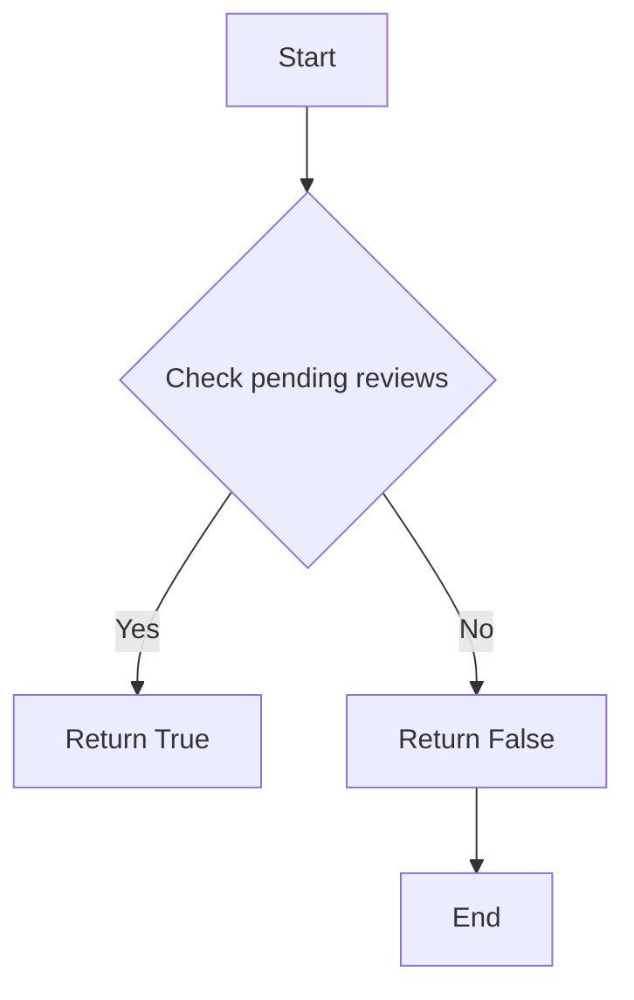

#### 带注释源码

```python
async def has_pending_reviews_for_graph_exec(graph_exec_id: str) -> bool:
    """
    Check if a graph execution has any pending reviews.

    Args:
        graph_exec_id: The graph execution ID to check

    Returns:
        True if there are reviews waiting for human input, False otherwise
    """
    # Check if there are any reviews waiting for human input
    count = await PendingHumanReview.prisma().count(
        where={"graphExecId": graph_exec_id, "status": ReviewStatus.WAITING}
    )
    return count > 0
```


### `get_pending_reviews_for_user`

Get all pending reviews for a user with pagination.

参数：

- `user_id`：`str`，User ID to get reviews for
- `page`：`int`，Page number (1-indexed) (默认值: 1)
- `page_size`：`int`，Number of reviews per page (默认值: 25)

返回值：`list`，List of pending review models with node_id included

#### 流程图

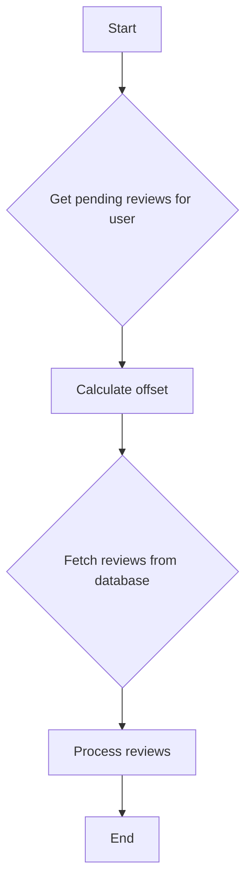

#### 带注释源码

```python
async def get_pending_reviews_for_user(
    user_id: str, page: int = 1, page_size: int = 25
) -> list["PendingHumanReviewModel"]:
    # Calculate offset for pagination
    offset = (page - 1) * page_size

    # Fetch reviews from database
    reviews = await PendingHumanReview.prisma().find_many(
        where={"userId": user_id, "status": ReviewStatus.WAITING},
        order={"createdAt": "desc"},
        skip=offset,
        take=page_size,
    )

    # Process reviews
    result = []
    for review in reviews:
        node_exec = await get_node_execution(review.nodeExecId)
        node_id = node_exec.node_id if node_exec else review.nodeExecId
        result.append(PendingHumanReviewModel.from_db(review, node_id=node_id))

    return result
```


### `get_pending_reviews_for_execution`

Get all pending reviews for a specific graph execution.

参数：

- `graph_exec_id`：`str`，Graph execution ID
- `user_id`：`str`，User ID for security validation

返回值：`list[PendingHumanReviewModel]`，List of pending review models with node_id included

#### 流程图

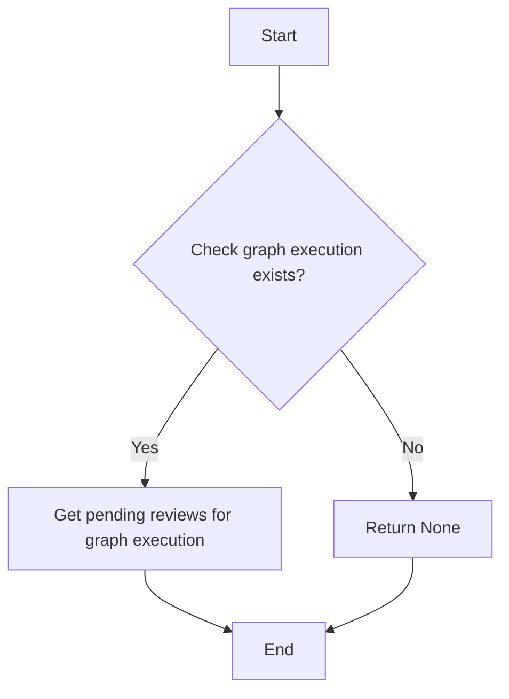

#### 带注释源码

```python
async def get_pending_reviews_for_execution(
    graph_exec_id: str, user_id: str
) -> list["PendingHumanReviewModel"]:
    # Local import to avoid event loop conflicts in tests
    from backend.data.execution import get_node_execution

    reviews = await PendingHumanReview.prisma().find_many(
        where={
            "userId": user_id,
            "graphExecId": graph_exec_id,
            "status": ReviewStatus.WAITING,
        },
        order={"createdAt": "asc"},
    )

    # Fetch node_id for each review from NodeExecution
    result = []
    for review in reviews:
        node_exec = await get_node_execution(review.nodeExecId)
        node_id = node_exec.node_id if node_exec else review.nodeExecId
        result.append(PendingHumanReviewModel.from_db(review, node_id=node_id))

    return result
```


### process_all_reviews_for_execution

Process all pending reviews for an execution with approve/reject decisions.

参数：

- `user_id`：`str`，User ID for ownership validation
- `review_decisions`：`dict[str, tuple[ReviewStatus, SafeJsonData | None, str | None]]`，Map of node_exec_id -> (status, reviewed_data, message)

返回值：`dict[str, PendingHumanReviewModel]`，Dict of node_exec_id -> updated review model (includes already-processed reviews)

#### 流程图

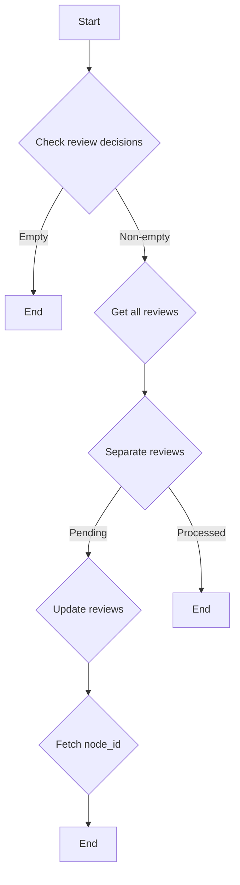

#### 带注释源码

```python
async def process_all_reviews_for_execution(
    user_id: str,
    review_decisions: dict[str, tuple[ReviewStatus, SafeJsonData | None, str | None]],
) -> dict[str, PendingHumanReviewModel]:
    """Process all pending reviews for an execution with approve/reject decisions.

    Handles race conditions gracefully: if a review was already processed with the
    same decision by a concurrent request, it's treated as success rather than error.

    Args:
        user_id: User ID for ownership validation
        review_decisions: Map of node_exec_id -> (status, reviewed_data, message)

    Returns:
        Dict of node_exec_id -> updated review model (includes already-processed reviews)
    """
    if not review_decisions:
        return {}

    node_exec_ids = list(review_decisions.keys())

    # Get all reviews (both WAITING and already processed) for the user
    all_reviews = await PendingHumanReview.prisma().find_many(
        where={
            "nodeExecId": {"in": node_exec_ids},
            "userId": user_id,
        },
    )

    # Separate into pending and already-processed reviews
    reviews_to_process = []
    already_processed = []
    for review in all_reviews:
        if review.status == ReviewStatus.WAITING:
            reviews_to_process.append(review)
        else:
            already_processed.append(review)

    # Check for truly missing reviews (not found at all)
    found_ids = {review.nodeExecId for review in all_reviews}
    missing_ids = set(node_exec_ids) - found_ids
    if missing_ids:
        raise ValueError(
            f"Reviews not found or access denied: {', '.join(missing_ids)}"
        )

    # Validate already-processed reviews have compatible status (same decision)
    # This handles race conditions where another request processed the same reviews
    for review in already_processed:
        requested_status = review_decisions[review.nodeExecId][0]
        if review.status != requested_status:
            raise ValueError(
                f"Review {review.nodeExecId} was already processed with status "
                f"{review.status}, cannot change to {requested_status}"
            )

    # Log if we're handling a race condition (some reviews already processed)
    if already_processed:
        already_processed_ids = [r.nodeExecId for r in already_processed]
        logger.info(
            f"Race condition handled: {len(already_processed)} review(s) already "
            f"processed by concurrent request: {already_processed_ids}"
        )

    # Create parallel update tasks for reviews that still need processing
    update_tasks = []

    for review in reviews_to_process:
        new_status, reviewed_data, message = review_decisions[review.nodeExecId]
        has_data_changes = reviewed_data is not None and reviewed_data != review.payload

        # Check edit permissions for actual data modifications
        if has_data_changes and not review.editable:
            raise ValueError(f"Review {review.nodeExecId} is not editable")

        update_data: PendingHumanReviewUpdateInput = {
            "status": new_status,
            "reviewMessage": message,
            "wasEdited": has_data_changes,
            "reviewedAt": datetime.now(timezone.utc),
        }

        if has_data_changes:
            update_data["payload"] = SafeJson(reviewed_data)

        task = PendingHumanReview.prisma().update(
            where={"nodeExecId": review.nodeExecId},
            data=update_data,
        )
        update_tasks.append(task)

    # Execute all updates in parallel and get updated reviews
    updated_reviews = await asyncio.gather(*update_tasks) if update_tasks else []

    # Note: Execution resumption is now handled at the API layer after ALL reviews
    # for an execution are processed (both approved and rejected)

    # Fetch node_id for each review and return as dict for easy access
    # Local import to avoid event loop conflicts in tests
    from backend.data.execution import get_node_execution

    # Combine updated reviews with already-processed ones (for idempotent response)
    all_result_reviews = list(updated_reviews) + already_processed

    result = {}
    for review in all_result_reviews:
        node_exec = await get_node_execution(review.nodeExecId)
        node_id = node_exec.node_id if node_exec else review.nodeExecId
        result[review.nodeExecId] = PendingHumanReviewModel.from_db(
            review, node_id=node_id
        )

    return result
```


### update_review_processed_status

Update the processed status of a review.

参数：

- `node_exec_id`：`str`，The ID of the node execution to update the processed status for.
- `processed`：`bool`，Indicates whether the review has been processed or not.

返回值：`None`，This function does not return any value.

#### 流程图

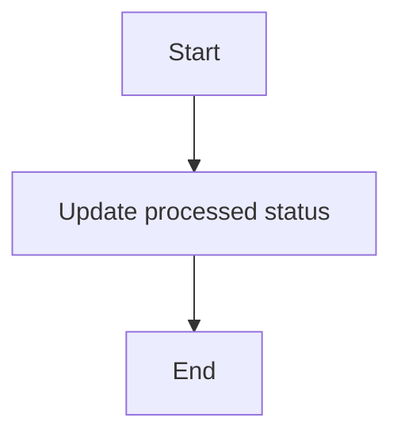

#### 带注释源码

```python
async def update_review_processed_status(node_exec_id: str, processed: bool) -> None:
    """Update the processed status of a review."""
    await PendingHumanReview.prisma().update(
        where={"nodeExecId": node_exec_id}, data={"processed": processed}
    )
```


### cancel_pending_reviews_for_execution

Cancel all pending reviews for a graph execution (e.g., when execution is stopped).

参数：

- `graph_exec_id`：`str`，The graph execution ID
- `user_id`：`str`，User ID who owns the execution (for security validation)

返回值：`int`，Number of reviews cancelled

#### 流程图

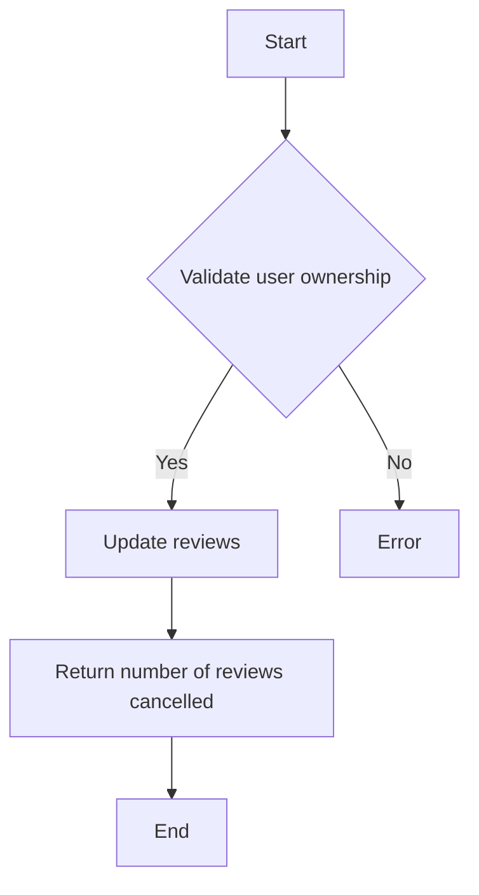

#### 带注释源码

```python
async def cancel_pending_reviews_for_execution(graph_exec_id: str, user_id: str) -> int:
    """
    Cancel all pending reviews for a graph execution (e.g., when execution is stopped).

    Marks all WAITING reviews as REJECTED with a message indicating the execution was stopped.

    Args:
        graph_exec_id: The graph execution ID
        user_id: User ID who owns the execution (for security validation)

    Returns:
        Number of reviews cancelled

    Raises:
        ValueError: If the graph execution doesn't belong to the user
    """
    # Validate user ownership before cancelling reviews
    graph_exec = await get_graph_execution_meta(
        user_id=user_id, execution_id=graph_exec_id
    )
    if not graph_exec:
        raise ValueError(
            f"Graph execution {graph_exec_id} not found or doesn't belong to user {user_id}"
        )

    result = await PendingHumanReview.prisma().update_many(
        where={
            "graphExecId": graph_exec_id,
            "userId": user_id,
            "status": ReviewStatus.WAITING,
        },
        data={
            "status": ReviewStatus.REJECTED,
            "reviewMessage": "Execution was stopped by user",
            "processed": True,
            "reviewedAt": datetime.now(timezone.utc),
        },
    )
    return result
```


### ReviewResult.__init__

This method initializes a `ReviewResult` object, which represents the result of a review operation.

参数：

- `data`：`Optional[SafeJsonData]`，The data associated with the review result. It can be `None` if no data is available.
- `status`：`ReviewStatus`，The status of the review operation, which can be one of the predefined statuses from the `ReviewStatus` enum.
- `message`：`str`，A message associated with the review result.
- `processed`：`bool`，Indicates whether the review has been processed.
- `node_exec_id`：`str`，The ID of the node execution associated with the review.

返回值：无

#### 流程图

```mermaid
classDiagram
    ReviewResult <|-- BaseModel
    ReviewResult {
        -data: Optional[SafeJsonData]
        -status: ReviewStatus
        -message: str
        -processed: bool
        -node_exec_id: str
    }
```

#### 带注释源码

```python
class ReviewResult(BaseModel):
    """Result of a review operation."""

    data: Optional[SafeJsonData] = None
    status: ReviewStatus
    message: str = ""
    processed: bool
    node_exec_id: str
```


### PendingHumanReview.__init__

This method initializes a new instance of the `PendingHumanReview` class.

参数：

- `self`：`PendingHumanReview`，The instance being initialized.
- `user_id`：`str`，The ID of the user who owns this review.
- `node_exec_id`：`str`，The ID of the node execution.
- `graph_exec_id`：`str`，The ID of the graph execution.
- `graph_id`：`str`，The ID of the graph template.
- `graph_version`：`int`，The version of the graph template.
- `input_data`：`SafeJsonData`，The data to be reviewed.
- `message`：`str`，Instructions for the reviewer.
- `editable`：`bool`，Whether the data can be edited.

返回值：`None`，No return value.

#### 流程图

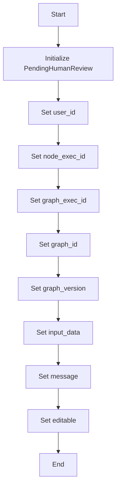

#### 带注释源码

```python
class PendingHumanReview(BaseModel):
    """Model for pending human reviews."""
    userId: str
    nodeExecId: str
    graphExecId: str
    graphId: str
    graphVersion: int
    payload: SafeJsonData
    instructions: str
    editable: bool
    status: ReviewStatus
    processed: bool
    reviewedAt: datetime

    def __init__(self, user_id: str, node_exec_id: str, graph_exec_id: str, graph_id: str, graph_version: int, input_data: SafeJsonData, message: str, editable: bool):
        self.userId = user_id
        self.nodeExecId = node_exec_id
        self.graphExecId = graph_exec_id
        self.graphId = graph_id
        self.graphVersion = graph_version
        self.payload = input_data
        self.instructions = message
        self.editable = editable
        self.status = ReviewStatus.WAITING
        self.processed = False
        self.reviewedAt = datetime.now(timezone.utc)
```


### SafeJsonData.__init__

SafeJsonData 类的初始化方法。

参数：

-  `__init__(self, data: SafeJsonData | None = None)`：`SafeJsonData | None`，初始化 SafeJsonData 对象，可以传入 None。

返回值：无

#### 流程图

```mermaid
classDiagram
    SafeJsonData <|-- BaseModel
    SafeJsonData {
        data SafeJsonData | None
    }
```

#### 带注释源码

```python
class SafeJsonData(BaseModel):
    """Safe JSON data container."""
    data: Optional[SafeJsonData] = None
```


## 关键组件


### 张量索引与惰性加载

用于在数据库查询中实现高效的张量索引，并通过惰性加载机制减少内存消耗。

### 反量化支持

提供对反量化操作的支持，以优化计算性能。

### 量化策略

实现量化策略，以减少模型参数的精度，从而降低模型大小和计算复杂度。


## 问题及建议


### 已知问题

-   **数据库查询性能**：代码中多次进行数据库查询，尤其是在获取多个节点执行和审查记录时。这可能导致性能瓶颈，尤其是在高负载情况下。
-   **异常处理**：代码中的异常处理主要集中在记录错误和重新抛出异常，但没有提供更详细的错误处理策略，例如通知用户或进行回滚操作。
-   **数据一致性**：在处理并发请求时，代码可能面临数据一致性问题，特别是在更新审查状态时。
-   **代码重复**：在多个函数中存在类似的数据库查询逻辑，这可能导致代码维护困难。

### 优化建议

-   **使用缓存**：对于频繁查询且不经常变更的数据，可以使用缓存来减少数据库查询次数，提高性能。
-   **改进异常处理**：实现更详细的异常处理策略，包括错误通知、事务回滚和重试机制。
-   **使用锁或事务**：在更新审查状态时，使用数据库锁或事务来确保数据一致性。
-   **重构代码**：将重复的数据库查询逻辑提取为单独的函数或类，以简化代码和维护工作。
-   **异步编程优化**：在异步编程中使用更高效的等待和任务管理策略，例如使用`asyncio.gather`来并行执行任务。
-   **日志记录**：增加更详细的日志记录，以便于问题追踪和性能分析。
-   **单元测试**：编写更全面的单元测试，以确保代码质量和稳定性。


## 其它


### 设计目标与约束

- 设计目标：
  - 提供一个数据层，用于处理Human In The Loop (HITL)审查操作的所有数据库操作。
  - 确保审查流程的准确性和数据的一致性。
  - 提供异步操作以支持高并发处理。
  - 支持审查状态的跟踪和查询。

- 约束：
  - 必须使用Prisma ORM进行数据库操作。
  - 必须支持Pydantic模型验证。
  - 必须处理潜在的数据竞争和并发问题。
  - 必须遵循异步编程的最佳实践。

### 错误处理与异常设计

- 错误处理：
  - 使用try-except块捕获和处理数据库操作中的异常。
  - 对于验证错误，使用Pydantic的验证机制。
  - 对于权限错误，抛出ValueError异常。
  - 对于数据竞争和并发问题，使用数据库事务和锁机制。

### 数据流与状态机

- 数据流：
  - 审查请求通过API层到达数据层。
  - 数据层执行数据库操作以检索或更新审查状态。
  - 审查结果通过API层返回给客户端。

- 状态机：
  - 审查状态包括：等待、批准、拒绝。
  - 状态转换由用户操作或系统事件触发。

### 外部依赖与接口契约

- 外部依赖：
  - Prisma ORM：用于数据库操作。
  - Pydantic：用于数据验证。
  - asyncio：用于异步编程。

- 接口契约：
  - API层与数据层之间的接口契约定义了数据交换的格式和规则。
  - 使用RESTful API设计原则。
  - 使用JSON作为数据交换格式。


    