# `.\AutoGPT\autogpt_platform\backend\backend\data\human_review_test.py` 详细设计文档

This file contains unit tests for the human review functionality in the backend, including creating, retrieving, and processing human reviews.

## 整体流程

```mermaid
graph TD
    A[Start] --> B{Is review new?}
    B -- Yes --> C[Mock upsert returns new review]
    C --> D{Is review approved?}
    D -- Yes --> E[Mock upsert returns approved review]
    D -- No --> F[Get or create review]
    F --> G{Are there pending reviews for graph exec?}
    G -- Yes --> H[Mock count returns 2]
    G -- No --> I[Mock count returns 0]
    H --> J[Get pending reviews for user]
    I --> K[Get pending reviews for execution]
    J --> L{Mock find many returns reviews}
    K --> M{Mock find many returns reviews}
    L --> N{Verify pagination parameters}
    M --> O{Verify filter by execution and user}
    O --> P[Process all reviews for execution success]
    P --> Q{Mock find many returns reviews}
    Q --> R{Mock update returns updated review}
    R --> S{Mock gather simulates parallel updates}
    S --> T{Mock get_node_execution returns node with node_id}
    T --> U{Verify review decisions}
    U --> V{Verify status and node_id}
    V --> W{Test validation errors}
    W --> X{Mock find many returns no reviews}
    X --> Y[Raises ValueError: Reviews not found]
    Y --> Z[End]
    Z --> W
    W --> A
    Z --> AA[Test editing non-editable review]
    AA --> AB{Set review as non-editable}
    AB --> AC[Mock find many returns reviews]
    AC --> AD[Raises ValueError: not editable]
    AD --> AE[End]
    AE --> AA
    Z --> AF[Test processing mixed approval and rejection decisions]
    AF --> AG[Create second review for rejection]
    AG --> AH[Mock find many returns reviews]
    AH --> AI[Mock update returns approved review]
    AI --> AJ[Mock update returns rejected review]
    AJ --> AK[Mock gather returns approved and rejected reviews]
    AK --> AL[Mock get_node_execution returns node with node_id]
    AL --> AM{Verify review decisions}
    AM --> AN{Verify node_id}
    AN --> AO[End]
    AO --> AF
```

## 类结构

```
ModelBase (abstract base class)
├── TextModel (text model base class)
│   ├── LlamaModel
│   ├── GPT2Model
│   ├── FalconModel
│   ├── Qwen2Model
│   ├── GemmaModel
│   └── ... 
```

## 全局变量及字段


### `mocker`
    
Fixture for mocking dependencies in tests.

类型：`pytest_mock.MockFixture`
    


### `sample_db_review`
    
Mock object representing a database review object with predefined attributes.

类型：`Mock`
    


### `mock_prisma`
    
Mock object representing the Prisma client for PendingHumanReview.

类型：`AsyncMock`
    


### `result`
    
The result of a Prisma operation, typically a review object.

类型：`PendingHumanReview`
    


### `mock_count`
    
Mock object representing the Prisma client for PendingHumanReview count operation.

类型：`AsyncMock`
    


### `mock_find_many`
    
Mock object representing the Prisma client for PendingHumanReview find_many operation.

类型：`AsyncMock`
    


### `mock_node_exec`
    
Mock object representing a node execution object with predefined attributes.

类型：`Mock`
    


### `mock_update`
    
Mock object representing the Prisma client for PendingHumanReview update operation.

类型：`AsyncMock`
    


### `mock_gather`
    
Mock object representing the asyncio gather function for concurrent operations.

类型：`AsyncMock`
    


### `mock_node_exec`
    
Mock object representing a node execution object with predefined attributes.

类型：`Mock`
    


### `PendingHumanReview.nodeExecId`
    
The ID of the node execution associated with the review.

类型：`str`
    


### `PendingHumanReview.userId`
    
The ID of the user who created the review.

类型：`str`
    


### `PendingHumanReview.graphExecId`
    
The ID of the graph execution associated with the review.

类型：`str`
    


### `PendingHumanReview.graphId`
    
The ID of the graph associated with the review.

类型：`str`
    


### `PendingHumanReview.graphVersion`
    
The version of the graph associated with the review.

类型：`int`
    


### `PendingHumanReview.payload`
    
The payload data associated with the review.

类型：`dict`
    


### `PendingHumanReview.instructions`
    
The instructions for the review.

类型：`str`
    


### `PendingHumanReview.editable`
    
Whether the review is editable.

类型：`bool`
    


### `PendingHumanReview.status`
    
The status of the review.

类型：`ReviewStatus`
    


### `PendingHumanReview.reviewMessage`
    
The message associated with the review.

类型：`str`
    


### `PendingHumanReview.wasEdited`
    
Whether the review has been edited.

类型：`bool`
    


### `PendingHumanReview.processed`
    
Whether the review has been processed.

类型：`bool`
    


### `PendingHumanReview.createdAt`
    
The creation timestamp of the review.

类型：`datetime.datetime`
    


### `PendingHumanReview.updatedAt`
    
The last update timestamp of the review.

类型：`datetime.datetime`
    


### `PendingHumanReview.reviewedAt`
    
The timestamp when the review was reviewed.

类型：`datetime.datetime`
    


### `sample_db_review.nodeExecId`
    
The ID of the node execution associated with the review.

类型：`str`
    


### `sample_db_review.userId`
    
The ID of the user who created the review.

类型：`str`
    


### `sample_db_review.graphExecId`
    
The ID of the graph execution associated with the review.

类型：`str`
    


### `sample_db_review.graphId`
    
The ID of the graph associated with the review.

类型：`str`
    


### `sample_db_review.graphVersion`
    
The version of the graph associated with the review.

类型：`int`
    


### `sample_db_review.payload`
    
The payload data associated with the review.

类型：`dict`
    


### `sample_db_review.instructions`
    
The instructions for the review.

类型：`str`
    


### `sample_db_review.editable`
    
Whether the review is editable.

类型：`bool`
    


### `sample_db_review.status`
    
The status of the review.

类型：`ReviewStatus`
    


### `sample_db_review.reviewMessage`
    
The message associated with the review.

类型：`str`
    


### `sample_db_review.wasEdited`
    
Whether the review has been edited.

类型：`bool`
    


### `sample_db_review.processed`
    
Whether the review has been processed.

类型：`bool`
    


### `sample_db_review.createdAt`
    
The creation timestamp of the review.

类型：`datetime.datetime`
    


### `sample_db_review.updatedAt`
    
The last update timestamp of the review.

类型：`datetime.datetime`
    


### `sample_db_review.reviewedAt`
    
The timestamp when the review was reviewed.

类型：`datetime.datetime`
    
    

## 全局函数及方法


### `get_or_create_human_review`

This function is responsible for either retrieving an existing human review or creating a new one if it does not exist.

参数：

- `user_id`：`str`，The unique identifier for the user who is performing the review.
- `node_exec_id`：`str`，The unique identifier for the node execution that the review is associated with.
- `graph_exec_id`：`str`，The unique identifier for the graph execution that the review is associated with.
- `graph_id`：`str`，The unique identifier for the graph that the review is associated with.
- `graph_version`：`int`，The version of the graph that the review is associated with.
- `input_data`：`dict`，The data that is being reviewed.
- `message`：`str`，The message that is associated with the review.
- `editable`：`bool`，Whether the review is editable.

返回值：`PendingHumanReview`，The retrieved or created human review object.

#### 流程图

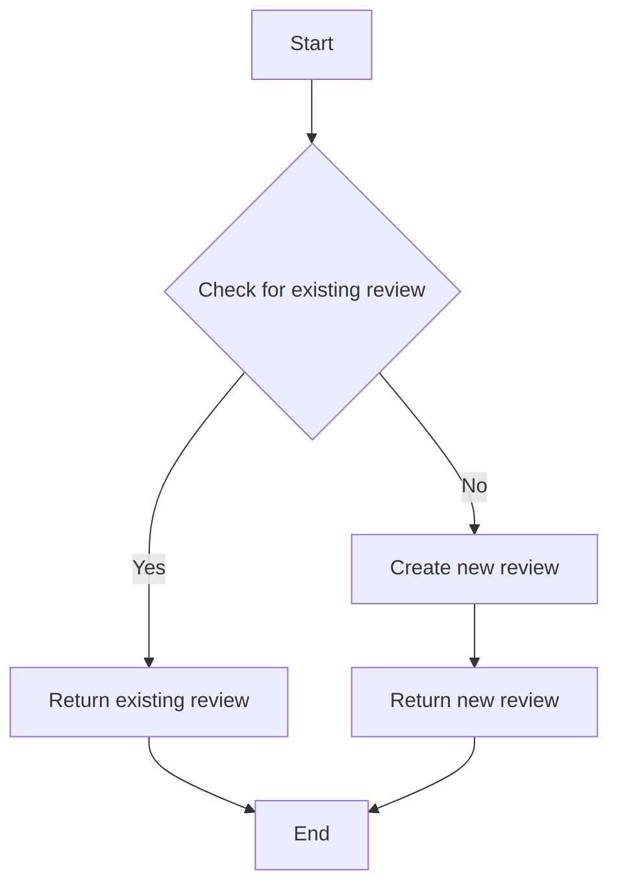

#### 带注释源码

```python
async def get_or_create_human_review(
    user_id: str,
    node_exec_id: str,
    graph_exec_id: str,
    graph_id: str,
    graph_version: int,
    input_data: dict,
    message: str,
    editable: bool,
):
    # Check if the review already exists
    review = await PendingHumanReview.prisma.find_first(
        where={
            "userId": user_id,
            "nodeExecId": node_exec_id,
            "graphExecId": graph_exec_id,
            "graphId": graph_id,
            "graphVersion": graph_version,
        }
    )
    if review:
        return review
    # Create a new review if it does not exist
    new_review = PendingHumanReview(
        userId=user_id,
        nodeExecId=node_exec_id,
        graphExecId=graph_exec_id,
        graphId=graph_id,
        graphVersion=graph_version,
        payload=input_data,
        instructions=message,
        editable=editable,
        status=ReviewStatus.WAITING,
    )
    await new_review.save()
    return new_review
```


### `has_pending_reviews_for_graph_exec`

This function checks if there are any pending reviews for a given graph execution.

参数：

- `graph_exec_id`：`str`，The ID of the graph execution to check for pending reviews.

返回值：`bool`，Returns `True` if there are pending reviews, otherwise `False`.

#### 流程图

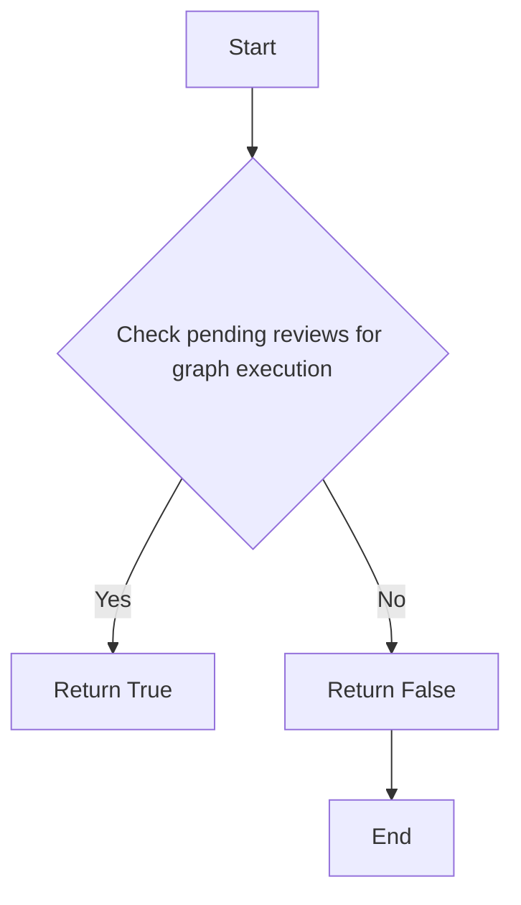

#### 带注释源码

```python
from prisma.enums import ReviewStatus

from backend.data.human_review import PendingHumanReview

async def has_pending_reviews_for_graph_exec(graph_exec_id: str) -> bool:
    """Check if there are any pending reviews for a given graph execution."""
    count = await PendingHumanReview.prisma.count(
        where={
            "graphExecId": graph_exec_id,
            "status": ReviewStatus.WAITING,
        }
    )
    return count > 0
```


### `get_pending_reviews_for_user`

获取特定用户的待处理审查列表。

参数：

- `user`: `str`，用户的唯一标识符。
- `page`: `int`，当前页码，默认为1。
- `page_size`: `int`，每页显示的记录数，默认为10。

返回值：`list`，包含`PendingHumanReview`对象的列表。

#### 流程图

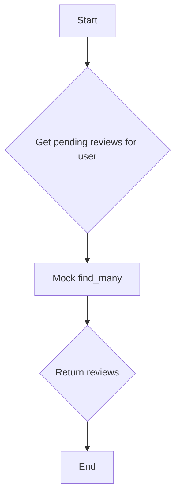

#### 带注释源码

```python
async def get_pending_reviews_for_user(user: str, page: int = 1, page_size: int = 10):
    """
    Get pending reviews for a specific user with pagination.

    :param user: str, the unique identifier for the user.
    :param page: int, the current page number, default is 1.
    :param page_size: int, the number of records per page, default is 10.
    :return: list, a list of PendingHumanReview objects.
    """
    mock_find_many = PendingHumanReview.prisma.find_many
    mock_find_many.return_value = AsyncMock(return_value=[sample_db_review])

    result = await mock_find_many(
        skip=(page - 1) * page_size,
        take=page_size,
        where={"userId": user, "status": ReviewStatus.WAITING},
    )

    return result
```


### `get_pending_reviews_for_execution`

获取特定执行中的待处理审查。

参数：

- `graph_exec_id`：`str`，执行ID，用于标识要获取审查的执行。
- `user_id`：`str`，用户ID，用于标识要获取审查的用户。

返回值：`list`，包含待处理审查对象的列表。

#### 流程图

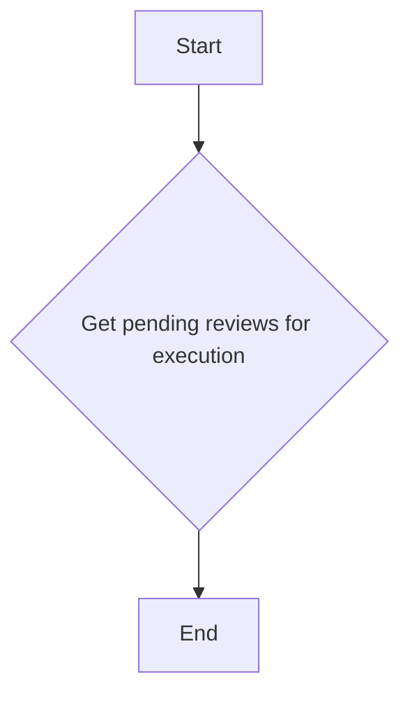

#### 带注释源码

```python
async def get_pending_reviews_for_execution(graph_exec_id: str, user_id: str) -> list:
    # Mock find_many to return pending reviews for the specific execution and user
    mock_find_many = mocker.patch("backend.data.human_review.PendingHumanReview.prisma")
    mock_find_many.return_value.find_many = AsyncMock(return_value=[sample_db_review])

    # Mock get_node_execution to return node with node_id (async function)
    mock_node_exec = Mock()
    mock_node_exec.node_id = "test_node_def_789"
    mocker.patch(
        "backend.data.execution.get_node_execution",
        new=AsyncMock(return_value=mock_node_exec),
    )

    # Call the function
    result = await get_pending_reviews_for_execution(
        "test_graph_exec_456", "test-user-123"
    )

    # Verify it filters by execution and user
    call_args = mock_find_many.return_value.find_many.call_args
    where_clause = call_args.kwargs["where"]
    assert where_clause["userId"] == "test-user-123"
    assert where_clause["graphExecId"] == "test_graph_exec_456"
    assert where_clause["status"] == ReviewStatus.WAITING

    return result
```


### process_all_reviews_for_execution

This function processes all pending reviews for a specific execution, updating their status based on the provided decisions.

参数：

- `user_id`：`str`，The user ID for which to process the reviews.
- `review_decisions`：`dict`，A dictionary mapping node execution IDs to tuples containing the review status, payload, and review message.

返回值：`dict`，A dictionary mapping node execution IDs to review objects with updated status and payload.

#### 流程图

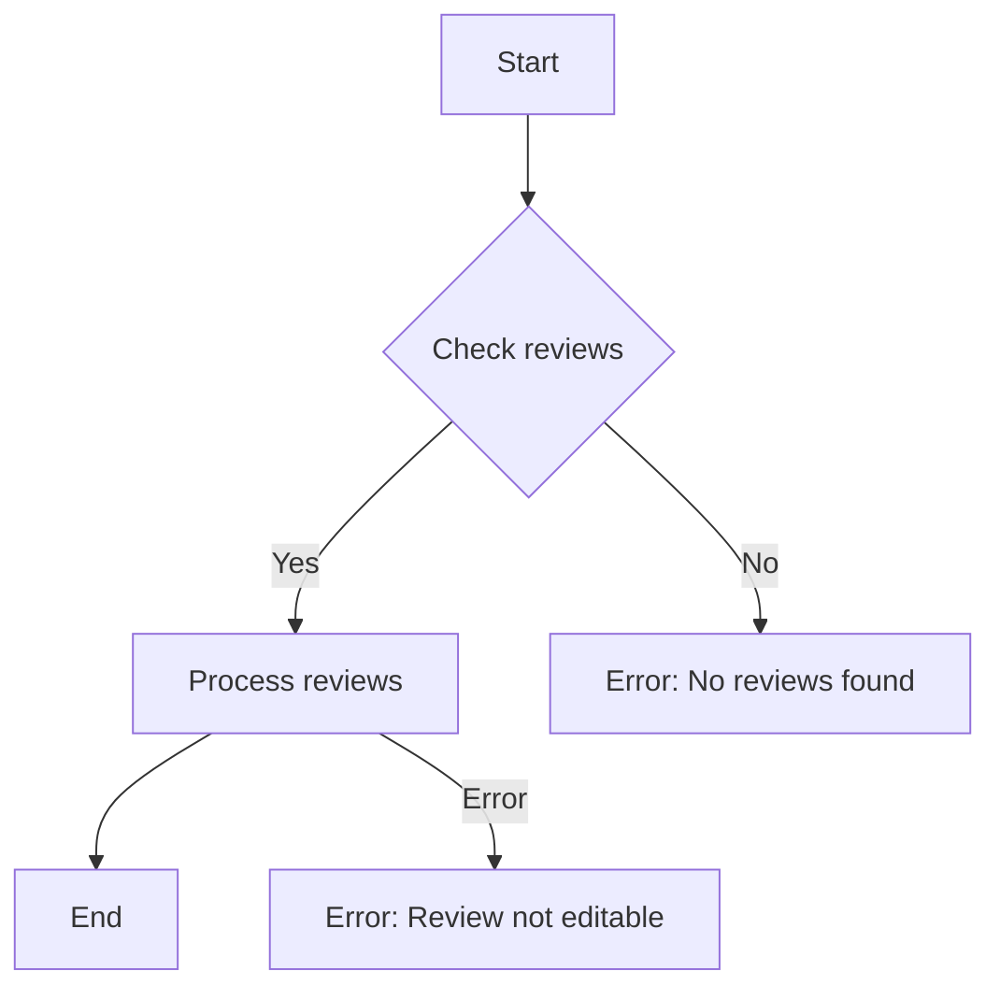

#### 带注释源码

```python
async def process_all_reviews_for_execution(
    user_id: str,
    review_decisions: dict,
) -> dict:
    # Mock finding reviews
    mock_prisma = mocker.patch("backend.data.human_review.PendingHumanReview.prisma")
    mock_find_many = mock_prisma.return_value.find_many
    mock_find_many.return_value.__aenter__.return_value = [sample_db_review]

    # Mock updating reviews
    updated_review = Mock()
    updated_review.nodeExecId = "test_node_123"
    updated_review.userId = "test-user-123"
    updated_review.graphExecId = "test_graph_exec_456"
    updated_review.graphId = "test_graph_789"
    updated_review.graphVersion = 1
    updated_review.payload = {"data": "modified"}
    updated_review.instructions = "Please review"
    updated_review.editable = True
    updated_review.status = ReviewStatus.APPROVED
    updated_review.reviewMessage = "Approved"
    updated_review.wasEdited = True
    updated_review.processed = False
    updated_review.createdAt = datetime.datetime.now(datetime.timezone.utc)
    updated_review.updatedAt = datetime.datetime.now(datetime.timezone.utc)
    updated_review.reviewedAt = datetime.datetime.now(datetime.timezone.utc)
    mock_prisma.return_value.update = AsyncMock(return_value=updated_review)

    # Mock gather to simulate parallel updates
    mocker.patch(
        "backend.data.human_review.asyncio.gather",
        new=AsyncMock(return_value=[updated_review]),
    )

    # Mock get_node_execution to return node with node_id (async function)
    mock_node_exec = Mock()
    mock_node_exec.node_id = "test_node_def_789"
    mocker.patch(
        "backend.data.execution.get_node_execution",
        new=AsyncMock(return_value=mock_node_exec),
    )

    result = await process_all_reviews_for_execution(
        user_id="test-user-123",
        review_decisions={
            "test_node_123": (ReviewStatus.APPROVED, {"data": "modified"}, "Approved")
        },
    )

    assert len(result) == 1
    assert "test_node_123" in result
    assert result["test_node_123"].status == ReviewStatus.APPROVED
    assert result["test_node_123"].node_id == "test_node_def_789"
```


### `test_get_or_create_human_review_new`

This test function checks the creation of a new human review.

参数：

- `mocker`：`pytest_mock.MockFixture`，用于模拟依赖。
- `sample_db_review`：`Mock`，模拟数据库中的评论对象。

返回值：`None`，当评论处于等待状态时返回。

#### 流程图

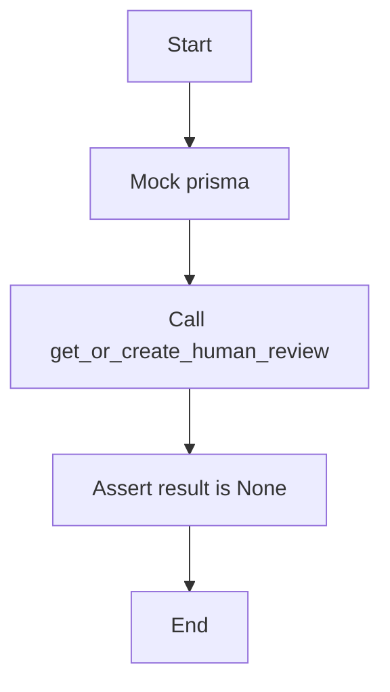

#### 带注释源码

```python
@pytest.mark.asyncio(loop_scope="function")
async def test_get_or_create_human_review_new(
    mocker: pytest_mock.MockFixture,
    sample_db_review,
):
    """Test creating a new human review"""
    # Mock the upsert to return a new review (created_at == updated_at)
    sample_db_review.status = ReviewStatus.WAITING
    sample_db_review.processed = False

    mock_prisma = mocker.patch("backend.data.human_review.PendingHumanReview.prisma")
    mock_prisma.return_value.upsert = AsyncMock(return_value=sample_db_review)

    result = await get_or_create_human_review(
        user_id="test-user-123",
        node_exec_id="test_node_123",
        graph_exec_id="test_graph_exec_456",
        graph_id="test_graph_789",
        graph_version=1,
        input_data={"data": "test payload"},
        message="Please review",
        editable=True,
    )

    # Should return None for pending reviews (waiting for human input)
    assert result is None
```


### test_get_or_create_human_review_approved

This function tests the retrieval of an already approved human review.

参数：

- `mocker`：`pytest_mock.MockFixture`，用于模拟依赖。
- `sample_db_review`：`Mock`，模拟数据库中的审查对象。

返回值：`None`，如果审查尚未处理，则返回`None`。

#### 流程图

```mermaid
graph TD
    A[Start] --> B[Mock prisma]
    B --> C[Set review as approved]
    C --> D[Call get_or_create_human_review]
    D --> E[Assert result is not None]
    E --> F[Assert status is APPROVED]
    F --> G[Assert data is "test payload"]
    G --> H[Assert message is "Looks good"]
    H --> I[End]
```

#### 带注释源码

```python
@pytest.mark.asyncio(loop_scope="function")
async def test_get_or_create_human_review_approved(
    mocker: pytest_mock.MockFixture,
    sample_db_review,
):
    """Test retrieving an already approved review"""
    # Set up review as already approved
    sample_db_review.status = ReviewStatus.APPROVED
    sample_db_review.processed = False
    sample_db_review.reviewMessage = "Looks good"

    mock_prisma = mocker.patch("backend.data.human_review.PendingHumanReview.prisma")
    mock_prisma.return_value.upsert = AsyncMock(return_value=sample_db_review)

    result = await get_or_create_human_review(
        user_id="test-user-123",
        node_exec_id="test_node_123",
        graph_exec_id="test_graph_exec_456",
        graph_id="test_graph_789",
        graph_version=1,
        input_data={"data": "test payload"},
        message="Please review",
        editable=True,
    )

    # Should return the approved result
    assert result is not None
    assert result.status == ReviewStatus.APPROVED
    assert result.data == {"data": "test payload"}
    assert result.message == "Looks good"
```


### `test_has_pending_reviews_for_graph_exec_true`

This test function checks if there are pending reviews for a given graph execution.

参数：

- `mocker`：`pytest_mock.MockFixture`，用于模拟依赖的函数和对象
- `sample_db_review`：`Mock`，模拟数据库中的评论对象

返回值：`bool`，表示是否存在待处理的评论

#### 流程图

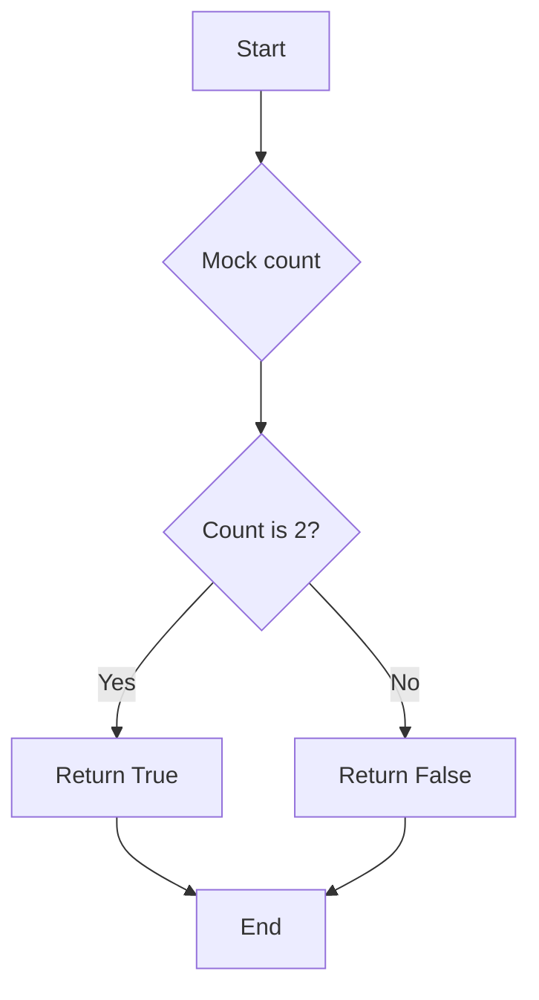

#### 带注释源码

```python
@pytest.mark.asyncio(loop_scope="function")
async def test_has_pending_reviews_for_graph_exec_true(
    mocker: pytest_mock.MockFixture,
):
    """Test when there are pending reviews"""
    mock_count = mocker.patch("backend.data.human_review.PendingHumanReview.prisma")
    mock_count.return_value.count = AsyncMock(return_value=2)

    result = await has_pending_reviews_for_graph_exec("test_graph_exec")

    assert result is True
``` 


### `test_has_pending_reviews_for_graph_exec_false`

This test function checks if there are no pending reviews for a given graph execution.

参数：

- `mocker`：`pytest_mock.MockFixture`，用于模拟依赖的函数和对象
- `sample_db_review`：`Mock`，模拟数据库中的评论对象

返回值：`bool`，表示是否存在待处理的评论

#### 流程图

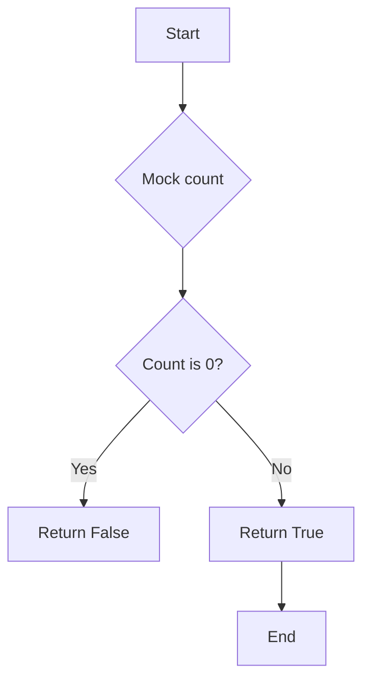

#### 带注释源码

```python
@pytest.mark.asyncio(loop_scope="function")
async def test_has_pending_reviews_for_graph_exec_false(
    mocker: pytest_mock.MockFixture,
):
    """Test when there are no pending reviews"""
    mock_count = mocker.patch("backend.data.human_review.PendingHumanReview.prisma")
    mock_count.return_value.count = AsyncMock(return_value=0)

    result = await has_pending_reviews_for_graph_exec("test_graph_exec")

    assert result is False
```


### `test_get_pending_reviews_for_user`

This test function verifies the functionality of `get_pending_reviews_for_user` by mocking the necessary database interactions and asserting the expected results.

参数：

- `mocker`：`pytest_mock.MockFixture`，用于创建和配置模拟对象
- `sample_db_review`：`Mock`，模拟数据库中的评论对象

返回值：无

#### 流程图

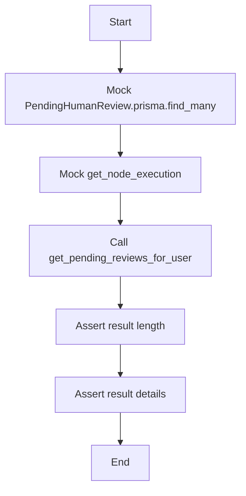

#### 带注释源码

```python
@pytest.mark.asyncio(loop_scope="function")
async def test_get_pending_reviews_for_user(
    mocker: pytest_mock.MockFixture,
    sample_db_review,
):
    """Test getting pending reviews for a user with pagination"""
    # Mock the prisma find_many method to return a list of sample_db_review
    mock_find_many = mocker.patch("backend.data.human_review.PendingHumanReview.prisma")
    mock_find_many.return_value.find_many = AsyncMock(return_value=[sample_db_review])

    # Mock get_node_execution to return a node with node_id (async function)
    mock_node_exec = Mock()
    mock_node_exec.node_id = "test_node_def_789"
    mocker.patch(
        "backend.data.execution.get_node_execution",
        new=AsyncMock(return_value=mock_node_exec),
    )

    # Call the function under test
    result = await get_pending_reviews_for_user("test_user", page=2, page_size=10)

    # Assert the result length
    assert len(result) == 1

    # Assert the result details
    assert result[0].node_exec_id == "test_node_123"
    assert result[0].node_id == "test_node_def_789"

    # Verify pagination parameters
    call_args = mock_find_many.return_value.find_many.call_args
    assert call_args.kwargs["skip"] == 10  # (page-1) * page_size = (2-1) * 10
    assert call_args.kwargs["take"] == 10
```


### `test_get_pending_reviews_for_execution`

This test function checks the functionality of `get_pending_reviews_for_execution` by mocking the necessary components and asserting the expected behavior.

参数：

- `mocker`：`pytest_mock.MockFixture`，用于创建和配置模拟对象
- `sample_db_review`：`Mock`，模拟数据库中的评论对象

返回值：无

#### 流程图

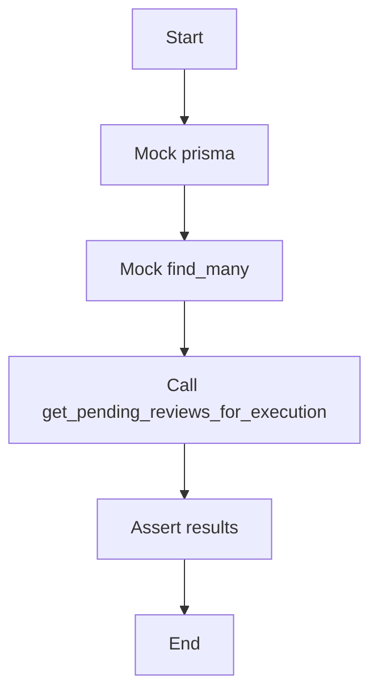

#### 带注释源码

```python
@pytest.mark.asyncio(loop_scope="function")
async def test_get_pending_reviews_for_execution(
    mocker: pytest_mock.MockFixture,
    sample_db_review,
):
    """Test getting pending reviews for specific execution"""
    # Mock find_many to return a list of sample_db_review
    mock_find_many = mocker.patch("backend.data.human_review.PendingHumanReview.prisma")
    mock_find_many.return_value.find_many = AsyncMock(return_value=[sample_db_review])

    # Mock get_node_execution to return node with node_id (async function)
    mock_node_exec = Mock()
    mock_node_exec.node_id = "test_node_def_789"
    mocker.patch(
        "backend.data.execution.get_node_execution",
        new=AsyncMock(return_value=mock_node_exec),
    )

    # Call the function under test
    result = await get_pending_reviews_for_execution(
        "test_graph_exec_456", "test-user-123"
    )

    # Assert the results
    assert len(result) == 1
    assert result[0].graph_exec_id == "test_graph_exec_456"
    assert result[0].node_id == "test_node_def_789"

    # Verify it filters by execution and user
    call_args = mock_find_many.return_value.find_many.call_args
    where_clause = call_args.kwargs["where"]
    assert where_clause["userId"] == "test-user-123"
    assert where_clause["graphExecId"] == "test_graph_exec_456"
    assert where_clause["status"] == ReviewStatus.WAITING
```


### `test_process_all_reviews_for_execution_success`

This test function validates the successful processing of reviews for an execution.

参数：

- `mocker`：`pytest_mock.MockFixture`，用于模拟依赖函数和对象
- `sample_db_review`：`Mock`，模拟数据库中的审查对象

返回值：`None`，没有返回值，因为测试函数是用于验证而不是返回结果

#### 流程图

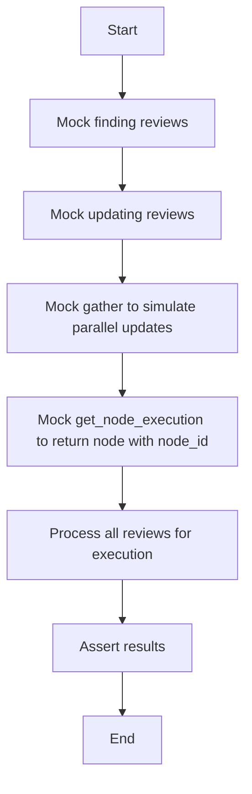

#### 带注释源码

```python
@pytest.mark.asyncio(loop_scope="function")
async def test_process_all_reviews_for_execution_success(
    mocker: pytest_mock.MockFixture,
    sample_db_review,
):
    """Test successful processing of reviews for an execution"""

    # Mock finding reviews
    mock_prisma = mocker.patch("backend.data.human_review.PendingHumanReview.prisma")
    mock_prisma.return_value.find_many = AsyncMock(return_value=[sample_db_review])

    # Mock updating reviews
    updated_review = Mock()
    updated_review.nodeExecId = "test_node_123"
    updated_review.userId = "test-user-123"
    updated_review.graphExecId = "test_graph_exec_456"
    updated_review.graphId = "test_graph_789"
    updated_review.graphVersion = 1
    updated_review.payload = {"data": "modified"}
    updated_review.instructions = "Please review"
    updated_review.editable = True
    updated_review.status = ReviewStatus.APPROVED
    updated_review.reviewMessage = "Approved"
    updated_review.wasEdited = True
    updated_review.processed = False
    updated_review.createdAt = datetime.datetime.now(datetime.timezone.utc)
    updated_review.updatedAt = datetime.datetime.now(datetime.timezone.utc)
    updated_review.reviewedAt = datetime.datetime.now(datetime.timezone.utc)
    mock_prisma.return_value.update = AsyncMock(return_value=updated_review)

    # Mock gather to simulate parallel updates
    mocker.patch(
        "backend.data.human_review.asyncio.gather",
        new=AsyncMock(return_value=[updated_review]),
    )

    # Mock get_node_execution to return node with node_id (async function)
    mock_node_exec = Mock()
    mock_node_exec.node_id = "test_node_def_789"
    mocker.patch(
        "backend.data.execution.get_node_execution",
        new=AsyncMock(return_value=mock_node_exec),
    )

    result = await process_all_reviews_for_execution(
        user_id="test-user-123",
        review_decisions={
            "test_node_123": (ReviewStatus.APPROVED, {"data": "modified"}, "Approved")
        },
    )

    assert len(result) == 1
    assert "test_node_123" in result
    assert result["test_node_123"].status == ReviewStatus.APPROVED
    assert result["test_node_123"].node_id == "test_node_def_789"
``` 


### test_process_all_reviews_for_execution_validation_errors

This test function validates the behavior of `process_all_reviews_for_execution` when it encounters validation errors, specifically when no reviews are found for the given decisions.

参数：

- `mocker`：`pytest_mock.MockFixture`，用于模拟依赖函数和对象
- `sample_db_review`：`Mock`，模拟数据库中的审查对象

返回值：无

#### 流程图

```mermaid
graph TD
    A[Start] --> B[Mock find_many to return no reviews]
    B --> C[Call process_all_reviews_for_execution]
    C --> D[Assert ValueError with message "Reviews not found"]
    D --> E[End]
```

#### 带注释源码

```python
@pytest.mark.asyncio(loop_scope="function")
async def test_process_all_reviews_for_execution_validation_errors(
    mocker: pytest_mock.MockFixture,
    sample_db_review,
):
    # Mock finding fewer reviews than requested (some not found)
    mock_find_many = mocker.patch("backend.data.human_review.PendingHumanReview.prisma")
    mock_find_many.return_value.find_many = AsyncMock(return_value=[])  # No reviews found

    with pytest.raises(ValueError, match="Reviews not found"):
        await process_all_reviews_for_execution(
            user_id="test-user-123",
            review_decisions={
                "nonexistent_node": (ReviewStatus.APPROVED, {"data": "test"}, "message")
            },
        )
``` 


### test_process_all_reviews_edit_permission_error

This function tests the scenario where a review is attempted to be edited, but the review is not editable, raising a ValueError.

参数：

-  `mocker`：`pytest_mock.MockFixture`，用于模拟依赖函数
-  `sample_db_review`：`Mock`，模拟数据库中的评论对象

返回值：无

#### 流程图

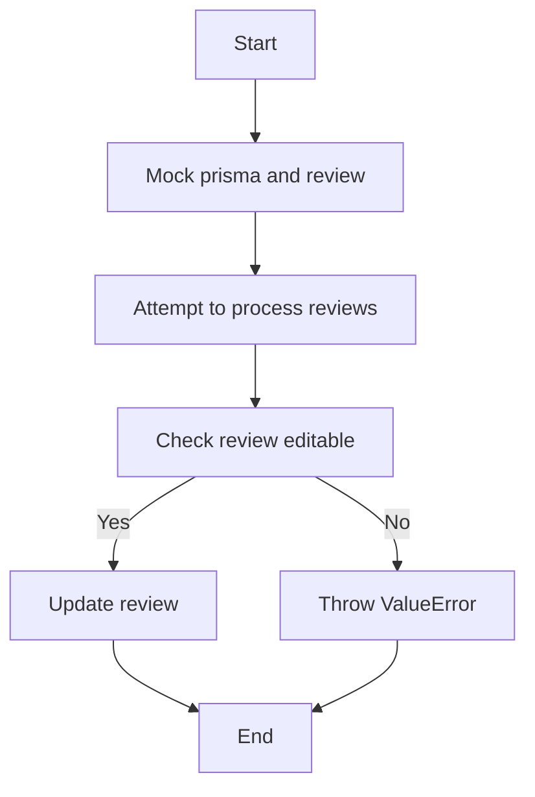

#### 带注释源码

```python
@pytest.mark.asyncio(loop_scope="function")
async def test_process_all_reviews_edit_permission_error(
    mocker: pytest_mock.MockFixture,
    sample_db_review,
):
    """Test editing non-editable review"""
    # Set review as non-editable
    sample_db_review.editable = False

    # Mock finding reviews
    mock_find_many = mocker.patch("backend.data.human_review.PendingHumanReview.prisma")
    mock_find_many.return_value.find_many = AsyncMock(return_value=[sample_db_review])

    with pytest.raises(ValueError, match="not editable"):
        await process_all_reviews_for_execution(
            user_id="test-user-123",
            review_decisions={
                "test_node_123": (
                    ReviewStatus.APPROVED,
                    {"data": "modified"},
                    "message",
                )
            },
        )
``` 


### `test_process_all_reviews_mixed_approval_rejection`

This test function validates the processing of mixed approval and rejection decisions for reviews.

参数：

- `mocker`：`pytest_mock.MockFixture`，用于模拟依赖函数和对象
- `sample_db_review`：`Mock`，模拟数据库中的审查对象

返回值：无

#### 流程图

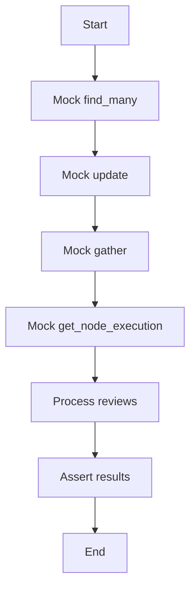

#### 带注释源码

```python
@pytest.mark.asyncio(loop_scope="function")
async def test_process_all_reviews_mixed_approval_rejection(
    mocker: pytest_mock.MockFixture,
    sample_db_review,
):
    """Test processing mixed approval and rejection decisions"""
    # Create second review for rejection
    second_review = Mock()
    second_review.nodeExecId = "test_node_456"
    second_review.userId = "test-user-123"
    second_review.graphExecId = "test_graph_exec_456"
    second_review.graphId = "test_graph_789"
    second_review.graphVersion = 1
    second_review.payload = {"data": "original"}
    second_review.instructions = "Second review"
    second_review.editable = True
    second_review.status = ReviewStatus.WAITING
    second_review.reviewMessage = None
    second_review.wasEdited = False
    second_review.processed = False
    second_review.createdAt = datetime.datetime.now(datetime.timezone.utc)
    second_review.updatedAt = None
    second_review.reviewedAt = None

    # Mock finding reviews
    mock_find_many = mocker.patch("backend.data.human_review.PendingHumanReview.prisma")
    mock_find_many.return_value.find_many = AsyncMock(
        return_value=[sample_db_review, second_review]
    )

    # Mock updating reviews
    approved_review = Mock()
    approved_review.nodeExecId = "test_node_123"
    approved_review.userId = "test-user-123"
    approved_review.graphExecId = "test_graph_exec_456"
    approved_review.graphId = "test_graph_789"
    approved_review.graphVersion = 1
    approved_review.payload = {"data": "modified"}
    approved_review.instructions = "Please review"
    approved_review.editable = True
    approved_review.status = ReviewStatus.APPROVED
    approved_review.reviewMessage = "Approved"
    approved_review.wasEdited = True
    approved_review.processed = False
    approved_review.createdAt = datetime.datetime.now(datetime.timezone.utc)
    approved_review.updatedAt = datetime.datetime.now(datetime.timezone.utc)
    approved_review.reviewedAt = datetime.datetime.now(datetime.timezone.utc)

    rejected_review = Mock()
    rejected_review.nodeExecId = "test_node_456"
    rejected_review.userId = "test-user-123"
    rejected_review.graphExecId = "test_graph_exec_456"
    rejected_review.graphId = "test_graph_789"
    rejected_review.graphVersion = 1
    rejected_review.payload = {"data": "original"}
    rejected_review.instructions = "Please review"
    rejected_review.editable = True
    rejected_review.status = ReviewStatus.REJECTED
    rejected_review.reviewMessage = "Rejected"
    rejected_review.wasEdited = False
    rejected_review.processed = False
    rejected_review.createdAt = datetime.datetime.now(datetime.timezone.utc)
    rejected_review.updatedAt = datetime.datetime.now(datetime.timezone.utc)
    rejected_review.reviewedAt = datetime.datetime.now(datetime.timezone.utc)

    mocker.patch(
        "backend.data.human_review.asyncio.gather",
        new=AsyncMock(return_value=[approved_review, rejected_review]),
    )

    # Mock get_node_execution to return node with node_id (async function)
    mock_node_exec = Mock()
    mock_node_exec.node_id = "test_node_def_789"
    mocker.patch(
        "backend.data.execution.get_node_execution",
        new=AsyncMock(return_value=mock_node_exec),
    )

    result = await process_all_reviews_for_execution(
        user_id="test-user-123",
        review_decisions={
            "test_node_123": (ReviewStatus.APPROVED, {"data": "modified"}, "Approved"),
            "test_node_456": (ReviewStatus.REJECTED, None, "Rejected"),
        },
    )

    assert len(result) == 2
    assert "test_node_123" in result
    assert "test_node_456" in result
    assert result["test_node_123"].node_id == "test_node_def_789"
    assert result["test_node_456"].node_id == "test_node_def_789"
```


### `get_or_create_human_review`

This function is responsible for either retrieving an existing human review or creating a new one if it does not exist.

参数：

- `user_id`：`str`，The unique identifier for the user who is performing the review.
- `node_exec_id`：`str`，The unique identifier for the node execution that the review is associated with.
- `graph_exec_id`：`str`，The unique identifier for the graph execution that the review is associated with.
- `graph_id`：`str`，The unique identifier for the graph that the review is associated with.
- `graph_version`：`int`，The version of the graph that the review is associated with.
- `input_data`：`dict`，The data that is being reviewed.
- `message`：`str`，The message that is associated with the review.
- `editable`：`bool`，Whether the review is editable.

返回值：`PendingHumanReview`，The retrieved or created human review object.

#### 流程图


#### 带注释源码

```python
async def get_or_create_human_review(
    user_id: str,
    node_exec_id: str,
    graph_exec_id: str,
    graph_id: str,
    graph_version: int,
    input_data: dict,
    message: str,
    editable: bool,
):
    # Implementation of the function
    pass
```


### `PendingHumanReview.find_many`

This function retrieves a list of pending human reviews based on specified criteria.

参数：

- `where`：`dict`，A dictionary containing the filter criteria for the reviews.
- `skip`：`int`，The number of records to skip.
- `take`：`int`，The number of records to take.

返回值：`list`，A list of `PendingHumanReview` objects that match the filter criteria.

#### 流程图

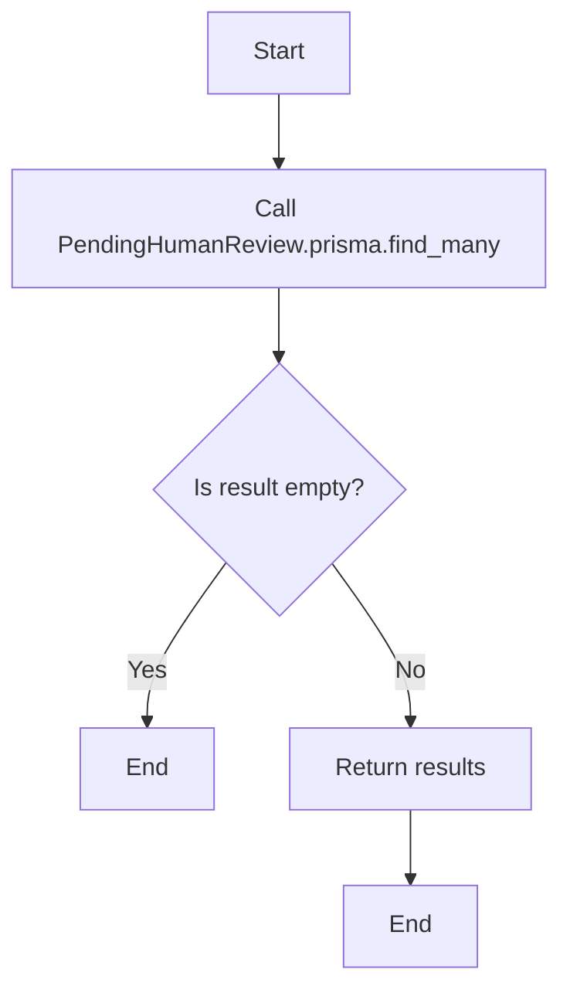

#### 带注释源码

```python
async def find_many(where: dict, skip: int = 0, take: int = 10) -> list:
    """
    Retrieve a list of pending human reviews based on specified criteria.

    :param where: dict, A dictionary containing the filter criteria for the reviews.
    :param skip: int, The number of records to skip.
    :param take: int, The number of records to take.
    :return: list, A list of PendingHumanReview objects that match the filter criteria.
    """
    return await prisma.find_many({
        "where": where,
        "skip": skip,
        "take": take,
    })
```


### `PendingHumanReview.count`

该函数用于计算特定图执行中待处理的评审数量。

参数：

- `graphExecId`：`str`，图执行的唯一标识符，用于筛选待处理的评审。

返回值：`int`，表示待处理的评审数量。

#### 流程图

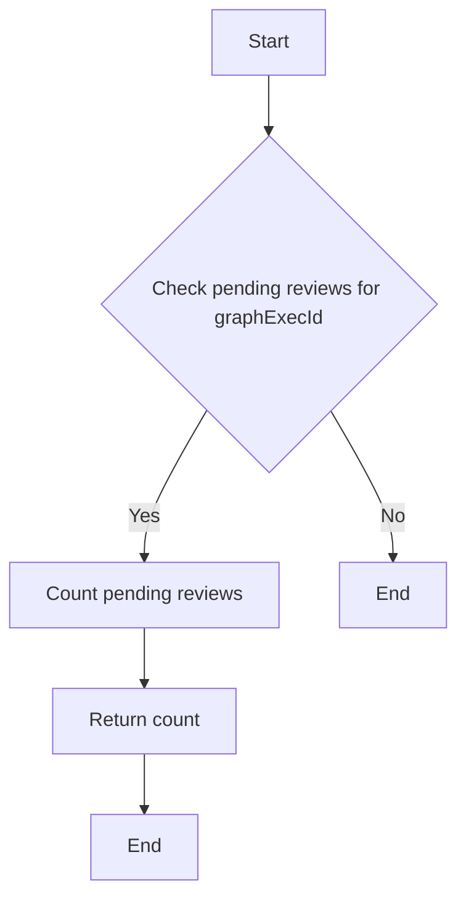

#### 带注释源码

```python
# Mock the count to return the number of pending reviews
mock_count = mocker.patch("backend.data.human_review.PendingHumanReview.prisma")
mock_count.return_value.count = AsyncMock(return_value=2)

# Call the function with a specific graphExecId
result = await has_pending_reviews_for_graph_exec("test_graph_exec")

# Assert the result is True since there are pending reviews
assert result is True
```


### `PendingHumanReview.update`

This function updates the status and other relevant fields of a human review in the database.

参数：

- `status`: `ReviewStatus`，The new status of the review.
- `data`: `dict`，The updated data for the review.
- `reviewMessage`: `str`，The message associated with the review.
- `wasEdited`: `bool`，Indicates whether the review has been edited.
- `processed`: `bool`，Indicates whether the review has been processed.

返回值：`PendingHumanReview`，The updated review object.

#### 流程图

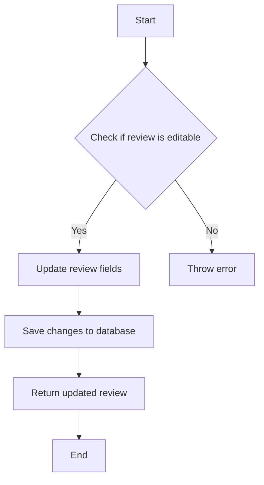

#### 带注释源码

```python
class PendingHumanReview:
    # ... other class methods and fields ...

    async def update(
        self, status: ReviewStatus, data: dict, reviewMessage: str, wasEdited: bool, processed: bool
    ) -> "PendingHumanReview":
        # Check if the review is editable
        if not self.editable:
            raise ValueError("Review is not editable")

        # Update review fields
        self.status = status
        self.data = data
        self.reviewMessage = reviewMessage
        self.wasEdited = wasEdited
        self.processed = processed

        # Save changes to database
        await self.save()

        # Return updated review
        return self
```


## 关键组件


### 张量索引与惰性加载

张量索引与惰性加载是代码中处理数据结构的核心组件，它允许在需要时才加载和操作数据，从而提高性能和资源利用率。

### 反量化支持

反量化支持是代码中用于处理量化策略的关键组件，它允许在运行时动态调整量化参数，以适应不同的计算需求。

### 量化策略

量化策略是代码中用于优化计算效率的组件，它通过减少数据类型的大小来降低内存使用和加速计算过程。


## 问题及建议


### 已知问题

-   **代码重复**：`test_process_all_reviews_for_execution_success` 和 `test_process_all_reviews_for_execution_validation_errors` 两个测试函数中，有大量的代码重复，特别是对于模拟和断言的部分。
-   **异常处理**：在 `test_process_all_reviews_for_execution_validation_errors` 和 `test_process_all_reviews_edit_permission_error` 中，抛出的异常信息不够具体，难以定位问题。
-   **测试覆盖率**：虽然代码中包含多个测试用例，但可能存在一些边界情况未被覆盖。

### 优化建议

-   **代码重构**：将重复的代码提取为函数或类，减少代码冗余，提高可维护性。
-   **异常信息**：在抛出异常时，提供更详细的错误信息，帮助开发者快速定位问题。
-   **测试用例**：增加更多的测试用例，覆盖更多的边界情况和异常情况，提高测试覆盖率。
-   **异步操作**：在测试中，使用异步操作来模拟异步函数的行为，确保测试结果的准确性。
-   **代码注释**：在代码中添加必要的注释，提高代码的可读性。

## 其它


### 设计目标与约束

- 设计目标：
  - 确保代码的可扩展性和可维护性。
  - 提供异步处理以支持高并发。
  - 确保数据的一致性和完整性。
  - 提供清晰的错误处理和异常管理。

- 约束：
  - 代码必须遵循异步编程模式。
  - 必须使用Prisma ORM进行数据库操作。
  - 代码必须通过单元测试验证。

### 错误处理与异常设计

- 错误处理：
  - 使用try-except块捕获和处理异常。
  - 定义自定义异常类以提供更具体的错误信息。

- 异常设计：
  - ValueError：用于处理无效的输入或操作。
  - AssertionError：用于断言测试失败。

### 数据流与状态机

- 数据流：
  - 用户提交的审查请求通过`get_or_create_human_review`函数处理。
  - `has_pending_reviews_for_graph_exec`和`get_pending_reviews_for_user`函数用于检索待处理的审查。
  - `process_all_reviews_for_execution`函数用于处理所有审查。

- 状态机：
  - 审查状态包括：等待、批准、拒绝。
  - 审查状态可以通过`process_all_reviews_for_execution`函数进行更新。

### 外部依赖与接口契约

- 外部依赖：
  - Prisma ORM：用于数据库操作。
  - pytest：用于单元测试。
  - asyncio：用于异步编程。

- 接口契约：
  - `get_or_create_human_review`：创建或检索审查。
  - `has_pending_reviews_for_graph_exec`：检查是否存在待处理的审查。
  - `get_pending_reviews_for_user`：获取用户的待处理审查。
  - `process_all_reviews_for_execution`：处理所有审查。
  - `get_node_execution`：获取节点执行信息。

    