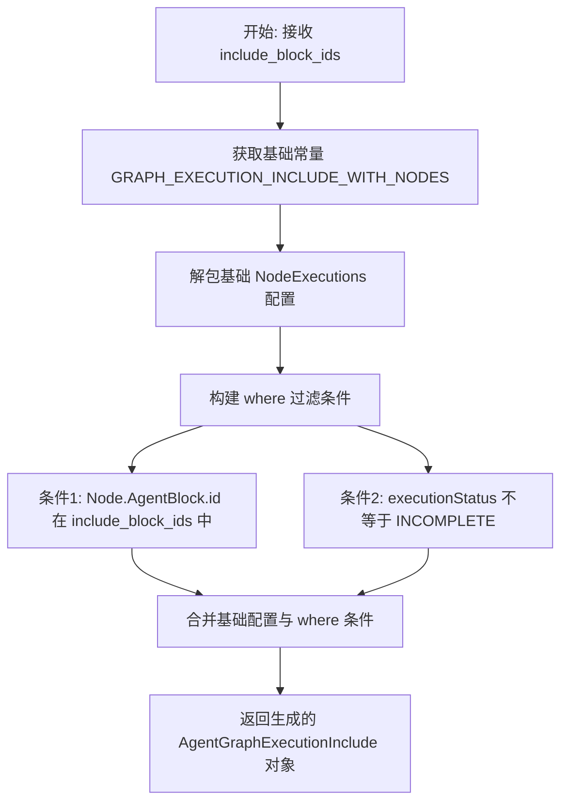
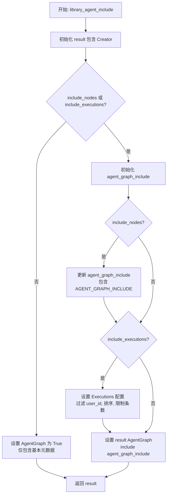

# `.\AutoGPT\autogpt_platform\backend\backend\data\includes.py` 详细设计文档

该代码定义了用于与 Prisma ORM 交互的数据库查询配置模块，通过封装全局常量和辅助函数来构建针对 Agent 节点、图、执行记录及集成 Webhook 的数据包含策略和分页限制，旨在优化数据库查询性能并防止数据过载。

## 整体流程

```mermaid
graph TD
    A[开始] --> B[定义全局查询配置常量]
    B --> C[调用 graph_execution_include]
    C --> C1[接收 include_block_ids 参数]
    C1 --> C2[合并基础配置与 Where 条件]
    C2 --> C3[过滤指定 Block ID 且排除 INCOMPLETE 状态]
    C3 --> C4[返回 AgentGraphExecutionInclude 对象]
    B --> D[调用 library_agent_include]
    D --> D1[接收 user_id 及配置开关]
    D1 --> D2{include_nodes 或 include_executions?}
    D2 -- 否 --> D3[仅返回基础元数据配置]
    D2 -- 是 --> D4[构建 AgentGraph 嵌套配置]
    D4 --> D5{include_nodes?}
    D5 -- 是 --> D6[添加 AGENT_GRAPH_INCLUDE]
    D5 -- 否 --> D7{include_executions?}
    D7 -- 是 --> D8[添加 Executions 查询 (过滤 user, 排序, 限制)]
    D7 -- 否 --> D9[完成配置]
    D6 --> D7
    D8 --> D9
    D9 --> D10[返回完整的 LibraryAgentInclude 对象]
```

## 类结构

```
agent_query_config (配置模块)
├── Constants (全局常量)
│   ├── AGENT_NODE_INCLUDE
│   ├── AGENT_GRAPH_INCLUDE
│   ├── EXECUTION_RESULT_ORDER
│   ├── EXECUTION_RESULT_INCLUDE
│   ├── MAX_NODE_EXECUTIONS_FETCH
│   ├── MAX_LIBRARY_AGENT_EXECUTIONS_FETCH
│   ├── MAX_CREDIT_REFUND_REQUESTS_FETCH
│   ├── MAX_INTEGRATION_WEBHOOKS_FETCH
│   ├── MAX_USER_API_KEYS_FETCH
│   ├── MAX_GRAPH_VERSIONS_FETCH
│   ├── GRAPH_EXECUTION_INCLUDE_WITH_NODES
│   ├── AGENT_PRESET_INCLUDE
│   └── INTEGRATION_WEBHOOK_INCLUDE
└── Functions (全局函数)
    ├── graph_execution_include
    └── library_agent_include
```

## 全局变量及字段


### `AGENT_NODE_INCLUDE`
    
Defines the related fields (Input, Output, Webhook, AgentBlock) to include when querying an AgentNode.

类型：`prisma.types.AgentNodeInclude`
    


### `AGENT_GRAPH_INCLUDE`
    
Specifies the inclusion configuration for an AgentGraph query, primarily nesting the detailed Node includes.

类型：`prisma.types.AgentGraphInclude`
    


### `EXECUTION_RESULT_ORDER`
    
Establishes the sorting priority for node execution results, prioritizing queued time and falling back to added time.

类型：`list[prisma.types.AgentNodeExecutionOrderByInput]`
    


### `EXECUTION_RESULT_INCLUDE`
    
Configures the detailed data structure to fetch for a node execution, including ordered inputs, outputs, node info, and graph execution context.

类型：`prisma.types.AgentNodeExecutionInclude`
    


### `MAX_NODE_EXECUTIONS_FETCH`
    
Sets the hard limit on the number of node execution records that can be fetched in a single query to prevent memory overloads.

类型：`int`
    


### `MAX_LIBRARY_AGENT_EXECUTIONS_FETCH`
    
Defines the default maximum number of execution records to retrieve when querying library agents.

类型：`int`
    


### `MAX_CREDIT_REFUND_REQUESTS_FETCH`
    
Specifies the maximum limit for fetching credit refund requests in a single query.

类型：`int`
    


### `MAX_INTEGRATION_WEBHOOKS_FETCH`
    
Sets the maximum number of integration webhooks to retrieve in a single query.

类型：`int`
    


### `MAX_USER_API_KEYS_FETCH`
    
Defines the upper limit on the number of user API keys fetchable at one time.

类型：`int`
    


### `MAX_GRAPH_VERSIONS_FETCH`
    
Constrains the maximum number of graph versions to retrieve to ensure query performance.

类型：`int`
    


### `GRAPH_EXECUTION_INCLUDE_WITH_NODES`
    
Configures the inclusion of NodeExecutions within a graph execution query, applying specific ordering and fetch limits.

类型：`prisma.types.AgentGraphExecutionInclude`
    


### `AGENT_PRESET_INCLUDE`
    
Specifies the related data (InputPresets, Webhook) to include when querying an Agent Preset.

类型：`prisma.types.AgentPresetInclude`
    


### `INTEGRATION_WEBHOOK_INCLUDE`
    
Defines the nested inclusion of AgentNodes and AgentPresets when querying Integration Webhooks.

类型：`prisma.types.IntegrationWebhookInclude`
    


    

## 全局函数及方法


### `graph_execution_include`

生成用于 Prisma 查询的 `AgentGraphExecutionInclude` 对象，该对象配置了如何包含节点执行数据。它基于全局配置添加了特定的过滤条件，仅返回属于指定 Agent Block ID 列表中的节点，并且排除状态为“未完成（INCOMPLETE）”的执行记录。

参数：

-   `include_block_ids`：`Sequence[str]`，需要包含在查询结果中的 Agent Block ID 列表，用于过滤特定的节点。

返回值：`prisma.types.AgentGraphExecutionInclude`，一个配置了包含关系和过滤条件的 Prisma 查询参数对象。

#### 流程图



#### 带注释源码

```python
def graph_execution_include(
    include_block_ids: Sequence[str],
) -> prisma.types.AgentGraphExecutionInclude:
    # 定义返回的查询包含结构，核心在于 "NodeExecutions" 键的配置
    return {
        "NodeExecutions": {
            # 1. 首先展开全局常量 GRAPH_EXECUTION_INCLUDE_WITH_NODES 中 NodeExecutions 的默认配置
            #    这包含了默认的排序、基础字段以及获取数量限制 (MAX_NODE_EXECUTIONS_FETCH)
            **cast(
                prisma.types.FindManyAgentNodeExecutionArgsFromAgentGraphExecution,
                GRAPH_EXECUTION_INCLUDE_WITH_NODES["NodeExecutions"],  # type: ignore
            ),
            # 2. 添加特定的 where 过滤条件，覆盖或补充默认配置
            "where": {
                # 过滤条件 A: 关联的 Node 必须属于指定的 AgentBlock IDs
                "Node": {
                    "is": {"AgentBlock": {"is": {"id": {"in": include_block_ids}}}}
                },
                # 过滤条件 B: 排除状态为 INCOMPLETE (未完成) 的执行记录
                "NOT": [
                    {"executionStatus": prisma.enums.AgentExecutionStatus.INCOMPLETE}
                ],
            },
        }
    }
```


### `library_agent_include`

针对库代理查询的完全可配置的包含逻辑，包含性能优化。

参数：

-  `user_id`：`str`，用于过滤用户特定数据的用户 ID
-  `include_nodes`：`bool`，是否包含图节点（默认为 True，get_sub_graphs 需要）
-  `include_executions`：`bool`，是否包含执行记录（默认为 True，配合 execution_limit 使用是安全的）
-  `execution_limit`：`int`，获取执行记录的限制（默认为 MAX_LIBRARY_AGENT_EXECUTIONS_FETCH）

返回值：`prisma.types.LibraryAgentInclude`，返回一个用于 Prisma 查询中 `include` 参数的配置对象。

#### 流程图



#### 带注释源码

```python
def library_agent_include(
    user_id: str,
    include_nodes: bool = True,
    include_executions: bool = True,
    execution_limit: int = MAX_LIBRARY_AGENT_EXECUTIONS_FETCH,
) -> prisma.types.LibraryAgentInclude:
    """
    Fully configurable includes for library agent queries with performance optimization.

    Args:
        user_id: User ID for filtering user-specific data
        include_nodes: Whether to include graph nodes (default: True, needed for get_sub_graphs)
        include_executions: Whether to include executions (default: True, safe with execution_limit)
        execution_limit: Limit on executions to fetch (default: MAX_LIBRARY_AGENT_EXECUTIONS_FETCH)

    Defaults maintain backward compatibility and safety - includes everything needed for all functionality.
    For performance optimization, explicitly set include_nodes=False and include_executions=False
    for listing views where frontend fetches data separately.

    Performance impact:
    - Default (full nodes + limited executions): Original performance, works everywhere
    - Listing optimization (no nodes/executions): ~2s for 15 agents vs potential timeouts
    - Unlimited executions: varies by user (thousands of executions = timeouts)
    """
    # 初始化结果字典，默认包含创建者信息
    result: prisma.types.LibraryAgentInclude = {
        "Creator": True,  # Always needed for creator info
    }

    # 根据请求的选项构建 AgentGraph include
    # 如果需要包含节点或执行记录，则需要深入配置 AgentGraph
    if include_nodes or include_executions:
        agent_graph_include = {}

        # 如果请求包含节点，则添加完整的节点配置（包括输入、输出、Webhook、AgentBlock）
        if include_nodes:
            agent_graph_include.update(AGENT_GRAPH_INCLUDE)  # Full nodes

        # 如果请求包含执行记录，则添加执行记录的查询配置
        if include_executions:
            agent_graph_include["Executions"] = {
                "where": {"userId": user_id},         # 仅查询当前用户的执行记录
                "order_by": {"createdAt": "desc"},   # 按创建时间倒序排列
                "take": execution_limit,              # 限制查询数量，防止数据过大
            }

        # 将构建好的 agent_graph_include 赋值给 result["AgentGraph"]
        result["AgentGraph"] = cast(
            prisma.types.AgentGraphArgsFromLibraryAgent,
            {"include": agent_graph_include},
        )
    else:
        # 默认情况：仅包含基本元数据（速度快 - 推荐用于大多数用例）
        # 当不需要节点和执行详情时（如列表视图），直接关联 AgentGraph 对象本身即可
        result["AgentGraph"] = True  # Basic graph metadata (name, description, id)

    return result
```


## 关键组件


### Agent Graph & Node Query Configuration

包含静态 Prisma 类型字典（如 `AGENT_NODE_INCLUDE`、`AGENT_GRAPH_INCLUDE`），定义代理图和节点的数据库关系和抓取策略，确保默认包含输入、输出和 Webhook 等依赖项。

### Execution Result Query Logic

管理 AgentNodeExecution 实体的抓取配置（`EXECUTION_RESULT_INCLUDE`），指定排序标准（优先 `queuedTime`，其次 `addedTime`）以获取最新结果，并限制返回的记录数量以保护性能。

### Dynamic Query Inclusion Builders

包含诸如 `graph_execution_include` 和 `library_agent_include` 之类的辅助函数，它们接受运行时参数（如用户 ID、节点 ID 和性能标志）来动态构建自定义 Prisma 包含对象，从而实现对复杂关系和执行历史记录的灵活抓取。

### Performance Constraint Constants

定义一系列全局整数常量（如 `MAX_NODE_EXECUTIONS_FETCH`、`MAX_LIBRARY_AGENT_EXECUTIONS_FETCH`），对数据库查询可以返回的记录数设置严格上限，以防止系统过载并确保高数据量下的响应能力。


## 问题及建议


### 已知问题

-   **硬编码的常量限制**：`MAX_NODE_EXECUTIONS_FETCH`、`MAX_LIBRARY_AGENT_EXECUTIONS_FETCH` 等限制值直接硬编码在代码中。这意味着如果数据库规模或性能特征发生变化，需要修改代码并重新部署，缺乏灵活性。
-   **类型安全被强制掩盖**：代码中大量使用了 `cast(..., ...)` 和 `# type: ignore`。这表明 Prisma 生成的类型与运行时所需的字典结构之间存在不匹配，强制类型转换会掩盖潜在的类型错误，导致在重构时难以发现不兼容的更改。
-   **字典操作脆弱**：`graph_execution_include` 函数通过解包 `**cast(..., ...)` 并覆盖字段的方式来修改 `GRAPH_EXECUTION_INCLUDE_WITH_NODES`。这种依赖字典合并顺序和键名覆盖的方式比较脆弱，如果基础常量的结构发生变化，可能导致运行时错误或查询逻辑失效。
-   **默认配置的性能隐患**：`library_agent_include` 函数的默认参数 `include_nodes=True` 和 `include_executions=True` 会加载大量关联数据。虽然文档中提到了性能影响，但作为默认行为，很容易被开发者在无意识的情况下调用，导致列表页面加载缓慢或超时。

### 优化建议

-   **配置化硬编码常量**：将所有的 `MAX_...` 常量提取到配置文件（如 `.env` 或配置中心）中，使其可以在不重启服务的情况下动态调整，或者针对不同部署环境（开发、生产）设置不同的阈值。
-   **引入游标分页**：当前的查询限制仅使用了 `take`（Limit）。当数据量很大且需要翻页时，简单的 `skip` + `take` 性能会急剧下降。建议在涉及大量数据（如 `NodeExecutions`）的查询中引入基于游标的分页机制，以保证数据检索效率的稳定性。
-   **使用构建器模式重构复杂查询构建**：`library_agent_include` 和 `graph_execution_include` 函数通过复杂的字典嵌套和逻辑判断来构建查询参数。建议引入查询构建器类（Builder Pattern）或 Pydantic 模型，以更面向对象、类型安全且声明式的方式来构建这些复杂的 Include 对象，提高代码的可读性和可维护性。
-   **增强参数校验与防御性编程**：在 `graph_execution_include` 中，应对 `include_block_ids` 进行非空校验，防止传入空列表导致生成的 SQL 查询无效（例如 `WHERE id IN ()` 通常是非法 SQL）。同时，对于 `library_agent_include` 中的 `user_id` 也应进行格式校验。
-   **拆分默认查询策略**：将 `library_agent_include` 的默认策略改为“仅包含元数据”（即 `include_nodes=False`, `include_executions=False`），强制调用者显式声明是否需要加载沉重的关联数据，从而避免意外的性能损耗。


## 其它


### 设计目标与约束

**设计目标：**
1.  **查询配置复用与标准化**：通过定义全局常量和辅助函数，统一管理 Prisma 查询的 `include` 和 `order_by` 配置，避免在业务代码中重复书写复杂的嵌套查询逻辑。
2.  **性能优化**：通过预设的 `MAX_...` 限制（如 `MAX_NODE_EXECUTIONS_FETCH`），防止因查询关联数据过多（如获取包含数千次执行的图）导致的内存溢出或数据库超时。
3.  **灵活性与按需加载**：提供如 `library_agent_include` 等函数，允许调用方根据业务场景（如列表页仅需元数据，详情页需完整图数据）动态开关对节点、执行记录等大数据量关联实体的加载。

**约束：**
1.  **Schema 依赖**：代码严格依赖 `prisma.types` 和 `prisma.enums` 定义。如果底层数据库 Schema 发生变更，必须同步更新这些类型定义，否则会导致类型检查失败或运行时错误。
2.  **获取上限**：任何查询都受到硬编码的常量限制（如 1000 条节点执行记录），不支持无限制的全量拉取，以确保系统稳定性。
3.  **类型安全**：强制使用 `cast` 操作符以确保返回的字典符合 Prisma Client 的类型要求，利用 Python 类型系统在编译期捕获部分错误。

### 错误处理与异常设计

**设计策略：**
1.  **被动异常处理**：本模块主要处理数据结构配置，不直接执行数据库操作，因此**不包含**显式的 `try-except` 错误捕获逻辑。
2.  **类型约束验证**：利用 Python 的 `typing` 模块（如 `Sequence[str]`, `str`）进行静态类型检查。如果传入参数类型不匹配（例如 `user_id` 不是字符串），错误将由类型检查器（如 MyPy）在开发阶段拦截，或在运行时由 Prisma Client 抛出 `ValidationError`。
3.  **下游处理**：产生的配置对象传递给 Prisma Client 后，可能产生的数据库连接错误、查询超时或记录不存在等异常，由调用本模块配置的上层业务逻辑（Service 层）统一处理。

### 数据流与状态机

**数据流：**
1.  **输入阶段**：业务逻辑层调用辅助函数（如 `library_agent_include`），传入过滤条件（`user_id`）和开关标志（`include_nodes`, `include_executions`）。
2.  **配置构建阶段**：函数内部根据输入参数，组装符合 Prisma 规范的字典结构。在此过程中，会引用全局定义的基础配置（如 `AGENT_NODE_INCLUDE`）并根据条件追加 `where` 或 `take` 限制。
3.  **执行阶段**：组装好的配置字典作为参数传递给 `prisma.client` 的查询方法（如 `find_many` 或 `find_unique`）。
4.  **输出阶段**：数据库返回根据配置结构化填充的模型对象，最终流向业务逻辑层。

**状态机：**
本模块不包含内部状态机逻辑，主要处理静态数据结构的映射。但在查询过滤条件中引用了外部状态：
*   **AgentExecutionStatus**：通过 `prisma.enums.AgentExecutionStatus.INCOMPLETE` 排除未完成的执行状态，这反映了节点执行生命周期中的状态过滤逻辑。

### 外部依赖与接口契约

**外部依赖：**
1.  **Prisma Client Python**：核心依赖，用于类型定义（`prisma.types`）和枚举（`prisma.enums`）。代码依赖其生成的类型系统来构造查询参数。
2.  **Python Typing**：标准库依赖，用于类型提示（`Sequence`, `cast`, `list`）。

**接口契约：**
1.  **配置函数契约**：
    *   `graph_execution_include(include_block_ids: Sequence[str])`：契约规定输入必须为字符串序列，输出必须满足 `AgentGraphExecutionInclude` 接口。
    *   `library_agent_include(...)`：契约规定了参数的默认值行为（默认开启获取优化），并保证在 `include_nodes=False` 且 `include_executions=False` 时，仅返回图的基本元数据，不包含深层嵌套数据。
2.  **常量契约**：全局常量（如 `AGENT_NODE_INCLUDE`）作为模块的公共 API，导出给其他模块使用，修改其结构可能影响依赖这些常量的所有查询。

### 性能与扩展性考量

**性能优化策略：**
1.  **分页与截断**：在配置中严格限制 `take` 数量（例如 `MAX_NODE_EXECUTIONS_FETCH = 1000`），强制实现分页逻辑，避免单次查询加载过多数据导致长事务或高内存占用。
2.  **字段裁剪**：`library_agent_include` 函数实现了“按需加载”模式。在仅需展示 Agent 列表的场景下，通过关闭 `include_nodes` 和 `include_executions`，显著减少了数据库 Join 操作和数据传输量（文档注释提到优化后约 2s vs 潜在超时）。
3.  **排序索引利用**：预设的 `EXECUTION_RESULT_ORDER` 利用 `queuedTime` 和 `addedTime` 的降序排列，暗示数据库应对这些字段建立索引以加快查询速度。

**扩展性设计：**
1.  **组合式配置**：基础配置（如 `AGENT_NODE_INCLUDE`）被设计为独立的字典，新的复杂查询可以通过解包（`**`）和覆盖原有字段来复用这些基础配置，无需从头编写。
2.  **动态过滤**：`graph_execution_include` 允许动态传入 `include_block_ids`，支持基于业务逻辑的灵活过滤，扩展了基础查询的功能。
    