# `.\AutoGPT\autogpt_platform\backend\backend\data\integrations.py` 详细设计文档

This file defines the Webhook class and related functions for managing webhooks, including CRUD operations, event handling, and integration with external systems.

## 整体流程

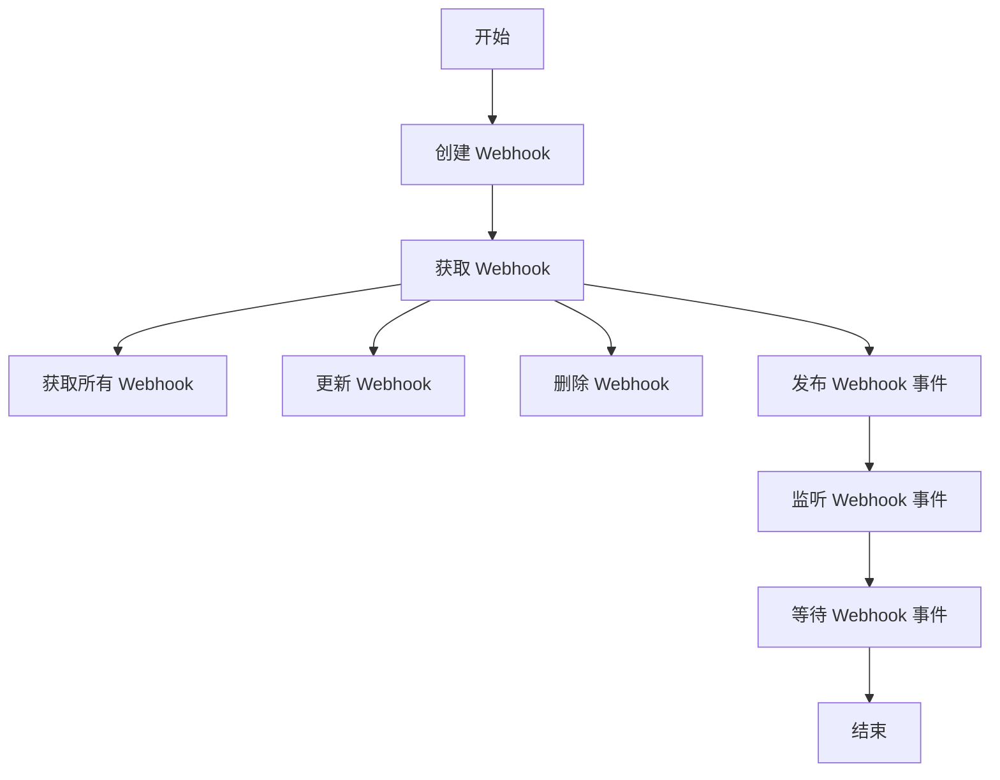
```mermaid
graph TD
    A[开始] --> B[创建 Webhook]
    B --> C[获取 Webhook]
    C --> D[获取所有 Webhook]
    C --> E[更新 Webhook]
    C --> F[删除 Webhook]
    C --> G[发布 Webhook 事件]
    G --> H[监听 Webhook 事件]
    H --> I[等待 Webhook 事件]
    I --> J[结束]
```

## 类结构

```
Webhook (类)
├── WebhookWithRelations (类)
│   ├── NodeModel (类)
│   └── LibraryAgentPreset (类)
├── WebhookEvent (类)
└── WebhookEventBus (类)
```

## 全局变量及字段


### `logger`
    
Logger instance for logging messages.

类型：`logging.Logger`
    


### `_webhook_event_bus`
    
Event bus for managing webhook events using Redis.

类型：`backend.data.event_bus.AsyncRedisEventBus[WebhookEvent]`
    


### `Webhook.user_id`
    
Unique identifier for the user associated with the webhook.

类型：`str`
    


### `Webhook.provider`
    
The provider of the webhook.

类型：`ProviderName`
    


### `Webhook.credentials_id`
    
Unique identifier for the credentials associated with the webhook.

类型：`str`
    


### `Webhook.webhook_type`
    
Type of the webhook.

类型：`str`
    


### `Webhook.resource`
    
Resource associated with the webhook.

类型：`str`
    


### `Webhook.events`
    
Events that the webhook is triggered for.

类型：`list[str]`
    


### `Webhook.config`
    
Configuration data for the webhook.

类型：`dict`
    


### `Webhook.secret`
    
Secret key for the webhook.

类型：`str`
    


### `Webhook.provider_webhook_id`
    
Unique identifier for the webhook in the provider's system.

类型：`str`
    


### `WebhookWithRelations.triggered_nodes`
    
Nodes triggered by the webhook.

类型：`list[NodeModel]`
    


### `WebhookWithRelations.triggered_presets`
    
Presets triggered by the webhook.

类型：`list[LibraryAgentPreset]`
    


### `WebhookEvent.provider`
    
The provider of the webhook event.

类型：`str`
    


### `WebhookEvent.webhook_id`
    
Unique identifier for the webhook event.

类型：`str`
    


### `WebhookEvent.event_type`
    
Type of the webhook event.

类型：`str`
    


### `WebhookEvent.payload`
    
Payload data for the webhook event.

类型：`dict`
    
    

## 全局函数及方法


### `create_webhook`

Create a new webhook in the database.

参数：

- `webhook`：`Webhook`，The webhook object to be created.

返回值：`Webhook`，The created webhook object.

#### 流程图

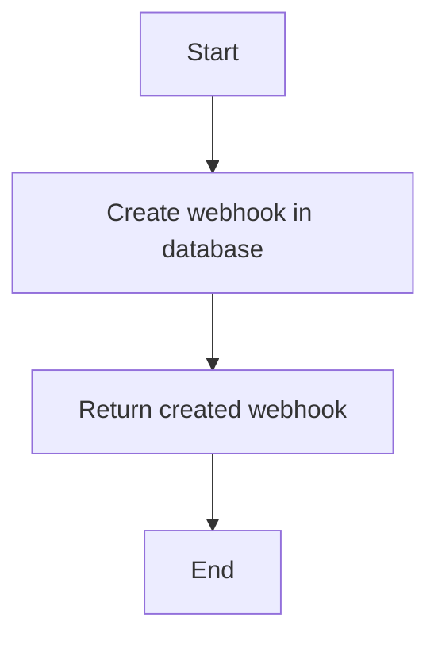
```mermaid
graph TD
    A[Start] --> B[Create webhook in database]
    B --> C[Return created webhook]
    C --> D[End]
```

#### 带注释源码

```python
async def create_webhook(webhook: Webhook) -> Webhook:
    created_webhook = await IntegrationWebhook.prisma().create(
        data=IntegrationWebhookCreateInput(
            id=webhook.id,
            userId=webhook.user_id,
            provider=webhook.provider.value,
            credentialsId=webhook.credentials_id,
            webhookType=webhook.webhook_type,
            resource=webhook.resource,
            events=webhook.events,
            config=SafeJson(webhook.config),
            secret=webhook.secret,
            providerWebhookId=webhook.provider_webhook_id,
        )
    )
    return Webhook.from_db(created_webhook)
```


### `get_webhook`

Retrieves a webhook by its ID, optionally including related data.

参数：

- `webhook_id`：`str`，The ID of the webhook to retrieve.
- `include_relations`：`bool`，Optional. If set to `True`, includes related data such as triggered nodes and presets.

返回值：`Webhook` or `WebhookWithRelations`，The retrieved webhook object, with or without related data.

#### 流程图

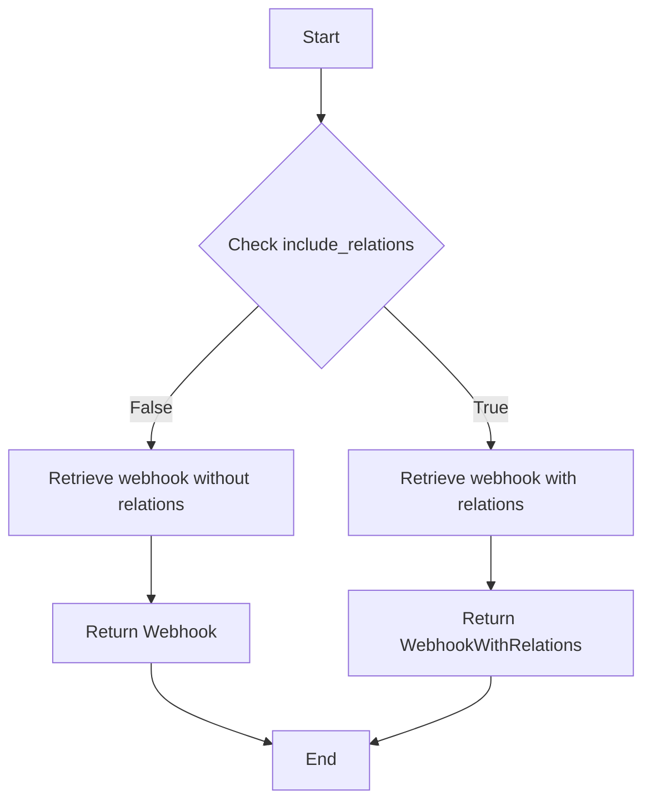
```mermaid
graph TD
    A[Start] --> B{Check include_relations}
    B -- True --> C[Retrieve webhook with relations]
    B -- False --> D[Retrieve webhook without relations]
    C --> E[Return WebhookWithRelations]
    D --> F[Return Webhook]
    F --> G[End]
    E --> G
```

#### 带注释源码

```python
async def get_webhook(
    webhook_id: str, *, include_relations: bool = False
) -> Webhook | WebhookWithRelations:
    """
    ⚠️ No `user_id` check: DO NOT USE without check in user-facing endpoints.

    Raises:
        NotFoundError: if no record with the given ID exists
    """
    webhook = await IntegrationWebhook.prisma().find_unique(
        where={"id": webhook_id},
        include=INTEGRATION_WEBHOOK_INCLUDE if include_relations else None,
    )
    if not webhook:
        raise NotFoundError(f"Webhook #{webhook_id} not found")
    return (WebhookWithRelations if include_relations else Webhook).from_db(webhook)
```


### `get_all_webhooks_by_creds`

Retrieves all webhooks associated with a specific user and credentials.

参数：

- `user_id`：`str`，The ID of the user associated with the webhooks.
- `credentials_id`：`str`，The ID of the credentials associated with the webhooks.
- `include_relations`：`bool`，Optional; whether to include related entities in the result.
- `limit`：`int`，Optional; the maximum number of webhooks to return.

返回值：`list[Webhook] | list[WebhookWithRelations]`，A list of webhooks associated with the given user and credentials.

#### 流程图

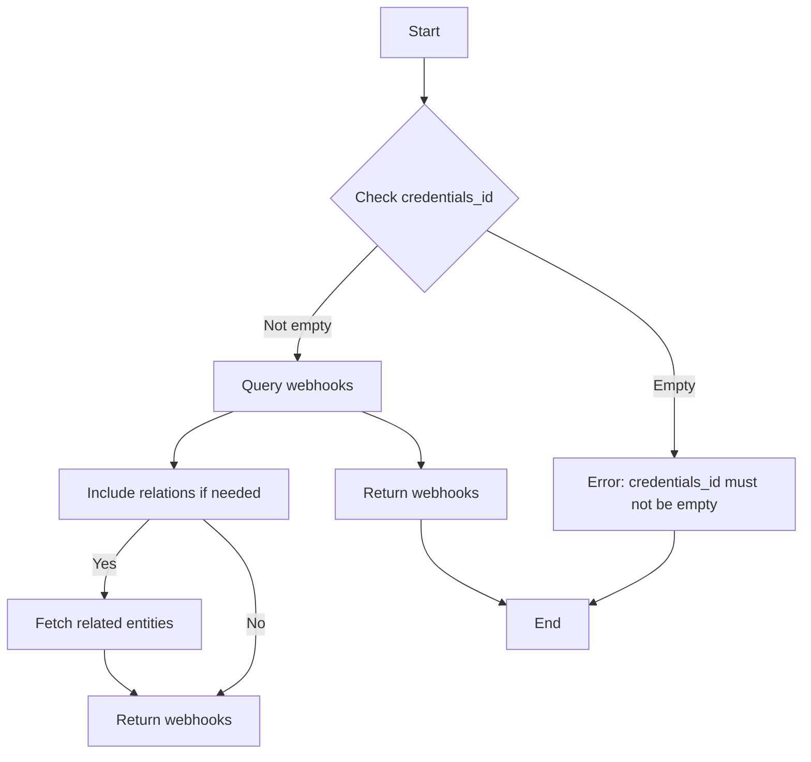
```mermaid
graph TD
    A[Start] --> B{Check credentials_id}
    B -- Not empty --> C[Query webhooks]
    B -- Empty --> D[Error: credentials_id must not be empty]
    C --> E[Include relations if needed]
    C --> F[Return webhooks]
    E -- Yes --> G[Fetch related entities]
    E -- No --> H[Return webhooks]
    G --> H
    F --> I[End]
    D --> I
```

#### 带注释源码

```python
async def get_all_webhooks_by_creds(
    user_id: str,
    credentials_id: str,
    *,
    include_relations: bool = False,
    limit: int = MAX_INTEGRATION_WEBHOOKS_FETCH,
) -> list[Webhook] | list[WebhookWithRelations]:
    if not credentials_id:
        raise ValueError("credentials_id must not be empty")
    webhooks = await IntegrationWebhook.prisma().find_many(
        where={"userId": user_id, "credentialsId": credentials_id},
        include=INTEGRATION_WEBHOOK_INCLUDE if include_relations else None,
        order={"createdAt": "desc"},
        take=limit,
    )
    return [
        (WebhookWithRelations if include_relations else Webhook).from_db(webhook)
        for webhook in webhooks
    ]
```


### find_webhook_by_credentials_and_props

查找与给定用户ID、凭据ID、webhook类型、资源和事件列表匹配的webhook。

参数：

- `user_id`：`str`，用户ID
- `credentials_id`：`str`，凭据ID
- `webhook_type`：`str`，webhook类型
- `resource`：`str`，资源
- `events`：`list[str]`，事件列表

返回值：`Webhook | None`，找到的webhook对象或None

#### 流程图

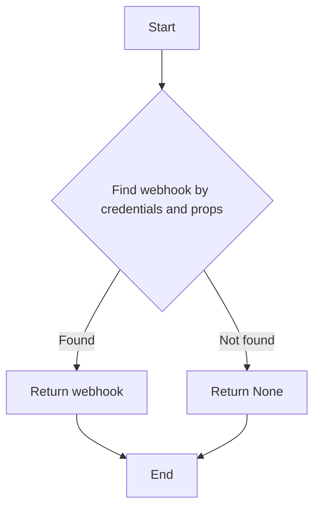
```mermaid
graph TD
    A[Start] --> B{Find webhook by credentials and props}
    B -->|Found| C[Return webhook]
    B -->|Not found| D[Return None]
    C --> E[End]
    D --> E
```

#### 带注释源码

```python
async def find_webhook_by_credentials_and_props(
    user_id: str,
    credentials_id: str,
    webhook_type: str,
    resource: str,
    events: list[str],
) -> Webhook | None:
    webhook = await IntegrationWebhook.prisma().find_first(
        where={
            "userId": user_id,
            "credentialsId": credentials_id,
            "webhookType": webhook_type,
            "resource": resource,
            "events": {"has_every": events},
        },
    )
    return Webhook.from_db(webhook) if webhook else None
```


### find_webhook_by_graph_and_props

Find a webhook by its user ID, provider, webhook type, and either a graph ID or a preset ID.

参数：

- `user_id`：`str`，The ID of the user who owns the webhook.
- `provider`：`str`，The provider of the webhook.
- `webhook_type`：`str`，The type of the webhook.
- `graph_id`：`Optional[str]`，The ID of the graph to filter by, if provided.
- `preset_id`：`Optional[str]`，The ID of the preset to filter by, if provided.

返回值：`Webhook | None`，The webhook object if found, otherwise `None`.

#### 流程图

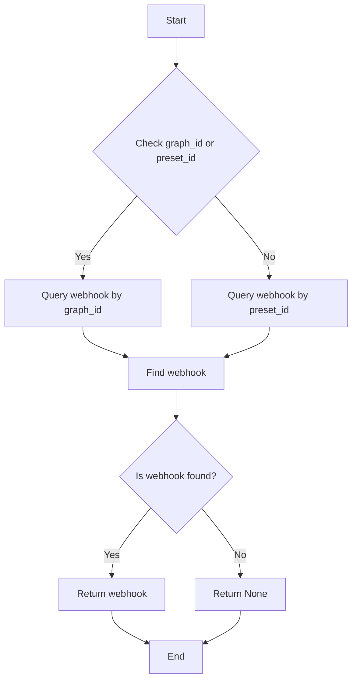
```mermaid
graph TD
    A[Start] --> B{Check graph_id or preset_id}
    B -- Yes --> C[Query webhook by graph_id]
    B -- No --> D[Query webhook by preset_id]
    C --> E[Find webhook]
    D --> E
    E --> F{Is webhook found?}
    F -- Yes --> G[Return webhook]
    F -- No --> H[Return None]
    G --> I[End]
    H --> I
```

#### 带注释源码

```python
async def find_webhook_by_graph_and_props(
    user_id: str,
    provider: str,
    webhook_type: str,
    graph_id: Optional[str] = None,
    preset_id: Optional[str] = None,
) -> Webhook | None:
    """Either `graph_id` or `preset_id` must be provided."""
    where_clause: IntegrationWebhookWhereInput = {
        "userId": user_id,
        "provider": provider,
        "webhookType": webhook_type,
    }

    if preset_id:
        where_clause["AgentPresets"] = {"some": {"id": preset_id}}
    elif graph_id:
        where_clause["AgentNodes"] = {"some": {"agentGraphId": graph_id}}
    else:
        raise ValueError("Either graph_id or preset_id must be provided")

    webhook = await IntegrationWebhook.prisma().find_first(
        where=where_clause,
    )
    return Webhook.from_db(webhook) if webhook else None
```


### update_webhook

Update the configuration or events of a webhook.

参数：

- `webhook_id`：`str`，The ID of the webhook to update.
- `config`：`Optional[dict[str, Serializable]]`，Optional configuration to update for the webhook. If provided, it will be serialized to JSON and stored.
- `events`：`Optional[list[str]]`，Optional list of events to update for the webhook. If provided, it will replace the existing events.

返回值：`Webhook`，The updated webhook object.

#### 流程图

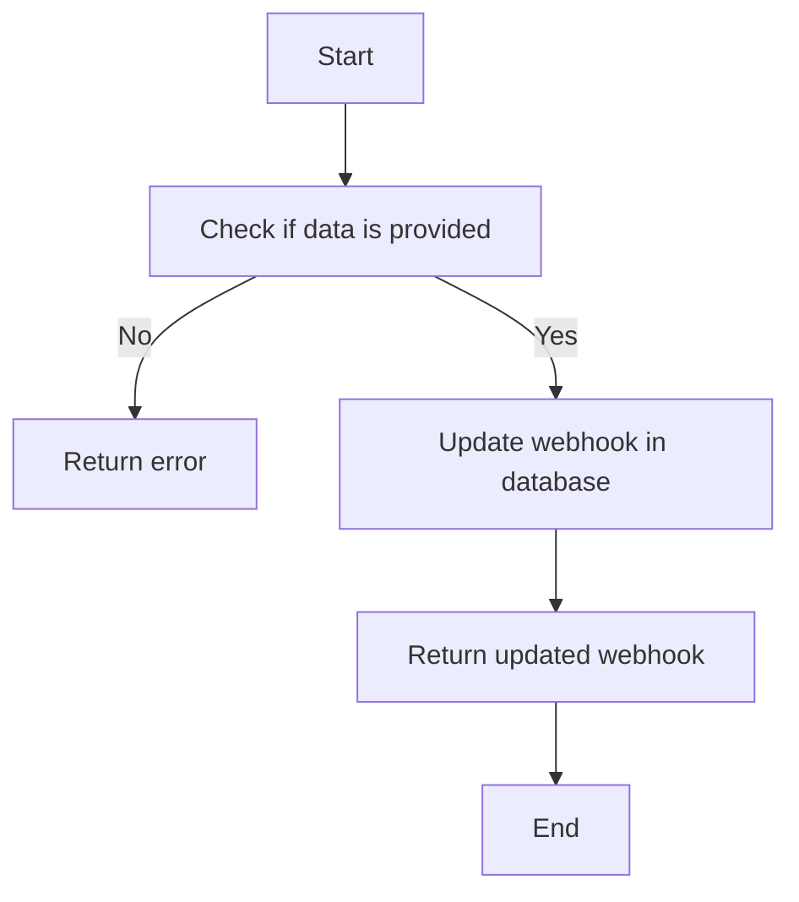
```mermaid
graph TD
    A[Start] --> B[Check if data is provided]
    B -->|No| C[Return error]
    B -->|Yes| D[Update webhook in database]
    D --> E[Return updated webhook]
    E --> F[End]
```

#### 带注释源码

```python
async def update_webhook(
    webhook_id: str,
    config: Optional[dict[str, Serializable]] = None,
    events: Optional[list[str]] = None,
) -> Webhook:
    """⚠️ No `user_id` check: DO NOT USE without check in user-facing endpoints."""
    data: IntegrationWebhookUpdateInput = {}
    if config is not None:
        data["config"] = SafeJson(config)
    if events is not None:
        data["events"] = events
    if not data:
        raise ValueError("Empty update query")

    _updated_webhook = await IntegrationWebhook.prisma().update(
        where={"id": webhook_id},
        data=data,
    )
    if _updated_webhook is None:
        raise NotFoundError(f"Webhook #{webhook_id} not found")
    return Webhook.from_db(_updated_webhook)
```


### find_webhooks_by_graph_id

Find all webhooks that trigger nodes or presets in a specific graph for a user.

参数：

- `graph_id`：`str`，The ID of the graph
- `user_id`：`str`，The ID of the user

返回值：`list[Webhook]`，List of webhooks associated with the graph

#### 流程图

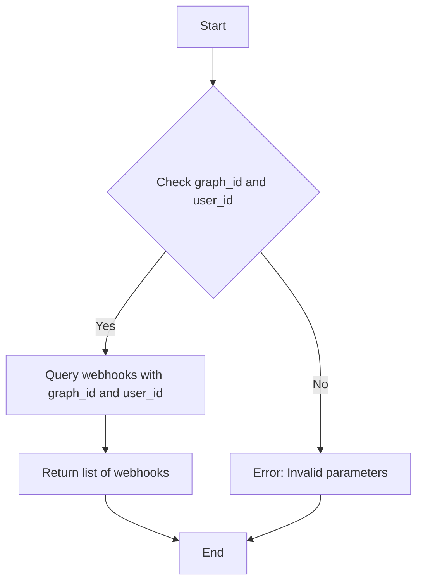
```mermaid
graph TD
    A[Start] --> B{Check graph_id and user_id}
    B -->|Yes| C[Query webhooks with graph_id and user_id]
    C --> D[Return list of webhooks]
    D --> E[End]
    B -->|No| F[Error: Invalid parameters]
    F --> E
```

#### 带注释源码

```python
async def find_webhooks_by_graph_id(graph_id: str, user_id: str) -> list[Webhook]:
    """
    Find all webhooks that trigger nodes OR presets in a specific graph for a user.

    Args:
        graph_id: The ID of the graph
        user_id: The ID of the user

    Returns:
        list[Webhook]: List of webhooks associated with the graph
    """
    where_clause: IntegrationWebhookWhereInput = {
        "userId": user_id,
        "OR": [
            # Webhooks that trigger nodes in this graph
            {"AgentNodes": {"some": {"agentGraphId": graph_id}}},
            # Webhooks that trigger presets for this graph
            {"AgentPresets": {"some": {"agentGraphId": graph_id}}},
        ],
    }
    webhooks = await IntegrationWebhook.prisma().find_many(where=where_clause)
    return [Webhook.from_db(webhook) for webhook in webhooks]
```


### `unlink_webhook_from_graph`

Unlinks a webhook from all nodes and presets in a specific graph. If the webhook has no remaining triggers, it will be automatically deleted and deregistered with the provider.

参数：

- `webhook_id`：`str`，The ID of the webhook to unlink from the graph.
- `graph_id`：`str`，The ID of the graph to unlink the webhook from.
- `user_id`：`str`，The ID of the user (for authorization).

返回值：`None`，No return value, the function performs an action and does not return a result.

#### 流程图

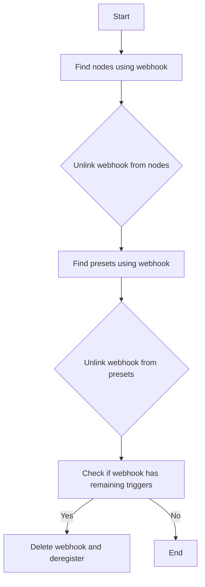
```mermaid
graph TD
    A[Start] --> B[Find nodes using webhook]
    B --> C{Unlink webhook from nodes}
    C --> D[Find presets using webhook]
    D --> E{Unlink webhook from presets}
    E --> F[Check if webhook has remaining triggers]
    F -->|Yes| G[Delete webhook and deregister]
    F -->|No| H[End]
```

#### 带注释源码

```python
async def unlink_webhook_from_graph(
    webhook_id: str, graph_id: str, user_id: str
) -> None:
    """
    Unlink a webhook from all nodes and presets in a specific graph.
    If the webhook has no remaining triggers, it will be automatically deleted
    and deregistered with the provider.

    Args:
        webhook_id: The ID of the webhook
        graph_id: The ID of the graph to unlink from
        user_id: The ID of the user (for authorization)
    """
    # Avoid circular imports
    from backend.api.features.library.db import set_preset_webhook
    from backend.data.graph import set_node_webhook

    # Find all nodes in this graph that use this webhook
    nodes = await AgentNode.prisma().find_many(
        where={"agentGraphId": graph_id, "webhookId": webhook_id}
    )

    # Unlink webhook from each node
    for node in nodes:
        await set_node_webhook(node.id, None)

    # Find all presets for this graph that use this webhook
    presets = await AgentPreset.prisma().find_many(
        where={"agentGraphId": graph_id, "webhookId": webhook_id, "userId": user_id}
    )

    # Unlink webhook from each preset
    for preset in presets:
        await set_preset_webhook(user_id, preset.id, None)

    # Check if webhook needs cleanup (prune_webhook_if_dangling handles the trigger check)
    webhook = await get_webhook(webhook_id, include_relations=False)
    webhook_manager = get_webhook_manager(webhook.provider)
    creds_manager = IntegrationCredentialsManager()
    credentials = (
        await creds_manager.get(user_id, webhook.credentials_id)
        if webhook.credentials_id
        else None
    )
    await webhook_manager.prune_webhook_if_dangling(user_id, webhook.id, credentials)
```


### delete_webhook

This function deletes a webhook associated with a specific user.

参数：

- `user_id`：`str`，The ID of the user associated with the webhook.
- `webhook_id`：`str`，The ID of the webhook to be deleted.

返回值：`None`，No return value.

#### 流程图

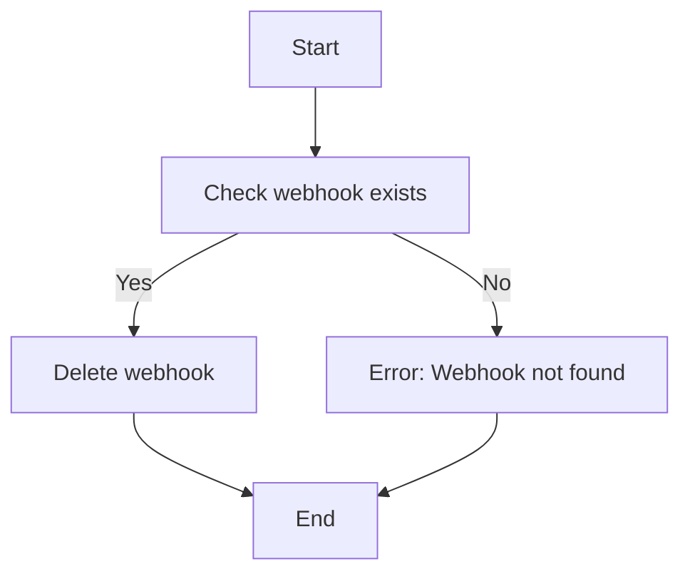
```mermaid
graph TD
    A[Start] --> B[Check webhook exists]
    B -->|Yes| C[Delete webhook]
    B -->|No| D[Error: Webhook not found]
    C --> E[End]
    D --> E
```

#### 带注释源码

```python
async def delete_webhook(user_id: str, webhook_id: str) -> None:
    deleted = await IntegrationWebhook.prisma().delete_many(
        where={"id": webhook_id, "userId": user_id}
    )
    if deleted < 1:
        raise NotFoundError(f"Webhook #{webhook_id} not found")
```


### publish_webhook_event

Publishes a webhook event to the event bus.

参数：

- `event`：`WebhookEvent`，The event to be published.

返回值：`None`，No return value.

#### 流程图

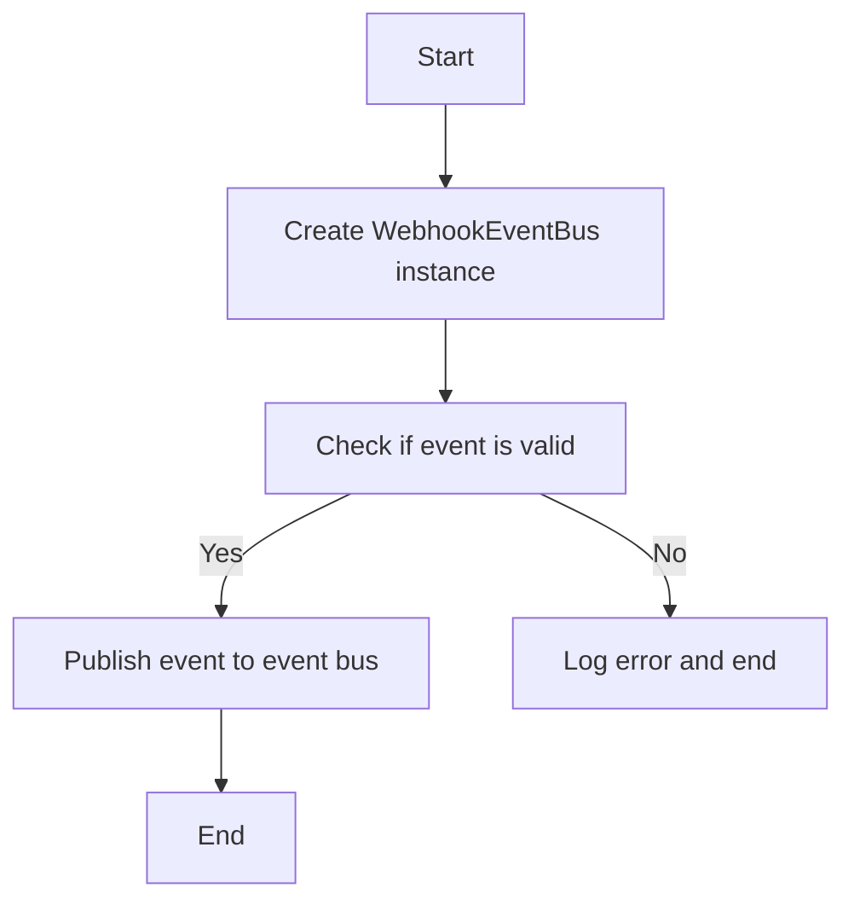
```mermaid
graph TD
    A[Start] --> B[Create WebhookEventBus instance]
    B --> C[Check if event is valid]
    C -->|Yes| D[Publish event to event bus]
    D --> E[End]
    C -->|No| F[Log error and end]
```

#### 带注释源码

```python
async def publish_webhook_event(event: WebhookEvent):
    await _webhook_event_bus.publish_event(
        event, f"{event.webhook_id}/{event.event_type}"
    )
```


### listen_for_webhook_events

Listen for webhook events from a specific webhook.

参数：

- `webhook_id`：`str`，The ID of the webhook to listen for events from.
- `event_type`：`Optional[str]`，The type of event to listen for. If not provided, listens for all events.

返回值：`AsyncGenerator[WebhookEvent, None]`，An asynchronous generator that yields `WebhookEvent` objects.

#### 流程图

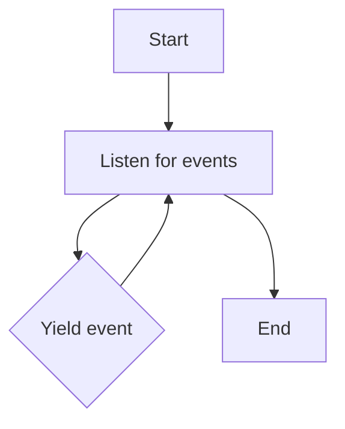
```mermaid
graph TD
    A[Start] --> B[Listen for events]
    B --> C{Yield event}
    C --> B
    B --> D[End]
```

#### 带注释源码

```python
async def listen_for_webhook_events(
    webhook_id: str, event_type: Optional[str] = None
) -> AsyncGenerator[WebhookEvent, None]:
    async for event in _webhook_event_bus.listen_events(
        f"{webhook_id}/{event_type or '*'}"
    ):
        yield event
```


### `wait_for_webhook_event`

Waits for a webhook event to be published for a specific webhook ID and event type.

参数：

- `webhook_id`：`str`，The ID of the webhook to listen for events on.
- `event_type`：`Optional[str]`，The type of event to wait for. If not provided, waits for any event.
- `timeout`：`Optional[float]`，The timeout in seconds to wait for an event. If not provided, waits indefinitely.

返回值：`WebhookEvent | None`，The `WebhookEvent` object if an event is received within the timeout period, otherwise `None`.

#### 流程图

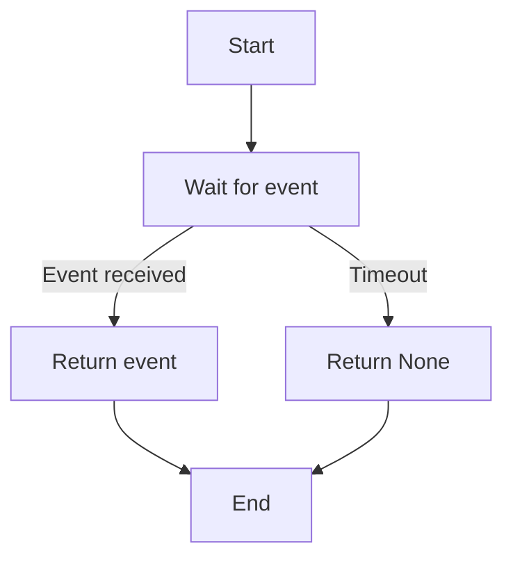
```mermaid
graph TD
    A[Start] --> B[Wait for event]
    B -->|Event received| C[Return event]
    B -->|Timeout| D[Return None]
    C --> E[End]
    D --> E
```

#### 带注释源码

```python
async def wait_for_webhook_event(
    webhook_id: str, event_type: Optional[str] = None, timeout: Optional[float] = None
) -> WebhookEvent | None:
    return await _webhook_event_bus.wait_for_event(
        f"{webhook_id}/{event_type or '*'}", timeout
    )
```


### Webhook.from_db

将数据库中的 `IntegrationWebhook` 对象转换为 `Webhook` 对象。

#### 参数

- `webhook`：`IntegrationWebhook`，数据库中的 webhook 对象。

#### 返回值

- `Webhook`：转换后的 webhook 对象。

#### 流程图

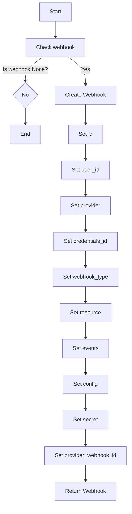
```mermaid
graph TD
    A[Start] --> B[Check webhook]
    B -->|Is webhook None?| C{No}
    C --> D[End]
    B -->|Yes| E[Create Webhook]
    E --> F[Set id]
    F --> G[Set user_id]
    G --> H[Set provider]
    H --> I[Set credentials_id]
    I --> J[Set webhook_type]
    J --> K[Set resource]
    K --> L[Set events]
    L --> M[Set config]
    M --> N[Set secret]
    N --> O[Set provider_webhook_id]
    O --> P[Return Webhook]
```

#### 带注释源码

```python
@staticmethod
    def from_db(webhook: IntegrationWebhook):
        return Webhook(
            id=webhook.id,
            user_id=webhook.userId,
            provider=ProviderName(webhook.provider),
            credentials_id=webhook.credentialsId,
            webhook_type=webhook.webhookType,
            resource=webhook.resource,
            events=webhook.events,
            config=dict(webhook.config),
            secret=webhook.secret,
            provider_webhook_id=webhook.providerWebhookId,
        )
```


### Webhook.url

返回Webhook对象的URL。

参数：

- 无

返回值：`str`，Webhook对象的URL

#### 流程图

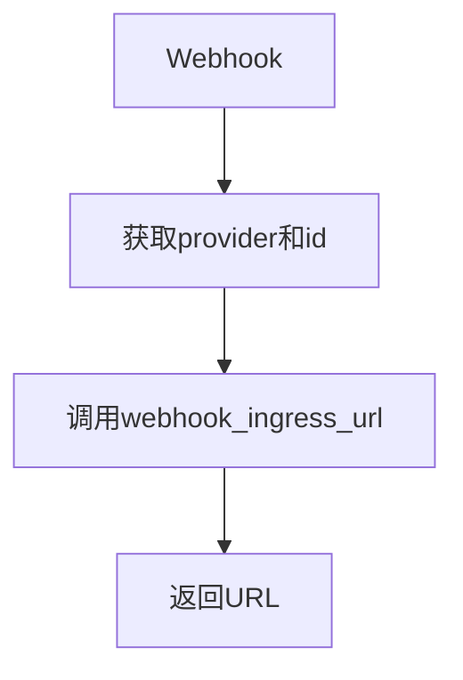
```mermaid
graph TD
    A[Webhook] --> B[获取provider和id]
    B --> C[调用webhook_ingress_url]
    C --> D[返回URL]
```

#### 带注释源码

```python
    @computed_field
    @property
    def url(self) -> str:
        return webhook_ingress_url(self.provider, self.id)
```


### WebhookWithRelations.from_db

This method converts an `IntegrationWebhook` object from the database into a `WebhookWithRelations` object, including related nodes and presets.

参数：

- `webhook`：`IntegrationWebhook`，The webhook object fetched from the database.

返回值：`WebhookWithRelations`，The webhook object with related nodes and presets.

#### 流程图

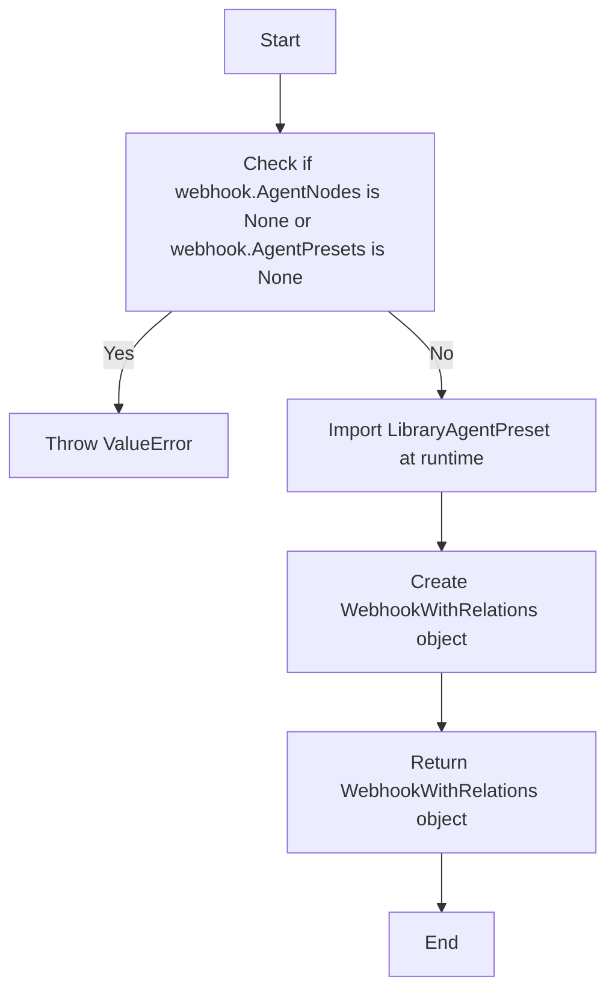
```mermaid
graph TD
    A[Start] --> B[Check if webhook.AgentNodes is None or webhook.AgentPresets is None]
    B -->|Yes| C[Throw ValueError]
    B -->|No| D[Import LibraryAgentPreset at runtime]
    D --> E[Create WebhookWithRelations object]
    E --> F[Return WebhookWithRelations object]
    F --> G[End]
```

#### 带注释源码

```python
@staticmethod
def from_db(webhook: IntegrationWebhook):
    if webhook.AgentNodes is None or webhook.AgentPresets is None:
        raise ValueError(
            "AgentNodes and AgentPresets must be included in "
            "IntegrationWebhook query with relations"
        )
    # LibraryAgentPreset import is moved to TYPE_CHECKING to avoid circular import:
    # integrations.py → library/model.py → integrations.py (for Webhook)
    # Runtime import is used in WebhookWithRelations.from_db() method instead
    # Import at runtime to avoid circular dependency
    from backend.api.features.library.model import LibraryAgentPreset

    return WebhookWithRelations(
        **Webhook.from_db(webhook).model_dump(),
        triggered_nodes=[NodeModel.from_db(node) for node in webhook.AgentNodes],
        triggered_presets=[
            LibraryAgentPreset.from_db(preset) for preset in webhook.AgentPresets
        ],
    )
```


### `WebhookEventBus.publish_event`

Publishes a webhook event to the event bus.

参数：

- `event`：`WebhookEvent`，The event to be published. It should be an instance of `WebhookEvent`.

返回值：`None`，No return value is expected.

#### 流程图

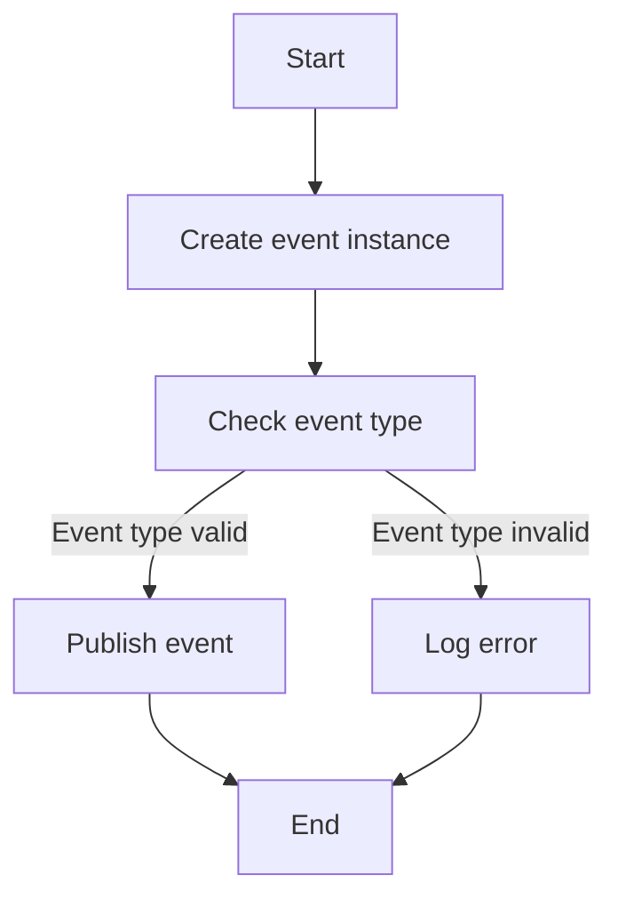
```mermaid
graph TD
    A[Start] --> B[Create event instance]
    B --> C[Check event type]
    C -->|Event type valid| D[Publish event]
    D --> E[End]
    C -->|Event type invalid| F[Log error]
    F --> E
```

#### 带注释源码

```python
async def publish_webhook_event(event: WebhookEvent):
    await _webhook_event_bus.publish_event(
        event, f"{event.webhook_id}/{event.event_type}"
    )
```


### listen_for_webhook_events

Listen for webhook events from the event bus.

参数：

- `webhook_id`：`str`，The ID of the webhook to listen for events from.
- `event_type`：`Optional[str]`，The type of event to listen for. If not provided, listens for all events.

返回值：`AsyncGenerator[WebhookEvent, None]`，An asynchronous generator that yields `WebhookEvent` objects.

#### 流程图


```mermaid
graph TD
    A[Start] --> B[Listen for events]
    B --> C{Yield event}
    C --> B
    B --> D[End]
```

#### 带注释源码

```python
async def listen_for_webhook_events(
    webhook_id: str, event_type: Optional[str] = None
) -> AsyncGenerator[WebhookEvent, None]:
    async for event in _webhook_event_bus.listen_events(
        f"{webhook_id}/{event_type or '*'}"
    ):
        yield event
```


### `WebhookEventBus.wait_for_event`

等待特定 webhook 事件的发生。

参数：

- `webhook_id`：`str`，webhook 的 ID。
- `event_type`：`Optional[str]`，可选的事件类型，如果未指定，则等待所有事件类型。
- `timeout`：`Optional[float]`，可选的超时时间，单位为秒。

返回值：`WebhookEvent` 或 `None`，如果超时或未收到事件，则返回 `None`。

#### 流程图

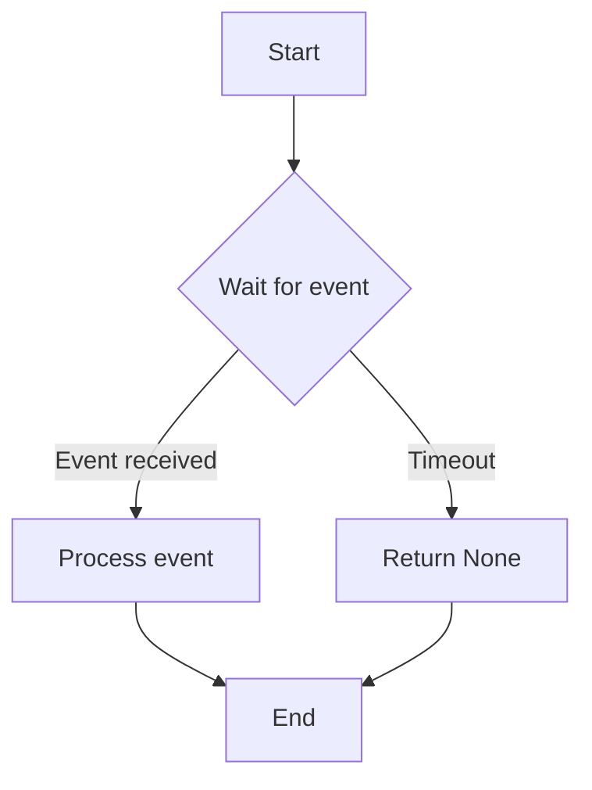
```mermaid
graph TD
    A[Start] --> B{Wait for event}
    B -->|Event received| C[Process event]
    B -->|Timeout| D[Return None]
    C --> E[End]
    D --> E
```

#### 带注释源码

```python
async def wait_for_webhook_event(
    webhook_id: str, event_type: Optional[str] = None, timeout: Optional[float] = None
) -> WebhookEvent | None:
    return await _webhook_event_bus.wait_for_event(
        f"{webhook_id}/{event_type or '*'}", timeout
    )
```


## 关键组件


### 张量索引与惰性加载

张量索引与惰性加载是代码中用于高效处理大型数据集的关键组件，通过延迟加载和索引优化，减少内存消耗并提高查询效率。

### 反量化支持

反量化支持是代码中用于处理量化数据的关键组件，它允许对量化数据进行反量化处理，以便于进一步的分析和操作。

### 量化策略

量化策略是代码中用于优化数据存储和传输效率的关键组件，通过量化数据，减少数据大小并提高处理速度。


## 问题及建议


### 已知问题

-   **循环依赖**: 代码中存在循环依赖问题，例如 `integrations.py` 依赖于 `library/model.py`，而 `library/model.py` 又依赖于 `integrations.py`。这可能导致模块加载失败或运行时错误。
-   **类型检查**: `TYPE_CHECKING` 用于避免循环依赖，但在实际运行时，某些类型检查可能不会生效，这可能导致运行时错误。
-   **错误处理**: 代码中存在一些潜在的未处理异常，例如在 `get_webhook` 和 `get_all_webhooks_by_creds` 函数中，如果查询结果为空，则抛出 `NotFoundError`。但在某些情况下，可能需要更精细的错误处理。
-   **代码重复**: `get_webhook` 和 `get_all_webhooks_by_creds` 函数中存在重复的代码，可以考虑提取公共逻辑以减少代码重复。

### 优化建议

-   **解决循环依赖**: 考虑重构代码，以消除循环依赖，例如通过将共享逻辑提取到单独的模块中。
-   **增强类型检查**: 在实际运行时，确保类型检查是有效的，或者使用其他方法来处理类型错误。
-   **改进错误处理**: 在可能的情况下，提供更详细的错误信息，并考虑使用自定义异常来处理特定类型的错误。
-   **减少代码重复**: 通过提取公共逻辑到单独的函数或类中，减少代码重复，提高代码的可维护性。
-   **异步代码优化**: 检查异步代码的性能，确保没有不必要的阻塞操作，并考虑使用更高效的异步库。
-   **日志记录**: 增强日志记录，以便在出现问题时更容易进行调试和问题追踪。
-   **单元测试**: 编写单元测试来覆盖关键功能，确保代码的质量和稳定性。


## 其它


### 设计目标与约束

- 设计目标：
  - 提供一个模块化的Webhook管理服务，支持创建、检索、更新和删除Webhook。
  - 支持与外部系统集成，通过Webhook接收和处理事件。
  - 确保数据的一致性和安全性。
  - 提供异步处理能力，以支持高并发场景。

- 约束：
  - 必须使用Prisma ORM进行数据库操作。
  - 必须使用Redis作为事件总线。
  - 必须遵循RESTful API设计原则。
  - 必须处理潜在的数据一致性和并发问题。

### 错误处理与异常设计

- 错误处理：
  - 使用自定义异常类`NotFoundError`来处理未找到的资源。
  - 使用`ValueError`来处理无效的输入参数。
  - 使用`Exception`来处理其他未预料的错误。

- 异常设计：
  - 异常应该提供足够的信息，以便开发者能够快速定位和解决问题。
  - 异常应该遵循PEP 8编码规范。

### 数据流与状态机

- 数据流：
  - 数据流从用户请求开始，经过一系列的处理步骤，最终返回响应。
  - 数据流包括数据库操作、事件发布和监听等。

- 状态机：
  - Webhook的状态可能包括创建、激活、禁用和删除等。
  - 状态机用于管理Webhook的生命周期。

### 外部依赖与接口契约

- 外部依赖：
  - Prisma ORM
  - Redis
  - Pydantic
  - AsyncRedisEventBus

- 接口契约：
  - API接口应该遵循RESTful设计原则。
  - 接口应该提供清晰的文档，包括请求和响应格式。
  - 接口应该支持异步调用。


    