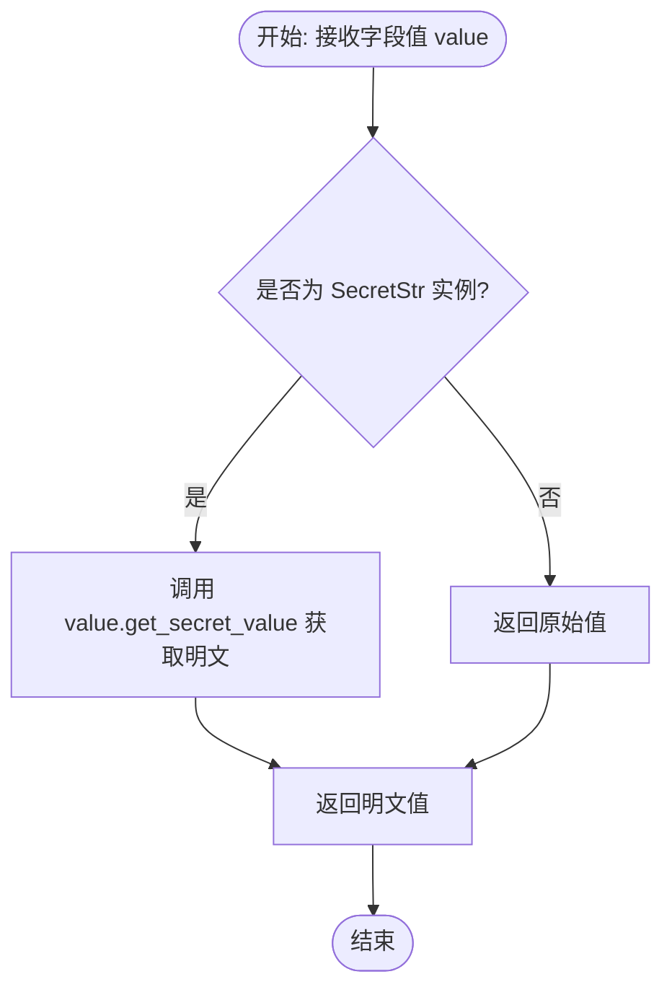

# `.\AutoGPT\autogpt_platform\backend\backend\data\model.py` 详细设计文档

该文件定义了应用层的数据模型与架构，涵盖了用户管理、多类型集成凭证处理（OAuth2、API Key、密码、主机范围）、执行统计监控、交易记录以及用户引导流程。

## 整体流程


## 类结构

```
BaseModel (Pydantic)
├── User
├── _BaseCredentials
│   ├── OAuth2Credentials
│   ├── APIKeyCredentials
│   ├── UserPasswordCredentials
│   └── HostScopedCredentials
├── OAuthState
├── UserMetadata
├── UserIntegrations
│   └── ManagedCredentials
├── CredentialsMetaInput
├── CredentialsFieldInfo
├── ContributorDetails
├── AutoTopUpConfig
├── UserTransaction
├── TransactionHistory
├── RefundRequest
├── NodeExecutionStats
├── GraphExecutionStats
├── UserExecutionSummaryStats
└── UserOnboarding
BlockSecret (Custom Type)
TopUpType (Enum)
```

## 全局变量及字段


### `AnyProviderName`
    
Type alias for any provider name (including custom ones)

类型：`str`
    


### `USER_TIMEZONE_NOT_SET`
    
Constant value representing that a user has not set their timezone

类型：`str`
    


### `T`
    
Generic type variable

类型：`TypeVar`
    


### `CP`
    
Type variable bound to ProviderName

类型：`TypeVar`
    


### `CT`
    
Type variable bound to CredentialsType

类型：`TypeVar`
    


### `logger`
    
Logger instance for the current module

类型：`logging.Logger`
    


### `Credentials`
    
Union type representing all supported credential formats

类型：`Union[OAuth2Credentials, APIKeyCredentials, UserPasswordCredentials, HostScopedCredentials]`
    


### `CredentialsType`
    
Literal type defining allowed credential types: 'api_key', 'oauth2', 'user_password', 'host_scoped'

类型：`Literal`
    


### `User.id`
    
User ID

类型：`str`
    


### `User.email`
    
User email address

类型：`str`
    


### `User.email_verified`
    
Whether email is verified

类型：`bool`
    


### `User.name`
    
User display name

类型：`Optional[str]`
    


### `User.created_at`
    
When user was created

类型：`datetime`
    


### `User.updated_at`
    
When user was last updated

类型：`datetime`
    


### `User.metadata`
    
User metadata as dict

类型：`dict[str, Any]`
    


### `User.integrations`
    
Encrypted integrations data

类型：`str`
    


### `User.stripe_customer_id`
    
Stripe customer ID

类型：`Optional[str]`
    


### `User.top_up_config`
    
Top up configuration

类型：`Optional[AutoTopUpConfig]`
    


### `User.max_emails_per_day`
    
Maximum emails per day

类型：`int`
    


### `User.notify_on_agent_run`
    
Notify on agent run

类型：`bool`
    


### `User.notify_on_zero_balance`
    
Notify on zero balance

类型：`bool`
    


### `User.notify_on_low_balance`
    
Notify on low balance

类型：`bool`
    


### `User.notify_on_block_execution_failed`
    
Notify on block execution failure

类型：`bool`
    


### `User.notify_on_continuous_agent_error`
    
Notify on continuous agent error

类型：`bool`
    


### `User.notify_on_daily_summary`
    
Notify on daily summary

类型：`bool`
    


### `User.notify_on_weekly_summary`
    
Notify on weekly summary

类型：`bool`
    


### `User.notify_on_monthly_summary`
    
Notify on monthly summary

类型：`bool`
    


### `User.timezone`
    
User timezone (IANA timezone identifier or 'not-set')

类型：`str`
    


### `BlockSecret._value`
    
The actual secret string value stored privately

类型：`str`
    


### `BlockSecret.TRIMMING_VALUE_MSG`
    
Class variable message indicating a secret value was trimmed

类型：`str`
    


### `BlockSecret.STR`
    
Class variable string representation for the secret

类型：`str`
    


### `BlockSecret.SECRETS`
    
Class variable instance of Secrets settings

类型：`Secrets`
    


### `_BaseCredentials.id`
    
Unique identifier for the credentials

类型：`str`
    


### `_BaseCredentials.provider`
    
The name of the provider (e.g., 'openai', 'google')

类型：`str`
    


### `_BaseCredentials.title`
    
Optional title for the credentials

类型：`Optional[str]`
    


### `OAuth2Credentials.type`
    
Discriminator for the credential type

类型：`Literal['oauth2']`
    


### `OAuth2Credentials.username`
    
Username of the third-party service user

类型：`Optional[str]`
    


### `OAuth2Credentials.access_token`
    
The OAuth2 access token

类型：`SecretStr`
    


### `OAuth2Credentials.access_token_expires_at`
    
Unix timestamp (seconds) indicating when the access token expires

类型：`Optional[int]`
    


### `OAuth2Credentials.refresh_token`
    
The OAuth2 refresh token

类型：`Optional[SecretStr]`
    


### `OAuth2Credentials.refresh_token_expires_at`
    
Unix timestamp (seconds) indicating when the refresh token expires

类型：`Optional[int]`
    


### `OAuth2Credentials.scopes`
    
List of OAuth scopes granted

类型：`list[str]`
    


### `OAuth2Credentials.metadata`
    
Additional metadata for the credentials

类型：`dict[str, Any]`
    


### `APIKeyCredentials.type`
    
Discriminator for the credential type

类型：`Literal['api_key']`
    


### `APIKeyCredentials.api_key`
    
The API key string

类型：`SecretStr`
    


### `APIKeyCredentials.expires_at`
    
Unix timestamp (seconds) indicating when the API key expires

类型：`Optional[int]`
    


### `UserPasswordCredentials.type`
    
Discriminator for the credential type

类型：`Literal['user_password']`
    


### `UserPasswordCredentials.username`
    
The username

类型：`SecretStr`
    


### `UserPasswordCredentials.password`
    
The password

类型：`SecretStr`
    


### `HostScopedCredentials.type`
    
Discriminator for the credential type

类型：`Literal['host_scoped']`
    


### `HostScopedCredentials.host`
    
The host/URI pattern to match against request URLs

类型：`str`
    


### `HostScopedCredentials.headers`
    
Key-value header map to add to matching requests

类型：`dict[str, SecretStr]`
    


### `OAuthState.token`
    
The unique state token for the OAuth flow

类型：`str`
    


### `OAuthState.provider`
    
The provider name for the OAuth flow

类型：`str`
    


### `OAuthState.expires_at`
    
Unix timestamp (seconds) indicating when this OAuth state expires

类型：`int`
    


### `OAuthState.code_verifier`
    
PKCE code verifier for the OAuth flow

类型：`Optional[str]`
    


### `OAuthState.scopes`
    
List of scopes requested in the OAuth flow

类型：`list[str]`
    


### `OAuthState.callback_url`
    
External app's callback URL for OAuth redirect

类型：`Optional[str]`
    


### `OAuthState.state_metadata`
    
Metadata to echo back to external app on completion

类型：`dict[str, Any]`
    


### `OAuthState.initiated_by_api_key_id`
    
ID of the API key that initiated this OAuth flow

类型：`Optional[str]`
    


### `UserMetadata.integration_credentials`
    
Deprecated; list of integration credentials

类型：`list[Credentials]`
    


### `UserMetadata.integration_oauth_states`
    
Deprecated; list of OAuth states

类型：`list[OAuthState]`
    


### `UserIntegrations.ManagedCredentials.ayrshare_profile_key`
    
Ayrshare profile key for managed integrations

类型：`Optional[SecretStr]`
    


### `UserIntegrations.managed_credentials`
    
Integration credentials managed by the application

类型：`UserIntegrations.ManagedCredentials`
    


### `UserIntegrations.credentials`
    
List of user-defined integration credentials

类型：`list[Credentials]`
    


### `UserIntegrations.oauth_states`
    
List of ongoing OAuth states

类型：`list[OAuthState]`
    


### `CredentialsMetaInput.id`
    
The ID of the credential

类型：`str`
    


### `CredentialsMetaInput.title`
    
The title of the credential

类型：`Optional[str]`
    


### `CredentialsMetaInput.provider`
    
The provider name for the credential

类型：`CP`
    


### `CredentialsMetaInput.type`
    
The type of the credential

类型：`CT`
    


### `CredentialsFieldInfo.provider`
    
A frozenset of supported providers

类型：`frozenset[CP]`
    


### `CredentialsFieldInfo.supported_types`
    
A frozenset of supported credential types

类型：`frozenset[CT]`
    


### `CredentialsFieldInfo.required_scopes`
    
A frozenset of required OAuth scopes

类型：`Optional[frozenset[str]]`
    


### `CredentialsFieldInfo.discriminator`
    
Field name used for discriminating between providers/types

类型：`Optional[str]`
    


### `CredentialsFieldInfo.discriminator_mapping`
    
Mapping of discriminator values to specific providers

类型：`Optional[dict[str, CP]]`
    


### `CredentialsFieldInfo.discriminator_values`
    
Set of possible discriminator values

类型：`set[Any]`
    


### `ContributorDetails.name`
    
The name of the contributor

类型：`str`
    


### `AutoTopUpConfig.amount`
    
Amount of credits to top up

类型：`int`
    


### `AutoTopUpConfig.threshold`
    
Threshold to trigger auto top up

类型：`int`
    


### `UserTransaction.transaction_key`
    
Unique key for the transaction

类型：`str`
    


### `UserTransaction.transaction_time`
    
Timestamp of the transaction

类型：`datetime`
    


### `UserTransaction.transaction_type`
    
Type of credit transaction (e.g., USAGE, TOP_UP)

类型：`CreditTransactionType`
    


### `UserTransaction.amount`
    
Amount of credits in the transaction

类型：`int`
    


### `UserTransaction.running_balance`
    
Balance after the transaction was applied

类型：`int`
    


### `UserTransaction.current_balance`
    
Current user balance at the time of record

类型：`int`
    


### `UserTransaction.description`
    
Optional description of the transaction

类型：`str | None`
    


### `UserTransaction.usage_graph_id`
    
ID of the graph associated with usage

类型：`str | None`
    


### `UserTransaction.usage_execution_id`
    
ID of the execution associated with usage

类型：`str | None`
    


### `UserTransaction.usage_node_count`
    
Number of nodes run in the usage execution

类型：`int`
    


### `UserTransaction.usage_start_time`
    
Start time of the usage execution

类型：`datetime`
    


### `UserTransaction.user_id`
    
ID of the user involved in the transaction

类型：`str`
    


### `UserTransaction.user_email`
    
Email of the user involved

类型：`str | None`
    


### `UserTransaction.reason`
    
Reason for the transaction

类型：`str | None`
    


### `UserTransaction.admin_email`
    
Admin email associated with the transaction

类型：`str | None`
    


### `UserTransaction.extra_data`
    
Any extra serialized data

类型：`str | None`
    


### `TransactionHistory.transactions`
    
List of user transactions

类型：`list[UserTransaction]`
    


### `TransactionHistory.next_transaction_time`
    
Timestamp for the next transaction if applicable

类型：`datetime | None`
    


### `RefundRequest.id`
    
Unique ID of the refund request

类型：`str`
    


### `RefundRequest.user_id`
    
ID of the user requesting the refund

类型：`str`
    


### `RefundRequest.transaction_key`
    
Key of the transaction to be refunded

类型：`str`
    


### `RefundRequest.amount`
    
Amount to refund

类型：`int`
    


### `RefundRequest.reason`
    
Reason for the refund

类型：`str`
    


### `RefundRequest.result`
    
Result of the refund process

类型：`str | None`
    


### `RefundRequest.status`
    
Status of the refund request

类型：`str`
    


### `RefundRequest.created_at`
    
When the refund request was created

类型：`datetime`
    


### `RefundRequest.updated_at`
    
When the refund request was last updated

类型：`datetime`
    


### `NodeExecutionStats.error`
    
Error encountered during execution, if any

类型：`Optional[BaseException | str]`
    


### `NodeExecutionStats.walltime`
    
Total wall clock time in seconds

类型：`float`
    


### `NodeExecutionStats.cputime`
    
Total CPU time in seconds

类型：`float`
    


### `NodeExecutionStats.input_size`
    
Size of input data

类型：`int`
    


### `NodeExecutionStats.output_size`
    
Size of output data

类型：`int`
    


### `NodeExecutionStats.llm_call_count`
    
Number of LLM calls made

类型：`int`
    


### `NodeExecutionStats.llm_retry_count`
    
Number of LLM retries performed

类型：`int`
    


### `NodeExecutionStats.input_token_count`
    
Number of input tokens consumed

类型：`int`
    


### `NodeExecutionStats.output_token_count`
    
Number of output tokens generated

类型：`int`
    


### `NodeExecutionStats.extra_cost`
    
Extra cost incurred in cents

类型：`int`
    


### `NodeExecutionStats.extra_steps`
    
Count of extra execution steps

类型：`int`
    


### `NodeExecutionStats.cleared_inputs`
    
Inputs that were cleared by moderation

类型：`Optional[dict[str, list[str]]]`
    


### `NodeExecutionStats.cleared_outputs`
    
Outputs that were cleared by moderation

类型：`Optional[dict[str, list[str]]]`
    


### `GraphExecutionStats.error`
    
Error encountered during graph execution

类型：`Optional[Exception | str]`
    


### `GraphExecutionStats.walltime`
    
Total time between start and end of run (seconds)

类型：`float`
    


### `GraphExecutionStats.cputime`
    
Total CPU time used (seconds)

类型：`float`
    


### `GraphExecutionStats.nodes_walltime`
    
Total node execution time (seconds)

类型：`float`
    


### `GraphExecutionStats.nodes_cputime`
    
Total node CPU time (seconds)

类型：`float`
    


### `GraphExecutionStats.node_count`
    
Total number of node executions

类型：`int`
    


### `GraphExecutionStats.node_error_count`
    
Total number of errors generated

类型：`int`
    


### `GraphExecutionStats.cost`
    
Total execution cost in cents

类型：`int`
    


### `GraphExecutionStats.activity_status`
    
AI-generated summary of what the agent did

类型：`Optional[str]`
    


### `GraphExecutionStats.correctness_score`
    
AI-generated score (0.0-1.0) indicating execution correctness

类型：`Optional[float]`
    


### `UserExecutionSummaryStats.total_credits_used`
    
Total credits used by the user

类型：`float`
    


### `UserExecutionSummaryStats.total_executions`
    
Total number of executions

类型：`int`
    


### `UserExecutionSummaryStats.successful_runs`
    
Number of successful runs

类型：`int`
    


### `UserExecutionSummaryStats.failed_runs`
    
Number of failed runs

类型：`int`
    


### `UserExecutionSummaryStats.most_used_agent`
    
Identifier of the most used agent

类型：`str`
    


### `UserExecutionSummaryStats.total_execution_time`
    
Total time spent in executions

类型：`float`
    


### `UserExecutionSummaryStats.average_execution_time`
    
Average time per execution

类型：`float`
    


### `UserExecutionSummaryStats.cost_breakdown`
    
Breakdown of costs by category

类型：`dict[str, float]`
    


### `UserOnboarding.userId`
    
User ID associated with the onboarding process

类型：`str`
    


### `UserOnboarding.completedSteps`
    
List of onboarding steps completed by the user

类型：`list[OnboardingStep]`
    


### `UserOnboarding.walletShown`
    
Flag indicating if the wallet UI has been shown

类型：`bool`
    


### `UserOnboarding.notified`
    
List of steps the user has been notified about

类型：`list[OnboardingStep]`
    


### `UserOnboarding.rewardedFor`
    
List of steps for which the user received rewards

类型：`list[OnboardingStep]`
    


### `UserOnboarding.usageReason`
    
User's stated reason for using the platform

类型：`Optional[str]`
    


### `UserOnboarding.integrations`
    
List of integrations set up during onboarding

类型：`list[str]`
    


### `UserOnboarding.otherIntegrations`
    
Text field for other integrations not listed

类型：`Optional[str]`
    


### `UserOnboarding.selectedStoreListingVersionId`
    
ID of the selected store listing version

类型：`Optional[str]`
    


### `UserOnboarding.agentInput`
    
Input provided for the onboarding agent

类型：`Optional[dict[str, Any]]`
    


### `UserOnboarding.onboardingAgentExecutionId`
    
Execution ID of the onboarding agent run

类型：`Optional[str]`
    


### `UserOnboarding.agentRuns`
    
Number of agent runs performed by the user

类型：`int`
    


### `UserOnboarding.lastRunAt`
    
Timestamp of the last agent run

类型：`Optional[datetime]`
    


### `UserOnboarding.consecutiveRunDays`
    
Number of consecutive days the user has run an agent

类型：`int`
    
    

## 全局函数及方法


### `SecretField`

创建一个封装 `BlockSecret` 的 Pydantic 字段，用于安全处理敏感数据，支持通过键或直接值获取，并附加额外的元数据（标题、描述等）标记为机密状态。

参数：

-  `value`：`Optional[str]`，机密的直接字符串值。
-  `key`：`Optional[str]`，用于从环境设置中检索机密值的键。
-  `title`：`Optional[str]`，字段的标题。
-  `description`：`Optional[str]`，字段的描述信息。
-  `placeholder`：`Optional[str]`，UI占位符文本。
-  `**kwargs`：`dict`，传递给 `SchemaField` 的额外关键字参数。

返回值：`BlockSecret`，配置好的 Pydantic 字段对象，封装了机密处理逻辑。

#### 流程图


#### 带注释源码

```python
def SecretField(
    value: Optional[str] = None,
    key: Optional[str] = None,
    title: Optional[str] = None,
    description: Optional[str] = None,
    placeholder: Optional[str] = None,
    **kwargs,
) -> BlockSecret:
    # 实例化 BlockSecret 对象，封装机密值的获取逻辑（直接值或通过Key查找）
    secret = BlockSecret(key=key, value=value)
    
    # 调用 SchemaField 构造函数，创建包含额外元数据的 Pydantic 字段
    return SchemaField(
        secret,              # 传入 BlockSecret 实例作为默认值
        title=title,         # 字段标题
        description=description, # 字段描述
        placeholder=placeholder, # UI 占位符
        secret=True,         # 标记为机密字段
        **kwargs,            # 传递其他任意 Pydantic Field 参数
    )
```


### `SchemaField`

这是一个自定义的 Pydantic 字段工厂函数，用于扩展标准的 Pydantic `Field` 功能。它允许在字段定义中注入额外的元数据（如 UI 占位符、高级设置标志、隐藏状态、依赖关系等），这些元数据通常用于自动生成前端表单或配置架构。该函数还会根据是否提供默认值自动推断字段是否为“高级”选项。

参数：

-  `default`：`T | PydanticUndefinedType`，字段的默认值。
-  `*args`：`Any`，传递给底层 Pydantic `Field` 的额外位置参数。
-  `default_factory`：`Optional[Callable[[], T]]`，用于生成默认值的可调用对象。
-  `title`：`Optional[str]`，字段的标题。
-  `description`：`Optional[str]`，字段的描述文本。
-  `placeholder`：`Optional[str]`，UI 输入框的占位符文本。
-  `advanced`：`Optional[bool]`，标记该字段是否为高级设置。如果未提供，则根据是否有默认值自动判断（有默认值视为高级）。
-  `secret`：`bool`，标记该字段是否包含敏感信息（如密码、密钥）。
-  `exclude`：`bool`，标记是否在序列化时排除该字段。
-  `hidden`：`Optional[bool]`，标记是否在 UI 中隐藏该字段。
-  `depends_on`：`Optional[list[str]]`，该字段依赖的其他字段名称列表（用于条件显示逻辑）。
-  `ge`：`Optional[float]`，数值约束：大于等于。
-  `le`：`Optional[float]`，数值约束：小于等于。
-  `min_length`：`Optional[int]`，字符串或集合约束：最小长度。
-  `max_length`：`Optional[int]`，字符串或集合约束：最大长度。
-  `discriminator`：`Optional[str]`，用于区分多态类型的字段名。
-  `format`：`Optional[str]`，字段的格式说明（如 date-time, email 等）。
-  `json_schema_extra`：`Optional[dict[str, Any]]`，额外的 JSON Schema 属性。

返回值：`T`，实际上返回一个 Pydantic `FieldInfo` 实例，用于模型字段定义。

#### 流程图


#### 带注释源码

```python
def SchemaField(
    default: T | PydanticUndefinedType = PydanticUndefined,
    *args,
    default_factory: Optional[Callable[[], T]] = None,
    title: Optional[str] = None,
    description: Optional[str] = None,
    placeholder: Optional[str] = None,
    advanced: Optional[bool] = None,
    secret: bool = False,
    exclude: bool = False,
    hidden: Optional[bool] = None,
    depends_on: Optional[list[str]] = None,
    ge: Optional[float] = None,
    le: Optional[float] = None,
    min_length: Optional[int] = None,
    max_length: Optional[int] = None,
    discriminator: Optional[str] = None,
    format: Optional[str] = None,
    json_schema_extra: Optional[dict[str, Any]] = None,
) -> T:
    # 如果既没有提供默认值也没有提供工厂函数，则自动将 advanced 设置为 False
    if default is PydanticUndefined and default_factory is None:
        advanced = False
    # 如果没有显式指定 advanced，则默认为 True (通常意味着该字段是可选配置)
    elif advanced is None:
        advanced = True

    # 构建额外的 JSON Schema 元数据字典
    # 将本函数特有的元数据（placeholder, secret 等）与用户传入的 json_schema_extra 合并
    # 并过滤掉值为 None 的项，以保持 Schema 清洁
    json_schema_extra = {
        k: v
        for k, v in {
            "placeholder": placeholder,
            "secret": secret,
            "advanced": advanced,
            "hidden": hidden,
            "depends_on": depends_on,
            "format": format,
            **(json_schema_extra or {}), # 合并外部传入的额外属性
        }.items()
        if v is not None
    }

    # 调用 Pydantic 的 Field 函数生成并返回字段对象
    # type: ignore 用于忽略类型检查器的潜在警告，因为返回类型 T 是泛型，实际返回的是 FieldInfo
    return Field(
        default,
        *args,
        default_factory=default_factory,
        title=title,
        description=description,
        exclude=exclude,
        ge=ge,
        le=le,
        min_length=min_length,
        max_length=max_length,
        discriminator=discriminator,
        json_schema_extra=json_schema_extra,
    )  # type: ignore
```


### `is_credentials_field_name`

判断给定的字段名称是否属于凭证类型字段。该函数通过检查字段名是否完全等于 "credentials" 或者以 "_credentials" 结尾来确定其是否为凭证字段。

参数：

- `field_name`：`str`，待检查的字段名称字符串。

返回值：`bool`，如果字段名匹配凭证命名规则返回 `True`，否则返回 `False`。

#### 流程图

```mermaid
flowchart TD
    A[开始: 接收 field_name] --> B{field_name == 'credentials'?}
    B -- 是 --> C[返回 True]
    B -- 否 --> D{field_name.endswith<br>('_credentials')?}
    D -- 是 --> C
    D -- 否 --> E[返回 False]
    C --> F[结束]
    E --> F
```

#### 带注释源码

```python
def is_credentials_field_name(field_name: str) -> bool:
    # 检查字段名是否完全等于 "credentials" 
    # 或者以 "_credentials" 结尾（例如 "openai_credentials"）
    return field_name == "credentials" or field_name.endswith("_credentials")
```


### `_extract_host_from_url`

该函数用于从提供的 URL 字符串中提取主机名和端口号，主要用于匹配和分组具有主机范围的凭据。如果解析失败，则回退到返回原始 URL（或空字符串）和 None。

参数：

-   `url`：`str`，待解析的 URL 字符串。

返回值：`tuple[str, int | None]`，包含主机名（如果解析失败或主机名为空，则为原始 URL 或空字符串）和端口号（如果没有指定端口则为 None）的元组。

#### 流程图


#### 带注释源码

```python
def _extract_host_from_url(url: str) -> tuple[str, int | None]:
    """Extract host and port from URL for grouping host-scoped credentials."""
    try:
        # 使用工具函数解析 URL
        parsed = parse_url(url)
        # 返回主机名（如果解析失败则返回原始 URL）和端口号
        return parsed.hostname or url, parsed.port
    except Exception:
        # 捕获所有异常（例如格式无效），返回空值表示无法提取有效主机信息
        return "", None
```


### `CredentialsField`

`CredentialsField` 是一个辅助函数，用于生成专门用于处理凭据信息的 Pydantic 字段。它必须且只能用于名为 `credentials` 的字段上（由 `BlockSchema` 基类强制执行）。该函数允许定义必需的范围、鉴别器以及其他元数据，这些元数据将被添加到 JSON Schema 的额外信息中。

参数：

-  `required_scopes`：`set[str]`，凭据所需的 OAuth 范围集合，默认为空集合。
-  `discriminator`：`Optional[str]`，用于多态凭据类型的鉴别器字段名称，默认为 `None`。
-  `discriminator_mapping`：`Optional[dict[str, Any]]`，鉴别器值到特定类型或提供者的映射，默认为 `None`。
-  `discriminator_values`：`Optional[set[Any]]`，鉴别器允许的值集合，默认为 `None`。
-  `title`：`Optional[str]`，字段的标题，默认为 `None`。
-  `description`：`Optional[str]`，字段的描述文本，默认为 `None`。
-  `**kwargs`：其他关键字参数，将传递给底层的 `Field` 构造函数。

返回值：`CredentialsMetaInput`（注：函数签名定义的类型，实际返回 Pydantic 的 `FieldInfo` 对象），包含凭据元数据配置的 Pydantic 字段对象。

#### 流程图


#### 带注释源码

```python
def CredentialsField(
    required_scopes: set[str] = set(),
    *,
    discriminator: Optional[str] = None,
    discriminator_mapping: Optional[dict[str, Any]] = None,
    discriminator_values: Optional[set[Any]] = None,
    title: Optional[str] = None,
    description: Optional[str] = None,
    **kwargs,
) -> CredentialsMetaInput:
    """
    `CredentialsField` must and can only be used on fields named `credentials`.
    This is enforced by the `BlockSchema` base class.
    """

    # 构建额外的 JSON Schema 字典，过滤掉值为 None 的项
    field_schema_extra = {
        k: v
        for k, v in {
            "credentials_scopes": list(required_scopes) or None,  # 将 set 转换为 list
            "discriminator": discriminator,
            "discriminator_mapping": discriminator_mapping,
            "discriminator_values": discriminator_values,
        }.items()
        if v is not None
    }

    # 如果在 kwargs 中传入了 json_schema_extra，则将其合并到 field_schema_extra 中
    if "json_schema_extra" in kwargs:
        extra_schema = kwargs.pop("json_schema_extra")
        field_schema_extra.update(extra_schema)

    # 返回 Pydantic Field 对象，将构建好的元数据放入 json_schema_extra 中
    return Field(
        title=title,
        description=description,
        json_schema_extra=field_schema_extra,  # 这里的元数据将在 BlockSchema 初始化时被验证
        **kwargs,
    )
```


### `User.from_db`

该方法是一个类方法，用于将数据库层的 `PrismaUser` 对象转换为应用层的 `User` 模型实例。它处理了字段映射（例如从数据库的驼峰命名转为应用的蛇形命名）、数据清洗（如 JSON 字符串的解析与验证），并为可选字段提供了默认值。

参数：

- `prisma_user`：`"PrismaUser"`，数据库层返回的用户对象，包含原始数据。

返回值：`"User"`，转换后的应用层 User 模型实例。

#### 流程图


#### 带注释源码

```python
    @classmethod
    def from_db(cls, prisma_user: "PrismaUser") -> "User":
        """Convert a database User object to application User model."""
        # 初始化 metadata 字典
        metadata = {}
        # 检查数据库对象中是否存在 metadata
        if prisma_user.metadata:
            # 如果 metadata 是字符串，尝试解析为 JSON
            if isinstance(prisma_user.metadata, str):
                try:
                    metadata = json_loads(prisma_user.metadata)
                except (JSONDecodeError, TypeError):
                    # 解析失败则保持为空字典
                    metadata = {}
            # 如果 metadata 已经是字典，直接使用
            elif isinstance(prisma_user.metadata, dict):
                metadata = prisma_user.metadata

        # 初始化 top_up_config 为 None
        top_up_config = None
        # 检查数据库对象中是否存在 topUpConfig
        if prisma_user.topUpConfig:
            # 如果 topUpConfig 是字符串，尝试解析并验证为 AutoTopUpConfig 模型
            if isinstance(prisma_user.topUpConfig, str):
                try:
                    config_dict = json_loads(prisma_user.topUpConfig)
                    top_up_config = AutoTopUpConfig.model_validate(config_dict)
                except (JSONDecodeError, TypeError, ValueError):
                    # 解析或验证失败则设为 None
                    top_up_config = None
            # 如果 topUpConfig 已经是字典，尝试验证为 AutoTopUpConfig 模型
            elif isinstance(prisma_user.topUpConfig, dict):
                try:
                    top_up_config = AutoTopUpConfig.model_validate(
                        prisma_user.topUpConfig
                    )
                except ValueError:
                    # 验证失败则设为 None
                    top_up_config = None

        # 实例化 User 对象，进行字段映射和默认值处理
        return cls(
            id=prisma_user.id,
            email=prisma_user.email,
            # 如果数据库中为 None，默认为 True
            email_verified=prisma_user.emailVerified or True,
            name=prisma_user.name,
            created_at=prisma_user.createdAt,
            updated_at=prisma_user.updatedAt,
            metadata=metadata,
            # 如果数据库中为 None，默认为空字符串
            integrations=prisma_user.integrations or "",
            stripe_customer_id=prisma_user.stripeCustomerId,
            top_up_config=top_up_config,
            # 如果数据库中为 None，默认为 3
            max_emails_per_day=prisma_user.maxEmailsPerDay or 3,
            # 处理布尔字段的默认值，若为 None 则默认为 True
            notify_on_agent_run=prisma_user.notifyOnAgentRun or True,
            notify_on_zero_balance=prisma_user.notifyOnZeroBalance or True,
            notify_on_low_balance=prisma_user.notifyOnLowBalance or True,
            notify_on_block_execution_failed=prisma_user.notifyOnBlockExecutionFailed
            or True,
            notify_on_continuous_agent_error=prisma_user.notifyOnContinuousAgentError
            or True,
            notify_on_daily_summary=prisma_user.notifyOnDailySummary or True,
            notify_on_weekly_summary=prisma_user.notifyOnWeeklySummary or True,
            notify_on_monthly_summary=prisma_user.notifyOnMonthlySummary or True,
            # 如果时区未设置，使用全局默认常量
            timezone=prisma_user.timezone or USER_TIMEZONE_NOT_SET,
        )
```


### `BlockSecret.__init__`

初始化 `BlockSecret` 实例。该方法允许通过直接提供值或通过键从系统配置中检索来设置密钥。无论哪种方式，获取到的值都会经过去除前后空白符的处理。如果通过键检索且未找到密钥，将抛出异常。

参数：

- `key`：`Optional[str]`，用于从后端设置（`Secrets`）中查找密钥的标识符。如果提供了 `value`，则此参数将被忽略。
- `value`：`Optional[str]`，密钥的直接字符串值。如果提供，将优先使用此值而不是从 `key` 查找。

返回值：`None`，构造函数不返回任何值。

#### 流程图

```mermaid
graph TD
    Start([开始]) --> CheckValue{value 是否不为 None?}
    
    CheckValue -- 是 --> DirectTrim[trimmed_value = value.strip()]
    DirectTrim --> DirectCheck{value != trimmed_value?}
    DirectCheck -- 是 --> LogDirect[日志记录: 值已去除空白]
    DirectCheck -- 否 --> SetDirect
    LogDirect --> SetDirect[self._value = trimmed_value]
    SetDirect --> End([结束])
    
    CheckValue -- 否 --> GetSecret[self._value = self.__get_secret]
    GetSecret --> CheckNull{self._value 是否为 None?}
    CheckNull -- 是 --> RaiseError[抛出 ValueError: Secret key not found]
    CheckNull -- 否 --> LookupTrim[trimmed_value = self._value.strip]
    LookupTrim --> LookupCheck{self._value != trimmed_value?}
    LookupCheck -- 是 --> LogLookup[日志记录: 值已去除空白]
    LookupCheck -- 否 --> SetLookup
    LogLookup --> SetLookup[self._value = trimmed_value]
    SetLookup --> End
```

#### 带注释源码

```python
def __init__(self, key: Optional[str] = None, value: Optional[str] = None):
    # 如果直接提供了 value 参数
    if value is not None:
        # 去除值前后的空白字符
        trimmed_value = value.strip()
        # 如果原值与去空白后的值不同，记录调试日志
        if value != trimmed_value:
            logger.debug(BlockSecret.TRIMMING_VALUE_MSG)
        # 将处理后的值存储在私有变量 _value 中
        self._value = trimmed_value
        return

    # 如果未提供 value，则尝试通过 key 从环境配置中获取密钥
    self._value = self.__get_secret(key)
    # 如果获取到的值为空，说明密钥不存在，抛出异常
    if self._value is None:
        raise ValueError(f"Secret {key} not found.")
    
    # 去除获取到的值前后的空白字符
    trimmed_value = self._value.strip()
    # 如果原值与去空白后的值不同，记录调试日志
    if self._value != trimmed_value:
        logger.debug(BlockSecret.TRIMMING_VALUE_MSG)
    # 将处理后的值存储在私有变量 _value 中
    self._value = trimmed_value
```


### `BlockSecret.__repr__`

返回对象的“官方”字符串表示形式，用于隐藏实际的敏感数据，确保在打印或日志记录时不会泄露秘密值。

参数：

- `self`：`BlockSecret`，类的实例对象本身。

返回值：`str`，返回常量字符串 `"<secret>"`，作为隐藏真实值的占位符。

#### 流程图


#### 带注释源码

```python
def __repr__(self):
    # 返回类变量 BlockSecret.STR（即 "<secret>"）
    # 目的是为了防止在调试或打印对象时意外暴露敏感信息
    return BlockSecret.STR
```


### `BlockSecret.__str__`

该方法返回 `BlockSecret` 实例的字符串表示形式。为了防止敏感信息泄露，该方法不返回实际的密钥值，而是返回一个预设的占位符字符串。

参数：

- `self`：`BlockSecret`，表示类实例本身。

返回值：`str`，表示被隐藏的密钥值的占位符字符串（"<secret>"）。

#### 流程图


#### 带注释源码

```python
    def __str__(self):
        # 返回类常量 STR，即占位符字符串 "<secret>"
        # 这样在打印日志或转换为字符串时，不会暴露真实的敏感数据
        return BlockSecret.STR
```


### `BlockSecret.__get_secret`

根据给定的键从全局设置实例（`BlockSecret.SECRETS`）中检索敏感配置值，并对键的有效性和存在性进行校验。

参数：

-   `key`：`str | None`，待获取的秘密在配置对象中的属性名称。

返回值：`Optional[Any]`，如果找到对应的属性则返回其值（通常为字符串），若键无效或对象中不存在该属性则返回 `None`。

#### 流程图


#### 带注释源码

```python
    @staticmethod
    def __get_secret(key: str | None):
        # 检查 key 是否为空（None 或空字符串），或者 BlockSecret.SECRETS 对象中不存在该属性
        if not key or not hasattr(BlockSecret.SECRETS, key):
            # 如果 key 无效或属性不存在，返回 None
            return None
        # 从 BlockSecret.SECRETS 单例对象中获取并返回对应 key 的属性值
        return getattr(BlockSecret.SECRETS, key)
```


### `BlockSecret.get_secret_value`

该方法用于获取并返回存储的秘密值。它会将内部存储的值转换为字符串，去除首尾空格，并在去除了空格的情况下记录日志。

参数：

-  无

返回值：`str`，经过去除首尾空格处理的秘密值。

#### 流程图


#### 带注释源码

```python
    def get_secret_value(self):
        # 将内部存储的值转换为字符串，并去除首尾的空白字符
        trimmed_value = str(self._value).strip()
        
        # 检查去除空白后的值是否与原值不同
        # 如果不同，说明原值包含首尾空白，记录一条 Info 级别的日志
        if self._value != trimmed_value:
            logger.info(BlockSecret.TRIMMING_VALUE_MSG)
            
        # 返回经过处理（去除空白）后的值
        return trimmed_value
```


### `BlockSecret.parse_value`

该类方法用于将任意输入值解析为 `BlockSecret` 实例。它会检查输入值是否已经是 `BlockSecret` 类型，如果是则直接返回，否则将输入值作为原始字符串值来构造一个新的 `BlockSecret` 对象。

参数：

-  `value`：`Any`，待解析的输入值，可以是已有的 `BlockSecret` 实例或表示密钥的原始字符串。

返回值：`BlockSecret`，包含密钥值的 `BlockSecret` 实例。

#### 流程图


#### 带注释源码

```python
    @classmethod
    def parse_value(cls, value: Any) -> BlockSecret:
        # 检查输入的 value 是否已经是 BlockSecret 类的实例
        if isinstance(value, BlockSecret):
            # 如果是，直接返回该实例，无需处理
            return value
        
        # 如果不是，将 value 作为参数 value 传递给 BlockSecret 的构造函数，
        # 创建并返回一个新的 BlockSecret 实例
        return BlockSecret(value=value)
```


### `BlockSecret.__get_pydantic_json_schema__`

该方法用于生成 `BlockSecret` 类型的 Pydantic JSON Schema，将其在文档中定义为简单的字符串类型，以隐藏敏感值的内部结构。

参数：

- `source_type`：`Any`，需要生成 JSON Schema 的源类型。
- `handler`：`GetCoreSchemaHandler`，用于获取其他类型 Core Schema 的回调处理器。

返回值：`dict[str, Any]`，包含 JSON Schema 定义的字典，这里将类型显式指定为字符串 "string"。

#### 流程图


#### 带注释源码

```python
    @classmethod
    def __get_pydantic_json_schema__(
        cls, source_type: Any, handler: GetCoreSchemaHandler
    ) -> dict[str, Any]:
        # 返回一个简单的字典，定义该类型在 JSON Schema 中为 "string"
        # 这样在生成的 OpenAPI/JSON Schema 文档中，该字段会被显示为普通字符串，
        # 从而隐藏了其作为敏感对象的实际结构。
        return {
            "type": "string",
        }
```


### `BlockSecret.__get_pydantic_core_schema__`

该方法为 `BlockSecret` 类生成 Pydantic Core Schema，定义了如何验证输入数据（无论是 Python 对象还是 JSON 字符串）以及如何将实例序列化（始终返回占位符字符串以隐藏实际值）。

参数：

- `cls`：`type[BlockSecret]`，类对象本身。
- `source_type`：`Any`，需要生成 schema 的源类型。
- `handler`：`GetCoreSchemaHandler`，用于获取核心 schema 的处理器回调。

返回值：`CoreSchema`，定义了验证和序列化逻辑的 Pydantic 核心模式对象。

#### 流程图


#### 带注释源码

```python
    @classmethod
    def __get_pydantic_core_schema__(
        cls, source_type: Any, handler: GetCoreSchemaHandler
    ) -> CoreSchema:
        # 定义验证逻辑：无论输入来源如何，都使用 cls.parse_value 方法进行验证和转换
        # no_info_plain_validator_function 表示该验证器不依赖上下文信息
        validate_fun = core_schema.no_info_plain_validator_function(cls.parse_value)
        
        # 创建一个既支持 Python 数据也支持 JSON 数据的 Schema
        return core_schema.json_or_python_schema(
            # 当数据来自 JSON（字符串）时使用的验证函数
            json_schema=validate_fun,
            # 当数据来自 Python 对象时使用的验证函数
            python_schema=validate_fun,
            # 定义序列化行为：当模型输出转换为字典/JSON 时，调用此 lambda 函数
            # 这里始终返回常量字符串 "<secret>"，从而在序列化时隐藏真实值
            serialization=core_schema.plain_serializer_function_ser_schema(
                lambda val: BlockSecret.STR
            ),
        )
```


### `_BaseCredentials.dump_secret_strings`

该方法是一个 Pydantic 模型的自定义字段序列化器，用于处理模型导出时的敏感字符串数据。当模型进行序列化（如转换为字典或 JSON）时，它会检查字段值是否为 `SecretStr` 类型（通常用于存储密码、令牌等敏感信息），如果是，则提取并返回其明文值；否则，直接返回原始值。这确保了凭证数据在导出时能被正确解密和使用。

参数：

- `value`：`Any`，当前待序列化的字段值。
- `_info`：`Any`，Pydantic 提供的序列化上下文信息（当前实现中未使用）。

返回值：`Any`，序列化后的值。如果输入是 `SecretStr` 实例，则返回解密后的字符串；否则返回原始值。

#### 流程图



#### 带注释源码

```python
    @field_serializer("*")
    def dump_secret_strings(value: Any, _info):
        # 检查当前字段值是否为 SecretStr 类型（用于保护敏感数据的类型）
        if isinstance(value, SecretStr):
            # 如果是 SecretStr，则调用 get_secret_value() 方法获取实际存储的字符串
            # 这是为了在序列化时将敏感数据以明文形式暴露（而不是 Pydantic 默认的星号或对象形式）
            return value.get_secret_value()
        # 如果不是敏感类型，则直接返回该值
        return value
```


### `OAuth2Credentials.auth_header`

该方法用于生成符合 OAuth2 标准的 HTTP Authorization 请求头字符串，将访问令牌封装为 "Bearer" 类型，用于后续 API 请求的身份验证。

参数：

-   无（该方法是实例方法，使用 `self` 访问实例属性，无外部传入参数）

返回值：`str`，格式为 "Bearer <access_token>" 的授权头字符串。

#### 流程图


#### 带注释源码

```python
def auth_header(self) -> str:
    # 返回标准的 OAuth2 Bearer 认证头
    # self.access_token 是 SecretStr 类型，通过 get_secret_value() 获取实际的字符串值
    return f"Bearer {self.access_token.get_secret_value()}"
```


### `APIKeyCredentials.auth_header`

该方法用于生成基于 API Key 的 HTTP 认证头字符串（Authorization Header）。它会检查当前服务提供商是否为 "linear"，如果是，则直接返回 API Key 值；否则，返回标准的 "Bearer {api_key}" 格式。

参数：

-  `self`：`APIKeyCredentials`，类的实例对象，包含 `provider` 和 `api_key` 等属性信息。

返回值：`str`，格式化后的认证头字符串。

#### 流程图

```mermaid
flowchart TD
    A[开始: APIKeyCredentials.auth_header] --> B{检查 provider 是否为 'linear'?}
    B -- 是 --> C[获取原始 API Key 值<br/>self.api_key.get_secret_value()]
    B -- 否 --> D[构建标准 Bearer Token<br/>f'Bearer {API Key值}']
    C --> E[返回认证头字符串]
    D --> E
```

#### 带注释源码

```python
    def auth_header(self) -> str:
        # Linear API keys should not have Bearer prefix
        # 注释：Linear 提供商的 API Key 不需要 'Bearer' 前缀
        if self.provider == "linear":
            # 如果提供商是 linear，直接返回去除了安全包装的原始 API Key 字符串
            return self.api_key.get_secret_value()
        # 对于其他提供商，返回标准的 Bearer Token 格式
        return f"Bearer {self.api_key.get_secret_value()}"
```


### `UserPasswordCredentials.auth_header`

该方法根据实例中存储的用户名和密码，生成符合 HTTP Basic 认证标准的 Authorization 头字符串。它将用户名和密码组合，进行 Base64 编码，并添加 "Basic " 前缀。

参数：

-   `self`：`UserPasswordCredentials`，类实例本身

返回值：`str`，包含 Base64 编码凭证的 Authorization 头字符串，格式为 "Basic <credentials>"。

#### 流程图


#### 带注释源码

```python
def auth_header(self) -> str:
    # Converting the string to bytes using encode()
    # Base64 encoding it with base64.b64encode()
    # Converting the resulting bytes back to a string with decode()
    return f"Basic {base64.b64encode(f'{self.username.get_secret_value()}:{self.password.get_secret_value()}'.encode()).decode()}"
```


### `HostScopedCredentials._extract_headers`

该方法是 `HostScopedCredentials` 类的一个辅助函数，用于将包含 `SecretStr` 类型值的字典（即加密的头部信息）转换为普通的字符串字典，以便于序列化或在实际的 HTTP 请求中使用。

参数：

-   `headers`：`dict[str, SecretStr]`，一个包含 HTTP 头部名称（键）和 `SecretStr` 对象（值）的字典。

返回值：`dict[str, str]`，一个包含 HTTP 头部名称（键）和提取出的实际字符串值（值）的字典。

#### 流程图

```mermaid
flowchart TD
    A[开始] --> B[接收 headers 参数: dict[str, SecretStr]]
    B --> C[遍历 headers 字典中的每一对键值]
    C --> D[调用 value.get_secret_value 获取明文]
    D --> E[将 key 和 明文值 存入新字典]
    E --> F{是否遍历完所有键值?}
    F -- 否 --> C
    F -- 是 --> G[返回转换后的新字典]
    G --> H[结束]
```

#### 带注释源码

```python
def _extract_headers(self, headers: dict[str, SecretStr]) -> dict[str, str]:
    """
    Helper to extract secret values from headers.
    """
    # 使用字典推导式处理输入的 headers 字典
    # key: 保持原始键名不变
    # value: 调用 .get_secret_value() 方法从 Pydantic 的 SecretStr 包装中提取实际的字符串值
    return {key: value.get_secret_value() for key, value in headers.items()}
```


### `HostScopedCredentials.serialize_headers`

该方法是一个 Pydantic 字段序列化器，用于将 `HostScopedCredentials` 对象中的 `headers` 字段进行序列化。它通过提取 `SecretStr` 对象中的实际明文值，将密文字典转换为普通字符串字典。

参数：

-  `headers`：`dict[str, SecretStr]`，包含敏感信息的请求头字典，其中的值被 `SecretStr` 类型封装以保护隐私。

返回值：`dict[str, str]`，转换后的请求头字典，其中的值已被解密并提取为明文字符串。

#### 流程图

```mermaid
flowchart TD
    Start([开始: serialize_headers]) --> Input[接收参数 headers: dict[str, SecretStr]]
    Input --> Delegate[调用 self._extract_headers 方法]
    
    subgraph ExtractHelper ["_extract_headers 逻辑"]
        Delegate --> Iterate[遍历 headers 字典的所有键值对]
        Iterate --> Extract[对每个 SecretStr 值调用 get_secret_value]
        Extract --> Build[构建新的字典 new_dict: dict[str, str]]
    end
    
    Build --> Return([返回 new_dict])
    Return --> End([结束])
```

#### 带注释源码

```python
    @field_serializer("headers")
    def serialize_headers(self, headers: dict[str, SecretStr]) -> dict[str, str]:
        """Serialize headers by extracting secret values."""
        # 调用内部辅助方法 _extract_headers，
        # 将 headers 字典中的 SecretStr 对象转换为普通字符串，
        # 以便在序列化（如转换为 JSON）时能正确输出明文值。
        return self._extract_headers(headers)
```


### `HostScopedCredentials.get_headers_dict`

获取已提取秘密值的头部字典，用于后续HTTP请求。

参数：

-   `无`

返回值：`dict[str, str]`，返回包含键值对的字典，其中值是从 `SecretStr` 对象中提取出的明文字符串。

#### 流程图

```mermaid
flowchart TD
    Start([开始]) --> AccessSelfHeaders[访问实例变量 self.headers]
    AccessSelfHeaders --> CallHelper[调用辅助方法 _extract_headers]
    CallHelper --> Iterate[遍历 headers 字典中的键值对]
    Iterate --> ExtractSecret[对每个 SecretStr 值调用 get_secret_value]
    ExtractSecret --> ConstructDict[构造新的字典 dict[str, str]]
    ConstructDict --> End([返回头部字典])
```

#### 带注释源码

```python
def get_headers_dict(self) -> dict[str, str]:
    """Get headers with secret values extracted."""
    # 调用内部辅助方法 _extract_headers
    # 将存储为 SecretStr 类型的头部值转换为明文字符串
    # self.headers 是定义的类字段，类型为 dict[str, SecretStr]
    return self._extract_headers(self.headers)
```


### `HostScopedCredentials.auth_header`

获取存储在凭据中的 "Authorization" 头部值，主要用于向后兼容。如果未找到该头部，则返回空字符串。

参数：

-  (无)

返回值：`str`，"Authorization" 头部的值，如果不存在则为空字符串。

#### 流程图

```mermaid
graph TD
    A[开始] --> B[调用 get_headers_dict 获取头部字典]
    B --> C{头部字典中是否存在 'Authorization' 键?}
    C -- 是 --> D[返回 headers['Authorization'] 的值]
    C -- 否 --> E[返回空字符串 '']
    D --> F[结束]
    E --> F[结束]
```

#### 带注释源码

```python
    def auth_header(self) -> str:
        """Get authorization header for backward compatibility."""
        # 获取解析后的头部字典（将 SecretStr 转换为普通字符串）
        auth_headers = self.get_headers_dict()
        
        # 检查字典中是否存在 'Authorization' 键
        if "Authorization" in auth_headers:
            # 如果存在，返回对应的 Authorization 值
            return auth_headers["Authorization"]
            
        # 如果不存在，返回空字符串
        return ""
```


### `HostScopedCredentials.matches_url`

检查此凭据是否应应用于给定的 URL，通过比对 URL 的主机和端口与凭据配置的主机模式来确定是否匹配。

参数：

- `url`：`str`，要进行匹配检查的目标 URL 字符串。

返回值：`bool`，如果 URL 的主机和端口与凭据作用域匹配则返回 `True`，否则返回 `False`。

#### 流程图

```mermaid
graph TD
    A[开始: matches_url] --> B[提取请求主机和端口 _extract_host_from_url url]
    B --> C[提取凭据主机和端口 _extract_host_from_url self.host]
    C --> D{请求主机是否为空?}
    D -- 是 --> E[返回 False]
    D -- 否 --> F{凭据端口是否已定义?}
    F -- 是 --> G{请求端口 != 凭据端口?}
    G -- 是 --> E
    G -- 否 --> H{凭据主机 == 请求主机?}
    F -- 否 --> I{请求端口 not in 80, 443, None?}
    I -- 是 --> E
    I -- 否 --> H
    H -- 是 --> J[返回 True]
    H -- 否 --> K{凭据主机以 *. 开头?}
    K -- 是 --> L[提取域名: 移除 *.]
    L --> M{请求主机以 .domain 结尾<br>或 == domain?}
    M -- 是 --> J
    M -- 否 --> E
    K -- 否 --> E
```

#### 带注释源码

```python
def matches_url(self, url: str) -> bool:
    """Check if this credential should be applied to the given URL."""

    # 从目标 URL 和凭据配置的 host 字段中分别提取主机名和端口号
    request_host, request_port = _extract_host_from_url(url)
    cred_scope_host, cred_scope_port = _extract_host_from_url(self.host)
    
    # 如果提取不到请求的主机名，视为不匹配
    if not request_host:
        return False

    # 端口匹配逻辑
    # 如果凭据配置中显式指定了端口，则请求的端口必须与之完全一致
    if cred_scope_port is not None and request_port != cred_scope_port:
        return False
    # 如果凭据配置中未指定端口（默认情况），则请求的端口必须是标准端口（80, 443）或未指定
    # 这意味着不允许非标准端口进行隐式匹配
    elif cred_scope_port is None and request_port not in (80, 443, None):
        return False

    # 精确主机名匹配
    # 如果凭据主机与请求主机完全相同，则匹配成功
    if cred_scope_host == request_host:
        return True

    # 通配符主机匹配
    # 检查凭据主机是否以 "*. " 开头（例如 "*.example.com"）
    if cred_scope_host.startswith("*."):
        # 去掉前缀 "*."，获取主域名（例如 "example.com"）
        domain = cred_scope_host[2:]  # Remove "*."
        # 检查请求主机是否是该域名的子域名（以 ".example.com" 结尾）
        # 或者请求主机正好就是该域名本身（"example.com"）
        return request_host.endswith(f".{domain}") or request_host == domain

    # 所有条件均不满足，返回不匹配
    return False
```


### `UserIntegrations.ManagedCredentials.dump_secret_strings`

该方法是 Pydantic 模型 `ManagedCredentials` 的字段序列化器，使用了 `@field_serializer("*")` 装饰器，使其应用于该模型下的所有字段。其核心功能是在将模型数据序列化（如转换为 JSON 字符串）时，自动检测并解密 `SecretStr` 类型的敏感字段，将其转换为明文字符串，同时保留非敏感字段的原始值。

参数：

- `value`：`Any`，待序列化的字段值，可以是任意类型。
- `_info`：`Any`，Pydantic 序列化上下文信息对象（本方法内部未使用）。

返回值：`Any`，序列化后的值。如果输入值是 `SecretStr` 类型，则返回其明文；否则，返回原始输入值。

#### 流程图

```mermaid
flowchart TD
    Start([开始序列化字段]) --> Check{value 是否为 SecretStr 实例?}
    Check -- 是 --> Decrypt[调用 value.get_secret_value 获取明文]
    Decrypt --> ReturnSecret([返回明文字符串])
    Check -- 否 --> ReturnOriginal([返回原始值])
```

#### 带注释源码

```python
@field_serializer("*")
def dump_secret_strings(value: Any, _info):
    # 检查传入的字段值是否为 SecretStr（敏感字符串包装类）实例
    if isinstance(value, SecretStr):
        # 如果是敏感字符串，调用其 get_secret_value 方法解密并返回明文字符串
        return value.get_secret_value()
    # 如果不是敏感字符串，直接返回原始值，不做任何处理
    return value
```


### `CredentialsMetaInput.allowed_providers`

该方法用于获取当前类中 `provider` 字段允许的提供者名称列表。通过检查 `provider` 字段的类型注解，提取其中定义的泛型参数（即允许的 ProviderName），从而限定凭证输入时的合法提供者来源。

参数：

- `cls`：`type[CredentialsMetaInput]`，调用该方法的类本身（通常是 `CredentialsMetaInput` 的子类）。

返回值：`tuple[ProviderName, ...] | None`，包含所有允许的提供者名称的元组，如果未指定特定提供者（即类型为泛型或未约束），则返回 `None`。

#### 流程图

```mermaid
graph TD
    A[开始] --> B[访问 cls.model_fields]
    B --> C[获取 'provider' 字段信息]
    C --> D[提取字段的 annotation 属性]
    D --> E[调用 typing.get_args 解析类型参数]
    E --> F{解析结果是否存在?}
    F -- 是 --> G[返回类型参数元组]
    F -- 否 --> H[返回 None]
    G --> I[结束]
    H --> I
```

#### 带注释源码

```python
    @classmethod
    def allowed_providers(cls) -> tuple[ProviderName, ...] | None:
        # 使用 typing.get_args 从 'provider' 字段的类型注解中提取类型参数。
        # 例如，如果 provider 被注解为 Literal["openai", "anthropic"]，
        # get_args 将返回 ("openai", "anthropic")。
        return get_args(cls.model_fields["provider"].annotation)
```


### `CredentialsMetaInput.allowed_cred_types`

该方法是一个类方法，用于从 `CredentialsMetaInput` 类及其子类的 `type` 字段类型注解中提取允许的凭据类型（Credentials Types）。它利用 Python 的 `typing` 模块在运行时获取泛型参数的具体约束。

参数：

-  `cls`：`type[CredentialsMetaInput]`，表示类本身，由 Python 在调用类方法时自动传递。

返回值：`tuple[CredentialsType, ...]`，包含该类所允许的凭据类型字符串的元组（例如 `('oauth2', 'api_key')`）。

#### 流程图

```mermaid
flowchart TD
    A([开始]) --> B[访问 cls.model_fields 获取模型字段字典]
    B --> C[从字典中获取键为 'type' 的字段信息对象]
    C --> D[读取该字段对象的 annotation 属性]
    D --> E[调用 typing.get_args 提取注解中的类型参数元组]
    E --> F([返回类型参数元组])
```

#### 带注释源码

```python
    @classmethod
    def allowed_cred_types(cls) -> tuple[CredentialsType, ...]:
        # 获取当前类中名为 "type" 的字段的类型注解
        # 然后使用 get_args 提取该泛型注解中定义的具体类型参数
        # 例如，如果 type 字段被注解为 Literal["oauth2", "api_key"]，
        # 这将返回 ("oauth2", "api_key")
        return get_args(cls.model_fields["type"].annotation)
```


### `CredentialsMetaInput.validate_credentials_field_schema`

该静态方法用于验证凭据输入字段的 JSON Schema 结构。它尝试将提供的模式字典解析为 `CredentialsFieldInfo` 模型，并检查在涉及多个服务提供者时是否配置了必要的鉴别器。

参数：

-   `field_schema`：`dict[str, Any]`，待验证的凭据输入字段的 JSON Schema 字典。
-   `field_name`：`str`，正在验证的字段名称，用于生成错误信息。

返回值：`None`，如果验证通过则无返回值；如果验证失败则抛出 `TypeError` 或 `ValidationError` 异常。

#### 流程图

```mermaid
graph TD
    A([开始]) --> B[尝试使用 CredentialsFieldInfo 验证 field_schema]
    B -- 抛出 ValidationError --> C{错误类型是否为 'Field required'?}
    C -- 是 --> D[抛出 TypeError: 缺少必需的 extra items]
    C -- 否 --> E[抛出原始 ValidationError]
    B -- 验证成功 --> F{检查 Provider 数量与 Discriminator}
    F -- Provider 数量 > 1 且无 Discriminator --> G[抛出 TypeError: 多提供者字段需要鉴别器]
    F -- 验证通过 --> H([结束: 返回 None])
```

#### 带注释源码

```python
    @staticmethod
    def validate_credentials_field_schema(
        field_schema: dict[str, Any], field_name: str
    ):
        """Validates the schema of a credentials input field"""
        try:
            # 尝试将传入的字典解析为 CredentialsFieldInfo 模型实例
            # 这会检查基本结构是否符合要求
            field_info = CredentialsFieldInfo[CP, CT].model_validate(field_schema)
        except ValidationError as e:
            # 检查错误是否是因为缺少必填字段
            if "Field required [type=missing" not in str(e):
                # 如果是其他类型的验证错误，直接抛出原始异常
                raise

            # 如果是因为缺少字段，抛出 TypeError 提示缺少必需的 extra items
            raise TypeError(
                "Field 'credentials' JSON schema lacks required extra items: "
                f"{field_schema}"
            ) from e

        # 获取解析后的提供者信息
        providers = field_info.provider
        # 检查是否定义了多个提供者，且没有设置鉴别器
        if (
            providers is not None
            and len(providers) > 1
            and not field_info.discriminator
        ):
            # 如果是多提供者场景，必须配置 discriminator 以便区分具体的凭据类型
            raise TypeError(
                f"Multi-provider CredentialsField '{field_name}' "
                "requires discriminator!"
            )
```


### `CredentialsMetaInput._add_json_schema_extra`

这是一个静态方法，用于在生成 JSON Schema 时动态添加凭证相关的元数据。它会检查传入的模型类是否定义了允许的提供者（`allowed_providers`）和凭证类型（`allowed_cred_types`），并将这些信息注入到 JSON Schema 字典中。如果没有指定特定的提供者，则默认允许任意字符串。

参数：

- `schema`：`dict`，代表正在生成的 JSON Schema 字典，该方法将直接修改此字典。
- `model_class`：`type`，正在生成 Schema 的模型类（通常是 `CredentialsMetaInput` 或其子类）。

返回值：`None`，该方法直接修改输入的 `schema` 字典，无返回值。

#### 流程图

```mermaid
graph TD
    A[开始: _add_json_schema_extra] --> B{检查 model_class 是否存在<br>allowed_providers 和 allowed_cred_types}
    B -- 否 --> E[结束]
    B -- 是 --> F[调用 model_class.allowed_providers()]
    F --> G{allowed_providers 是否为 None?}
    G -- 是 --> H[设置 schema['credentials_provider'] = ['string']]
    G -- 否 --> I[设置 schema['credentials_provider'] = allowed_providers]
    H --> J[调用 model_class.allowed_cred_types()]
    I --> J
    J --> K[设置 schema['credentials_types']]
    K --> E
```

#### 带注释源码

```python
    @staticmethod
    def _add_json_schema_extra(schema: dict, model_class: type):
        # 使用 model_class 来获取允许的提供者和凭证类型
        if hasattr(model_class, "allowed_providers") and hasattr(
            model_class, "allowed_cred_types"
        ):
            allowed_providers = model_class.allowed_providers()
            # 如果没有指定特定的提供者 (即 None)，则允许任意字符串
            if allowed_providers is None:
                schema["credentials_provider"] = ["string"]  # Allow any string provider
            else:
                schema["credentials_provider"] = allowed_providers
            schema["credentials_types"] = model_class.allowed_cred_types()
        # 不返回任何内容，直接原地修改 schema
```


### `CredentialsFieldInfo.combine`

该方法的核心功能是将多个凭据字段信息对象合并为尽可能少的对象。它依据提供商和凭据类型对输入进行分组，针对HTTP提供商的特殊情况进行主机名提取，并合并同一组内所有对象的必选范围和判别器值，最终返回合并后的凭据信息与原始键的映射字典。

参数：

-  `fields`：`tuple[CredentialsFieldInfo[CP, CT], T]`，待合并的凭据字段信息对象及其关联键的变参列表。

返回值：`dict[str, tuple[CredentialsFieldInfo[CP, CT], set[T]]]`，包含合并后的凭据字段信息对象以及构成该对象的所有原始键的集合的字典。

#### 流程图

```mermaid
flowchart TD
    Start([开始]) --> CheckInput{检查输入是否为空?}
    CheckInput -- 是 --> ReturnEmpty([返回空字典])
    CheckInput -- 否 --> InitGroup[初始化分组字典 grouped_fields]
    
    InitGroup --> LoopFields[遍历输入 fields 元组 field, key]
    LoopFields --> CheckHTTP{Provider 是否为 HTTP?}
    
    CheckHTTP -- 是 --> ParseHosts[解析 discriminator_values 中的主机名<br/>构建 providers 集合]
    CheckHTTP -- 否 --> UseDefaultProviders[使用 field.provider 作为 providers]
    
    ParseHosts --> CreateGroupKey[创建分组键: providers, supported_types]
    UseDefaultProviders --> CreateGroupKey
    
    CreateGroupKey --> AddToGroup[将 key, field 添加到 grouped_fields]
    AddToGroup --> HasNext{还有下一个字段?}
    HasNext -- 是 --> LoopFields
    HasNext -- 否 --> InitResult[初始化结果字典 result]
    
    InitResult --> LoopGroups[遍历 grouped_fields]
    LoopGroups --> GetFirstField[获取组内第一个字段作为基准 combined]
    
    GetFirstField --> CollectKeys[收集组内所有的 key 到 combined_keys]
    CollectKeys --> MergeScopes[合并组内所有 required_scopes 到 all_scopes]
    
    MergeScopes --> MergeDiscValues[合并组内所有 discriminator_values<br/>去重后保存到 all_discriminator_values]
    MergeDiscValues --> GenResultKey[生成结果字典的键字符串<br/>拼接 provider 和 type]
    
    GenResultKey --> CreateInstance[实例化新的 CredentialsFieldInfo<br/>填入合并后的数据]
    CreateInstance --> AddToResult[将新实例和 combined_keys 存入 result]
    AddToResult --> HasNextGroup{还有下一组?}
    
    HasNextGroup -- 是 --> LoopGroups
    HasNextGroup -- 否 --> ReturnResult([返回 result])

```

#### 带注释源码

```python
    @classmethod
    def combine(
        cls, *fields: tuple[CredentialsFieldInfo[CP, CT], T]
    ) -> dict[str, tuple[CredentialsFieldInfo[CP, CT], set[T]]]:
        """
        Combines multiple CredentialsFieldInfo objects into as few as possible.

        Rules:
        - Items can only be combined if they have the same supported credentials types
          and the same supported providers.
        - When combining items, the `required_scopes` of the result is a join
          of the `required_scopes` of the original items.

        Params:
            *fields: (CredentialsFieldInfo, key) objects to group and combine

        Returns:
            A sequence of tuples containing combined CredentialsFieldInfo objects and
            the set of keys of the respective original items that were grouped together.
        """
        # 如果没有输入字段，直接返回空字典
        if not fields:
            return {}

        # 初始化分组字典，用于按 provider 和 supported_types 分类
        # key 是 (providers, supported_types)，value 是 (key, field) 列表
        grouped_fields: defaultdict[
            tuple[frozenset[CP], frozenset[CT]],
            list[tuple[T, CredentialsFieldInfo[CP, CT]]],
        ] = defaultdict(list)

        # 遍历输入字段进行分组
        for field, key in fields:
            # 特殊处理 HTTP provider：需要根据 discriminator_values 中的 host 进行细分分组
            if field.provider == frozenset([ProviderName.HTTP]):
                # HTTP host-scoped credentials can have different hosts that requries different credential sets.
                # Group by host extracted from the URL
                providers = frozenset(
                    [cast(CP, "http")]
                    + [
                        cast(CP, parse_url(str(value)).netloc)
                        for value in field.discriminator_values
                    ]
                )
            else:
                providers = frozenset(field.provider)

            # 创建分组键：providers 和 supported_types 决定了是否可以合并
            group_key = (providers, frozenset(field.supported_types))
            grouped_fields[group_key].append((key, field))

        # 合并每个组内的字段
        result: dict[str, tuple[CredentialsFieldInfo[CP, CT], set[T]]] = {}

        for key, group in grouped_fields.items():
            # 取组内第一个字段作为合并的基础对象
            _, combined = group[0]

            # 收集该组所有原始项的 key
            combined_keys = {key for key, _ in group}

            # 合并组内所有字段的 required_scopes (集合并集)
            all_scopes = set()
            for _, field in group:
                if field.required_scopes:
                    all_scopes.update(field.required_scopes)

            # 合并组内所有字段的 discriminator_values (列表去重)
            all_discriminator_values = []
            for _, field in group:
                for value in field.discriminator_values:
                    if value not in all_discriminator_values:
                        all_discriminator_values.append(value)

            # 生成结果字典的键名，由 provider 和 type 名称拼接而成
            providers_key, supported_types_key = key
            group_key = (
                "-".join(sorted(providers_key))
                + "_"
                + "-".join(sorted(supported_types_key))
                + "_credentials"
            )

            # 构建合并后的 CredentialsFieldInfo 对象并存入结果字典
            result[group_key] = (
                CredentialsFieldInfo[CP, CT](
                    credentials_provider=combined.provider,
                    credentials_types=combined.supported_types,
                    # 合并后的 scopes，如果为空则设为 None
                    credentials_scopes=frozenset(all_scopes) or None,
                    discriminator=combined.discriminator,
                    discriminator_mapping=combined.discriminator_mapping,
                    discriminator_values=set(all_discriminator_values),
                ),
                combined_keys,
            )

        return result
```


### `CredentialsFieldInfo.discriminate`

根据提供的判别器值（如模型名称），将当前的凭证字段信息细化筛选为针对特定提供者的凭证字段信息。如果未配置判别器映射，则返回当前实例；否则查找对应的提供者并返回一个新的、仅包含该提供者的 `CredentialsFieldInfo` 实例。

参数：

-  `discriminator_value`：`Any`，用于在 `discriminator_mapping` 中查找特定提供者的键值（例如模型名称或标识符）。

返回值：`CredentialsFieldInfo`，返回一个新的 `CredentialsFieldInfo` 对象，其 `provider` 属性被设置为映射中找到的特定提供者；如果未配置判别器，则返回自身。

#### 流程图

```mermaid
flowchart TD
    Start([开始]) --> CheckConfig{检查是否设置了<br/>self.discriminator<br/>和 self.discriminator_mapping}
    CheckConfig -- 否 --> ReturnSelf([返回 self])
    CheckConfig -- 是 --> LookupProvider[在 discriminator_mapping 中<br/>查找 discriminator_value]
    LookupProvider --> CheckKey{是否找到?}
    CheckKey -- 否 (KeyError) --> RaiseError[引发 ValueError:<br/>模型不支持或已弃用]
    CheckKey -- 是 --> CreateInstance[创建新 CredentialsFieldInfo 实例:<br/>credentials_provider 设为单一提供者<br/>其他属性从 self 复制]
    CreateInstance --> ReturnNew([返回新实例])
```

#### 带注释源码

```python
    def discriminate(self, discriminator_value: Any) -> CredentialsFieldInfo:
        # 检查是否已配置判别器和映射
        if not (self.discriminator and self.discriminator_mapping):
            # 如果未配置判别逻辑，则无需筛选，直接返回当前实例
            return self

        try:
            # 尝试根据判别器值获取对应的提供者
            provider = self.discriminator_mapping[discriminator_value]
        except KeyError:
            # 如果映射中找不到该值，抛出错误，表明该模型可能不受支持或已弃用
            raise ValueError(
                f"Model '{discriminator_value}' is not supported. "
                "It may have been deprecated. Please update your agent configuration."
            )

        # 返回一个新的 CredentialsFieldInfo 实例
        # 其 provider 被筛选为映射中找到的特定提供者
        return CredentialsFieldInfo(
            credentials_provider=frozenset([provider]),
            credentials_types=self.supported_types,
            credentials_scopes=self.required_scopes,
            discriminator=self.discriminator,
            discriminator_mapping=self.discriminator_mapping,
            discriminator_values=self.discriminator_values,
        )
```


### `NodeExecutionStats.__iadd__`

该方法实现了原地加法运算符（`+=`），用于将另一个 `NodeExecutionStats` 实例的统计数据合并到当前实例中。

参数：

- `other`：`NodeExecutionStats`，需要合并进当前实例的另一个 NodeExecutionStats 对象。

返回值：`NodeExecutionStats`，合并后的当前实例（self）。

#### 流程图

```mermaid
graph TD
    A[开始 __iadd__] --> B{other 是否为 NodeExecutionStats 实例?}
    B -- 否 --> C[返回 NotImplemented]
    B -- 是 --> D[将 other 转换为字典 stats_dict]
    D --> E[将 self 转换为字典 current_stats]
    E --> F[遍历 stats_dict 中的 key 和 value]
    F --> G{key 是否存在于 current_stats 中?}
    G -- 否 --> H[设置属性: setattr self, key, value]
    G -- 是 --> I{value 和 current_stats[key] 都是字典?}
    I -- 是 --> J[合并字典: current_stats key update value]
    J --> K[设置属性]
    I -- 否 --> L{value 和 current_stats[key] 都是数值类型 int 或 float?}
    L -- 是 --> M[数值相加: current_stats key + value]
    M --> K
    L -- 否 --> N{value 和 current_stats[key] 都是列表?}
    N -- 是 --> O[列表扩展: current_stats key extend value]
    O --> K
    N -- 否 --> P[覆盖值: setattr self, key, value]
    P --> K[设置属性]
    K --> Q{遍历结束?}
    Q -- 否 --> F
    Q -- 是 --> R[返回 self]
```

#### 带注释源码

```python
def __iadd__(self, other: "NodeExecutionStats") -> "NodeExecutionStats":
    """Mutate this instance by adding another NodeExecutionStats."""
    # 类型检查，如果不是同类对象则返回 NotImplemented
    if not isinstance(other, NodeExecutionStats):
        return NotImplemented

    # 将两个对象转换为字典以便操作
    stats_dict = other.model_dump()
    current_stats = self.model_dump()

    # 遍历另一个对象的所有字段
    for key, value in stats_dict.items():
        if key not in current_stats:
            # 如果当前对象没有该字段，直接设置
            setattr(self, key, value)
        elif isinstance(value, dict) and isinstance(current_stats[key], dict):
            # 如果是字典类型（如 cleared_inputs），进行合并更新
            current_stats[key].update(value)
            setattr(self, key, current_stats[key])
        elif isinstance(value, (int, float)) and isinstance(
            current_stats[key], (int, float)
        ):
            # 如果是数值类型（如 walltime, cputime），进行累加
            setattr(self, key, current_stats[key] + value)
        elif isinstance(value, list) and isinstance(current_stats[key], list):
            # 如果是列表类型，进行扩展
            current_stats[key].extend(value)
            setattr(self, key, current_stats[key])
        else:
            # 其他类型（如 error 字符串或异常），直接覆盖为另一个对象的值
            setattr(self, key, value)

    return self
```


## 关键组件


### 用户与集成数据模型

封装用户资料、时区、通知首选项和第三方集成状态的 Pydantic 模型。

### 多态凭证系统

一个可扩展的认证框架，支持多种凭证类型，包括 OAuth2、API Key、用户密码和主机作用域头部。

### 计费与交易追踪

管理信用余额、交易历史、退款申请和自动充值配置的数据结构。

### 执行监控统计

详细跟踪节点和图执行的性能指标（运行时间、成本、错误）和用户聚合统计数据。

### 模式字段验证器

工厂函数和 Pydantic 扩展，用于创建具有高级验证、序列化和元数据功能的字段。


## 问题及建议


### 已知问题

-   `User.from_db` 方法包含大量重复的字段映射和默认值处理逻辑（如 `or True`, `or 3`），代码冗长且维护成本高。
-   在 `User.from_db` 中处理 JSON 字段（如 `metadata`, `topUpConfig`）时，捕获 `JSONDecodeError` 后静默返回空值或默认值，这会掩盖数据库中的数据损坏问题。
-   `BlockSecret` 类中存在重复的逻辑，字符串修剪操作在 `__init__` 构造函数和 `get_secret_value` 方法中均被执行了。
-   `APIKeyCredentials.auth_header` 和 `HostScopedCredentials.matches_url` 等方法中硬编码了特定 Provider（如 Linear）的业务逻辑，违反了开闭原则，扩展性较差。
-   `NodeExecutionStats` 的 `__iadd__` 实现依赖于字典比较和类型检查来决定如何合并字段（数字相加、列表扩展、字典更新），逻辑复杂且容易因字段类型变化而引入错误。
-   代码中存在显式的 `TODO` 注释（`# TODO: move discrimination mechanism out of CredentialsField`），表明当前架构在凭证判别机制上存在前后端耦合的技术债务。

### 优化建议

-   **重构 `User.from_db` 方法**：利用 Pydantic 的模型验证功能（如 `model_validate`）或配置映射字典来自动处理数据库字段到应用模型的转换，减少手动赋值的样板代码。对于 JSON 解析失败的情况，建议记录警告日志而非静默忽略，以便及时发现数据问题。
-   **优化 `BlockSecret` 逻辑**：将字符串修剪操作统一在 `__init__` 构造函数中完成，确保内部存储的 `_value` 始终是修剪后的状态，从而移除 `get_secret_value` 中的重复修剪逻辑。
-   **引入策略模式处理凭证逻辑**：将不同类型凭证的认证头生成（`auth_header`）和主机匹配（`matches_url`）逻辑抽象为独立的策略类或注册表，根据 Provider 名称动态获取对应的处理逻辑，消除模型类中的硬编码。
-   **简化 `NodeExecutionStats` 的合并逻辑**：考虑显式定义每个统计字段的加法逻辑，或者简化合并策略，避免过于复杂的动态字典合并，以提高代码的可读性和健壮性。
-   **解耦判别机制**：根据 `TODO` 注释的建议，着手重构 `CredentialsField` 及相关类，将判别逻辑从模型定义中剥离出来，移动到专门的配置层或验证层，以降低前后端代码的耦合度。


## 其它


### 设计目标与约束

1.  **数据安全性与隐私保护**：核心设计目标之一是确保敏感信息（如 API Keys、OAuth Tokens、用户密码）在日志打印、序列化和传输过程中不被泄露。通过自定义 `BlockSecret` 和使用 Pydantic 的 `SecretStr`，强制所有敏感字段的字符串表示为占位符 `<secret>`。
2.  **数据库与应用层的解耦**：代码定义了应用层模型（如 `User`），这与数据库层模型（Prisma 生成的 `PrismaUser`）分离。设计约束要求应用层字段遵循 `snake_case` 约定，而数据库层遵循 `camelCase`，必须在转换逻辑中处理这种映射差异。
3.  **严格的数据验证**：利用 Pydantic V2 的核心特性，对所有输入数据进行严格类型检查和验证。配置 `extra="forbid"` 以拒绝未定义的字段，防止数据污染。
4.  **多态凭证支持**：系统设计需支持多种凭证类型（OAuth2, API Key, 用户名密码, Host-scoped）。约束在于必须使用 Pydantic 的 `Literal` 类型和 `discriminator`（判别器）模式来实现类型的自动识别与验证，确保运行时的类型安全。
5.  **向后兼容性与容错性**：在 `User.from_db` 方法中，设计目标包括对脏数据的容忍。如果数据库中的 JSON 字段（如 `metadata` 或 `topUpConfig`）损坏或格式不正确，系统应回退到默认值或空状态，而不是抛出异常导致崩溃。

### 错误处理与异常设计

1.  **凭证缺失处理**：在 `BlockSecret` 初始化时，如果仅通过 `key` 查找而未找到对应的 Secrets 配置，会抛出 `ValueError`。这是一种快速失败机制，用于在配置阶段发现必需的密钥缺失。
2.  **JSON 解析容错**：在 `User.from_db` 方法中，处理数据库返回的 JSON 字符串（`metadata`, `topUpConfig`）时，捕获了 `JSONDecodeError`, `TypeError` 和 `ValueError`。设计策略是“捕获并回退”：解析失败时，将字段设为空字典或 `None`，并记录日志，确保用户对象依然能被实例化。
3.  **数据验证异常**：利用 Pydantic 的 `ValidationError` 处理不符合 Schema 的输入数据。例如在 `CredentialsFieldInfo` 验证 Schema 格式时，如果缺少必要字段，会转换并抛出 `TypeError` 以提供更清晰的错误信息。
4.  **URL 匹配异常处理**：在 `HostScopedCredentials.matches_url` 和 `_extract_host_from_url` 中，对于无法解析的 URL，捕获通用异常并返回 `False` 或空值，防止因格式错误的 URL 导致凭证匹配逻辑中断。
5.  **判别器异常**：在 `CredentialsFieldInfo.discriminate` 方法中，如果传入的 `discriminator_value` 不在预定义的 `discriminator_mapping` 中，抛出 `ValueError`，提示用户模型可能已弃用或配置错误。

### 数据流与状态机

1.  **用户数据加载流（数据库 -> 应用层）**：
    *   **输入**：Prisma 查询返回的 `PrismaUser` 对象（数据库原始形态）。
    *   **转换**：`User.from_db` 类方法执行清洗与转换。处理 `camelCase` 到 `snake_case` 的字段映射；解析 JSON 字符串（`metadata`, `topUpConfig`）为 Python 对象；设置布尔字段的默认值。
    *   **输出**：经过验证的、符合应用层规范的 `User` 模型实例。
2.  **凭证验证与序列化流**：
    *   **输入**：包含凭证信息的字典或 JSON 字符串。
    *   **判别**：Pydantic 根据 `type` 字段（Literal）将数据路由到具体的凭证类（`OAuth2Credentials`, `APIKeyCredentials` 等）。
    *   **安全处理**：`BlockSecret` 拦截赋值，自动去除首尾空格，并将明文存储在受保护的属性中。
    *   **输出**：用于内部逻辑的凭证对象（包含可获取的明文密钥）或用于 API 响应的序列化 JSON（密钥被替换为 `**********` 或 `<secret>`）。
3.  **凭证匹配状态机（Host-scoped）**：
    *   该逻辑主要存在于 `HostScopedCredentials.matches_url`。它并不维护长期状态，而是基于输入 URL 的动态计算过程。状态流转：解析目标 URL -> 解析凭证 Host -> 检查端口匹配 -> 检查通配符匹配 -> 返回布尔结果。

### 外部依赖与接口契约

1.  **Pydantic (V2)**：
    *   **契约**：作为核心的数据验证框架。自定义类型（如 `BlockSecret`）必须实现 `__get_pydantic_core_schema__` 以集成到 Pydantic 的验证管道中。模型必须继承 `BaseModel` 并使用 `Field` 定义元数据。
2.  **Prisma (ORM/Client)**：
    *   **契约**：代码依赖于 `prisma.models.User`（通过 TYPE_CHECKING 引入）。`User.from_db` 方法假设 Prisma 返回的对象具有特定属性（如 `id`, `email`, `metadata` 等，遵循驼峰命名法）。如果 Prisma Schema 发生变化，此处需同步更新。
3.  **Settings/Secrets Management (`backend.util.settings.Secrets`)**：
    *   **契约**：`BlockSecret` 类依赖于全局 `Secrets` 类。它假设 `Secrets` 实例具有与 `BlockSecret` 初始化 `key` 参数同名的属性，否则返回 `None` 并抛出异常。
4.  **JSON Processing (`backend.util.json`)**：
    *   **契约**：使用自定义的 `loads` 函数而非标准库 `json.loads`，暗示可能存在特殊的解码逻辑或性能优化，需确保该模块可用。

### 安全考量

1.  **敏感数据防泄露**：
    *   **日志与调试安全**：`BlockSecret` 重写了 `__str__` 和 `__repr__` 方法，确保即使 accidentally logging the object，也只显示 `<secret>`。
    *   **序列化控制**：通过 Pydantic 的序列化器（`field_serializer`）和自定义 Core Schema，确保 `BlockSecret` 和 `SecretStr` 在输出为 JSON 时自动被脱敏（通常转换为占位符或特定格式），防止密钥泄露到前端或日志中。
2.  **输入清洗**：
    *   **空格处理**：在 `BlockSecret` 初始化和 `get_secret_value` 中，自动去除密钥的首尾空白字符。这防止了因复制粘贴导致的“隐形”字符使 API 认证失败，属于防御性编程。
3.  **加密存储**：
    *   虽然模型层处理明文，但 `User` 模型中的 `integrations` 字段被标记为加密数据（通常数据库层加密）。这表明设计上遵循“数据在内存中解密使用，在持久化时加密”的原则。
4.  **Host Scoping 验证**：
    *   `HostScopedCredentials` 实现了严格的 URL 匹配逻辑（包括端口检查和通配符规则），防止凭证被意外发送到未授权的域名或端口，降低了 CSRF 或中间人攻击的风险。

    