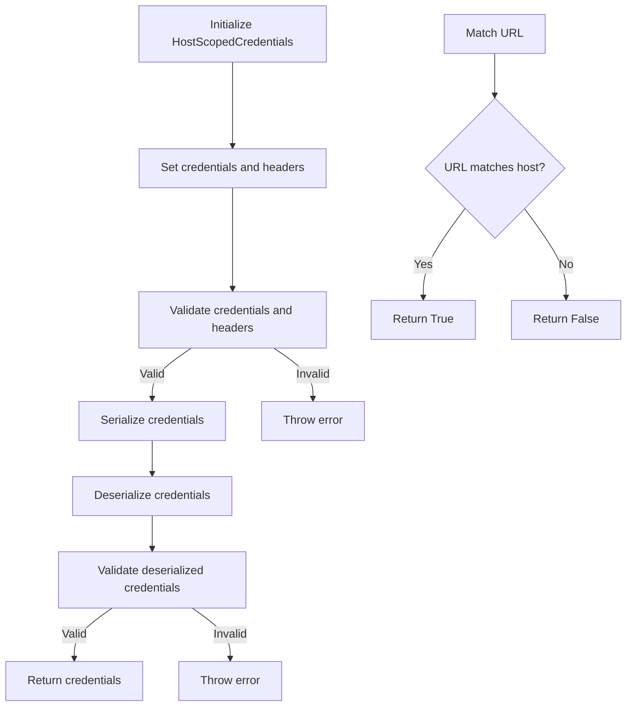
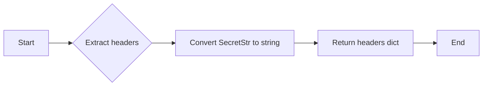
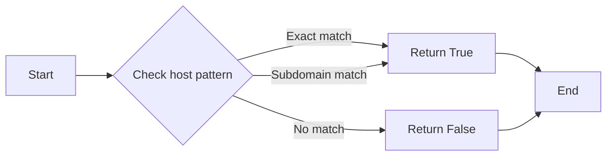
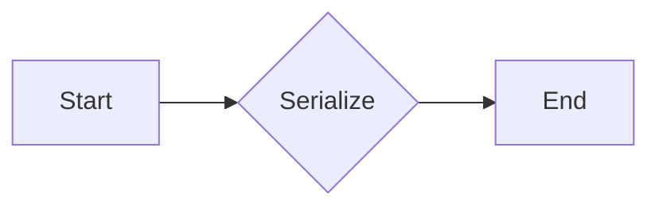

# `.\AutoGPT\autogpt_platform\backend\backend\data\model_test.py` 详细设计文档

The code defines a class `HostScopedCredentials` for managing credentials scoped to a specific host, including headers with secret values. It includes methods for creating, validating, and serializing credentials, as well as testing their URL matching capabilities.

## 整体流程



## 类结构

```
HostScopedCredentials (主类)
├── __init__(self, provider, host, headers, title)
│   ├── provider (str): The provider of the credentials
│   ├── host (str): The host to which the credentials are scoped
│   ├── headers (dict): The headers associated with the credentials
│   └── title (str): The title of the credentials
├── get_headers_dict(self) -> dict
│   ├── Returns a dictionary of headers without secret values
├── matches_url(self, url: str) -> bool
│   ├── Checks if the URL matches the host pattern of the credentials
└── model_dump(self) -> dict
    └── Serializes the credentials to a dictionary
```

## 全局变量及字段


### `provider`
    
The provider of the credentials.

类型：`str`
    


### `host`
    
The host to which the credentials are scoped.

类型：`str`
    


### `headers`
    
A dictionary of headers with secret values.

类型：`dict`
    


### `title`
    
The title of the credentials.

类型：`str`
    


### `HostScopedCredentials.provider`
    
The provider of the credentials.

类型：`str`
    


### `HostScopedCredentials.host`
    
The host to which the credentials are scoped.

类型：`str`
    


### `HostScopedCredentials.headers`
    
A dictionary of headers with secret values.

类型：`dict`
    


### `HostScopedCredentials.title`
    
The title of the credentials.

类型：`str`
    
    

## 全局函数及方法


### HostScopedCredentials.__init__

This method initializes a new instance of the `HostScopedCredentials` class, setting up the necessary attributes for a host-scoped credential object.

参数：

- `provider`：`str`，The provider of the credentials.
- `host`：`str`，The host to which the credentials apply.
- `headers`：`dict`，A dictionary of headers to be included with the request.
- `title`：`str`，An optional title for the credentials.

返回值：`None`，This method does not return a value.

#### 流程图

```mermaid
classDiagram
    HostScopedCredentials <|-- SecretStr
    HostScopedCredentials {
        provider : str
        host : str
        headers : dict
        title : str
    }
    HostScopedCredentials {
        -init-(provider: str, host: str, headers: dict, title: str)?
    }
```

#### 带注释源码

```python
class HostScopedCredentials:
    def __init__(self, provider: str, host: str, headers: dict, title: str = None):
        self.provider = provider
        self.host = host
        self.headers = headers
        self.title = title
```


### HostScopedCredentials.get_headers_dict

This method extracts the headers from the `HostScopedCredentials` object, converting any `SecretStr` objects to their string representations.

参数：

- 无

返回值：`dict`，A dictionary containing the headers with their string values

#### 流程图



#### 带注释源码

```python
def get_headers_dict(self):
    """Extract the headers from the HostScopedCredentials object, converting any SecretStr objects to their string representations."""
    headers_dict = {}
    for header, value in self.headers.items():
        if isinstance(value, SecretStr):
            headers_dict[header] = value._secret  # SecretStr's _secret attribute holds the actual string value
        else:
            headers_dict[header] = value
    return headers_dict
```


### HostScopedCredentials.matches_url

This method checks if a given URL matches the host pattern specified in the HostScopedCredentials object.

参数：

- `test_url`：`str`，The URL to be tested against the host pattern.
- ...

返回值：`bool`，Indicates whether the URL matches the host pattern.

#### 流程图



#### 带注释源码

```python
def matches_url(self, test_url: str) -> bool:
    # Extract the host from the URL
    url_host = urlparse(test_url).hostname

    # Check if the URL host matches the host pattern
    if self.host == url_host:
        return True
    elif self.host.startswith('*.') and url_host.endswith(self.host[2:]):
        return True
    else:
        return False
```


### HostScopedCredentials.model_dump

This function serializes the `HostScopedCredentials` object into a dictionary, which can be used for storage or transmission.

参数：

- 无

返回值：`dict`，A dictionary representation of the `HostScopedCredentials` object.

#### 流程图



#### 带注释源码

```python
def model_dump(self):
    """
    Serialize the HostScopedCredentials object into a dictionary.
    """
    return {
        'provider': self.provider,
        'host': self.host,
        'headers': self.headers,
        'title': self.title,
        'type': self.type,
    }
```


## 关键组件


### 张量索引与惰性加载

用于在处理大型数据集时，仅对需要的数据进行索引和加载，以优化内存使用和提高性能。

### 反量化支持

提供对反量化操作的支持，允许在量化过程中对某些操作进行反量化处理。

### 量化策略

定义了不同的量化策略，用于在模型训练和推理过程中对模型进行量化处理，以减少模型大小和提高推理速度。


## 问题及建议


### 已知问题

-   **测试覆盖率不足**：代码中包含多个测试用例，但可能存在未覆盖到的边缘情况或特定配置。
-   **参数化测试的灵活性**：虽然使用了参数化测试，但可能需要更多的参数组合来覆盖所有可能的URL匹配场景。
-   **异常处理**：代码中没有显示异常处理逻辑，对于可能出现的错误情况（如无效的URL格式）没有明确的处理机制。
-   **性能考量**：对于大量的URL匹配操作，可能需要考虑性能优化，例如缓存匹配结果或使用更高效的数据结构。

### 优化建议

-   **增加测试覆盖率**：通过编写更多的测试用例，特别是针对边缘情况和异常情况，以提高测试的全面性。
-   **提高参数化测试的灵活性**：考虑使用更复杂的参数化策略，例如动态生成URL或使用更丰富的参数组合。
-   **实现异常处理**：在代码中添加异常处理逻辑，确保在遇到错误输入时能够优雅地处理并给出适当的反馈。
-   **性能优化**：对于频繁执行的匹配操作，可以考虑使用缓存机制或优化数据结构以提高性能。
-   **代码重构**：考虑将重复的代码片段提取为函数或类，以提高代码的可读性和可维护性。
-   **文档和注释**：增加代码的文档和注释，以便其他开发者更好地理解代码的功能和实现细节。


## 其它


### 设计目标与约束

- 设计目标：
  - 确保认证信息的安全性和完整性。
  - 提供灵活的URL匹配机制以支持多种场景。
  - 支持认证信息的序列化和反序列化，以便存储和恢复。
- 约束：
  - 必须使用`pydantic`库来处理数据验证。
  - 必须支持IPv4和IPv6地址格式。
  - 必须支持非标准端口。

### 错误处理与异常设计

- 错误处理：
  - 在序列化和反序列化过程中，如果数据格式不正确，将抛出`pydantic.ValidationError`异常。
  - 在URL匹配过程中，如果URL格式不正确或无法匹配，将返回`False`。
- 异常设计：
  - 使用`try-except`块捕获和处理`pydantic.ValidationError`异常。
  - 对于URL匹配失败的情况，不抛出异常，而是返回`False`。

### 数据流与状态机

- 数据流：
  - 用户创建`HostScopedCredentials`对象，提供必要的认证信息。
  - 对象通过`get_headers_dict`方法返回包含所有认证信息的字典。
  - 对象通过`matches_url`方法检查URL是否与提供的URL模式匹配。
- 状态机：
  - `HostScopedCredentials`对象在创建时处于有效状态。
  - 如果序列化和反序列化失败，对象进入无效状态。
  - 如果URL匹配失败，方法返回`False`，但对象状态保持不变。

### 外部依赖与接口契约

- 外部依赖：
  - `pydantic`库用于数据验证和序列化。
  - `pytest`库用于单元测试。
- 接口契约：
  - `HostScopedCredentials`类提供了一个公共接口，包括构造函数、`get_headers_dict`和`matches_url`方法。
  - 所有方法都遵循RESTful API设计原则，确保易用性和一致性。


    