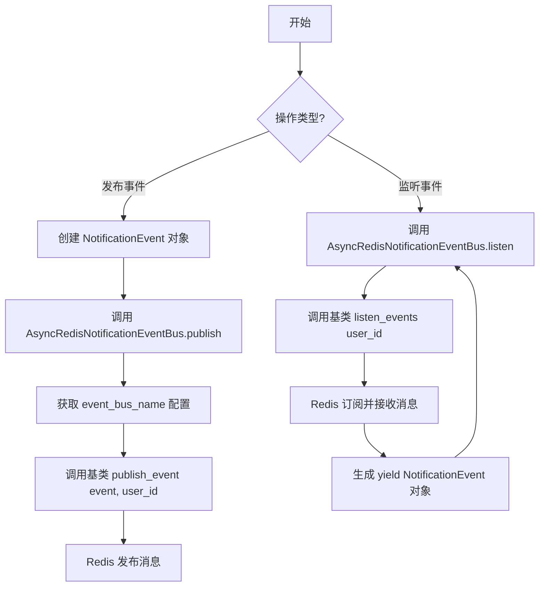
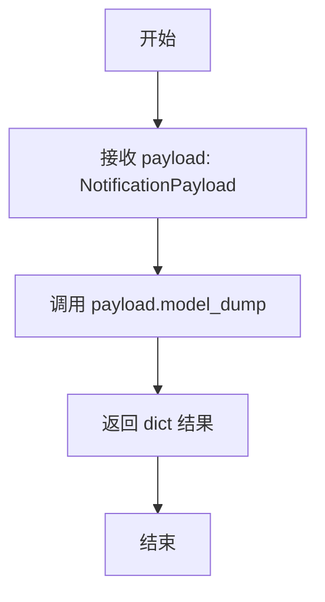
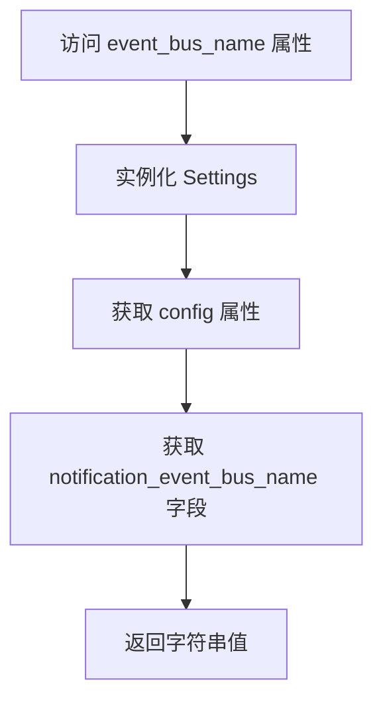
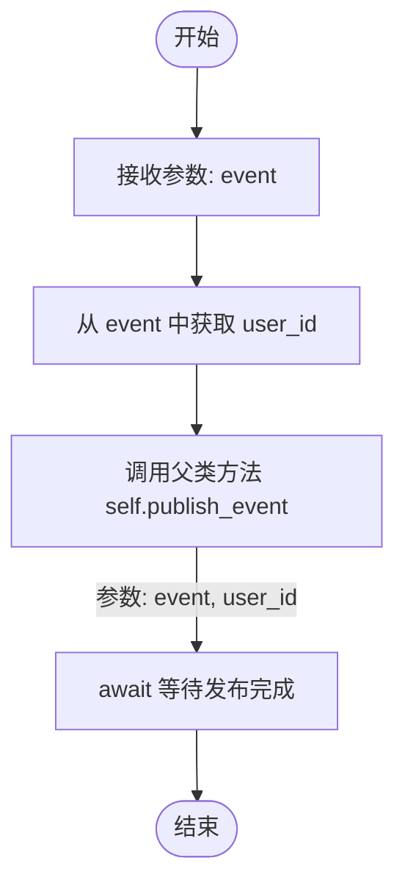
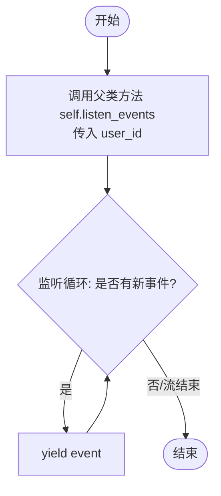

# `.\AutoGPT\autogpt_platform\backend\backend\data\notification_bus.py` 详细设计文档

该代码定义了一个基于Redis的异步通知事件系统，利用Pydantic对包含用户ID和载荷的通知事件进行建模与序列化，并通过继承通用的异步Redis事件总线，实现了针对特定用户的发布事件和监听事件的功能。

## 整体流程



## 类结构

```
pydantic.BaseModel
├── NotificationEvent
backend.data.event_bus.AsyncRedisEventBus
├── AsyncRedisNotificationEventBus
```

## 全局变量及字段


### `NotificationEvent.user_id`
    
接收通知的目标用户的唯一标识符。

类型：`str`
    


### `NotificationEvent.payload`
    
包含通知具体内容的数据负载对象。

类型：`NotificationPayload`
    


### `AsyncRedisNotificationEventBus.Model`
    
定义该事件总线处理的数据模型类型为 NotificationEvent。

类型：`type[NotificationEvent]`
    
    

## 全局函数及方法


### `NotificationEvent.serialize_payload`

这是一个用于 `payload` 字段的 Pydantic 字段序列化器。其核心功能是将 `NotificationPayload` 模型对象转换为字典格式，以确保在 Redis 序列化过程中，模型中包含的额外字段能够被正确保留和传输。

参数：

- `payload`：`NotificationPayload`，待序列化的通知 payload 对象

返回值：`dict`，包含 payload 数据的字典表示

#### 流程图



#### 带注释源码

```python
    @field_serializer("payload")  # 指定该方法为 'payload' 字段的序列化器
    def serialize_payload(self, payload: NotificationPayload):
        """Ensure extra fields survive Redis serialization."""
        # 将 Pydantic 模型对象转换为字典。
        # 这一步确保了即使模型定义中未显式声明的额外字段（extra fields），
        # 在通过 Redis 序列化时也不会丢失。
        return payload.model_dump()
```


### `AsyncRedisNotificationEventBus.event_bus_name`

用于获取通知事件总线在 Redis 中的名称配置。

参数：

-  `self`：`AsyncRedisNotificationEventBus`，类的实例对象

返回值：`str`，配置中定义的通知事件总线名称字符串。

#### 流程图



#### 带注释源码

```python
@property
def event_bus_name(self) -> str:
    # 实例化 Settings 对象以访问配置
    # 返回配置中特定的 notification_event_bus_name 字段
    return Settings().config.notification_event_bus_name
```


### `AsyncRedisNotificationEventBus.publish`

该方法是 `AsyncRedisNotificationEventBus` 类的核心发布接口，负责将封装好的通知事件异步发布到底层的 Redis 事件总线中，并指定目标用户标识符。

参数：

- `event`：`NotificationEvent`，代表待发布的通用通知事件对象，包含接收通知的用户ID (`user_id`) 和具体的载荷内容 (`payload`)。

返回值：`None`，表示该方法是一个异步执行过程，没有具体的返回值。

#### 流程图



#### 带注释源码

```python
    async def publish(self, event: NotificationEvent) -> None:
        # 调用父类 AsyncRedisEventBus 的 publish_event 方法
        # 将事件对象本身和事件关联的用户ID (user_id) 传递给父类处理
        # user_id 通常被用作 Redis Pub/Sub 的频道标识或路由键
        await self.publish_event(event, event.user_id)
```


### `AsyncRedisNotificationEventBus.listen`

监听特定用户 ID 的 Redis 通知事件，并以异步生成器的形式将这些事件传递出去。该方法封装了底层事件总线的监听逻辑，允许调用者迭代获取通知。

参数：

-  `user_id`：`str`，指定要监听的用户ID，默认值为"*"，表示监听所有用户的事件。

返回值：`AsyncGenerator[NotificationEvent, None]`，返回一个异步生成器，用于持续产出 `NotificationEvent` 类型的通知事件。

#### 流程图



#### 带注释源码

```python
    async def listen(
        self, user_id: str = "*"
    ) -> AsyncGenerator[NotificationEvent, None]:
        # 循环监听来自底层 Redis 事件总线的事件
        # self.listen_events 是父类 AsyncRedisEventBus 提供的方法
        async for event in self.listen_events(user_id):
            # 将获取到的 NotificationEvent 对象异步产出给调用者
            yield event
```


## 关键组件


### NotificationEvent

用于WebSocket传输的通用通知事件模型，包含用户ID和负载，并配置了自定义序列化器以确保Redis序列化的兼容性。

### AsyncRedisNotificationEventBus

基于Redis的异步通知事件总线实现，用于发布和按用户ID订阅通知事件。


## 问题及建议


### 已知问题

-   **Settings 实例化开销**：`event_bus_name` 属性在每次访问时都会调用 `Settings()`，如果 `Settings` 的初始化涉及文件 I/O 或环境变量解析，这将导致不必要的性能损耗。
-   **通配符订阅语义模糊**：`listen` 方法默认参数 `user_id="*"` 的行为严重依赖父类 `AsyncRedisEventBus` 的实现。如果父类底层使用的是 Redis 的 `SUBSCRIBE` 命令而非 `PSUBSCRIBE`，这里的 `*` 将被当作字面量字符串处理，导致无法实现预期的全局监听功能。
-   **类型安全性妥协**：`Model = NotificationEvent # type: ignore` 使用了 `# type: ignore` 注释来绕过类型检查器的警告。这掩盖了潜在的类型不匹配风险，降低了代码在静态分析阶段的安全性。

### 优化建议

-   **缓存配置实例**：建议将 `Settings()` 的实例化移至 `__init__` 方法中并存储为实例变量，或者使用模块级常量/单例模式，确保配置对象只被加载一次。
-   **明确订阅模式或验证机制**：应明确 `listen` 方法是否支持通配符。如果支持，建议在文档或注释中明确指出依赖 Redis Pub/Sub 的 Pattern 模式；如果不支持，应移除默认的 `*` 参数，避免误导调用者。
-   **增强 JSON 序列化兼容性**：在 `serialize_payload` 方法中，建议使用 `payload.model_dump(mode='json')`。这能确保如 `datetime` 等非标准 JSON 类型被正确转换为字符串，提高跨语言或跨服务消费时的兼容性。
-   **增加异常处理与重试策略**：当前的 `publish` 和 `listen` 方法直接透支了父类的异常。建议根据业务需求，在方法层级增加针对 Redis 连接断开等网络异常的重试逻辑或错误上报机制，提升系统的鲁棒性。


## 其它


### 设计目标与约束

- **设计目标**: 提供一个基于 Redis 的高性能、异步通知分发机制，支持按用户 ID 隔离的消息推送，确保通知数据在序列化和反序列化过程中的完整性。
- **约束**:
  - 必须异步运行，以支持高并发场景。
  - 依赖于 Pydantic 的 `BaseModel` 进行数据验证和序列化。
  - 必须继承自 `AsyncRedisEventBus` 并遵循其定义的通用接口。
  - 配置信息（如 Event Bus 名称）必须从全局 `Settings` 中获取。
  - 数据存储依赖外部 Redis 服务，需确保网络连通性。

### 错误处理与异常设计

- **序列化处理**: 通过自定义的 `serialize_payload` 方法（带有 `@field_serializer` 装饰器），显式地将 `NotificationPayload` 转换为字典 (`model_dump`)。这是为了解决 Redis 对复杂对象（如 Pydantic 模型）的直接序列化限制，防止因默认序列化导致的数据丢失或错误。
- **异常传播**: 本模块主要作为事件总线的轻量级封装，不显式捕获底层 `AsyncRedisEventBus` 或 Redis 客户端抛出的连接异常、网络异常或超时异常。这些异常应向上传递给调用方（通常是 WebSocket 连接处理器或上层业务逻辑），由上层决定重连或报错策略。
- **类型安全**: 严格使用 Python 类型注解，减少运行时类型错误。

### 数据流与状态机

- **数据流**:
  1. **生产者**: 业务逻辑创建 `NotificationEvent` 实例，传入 `user_id` 和 `payload`。
  2. **发布**: 调用 `AsyncRedisNotificationEventBus.publish()`，通过 `serialize_payload` 将 Payload 序列化为字典，并推送到以 `user_id` 为键的 Redis 频道。
  3. **传输**: Redis 作为消息代理，将消息路由给订阅了特定 `user_id` 的消费者。
  4. **消费**: `AsyncRedisNotificationEventBus.listen()` 启动异步生成器，监听特定 `user_id`（或通配符）的频道，接收并反序列化消息，生成 `NotificationEvent` 对象供下游处理（如 WebSocket 推送）。

  ```mermaid
  graph LR
    A[业务逻辑/Producer] -->|create event| B[NotificationEvent]
    B -->|publish| C[AsyncRedisNotificationEventBus]
    C -->|serialize| D[Redis Pub/Sub]
    D -->|route by user_id| E[AsyncGenerator/listen]
    E -->|yield event| F[WebSocket Handler]
  ```

- **状态**: 本组件主要为无状态的数据通道。事件本身具有生命周期：`Created` (构建时) -> `Serialized` (发布时) -> `In Transit` (在 Redis 中) -> `Deserialized/Yielded` (被消费时)。

### 外部依赖与接口契约

- **外部依赖**:
  - **Redis 服务器**: 作为底层消息代理，必须运行且可访问。
  - **`backend.data.event_bus.AsyncRedisEventBus`**: 基础抽象类，提供了 `publish_event` 和 `listen_events` 的核心实现。
  - **`backend.util.settings.Settings`**: 提供配置单例，用于获取事件总线的命名空间配置。
  - **`backend.api.model.NotificationPayload`**: 定义了通知载荷的数据结构。

- **接口契约**:
  - **`AsyncRedisNotificationEventBus`**:
    - `publish(event: NotificationEvent) -> None`: 契约要求事件必须包含有效的 `user_id` 用于路由。方法不返回值，但隐含承诺消息已投递给 Redis（不考虑网络故障）。
    - `listen(user_id: str = "*") -> AsyncGenerator[NotificationEvent, None]`: 契约承诺持续生成事件直到流被关闭或发生不可恢复的错误。支持通配符 `*` 监听所有用户事件。
  - **数据格式**: `NotificationEvent` 必须能被 Pydantic 序列化，且 `payload` 字段最终需转换为字典格式以兼容 Redis 存储格式。

    