# `.\AutoGPT\autogpt_platform\backend\backend\data\notifications.py` 详细设计文档

该代码实现了一个通知系统的数据层与逻辑层，定义了基于Pydantic的各种通知数据模型（如Agent运行、余额警告、汇总报告等），封装了针对数据库的通知批次操作逻辑（创建、更新、查询、清理），并通过映射类定义了不同通知类型的队列策略和模板配置。

## 整体流程

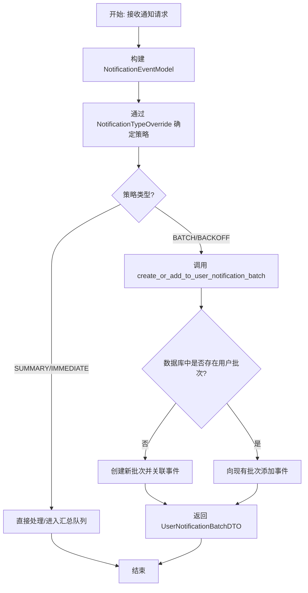
```mermaid
graph TD
    A[开始: 接收通知请求] --> B[构建 NotificationEventModel]
    B --> C[通过 NotificationTypeOverride 确定策略]
    C --> D{策略类型?}
    D -- BATCH/BACKOFF --> E[调用 create_or_add_to_user_notification_batch]
    D -- SUMMARY/IMMEDIATE --> F[直接处理/进入汇总队列]
    E --> G{数据库中是否存在用户批次?}
    G -- 否 --> H[创建新批次并关联事件]
    G -- 是 --> I[向现有批次添加事件]
    H --> J[返回 UserNotificationBatchDTO]
    I --> J
    F --> K[结束]
    J --> K
```

## 类结构

```
BaseModel (Pydantic)
├── BaseNotificationData (数据基类)
│   ├── AgentRunData
│   ├── ZeroBalanceData
│   ├── LowBalanceData
│   ├── BlockExecutionFailedData
│   ├── ContinuousAgentErrorData
│   ├── BaseSummaryData
│   │   ├── DailySummaryData
│   │   └── WeeklySummaryData
│   ├── MonthlySummaryData
│   ├── RefundRequestData
│   ├── AgentApprovalData
│   └── AgentRejectionData
├── BaseSummaryParams (汇总参数基类)
│   ├── DailySummaryParams
│   └── WeeklySummaryParams
├── BaseEventModel (事件基类)
│   ├── NotificationEventModel (泛型)
│   └── SummaryParamsEventModel (泛型)
├── NotificationBatch
├── NotificationResult
├── NotificationPreferenceDTO
├── NotificationPreference
├── UserNotificationEventDTO
└── UserNotificationBatchDTO
QueueType (Enum)
NotificationTypeOverride (逻辑配置类)
```

## 全局变量及字段


### `logger`
    
A truncated logger instance used for logging notification service events with a specific prefix.

类型：`TruncatedLogger`
    


### `NotificationDataType_co`
    
A covariant TypeVar bound to BaseNotificationData, used for generic notification data models.

类型：`TypeVar`
    


### `SummaryParamsType_co`
    
A covariant TypeVar bound to BaseSummaryParams, used for generic summary parameter models.

类型：`TypeVar`
    


### `NotificationData`
    
A discriminated union type representing all possible notification data payloads.

类型：`Annotated[Union[AgentRunData, ZeroBalanceData, LowBalanceData, BlockExecutionFailedData, ContinuousAgentErrorData, MonthlySummaryData, WeeklySummaryData, DailySummaryData, RefundRequestData, BaseSummaryData], Field(discriminator="type")]`
    


### `BaseNotificationData.model_config`
    
Pydantic model configuration allowing extra fields.

类型：`ConfigDict`
    


### `AgentRunData.agent_name`
    
Name of the agent that ran.

类型：`str`
    


### `AgentRunData.credits_used`
    
Amount of credits consumed during the run.

类型：`float`
    


### `AgentRunData.execution_time`
    
Time taken for the agent execution.

类型：`float`
    


### `AgentRunData.node_count`
    
Number of nodes executed.

类型：`int`
    


### `AgentRunData.graph_id`
    
ID of the graph the agent belongs to.

类型：`str`
    


### `AgentRunData.outputs`
    
Outputs produced by the agent.

类型：`list[dict[str, Any]]`
    


### `ZeroBalanceData.agent_name`
    
Name of the agent associated with the balance event.

类型：`str`
    


### `ZeroBalanceData.current_balance`
    
Current balance in credits (100 = $1).

类型：`float`
    


### `ZeroBalanceData.billing_page_link`
    
Link to the billing page.

类型：`str`
    


### `ZeroBalanceData.shortfall`
    
Amount of credits needed to continue.

类型：`float`
    


### `LowBalanceData.current_balance`
    
Current balance in credits (100 = $1).

类型：`float`
    


### `LowBalanceData.billing_page_link`
    
Link to the billing page.

类型：`str`
    


### `BlockExecutionFailedData.block_name`
    
Name of the block that failed.

类型：`str`
    


### `BlockExecutionFailedData.block_id`
    
ID of the block that failed.

类型：`str`
    


### `BlockExecutionFailedData.error_message`
    
Error message describing the failure.

类型：`str`
    


### `BlockExecutionFailedData.graph_id`
    
ID of the graph where the block failed.

类型：`str`
    


### `BlockExecutionFailedData.node_id`
    
ID of the node where the block failed.

类型：`str`
    


### `BlockExecutionFailedData.execution_id`
    
ID of the execution that failed.

类型：`str`
    


### `ContinuousAgentErrorData.agent_name`
    
Name of the continuous agent.

类型：`str`
    


### `ContinuousAgentErrorData.error_message`
    
Error message encountered.

类型：`str`
    


### `ContinuousAgentErrorData.graph_id`
    
ID of the graph.

类型：`str`
    


### `ContinuousAgentErrorData.execution_id`
    
ID of the execution.

类型：`str`
    


### `ContinuousAgentErrorData.start_time`
    
Start time of the execution.

类型：`datetime`
    


### `ContinuousAgentErrorData.error_time`
    
Time when the error occurred.

类型：`datetime`
    


### `ContinuousAgentErrorData.attempts`
    
Number of retry attempts made.

类型：`int`
    


### `BaseSummaryData.total_credits_used`
    
Total credits used in the summary period.

类型：`float`
    


### `BaseSummaryData.total_executions`
    
Total number of executions in the period.

类型：`int`
    


### `BaseSummaryData.most_used_agent`
    
Name of the agent used most frequently.

类型：`str`
    


### `BaseSummaryData.total_execution_time`
    
Total time spent on executions.

类型：`float`
    


### `BaseSummaryData.successful_runs`
    
Number of successful runs.

类型：`int`
    


### `BaseSummaryData.failed_runs`
    
Number of failed runs.

类型：`int`
    


### `BaseSummaryData.average_execution_time`
    
Average time per execution.

类型：`float`
    


### `BaseSummaryData.cost_breakdown`
    
Detailed breakdown of costs.

类型：`dict[str, float]`
    


### `BaseSummaryParams.start_date`
    
Start date for the summary period.

类型：`datetime`
    


### `BaseSummaryParams.end_date`
    
End date for the summary period.

类型：`datetime`
    


### `DailySummaryParams.date`
    
The specific date for the daily summary.

类型：`datetime`
    


### `WeeklySummaryParams.start_date`
    
Start date for the weekly summary.

类型：`datetime`
    


### `WeeklySummaryParams.end_date`
    
End date for the weekly summary.

类型：`datetime`
    


### `DailySummaryData.date`
    
The date of the daily summary.

类型：`datetime`
    


### `WeeklySummaryData.start_date`
    
Start date of the weekly summary data.

类型：`datetime`
    


### `WeeklySummaryData.end_date`
    
End date of the weekly summary data.

类型：`datetime`
    


### `MonthlySummaryData.month`
    
The month (1-12) of the summary.

类型：`int`
    


### `MonthlySummaryData.year`
    
The year of the summary.

类型：`int`
    


### `RefundRequestData.user_id`
    
ID of the user requesting the refund.

类型：`str`
    


### `RefundRequestData.user_name`
    
Name of the user requesting the refund.

类型：`str`
    


### `RefundRequestData.user_email`
    
Email of the user requesting the refund.

类型：`str`
    


### `RefundRequestData.transaction_id`
    
ID of the transaction associated with the refund.

类型：`str`
    


### `RefundRequestData.refund_request_id`
    
Unique ID of the refund request.

类型：`str`
    


### `RefundRequestData.reason`
    
Reason provided for the refund.

类型：`str`
    


### `RefundRequestData.amount`
    
Amount to be refunded.

类型：`float`
    


### `RefundRequestData.balance`
    
User balance after the refund.

类型：`int`
    


### `AgentApprovalData.agent_name`
    
Name of the approved agent.

类型：`str`
    


### `AgentApprovalData.agent_id`
    
ID of the approved agent.

类型：`str`
    


### `AgentApprovalData.agent_version`
    
Version number of the approved agent.

类型：`int`
    


### `AgentApprovalData.reviewer_name`
    
Name of the reviewer who approved the agent.

类型：`str`
    


### `AgentApprovalData.reviewer_email`
    
Email of the reviewer who approved the agent.

类型：`str`
    


### `AgentApprovalData.comments`
    
Comments provided by the reviewer.

类型：`str`
    


### `AgentApprovalData.reviewed_at`
    
Timestamp of when the approval occurred.

类型：`datetime`
    


### `AgentApprovalData.store_url`
    
URL to the agent in the store.

类型：`str`
    


### `AgentRejectionData.agent_name`
    
Name of the rejected agent.

类型：`str`
    


### `AgentRejectionData.agent_id`
    
ID of the rejected agent.

类型：`str`
    


### `AgentRejectionData.agent_version`
    
Version number of the rejected agent.

类型：`int`
    


### `AgentRejectionData.reviewer_name`
    
Name of the reviewer who rejected the agent.

类型：`str`
    


### `AgentRejectionData.reviewer_email`
    
Email of the reviewer who rejected the agent.

类型：`str`
    


### `AgentRejectionData.comments`
    
Comments explaining the rejection.

类型：`str`
    


### `AgentRejectionData.reviewed_at`
    
Timestamp of when the rejection occurred.

类型：`datetime`
    


### `AgentRejectionData.resubmit_url`
    
URL to resubmit the agent.

类型：`str`
    


### `BaseEventModel.type`
    
The type of notification event.

类型：`NotificationType`
    


### `BaseEventModel.user_id`
    
The ID of the user receiving the notification.

类型：`str`
    


### `BaseEventModel.created_at`
    
The timestamp when the event was created.

类型：`datetime`
    


### `NotificationEventModel.id`
    
The unique identifier of the notification event, None if creating.

类型：`Optional[str]`
    


### `NotificationEventModel.data`
    
The payload data for the notification event.

类型：`NotificationDataType_co`
    


### `SummaryParamsEventModel.data`
    
The parameters defining the summary period.

类型：`SummaryParamsType_co`
    


### `NotificationBatch.user_id`
    
The ID of the user associated with this batch.

类型：`str`
    


### `NotificationBatch.events`
    
List of notification events in this batch.

类型：`list[NotificationEvent]`
    


### `NotificationBatch.strategy`
    
The queueing strategy for this batch (e.g., BATCH, IMMEDIATE).

类型：`QueueType`
    


### `NotificationBatch.last_update`
    
Timestamp of the last update to the batch.

类型：`datetime`
    


### `NotificationResult.success`
    
Indicates if the notification operation was successful.

类型：`bool`
    


### `NotificationResult.message`
    
Optional message providing details about the result.

类型：`Optional[str]`
    


### `NotificationTypeOverride.notification_type`
    
The notification type to override or retrieve settings for.

类型：`NotificationType`
    


### `NotificationPreferenceDTO.email`
    
The user's email address.

类型：`EmailStr`
    


### `NotificationPreferenceDTO.preferences`
    
Map of notification types to boolean preferences.

类型：`dict[NotificationType, bool]`
    


### `NotificationPreferenceDTO.daily_limit`
    
Maximum number of emails the user wants per day.

类型：`int`
    


### `NotificationPreference.user_id`
    
The user's unique identifier.

类型：`str`
    


### `NotificationPreference.email`
    
The user's email address.

类型：`EmailStr`
    


### `NotificationPreference.preferences`
    
The user's notification preferences.

类型：`dict[NotificationType, bool]`
    


### `NotificationPreference.daily_limit`
    
The daily limit for sending emails to this user.

类型：`int`
    


### `NotificationPreference.emails_sent_today`
    
Count of emails sent to the user today.

类型：`int`
    


### `NotificationPreference.last_reset_date`
    
The date when the daily counter was last reset.

类型：`datetime`
    


### `UserNotificationEventDTO.id`
    
The unique ID of the notification event.

类型：`str`
    


### `UserNotificationEventDTO.type`
    
The type of the notification.

类型：`NotificationType`
    


### `UserNotificationEventDTO.data`
    
The notification payload data.

类型：`dict`
    


### `UserNotificationEventDTO.created_at`
    
Timestamp when the notification event was created.

类型：`datetime`
    


### `UserNotificationEventDTO.updated_at`
    
Timestamp when the notification event was last updated.

类型：`datetime`
    


### `UserNotificationBatchDTO.user_id`
    
The ID of the user owning the batch.

类型：`str`
    


### `UserNotificationBatchDTO.type`
    
The type of notifications in this batch.

类型：`NotificationType`
    


### `UserNotificationBatchDTO.notifications`
    
List of notification event DTOs in the batch.

类型：`list[UserNotificationEventDTO]`
    


### `UserNotificationBatchDTO.created_at`
    
Timestamp when the batch was created.

类型：`datetime`
    


### `UserNotificationBatchDTO.updated_at`
    
Timestamp when the batch was last updated.

类型：`datetime`
    
    

## 全局函数及方法


### `get_notif_data_type`

根据给定的通知类型枚举值，返回对应的 Pydantic 数据模型类，用于确定该类型通知所需的数据结构。

参数：

-  `notification_type`：`NotificationType`，表示需要获取数据类型的枚举值。

返回值：`type[BaseNotificationData]`，继承自 `BaseNotificationData` 的具体数据模型类，用于验证和序列化该通知类型的负载数据。

#### 流程图

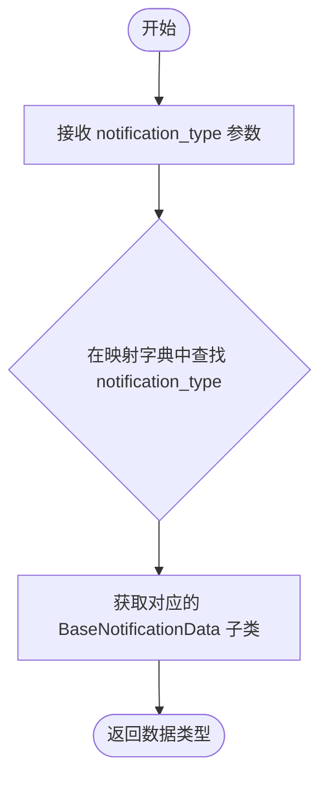
```mermaid
flowchart TD
    Start([开始]) --> Input[接收 notification_type 参数]
    Input --> Lookup{在映射字典中查找 notification_type}
    Lookup --> Match[获取对应的 BaseNotificationData 子类]
    Match --> Return([返回数据类型])
```

#### 带注释源码

```python
def get_notif_data_type(
    notification_type: NotificationType,
) -> type[BaseNotificationData]:
    # 定义一个映射字典，将通知类型枚举映射到具体的数据模型类
    # 这些数据模型类均继承自 BaseNotificationData
    return {
        NotificationType.AGENT_RUN: AgentRunData,
        NotificationType.ZERO_BALANCE: ZeroBalanceData,
        NotificationType.LOW_BALANCE: LowBalanceData,
        NotificationType.BLOCK_EXECUTION_FAILED: BlockExecutionFailedData,
        NotificationType.CONTINUOUS_AGENT_ERROR: ContinuousAgentErrorData,
        NotificationType.DAILY_SUMMARY: DailySummaryData,
        NotificationType.WEEKLY_SUMMARY: WeeklySummaryData,
        NotificationType.MONTHLY_SUMMARY: MonthlySummaryData,
        NotificationType.REFUND_REQUEST: RefundRequestData,
        NotificationType.REFUND_PROCESSED: RefundRequestData,
        NotificationType.AGENT_APPROVED: AgentApprovalData,
        NotificationType.AGENT_REJECTED: AgentRejectionData,
    }[notification_type]
```


### `get_summary_params_type`

该函数根据传入的通知类型枚举值，获取对应的摘要参数模型类类型。它充当工厂方法，将特定的摘要通知（如每日摘要、每周摘要）映射到其各自的数据验证模型（Pydantic 模型），以便后续进行数据的解析和验证。

参数：

- `notification_type`：`NotificationType`，表示需要获取参数模型的通知类型（例如 `DAILY_SUMMARY` 或 `WEEKLY_SUMMARY`）。

返回值：`type[BaseSummaryParams]`，返回对应的 `BaseSummaryParams` 子类类型，用于定义该通知类型所需的参数结构。

#### 流程图

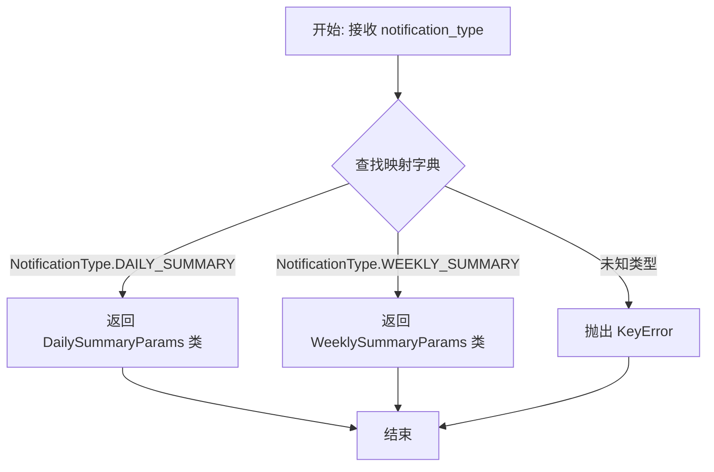
```mermaid
flowchart TD
    A[开始: 接收 notification_type] --> B{查找映射字典}
    B -- NotificationType.DAILY_SUMMARY --> C[返回 DailySummaryParams 类]
    B -- NotificationType.WEEKLY_SUMMARY --> D[返回 WeeklySummaryParams 类]
    B -- 未知类型 --> E[抛出 KeyError]
    C --> F[结束]
    D --> F[结束]
    E --> F[结束]
```

#### 带注释源码

```python
def get_summary_params_type(
    notification_type: NotificationType,
) -> type[BaseSummaryParams]:
    # 定义一个映射字典，将特定的通知类型枚举值映射到对应的 Pydantic 模型类
    return {
        NotificationType.DAILY_SUMMARY: DailySummaryParams,
        NotificationType.WEEKLY_SUMMARY: WeeklySummaryParams,
    }[notification_type]
```


### `get_batch_delay`

根据传入的通知类型枚举值，查找并返回该类型通知在进行批处理发送时应设定的延迟时间间隔。

参数：

- `notification_type`: `NotificationType`, 指定需要查询延迟时间的通知类型。

返回值：`timedelta`, 包含延迟持续时间的时间增量对象，用于确定通知在批处理队列中的等待时间。

#### 流程图

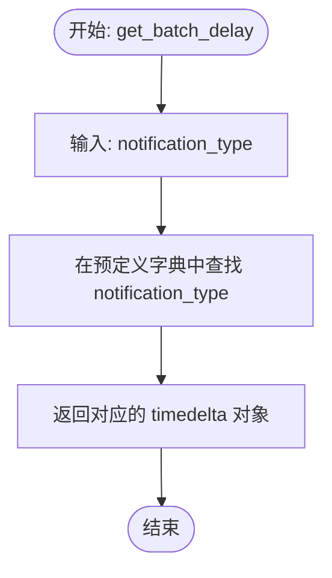
```mermaid
flowchart TD
    Start([开始: get_batch_delay]) --> Input[输入: notification_type]
    Input --> Lookup[在预定义字典中查找 notification_type]
    Lookup --> Output[返回对应的 timedelta 对象]
    Output --> End([结束])
```

#### 带注释源码

```python
def get_batch_delay(notification_type: NotificationType) -> timedelta:
    # 定义并返回一个字典，映射不同的通知类型到其对应的批处理延迟时间
    return {
        # Agent 运行报告：批处理延迟为 1 天
        NotificationType.AGENT_RUN: timedelta(days=1),
        # 余额为零：批处理延迟为 60 分钟
        NotificationType.ZERO_BALANCE: timedelta(minutes=60),
        # 余额不足：批处理延迟为 60 分钟
        NotificationType.LOW_BALANCE: timedelta(minutes=60),
        # 块执行失败：批处理延迟为 60 分钟
        NotificationType.BLOCK_EXECUTION_FAILED: timedelta(minutes=60),
        # 持续 Agent 错误：批处理延迟为 60 分钟
        NotificationType.CONTINUOUS_AGENT_ERROR: timedelta(minutes=60),
    }[notification_type]  # 根据传入的 notification_type 键获取对应的 timedelta 值
```


### `create_or_add_to_user_notification_batch`

该函数负责为核心通知系统提供数据持久化服务。它根据给定的用户ID和通知类型，检查数据库中是否已存在对应的批处理记录。如果不存在，则创建一个新的批处理记录并关联该通知事件；如果存在，则将新的通知事件追加到现有的批处理记录中。整个过程通过序列化数据并利用数据库事务或操作来保证数据的一致性。

参数：

-   `user_id`：`str`，目标用户的唯一标识符。
-   `notification_type`：`NotificationType`，通知的类型（如 AGENT_RUN, LOW_BALANCE 等），用于确定批次的分类。
-   `notification_data`：`NotificationEventModel`，包含具体通知内容的数据模型对象，该对象将被序列化后存储。

返回值：`UserNotificationBatchDTO`，返回经过创建或更新后的用户通知批次数据传输对象，包含最新的批次信息和关联的通知列表。

#### 流程图

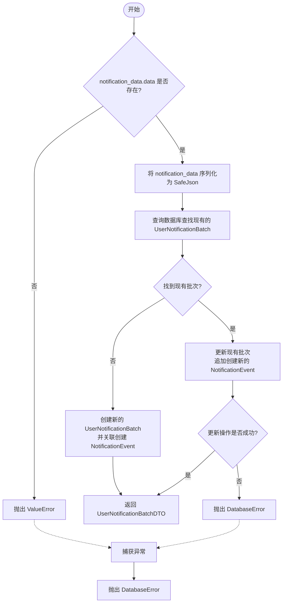
```mermaid
flowchart TD
    A([开始]) --> B{notification_data.data 是否存在?}
    B -- 否 --> C[抛出 ValueError]
    B -- 是 --> D[将 notification_data 序列化为 SafeJson]
    D --> E[查询数据库查找现有的 UserNotificationBatch]
    E --> F{找到现有批次?}
    F -- 否 --> G[创建新的 UserNotificationBatch<br/>并关联创建 NotificationEvent]
    G --> H[返回 UserNotificationBatchDTO]
    F -- 是 --> I[更新现有批次<br/>追加创建新的 NotificationEvent]
    I --> J{更新操作是否成功?}
    J -- 否 --> K[抛出 DatabaseError]
    J -- 是 --> H
    C -.-> L[捕获异常]
    K -.-> L
    L --> M[抛出 DatabaseError]
```

#### 带注释源码

```python
async def create_or_add_to_user_notification_batch(
    user_id: str,
    notification_type: NotificationType,
    notification_data: NotificationEventModel,
) -> UserNotificationBatchDTO:
    try:
        # 校验通知数据对象是否有效
        if not notification_data.data:
            raise ValueError("Notification data must be provided")

        # 将 Pydantic 模型转换为安全的 JSON 格式，以便存入数据库
        json_data: Json = SafeJson(notification_data.data.model_dump())

        # 尝试根据用户ID和通知类型的唯一组合查找现有的批次
        existing_batch = await UserNotificationBatch.prisma().find_unique(
            where={
                "userId_type": {
                    "userId": user_id,
                    "type": notification_type,
                }
            },
            include={"Notifications": True}, # 包含关联的通知事件
        )

        # 如果未找到现有批次，则创建一个新的批次
        if not existing_batch:
            resp = await UserNotificationBatch.prisma().create(
                data=UserNotificationBatchCreateInput(
                    userId=user_id,
                    type=notification_type,
                    Notifications={
                        "create": [
                            NotificationEventCreateInput(
                                type=notification_type,
                                data=json_data,
                            )
                        ]
                    },
                ),
                include={"Notifications": True},
            )
            # 将数据库模型转换为 DTO 并返回
            return UserNotificationBatchDTO.from_db(resp)
        else:
            # 如果找到现有批次，则更新该批次，追加一条新的通知事件
            resp = await UserNotificationBatch.prisma().update(
                where={"id": existing_batch.id},
                data={
                    "Notifications": {
                        "create": [
                            NotificationEventCreateInput(
                                type=notification_type,
                                data=json_data,
                            )
                        ]
                    }
                },
                include={"Notifications": True},
            )
            # 检查更新响应是否存在，防止静默失败
            if not resp:
                raise DatabaseError(
                    f"Failed to add notification event to existing batch {existing_batch.id}"
                )
            return UserNotificationBatchDTO.from_db(resp)
    except Exception as e:
        # 捕获所有异常，将其包装为标准的 DatabaseError 并抛出
        raise DatabaseError(
            f"Failed to create or add to notification batch for user {user_id} and type {notification_type}: {e}"
        ) from e
```


### `get_user_notification_oldest_message_in_batch`

该函数用于根据用户ID和通知类型，从数据库中检索对应的用户通知批处理（Batch），并返回该批次中创建时间最早的一条通知事件记录。

参数：

-  `user_id`：`str`，目标用户的唯一标识符
-  `notification_type`：`NotificationType`，通知类型的枚举值

返回值：`UserNotificationEventDTO | None`，如果找到对应的批处理且批处理内有通知，则返回最早的通知数据传输对象；如果未找到批处理或批处理为空，则返回 None。

#### 流程图

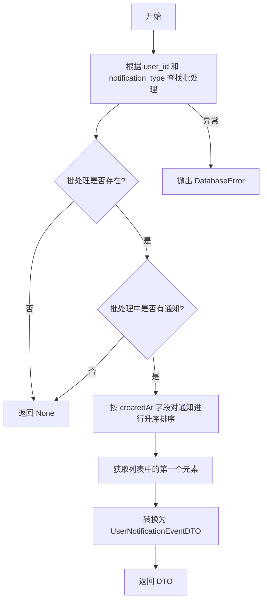
```mermaid
flowchart TD
    A[开始] --> B[根据 user_id 和 notification_type 查找批处理]
    B --> C{批处理是否存在?}
    C -- 否 --> D[返回 None]
    C -- 是 --> E{批处理中是否有通知?}
    E -- 否 --> D
    E -- 是 --> F[按 createdAt 字段对通知进行升序排序]
    F --> G[获取列表中的第一个元素]
    G --> H[转换为 UserNotificationEventDTO]
    H --> I[返回 DTO]
    B -- 异常 --> J[抛出 DatabaseError]
```

#### 带注释源码

```python
async def get_user_notification_oldest_message_in_batch(
    user_id: str,
    notification_type: NotificationType,
) -> UserNotificationEventDTO | None:
    try:
        # 尝试查找匹配用户ID和通知类型的第一个通知批处理
        batch = await UserNotificationBatch.prisma().find_first(
            where={"userId": user_id, "type": notification_type},
            include={"Notifications": True}, # 包含关联的通知事件列表
        )
        
        # 如果批处理不存在，返回 None
        if not batch:
            return None
            
        # 如果批处理中没有通知，返回 None
        if not batch.Notifications:
            return None
            
        # 按创建时间对通知进行排序（升序，即最早的在前）
        sorted_notifications = sorted(batch.Notifications, key=lambda x: x.createdAt)

        # 如果排序后的列表不为空，返回第一个（最早）通知的DTO形式
        return (
            UserNotificationEventDTO.from_db(sorted_notifications[0])
            if sorted_notifications
            else None
        )
    except Exception as e:
        # 捕获异常并抛出自定义数据库错误
        raise DatabaseError(
            f"Failed to get user notification last message in batch for user {user_id} and type {notification_type}: {e}"
        ) from e
```


### `empty_user_notification_batch`

该函数用于清空指定用户特定类型的批处理通知。它通过数据库事务，先删除该批次下的所有具体通知事件，然后再删除对应的批处理记录，确保操作的一致性。

参数：

- `user_id`：`str`，需要清空通知批次的用户唯一标识符。
- `notification_type`：`NotificationType`，需要清空的通知类型枚举值。

返回值：`None`，表示无返回值，操作成功即结束。

#### 流程图

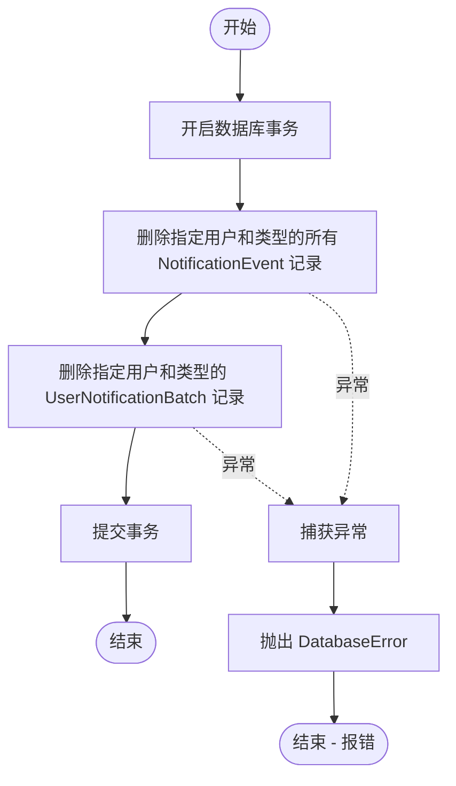
```mermaid
graph TD
    Start([开始]) --> BeginTx[开启数据库事务]
    BeginTx --> DeleteEvents[删除指定用户和类型的所有 NotificationEvent 记录]
    DeleteEvents --> DeleteBatch[删除指定用户和类型的 UserNotificationBatch 记录]
    DeleteBatch --> CommitTx[提交事务]
    CommitTx --> End([结束])

    DeleteEvents -.->|异常| CatchError[捕获异常]
    DeleteBatch -.->|异常| CatchError
    CatchError --> RaiseError[抛出 DatabaseError]
    RaiseError --> ErrorEnd([结束 - 报错])
```

#### 带注释源码

```python
async def empty_user_notification_batch(
    user_id: str, notification_type: NotificationType
) -> None:
    try:
        # 启动数据库事务，确保删除操作的原子性
        # 如果中间步骤失败，所有更改将会回滚
        async with transaction() as tx:
            # 步骤 1: 删除属于该批次的所有具体通知事件 (NotificationEvent)
            # 通过关联查询 UserNotificationBatch 来定位需要删除的事件
            await tx.notificationevent.delete_many(
                where={
                    "UserNotificationBatch": {
                        "is": {"userId": user_id, "type": notification_type}
                    }
                }
            )

            # 步骤 2: 删除用户的通知批次记录 (UserNotificationBatch)
            # 在子记录删除后，删除父记录本身
            await tx.usernotificationbatch.delete_many(
                where=UserNotificationBatchWhereInput(
                    userId=user_id,
                    type=notification_type,
                )
            )
    except Exception as e:
        # 捕获任何异常并封装为自定义的 DatabaseError 抛出
        # 记录了具体的用户ID和通知类型以便排查问题
        raise DatabaseError(
            f"Failed to empty user notification batch for user {user_id} and type {notification_type}: {e}"
        ) from e
```


### `clear_all_user_notification_batches`

清除指定用户的所有通知批次（跨所有类型）。通常在用户邮箱退回或非活跃时使用，以停止尝试向其发送任何邮件。它会首先删除所有关联的通知事件，然后删除批次本身。

参数：

-  `user_id`：`str`，需要清除通知批次的用户ID。

返回值：`None`，无返回值。

#### 流程图

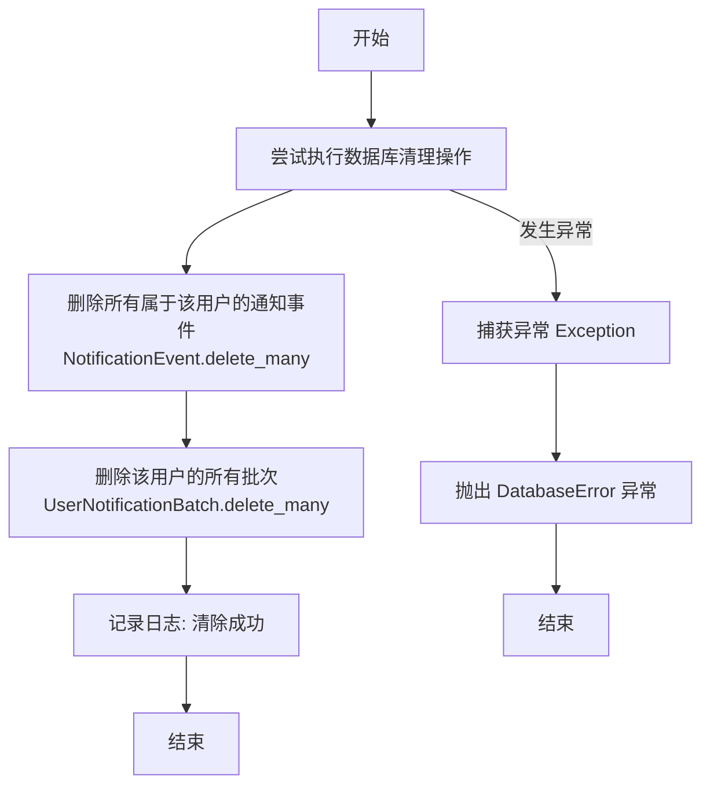
```mermaid
flowchart TD
    A[开始] --> B[尝试执行数据库清理操作]
    B --> C[删除所有属于该用户的通知事件<br/>NotificationEvent.delete_many]
    C --> D[删除该用户的所有批次<br/>UserNotificationBatch.delete_many]
    D --> E[记录日志: 清除成功]
    E --> F[结束]
    B -->|发生异常| G[捕获异常 Exception]
    G --> H[抛出 DatabaseError 异常]
    H --> I[结束]
```

#### 带注释源码

```python
async def clear_all_user_notification_batches(user_id: str) -> None:
    """Clear ALL notification batches for a user across all types.

    Used when user's email is bounced/inactive and we should stop
    trying to send them ANY emails.
    """
    try:
        # Delete all notification events for this user
        # 第一步：删除与该用户批次关联的所有具体通知事件
        await NotificationEvent.prisma().delete_many(
            where={"UserNotificationBatch": {"is": {"userId": user_id}}}
        )

        # Delete all batches for this user
        # 第二步：删除该用户的所有批次记录
        await UserNotificationBatch.prisma().delete_many(where={"userId": user_id})

        # 记录操作完成日志
        logger.info(f"Cleared all notification batches for user {user_id}")
    except Exception as e:
        # 捕获异常并包装为 DatabaseError 抛出
        raise DatabaseError(
            f"Failed to clear all notification batches for user {user_id}: {e}"
        ) from e
```


### `remove_notifications_from_batch`

该函数用于从用户的通知批次中根据ID列表移除特定的通知事件。如果移除操作导致该批次变空，则会自动删除对应的批次记录。此功能主要用于在成功发送通知后清理已处理的项目，以防止重试时出现重复发送。

参数：

- `user_id`：`str`，用户的唯一标识符
- `notification_type`：`NotificationType`，通知类型（例如 AGENT_RUN, DAILY_SUMMARY）
- `notification_ids`：`list[str]`，需要移除的通知事件ID列表

返回值：`None`，无返回值

#### 流程图

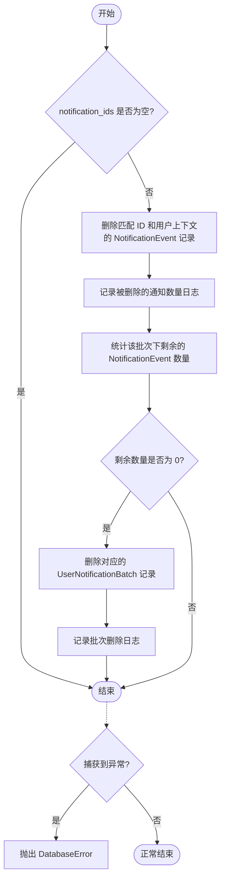
```mermaid
flowchart TD
    Start([开始]) --> CheckInput{notification_ids 是否为空?}
    CheckInput -- 是 --> End([结束])
    CheckInput -- 否 --> DeleteEvents[删除匹配 ID 和用户上下文的 NotificationEvent 记录]
    DeleteEvents --> LogDelete[记录被删除的通知数量日志]
    LogDelete --> CountRemaining[统计该批次下剩余的 NotificationEvent 数量]
    CountRemaining --> CheckRemaining{剩余数量是否为 0?}
    CheckRemaining -- 是 --> DeleteBatch[删除对应的 UserNotificationBatch 记录]
    DeleteBatch --> LogBatchDelete[记录批次删除日志]
    LogBatchDelete --> End
    CheckRemaining -- 否 --> End
    End -.-> CatchError{捕获到异常?}
    CatchError -- 是 --> RaiseError[抛出 DatabaseError]
    CatchError -- 否 --> EndSuccess([正常结束])
```

#### 带注释源码

```python
async def remove_notifications_from_batch(
    user_id: str, notification_type: NotificationType, notification_ids: list[str]
) -> None:
    """Remove specific notifications from a user's batch by their IDs.

    This is used after successful sending to remove only the
    sent notifications, preventing duplicates on retry.
    """
    # 如果没有提供需要移除的ID，则直接返回，避免不必要的数据库操作
    if not notification_ids:
        return

    try:
        # 步骤 1: 从数据库中删除指定的通知事件
        # 查询条件：ID在列表中，且属于指定的用户和通知类型批次
        deleted_count = await NotificationEvent.prisma().delete_many(
            where={
                "id": {"in": notification_ids},
                "UserNotificationBatch": {
                    "is": {"userId": user_id, "type": notification_type}
                },
            }
        )

        # 记录实际删除的通知数量，用于审计和调试
        logger.info(
            f"Removed {deleted_count} notifications from batch for user {user_id}"
        )

        # 步骤 2: 检查该批次下是否还有剩余的通知
        remaining = await NotificationEvent.prisma().count(
            where={
                "UserNotificationBatch": {
                    "is": {"userId": user_id, "type": notification_type}
                }
            }
        )

        # 步骤 3: 如果批次已空，则删除该批次记录本身，保持数据清洁
        if remaining == 0:
            await UserNotificationBatch.prisma().delete_many(
                where=UserNotificationBatchWhereInput(
                    userId=user_id,
                    type=notification_type,
                )
            )
            logger.info(
                f"Deleted empty batch for user {user_id} and type {notification_type}"
            )
    except Exception as e:
        # 异常处理：捕获任何数据库操作异常，并将其封装为自定义的 DatabaseError 抛出
        raise DatabaseError(
            f"Failed to remove notifications from batch for user {user_id} and type {notification_type}: {e}"
        ) from e
```


### `get_user_notification_batch`

根据用户ID和通知类型，从数据库中获取用户的特定通知批次。该函数会查找匹配的记录，并包含其关联的所有具体通知事件，最后将其转换为数据传输对象（DTO）返回。

参数：

-  `user_id`：`str`，要检索其通知批次的用户唯一标识符。
-  `notification_type`：`NotificationType`，要筛选的通知类型枚举值。

返回值：`UserNotificationBatchDTO | None`，如果找到匹配的通知批次，返回包含通知详情的 DTO 对象；如果未找到，则返回 None。

#### 流程图

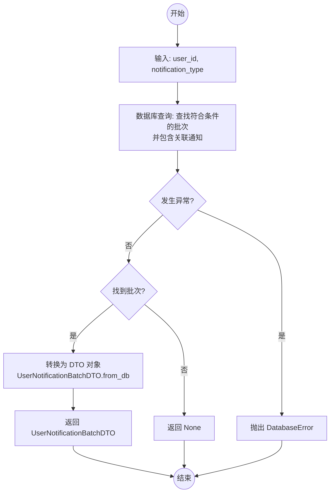
```mermaid
flowchart TD
    Start((开始)) --> Input[输入: user_id, notification_type]
    Input --> QueryDB[数据库查询: 查找符合条件的批次<br/>并包含关联通知]
    QueryDB --> CatchException{发生异常?}
    CatchException -- 是 --> RaiseError[抛出 DatabaseError]
    CatchException -- 否 --> CheckResult{找到批次?}
    CheckResult -- 是 --> ConvertToDTO[转换为 DTO 对象<br/>UserNotificationBatchDTO.from_db]
    ConvertToDTO --> ReturnDTO[返回 UserNotificationBatchDTO]
    CheckResult -- 否 --> ReturnNone[返回 None]
    ReturnDTO --> End((结束))
    ReturnNone --> End
    RaiseError --> End
```

#### 带注释源码

```python
async def get_user_notification_batch(
    user_id: str,
    notification_type: NotificationType,
) -> UserNotificationBatchDTO | None:
    try:
        # 使用 Prisma 客户端查询数据库
        # 查找匹配 user_id 和 notification_type 的第一条记录
        # include={"Notifications": True} 确保同时加载关联的通知事件列表
        batch = await UserNotificationBatch.prisma().find_first(
            where={"userId": user_id, "type": notification_type},
            include={"Notifications": True},
        )

        # 如果找到批次，将其从数据库模型转换为 DTO 对象
        # 否则返回 None
        return UserNotificationBatchDTO.from_db(batch) if batch else None
    except Exception as e:
        # 捕获数据库操作中的任何异常，并包装为自定义的 DatabaseError 抛出
        # 包含用户 ID 和通知类型以便于日志追踪
        raise DatabaseError(
            f"Failed to get user notification batch for user {user_id} and type {notification_type}: {e}"
        ) from e
```


### `get_all_batches_by_type`

根据指定的通知类型，检索数据库中所有包含至少一个通知事件的用户通知批次，并将其转换为数据传输对象（DTO）列表返回。

参数：

- `notification_type`：`NotificationType`，用于筛选特定类型的通知批次（如每日汇总、代理运行等）。

返回值：`list[UserNotificationBatchDTO]`，包含该类型且非空的通知批次对象列表。

#### 流程图

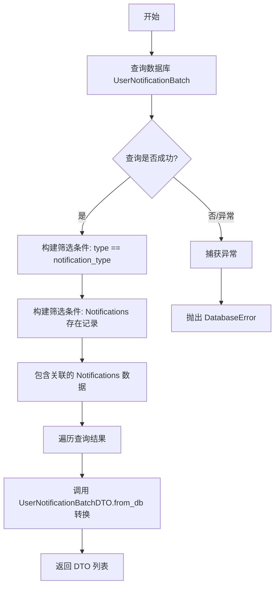
```mermaid
flowchart TD
    A[开始] --> B[查询数据库 UserNotificationBatch]
    B --> C{查询是否成功?}
    C -- 是 --> D[构建筛选条件: type == notification_type]
    D --> E[构建筛选条件: Notifications 存在记录]
    E --> F[包含关联的 Notifications 数据]
    F --> G[遍历查询结果]
    G --> H[调用 UserNotificationBatchDTO.from_db 转换]
    H --> I[返回 DTO 列表]
    C -- 否/异常 --> J[捕获异常]
    J --> K[抛出 DatabaseError]
```

#### 带注释源码

```python
async def get_all_batches_by_type(
    notification_type: NotificationType,
) -> list[UserNotificationBatchDTO]:
    try:
        # 使用 Prisma 客户端查询数据库
        batches = await UserNotificationBatch.prisma().find_many(
            where={
                # 筛选条件1: 批次类型必须匹配传入的 notification_type
                "type": notification_type,
                # 筛选条件2: 关联的 Notifications 表中必须至少存在一条记录
                # 这确保了只返回包含待处理通知的有效批次
                "Notifications": {
                    "some": {}  # Only return batches with at least one notification
                },
            },
            # 包含关联的 Notifications 数据，以便在 DTO 中使用
            include={"Notifications": True},
        )
        # 将数据库查询结果模型转换为 UserNotificationBatchDTO 对象列表
        return [UserNotificationBatchDTO.from_db(batch) for batch in batches]
    except Exception as e:
        # 捕获异常并转换为自定义的 DatabaseError 抛出
        raise DatabaseError(
            f"Failed to get all batches by type {notification_type}: {e}"
        ) from e
```


### `ContinuousAgentErrorData.validate_timezone`

该方法是 `ContinuousAgentErrorData` 类的一个 Pydantic 验证器，用于确保 `start_time` 和 `error_time` 字段在赋值时包含有效的时区信息。

参数：

-  `cls`：`type`，类方法的隐式参数，指代 `ContinuousAgentErrorData` 类本身。
-  `value`：`datetime`，待验证的日期时间对象值。

返回值：`datetime`，如果包含时区信息则返回该日期时间对象；否则抛出 `ValueError` 异常。

#### 流程图

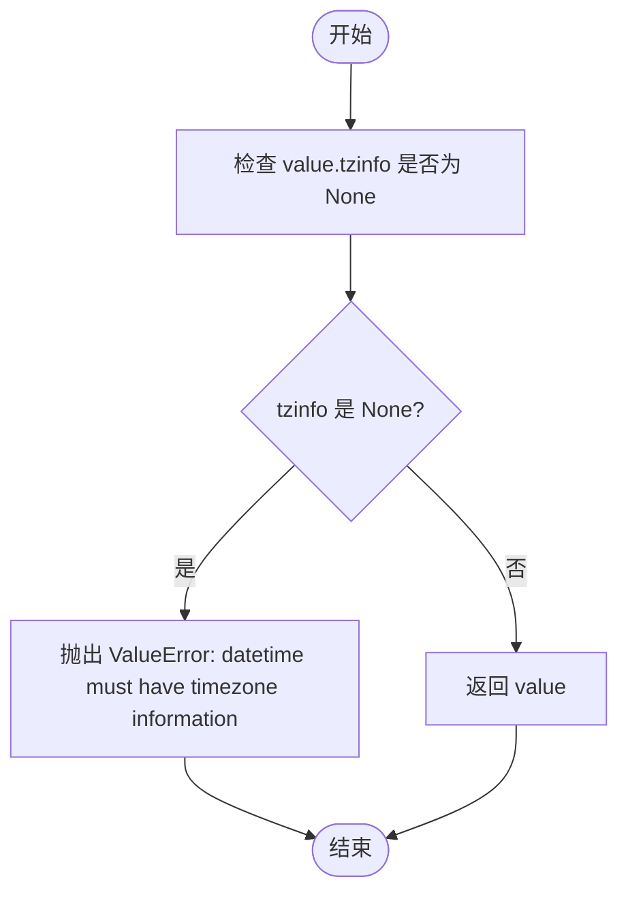
```mermaid
flowchart TD
    Start([开始]) --> CheckTzInfo[检查 value.tzinfo 是否为 None]
    CheckTzInfo --> IsNone{tzinfo 是 None?}
    IsNone -- 是 --> RaiseError[抛出 ValueError: datetime must have timezone information]
    IsNone -- 否 --> ReturnValue[返回 value]
    RaiseError --> End([结束])
    ReturnValue --> End([结束])
```

#### 带注释源码

```python
    @field_validator("start_time", "error_time")
    @classmethod
    def validate_timezone(cls, value: datetime):
        # 检查传入的 datetime 对象的 tzinfo 属性（时区信息）是否为 None
        if value.tzinfo is None:
            # 如果没有时区信息，抛出 ValueError，阻止数据验证通过
            raise ValueError("datetime must have timezone information")
        # 如果有时区信息，返回该值
        return value
```


### `BaseSummaryParams.validate_timezone`

该方法是 Pydantic 模型 `BaseSummaryParams` 的字段验证器，用于确保 `start_date` 和 `end_date` 字段包含时区信息，防止使用无时区的日期时间对象。

参数：

- `value`：`datetime`，待验证的日期时间字段值。

返回值：`datetime`，验证通过后的日期时间对象。

#### 流程图

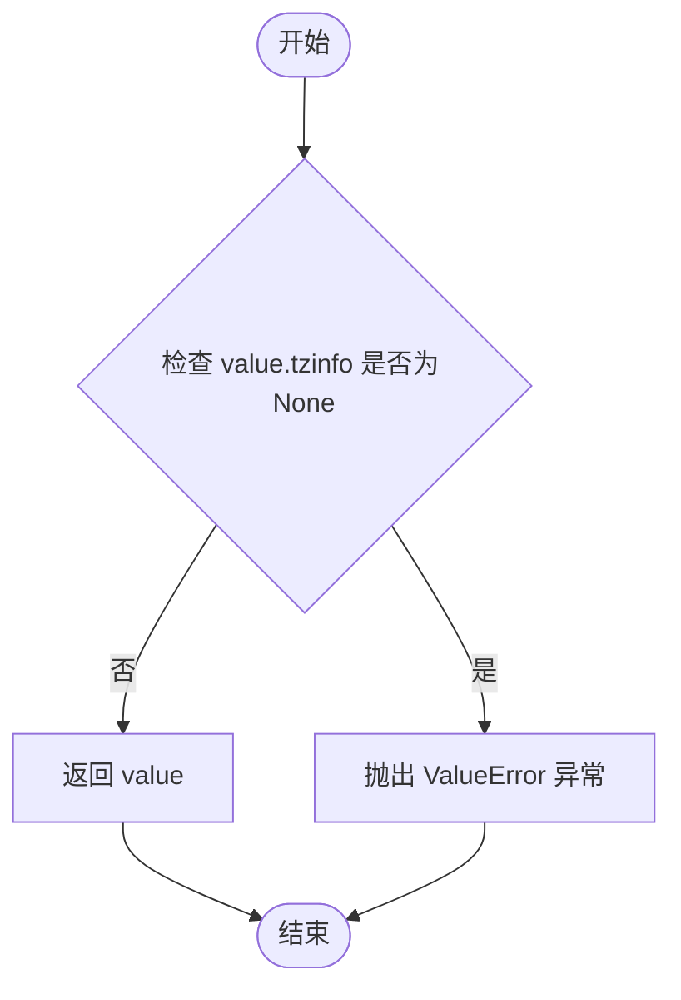
```mermaid
flowchart TD
    Start([开始]) --> Check{检查 value.tzinfo 是否为 None}
    Check -- 是 --> RaiseError[抛出 ValueError 异常]
    Check -- 否 --> ReturnValue[返回 value]
    ReturnValue --> End([结束])
    RaiseError --> End
```

#### 带注释源码

```python
    @field_validator("start_date", "end_date")
    def validate_timezone(cls, value):
        # 检查传入的 datetime 对象是否包含时区信息 (tzinfo)
        if value.tzinfo is None:
            # 如果不包含时区信息，则抛出 ValueError，要求必须包含时区
            raise ValueError("datetime must have timezone information")
        # 验证通过，返回原始值
        return value
```


### `DailySummaryParams.validate_timezone`

该方法用于验证 `DailySummaryParams` 类中的 `date` 字段是否包含时区信息，以确保日期时间数据的完整性和准确性。

参数：

- `cls`：`type`，Pydantic 验证器上下文，指向当前的类。
- `value`：`datetime`，待验证的 `date` 字段的值。

返回值：`datetime`，如果验证通过，返回原始的 datetime 对象。

#### 流程图

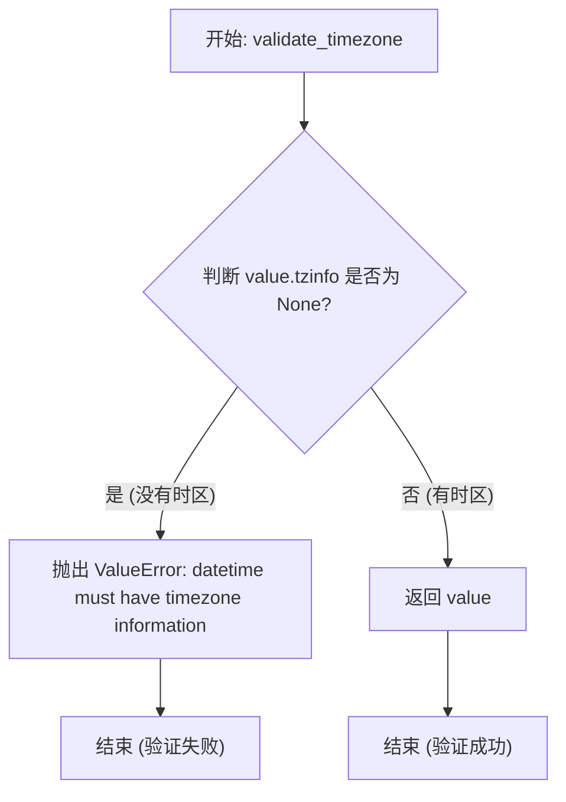
```mermaid
flowchart TD
    A["开始: validate_timezone"] --> B{判断 value.tzinfo 是否为 None?}
    B -- 是 (没有时区) --> C["抛出 ValueError: datetime must have timezone information"]
    B -- 否 (有时区) --> D["返回 value"]
    C --> E["结束 (验证失败)"]
    D --> F["结束 (验证成功)"]
```

#### 带注释源码

```python
    @field_validator("date")
    def validate_timezone(cls, value):
        # 检查传入的 datetime 对象的时区信息 (tzinfo) 是否为空
        if value.tzinfo is None:
            # 如果为空，抛出 ValueError，提示必须包含时区信息
            raise ValueError("datetime must have timezone information")
        # 验证通过，返回原值
        return value
```


### `WeeklySummaryParams.validate_timezone`

该方法用于验证 `start_date` 和 `end_date` 字段的 `datetime` 值是否包含时区信息，以确保时间数据的完整性和一致性。

参数：

-  `cls`：`type[WeeklySummaryParams]`，当前类的类型，由 Pydantic 自动传递。
-  `value`：`datetime`，待验证的字段值，即 `start_date` 或 `end_date` 的输入值。

返回值：`datetime`，如果验证通过，返回原始的 `datetime` 值；否则抛出异常。

#### 流程图

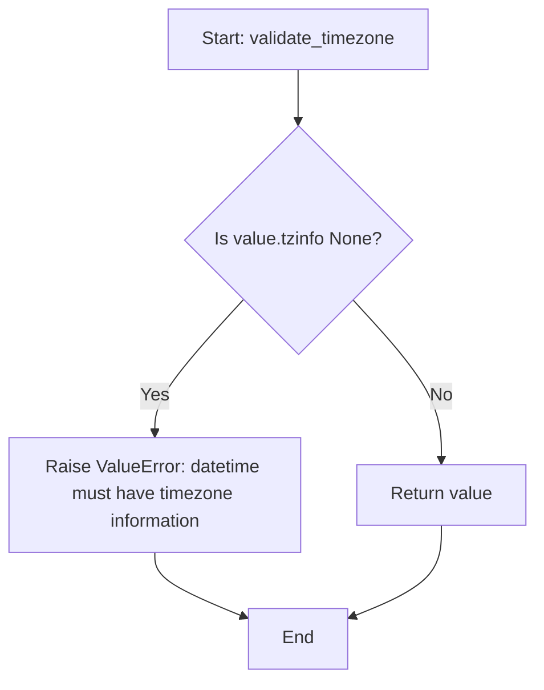
```mermaid
graph TD
    A[Start: validate_timezone] --> B{Is value.tzinfo None?}
    B -- Yes --> C[Raise ValueError: datetime must have timezone information]
    B -- No --> D[Return value]
    C --> E[End]
    D --> E
```

#### 带注释源码

```python
    @field_validator("start_date", "end_date")
    def validate_timezone(cls, value):
        # 检查传入的 datetime 对象是否包含时区信息 (tzinfo)
        if value.tzinfo is None:
            # 如果没有时区信息，抛出 ValueError 错误
            raise ValueError("datetime must have timezone information")
        # 验证通过，返回该值
        return value
```


### `DailySummaryData.validate_timezone`

验证 `DailySummaryData` 模型中的 `date` 字段是否包含时区信息，确保该 datetime 对象是时区感知的（timezone-aware），否则抛出错误。

参数：

- `value`：`datetime`，待验证的日期时间值。
- `cls`：`type`，类对象本身（由 Pydantic 验证器自动传入）。

返回值：`datetime`，验证通过后的日期时间值（包含时区信息）。

#### 流程图

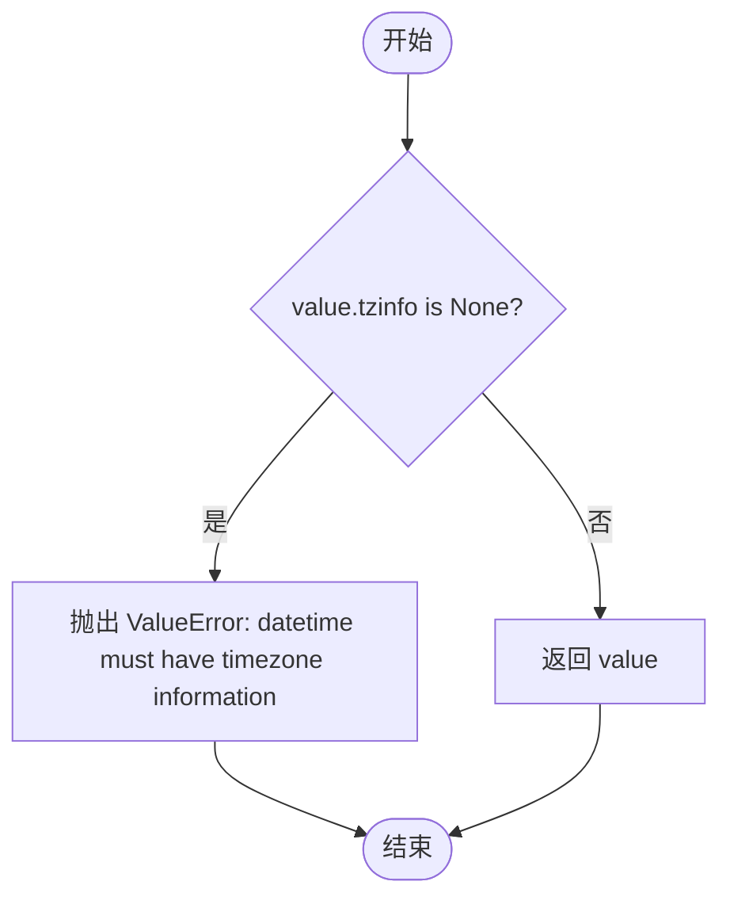
```mermaid
flowchart TD
    Start([开始]) --> Check{value.tzinfo is None?}
    Check -- 是 --> Error[抛出 ValueError: datetime must have timezone information]
    Check -- 否 --> Return[返回 value]
    Error --> End([结束])
    Return --> End
```

#### 带注释源码

```python
    @field_validator("date")
    def validate_timezone(cls, value):
        # 检查传入的日期时间对象是否包含时区信息 (tzinfo)
        if value.tzinfo is None:
            # 如果缺少时区信息，抛出 ValueError 异常
            raise ValueError("datetime must have timezone information")
        # 验证通过，返回原始值
        return value
```


### `WeeklySummaryData.validate_timezone`

这是一个 Pydantic 字段验证器，用于确保 `WeeklySummaryData` 类中的 `start_date` 和 `end_date` 字段包含有效的时区信息（tzinfo）。

参数：

- `cls`：`type`，被验证的类（通常是 `WeeklySummaryData` 或其父类）。
- `value`：`datetime`，待验证的日期时间对象。

返回值：`datetime`，如果验证通过，返回原始的日期时间对象；否则抛出异常。

#### 流程图

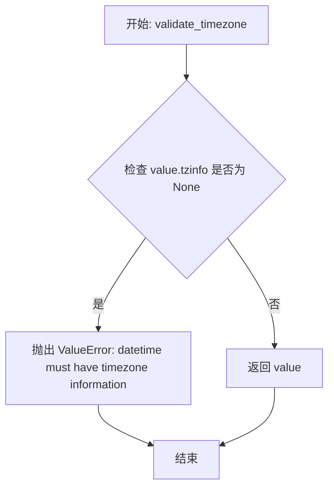
```mermaid
graph TD
    A[开始: validate_timezone] --> B{检查 value.tzinfo 是否为 None}
    B -- 是 --> C[抛出 ValueError: datetime must have timezone information]
    B -- 否 --> D[返回 value]
    C --> E[结束]
    D --> E
```

#### 带注释源码

```python
    @field_validator("start_date", "end_date")
    def validate_timezone(cls, value):
        # 检查传入的 datetime 对象是否包含时区信息 (tzinfo 属性不为 None)
        if value.tzinfo is None:
            # 如果没有时区信息，抛出 ValueError 异常，提示必须包含时区信息
            raise ValueError("datetime must have timezone information")
        # 验证通过，返回原始值
        return value
```


### `AgentApprovalData.validate_timezone`

该方法是 `AgentApprovalData` 类中的一个 Pydantic 验证器，用于确保 `reviewed_at` 字段包含时区信息，防止在处理代理审核时间数据时出现时区歧义或错误。

参数：

-  `cls`：`type`，表示类本身（作为类方法自动传入）。
-  `value`：`datetime`，待验证的日期时间对象，即 `reviewed_at` 字段的值。

返回值：`datetime`，验证通过后的日期时间对象，保证其包含时区信息。

#### 流程图

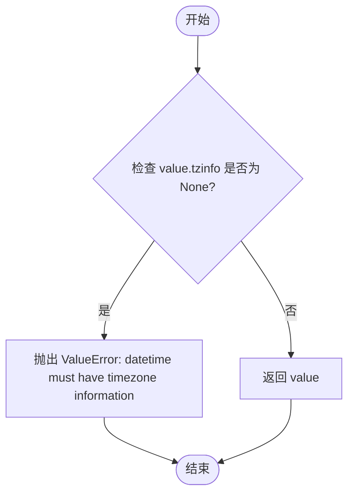
```mermaid
flowchart TD
    A([开始]) --> B{检查 value.tzinfo 是否为 None?}
    B -- 是 --> C[抛出 ValueError: datetime must have timezone information]
    B -- 否 --> D[返回 value]
    C --> E([结束])
    D --> E
```

#### 带注释源码

```python
    @field_validator("reviewed_at")
    @classmethod
    def validate_timezone(cls, value: datetime):
        # 检查传入的 datetime 对象是否包含时区信息 (tzinfo)
        if value.tzinfo is None:
            # 如果不包含时区信息，抛出 ValueError 阻止数据校验通过
            raise ValueError("datetime must have timezone information")
        # 如果包含时区信息，直接返回该值
        return value
```


### `AgentRejectionData.validate_timezone`

这是一个 Pydantic 模型验证器方法，专门用于验证 `AgentRejectionData` 类中的 `reviewed_at` 字段。其核心功能是确保传入的日期时间对象包含时区信息（tzinfo），如果缺少时区信息则会抛出 ValueError，从而保证时间数据的准确性和一致性。

参数：

- `value`：`datetime`，待验证的 `reviewed_at` 字段的日期时间对象。

返回值：`datetime`，验证通过后的日期时间对象。

#### 流程图

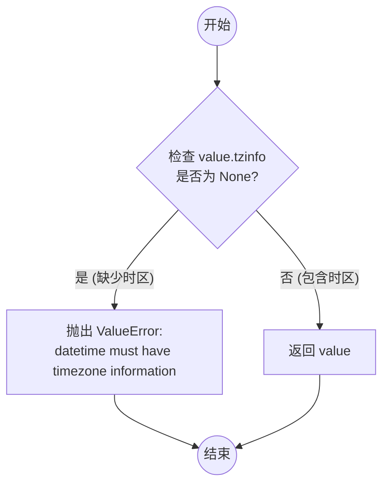
```mermaid
flowchart TD
    Start((开始)) --> Check{检查 value.tzinfo<br/>是否为 None?}
    Check -- 是 (缺少时区) --> Raise[抛出 ValueError:<br/>datetime must have timezone information]
    Check -- 否 (包含时区) --> Return[返回 value]
    Raise --> End((结束))
    Return --> End
```

#### 带注释源码

```python
    @field_validator("reviewed_at")  # 指定该验证器作用于 reviewed_at 字段
    @classmethod  # 声明为类方法
    def validate_timezone(cls, value: datetime):
        # 检查 datetime 对象的 tzinfo 属性是否为空
        if value.tzinfo is None:
            # 如果为空，说明没有时区信息，抛出 ValueError 阻止数据验证通过
            raise ValueError("datetime must have timezone information")
        # 如果包含时区信息，返回该值，允许验证通过
        return value
```


### `NotificationEventModel.strategy`

该属性方法通过委托给 `NotificationTypeOverride` 类，根据当前通知事件的类型（`self.type`）获取对应的队列处理策略（如立即发送、批量处理、汇总发送等）。

参数：

-  `self`：`NotificationEventModel`，当前通知事件模型的实例。

返回值：`QueueType`，表示当前通知事件应使用的处理策略枚举值。

#### 流程图

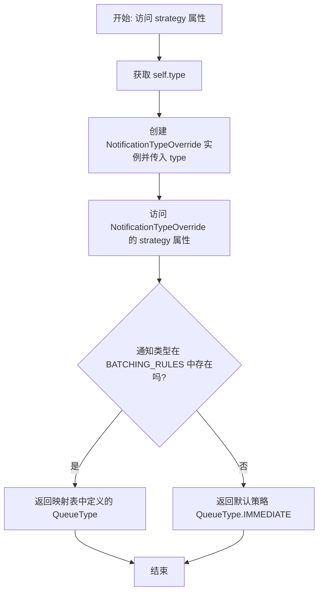
```mermaid
flowchart TD
    A[开始: 访问 strategy 属性] --> B[获取 self.type]
    B --> C[创建 NotificationTypeOverride 实例并传入 type]
    C --> D[访问 NotificationTypeOverride 的 strategy 属性]
    D --> E{通知类型在 BATCHING_RULES 中存在吗?}
    E -- 是 --> F[返回映射表中定义的 QueueType]
    E -- 否 --> G[返回默认策略 QueueType.IMMEDIATE]
    F --> H[结束]
    G --> H
```

#### 带注释源码

```python
    @property
    def strategy(self) -> QueueType:
        # 实例化 NotificationTypeOverride 辅助类，传入当前通知的类型 (self.type)
        # 并访问该辅助类的 strategy 属性以获取具体的队列策略
        return NotificationTypeOverride(self.type).strategy
```


### `NotificationEventModel.uppercase_type`

这是一个 Pydantic 字段验证器，用于在数据验证之前将 `type` 字段的值转换为大写字符串，以确保其与枚举类型或字符串常量的一致性。

参数：

-   `v`：`Any`，待验证的 `type` 字段的原始输入值。

返回值：`Any`，转换为大写的字符串值（如果输入是字符串），或者原始输入值。

#### 流程图

```mermaid
flowchart TD
    Start([开始]) --> Check{v 是否为字符串?}
    Check -- 是 --> Upper[调用 v.upper 转换为大写]
    Check -- 否 --> PassThrough[直接返回 v]
    Upper --> Return([返回处理后的值])
    PassThrough --> Return
```

#### 带注释源码

```python
    @field_validator("type", mode="before")
    def uppercase_type(cls, v):
        # 检查传入的值 v 是否为字符串类型
        if isinstance(v, str):
            # 如果是字符串，将其转换为大写形式
            # 这通常用于标准化枚举值，例如 "agent_run" -> "AGENT_RUN"
            return v.upper()
        # 如果不是字符串（例如已经是枚举实例或其它类型），则原样返回
        return v
```


### `NotificationEventModel.template`

该方法是一个属性（property），用于根据当前通知事件的具体类型（`self.type`），获取并返回对应的 HTML 模板文件名称。它通过委托给 `NotificationTypeOverride` 类来实现从枚举类型到文件名字符串的映射查找。

参数：

- `self`：`NotificationEventModel`，表示当前通知事件模型的实例，包含类型信息 `self.type`。

返回值：`str`，对应的模板文件名（例如 "agent_run.html"）。

#### 流程图

```mermaid
flowchart TD
    A[开始: 访问 template 属性] --> B[读取实例属性 self.type]
    B --> C[实例化 NotificationTypeOverride<br/>传入 self.type]
    C --> D[访问 override 实例的 template 属性]
    D --> E[返回映射的模板文件名字符串]
    E --> F[结束]
```

#### 带注释源码

```python
    @property
    def template(self) -> str:
        # 利用 NotificationTypeOverride 辅助类，
        # 根据当前实例的 notification_type (self.type)
        # 查找并返回预定义的模板文件名称。
        # 例如: NotificationType.AGENT_RUN -> "agent_run.html"
        return NotificationTypeOverride(self.type).template
```


### `NotificationTypeOverride.strategy`

根据初始化时传入的 `NotificationType`，返回对应的 `QueueType` 队列处理策略。该方法通过内部定义的映射字典（`BATCHING_RULES`）将不同的通知类型（如代理运行、余额不足、执行失败等）归类到批处理、立即发送、退避重试、摘要汇总或管理员处理等不同的处理逻辑中。如果未找到特定的映射类型，则默认返回立即发送（`IMMEDIATE`）策略。

参数：

-  无（该属性为 `@property`，依赖于实例初始化时传入的 `notification_type` 字段）。

返回值：`QueueType`，枚举类型，表示该通知类型对应的处理策略。

#### 流程图

```mermaid
graph TD
    A[开始访问 strategy 属性] --> B[读取实例变量 self.notification_type]
    B --> C[在 BATCHING_RULES 字典中查找映射]
    C --> D{是否存在对应的映射?}
    D -->|是| E[返回映射到的 QueueType 值]
    D -->|否| F[返回默认值 QueueType.IMMEDIATE]
    E --> G[结束]
    F --> G
```

#### 带注释源码

```python
    @property
    def strategy(self) -> QueueType:
        # 定义通知类型与队列策略的映射规则
        BATCHING_RULES = {
            # 这些通知由通知服务进行批处理
            NotificationType.AGENT_RUN: QueueType.BATCH,
            # 余额相关设置为立即发送（虽然注释提到批处理，但实际配置为IMMEDIATE）
            NotificationType.ZERO_BALANCE: QueueType.IMMEDIATE,
            NotificationType.LOW_BALANCE: QueueType.IMMEDIATE,
            # 错误类通知使用退避策略（Exponential backoff）
            NotificationType.BLOCK_EXECUTION_FAILED: QueueType.BACKOFF,
            NotificationType.CONTINUOUS_AGENT_ERROR: QueueType.BACKOFF,
            # 摘要类通知汇总为每日/每周/每月摘要
            NotificationType.DAILY_SUMMARY: QueueType.SUMMARY,
            NotificationType.WEEKLY_SUMMARY: QueueType.SUMMARY,
            NotificationType.MONTHLY_SUMMARY: QueueType.SUMMARY,
            # 退款请求发送给管理员
            NotificationType.REFUND_REQUEST: QueueType.ADMIN,
            NotificationType.REFUND_PROCESSED: QueueType.ADMIN,
            # 审批结果立即发送
            NotificationType.AGENT_APPROVED: QueueType.IMMEDIATE,
            NotificationType.AGENT_REJECTED: QueueType.IMMEDIATE,
        }
        # 根据 notification_type 获取策略，若未找到则默认为 IMMEDIATE
        return BATCHING_RULES.get(self.notification_type, QueueType.IMMEDIATE)
```


### `NotificationTypeOverride.template`

根据通知类型获取对应的HTML模板文件名，用于渲染通知内容。

参数：

- `self`：`NotificationTypeOverride`，类实例对象，包含当前的通知类型属性。

返回值：`str`，与通知类型对应的HTML模板文件名（例如 "agent_run.html"）。

#### 流程图

```mermaid
graph TD
    A[开始: 访问 template 属性] --> B[获取 self.notification_type]
    B --> C[在字典映射表中查找]
    C --> D[返回对应的模板文件名字符串]
    D --> E[结束]
```

#### 带注释源码

```python
    @property
    def template(self) -> str:
        """Returns template name for this notification type"""
        # 定义一个字典，将 NotificationType 枚举映射到具体的 HTML 模板文件名
        return {
            NotificationType.AGENT_RUN: "agent_run.html",
            NotificationType.ZERO_BALANCE: "zero_balance.html",
            NotificationType.LOW_BALANCE: "low_balance.html",
            NotificationType.BLOCK_EXECUTION_FAILED: "block_failed.html",
            NotificationType.CONTINUOUS_AGENT_ERROR: "agent_error.html",
            NotificationType.DAILY_SUMMARY: "daily_summary.html",
            NotificationType.WEEKLY_SUMMARY: "weekly_summary.html",
            NotificationType.MONTHLY_SUMMARY: "monthly_summary.html",
            NotificationType.REFUND_REQUEST: "refund_request.html",
            NotificationType.REFUND_PROCESSED: "refund_processed.html",
            NotificationType.AGENT_APPROVED: "agent_approved.html",
            NotificationType.AGENT_REJECTED: "agent_rejected.html",
        }[self.notification_type]
```


### `NotificationTypeOverride.subject`

根据初始化时指定的 `notification_type` 返回对应的邮件主题字符串。该方法通过字典映射将通知类型转换为静态文本或包含 Jinja2 模板语法的动态文本。

参数：

- `self`：`NotificationTypeOverride`，类的实例对象，通过 `self.notification_type` 获取当前的通知类型。

返回值：`str`，对应的邮件主题字符串。对于退款和代理审核类通知，字符串中包含 Jinja2 模板占位符（如 `{{data.amount}}`），用于在渲染阶段动态插入数据。

#### 流程图

```mermaid
flowchart LR
    A[Start] --> B[Access self.notification_type]
    B --> C[Lookup subject in dictionary]
    C --> D[Return mapped string]
    D --> E[End]
```

#### 带注释源码

```python
    @property
    def subject(self) -> str:
        # 定义通知类型到邮件主题的映射字典
        # 字符串中可能包含 Jinja2 模板语法（如 {{data.agent_name}}），用于后续动态渲染数据
        return {
            NotificationType.AGENT_RUN: "Agent Run Report",
            NotificationType.ZERO_BALANCE: "You're out of credits!",
            NotificationType.LOW_BALANCE: "Low Balance Warning!",
            NotificationType.BLOCK_EXECUTION_FAILED: "Uh oh! Block Execution Failed",
            NotificationType.CONTINUOUS_AGENT_ERROR: "Shoot! Continuous Agent Error",
            NotificationType.DAILY_SUMMARY: "Here's your daily summary!",
            NotificationType.WEEKLY_SUMMARY: "Look at all the cool stuff you did last week!",
            NotificationType.MONTHLY_SUMMARY: "We did a lot this month!",
            # 包含模板：根据退款请求的实际金额和用户名动态生成
            NotificationType.REFUND_REQUEST: "[ACTION REQUIRED] You got a ${{data.amount / 100}} refund request from {{data.user_name}}",
            # 包含模板：根据退款处理结果动态生成
            NotificationType.REFUND_PROCESSED: "Refund for ${{data.amount / 100}} to {{data.user_name}} has been processed",
            # 包含模板：动态插入被审核的 Agent 名称
            NotificationType.AGENT_APPROVED: "🎉 Your agent '{{data.agent_name}}' has been approved!",
            # 包含模板：动态插入被拒绝的 Agent 名称
            NotificationType.AGENT_REJECTED: "Your agent '{{data.agent_name}}' needs some updates",
        }[self.notification_type]
```


### `UserNotificationEventDTO.from_db`

该方法是一个静态工厂方法，负责将数据库中的 Prisma 模型对象（`NotificationEvent`）转换为应用程序内部的数据传输对象（`UserNotificationEventDTO`）。它实现了字段映射、数据类型转换（如将 Json 对象转为字典）以及字段命名风格的适配（如驼峰转下划线），以解耦数据库层与业务逻辑层。

参数：

-  `model`：`NotificationEvent`，从数据库查询得到的原始通知事件模型对象。

返回值：`UserNotificationEventDTO`，转换后的数据传输对象实例，包含格式化后的通知数据。

#### 流程图

```mermaid
flowchart TD
    Start([开始]) --> Input[接收 model: NotificationEvent]
    Input --> ExtractId[提取 model.id]
    Input --> ExtractType[提取 model.type]
    Input --> ExtractData[提取 model.data 并转为 dict]
    Input --> ExtractCreated[提取 model.createdAt]
    Input --> ExtractUpdated[提取 model.updatedAt]
    
    ExtractId --> Instantiate[实例化 UserNotificationEventDTO]
    ExtractType --> Instantiate
    ExtractData --> Instantiate
    ExtractCreated --> Instantiate
    ExtractUpdated --> Instantiate
    
    Instantiate --> ReturnObj[返回 DTO 实例]
    ReturnObj --> End([结束])
```

#### 带注释源码

```python
    @staticmethod
    def from_db(model: NotificationEvent) -> "UserNotificationEventDTO":
        return UserNotificationEventDTO(
            id=model.id,                 # 直接映射数据库记录的 ID
            type=model.type,             # 直接映射通知类型
            data=dict(model.data),       # 将数据库中的 Json 类型转换为 Python 字典
            created_at=model.createdAt,  # 将驼峰命名的 createdAt 映射为下划线命名的 created_at
            updated_at=model.updatedAt,  # 将驼峰命名的 updatedAt 映射为下划线命名的 updated_at
        )
```


### `UserNotificationBatchDTO.from_db`

该静态方法充当数据映射器，负责将数据库查询得到的 Prisma 模型对象 `UserNotificationBatch` 转换为应用层定义的数据传输对象 `UserNotificationBatchDTO`。在此过程中，它会处理基础字段的映射，并将关联的 `NotificationEvent` 列表也一并转换为对应的 DTO 格式，以解耦数据库模型与外部 API 响应结构。

参数：

-  `model`：`UserNotificationBatch`，从数据库查询得到的原始用户通知批次模型实例，包含用户ID、类型、时间戳及关联的通知事件列表。

返回值：`UserNotificationBatchDTO`，转换后的数据传输对象实例，包含格式化后的通知批次数据及其关联的通知事件列表。

#### 流程图

```mermaid
graph TD
    A[开始: from_db 方法] --> B[接收输入: model: UserNotificationBatch]
    B --> C[提取基础字段]
    C --> C1[映射 model.userId -> user_id]
    C --> C2[映射 model.type -> type]
    C --> C3[映射 model.createdAt -> created_at]
    C --> C4[映射 model.updatedAt -> updated_at]
    
    C1 --> D[处理关联通知列表]
    C2 --> D
    C3 --> D
    C4 --> D
    
    D --> E{判断 model.Notifications 是否存在}
    E -- 否 --> F[将 notifications 设为空列表]
    E -- 是 --> G[遍历 model.Notifications 列表]
    G --> H[对每个元素调用 UserNotificationEventDTO.from_db]
    H --> G
    
    F --> I[构造 UserNotificationBatchDTO 实例]
    G --> I
    
    I --> J[返回: UserNotificationBatchDTO]
    J --> K[结束]
```

#### 带注释源码

```python
    @staticmethod
    def from_db(model: UserNotificationBatch) -> "UserNotificationBatchDTO":
        return UserNotificationBatchDTO(
            # 将数据库模型中的 userId 字段映射到 DTO 的 user_id 字段
            user_id=model.userId,
            # 复制通知类型
            type=model.type,
            # 处理关联的通知事件列表：
            # 1. 获取 model.Notifications，如果其为 None 则默认为空列表 []
            # 2. 使用列表推导式遍历每个数据库中的通知事件对象
            # 3. 调用 UserNotificationEventDTO.from_db 将每个事件对象转换为 DTO
            notifications=[
                UserNotificationEventDTO.from_db(notification)
                for notification in model.Notifications or []
            ],
            # 将数据库模型中的 createdAt 字段映射到 DTO 的 created_at 字段
            created_at=model.createdAt,
            # 将数据库模型中的 updatedAt 字段映射到 DTO 的 updated_at 字段
            updated_at=model.updatedAt,
        )
```


## 关键组件


### Notification Data Models

Defines a hierarchy of Pydantic models (e.g., `AgentRunData`, `ZeroBalanceData`) that strictly validate the JSON payload structure for various notification events and enforce timezone constraints for datetime fields.

### Queue Strategy Management

Implements the logic via `NotificationTypeOverride` and `QueueType` to map specific notification types to delivery strategies (Immediate, Batch, Summary, Backoff, Admin) and select corresponding email templates and subjects.

### Batch Database Operations

Provides asynchronous functions to manage the lifecycle of notification batches in the database, including creating new batches, appending events to existing ones, retrieving pending notifications, and removing processed or failed events.

### Preference and Rate Limiting

Manages user-specific notification settings and throttling through `NotificationPreference`, tracking opt-in status per notification type and enforcing a maximum daily email limit to prevent spam.


## 问题及建议


### 已知问题

-   **代码重复：** 多个 Pydantic 数据模型（如 `DailySummaryData`、`AgentApprovalData`、`AgentRejectionData` 等）中重复定义了相同的时区验证方法 `validate_timezone`，违反了 DRY（Don't Repeat Yourself）原则。
-   **硬编码配置：** `NotificationTypeOverride` 类中硬编码了通知类型与队列策略、模板文件名、邮件主题的映射字典。这导致修改邮件文案或调整发送策略时需要重新部署代码，且增加了维护成本。
-   **内存排序风险：** 在 `get_user_notification_oldest_message_in_batch` 函数中，先将查询到的所有通知加载到内存，再使用 Python 的 `sorted` 函数进行排序。如果某个批次积累的通知数量巨大，会消耗过多内存并降低性能。
-   **并发安全隐患：** `create_or_add_to_user_notification_batch` 函数采用了“先查找（`find_unique`），后判断创建或更新”的逻辑模式。在高并发场景下，如果多个请求同时检测到 Batch 不存在并尝试创建，可能会引发数据库主键冲突或重复创建，虽然有异常捕获，但非原子性操作。
-   **异常信息模糊化：** 代码中多处数据库操作函数统一捕获 `Exception` 并抛出封装后的 `DatabaseError`，这丢失了原始的数据库堆栈和具体错误类型（如唯一约束违反、连接超时等），不利于问题排查和针对性的重试策略制定。

### 优化建议

-   **抽象公共验证逻辑：** 创建一个通用的 Pydantic 自定义类型（例如 `TzAwareDatetime`）或基类 Mixin，封装带时区检查的日期时间验证逻辑，并在所有需要的地方引用该类型，消除重复代码。
-   **配置外部化：** 将通知模板路径、邮件主题、默认策略等配置迁移到配置文件（如 YAML 或 JSON）或数据库配置表中。代码运行时读取配置，从而实现无需重新部署即可动态调整通知内容。
-   **利用数据库层面排序：** 在 `get_user_notification_oldest_message_in_batch` 函数中，利用 Prisma 的 `order_by` 参数（例如 `orderBy={'createdAt': 'asc'}`）直接在数据库查询时获取排序后的第一条记录，避免在应用层加载和处理全量数据。
-   **引入原子操作或 Upsert：** 在 `create_or_add_to_user_notification_batch` 中，利用数据库的 `upsert`（更新或插入）特性，或者通过数据库事务及行锁（如 `SELECT FOR UPDATE`）来保证操作的原子性，解决并发创建问题。
-   **细化异常处理与日志：** 区分处理不同类型的数据库异常。对于可重试的临时性错误（如连接断开）记录警告并重试，对于数据错误（如验证失败、唯一冲突）记录错误并抛出特定异常，保留原始异常链以便调试。


## 其它


### 设计目标与约束

设计目标旨在构建一个高度解耦、类型安全且可扩展的通知系统核心模块，负责通知数据的结构化定义、持久化存储逻辑以及基于策略的批处理管理。具体约束与目标如下：

1.  **类型安全与数据完整性**：严格利用 Python 类型注解和 Pydantic 模型确保所有进入系统的通知数据（`NotificationData`）符合既定结构，强制要求所有 `datetime` 对象必须包含时区信息，以防止因时区混淆导致的调度错误。
2.  **策略驱动的灵活性**：通过 `QueueType` 和 `NotificationTypeOverride` 实现通知分发策略的逻辑解耦。系统支持即时、批处理、摘要、退避和管理员等多种队列策略，且策略与数据模型分离，便于后续扩展新的通知类型而不修改核心逻辑。
3.  **数据持久化与一致性**：依赖 Prisma ORM 进行数据库操作，设计需确保在高并发场景下，通知批次的创建与更新操作（`create_or_add_to_user_notification_batch`）能够正确处理竞态条件。同时，通过事务机制（`transaction`）保证批次清空时的原子性，确保消息事件与批次记录同步删除。
4.  **容错与鲁棒性**：所有数据库交互必须包含异常捕获逻辑，并将底层异常统一封装为 `DatabaseError` 抛出，防止敏感数据库细节泄露至上层业务，同时确保日志记录足够详细以便追踪。

### 错误处理与异常设计

本模块采用分层异常处理策略，结合 Pydantic 的数据验证和自定义业务异常，确保系统稳定性：

1.  **验证层异常**：
    *   利用 Pydantic 的 `field_validator` 在数据模型实例化阶段进行严格校验。例如，检查 `datetime` 是否携带 `tzinfo`，若缺失则直接抛出 `ValueError`，阻止非法数据进入业务逻辑。
    *   通过 `BaseNotificationData` 的 `ConfigDict(extra="allow")` 允许额外字段，但在关键逻辑入口处（如 `create_or_add_to_user_notification_batch`）显式检查数据是否存在，若缺失则抛出 `ValueError`。

2.  **持久层异常**：
    *   所有涉及数据库 I/O 的异步函数（如 `create_or_add_to_user_notification_batch`, `empty_user_notification_batch` 等）均被包裹在 `try...except Exception` 块中。
    *   捕获到任何异常后，统一封装为 `backend.util.exceptions.DatabaseError`，并附带包含上下文信息（如 `user_id`, `notification_type`）的错误消息，使用 `raise ... from e` 保留原始异常堆栈以便调试。

3.  **空值处理**：
    *   查询操作（如 `get_user_notification_batch`）在未找到记录时返回 `None` 或空列表，而非抛出异常，由调用方根据业务需求决定是否视为错误。

### 数据流与状态机

**数据流**：
通知数据从业务逻辑产生，经过 Pydantic 模型封装和验证，随后序列化为 JSON 存入数据库。系统根据 `userId_type` 复合键判断是否创建新的 `UserNotificationBatch` 或追加到现有的批次中。后台任务（不在本文件定义，但为本模块的消费者）定期拉取批次，调用发送逻辑，最后通过本模块提供的清理函数移除已处理的通知记录。

**状态机：UserNotificationBatch (通知批次)**
通知批次的实体生命周期状态流转如下：

```mermaid
stateDiagram-v2
    [*] --> NonExistent: 初始状态
    NonExistent --> Active: 首条通知到达 (create_or_add)
    Active --> Active: 新通知到达 (create_or_add)
    Active --> Processing: 消费者拉取批次
    Processing --> PartiallyCleaned: 部分通知发送成功 (remove_notifications_from_batch)
    PartiallyCleaned --> Active: 剩余通知保留
    Processing --> Cleaning: 批次完全处理 (empty_user_notification_batch)
    Cleaning --> NonExistent: 事务提交成功
    PartiallyCleaned --> Cleaning: 剩余通知也被处理
    
    note right of Active
        状态特征：
        - 数据库记录存在
        - 关联的 NotificationEvent > 0
    end note

    note right of Cleaning
        事务保护：
        1. 删除 NotificationEvent
        2. 删除 UserNotificationBatch
        失败则回滚
    end note
```

### 外部依赖与接口契约

本模块严重依赖外部库和内部工具包，其接口契约如下：

1.  **数据库访问层**：
    *   **依赖**：`prisma.models` (NotificationEvent, UserNotificationBatch) 及其客户端生成代码。
    *   **契约**：假设 `NotificationEvent` 表包含 `id`, `type`, `data` (Json), `createdAt`, `updatedAt` 字段；`UserNotificationBatch` 表包含 `id`, `userId`, `type` 字段。假设存在唯一约束 `userId_type`。Prisma 客户端需提供 `find_unique`, `create`, `update`, `delete_many` 等标准 CRUD 方法。

2.  **数据验证与序列化**：
    *   **依赖**：`pydantic` (BaseModel, Field, validator)。
    *   **契约**：Pydantic v2 语法。`backend.util.json.SafeJson` 负责将对象序列化为数据库可接受的 JSON 格式，需确保能处理复杂对象（如 datetime）的转换。

3.  **异常与日志工具**：
    *   **依赖**：`backend.util.exceptions.DatabaseError`, `backend.util.logging.TruncatedLogger`。
    *   **契约**：`DatabaseError` 必须接受字符串参数作为错误描述。`TruncatedLogger` 提供与标准 `logging.Logger` 兼容的接口（如 `info`, `error`），并具备截断超长日志的能力。

4.  **事务管理**：
    *   **依赖**：`.db.transaction`。
    *   **契约**：提供一个异步上下文管理器 (`async with transaction() as tx`)，在该上下文中执行的操作属于同一个数据库事务。若上下文块内抛出异常，事务自动回滚；否则提交。

### 并发控制与事务管理

考虑到通知系统可能面临高并发写入场景，本模块在以下方面实施了并发控制：

1.  **事务原子性**：
    *   在 `empty_user_notification_batch` 函数中，使用了 `async with transaction() as tx`。这确保了删除关联的 `NotificationEvent` 记录和删除父级 `UserNotificationBatch` 记录这两个操作要么全部成功，要么全部失败。这防止了“孤儿”事件记录的产生（即批次已删除但事件仍存在）。

2.  **数据库层面的竞态处理**：
    *   `create_or_add_to_user_notification_batch` 逻辑采用“先查后写”模式（Find Unique -> Create or Update）。在极高并发下，可能存在两个线程同时发现不存在记录并尝试创建的情况。当前设计依赖数据库的唯一约束 (`userId_type`) 来防止重复插入，其中一个事务将因违反唯一约束而失败，进而被外层的 `try...except` 捕获并转换为 `DatabaseError`，由上层决定是否重试。
    *   *优化建议*：未来可考虑使用 Prisma 的 `upsert` 操作原子化“创建或追加”逻辑，减少一次数据库往返并简化代码。

3.  **批处理清理的幂等性**：
    *   `remove_notifications_from_batch` 设计为幂等操作。传入空的 `notification_ids` 列表会直接返回，且操作基于明确的 ID 列表。即使并发清理，只要 ID 不重叠，即可安全执行；清理完毕后会自动检查并删除空批次。

    