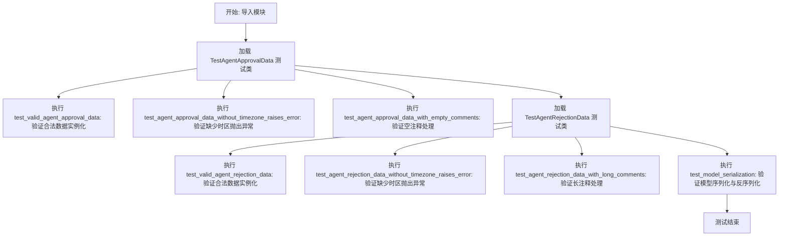
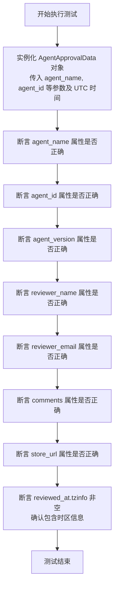
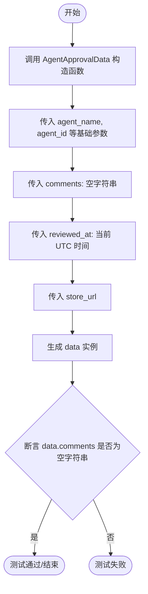
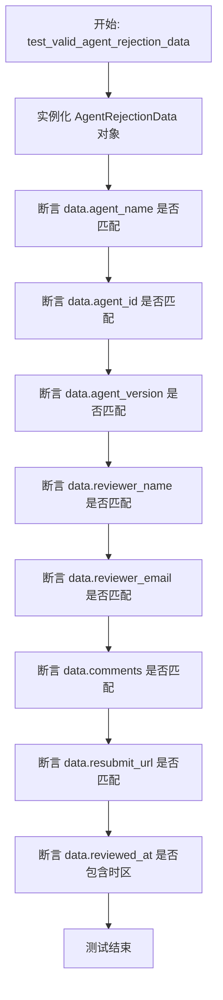
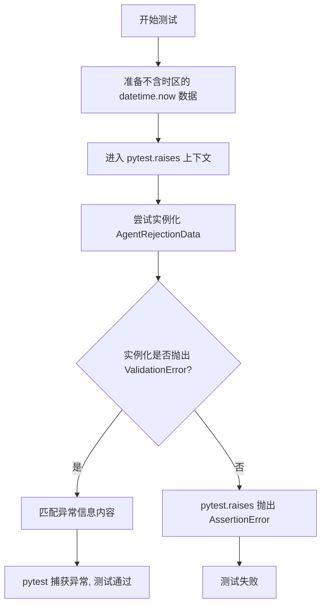
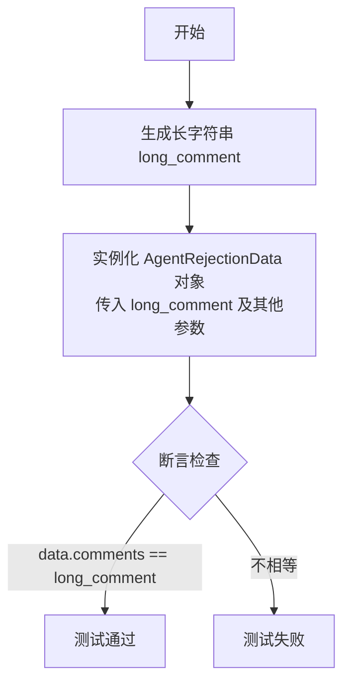
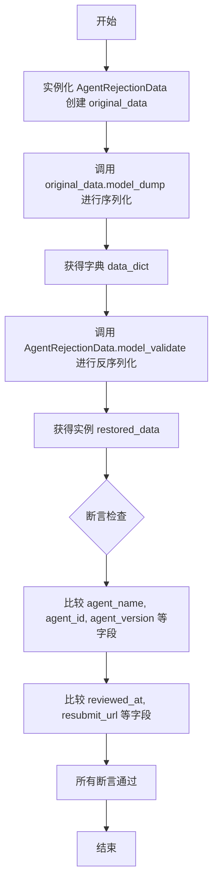

# `.\AutoGPT\autogpt_platform\backend\backend\data\notifications_test.py` 详细设计文档

该文件是针对后端通知数据模型的单元测试套件，主要测试 `AgentApprovalData` 和 `AgentRejectionData` 两种 Pydantic 模型的行为，包括合法数据的实例化、必填字段校验（如时区信息）、边界条件处理（如空值或长文本）以及模型的序列化与反序列化功能。

## 整体流程



## 类结构

```
TestAgentApprovalData (测试类)
TestAgentRejectionData (测试类)
```

## 全局变量及字段


### `AgentApprovalData.agent_name`
    
The name of the agent being approved.

类型：`str`
    


### `AgentApprovalData.agent_id`
    
The unique identifier for the agent.

类型：`str`
    


### `AgentApprovalData.agent_version`
    
The version number of the agent.

类型：`int`
    


### `AgentApprovalData.reviewer_name`
    
The name of the person who reviewed the agent.

类型：`str`
    


### `AgentApprovalData.reviewer_email`
    
The email address of the reviewer.

类型：`str`
    


### `AgentApprovalData.comments`
    
Comments provided during the approval process.

类型：`str`
    


### `AgentApprovalData.reviewed_at`
    
The timestamp when the review took place, must include timezone information.

类型：`datetime`
    


### `AgentApprovalData.store_url`
    
The URL pointing to the agent in the store.

类型：`str`
    


### `AgentRejectionData.agent_name`
    
The name of the agent being rejected.

类型：`str`
    


### `AgentRejectionData.agent_id`
    
The unique identifier for the agent.

类型：`str`
    


### `AgentRejectionData.agent_version`
    
The version number of the agent.

类型：`int`
    


### `AgentRejectionData.reviewer_name`
    
The name of the person who reviewed the agent.

类型：`str`
    


### `AgentRejectionData.reviewer_email`
    
The email address of the reviewer.

类型：`str`
    


### `AgentRejectionData.comments`
    
The reason or feedback for the rejection.

类型：`str`
    


### `AgentRejectionData.reviewed_at`
    
The timestamp when the review took place, must include timezone information.

类型：`datetime`
    


### `AgentRejectionData.resubmit_url`
    
The URL to be used for resubmitting the agent.

类型：`str`
    
    

## 全局函数及方法


### `TestAgentApprovalData.test_valid_agent_approval_data`

该方法用于测试 `AgentApprovalData` 模型的有效实例化。它验证了在提供包含所有必需字段和带有时区信息的时间戳的有效输入数据时，模型能够正确创建，并且其属性值与输入值保持一致，同时也验证了时间戳对象的时区信息是否被正确保留。

参数：

- `self`：`TestAgentApprovalData`，测试类的实例，用于访问测试上下文。

返回值：`None`，该方法是一个单元测试函数，主要用于执行断言验证，没有显式的返回值。

#### 流程图



#### 带注释源码

```python
def test_valid_agent_approval_data(self):
    """Test creating valid AgentApprovalData."""
    # 1. 准备测试数据并实例化 AgentApprovalData 模型
    # 包含代理基本信息、审核者信息、评论、带时区的审核时间及商店链接
    data = AgentApprovalData(
        agent_name="Test Agent",
        agent_id="test-agent-123",
        agent_version=1,
        reviewer_name="John Doe",
        reviewer_email="john@example.com",
        comments="Great agent, approved!",
        reviewed_at=datetime.now(timezone.utc),
        store_url="https://app.autogpt.com/store/test-agent-123",
    )

    # 2. 执行断言，验证实例化后的对象属性值与输入值是否一致
    assert data.agent_name == "Test Agent"
    assert data.agent_id == "test-agent-123"
    assert data.agent_version == 1
    assert data.reviewer_name == "John Doe"
    assert data.reviewer_email == "john@example.com"
    assert data.comments == "Great agent, approved!"
    assert data.store_url == "https://app.autogpt.com/store/test-agent-123"
    
    # 3. 特殊断言，验证时间戳字段是否包含时区信息
    assert data.reviewed_at.tzinfo is not None
```


### `TestAgentApprovalData.test_agent_approval_data_without_timezone_raises_error`

该测试方法验证了当尝试使用不包含时区信息（naive datetime）的 `reviewed_at` 字段创建 `AgentApprovalData` 实例时，系统是否会抛出带有特定错误消息的 `ValidationError`。

参数：

- `self`：`TestAgentApprovalData`，测试类的实例，用于访问类上下文或测试夹具。

返回值：`None`，该方法为测试函数，无返回值。

#### 流程图

```mermaid
flowchart TD
    A([开始测试]) --> B[尝试实例化 AgentApprovalData]
    B --> C[传入不包含时区的 datetime.now() 作为 reviewed_at]
    C --> D{是否抛出 ValidationError?}
    D -- 否 --> E[测试失败]
    D -- 是 --> F{错误信息是否匹配 'datetime must have timezone information'?}
    F -- 否 --> E
    F -- 是 --> G([测试通过])
```

#### 带注释源码

```python
    def test_agent_approval_data_without_timezone_raises_error(self):
        """Test that AgentApprovalData raises error without timezone."""
        # 使用 pytest.raises 上下文管理器验证预期的 ValidationError
        # match 参数用于检查异常消息中是否包含指定的字符串
        with pytest.raises(
            ValidationError, match="datetime must have timezone information"
        ):
            # 尝试创建 AgentApprovalData 实例
            AgentApprovalData(
                agent_name="Test Agent",
                agent_id="test-agent-123",
                agent_version=1,
                reviewer_name="John Doe",
                reviewer_email="john@example.com",
                comments="Great agent, approved!",
                # 关键测试点：datetime.now() 未传入 timezone 参数，生成的是不带时区的时间
                # 预期这将触发 Pydantic 的验证错误
                reviewed_at=datetime.now(),  # No timezone
                store_url="https://app.autogpt.com/store/test-agent-123",
            )
```


### `TestAgentApprovalData.test_agent_approval_data_with_empty_comments`

测试 `AgentApprovalData` 模型在传入空字符串作为评论（comments）参数时的行为，验证模型是否能正确接受并存储空评论。

参数：

-  `self`：`TestAgentApprovalData`，测试类的实例，用于访问测试上下文。

返回值：`None`，该函数为测试方法，不返回显式值，通过断言验证逻辑。

#### 流程图



#### 带注释源码

```python
def test_agent_approval_data_with_empty_comments(self):
    """Test AgentApprovalData with empty comments."""
    # 实例化 AgentApprovalData，将 comments 字段显式设置为空字符串
    data = AgentApprovalData(
        agent_name="Test Agent",
        agent_id="test-agent-123",
        agent_version=1,
        reviewer_name="John Doe",
        reviewer_email="john@example.com",
        comments="",  # Empty comments，测试空值是否被允许
        reviewed_at=datetime.now(timezone.utc),
        store_url="https://app.autogpt.com/store/test-agent-123",
    )

    # 断言验证：确认实例中的 comments 属性确实被保存为空字符串
    assert data.comments == ""
```


### `TestAgentRejectionData.test_valid_agent_rejection_data`

该方法用于测试创建有效的 `AgentRejectionData` 数据模型实例，验证所有字段是否正确赋值，并确保时间戳包含时区信息。

参数：

-  `self`：`TestAgentRejectionData`，测试类实例的引用，用于访问测试上下文。

返回值：`None`，该函数为单元测试方法，通过断言进行验证，无显式返回值。

#### 流程图



#### 带注释源码

```python
    def test_valid_agent_rejection_data(self):
        """Test creating valid AgentRejectionData."""
        # 创建 AgentRejectionData 实例，填充测试数据，包括 UTC 时区的当前时间
        data = AgentRejectionData(
            agent_name="Test Agent",
            agent_id="test-agent-123",
            agent_version=1,
            reviewer_name="Jane Doe",
            reviewer_email="jane@example.com",
            comments="Please fix the security issues before resubmitting.",
            reviewed_at=datetime.now(timezone.utc),
            resubmit_url="https://app.autogpt.com/build/test-agent-123",
        )

        # 验证 agent_name 字段赋值正确
        assert data.agent_name == "Test Agent"
        # 验证 agent_id 字段赋值正确
        assert data.agent_id == "test-agent-123"
        # 验证 agent_version 字段赋值正确
        assert data.agent_version == 1
        # 验证 reviewer_name 字段赋值正确
        assert data.reviewer_name == "Jane Doe"
        # 验证 reviewer_email 字段赋值正确
        assert data.reviewer_email == "jane@example.com"
        # 验证 comments 字段赋值正确
        assert data.comments == "Please fix the security issues before resubmitting."
        # 验证 resubmit_url 字段赋值正确
        assert data.resubmit_url == "https://app.autogpt.com/build/test-agent-123"
        # 验证 reviewed_at 时间对象包含时区信息 (tzinfo 不为空)
        assert data.reviewed_at.tzinfo is not None
```


### `TestAgentRejectionData.test_agent_rejection_data_without_timezone_raises_error`

该测试方法用于验证当创建 `AgentRejectionData` 实例时，如果提供的 `reviewed_at` 参数不包含时区信息，系统是否会严格按照数据验证规则抛出 `ValidationError` 异常。

参数：

-  `self`：`TestAgentRejectionData`，测试类的实例，由 pytest 框架自动传入，用于访问测试上下文。

返回值：`None`，该函数为测试方法，不直接返回值，而是通过断言异常抛出来验证逻辑正确性。

#### 流程图



#### 带注释源码

```python
def test_agent_rejection_data_without_timezone_raises_error(self):
    """Test that AgentRejectionData raises error without timezone."""
    # 使用 pytest.raises 上下文管理器，预期执行以下代码块时会抛出 ValidationError
    # 并且异常消息需匹配 "datetime must have timezone information"
    with pytest.raises(
        ValidationError, match="datetime must have timezone information"
    ):
        # 尝试创建 AgentRejectionData 实例
        AgentRejectionData(
            agent_name="Test Agent",
            agent_id="test-agent-123",
            agent_version=1,
            reviewer_name="Jane Doe",
            reviewer_email="jane@example.com",
            comments="Please fix the security issues.",
            reviewed_at=datetime.now(),  # 故意传入不带时区信息的 datetime 对象，触发验证错误
            resubmit_url="https://app.autogpt.com/build/test-agent-123",
        )
```


### `TestAgentRejectionData.test_agent_rejection_data_with_long_comments`

测试 `AgentRejectionData` 模型在接收到非常长的评论文本时的行为，验证模型能否正确实例化并存储长字符串数据，确保不会因文本长度过长而导致数据截断或验证错误。

参数：

-  `self`：`TestAgentRejectionData`，测试类的实例引用，用于访问测试上下文或其他测试方法。

返回值：`None`，该函数没有显式返回值，通过断言来验证逻辑的正确性，若无异常抛出则测试通过。

#### 流程图



#### 带注释源码

```python
def test_agent_rejection_data_with_long_comments(self):
    """Test AgentRejectionData with long comments."""
    # 步骤 1: 准备测试数据，生成一个由1000个"A"字符组成的超长字符串
    long_comment = "A" * 1000  # Very long comment
    
    # 步骤 2: 实例化 AgentRejectionData 模型，将长字符串赋值给 comments 字段
    data = AgentRejectionData(
        agent_name="Test Agent",
        agent_id="test-agent-123",
        agent_version=1,
        reviewer_name="Jane Doe",
        reviewer_email="jane@example.com",
        comments=long_comment,  # 注入长评论
        reviewed_at=datetime.now(timezone.utc),
        resubmit_url="https://app.autogpt.com/build/test-agent-123",
    )

    # 步骤 3: 断言验证模型中的 comments 字段确实保存了完整的长字符串，未被截断
    assert data.comments == long_comment
```


### `TestAgentRejectionData.test_model_serialization`

验证 `AgentRejectionData` 模型对象能够正确地序列化为字典，并且能够从该字典反序列化回原始模型对象，确保数据在转换过程中的一致性和完整性。

参数：

-   `self`：`TestAgentRejectionData`，测试类的实例，用于访问测试上下文。

返回值：`None`，无返回值（该方法为单元测试函数，主要执行断言逻辑）。

#### 流程图



#### 带注释源码

```python
    def test_model_serialization(self):
        """Test that models can be serialized and deserialized."""
        # 1. 创建一个包含完整字段的 AgentRejectionData 实例作为原始数据
        original_data = AgentRejectionData(
            agent_name="Test Agent",
            agent_id="test-agent-123",
            agent_version=1,
            reviewer_name="Jane Doe",
            reviewer_email="jane@example.com",
            comments="Please fix the issues.",
            reviewed_at=datetime.now(timezone.utc),
            resubmit_url="https://app.autogpt.com/build/test-agent-123",
        )

        # 2. 将模型对象序列化为字典
        data_dict = original_data.model_dump()

        # 3. 将字典反序列化回模型对象
        restored_data = AgentRejectionData.model_validate(data_dict)

        # 4. 断言验证反序列化后的对象字段与原始对象完全一致
        assert restored_data.agent_name == original_data.agent_name
        assert restored_data.agent_id == original_data.agent_id
        assert restored_data.agent_version == original_data.agent_version
        assert restored_data.reviewer_name == original_data.reviewer_name
        assert restored_data.reviewer_email == original_data.reviewer_email
        assert restored_data.comments == original_data.comments
        assert restored_data.reviewed_at == original_data.reviewed_at
        assert restored_data.resubmit_url == original_data.resubmit_url
```


## 关键组件


### TestAgentApprovalData

Encapsulates the test suite for the `AgentApprovalData` notification model, ensuring data integrity, timezone compliance, and field assignment accuracy.

### TestAgentRejectionData

Encapsulates the test suite for the `AgentRejectionData` notification model, covering serialization, edge case handling (such as input length), and strict timezone validation.


## 问题及建议


### 已知问题

-   **代码重复**：在多个测试方法中重复编写了对象实例化的逻辑（如 `AgentApprovalData` 和 `AgentRejectionData` 的初始化代码），这增加了维护成本，当模型字段变更时需要修改多处。
-   **硬编码的环境配置**：测试代码中硬编码了具体的 URL 字符串（如 `https://app.autogpt.com/...`），这使得测试与特定的环境配置强耦合，一旦生产环境 URL 结构变更，测试将无法通过。
-   **测试覆盖度不足**：目前的测试主要关注正常路径和时区校验，但缺乏对其他 Pydantic 内置验证机制的测试，例如无效的邮箱格式、无效的 URL 格式、或者字符串字段的长度限制（如果有的话）。

### 优化建议

-   **引入 Pytest Fixtures**：利用 `@pytest.fixture` 封装通用的数据生成逻辑，以减少重复代码，提高测试的可读性和可维护性。
-   **使用参数化测试**：利用 `@pytest.mark.parametrize` 将针对不同模型（如 `AgentApprovalData` 和 `AgentRejectionData`）的相同验证逻辑（如时区验证）合并，以精简测试代码。
-   **引入属性测试**：建议引入 `Hypothesis` 库进行基于属性的测试，自动生成各种边界值（如极长字符串、特殊字符）来验证模型的健壮性，替代手动构造长字符串的测试用例。
-   **增加断言描述信息**：在 `assert` 语句中添加自定义的错误消息，以便在测试失败时能更直观地了解具体是哪个字段的预期值不符，减少调试时间。


## 其它


### 设计目标与约束

**设计目标：**
定义一套严格的数据模型，用于规范化代理审查流程中的审批与拒绝通知数据，确保在系统各模块间传递的信息结构一致且准确。

**约束条件：**
1. **时区强制约束：** 所有涉及的时间戳（特别是 `reviewed_at`）必须包含时区信息，禁止使用朴素时间以避免时区混淆。
2. **类型安全：** 利用 Pydantic 强制执行严格的类型检查，确保字段类型与预期一致。
3. **可序列化：** 模型必须支持序列化为字典及反序列化回对象，以适应存储和网络传输需求。

### 数据流与状态机

**数据流：**
1. 审查动作触发（用户提交审批/拒绝）。
2. 构建原始数据字典（包含代理信息、审查者信息、时间戳等）。
3. 数据进入 `AgentApprovalData` 或 `AgentRejectionData` 模型进行 Pydantic 验证。
4. 验证通过后生成标准化的模型实例。
5. 模型实例被序列化并发送至通知服务或存储层。

**状态机：**
该模型对应审查流程的终态：
- **Approved（已批准）：** 生成 `AgentApprovalData`，包含指向商店页面的链接（`store_url`）。
- **Rejected（已拒绝）：** 生成 `AgentRejectionData`，包含指向构建/编辑页面的链接（`resubmit_url`）。

### 错误处理与异常设计

**异常类型：**
主要依赖 `pydantic.ValidationError` 处理数据校验失败。

**处理策略：**
1. **时间验证失败：** 当传入的 `datetime` 对象缺少 `tzinfo`（时区信息）时，抛出 `ValidationError`，错误信息应明确提示 "datetime must have timezone information"。
2. **类型不匹配：** 若字段类型与定义不符（如将整数传给字符串字段），由 Pydantic 自动捕获并抛出验证错误。
3. **测试层断言：** 在单元测试中，使用 `pytest.raises` 上下文管理器精确捕获预期的验证错误，确保错误逻辑的正确性。

### 外部依赖与接口契约

**外部依赖：**
1. **Pydantic：** 用于数据模型定义、验证和序列化的核心库。
2. **Python Standard Library (`datetime`)：** 提供时间类型及 UTC 时区支持。
3. **Pytest：** 用于执行测试用例和断言的测试框架。

**接口契约：**
- **输入契约：** 调用方必须提供包含所有必填字段的字典或关键字参数。时间戳字段必须为 `datetime` 对象且带有时区。
- **输出契约：** 模型实例保证所有字段均已通过类型转换和验证。通过 `model_dump()` 方法可输出标准的 Python 字典，通过 `model_validate()` 可从字典无损还原对象。

### 测试策略与边界情况

**测试策略：**
采用单元测试覆盖核心数据模型，验证 Pydantic 模型的验证逻辑、序列化能力及对边界条件的容错性。

**关键边界情况：**
1. **时区缺失：** 验证模型是否正确拒绝不带时区的 `datetime.now()`，确保时间数据的严谨性。
2. **空字符串字段：** 验证 `comments` 等文本字段是否允许空字符串 `""`，确保系统支持无理由的快速审批/拒绝。
3. **长文本处理：** 验证系统对超长评论（如 1000 字符）的处理能力，确保无截断错误。
4. **序列化往返：** 验证 `model_dump()` 与 `model_validate()` 的组合是否能完美保存数据原貌，特别是日期对象和自定义类型的保真度。

    