# `.\AutoGPT\autogpt_platform\backend\backend\data\onboarding.py` 详细设计文档

该代码实现了用户引导管理系统，负责处理用户入职流程的状态管理、基于里程碑的积分奖励发放、Agent 推荐算法以及运行统计追踪。

## 整体流程

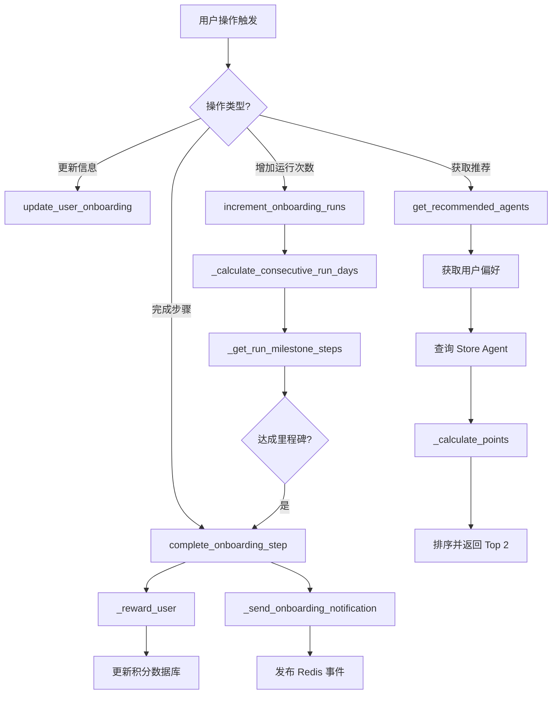

## 类结构

```
pydantic.BaseModel
└── UserOnboardingUpdate
```

## 全局变量及字段


### `REASON_MAPPING`
    
将用户选择的使用理由 ID 映射到代理分类搜索关键词的字典。

类型：`dict[str, list[str]]`
    


### `POINTS_AGENT_COUNT`
    
用于计算积分并推荐给用户的代理数量上限。

类型：`int`
    


### `MIN_AGENT_COUNT`
    
启用用户引导功能所需的市场代理最小数量。

类型：`int`
    


### `FrontendOnboardingStep`
    
定义前端可用的用户引导步骤类型的字面量别名。

类型：`Literal`
    


### `UserOnboardingUpdate.walletShown`
    
标记用户是否已查看过钱包界面。

类型：`Optional[bool]`
    


### `UserOnboardingUpdate.notified`
    
用户已收到通知的引导步骤列表。

类型：`Optional[list[OnboardingStep]]`
    


### `UserOnboardingUpdate.usageReason`
    
用户选择的使用该产品的主要原因或类别。

类型：`Optional[str]`
    


### `UserOnboardingUpdate.integrations`
    
用户选择集成的第三方服务或工具列表。

类型：`Optional[list[str]]`
    


### `UserOnboardingUpdate.otherIntegrations`
    
用户手动填写的其他未在预设列表中的集成服务。

类型：`Optional[str]`
    


### `UserOnboardingUpdate.selectedStoreListingVersionId`
    
用户在引导过程中从商店选择的特定代理版本 ID。

类型：`Optional[str]`
    


### `UserOnboardingUpdate.agentInput`
    
用户为引导任务中的代理提供的输入数据字典。

类型：`Optional[dict[str, Any]]`
    


### `UserOnboardingUpdate.onboardingAgentExecutionId`
    
与引导步骤关联的代理执行实例的唯一标识符。

类型：`Optional[str]`
    
    

## 全局函数及方法


### `get_user_onboarding`

该函数用于获取指定用户的入职引导记录，如果记录不存在则自动创建一个新的记录，确保总是返回有效的用户入职引导数据对象。

参数：

-  `user_id`：`str`，用户的唯一标识符，用于查找或创建入职引导记录。

返回值：`UserOnboarding`，包含用户入职引导状态、已完成步骤及元数据的数据库模型对象。

#### 流程图

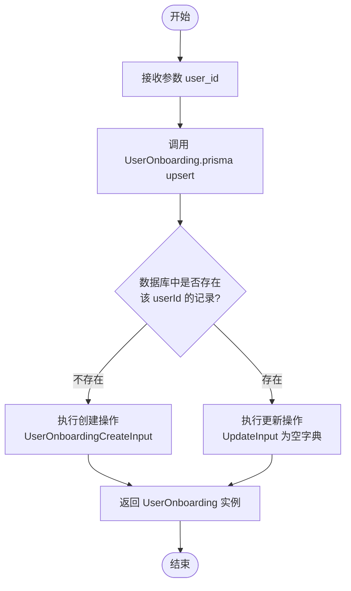

#### 带注释源码

```python
async def get_user_onboarding(user_id: str):
    """
    获取或创建用户的入职引导记录。
    
    使用 Prisma 的 upsert 操作：
    - 如果找到匹配 userId 的记录，则更新它（此处 update 为空，即不做修改）。
    - 如果未找到，则使用提供的 userId 创建一个新记录。
    """
    return await UserOnboarding.prisma().upsert(
        where={"userId": user_id},  # 查找条件：用户ID
        data={
            # 如果记录不存在，则执行创建，传入 userId
            "create": UserOnboardingCreateInput(userId=user_id),
            # 如果记录存在，则执行更新，此处传入空字典表示不更新任何字段
            "update": {},
        },
    )
```


### `reset_user_onboarding`

该函数用于将指定用户的引导数据重置为初始状态，清除所有进度、选择、通知状态以及相关的执行统计数据。

参数：

- `user_id`: `str`，需要重置引导流程的用户唯一标识符。

返回值：`UserOnboarding`，返回重置后的用户引导记录对象（如果记录不存在则创建新记录）。

#### 流程图

```mermaid
graph TD
    A[开始] --> B[接收参数 user_id]
    B --> C[调用 UserOnboarding.prisma().upsert]
    C --> D{检查是否存在 userId 对应的记录?}
    D -- 否 --> E[创建新记录: 仅设置 userId]
    D -- 是 --> F[执行更新操作: 重置所有引导相关字段]
    F --> F1[completedSteps -> 空列表]
    F --> F2[walletShown -> False]
    F --> F3[notified -> 空列表]
    F --> F4[usageReason -> None]
    F --> F5[integrations -> 空列表]
    F --> F6[otherIntegrations -> None]
    F --> F7[selectedStoreListingVersionId -> None]
    F --> F8[agentInput -> 空JSON对象]
    F --> F9[onboardingAgentExecutionId -> None]
    F --> F10[agentRuns -> 0]
    F --> F11[lastRunAt -> None]
    F --> F12[consecutiveRunDays -> 0]
    F1 & F2 & F3 & F4 & F5 & F6 & F7 & F8 & F9 & F10 & F11 & F12 --> G[返回数据库操作结果]
    E --> G
    G --> H[结束]
```

#### 带注释源码

```python
async def reset_user_onboarding(user_id: str):
    return await UserOnboarding.prisma().upsert(
        where={"userId": user_id},  # 查找条件：用户ID
        data={
            # 如果记录不存在，则创建一个新的 UserOnboarding 记录，仅设置 userId
            "create": UserOnboardingCreateInput(userId=user_id),
            # 如果记录存在，则执行以下更新操作，将所有状态重置为初始值
            "update": {
                "completedSteps": [],        # 清空已完成的步骤列表
                "walletShown": False,        # 重置钱包显示状态为未显示
                "notified": [],              # 清空已发送通知的步骤列表
                "usageReason": None,         # 清除使用原因
                "integrations": [],          # 清空已选择的集成列表
                "otherIntegrations": None,   # 清除其他集成说明
                "selectedStoreListingVersionId": None,  # 清除选择的商店代理版本ID
                "agentInput": prisma.Json({}),         # 重置代理输入为空对象
                "onboardingAgentExecutionId": None,    # 清除引导代理的执行ID
                "agentRuns": 0,              # 重置代理运行次数为0
                "lastRunAt": None,           # 重置最后运行时间为空
                "consecutiveRunDays": 0,     # 重置连续运行天数为0
            },
        },
    )
```


### `update_user_onboarding`

该函数用于异步更新指定用户的用户引导（Onboarding）状态数据。它根据传入的 `UserOnboardingUpdate` 对象中的非空字段，选择性更新数据库中的引导记录。该函数特别处理了通知列表的合并去重逻辑，并利用 `SafeJson` 处理代理输入数据，最后通过 Prisma 的 `upsert` 操作确保数据被创建或更新。

参数：

-   `user_id`：`str`，目标用户的唯一标识符。
-   `data`：`UserOnboardingUpdate`，包含用户引导更新数据的 Pydantic 模型对象。所有字段均为可选，仅当字段不为 None 时才会更新数据库中的对应字段。

返回值：`UserOnboarding`，更新后的用户引导数据库记录对象。

#### 流程图

```mermaid
flowchart TD
    A[开始: update_user_onboarding] --> B[初始化 update 字典为空]
    B --> C[调用 get_user_onboarding 获取当前状态]
    C --> D{检查 data.walletShown}
    D -- 存在 --> E[添加到 update 字典]
    D -- 不存在 --> F{检查 data.notified}
    E --> F
    F -- 存在 --> G[合并新旧 notified 列表并去重]
    G --> H[添加到 update 字典]
    F -- 不存在 --> I{检查 data.usageReason}
    H --> I
    I -- 存在 --> J[添加到 update 字典]
    J --> K{检查 data.integrations}
    I -- 不存在 --> K
    K -- 存在 --> L[添加到 update 字典]
    K -- 不存在 --> M{检查 data.otherIntegrations}
    L --> M
    M -- 存在 --> N[添加到 update 字典]
    M -- 不存在 --> O{检查 data.selectedStoreListingVersionId}
    N --> O
    O -- 存在 --> P[添加到 update 字典]
    O -- 不存在 --> Q{检查 data.agentInput}
    P --> Q
    Q -- 存在 --> R[通过 SafeJson 处理并添加到 update]
    Q -- 不存在 --> S{检查 data.onboardingAgentExecutionId}
    R --> S
    S -- 存在 --> T[添加到 update 字典]
    T --> U[执行 UserOnboarding.prisma().upsert]
    S -- 不存在 --> U
    U --> V[返回 UserOnboarding 记录]
```

#### 带注释源码

```python
async def update_user_onboarding(user_id: str, data: UserOnboardingUpdate):
    # 初始化更新数据字典，仅包含需要变更的字段
    update: UserOnboardingUpdateInput = {}
    
    # 获取当前的用户引导状态（如果不存在则创建）
    onboarding = await get_user_onboarding(user_id)
    
    # 检查是否需要更新钱包显示状态
    if data.walletShown:
        update["walletShown"] = data.walletShown
        
    # 检查是否需要更新通知列表
    # 逻辑：将新通知与旧通知合并，并通过 set 去重，避免重复通知
    if data.notified is not None:
        update["notified"] = list(set(data.notified + onboarding.notified))
        
    # 检查是否需要更新使用原因
    if data.usageReason is not None:
        update["usageReason"] = data.usageReason
        
    # 检查是否需要更新集成列表
    if data.integrations is not None:
        update["integrations"] = data.integrations
        
    # 检查是否需要更新其他集成信息
    if data.otherIntegrations is not None:
        update["otherIntegrations"] = data.otherIntegrations
        
    # 检查是否需要更新选中的商店列表版本ID
    if data.selectedStoreListingVersionId is not None:
        update["selectedStoreListingVersionId"] = data.selectedStoreListingVersionId
        
    # 检查是否需要更新代理输入
    # 使用 SafeJson 确保数据存储的安全性和格式正确
    if data.agentInput is not None:
        update["agentInput"] = SafeJson(data.agentInput)
        
    # 检查是否需要更新引导代理的执行ID
    if data.onboardingAgentExecutionId is not None:
        update["onboardingAgentExecutionId"] = data.onboardingAgentExecutionId

    # 执行数据库 upsert 操作
    # 如果记录不存在则创建（包含 userId 和 update 中的数据），如果存在则使用 update 数据更新
    return await UserOnboarding.prisma().upsert(
        where={"userId": user_id},
        data={
            "create": {"userId": user_id, **update},
            "update": update,
        },
    )
```


### `_reward_user`

根据用户完成的特定入职引导步骤奖励用户积分。该函数通过匹配特定的步骤来定义奖励金额，检查是否已经发放过奖励以避免重复，然后更新用户的积分余额并在数据库中记录该步骤的奖励状态。

参数：

-   `user_id`：`str`，用户的唯一标识符。
-   `onboarding`：`UserOnboarding`，用户的入职引导数据模型对象，包含已完成的步骤和已奖励的历史记录。
-   `step`：`OnboardingStep`，触发的入职引导步骤枚举值。

返回值：`None`，该函数主要用于执行异步副作用（更新数据库和积分），没有返回值。

#### 流程图

```mermaid
flowchart TD
    Start([开始]) --> InitReward[初始化奖励金额 reward = 0]
    InitReward --> MatchStep{匹配步骤 step}
    
    MatchStep -->|VISIT_COPILOT| SetR1[reward = 500]
    MatchStep -->|AGENT_NEW_RUN| SetR2[reward = 300]
    MatchStep -->|MARKETPLACE_VISIT, MARKETPLACE_ADD_AGENT 等| SetR3[reward = 100 或 300]
    MatchStep -->|其他| KeepZero[保持 reward = 0]
    
    SetR1 --> CheckZero
    SetR2 --> CheckZero
    SetR3 --> CheckZero
    KeepZero --> CheckZero
    
    CheckZero{reward == 0?}
    CheckZero -->|是| End([结束])
    CheckZero -->|否| CheckDup{step in onboarding.rewardedFor?}
    
    CheckDup -->|是 (已奖励)| End
    CheckDup -->|否 (未奖励)| GetModel[获取用户积分模型 user_credit_model]
    
    GetModel --> GrantCredit[调用 onboarding_reward 发放积分]
    GrantCredit --> UpdateDB[更新 UserOnboarding 记录<br/>将 step 加入 rewardedFor 列表]
    UpdateDB --> End
```

#### 带注释源码

```python
async def _reward_user(user_id: str, onboarding: UserOnboarding, step: OnboardingStep):
    reward = 0
    # 根据不同的入职引导步骤匹配对应的奖励金额
    match step:
        # Welcome bonus for visiting copilot ($5 = 500 credits)
        # 访问 Copilot 的欢迎奖金（5美元 = 500积分）
        case OnboardingStep.VISIT_COPILOT:
            reward = 500
        # Reward user when they clicked New Run during onboarding
        # This is because they need credits before scheduling a run (next step)
        # This is seen as a reward for the GET_RESULTS step in the wallet
        # 当用户在入职引导期间点击“新建运行”时奖励用户
        # 这是因为他们在计划运行（下一步）之前需要积分
        # 这被视为钱包中 GET_RESULTS 步骤的奖励
        case OnboardingStep.AGENT_NEW_RUN:
            reward = 300
        case OnboardingStep.MARKETPLACE_VISIT:
            reward = 100
        case OnboardingStep.MARKETPLACE_ADD_AGENT:
            reward = 100
        case OnboardingStep.MARKETPLACE_RUN_AGENT:
            reward = 100
        case OnboardingStep.BUILDER_SAVE_AGENT:
            reward = 100
        case OnboardingStep.RE_RUN_AGENT:
            reward = 100
        case OnboardingStep.SCHEDULE_AGENT:
            reward = 100
        case OnboardingStep.RUN_AGENTS:
            reward = 300
        case OnboardingStep.RUN_3_DAYS:
            reward = 100
        case OnboardingStep.TRIGGER_WEBHOOK:
            reward = 100
        case OnboardingStep.RUN_14_DAYS:
            reward = 300
        case OnboardingStep.RUN_AGENTS_100:
            reward = 300

    # 如果没有匹配到奖励金额，直接返回
    if reward == 0:
        return

    # Skip if already rewarded
    # 如果该步骤已经奖励过，跳过以避免重复发放
    if step in onboarding.rewardedFor:
        return

    # 获取用户的积分模型
    user_credit_model = await get_user_credit_model(user_id)
    # 调用积分模型的方法发放入职引导奖励
    await user_credit_model.onboarding_reward(user_id, reward, step)
    
    # 更新数据库中的用户入职引导记录，将该步骤标记为已奖励
    await UserOnboarding.prisma().update(
        where={"userId": user_id},
        data={
            "rewardedFor": list(set(onboarding.rewardedFor + [step])),
        },
    )
```


### `complete_onboarding_step`

该函数用于完成用户指定的入职步骤。它会检查该步骤是否已经完成，若未完成，则更新数据库中的完成状态，并根据规则给予用户相应的奖励（如积分），最后发送通知。

参数：

-  `user_id`：`str`，用户的唯一标识符。
-  `step`：`OnboardingStep`，需要标记为已完成的入职步骤枚举值。

返回值：`None`，无返回值。

#### 流程图

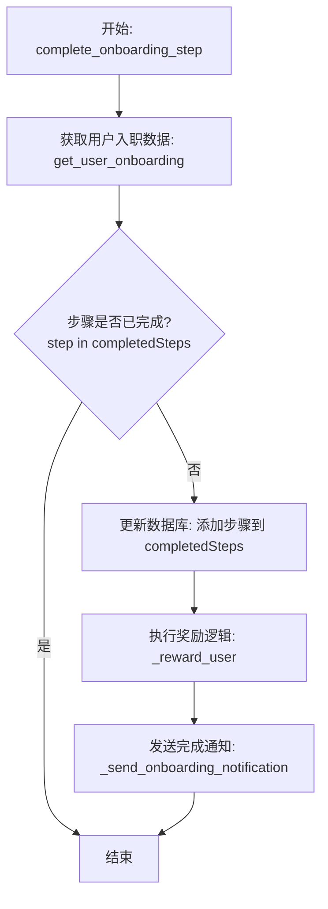

#### 带注释源码

```python
async def complete_onboarding_step(user_id: str, step: OnboardingStep):
    """
    Completes the specified onboarding step for the user if not already completed.
    """
    # 获取用户的当前入职状态对象
    onboarding = await get_user_onboarding(user_id)
    
    # 检查该步骤是否已经在已完成的步骤列表中
    if step not in onboarding.completedSteps:
        # 更新数据库：将该步骤添加到 completedSteps 列表中
        # 使用 set 确保没有重复项，然后转回 list 存储
        await UserOnboarding.prisma().update(
            where={"userId": user_id},
            data={
                "completedSteps": list(set(onboarding.completedSteps + [step])),
            },
        )
        
        # 如果该步骤对应有奖励，则给用户发放奖励（如积分）
        await _reward_user(user_id, onboarding, step)
        
        # 发送入职步骤完成的事件通知
        await _send_onboarding_notification(user_id, step)
```


### `_send_onboarding_notification`

向指定用户发送引导相关的通知事件，通过 Redis 事件总线进行消息分发。

参数：

-   `user_id`：`str`，接收通知的目标用户的唯一标识符。
-   `step`：`OnboardingStep | None`，当前完成的引导步骤或相关步骤，如果无特定步骤则为 None。
-   `event`：`str`，触发通知的事件类型字符串，默认值为 "step_completed"。

返回值：`None`，该方法为异步操作，不返回具体数值，仅执行发送逻辑。

#### 流程图

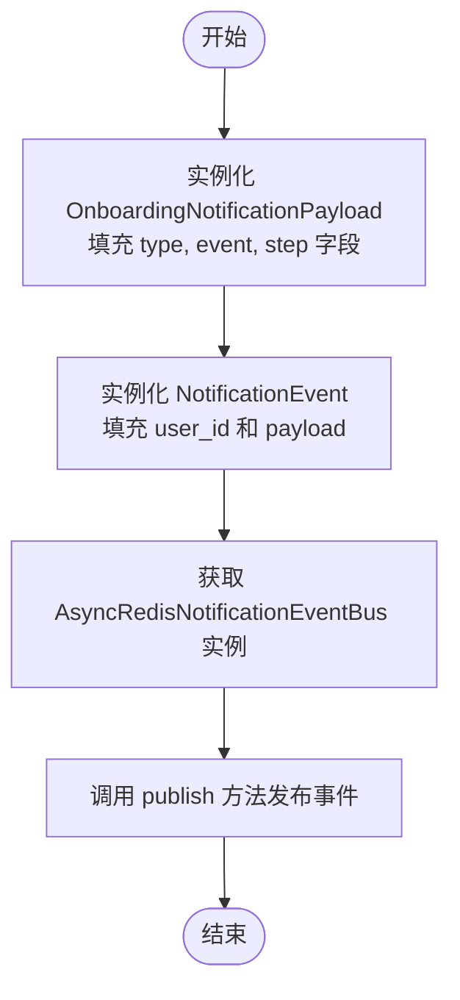

#### 带注释源码

```python
async def _send_onboarding_notification(
    user_id: str, step: OnboardingStep | None, event: str = "step_completed"
):
    """
    Sends an onboarding notification to the user.
    """
    # 构建通知负载对象，指定通知类型为 onboarding，并包含事件和步骤信息
    payload = OnboardingNotificationPayload(
        type="onboarding",
        event=event,
        step=step,
    )
    # 获取异步 Redis 通知事件总线实例，并将构建好的通知事件发布出去
    await AsyncRedisNotificationEventBus().publish(
        NotificationEvent(user_id=user_id, payload=payload)
    )
```


### `complete_re_run_agent`

该函数用于在用户重新运行之前已执行过的图时，标记完成 `RE_RUN_AGENT` 的入职步骤。它通过优先检查步骤是否已完成来保持低开销，如果步骤未完成，则检查该图的执行历史记录是否大于1次。

参数：

- `user_id`：`str`，执行操作的用户唯一标识符。
- `graph_id`：`str`，被执行的图（智能体）的唯一标识符。

返回值：`None`，该函数为异步操作，主要用于更新数据库状态和触发通知，不返回具体数据值。

#### 流程图

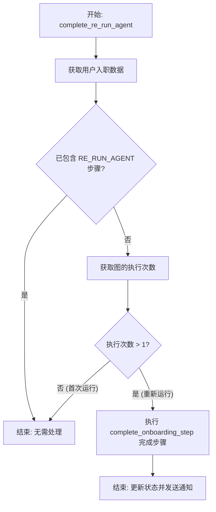

#### 带注释源码

```python
async def complete_re_run_agent(user_id: str, graph_id: str) -> None:
    """
    当用户重新运行他们之前运行过的图时，完成 RE_RUN_AGENT 步骤。
    通过仅在步骤仍处于待处理状态时计算执行次数来保持低开销。
    """
    # 1. 获取用户的当前入职状态
    onboarding = await get_user_onboarding(user_id)
    
    # 2. 优化性能：如果该步骤已经标记为完成，则直接返回，避免不必要的数据库查询
    if OnboardingStep.RE_RUN_AGENT in onboarding.completedSteps:
        return

    # 3. 获取特定图的执行计数。
    # 注：包含当前执行，因此 count > 1 意味着至少有一次先前的运行。
    previous_exec_count = await execution_db.get_graph_executions_count(
        user_id=user_id, graph_id=graph_id
    )
    
    # 4. 判断是否为重新运行（执行次数大于1）
    if previous_exec_count > 1:
        # 5. 标记该步骤完成，这将触发奖励发放和通知
        await complete_onboarding_step(user_id, OnboardingStep.RE_RUN_AGENT)
```


### `_clean_and_split`

该函数用于对输入字符串进行清洗和分割处理。它会去除字符串首尾的空格，截取前100个字符，移除除字母、数字、空格和逗号以外的特殊字符，最后根据空格和逗号将字符串分割成单词列表，并统一转为小写。

参数：

-  `text`：`str`，需要进行清洗和分割处理的原始字符串。

返回值：`list[str]`，经过清洗、去重（原逻辑未去重，仅清洗）并转小写后的单词列表。

#### 流程图

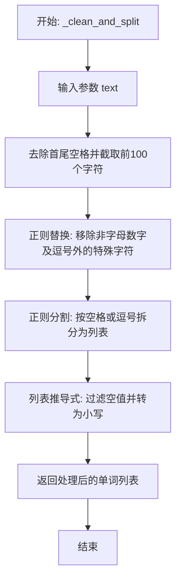

#### 带注释源码

```python
def _clean_and_split(text: str) -> list[str]:
    """
    Removes all special characters from a string, truncates it to 100 characters,
    and splits it by whitespace and commas.

    Args:
        text (str): The input string.

    Returns:
        list[str]: A list of cleaned words.
    """
    # 1. 去除字符串首尾的空白字符。
    # 2. 截取字符串的前100个字符，防止输入过长。
    # 3. 使用正则表达式替换掉所有非字母数字、非空格且非逗号的字符（即移除特殊字符）。
    cleaned_text = re.sub(r"[^a-zA-Z0-9\s,]", "", text.strip()[:100])

    # 使用正则表达式按一个或多个空白字符（\s）或逗号（,）进行分割
    words = re.split(r"[\s,]+", cleaned_text)

    # 遍历分割后的列表，过滤掉空字符串，并将所有单词转换为小写形式
    words = [word.lower() for word in words if word]

    return words
```


### `_calculate_points`

该函数根据一系列标准（类别匹配、关键词匹配、精选状态、评分和运行次数）计算代理的总分，用于对推荐代理进行排序。

参数：

-  `agent`：`Any`，代理对象，包含类别、描述、精选状态、评分和运行次数等属性。
-  `categories`：`list[str]`，需要与代理类别进行匹配的类别列表。
-  `custom`：`list[str]`，需要在代理描述中进行匹配的自定义关键词列表。
-  `integrations`：`list[str]`，需要在代理描述中进行匹配的集成关键词列表。

返回值：`int`，该代理计算得到的总分。

#### 流程图

```mermaid
flowchart TD
    A[开始] --> B[初始化 points = 0]
    B --> C[计算类别匹配数 matched_categories]
    C --> D[points += matched_categories * 100]
    D --> E[将代理描述分割为单词列表]
    E --> F[计算 custom 关键词匹配数 matched_words]
    F --> G[points += matched_words * 100]
    G --> H[计算 integrations 关键词匹配数 matched_words]
    H --> I[points += matched_words * 50]
    I --> J{代理是否精选 featured?}
    J -- 是 --> K[points += 50]
    J -- 否 --> L[跳过精选加分]
    K --> M[points += agent.rating * 10]
    L --> M
    M --> N[计算运行加分 runs_points = min(runs / 1000 * 100, 100)]
    N --> O[points += runs_points]
    O --> P[返回 int(points)]
    P --> Q[结束]
```

#### 带注释源码

```python
def _calculate_points(
    agent, categories: list[str], custom: list[str], integrations: list[str]
) -> int:
    """
    Calculates the total points for an agent based on the specified criteria.

    Args:
        agent: The agent object.
        categories (list[str]): List of categories to match.
        words (list[str]): List of words to match in the description.

    Returns:
        int: Total points for the agent.
    """
    points = 0

    # 1. 类别匹配 (Category Matches)
    # 统计有多少个给定的类别存在于代理的类别列表中
    matched_categories = sum(
        1 for category in categories if category in agent.categories
    )
    points += matched_categories * 100  # 每个匹配的类别增加 100 分

    # 2. 描述关键词匹配 (Description Word Matches)
    # 将代理描述拆分为单词列表
    description_words = agent.description.split()  # Split description into words
    # 统计自定义关键词在描述中的出现次数
    matched_words = sum(1 for word in custom if word in description_words)
    points += matched_words * 100  # 每个匹配的自定义关键词增加 100 分

    # 统计集成关键词在描述中的出现次数
    matched_words = sum(1 for word in integrations if word in description_words)
    points += matched_words * 50  # 每个匹配的集成关键词增加 50 分

    # 3. 精选加分 (Featured Bonus)
    # 如果代理被标记为精选，增加 50 分
    if agent.featured:
        points += 50

    # 4. 评分加分 (Rating Bonus)
    # 根据评分加分，每 1 分评分增加 10 分
    points += agent.rating * 10

    # 5. 运行次数加分 (Runs Bonus)
    # 根据运行次数计算加分，最高不超过 100 分
    runs_points = min(agent.runs / 1000 * 100, 100)  # Cap at 100 points
    points += runs_points

    return int(points)
```


### `_normalize_datetime`

该函数用于将输入的 datetime 对象标准化为 UTC 时区。如果输入为 None 则直接返回 None；如果输入的时间对象不带时区信息（naive datetime），则将其视为 UTC 时间并附加 UTC 时区；如果带有时区信息（aware datetime），则将其转换为 UTC 时间。

参数：

-  `value`：`datetime | None`，需要进行标准化处理的 datetime 对象，允许为空。

返回值：`datetime | None`，标准化后的 UTC 时间对象，如果输入为 None 则返回 None。

#### 流程图

```mermaid
flowchart TD
    A[开始: 接收 value] --> B{value 是否为 None?}
    B -- 是 --> C[返回 None]
    B -- 否 --> D{value.tzinfo 是否为 None?}
    D -- 是 --> E[视为 UTC: 返回 value.replace<br/>(tzinfo=timezone.utc)]
    D -- 否 --> F[转换为 UTC: 返回 value.astimezone<br/>(timezone.utc)]
    C --> G[结束]
    E --> G
    F --> G
```

#### 带注释源码

```python
def _normalize_datetime(value: datetime | None) -> datetime | None:
    # 检查输入值是否为 None，如果是则直接返回 None
    if value is None:
        return None
    # 检查 datetime 对象是否包含时区信息 (tzinfo)
    # 如果没有时区信息 (naive datetime)，则假设其为 UTC 并附加 UTC 时区
    if value.tzinfo is None:
        return value.replace(tzinfo=timezone.utc)
    # 如果包含时区信息 (aware datetime)，则将其转换为 UTC 时区
    return value.astimezone(timezone.utc)
```


### `_calculate_consecutive_run_days`

该函数用于根据用户上一次运行代理的时间、当前的连续运行天数计数以及用户的时区，计算并更新连续运行天数。它通过将时间转换为用户本地时区来判断日期的连续性（是否为今天或昨天），确保跨时区的准确性。

参数：

- `last_run_at`：`datetime | None`，用户上一次运行代理的时间（UTC或本地时间），如果是第一次运行则为 None。
- `current_consecutive_days`：`int`，当前记录的连续运行天数。
- `user_timezone`：`str`，用户的时区字符串（如 "Asia/Shanghai"），用于确定本地日期的边界。

返回值：`tuple[datetime, int]`，包含当前的 UTC 时间戳和计算后的最新连续运行天数的元组。

#### 流程图

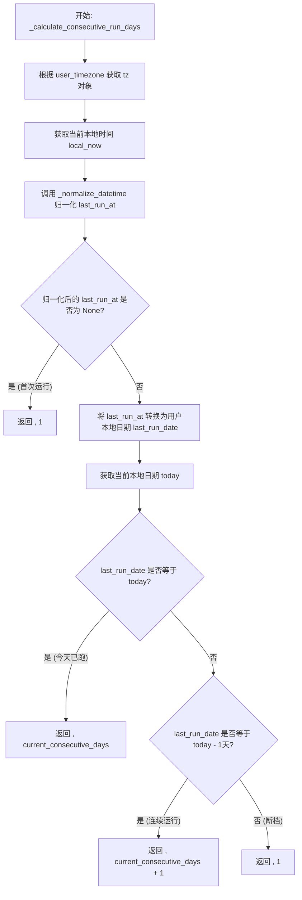

#### 带注释源码

```python
def _calculate_consecutive_run_days(
    last_run_at: datetime | None, current_consecutive_days: int, user_timezone: str
) -> tuple[datetime, int]:
    # 初始化用户时区对象
    tz = ZoneInfo(user_timezone)
    # 获取用户当前的本地时间
    local_now = datetime.now(tz)
    # 将上次运行时间标准化为 UTC 时间（处理带时区或不带时区的情况）
    normalized_last_run = _normalize_datetime(last_run_at)

    # 如果没有上次运行时间，说明是第一次运行，连续天数设为 1
    if normalized_last_run is None:
        return local_now.astimezone(timezone.utc), 1

    # 将上次运行时间转换为用户本地时区
    last_run_local = normalized_last_run.astimezone(tz)
    # 提取上次运行的本地日期
    last_run_date = last_run_local.date()
    # 提取今天的本地日期
    today = local_now.date()

    # 如果上次运行就是今天，连续天数保持不变
    if last_run_date == today:
        return local_now.astimezone(timezone.utc), current_consecutive_days

    # 如果上次运行是昨天，连续天数加 1
    if last_run_date == today - timedelta(days=1):
        return local_now.astimezone(timezone.utc), current_consecutive_days + 1

    # 否则（超过一天没跑），连续天数重置为 1
    return local_now.astimezone(timezone.utc), 1
```


### `_get_run_milestone_steps`

根据用户的总运行次数和连续运行天数，计算并返回当前已达成的用户引导里程碑步骤列表。

参数：

-  `new_run_count`：`int`，用户新的代理执行总次数。
-  `consecutive_days`：`int`，用户连续运行代理的天数。

返回值：`list[OnboardingStep]`，包含所有满足条件的里程碑步骤的列表。

#### 流程图

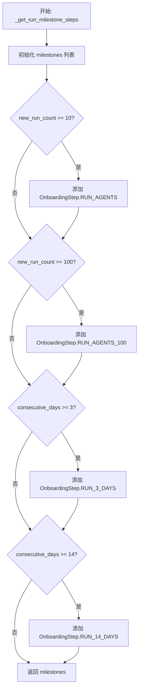

#### 带注释源码

```python
def _get_run_milestone_steps(
    new_run_count: int, consecutive_days: int
) -> list[OnboardingStep]:
    # 初始化一个空列表用于存储达成的里程碑步骤
    milestones: list[OnboardingStep] = []

    # 检查运行总数是否达到10次，若是则添加 RUN_AGENTS 步骤
    if new_run_count >= 10:
        milestones.append(OnboardingStep.RUN_AGENTS)

    # 检查运行总数是否达到100次，若是则添加 RUN_AGENTS_100 步骤
    if new_run_count >= 100:
        milestones.append(OnboardingStep.RUN_AGENTS_100)

    # 检查连续运行天数是否达到3天，若是则添加 RUN_3_DAYS 步骤
    if consecutive_days >= 3:
        milestones.append(OnboardingStep.RUN_3_DAYS)

    # 检查连续运行天数是否达到14天，若是则添加 RUN_14_DAYS 步骤
    if consecutive_days >= 14:
        milestones.append(OnboardingStep.RUN_14_DAYS)

    # 返回所有满足条件的里程碑步骤列表
    return milestones
```


### `_get_user_timezone`

根据给定的用户ID获取用户的时区信息。如果用户不存在或未设置时区，则默认返回UTC时间。

参数：

-  `user_id`：`str`，用户的唯一标识符

返回值：`str`，用户的时区字符串（例如 "Asia/Shanghai"），如果未找到用户或时区无效，则返回 "UTC"。

#### 流程图

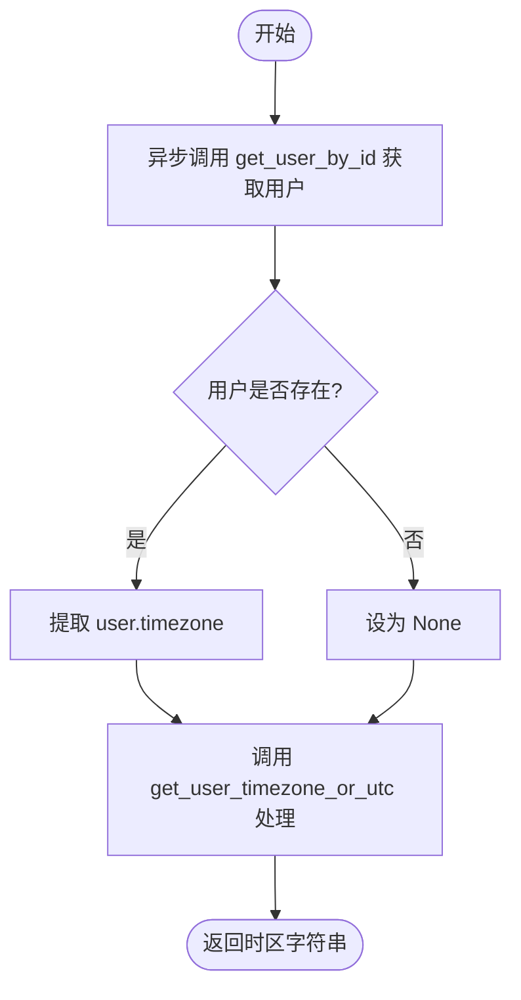

#### 带注释源码

```python
async def _get_user_timezone(user_id: str) -> str:
    # 从数据库获取用户对象
    user = await get_user_by_id(user_id)
    # 如果用户对象存在，则尝试获取其 timezone 字段；否则传入 None
    # get_user_timezone_or_utc 函数负责处理 None 或无效值，返回 'UTC'
    return get_user_timezone_or_utc(user.timezone if user else None)
```


### `increment_onboarding_runs`

用于增加用户的运行计数器并触发任何符合条件的入职引导里程碑。它会更新用户的总运行次数、最后运行时间以及连续运行天数，并检查是否达成了新的里程碑（如运行一定次数或连续运行天数），进而完成相应的入职引导步骤或发送状态更新通知。

参数：

- `user_id`：`str`，需要进行入职引导状态更新的用户ID。

返回值：`None`，无返回值。

#### 流程图

```mermaid
flowchart TD
    A[开始: increment_onboarding_runs] --> B[获取用户时区]
    B --> C[获取用户当前入职引导数据]
    C --> D[计算新运行次数 = 当前次数 + 1]
    D --> E[计算连续运行天数<br/>(基于上次运行时间和时区)]
    E --> F[更新数据库:<br/>agentRuns, lastRunAt, consecutiveRunDays]
    F --> G[获取达到的里程碑步骤<br/>(RUN_AGENTS, RUN_3_DAYS 等)]
    G --> H[筛选出未完成的新步骤]
    H -->{是否有新步骤?}
    I[是] --> J[遍历新步骤列表]
    J --> K[完成步骤并触发奖励/通知]
    K --> J
    J --> L[结束]
    M[否] --> N[发送进度更新通知<br/>(event: increment_runs)]
    N --> L
```

#### 带注释源码

```python
async def increment_onboarding_runs(user_id: str):
    """
    Increment a user's run counters and trigger any onboarding milestones.
    """
    # 获取用户的时区信息，用于正确计算日期（连续运行天数）
    user_timezone = await _get_user_timezone(user_id)
    
    # 获取用户当前的入职引导记录
    onboarding = await get_user_onboarding(user_id)
    
    # 计算新的运行总次数
    new_run_count = onboarding.agentRuns + 1
    
    # 根据上次运行时间和当前时区，计算新的连续运行天数
    # 如果今天运行了，连续天数不变；如果是昨天运行的，连续天数+1；否则重置为1
    last_run_at, consecutive_run_days = _calculate_consecutive_run_days(
        onboarding.lastRunAt, onboarding.consecutiveRunDays, user_timezone
    )

    # 更新数据库中的统计数据：运行次数加1，更新最后运行时间和连续运行天数
    await UserOnboarding.prisma().update(
        where={"userId": user_id},
        data={
            "agentRuns": {"increment": 1},
            "lastRunAt": last_run_at,
            "consecutiveRunDays": consecutive_run_days,
        },
    )

    # 根据新的运行次数和连续运行天数，判定达成了哪些里程碑
    milestones = _get_run_milestone_steps(new_run_count, consecutive_run_days)
    
    # 过滤掉那些已经完成过的步骤，只保留新达成里程碑
    new_steps = [step for step in milestones if step not in onboarding.completedSteps]

    # 如果有新达成的里程碑，执行完成步骤的逻辑（包含奖励发放和通知）
    for step in new_steps:
        await complete_onboarding_step(user_id, step)
    
    # 如果没有新步骤完成，发送一个特定事件通知
    # 这是为了确保客户端能够刷新并获取最新的入职引导状态数据
    if not new_steps:
        await _send_onboarding_notification(user_id, None, event="increment_runs")
```


### `get_recommended_agents`

基于用户的引导偏好（使用原因、集成）、类别匹配以及包括精选状态、评分和运行次数在内的多种算法评分因素，检索个性化的推荐智能体列表。

参数：

- `user_id`：`str`，要为其获取推荐智能体的用户的唯一标识符。

返回值：`list[StoreAgentDetails]`，经过筛选、评分和排序后的推荐智能体详细信息列表。

#### 流程图

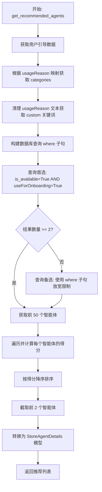

#### 带注释源码

```python
async def get_recommended_agents(user_id: str) -> list[StoreAgentDetails]:
    # 获取用户的引导配置数据
    user_onboarding = await get_user_onboarding(user_id)
    # 根据用户选择的使用原因，从映射表中获取对应的推荐类别
    categories = REASON_MAPPING.get(user_onboarding.usageReason or "", [])

    where_clause: dict[str, Any] = {}

    # 清理用户输入的使用原因文本，提取关键词用于模糊匹配
    custom = _clean_and_split((user_onboarding.usageReason or "").lower())

    # 构建查询条件：如果有明确的类别，则优先匹配类别；否则匹配描述中的关键词
    if categories:
        where_clause["OR"] = [
            {"categories": {"has": category}} for category in categories
        ]
    else:
        where_clause["OR"] = [
            {"description": {"contains": word, "mode": "insensitive"}}
            for word in custom
        ]

    # 将用户已集成的工具也加入到描述匹配条件中
    where_clause["OR"] += [
        {"description": {"contains": word, "mode": "insensitive"}}
        for word in user_onboarding.integrations
    ]

    where_clause["is_available"] = True

    # 第一次查询：尝试获取标记为"useForOnboarding"且可用的智能体
    storeAgents = await prisma.models.StoreAgent.prisma().find_many(
        where={
            "is_available": True,
            "useForOnboarding": True,
        },
        order=[
            {"featured": "desc"},
            {"runs": "desc"},
            {"rating": "desc"},
        ],
        take=100,
    )

    # 如果符合条件的智能体少于2个，则放宽条件，根据之前构建的where_clause进行二次查询
    if len(storeAgents) < 2:
        storeAgents = await prisma.models.StoreAgent.prisma().find_many(
            where=prisma.types.StoreAgentWhereInput(**where_clause),
            order=[
                {"featured": "desc"},
                {"runs": "desc"},
                {"rating": "desc"},
            ],
            take=100,
        )

    # 计算得分：仅对前50个智能体（POINTS_AGENT_COUNT）进行复杂的加权计算
    agent_points = []
    for agent in storeAgents[:POINTS_AGENT_COUNT]:
        points = _calculate_points(
            agent, categories, custom, user_onboarding.integrations
        )
        agent_points.append((agent, points))

    # 根据得分从高到低排序
    agent_points.sort(key=lambda x: x[1], reverse=True)
    # 选取得分最高的前2个智能体
    recommended_agents = [agent for agent, _ in agent_points[:2]]

    # 将数据库模型映射为返回所需的 DTO (Data Transfer Object)
    return [
        StoreAgentDetails(
            store_listing_version_id=agent.storeListingVersionId,
            slug=agent.slug,
            agent_name=agent.agent_name,
            agent_video=agent.agent_video or "",
            agent_output_demo=agent.agent_output_demo or "",
            agent_image=agent.agent_image,
            creator=agent.creator_username,
            creator_avatar=agent.creator_avatar,
            sub_heading=agent.sub_heading,
            description=agent.description,
            categories=agent.categories,
            runs=agent.runs,
            rating=agent.rating,
            versions=agent.versions,
            agentGraphVersions=agent.agentGraphVersions,
            agentGraphId=agent.agentGraphId,
            last_updated=agent.updated_at,
        )
        for agent in recommended_agents
    ]
```


### `onboarding_enabled`

该函数用于根据系统中的 Store Agent 数量决定是否启用用户引导流程。为了优化性能并减少数据库压力，该函数使用了缓存机制（缓存时长5分钟），仅在缓存失效时执行数据库查询。

参数：

无

返回值：`bool`，如果商店中的代理数量达到最小阈值（MIN_AGENT_COUNT，默认为2）则返回 `True`，否则返回 `False`。

#### 流程图

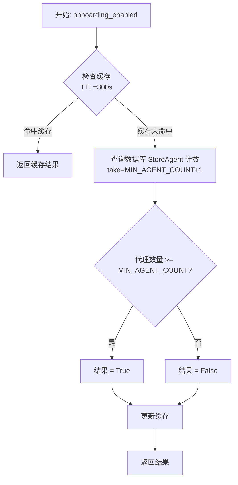

#### 带注释源码

```python
@cached(maxsize=1, ttl_seconds=300)  # 使用缓存装饰器，限制缓存大小为1，生存时间为300秒（5分钟）
async def onboarding_enabled() -> bool:
    """
    检查是否应该启用引导流程，依据是商店代理的数量。
    使用缓存以防止重复的缓慢数据库查询。
    """
    # 使用更高效的查询，该查询在找到足够的代理（take限制）后会停止计数，避免全表扫描
    # MIN_AGENT_COUNT 定义为 2，所以这里取 3 条记录进行判断
    count = await prisma.models.StoreAgent.prisma().count(take=MIN_AGENT_COUNT + 1)
    # 如果商店中至少有2个代理，则启用引导流程
    return count >= MIN_AGENT_COUNT
```


## 关键组件


### User Onboarding State Manager

管理用户入职记录的生命周期，通过 Prisma ORM 处理数据的创建、检索、更新及重置操作，确保用户状态与数据库同步。

### Context-Aware Agent Recommendation Engine

基于用户的使用理由、集成需求及自定义输入，利用加权评分算法（类别匹配、关键词搜索、热度评分等）计算并推荐最合适的代理。

### Activity Tracker & Milestone Trigger

跟踪用户的代理执行次数及基于时区的连续运行天数，并根据预设的阈值自动触发相应的里程碑完成事件。

### Gamified Reward System

根据特定的入职步骤完成情况执行信用积分奖励逻辑，防止重复发放，并管理用户的激励状态。

### Asynchronous Notification Publisher

通过 Redis 事件总线发布关于入职进度更新、步骤完成及执行次数增加的实时通知，以驱动前端状态同步。

### Feature Toggle Cache Service

提供带有缓存的开关检查机制，通过定期查询商店代理数量来动态判断是否启用入职流程，以减少数据库负载。


## 问题及建议


### 已知问题

-   **并发竞态条件**：在 `increment_onboarding_runs` 函数中，通过 `onboarding.agentRuns + 1` 计算新的运行次数是基于内存中读取的旧值。在高并发场景下，如果用户快速触发多次执行，可能导致计算出的 `new_run_count` 不准确，从而引起里程碑判断错误（例如未达到阈值却判定达到，或跳过某个里程碑）。
-   **模糊搜索匹配不精确**：在 `_calculate_points` 函数中，使用 `word in description_words` 进行字符串匹配。这是一种子字符串匹配（Substring Matching），容易产生误报。例如，搜索 "data" 可能会匹配到 "database" 或 "update"，导致推荐结果的相关性降低。
-   **硬编码的业务规则**：奖励积分（`_reward_user` 中的 `match` 分支）、分类映射（`REASON_MAPPING`）以及各种阈值（如 `POINTS_AGENT_COUNT`）均硬编码在代码中。修改这些业务规则需要重新部署代码，缺乏灵活性。
-   **重置逻辑的维护风险**：`reset_user_onboarding` 函数中显式列出了需要重置的所有字段。如果 `UserOnboarding` 数据库模型新增了字段，开发者很容易忘记在此函数中同步更新，导致数据重置不彻底或不一致。

### 优化建议

-   **引入配置管理系统**：建议将积分规则、分类映射、阈值等硬编码常量抽取到配置文件（如 YAML/JSON）或数据库配置表中。这样可以实现动态调整业务逻辑，无需重启服务。
-   **改进推荐算法的匹配精度**：将 `_calculate_points` 中的简单包含匹配改为基于单词边界的匹配（使用正则 `\bword\b`）或使用 TF-IDF/余弦相似度等更高级的文本相似度算法，以提高 Agent 推荐的相关性。
-   **利用数据库事务或原子操作**：在处理 `increment_onboarding_runs` 时，建议使用数据库事务确保读取当前状态和更新状态的原子性，或者利用数据库的 `RETURNING` 子句获取更新后的真实值，避免基于内存脏数据进行判断。
-   **优化数据库查询性能**：`get_recommended_agents` 函数先从数据库拉取 100 条数据到内存，再进行 Python 层面的计算和排序。随着 Agent 数量增长，这种方式效率低下。建议考虑使用数据库的全文检索功能或向量数据库进行高性能匹配和排序。
-   **增强 Schema 验证**：`UserOnboardingUpdate` 中的 `agentInput` 字段类型为 `dict[str, Any]`，缺乏具体的结构验证。建议定义具体的 Pydantic 模型来规范 `agentInput` 的结构，防止脏数据写入。


## 其它


### 设计目标与约束

1.  **用户引导与激励**：设计旨在通过分步骤的流程引导新用户完成关键操作（如访问 Copilot、运行 Agent、集成工具等），利用积分奖励机制提高用户留存率和活跃度。
2.  **个性化推荐**：基于用户的使用目的、集成需求以及自定义文本，通过算法计算出最匹配的 Marketplace Agents，降低用户选择门槛。
3.  **系统可用性控制**：引入 `MIN_AGENT_COUNT` 限制，确保只有当 Marketplace 中有足够数量的 Agent 时才开启引导流程，避免推荐内容贫乏影响用户体验。
4.  **性能与缓存**：对全局开关（如 `onboarding_enabled`）和耗时计算进行缓存或限制处理，以减少数据库压力，确保高并发下的响应速度。
5.  **时区敏感性**：连续运行天数的计算严格依赖用户本地时区，确保在不同地理位置的用户都能正确触发“连续运行”相关的里程碑奖励。

### 错误处理与异常设计

1.  **数据库异常传播**：所有涉及数据库操作（`UserOnboarding.prisma()`, `StoreAgent.prisma()`）的函数默认不捕获 `prisma` 异常。这意味着如果数据库连接失败、记录不存在或约束冲突，异常将向上传播至 API 层处理，由上层统一返回错误响应。
2.  **数据一致性保障**：在 `update_user_onboarding` 中使用 `upsert` 逻辑，防止因用户记录尚未创建而导致的更新失败。在 `_reward_user` 中通过 `if step in onboarding.rewardedFor` 检查来防止重复发放积分，即使幂等性失败，数据库层面的更新也是原子的。
3.  **输入验证**：利用 `pydantic.BaseModel` (`UserOnboardingUpdate`) 在入口处对前端传入的数据进行类型和格式验证，过滤非法数据。
4.  **通知发布的容错性**：`_send_onboarding_notification` 负责发送异步通知，虽然代码中使用了 `await`，但在微服务架构中，通常假设消息总线具有重试机制或接受“至少一次”传递，通知发送失败不应阻塞引导流程的完成。
5.  **空值与边界处理**：在 `get_recommended_agents` 中，如果查询到的 Agent 数量不足 2 个，代码会自动放宽过滤条件（移除 `useForOnboarding` 限制），这是一种降级策略，确保总是能返回推荐结果。

### 数据流与状态机

1.  **状态模型**：
    *   **核心状态**：存储在 `UserOnboarding` 数据库表中，主要由 `completedSteps` (已完成的步骤列表)、`agentRuns` (运行次数)、`consecutiveRunDays` (连续运行天数) 和 `rewardedFor` (已奖励的步骤列表) 构成。
    *   **状态迁移**：状态是单向累加的。通过 `complete_onboarding_step` 添加步骤 ID，通过 `increment_onboarding_runs` 增加计数器。不存在回滚机制（`reset_user_onboarding` 除外，主要用于测试或重置）。

2.  **关键数据流转**：
    *   **引导流程数据流**：
        1.  用户提交表单（原因、集成选项） -> `update_user_onboarding` -> 数据库持久化。
        2.  触发 Agent 推荐 -> 读取数据库中的用户偏好 -> 调用 `get_recommended_agents` -> 结合 Marketplace 数据 (`StoreAgent`) -> 计算排序 -> 返回 Top 2 Agent 给前端。
    *   **奖励与执行数据流**：
        1.  用户执行 Agent -> `increment_onboarding_runs` 被调用。
        2.  更新 `lastRunAt` 和 `consecutiveRunDays` -> 检查是否满足里程碑条件 (`_get_run_milestone_steps`)。
        3.  如果满足 -> `complete_onboarding_step` -> 更新 `completedSteps` -> `_reward_user` (发放积分) -> `_send_onboarding_notification` (通知前端更新)。

3.  **时序逻辑**：
    *   连续运行天数计算逻辑依赖用户时区，将 UTC 时间戳转换为用户本地时间后比较日期，确保跨时区操作的准确性。

### 外部依赖与接口契约

1.  **Prisma ORM (数据库层)**：
    *   `UserOnboarding` 模型：依赖其 `upsert`, `update`, `find_unique` 方法。契约假设数据库 Schema 包含 `userId`, `completedSteps`, `agentRuns`, `rewardedFor` 等字段。
    *   `StoreAgent` 模型：依赖其 `find_many` 方法。契约假设包含 `categories`, `description`, `featured`, `runs`, `rating` 等字段用于推荐算法。

2.  **消息总线 (`backend.data.notification_bus.AsyncRedisNotificationEventBus`)**：
    *   **接口契约**：`publish(event: NotificationEvent)`。
    *   **职责**：异步发布用户引导进度更新。代码假定 `NotificationEvent` 接受 `user_id` 和 `payload`，其中 `payload` 必须符合 `OnboardingNotificationPayload` 结构。

3.  **用户服务 (`backend.data.user`)**：
    *   **接口契约**：`get_user_by_id(user_id: str) -> User | None`。
    *   **职责**：获取用户信息以确定其时区设置，用于计算连续运行天数。

4.  **执行服务 (`backend.data.execution`)**：
    *   **接口契约**：`get_graph_executions_count(user_id: str, graph_id: str) -> int`。
    *   **职责**：用于 `complete_re_run_agent` 函数中，统计特定 Graph 的历史执行次数，以判断是否完成“重新运行”任务。

5.  **积分系统 (`backend.data.credit`)**：
    *   **接口契约**：`get_user_credit_model(user_id: str) -> UserCreditModel`，且该模型需实现 `onboarding_reward(user_id, amount, step)` 方法。
    *   **职责**：处理具体的积分增加逻辑。

6.  **缓存服务 (`backend.util.cache`)**：
    *   **接口契约**：装饰器 `cached(maxsize, ttl_seconds)`。
    *   **职责**：对 `onboarding_enabled` 函数的结果进行缓存，减少高频数据库查询。

    