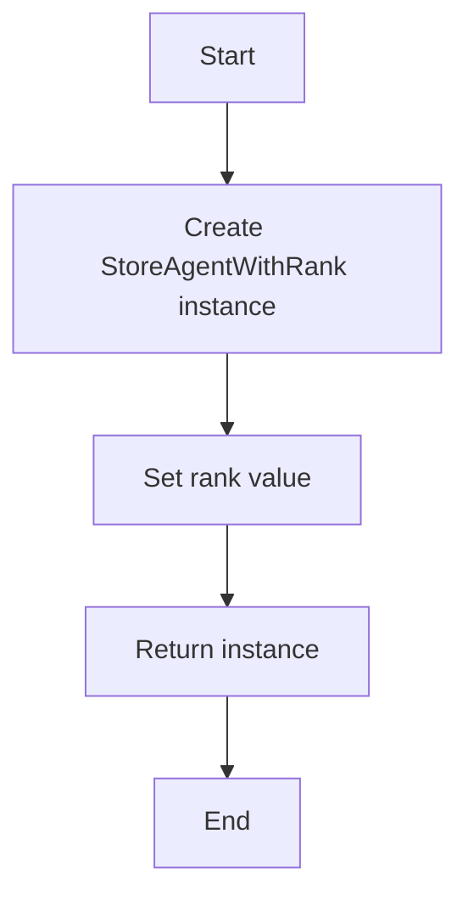
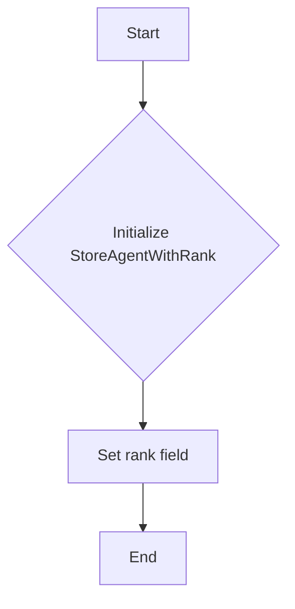
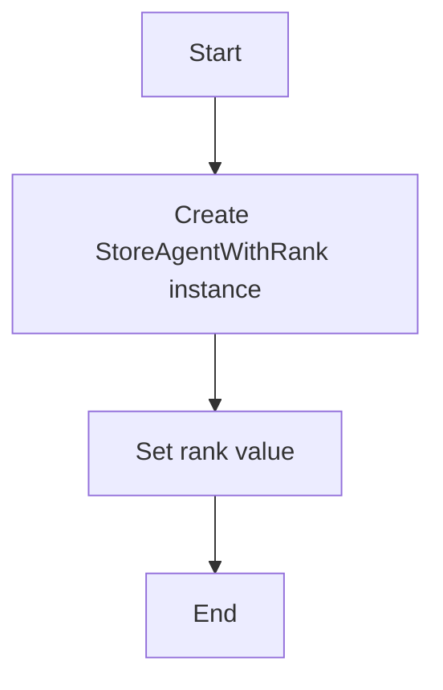

# `.\AutoGPT\autogpt_platform\backend\backend\data\partial_types.py` 详细设计文档

The code defines a subclass of StoreAgent from the prisma.models module, adding a rank field to represent the ranking of a store agent.

## 整体流程



## 类结构

```
prisma.models.StoreAgent (Parent Class)
└── StoreAgentWithRank (Subclass)
```

## 全局变量及字段


### `rank`
    
Represents the ranking of the store agent.

类型：`float`
    


### `StoreAgentWithRank.rank`
    
Represents the ranking of the store agent.

类型：`float`
    
    

## 全局函数及方法


### StoreAgentWithRank.__init__

StoreAgentWithRank 类的初始化方法，用于创建 StoreAgentWithRank 对象时设置其 rank 字段。

参数：

-  `self`：`StoreAgentWithRank`，当前类的实例
-  `rank`：`float`，指定 StoreAgentWithRank 对象的排名

返回值：无，该方法不返回任何值

#### 流程图



#### 带注释源码

```python
import prisma.models

class StoreAgentWithRank(prisma.models.StoreAgent):
    def __init__(self, rank: float):
        # 初始化父类 StoreAgent
        super().__init__()
        # 设置 rank 字段
        self.rank = rank
```


### StoreAgentWithRank

Description: Constructor for the StoreAgentWithRank class.

参数：

-  `rank`：`float`，Represents the rank of the store agent.

返回值：`None`，This is a constructor, so it does not return a value.

#### 流程图



#### 带注释源码

```python
import prisma.models

class StoreAgentWithRank(prisma.models.StoreAgent):
    def __init__(self, rank: float):
        # Initialize the parent class StoreAgent
        super().__init__()
        # Set the rank attribute of the StoreAgentWithRank instance
        self.rank = rank
```


## 关键组件


### 张量索引与惰性加载

支持对张量的索引操作，并在需要时才加载张量数据，以优化内存使用和性能。

### 反量化支持

提供对反量化操作的支持，允许在量化过程中进行逆量化处理。

### 量化策略

定义了不同的量化策略，用于在模型训练和推理过程中对模型参数进行量化。


## 问题及建议


### 已知问题

-   {问题1}：代码中未对`rank`字段进行任何验证或限制，可能导致`rank`值不合理或超出预期范围。
-   {问题2}：代码未提供对`rank`字段的初始化逻辑，可能导致在实例化`StoreAgentWithRank`对象时出现未定义的`rank`值。
-   {问题3}：代码未提供任何方法来修改或获取`rank`字段的值，限制了类的使用灵活性。

### 优化建议

-   {建议1}：为`rank`字段添加类型检查和范围限制，确保其值在合理的范围内。
-   {建议2}：在类的构造函数中为`rank`字段提供一个默认值或允许用户指定一个值。
-   {建议3}：提供getter和setter方法来允许外部代码读取和修改`rank`字段的值。
-   {建议4}：考虑使用继承和多态来扩展`StoreAgent`类的功能，而不是简单地添加一个新的字段。
-   {建议5}：如果`rank`字段是用于排序或比较，考虑实现比较方法（如`__lt__`、`__gt__`等）以支持这些操作。


## 其它


### 设计目标与约束

- 设计目标：确保`StoreAgentWithRank`类能够正确地存储和检索排名信息，同时保持与`StoreAgent`类的兼容性。
- 约束条件：`rank`字段必须是浮点数，且在合理的范围内。

### 错误处理与异常设计

- 错误处理：当尝试设置或获取`rank`字段时，如果输入的数据类型不正确或超出预期范围，应抛出异常。
- 异常设计：定义自定义异常类，如`InvalidRankValueError`，用于处理排名值相关的错误。

### 数据流与状态机

- 数据流：数据从外部输入到`rank`字段，然后通过`StoreAgentWithRank`类的实例进行存储和检索。
- 状态机：`StoreAgentWithRank`类没有明确的状态机，但可以通过`rank`字段的值来推断其状态。

### 外部依赖与接口契约

- 外部依赖：依赖于Prisma ORM的`StoreAgent`模型。
- 接口契约：`StoreAgentWithRank`类应遵循`StoreAgent`类的接口，并添加对`rank`字段的额外支持。


    