# `.\AutoGPT\autogpt_platform\backend\backend\data\rabbitmq.py` 详细设计文档

This code provides a base class for RabbitMQ connections and two subclasses for synchronous and asynchronous clients, handling connection, declaration of infrastructure, and message publishing.

## 整体流程

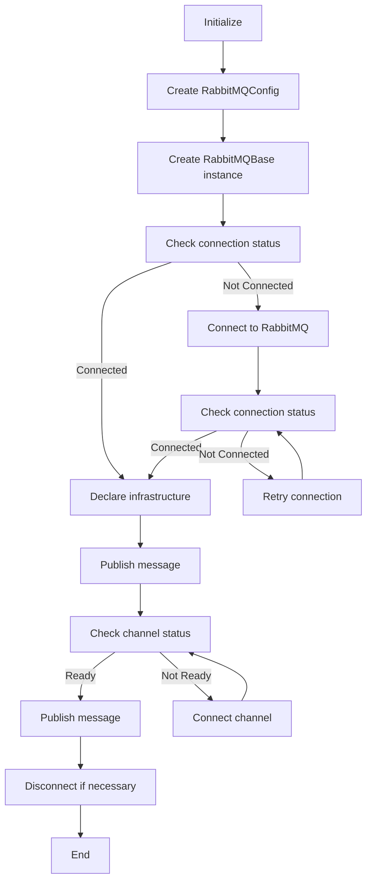

## 类结构

```
RabbitMQBase (抽象基类)
├── SyncRabbitMQ (同步客户端)
│   ├── connect
│   ├── disconnect
│   ├── declare_infrastructure
│   └── publish_message
└── AsyncRabbitMQ (异步客户端)
    ├── connect
    ├── disconnect
    ├── declare_infrastructure
    └── publish_message
```

## 全局变量及字段


### `BLOCKED_CONNECTION_TIMEOUT`
    
Timeout in seconds for blocked connections to RabbitMQ server

类型：`int`
    


### `SOCKET_TIMEOUT`
    
Timeout in seconds for socket operations to RabbitMQ server

类型：`int`
    


### `CONNECTION_ATTEMPTS`
    
Number of connection attempts to RabbitMQ server

类型：`int`
    


### `RETRY_DELAY`
    
Delay in seconds between connection attempts to RabbitMQ server

类型：`int`
    


### `logger`
    
Logger instance for logging messages

类型：`logging.Logger`
    


### `Settings`
    
Settings class for configuration management

类型：`backend.util.settings.Settings`
    


### `RabbitMQBase.config`
    
Configuration for RabbitMQ service instance

类型：`RabbitMQConfig`
    


### `RabbitMQBase._connection`
    
RabbitMQ connection object

类型：`pika.adapters.blocking_connection.BlockingConnection`
    


### `RabbitMQBase._channel`
    
RabbitMQ channel object

类型：`pika.adapters.blocking_connection.BlockingChannel`
    


### `SyncRabbitMQ.host`
    
Host address for RabbitMQ server

类型：`str`
    


### `SyncRabbitMQ.port`
    
Port number for RabbitMQ server

类型：`int`
    


### `SyncRabbitMQ.username`
    
Username for RabbitMQ server authentication

类型：`str`
    


### `SyncRabbitMQ.password`
    
Password for RabbitMQ server authentication

类型：`str`
    


### `SyncRabbitMQ.config`
    
Configuration for RabbitMQ service instance

类型：`RabbitMQConfig`
    


### `SyncRabbitMQ._connection`
    
RabbitMQ connection object

类型：`pika.adapters.blocking_connection.BlockingConnection`
    


### `SyncRabbitMQ._channel`
    
RabbitMQ channel object

类型：`pika.adapters.blocking_connection.BlockingChannel`
    


### `AsyncRabbitMQ.host`
    
Host address for RabbitMQ server

类型：`str`
    


### `AsyncRabbitMQ.port`
    
Port number for RabbitMQ server

类型：`int`
    


### `AsyncRabbitMQ.username`
    
Username for RabbitMQ server authentication

类型：`str`
    


### `AsyncRabbitMQ.password`
    
Password for RabbitMQ server authentication

类型：`str`
    


### `AsyncRabbitMQ.config`
    
Configuration for RabbitMQ service instance

类型：`RabbitMQConfig`
    


### `AsyncRabbitMQ._connection`
    
RabbitMQ connection object

类型：`aio_pika.connection.Connection`
    


### `AsyncRabbitMQ._channel`
    
RabbitMQ channel object

类型：`aio_pika.channel.Channel`
    


### `AsyncRabbitMQ._reconnect_lock`
    
Lock for managing concurrent reconnection attempts

类型：`asyncio.Lock`
    
    

## 全局函数及方法


### conn_retry

`conn_retry` is a decorator used to retry a function if the connection to RabbitMQ fails.

参数：

- `name`: `str`，The name of the service or component that is being connected to.
- `message`: `str`，The message to log when the retry is initiated.

返回值：`None`

#### 流程图

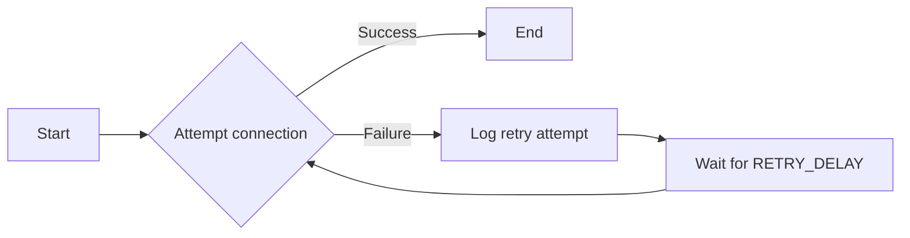

#### 带注释源码

```python
from functools import wraps
from backend.util.retry import RETRY_DELAY, conn_retry

def conn_retry(name: str, message: str = "Acquiring connection"):
    """Decorator to retry a function if the connection to RabbitMQ fails."""
    def decorator(func):
        @wraps(func)
        async def wrapper(*args, **kwargs):
            retries = 0
            while True:
                try:
                    return await func(*args, **kwargs)
                except Exception as e:
                    retries += 1
                    if retries > conn_retry.RETRY_DELAY:
                        raise
                    logger.warning(f"{message} failed, retrying ({retries}/{conn_retry.RETRY_DELAY})")
                    await asyncio.sleep(RETRY_DELAY)
        return wrapper
    return decorator
```


### func_retry

`func_retry` is a decorator used to retry a function if it raises an exception.

#### 参数

- `func_retry`: The function to be decorated.

#### 返回值

- `func_retry`: The decorated function.

#### 参数描述

- `func_retry`: The function to be decorated. It should be a callable that takes no arguments and returns no value.

#### 返回值描述

- `func_retry`: The decorated function. It will automatically retry the function if it raises an exception.

#### 流程图

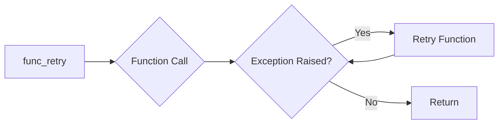

#### 带注释源码

```python
from functools import wraps
from typing import Callable

def func_retry(func: Callable[[], None]):
    @wraps(func)
    def wrapper():
        while True:
            try:
                func()
                break
            except Exception as e:
                logger.error(f"Exception occurred: {e}")
                # Add a delay before retrying
                time.sleep(1)
    return wrapper
```


### RabbitMQBase.__init__

This method initializes a RabbitMQBase object with the provided RabbitMQ configuration.

参数：

- `config`：`RabbitMQConfig`，The configuration for the RabbitMQ service instance.

返回值：无

#### 流程图

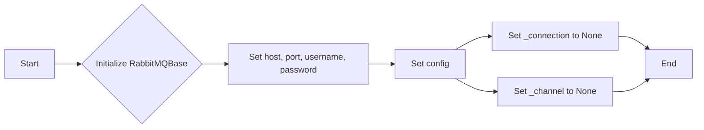

#### 带注释源码

```python
def __init__(self, config: RabbitMQConfig):
    settings = Settings()
    self.host = settings.config.rabbitmq_host
    self.port = settings.config.rabbitmq_port
    self.username = settings.secrets.rabbitmq_default_user
    self.password = settings.secrets.rabbitmq_default_pass
    self.config = config

    self._connection = None
    self._channel = None
```


### RabbitMQBase.connect

Establishes a connection to RabbitMQ.

参数：

- `self`：`RabbitMQBase`，The instance of the RabbitMQBase class.
- `config`：`RabbitMQConfig`，The configuration for the RabbitMQ service instance.

返回值：`None`，No return value, the method is used to establish the connection.

#### 流程图

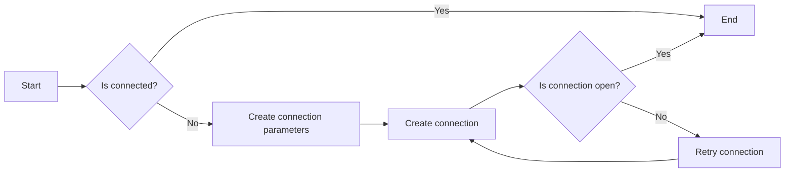

#### 带注释源码

```python
@conn_retry("RabbitMQ", "Acquiring connection")
def connect(self) -> None:
    if self.is_connected:
        return

    credentials = pika.PlainCredentials(self.username, self.password)
    parameters = pika.ConnectionParameters(
        host=self.host,
        port=self.port,
        virtual_host=self.config.vhost,
        credentials=credentials,
        blocked_connection_timeout=BLOCKED_CONNECTION_TIMEOUT,
        socket_timeout=SOCKET_TIMEOUT,
        connection_attempts=CONNECTION_ATTEMPTS,
        retry_delay=RETRY_DELAY,
        heartbeat=300,  # 5 minute timeout (heartbeats sent every 2.5 min)
    )

    self._connection = pika.BlockingConnection(parameters)
    self._channel = self._connection.channel()
    self._channel.basic_qos(prefetch_count=1)

    self.declare_infrastructure()
```


### RabbitMQBase.disconnect

Disconnects the RabbitMQ connection.

参数：

- 无

返回值：`None`，Disconnects the connection to RabbitMQ.

#### 流程图

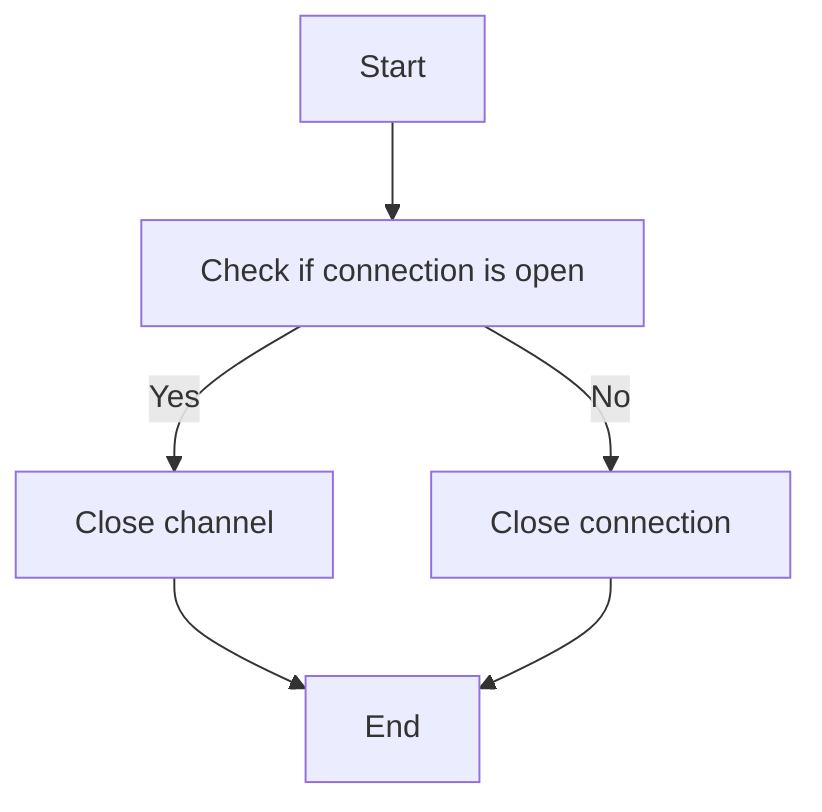

#### 带注释源码

```python
def disconnect(self) -> None:
    if self._channel:
        if self._channel.is_open:
            self._channel.close()
        self._channel = None
    if self._connection:
        if self._connection.is_open:
            self._connection.close()
        self._connection = None
```


### RabbitMQBase.declare_infrastructure

Declare exchanges and queues for this service.

参数：

- `self`：`RabbitMQBase`，The instance of the RabbitMQBase class.
- `config`：`RabbitMQConfig`，The configuration for the RabbitMQ service instance.

返回值：`None`，No return value, it declares the exchanges and queues.

#### 流程图

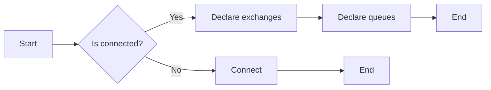

#### 带注释源码

```python
def declare_infrastructure(self) -> None:
    """Declare exchanges and queues for this service"""
    if not self.is_ready:
        self.connect()

    if self._channel is None:
        raise RuntimeError("Channel should be established after connect")

    # Declare exchanges
    for exchange in self.config.exchanges:
        self._channel.exchange_declare(
            exchange=exchange.name,
            exchange_type=exchange.type.value,
            durable=exchange.durable,
            auto_delete=exchange.auto_delete,
        )

    # Declare queues and bind them to exchanges
    for queue in self.config.queues:
        self._channel.queue_declare(
            queue=queue.name,
            durable=queue.durable,
            auto_delete=queue.auto_delete,
            arguments=queue.arguments,
        )
        if queue.exchange:
            self._channel.queue_bind(
                queue=queue.name,
                exchange=queue.exchange.name,
                routing_key=queue.routing_key or queue.name,
            )
```


### RabbitMQBase.is_connected

Check if the RabbitMQ connection is valid.

参数：

- 无

返回值：`bool`，Indicates whether the connection is valid.

#### 流程图

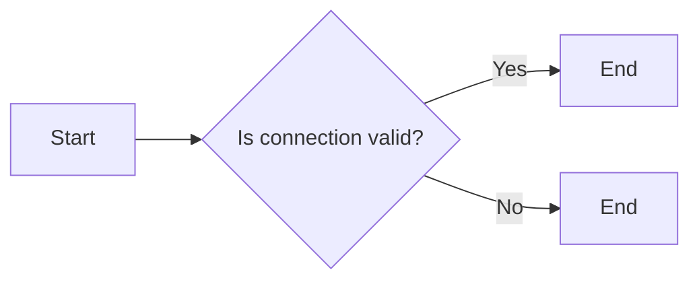

#### 带注释源码

```python
    @property
    def is_connected(self) -> bool:
        """Check if we have a valid connection"""
        return bool(self._connection)
```


### RabbitMQBase.is_ready

Check if a valid channel is established in the RabbitMQ connection.

参数：

- 无

返回值：`bool`，Indicates whether a valid channel is established.

#### 流程图

```mermaid
graph LR
A[Start] --> B{Is connected?}
B -- Yes --> C[Is channel open?]
B -- No --> D[End (False)]
C -- Yes --> E[End (True)]
C -- No --> D
```

#### 带注释源码

```python
    @property
    def is_ready(self) -> bool:
        """Check if we have a valid channel"""
        return bool(self.is_connected and self._channel)
```


### SyncRabbitMQ.connect

Establishes a connection to RabbitMQ.

参数：

- `self`：`SyncRabbitMQ` 类的实例，用于访问类的属性和方法。
- `config`：`RabbitMQConfig` 类的实例，包含 RabbitMQ 连接的配置信息。

返回值：`None`，无返回值。

#### 流程图

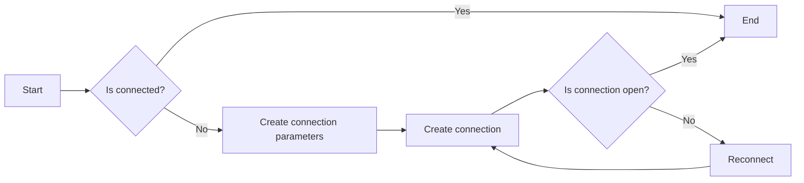

#### 带注释源码

```python
@conn_retry("RabbitMQ", "Acquiring connection")
def connect(self) -> None:
    if self.is_connected:
        return

    credentials = pika.PlainCredentials(self.username, self.password)
    parameters = pika.ConnectionParameters(
        host=self.host,
        port=self.port,
        virtual_host=self.config.vhost,
        credentials=credentials,
        blocked_connection_timeout=BLOCKED_CONNECTION_TIMEOUT,
        socket_timeout=SOCKET_TIMEOUT,
        connection_attempts=CONNECTION_ATTEMPTS,
        retry_delay=RETRY_DELAY,
        heartbeat=300,  # 5 minute timeout (heartbeats sent every 2.5 min)
    )

    self._connection = pika.BlockingConnection(parameters)
    self._channel = self._connection.channel()
    self._channel.basic_qos(prefetch_count=1)

    self.declare_infrastructure()
```


### SyncRabbitMQ.connect

Establishes a connection to RabbitMQ.

参数：

- `self`：`SyncRabbitMQ`，The instance of the SyncRabbitMQ class.
- `None`：`None`，No parameters are passed to this method.

返回值：`None`，This method does not return a value.

#### 流程图


#### 带注释源码

```python
@conn_retry("RabbitMQ", "Acquiring connection")
def connect(self) -> None:
    if self.is_connected:
        return

    credentials = pika.PlainCredentials(self.username, self.password)
    parameters = pika.ConnectionParameters(
        host=self.host,
        port=self.port,
        virtual_host=self.config.vhost,
        credentials=credentials,
        blocked_connection_timeout=BLOCKED_CONNECTION_TIMEOUT,
        socket_timeout=SOCKET_TIMEOUT,
        connection_attempts=CONNECTION_ATTEMPTS,
        retry_delay=RETRY_DELAY,
        heartbeat=300,  # 5 minute timeout (heartbeats sent every 2.5 min)
    )

    self._connection = pika.BlockingConnection(parameters)
    self._channel = self._connection.channel()
    self._channel.basic_qos(prefetch_count=1)

    self.declare_infrastructure()
```


### SyncRabbitMQ.disconnect

This method closes the connection to the RabbitMQ server.

参数：

- 无

返回值：`None`，表示没有返回值，方法执行后连接被关闭

#### 流程图

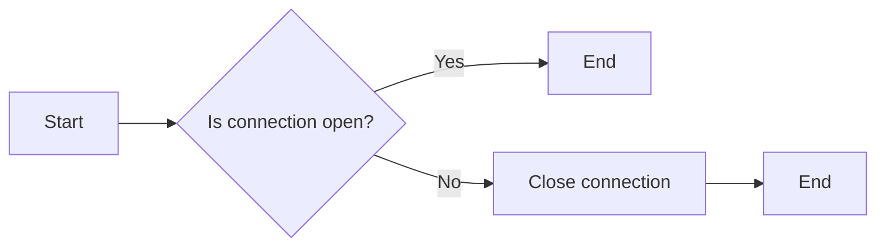

#### 带注释源码

```python
def disconnect(self) -> None:
    if self._channel:
        if self._channel.is_open:
            self._channel.close()
        self._channel = None
    if self._connection:
        if self._connection.is_open:
            self._connection.close()
        self._connection = None
```


### SyncRabbitMQ.declare_infrastructure

Declare exchanges and queues for this service.

参数：

- `self`：`SyncRabbitMQ`，The instance of SyncRabbitMQ class.
- ...

返回值：`None`，No return value, it declares the infrastructure.

#### 流程图


#### 带注释源码

```python
def declare_infrastructure(self) -> None:
    """Declare exchanges and queues for this service"""
    if not self.is_ready:
        self.connect()

    if self._channel is None:
        raise RuntimeError("Channel should be established after connect")

    # Declare exchanges
    for exchange in self.config.exchanges:
        self._channel.exchange_declare(
            exchange=exchange.name,
            exchange_type=exchange.type.value,
            durable=exchange.durable,
            auto_delete=exchange.auto_delete,
        )

    # Declare queues and bind them to exchanges
    for queue in self.config.queues:
        self._channel.queue_declare(
            queue=queue.name,
            durable=queue.durable,
            auto_delete=queue.auto_delete,
            arguments=queue.arguments,
        )
        if queue.exchange:
            self._channel.queue_bind(
                queue=queue.name,
                exchange=queue.exchange.name,
                routing_key=queue.routing_key or queue.name,
            )
```


### SyncRabbitMQ.publish_message

Publishes a message to a specified exchange in RabbitMQ.

参数：

- `routing_key`：`str`，The routing key used to direct the message to a specific queue.
- `message`：`str`，The message to be published.
- `exchange`：`Optional[Exchange]`，The exchange to which the message should be published. If not specified, the default exchange is used.
- `properties`：`Optional[BasicProperties]`，The message properties, such as delivery mode, priority, and headers. If not specified, default properties are used.
- `mandatory`：`bool`，Indicates whether the message should be sent to the dead letter exchange if there are no matching queues.

返回值：`None`，No value is returned.

#### 流程图

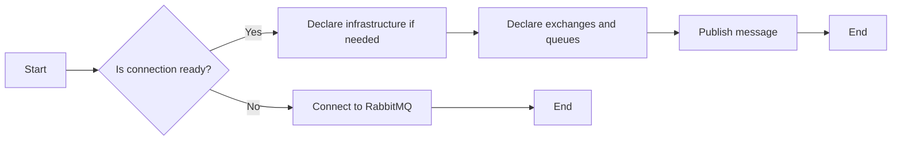

#### 带注释源码

```python
@func_retry
def publish_message(
    self,
    routing_key: str,
    message: str,
    exchange: Optional[Exchange] = None,
    properties: Optional[BasicProperties] = None,
    mandatory: bool = True,
) -> None:
    if not self.is_ready:
        self.connect()

    if self._channel is None:
        raise RuntimeError("Channel should be established after connect")

    self._channel.basic_publish(
        exchange=exchange.name if exchange else "",
        routing_key=routing_key,
        body=message.encode(),
        properties=properties or BasicProperties(delivery_mode=2),
        mandatory=mandatory,
    )
```


### SyncRabbitMQ.get_channel

获取当前连接的RabbitMQ通道。

参数：

- 无

返回值：`pika.adapters.blocking_connection.BlockingChannel`，当前连接的RabbitMQ通道。

#### 流程图

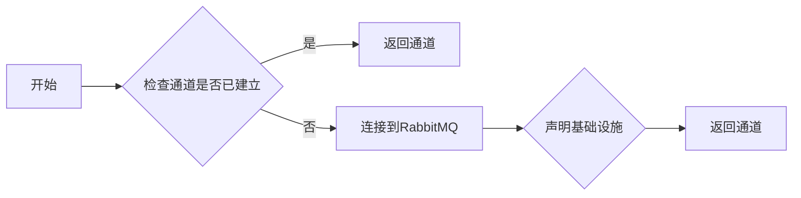

#### 带注释源码

```python
def get_channel(self) -> pika.adapters.blocking_connection.BlockingChannel:
    if not self.is_ready:
        self.connect()
    if self._channel is None:
        raise RuntimeError("Channel should be established after connect")
    return self._channel
```


### SyncRabbitMQ.is_connected

Check if the RabbitMQ connection is established.

参数：

- 无

返回值：`bool`，Indicates whether the connection is established.

#### 流程图

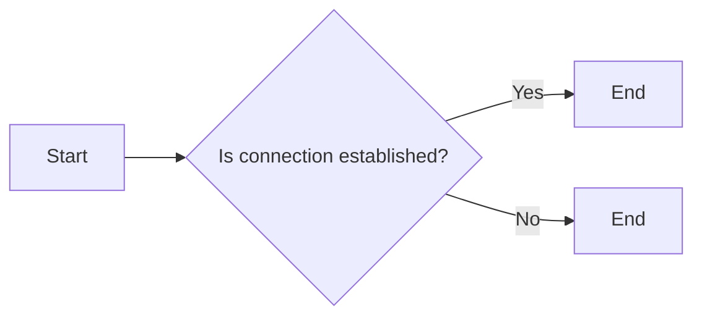

#### 带注释源码

```python
class SyncRabbitMQ(RabbitMQBase):
    # ...

    @property
    def is_connected(self) -> bool:
        return bool(self._connection and self._connection.is_open)
```


### SyncRabbitMQ.is_ready

Check if the RabbitMQ channel is ready for use.

参数：

- 无

返回值：`bool`，Indicates whether the RabbitMQ channel is ready.

#### 流程图

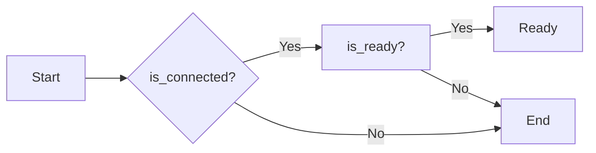

#### 带注释源码

```python
    @property
    def is_ready(self) -> bool:
        return bool(self.is_connected and self._channel)
```


### AsyncRabbitMQ.__init__

This method initializes an instance of the `AsyncRabbitMQ` class, setting up the connection to RabbitMQ and preparing the infrastructure for message exchange.

参数：

- `config`：`RabbitMQConfig`，The configuration for the RabbitMQ service instance, including virtual host, exchanges, and queues.

返回值：无

#### 流程图

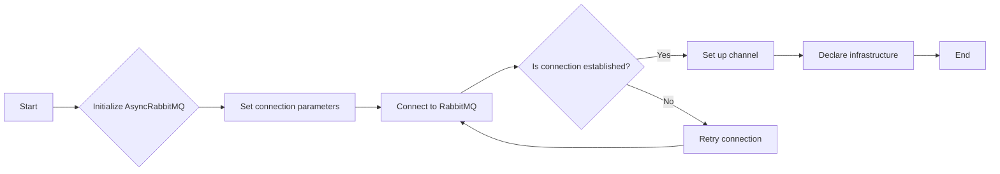

#### 带注释源码

```python
def __init__(self, config: RabbitMQConfig):
    super().__init__(config)
    self._reconnect_lock: asyncio.Lock | None = None
```


### AsyncRabbitMQ.connect

Establishes an asynchronous connection to RabbitMQ.

参数：

- `config`：`RabbitMQConfig`，The configuration for the RabbitMQ service instance.

返回值：`None`，Indicates that the connection has been established.

#### 流程图

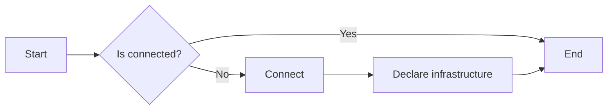

#### 带注释源码

```python
@conn_retry("AsyncRabbitMQ", "Acquiring async connection")
async def connect(self):
    if self.is_connected and self._channel and not self._channel.is_closed:
        return

    if (
        self.is_connected
        and self._connection
        and (self._channel is None or self._channel.is_closed)
    ):
        self._channel = await self._connection.channel()
        await self._channel.set_qos(prefetch_count=1)
        await self.declare_infrastructure()
        return

    self._connection = await aio_pika.connect_robust(
        host=self.host,
        port=self.port,
        login=self.username,
        password=self.password,
        virtualhost=self.config.vhost.lstrip("/"),
        blocked_connection_timeout=BLOCKED_CONNECTION_TIMEOUT,
        heartbeat=300,  # 5 minute timeout (heartbeats sent every 2.5 min)
    )
    self._channel = await self._connection.channel()
    await self._channel.set_qos(prefetch_count=1)

    await self.declare_infrastructure()
```


### AsyncRabbitMQ.disconnect

`disconnect` 方法用于关闭异步 RabbitMQ 连接。

参数：

- 无

返回值：`None`，表示没有返回值，方法执行后连接被关闭。

#### 流程图

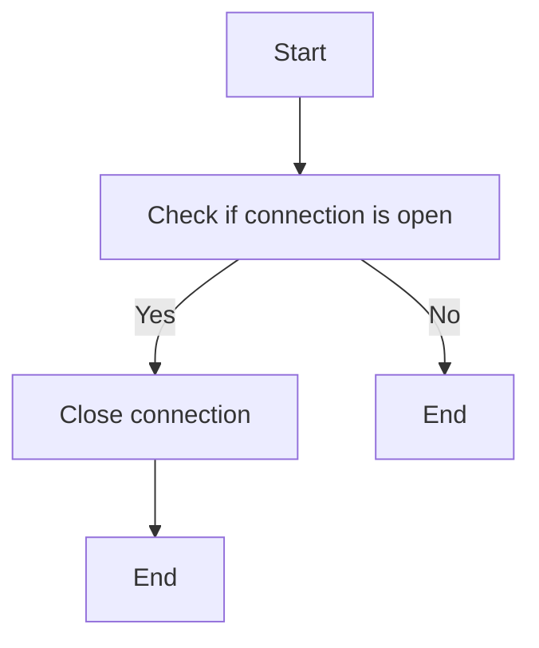

#### 带注释源码

```python
async def disconnect(self):
    if self._channel:
        await self._channel.close()
        self._channel = None
    if self._connection:
        await self._connection.close()
        self._connection = None
```


### AsyncRabbitMQ.declare_infrastructure

Declare exchanges and queues for this service.

参数：

- `self`：`AsyncRabbitMQ`，The instance of AsyncRabbitMQ class.
- `config`：`RabbitMQConfig`，The configuration for RabbitMQ service instance.

返回值：`None`，No return value, it declares the infrastructure.

#### 流程图

```mermaid
graph LR
A[Start] --> B{Is ready?}
B -- Yes --> C[Declare exchanges]
B -- No --> D[Connect]
C --> E[Declare queues]
E --> F[End]
D --> G[Declare queues]
G --> F
```

#### 带注释源码

```python
async def declare_infrastructure(self):
    """Declare exchanges and queues for this service"""
    if not self.is_ready:
        await self.connect()

    if self._channel is None:
        raise RuntimeError("Channel should be established after connect")

    # Declare exchanges
    for exchange in self.config.exchanges:
        await self._channel.declare_exchange(
            name=exchange.name,
            type=exchange.type.value,
            durable=exchange.durable,
            auto_delete=exchange.auto_delete,
        )

    # Declare queues and bind them to exchanges
    for queue in self.config.queues:
        queue_obj = await self._channel.declare_queue(
            name=queue.name,
            durable=queue.durable,
            auto_delete=queue.auto_delete,
            arguments=queue.arguments,
        )
        if queue.exchange:
            exchange = await self._channel.get_exchange(queue.exchange.name)
            await queue_obj.bind(
                exchange, routing_key=queue.routing_key or queue.name
            )
```


### AsyncRabbitMQ.publish_message

Publishes a message to a specified exchange in RabbitMQ asynchronously.

参数：

- `routing_key`：`str`，The routing key used to direct the message to the correct queue.
- `message`：`str`，The message to be published.
- `exchange`：`Optional[Exchange]`，The exchange to which the message should be published. If not specified, the default exchange is used.
- `persistent`：`bool`，Whether the message should be marked as persistent. Defaults to `True`.

返回值：`None`，No value is returned.

#### 流程图

```mermaid
graph LR
A[Start] --> B{Is channel ready?}
B -- Yes --> C[Ensure channel]
B -- No --> D[Connect]
C --> E[Get exchange]
E --> F[Publish message]
F --> G[End]
D --> B
```

#### 带注释源码

```python
async def publish_message(
    self,
    routing_key: str,
    message: str,
    exchange: Optional[Exchange] = None,
    persistent: bool = True,
) -> None:
    try:
        await self._publish_once(routing_key, message, exchange, persistent)
    except aio_pika.exceptions.ChannelInvalidStateError:
        logger.warning(
            "RabbitMQ channel invalid, forcing reconnect and retrying publish"
        )
        async with self._lock:
            self._channel = None
        await self._publish_once(routing_key, message, exchange, persistent)
```


### AsyncRabbitMQ.get_channel

获取异步RabbitMQ连接的通道。

参数：

- 无

返回值：`aio_pika.abc.AbstractChannel`，返回一个有效的RabbitMQ通道对象。

#### 流程图

```mermaid
graph LR
A[开始] --> B{检查通道是否有效}
B -- 是 --> C[返回通道]
B -- 否 --> D[获取通道]
D --> E[返回通道]
E --> F[结束]
```

#### 带注释源码

```python
async def get_channel(self) -> aio_pika.abc.AbstractChannel:
    return await self._ensure_channel()
```

```python
async def _ensure_channel(self) -> aio_pika.abc.AbstractChannel:
    """Get a valid channel, reconnecting if the current one is stale.

    Uses a lock to prevent concurrent reconnection attempts from racing.
    """
    if self.is_ready:
        return self._channel  # type: ignore  # is_ready guarantees non-None

    async with self._lock:
        # Double-check after acquiring lock
        if self.is_ready:
            return self._channel  # type: ignore

        self._channel = None
        await self.connect()

        if self._channel is None:
            raise RuntimeError("Channel should be established after connect")

        return self._channel
``` 


### AsyncRabbitMQ.is_connected

Check if the asynchronous RabbitMQ connection is established.

参数：

- 无

返回值：`bool`，Indicates whether the connection is established.

#### 流程图

```mermaid
graph TD
    A[Start] --> B{Is connection established?}
    B -- Yes --> C[End]
    B -- No --> D[End]
```

#### 带注释源码

```python
    @property
    def is_connected(self) -> bool:
        return bool(self._connection and not self._connection.is_closed)
```


### AsyncRabbitMQ.is_ready

Check if the asynchronous RabbitMQ client has a valid channel.

参数：

- 无

返回值：`bool`，Indicates whether the client has a valid channel.

#### 流程图

```mermaid
graph LR
A[Start] --> B{Is connected?}
B -- Yes --> C[Is channel valid?]
B -- No --> D[Reconnect]
C -- Yes --> E[Return True]
C -- No --> F[Return False]
D --> B
```

#### 带注释源码

```python
    @property
    def is_ready(self) -> bool:
        return bool(self.is_connected and self._channel and not self._channel.is_closed)
```


### AsyncRabbitMQ._ensure_channel

Ensure that a valid channel is available for the asynchronous RabbitMQ client.

参数：

- `None`：无参数，此方法内部处理连接和通道的创建。

返回值：`aio_pika.abc.AbstractChannel`，一个有效的RabbitMQ通道。

#### 流程图

```mermaid
graph LR
A[Start] --> B{Is channel ready?}
B -- Yes --> C[Return channel]
B -- No --> D[Acquire lock]
D --> E{Is connection ready?}
E -- Yes --> F[Create channel]
E -- No --> G[Connect]
F --> H[Set QoS]
H --> C
G --> E
```

#### 带注释源码

```python
async def _ensure_channel(self) -> aio_pika.abc.AbstractChannel:
    """Get a valid channel, reconnecting if the current one is stale.

    Uses a lock to prevent concurrent reconnection attempts from racing.
    """
    if self.is_ready:
        return self._channel  # type: ignore  # is_ready guarantees non-None

    async with self._lock:
        # Double-check after acquiring lock
        if self.is_ready:
            return self._channel  # type: ignore

        self._channel = None
        await self.connect()

        if self._channel is None:
            raise RuntimeError("Channel should be established after connect")

        return self._channel
``` 


### AsyncRabbitMQ._publish_once

This method is responsible for publishing a single message to a specified exchange in RabbitMQ using an asynchronous connection.

参数：

- `routing_key`：`str`，The routing key used to direct the message to the correct queue.
- `message`：`str`，The message to be published.
- `exchange`：`Optional[Exchange]`，The exchange to which the message should be published. If not specified, the default exchange is used.
- `persistent`：`bool`，Indicates whether the message should be marked as persistent.

返回值：`None`，This method does not return a value.

#### 流程图

```mermaid
graph LR
A[Start] --> B{Ensure channel}
B --> C{Get exchange}
C --> D{Publish message}
D --> E[End]
```

#### 带注释源码

```python
async def _publish_once(
    self,
    routing_key: str,
    message: str,
    exchange: Optional[Exchange] = None,
    persistent: bool = True,
) -> None:
    channel = await self._ensure_channel()

    if exchange:
        exchange_obj = await channel.get_exchange(exchange.name)
    else:
        exchange_obj = channel.default_exchange

    await exchange_obj.publish(
        aio_pika.Message(
            body=message.encode(),
            delivery_mode=(
                aio_pika.DeliveryMode.PERSISTENT
                if persistent
                else aio_pika.DeliveryMode.NOT_PERSISTENT
            ),
        ),
        routing_key=routing_key,
    )
```


## 关键组件


### 张量索引与惰性加载

张量索引与惰性加载是代码中用于高效处理大型数据集的关键组件。它允许在需要时才加载数据，从而减少内存消耗并提高性能。

### 反量化支持

反量化支持是代码中用于处理量化数据的关键组件。它能够将量化数据转换回原始数据，以便进行进一步处理和分析。

### 量化策略

量化策略是代码中用于优化数据存储和传输效率的关键组件。它通过减少数据精度来减少数据大小，从而提高性能和降低资源消耗。


## 问题及建议


### 已知问题

-   **全局常量定义分散**：代码中定义了多个全局常量，如`BLOCKED_CONNECTION_TIMEOUT`、`SOCKET_TIMEOUT`等，这些常量分散在代码的不同部分，不易于管理和维护。
-   **重复代码**：`SyncRabbitMQ`和`AsyncRabbitMQ`类中存在大量重复代码，特别是在连接和断开连接的逻辑上。这增加了代码的复杂度和维护成本。
-   **异常处理**：代码中对于异常的处理较为简单，缺乏详细的异常捕获和处理逻辑，可能导致运行时错误难以追踪和修复。
-   **日志记录**：日志记录不够详细，缺乏对关键操作的跟踪和错误信息的记录，不利于问题的排查和调试。

### 优化建议

-   **集中管理全局常量**：将全局常量集中定义在一个配置文件或模块中，便于管理和维护。
-   **提取重复代码**：将`SyncRabbitMQ`和`AsyncRabbitMQ`类中重复的代码提取到公共父类或工具函数中，减少代码冗余。
-   **增强异常处理**：增加详细的异常捕获和处理逻辑，记录关键操作和错误信息，便于问题的排查和修复。
-   **优化日志记录**：增加日志记录的详细程度，记录关键操作和错误信息，便于问题的排查和调试。
-   **使用更高级的日志库**：考虑使用更高级的日志库，如`loguru`或`structlog`，提供更丰富的日志功能，如日志级别、日志格式化等。
-   **代码测试**：增加单元测试和集成测试，确保代码的稳定性和可靠性。
-   **代码审查**：定期进行代码审查，发现潜在的问题和优化空间。


## 其它


### 设计目标与约束

- 设计目标：
  - 提供一个模块化的RabbitMQ连接和消息发布/接收解决方案。
  - 支持同步和异步操作，以适应不同的使用场景。
  - 提供重试机制，以处理网络问题和连接中断。
  - 确保消息的持久性，以防止数据丢失。
- 约束：
  - 必须使用RabbitMQ作为消息传递系统。
  - 必须支持Python 3.7及以上版本。
  - 必须遵守RabbitMQ的API规范。

### 错误处理与异常设计

- 错误处理：
  - 使用`try-except`块捕获和处理可能发生的异常。
  - 对于网络问题和连接中断，使用重试机制。
  - 记录错误信息，以便于调试和监控。
- 异常设计：
  - 定义自定义异常类，以处理特定的错误情况。
  - 异常类应提供清晰的错误信息和恢复策略。

### 数据流与状态机

- 数据流：
  - 消息从生产者发送到RabbitMQ交换器。
  - 交换器将消息路由到相应的队列。
  - 消费者从队列中接收消息并处理。
- 状态机：
  - 连接状态：未连接、连接中、已连接、断开连接。
  - 频道状态：未建立、建立中、已建立、关闭。

### 外部依赖与接口契约

- 外部依赖：
  - `aio_pika`：用于异步RabbitMQ操作。
  - `pika`：用于同步RabbitMQ操作。
  - `pydantic`：用于数据验证和配置。
  - `logging`：用于日志记录。
- 接口契约：
  - `RabbitMQBase`：定义了RabbitMQ连接的基本接口。
  - `SyncRabbitMQ`：实现了同步RabbitMQ连接。
  - `AsyncRabbitMQ`：实现了异步RabbitMQ连接。
  - `Exchange`、`Queue`、`RabbitMQConfig`：定义了RabbitMQ配置和结构。


    