# `.\AutoGPT\autogpt_platform\backend\backend\data\redis_client.py` 详细设计文档

This code provides a connection management system for Redis, handling both synchronous and asynchronous connections with retry logic and caching.

## 整体流程

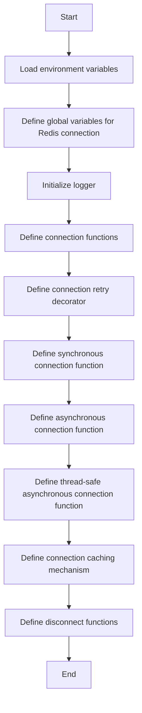

## 类结构

```
RedisConnectionManager (主类)
├── connect() (同步连接)
│   ├── connect() (内部连接函数)
│   └── disconnect() (内部断开函数)
├── connect_async() (异步连接)
│   ├── connect_async() (内部异步连接函数)
│   └── disconnect_async() (内部异步断开函数)
└── get_redis() (获取同步连接)
    └── get_redis() (内部获取同步连接函数)
```

## 全局变量及字段


### `HOST`
    
The host address of the Redis server.

类型：`str`
    


### `PORT`
    
The port number of the Redis server.

类型：`int`
    


### `PASSWORD`
    
The password for authenticating with the Redis server.

类型：`str`
    


### `logger`
    
The logger instance for logging messages.

类型：`logging.Logger`
    


### `RedisConnectionManager.HOST`
    
The host address of the Redis server.

类型：`str`
    


### `RedisConnectionManager.PORT`
    
The port number of the Redis server.

类型：`int`
    


### `RedisConnectionManager.PASSWORD`
    
The password for authenticating with the Redis server.

类型：`str`
    


### `RedisConnectionManager.logger`
    
The logger instance for logging messages.

类型：`logging.Logger`
    
    

## 全局函数及方法


### connect()

连接到Redis服务器。

参数：

- 无

返回值：`Redis`，返回一个Redis连接对象。

#### 流程图

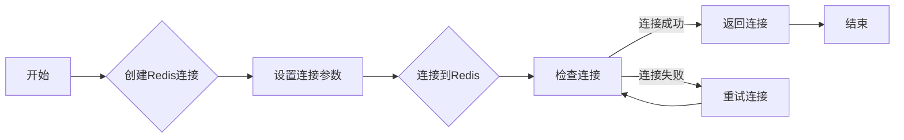

#### 带注释源码

```python
@conn_retry("Redis", "Acquiring connection")
def connect() -> Redis:
    c = Redis(
        host=HOST,
        port=PORT,
        password=PASSWORD,
        decode_responses=True,
    )
    c.ping()
    return c
```


### `disconnect`

断开与Redis数据库的连接。

参数：

- 无

返回值：`None`，无返回值

#### 流程图

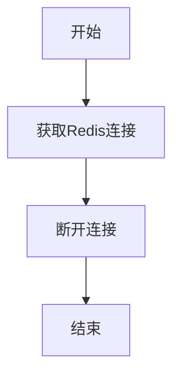

#### 带注释源码

```python
@conn_retry("Redis", "Releasing connection")
def disconnect():
    get_redis().close()
```


### `get_redis()`

获取Redis连接的函数。

参数：

- 无

返回值：`Redis`，返回一个Redis连接对象。

#### 流程图

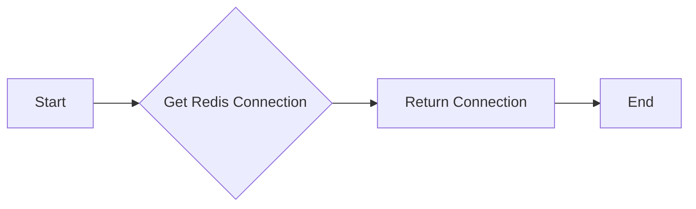

#### 带注释源码

```python
@cached(ttl_seconds=3600)
def get_redis() -> Redis:
    # Connect to Redis and return the connection
    return connect()
```


### connect_async

异步连接到Redis数据库。

参数：

- 无

返回值：`AsyncRedis`，异步Redis连接对象

#### 流程图

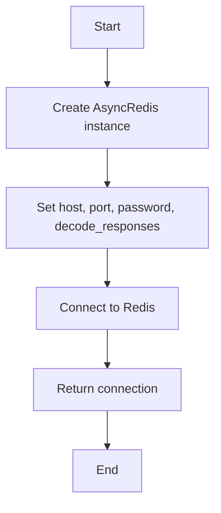

#### 带注释源码

```python
@conn_retry("AsyncRedis", "Acquiring connection")
async def connect_async() -> AsyncRedis:
    c = AsyncRedis(
        host=HOST,
        port=PORT,
        password=PASSWORD,
        decode_responses=True,
    )
    await c.ping()
    return c
```


### `disconnect_async`

断开异步Redis连接。

参数：

- 无

返回值：`None`，无返回值，仅执行断开连接操作。

#### 流程图

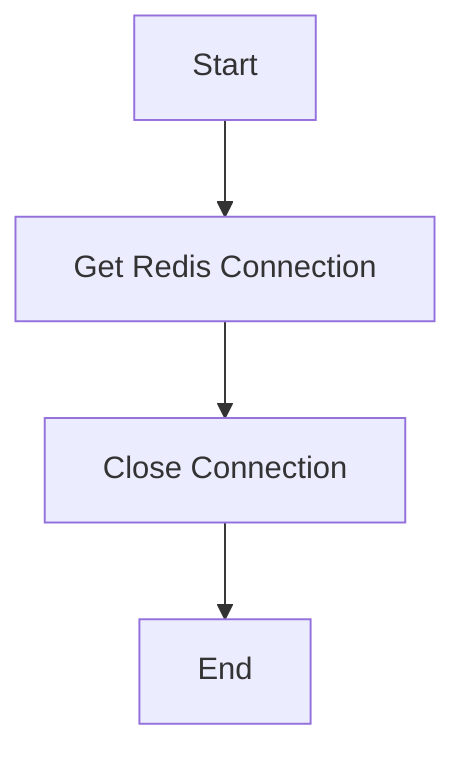

#### 带注释源码

```python
@conn_retry("AsyncRedis", "Releasing connection")
async def disconnect_async():
    c = await get_redis_async()  # 获取Redis连接
    await c.close()  # 关闭连接
```


### `get_redis_async`

异步获取Redis连接。

参数：

- 无

返回值：`AsyncRedis`，异步Redis连接对象

#### 流程图

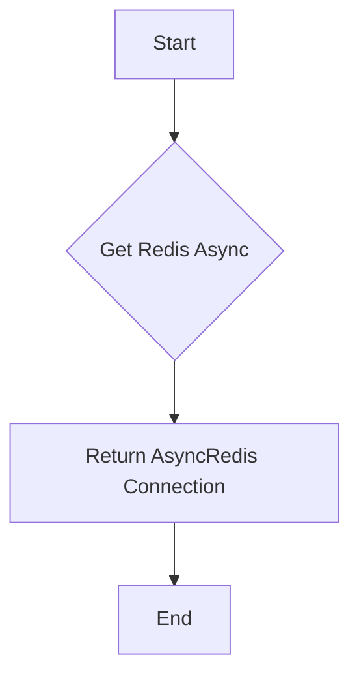

#### 带注释源码

```python
@thread_cached
async def get_redis_async() -> AsyncRedis:
    # Connect to Redis asynchronously
    return await connect_async()
```


### connect()

连接到Redis服务器。

参数：

- 无

返回值：`Redis`，返回一个连接到Redis服务器的Redis对象。

#### 流程图

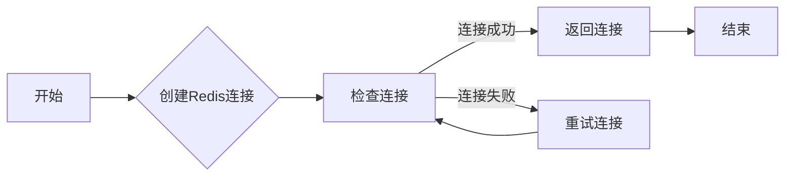

#### 带注释源码

```python
@conn_retry("Redis", "Acquiring connection")
def connect() -> Redis:
    c = Redis(
        host=HOST,
        port=PORT,
        password=PASSWORD,
        decode_responses=True,
    )
    c.ping()
    return c
```


### connect_async()

异步连接到Redis服务器。

参数：

- 无

返回值：`AsyncRedis`，返回一个异步连接到Redis服务器的AsyncRedis对象。

#### 流程图

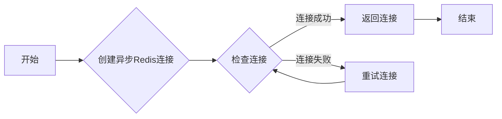

#### 带注释源码

```python
@conn_retry("AsyncRedis", "Acquiring connection")
async def connect_async() -> AsyncRedis:
    c = AsyncRedis(
        host=HOST,
        port=PORT,
        password=PASSWORD,
        decode_responses=True,
    )
    await c.ping()
    return c
```


### get_redis()

获取Redis连接。

参数：

- 无

返回值：`Redis`，返回一个连接到Redis服务器的Redis对象。

#### 流程图

```mermaid
graph LR
A[开始] --> B{调用connect()}
B --> C{返回连接}
C --> D[结束]
```

#### 带注释源码

```python
@cached(ttl_seconds=3600)
def get_redis() -> Redis:
    return connect()
```


### get_redis_async()

异步获取Redis连接。

参数：

- 无

返回值：`AsyncRedis`，返回一个异步连接到Redis服务器的AsyncRedis对象。

#### 流程图

```mermaid
graph LR
A[开始] --> B{调用connect_async()}
B --> C{返回连接}
C --> D[结束]
```

#### 带注释源码

```python
@thread_cached
async def get_redis_async() -> AsyncRedis:
    return await connect_async()
```


### disconnect()

断开Redis连接。

参数：

- 无

返回值：无

#### 流程图

```mermaid
graph LR
A[开始] --> B{调用get_redis()}
B --> C{获取连接}
C --> D{关闭连接}
D --> E[结束]
```

#### 带注释源码

```python
@conn_retry("Redis", "Releasing connection")
def disconnect():
    get_redis().close()
```


### disconnect_async()

异步断开Redis连接。

参数：

- 无

返回值：无

#### 流程图

```mermaid
graph LR
A[开始] --> B{调用get_redis_async()}
B --> C{获取连接}
C --> D{关闭连接}
D --> E[结束]
```

#### 带注释源码

```python
@conn_retry("AsyncRedis", "Releasing connection")
async def disconnect_async():
    c = await get_redis_async()
    await c.close()
```


### `disconnect`

断开与Redis数据库的连接。

参数：

- 无

返回值：`None`，无返回值

#### 流程图


#### 带注释源码

```python
@conn_retry("Redis", "Releasing connection")
def disconnect():
    get_redis().close()
```


### connect_async

连接到Redis异步客户端。

参数：

- 无

返回值：`AsyncRedis`，返回一个异步Redis客户端连接。

#### 流程图

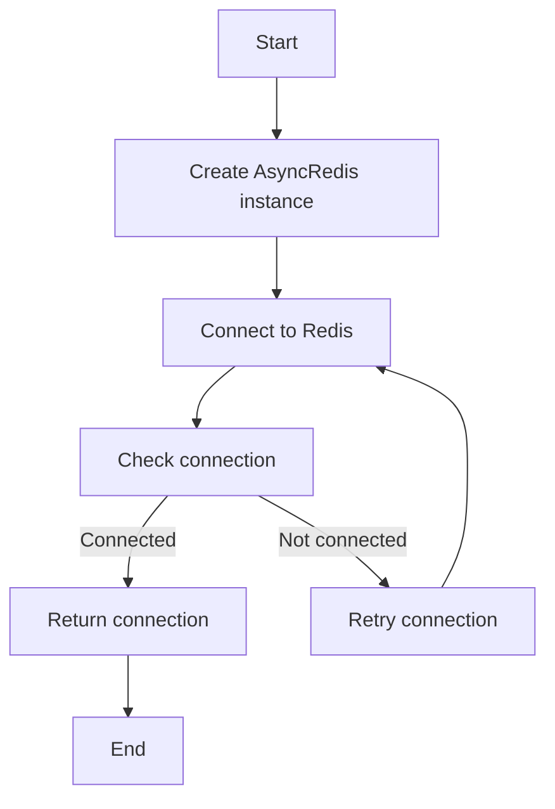

#### 带注释源码

```python
@conn_retry("AsyncRedis", "Acquiring connection")
async def connect_async() -> AsyncRedis:
    c = AsyncRedis(
        host=HOST,
        port=PORT,
        password=PASSWORD,
        decode_responses=True,
    )
    await c.ping()
    return c
```


### `disconnect_async`

断开异步Redis连接。

参数：

- 无

返回值：`None`，无返回值，仅执行断开连接操作。

#### 流程图

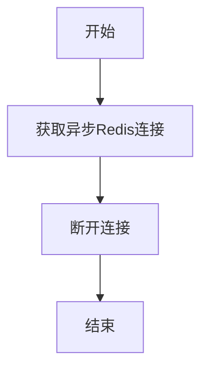

#### 带注释源码

```python
@conn_retry("AsyncRedis", "Releasing connection")
async def disconnect_async():
    c = await get_redis_async()  # 获取异步Redis连接
    await c.close()  # 断开连接
```


### `get_redis()`

获取Redis连接的实例。

参数：

- 无

返回值：`Redis`，返回一个Redis连接实例。

#### 流程图

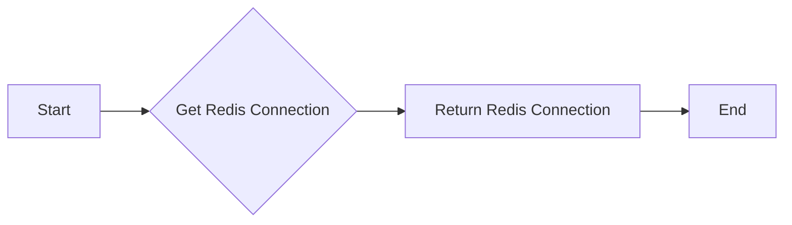

#### 带注释源码

```python
@cached(ttl_seconds=3600)
def get_redis() -> Redis:
    return connect()
```


## 关键组件


### 张量索引与惰性加载

支持对张量的索引操作，并在需要时才加载张量数据，以优化内存使用和性能。

### 反量化支持

提供对反量化操作的支持，允许在量化过程中进行逆量化处理。

### 量化策略

实现多种量化策略，以适应不同的应用场景和性能需求。


## 问题及建议


### 已知问题

-   **全局变量配置**: 代码中使用了全局变量来存储Redis的连接信息，这可能导致配置信息难以管理和维护。建议使用配置文件或环境变量来管理这些配置，以便于集中管理和修改。
-   **连接重试机制**: `conn_retry`装饰器用于重试连接，但没有指定重试次数和重试间隔。这可能导致无限重试或重试次数不足。建议在装饰器中添加重试次数和重试间隔的配置。
-   **异步连接管理**: `get_redis_async`函数中使用了`thread_cached`装饰器，这可能导致异步代码在多线程环境中运行时出现问题。建议使用异步缓存装饰器，如`aiocache`。
-   **日志记录**: 代码中使用了`logging`模块，但没有配置日志级别和输出格式。建议配置日志级别和输出格式，以便于调试和监控。
-   **代码复用**: `connect`和`connect_async`函数的功能相似，可以考虑将它们合并为一个函数，减少代码重复。

### 优化建议

-   **使用配置文件**: 将Redis的连接信息存储在配置文件中，使用配置管理库（如`configparser`）来读取配置信息。
-   **配置重试参数**: 在`conn_retry`装饰器中添加重试次数和重试间隔的配置，确保连接尝试不会无限进行。
-   **使用异步缓存**: 使用异步缓存装饰器（如`aiocache`）来管理异步连接，确保在多线程环境中正确运行。
-   **配置日志**: 配置日志级别和输出格式，以便于调试和监控。
-   **合并连接函数**: 将`connect`和`connect_async`函数合并为一个函数，减少代码重复，并提高代码可维护性。


## 其它


### 设计目标与约束

- 设计目标：
  - 提供一个高效、可靠的Redis连接管理机制。
  - 支持同步和异步的Redis连接。
  - 确保连接的稳定性和重试机制。
  - 简化Redis连接的使用，减少代码复杂性。

- 约束：
  - 必须使用环境变量配置Redis连接信息。
  - 连接信息包括主机、端口和密码。
  - 必须处理连接异常和重试逻辑。

### 错误处理与异常设计

- 错误处理：
  - 使用`conn_retry`装饰器处理连接异常，包括连接失败和连接超时。
  - 在连接失败时，自动重试连接，直到成功或达到最大重试次数。
  - 记录错误日志，便于问题追踪和调试。

- 异常设计：
  - 定义自定义异常类，用于处理特定的Redis连接错误。
  - 异常类应提供清晰的错误信息和错误代码。

### 数据流与状态机

- 数据流：
  - 用户请求Redis连接。
  - 系统通过`get_redis`或`get_redis_async`函数获取连接。
  - 如果连接不存在，则通过`connect`或`connect_async`函数创建连接。
  - 使用`cached`装饰器缓存连接，以减少连接创建的频率。
  - 用户完成操作后，通过`disconnect`或`disconnect_async`函数关闭连接。

- 状态机：
  - Redis连接状态包括：未连接、连接中、已连接、关闭。
  - 状态转换由连接操作触发，如连接请求、连接成功、连接失败、连接关闭。

### 外部依赖与接口契约

- 外部依赖：
  - `redis`库：用于同步Redis连接。
  - `redis.asyncio`库：用于异步Redis连接。
  - `dotenv`库：用于加载环境变量。
  - `logging`库：用于日志记录。

- 接口契约：
  - `connect`和`connect_async`函数负责创建Redis连接。
  - `disconnect`和`disconnect_async`函数负责关闭Redis连接。
  - `get_redis`和`get_redis_async`函数负责获取Redis连接。
  - `cached`和`thread_cached`装饰器用于缓存连接。
  - `conn_retry`装饰器用于重试连接操作。
    