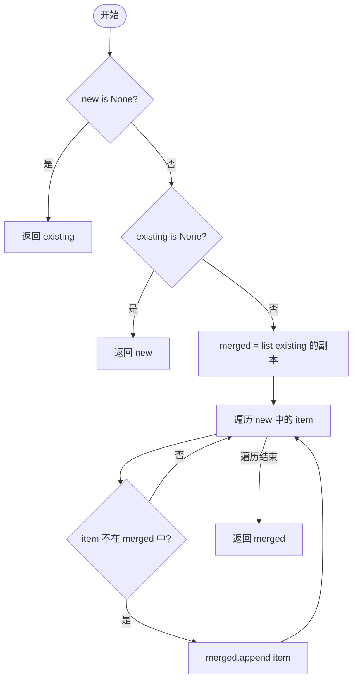
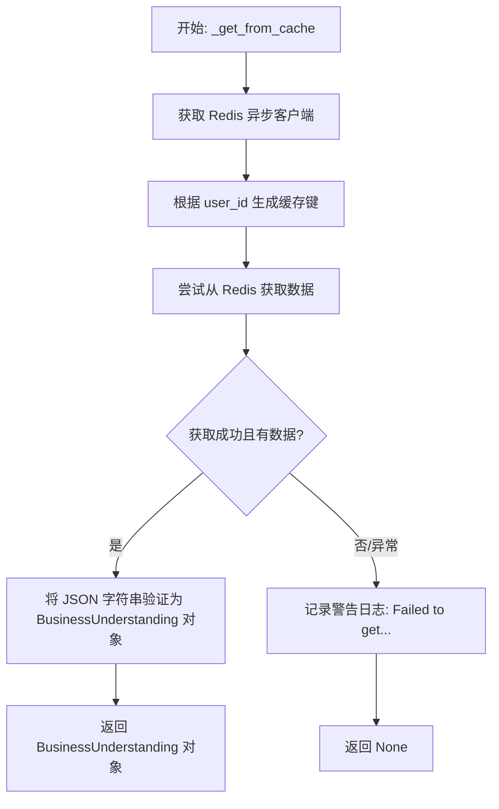
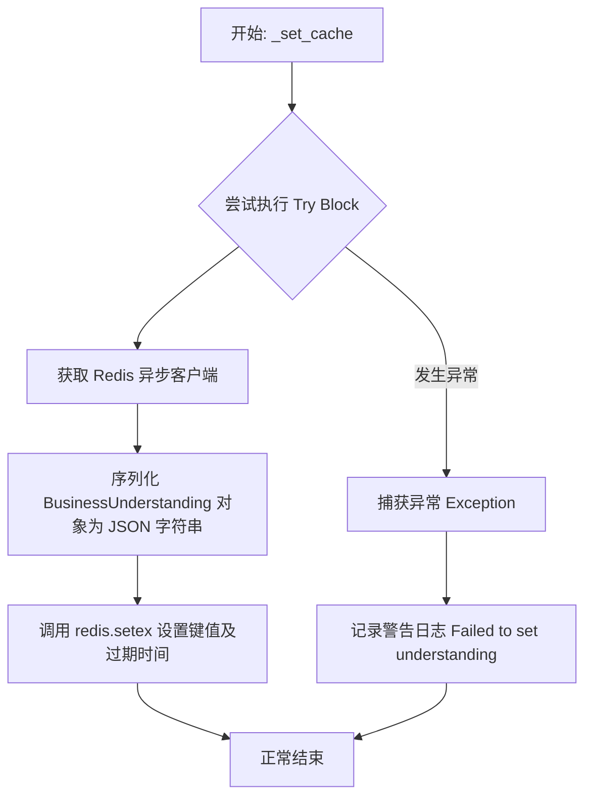
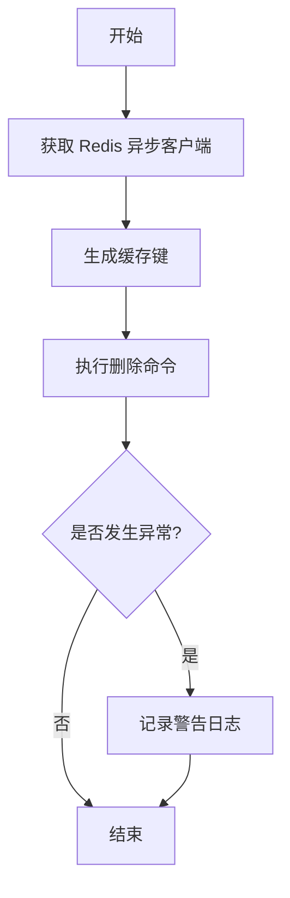
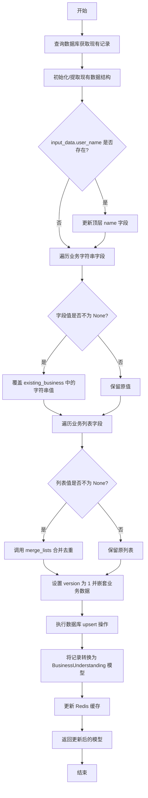
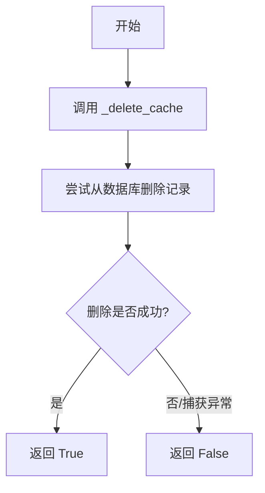
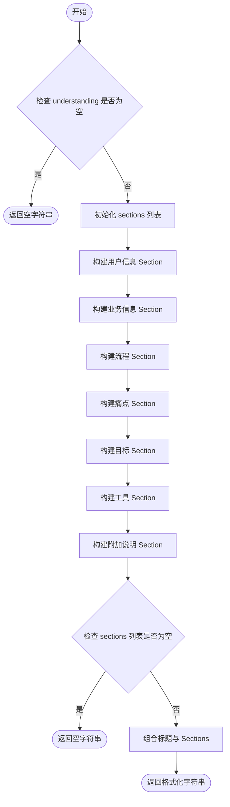

# `.\AutoGPT\autogpt_platform\backend\backend\data\understanding.py` 详细设计文档

该代码定义了用户业务理解的数据模型及数据访问层，利用 Pydantic 进行数据验证，通过 Prisma 进行数据库持久化，并结合 Redis 实现高性能缓存机制，支持用户业务信息的获取、增量更新、清除及用于 AI 提示工程的格式化输出。

## 整体流程

```mermaid
graph TD
    subgraph Get_Flow [获取业务理解流程]
        Start_Get[开始: get_business_understanding] --> Check_Cache[检查 Redis 缓存]
        Check_Cache -->|命中| Return_Cached[返回缓存数据]
        Check_Cache -->|未命中| Query_DB[查询 Prisma 数据库]
        Query_DB -->|记录存在| Convert_Model[转换为 BusinessUnderstanding 模型]
        Query_DB -->|记录不存在| Return_Null[返回 None]
        Convert_Model --> Set_Cache[写入 Redis 缓存 TTL 48h]
        Set_Cache --> Return_DB[返回数据库数据]
    end
    
    subgraph Upsert_Flow [更新/插入业务理解流程]
        Start_Upsert[开始: upsert_business_understanding] --> Fetch_Existing[获取现有数据库记录]
        Fetch_Existing --> Merge_Strategy[执行合并策略]
        Merge_Strategy --> Merge_Str[合并字符串字段 新值覆盖旧值]
        Merge_Str --> Merge_List[合并列表字段 去重并追加]
        Merge_List --> DB_Upsert[执行 Prisma Upsert 操作]
        DB_Upsert --> Update_Cache[更新 Redis 缓存]
        Update_Cache --> Return_Result[返回更新后的 BusinessUnderstanding]
    end
```



## 类结构

```
pydantic.BaseModel
├── BusinessUnderstandingInput
└── BusinessUnderstanding

Global Functions:
├── Helpers: _cache_key, _json_to_list, _merge_lists
├── Cache Operations: _get_from_cache, _set_cache, _delete_cache
├── Core Operations: get_business_understanding, upsert_business_understanding, clear_business_understanding
└── Utilities: format_understanding_for_prompt
```

## 全局变量及字段


### `CACHE_KEY_PREFIX`
    
Redis缓存键的前缀，用于存储用户业务理解数据。

类型：`str`
    


### `CACHE_TTL_SECONDS`
    
缓存生存时间（秒），默认为48小时。

类型：`int`
    


### `logger`
    
用于记录模块日志的标准日志记录器实例。

类型：`logging.Logger`
    


### `BusinessUnderstandingInput.user_name`
    
The user's name

类型：`Optional[str]`
    


### `BusinessUnderstandingInput.job_title`
    
The user's job title

类型：`Optional[str]`
    


### `BusinessUnderstandingInput.business_name`
    
Name of the user's business

类型：`Optional[str]`
    


### `BusinessUnderstandingInput.industry`
    
Industry or sector

类型：`Optional[str]`
    


### `BusinessUnderstandingInput.business_size`
    
Company size (e.g., '1-10', '11-50')

类型：`Optional[str]`
    


### `BusinessUnderstandingInput.user_role`
    
User's role in the organization (e.g., 'decision maker', 'implementer')

类型：`Optional[str]`
    


### `BusinessUnderstandingInput.key_workflows`
    
Key business workflows

类型：`Optional[list[str]]`
    


### `BusinessUnderstandingInput.daily_activities`
    
Daily activities performed

类型：`Optional[list[str]]`
    


### `BusinessUnderstandingInput.pain_points`
    
Current pain points

类型：`Optional[list[str]]`
    


### `BusinessUnderstandingInput.bottlenecks`
    
Process bottlenecks

类型：`Optional[list[str]]`
    


### `BusinessUnderstandingInput.manual_tasks`
    
Manual/repetitive tasks

类型：`Optional[list[str]]`
    


### `BusinessUnderstandingInput.automation_goals`
    
Desired automation goals

类型：`Optional[list[str]]`
    


### `BusinessUnderstandingInput.current_software`
    
Software/tools currently used

类型：`Optional[list[str]]`
    


### `BusinessUnderstandingInput.existing_automation`
    
Existing automations

类型：`Optional[list[str]]`
    


### `BusinessUnderstandingInput.additional_notes`
    
Any additional context

类型：`Optional[str]`
    


### `BusinessUnderstanding.id`
    
数据库记录的唯一标识符

类型：`str`
    


### `BusinessUnderstanding.user_id`
    
关联的用户ID

类型：`str`
    


### `BusinessUnderstanding.created_at`
    
记录创建时间

类型：`datetime`
    


### `BusinessUnderstanding.updated_at`
    
记录最后更新时间

类型：`datetime`
    


### `BusinessUnderstanding.user_name`
    
The user's name

类型：`Optional[str]`
    


### `BusinessUnderstanding.job_title`
    
The user's job title

类型：`Optional[str]`
    


### `BusinessUnderstanding.business_name`
    
Name of the user's business

类型：`Optional[str]`
    


### `BusinessUnderstanding.industry`
    
Industry or sector

类型：`Optional[str]`
    


### `BusinessUnderstanding.business_size`
    
Company size (e.g., '1-10', '11-50')

类型：`Optional[str]`
    


### `BusinessUnderstanding.user_role`
    
User's role in the organization (e.g., 'decision maker', 'implementer')

类型：`Optional[str]`
    


### `BusinessUnderstanding.key_workflows`
    
Key business workflows

类型：`list[str]`
    


### `BusinessUnderstanding.daily_activities`
    
Daily activities performed

类型：`list[str]`
    


### `BusinessUnderstanding.pain_points`
    
Current pain points

类型：`list[str]`
    


### `BusinessUnderstanding.bottlenecks`
    
Process bottlenecks

类型：`list[str]`
    


### `BusinessUnderstanding.manual_tasks`
    
Manual/repetitive tasks

类型：`list[str]`
    


### `BusinessUnderstanding.automation_goals`
    
Desired automation goals

类型：`list[str]`
    


### `BusinessUnderstanding.current_software`
    
Software/tools currently used

类型：`list[str]`
    


### `BusinessUnderstanding.existing_automation`
    
Existing automations

类型：`list[str]`
    


### `BusinessUnderstanding.additional_notes`
    
Any additional context

类型：`Optional[str]`
    
    

## 全局函数及方法


### `_cache_key`

生成用于用户业务理解的 Redis 缓存键。

参数：

-  `user_id`：`str`，用户的唯一标识符

返回值：`str`，格式化后的缓存键字符串，由前缀和用户ID组成

#### 流程图

```mermaid
graph TD
    A[开始] --> B[接收参数 user_id]
    B --> C[获取全局常量 CACHE_KEY_PREFIX]
    C --> D[拼接字符串 f'{CACHE_KEY_PREFIX}:{user_id}']
    D --> E[返回生成的缓存键字符串]
    E --> F[结束]
```

#### 带注释源码

```python
def _cache_key(user_id: str) -> str:
    """Generate cache key for user business understanding."""
    # 使用全局定义的前缀常量和传入的用户ID拼接成唯一的缓存键
    return f"{CACHE_KEY_PREFIX}:{user_id}"
```


### `_json_to_list`

该函数用于将任意类型的 JSON 字段值（可能来自数据库记录或 API 响应）安全地转换为字符串列表，处理 None 值及非列表类型数据，确保下游逻辑总能获得有效的列表对象。

参数：

-  `value`：`Any`，待转换的输入值，可能是 None、list 或其他任意类型。

返回值：`list[str]`，转换后的字符串列表。如果输入为 None 或不是列表实例，则返回空列表。

#### 流程图

```mermaid
graph TD
    A[开始: 输入 value] --> B{value is None?}
    B -- 是 --> C[返回空列表]
    B -- 否 --> D{isinstance value, list?}
    D -- 是 --> E[将 value 强制转换为 list[str] 并返回]
    D -- 否 --> C
    C --> F[结束]
    E --> F
```

#### 带注释源码

```python
def _json_to_list(value: Any) -> list[str]:
    """Convert Json field to list[str], handling None."""
    # 检查输入值是否为 None，如果是，返回空列表
    if value is None:
        return []
    
    # 检查输入值是否已经是列表类型，如果是，进行类型转换并返回
    if isinstance(value, list):
        return cast(list[str], value)
    
    # 如果既不是 None 也不是列表（意外类型），返回空列表以确保类型安全
    return []
```


### `_merge_lists`

合并两个列表，在保留顺序的同时去除重复项。

参数：

- `existing`：`list | None`，代表现有数据的列表。
- `new`：`list | None`，包含待合并新数据的列表。

返回值：`list | None`，合并后的列表。如果 `new` 为 None 则返回 `existing`，如果 `existing` 为 None 则返回 `new`。

#### 流程图



#### 带注释源码

```python
def _merge_lists(existing: list | None, new: list | None) -> list | None:
    """Merge two lists, removing duplicates while preserving order."""
    # 如果新列表为空，直接返回现有列表
    if new is None:
        return existing
    # 如果现有列表为空，直接返回新列表
    if existing is None:
        return new
    # 复制现有列表以保留顺序
    merged = list(existing)
    # 遍历新列表中的项目
    for item in new:
        # 如果项目不在合并后的列表中，则追加（去重）
        if item not in merged:
            merged.append(item)
    return merged
```


### `_get_from_cache`

从 Redis 缓存中异步获取指定用户的业务理解数据。如果数据存在，将其反序列化为 `BusinessUnderstanding` 对象；如果缓存未命中或发生异常，则捕获错误、记录日志并返回 None。

参数：

- `user_id`：`str`，用户的唯一标识符，用于生成对应的缓存键。

返回值：`Optional[BusinessUnderstanding]`，如果缓存命中且数据有效，返回 `BusinessUnderstanding` 对象；否则返回 `None`。

#### 流程图



#### 带注释源码

```python
async def _get_from_cache(user_id: str) -> Optional[BusinessUnderstanding]:
    """Get business understanding from Redis cache."""
    try:
        # 获取 Redis 异步客户端实例
        redis = await get_redis_async()
        # 根据用户 ID 生成缓存键，并尝试从 Redis 获取数据
        cached_data = await redis.get(_cache_key(user_id))
        # 如果缓存中存在数据，使用 Pydantic 将 JSON 字符串验证并转换为模型对象
        if cached_data:
            return BusinessUnderstanding.model_validate_json(cached_data)
    except Exception as e:
        # 捕获 Redis 操作中的异常（如连接失败），记录警告日志，防止影响主流程
        logger.warning(f"Failed to get understanding from cache: {e}")
    # 缓存未命中或发生异常时返回 None
    return None
```


### `_set_cache`

Set business understanding in Redis cache with TTL.

参数：

-  `user_id`：`str`，用户的唯一标识符，用于生成特定的缓存键。
-  `understanding`：`BusinessUnderstanding`，包含用户业务理解详情的数据模型对象，将被序列化并存储。

返回值：`None`，无返回值；该函数主要执行向 Redis 写入数据的副作用。

#### 流程图



#### 带注释源码

```python
async def _set_cache(user_id: str, understanding: BusinessUnderstanding) -> None:
    """Set business understanding in Redis cache with TTL."""
    try:
        # 获取 Redis 异步客户端实例
        redis = await get_redis_async()
        # 将 Pydantic 模型序列化为 JSON 字符串
        # 使用 setex 命令设置键值对，并附带过期时间（TTL）
        await redis.setex(
            _cache_key(user_id),          # 生成基于 user_id 的缓存键
            CACHE_TTL_SECONDS,            # 设置缓存过期时间为 48 小时
            understanding.model_dump_json(), # 将数据对象转换为 JSON 字符串存储
        )
    except Exception as e:
        # 捕获任何 Redis 操作异常，防止因缓存服务不可用中断主业务流程
        # 记录警告日志以便排查问题
        logger.warning(f"Failed to set understanding in cache: {e}")
```


### `_delete_cache`

Delete business understanding from Redis cache.

参数：

-  `user_id`：`str`，需要删除其缓存的用户的唯一标识符。

返回值：`None`，无返回值。

#### 流程图



#### 带注释源码

```python
async def _delete_cache(user_id: str) -> None:
    """Delete business understanding from Redis cache."""
    try:
        # 获取 Redis 异步客户端实例
        redis = await get_redis_async()
        # 根据用户 ID 生成缓存键，并从 Redis 中删除对应的键值对
        await redis.delete(_cache_key(user_id))
    except Exception as e:
        # 捕获并记录删除过程中的异常（如连接错误），防止异常向上传播
        logger.warning(f"Failed to delete understanding from cache: {e}")
```


### `get_business_understanding`

获取指定用户的业务理解信息，采用缓存优先（Cache-Aside）策略。如果 Redis 缓存中存在有效数据，则直接返回；否则从数据库查询记录，转换为业务模型后更新缓存并返回。

参数：

- `user_id`：`str`，需要查询业务理解的唯一用户标识符。

返回值：`Optional[BusinessUnderstanding]`，包含用户详细业务上下文的对象，如果用户不存在或无记录则返回 `None`。

#### 流程图

```mermaid
flowchart TD
    Start([开始]) --> GetCache[调用 _get_from_cache 获取缓存]
    GetCache --> CheckCached{缓存是否存在?}
    CheckCached -- 是 --> LogHit[记录日志: Cache hit]
    LogHit --> ReturnCached[返回缓存对象]
    CheckCached -- 否 --> LogMiss[记录日志: Cache miss]
    LogMiss --> QueryDB[CoPilotUnderstanding.prisma().find_unique 查询数据库]
    QueryDB --> CheckDB{数据库记录存在?}
    CheckDB -- 否 --> ReturnNull[返回 None]
    CheckDB -- 是 --> Convert[BusinessUnderstanding.from_db 转换模型]
    Convert --> SetCache[调用 _set_cache 写入缓存]
    SetCache --> ReturnResult[返回转换后的模型]
```

#### 带注释源码

```python
async def get_business_understanding(
    user_id: str,
) -> Optional[BusinessUnderstanding]:
    """Get the business understanding for a user.

    Checks cache first, falls back to database if not cached.
    Results are cached for 48 hours.
    """
    # Step 1: 尝试从 Redis 缓存获取数据
    # 优先读取缓存以减少数据库访问压力和延迟
    cached = await _get_from_cache(user_id)
    if cached:
        logger.debug(f"Business understanding cache hit for user {user_id}")
        return cached

    # Step 2: 缓存未命中，回源查询数据库
    logger.debug(f"Business understanding cache miss for user {user_id}")
    # 使用 Prisma ORM 根据 userId 查找唯一记录
    record = await CoPilotUnderstanding.prisma().find_unique(where={"userId": user_id})
    if record is None:
        # 数据库中无该用户记录
        return None

    # Step 3: 数据转换
    # 将数据库原始记录转换为定义好的 Pydantic 业务模型
    understanding = BusinessUnderstanding.from_db(record)

    # Step 4: 更新缓存
    # 将从数据库获取的数据写入 Redis，设置 48 小时过期时间，供后续请求使用
    await _set_cache(user_id, understanding)

    return understanding
```


### `upsert_business_understanding`

使用增量合并策略创建或更新用户业务理解记录。对于字符串字段，新值会覆盖旧值；对于列表字段，新项会追加到现有列表中并去重。数据更新后会同步更新 Redis 缓存。

参数：

- `user_id`：`str`，用户的唯一标识符。
- `input_data`：`BusinessUnderstandingInput`，包含业务理解更新数据的输入模型，所有字段均为可选。

返回值：`BusinessUnderstanding`，更新后的业务理解对象模型。

#### 流程图



#### 带注释源码

```python
async def upsert_business_understanding(
    user_id: str,
    input_data: BusinessUnderstandingInput,
) -> BusinessUnderstanding:
    """
    Create or update business understanding with incremental merge strategy.

    - String fields: new value overwrites if provided (not None)
    - List fields: new items are appended to existing (deduplicated)

    Data is stored as: {name: ..., business: {version: 1, ...}}
    """
    # 获取现有的记录，用于后续合并数据
    existing = await CoPilotUnderstanding.prisma().find_unique(
        where={"userId": user_id}
    )

    # 初始化现有数据结构，如果不存在则为空字典
    existing_data: dict[str, Any] = {}
    if existing and isinstance(existing.data, dict):
        existing_data = dict(existing.data)

    # 提取嵌套的 business 对象，如果不存在则为空字典
    existing_business: dict[str, Any] = {}
    if isinstance(existing_data.get("business"), dict):
        existing_business = dict(existing_data["business"])

    # 定义需要进行更新处理的业务字段
    # 字符串字段：直接覆盖
    business_string_fields = [
        "job_title",
        "business_name",
        "industry",
        "business_size",
        "user_role",
        "additional_notes",
    ]
    # 列表字段：增量合并
    business_list_fields = [
        "key_workflows",
        "daily_activities",
        "pain_points",
        "bottlenecks",
        "manual_tasks",
        "automation_goals",
        "current_software",
        "existing_automation",
    ]

    # 处理顶层的 user_name 字段
    if input_data.user_name is not None:
        existing_data["name"] = input_data.user_name

    # 处理业务字符串字段：如果输入提供了新值，则覆盖旧值
    for field in business_string_fields:
        value = getattr(input_data, field)
        if value is not None:
            existing_business[field] = value

    # 处理业务列表字段：如果输入提供了新值，则与现有列表合并
    for field in business_list_fields:
        value = getattr(input_data, field)
        if value is not None:
            # 获取现有列表，并确保其类型为 list[str]
            existing_list = _json_to_list(existing_business.get(field))
            # 合并列表，去重并保留顺序
            merged = _merge_lists(existing_list, value)
            existing_business[field] = merged

    # 设置版本号，并将处理后的 business 数据嵌套回 data
    existing_business["version"] = 1
    existing_data["business"] = existing_business

    # 执行数据库 Upsert 操作：如果记录不存在则创建，存在则更新
    record = await CoPilotUnderstanding.prisma().upsert(
        where={"userId": user_id},
        data={
            "create": {"userId": user_id, "data": SafeJson(existing_data)},
            "update": {"data": SafeJson(existing_data)},
        },
    )

    # 将数据库记录转换为领域模型
    understanding = BusinessUnderstanding.from_db(record)

    # 更新 Redis 缓存，以便后续读取加速
    await _set_cache(user_id, understanding)

    return understanding
```


### `clear_business_understanding`

清除/删除用户的业务理解数据，该操作会同步删除数据库记录和缓存中的数据。

参数：

- `user_id`：`str`，用户的唯一标识符

返回值：`bool`，如果数据成功删除或尝试删除则返回 True，如果发生异常（如记录不存在）则返回 False。

#### 流程图



#### 带注释源码

```python
async def clear_business_understanding(user_id: str) -> bool:
    """Clear/delete business understanding for a user from both DB and cache."""
    # 优先从缓存中删除该用户的业务理解数据
    await _delete_cache(user_id)

    try:
        # 尝试通过 Prisma ORM 从数据库中删除对应记录
        await CoPilotUnderstanding.prisma().delete(where={"userId": user_id})
        # 如果删除成功，返回 True
        return True
    except Exception:
        # 如果捕获到异常（例如记录不存在），返回 False
        return False
```


### `format_understanding_for_prompt`

将业务理解数据模型转换为结构化的 Markdown 文本字符串，以便直接注入到 AI 的系统提示词中使用。

参数：

-  `understanding`：`BusinessUnderstanding`，包含用户业务详情、痛点、目标等信息的数据模型实例。

返回值：`str`，格式化后的 Markdown 字符串，如果输入为空或无有效数据则返回空字符串。

#### 流程图



#### 带注释源码

```python
def format_understanding_for_prompt(understanding: BusinessUnderstanding) -> str:
    """Format business understanding as text for system prompt injection."""
    # 如果输入数据为空，直接返回空字符串
    if not understanding:
        return ""
    sections = []

    # --- 构建用户信息部分 ---
    user_info = []
    # 收集用户姓名和职位
    if understanding.user_name:
        user_info.append(f"Name: {understanding.user_name}")
    if understanding.job_title:
        user_info.append(f"Job Title: {understanding.job_title}")
    # 如果有用户信息，则添加到章节列表
    if user_info:
        sections.append("## User\n" + "\n".join(user_info))

    # --- 构建业务基本信息部分 ---
    business_info = []
    # 收集公司名、行业、规模和角色
    if understanding.business_name:
        business_info.append(f"Company: {understanding.business_name}")
    if understanding.industry:
        business_info.append(f"Industry: {understanding.industry}")
    if understanding.business_size:
        business_info.append(f"Size: {understanding.business_size}")
    if understanding.user_role:
        business_info.append(f"Role Context: {understanding.user_role}")
    if business_info:
        sections.append("## Business\n" + "\n".join(business_info))

    # --- 构建流程与活动部分 ---
    processes = []
    # 收集关键工作流和日常活动，并将列表元素合并为逗号分隔的字符串
    if understanding.key_workflows:
        processes.append(f"Key Workflows: {', '.join(understanding.key_workflows)}")
    if understanding.daily_activities:
        processes.append(
            f"Daily Activities: {', '.join(understanding.daily_activities)}"
        )
    if processes:
        sections.append("## Processes\n" + "\n".join(processes))

    # --- 构建痛点与瓶颈部分 ---
    pain_points = []
    # 收集痛点、瓶颈和手动任务，合并列表元素
    if understanding.pain_points:
        pain_points.append(f"Pain Points: {', '.join(understanding.pain_points)}")
    if understanding.bottlenecks:
        pain_points.append(f"Bottlenecks: {', '.join(understanding.bottlenecks)}")
    if understanding.manual_tasks:
        pain_points.append(f"Manual Tasks: {', '.join(understanding.manual_tasks)}")
    if pain_points:
        sections.append("## Pain Points\n" + "\n".join(pain_points))

    # --- 构建自动化目标部分 ---
    # 将每个目标作为一个列表项展示
    if understanding.automation_goals:
        sections.append(
            "## Automation Goals\n"
            + "\n".join(f"- {goal}" for goal in understanding.automation_goals)
        )

    # --- 构建当前工具部分 ---
    tools_info = []
    # 收集当前软件和现有自动化，合并列表元素
    if understanding.current_software:
        tools_info.append(
            f"Current Software: {', '.join(understanding.current_software)}"
        )
    if understanding.existing_automation:
        tools_info.append(
            f"Existing Automation: {', '.join(understanding.existing_automation)}"
        )
    if tools_info:
        sections.append("## Current Tools\n" + "\n".join(tools_info))

    # --- 构建附加说明部分 ---
    if understanding.additional_notes:
        sections.append(f"## Additional Context\n{understanding.additional_notes}")

    # 如果没有任何章节生成，返回空字符串
    if not sections:
        return ""

    # 组合主标题和所有生成的章节
    return "# User Business Context\n\n" + "\n\n".join(sections)
```


### `BusinessUnderstanding.from_db`

该类方法充当数据映射器，负责将从数据库检索的原始记录对象转换为结构化的 `BusinessUnderstanding` Pydantic 模型实例，处理嵌套的 JSON 数据结构并对特定字段进行类型清洗。

参数：

- `db_record`：`CoPilotUnderstanding`，数据库中检索到的原始记录对象，包含用户业务理解数据。

返回值：`BusinessUnderstanding`，填充了数据库数据的 Pydantic 模型实例。

#### 流程图

```mermaid
flowchart TD
    A[开始: 接收 db_record] --> B[提取 db_record.data 字段]
    B --> C{检查 data 是否为 dict}
    C -- 否 --> D[将 data 设为空字典 {}]
    C -- 是 --> E[从 data 中提取 business 字段]
    D --> E
    E --> F{检查 business 是否为 dict}
    F -- 否 --> G[将 business 设为空字典 {}]
    F -- 是 --> H[映射基础字段: id, user_id, created_at, updated_at]
    G --> H
    H --> I[映射 user_name 字段]
    I --> J[映射业务基础字段: job_title, business_name 等]
    J --> K[处理列表字段: key_workflows, pain_points 等<br/>调用 _json_to_list 进行清洗]
    K --> L[实例化 BusinessUnderstanding 对象]
    L --> M[返回实例]
```

#### 带注释源码

```python
    @classmethod
    def from_db(cls, db_record: CoPilotUnderstanding) -> "BusinessUnderstanding":
        """Convert database record to Pydantic model."""
        # 提取 data 字段，如果它不是字典类型则初始化为空字典
        data = db_record.data if isinstance(db_record.data, dict) else {}
        
        # 提取嵌套的 business 字段，如果它不是字典类型则初始化为空字典
        business = (
            data.get("business", {}) if isinstance(data.get("business"), dict) else {}
        )
        
        # 实例化当前类 (BusinessUnderstanding)，并将数据库记录中的字段映射到模型属性
        return cls(
            # 映射基础 ID 和时间戳字段
            id=db_record.id,
            user_id=db_record.userId,
            created_at=db_record.createdAt,
            updated_at=db_record.updatedAt,
            
            # 映射用户姓名 (存储在 data 顶层)
            user_name=data.get("name"),
            
            # 映射业务基本信息 (存储在 data["business"] 对象中)
            job_title=business.get("job_title"),
            business_name=business.get("business_name"),
            industry=business.get("industry"),
            business_size=business.get("business_size"),
            user_role=business.get("user_role"),
            
            # 映射列表类型字段，使用 _json_to_list 辅助函数确保返回 list[str] 且处理 None 值
            key_workflows=_json_to_list(business.get("key_workflows")),
            daily_activities=_json_to_list(business.get("daily_activities")),
            pain_points=_json_to_list(business.get("pain_points")),
            bottlenecks=_json_to_list(business.get("bottlenecks")),
            manual_tasks=_json_to_list(business.get("manual_tasks")),
            automation_goals=_json_to_list(business.get("automation_goals")),
            current_software=_json_to_list(business.get("current_software")),
            existing_automation=_json_to_list(business.get("existing_automation")),
            
            # 映射附加说明
            additional_notes=business.get("additional_notes"),
        )
```


## 关键组件


### Pydantic Data Models

Defines structured schemas using Pydantic for validating and handling business understanding input (`BusinessUnderstandingInput`) and full database records (`BusinessUnderstanding`), ensuring type safety and data integrity.

### Redis Caching Layer

Implements a caching mechanism using Redis to store and retrieve business understanding data asynchronously, utilizing a 48-hour TTL to reduce database load and improve read latency.

### Incremental Merge Strategy

Provides logic within the upsert operation to intelligently combine new input data with existing database records, specifically overwriting string fields and deduplicating/merging list fields like `key_workflows` or `pain_points`.

### Database Access Operations

Handles the core data access logic using Prisma ORM to perform asynchronous create, read, update, and delete (CRUD) operations for user business understanding records.

### Prompt Formatting Utility

Converts the structured `BusinessUnderstanding` model object into a formatted Markdown string, facilitating the injection of user context into AI system prompts.

### Data Transformation Helpers

Includes utility functions like `_json_to_list` and `_merge_lists` to handle raw JSON data conversion from the database and assist in the merging of list fields.


## 问题及建议


### 已知问题

-   **数据丢失风险**: `_json_to_list` 函数在处理非列表且非 None 的值时，直接返回空列表 `[]`。如果数据库中的数据格式发生意外变化（例如存储了字符串格式的 JSON），该函数会静默丢弃数据，可能导致用户信息丢失。
-   **低效的列表合并算法**: `_merge_lists` 函数使用 `if item not in merged` 来检查重复，这在列表上操作的时间复杂度是 O(N)。对于较大的列表，合并操作将变成 O(N*M)，随着数据量增长可能成为性能瓶颈。
-   **缓存异常处理过于宽泛**: 所有的缓存操作 (`_get_from_cache`, `_set_cache`, `_delete_cache`) 都捕获了所有 `Exception` 并仅记录警告。虽然防止了缓存故障导致主流程崩溃，但也掩盖了连接超时、认证失败等具体错误，不利于排查 Redis 连接问题。
-   **紧耦合的数据映射**: `BusinessUnderstanding.from_db` 方法硬编码了数据库 `CoPilotUnderstanding.data` 字段的嵌套结构（如 `data['business']['key_workflows']`）。如果数据库 JSON 结构发生变更，此处逻辑极易出错，缺乏灵活性。
-   **并发更新冲突**: `upsert_business_understanding` 采用“读取-修改-写入”的模式。虽然 Prisma 的 `upsert` 是原子的，但在应用层合并数据（读取旧值 -> Python合并 -> 写入新值）的过程中，如果两个请求并发到达，后一个请求可能会覆盖前一个请求的部分更新结果（取决于数据库事务隔离级别，但代码中未显示处理并发版本控制）。

### 优化建议

-   **优化列表合并逻辑**: 建议在 `_merge_lists` 中使用集合来去重，然后再转回列表，或者利用字典键的唯一性，将时间复杂度降低到 O(N)。
-   **引入模板引擎格式化文本**: `format_understanding_for_prompt` 函数使用字符串拼接生成提示词，维护性较差。建议引入 Jinja2 等模板引擎，将模板与逻辑分离，便于调整提示词格式。
-   **提取配置项**: 将 `CACHE_KEY_PREFIX`、`CACHE_TTL_SECONDS` 和 `business` 版本号等硬编码常量提取到配置文件或环境变量中，提高代码的可配置性和灵活性。
-   **增强数据校验与容错**: 优化 `_json_to_list`，对于非预期类型的数据，不应直接丢弃，而应记录错误日志或尝试进行类型转换（如解析 JSON 字符串），以便在数据异常时能及时发现。
-   **引入缓存抽象层**: 建议将 Redis 操作封装成独立的 Repository 或 Service 类，遵循依赖倒置原则。这样不仅便于单元测试（Mock 缓存层），也方便将来切换缓存实现（如 Memcached）。
-   **完善异常监控**: 针对缓存操作中的异常，除了记录日志外，建议引入计数器或将错误上报至监控系统（如 Sentry），以便在 Redis 服务不可用时能及时感知。


## 其它


### 设计目标与约束

1.  **高性能读取**：通过引入 Redis 缓存层，减少对主数据库的读取压力，目标是将绝大多数读取请求在缓存层命中。缓存设定为 48 小时 TTL，以平衡数据新鲜度与性能。
2.  **增量更新能力**：设计目标支持数据的部分更新。系统不应强制客户端每次提供完整的用户画像，而是能够通过 `upsert` 操作智能合并新数据与旧数据（字符串覆盖，列表去重追加），适应渐进式收集用户信息的场景。
3.  **数据完整性与验证**：利用 Pydantic 模型严格校验输入数据的类型和结构，确保写入数据库和缓存的数据符合预定义的 Schema，防止脏数据。
4.  **架构约束**：依赖异步 I/O (`async/await`) 以保证高并发下的性能。数据存储依赖 Prisma ORM 和特定的数据库 Schema（`CoPilotUnderstanding`），该 Schema 将业务上下文存储为嵌套的 JSON 字段。

### 错误处理与异常设计

1.  **缓存容错机制**：Redis 操作被设计为非阻塞且非关键路径。在 `_get_from_cache`、`_set_cache` 和 `_delete_cache` 中，所有异常均被捕获，仅记录 Warning 级别日志，不会向上抛出异常导致业务流程中断。系统会自动降级到数据库操作。
2.  **数据清理的幂等性**：`clear_business_understanding` 函数设计为幂等操作。如果尝试删除的记录不存在，数据库操作可能会抛出异常，代码通过 `try-except` 块捕获该异常并静默返回 `False`，而非导致程序崩溃。
3.  **数据转换安全**：`_json_to_list` 和 `from_db` 等辅助函数处理来自数据库的原始数据时，对类型进行了显式检查（如 `isinstance`）和强制转换（`cast`），防止因 DB 中存储格式不符导致的运行时错误。
4.  **外部依赖异常传播**：除了 Redis 和特定的删除逻辑外，数据库查询和写入操作（Prisma 调用）产生的异常会直接向上传播，由上层调用方处理（例如连接失败、唯一键冲突等严重错误）。

### 数据流与状态机

1.  **读取数据流**:
    *   **Step 1**: 请求进入 `get_business_understanding`。
    *   **Step 2**: 尝试从 Redis 获取数据。如果命中，直接反序列化并返回。
    *   **Step 3**: 如果未命中，查询 Prisma 数据库。
    *   **Step 4**: 将数据库记录转换为 `BusinessUnderstanding` 对象。
    *   **Step 5**: 将结果回写 Redis 缓存。
    *   **Step 6**: 返回数据。

2.  **更新数据流**:
    *   **Step 1**: 请求进入 `upsert_business_understanding`。
    *   **Step 2**: 从数据库读取现有数据。
    *   **Step 3**: 执行合并策略：字符串字段直接覆盖，列表字段执行去重合并。
    *   **Step 4**: 调用 Prisma 进行 Upsert 操作（写入数据库）。
    *   **Step 5**: 将最新的完整对象写入 Redis 以更新缓存。
    *   **Step 6**: 返回更新后的对象。

3.  **状态**:
    *   本模块主要涉及数据存在性状态（存在/不存在）和新鲜度状态（缓存中/数据库中）。不包含复杂的业务状态机流转。

### 外部依赖与接口契约

1.  **数据库模型 (`backend.prisma.models.CoPilotUnderstanding`)**:
    *   **契约**: 必须包含 `id` (String), `userId` (String, Unique), `createdAt` (DateTime), `updatedAt` (DateTime), `data` (Json/Any) 字段。
    *   **数据结构契约**: `data` 字段必须是一个字典对象，内部结构约定为 `{ "name": string, "business": { ...object... } }`。其中 `business` 对象包含具体的业务字段（如 `industry`, `key_workflows` 等）。

2.  **Redis 缓存 (`backend.data.redis_client`)**:
    *   **契约**: 提供异步客户端实例。
    *   **Key 策略**: 使用 `understanding:{user_id}` 格式。
    *   **Value 策略**: 存储经过 `model_dump_json()` 序列化的 JSON 字符串。
    *   **TTL 策略**: 过期时间设置为 172800 秒（48 小时）。

3.  **Pydantic 模型**:
    *   **输入契约**: `BusinessUnderstandingInput` 接受可选字段，用于增量更新。
    *   **输出契约**: `BusinessUnderstanding` 提供完整的业务视图，包含默认值处理（如列表字段默认为空列表）。

### 数据一致性与缓存策略

1.  **合并策略**:
    *   **标量字段 (String/None)**: 采用 "Last Write Wins" 策略。如果输入提供了非空值，则覆盖旧值；否则保留旧值。
    *   **集合字段 (List[str])**: 采用 "Append & Deduplicate" 策略。新输入的列表项会被追加到现有列表中，同时移除重复项，并保持原有顺序。

2.  **缓存更新策略 (Cache-Aside with Write-Through)**:
    *   **读取**: 优先读缓存，未命中读 DB 并回填缓存。
    *   **写入**: 更新 DB 成功后，立即更新缓存（`_set_cache`），确保缓存与 DB 的强一致性（在单写入模型下）。
    *   **删除**: 显式删除 DB 记录时，同步删除缓存（`_delete_cache`），防止脏读。

3.  **序列化一致性**:
    *   数据进入缓存前使用 Pydantic 的 `model_dump_json()`，取出时使用 `model_validate_json()`，确保数据在 Redis 存储过程中不丢失类型信息（如空列表 `[]` 不会被变成 `null`）。

    