# `.\AutoGPT\autogpt_platform\backend\backend\data\user.py` 详细设计文档

该代码作为后端系统的用户服务层，主要负责用户数据的持久化、检索、缓存管理及安全性处理，涵盖了用户认证（获取或创建）、集成数据的加密存储、邮件通知偏好设置以及基于令牌的退订功能，通过与Prisma数据库和加密工具的交互来维护用户状态。

## 整体流程

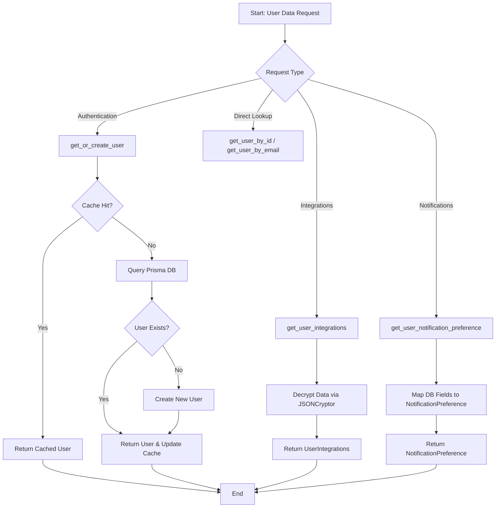
```mermaid
graph TD
    A[Start: User Data Request] --> B{Request Type}
    B -- Authentication --> C[get_or_create_user]
    B -- Direct Lookup --> D[get_user_by_id / get_user_by_email]
    B -- Integrations --> E[get_user_integrations]
    B -- Notifications --> F[get_user_notification_preference]
    C --> G{Cache Hit?}
    G -- Yes --> H[Return Cached User]
    G -- No --> I[Query Prisma DB]
    I --> J{User Exists?}
    J -- Yes --> K[Return User & Update Cache]
    J -- No --> L[Create New User]
    L --> K
    E --> M[Decrypt Data via JSONCryptor]
    M --> N[Return UserIntegrations]
    F --> O[Map DB Fields to NotificationPreference]
    O --> P[Return NotificationPreference]
    H --> Q[End]
    K --> Q
    N --> Q
    P --> Q
```

## 类结构

```
User Service Module (No internal classes defined)
├── Global Variables & Config
│   ├── logger
│   ├── settings
│   └── cache_user_lookup
├── Authentication & Lifecycle Functions
│   ├── get_or_create_user
│   ├── create_default_user
│   └── update_user_timezone
├── User Retrieval Functions (Cached)
│   ├── get_user_by_id
│   ├── get_user_by_email
│   └── get_user_email_by_id
├── User Update Functions
│   └── update_user_email
├── Integrations Management (Encrypted)
│   ├── get_user_integrations
│   ├── update_user_integrations
│   └── migrate_and_encrypt_user_integrations
├── Notification Preferences
│   ├── get_user_notification_preference
│   ├── update_user_notification_preference
│   └── disable_all_user_notifications
├── Activity & Verification
│   ├── get_active_user_ids_in_timerange
│   ├── get_active_users_ids
│   ├── set_user_email_verification
│   └── get_user_email_verification
└── Unsubscription System
    ├── generate_unsubscribe_link
    └── unsubscribe_user_by_token
```

## 全局变量及字段


### `logger`
    
用于记录模块运行时日志信息的标准日志记录器实例。

类型：`logging.Logger`
    


### `settings`
    
封装应用程序配置参数的全局设置实例。

类型：`Settings`
    


### `cache_user_lookup`
    
用于缓存用户查找结果的装饰器，以减少数据库查询并提高响应速度。

类型：`Callable`
    


    

## 全局函数及方法


### `get_or_create_user`

根据提供的用户数据字典（通常来自认证令牌）检索现有用户，如果用户不存在则创建新用户。该函数使用了缓存装饰器以提高性能。

参数：

-   `user_data`：`dict`，包含用户信息的字典，预期包含 'sub'（用户ID）、'email' 和 'user_metadata'（内含 'name'）等字段。

返回值：`User`，表示数据库中用户记录的 User 对象。

#### 流程图

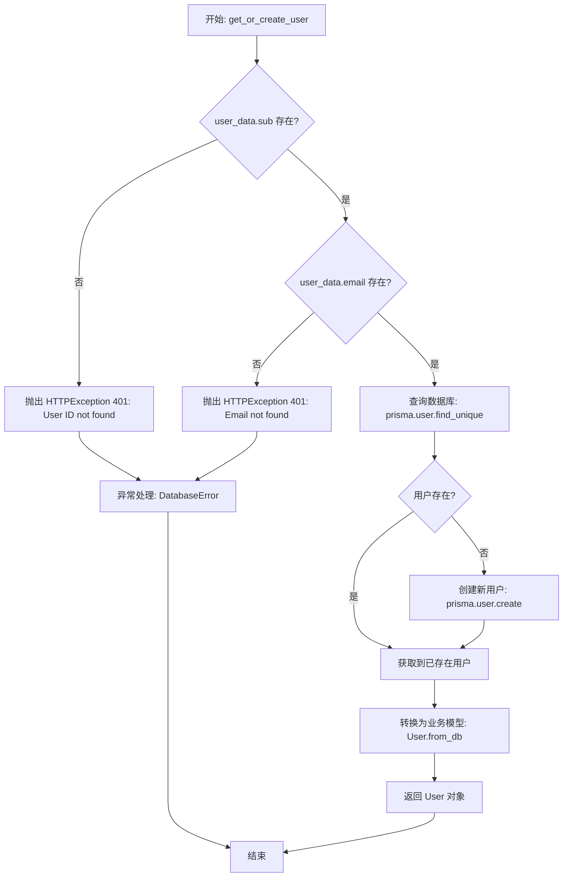
```mermaid
graph TD
    A[开始: get_or_create_user] --> B{user_data.sub 存在?}
    B -- 否 --> C[抛出 HTTPException 401: User ID not found]
    B -- 是 --> D{user_data.email 存在?}
    D -- 否 --> E[抛出 HTTPException 401: Email not found]
    D -- 是 --> F[查询数据库: prisma.user.find_unique]
    F --> G{用户存在?}
    G -- 是 --> H[获取到已存在用户]
    G -- 否 --> I[创建新用户: prisma.user.create]
    I --> H
    H --> J[转换为业务模型: User.from_db]
    J --> K[返回 User 对象]
    C --> L[异常处理: DatabaseError]
    E --> L
    K --> M[结束]
    L --> M
```

#### 带注释源码

```python
@cache_user_lookup
async def get_or_create_user(user_data: dict) -> User:
    try:
        # 尝试从字典中获取用户ID (subject claim)
        user_id = user_data.get("sub")
        if not user_id:
            # 如果ID不存在，抛出401未授权异常
            raise HTTPException(status_code=401, detail="User ID not found in token")

        # 尝试从字典中获取用户邮箱
        user_email = user_data.get("email")
        if not user_email:
            # 如果邮箱不存在，抛出401未授权异常
            raise HTTPException(status_code=401, detail="Email not found in token")

        # 在数据库中查找唯一用户
        user = await prisma.user.find_unique(where={"id": user_id})
        if not user:
            # 如果用户不存在，则创建新用户
            user = await prisma.user.create(
                data=UserCreateInput(
                    id=user_id,
                    email=user_email,
                    # 从元数据中提取用户名，若无则为None
                    name=user_data.get("user_metadata", {}).get("name"),
                )
            )

        # 将数据库模型转换为应用层的User模型并返回
        return User.from_db(user)
    except Exception as e:
        # 捕获处理过程中发生的任何异常，并包装为DatabaseError抛出
        raise DatabaseError(f"Failed to get or create user {user_data}: {e}") from e
```


### `get_user_by_id`

该函数通过用户ID从数据库中检索用户信息，利用缓存装饰器提升查询性能，若未找到用户则抛出异常。

参数：

-   `user_id`：`str`，用户的唯一标识符。

返回值：`User`，表示用户数据的业务模型对象。

#### 流程图

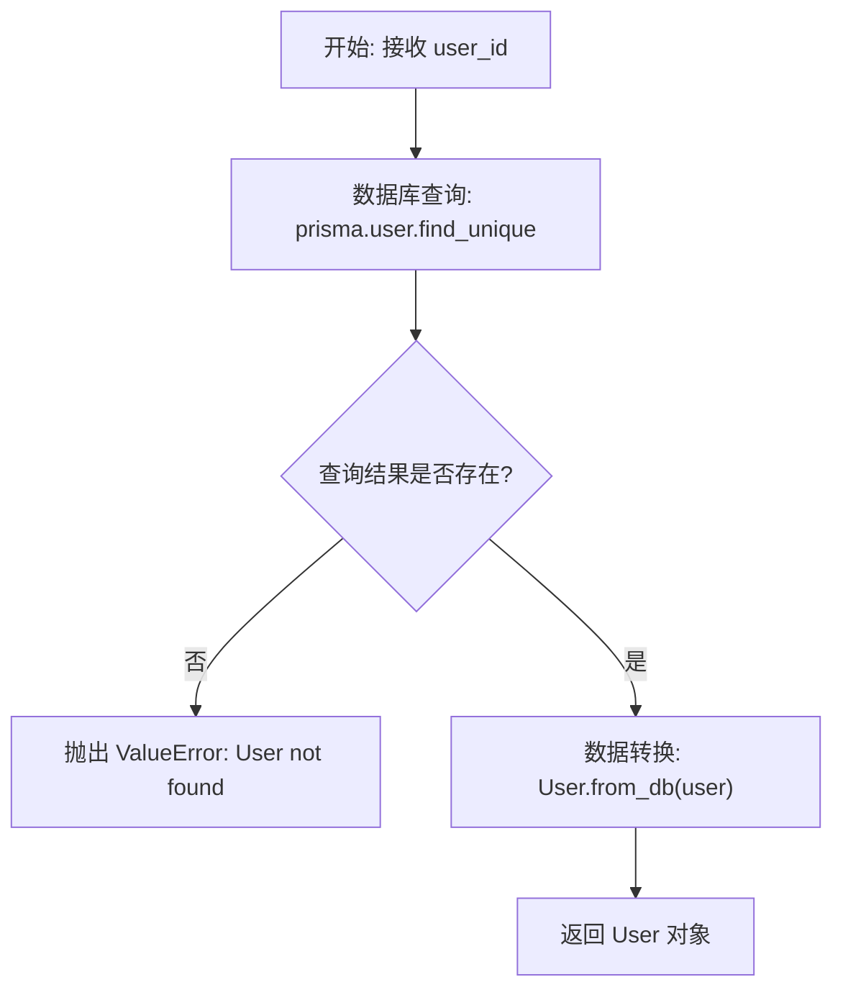
```mermaid
flowchart TD
    A["开始: 接收 user_id"] --> B["数据库查询: prisma.user.find_unique"]
    B --> C{查询结果是否存在?}
    C -- 否 --> D["抛出 ValueError: User not found"]
    C -- 是 --> E["数据转换: User.from_db(user)"]
    E --> F["返回 User 对象"]
```

#### 带注释源码

```python
@cache_user_lookup
async def get_user_by_id(user_id: str) -> User:
    # 调用 Prisma 客户端根据 ID 查找唯一用户记录
    user = await prisma.user.find_unique(where={"id": user_id})
    
    # 检查用户是否存在，如果不存在则抛出 ValueError
    if not user:
        raise ValueError(f"User not found with ID: {user_id}")
    
    # 将数据库模型转换为业务层 User 模型并返回
    return User.from_db(user)
```


### `get_user_email_by_id`

根据用户 ID 从数据库中查询并返回用户的邮箱地址。该函数通过 Prisma 客户端执行数据库查找操作，如果用户不存在则返回 None，并包含对潜在数据库错误的异常捕获和处理。

参数：

- `user_id`：`str`，要查询的用户的唯一标识符。

返回值：`Optional[str]`，如果找到用户记录则返回其邮箱地址字符串；如果未找到用户则返回 `None`。

#### 流程图

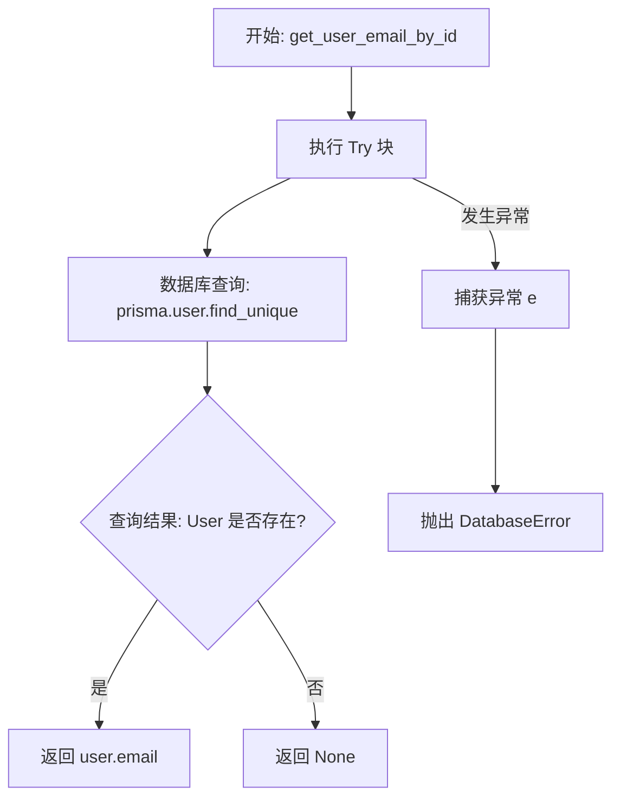
```mermaid
flowchart TD
    A[开始: get_user_email_by_id] --> B[执行 Try 块]
    B --> C[数据库查询: prisma.user.find_unique]
    C --> D{查询结果: User 是否存在?}
    D -- 是 --> E[返回 user.email]
    D -- 否 --> F[返回 None]
    B -- 发生异常 --> G[捕获异常 e]
    G --> H[抛出 DatabaseError]
```

#### 带注释源码

```python
async def get_user_email_by_id(user_id: str) -> Optional[str]:
    try:
        # 使用 Prisma 客户端根据提供的 user_id 查找唯一的用户记录
        user = await prisma.user.find_unique(where={"id": user_id})
        # 如果 user 对象存在，返回 email 属性；否则返回 None
        return user.email if user else None
    except Exception as e:
        # 捕获操作过程中的任何异常，将其包装为 DatabaseError 并抛出，包含上下文信息
        raise DatabaseError(f"Failed to get user email for user {user_id}: {e}") from e
```


### `get_user_by_email`

该函数用于通过电子邮件地址从数据库中查询用户信息。它被装饰器 `@cache_user_lookup` 修饰，意味着查询结果会被缓存以优化性能。如果数据库中存在该邮箱对应的用户，则将其转换为应用层的 `User` 对象返回；如果不存在，则返回 `None`。

参数：

- `email`：`str`，待查询用户的电子邮件地址，用作数据库的唯一查询条件。

返回值：`Optional[User]`，返回查询到的用户对象。如果未找到匹配的用户，则返回 None；如果查询过程发生异常，则抛出 `DatabaseError`。

#### 流程图

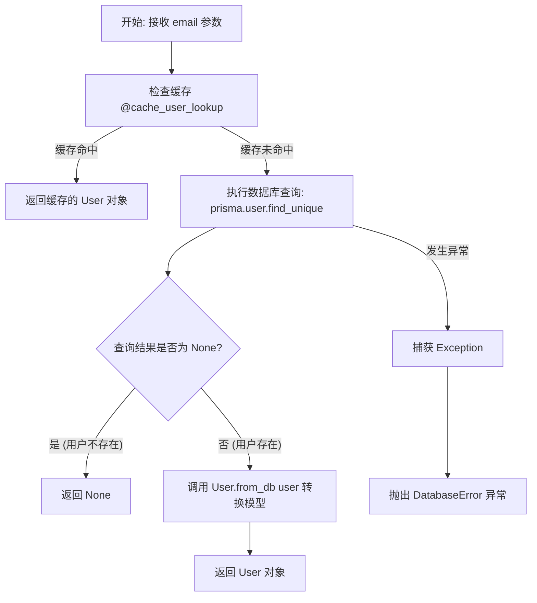
```mermaid
graph TD
    A[开始: 接收 email 参数] --> B[检查缓存 @cache_user_lookup]
    B -- 缓存命中 --> C[返回缓存的 User 对象]
    B -- 缓存未命中 --> D[执行数据库查询: prisma.user.find_unique]
    D --> E{查询结果是否为 None?}
    E -- 是 (用户不存在) --> F[返回 None]
    E -- 否 (用户存在) --> G[调用 User.from_db user 转换模型]
    G --> H[返回 User 对象]
    D -- 发生异常 --> I[捕获 Exception]
    I --> J[抛出 DatabaseError 异常]
```

#### 带注释源码

```python
@cache_user_lookup
async def get_user_by_email(email: str) -> Optional[User]:
    try:
        # 使用 Prisma ORM 通过唯一字段 email 查找用户记录
        user = await prisma.user.find_unique(where={"email": email})
        
        # 如果用户存在，将数据库模型（Prisma User）转换为应用层模型（User）
        # 如果用户不存在，则返回 None
        return User.from_db(user) if user else None
    except Exception as e:
        # 捕获数据库操作中的其他异常，并封装为自定义的 DatabaseError 抛出
        raise DatabaseError(f"Failed to get user by email {email}: {e}") from e
```


### `update_user_email`

该函数用于更新指定用户的电子邮件地址。在更新数据库记录之前，它会先获取旧的电子邮件地址，以便在更新完成后精确地清理相关的用户查询缓存，确保数据的一致性。

参数：

-   `user_id`：`str`，需要更新电子邮件的用户的唯一标识符。
-   `email`：`str`，用户的新电子邮件地址。

返回值：`None`，没有返回值，表示操作完成。

#### 流程图

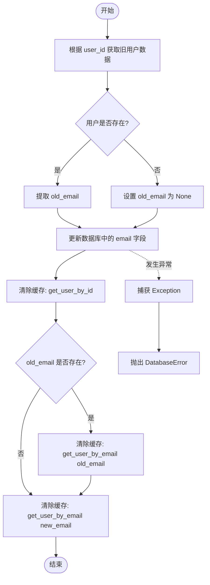
```mermaid
flowchart TD
    Start([开始]) --> FindUser[根据 user_id 获取旧用户数据]
    FindUser --> CheckUser{用户是否存在?}
    CheckUser -- 是 --> GetOldEmail[提取 old_email]
    CheckUser -- 否 --> SetOldNone[设置 old_email 为 None]
    GetOldEmail --> UpdateDB[更新数据库中的 email 字段]
    SetOldNone --> UpdateDB
    UpdateDB --> InvalidateID[清除缓存: get_user_by_id]
    InvalidateID --> CheckOldEmail{old_email 是否存在?}
    CheckOldEmail -- 是 --> InvalidateOld[清除缓存: get_user_by_email old_email]
    CheckOldEmail -- 否 --> InvalidateNew[清除缓存: get_user_by_email new_email]
    InvalidateOld --> InvalidateNew
    InvalidateNew --> End([结束])

    UpdateDB -.->|发生异常| Catch[捕获 Exception]
    Catch --> Raise[抛出 DatabaseError]
```

#### 带注释源码

```python
async def update_user_email(user_id: str, email: str):
    try:
        # 步骤 1: 获取旧的电子邮件以处理缓存失效
        # 需要先查库是因为缓存键可能依赖于旧的 email 值，必须将其清除
        old_user = await prisma.user.find_unique(where={"id": user_id})
        old_email = old_user.email if old_user else None

        # 步骤 2: 在数据库中更新用户的电子邮件
        await prisma.user.update(where={"id": user_id}, data={"email": email})

        # 步骤 3: 选择性地使特定用户条目的缓存无效
        # 清除基于 ID 的缓存
        get_user_by_id.cache_delete(user_id)
        
        # 清除基于旧 Email 的缓存（如果旧 Email 存在）
        if old_email:
            get_user_by_email.cache_delete(old_email)
        
        # 清除基于新 Email 的缓存，防止由于预加载等原因导致的旧数据残留
        get_user_by_email.cache_delete(email)
    except Exception as e:
        # 步骤 4: 捕获异常并转换为自定义数据库错误
        raise DatabaseError(
            f"Failed to update user email for user {user_id}: {e}"
        ) from e
```


### `create_default_user`

该函数用于确保系统中存在一个默认用户。它会首先尝试根据预定义的默认用户ID（DEFAULT_USER_ID）在数据库中查找用户，如果未找到，则使用预设的默认邮箱和名称创建一个新用户，最后返回该用户对象。

参数：

无

返回值：`Optional[User]`，返回找到或创建的默认用户对象。如果在数据库操作过程中发生错误，函数可能会抛出异常（尽管类型注解允许返回None，但在正常逻辑流中通常返回User对象）。

#### 流程图

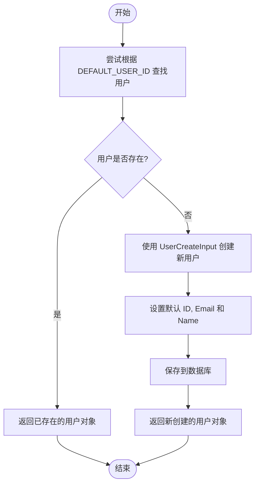
```mermaid
flowchart TD
    A([开始]) --> B[尝试根据 DEFAULT_USER_ID 查找用户]
    B --> C{用户是否存在?}
    C -- 是 --> D[返回已存在的用户对象]
    C -- 否 --> E[使用 UserCreateInput 创建新用户]
    E --> F[设置默认 ID, Email 和 Name]
    F --> G[保存到数据库]
    G --> H[返回新创建的用户对象]
    D --> I([结束])
    H --> I
```

#### 带注释源码

```python
async def create_default_user() -> Optional[User]:
    # 尝试通过唯一标识符 DEFAULT_USER_ID 查找用户
    user = await prisma.user.find_unique(where={"id": DEFAULT_USER_ID})
    
    # 如果查找不到该用户，则执行创建逻辑
    if not user:
        # 使用 prisma 客户端创建一个新的用户记录
        user = await prisma.user.create(
            data=UserCreateInput(
                id=DEFAULT_USER_ID,           # 使用预定义的默认用户ID
                email="default@example.com",   # 设置默认邮箱
                name="Default User",           # 设置默认显示名称
            )
        )
    
    # 将数据库中的 PrismaUser 模型转换为业务层的 User 模型并返回
    return User.from_db(user)
```


### `get_user_integrations`

该函数用于从数据库中检索指定用户的加密集成配置数据，并将其解密为可用的 `UserIntegrations` 对象。如果用户未配置任何集成信息，则返回一个空的集成对象。

参数：

- `user_id`：`str`，待查询用户的唯一标识符。

返回值：`UserIntegrations`，包含用户集成凭据和配置状态的模型对象。

#### 流程图

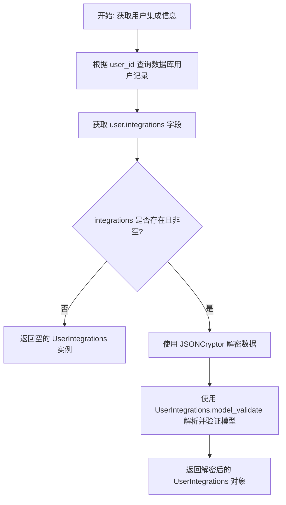
```mermaid
flowchart TD
    A[开始: 获取用户集成信息] --> B[根据 user_id 查询数据库用户记录]
    B --> C[获取 user.integrations 字段]
    C --> D{integrations 是否存在且非空?}
    D -- 否 --> E[返回空的 UserIntegrations 实例]
    D -- 是 --> F[使用 JSONCryptor 解密数据]
    F --> G[使用 UserIntegrations.model_validate 解析并验证模型]
    G --> H[返回解密后的 UserIntegrations 对象]
```

#### 带注释源码

```python
async def get_user_integrations(user_id: str) -> UserIntegrations:
    # 通过 Prisma ORM 查找指定用户，如果找不到则抛出异常
    user = await PrismaUser.prisma().find_unique_or_raise(
        where={"id": user_id},
    )

    # 获取用户记录中存储的加密集成数据
    encrypted_integrations = user.integrations
    
    # 如果该用户没有加密的集成数据，返回一个空的 UserIntegrations 对象
    if not encrypted_integrations:
        return UserIntegrations()
    else:
        # 如果存在加密数据，使用 JSONCryptor 解密
        # 并通过 Pydantic 模型验证数据格式，返回 UserIntegrations 对象
        return UserIntegrations.model_validate(
            JSONCryptor().decrypt(encrypted_integrations)
        )
```


### `update_user_integrations`

该函数用于更新指定用户的第三方集成配置信息。它首先对提供的集成数据进行序列化并加密处理，然后通过数据库操作将加密后的数据持久化存储，最后清除该用户的缓存以确保数据的一致性。

参数：

-  `user_id`：`str`，目标用户的唯一标识符。
-  `data`：`UserIntegrations`，包含用户集成凭证和配置的数据模型对象。

返回值：`None`，表示操作完成，无返回数据。

#### 流程图

```mermaid
flowchart TD
    A[开始: update_user_integrations] --> B[序列化并加密数据<br>JSONCryptor.encrypt]
    B --> C[更新数据库记录<br>PrismaUser.prisma().update]
    C --> D[清除用户缓存<br>get_user_by_id.cache_delete]
    D --> E[结束]
```

#### 带注释源码

```python
async def update_user_integrations(user_id: str, data: UserIntegrations):
    # 将 UserIntegrations 对象序列化为字典，并排除 None 值
    # 使用 JSONCryptor 对数据进行加密，确保敏感信息（如凭证）在数据库中的安全性
    encrypted_data = JSONCryptor().encrypt(data.model_dump(exclude_none=True))
    
    # 调用 Prisma ORM 更新指定 ID 的用户记录
    # 将加密后的数据写入用户的 integrations 字段
    await PrismaUser.prisma().update(
        where={"id": user_id},
        data={"integrations": encrypted_data},
    )
    
    # 清除该用户在缓存中的条目（get_user_by_id）
    # 防止后续读取到旧的集成数据，确保缓存一致性
    get_user_by_id.cache_delete(user_id)
```


### `migrate_and_encrypt_user_integrations`

该函数用于执行数据库迁移任务，将用户的集成凭据（integration credentials）和 OAuth 状态从通用的 `metadata` JSON 字段移动到专用的 `integrations` 列中。在此过程中，它确保数据在存储到新列时被加密，并在迁移成功后从旧元数据中移除敏感信息。

参数：无

返回值：`None`，表示过程执行完毕，不返回任何值。

#### 流程图

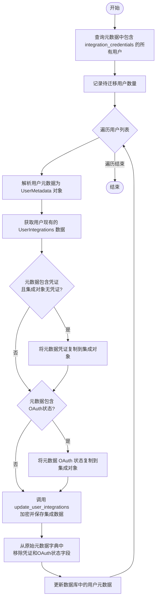
```mermaid
flowchart TD
    Start([开始]) --> FindUsers[查询元数据中包含 integration_credentials 的所有用户]
    FindUsers --> LogCount[记录待迁移用户数量]
    LogCount --> LoopStart{遍历用户列表}
    LoopStart --> ParseMetadata[解析用户元数据为 UserMetadata 对象]
    ParseMetadata --> GetIntegrations[获取用户现有的 UserIntegrations 数据]
    GetIntegrations --> CheckCreds{元数据包含凭证<br/>且集成对象无凭证?}
    CheckCreds -->|是| CopyCreds[将元数据凭证复制到集成对象]
    CheckCreds -->|否| CheckOauth
    CopyCreds --> CheckOauth{元数据包含<br/>OAuth状态?}
    CheckOauth -->|是| CopyOauth[将元数据 OAuth 状态复制到集成对象]
    CheckOauth -->|否| SaveIntegrations
    CopyOauth --> SaveIntegrations[调用 update_user_integrations<br/>加密并保存集成数据]
    SaveIntegrations --> CleanupMetadata[从原始元数据字典中<br/>移除凭证和OAuth状态字段]
    CleanupMetadata --> UpdateUser[更新数据库中的用户元数据]
    UpdateUser --> LoopStart
    LoopStart -->|遍历结束| End([结束])
```

#### 带注释源码

```python
async def migrate_and_encrypt_user_integrations():
    """Migrate integration credentials and OAuth states from metadata to integrations column."""
    # 查询所有在元数据中包含 integration_credentials 键的用户
    # 这里使用了一个特殊的 JsonFilter 来检查 JSON 字段中是否存在特定键
    users = await PrismaUser.prisma().find_many(
        where={
            "metadata": cast(
                JsonFilter,
                {
                    "path": ["integration_credentials"],
                    "not": SafeJson(
                        {"a": "yolo"}
                    ),  # 使用虚假值检查键是否存在
                },
            )
        }
    )
    # 记录需要迁移的用户数量
    logger.info(f"Migrating integration credentials for {len(users)} users")

    # 遍历每一个需要迁移的用户
    for user in users:
        # 获取原始元数据并转换为字典
        raw_metadata = cast(dict, user.metadata)
        # 验证并解析为 UserMetadata 模型
        metadata = UserMetadata.model_validate(raw_metadata)

        # 获取现有的 integrations 数据（如果是空的则返回空对象）
        integrations = await get_user_integrations(user_id=user.id)

        # 将 metadata 中的 integration_credentials 复制到 integrations 对象
        # 仅当 metadata 中有值且 integrations 中尚无值时才复制（防止覆盖已有数据）
        if metadata.integration_credentials and not integrations.credentials:
            integrations.credentials = metadata.integration_credentials
        # 将 metadata 中的 integration_oauth_states 复制到 integrations 对象
        if metadata.integration_oauth_states:
            integrations.oauth_states = metadata.integration_oauth_states

        # 保存到数据库的 integrations 列
        # 该方法内部会对数据进行加密处理
        await update_user_integrations(user_id=user.id, data=integrations)

        # 从原始元数据字典中移除已迁移的敏感字段
        raw_metadata.pop("integration_credentials", None)
        raw_metadata.pop("integration_oauth_states", None)

        # 更新数据库中的 metadata 列，清除已迁移的数据
        await PrismaUser.prisma().update(
            where={"id": user.id},
            data={"metadata": SafeJson(raw_metadata)},
        )
```


### `get_active_user_ids_in_timerange`

该函数用于查询在指定时间范围内有执行记录（AgentGraphExecution）的用户，返回这些活跃用户的ID列表。它通过关联查询用户的执行记录，并根据执行时间的起始和结束范围进行筛选，最终提取符合条件的用户ID。

参数：

- `start_time`：`str`，时间范围的开始时间，ISO 格式字符串。
- `end_time`：`str`，时间范围的结束时间，ISO 格式字符串。

返回值：`list[str]`，在指定时间范围内活跃的用户 ID 列表。

#### 流程图

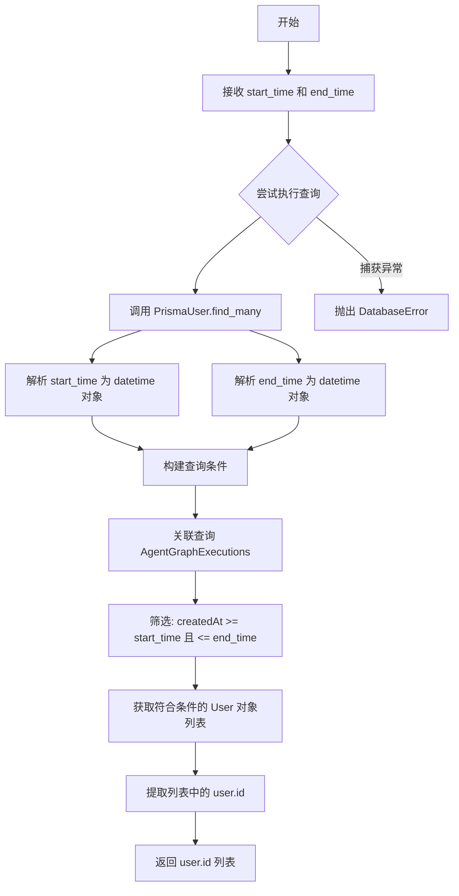
```mermaid
flowchart TD
    A[开始] --> B[接收 start_time 和 end_time]
    B --> C{尝试执行查询}
    C --> D[调用 PrismaUser.find_many]
    D --> E[解析 start_time 为 datetime 对象]
    D --> F[解析 end_time 为 datetime 对象]
    E --> G[构建查询条件]
    F --> G
    G --> H["关联查询 AgentGraphExecutions"]
    H --> I["筛选: createdAt >= start_time 且 <= end_time"]
    I --> J[获取符合条件的 User 对象列表]
    J --> K[提取列表中的 user.id]
    K --> L[返回 user.id 列表]
    C -->|捕获异常| M[抛出 DatabaseError]
```

#### 带注释源码

```python
async def get_active_user_ids_in_timerange(start_time: str, end_time: str) -> list[str]:
    try:
        # 查询数据库中的用户
        users = await PrismaUser.prisma().find_many(
            where={
                # 关联查询用户的 AgentGraphExecutions 表
                "AgentGraphExecutions": {
                    "some": {  # 筛选存在至少一条符合条件的执行记录
                        "createdAt": {
                            # 将字符串转换为 datetime 对象进行比较
                            "gte": datetime.fromisoformat(start_time),  # 大于等于开始时间
                            "lte": datetime.fromisoformat(end_time),    # 小于等于结束时间
                        }
                    }
                }
            },
        )
        # 从查询到的用户对象列表中提取 ID 组成新列表返回
        return [user.id for user in users]

    except Exception as e:
        # 捕获异常并封装为 DatabaseError 抛出
        raise DatabaseError(
            f"Failed to get active user ids in timerange {start_time} to {end_time}: {e}"
        ) from e
```


### `get_active_users_ids`

获取在过去30天内活跃的用户ID列表，即在此期间有过Agent执行记录的用户ID。

参数：

无

返回值：`list[str]`，包含活跃用户ID的列表。

#### 流程图

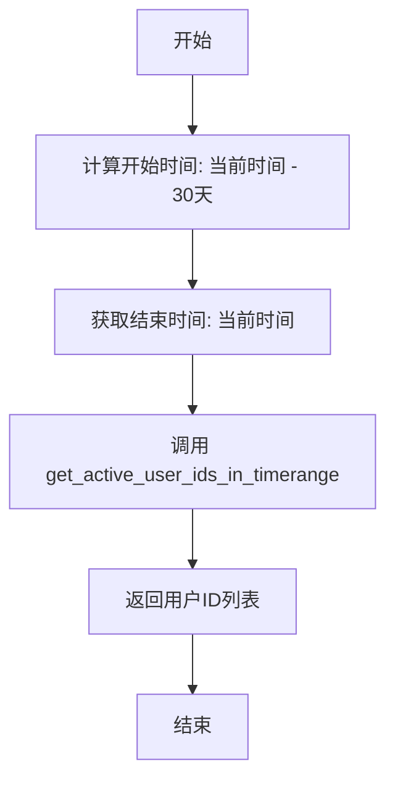
```mermaid
graph TD
    A[开始] --> B[计算开始时间: 当前时间 - 30天]
    B --> C[获取结束时间: 当前时间]
    C --> D[调用 get_active_user_ids_in_timerange]
    D --> E[返回用户ID列表]
    E --> F[结束]
```

#### 带注释源码

```python
async def get_active_users_ids() -> list[str]:
    # 计算开始时间：当前时间减去30天
    start_time = (datetime.now() - timedelta(days=30)).isoformat()
    # 获取结束时间：当前时间
    end_time = datetime.now().isoformat()

    # 调用辅助函数获取该时间范围内的活跃用户ID
    user_ids = await get_active_user_ids_in_timerange(
        start_time,
        end_time,
    )
    # 返回用户ID列表
    return user_ids
```


### `get_user_notification_preference`

该函数的主要功能是根据提供的用户ID从数据库中检索用户信息，并将其通知相关的布尔标志（如代理运行通知、余额警告等）映射到一个结构化的通知首选项字典中，同时处理每日邮件发送限制的默认值，最终返回一个包含用户完整通知配置的 `NotificationPreference` 对象。

参数：

-   `user_id`：`str`，需要查询通知首选项的用户唯一标识符。

返回值：`NotificationPreference`，包含用户ID、邮箱地址、具体通知类型首选项映射、每日邮件发送上限、今日已发送计数（代码中硬编码为0）以及最后重置时间的对象。

#### 流程图

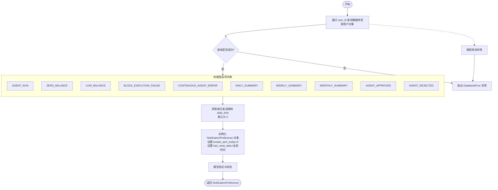
```mermaid
flowchart TD
    A([开始]) --> B[通过 user_id 查询数据库获取用户对象]
    B --> C{查询是否成功?}
    C -- 否 --> D[抛出 DatabaseError 异常]
    C -- 是 --> E[构建 preferences 字典]
    
    subgraph E [构建首选项字典]
        direction TB
        E1[AGENT_RUN]
        E2[ZERO_BALANCE]
        E3[LOW_BALANCE]
        E4[BLOCK_EXECUTION_FAILED]
        E5[CONTINUOUS_AGENT_ERROR]
        E6[DAILY_SUMMARY]
        E7[WEEKLY_SUMMARY]
        E8[MONTHLY_SUMMARY]
        E9[AGENT_APPROVED]
        E10[AGENT_REJECTED]
    end
    
    E --> F[获取每日发送限制 daily_limit<br/>默认为 3]
    F --> G[实例化 NotificationPreference 对象<br/>设置 emails_sent_today=0<br/>设置 last_reset_date=当前时间]
    G --> H[模型验证与校验]
    H --> I([返回 NotificationPreference])

    B -.-> J[捕获其他异常]
    J --> D
```

#### 带注释源码

```python
async def get_user_notification_preference(user_id: str) -> NotificationPreference:
    try:
        # 根据用户ID从数据库查询用户，如果找不到则抛出异常
        user = await PrismaUser.prisma().find_unique_or_raise(
            where={"id": user_id},
        )

        # 如果用户没有通知首选项，则默认启用（虽然注释说这种情况不应该发生，但代码逻辑使用了 or False 作为回退）
        # 将数据库中的布尔字段映射到以 NotificationType 为键的字典中
        preferences: dict[NotificationType, bool] = {
            NotificationType.AGENT_RUN: user.notifyOnAgentRun or False,
            NotificationType.ZERO_BALANCE: user.notifyOnZeroBalance or False,
            NotificationType.LOW_BALANCE: user.notifyOnLowBalance or False,
            NotificationType.BLOCK_EXECUTION_FAILED: user.notifyOnBlockExecutionFailed
            or False,
            NotificationType.CONTINUOUS_AGENT_ERROR: user.notifyOnContinuousAgentError
            or False,
            NotificationType.DAILY_SUMMARY: user.notifyOnDailySummary or False,
            NotificationType.WEEKLY_SUMMARY: user.notifyOnWeeklySummary or False,
            NotificationType.MONTHLY_SUMMARY: user.notifyOnMonthlySummary or False,
            NotificationType.AGENT_APPROVED: user.notifyOnAgentApproved or False,
            NotificationType.AGENT_REJECTED: user.notifyOnAgentRejected or False,
        }
        # 获取每日邮件发送上限，如果数据库中为空，则默认为 3
        daily_limit = user.maxEmailsPerDay or 3
        
        # 构建通知首选项对象
        # 注意：此处将 emails_sent_today 硬编码为 0，last_reset_date 设置为当前时间
        # 这意味着每次调用此方法时，都会重置这些状态值（根据代码中的 TODO 注释，这是临时的实现）
        notification_preference = NotificationPreference(
            user_id=user.id,
            email=user.email,
            preferences=preferences,
            daily_limit=daily_limit,
            # TODO with other changes later, for now we just will email them
            emails_sent_today=0,
            last_reset_date=datetime.now(),
        )
        # 验证模型并返回
        return NotificationPreference.model_validate(notification_preference)

    except Exception as e:
        # 捕获所有异常，将其包装为 DatabaseError 并重新抛出
        raise DatabaseError(
            f"Failed to upsert user notification preference for user {user_id}: {e}"
        ) from e
```


### `update_user_notification_preference`

该函数用于更新指定用户的通知首选项。它接收用户ID和包含新设置的数据传输对象（DTO），根据DTO内容构建更新载荷，通过Prisma ORM执行数据库更新操作，使相关缓存失效，并返回构建好的最新通知首选项对象。

参数：

- `user_id`：`str`，目标用户的唯一标识符。
- `data`：`NotificationPreferenceDTO`，包含更新后的通知设置数据，包括邮箱地址、具体类型的通知开关以及每日发送限制。

返回值：`NotificationPreference`，更新后的用户通知首选项对象，包含最新的设置状态。

#### 流程图


```mermaid
flowchart TD
    Start([开始]) --> InitDict[初始化 update_data 字典]
    InitDict --> CheckEmail{data.email 是否存在?}
    CheckEmail -->|是| AddEmail[添加 email 到 update_data]
    CheckEmail -->|否| CheckAgentRun
    AddEmail --> CheckAgentRun

    CheckAgentRun{AGENT_RUN 在 preferences 中?}
    CheckAgentRun -->|是| AddAgentRun[添加 notifyOnAgentRun 到 update_data]
    CheckAgentRun -->|否| CheckZeroBal
    AddAgentRun --> CheckZeroBal

    CheckZeroBal{ZERO_BALANCE 在 preferences 中?}
    CheckZeroBal -->|是| AddZeroBal[添加 notifyOnZeroBalance 到 update_data]
    CheckZeroBal -->|否| CheckLowBal
    AddZeroBal --> CheckLowBal

    CheckLowBal{LOW_BALANCE 在 preferences 中?}
    CheckLowBal -->|是| AddLowBal[添加 notifyOnLowBalance 到 update_data]
    CheckLowBal -->|否| CheckBlockFail
    AddLowBal --> CheckBlockFail

    CheckBlockFail{BLOCK_EXECUTION_FAILED 在 preferences 中?}
    CheckBlockFail -->|是| AddBlockFail[添加 notifyOnBlockExecutionFailed 到 update_data]
    CheckBlockFail -->|否| CheckContErr
    AddBlockFail --> CheckContErr

    CheckContErr{CONTINUOUS_AGENT_ERROR 在 preferences 中?}
    CheckContErr -->|是| AddContErr[添加 notifyOnContinuousAgentError 到 update_data]
    CheckContErr -->|否| CheckDailySum
    AddContErr --> CheckDailySum

    CheckDailySum{DAILY_SUMMARY 在 preferences 中?}
    CheckDailySum -->|是| AddDailySum[添加 notifyOnDailySummary 到 update_data]
    CheckDailySum -->|否| CheckWeeklySum
    AddDailySum --> CheckWeeklySum

    CheckWeeklySum{WEEKLY_SUMMARY 在 preferences 中?}
    CheckWeeklySum -->|是| AddWeeklySum[添加 notifyOnWeeklySummary 到 update_data]
    CheckWeeklySum -->|否| CheckMonthlySum
    AddWeeklySum --> CheckMonthlySum

    CheckMonthlySum{MONTHLY_SUMMARY 在 preferences 中?}
    CheckMonthlySum -->|是| AddMonthlySum[添加 notifyOnMonthlySummary 到 update_data]
    CheckMonthlySum -->|否| CheckAgentApprove
    AddMonthlySum --> CheckAgentApprove

    CheckAgentApprove{AGENT_APPROVED 在 preferences 中?}
    CheckAgentApprove -->|是| AddAgentApprove[添加 notifyOnAgentApproved 到 update_data]
    CheckAgentApprove -->|否| CheckAgentReject
    AddAgentApprove --> CheckAgentReject

    CheckAgentReject{AGENT_REJECTED 在 preferences 中?}
    CheckAgentReject -->|是| AddAgentReject[添加 notifyOnAgentRejected 到 update_data]
    CheckAgentReject -->|否| CheckLimit
    AddAgentReject --> CheckLimit

    CheckLimit{data.daily_limit 是否存在?}
    CheckLimit -->|是| AddLimit[添加 maxEmailsPerDay 到 update_data]
    CheckLimit -->|否| DBUpdate
    AddLimit --> DBUpdate[执行数据库更新操作]

    DBUpdate --> CheckUser{更新后的 user 是否存在?}
    CheckUser -->|否| ThrowVal[抛出 ValueError 异常]
    CheckUser -->|是| InvalidateCache[删除 get_user_by_id 缓存]
    
    InvalidateCache --> BuildPref[构建 NotificationPreference 对象]
    BuildPref --> ReturnObj[返回 model_validate 后的对象]
    
    ReturnObj --> End([结束])
    
    ThrowVal --> CatchErr[捕获异常]
    CatchErr --> ThrowDBErr[抛出 DatabaseError]
    
    DBUpdate -.-> CatchErr
```

#### 带注释源码

```python
async def update_user_notification_preference(
    user_id: str, data: NotificationPreferenceDTO
) -> NotificationPreference:
    try:
        # 初始化更新数据字典，仅包含需要变更的字段
        update_data: UserUpdateInput = {}
        
        # 如果提供了邮箱，则更新邮箱
        if data.email:
            update_data["email"] = data.email
            
        # 检查并更新各种具体的通知类型开关
        if NotificationType.AGENT_RUN in data.preferences:
            update_data["notifyOnAgentRun"] = data.preferences[
                NotificationType.AGENT_RUN
            ]
        if NotificationType.ZERO_BALANCE in data.preferences:
            update_data["notifyOnZeroBalance"] = data.preferences[
                NotificationType.ZERO_BALANCE
            ]
        if NotificationType.LOW_BALANCE in data.preferences:
            update_data["notifyOnLowBalance"] = data.preferences[
                NotificationType.LOW_BALANCE
            ]
        if NotificationType.BLOCK_EXECUTION_FAILED in data.preferences:
            update_data["notifyOnBlockExecutionFailed"] = data.preferences[
                NotificationType.BLOCK_EXECUTION_FAILED
            ]
        if NotificationType.CONTINUOUS_AGENT_ERROR in data.preferences:
            update_data["notifyOnContinuousAgentError"] = data.preferences[
                NotificationType.CONTINUOUS_AGENT_ERROR
            ]
        if NotificationType.DAILY_SUMMARY in data.preferences:
            update_data["notifyOnDailySummary"] = data.preferences[
                NotificationType.DAILY_SUMMARY
            ]
        if NotificationType.WEEKLY_SUMMARY in data.preferences:
            update_data["notifyOnWeeklySummary"] = data.preferences[
                NotificationType.WEEKLY_SUMMARY
            ]
        if NotificationType.MONTHLY_SUMMARY in data.preferences:
            update_data["notifyOnMonthlySummary"] = data.preferences[
                NotificationType.MONTHLY_SUMMARY
            ]
        if NotificationType.AGENT_APPROVED in data.preferences:
            update_data["notifyOnAgentApproved"] = data.preferences[
                NotificationType.AGENT_APPROVED
            ]
        if NotificationType.AGENT_REJECTED in data.preferences:
            update_data["notifyOnAgentRejected"] = data.preferences[
                NotificationType.AGENT_REJECTED
            ]
            
        # 如果提供了每日邮件限制，则更新限制
        if data.daily_limit:
            update_data["maxEmailsPerDay"] = data.daily_limit

        # 执行数据库更新操作
        user = await PrismaUser.prisma().update(
            where={"id": user_id},
            data=update_data,
        )
        # 校验用户是否存在（理论上update操作若未找到记录会报错或返回null，取决于配置）
        if not user:
            raise ValueError(f"User not found with ID: {user_id}")

        # 由于通知首选项是用户数据的一部分，需要使该用户的缓存失效
        get_user_by_id.cache_delete(user_id)

        # 从更新后的数据库记录中构建返回的首选项对象
        # 注意：这里默认值设置为 True，与 get 函数中的 False 不同
        preferences: dict[NotificationType, bool] = {
            NotificationType.AGENT_RUN: user.notifyOnAgentRun or True,
            NotificationType.ZERO_BALANCE: user.notifyOnZeroBalance or True,
            NotificationType.LOW_BALANCE: user.notifyOnLowBalance or True,
            NotificationType.BLOCK_EXECUTION_FAILED: user.notifyOnBlockExecutionFailed
            or True,
            NotificationType.CONTINUOUS_AGENT_ERROR: user.notifyOnContinuousAgentError
            or True,
            NotificationType.DAILY_SUMMARY: user.notifyOnDailySummary or True,
            NotificationType.WEEKLY_SUMMARY: user.notifyOnWeeklySummary or True,
            NotificationType.MONTHLY_SUMMARY: user.notifyOnMonthlySummary or True,
            NotificationType.AGENT_APPROVED: user.notifyOnAgentApproved or True,
            NotificationType.AGENT_REJECTED: user.notifyOnAgentRejected or True,
        }
        notification_preference = NotificationPreference(
            user_id=user.id,
            email=user.email,
            preferences=preferences,
            daily_limit=user.maxEmailsPerDay or 3,
            # TODO 注释暗示后续会修改，目前硬编码为 0
            emails_sent_today=0,
            last_reset_date=datetime.now(),
        )
        return NotificationPreference.model_validate(notification_preference)

    except Exception as e:
        # 捕获异常并转换为自定义的 DatabaseError
        raise DatabaseError(
            f"Failed to update user notification preference for user {user_id}: {e}"
        ) from e
```


### `set_user_email_verification`

用于设置指定用户的邮箱验证状态。该函数通过数据库 ORM 更新用户的 `emailVerified` 字段，并在操作成功后清除相关的用户缓存以确保数据一致性。

参数：

- `user_id`：`str`，需要更新验证状态的用户唯一标识符。
- `verified`：`bool`，用户邮箱的验证状态（True 表示已验证，False 表示未验证）。

返回值：`None`，无返回值。

#### 流程图

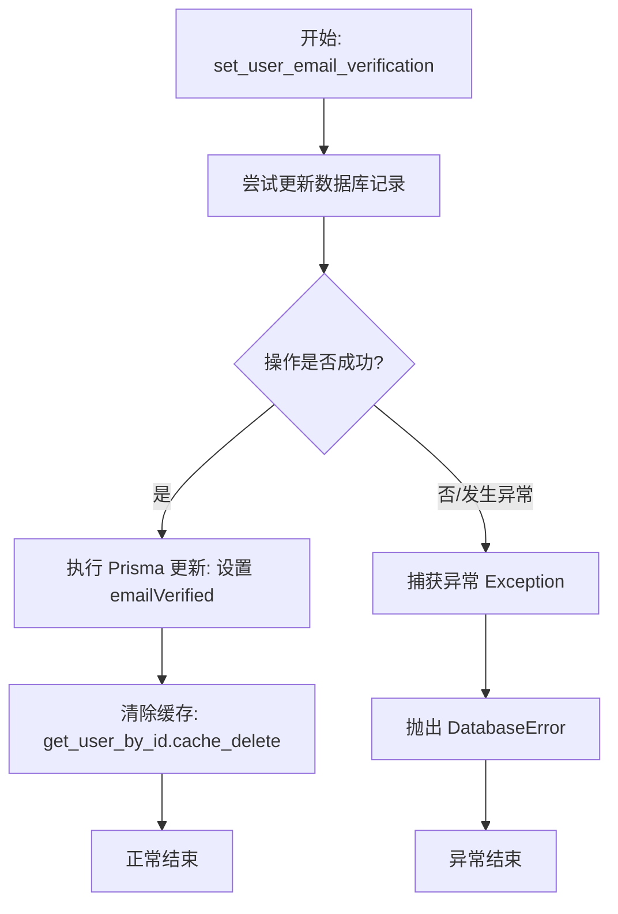
```mermaid
flowchart TD
    A[开始: set_user_email_verification] --> B[尝试更新数据库记录]
    B --> C{操作是否成功?}
    C -- 是 --> D[执行 Prisma 更新: 设置 emailVerified]
    D --> E[清除缓存: get_user_by_id.cache_delete]
    E --> F[正常结束]
    C -- 否/发生异常 --> G[捕获异常 Exception]
    G --> H[抛出 DatabaseError]
    H --> I[异常结束]
```

#### 带注释源码

```python
async def set_user_email_verification(user_id: str, verified: bool) -> None:
    """Set the email verification status for a user."""
    try:
        # 使用 Prisma ORM 更新数据库中指定用户的 emailVerified 字段
        await PrismaUser.prisma().update(
            where={"id": user_id},       # 定位条件：用户ID
            data={"emailVerified": verified}, # 更新内容：验证状态
        )
        # 清除该用户的缓存，确保下次读取时获取最新数据
        get_user_by_id.cache_delete(user_id)
    except Exception as e:
        # 捕获异常并封装为自定义的 DatabaseError 抛出
        raise DatabaseError(
            f"Failed to set email verification status for user {user_id}: {e}"
        ) from e
```


### `disable_all_user_notifications`

禁用用户的所有通知偏好设置。当用户的电子邮件被退回或处于非活跃状态时使用，以防止发送任何未来的通知。

参数：

- `user_id`：`str`，要禁用通知的用户的唯一标识符。

返回值：`None`，不返回任何内容，执行数据库更新和缓存失效操作。

#### 流程图

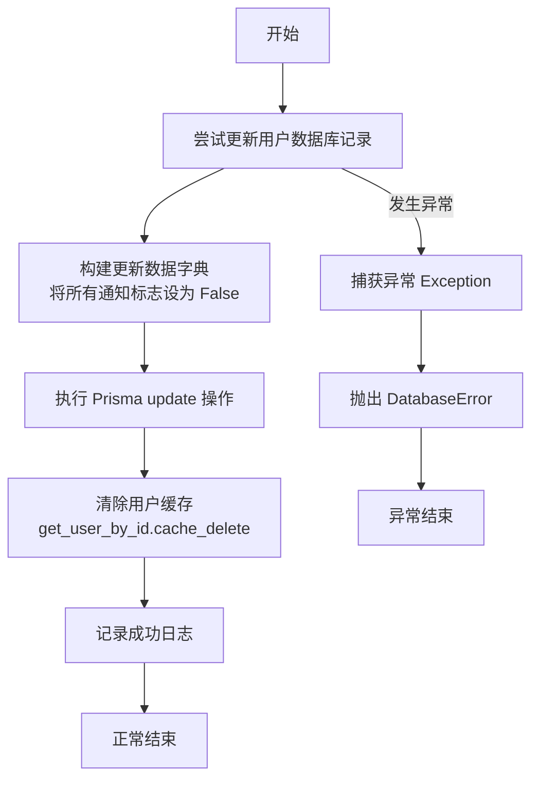
```mermaid
flowchart TD
    A[开始] --> B[尝试更新用户数据库记录]
    B --> C[构建更新数据字典<br/>将所有通知标志设为 False]
    C --> D[执行 Prisma update 操作]
    D --> E[清除用户缓存<br/>get_user_by_id.cache_delete]
    E --> F[记录成功日志]
    F --> G[正常结束]
    
    B -- 发生异常 --> H[捕获异常 Exception]
    H --> I[抛出 DatabaseError]
    I --> J[异常结束]
```

#### 带注释源码

```python
async def disable_all_user_notifications(user_id: str) -> None:
    """Disable all notification preferences for a user.

    Used when user's email bounces/is inactive to prevent any future notifications.
    """
    try:
        # 调用 Prisma ORM 更新用户数据，将所有通知相关字段设置为 False
        await PrismaUser.prisma().update(
            where={"id": user_id},
            data={
                "notifyOnAgentRun": False,
                "notifyOnZeroBalance": False,
                "notifyOnLowBalance": False,
                "notifyOnBlockExecutionFailed": False,
                "notifyOnContinuousAgentError": False,
                "notifyOnDailySummary": False,
                "notifyOnWeeklySummary": False,
                "notifyOnMonthlySummary": False,
                "notifyOnAgentApproved": False,
                "notifyOnAgentRejected": False,
            },
        )
        # 清除该用户在缓存中的数据，确保后续读取获取最新状态
        get_user_by_id.cache_delete(user_id)
        # 记录操作成功的日志信息
        logger.info(f"Disabled all notification preferences for user {user_id}")
    except Exception as e:
        # 捕获异常并抛出数据库错误，包含原始异常信息
        raise DatabaseError(
            f"Failed to disable notifications for user {user_id}: {e}"
        ) from e
```


### `get_user_email_verification`

获取指定用户的邮箱验证状态。

参数：

- `user_id`：`str`，需要查询的用户的唯一标识符。

返回值：`bool`，如果用户的邮箱已验证返回 `True`，否则返回 `False`。

#### 流程图

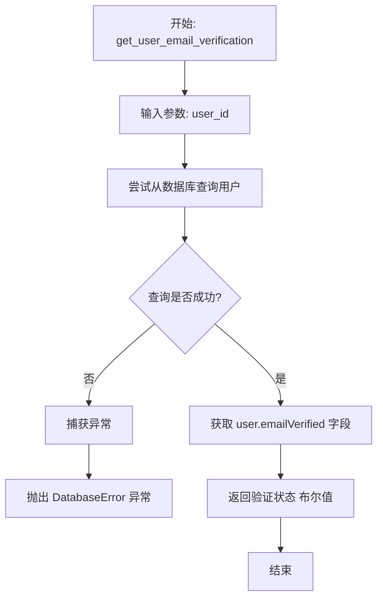
```mermaid
flowchart TD
    A[开始: get_user_email_verification] --> B[输入参数: user_id]
    B --> C[尝试从数据库查询用户]
    C --> D{查询是否成功?}
    D -- 否 --> E[捕获异常]
    E --> F[抛出 DatabaseError 异常]
    D -- 是 --> G[获取 user.emailVerified 字段]
    G --> H[返回验证状态 布尔值]
    H --> I[结束]
```

#### 带注释源码

```python
async def get_user_email_verification(user_id: str) -> bool:
    """Get the email verification status for a user."""
    try:
        # 使用 Prisma 客户端根据 user_id 查找用户
        # find_unique_or_raise 会在找不到记录时抛出异常
        user = await PrismaUser.prisma().find_unique_or_raise(
            where={"id": user_id},
        )
        # 返回用户的邮箱验证状态
        return user.emailVerified
    except Exception as e:
        # 捕获任何异常（如数据库连接错误或记录不存在）
        # 并将其包装为自定义的 DatabaseError 抛出
        raise DatabaseError(
            f"Failed to get email verification status for user {user_id}: {e}"
        ) from e
```


### `generate_unsubscribe_link`

生成一个用于一次性退订所有类型通知的安全链接。该链接包含一个令牌，该令牌将用户 ID 与使用 HMAC-SHA256 生成的签名结合在一起，以验证请求的有效性。

参数：

-   `user_id`：`str`，需要为其生成退订链接的用户的唯一标识符。

返回值：`str`，包含已编码令牌的完整退订 URL。

#### 流程图

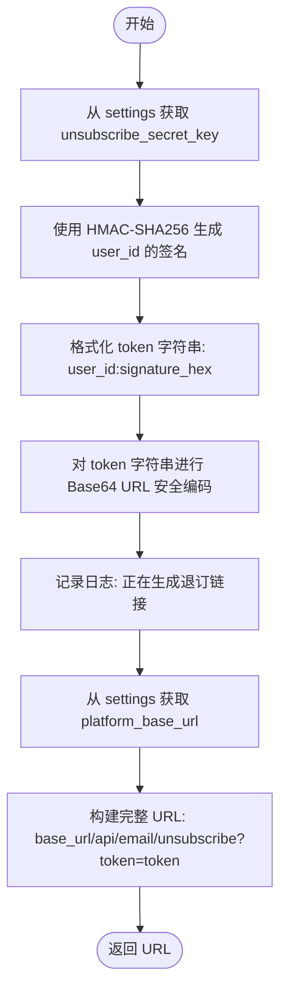
```mermaid
flowchart TD
    Start([开始]) --> GetSecret[从 settings 获取 unsubscribe_secret_key]
    GetSecret --> GenerateSig[使用 HMAC-SHA256 生成 user_id 的签名]
    GenerateSig --> FormatToken[格式化 token 字符串: user_id:signature_hex]
    FormatToken --> EncodeToken[对 token 字符串进行 Base64 URL 安全编码]
    EncodeToken --> LogInfo[记录日志: 正在生成退订链接]
    LogInfo --> GetBaseUrl[从 settings 获取 platform_base_url]
    GetBaseUrl --> BuildUrl[构建完整 URL: base_url/api/email/unsubscribe?token=token]
    BuildUrl --> End([返回 URL])
```

#### 带注释源码

```python
def generate_unsubscribe_link(user_id: str) -> str:
    """Generate a link to unsubscribe from all notifications"""
    # Create an HMAC using a secret key
    # 从配置中获取用于生成签名的密钥
    secret_key = settings.secrets.unsubscribe_secret_key
    # 使用 HMAC-SHA256 算法基于用户 ID 生成签名
    signature = hmac.new(
        secret_key.encode("utf-8"), user_id.encode("utf-8"), hashlib.sha256
    ).digest()

    # Create a token that combines the user_id and signature
    # 将用户 ID 和签名的十六进制字符串组合，并进行 Base64 URL 安全编码
    token = base64.urlsafe_b64encode(
        f"{user_id}:{signature.hex()}".encode("utf-8")
    ).decode("utf-8")
    # 记录生成退订链接的操作日志
    logger.info(f"Generating unsubscribe link for user {user_id}")

    # 获取平台基础 URL
    base_url = settings.config.platform_base_url
    # 构建并返回包含 Token 的完整退订链接
    return f"{base_url}/api/email/unsubscribe?token={quote_plus(token)}"
```


### `unsubscribe_user_by_token`

通过验证包含用户ID和签名的令牌，将指定用户的所有通知偏好设置为关闭（取消订阅），并将每日邮件限制设置为零。

参数：

-  `token`：`str`，包含用户ID和HMAC签名的Base64编码令牌，用于验证请求的合法性。

返回值：`None`，表示操作已完成，无返回数据。

#### 流程图

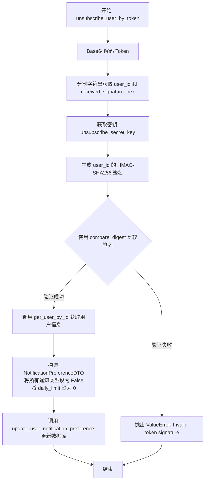
```mermaid
flowchart TD
    A[开始: unsubscribe_user_by_token] --> B[Base64解码 Token]
    B --> C[分割字符串获取 user_id 和 received_signature_hex]
    C --> D[获取密钥 unsubscribe_secret_key]
    D --> E[生成 user_id 的 HMAC-SHA256 签名]
    E --> F{使用 compare_digest 比较签名}
    F -- 验证失败 --> G[抛出 ValueError: Invalid token signature]
    F -- 验证成功 --> H[调用 get_user_by_id 获取用户信息]
    H --> I[构造 NotificationPreferenceDTO<br>将所有通知类型设为 False<br>将 daily_limit 设为 0]
    I --> J[调用 update_user_notification_preference 更新数据库]
    J --> K[结束]
    G --> K
```

#### 带注释源码

```python
async def unsubscribe_user_by_token(token: str) -> None:
    """Unsubscribe a user from all notifications using the token"""
    try:
        # Decode the token
        # 将Base64编码的令牌解码为字符串
        decoded = base64.urlsafe_b64decode(token).decode("utf-8")
        # 按冒号分割，提取用户ID和接收到的签名的十六进制字符串
        user_id, received_signature_hex = decoded.split(":", 1)

        # Verify the signature
        # 获取用于验证签名的密钥
        secret_key = settings.secrets.unsubscribe_secret_key
        # 使用用户ID和密钥重新计算期望的HMAC签名
        expected_signature = hmac.new(
            secret_key.encode("utf-8"), user_id.encode("utf-8"), hashlib.sha256
        ).digest()

        # 安全地比较计算出的签名与令牌中的签名，防止时序攻击
        if not hmac.compare_digest(expected_signature.hex(), received_signature_hex):
            raise ValueError("Invalid token signature")

        # 根据用户ID获取用户对象
        user = await get_user_by_id(user_id)
        
        # 更新用户的通知偏好，将所有类型关闭，并将每日邮件限制设为0
        await update_user_notification_preference(
            user.id,
            NotificationPreferenceDTO(
                email=user.email,
                daily_limit=0,
                preferences={
                    NotificationType.AGENT_RUN: False,
                    NotificationType.ZERO_BALANCE: False,
                    NotificationType.LOW_BALANCE: False,
                    NotificationType.BLOCK_EXECUTION_FAILED: False,
                    NotificationType.CONTINUOUS_AGENT_ERROR: False,
                    NotificationType.DAILY_SUMMARY: False,
                    NotificationType.WEEKLY_SUMMARY: False,
                    NotificationType.MONTHLY_SUMMARY: False,
                },
            ),
        )
    except Exception as e:
        # 捕获异常并作为数据库错误抛出，包含令牌信息以便排查
        raise DatabaseError(f"Failed to unsubscribe user by token {token}: {e}") from e
```


### `update_user_timezone`

更新指定用户的时区设置，并在更新成功后清除相关缓存以确保数据一致性。

参数：

- `user_id`：`str`，需要更新时区的用户的唯一标识符。
- `timezone`：`str`，要为用户设置的新时区字符串（例如 "Asia/Shanghai"）。

返回值：`User`，更新后的用户领域模型对象。

#### 流程图

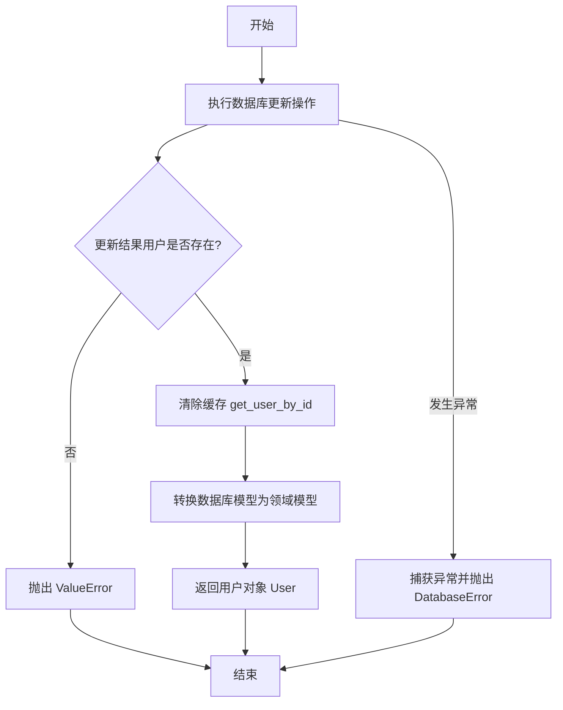
```mermaid
graph TD
    A[开始] --> B[执行数据库更新操作]
    B --> C{更新结果用户是否存在?}
    C -- 否 --> D[抛出 ValueError]
    D --> I[结束]
    C -- 是 --> E[清除缓存 get_user_by_id]
    E --> F[转换数据库模型为领域模型]
    F --> G[返回用户对象 User]
    G --> I
    B -- 发生异常 --> H[捕获异常并抛出 DatabaseError]
    H --> I
```

#### 带注释源码

```python
async def update_user_timezone(user_id: str, timezone: str) -> User:
    """Update a user's timezone setting."""
    try:
        # 调用 Prisma ORM 更新用户数据，根据 user_id 查找并设置新的 timezone
        user = await PrismaUser.prisma().update(
            where={"id": user_id},
            data={"timezone": timezone},
        )
        # 检查返回的用户对象是否存在，如果不存在则抛出值错误
        if not user:
            raise ValueError(f"User not found with ID: {user_id}")

        # 清除该用户的查询缓存，确保后续读取的数据是最新的
        get_user_by_id.cache_delete(user_id)

        # 将数据库中的原始模型转换为应用程序定义的 User 模型并返回
        return User.from_db(user)
    except Exception as e:
        # 捕获处理过程中可能出现的任何异常，并将其包装为自定义的 DatabaseError 抛出
        raise DatabaseError(f"Failed to update timezone for user {user_id}: {e}") from e
```


## 关键组件


### 用户数据访问与缓存层

封装用户实体的创建、查询、更新及邮件验证等核心数据操作，利用 Prisma ORM 与数据库交互，并通过自定义的缓存装饰器实现高频用户查询的缓存加速与失效管理。

### 加密集成服务

处理用户第三方服务集成凭据的安全存储，通过 `JSONCryptor` 对敏感数据进行加密存储与解密读取，同时提供数据迁移逻辑，将旧版元数据中的集成凭证安全转移至专用的加密列。

### 通知与订阅管理

管理用户的多维度通知偏好设置（如余额告警、代理执行状态等），提供基于 HMAC 签名 Token 的安全退订链接生成与验证机制，并支持批量禁用用户通知功能。

### 用户活跃度分析器

基于代理执行记录的时间戳，通过关联查询识别在特定时间范围内有活跃操作的用户列表，用于系统运营数据的分析与统计。


## 问题及建议


### 已知问题

-   **通知偏好默认值逻辑不一致**：`get_user_notification_preference` 函数中未设置的偏好默认为 `False`，而在 `update_user_notification_preference` 函数构造返回对象时，未设置的偏好默认为 `True`（如 `user.notifyOnAgentRun or True`）。这种不一致会导致客户端在更新操作后获取到的状态与数据库实际存储的默认意图不符。
-   **缓存键设计不可靠**：`get_or_create_user` 函数使用 `@cache_user_lookup` 装饰器，以 `user_data`（字典对象）作为缓存键。由于字典内容（如 `user_metadata`）可能变化，这会导致缓存命中率低，或者不同内容但相同 ID 的用户产生多个缓存条目，建议仅使用 `user_id` 作为缓存键。
-   **邮件限流状态未持久化**：`NotificationPreference` 模型包含 `emails_sent_today` 和 `last_reset_date` 字段用于记录每日发送数量，但在 `get_user_notification_preference` 和 `update_user_notification_preference` 中，这两个字段并未从数据库读取或保存，而是每次都初始化为 `0` 和当前时间，导致每日邮件限制功能失效。
-   **数据迁移缺乏事务保护**：`migrate_and_encrypt_user_integrations` 函数分别更新 `integrations` 列表和 `metadata` 列表。如果更新 `metadata` 失败，`integrations` 已经被迁移，导致数据状态不一致，且没有回滚机制。
-   **查询性能低下**：`get_active_user_ids_in_timerange` 函数通过 `find_many` 查询完整的 `User` 对象，随后仅提取 `id`。这造成了不必要的网络传输和内存消耗，应使用 `select` 仅查询 `id` 字段。
-   **魔法值脆弱性**：`migrate_and_encrypt_user_integrations` 中使用 `SafeJson({"a": "yolo"})` 作为查询条件来检查 JSON 字段中是否存在键。这种做法依赖于不存在的“假值”，若数据中恰好包含该结构，会导致查询逻辑失效，且代码可读性差。

### 优化建议

-   **批量处理提升迁移性能**：在 `migrate_and_encrypt_user_integrations` 中，遍历用户处理迁移的过程是串行的。建议使用 `asyncio.gather` 并行处理多个用户的数据迁移，以大幅减少脚本执行时间。
-   **减少重复代码**：`update_user_notification_preference` 中包含大量重复的 `if` 语句来判断并映射通知类型。建议通过遍历 `NotificationType` 枚举或使用字典映射来简化代码，提高可维护性。
-   **优化异常处理粒度**：当前代码广泛使用 `try...except Exception` 并统一抛出 `DatabaseError`，这掩盖了具体的错误类型（如唯一约束冲突、连接超时等）。建议针对数据库操作特有的错误（如 `prisma.errors`）进行捕获，或保留原始堆栈信息以便调试。
-   **改进缓存失效策略**：目前的缓存失效策略依赖于在更新函数中手动调用 `cache_delete`。这种方式容易遗漏（例如在 `disable_all_user_notifications` 中调用了，但在其他可能间接修改用户状态的场景可能未调用）。建议引入缓存版本控制或监听数据库变更事件来自动失效缓存。
-   **分离逻辑与数据传输对象 (DTO)**：`NotificationPreference` 既包含了数据库持久化的字段（如 `notifyOnAgentRun`），又包含了运行时状态字段（如 `emails_sent_today`）。建议将二者分离，避免混淆运行时状态和持久化状态的处理逻辑。


## 其它


### 设计目标与约束

**设计目标：**

1.  **数据安全性**：确保用户敏感数据（如集成凭证、OAuth状态）在存储时经过加密处理，防止数据库直接泄露导致敏感信息暴露。
2.  **性能优化**：通过引入缓存机制（`cached`装饰器）减少数据库查询频率，特别是针对高频访问的用户信息查询。
3.  **可维护性与扩展性**：使用 Prisma ORM 进行数据库操作，实现类型安全的数据库访问；将业务逻辑与数据模型分离，便于后续扩展和维护。
4.  **数据一致性**：在用户信息更新（如邮箱修改、集成信息更新）时，同步清理相关缓存，确保应用层与数据库层数据的一致性。

**约束条件：**

1.  **依赖限制**：必须依赖 `Prisma` 作为数据库客户端，依赖 `Settings` 单例获取配置，依赖 `JSONCryptor` 进行数据加解密。
2.  **数据模型约束**：数据库写入必须遵循 `UserCreateInput` 和 `UserUpdateInput` 的结构定义；读取数据必须转换为 Pydantic 模型（如 `User`, `UserIntegrations`）。
3.  **缓存约束**：缓存设置了默认的 `maxsize=1000` 和 `ttl_seconds=300`，适用于短时间内重复读取的场景，但不适合强一致性要求的实时数据。
4.  **并发控制**：当前设计主要依赖于异步 I/O，但在高并发更新同一用户数据时，虽然使用了 ORM，但未显式使用数据库锁或乐观并发控制，需依赖数据库底层的隔离级别。

### 错误处理与异常设计

**错误处理策略：**

1.  **统一异常封装**：所有的数据库操作错误（`Exception`）都被捕获，并统一封装为 `DatabaseError` 抛出，保留原始异常信息以供排查。
2.  **输入验证**：在 `get_or_create_user` 中，对 Token 解析后的 `user_id` 和 `email` 进行存在性检查，若缺失直接抛出 HTTP 401 异常。
3.  **资源不存在处理**：在 `get_user_by_id` 中，若用户未找到，抛出 `ValueError`（由上层决定是否转为 HTTP 404）；而在 `get_user_email_by_id` 中则返回 `None`，体现了不同的业务容错策略。

**异常传播与日志：**

1.  **日志记录**：所有关键操作（如数据迁移、退订链接生成、批量禁用通知）均有 `logger` 记录，错误发生时会记录详细的上下文（如 `user_id`, `email` 等）。
2.  **异常链保留**：使用 `raise ... from e` 保留原始异常堆栈，便于追踪根本原因。
3.  **特定业务异常**：在退订流程中，若签名验证失败，抛出 `ValueError("Invalid token signature")`，防止恶意请求。

### 数据流与关键逻辑

**1. 用户获取与缓存流程：**
*   **请求**：调用 `get_user_by_id(user_id)`。
*   **缓存检查**：装饰器 `cache_user_lookup` 检查缓存中是否存在该键。
*   **命中**：直接返回缓存的 `User` 对象。
*   **未命中**：
    *   执行 `prisma.user.find_unique` 查询数据库。
    *   若未找到，抛出异常；若找到，调用 `User.from_db(user)` 将数据库模型转换为业务模型。
    *   结果存入缓存（TTL 300秒）。
*   **返回**：返回 `User` 对象。

**2. 用户集成数据加密存储流程：**
*   **写入**：
    *   接收 `UserIntegrations` 对象。
    *   调用 `data.model_dump(exclude_none=True)` 序列化数据。
    *   使用 `JSONCryptor().encrypt()` 对 JSON 字符串进行加密。
    *   将密文写入数据库的 `integrations` 字段。
    *   调用 `get_user_by_id.cache_delete(user_id)` 清除缓存。
*   **读取**：
    *   从数据库读取加密的 `integrations` 字段。
    *   使用 `JSONCryptor().decrypt()` 解密。
    *   使用 `UserIntegrations.model_validate()` 解析为 Pydantic 模型返回。

**3. 安全退订流程：**
*   **生成链接**：
    *   获取 `user_id` 和密钥 `unsubscribe_secret_key`。
    *   使用 HMAC-SHA256 算法生成签名。
    *   将 `user_id` 和 `signature` 拼接并进行 Base64 编码生成 `token`。
    *   拼接完整 URL 返回。
*   **执行退订**：
    *   解码 Base64 `token` 获取 `user_id` 和 `signature`。
    *   使用相同算法和密钥重新计算预期签名。
    *   使用 `hmac.compare_digest` 防止时序攻击，比对签名。
    *   若验证通过，调用 `update_user_notification_preference` 将所有通知类型设为 `False`。

### 外部依赖与接口契约

**1. 数据库依赖 (Prisma ORM):**
*   **接口**：`prisma.user`, `PrismaUser.prisma()`。
*   **契约**：
    *   `find_unique`: 根据主键或唯一索引查询，返回 `User` 模型或 `None`。
    *   `create`: 接收 `UserCreateInput`，返回新创建的 `User` 模型。
    *   `update`: 接收 `where` 条件和 `UserUpdateInput` 数据，返回更新后的 `User` 模型。
    *   `find_many`: 接收复杂的过滤条件（如 JsonFilter），返回列表。

**2. 加密服务 (`backend.util.encryption.JSONCryptor`):**
*   **接口**：
    *   `encrypt(plaintext: str) -> str`: 接收明文字符串，返回密文字符串。
    *   `decrypt(ciphertext: str) -> str`: 接收密文字符串，返回明文字符串。
*   **契约**：加解密过程必须对称，且必须正确处理 JSON 格式。

**3. 缓存服务 (`backend.util.cache`):**
*   **接口**：`@cached(maxsize, ttl_seconds)`。
*   **契约**：装饰的异步函数返回值必须可哈希或支持序列化，提供 `cache_delete` 方法用于手动失效。

**4. 配置服务 (`backend.util.settings.Settings`):**
*   **接口**：`settings.secrets.unsubscribe_secret_key`, `settings.config.platform_base_url`。
*   **契约**：必须确保 `unsubscribe_secret_key` 在应用生命周期内保持不变，否则已生成的退订链接将失效。

### 缓存策略与一致性

**缓存策略：**
*   **模式**：采用 **Cache-Aside (Lazy Loading)** 模式。
*   **作用域**：主要应用于用户基础信息查询（`get_user_by_id`, `get_user_by_email`, `get_or_create_user`）。
*   **配置**：最大缓存数量 1000，生存时间（TTL）300 秒。

**一致性保证：**
*   **失效时机**：当执行 `update_user_email`, `update_user_integrations`, `set_user_email_verification`, `update_user_notification_preference` 等写操作时，立即调用 `get_user_by_id.cache_delete(user_id)` 清除特定用户的缓存。
*   **粒度**：缓存失效精确到 `user_id` 级别。
*   **潜在问题**：虽然写操作会主动失效，但在分布式环境下（如果部署多实例），本地的缓存装饰器（未使用 Redis 等外部缓存）会导致实例间的缓存不一致。当前代码假设是单实例或缓存无需跨实例共享（或者使用了进程共享的缓存机制，但代码层面看是内存缓存）。如果 `backend.util.cache` 是基于 Redis 的，则不存在此问题；如果是基于内存的（如 `functools.lru_cache`），则存在分布式不一致的风险。注：代码使用了 `from backend.util.cache import cached`，若该模块未实现分布式缓存，这是一个架构隐患。

### 安全性与加密设计

**1. 敏感数据存储安全：**
*   **机制**：使用 `JSONCryptor` 对 `UserIntegrations` 包含的第三方 API 凭证和 OAuth 状态进行字段级加密。
*   **目的**：即使数据库文件被泄露，攻击者也无法直接获取明文的 API Key 或 Token。

**2. 令牌签名与验证：**
*   **机制**：退订链接使用 HMAC (Hash-based Message Authentication Code) 结合 SHA256 算法。
*   **防篡改**：通过在 URL 中嵌入签名，确保攻击者无法伪造 `user_id` 生成有效的退订链接，或者无法在不持有密钥的情况下修改链接中的参数。
*   **防时序攻击**：使用 `hmac.compare_digest` 比较签名，避免通过响应时间差异推断签名正确性。

**3. 配置与密钥管理：**
*   所有敏感密钥（如退订密钥）均通过 `Settings` 从环境变量或配置中心加载，不硬编码在代码中。

    