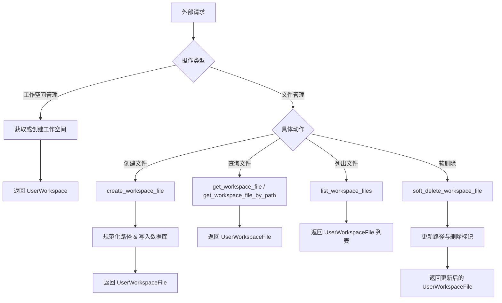
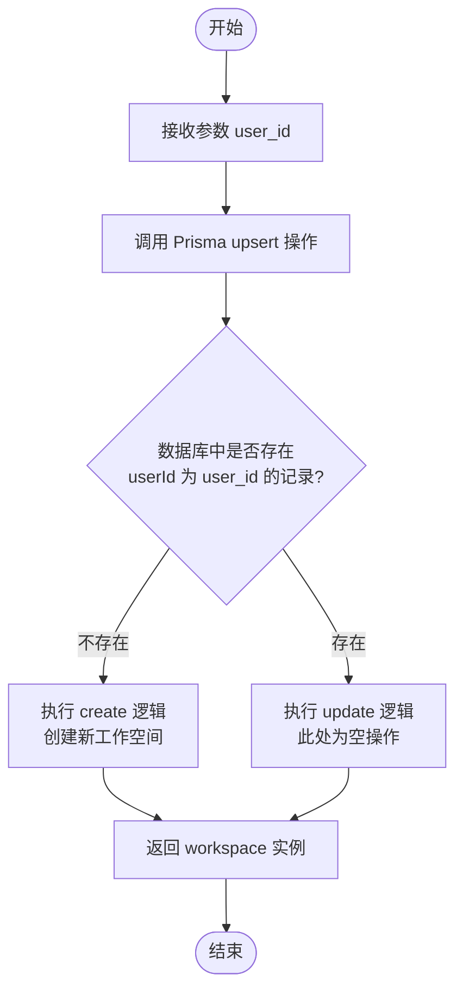
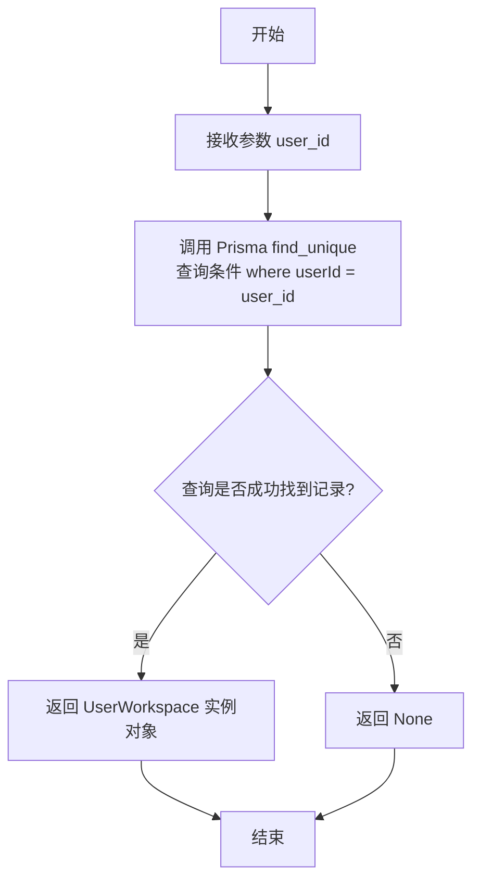
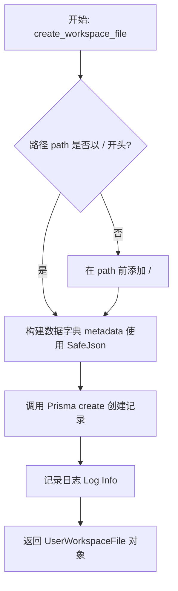
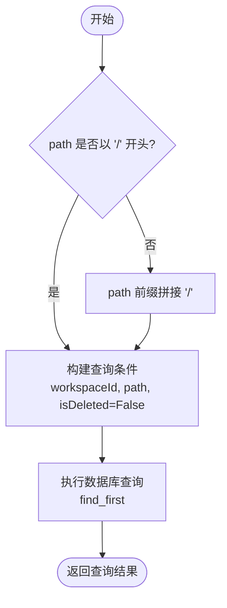
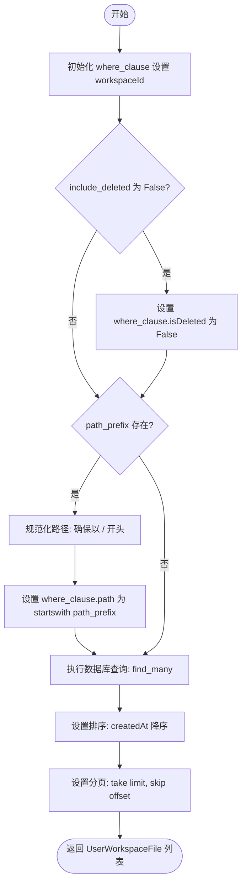
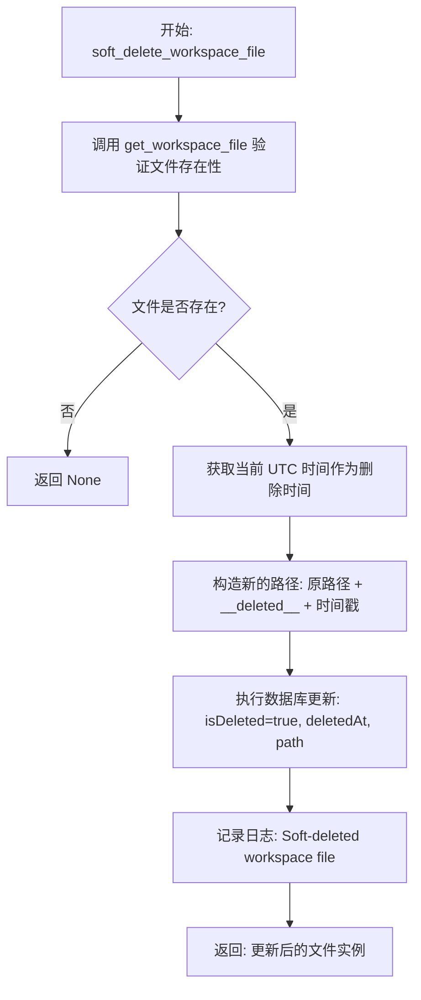
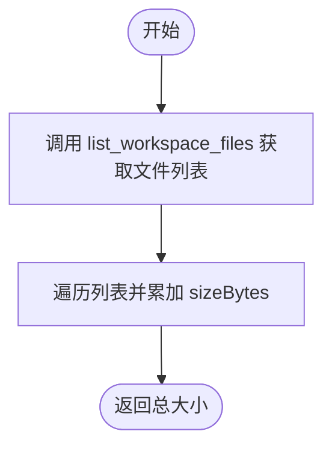

# `.\AutoGPT\autogpt_platform\backend\backend\data\workspace.py` 详细设计文档

该模块提供了一系列异步函数，用于管理用户工作空间的获取与创建，以及工作空间内文件的创建、查询、列表、软删除和存储容量统计等数据库CRUD操作。

## 整体流程



## 类结构

```
Data Models (Prisma ORM)
├── UserWorkspace
└── UserWorkspaceFile
```

## 全局变量及字段


### `logger`
    
模块级别的日志记录器，用于记录用户工作空间相关的操作（如文件创建、删除）和信息。

类型：`logging.Logger`
    


    

## 全局函数及方法


### `get_or_create_workspace`

获取用户的工作空间，如果不存在则创建一个。使用 upsert 操作来处理多个并发请求尝试为同一用户创建工作空间时的竞态条件。

参数：

-  `user_id`：`str`，用户的 ID

返回值：`UserWorkspace`，UserWorkspace 实例

#### 流程图



#### 带注释源码

```python
async def get_or_create_workspace(user_id: str) -> UserWorkspace:
    """
    Get user's workspace, creating one if it doesn't exist.

    Uses upsert to handle race conditions when multiple concurrent requests
    attempt to create a workspace for the same user.

    Args:
        user_id: The user's ID

    Returns:
        UserWorkspace instance
    """
    # 使用 upsert（更新或插入）操作确保数据的一致性
    # where: 查询条件，基于 userId
    # data.create: 如果记录不存在，则创建的数据内容
    # data.update: 如果记录已存在，则执行更新操作（此处为空字典，表示不进行任何更新）
    workspace = await UserWorkspace.prisma().upsert(
        where={"userId": user_id},
        data={
            "create": {"userId": user_id},
            "update": {},  # No updates needed if exists
        },
    )

    return workspace
```


### `get_workspace`

Get user's workspace if it exists.

参数：

-  `user_id`：`str`，The user's ID

返回值：`Optional[UserWorkspace]`，UserWorkspace instance or None

#### 流程图



#### 带注释源码

```python
async def get_workspace(user_id: str) -> Optional[UserWorkspace]:
    """
    Get user's workspace if it exists.

    Args:
        user_id: The user's ID

    Returns:
        UserWorkspace instance or None
    """
    # 使用 Prisma 客户端根据 userId 查找唯一的工作区记录
    # 如果找不到匹配的记录，find_unique 方法将返回 None
    return await UserWorkspace.prisma().find_unique(where={"userId": user_id})
```


### `create_workspace_file`

创建一个新的用户工作区文件记录，包括规范化文件路径并在数据库中持久化文件元数据。

参数：

- `workspace_id`：`str`，工作区 ID
- `file_id`：`str`，文件 ID（与存储路径中使用的 ID 一致）
- `name`：`str`，用户可见的文件名
- `path`：`str`，虚拟路径（例如，"/documents/report.pdf"）
- `storage_path`：`str`，实际存储路径（GCS 或本地）
- `mime_type`：`str`，文件的 MIME 类型
- `size_bytes`：`int`，文件大小（字节）
- `checksum`：`Optional[str]`，可选的 SHA256 校验和
- `metadata`：`Optional[dict]`，可选的附加元数据

返回值：`UserWorkspaceFile`，已创建的 UserWorkspaceFile 实例

#### 流程图



#### 带注释源码

```python
async def create_workspace_file(
    workspace_id: str,
    file_id: str,
    name: str,
    path: str,
    storage_path: str,
    mime_type: str,
    size_bytes: int,
    checksum: Optional[str] = None,
    metadata: Optional[dict] = None,
) -> UserWorkspaceFile:
    """
    Create a new workspace file record.

    Args:
        workspace_id: The workspace ID
        file_id: The file ID (same as used in storage path for consistency)
        name: User-visible filename
        path: Virtual path (e.g., "/documents/report.pdf")
        storage_path: Actual storage path (GCS or local)
        mime_type: MIME type of the file
        size_bytes: File size in bytes
        checksum: Optional SHA256 checksum
        metadata: Optional additional metadata

    Returns:
        Created UserWorkspaceFile instance
    """
    # 标准化路径，确保以 / 开头
    if not path.startswith("/"):
        path = f"/{path}"

    # 使用 Prisma 客户端在数据库中创建文件记录
    # metadata 字段通过 SafeJson 处理以确保数据安全
    file = await UserWorkspaceFile.prisma().create(
        data={
            "id": file_id,
            "workspaceId": workspace_id,
            "name": name,
            "path": path,
            "storagePath": storage_path,
            "mimeType": mime_type,
            "sizeBytes": size_bytes,
            "checksum": checksum,
            "metadata": SafeJson(metadata or {}),
        }
    )

    # 记录创建成功的日志信息
    logger.info(
        f"Created workspace file {file.id} at path {path} "
        f"in workspace {workspace_id}"
    )
    return file
```


### `get_workspace_file`

通过ID获取工作区文件，支持可选的工作区ID验证，并自动过滤已删除的文件记录。

参数：

- `file_id`：`str`，要查询的文件的唯一标识符
- `workspace_id`：`Optional[str]`，用于验证文件所属工作区的可选ID

返回值：`Optional[UserWorkspaceFile]`，如果找到匹配的文件则返回 `UserWorkspaceFile` 实例，否则返回 `None`

#### 流程图

```mermaid
graph TD
    A[开始] --> B[初始化查询条件 where_clause]
    B --> C[设置 id 为 file_id]
    C --> D[设置 isDeleted 为 False]
    D --> E{workspace_id 是否存在?}
    E -- 是 --> F[将 workspaceId 添加到 where_clause]
    E -- 否 --> G[跳过]
    F --> H[调用 UserWorkspaceFile.prisma().find_first]
    G --> H
    H --> I[返回查询结果]
    I --> J[结束]
```

#### 带注释源码

```python
async def get_workspace_file(
    file_id: str,
    workspace_id: Optional[str] = None,
) -> Optional[UserWorkspaceFile]:
    """
    Get a workspace file by ID.

    Args:
        file_id: The file ID
        workspace_id: Optional workspace ID for validation

    Returns:
        UserWorkspaceFile instance or None
    """
    # 构建基础查询条件：匹配文件ID且未被软删除
    where_clause: dict = {"id": file_id, "isDeleted": False}
    
    # 如果提供了 workspace_id，将其加入查询条件以验证文件所有权
    if workspace_id:
        where_clause["workspaceId"] = workspace_id

    # 执行数据库查询，返回第一个匹配项或None
    return await UserWorkspaceFile.prisma().find_first(where=where_clause)
```


### `get_workspace_file_by_path`

通过虚拟路径获取工作区文件记录。该函数会对路径进行标准化处理，并确保仅查询未被软删除的文件。

参数：

- `workspace_id`：`str`，工作区的 ID
- `path`：`str`，文件的虚拟路径

返回值：`Optional[UserWorkspaceFile]`，查找到的 UserWorkspaceFile 实例，如果未找到则返回 None

#### 流程图



#### 带注释源码

```python
async def get_workspace_file_by_path(
    workspace_id: str,
    path: str,
) -> Optional[UserWorkspaceFile]:
    """
    Get a workspace file by its virtual path.

    Args:
        workspace_id: The workspace ID
        path: Virtual path

    Returns:
        UserWorkspaceFile instance or None
    """
    # 标准化路径：确保路径以 '/' 开头，以保持查询的一致性
    if not path.startswith("/"):
        path = f"/{path}"

    # 使用 Prisma 客户端查询数据库
    # 查找满足以下条件的第一个文件：
    # 1. 属于指定的工作区 (workspaceId)
    # 2. 路径匹配 (path)
    # 3. 未被软删除 (isDeleted 为 False)
    return await UserWorkspaceFile.prisma().find_first(
        where={
            "workspaceId": workspace_id,
            "path": path,
            "isDeleted": False,
        }
    )
```


### `list_workspace_files`

List files in a workspace.

参数：

- `workspace_id`：`str`，The workspace ID
- `path_prefix`：`Optional[str]`，Optional path prefix to filter (e.g., "/documents/")
- `include_deleted`：`bool`，Whether to include soft-deleted files
- `limit`：`Optional[int]`，Maximum number of files to return
- `offset`：`int`，Number of files to skip

返回值：`list[UserWorkspaceFile]`，List of UserWorkspaceFile instances

#### 流程图



#### 带注释源码

```python
async def list_workspace_files(
    workspace_id: str,
    path_prefix: Optional[str] = None,
    include_deleted: bool = False,
    limit: Optional[int] = None,
    offset: int = 0,
) -> list[UserWorkspaceFile]:
    """
    List files in a workspace.

    Args:
        workspace_id: The workspace ID
        path_prefix: Optional path prefix to filter (e.g., "/documents/")
        include_deleted: Whether to include soft-deleted files
        limit: Maximum number of files to return
        offset: Number of files to skip

    Returns:
        List of UserWorkspaceFile instances
    """
    # 构建基础查询条件：工作区ID
    where_clause: UserWorkspaceFileWhereInput = {"workspaceId": workspace_id}

    # 如果未要求包含已删除文件，则过滤掉软删除的记录
    if not include_deleted:
        where_clause["isDeleted"] = False

    # 如果指定了路径前缀，则添加路径过滤条件
    if path_prefix:
        # 规范化前缀：确保以 / 开头，保持路径一致性
        if not path_prefix.startswith("/"):
            path_prefix = f"/{path_prefix}"
        # 使用 startswith 进行前缀匹配
        where_clause["path"] = {"startswith": path_prefix}

    # 执行数据库查询，应用过滤、排序和分页
    return await UserWorkspaceFile.prisma().find_many(
        where=where_clause,
        order={"createdAt": "desc"}, # 按创建时间倒序排列
        take=limit,                  # 限制返回数量
        skip=offset,                 # 跳过指定数量
    )
```


### `count_workspace_files`

统计工作区中的文件数量，支持按路径前缀过滤及是否包含已删除文件。

参数：

- `workspace_id`：`str`，工作区 ID
- `path_prefix`：`Optional[str]`，可选的路径前缀过滤条件 (例如 "/sessions/abc123/")
- `include_deleted`：`bool`，是否包含软删除的文件

返回值：`int`，符合条件的文件数量

#### 流程图

```mermaid
flowchart TD
    Start([开始]) --> InitWhere[初始化 where_clause 字典]
    InitWhere --> CheckDeleted{include_deleted 是否为 False?}
    CheckDeleted -- 是 (不包含已删除) --> AddDeletedFilter[设置 isDeleted 为 False]
    AddDeletedFilter --> CheckPrefix
    CheckDeleted -- 否 (包含已删除) --> CheckPrefix{是否存在 path_prefix?}
    
    CheckPrefix -- 是 --> NormalizePrefix[规范化路径前缀 (确保以 / 开头)]
    NormalizePrefix --> AddPrefixFilter[设置 path startswith 过滤条件]
    AddPrefixFilter --> ExecCount
    CheckPrefix -- 否 --> ExecCount[执行数据库 count 查询]
    
    ExecCount --> ReturnResult([返回文件数量])
```

#### 带注释源码

```python
async def count_workspace_files(
    workspace_id: str,
    path_prefix: Optional[str] = None,
    include_deleted: bool = False,
) -> int:
    """
    Count files in a workspace.

    Args:
        workspace_id: The workspace ID
        path_prefix: Optional path prefix to filter (e.g., "/sessions/abc123/")
        include_deleted: Whether to include soft-deleted files

    Returns:
        Number of files
    """
    # 构建基础查询条件，限定在指定的工作区内
    where_clause: dict = {"workspaceId": workspace_id}
    
    # 如果不包含已删除文件，则添加 isDeleted 为 False 的过滤条件
    if not include_deleted:
        where_clause["isDeleted"] = False

    # 如果提供了路径前缀，则添加路径前缀匹配条件
    if path_prefix:
        # 规范化路径前缀，确保以 "/" 开头
        if not path_prefix.startswith("/"):
            path_prefix = f"/{path_prefix}"
        # 设置 Prisma 查询中的 startswith 过滤器
        where_clause["path"] = {"startswith": path_prefix}

    # 调用 Prisma 客户端执行 count 查询，返回满足条件的记录数
    return await UserWorkspaceFile.prisma().count(where=where_clause)
```


### `soft_delete_workspace_file`

软删除工作区文件记录。该函数通过将文件标记为已删除、记录删除时间戳，并修改文件路径以释放原始路径供新文件使用（同时保留记录以便恢复），来实现文件的逻辑删除。

参数：

- `file_id`：`str`，要删除的文件 ID
- `workspace_id`：`Optional[str]`，用于验证的可选工作区 ID

返回值：`Optional[UserWorkspaceFile]`，如果文件存在则返回更新后的 UserWorkspaceFile 实例，如果未找到则返回 None

#### 流程图



#### 带注释源码

```python
async def soft_delete_workspace_file(
    file_id: str,
    workspace_id: Optional[str] = None,
) -> Optional[UserWorkspaceFile]:
    """
    Soft-delete a workspace file.

    The path is modified to include a deletion timestamp to free up the original
    path for new files while preserving the record for potential recovery.

    Args:
        file_id: The file ID
        workspace_id: Optional workspace ID for validation

    Returns:
        Updated UserWorkspaceFile instance or None if not found
    """
    # 第一步：验证文件是否存在并属于指定的工作区（如果提供了 workspace_id）
    file = await get_workspace_file(file_id, workspace_id)
    if file is None:
        return None

    # 第二步：记录当前的删除时间（UTC时间）
    deleted_at = datetime.now(timezone.utc)
    
    # 第三步：修改文件路径
    # 目的是在保留旧记录的同时，释放原路径的唯一约束，允许新文件使用原路径
    # 格式为: {原始路径}__deleted__{时间戳}
    deleted_path = f"{file.path}__deleted__{int(deleted_at.timestamp())}"

    # 第四步：执行数据库更新操作
    updated = await UserWorkspaceFile.prisma().update(
        where={"id": file_id},
        data={
            "isDeleted": True,          # 标记为已删除
            "deletedAt": deleted_at,    # 设置删除时间
            "path": deleted_path,       # 更新路径
        },
    )

    # 第五步：记录操作日志
    logger.info(f"Soft-deleted workspace file {file_id}")
    return updated
```


### `get_workspace_total_size`

获取指定工作空间内所有文件的总大小。

参数：

- `workspace_id`：`str`，工作空间的唯一标识符

返回值：`int`，该工作空间内所有文件的总大小（以字节为单位）

#### 流程图



#### 带注释源码

```python
async def get_workspace_total_size(workspace_id: str) -> int:
    """
    Get the total size of all files in a workspace.

    Args:
        workspace_id: The workspace ID

    Returns:
        Total size in bytes
    """
    # 获取指定工作空间下的所有文件列表（默认不包含已删除文件）
    files = await list_workspace_files(workspace_id)
    # 遍历文件列表，累加每个文件的 sizeBytes 字段，返回总和
    return sum(file.sizeBytes for file in files)
```


## 关键组件


### 用户工作区管理
负责获取或创建用户工作区，使用 Prisma 的 upsert 机制处理并发请求下的竞态条件，确保数据一致性。

### 工作区文件生命周期管理
管理文件的创建、查询及软删除，包括元数据处理、校验和记录，并在软删除时通过修改路径释放原路径占用。

### 文件查询与过滤机制
提供基于工作区 ID、路径前缀、删除状态的文件列表查询与计数功能，支持分页、排序及按路径前缀过滤。

### 路径规范化处理
确保文件虚拟路径统一以 `/` 开头，并在软删除时将路径重命名（追加时间戳）以避免唯一索引冲突，支持同名文件重建。

### 存储统计与聚合
计算指定工作区内所有文件的总大小（字节），用于监控用户存储空间使用情况或实施配额限制。


## 问题及建议


### 已知问题

-   **性能瓶颈：计算工作区总大小逻辑低效**。`get_workspace_total_size` 函数调用了 `list_workspace_files` 获取所有文件的完整对象数据，然后在内存中进行累加计算。当工作区包含大量文件或文件体积较大时，这会导致严重的内存消耗和数据库负载。
-   **代码冗余：路径标准化逻辑重复**。在 `create_workspace_file`、`get_workspace_file_by_path` 和 `list_workspace_files` 等多个函数中，都存在检查路径是否以 `/` 开头并自动补全的逻辑，这违反了 DRY（Don't Repeat Yourself）原则。
-   **潜在的数据库更新风险**。`soft_delete_workspace_file` 函数通过字符串拼接在原路径后添加时间戳（`__deleted__{timestamp}`）来标记删除。如果原始路径接近数据库字段的长度限制，这种追加操作会导致更新失败。
-   **并发与冗余查询**。`soft_delete_workspace_file` 函数先执行 `get_workspace_file` 进行读取查询，然后再执行 `update` 更新查询。这不仅增加了 RTT（往返时间），而且在高并发下存在竞态条件（虽然 `where` 条件基于 ID 降低了影响），且 `workspace_id` 的校验可以在 `update` 语句的 `where` 子句中原子性地完成。
-   **缺少默认分页限制**。`list_workspace_files` 函数允许 `limit` 参数为 `None`，这意味着调用者可能会一次性获取工作区内的所有文件，在没有明确限制的大型数据集中可能导致服务过载。

### 优化建议

-   **使用数据库聚合优化总大小计算**。建议修改 `get_workspace_total_size`，使用 Prisma 的聚合函数（如 `_sum`）直接在数据库层面计算 `sizeBytes` 的总和，避免将所有文件数据加载到内存中。
-   **提取路径标准化工具函数**。创建一个私有的辅助函数（如 `_normalize_path`）来统一处理路径前缀斜杠的逻辑，并在所有涉及路径操作的地方复用该函数。
-   **优化软删除逻辑为原子操作**。在 `soft_delete_workspace_file` 中移除前置的 `get_workspace_file` 查询，直接执行 `update` 操作。将 `workspace_id` 的校验逻辑合并到 `update` 的 `where` 条件中，实现“读取-修改-写入”的单次数据库往返，提升并发安全性和性能。
-   **增加分页默认限制**。在 `list_workspace_files` 中为 `limit` 参数设置一个合理的默认上限（如 100 或 500），或者在函数内部强制执行最大限制，以防止意外的大数据量查询。
-   **改进软删除的路径标记方式**。考虑使用单独的数据库字段（如 `originalPath`）来保存原始路径，而不是修改 `path` 字段本身，或者确保数据库字段长度足够容纳追加的时间戳字符串，以避免运行时错误。


## 其它


### 设计目标与约束

**设计目标**：
1.  **数据一致性与完整性**：确保用户工作区的创建是幂等的，通过 `upsert` 机制处理并发创建请求，防止重复数据。确保文件路径在数据库中的唯一性，即使在软删除后也能通过路径重命名释放原路径。
2.  **软删除机制**：实现数据的安全删除策略，通过标记 `isDeleted` 和修改路径而非物理删除，保留数据恢复和审计的可能性。
3.  **接口规范化**：对文件路径进行强制规范化（统一以 `/` 开头），确保查询和存储的一致性，避免因路径格式差异导致的数据访问错误。

**约束条件**：
1.  **异步 I/O**：所有数据库操作必须基于 `async/await` 模式，以适应高并发非阻塞的运行环境。
2.  **依赖 ORM**：核心逻辑强依赖 Prisma ORM 的行为，数据库 Schema 的变更（如字段名、关联关系）会直接影响模块功能。
3.  **无状态服务**：该模块仅作为数据访问层（DAL），不维护内存状态，所有状态持久化于数据库。

### 错误处理与异常设计

1.  **"静默"失败机制**：对于查询类操作（如 `get_workspace`, `get_workspace_file`），当资源不存在时，设计为返回 `None` 而非抛出异常，由上层业务逻辑决定处理方式（如抛出 404 错误或执行默认逻辑）。
2.  **异常传播**：对于数据库写入操作（如 `create`, `update`），依赖 Prisma 客户端抛出的原生数据库异常（如 `UniqueViolationError`）。这些异常通常由全局异常捕获器统一处理，本模块不做吞噬。
3.  **日志记录**：在关键操作（如创建文件、删除文件）中集成 `logging` 模块，记录 `INFO` 级别的操作日志，便于追踪数据变更轨迹和排查问题。
4.  **防御性编程**：在处理路径输入时，自动补全缺失的前导 `/`，防止因格式错误导致的查询失败。

### 数据流与状态机

**工作区 文件生命周期状态机**：
*   **初始态**：文件不存在。
*   **创建态**：调用 `create_workspace_file`，元数据写入数据库，`isDeleted=False`，路径规范化。
*   **活跃态**：文件可被 `get_workspace_file` 或 `list_workspace_files` 检索。
*   **软删除态**：调用 `soft_delete_workspace_file`。
    *   `isDeleted` 变更为 `True`。
    *   `deletedAt` 记录当前时间戳。
    *   `path` 变更为 `{original_path}__deleted__{timestamp}`，以释放原路径的唯一约束。
    *   文件不再被默认查询检索（除非显式指定 `include_deleted=True`）。

**数据流向**：
*   **输入**：客户端请求 -> Controller -> Service Layer -> **本模块**。
*   **处理**：参数验证/规范化 -> 构建 Prisma 查询/数据对象 -> 执行数据库交互。
*   **输出**：数据库记录 -> ORM 模型实例 (`UserWorkspace`, `UserWorkspaceFile`) -> 返回上层。

### 外部依赖与接口契约

1.  **Prisma ORM (Database Client)**
    *   **依赖**：`prisma.models.UserWorkspace`, `prisma.models.UserWorkspaceFile`, `prisma.types.UserWorkspaceFileWhereInput`。
    *   **契约**：假设数据库 Schema 中 `UserWorkspace` 表存在唯一索引 `userId`；`UserWorkspaceFile` 表存在 `workspaceId`, `id`, `path` 字段，且支持 `isDeleted` 软删除标记。
2.  **Backend Utility (`backend.util.json.SafeJson`)**
    *   **依赖**：`SafeJson` 类。
    *   **契约**：用于序列化文件元数据 (`metadata` 字段)。该工具需确保 Python 对象（包含 datetime 等特殊类型）能被安全地转换为数据库可存储的 JSON 格式。
3.  **存储系统 (隐式)**
    *   **契约**：本模块不直接操作文件内容，但负责记录 `storage_path`。外部调用者需保证 `storage_path` 指向有效的物理存储位置（如 GCS 或本地文件系统）。

### 并发控制与一致性

1.  **并发创建控制**：`get_or_create_workspace` 使用 Prisma 的 `upsert` 原子操作。这解决了多个并发请求同时尝试为同一用户创建工作区时的竞态条件，确保最终只有一个工作区记录被创建，后续请求读取该记录。
2.  **软删除的路径修改**：在 `soft_delete_workspace_file` 中，通过将路径追加时间戳后缀 (`__deleted__{timestamp}`) 来处理路径唯一性约束。这允许新文件立即占用原路径，同时保留旧文件的物理记录。
3.  **查询一致性**：`list_workspace_files` 和 `count_workspace_files` 使用相同的过滤逻辑构建 `where` 子句，确保在分页或统计时看到的数据视图是一致的。

    