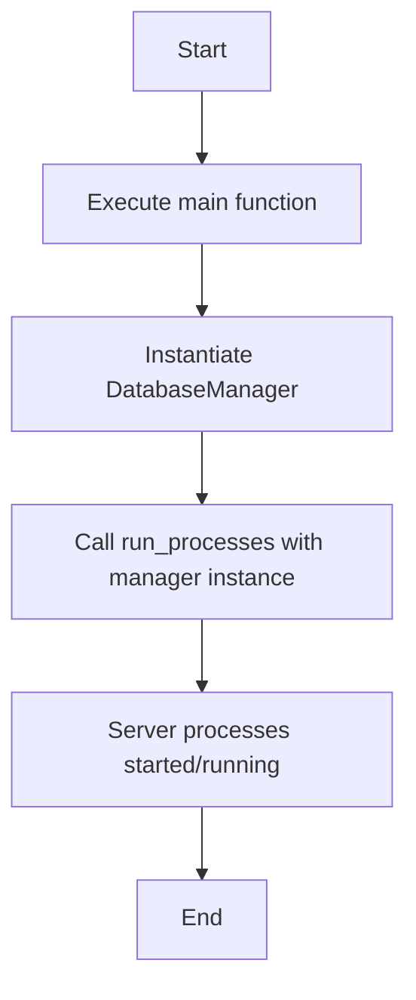
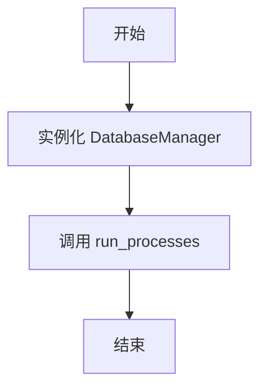

# `AutoGPT\autogpt_platform\backend\backend\db.py` 详细设计文档

该代码作为 AutoGPT-server REST API 的应用程序入口点，主要负责实例化数据库管理器（DatabaseManager），并将其传递给核心运行函数以启动所有必要的服务进程。

## 整体流程



## 类结构

```
Global Functions
└── main()
```

## 全局变量及字段


    

## 全局函数及方法


### `main`

运行 AutoGPT-server REST API 所需的所有进程。该函数通过初始化数据库管理器并启动应用程序进程来实现服务的启动。

参数：

返回值：`None`，无返回值

#### 流程图



#### 带注释源码

```python
def main():
    """
    Run all the processes required for the AutoGPT-server REST API.
    """
    # 初始化数据库管理器实例
    # 创建一个 DatabaseManager 对象，用于处理数据库相关的操作
    db_manager = DatabaseManager()
    
    # 运行应用程序的进程
    # 将数据库管理器实例传递给 run_processes 函数，启动 API 服务
    run_processes(db_manager)
```


## 关键组件


### run_processes

核心流程启动函数，负责启动 AutoGPT-server REST API 所需的所有进程。

### DatabaseManager

数据库管理器，作为核心依赖项被传递给流程启动器，用于管理数据库连接或生命周期。

### main

程序入口函数，负责初始化 DatabaseManager 实例并调用 run_processes 启动服务。


## 问题及建议


### 已知问题

-   **缺少异常处理机制**：`main` 函数直接调用 `run_processes` 而未包裹 `try-except` 块。如果 `DatabaseManager` 初始化失败或运行时发生未捕获异常，进程将直接崩溃，无法进行错误记录或优雅退出，这在生产环境（如容器化部署）中不利于监控和故障排查。
-   **缺少信号处理与优雅停机**：代码未处理操作系统的终止信号（如 SIGTERM 或 SIGINT）。如果服务强制终止，可能会导致数据库连接未关闭、数据丢失或资源未释放的问题。
-   **配置管理不透明**：`DatabaseManager()` 的实例化未传入任何参数，暗示其依赖硬编码配置或全局环境变量。这种隐式依赖降低了代码的可测试性，使得在不同环境（开发、测试、生产）切换配置变得困难且容易出错。
-   **缺乏日志初始化**：入口文件中未初始化日志系统。如果 `backend` 内部依赖默认日志配置，可能会导致日志格式不统一或关键信息（如启动失败原因）未被记录。

### 优化建议

-   **引入全局异常捕获**：在 `main` 函数中添加顶层的 `try...except` 块，捕获所有未处理的异常，记录详细的错误堆栈信息，并以非零状态码退出程序，以便上层调度器（如 Kubernetes 或 Systemd）识别失败状态。
-   **实现优雅停机机制**：使用信号处理库（如 Python 的 `signal` 模块）监听终止信号，确保在收到退出指令时，能够正确关闭数据库连接、清理资源并完成当前请求的处理，而不是立即中断。
-   **采用显式配置管理**：建议引入配置对象（如 Pydantic Settings 或配置类），将数据库连接串、端口等参数显式传入 `DatabaseManager`，实现配置与代码的分离，提升可维护性。
-   **统一日志配置**：在程序启动早期（`main` 函数开始处）配置日志系统（如 `logging` 模块或 `structlog`），设定统一的日志级别、格式和输出目标，便于后续审计和调试。
-   **使用上下文管理器管理资源**：如果 `DatabaseManager` 涉及资源管理，建议实现 `__enter__` 和 `__exit__` 方法或显式调用 `close` 方法，确保数据库连接等资源在使用完毕后能被可靠释放。


## 其它


### 设计目标与约束

本模块旨在作为AutoGPT-server REST API的单一入口点，负责初始化核心依赖（数据库连接）并启动应用进程。设计目标保持极简，不包含具体的业务逻辑，仅负责组件组装与调度。主要约束包括：必须在启动API服务前成功实例化`DatabaseManager`，且依赖于`backend.app`和`backend.executor`模块的正确导入与环境配置。

### 错误处理与异常设计

当前代码未实现显式的异常捕获（try-except）。如果`DatabaseManager()`初始化失败（例如数据库连接不可用）或`run_processes()`执行过程中抛出未处理的异常，程序将立即崩溃并打印堆栈跟踪到标准错误输出。这种设计适合由外部容器编排工具（如Docker或Kubernetes）或进程管理器（如systemd）监控进程状态并进行自动重启的场景。若需实现优雅关闭或特定错误码返回，建议在`main`函数中增加全局异常处理逻辑。

### 数据流与状态机

**状态机**：
1. **初始化**：脚本加载，导入模块。
2. **实例化**：创建`DatabaseManager`对象。
3. **运行中**：调用`run_processes`，服务开始处理请求。
4. **终止**：`run_processes`返回或程序异常退出。

**数据流**：
数据流向是单向且直接的。`main`函数作为起点，实例化`DatabaseManager`并将其引用传递给`run_processes`函数。后续的数据库交互、请求处理等数据流转均在`run_processes`及`DatabaseManager`内部进行，当前入口层不参与具体的数据处理。

### 外部依赖与接口契约

**外部依赖**：
1. `backend.app.run_processes`：核心应用启动函数，负责运行服务器所需的所有进程。
2. `backend.executor.DatabaseManager`：数据库管理类，负责提供底层数据库连接与会话管理。

**接口契约**：
- `run_processes(manager)`：
  - **参数**：接收一个`DatabaseManager`类的实例化对象。
  - **行为**：预期该函数会启动REST API服务并阻塞主线程，直到服务停止。
  - **隐式约定**：调用方需确保传入的`manager`对象已完全初始化并可用于数据库操作；调用方不处理返回值。

    