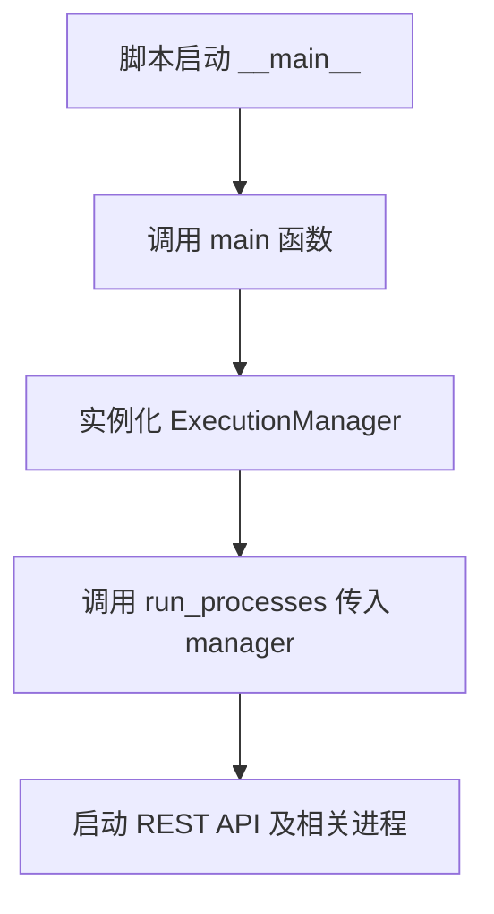
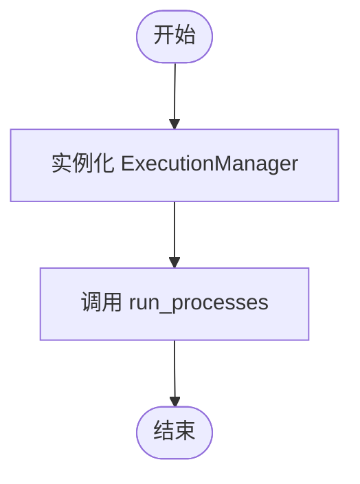

# `AutoGPT\autogpt_platform\backend\backend\exec.py` 详细设计文档

该文件作为 AutoGPT-server REST API 的入口点，负责初始化 ExecutionManager 并通过 run_processes 函数启动所有必要的服务进程。

## 整体流程



## 类结构

```
当
前
文
件
未
定
义
任
何
类
```

## 全局变量及字段


    

## 全局函数及方法


### `main`

该函数作为AutoGPT-server REST API的入口点，负责初始化执行管理器并启动所需的所有后台进程。

参数：

-  无

返回值：`None`，函数本身不返回任何值，主要用于触发程序运行。

#### 流程图



#### 带注释源码

```python
def main():
    """
    Run all the processes required for the AutoGPT-server REST API.
    """
    # 实例化执行管理器，用于管理任务的执行
    manager = ExecutionManager()
    # 调用 run_processes 函数，传入执行管理器实例，启动服务器所需的全部进程
    run_processes(manager)
```


## 关键组件


### main

应用程序的主入口函数，负责初始化并启动 AutoGPT-server REST API 的所有进程。

### run_processes

从 backend.app 导入的函数，负责接收执行管理器并运行服务器所需的所有进程。

### ExecutionManager

从 backend.executor 导入的类，作为执行管理器实例传递给 run_processes，用于管理服务的执行逻辑。


## 问题及建议


### 已知问题

-   缺乏异常处理机制：`main` 函数中未包含 `try-except` 块，一旦 `run_processes` 或 `ExecutionManager` 初始化抛出异常，程序将崩溃且无任何错误日志记录或清理操作，不利于生产环境的问题排查。
-   缺乏信号处理与优雅关闭：作为服务端入口点，代码未处理 `SIGINT` (Ctrl+C) 或 `SIGTERM` 信号，强制终止可能导致资源（如数据库连接、 socket）未释放或数据不一致。
-   缺少配置初始化入口：`ExecutionManager` 实例化时未传入参数，暗示依赖硬编码或全局配置，降低了程序的灵活性和可测试性。

### 优化建议

-   引入全局异常捕获与日志记录：在 `main` 函数中添加 `try-except` 捕获顶层异常，配合 logging 模块记录堆栈信息，并确保程序退出时返回非零状态码。
-   实现信号监听与优雅退出：利用 `signal` 模块注册信号处理函数，在收到终止信号时通知 `ExecutionManager` 停止运行并清理资源。
-   增加启动配置加载：在入口处加载并验证配置文件（如环境变量或 .yaml 文件），将配置对象显式传递给 `ExecutionManager`，实现依赖注入。
-   完善文档与类型提示：虽然是入口文件，但建议添加必要的类型提示，明确函数的输入输出，提高代码可读性。


## 其它


### 外部依赖与接口契约

**外部依赖**
*   `backend.app`: 提供核心运行函数 `run_processes`，负责启动应用程序的主循环。
*   `backend.executor`: 提供 `ExecutionManager` 类，负责具体的执行逻辑管理和调度。

**接口契约**
*   **`run_processes(manager: ExecutionManager)`**
    *   **参数**: `ExecutionManager` 的实例。调用方确保该实例已正确初始化。
    *   **行为**: 该函数预期会阻塞主线程，启动 REST API 服务器并开始监听请求，直到服务被显式停止或发生致命错误。
    *   **契约约束**: `ExecutionManager` 必须实现 `run_processes` 内部调用的所有方法，通常涉及任务执行、生命周期管理等接口。

### 错误处理与异常设计

**当前状态**
*   **无显式异常捕获**: 代码中没有 `try...except` 块。
*   **依赖全局异常处理器**: 如果 `ExecutionManager()` 初始化失败（例如配置错误、依赖缺失）或 `run_processes` 内部抛出未捕获异常，Python 进程将打印堆栈跟踪并立即以非零状态码退出。

**设计策略**
*   **快速失败**: 这是一个典型的微服务或容器化应用的启动策略。任何启动阶段的错误都应导致程序崩溃，从而防止应用处于“半死不活”的不健康状态。
*   **编排层接管**: 错误处理的责任被上交给外部进程管理器（如 Docker、Kubernetes 或 Supervisor），由它们监控进程状态并在崩溃时进行重启或报警。
*   **潜在改进**: 如果需要实现“优雅停机”或捕获特定启动错误进行特殊告警，应在 `main` 函数中增加 `try-finally` 块以释放资源。

### 数据流与状态机

**启动数据流**
1.  **入口**: Python 解释器加载脚本，执行 `if __name__ == "__main__":` 判断。
2.  **调用**: 调用 `main()` 函数。
3.  **实例化**: 创建 `ExecutionManager` 对象。此步骤可能涉及加载环境变量、连接数据库等数据准备（具体取决于该类的实现）。
4.  **注入**: 将 `ExecutionManager` 实例作为依赖注入到 `run_processes` 函数中。
5.  **运行**: `run_processes` 启动服务监听，进入 I/O 循环，处理外部 HTTP 请求。

**状态流转**
*   **Initialized**: 模块加载完成。
*   **Booting**: 执行 `main` 函数，实例化管理器。
*   **Running**: `run_processes` 占用主线程，服务处于活跃状态，处理 API 请求。
*   **Terminated**: 服务进程结束（无论是正常退出还是异常崩溃）。

### 日志与监控策略

**日志设计**
*   **当前缺失**: 当前代码片段未包含日志记录语句（如 `logging.info`）。
*   **隐式日志**: 假设 `backend.app.run_processes` 内部配置了日志框架（如 Python standard `logging` 或 `structlog`），用于记录请求访问、错误堆栈和系统状态。
*   **建议**: 在 `main` 函数开始处添加启动日志，记录服务版本号和启动时间，便于在分布式追踪中定位服务的生命周期起点。

**监控指标**
*   **进程级指标**: 依赖外部工具（如 Prometheus Node Exporter 或 K8s Metrics）监控 CPU、内存和进程存活状态。
*   **业务级指标**: 由 `ExecutionManager` 或 REST API 框架内部暴露 `/metrics` 端点，提供请求量、延迟等指标。

### 部署与环境配置

**运行环境**
*   **Python 版本**: 需兼容项目依赖的 Python 版本。
*   **依赖管理**: 需预先安装 `backend` 包及其 `requirements.txt` 或 `pyproject.toml` 中定义的第三方库。

**配置管理**
*   **无参数化配置**: `main` 函数不接受命令行参数（如 `argparse`），也不在此处读取配置文件。
*   **配置来源**: 配置完全通过以下方式隐式传递：
    1.  **环境变量**: 由 `os.environ` 在深层模块中读取（如 DB_URL, API_PORT 等）。
    2.  **配置文件**: 由深层模块加载（如 config.yaml）。
*   **约束**: 这意味着部署该服务时，必须在操作系统环境层面注入正确的变量，而不能通过启动脚本参数动态修改。

**部署模式**
*   **直接运行**: `python main.py`（适用于开发调试）。
*   **容器化**: 通常作为 Docker 容器的 ENTRYPOINT 或 CMD 运行，前台运行以保持容器生命周期。

    