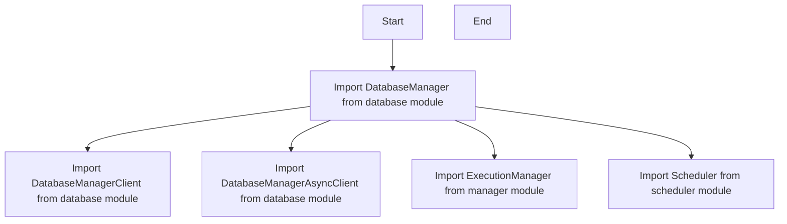

# `.\AutoGPT\autogpt_platform\backend\backend\executor\__init__.py` 详细设计文档

This code provides an interface to various database management, execution, and scheduling functionalities by importing and exporting specific classes from the respective modules.

## 整体流程



## 类结构

```
Database (Module)
├── DatabaseManager
│   ├── DatabaseManagerClient
│   └── DatabaseManagerAsyncClient
├── Execution (Module)
│   └── ExecutionManager
└── Scheduler (Module)
    └── Scheduler
```

## 全局变量及字段


### `DatabaseManager.DatabaseManager`
    
Manages database connections and operations.

类型：`DatabaseManager`
    


### `DatabaseManagerClient.DatabaseManagerClient`
    
Client for DatabaseManager to interact with the database.

类型：`DatabaseManagerClient`
    


### `DatabaseManagerAsyncClient.DatabaseManagerAsyncClient`
    
Asynchronous client for DatabaseManager to interact with the database.

类型：`DatabaseManagerAsyncClient`
    


### `ExecutionManager.ExecutionManager`
    
Manages execution of tasks and processes.

类型：`ExecutionManager`
    


### `Scheduler.Scheduler`
    
Schedules tasks and processes for execution.

类型：`Scheduler`
    
    

## 全局函数及方法


## 关键组件


### DatabaseManager

数据库管理器，负责数据库的连接、查询和事务管理。

### DatabaseManagerClient

数据库客户端，提供同步数据库操作接口。

### DatabaseManagerAsyncClient

异步数据库客户端，提供异步数据库操作接口。

### ExecutionManager

执行管理器，负责任务的调度和执行。

### Scheduler

调度器，负责任务的定时和触发。


## 问题及建议


### 已知问题

-   **依赖管理**：代码中使用了多个模块（DatabaseManager, DatabaseManagerClient, DatabaseManagerAsyncClient, ExecutionManager, Scheduler），但没有详细说明这些模块之间的依赖关系和接口契约，这可能导致模块之间的不兼容或难以维护。
-   **代码复用**：`DatabaseManager`, `DatabaseManagerClient`, 和 `DatabaseManagerAsyncClient` 似乎有相似的功能，但没有明确说明它们之间的区别和何时使用哪个类，这可能导致代码复用不足或过度。
-   **异步处理**：`DatabaseManagerAsyncClient` 暗示了异步处理的能力，但没有提供关于如何使用异步操作的示例或文档，这可能导致开发者难以正确使用异步功能。

### 优化建议

-   **文档化依赖关系**：为每个模块编写详细的文档，说明其依赖关系、接口契约和预期的使用场景。
-   **模块化设计**：考虑将 `DatabaseManager`, `DatabaseManagerClient`, 和 `DatabaseManagerAsyncClient` 合并为一个更通用的数据库管理类，以减少代码重复并提高可维护性。
-   **异步操作示例**：提供异步操作的示例代码和文档，帮助开发者理解如何正确使用异步功能。
-   **单元测试**：为每个模块编写单元测试，确保代码质量和功能正确性。
-   **代码审查**：定期进行代码审查，以发现潜在的问题并提高代码质量。


## 其它


### 设计目标与约束

- 设计目标：确保系统的高效、稳定和可扩展性。
- 约束条件：遵循模块化设计原则，确保代码的可维护性和可读性。

### 错误处理与异常设计

- 异常处理：定义统一的异常处理机制，确保异常能够被及时捕获和处理。
- 错误日志：记录错误信息和堆栈跟踪，便于问题定位和调试。

### 数据流与状态机

- 数据流：描述数据在系统中的流动路径，包括输入、处理和输出。
- 状态机：定义系统可能的状态以及状态之间的转换条件。

### 外部依赖与接口契约

- 外部依赖：列出系统依赖的外部库和组件。
- 接口契约：定义系统对外提供的接口及其功能描述。

### 安全性与权限控制

- 安全性：确保系统数据的安全性和完整性。
- 权限控制：实现用户权限控制，防止未授权访问。

### 性能优化与监控

- 性能优化：对系统进行性能分析和优化，提高系统响应速度。
- 监控：实现系统运行状态的监控，及时发现并解决问题。

### 可测试性与自动化测试

- 可测试性：确保系统模块具有良好的可测试性。
- 自动化测试：编写自动化测试用例，提高测试效率和覆盖率。

### 文档与代码规范

- 文档：编写详细的系统文档，包括设计文档、用户手册等。
- 代码规范：遵循统一的代码规范，提高代码质量和可维护性。

### 版本控制与发布管理

- 版本控制：使用版本控制系统管理代码变更，确保代码的版本可追溯。
- 发布管理：制定发布计划，确保系统稳定性和兼容性。

### 用户反馈与迭代优化

- 用户反馈：收集用户反馈，不断优化系统功能和用户体验。
- 迭代优化：根据用户反馈和市场需求，持续迭代优化系统。


    