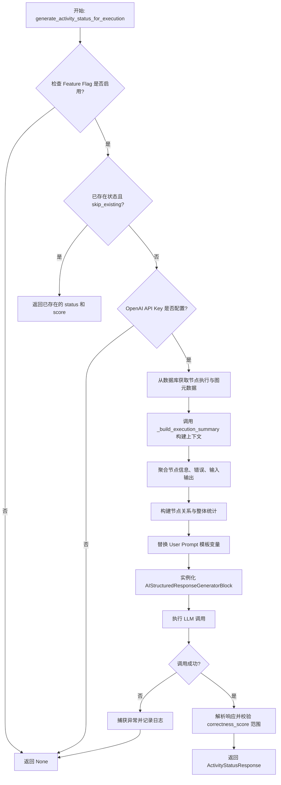
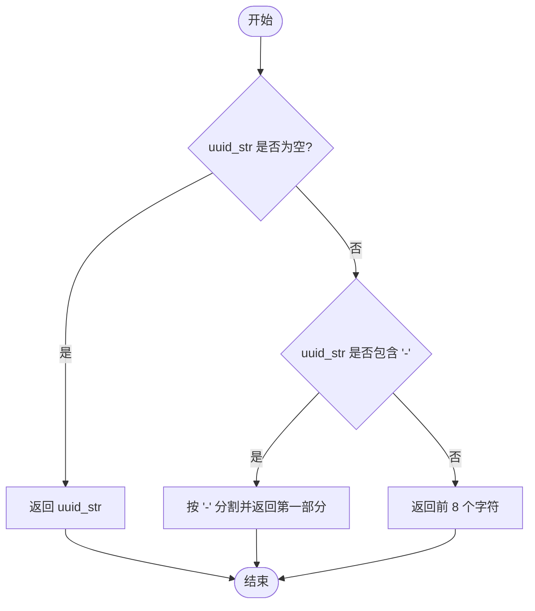
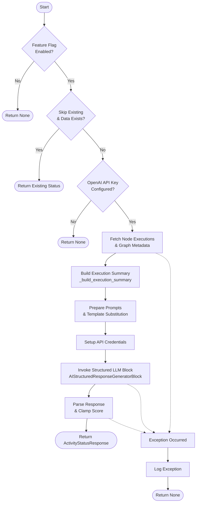
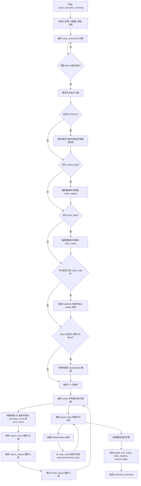

# `.\AutoGPT\autogpt_platform\backend\backend\executor\activity_status_generator.py` 详细设计文档

该模块核心功能是利用AI分析图执行的详细数据，生成用户友好的活动状态摘要和正确性评分。它通过聚合节点执行信息、统计数据和图结构，构建提示词调用大语言模型，以评估任务是否达成预期目标。

## 整体流程



## 类结构

```
Typed Definitions
├── ErrorInfo
├── InputOutputInfo
├── NodeInfo
├── NodeRelation
└── ActivityStatusResponse
```

## 全局变量及字段


### `logger`
    
The logger instance used for recording debug information and errors within this module.

类型：`logging.Logger`
    


### `DEFAULT_SYSTEM_PROMPT`
    
The default system prompt template instructing the AI on how to analyze execution status and generate summaries.

类型：`str`
    


### `DEFAULT_USER_PROMPT`
    
The default user prompt template containing placeholders for graph name and execution data to be analyzed.

类型：`str`
    


### `ErrorInfo.error`
    
The error message describing the failure.

类型：`str`
    


### `ErrorInfo.execution_id`
    
The truncated unique identifier of the node execution where the error occurred.

类型：`str`
    


### `ErrorInfo.timestamp`
    
The ISO 8601 formatted timestamp indicating when the error happened.

类型：`str`
    


### `InputOutputInfo.execution_id`
    
The truncated unique identifier of the node execution.

类型：`str`
    


### `InputOutputInfo.output_data`
    
The data produced (input or output) by the node execution, which may be truncated.

类型：`dict[str, Any]`
    


### `InputOutputInfo.timestamp`
    
The ISO 8601 formatted timestamp of the execution.

类型：`str`
    


### `NodeInfo.node_id`
    
The truncated unique identifier of the node.

类型：`str`
    


### `NodeInfo.block_id`
    
The truncated unique identifier of the block associated with the node.

类型：`str`
    


### `NodeInfo.block_name`
    
The name of the block associated with the node.

类型：`str`
    


### `NodeInfo.block_description`
    
The description of the block functionality.

类型：`str`
    


### `NodeInfo.execution_count`
    
The total number of times this node has been executed.

类型：`int`
    


### `NodeInfo.error_count`
    
The total number of errors that occurred during this node's execution.

类型：`int`
    


### `NodeInfo.recent_errors`
    
A list of recent error information objects, limited to a maximum of 10 entries.

类型：`list[ErrorInfo]`
    


### `NodeInfo.recent_outputs`
    
A list of recent output data objects, limited to the latest 3 entries.

类型：`list[InputOutputInfo]`
    


### `NodeInfo.recent_inputs`
    
A list of recent input data objects, limited to the latest 3 entries.

类型：`list[InputOutputInfo]`
    


### `NodeRelation.source_node_id`
    
The truncated unique identifier of the source node in the graph link.

类型：`str`
    


### `NodeRelation.sink_node_id`
    
The truncated unique identifier of the sink (destination) node in the graph link.

类型：`str`
    


### `NodeRelation.source_name`
    
The name of the output in the source node.

类型：`str`
    


### `NodeRelation.sink_name`
    
The name of the input in the sink node.

类型：`str`
    


### `NodeRelation.is_static`
    
Indicates whether the link between nodes is static.

类型：`bool`
    


### `NodeRelation.source_block_name`
    
The optional name of the block associated with the source node.

类型：`str`
    


### `NodeRelation.sink_block_name`
    
The optional name of the block associated with the sink node.

类型：`str`
    


### `ActivityStatusResponse.activity_status`
    
A user-friendly summary (1-3 sentences) of what the user accomplished.

类型：`str`
    


### `ActivityStatusResponse.correctness_score`
    
A float score from 0.0 to 1.0 indicating how well the execution achieved its intended purpose.

类型：`float`
    
    

## 全局函数及方法


### `_truncate_uuid`

该函数用于截断UUID字符串，通过提取连字符前的第一段或直接截取前8个字符，以减少在生成活动状态摘要时的数据负载大小。

参数：

- `uuid_str`：`str`，需要被截断处理的UUID字符串。

返回值：`str`，截断后的UUID字符串片段；如果输入为空字符串，则原样返回。

#### 流程图



#### 带注释源码

```python
def _truncate_uuid(uuid_str: str) -> str:
    """Truncate UUID to first segment to reduce payload size."""
    # 检查输入字符串是否为空，如果为空则直接返回
    if not uuid_str:
        return uuid_str
    # 如果字符串包含连字符（标准UUID格式），按连字符分割并取第一段
    return uuid_str.split("-")[0] if "-" in uuid_str else uuid_str[:8]
```


### `generate_activity_status_for_execution`

Generate an AI-based activity status summary and correctness assessment for a graph execution by collecting execution data, constructing prompts, and invoking a structured LLM call.

参数：

- `graph_exec_id`：`str`，The graph execution ID.
- `graph_id`：`str`，The graph ID.
- `graph_version`：`int`，The graph version.
- `execution_stats`：`GraphExecutionStats`，Execution statistics containing counts, timing, and potentially existing status.
- `db_client`：`DatabaseManagerAsyncClient`，Database client for fetching node executions and graph metadata.
- `user_id`：`str`，User ID for LaunchDarkly feature flag evaluation.
- `execution_status`：`ExecutionStatus | None`，The overall execution status (COMPLETED, FAILED, TERMINATED).
- `model_name`：`str`，AI model to use for generation (default: gpt-4o-mini).
- `skip_feature_flag`：`bool`，Whether to skip LaunchDarkly feature flag check.
- `system_prompt`：`str`，Custom system prompt template defining the AI's behavior.
- `user_prompt`：`str`，Custom user prompt template with placeholders for graph name and execution data.
- `skip_existing`：`bool`，Whether to skip generation if activity_status and correctness_score already exist in execution_stats.

返回值：`ActivityStatusResponse | None`，AI-generated activity status response containing activity_status and correctness_score, or None if the feature is disabled, pre-conditions aren't met, or an error occurs.

#### 流程图



#### 带注释源码

```python
async def generate_activity_status_for_execution(
    graph_exec_id: str,
    graph_id: str,
    graph_version: int,
    execution_stats: GraphExecutionStats,
    db_client: "DatabaseManagerAsyncClient",
    user_id: str,
    execution_status: ExecutionStatus | None = None,
    model_name: str = "gpt-4o-mini",
    skip_feature_flag: bool = False,
    system_prompt: str = DEFAULT_SYSTEM_PROMPT,
    user_prompt: str = DEFAULT_USER_PROMPT,
    skip_existing: bool = True,
) -> ActivityStatusResponse | None:
    """
    Generate an AI-based activity status summary and correctness assessment for a graph execution.

    This function handles all the data collection and AI generation logic,
    keeping the manager integration simple.

    Args:
        graph_exec_id: The graph execution ID
        graph_id: The graph ID
        graph_version: The graph version
        execution_stats: Execution statistics
        db_client: Database client for fetching data
        user_id: User ID for LaunchDarkly feature flag evaluation
        execution_status: The overall execution status (COMPLETED, FAILED, TERMINATED)
        model_name: AI model to use for generation (default: gpt-4o-mini)
        skip_feature_flag: Whether to skip LaunchDarkly feature flag check
        system_prompt: Custom system prompt template (default: DEFAULT_SYSTEM_PROMPT)
        user_prompt: Custom user prompt template with placeholders (default: DEFAULT_USER_PROMPT)
        skip_existing: Whether to skip if activity_status and correctness_score already exist

    Returns:
        AI-generated activity status response with activity_status and correctness_status,
        or None if feature is disabled or skipped
    """
    # Check LaunchDarkly feature flag for AI activity status generation with full context support
    if not skip_feature_flag and not await is_feature_enabled(
        Flag.AI_ACTIVITY_STATUS, user_id
    ):
        logger.debug("AI activity status generation is disabled via LaunchDarkly")
        return None

    # Check if we should skip existing data (for admin regeneration option)
    if (
        skip_existing
        and execution_stats.activity_status
        and execution_stats.correctness_score is not None
    ):
        logger.debug(
            f"Skipping activity status generation for {graph_exec_id}: already exists"
        )
        return {
            "activity_status": execution_stats.activity_status,
            "correctness_score": execution_stats.correctness_score,
        }

    # Check if we have OpenAI API key
    try:
        settings = Settings()
        if not settings.secrets.openai_internal_api_key:
            logger.debug(
                "OpenAI API key not configured, skipping activity status generation"
            )
            return None

        # Get all node executions for this graph execution
        node_executions = await db_client.get_node_executions(
            graph_exec_id, include_exec_data=True
        )

        # Get graph metadata and full graph structure for name, description, and links
        graph_metadata = await db_client.get_graph_metadata(graph_id, graph_version)
        graph = await db_client.get_graph(
            graph_id=graph_id,
            version=graph_version,
            user_id=user_id,
            skip_access_check=True,
        )

        graph_name = graph_metadata.name if graph_metadata else f"Graph {graph_id}"
        graph_description = graph_metadata.description if graph_metadata else ""
        graph_links = graph.links if graph else []

        # Build execution data summary
        execution_data = _build_execution_summary(
            node_executions,
            execution_stats,
            graph_name,
            graph_description,
            graph_links,
            execution_status,
        )

        # Prepare execution data as JSON for template substitution
        execution_data_json = json.dumps(execution_data, indent=2)

        # Perform template substitution for user prompt
        user_prompt_content = user_prompt.replace("{{GRAPH_NAME}}", graph_name).replace(
            "{{EXECUTION_DATA}}", execution_data_json
        )

        # Prepare prompt for AI with structured output requirements
        prompt = [
            {
                "role": "system",
                "content": system_prompt,
            },
            {
                "role": "user",
                "content": user_prompt_content,
            },
        ]

        # Log the prompt for debugging purposes
        logger.debug(
            f"Sending prompt to LLM for graph execution {graph_exec_id}: {json.dumps(prompt, indent=2)}"
        )

        # Create credentials for LLM call
        credentials = APIKeyCredentials(
            id="openai",
            provider="openai",
            api_key=SecretStr(settings.secrets.openai_internal_api_key),
            title="System OpenAI",
        )

        # Define expected response format
        expected_format = {
            "activity_status": "A user-friendly 1-3 sentence summary of what was accomplished",
            "correctness_score": "Float score from 0.0 to 1.0 indicating how well the execution achieved its intended purpose",
        }

        # Use existing AIStructuredResponseGeneratorBlock for structured LLM call
        structured_block = AIStructuredResponseGeneratorBlock()

        # Convert credentials to the format expected by AIStructuredResponseGeneratorBlock
        credentials_input = {
            "provider": credentials.provider,
            "id": credentials.id,
            "type": credentials.type,
            "title": credentials.title,
        }

        structured_input = AIStructuredResponseGeneratorBlock.Input(
            prompt=prompt[1]["content"],  # User prompt content
            sys_prompt=prompt[0]["content"],  # System prompt content
            expected_format=expected_format,
            model=LlmModel(model_name),
            credentials=credentials_input,  # type: ignore
            max_tokens=150,
            retry=3,
        )

        # Execute the structured LLM call
        async for output_name, output_data in structured_block.run(
            structured_input, credentials=credentials
        ):
            if output_name == "response":
                response = output_data
                break
        else:
            raise RuntimeError("Failed to get response from structured LLM call")

        # Create typed response with validation
        correctness_score = float(response["correctness_score"])
        # Clamp score to valid range
        correctness_score = max(0.0, min(1.0, correctness_score))

        activity_response: ActivityStatusResponse = {
            "activity_status": response["activity_status"],
            "correctness_score": correctness_score,
        }

        logger.debug(
            f"Generated activity status for {graph_exec_id}: {activity_response}"
        )

        return activity_response

    except Exception as e:
        logger.exception(
            f"Failed to generate activity status for execution {graph_exec_id}: {str(e)}"
        )
        return None
```


### `_build_execution_summary`

该函数负责处理原始的图执行数据，包括节点执行结果、统计信息、图结构链接等，将其聚合、截断并格式化为一个结构化的字典摘要。此摘要旨在为后续的 AI 分析提供上下文，包含节点详情、输入输出样本、错误信息以及整体执行状态，同时为了节省 Token 空间对数据进行了适当的截断处理。

参数：

-  `node_executions`：`list[NodeExecutionResult]`，包含图中所有节点执行结果的列表。
-  `execution_stats`：`GraphExecutionStats`，整个图执行的统计数据（如节点计数、错误计数、耗时等）。
-  `graph_name`：`str`，图的名称。
-  `graph_description`：`str`，图的描述信息。
-  `graph_links`：`list[Any]`，图中节点之间的连接（边）列表。
-  `execution_status`：`ExecutionStatus | None`，图的整体执行状态（默认为 None）。

返回值：`dict[str, Any]`，包含图信息、节点详情（含输入输出样本和错误）、节点关系及整体状态的格式化字典。

#### 流程图



#### 带注释源码

```python
def _build_execution_summary(
    node_executions: list[NodeExecutionResult],
    execution_stats: GraphExecutionStats,
    graph_name: str,
    graph_description: str,
    graph_links: list[Any],
    execution_status: ExecutionStatus | None = None,
) -> dict[str, Any]:
    """Build a structured summary of execution data for AI analysis."""

    # 初始化用于存储处理后的节点信息的列表和字典
    nodes: list[NodeInfo] = []
    node_execution_counts: dict[str, int] = {}
    node_error_counts: dict[str, int] = {}
    node_errors: dict[str, list[ErrorInfo]] = {}
    node_outputs: dict[str, list[InputOutputInfo]] = {}
    node_inputs: dict[str, list[InputOutputInfo]] = {}
    input_output_data: dict[str, Any] = {}
    node_map: dict[str, NodeInfo] = {}

    # 遍历所有节点执行结果，提取并聚合数据
    for node_exec in node_executions:
        # 根据 block_id 获取对应的 Block 对象
        block = get_block(node_exec.block_id)
        if not block:
            logger.warning(
                f"Block {node_exec.block_id} not found for node {node_exec.node_id}"
            )
            continue

        # 统计每个节点的执行次数
        if node_exec.node_id not in node_execution_counts:
            node_execution_counts[node_exec.node_id] = 0
        node_execution_counts[node_exec.node_id] += 1

        # 处理错误：统计错误次数并收集具体的错误信息
        if node_exec.status == ExecutionStatus.FAILED:
            if node_exec.node_id not in node_error_counts:
                node_error_counts[node_exec.node_id] = 0
            node_error_counts[node_exec.node_id] += 1

            # 尝试从 output_data 中提取错误消息
            error_message = "Unknown error"
            if node_exec.output_data and isinstance(node_exec.output_data, dict):
                if "error" in node_exec.output_data:
                    error_output = node_exec.output_data["error"]
                    if isinstance(error_output, list) and error_output:
                        error_message = str(error_output[0])
                    else:
                        error_message = str(error_output)

            # 按节点 ID 分组存储错误详情
            if node_exec.node_id not in node_errors:
                node_errors[node_exec.node_id] = []

            node_errors[node_exec.node_id].append(
                {
                    "error": error_message,
                    "execution_id": _truncate_uuid(node_exec.node_exec_id), # 截断 UUID 以节省空间
                    "timestamp": node_exec.add_time.isoformat(),
                }
            )

        # 处理输出数据：截断并存储最近的数据样本
        if node_exec.output_data:
            if node_exec.node_id not in node_outputs:
                node_outputs[node_exec.node_id] = []

            # 截断输出数据至 100 字符
            truncated_output = truncate(node_exec.output_data, 100)

            node_outputs[node_exec.node_id].append(
                {
                    "execution_id": _truncate_uuid(node_exec.node_exec_id),
                    "output_data": truncated_output,
                    "timestamp": node_exec.add_time.isoformat(),
                }
            )

        # 处理输入数据：截断并存储最近的数据样本
        if node_exec.input_data:
            if node_exec.node_id not in node_inputs:
                node_inputs[node_exec.node_id] = []

            # 截断输入数据至 100 字符
            truncated_input = truncate(node_exec.input_data, 100)

            node_inputs[node_exec.node_id].append(
                {
                    "execution_id": _truncate_uuid(node_exec.node_exec_id),
                    "output_data": truncated_input,  # 字段名复用保持一致性
                    "timestamp": node_exec.add_time.isoformat(),
                }
            )

        # 构建节点基础信息（确保每个节点只添加一次）
        if node_exec.node_id not in node_map:
            node_data: NodeInfo = {
                "node_id": _truncate_uuid(node_exec.node_id),
                "block_id": _truncate_uuid(node_exec.block_id),
                "block_name": block.name,
                "block_description": block.description or "",
                "execution_count": 0,  # 稍后填充
                "error_count": 0,  # 稍后填充
                "recent_errors": [],  # 稍后填充
                "recent_outputs": [],  # 稍后填充
                "recent_inputs": [],  # 稍后填充
            }
            nodes.append(node_data)
            node_map[node_exec.node_id] = node_data

        # 对于特殊的输入/输出块，存储完整的数据（用于 AI 理解用户意图）
        if block.name in ["AgentInputBlock", "AgentOutputBlock", "UserInputBlock"]:
            if node_exec.input_data:
                input_output_data[f"{node_exec.node_id}_inputs"] = dict(
                    node_exec.input_data
                )
            if node_exec.output_data:
                input_output_data[f"{node_exec.node_id}_outputs"] = dict(
                    node_exec.output_data
                )

    # 填充节点列表中的统计数据和样本数据
    for node in nodes:
        # 反查原始 node_id（因为节点列表中的 ID 可能已被截断）
        original_node_id = None
        for orig_id, node_data in node_map.items():
            if node_data == node:
                original_node_id = orig_id
                break

        if original_node_id:
            # 设置执行次数和错误次数
            node["execution_count"] = node_execution_counts.get(original_node_id, 0)
            node["error_count"] = node_error_counts.get(original_node_id, 0)

            # 添加错误信息（最多取前5个和后5个，即最多10个）
            if original_node_id in node_errors:
                node_error_list = node_errors[original_node_id]
                if len(node_error_list) <= 10:
                    node["recent_errors"] = node_error_list
                else:
                    node["recent_errors"] = node_error_list[:5] + node_error_list[-5:]

            # 添加最新的输出样本（最多3个）
            if original_node_id in node_outputs:
                node_output_list = node_outputs[original_node_id]
                # 按时间倒序排序
                if node_output_list and node_output_list[0].get("timestamp"):
                    node_output_list.sort(
                        key=lambda x: x.get("timestamp", ""), reverse=True
                    )
                node["recent_outputs"] = node_output_list[:3]

            # 添加最新的输入样本（最多3个）
            if original_node_id in node_inputs:
                node_input_list = node_inputs[original_node_id]
                # 按时间倒序排序
                if node_input_list and node_input_list[0].get("timestamp"):
                    node_input_list.sort(
                        key=lambda x: x.get("timestamp", ""), reverse=True
                    )
                node["recent_inputs"] = node_input_list[:3]

    # 根据图链接构建节点关系信息
    node_relations: list[NodeRelation] = []
    for link in graph_links:
        relation: NodeRelation = {
            "source_node_id": _truncate_uuid(link.source_id),
            "sink_node_id": _truncate_uuid(link.sink_id),
            "source_name": link.source_name,
            "sink_name": link.sink_name,
            "is_static": link.is_static if hasattr(link, "is_static") else False,
        }

        # 如果节点存在于 map 中，补充对应的 block 名称
        if link.source_id in node_map:
            relation["source_block_name"] = node_map[link.source_id]["block_name"]
        if link.sink_id in node_map:
            relation["sink_block_name"] = node_map[link.sink_id]["block_name"]

        node_relations.append(relation)

    # 汇总并返回最终的执行摘要字典
    return {
        "graph_info": {"name": graph_name, "description": graph_description},
        "nodes": nodes,
        "node_relations": node_relations,
        "input_output_data": input_output_data,
        "overall_status": {
            "total_nodes_in_graph": len(nodes),
            "total_executions": execution_stats.node_count,
            "total_errors": execution_stats.node_error_count,
            "execution_time_seconds": execution_stats.walltime,
            "has_errors": bool(
                execution_stats.error or execution_stats.node_error_count > 0
            ),
            "graph_error": (
                str(execution_stats.error) if execution_stats.error else None
            ),
            "graph_execution_status": (
                execution_status.value if execution_status else None
            ),
        },
    }
```


## 关键组件


### AI Activity Status Evaluation Logic

The primary orchestrator that manages the workflow of generating execution summaries, handling feature flags, validating API keys, and invoking the LLM.

### Execution Data Aggregation

A processing routine that transforms raw graph execution data, node statistics, and error logs into a structured JSON summary optimized for LLM consumption.

### Structured Prompting Strategy

A configuration mechanism that utilizes detailed system and user prompt templates to enforce a specific JSON output schema containing an activity status and correctness score.

### Token Optimization

Utility logic that employs UUID truncation and data sampling to minimize payload size, ensuring the generated context fits within LLM token limits.


## 问题及建议


### 已知问题

-   **泛化的异常捕获掩盖真实错误**：`generate_activity_status_for_execution` 函数使用了 `try-except Exception` 捕获所有异常并返回 `None`，导致调用方无法区分是“功能未启用”、“API Key 配置缺失”还是“内部数据处理失败”，增加了排查问题的难度。
-   **数据截断过度导致上下文缺失**：在 `_build_execution_summary` 中，输入输出数据被强制截断为 100 字符。对于 API 响应或 JSON 数据，这极有可能截断关键的布尔标志（如 `success: fals...`）或错误代码，导致 LLM 无法准确判断执行的正确性。
-   **上下文溢出与 Token 浪费风险**：通过 `json.dumps(execution_data, indent=2)` 生成的提示词包含了格式化的 JSON。对于节点众多或输出数据复杂的图，`indent=2` 会消耗大量 Token，且容易超出模型的上下文窗口限制；同时未对最终 Prompt 的总长度进行校验。
-   **硬编码的块名匹配逻辑**：代码中通过 `block.name in ["AgentInputBlock", "AgentOutputBlock", "UserInputBlock"]` 来判断特殊块。这种硬编码方式缺乏灵活性，一旦后端重命名这些块或引入新的输入/输出块类型，逻辑将失效。

### 优化建议

-   **Prompt 模板化管理**：将 `DEFAULT_SYSTEM_PROMPT` 和 `DEFAULT_USER_PROMPT` 等超长字符串提取至外部配置文件（如 YAML 或 JSON）或专门的 Prompt 管理服务中，以提高代码的可读性和迭代更新的灵活性。
-   **实现智能截断与采样策略**：优化数据传递给 LLM 的策略。取消固定的 100 字符限制，改为基于 Token 预算的动态截断；优先保留关键块（如 Output、Error）的完整数据，去除 JSON 缩进（`indent=2` 改为 `separators=(',', ':')`）以节省空间。
-   **并行化数据库查询**：`db_client.get_graph_metadata` 和 `db_client.get_graph` 之间没有数据依赖，可以使用 `asyncio.gather` 并行执行这两个查询，以减少总等待时间。
-   **细粒度异常处理与可观测性**：移除顶层宽泛的异常捕获，针对 API 调用失败、JSON 序列化错误、数据库连接超时等场景分别捕获和处理。同时，增加对于生成耗时、Token 消耗量的监控埋点，以便评估性能。
-   **关键参数配置化**：将截断长度、采样数量（如 recent_errors 取前 5 后 5）、默认模型名称等魔法数值提取为函数参数或全局配置，便于在不修改代码的情况下进行 A/B 测试或性能调优。


## 其它


### 设计目标与约束

**设计目标**：
该模块的核心设计目标是将复杂的图执行技术细节转化为用户可理解的自然语言摘要，并提供对执行结果正确性的量化评分。旨在降低用户理解自动化任务执行状态的认知负荷，使其无需关注底层节点的成功或失败，直接知晓任务是否达成。

**主要约束**：
1.  **LLM 上下文窗口限制**：由于发送给大模型的数据包含大量节点执行信息，必须对输入数据进行严格截断（如 UUID 截断、输入输出数据截断），以控制 Prompt 大小，避免超出模型的 Token 限制导致 API 调用失败。
2.  **异步执行**：所有涉及数据库 I/O 和 LLM 调用的操作必须是非阻塞的，以适应高并发的后端环境。
3.  **功能开关控制**：生成过程必须受 LaunchDarkly 功能标志控制，允许在不部署代码的情况下动态开启或关闭该功能，以便控制成本和灰度发布。
4.  **API 依赖**：功能依赖于 OpenAI API 的可用性及有效的内部 API Key 配置，若无 Key 则应优雅降级。

### 错误处理与异常设计

**总体策略**：
采用“防崩溃”设计，确保 AI 生成逻辑的异常不会影响主业务流程（即图执行本身）的正常记录和完成。

**具体机制**：
1.  **顶层捕获**：`generate_activity_status_for_execution` 函数包含一个全局的 `try...except Exception` 块。任何步骤（如数据库查询失败、LLM 调用超时、JSON 解析错误）发生异常时，仅记录日志并返回 `None`，绝不向外抛出异常。
2.  **重试机制**：在调用 `AIStructuredResponseGeneratorBlock` 时，显式配置 `retry=3`，以应对临时的网络波动或 API 限流。
3.  **数据校验与降级**：
    *   **配置检查**：在执行逻辑前检查 OpenAI API Key 是否存在，若不存在则直接返回 `None`。
    *   **数据完整性**：当数据库无法获取图元数据或节点执行数据时，使用默认值（如 Graph ID 作为名称）或空列表继续执行，避免空指针异常。
    *   **响应验证**：对 LLM 返回的 `correctness_score` 进行类型转换和范围截断（Clamp 到 0.0-1.0），防止模型输出非数字或超出范围的值破坏后续逻辑。
4.  **日志记录**：所有错误和跳过逻辑均通过 `logger` 记录，包含 `graph_exec_id` 和具体的错误信息，便于排查问题。

### 数据流与状态机

**数据流向**：
1.  **输入阶段**：接收图执行 ID、统计信息、数据库客户端及用户 ID。
2.  **校验阶段**：检查功能标志与 API Key 配置。
3.  **数据提取与清洗阶段**：
    *   从 DB 获取 `NodeExecutionResult` 列表。
    *   遍历节点，统计执行次数、错误次数。
    *   **数据采样与截断**：对输入/输出数据进行 100 字符截断；对 UUID 进行首段截断；仅保留最近的 3 条输出和最多 10 条错误信息。
    *   构建 JSON 格式的执行摘要。
4.  **Prompt 构建阶段**：将 JSON 摘要注入到用户提示词模板中，结合系统提示词生成完整的 LLM 请求。
5.  **推理阶段**：通过 `AIStructuredResponseGeneratorBlock` 异步调用 OpenAI 接口。
6.  **输出阶段**：解析 LLM 返回的 JSON，校验分数范围，封装为 `ActivityStatusResponse` 返回。

**状态流转**：
系统并非典型的状态机，但其处理逻辑经历了以下状态流转：
*   `Initialized` -> `FlagCheck` (检查功能开关)
*   `FlagCheck` -> `Skip` (若开关关闭或已有数据) 或 `DataFetch` (获取执行数据)
*   `DataFetch` -> `BuildSummary` (构建摘要)
*   `BuildSummary` -> `LLMInference` (AI 生成)
*   `LLMInference` -> `Success` (返回结果) 或 `Failure` (捕获异常并返回 None)

### 外部依赖与接口契约

**外部依赖**：
1.  **LaunchDarkly (Feature Flag)**：
    *   **契约**：调用 `is_feature_enabled(Flag.AI_ACTIVITY_STATUS, user_id)`。期望返回 `bool`。
2.  **DatabaseManagerAsyncClient**：
    *   **契约**：
        *   `get_node_executions(graph_exec_id, include_exec_data)`: 异步返回 `List[NodeExecutionResult]`。
        *   `get_graph_metadata(graph_id, graph_version)`: 异步返回包含 `name` 和 `description` 的对象。
        *   `get_graph(...)`: 异步返回包含 `links` (节点连接关系) 的图结构对象。
3.  **OpenAI API (Settings & AIStructuredResponseGeneratorBlock)**：
    *   **Settings**: 需提供 `secrets.openai_internal_api_key`。
    *   **AIStructuredResponseGeneratorBlock**:
        *   **输入契约**: 接收 `Input` 数据类，包含 `prompt` (str), `sys_prompt` (str), `expected_format` (dict), `credentials` (dict), `model` (str) 等。
        *   **输出契约**: 异步生成 `(output_name, output_data)` 元组流，其中 `output_name` 为 "response" 时，`output_data` 应为符合 `expected_format` 的字典。
4.  **Pydantic & Python Typing**：用于强类型定义数据结构（如 `TypedDict`），确保数据契约在代码层面的严格性。

### 安全性与隐私保护

1.  **敏感信息屏蔽**：
    *   使用 `SecretStr` 包装 API Key，防止在日志或调试信息中明文泄露。
    *   通过 `truncate` 函数强制截断节点的输入和输出数据（限制为 100 字符）。这既是为了控制 Token 成本，也是为了防止将用户敏感数据（如 PII、密码、完整的文档内容）发送给外部 LLM 提供商。
2.  **权限控制**：
    *   在获取图结构时使用了 `skip_access_check=True`，这是设计上假设调用方（Manager 层）已经完成了权限校验，本模块专注于数据分析。但这要求调用链路必须严格守卫。
3.  **ID 脱敏**：
    *   `_truncate_uuid` 函数将 UUID 截断为前 8 位或首段，减少了上下文中的冗余信息，进一步降低了通过日志或中间数据反向追踪特定内部对象的风险。

### 性能优化策略

1.  **数据载荷压缩**：
    *   **UUID 截断**：将 36 字符的 UUID 缩减至约 8 字符，显著减少了 JSON 载荷大小和 Token 消耗。
    *   **内容截断**：严格限制 `input_data` 和 `output_data` 的长度（100 字符），丢弃大量非关键的中间过程数据。
    *   **采样限制**：仅保留最近的 3 条输入/输出样本和最近的 10 条错误记录，避免随执行时间推移导致数据量无限增长。
2.  **异步 I/O**：
    *   所有的数据库查询和 LLM 调用均使用 `async/await` 模式，避免阻塞事件循环，提高后端服务的吞吐量。
3.  **提前退出**：
    *   在函数入口处检查功能标志和现有数据，若满足条件则立即返回，避免不必要的数据库查询和计算开销。
    *   检查 API Key 是否存在，若不存在则跳过，避免无效的网络连接尝试。
4.  **资源复用**：
    *   通过 `get_block` 获取 Block 实例（单例模式），避免在循环中重复初始化 Block 类的开销。

    