# `.\AutoGPT\autogpt_platform\backend\backend\executor\activity_status_generator_test.py` 详细设计文档

This file is a comprehensive test suite for the activity status generator module, utilizing pytest to validate the logic for building execution summaries and generating activity statuses via LLM calls under various mock conditions including successful runs, failures, missing data, and different error formats.

## 整体流程

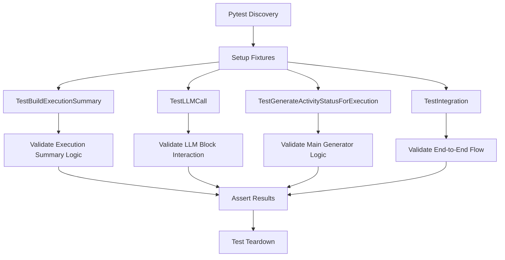

## 类结构

```
Test Suite
├── TestBuildExecutionSummary
│   ├── test_build_summary_with_successful_execution
│   ├── test_build_summary_with_failed_execution
│   ├── test_build_summary_with_missing_blocks
│   ├── test_build_summary_with_graph_error
│   └── test_build_summary_with_different_error_formats
├── TestLLMCall
│   ├── test_structured_llm_call_success
│   └── test_structured_llm_call_validation_error
├── TestGenerateActivityStatusForExecution
│   ├── test_generate_status_success
│   ├── test_generate_status_feature_disabled
│   ├── test_generate_status_no_api_key
│   ├── test_generate_status_exception_handling
│   └── test_generate_status_with_graph_name_fallback
└── TestIntegration
    ├── test_full_integration_flow
    └── test_manager_integration_with_disabled_feature
```

## 全局变量及字段


    

## 全局函数及方法


### `mock_node_executions`

该函数是一个 Pytest fixture，用于创建并返回包含三个模拟节点执行结果的列表，涵盖了成功和失败两种执行状态，用于辅助测试活动状态生成器的功能。

参数：

返回值：`List[NodeExecutionResult]`，包含三个预定义的节点执行结果对象的列表。

#### 流程图

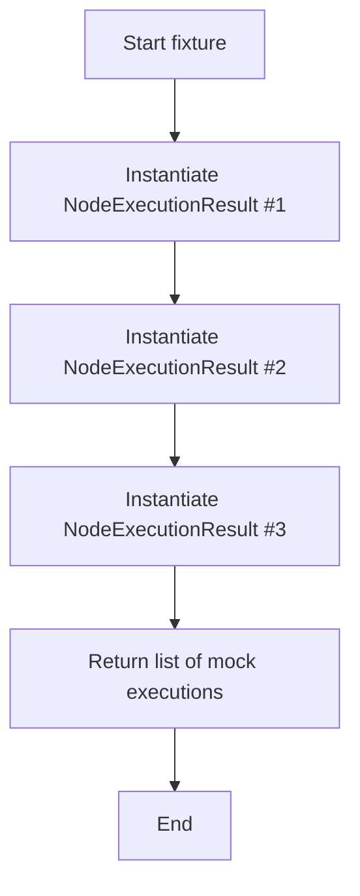

#### 带注释源码

```python
@pytest.fixture
def mock_node_executions():
    """Create mock node executions for testing."""
    return [
        # 第一个模拟执行：状态为已完成
        NodeExecutionResult(
            user_id="test_user",
            graph_id="test_graph",
            graph_version=1,
            graph_exec_id="test_exec",
            node_exec_id="123e4567-e89b-12d3-a456-426614174001",
            node_id="456e7890-e89b-12d3-a456-426614174002",
            block_id="789e1234-e89b-12d3-a456-426614174003",
            status=ExecutionStatus.COMPLETED,
            input_data={"user_input": "Hello, world!"},
            output_data={"processed_input": ["Hello, world!"]},
            add_time=datetime.now(timezone.utc),
            queue_time=None,
            start_time=None,
            end_time=None,
        ),
        # 第二个模拟执行：状态为已完成
        NodeExecutionResult(
            user_id="test_user",
            graph_id="test_graph",
            graph_version=1,
            graph_exec_id="test_exec",
            node_exec_id="234e5678-e89b-12d3-a456-426614174004",
            node_id="567e8901-e89b-12d3-a456-426614174005",
            block_id="890e2345-e89b-12d3-a456-426614174006",
            status=ExecutionStatus.COMPLETED,
            input_data={"data": "Hello, world!"},
            output_data={"result": ["Processed data"]},
            add_time=datetime.now(timezone.utc),
            queue_time=None,
            start_time=None,
            end_time=None,
        ),
        # 第三个模拟执行：状态为失败，包含错误信息
        NodeExecutionResult(
            user_id="test_user",
            graph_id="test_graph",
            graph_version=1,
            graph_exec_id="test_exec",
            node_exec_id="345e6789-e89b-12d3-a456-426614174007",
            node_id="678e9012-e89b-12d3-a456-426614174008",
            block_id="901e3456-e89b-12d3-a456-426614174009",
            status=ExecutionStatus.FAILED,
            input_data={"final_data": "Processed data"},
            output_data={
                "error": ["Connection timeout: Unable to reach external service"]
            },
            add_time=datetime.now(timezone.utc),
            queue_time=None,
            start_time=None,
            end_time=None,
        ),
    ]
```


### `mock_execution_stats`

这是一个 Pytest 测试夹具，用于生成模拟的图执行统计数据对象。它主要用于在单元测试中模拟成功的执行场景，提供了预设的耗时、节点数量、成本及错误计数等指标，以便验证依赖这些统计数据的业务逻辑。

参数：

-  无参数

返回值：`GraphExecutionStats`，返回一个包含预设执行统计数据的模拟对象，包括墙钟时间、CPU时间、节点统计及成本信息。

#### 流程图

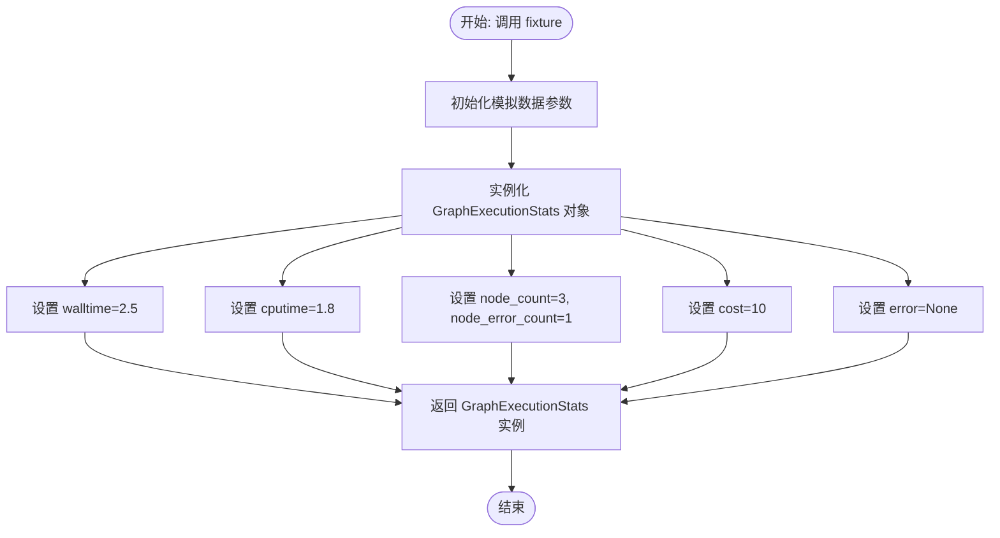

#### 带注释源码

```python
@pytest.fixture
def mock_execution_stats():
    """Create mock execution stats for testing."""
    # 返回一个 GraphExecutionStats 实例，预填充了模拟数据
    return GraphExecutionStats(
        walltime=2.5,       # 模拟总墙钟时间（秒）
        cputime=1.8,        # 模拟总 CPU 时间（秒）
        nodes_walltime=2.0, # 模拟节点总墙钟时间（秒）
        nodes_cputime=1.5,  # 模拟节点总 CPU 时间（秒）
        node_count=3,       # 模拟执行的节点总数
        node_error_count=1, # 模拟出错的节点数量
        cost=10,            # 模拟执行成本（如 token 消耗或费用）
        error=None,         # 模拟图级别的错误信息（None 表示无整体错误）
    )
```


### `mock_execution_stats_with_graph_error`

这是一个Pytest测试夹具，用于生成一个模拟的图执行统计数据对象，专门用于表示在图级别发生错误（例如API凭证无效）的场景。

参数：

-   无

返回值：`GraphExecutionStats`，包含图执行统计数据及特定错误信息的对象实例。

#### 流程图

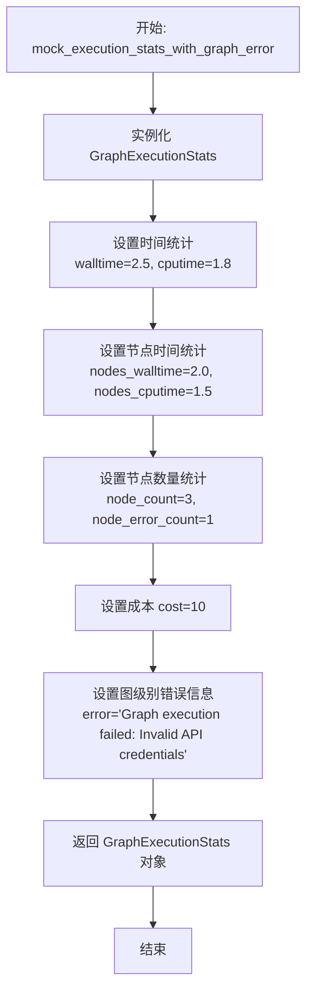

#### 带注释源码

```python
@pytest.fixture
def mock_execution_stats_with_graph_error():
    """Create mock execution stats with graph-level error."""
    return GraphExecutionStats(
        walltime=2.5,      # 模拟的总运行时间（秒）
        cputime=1.8,       # 模拟的CPU运行时间（秒）
        nodes_walltime=2.0,# 模拟的所有节点总运行时间（秒）
        nodes_cputime=1.5, # 模拟的所有节点总CPU时间（秒）
        node_count=3,      # 模拟的节点总数
        node_error_count=1,# 模拟的发生错误的节点数量
        cost=10,           # 模拟的执行成本
        error="Graph execution failed: Invalid API credentials", # 模拟的图级别错误信息
    )
```


### `mock_blocks`

创建模拟块用于测试。

参数：

-  无

返回值：`Dict[str, MagicMock]`，包含模拟块的字典，键为Block ID，值为模拟对象。

#### 流程图

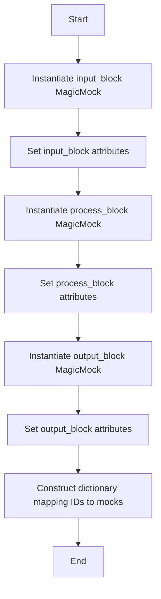

#### 带注释源码

```python
@pytest.fixture
def mock_blocks():
    """Create mock blocks for testing."""
    # 创建输入块的模拟对象
    input_block = MagicMock()
    input_block.name = "AgentInputBlock"
    input_block.description = "Handles user input"

    # 创建处理块的模拟对象
    process_block = MagicMock()
    process_block.name = "ProcessingBlock"
    process_block.description = "Processes data"

    # 创建输出块的模拟对象
    output_block = MagicMock()
    output_block.name = "AgentOutputBlock"
    output_block.description = "Provides output to user"

    # 返回包含模拟块的字典，键为Block ID，值为对应的模拟对象
    return {
        "789e1234-e89b-12d3-a456-426614174003": input_block,
        "890e2345-e89b-12d3-a456-426614174006": process_block,
        "901e3456-e89b-12d3-a456-426614174009": output_block,
        "process_block_id": process_block,  # Keep old key for different error format test
    }
```


### `TestBuildExecutionSummary.test_build_summary_with_successful_execution`

该测试方法验证了在所有节点执行成功的场景下，`_build_execution_summary` 函数能否正确生成包含图表信息、节点详情、节点关系、整体状态及输入输出数据的执行摘要。

参数：

-   `self`：`TestBuildExecutionSummary`，测试类实例
-   `mock_node_executions`：`List[NodeExecutionResult]`，模拟的节点执行结果列表，包含三个结果，但测试中仅使用前两个成功的
-   `mock_execution_stats`：`GraphExecutionStats`，模拟的图表执行统计数据
-   `mock_blocks`：`Dict[str, MagicMock]`，模拟的图块字典，映射块ID到图块对象

返回值：`None`，该方法为测试用例，通过断言验证逻辑，无直接返回值。

#### 流程图

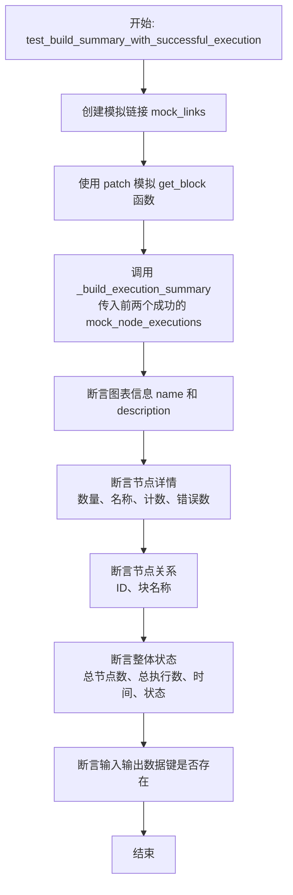

#### 带注释源码

```python
    def test_build_summary_with_successful_execution(
        self, mock_node_executions, mock_execution_stats, mock_blocks
    ):
        """Test building summary for successful execution."""
        # 1. 创建模拟链接，包含源节点、目标节点及其ID和名称
        mock_links = [
            MagicMock(
                source_id="456e7890-e89b-12d3-a456-426614174002",
                sink_id="567e8901-e89b-12d3-a456-426614174005",
                source_name="output",
                sink_name="input",
                is_static=False,
            )
        ]

        # 2. Patch 'get_block' 函数，使其返回预定义的 mock_blocks
        with patch(
            "backend.executor.activity_status_generator.get_block"
        ) as mock_get_block:
            mock_get_block.side_effect = lambda block_id: mock_blocks.get(block_id)

            # 3. 调用被测函数 _build_execution_summary
            # 注意：这里只传入了 mock_node_executions 的前两个元素（即成功执行的节点）
            summary = _build_execution_summary(
                mock_node_executions[:2],
                mock_execution_stats,
                "Test Graph",
                "A test graph for processing",
                mock_links,
                ExecutionStatus.COMPLETED,
            )

            # 4. 验证图表信息
            assert summary["graph_info"]["name"] == "Test Graph"
            assert summary["graph_info"]["description"] == "A test graph for processing"

            # 5. 验证节点详情及计数（执行次数、错误次数）
            assert len(summary["nodes"]) == 2
            assert summary["nodes"][0]["block_name"] == "AgentInputBlock"
            assert summary["nodes"][0]["execution_count"] == 1
            assert summary["nodes"][0]["error_count"] == 0
            assert summary["nodes"][1]["block_name"] == "ProcessingBlock"
            assert summary["nodes"][1]["execution_count"] == 1
            assert summary["nodes"][1]["error_count"] == 0

            # 6. 验证节点关系（UUID被截断为第一段）
            assert len(summary["node_relations"]) == 1
            assert (
                summary["node_relations"][0]["source_node_id"] == "456e7890"
            )  # Truncated
            assert (
                summary["node_relations"][0]["sink_node_id"] == "567e8901"
            )  # Truncated
            assert (
                summary["node_relations"][0]["source_block_name"] == "AgentInputBlock"
            )
            assert summary["node_relations"][0]["sink_block_name"] == "ProcessingBlock"

            # 7. 验证整体状态统计
            assert summary["overall_status"]["total_nodes_in_graph"] == 2
            # 注意：这里断言总执行数为3，可能是包含了统计中的总数或者mock数据特性，
            # 尽管只传入了2个节点execution结果，但 stats 可能有全局统计
            assert summary["overall_status"]["total_executions"] == 3
            assert summary["overall_status"]["total_errors"] == 1
            assert summary["overall_status"]["execution_time_seconds"] == 2.5
            assert summary["overall_status"]["graph_execution_status"] == "COMPLETED"

            # 8. 验证输入输出数据的键（使用完整的节点UUID）
            assert (
                "456e7890-e89b-12d3-a456-426614174002_inputs"
                in summary["input_output_data"]
            )
            assert (
                "456e7890-e89b-12d3-a456-426614174002_outputs"
                in summary["input_output_data"]
            )
```


### `TestBuildExecutionSummary.test_build_summary_with_failed_execution`

该方法用于测试在包含失败节点的执行场景下，`_build_execution_summary` 函数是否能正确构建执行摘要，特别是验证节点错误信息的捕获和展示。

参数：

- `mock_node_executions`：`List[NodeExecutionResult]`，通过 fixture 注入的模拟节点执行列表，其中包含状态为 FAILED 的节点。
- `mock_execution_stats`：`GraphExecutionStats`，通过 fixture 注入的模拟图执行统计数据。
- `mock_blocks`：`Dict[str, MagicMock]`，通过 fixture 注入的模拟块字典，用于模拟获取块信息。

返回值：`None`，这是一个测试函数，通过断言来验证逻辑，没有显式的返回值。

#### 流程图

```mermaid
flowchart TD
    A[开始: test_build_summary_with_failed_execution] --> B[初始化 mock_links 为空列表]
    B --> C[使用 patch 模拟 get_block 函数]
    C --> D[调用 _build_execution_summary<br>传入 mock_node_executions, stats 等]
    D --> E[在 summary['nodes'] 中查找 ID 为 678e9012 的 output_node]
    E --> F[断言: 验证 error_count 等于 1]
    F --> G[断言: 验证 execution_count 等于 1]
    G --> H[断言: 验证 recent_errors 字段存在]
    H --> I[断言: 验证 recent_errors 长度为 1]
    I --> J[断言: 验证错误消息内容为 'Connection timeout...']
    J --> K[断言: 验证错误信息中包含 execution_id]
    K --> L[结束: 测试通过]
```

#### 带注释源码

```python
def test_build_summary_with_failed_execution(
    self, mock_node_executions, mock_execution_stats, mock_blocks
):
    """Test building summary for execution with failures."""
    # 初始化空的 mock_links，表示测试场景中没有节点链接
    mock_links = []  # No links for this test

    # 使用 patch 模拟 backend.executor.activity_status_generator.get_block 函数
    with patch(
        "backend.executor.activity_status_generator.get_block"
    ) as mock_get_block:
        # 设置 mock_get_block 的副作用：根据 block_id 从 mock_blocks 字典中获取对应的块
        mock_get_block.side_effect = lambda block_id: mock_blocks.get(block_id)

        # 调用被测试的函数 _build_execution_summary，传入包含失败节点的执行列表和 FAILED 状态
        summary = _build_execution_summary(
            mock_node_executions,
            mock_execution_stats,
            "Failed Graph",
            "Test with failures",
            mock_links,
            ExecutionStatus.FAILED,
        )

        # 验证：在摘要的 nodes 列表中找到 output_node（通过截断后的 UUID 查找）
        # 找到 ID 为 "678e9012" (对应 mock_node_executions 中第三个节点的截断 ID) 的节点
        output_node = next(
            n for n in summary["nodes"] if n["node_id"] == "678e9012"  # Truncated
        )
        # 断言：验证该节点的错误计数为 1
        assert output_node["error_count"] == 1
        # 断言：验证该节点的执行计数为 1
        assert output_node["execution_count"] == 1

        # 验证：检查 recent_errors 字段（用于存储最近错误的新字段）
        assert "recent_errors" in output_node
        # 断言：验证最近错误列表中有 1 条记录
        assert len(output_node["recent_errors"]) == 1
        # 断言：验证具体的错误消息文本是否符合预期
        assert (
            output_node["recent_errors"][0]["error"]
            == "Connection timeout: Unable to reach external service"
        )
        # 断言：验证错误记录中包含执行 ID (execution_id)
        assert (
            "execution_id" in output_node["recent_errors"][0]
        )  # Should include execution ID
```


### `TestBuildExecutionSummary.test_build_summary_with_missing_blocks`

测试当节点对应的 Block 定义缺失时，`_build_execution_summary` 函数的行为。验证该函数能够优雅地处理这种情况，确保生成的摘要中不包含无法识别的节点，同时保留图的基本信息。

参数：

- `self`：`TestBuildExecutionSummary`，测试类实例，用于访问测试上下文。
- `mock_node_executions`：`list[NodeExecutionResult]`，模拟的节点执行结果列表 Fixture，包含多个节点的执行数据。
- `mock_execution_stats`：`GraphExecutionStats`，模拟的执行统计数据 Fixture，包含耗时、成本等统计信息。

返回值：`None`，该函数为测试用例，无显式返回值，通过断言验证逻辑。

#### 流程图

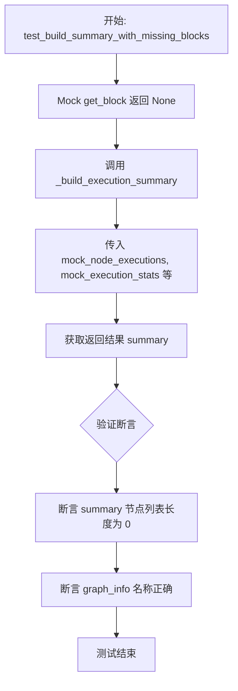

#### 带注释源码

```python
    def test_build_summary_with_missing_blocks(
        self, mock_node_executions, mock_execution_stats
    ):
        """Test building summary when blocks are missing."""
        # 使用 patch 模拟 backend.executor.activity_status_generator.get_block 函数
        with patch(
            "backend.executor.activity_status_generator.get_block"
        ) as mock_get_block:
            # 设置 mock 函数返回 None，模拟 Block 定义缺失的场景
            mock_get_block.return_value = None

            # 调用被测试函数 _build_execution_summary
            # 传入模拟的节点执行数据、统计数据、图名称、描述、空链接列表和 COMPLETED 状态
            summary = _build_execution_summary(
                mock_node_executions,
                mock_execution_stats,
                "Missing Blocks Graph",
                "Test with missing blocks",
                [],
                ExecutionStatus.COMPLETED,
            )

            # 验证结果：由于 Block 缺失，生成的摘要中应当不包含任何节点信息
            assert len(summary["nodes"]) == 0
            # 验证结果：不再有顶级的 errors 字段，错误信息通常包含在节点内；
            # 同时验证图的基本信息（如名称）仍然被正确保留
            assert summary["graph_info"]["name"] == "Missing Blocks Graph"
```


### `TestBuildExecutionSummary.test_build_summary_with_graph_error`

该方法用于测试在存在图级别错误时，`_build_execution_summary` 函数能否正确地构建执行摘要，特别是验证错误信息是否被正确地包含在摘要的整体状态中。

参数：

- `mock_node_executions`：`list`，模拟的节点执行结果列表，包含成功和失败的节点记录。
- `mock_execution_stats_with_graph_error`：`GraphExecutionStats`，包含图级别执行统计信息的对象，其中预设了具体的错误消息（如无效的 API 凭证）。
- `mock_blocks`：`dict`，模拟的块字典，将块 ID 映射到模拟的块对象，用于测试上下文。

返回值：`None`，该方法是一个测试用例，不返回业务数据，仅通过断言验证行为。

#### 流程图

```mermaid
flowchart TD
    A[开始测试: test_build_summary_with_graph_error] --> B[接收 Fixtures: mock_node_executions, mock_execution_stats_with_graph_error, mock_blocks]
    B --> C[Mock get_block 函数<br/>使其返回 mock_blocks 中的数据]
    C --> D[调用 _build_execution_summary<br/>传入参数: 模拟数据, 图状态为 FAILED]
    D --> E[获取返回的 summary 字典]
    E --> F{断言验证}
    F --> G[检查 overall_status['has_errors'] 为 True]
    F --> H[检查 overall_status['graph_error']<br/>是否包含 'Invalid API credentials']
    F --> I[检查 overall_status['total_errors'] 为 1]
    F --> J[检查 overall_status['graph_execution_status'] 为 'FAILED']
    G & H & I & J --> K[测试结束: 断言通过]
```

#### 带注释源码

```python
    def test_build_summary_with_graph_error(
        self, mock_node_executions, mock_execution_stats_with_graph_error, mock_blocks
    ):
        """Test building summary with graph-level error."""
        # 初始化空的链接列表，表示本次测试不关注节点间的链接关系
        mock_links = []

        # 使用 patch 模拟 'get_block' 函数，使其根据 block_id 返回预设的 mock_blocks
        with patch(
            "backend.executor.activity_status_generator.get_block"
        ) as mock_get_block:
            # 设置 side_effect：当调用 get_block(block_id) 时，从 mock_blocks 字典中查找并返回
            mock_get_block.side_effect = lambda block_id: mock_blocks.get(block_id)

            # 调用目标函数 _build_execution_summary
            # 传入包含模拟数据的 fixture，特别是 mock_execution_stats_with_graph_error 包含了图级错误
            # 状态设置为 ExecutionStatus.FAILED
            summary = _build_execution_summary(
                mock_node_executions,
                mock_execution_stats_with_graph_error,
                "Graph with Error",
                "Test with graph error",
                mock_links,
                ExecutionStatus.FAILED,
            )

            # --- 验证阶段 ---

            # 断言：验证整体状态中已标记存在错误
            assert summary["overall_status"]["has_errors"] is True
            
            # 断言：验证整体状态中的错误信息与 fixture 预设的一致
            # 这检查了图级别的错误信息是否被正确提取并放置在 graph_error 字段中
            assert (
                summary["overall_status"]["graph_error"]
                == "Graph execution failed: Invalid API credentials"
            )
            
            # 断言：验证错误计数正确
            assert summary["overall_status"]["total_errors"] == 1
            
            # 断言：验证图的执行状态是否为 FAILED
            assert summary["overall_status"]["graph_execution_status"] == "FAILED"
```


### `TestBuildExecutionSummary.test_build_summary_with_different_error_formats`

测试构建执行摘要时对不同错误格式的处理能力，确保系统能够正确解析显式的错误消息，并在缺失错误信息时提供默认的“Unknown error”描述。

参数：

- `self`：`TestBuildExecutionSummary`，测试类的实例，用于访问测试上下文。
- `mock_execution_stats`：`GraphExecutionStats`，通过 fixture 注入的模拟执行统计数据，用于测试图级别的统计信息。
- `mock_blocks`：`dict`，通过 fixture 注入的模拟 Block 字典，用于映射 Block ID 到 Block 对象。

返回值：`None`，该函数为测试方法，主要通过断言验证逻辑，不返回具体数值。

#### 流程图

```mermaid
flowchart TD
    A[开始] --> B[创建模拟执行数据 mock_executions<br>包含两个失败节点]
    B --> C[配置节点1: 包含明确的字符串错误消息]
    B --> D[配置节点2: 输出数据为空, 缺少错误信息]
    C & D --> E[Patch get_block 函数<br>使用 mock_blocks]
    E --> F[调用 _build_execution_summary<br>生成摘要]
    F --> G[断言检查<br>确认有两个节点包含 recent_errors]
    G --> H[验证节点1错误信息<br>期望匹配 "Simple string error message"]
    H --> I[验证节点2错误信息<br>期望匹配 "Unknown error" 默认值]
    I --> J[测试结束]
```

#### 带注释源码

```python
    def test_build_summary_with_different_error_formats(
        self, mock_execution_stats, mock_blocks
    ):
        """Test building summary with different error formats."""
        # 创建模拟节点执行数据，包含不同格式的错误情况
        mock_executions = [
            # 场景1：输出数据中包含标准的错误字符串列表
            NodeExecutionResult(
                user_id="test_user",
                graph_id="test_graph",
                graph_version=1,
                graph_exec_id="test_exec",
                node_exec_id="111e2222-e89b-12d3-a456-426614174010",
                node_id="333e4444-e89b-12d3-a456-426614174011",
                block_id="process_block_id",
                status=ExecutionStatus.FAILED,
                input_data={},
                output_data={"error": ["Simple string error message"]}, # 明确的错误消息
                add_time=datetime.now(timezone.utc),
                queue_time=None,
                start_time=None,
                end_time=None,
            ),
            # 场景2：输出数据为空，缺少 error 字段
            NodeExecutionResult(
                user_id="test_user",
                graph_id="test_graph",
                graph_version=1,
                graph_exec_id="test_exec",
                node_exec_id="555e6666-e89b-12d3-a456-426614174012",
                node_id="777e8888-e89b-12d3-a456-426614174013",
                block_id="process_block_id",
                status=ExecutionStatus.FAILED,
                input_data={},
                output_data={},  # 没有错误信息的输出
                add_time=datetime.now(timezone.utc),
                queue_time=None,
                start_time=None,
                end_time=None,
            ),
        ]

        # Mock get_block 函数，使其返回预设的 mock_blocks
        with patch(
            "backend.executor.activity_status_generator.get_block"
        ) as mock_get_block:
            mock_get_block.side_effect = lambda block_id: mock_blocks.get(block_id)

            # 调用被测函数 _build_execution_summary 生成摘要
            summary = _build_execution_summary(
                mock_executions,
                mock_execution_stats,
                "Error Test Graph",
                "Testing error formats",
                [],
                ExecutionStatus.FAILED,
            )

            # 验证：检查不同错误格式是否都被正确处理，错误现在位于节点的 recent_errors 字段中
            error_nodes = [n for n in summary["nodes"] if n.get("recent_errors")]
            assert len(error_nodes) == 2 # 应该有2个节点报错

            # 验证字符串错误格式 - 查找截断后的节点 ID
            string_error_node = next(
                n for n in summary["nodes"] if n["node_id"] == "333e4444"  # ID 截断处理
            )
            assert len(string_error_node["recent_errors"]) == 1
            assert (
                string_error_node["recent_errors"][0]["error"]
                == "Simple string error message"
            )

            # 验证无错误输出格式 - 检查是否生成了默认错误消息
            no_error_node = next(
                n for n in summary["nodes"] if n["node_id"] == "777e8888"  # ID 截断处理
            )
            assert len(no_error_node["recent_errors"]) == 1
            assert no_error_node["recent_errors"][0]["error"] == "Unknown error" # 预期默认值
```


### `TestLLMCall.test_structured_llm_call_success`

测试成功的结构化 LLM 调用。该方法通过模拟底层 LLM API 返回包含特定 JSON 字符串的响应，验证 `AIStructuredResponseGeneratorBlock` 能够正确解析 XML 标签中的 JSON 数据，并返回预期的结构化输出。

参数：

-   `self`：`TestLLMCall`，测试类的实例，由 pytest 框架隐式传递。

返回值：`None`，该函数为测试用例，无显式返回值。

#### 流程图

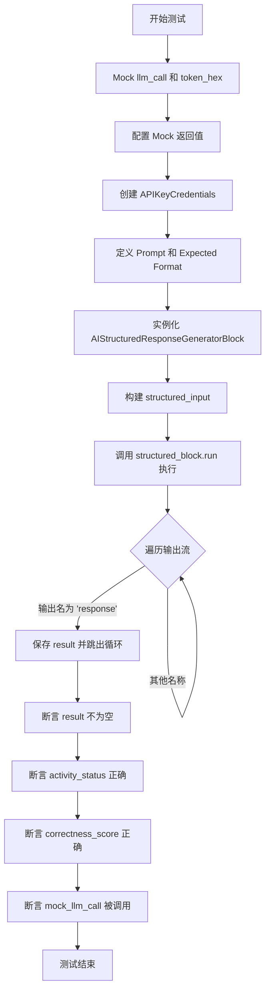

#### 带注释源码

```python
@pytest.mark.asyncio
async def test_structured_llm_call_success(self):
    """Test successful structured LLM call."""
    from pydantic import SecretStr

    from backend.blocks.llm import AIStructuredResponseGeneratorBlock
    from backend.data.model import APIKeyCredentials

    # Patch the LLM call and token generation to control the test environment
    with patch("backend.blocks.llm.llm_call") as mock_llm_call, patch(
        "backend.blocks.llm.secrets.token_hex", return_value="test123"
    ):
        # Configure the mock LLM response to include JSON within XML tags
        mock_llm_call.return_value = LLMResponse(
            raw_response={},
            prompt=[],
            response='<json_output id="test123">{"activity_status": "Test completed successfully", "correctness_score": 0.9}</json_output>',
            tool_calls=None,
            prompt_tokens=50,
            completion_tokens=20,
        )

        # Setup credentials for the API call
        credentials = APIKeyCredentials(
            id="test",
            provider="openai",
            api_key=SecretStr("test_key"),
            title="Test",
        )

        # Define the input prompt and the expected JSON schema format
        prompt = [{"role": "user", "content": "Test prompt"}]
        expected_format = {
            "activity_status": "User-friendly summary",
            "correctness_score": "Float score from 0.0 to 1.0",
        }

        # Create the block instance and prepare the input data object
        structured_block = AIStructuredResponseGeneratorBlock()
        credentials_input = {
            "provider": credentials.provider,
            "id": credentials.id,
            "type": credentials.type,
            "title": credentials.title,
        }

        structured_input = AIStructuredResponseGeneratorBlock.Input(
            prompt=prompt[0]["content"],
            expected_format=expected_format,
            model=LlmModel.GPT4O_MINI,
            credentials=credentials_input,  # type: ignore
        )

        # Execute the block asynchronously and capture the output
        result = None
        async for output_name, output_data in structured_block.run(
            structured_input, credentials=credentials
        ):
            if output_name == "response":
                result = output_data
                break

        # Verify that the result matches the parsed JSON content
        assert result is not None
        assert result["activity_status"] == "Test completed successfully"
        assert result["correctness_score"] == 0.9
        mock_llm_call.assert_called()
```


### `TestLLMCall.test_structured_llm_call_validation_error`

该测试函数用于验证 `AIStructuredResponseGeneratorBlock` 在处理结构化 LLM 调用时，如果返回的 JSON 数据不符合预期的 schema（例如缺少必填字段），是否能正确触发重试机制并在最终失败时抛出异常。它模拟了一个缺失 `correctness_score` 字段的 JSON 响应，并断言代码执行会抛出异常。

参数：

- `self`：`TestLLMCall`，测试类的实例，用于访问测试上下文和 pytest 功能。

返回值：`None`，该函数是一个测试用例，没有返回值，主要通过断言和 `pytest.raises` 来验证行为。

#### 流程图

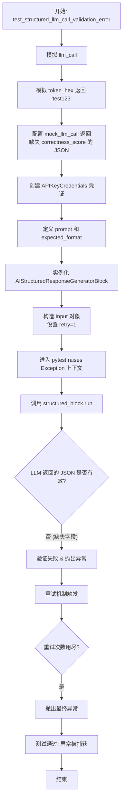

#### 带注释源码

```python
@pytest.mark.asyncio
async def test_structured_llm_call_validation_error(self):
    """Test structured LLM call with validation error."""
    from pydantic import SecretStr

    from backend.blocks.llm import AIStructuredResponseGeneratorBlock
    from backend.data.model import APIKeyCredentials

    # Patch 后端 LLM 调用函数和 token 生成函数，以便控制测试环境
    with patch("backend.blocks.llm.llm_call") as mock_llm_call, patch(
        "backend.blocks.llm.secrets.token_hex", return_value="test123"
    ):
        # 模拟 LLM 返回一个不完整的 JSON 响应，缺少 'correctness_score' 字段
        # 这将导致后续的 Pydantic 模型验证失败
        mock_llm_call.return_value = LLMResponse(
            raw_response={},
            prompt=[],
            response='<json_output id="test123">{"activity_status": "Test completed successfully"}</json_output>',
            tool_calls=None,
            prompt_tokens=50,
            completion_tokens=20,
        )

        # 创建测试用的 API 凭证
        credentials = APIKeyCredentials(
            id="test",
            provider="openai",
            api_key=SecretStr("test_key"),
            title="Test",
        )

        # 定义提示词和预期的格式（包含两个字段）
        prompt = [{"role": "user", "content": "Test prompt"}]
        expected_format = {
            "activity_status": "User-friendly summary",
            "correctness_score": "Float score from 0.0 to 1.0",
        }

        # 实例化结构化响应生成器 Block
        structured_block = AIStructuredResponseGeneratorBlock()
        credentials_input = {
            "provider": credentials.provider,
            "id": credentials.id,
            "type": credentials.type,
            "title": credentials.title,
        }

        # 构造 Block 的输入数据，设置 retry 为 1 以加快测试速度
        structured_input = AIStructuredResponseGeneratorBlock.Input(
            prompt=prompt[0]["content"],
            expected_format=expected_format,
            model=LlmModel.GPT4O_MINI,
            credentials=credentials_input,  # type: ignore
            retry=1,  # Use fewer retries for faster test
        )

        # 验证代码块在验证失败时会抛出异常
        # 由于返回的 JSON 缺少必填字段 'correctness_score'，验证逻辑应失败并重试，
        # 重试次数耗尽后应抛出异常
        with pytest.raises(
            Exception
        ):  # AIStructuredResponseGeneratorBlock may raise different exceptions
            async for output_name, output_data in structured_block.run(
                structured_input, credentials=credentials
            ):
                if output_name == "response":
                    break
```


### `TestGenerateActivityStatusForExecution.test_generate_status_success`

测试在功能启用且提供有效模拟数据的情况下，成功生成活动状态的流程。验证了`generate_activity_status_for_execution`函数是否能正确调用数据库客户端获取节点执行信息、图元数据和图链接，并利用模拟的LLM块生成预期的状态摘要和正确性评分。

参数：

-   `self`：`TestGenerateActivityStatusForExecution`，测试类的实例。
-   `mock_node_executions`：`list[NodeExecutionResult]`，模拟的节点执行结果列表，包含成功、失败等多种状态的数据。
-   `mock_execution_stats`：`GraphExecutionStats`，模拟的图执行统计数据，包含耗时、成本等信息。
-   `mock_blocks`：`dict`，模拟的块字典，包含块ID到块对象的映射。

返回值：`None`，该方法为测试函数，通过断言验证逻辑，无返回值。

#### 流程图

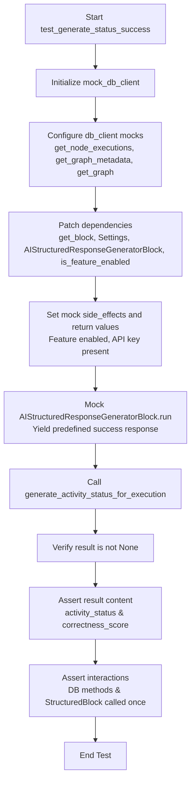

#### 带注释源码

```python
@pytest.mark.asyncio
async def test_generate_status_success(
    self, mock_node_executions, mock_execution_stats, mock_blocks
):
    """Test successful activity status generation."""
    # 1. 初始化模拟数据库客户端
    mock_db_client = AsyncMock()
    # 配置 get_node_executions 返回预定义的节点执行数据
    mock_db_client.get_node_executions.return_value = mock_node_executions

    # 配置图元数据
    mock_graph_metadata = MagicMock()
    mock_graph_metadata.name = "Test Agent"
    mock_graph_metadata.description = "A test agent"
    mock_db_client.get_graph_metadata.return_value = mock_graph_metadata

    # 配置图数据（包含链接）
    mock_graph = MagicMock()
    mock_graph.links = []
    mock_db_client.get_graph.return_value = mock_graph

    # 2. 使用 patch 模拟外部依赖和配置
    with patch(
        "backend.executor.activity_status_generator.get_block"
    ) as mock_get_block, patch(
        "backend.executor.activity_status_generator.Settings"
    ) as mock_settings, patch(
        "backend.executor.activity_status_generator.AIStructuredResponseGeneratorBlock"
    ) as mock_structured_block, patch(
        "backend.executor.activity_status_generator.is_feature_enabled",
        return_value=True,
    ):

        # 设置 get_block 根据块ID返回对应的模拟块
        mock_get_block.side_effect = lambda block_id: mock_blocks.get(block_id)
        # 设置模拟的 Settings 返回有效的 API Key
        mock_settings.return_value.secrets.openai_internal_api_key = "test_key"

        # 获取 AIStructuredResponseGeneratorBlock 的模拟实例
        mock_instance = mock_structured_block.return_value

        # 定义模拟的异步 run 方法，模拟 LLM 返回成功响应
        async def mock_run(*args, **kwargs):
            yield "response", {
                "activity_status": "I analyzed your data and provided the requested insights.",
                "correctness_score": 0.85,
            }

        mock_instance.run = mock_run

        # 3. 调用被测试的异步函数
        result = await generate_activity_status_for_execution(
            graph_exec_id="test_exec",
            graph_id="test_graph",
            graph_version=1,
            execution_stats=mock_execution_stats,
            db_client=mock_db_client,
            user_id="test_user",
        )

        # 4. 验证结果不为空，且内容符合预期
        assert result is not None
        assert (
            result["activity_status"]
            == "I analyzed your data and provided the requested insights."
        )
        assert result["correctness_score"] == 0.85
        
        # 5. 验证数据库查询方法和结构化块被正确调用
        mock_db_client.get_node_executions.assert_called_once()
        mock_db_client.get_graph_metadata.assert_called_once()
        mock_db_client.get_graph.assert_called_once()
        mock_structured_block.assert_called_once()
```


### `TestGenerateActivityStatusForExecution.test_generate_status_feature_disabled`

该测试用例用于验证当活动状态生成功能被禁用（即 `is_feature_enabled` 返回 `False`）时，`generate_activity_status_for_execution` 函数的行为是否符合预期。测试确保在此场景下，该函数不执行任何数据库查询操作，并直接返回 `None`，以验证功能开关的有效性及资源的节省。

参数：

- `self`：`TestGenerateActivityStatusForExecution`，测试类的实例。
- `mock_execution_stats`：`GraphExecutionStats`，通过 pytest fixture 注入的模拟图执行统计数据对象。

返回值：`None`，作为测试方法，本身不返回业务数据，主要作用是通过断言验证被测函数的逻辑。

#### 流程图

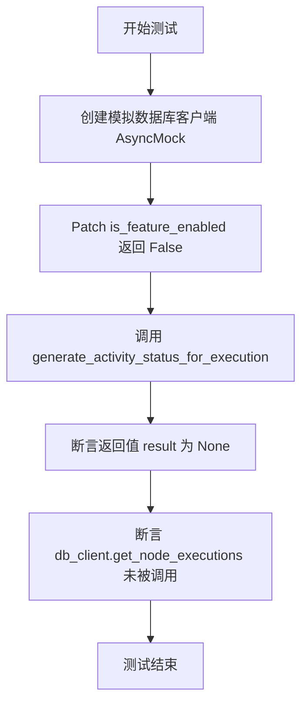

#### 带注释源码

```python
@pytest.mark.asyncio
async def test_generate_status_feature_disabled(self, mock_execution_stats):
    """Test activity status generation when feature is disabled."""
    # 创建一个模拟的数据库客户端对象
    mock_db_client = AsyncMock()

    # 使用 patch 装饰器/上下文管理器模拟 is_feature_enabled 函数
    # 设置其返回值为 False，模拟功能禁用的情况
    with patch(
        "backend.executor.activity_status_generator.is_feature_enabled",
        return_value=False,
    ):
        # 调用目标异步函数，传入测试参数
        result = await generate_activity_status_for_execution(
            graph_exec_id="test_exec",
            graph_id="test_graph",
            graph_version=1,
            execution_stats=mock_execution_stats,
            db_client=mock_db_client,
            user_id="test_user",
        )

        # 断言：在功能禁用时，预期结果应为 None
        assert result is None

        # 断言：验证数据库客户端的 get_node_executions 方法从未被调用
        # 这确保了功能禁用时不会执行昂贵的数据库查询
        mock_db_client.get_node_executions.assert_not_called()
```


### `TestGenerateActivityStatusForExecution.test_generate_status_no_api_key`

该测试用例验证了在系统配置中缺少 OpenAI API 密钥的情况下，活动状态生成函数能够正确处理异常情况，提前终止流程并返回 `None`，同时避免不必要的数据库查询操作。

参数：

-  `self`：`TestGenerateActivityStatusForExecution`，测试类实例的引用，用于访问测试上下文和 fixtures。
-  `mock_execution_stats`：`GraphExecutionStats`，模拟的图执行统计数据对象，包含执行时间、成本等信息，作为被测函数的输入参数。

返回值：`None`，这是一个异步测试方法，主要用于验证被测函数的行为是否符合预期，自身无实质性返回值。

#### 流程图

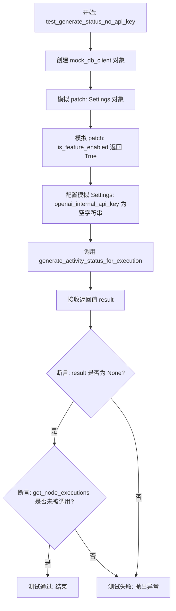

#### 带注释源码

```python
    @pytest.mark.asyncio
    async def test_generate_status_no_api_key(self, mock_execution_stats):
        """Test activity status generation with no API key."""
        # 1. 创建一个模拟的数据库客户端
        mock_db_client = AsyncMock()

        # 2. 使用 patch 模拟外部依赖：Settings 和 is_feature_enabled
        with patch(
            "backend.executor.activity_status_generator.Settings"
        ) as mock_settings, patch(
            "backend.executor.activity_status_generator.is_feature_enabled",
            return_value=True,  # 假设功能开关是开启的
        ):
            # 3. 配置模拟的 Settings 返回空的 API Key，测试无密钥场景
            mock_settings.return_value.secrets.openai_internal_api_key = ""

            # 4. 调用被测函数 generate_activity_status_for_execution
            result = await generate_activity_status_for_execution(
                graph_exec_id="test_exec",
                graph_id="test_graph",
                graph_version=1,
                execution_stats=mock_execution_stats,
                db_client=mock_db_client,
                user_id="test_user",
            )

            # 5. 断言：在没有 API Key 的情况下，函数应返回 None
            assert result is None
            # 6. 断言：由于 API Key 缺失，函数应提前返回，不应调用数据库查询方法
            mock_db_client.get_node_executions.assert_not_called()
```


### `TestGenerateActivityStatusForExecution.test_generate_status_exception_handling`

该测试方法用于验证 `generate_activity_status_for_execution` 函数在发生运行时异常（如数据库错误）时的容错能力，确保函数能优雅地返回 `None` 而不是抛出未捕获的异常。

参数：

- `self`：`TestGenerateActivityStatusForExecution`，测试类的实例，用于访问测试上下文。
- `mock_execution_stats`：`GraphExecutionStats`，通过 pytest fixture 注入的模拟执行统计数据对象，用于测试输入。

返回值：`None`，该方法为测试用例，无直接返回值，主要用于断言验证。

#### 流程图

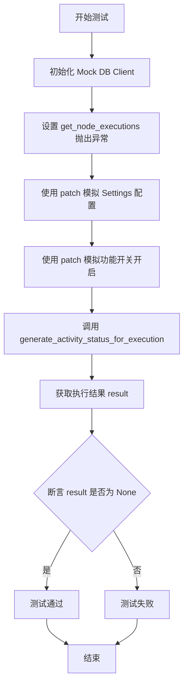

#### 带注释源码

```python
    @pytest.mark.asyncio
    async def test_generate_status_exception_handling(self, mock_execution_stats):
        """Test activity status generation with exception."""
        # 创建模拟的数据库客户端对象
        mock_db_client = AsyncMock()
        # 设置 get_node_executions 方法在被调用时抛出异常，模拟数据库连接或查询失败的场景
        mock_db_client.get_node_executions.side_effect = Exception("Database error")

        with patch(
            "backend.executor.activity_status_generator.Settings"
        ) as mock_settings, patch(
            "backend.executor.activity_status_generator.is_feature_enabled",
            return_value=True,
        ):
            # 模拟配置对象，返回一个测试用的 API Key，以满足函数执行的前提条件
            mock_settings.return_value.secrets.openai_internal_api_key = "test_key"

            # 调用目标函数 generate_activity_status_for_execution
            # 传入模拟的执行 ID、图 ID、版本、统计信息、数据库客户端和用户 ID
            result = await generate_activity_status_for_execution(
                graph_exec_id="test_exec",
                graph_id="test_graph",
                graph_version=1,
                execution_stats=mock_execution_stats,
                db_client=mock_db_client,
                user_id="test_user",
            )

            # 断言验证：由于数据库操作抛出了异常，预期函数应捕获错误并返回 None，而不是向上抛出异常
            assert result is None
```


### `TestGenerateActivityStatusForExecution.test_generate_status_with_graph_name_fallback`

该测试用例验证了当数据库无法获取图元数据（`get_graph_metadata` 返回 `None`）且无法获取图定义（`get_graph` 返回 `None`）时，`generate_activity_status_for_execution` 函数能否正确处理这种回退情况，并依然成功生成活动状态，确保系统的健壮性。

参数：

-  `self`：`TestGenerateActivityStatusForExecution`，测试类的实例。
-  `mock_node_executions`：`list[NodeExecutionResult]`，模拟的节点执行结果列表，包含成功和失败状态的节点数据。
-  `mock_execution_stats`：`GraphExecutionStats`，模拟的图执行统计数据，包含执行时间、CPU时间、成本等信息。
-  `mock_blocks`：`dict`，模拟的块字典，键为块ID，值为模拟的块对象（MagicMock）。

返回值：`None`，该方法为测试函数，不返回值，主要通过断言验证行为。

#### 流程图

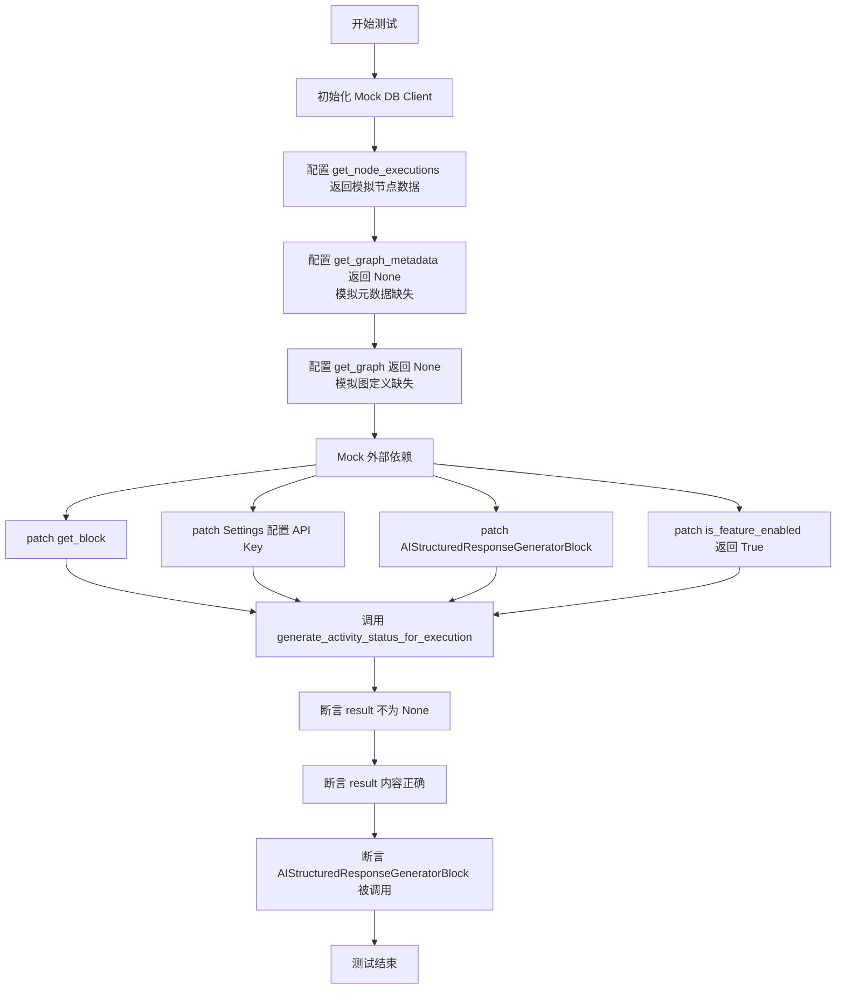

#### 带注释源码

```python
    @pytest.mark.asyncio
    async def test_generate_status_with_graph_name_fallback(
        self, mock_node_executions, mock_execution_stats, mock_blocks
    ):
        """Test activity status generation with graph name fallback."""
        # 1. 初始化模拟数据库客户端
        mock_db_client = AsyncMock()
        # 配置 get_node_executions 返回预定义的模拟节点执行数据
        mock_db_client.get_node_executions.return_value = mock_node_executions
        
        # 关键测试点：模拟 get_graph_metadata 返回 None（无法获取元数据）
        mock_db_client.get_graph_metadata.return_value = None  
        # 关键测试点：模拟 get_graph 返回 None（无法获取图结构）
        mock_db_client.get_graph.return_value = None  

        # 2. 使用 patch 上下文管理器替换外部依赖
        with patch(
            "backend.executor.activity_status_generator.get_block"
        ) as mock_get_block, patch(
            "backend.executor.activity_status_generator.Settings"
        ) as mock_settings, patch(
            "backend.executor.activity_status_generator.AIStructuredResponseGeneratorBlock"
        ) as mock_structured_block, patch(
            "backend.executor.activity_status_generator.is_feature_enabled",
            return_value=True,
        ):
            # 配置 get_block 根据ID返回对应的模拟块
            mock_get_block.side_effect = lambda block_id: mock_blocks.get(block_id)
            # 配置 Settings 返回模拟的 API Key
            mock_settings.return_value.secrets.openai_internal_api_key = "test_key"

            # Mock AIStructuredResponseGeneratorBlock 实例
            mock_instance = mock_structured_block.return_value

            # 定义模拟的异步生成器运行逻辑
            async def mock_run(*args, **kwargs):
                yield "response", {
                    "activity_status": "Agent completed execution.",
                    "correctness_score": 0.8,
                }

            mock_instance.run = mock_run

            # 3. 调用目标函数 generate_activity_status_for_execution
            result = await generate_activity_status_for_execution(
                graph_exec_id="test_exec",
                graph_id="test_graph",
                graph_version=1,
                execution_stats=mock_execution_stats,
                db_client=mock_db_client,
                user_id="test_user",
            )

            # 4. 验证结果：即使图元数据缺失，仍应生成结果
            assert result is not None
            assert result["activity_status"] == "Agent completed execution."
            assert result["correctness_score"] == 0.8
            # 验证结构化块已被实例化，说明流程走到了LLM生成阶段
            assert mock_structured_block.called
```


### `TestIntegration.test_full_integration_flow`

这是一个异步集成测试方法，用于验证生成活动状态功能的完整端到端流程。它模拟了数据库交互、模块检索以及大语言模型（LLM）的调用过程，以确保系统能够正确处理包含成功和失败节点的执行数据，并生成预期格式的活动状态摘要。

参数：

-  `self`：`TestIntegration`，测试类的实例引用。
-  `mock_node_executions`：`List[NodeExecutionResult]`，Pytest fixture，提供模拟的节点执行数据列表，包含成功和失败状态的节点。
-  `mock_execution_stats`：`GraphExecutionStats`，Pytest fixture，提供模拟的图执行统计数据（如运行时间、成本、错误计数）。
-  `mock_blocks`：`Dict[str, MagicMock]`，Pytest fixture，提供模拟的区块定义，用于在构建执行摘要时获取区块元数据。

返回值：`None`，作为测试函数，通过断言来验证行为，不返回实际值。

#### 流程图

```mermaid
flowchart TD
    A[Start: test_full_integration_flow] --> B[Initialize Mock DB Client & Objects]
    B --> C[Configure Mock DB Methods<br/>(get_node_executions, get_graph_metadata, etc.)]
    C --> D[Define Expected Activity Status String]
    D --> E[Enter Patch Context<br/>(get_block, Settings, LLM Block, is_feature_enabled)]
    E --> F[Configure Patch Behaviors<br/>(API Key, Block Mapping, Feature Flag)]
    F --> G[Mock LLM Block Run Method<br/>(Yield expected response & score)]
    G --> H[Call generate_activity_status_for_execution<br/>(System Under Test)]
    H --> I[Execute Assertions]
    I --> J{Check Result Validity}
    J -->|Assertions Pass| K[Test Success]
    J -->|Assertions Fail| L[Test Failure]
```

#### 带注释源码

```python
    @pytest.mark.asyncio
    async def test_full_integration_flow(
        self, mock_node_executions, mock_execution_stats, mock_blocks
    ):
        """Test the complete integration flow."""
        # 1. 初始化模拟数据库客户端
        mock_db_client = AsyncMock()
        # 配置 get_node_executions 方法返回预设的模拟节点执行数据
        mock_db_client.get_node_executions.return_value = mock_node_executions

        # 2. 初始化模拟的图元数据
        mock_graph_metadata = MagicMock()
        mock_graph_metadata.name = "Test Integration Agent"
        mock_graph_metadata.description = "Integration test agent"
        mock_db_client.get_graph_metadata.return_value = mock_graph_metadata

        # 3. 初始化模拟的图对象及其链接
        mock_graph = MagicMock()
        mock_graph.links = []
        mock_db_client.get_graph.return_value = mock_graph

        # 4. 定义预期的活动状态描述字符串
        expected_activity = "I processed user input but failed during final output generation due to system error."

        # 5. 使用 patch 装饰器或上下文管理器替换外部依赖
        with patch(
            "backend.executor.activity_status_generator.get_block"
        ) as mock_get_block, patch(
            "backend.executor.activity_status_generator.Settings"
        ) as mock_settings, patch(
            "backend.executor.activity_status_generator.AIStructuredResponseGeneratorBlock"
        ) as mock_structured_block, patch(
            "backend.executor.activity_status_generator.is_feature_enabled",
            return_value=True,
        ):

            # 6. 配置 get_block 的副作用，使其根据 block_id 返回对应的模拟 block
            mock_get_block.side_effect = lambda block_id: mock_blocks.get(block_id)
            # 配置 Settings 返回模拟的 API Key
            mock_settings.return_value.secrets.openai_internal_api_key = "test_key"

            # 7. 模拟 LLM 结构化响应生成块的实例
            mock_instance = mock_structured_block.return_value

            # 8. 定义模拟的 run 异步生成器函数，模拟 LLM 返回预期结果
            async def mock_run(*args, **kwargs):
                yield "response", {
                    "activity_status": expected_activity,
                    "correctness_score": 0.3,  # 低分表示存在失败
                }

            mock_instance.run = mock_run

            # 9. 调用被测试的核心函数 generate_activity_status_for_execution
            result = await generate_activity_status_for_execution(
                graph_exec_id="test_exec",
                graph_id="test_graph",
                graph_version=1,
                execution_stats=mock_execution_stats,
                db_client=mock_db_client,
                user_id="test_user",
            )

            # 10. 执行断言，验证返回结果的正确性
            assert result is not None
            assert result["activity_status"] == expected_activity
            assert result["correctness_score"] == 0.3

            # 11. 验证模拟的 LLM Block 是否被正确调用
            assert mock_structured_block.called
            # The structured block should have been instantiated
            mock_structured_block.assert_called_once()
```


### `TestIntegration.test_manager_integration_with_disabled_feature`

该测试用例验证了当活动状态生成功能被禁用时，`generate_activity_status_for_execution` 函数的集成行为。它确保在功能开关关闭的情况下，系统正确地返回 `None`，并且不会执行任何不必要的数据库查询操作。

参数：

- `self`：`TestIntegration`，测试类实例本身。
- `mock_execution_stats`：`GraphExecutionStats`，通过 pytest 注入的 fixture，提供模拟的图执行统计数据。

返回值：`None`，该方法作为测试用例，主要用于验证逻辑断言，无显式返回值。

#### 流程图

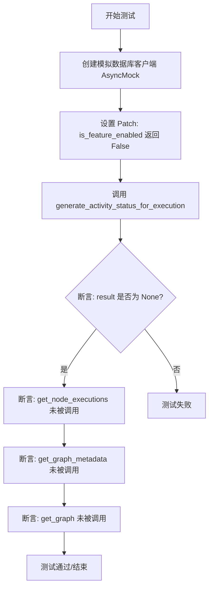

#### 带注释源码

```python
@pytest.mark.asyncio
async def test_manager_integration_with_disabled_feature(
    self, mock_execution_stats
):
    """Test that when feature returns None, manager doesn't set activity_status."""
    # 1. 初始化模拟数据库客户端
    mock_db_client = AsyncMock()

    # 2. 模拟功能开关配置为禁用状态 (return_value=False)
    with patch(
        "backend.executor.activity_status_generator.is_feature_enabled",
        return_value=False,
    ):
        # 3. 调用核心业务函数 generate_activity_status_for_execution
        result = await generate_activity_status_for_execution(
            graph_exec_id="test_exec",
            graph_id="test_graph",
            graph_version=1,
            execution_stats=mock_execution_stats,
            db_client=mock_db_client,
            user_id="test_user",
        )

        # 4. 验证函数返回值为 None，符合功能禁用时的预期
        assert result is None

        # 5. 验证数据库未发生任何读取操作，确保功能禁用时无资源浪费
        mock_db_client.get_node_executions.assert_not_called()
        mock_db_client.get_graph_metadata.assert_not_called()
        mock_db_client.get_graph.assert_not_called()
```


## 关键组件


### 执行摘要构建器
聚合节点执行结果、图元数据和统计信息以生成结构化执行摘要。

### 活动状态生成器
协调基于执行摘要生成活动状态的过程，包括功能检查和配置验证。

### 结构化 LLM 响应块
利用大语言模型将执行数据转换为结构化、用户友好的状态消息。

### 测试模拟与夹具
提供模拟节点执行、统计和块元数据的隔离测试环境，用于验证核心逻辑。


## 问题及建议


### 已知问题

-   **异常处理不够精细**: 在 `test_structured_llm_call_validation_error` 测试中使用了通用的 `Exception` 捕获，并带有注释说明可能抛出不同的异常。这表明代码缺乏明确的异常类型定义（如 `ValidationError` 或 `LLMError`），使得上层调用无法针对特定错误类型进行精准处理或重试。
-   **UUID 截断导致的数据映射风险**: 测试代码中显式验证了 UUID 被截断为第一段（如 `456e7890`）。虽然这可能是为了前端显示优化，但在后端摘要数据结构中使用截断 ID 作为键值会导致数据完整性受损，且在极少数情况下存在 ID 前缀冲突的风险，同时增加了将摘要结果回溯关联到原始执行记录的难度。
-   **魔法字符串硬编码**: 测试断言中大量硬编码了状态字符串（如 "COMPLETED", "FAILED"），而非引用 `ExecutionStatus` 枚举。这种做法会导致测试代码与业务逻辑定义强耦合，一旦枚举值变更，测试将全部失效。
-   **全局状态依赖严重**: 测试初始化需要对 `Settings`, `get_block`, `is_feature_enabled` 等多个全局模块或单例进行 patch，反映出被测模块（`activity_status_generator`）与外部环境耦合度过高，不仅增加了单元测试的复杂度，也降低了代码的可测试性和模块化程度。

### 优化建议

-   **引入依赖注入模式**: 建议重构 `generate_activity_status_for_execution` 及相关函数，将配置（Settings）、特性开关服务、Block 获取器等作为依赖参数传入，而非直接在函数内部调用全局引用。这将显著减少测试中的 Mock 样板代码，并提升代码的模块化程度。
-   **细化异常类型定义**: 明确区分 JSON 解析失败、Pydantic 校验失败、LLM 调用超时等异常场景，定义并抛出具体的异常类。上层逻辑可根据不同的异常类型执行差异化的错误处理策略（如重试、降级或记录特定日志）。
-   **保持 ID 的完整性或提供双向映射**: 建议在生成的摘要数据结构中保留完整的 UUID，或者在返回截断 ID 的同时提供一份完整的 ID 映射表。这能确保数据的可追溯性，避免因 ID 信息丢失导致的数据关联问题。
-   **使用枚举值进行断言**: 统一在测试代码中使用 `ExecutionStatus` 等枚举常量替代魔法字符串，确保测试语义清晰，并能在业务枚举定义变更时利用 IDE 工具自动重构，提高维护性。
-   **封装 Mock 数据构建逻辑**: 针对 `NodeExecutionResult` 和 `GraphExecutionStats` 等复杂对象的创建，建议提取为独立的工厂函数或 Pytest Fixture，以简化测试用例的数据准备部分，使测试逻辑更加聚焦于业务行为本身。


## 其它


### 设计目标与约束

**设计目标**：
1.  **自动化状态总结**：自动分析图执行的节点日志、统计数据和错误信息，生成易于理解的活动状态摘要和正确性评分，减少人工分析成本。
2.  **非阻塞与异步性**：状态生成过程必须异步执行，且不能阻塞或影响主业务逻辑的执行流程。
3.  **健壮性与容错性**：生成器自身的失败（如 LLM 服务不可用、数据库超时）绝不能导致图执行被标记为失败，系统应具备降级处理能力。
4.  **数据一致性**：生成的摘要需准确反映节点执行的实际状态，包括成功/失败计数及具体的错误信息。

**约束条件**：
1.  **功能开关控制**：必须通过 `is_feature_enabled` 进行全局控制，允许在不部署代码的情况下开启或关闭该功能。
2.  **API Key 依赖**：功能依赖于配置的内部 OpenAI API Key (`openai_internal_api_key`)，若未配置则自动跳过执行。
3.  **性能开销**：由于涉及 LLM 调用，存在一定的延迟和 token 成本，应仅在有明确需求时触发，并对重试逻辑进行限制（如测试中体现的 `retry=1`）。
4.  **数据隐私**：在发送数据给 LLM 时，需确保敏感信息已被过滤或脱敏（当前实现中直接传入 `input_data` 和 `output_data`，依赖业务层数据的清洁度）。

### 错误处理与异常设计

**异常处理策略**：
1.  **全链路捕获**：在 `generate_activity_status_for_execution` 主流程中，所有数据库查询 (`get_node_executions`, `get_graph_metadata`) 和 LLM 调用环节均被包裹在异常捕获逻辑中。任何异常发生时，函数返回 `None` 并静默失败，保证上游业务不受影响。
2.  **降级处理**：
    *   **功能禁用**：若特性开关关闭，直接返回 `None`，不进行后续任何数据库或计算操作。
    *   **配置缺失**：若 API Key 为空，直接返回 `None`。
    *   **数据缺失**：若图元数据或图结构缺失，构建摘要时使用默认值或空列表，不抛出异常。
3.  **LLM 验证错误**：
    *   当 `AIStructuredResponseGeneratorBlock` 接收到 LLM 返回的 JSON 不符合 `expected_format`（例如缺少 `correctness_score` 字段）时，会触发验证异常。
    *   系统内置了重试机制（通过 `retry` 参数控制），若多次重试仍失败，则抛出异常，最终被主流程捕获并返回 `None`。
4.  **错误信息归一化**：
    *   在 `_build_execution_summary` 中，针对不同格式的错误数据（字符串、字典、空值）进行了统一处理。无论 `output_data` 中的 `error` 字段是何种格式，均被提取并标准化为 `recent_errors` 列表中的结构化对象。
    *   对于无法识别的错误格式，默认为 "Unknown error"。

### 数据流与状态机

**数据流**：
系统的核心数据流是从数据库获取原始执行数据，经过结构化处理，输入给 LLM，最终返回结构化状态。

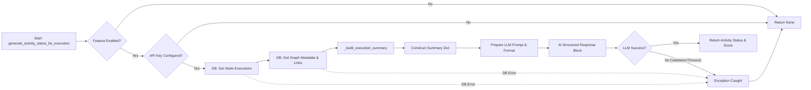

**状态机逻辑**：
虽然没有显式的有限状态机（FSM）类，但函数 `generate_activity_status_for_execution` 描述了以下状态流转：
1.  **Idle**：函数入口。
2.  **Checking Config**：检查 Feature Flag 和 API Key。
3.  **Fetching Data**：并发或顺序从数据库获取执行详情和图定义。
4.  **Processing**：汇总数据，构建摘要。
5.  **Generating**：调用 LLM 生成结果。
6.  **Completed**：成功返回结果。
7.  **Failed/Aborted**：任何步骤发生异常或条件不满足，直接跳转到结束状态并返回 `None`，不会回滚。

### 外部依赖与接口契约

**外部依赖**：
1.  **Database (Client)**：
    *   **接口**：`get_node_executions(graph_exec_id)`, `get_graph_metadata(graph_id, version)`, `get_graph(graph_id, version)`。
    *   **契约**：期望返回包含执行状态、时间戳、输入输出数据的 `NodeExecutionResult` 对象列表，以及包含图名称、描述和节点链接的元数据对象。若数据不存在，应返回空列表或 None，不应抛出未处理的异常。
2.  **LLM Service (OpenAI)**：
    *   **接口**：通过 `backend.blocks.llm.llm_call` 间接调用。
    *   **契约**：需要提供一个符合 `LlmModel`（如 GPT4O_MINI）的端点。API 必须支持结构化输出（通过 Prompt 引导），返回包含 JSON 的文本。响应时间需在超时限制内。
3.  **Internal Modules**：
    *   `backend.blocks.llm.AIStructuredResponseGeneratorBlock`：负责实际的 Prompt 构造和模型调用。
    *   `backend.executor.activity_status_generator.get_block`：用于获取 Block 的元数据（名称、描述）。

**接口契约**：
*   **输入契约**：`generate_activity_status_for_execution` 要求必须提供有效的 `graph_exec_id` 和 `user_id`。虽然部分参数（如 `graph_version`）可能用于数据库查询，但它们被视为可选或通过上下文推断的辅助参数。
*   **输出契约**：函数成功时返回一个字典，格式严格为 `{"activity_status": str, "correctness_score": float}`。失败时返回 `None`。调用方必须处理 `None` 的情况。
*   **配置契约**：`Settings` 对象必须包含 `secrets.openai_internal_api_key` 字段，且该值必须为非空字符串才能激活 LLM 功能。


    