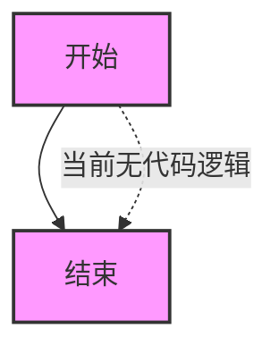
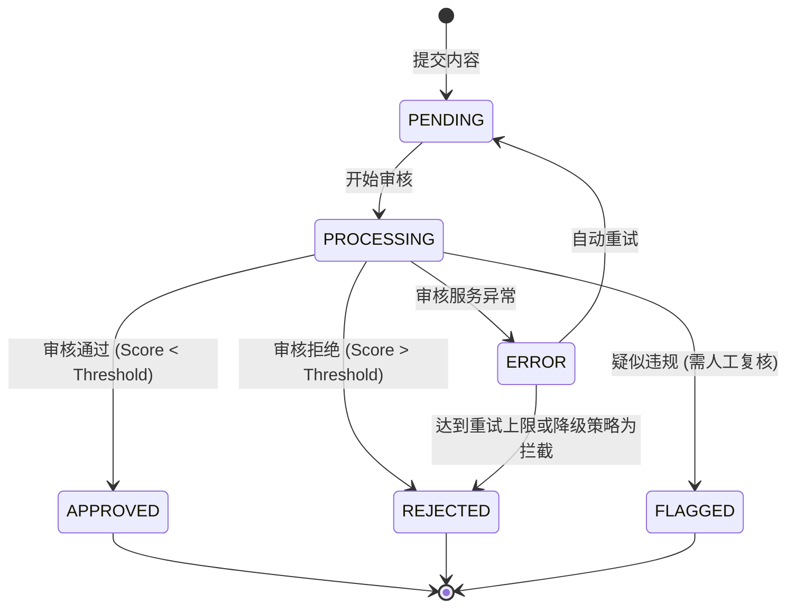

# `.\AutoGPT\autogpt_platform\backend\backend\executor\automod\__init__.py` 详细设计文档

该源代码目前仅包含一行注释，描述了文件的预期用途是集成 AutoMod 服务以进行内容审核，但尚未包含任何具体的代码实现、类定义、变量或函数逻辑。

## 整体流程



## 类结构

```
无类层次结构定义
```

## 全局变量及字段


    

## 全局函数及方法


## 关键组件


### AutoMod
Integration module designed for content moderation.


## 问题及建议


### 已知问题

-   **代码实现缺失**：当前代码仅为注释占位符，未包含任何实际的集成逻辑、类定义或函数实现。
-   **缺少依赖声明**：未指明具体使用的第三方审核服务（如 Perspective API, OpenAI Moderation, 或自定义模型）及其 SDK 依赖。
-   **错误处理机制未定义**：未设计当审核服务不可用或超时的降级处理逻辑。

### 优化建议

-   **异步处理架构**：建议采用消息队列（如 RabbitMQ, Kafka）或后台任务（如 Celery, Redis Queue）进行异步审核，避免阻塞用户主流程，提升系统响应速度。
-   **引入策略模式**：建议设计可插拔的审核策略接口，便于支持多家审核服务商切换或多规则组合，避免代码与特定服务强耦合。
-   **配置化管理**：建议将审核阈值、拦截规则、白名单等配置外置（如数据库或配置中心），支持运行时动态调整，无需重新部署服务。
-   **审核结果缓存**：建议引入缓存机制（如 Redis），对相同内容哈希或已标记用户的审核结果进行缓存，以减少重复的 API 调用，降低成本。
-   **建立人机结合流程**：建议预留人工审核接口，处理机器审核不确定的“灰色地带”内容，并支持用户申诉流程。


## 其它


### 设计目标与约束

**设计目标：**
1.  **高可用性与稳定性**：确保内容审核服务不影响核心业务流程，在 AutoMod 服务不可用时具备降级处理能力。
2.  **低延迟**：审核请求的处理延迟应控制在合理范围内（例如 < 500ms），以保证用户交互的实时性。
3.  **准确性**：准确识别并拦截违规内容（如垃圾信息、仇恨言论、色情内容等），支持自定义审核规则。
4.  **可扩展性**：架构设计需支持未来接入其他第三方审核服务或自建模型的混合部署。

**设计约束：**
1.  **API 限制**：必须严格遵守 AutoMod 第三方服务的 QPS（每秒查询率）限制和配额，避免被限流或封禁。
2.  **数据隐私**：传输给 AutoMod 的数据必须符合 GDPR、CCPA 等数据保护法规，敏感信息需脱敏处理。
3.  **网络依赖**：系统高度依赖外部网络连接，需处理网络抖动和超时情况。
4.  **兼容性**：需兼容现有业务系统的数据格式和接口标准，尽量减少对现有代码的侵入式修改。

### 错误处理与异常设计

**异常分类：**
1.  **网络异常**：连接超时、DNS 解析失败、SSL 证书错误。
2.  **服务端异常**：AutoMod 返回 5xx 错误、服务不可用。
3.  **客户端异常**：请求参数错误（4xx）、认证失败、配额超限。
4.  **业务逻辑异常**：审核结果解析失败、内容长度超限。

**处理策略：**
1.  **重试机制**：对于网络抖动或 5xx 错误，采用指数退避算法进行自动重试（例如：重试 3 次，间隔 1s, 2s, 4s）。
2.  **熔断降级**：当错误率超过阈值（如 50%）时，触发熔断机制，暂时停止调用 AutoMod，并根据业务策略选择“放行”或“全部拦截”（通常为了安全起见选择“全部拦截”或转入人工审核）。
3.  **日志记录**：所有异常必须记录详细的上下文信息（请求 ID、时间戳、错误堆栈、原始请求数据脱敏后），以便排查问题。
4.  **监控告警**：关键错误（如认证失败、熔断触发）需实时触发告警通知运维人员。

### 数据流与状态机

**数据流：**
1.  **输入**：业务系统生成用户内容（文本/图片）。
2.  **预处理**：格式化数据，提取元数据，计算签名。
3.  **传输**：通过 HTTPS 请求发送至 AutoMod API。
4.  **分析**：AutoMod 服务进行内容扫描。
5.  **响应**：接收审核结果（分数/标签）。
6.  **后处理**：根据预设阈值映射为通过/拒绝/需人工审核状态。
7.  **输出**：将决策结果返回给业务系统执行。

**状态机：**


### 外部依赖与接口契约

**外部依赖：**
1.  **AutoMod API Service**：提供内容审核能力的第三方 SaaS 服务。
2.  **配置中心**：用于动态获取 API Key、审核阈值、重试策略等配置。
3.  **日志服务**：用于存储审核日志和异常信息。

**接口契约：**

*   **接口名称**：`AutoModeration.checkContent`
*   **通信协议**：HTTPS (REST API)
*   **请求方式**：POST
*   **请求头**：
    *   `Content-Type`: `application/json`
    *   `Authorization`: `Bearer {API_KEY}`
*   **请求体**：
    ```json
    {
      "content_id": "string",
      "text": "string",
      "language": "en-US",
      "categories": ["HATE_SPEECH", "HARASSMENT"]
    }
    ```
*   **响应体**：
    ```json
    {
      "request_id": "string",
      "status": "SUCCESS",
      "result": {
        "action": "ALLOW", // 或 BLOCK, FLAG
        "scores": {
          "HATE_SPEECH": 0.05,
          "HARASSMENT": 0.12
        }
      }
    }
    ```
*   **超时设置**：连接超时 2s，读取超时 5s。

    