# `.\AutoGPT\autogpt_platform\backend\backend\executor\automod\manager.py` 详细设计文档

The code provides an AutoModManager class that handles content moderation for graph executions, including input and output moderation, using an external AutoMod API.

## 整体流程

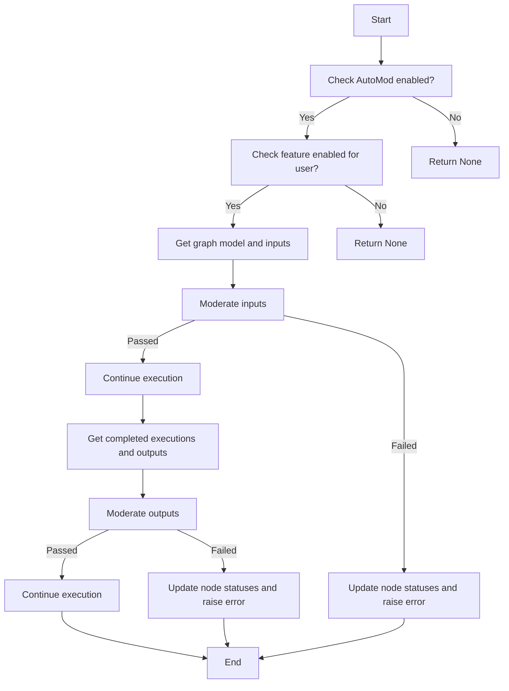

## 类结构

```
AutoModManager (主类)
├── _load_config (私有方法)
│   ├── Settings (全局变量)
│   ├── ModerationConfig (类)
│   └── logger (全局变量)
├── moderate_graph_execution_inputs (异步方法)
│   ├── db_client (参数)
│   ├── graph_exec (参数)
│   ├── timeout (参数)
│   └── ...
├── moderate_graph_execution_outputs (异步方法)
│   ├── db_client (参数)
│   ├── graph_exec_id (参数)
│   ├── user_id (参数)
│   ├── graph_id (参数)
│   ├── timeout (参数)
│   └── ...
├── _update_failed_nodes_for_moderation (异步私有方法)
│   ├── db_client (参数)
│   ├── graph_exec_id (参数)
│   ├── moderation_type (参数)
│   ├── content_id (参数)
│   └── ...
├── _moderate_content (异步私有方法)
│   ├── content (参数)
│   ├── metadata (参数)
│   └── ...
└── _make_request (异步私有方法)
   ├── request_data (参数)
   └── ...
   ├── url (全局变量)
   ├── headers (全局变量)
   └── requests (全局变量)
```

## 全局变量及字段


### `logger`
    
Logger instance for logging messages.

类型：`logging.Logger`
    


### `Settings`
    
Settings class for retrieving configuration settings.

类型：`backend.util.settings.Settings`
    


### `Flag`
    
Feature flag class for enabling or disabling features.

类型：`backend.util.feature_flag.Flag`
    


### `ExecutionStatus`
    
Enum class for execution statuses.

类型：`backend.data.execution.ExecutionStatus`
    


### `ModerationError`
    
Custom exception for moderation errors.

类型：`backend.util.exceptions.ModerationError`
    


### `Requests`
    
Requests class for making HTTP requests with retry and timeout configurations.

类型：`backend.util.request.Requests`
    


### `automod_manager`
    
Global instance of AutoModManager for managing AutoMod operations.

类型：`AutoModManager`
    


### `AutoModManager.config`
    
Configuration object for AutoModManager.

类型：`ModerationConfig`
    


### `ModerationConfig.enabled`
    
Flag indicating if AutoMod is enabled.

类型：`bool`
    


### `ModerationConfig.api_url`
    
API URL for AutoMod.

类型：`str`
    


### `ModerationConfig.api_key`
    
API key for AutoMod.

类型：`str`
    


### `ModerationConfig.timeout`
    
Timeout for AutoMod API requests.

类型：`int`
    


### `ModerationConfig.retry_attempts`
    
Number of retry attempts for AutoMod API requests.

类型：`int`
    


### `ModerationConfig.retry_delay`
    
Delay between retry attempts for AutoMod API requests.

类型：`int`
    


### `ModerationConfig.fail_open`
    
Flag indicating if AutoMod should fail open on errors.

类型：`bool`
    


### `AutoModRequest.type`
    
Type of content being moderated.

类型：`str`
    


### `AutoModRequest.content`
    
Content being moderated.

类型：`str`
    


### `AutoModRequest.metadata`
    
Metadata associated with the content being moderated.

类型：`dict[str, Any]`
    


### `AutoModResponse.success`
    
Flag indicating if the content moderation was successful.

类型：`bool`
    


### `AutoModResponse.status`
    
Status of the content moderation (e.g., 'approved', 'rejected').

类型：`str`
    


### `AutoModResponse.content_id`
    
Reference ID from the moderation API, or None if not available.

类型：`str | None`
    


### `AutoModResponse.moderation_results`
    
List of moderation results with reasons for rejection if applicable.

类型：`list[dict[str, Any]]`
    


### `AutoModManager.config`
    
Configuration object for AutoModManager.

类型：`ModerationConfig`
    


### `ModerationConfig.enabled`
    
Flag indicating if AutoMod is enabled.

类型：`bool`
    


### `ModerationConfig.api_url`
    
API URL for AutoMod.

类型：`str`
    


### `ModerationConfig.api_key`
    
API key for AutoMod.

类型：`str`
    


### `ModerationConfig.timeout`
    
Timeout for AutoMod API requests.

类型：`int`
    


### `ModerationConfig.retry_attempts`
    
Number of retry attempts for AutoMod API requests.

类型：`int`
    


### `ModerationConfig.retry_delay`
    
Delay between retry attempts for AutoMod API requests.

类型：`int`
    


### `ModerationConfig.fail_open`
    
Flag indicating if AutoMod should fail open on errors.

类型：`bool`
    


### `AutoModRequest.type`
    
Type of content being moderated.

类型：`str`
    


### `AutoModRequest.content`
    
Content being moderated.

类型：`str`
    


### `AutoModRequest.metadata`
    
Metadata associated with the content being moderated.

类型：`dict[str, Any]`
    


### `AutoModResponse.success`
    
Flag indicating if the content moderation was successful.

类型：`bool`
    


### `AutoModResponse.status`
    
Status of the content moderation (e.g., 'approved', 'rejected').

类型：`str`
    


### `AutoModResponse.content_id`
    
Reference ID from the moderation API, or None if not available.

类型：`str | None`
    


### `AutoModResponse.moderation_results`
    
List of moderation results with reasons for rejection if applicable.

类型：`list[dict[str, Any]]`
    
    

## 全局函数及方法


### `is_feature_enabled`

Check if a feature is enabled for a given user.

参数：

- `Flag`: `Literal['AUTOMOD']`，The feature flag to check.
- `graph_exec.user_id`: `str`，The user ID for which to check the feature flag.

返回值：`bool`，True if the feature is enabled for the user, False otherwise.

#### 流程图

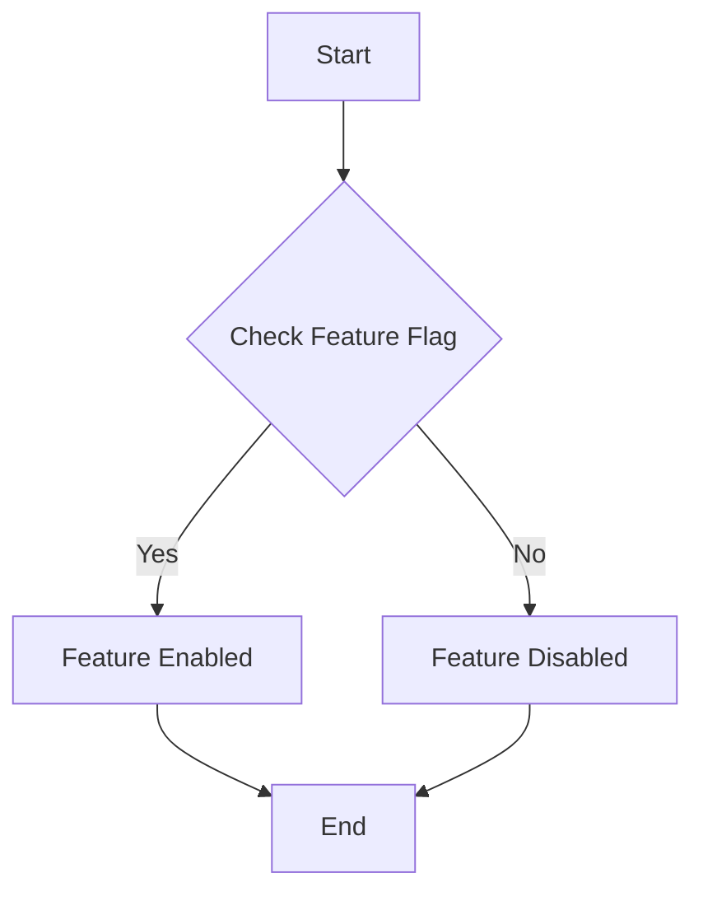

#### 带注释源码

```python
from backend.util.feature_flag import Flag

async def is_feature_enabled(flag: Flag, user_id: str) -> bool:
    # Implementation of the function goes here
    # This is a placeholder as the actual implementation is not provided in the code snippet
    pass
```


### `AutoModManager`

The `AutoModManager` class manages the AutoMod feature for moderating content.

#### 类字段

- `self.config`: `ModerationConfig`，The configuration for AutoMod.

#### 类方法

- `__init__(self)`: Initializes the `AutoModManager` instance.
- `_load_config(self)`: Loads the AutoMod configuration from settings.
- `moderate_graph_execution_inputs(self, db_client, graph_exec, timeout)`: Moderates the inputs for a graph execution.
- `moderate_graph_execution_outputs(self, db_client, graph_exec_id, user_id, graph_id, timeout)`: Moderates the outputs for a graph execution.
- `_update_failed_nodes_for_moderation(self, db_client, graph_exec_id, moderation_type, content_id)`: Updates the node execution statuses when moderation fails.
- `_moderate_content(self, content, metadata)`: Moderates content using the AutoMod API.
- `_make_request(self, request_data)`: Makes an HTTP request to the AutoMod API.

#### 全局变量

- `logger`: `logging.Logger`，The logger for the module.

#### 全局函数

- `is_feature_enabled`: Checks if a feature is enabled for a given user.

#### 关键组件

- `AutoModManager`: The main class for managing AutoMod features.
- `ModerationConfig`: Configuration for AutoMod settings.
- `Flag`: Enumeration for feature flags.

#### 潜在的技术债务或优化空间

- The code may benefit from better error handling and logging.
- The use of asyncio and async functions could be optimized for better performance.
- The code may have potential for refactoring to reduce complexity and improve readability.

#### 设计目标与约束

- The design aims to provide a robust and efficient way to moderate content using the AutoMod API.
- The code must handle asynchronous operations and ensure thread safety.

#### 错误处理与异常设计

- The code uses logging to record errors and exceptions.
- Custom exceptions are defined for specific error cases.

#### 数据流与状态机

- The data flow is managed through asynchronous functions and classes.
- The state machine is implemented through the various methods of the `AutoModManager` class.

#### 外部依赖与接口契约

- The code depends on external libraries such as `asyncio`, `json`, `logging`, and `pydantic`.
- The interface契约 is defined through the methods and classes of the `AutoModManager` class.
```


### `AutoModManager._moderate_content`

Moderate content using AutoMod API.

参数：

- `content`：`str`，The content to be moderated.
- `metadata`：`dict[str, Any]`，Additional metadata to be included with the moderation request.

返回值：`tuple[bool, str | None]`，A tuple containing the approval status and the content ID.

返回值描述：
- `approval_status`: `bool` indicating if the content was approved or not.
- `content_id`: `str | None` representing the reference ID from the moderation API, or `None` if not available.

#### 流程图

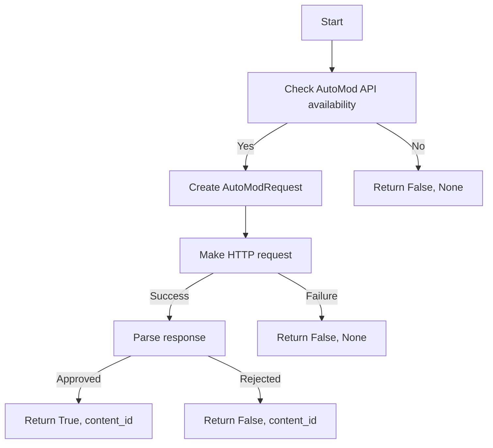

#### 带注释源码

```python
async def _moderate_content(self, content: str, metadata: dict[str, Any]) -> tuple[bool, str | None]:
    """Moderate content using AutoMod API

    Args:
        content (str): The content to be moderated.
        metadata (dict[str, Any]): Additional metadata to be included with the moderation request.

    Returns:
        tuple[bool, str | None]: Tuple of (approval_status, content_id)
        - approval_status: True if approved or timeout occurred, False if rejected
        - content_id: Reference ID from moderation API, or None if not available

    Raises:
        asyncio.TimeoutError: When moderation times out (should be bypassed)
    """
    try:
        request_data = AutoModRequest(
            type="text",
            content=content,
            metadata=metadata,
        )

        response = await self._make_request(request_data)

        if response.success and response.status == "approved":
            logger.debug(
                f"Content approved for {metadata.get('graph_exec_id', 'unknown')}"
            )
            return True, response.content_id
        else:
            reasons = [r.reason for r in response.moderation_results if r.reason]
            error_msg = f"Content rejected by AutoMod: {'; '.join(reasons)}"
            logger.warning(f"Content rejected: {error_msg}")
            return False, response.content_id

    except asyncio.TimeoutError:
        # Re-raise timeout to be handled by calling methods
        logger.warning(
            f"AutoMod API timeout for {metadata.get('graph_exec_id', 'unknown')}"
        )
        raise
    except Exception as e:
        logger.error(f"AutoMod moderation error: {e}")
        return self.config.fail_open, None
```


### `AutoModManager.get_node_executions`

This method retrieves completed executions for a given graph execution ID.

参数：

- `graph_exec_id`：`str`，The ID of the graph execution for which to retrieve node executions.
- `statuses`：`list[ExecutionStatus]`，Optional. A list of execution statuses to filter the node executions by. Defaults to `[ExecutionStatus.COMPLETED]`.
- `include_exec_data`：`bool`，Optional. Whether to include execution data in the response. Defaults to `True`.

返回值：`list[NodeExecution]`，A list of node executions that match the given criteria.

#### 流程图

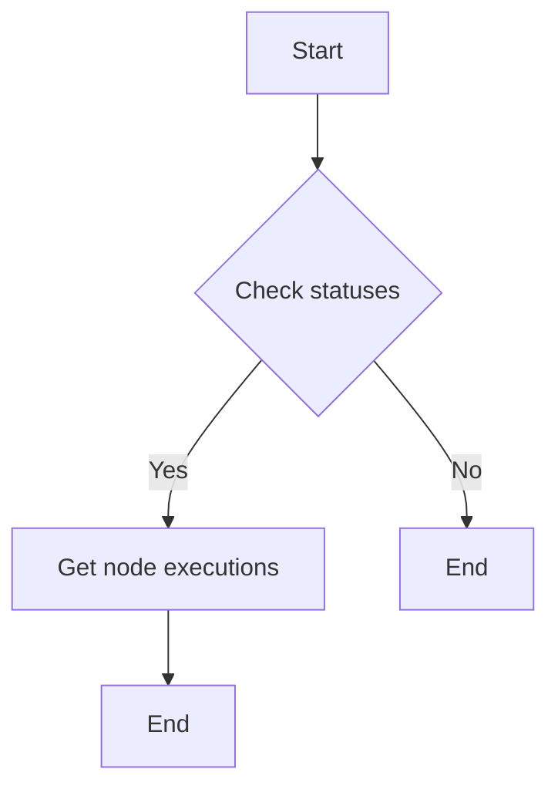

#### 带注释源码

```python
async def get_node_executions(
    self,
    graph_exec_id: str,
    statuses: list[ExecutionStatus] = [ExecutionStatus.COMPLETED],
    include_exec_data: bool = True,
) -> list[NodeExecution]:
    # Get completed executions and collect outputs
    completed_executions = await db_client.get_node_executions(
        graph_exec_id, statuses=statuses, include_exec_data=include_exec_data
    )

    if not completed_executions:
        return []

    # Return the list of node executions
    return completed_executions
```


### `_update_failed_nodes_for_moderation`

Update node execution statuses for frontend display when moderation fails.

参数：

- `db_client`：`DatabaseManagerAsyncClient`，DatabaseManagerAsyncClient instance for database operations.
- `graph_exec_id`：`str`，Graph execution ID.
- `moderation_type`：`Literal["input", "output"]`，Type of moderation (input or output).
- `content_id`：`str | None`，Content ID from moderation API, or None if not available.

返回值：`None`，No return value.

#### 流程图

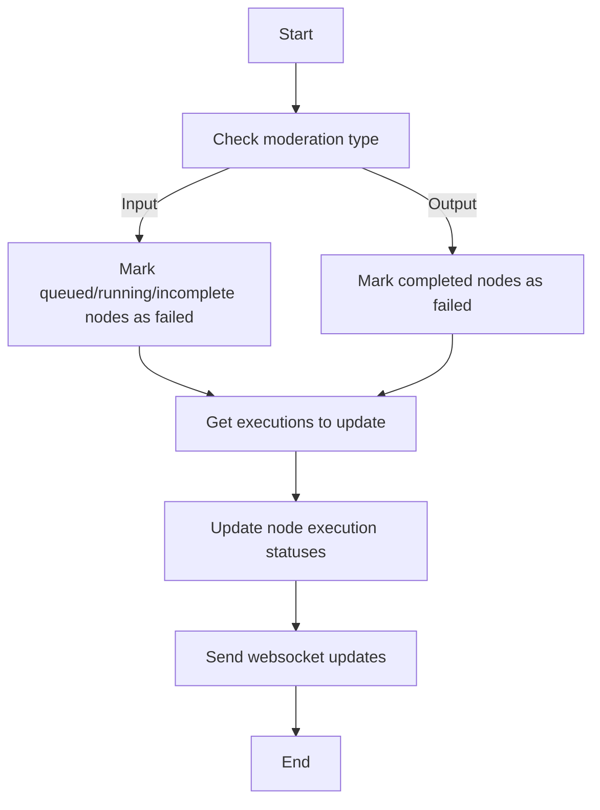

#### 带注释源码

```python
async def _update_failed_nodes_for_moderation(
    self,
    db_client: "DatabaseManagerAsyncClient",
    graph_exec_id: str,
    moderation_type: Literal["input", "output"],
    content_id: str | None = None,
):
    # Import here to avoid circular imports
    from backend.executor.manager import send_async_execution_update

    if moderation_type == "input":
        # For input moderation, mark queued/running/incomplete nodes as failed
        target_statuses = [
            ExecutionStatus.QUEUED,
            ExecutionStatus.RUNNING,
            ExecutionStatus.INCOMPLETE,
        ]
    else:
        # For output moderation, mark completed nodes as failed
        target_statuses = [ExecutionStatus.COMPLETED]

    # Get the executions that need to be updated
    executions_to_update = await db_client.get_node_executions(
        graph_exec_id, statuses=target_statuses, include_exec_data=True
    )

    if not executions_to_update:
        return

    # Create error message with content_id if available
    error_message = "Failed due to content moderation"
    if content_id:
        error_message += f" (Moderation ID: {content_id})"

    # Prepare database update tasks
    exec_updates = []
    for exec_entry in executions_to_update:
        # Collect all input and output names to clear
        cleared_inputs = {}
        cleared_outputs = {}

        if exec_entry.input_data:
            for name in exec_entry.input_data.keys():
                cleared_inputs[name] = [error_message]

        if exec_entry.output_data:
            for name in exec_entry.output_data.keys():
                cleared_outputs[name] = [error_message]

        # Add update task to list
        exec_updates.append(
            db_client.update_node_execution_status(
                exec_entry.node_exec_id,
                status=ExecutionStatus.FAILED,
                stats={
                    "error": error_message,
                    "cleared_inputs": cleared_inputs,
                    "cleared_outputs": cleared_outputs,
                },
            )
        )

    # Execute all database updates in parallel
    updated_execs = await asyncio.gather(*exec_updates)

    # Send all websocket updates in parallel
    await asyncio.gather(
        *[
            send_async_execution_update(updated_exec)
            for updated_exec in updated_execs
        ]
    )
```


### `send_async_execution_update`

Update node execution statuses for frontend display when moderation fails.

参数：

- `updated_exec`：`DatabaseManagerAsyncClient`，The execution entry that needs to be updated.

返回值：`None`，Indicates that the update was successful.

#### 流程图

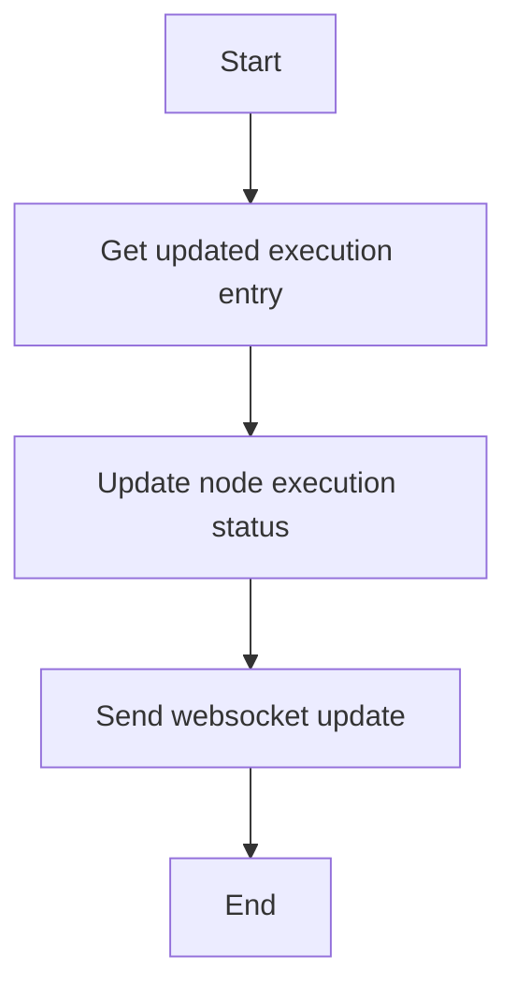

#### 带注释源码

```python
async def send_async_execution_update(self, updated_exec):
    # Send all websocket updates in parallel
    await asyncio.gather(
        *[
            send_async_execution_update(updated_exec)
            for updated_exec in updated_execs
        ]
    )
```


### `AutoModManager._moderate_content`

Moderate content using AutoMod API.

参数：

- `content`：`str`，The content to be moderated.
- `metadata`：`dict[str, Any]`，Additional metadata to be included with the moderation request.

返回值：`tuple[bool, str | None]`，A tuple containing the approval status and the content ID.

#### 流程图

```mermaid
graph TD
    A[Start] --> B[Check AutoMod enabled]
    B -->|Yes| C[Check feature enabled for user]
    B -->|No| D[Return None]
    C -->|Yes| E[Get graph model and inputs]
    C -->|No| F[Return None]
    E -->|No inputs| G[Return None]
    E --> H[Combine inputs into content]
    H --> I[Run moderation]
    I -->|Passed| J[Return (True, content_id)]
    I -->|Failed| K[Return (False, content_id)]
    I -->|Timeout| L[Return (False, None)]
```

#### 带注释源码

```python
async def _moderate_content(self, content: str, metadata: dict[str, Any]) -> tuple[bool, str | None]:
    """Moderate content using AutoMod API

    Args:
        content (str): The content to be moderated.
        metadata (dict[str, Any]): Additional metadata to be included with the moderation request.

    Returns:
        tuple[bool, str | None]: Tuple of (approval_status, content_id)
        - approval_status: True if approved or timeout occurred, False if rejected
        - content_id: Reference ID from moderation API, or None if not available

    Raises:
        asyncio.TimeoutError: When moderation times out (should be bypassed)
    """
    try:
        request_data = AutoModRequest(
            type="text",
            content=content,
            metadata=metadata,
        )

        response = await self._make_request(request_data)

        if response.success and response.status == "approved":
            logger.debug(
                f"Content approved for {metadata.get('graph_exec_id', 'unknown')}"
            )
            return True, response.content_id
        else:
            reasons = [r.reason for r in response.moderation_results if r.reason]
            error_msg = f"Content rejected by AutoMod: {'; '.join(reasons)}"
            logger.warning(f"Content rejected: {error_msg}")
            return False, response.content_id

    except asyncio.TimeoutError:
        # Re-raise timeout to be handled by calling methods
        logger.warning(
            f"AutoMod API timeout for {metadata.get('graph_exec_id', 'unknown')}"
        )
        raise
    except Exception as e:
        logger.error(f"AutoMod moderation error: {e}")
        return self.config.fail_open, None
```


### `AutoModManager.moderate_graph_execution_inputs`

Complete input moderation flow for graph execution

参数：

- `db_client`：`DatabaseManagerAsyncClient`，Database client for asynchronous operations
- `graph_exec`：`AutoModRequest`，Graph execution request containing graph information
- `timeout`：`int`，Timeout in seconds for the operation

返回值：`Exception | None`，Error if failed (None means success)

#### 流程图

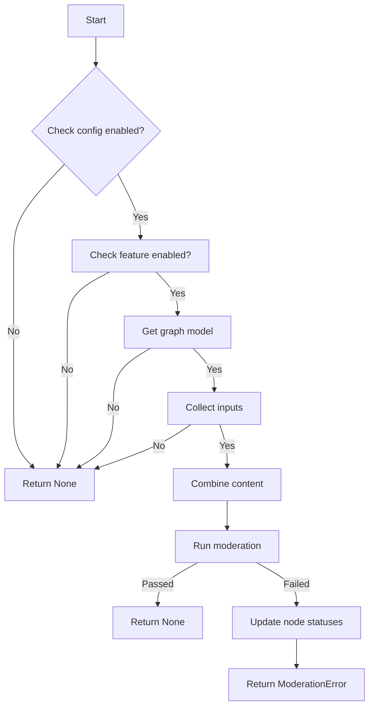

#### 带注释源码

```python
async def moderate_graph_execution_inputs(
    self, db_client: "DatabaseManagerAsyncClient", graph_exec, timeout: int = 10
) -> Exception | None:
    """
    Complete input moderation flow for graph execution
    Returns: error_if_failed (None means success)
    """
    if not self.config.enabled:
        return None

    # Check if AutoMod feature is enabled for this user
    if not await is_feature_enabled(Flag.AUTOMOD, graph_exec.user_id):
        logger.debug(f"AutoMod feature not enabled for user {graph_exec.user_id}")
        return None

    # Get graph model and collect all inputs
    graph_model = await db_client.get_graph(
        graph_exec.graph_id,
        user_id=graph_exec.user_id,
        version=graph_exec.graph_version,
    )

    if not graph_model or not graph_model.nodes:
        return None

    all_inputs = []
    for node in graph_model.nodes:
        if node.input_default:
            all_inputs.extend(str(v) for v in node.input_default.values() if v)
        if (masks := graph_exec.nodes_input_masks) and (mask := masks.get(node.id)):
            all_inputs.extend(str(v) for v in mask.values() if v)

    if not all_inputs:
        return None

    # Combine all content and moderate directly
    content = " ".join(all_inputs)

    # Run moderation
    logger.warning(
        f"Moderating inputs for graph execution {graph_exec.graph_exec_id}"
    )
    try:
        moderation_passed, content_id = await self._moderate_content(
            content,
            {
                "user_id": graph_exec.user_id,
                "graph_id": graph_exec.graph_id,
                "graph_exec_id": graph_exec.graph_exec_id,
                "moderation_type": "execution_input",
            },
        )

        if not moderation_passed:
            logger.warning(
                f"Moderation failed for graph execution {graph_exec.graph_exec_id}"
            )
            # Update node statuses for frontend display before raising error
            await self._update_failed_nodes_for_moderation(
                db_client, graph_exec.graph_exec_id, "input", content_id
            )

            return ModerationError(
                message="Execution failed due to input content moderation",
                user_id=graph_exec.user_id,
                graph_exec_id=graph_exec.graph_exec_id,
                moderation_type="input",
                content_id=content_id,
            )

        return None

    except asyncio.TimeoutError:
        logger.warning(
            f"Input moderation timed out for graph execution {graph_exec.graph_exec_id}, bypassing moderation"
        )
        return None  # Bypass moderation on timeout
    except Exception as e:
        logger.warning(f"Input moderation execution failed: {e}")
        return ModerationError(
            message="Execution failed due to input content moderation error",
            user_id=graph_exec.user_id,
            graph_exec_id=graph_exec.graph_exec_id,
            moderation_type="input",
        )
```


### AutoModManager.__init__

This method initializes the `AutoModManager` class by loading the AutoMod configuration.

参数：

- 无

返回值：无

#### 流程图

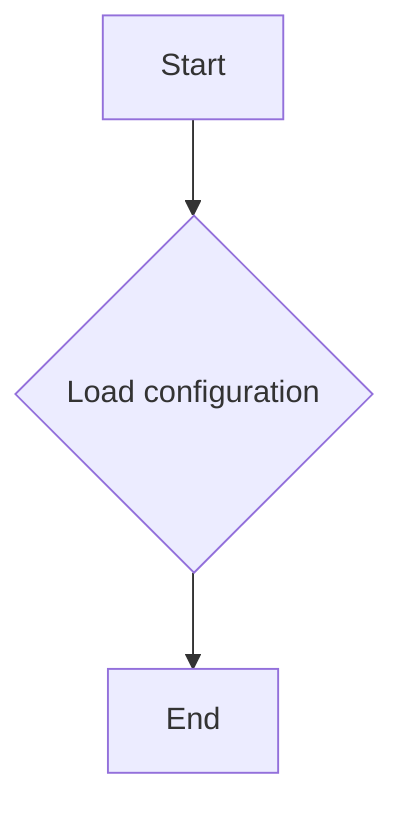

#### 带注释源码

```python
def __init__(self):
    self.config = self._load_config()
```


### AutoModManager._load_config

Load AutoMod configuration from settings

参数：

- 无

返回值：`ModerationConfig`，Load AutoMod configuration from settings

#### 流程图

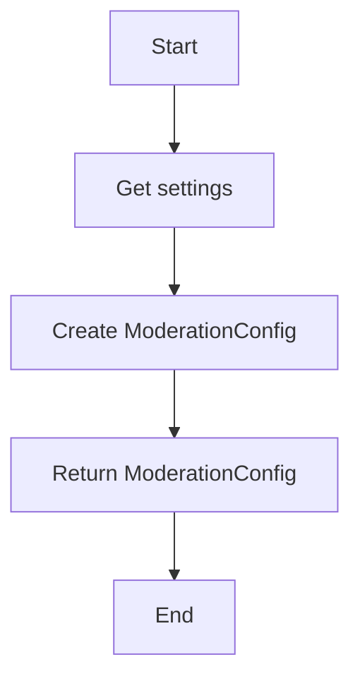

#### 带注释源码

```python
def _load_config(self) -> ModerationConfig:
    """Load AutoMod configuration from settings"""
    settings = Settings()
    return ModerationConfig(
        enabled=settings.config.automod_enabled,
        api_url=settings.config.automod_api_url,
        api_key=settings.secrets.automod_api_key,
        timeout=settings.config.automod_timeout,
        retry_attempts=settings.config.automod_retry_attempts,
        retry_delay=settings.config.automod_retry_delay,
        fail_open=settings.config.automod_fail_open,
    )
```


### `AutoModManager.moderate_graph_execution_inputs`

Complete input moderation flow for graph execution

参数：

- `db_client`：`DatabaseManagerAsyncClient`，Database client for asynchronous operations
- `graph_exec`：`Any`，Graph execution object containing graph information
- `timeout`：`int`，Timeout in seconds for the moderation process (default is 10)

返回值：`Exception | None`，Returns an exception if the moderation fails, otherwise returns `None`

#### 流程图

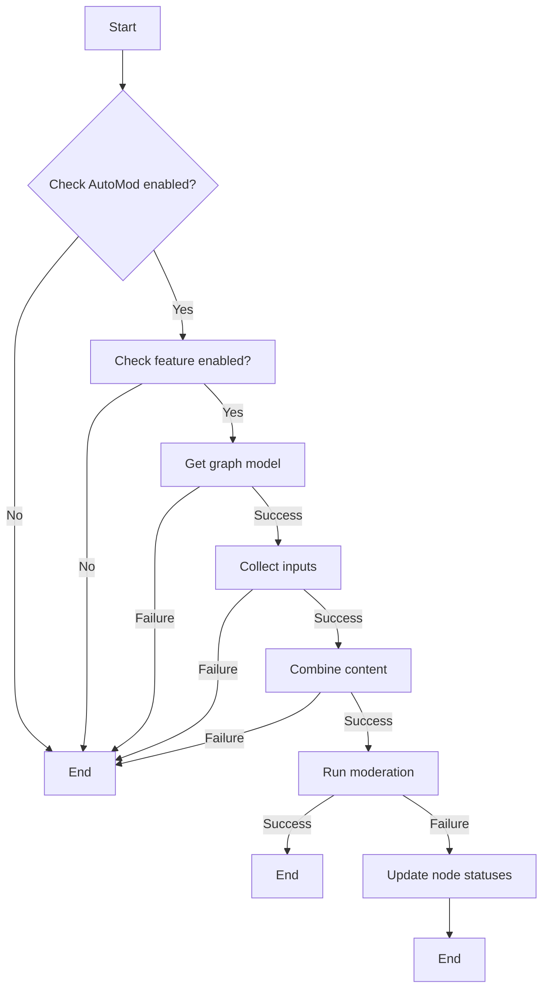

#### 带注释源码

```python
async def moderate_graph_execution_inputs(
    self, db_client: "DatabaseManagerAsyncClient", graph_exec, timeout: int = 10
) -> Exception | None:
    """
    Complete input moderation flow for graph execution
    Returns: error_if_failed (None means success)
    """
    if not self.config.enabled:
        return None

    # Check if AutoMod feature is enabled for this user
    if not await is_feature_enabled(Flag.AUTOMOD, graph_exec.user_id):
        logger.debug(f"AutoMod feature not enabled for user {graph_exec.user_id}")
        return None

    # Get graph model and collect all inputs
    graph_model = await db_client.get_graph(
        graph_exec.graph_id,
        user_id=graph_exec.user_id,
        version=graph_exec.graph_version,
    )

    if not graph_model or not graph_model.nodes:
        return None

    all_inputs = []
    for node in graph_model.nodes:
        if node.input_default:
            all_inputs.extend(str(v) for v in node.input_default.values() if v)
        if (masks := graph_exec.nodes_input_masks) and (mask := masks.get(node.id)):
            all_inputs.extend(str(v) for v in mask.values() if v)

    if not all_inputs:
        return None

    # Combine all content and moderate directly
    content = " ".join(all_inputs)

    # Run moderation
    logger.warning(
        f"Moderating inputs for graph execution {graph_exec.graph_exec_id}"
    )
    try:
        moderation_passed, content_id = await self._moderate_content(
            content,
            {
                "user_id": graph_exec.user_id,
                "graph_id": graph_exec.graph_id,
                "graph_exec_id": graph_exec.graph_exec_id,
                "moderation_type": "execution_input",
            },
        )

        if not moderation_passed:
            logger.warning(
                f"Moderation failed for graph execution {graph_exec.graph_exec_id}"
            )
            # Update node statuses for frontend display before raising error
            await self._update_failed_nodes_for_moderation(
                db_client, graph_exec.graph_exec_id, "input", content_id
            )

            return ModerationError(
                message="Execution failed due to input content moderation",
                user_id=graph_exec.user_id,
                graph_exec_id=graph_exec.graph_exec_id,
                moderation_type="input",
                content_id=content_id,
            )

        return None

    except asyncio.TimeoutError:
        logger.warning(
            f"Input moderation timed out for graph execution {graph_exec.graph_exec_id}, bypassing moderation"
        )
        return None  # Bypass moderation on timeout
    except Exception as e:
        logger.warning(f"Input moderation execution failed: {e}")
        return ModerationError(
            message="Execution failed due to input content moderation error",
            user_id=graph_exec.user_id,
            graph_exec_id=graph_exec.graph_exec_id,
            moderation_type="input",
        )
```


### `AutoModManager.moderate_graph_execution_outputs`

This method completes the output moderation flow for a graph execution. It checks if the AutoMod feature is enabled, collects the outputs from completed executions, moderates the content using the AutoMod API, and handles any errors or timeouts.

参数：

- `db_client`：`DatabaseManagerAsyncClient`，The database client used to interact with the backend database.
- `graph_exec_id`：`str`，The ID of the graph execution to moderate.
- `user_id`：`str`，The ID of the user associated with the graph execution.
- `graph_id`：`str`，The ID of the graph associated with the graph execution.
- `timeout`：`int`，The timeout for the moderation process (default is 10 seconds).

返回值：`Exception | None`，If an error occurs during moderation, an `Exception` is returned. If the moderation is successful, `None` is returned.

#### 流程图

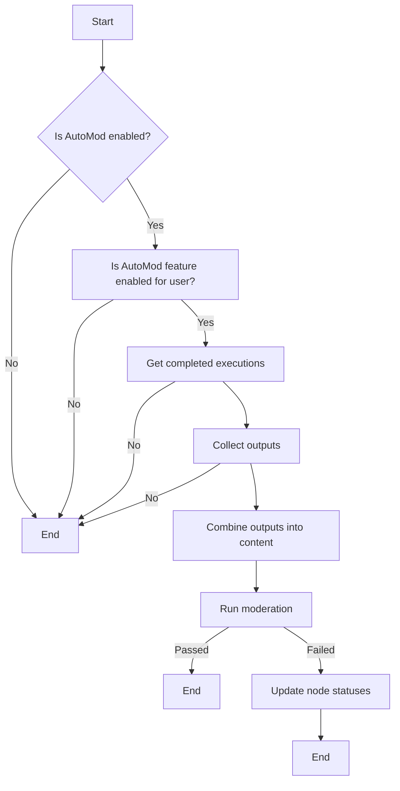

#### 带注释源码

```python
async def moderate_graph_execution_outputs(
    self,
    db_client: "DatabaseManagerAsyncClient",
    graph_exec_id: str,
    user_id: str,
    graph_id: str,
    timeout: int = 10,
) -> Exception | None:
    """
    Complete output moderation flow for graph execution
    Returns: error_if_failed (None means success)
    """
    if not self.config.enabled:
        return None

    # Check if AutoMod feature is enabled for this user
    if not await is_feature_enabled(Flag.AUTOMOD, user_id):
        logger.debug(f"AutoMod feature not enabled for user {user_id}")
        return None

    # Get completed executions and collect outputs
    completed_executions = await db_client.get_node_executions(
        graph_exec_id, statuses=[ExecutionStatus.COMPLETED], include_exec_data=True
    )

    if not completed_executions:
        return None

    all_outputs = []
    for exec_entry in completed_executions:
        if exec_entry.output_data:
            all_outputs.extend(str(v) for v in exec_entry.output_data.values() if v)

    if not all_outputs:
        return None

    # Combine all content and moderate directly
    content = " ".join(all_outputs)

    # Run moderation
    logger.warning(f"Moderating outputs for graph execution {graph_exec_id}")
    try:
        moderation_passed, content_id = await self._moderate_content(
            content,
            {
                "user_id": user_id,
                "graph_id": graph_id,
                "graph_exec_id": graph_exec_id,
                "moderation_type": "execution_output",
            },
        )

        if not moderation_passed:
            logger.warning(f"Moderation failed for graph execution {graph_exec_id}")
            # Update node statuses for frontend display before raising error
            await self._update_failed_nodes_for_moderation(
                db_client, graph_exec_id, "output", content_id
            )

            return ModerationError(
                message="Execution failed due to output content moderation",
                user_id=user_id,
                graph_exec_id=graph_exec_id,
                moderation_type="output",
                content_id=content_id,
            )

        return None

    except asyncio.TimeoutError:
        logger.warning(
            f"Output moderation timed out for graph execution {graph_exec_id}, bypassing moderation"
        )
        return None  # Bypass moderation on timeout
    except Exception as e:
        logger.warning(f"Output moderation execution failed: {e}")
        return ModerationError(
            message="Execution failed due to output content moderation error",
            user_id=user_id,
            graph_exec_id=graph_exec_id,
            moderation_type="output",
        )
```


### AutoModManager._update_failed_nodes_for_moderation

Update node execution statuses for frontend display when moderation fails.

参数：

- `db_client`：`DatabaseManagerAsyncClient`，DatabaseManagerAsyncClient instance for database operations.
- `graph_exec_id`：`str`，Unique identifier for the graph execution.
- `moderation_type`：`Literal["input", "output"]`，Type of moderation (input or output).
- `content_id`：`str | None`，Optional content ID from moderation API.

返回值：`None`，No return value.

#### 流程图

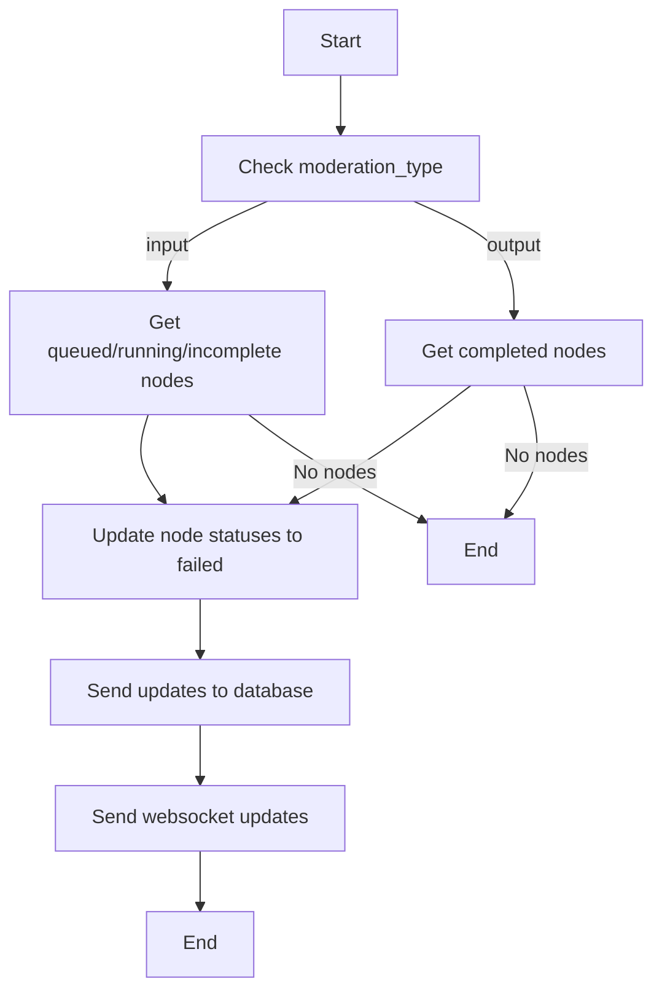

#### 带注释源码

```python
async def _update_failed_nodes_for_moderation(
    self,
    db_client: "DatabaseManagerAsyncClient",
    graph_exec_id: str,
    moderation_type: Literal["input", "output"],
    content_id: str | None = None,
):
    """Update node execution statuses for frontend display when moderation fails"""

    # Import here to avoid circular imports
    from backend.executor.manager import send_async_execution_update

    if moderation_type == "input":
        # For input moderation, mark queued/running/incomplete nodes as failed
        target_statuses = [
            ExecutionStatus.QUEUED,
            ExecutionStatus.RUNNING,
            ExecutionStatus.INCOMPLETE,
        ]
    else:
        # For output moderation, mark completed nodes as failed
        target_statuses = [ExecutionStatus.COMPLETED]

    # Get the executions that need to be updated
    executions_to_update = await db_client.get_node_executions(
        graph_exec_id, statuses=target_statuses, include_exec_data=True
    )

    if not executions_to_update:
        return

    # Create error message with content_id if available
    error_message = "Failed due to content moderation"
    if content_id:
        error_message += f" (Moderation ID: {content_id})"

    # Prepare database update tasks
    exec_updates = []
    for exec_entry in executions_to_update:
        # Collect all input and output names to clear
        cleared_inputs = {}
        cleared_outputs = {}

        if exec_entry.input_data:
            for name in exec_entry.input_data.keys():
                cleared_inputs[name] = [error_message]

        if exec_entry.output_data:
            for name in exec_entry.output_data.keys():
                cleared_outputs[name] = [error_message]

        # Add update task to list
        exec_updates.append(
            db_client.update_node_execution_status(
                exec_entry.node_exec_id,
                status=ExecutionStatus.FAILED,
                stats={
                    "error": error_message,
                    "cleared_inputs": cleared_inputs,
                    "cleared_outputs": cleared_outputs,
                },
            )
        )

    # Execute all database updates in parallel
    updated_execs = await asyncio.gather(*exec_updates)

    # Send all websocket updates in parallel
    await asyncio.gather(
        *[
            send_async_execution_update(updated_exec)
            for updated_exec in updated_execs
        ]
    )
```


### `_moderate_content`

Moderate content using AutoMod API

参数：

- `content`：`str`，The content to be moderated.
- `metadata`：`dict[str, Any]`，Additional metadata to be included with the moderation request.

返回值：`tuple[bool, str | None]`，A tuple containing the approval status and the content ID.

- `approval_status`：`bool`，True if the content is approved or a timeout occurred, False if the content is rejected.
- `content_id`：`str | None`，The reference ID from the moderation API, or None if not available.

#### 流程图

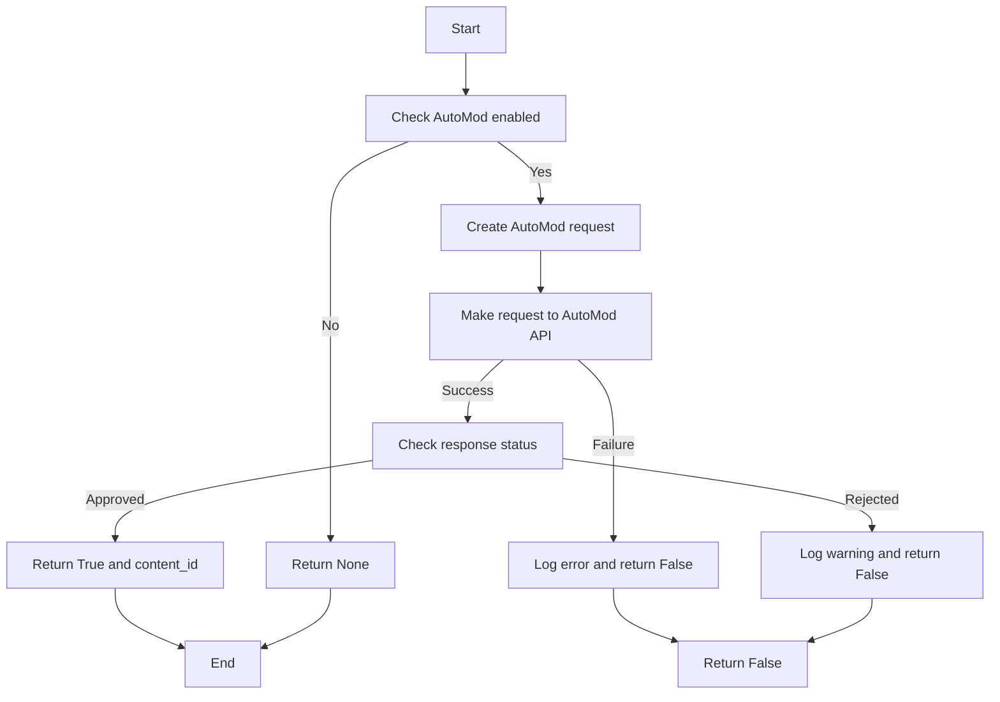

#### 带注释源码

```python
async def _moderate_content(self, content: str, metadata: dict[str, Any]) -> tuple[bool, str | None]:
    """Moderate content using AutoMod API

    Args:
        content (str): The content to be moderated.
        metadata (dict[str, Any]): Additional metadata to be included with the moderation request.

    Returns:
        tuple[bool, str | None]: A tuple containing the approval status and the content ID.
    """
    try:
        request_data = AutoModRequest(
            type="text",
            content=content,
            metadata=metadata,
        )

        response = await self._make_request(request_data)

        if response.success and response.status == "approved":
            logger.debug(
                f"Content approved for {metadata.get('graph_exec_id', 'unknown')}"
            )
            return True, response.content_id
        else:
            reasons = [r.reason for r in response.moderation_results if r.reason]
            error_msg = f"Content rejected by AutoMod: {'; '.join(reasons)}"
            logger.warning(f"Content rejected: {error_msg}")
            return False, response.content_id

    except asyncio.TimeoutError:
        # Re-raise timeout to be handled by calling methods
        logger.warning(
            f"AutoMod API timeout for {metadata.get('graph_exec_id', 'unknown')}"
        )
        raise
    except Exception as e:
        logger.error(f"AutoMod moderation error: {e}")
        return self.config.fail_open, None
```


### `_make_request`

Make HTTP request to AutoMod API using the standard request utility.

参数：

- `request_data`：`AutoModRequest`，The data to be sent to the AutoMod API.

返回值：`AutoModResponse`，The response from the AutoMod API.

#### 流程图

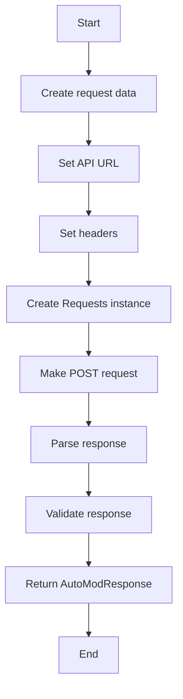

#### 带注释源码

```python
async def _make_request(self, request_data: AutoModRequest) -> AutoModResponse:
    """Make HTTP request to AutoMod API using the standard request utility"""
    url = f"{self.config.api_url}/moderate"
    headers = {
        "Content-Type": "application/json",
        "X-API-Key": self.config.api_key.strip(),
    }

    # Create requests instance with timeout and retry configuration
    requests = Requests(
        extra_headers=headers,
        retry_max_wait=float(self.config.timeout),
    )

    try:
        response = await requests.post(
            url, json=request_data.model_dump(), timeout=self.config.timeout
        )

        response_data = response.json()
        return AutoModResponse.model_validate(response_data)

    except asyncio.TimeoutError:
        # Re-raise timeout error to be caught by _moderate_content
        raise
    except (json.JSONDecodeError, ValidationError) as e:
        raise Exception(f"Invalid response from AutoMod API: {e}")
    except Exception as e:
        # Check if this is an aiohttp timeout that we should convert
        if "timeout" in str(e).lower():
            raise asyncio.TimeoutError(f"AutoMod API request timed out: {e}")
        raise Exception(f"AutoMod API request failed: {e}")
```


### AutoModManager._make_request

This method makes an HTTP request to the AutoMod API using the standard request utility.

参数：

- `request_data`：`AutoModRequest`，The data to be sent to the AutoMod API.

返回值：`AutoModResponse`，The response from the AutoMod API.

#### 流程图

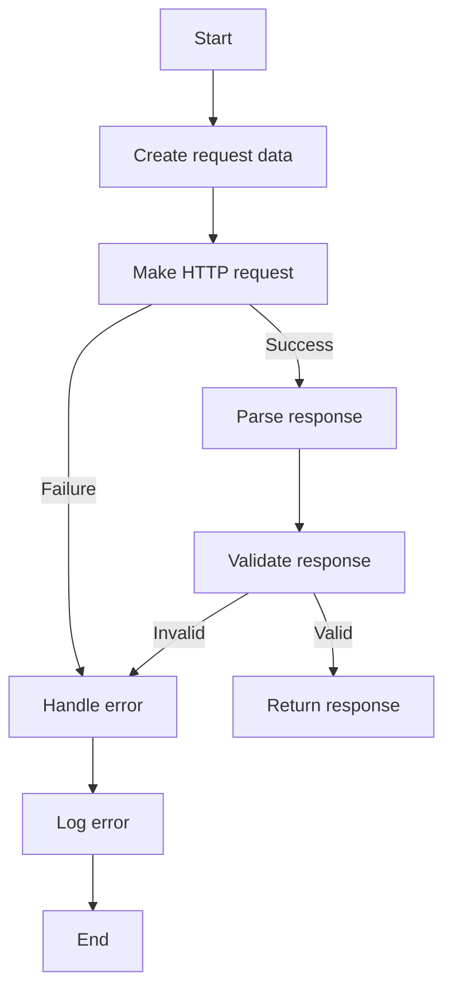

#### 带注释源码

```python
async def _make_request(self, request_data: AutoModRequest) -> AutoModResponse:
    """Make HTTP request to AutoMod API using the standard request utility"""
    url = f"{self.config.api_url}/moderate"
    headers = {
        "Content-Type": "application/json",
        "X-API-Key": self.config.api_key.strip(),
    }

    # Create requests instance with timeout and retry configuration
    requests = Requests(
        extra_headers=headers,
        retry_max_wait=float(self.config.timeout),
    )

    try:
        response = await requests.post(
            url, json=request_data.model_dump(), timeout=self.config.timeout
        )

        response_data = response.json()
        return AutoModResponse.model_validate(response_data)

    except asyncio.TimeoutError:
        # Re-raise timeout error to be caught by _moderate_content
        raise
    except (json.JSONDecodeError, ValidationError) as e:
        raise Exception(f"Invalid response from AutoMod API: {e}")
    except Exception as e:
        # Check if this is an aiohttp timeout that we should convert
        if "timeout" in str(e).lower():
            raise asyncio.TimeoutError(f"AutoMod API request timed out: {e}")
        raise Exception(f"AutoMod API request failed: {e}")
```


### AutoModManager._moderate_content

Moderate content using AutoMod API.

参数：

- `content`：`str`，The content to be moderated.
- `metadata`：`dict[str, Any]`，Additional metadata to be included with the moderation request.

返回值：`tuple[bool, str | None]`，A tuple containing the approval status and the content ID.

#### 流程图

```mermaid
graph TD
    A[Start] --> B[Create AutoModRequest]
    B --> C[Make HTTP request]
    C -->|Success| D[Validate response]
    C -->|Failure| E[Handle error]
    D -->|Approved| F[Return (True, content_id)]
    D -->|Rejected| G[Return (False, content_id)]
    E --> H[Log error]
    H --> I[Return (fail_open, None)]
```

#### 带注释源码

```python
async def _moderate_content(self, content: str, metadata: dict[str, Any]) -> tuple[bool, str | None]:
    try:
        request_data = AutoModRequest(
            type="text",
            content=content,
            metadata=metadata,
        )

        response = await self._make_request(request_data)

        if response.success and response.status == "approved":
            logger.debug(
                f"Content approved for {metadata.get('graph_exec_id', 'unknown')}"
            )
            return True, response.content_id
        else:
            reasons = [r.reason for r in response.moderation_results if r.reason]
            error_msg = f"Content rejected by AutoMod: {'; '.join(reasons)}"
            logger.warning(f"Content rejected: {error_msg}")
            return False, response.content_id

    except asyncio.TimeoutError:
        # Re-raise timeout to be handled by calling methods
        logger.warning(
            f"AutoMod API timeout for {metadata.get('graph_exec_id', 'unknown')}"
        )
        raise
    except Exception as e:
        logger.error(f"AutoMod moderation error: {e}")
        return self.config.fail_open, None
```


## 关键组件


### 张量索引与惰性加载

用于高效地索引和访问张量数据，同时延迟加载数据以优化性能。

### 反量化支持

提供对反量化操作的支持，允许在量化过程中进行逆量化以恢复原始精度。

### 量化策略

定义了不同的量化策略，用于在模型训练和推理过程中调整模型参数的精度。


## 问题及建议


### 已知问题

-   **循环依赖**: `AutoModManager` 类中存在循环依赖，例如 `_update_failed_nodes_for_moderation` 方法中导入了 `send_async_execution_update`，而该函数依赖于 `AutoModManager` 类。
-   **异常处理**: 异常处理不够全面，例如 `_make_request` 方法中捕获了所有异常，但没有针对特定异常类型进行区分处理。
-   **日志记录**: 日志记录不够详细，例如在 `moderate_graph_execution_inputs` 和 `moderate_graph_execution_outputs` 方法中，日志仅记录了失败的情况，没有记录成功的情况。
-   **代码复用**: 代码复用性低，例如 `_load_config` 方法在 `AutoModManager` 类中重复实现。

### 优化建议

-   **重构循环依赖**: 将 `send_async_execution_update` 方法移出 `AutoModManager` 类，或者将 `AutoModManager` 类中的相关方法移入另一个模块，以消除循环依赖。
-   **细化异常处理**: 在 `_make_request` 方法中，根据异常类型进行不同的处理，例如区分 `asyncio.TimeoutError` 和其他异常。
-   **增强日志记录**: 在关键步骤添加日志记录，包括成功和失败的情况，以便更好地追踪程序的执行过程。
-   **提高代码复用性**: 将重复的代码，如 `_load_config` 方法，提取到公共模块中，以提高代码复用性。
-   **异步操作优化**: 考虑使用 `asyncio.gather` 来并行执行异步操作，以提高效率。
-   **错误处理**: 在 `moderate_graph_execution_inputs` 和 `moderate_graph_execution_outputs` 方法中，对于成功的操作也应该记录日志，并返回相应的成功信息。
-   **API 错误处理**: 在 `_make_request` 方法中，对于 API 返回的错误，应该有更详细的错误处理逻辑，例如根据错误代码返回不同的错误信息。


## 其它


### 设计目标与约束

- 设计目标：
  - 实现自动内容审核功能，确保图形执行输入和输出内容符合规定标准。
  - 提供异步处理能力，以支持高并发请求。
  - 确保系统稳定性和可扩展性。
  - 提供清晰的错误处理机制，便于问题追踪和修复。

- 约束条件：
  - 必须使用AutoMod API进行内容审核。
  - 必须遵守数据库访问权限和操作规范。
  - 必须遵循异步编程的最佳实践。

### 错误处理与异常设计

- 错误处理：
  - 使用`logger`记录错误信息，便于问题追踪。
  - 使用`ModerationError`类封装审核错误，提供详细的错误信息。
  - 在异步函数中捕获并处理`asyncio.TimeoutError`，允许超时情况下的处理逻辑。

### 数据流与状态机

- 数据流：
  - 输入数据通过`moderate_graph_execution_inputs`和`moderate_graph_execution_outputs`方法进行审核。
  - 审核结果通过AutoMod API返回。
  - 审核失败时，更新数据库中的节点执行状态。

- 状态机：
  - 输入和输出审核流程包括：检查配置、检查功能启用状态、获取图形模型、收集输入/输出内容、调用AutoMod API、处理审核结果。

### 外部依赖与接口契约

- 外部依赖：
  - AutoMod API：用于内容审核。
  - 数据库：用于存储图形执行信息和节点执行状态。
  - 日志记录：用于记录系统运行状态和错误信息。

- 接口契约：
  - AutoMod API：提供内容审核接口。
  - 数据库API：提供图形执行信息和节点执行状态查询和更新接口。
  - 日志记录API：提供日志记录接口。


    