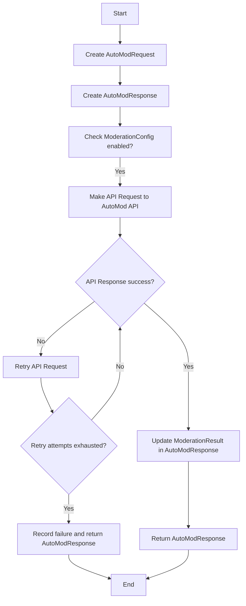

# `.\AutoGPT\autogpt_platform\backend\backend\executor\automod\models.py` 详细设计文档

The code defines a set of data models for interacting with an AutoMod API, including request and response models, and a configuration model for API integration.

## 整体流程



## 类结构

```
AutoModRequest (Request model)
├── ModerationResult (Individual moderation result)
│   ├── AutoModResponse (Response model)
│   └── ModerationConfig (Configuration model)
```

## 全局变量及字段


### `AutoModRequest.type`
    
Content type - 'text', 'image', 'video'

类型：`str`
    


### `AutoModRequest.content`
    
The content to moderate

类型：`str`
    


### `AutoModRequest.metadata`
    
Additional context about the content

类型：`Optional[Dict[str, Any]]`
    


### `ModerationResult.decision`
    
Moderation decision: 'approved', 'rejected', 'flagged'

类型：`str`
    


### `ModerationResult.reason`
    
Reason for the decision

类型：`Optional[str]`
    


### `AutoModResponse.success`
    
Whether the request was successful

类型：`bool`
    


### `AutoModResponse.content_id`
    
Unique reference ID for this moderation request

类型：`str`
    


### `AutoModResponse.status`
    
Overall status: 'approved', 'rejected', 'flagged', 'pending'

类型：`str`
    


### `AutoModResponse.moderation_results`
    
List of moderation results

类型：`List[ModerationResult]`
    


### `ModerationConfig.enabled`
    
Whether moderation is enabled

类型：`bool`
    


### `ModerationConfig.api_url`
    
AutoMod API base URL

类型：`str`
    


### `ModerationConfig.api_key`
    
AutoMod API key

类型：`str`
    


### `ModerationConfig.timeout`
    
Request timeout in seconds

类型：`int`
    


### `ModerationConfig.retry_attempts`
    
Number of retry attempts

类型：`int`
    


### `ModerationConfig.retry_delay`
    
Delay between retries in seconds

类型：`float`
    


### `ModerationConfig.fail_open`
    
If True, allow execution to continue if moderation fails

类型：`bool`
    


### `ModerationConfig.moderate_inputs`
    
Whether to moderate block inputs

类型：`bool`
    


### `ModerationConfig.moderate_outputs`
    
Whether to moderate block outputs

类型：`bool`
    


### `AutoModRequest.AutoModRequest.type`
    
Content type - 'text', 'image', 'video'

类型：`str`
    


### `AutoModRequest.AutoModRequest.content`
    
The content to moderate

类型：`str`
    


### `AutoModRequest.AutoModRequest.metadata`
    
Additional context about the content

类型：`Optional[Dict[str, Any]]`
    


### `ModerationResult.ModerationResult.decision`
    
Moderation decision: 'approved', 'rejected', 'flagged'

类型：`str`
    


### `ModerationResult.ModerationResult.reason`
    
Reason for the decision

类型：`Optional[str]`
    


### `AutoModResponse.AutoModResponse.success`
    
Whether the request was successful

类型：`bool`
    


### `AutoModResponse.AutoModResponse.content_id`
    
Unique reference ID for this moderation request

类型：`str`
    


### `AutoModResponse.AutoModResponse.status`
    
Overall status: 'approved', 'rejected', 'flagged', 'pending'

类型：`str`
    


### `AutoModResponse.AutoModResponse.moderation_results`
    
List of moderation results

类型：`List[ModerationResult]`
    


### `ModerationConfig.ModerationConfig.enabled`
    
Whether moderation is enabled

类型：`bool`
    


### `ModerationConfig.ModerationConfig.api_url`
    
AutoMod API base URL

类型：`str`
    


### `ModerationConfig.ModerationConfig.api_key`
    
AutoMod API key

类型：`str`
    


### `ModerationConfig.ModerationConfig.timeout`
    
Request timeout in seconds

类型：`int`
    


### `ModerationConfig.ModerationConfig.retry_attempts`
    
Number of retry attempts

类型：`int`
    


### `ModerationConfig.ModerationConfig.retry_delay`
    
Delay between retries in seconds

类型：`float`
    


### `ModerationConfig.ModerationConfig.fail_open`
    
If True, allow execution to continue if moderation fails

类型：`bool`
    


### `ModerationConfig.ModerationConfig.moderate_inputs`
    
Whether to moderate block inputs

类型：`bool`
    


### `ModerationConfig.ModerationConfig.moderate_outputs`
    
Whether to moderate block outputs

类型：`bool`
    
    

## 全局函数及方法


## 关键组件


### 张量索引与惰性加载

张量索引与惰性加载是深度学习框架中用于高效处理大型数据集的关键技术，它允许在需要时才计算数据，从而减少内存消耗和提高计算效率。

### 反量化支持

反量化支持是深度学习模型优化中的一个重要特性，它允许模型在量化过程中保持较高的精度，从而在降低模型大小和计算量的同时，保持模型性能。

### 量化策略

量化策略是深度学习模型优化过程中的一个关键步骤，它通过将浮点数权重转换为低精度整数来减少模型大小和计算量，同时保持模型性能。常见的量化策略包括全量化和定点量化。


## 问题及建议


### 已知问题

-   **全局变量缺失**：代码中没有使用全局变量，但考虑到可能存在外部依赖或配置，建议考虑引入全局变量来管理配置信息。
-   **错误处理**：代码中没有显示错误处理机制，建议添加异常处理来确保API调用失败时能够正确处理。
-   **日志记录**：代码中没有日志记录功能，建议添加日志记录来帮助调试和监控。

### 优化建议

-   **引入全局变量**：创建一个全局配置类或字典来存储API URL、API密钥等配置信息，以便在代码中方便地访问。
-   **错误处理**：在API调用和数据处理过程中添加异常处理，确保在出现错误时能够提供有用的错误信息，并采取适当的恢复措施。
-   **日志记录**：使用Python的`logging`模块添加日志记录，记录关键操作和潜在的错误，以便于问题追踪和系统监控。
-   **代码复用**：如果`AutoModRequest`、`ModerationResult`和`AutoModResponse`在其他地方也有使用，考虑将这些类移动到独立的模块中，以提高代码复用性。
-   **类型注解**：虽然代码中已经使用了类型注解，但建议进一步检查并确保所有类型注解都是准确的，以帮助提高代码的可维护性和可读性。
-   **单元测试**：为代码添加单元测试，以确保每个组件按预期工作，并有助于在未来的代码更改中保持代码质量。


## 其它


### 设计目标与约束

- 设计目标：确保内容在发布前经过适当的审查，以符合社区标准和法规要求。
- 约束：API调用必须高效，且在失败时能够重试，同时保持系统的稳定性。

### 错误处理与异常设计

- 错误处理：在API调用失败时，应记录错误信息并尝试重试。
- 异常设计：定义自定义异常类以处理特定错误情况。

### 数据流与状态机

- 数据流：用户请求 -> 请求模型 -> API调用 -> 响应模型 -> 用户反馈。
- 状态机：定义不同状态（如待处理、处理中、完成、失败）以及状态转换条件。

### 外部依赖与接口契约

- 外部依赖：AutoMod API。
- 接口契约：定义与AutoMod API交互的规范，包括请求和响应格式。

### 安全性与隐私

- 安全性：确保API密钥等敏感信息得到保护。
- 隐私：遵守相关法律法规，确保用户数据隐私。

### 性能优化

- 性能优化：优化API调用，减少不必要的网络请求，提高响应速度。

### 可维护性与可扩展性

- 可维护性：代码结构清晰，易于理解和维护。
- 可扩展性：设计允许轻松添加新的功能或集成其他API。

### 测试与验证

- 测试：编写单元测试和集成测试以确保代码质量。
- 验证：通过模拟数据和实际API调用验证功能正确性。

### 文档与用户指南

- 文档：提供详细的API文档和用户指南。
- 用户指南：指导用户如何使用AutoMod API进行内容审查。


    