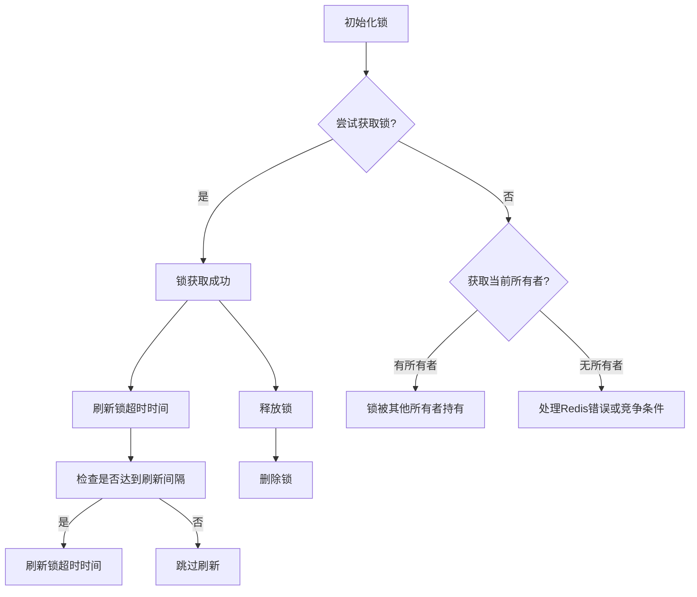
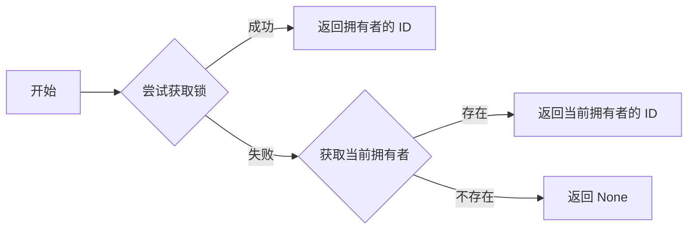
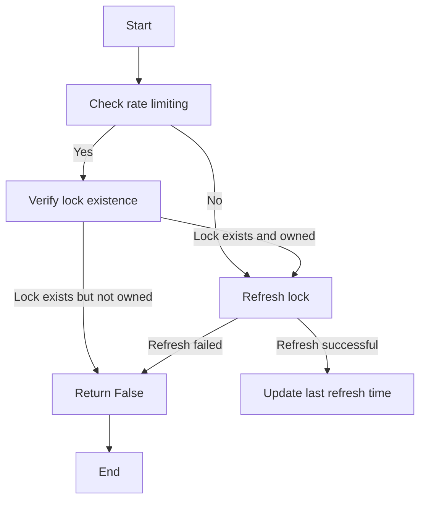
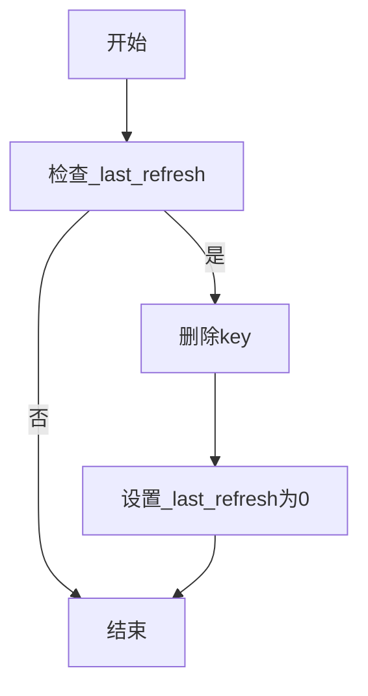

# `.\AutoGPT\autogpt_platform\backend\backend\executor\cluster_lock.py` 详细设计文档

This file implements a Redis-based distributed lock for cluster coordination, allowing for the prevention of duplicate execution across a cluster.

## 整体流程



## 类结构

```
ClusterLock (类)
```

## 全局变量及字段


### `logger`
    
日志记录器

类型：`logging.Logger`
    


### `ClusterLock.redis`
    
Redis客户端实例

类型：`Redis`
    


### `ClusterLock.key`
    
锁的键

类型：`str`
    


### `ClusterLock.owner_id`
    
所有者ID

类型：`str`
    


### `ClusterLock.timeout`
    
锁的超时时间

类型：`int`
    


### `ClusterLock._last_refresh`
    
上次刷新时间

类型：`float`
    
    

## 全局函数及方法


### ClusterLock.try_acquire

尝试获取锁。

参数：

- `self.redis`：`Redis`，Redis 客户端实例，用于与 Redis 服务器通信。
- `self.key`：`str`，锁的键，用于标识特定的锁。
- `self.owner_id`：`str`，拥有者的 ID，用于标识获取锁的用户或进程。
- `self.timeout`：`int`，锁的超时时间，以秒为单位。

返回值：`str | None`，如果成功获取锁，则返回拥有者的 ID；如果锁已被其他拥有者持有，则返回当前拥有者的 ID；如果 Redis 不可用或其他错误，则返回 None。

#### 流程图



#### 带注释源码

```python
def try_acquire(self) -> str | None:
    """Try to acquire the lock.

    Returns:
        - owner_id (self.owner_id) if successfully acquired
        - different owner_id if someone else holds the lock
        - None if Redis is unavailable or other error
    """
    try:
        success = self.redis.set(self.key, self.owner_id, nx=True, ex=self.timeout)
        if success:
            self._last_refresh = time.time()
            return self.owner_id  # Successfully acquired

        # Failed to acquire, get current owner
        current_value = self.redis.get(self.key)
        if current_value:
            current_owner = (
                current_value.decode("utf-8")
                if isinstance(current_value, bytes)
                else str(current_value)
            )
            return current_owner

        # Key doesn't exist but we failed to set it - race condition or Redis issue
        return None

    except Exception as e:
        logger.error(f"ClusterLock.try_acquire failed for key {self.key}: {e}")
        return None
```


### ClusterLock.refresh

Refreshes the lock's timeout time if the lock is still owned by the instance.

参数：

- 无

返回值：`bool`，Indicates whether the lock was successfully refreshed.

#### 流程图



#### 带注释源码

```python
def refresh(self) -> bool:
    """Refresh lock TTL if we still own it.

    Rate limited to at most once every timeout/10 seconds (minimum 1 second).
    During rate limiting, still verifies lock existence but skips TTL extension.
    Setting _last_refresh to 0 forces a refresh (bypasses rate limiting for testing).
    """
    # Calculate refresh interval: max(timeout // 10, 1)
    refresh_interval = max(self.timeout // 10, 1)
    current_time = time.time()

    # Check if we're within the rate limit period
    # _last_refresh == 0 forces a refresh (bypasses rate limiting for testing)
    is_rate_limited = (
        self._last_refresh > 0
        and (current_time - self._last_refresh) < refresh_interval
    )

    try:
        # Always verify lock existence, even during rate limiting
        current_value = self.redis.get(self.key)
        if not current_value:
            self._last_refresh = 0
            return False

        stored_owner = (
            current_value.decode("utf-8")
            if isinstance(current_value, bytes)
            else str(current_value)
        )
        if stored_owner != self.owner_id:
            self._last_refresh = 0
            return False

        # If rate limited, return True but don't update TTL or timestamp
        if is_rate_limited:
            return True

        # Perform actual refresh
        if self.redis.expire(self.key, self.timeout):
            self._last_refresh = current_time
            return True

        self._last_refresh = 0
        return False

    except Exception as e:
        logger.error(f"ClusterLock.refresh failed for key {self.key}: {e}")
        self._last_refresh = 0
        return False
```


### ClusterLock.release

释放锁。

参数：

- 无

返回值：`None`，无返回值

#### 流程图



#### 带注释源码

```python
def release(self):
    """Release the lock."""
    if self._last_refresh == 0:
        return

    try:
        self.redis.delete(self.key)
    except Exception:
        pass

    self._last_refresh = 0.0
```


## 关键组件


### 张量索引与惰性加载

用于在分布式锁中实现高效的键值对操作，避免不必要的资源消耗。

### 反量化支持

提供对Redis数据类型的反量化支持，确保数据的一致性和准确性。

### 量化策略

定义了锁的获取和释放策略，包括超时设置和刷新机制，确保锁的稳定性和可靠性。


## 问题及建议


### 已知问题

-   **错误处理**: 代码中使用了 `try-except` 块来捕获异常，但没有对不同的异常类型进行区分处理。这可能导致一些异常被错误地忽略，或者没有提供足够的信息来诊断问题。
-   **日志记录**: 日志记录仅记录了错误信息，没有记录成功操作或警告信息。这可能会影响对系统运行状态的全面了解。
-   **锁的释放**: 在 `release` 方法中，如果删除锁时发生异常，代码没有进行任何处理。这可能导致锁无法被正确释放，从而造成死锁。
-   **性能**: `try_acquire` 方法中，如果锁已经被其他进程持有，它会尝试获取当前持有者的信息。如果持有者信息很大，这可能会影响性能。

### 优化建议

-   **异常处理**: 对不同类型的异常进行区分处理，并提供更详细的错误信息。
-   **日志记录**: 增加对成功操作和警告信息的日志记录。
-   **锁的释放**: 在删除锁时，如果发生异常，应该记录错误信息，并尝试其他恢复策略。
-   **性能**: 考虑使用更高效的数据结构或算法来处理锁的获取和释放，以减少对性能的影响。
-   **测试**: 增加单元测试和集成测试，以确保代码在各种情况下都能正常工作。
-   **文档**: 提供更详细的文档，包括类的使用方法、参数说明、返回值描述等。


## 其它


### 设计目标与约束

- **设计目标**:
  - 实现一个基于Redis的分布式锁，用于在集群环境中防止重复执行。
  - 提供简单的接口，方便用户获取和释放锁。
  - 保证锁的原子性和一致性。
- **约束**:
  - 必须使用Redis作为后端存储。
  - 锁的获取和释放操作必须在同一个实例上执行。
  - 锁的持有时间由超时参数控制。

### 错误处理与异常设计

- 锁的获取和释放操作可能会遇到Redis不可用或其它错误。
- 在这些情况下，将记录错误并返回None或False。
- 用户需要处理这些返回值，并根据业务需求进行相应的错误处理。

### 数据流与状态机

- **数据流**:
  - 用户调用`try_acquire`尝试获取锁。
  - 如果成功，用户可以继续执行业务逻辑。
  - 用户调用`refresh`来刷新锁的超时时间。
  - 用户调用`release`释放锁。
- **状态机**:
  - 锁有三种状态：未获取、获取中、已获取。
  - `try_acquire`将锁从未获取或获取中状态转换为已获取状态。
  - `refresh`将锁从已获取状态转换为已获取状态，并刷新超时时间。
  - `release`将锁从已获取状态转换为未获取状态。

### 外部依赖与接口契约

- **外部依赖**:
  - Redis客户端库。
- **接口契约**:
  - `Redis`客户端必须支持`set`、`get`和`expire`方法。
  - `set`方法必须支持`nx`（只设置如果不存在）和`ex`（设置过期时间）选项。
  - `get`方法必须返回锁的当前所有者。
  - `expire`方法必须能够设置键的过期时间。


    