# `.\AutoGPT\autogpt_platform\backend\backend\executor\cluster_lock_test.py` 详细设计文档

该文件是基于 Redis 的分布式锁 ClusterLock 的集成测试套件，旨在不使用 Mock 的情况下验证锁在真实环境中的完整生命周期，包括基本的获取与释放、自动刷新与速率限制、TTL 过期机制、多线程并发竞争、网络故障等异常处理以及模拟真实业务场景的协调能力。

## 整体流程

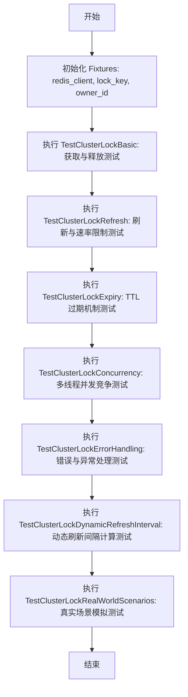

## 类结构

```
Global Scope (全局作用域)
├── Variables (变量)
│   └── logger
├── Functions (全局函数/Fixtures)
│   ├── redis_client
│   ├── lock_key
│   └── owner_id
└── Classes (测试类)
    ├── TestClusterLockBasic
    ├── TestClusterLockRefresh
    ├── TestClusterLockExpiry
    ├── TestClusterLockConcurrency
    ├── TestClusterLockErrorHandling
    ├── TestClusterLockDynamicRefreshInterval
    └── TestClusterLockRealWorldScenarios
```

## 全局变量及字段


### `logger`
    
全局日志记录器实例，用于记录当前模块的日志信息。

类型：`logging.Logger`
    


    

## 全局函数及方法


### `redis_client`

这是一个 pytest fixture 函数，用于为测试创建和配置一个 Redis 客户端实例。它复用后端的配置连接到 Redis，将 `decode_responses` 设置为 `False` 以支持原始字节操作，并在返回客户端之前清理所有匹配 `test_lock:*` 的遗留测试键，以确保测试环境的隔离性和清洁性。

参数：

-   无

返回值：`redis.Redis`，已初始化并配置好的 Redis 客户端连接对象。

#### 流程图

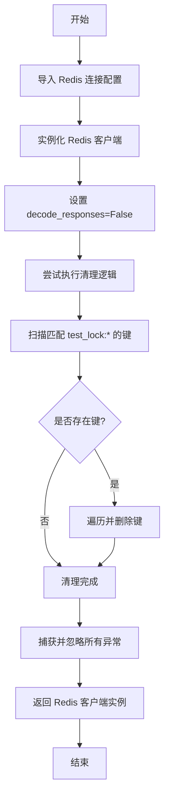

#### 带注释源码

```python
@pytest.fixture
def redis_client():
    """Get Redis client for testing using same config as backend."""
    # 导入后端定义的 Redis 连接参数
    from backend.data.redis_client import HOST, PASSWORD, PORT

    # 使用相同配置创建 Redis 客户端
    # decode_responses=False：ClusterLock 需要原始字节来进行所有权验证，
    # 因此这里不自动解码响应，而是返回 bytes 对象。
    client = redis.Redis(
        host=HOST,
        port=PORT,
        password=PASSWORD,
        decode_responses=False,  # ClusterLock needs raw bytes for ownership verification
    )

    # 清理阶段：删除任何可能遗留在 Redis 中的测试键
    try:
        # 扫描所有以 "test_lock:" 开头的键
        for key in client.scan_iter(match="test_lock:*"):
            # 删除该键
            client.delete(key)
    except Exception:
        pass  # 忽略清理过程中可能出现的任何错误（例如连接失败）

    # 返回准备好的客户端对象供测试用例使用
    return client
```


### `lock_key`

Pytest fixture，用于为每个测试生成唯一的锁键字符串，确保测试之间的键隔离。

参数：

*无*

返回值：`str`，格式为 `test_lock:{uuid4}` 的唯一锁键字符串。

#### 流程图

```mermaid
flowchart TD
    Start([开始]) --> GenerateUUID[生成UUID v4]
    GenerateUUID --> FormatString[格式化字符串: f'test_lock:{uuid}']
    FormatString --> End([返回字符串])
```

#### 带注释源码

```python
@pytest.fixture
def lock_key():
    """Generate unique lock key for each test."""  # 为每个测试生成唯一的锁键
    return f"test_lock:{uuid.uuid4()}"  # 返回包含UUID的唯一测试锁键字符串
```


### `owner_id`

这是一个 Pytest Fixture 函数，用于为每个测试用例生成一个唯一的、基于 UUID 的所有者标识符字符串，以模拟分布式锁中的不同客户端或进程 ID。

参数：

无

返回值：`str`，表示生成的唯一所有者 ID（UUID 字符串）。

#### 流程图

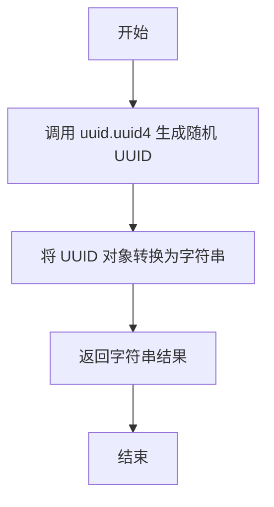

#### 带注释源码

```python
@pytest.fixture
def owner_id():
    """Generate unique owner ID for each test."""
    # 生成一个随机的 UUID（版本 4）并将其转换为字符串
    # 该字符串用于在测试中唯一标识锁的持有者
    return str(uuid.uuid4())
```


### `TestClusterLockBasic.test_lock_acquisition_success`

测试基本的锁获取操作是否成功，验证返回所有者 ID、更新内部时间戳并在 Redis 中设置正确键值。

参数：

-  `redis_client`：`redis.Redis`，配置用于测试的 Redis 客户端实例。
-  `lock_key`：`str`，用于锁的唯一键字符串。
-  `owner_id`：`str`，代表锁所有者的唯一标识符字符串。

返回值：`None`，pytest 测试函数不返回值。

#### 流程图

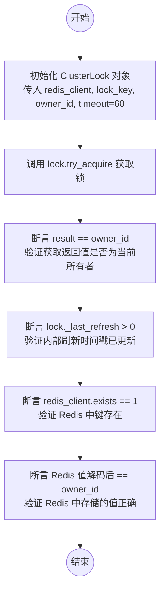

#### 带注释源码

```python
def test_lock_acquisition_success(self, redis_client, lock_key, owner_id):
    """Test basic lock acquisition succeeds."""
    # 初始化锁对象，设置超时时间为60秒
    lock = ClusterLock(redis_client, lock_key, owner_id, timeout=60)

    # 尝试获取锁
    # Lock should be acquired successfully
    result = lock.try_acquire()
    # 断言返回结果是 owner_id，表示获取成功
    assert result == owner_id  # Returns our owner_id when successfully acquired
    # 断言内部刷新时间戳 _last_refresh 大于0，表示状态已更新
    assert lock._last_refresh > 0

    # 验证 Redis 中的状态
    # Lock key should exist in Redis
    assert redis_client.exists(lock_key) == 1
    # 验证 Redis 中存储的值确实是 owner_id
    assert redis_client.get(lock_key).decode("utf-8") == owner_id
```


### `TestClusterLockBasic.test_lock_acquisition_contention`

测试当一个分布式锁已被持有时，第二个竞争者尝试获取该锁应当失败，并且返回当前锁的持有者 ID。

参数：

- `self`：`TestClusterLockBasic`，测试类实例。
- `redis_client`：`redis.Redis`，用于与 Redis 交互的客户端实例，由 pytest fixture 提供。
- `lock_key`：`str`，用于测试的分布式锁的唯一键，由 pytest fixture 提供。

返回值：`None`，该函数为测试方法，无返回值，若断言失败则抛出异常。

#### 流程图

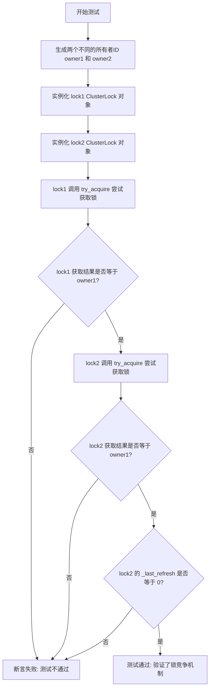

#### 带注释源码

```python
    def test_lock_acquisition_contention(self, redis_client, lock_key):
        """Test second acquisition fails when lock is held."""
        # 生成两个模拟的竞争者 ID
        owner1 = str(uuid.uuid4())
        owner2 = str(uuid.uuid4())

        # 为两个竞争者创建 ClusterLock 实例，共享同一个 lock_key
        lock1 = ClusterLock(redis_client, lock_key, owner1, timeout=60)
        lock2 = ClusterLock(redis_client, lock_key, owner2, timeout=60)

        # 第一个锁尝试获取，预期应成功
        result1 = lock1.try_acquire()
        assert result1 == owner1  # 验证返回值为 owner1，表示获取成功

        # 第二个锁尝试获取，预期应失败（因为锁已被 owner1 持有）
        result2 = lock2.try_acquire()
        assert result2 == owner1  # 验证返回值为当前持有者 owner1，表示被阻塞
        assert lock2._last_refresh == 0  # 验证 lock2 的刷新时间为 0，表示未持有锁
```


### `TestClusterLockBasic.test_lock_release_deletes_redis_key`

测试释放集群锁时是否正确删除了 Redis 中的键以及重置了本地状态，确保释放后其他持有者可以立即获取该锁。

参数：

- `self`：`TestClusterLockBasic`，测试类实例的引用。
- `redis_client`：`redis.Redis`，用于测试的 Redis 客户端实例。
- `lock_key`：`str`，唯一的锁键标识符。
- `owner_id`：`str`，唯一的锁所有者标识符。

返回值：`None`，该方法为测试函数，不返回具体值，通过断言验证行为。

#### 流程图

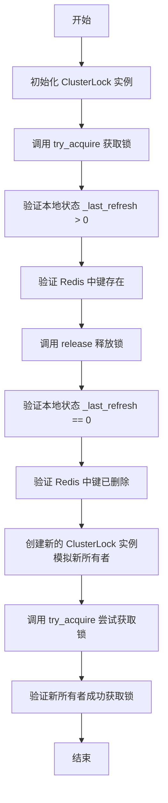

#### 带注释源码

```python
def test_lock_release_deletes_redis_key(self, redis_client, lock_key, owner_id):
    """Test lock release deletes Redis key and marks locally as released."""
    # 初始化锁对象，设置超时时间为60秒
    lock = ClusterLock(redis_client, lock_key, owner_id, timeout=60)

    # 尝试获取锁
    lock.try_acquire()
    # 断言本地状态显示锁已被获取（_last_refresh 大于 0）
    assert lock._last_refresh > 0
    # 断言 Redis 中存在该锁的键
    assert redis_client.exists(lock_key) == 1

    # 释放锁应该删除 Redis 中的键并在本地标记为已释放
    lock.release()
    # 断言本地状态已被重置（_last_refresh 归零）
    assert lock._last_refresh == 0
    assert lock._last_refresh == 0.0

    # 断言 Redis 中的键已被立即删除
    assert redis_client.exists(lock_key) == 0

    # 验证另一个锁对象应该能够立即获取该锁
    new_owner_id = str(uuid.uuid4())
    new_lock = ClusterLock(redis_client, lock_key, new_owner_id, timeout=60)
    # 断言新所有者成功获取锁（返回值等于新所有者ID）
    assert new_lock.try_acquire() == new_owner_id
```


### `TestClusterLockRefresh.test_lock_refresh_success`

测试锁刷新逻辑是否能够成功延长 Redis 中锁的 TTL（生存时间），并验证在强制刷新后，锁的过期时间被正确重置。

参数：

- `redis_client`：`redis.Redis`，由 pytest fixture 提供的 Redis 客户端实例，用于连接数据库。
- `lock_key`：`str`，由 pytest fixture 生成的唯一锁键，用于标识特定的锁。
- `owner_id`：`str`，由 pytest fixture 生成的唯一所有者 ID，用于标识锁的持有者。

返回值：`None`，该函数为测试方法，没有返回值。

#### 流程图

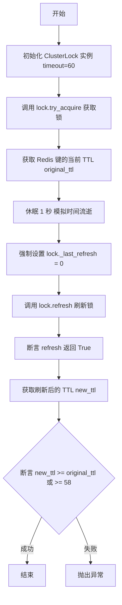

#### 带注释源码

```python
def test_lock_refresh_success(self, redis_client, lock_key, owner_id):
    """Test lock refresh extends TTL."""
    # 1. 初始化锁对象，设置超时时间为 60 秒
    lock = ClusterLock(redis_client, lock_key, owner_id, timeout=60)

    # 2. 尝试获取锁
    lock.try_acquire()
    
    # 3. 记录 Redis 中当前锁的 TTL (Time To Live)
    original_ttl = redis_client.ttl(lock_key)

    # 4. 模拟等待一段时间（1秒）
    time.sleep(1)
    
    # 5. 将内部刷新时间戳设为 0，强制下一次刷新跳过速率限制
    lock._last_refresh = 0  # Force refresh past rate limit
    
    # 6. 执行刷新操作并断言返回成功
    assert lock.refresh() is True

    # 7. 获取刷新后的 TTL
    # 8. 验证 TTL 被延长（新 TTL 应大于等于旧 TTL，或接近 60 秒，允许一定的时间误差）
    new_ttl = redis_client.ttl(lock_key)
    assert new_ttl >= original_ttl or new_ttl >= 58  # Allow for timing variance
```


### `TestClusterLockRefresh.test_lock_refresh_rate_limiting`

测试锁的刷新操作是否按照超时时间的十分之一（`timeout/10`）进行速率限制。验证立即进行的第二次刷新请求会被跳过（即不实际更新 Redis），但方法仍返回 `True`，且内部的最后刷新时间戳保持不变。

参数：

- `self`：`TestClusterLockRefresh`，测试类实例。
- `redis_client`：`redis.Redis`，用于连接 Redis 的客户端实例，由 fixture 注入。
- `lock_key`：`str`，用于测试的锁键名，由 fixture 注入。
- `owner_id`：`str`，用于测试的锁所有者标识，由 fixture 注入。

返回值：`None`，该方法为单元测试，无显式返回值。

#### 流程图

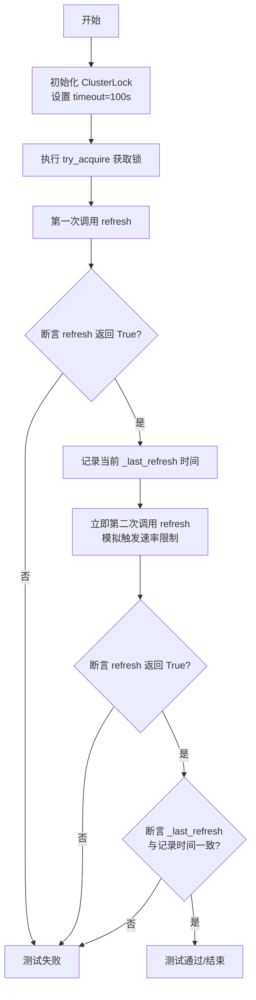

#### 带注释源码

```python
def test_lock_refresh_rate_limiting(self, redis_client, lock_key, owner_id):
    """Test refresh is rate-limited to timeout/10."""
    # 创建锁实例，设置超时时间为100秒（意味着刷新速率限制间隔为10秒）
    lock = ClusterLock(
        redis_client, lock_key, owner_id, timeout=100
    )  # 100s timeout

    # 获取锁
    lock.try_acquire()

    # 第一次刷新应该成功执行
    assert lock.refresh() is True
    first_refresh_time = lock._last_refresh

    # 立即进行第二次刷新
    # 预期行为：操作应被速率限制跳过，但仍返回 True（表示请求被接受但未执行），
    # 且内部的最后刷新时间戳不应改变
    assert lock.refresh() is True  # Returns True but skips actual refresh
    assert lock._last_refresh == first_refresh_time  # Time unchanged
```


### `TestClusterLockRefresh.test_lock_refresh_verifies_existence_during_rate_limit`

测试在刷新操作受速率限制时，是否仍然会验证锁在Redis中的存在性。该场景模拟了锁在外部被删除或过期后，即使处于刷新频率限制窗口内，刷新操作也应正确检测到锁已丢失并返回失败。

参数：

- `self`：`TestClusterLockRefresh`，测试类的实例引用。
- `redis_client`：`redis.Redis`，Pytest fixture提供的Redis客户端实例，用于连接和操作数据库。
- `lock_key`：`str`，Pytest fixture生成的唯一锁键，用于标识Redis中的锁。
- `owner_id`：`str`，Pytest fixture生成的唯一所有者ID，用于标识锁的持有者。

返回值：`None`，该函数为测试方法，无显式返回值，通过断言验证逻辑。

#### 流程图

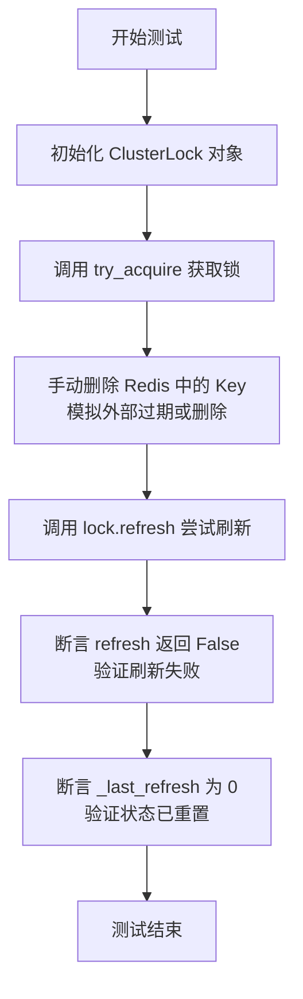

#### 带注释源码

```python
def test_lock_refresh_verifies_existence_during_rate_limit(
    self, redis_client, lock_key, owner_id
):
    """Test refresh verifies lock existence even during rate limiting."""
    # 初始化锁对象，设置超时时间为100秒
    lock = ClusterLock(redis_client, lock_key, owner_id, timeout=100)

    # 尝试获取锁
    lock.try_acquire()

    # 手动删除Redis中的锁键，模拟锁已经过期或被其他进程/外部操作删除
    redis_client.delete(lock_key)

    # 调用刷新方法。
    # 预期行为：即使可能处于频率限制期（通常为了减少Redis压力），refresh 也应该检测到Key已不存在。
    # 因此，refresh 应该返回 False，并且不应该简单地因为限流而跳过检查或返回成功。
    assert lock.refresh() is False
    
    # 验证内部状态 _last_refresh 已被重置为0，表示锁不再有效
    assert lock._last_refresh == 0
```


### `TestClusterLockRefresh.test_lock_refresh_ownership_lost`

测试当锁的所有权丢失给另一个进程时，锁的续期操作是否正确失败。该测试通过直接修改 Redis 中的键值来模拟所有权变更的场景，验证了 `ClusterLock` 在检测到当前持有者与 Redis 中存储的持有者不一致时，能够拒绝续期并重置内部状态。

参数：

- `self`：`TestClusterLockRefresh`，测试类实例。
- `redis_client`：`redis.Redis`，Pytest fixture，提供用于测试的 Redis 客户端连接。
- `lock_key`：`str`，Pytest fixture，生成的唯一锁键标识符。
- `owner_id`：`str`，Pytest fixture，生成的唯一所有者标识符。

返回值：`None`，该方法为单元测试函数，不返回业务逻辑值，通过断言验证行为。

#### 流程图

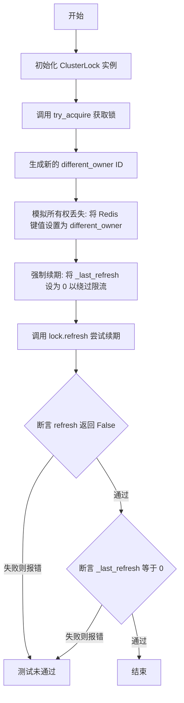

#### 带注释源码

```python
def test_lock_refresh_ownership_lost(self, redis_client, lock_key, owner_id):
    """Test refresh fails when ownership is lost."""
    # 1. 初始化锁对象，设置超时时间为60秒
    lock = ClusterLock(redis_client, lock_key, owner_id, timeout=60)

    # 2. 首先获取锁，确保当前 owner_id 持有该锁
    lock.try_acquire()

    # 3. 模拟另一个进程接管了锁：在 Redis 中直接将锁的值修改为一个新的所有者 ID
    different_owner = str(uuid.uuid4())
    redis_client.set(lock_key, different_owner, ex=60)

    # 4. 强制进行续期检查：将上次刷新时间设为0，绕过 ClusterLock 内部的刷新频率限制
    lock._last_refresh = 0  # Force refresh past rate limit
    
    # 5. 验证续期失败：因为 Redis 中的 owner_id 已经不是当前对象持有的 ID
    assert lock.refresh() is False
    # 6. 验证状态重置：续期失败后，最后刷新时间应被重置为 0，表示不再持有锁
    assert lock._last_refresh == 0
```


### `TestClusterLockRefresh.test_lock_refresh_when_not_acquired`

测试在从未获取锁的情况下调用刷新方法的行为，预期该方法应返回 False，表示刷新失败。

参数：

-   `redis_client`：`redis.Redis`，用于测试的 Redis 客户端实例，由 pytest fixture 注入。
-   `lock_key`：`str`，生成的唯一锁键名，由 pytest fixture 注入。
-   `owner_id`：`str`，生成的唯一拥有者标识符，由 pytest fixture 注入。

返回值：`None`，无返回值（测试方法通过断言验证逻辑）。

#### 流程图

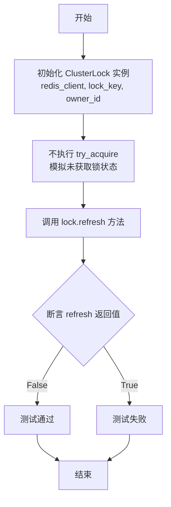

#### 带注释源码

```python
    def test_lock_refresh_when_not_acquired(self, redis_client, lock_key, owner_id):
        """Test refresh fails when lock was never acquired."""
        # 创建一个分布式锁实例，指定超时时间为 60 秒
        lock = ClusterLock(redis_client, lock_key, owner_id, timeout=60)

        # Refresh without acquiring should fail
        # 在未调用 try_acquire 获取锁的情况下直接调用 refresh
        # 预期结果应返回 False，表示刷新失败，因为当前并未持有锁
        assert lock.refresh() is False
```


### `TestClusterLockExpiry.test_lock_natural_expiry`

测试分布式锁是否能够按照设定的超时时间，通过 Redis 的 TTL（生存时间）机制自然过期，从而允许新的锁实例获取同一把锁。

参数：

- `self`：`TestClusterLockExpiry`，测试类的实例。
- `redis_client`：`redis.Redis`，Pytest fixture，提供用于测试的 Redis 客户端连接。
- `lock_key`：`str`，Pytest fixture，生成的唯一锁键名。
- `owner_id`：`str`，Pytest fixture，生成的唯一锁所有者标识。

返回值：`None`，该方法是测试用例，无返回值，主要通过断言验证行为。

#### 流程图

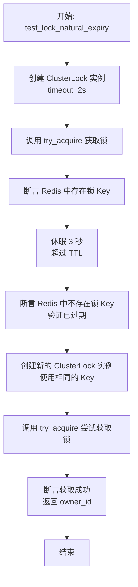

#### 带注释源码

```python
def test_lock_natural_expiry(self, redis_client, lock_key, owner_id):
    """Test lock expires naturally via Redis TTL."""
    # 创建一个锁实例，设置超时时间为 2 秒
    lock = ClusterLock(
        redis_client, lock_key, owner_id, timeout=2
    )  # 2 second timeout

    # 尝试获取锁
    lock.try_acquire()
    # 断言：此时锁 Key 应该存在于 Redis 中
    assert redis_client.exists(lock_key) == 1

    # 等待 3 秒，超过锁设定的 2 秒超时时间，模拟自然过期
    time.sleep(3)
    # 断言：此时锁 Key 应该已被 Redis 删除（已过期）
    assert redis_client.exists(lock_key) == 0

    # 创建一个新的锁实例，使用相同的 Key
    new_lock = ClusterLock(redis_client, lock_key, owner_id, timeout=60)
    # 断言：新实例应该能成功获取锁，证明旧锁已自然释放
    assert new_lock.try_acquire() == owner_id
```


### `TestClusterLockExpiry.test_lock_refresh_prevents_expiry`

测试刷新分布式锁的操作是否能有效防止锁因达到初始超时时间而过期。验证通过在过期前主动刷新锁的 TTL，使得锁在超过原始生存时间后仍然存在。

参数：

-  `self`：`TestClusterLockExpiry`，测试类的实例。
-  `redis_client`：`redis.Redis`，用于连接和操作 Redis 的客户端对象，由 pytest fixture 提供。
-  `lock_key`：`str`，测试用的唯一锁键名，由 pytest fixture 提供。
-  `owner_id`：`str`，测试用的唯一所有者标识，由 pytest fixture 提供。

返回值：`None`，该方法为测试函数，不返回任何值，通过断言验证行为。

#### 流程图

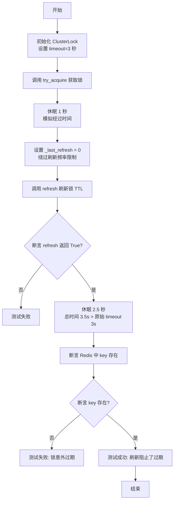

#### 带注释源码

```python
    def test_lock_refresh_prevents_expiry(self, redis_client, lock_key, owner_id):
        """Test refreshing prevents lock from expiring."""
        # 初始化锁对象，设置超时时间为 3 秒
        lock = ClusterLock(
            redis_client, lock_key, owner_id, timeout=3
        )  # 3 second timeout

        # 尝试获取锁
        lock.try_acquire()

        # 等待 1 秒，消耗一部分锁的生存时间
        time.sleep(1)
        
        # 强制设置 _last_refresh 为 0，以绕过 ClusterLock 内部的刷新频率限制
        # 确保下一次 refresh() 调用一定会执行实际的 Redis 刷新操作
        lock._last_refresh = 0  # Force refresh past rate limit
        
        # 执行刷新操作，预期应返回 True 表示成功
        assert lock.refresh() is True

        # 再等待 2.5 秒
        # 此时总耗时 = 1s (等待前) + 2.5s (等待后) = 3.5s
        # 这超过了初始设置的 3 秒超时时间
        # 如果没有刷新，锁此时应该已经过期
        time.sleep(2.5)
        
        # 验证锁的 Key 在 Redis 中仍然存在
        # 这证明了之前的 refresh 操作成功重置了 TTL，阻止了锁的自然过期
        assert redis_client.exists(lock_key) == 1  # Should still exist
```


### `TestClusterLockConcurrency.test_multiple_threads_contention`

Test multiple threads competing for same lock.

参数：

- `self`：`TestClusterLockConcurrency`，类的实例引用。
- `redis_client`：`redis.Redis`，用于测试的 Redis 客户端连接。
- `lock_key`：`str`，用于测试的唯一锁键。

返回值：`None`，无返回值。

#### 流程图

```mermaid
flowchart TD
    A[开始] --> B[初始化线程数 num_threads = 5]
    B --> C[初始化成功获取列表 successful_acquisitions = []]
    C --> D[定义内部函数 try_acquire_lock]
    D --> E[循环创建线程 i = 0 to 4]
    E --> F[实例化 Thread 并传入 try_acquire_lock]
    F --> G[启动线程]
    G --> E
    E --> H[循环结束]
    H --> I[遍历所有线程对象]
    I --> J[调用 join 等待线程结束]
    J --> I
    I --> K[所有线程结束]
    K --> L[断言 lensuccessful_acquisitions == 1]
    L --> M[结束]

    subgraph Thread_Workflow
        T1[开始] --> T2[生成 owner_id]
        T2 --> T3[创建 ClusterLock 实例]
        T3 --> T4[调用 try_acquire 尝试获取锁]
        T4 --> T5{是否获取成功?}
        T5 -- 是 --> T6[将 thread_id 加入 successful_acquisitions]
        T6 --> T7[休眠 0.1 秒]
        T7 --> T8[调用 release 释放锁]
        T8 --> T9[结束]
        T5 -- 否 --> T9
    end
```

#### 带注释源码

```python
def test_multiple_threads_contention(self, redis_client, lock_key):
    """Test multiple threads competing for same lock."""
    # 定义并发线程数量
    num_threads = 5
    # 用于记录成功获取锁的线程ID列表
    successful_acquisitions = []

    def try_acquire_lock(thread_id):
        # 为每个线程生成唯一的 owner_id
        owner_id = f"thread_{thread_id}"
        # 初始化 ClusterLock 实例
        lock = ClusterLock(redis_client, lock_key, owner_id, timeout=60)
        
        # 尝试获取锁，如果返回值等于当前 owner_id 则表示获取成功
        if lock.try_acquire() == owner_id:
            # 记录成功获取锁的线程ID
            successful_acquisitions.append(thread_id)
            # 模拟持有锁进行短暂的工作
            time.sleep(0.1)  # Hold lock briefly
            # 释放锁
            lock.release()

    threads = []
    # 创建并启动多个线程
    for i in range(num_threads):
        thread = Thread(target=try_acquire_lock, args=(i,))
        threads.append(thread)
        thread.start()

    # 等待所有线程执行完毕
    for thread in threads:
        thread.join()

    # 验证只有一个线程能够成功获取锁
    # Only one thread should have acquired the lock
    assert len(successful_acquisitions) == 1
```


### `TestClusterLockConcurrency.test_sequential_lock_reuse`

测试分布式锁在自然过期后能否被不同的所有者按顺序重新获取。该测试模拟了三个不同的所有者依次获取锁，等待锁超过其生存时间（TTL）过期，并验证在下一个所有者尝试获取之前Redis中的锁键已被正确删除，确保锁资源可以被循环复用。

参数：

- `self`：`TestClusterLockConcurrency`，测试类的实例。
- `redis_client`：`redis.Redis`，通过 fixture 注入的 Redis 客户端，用于连接和操作 Redis。
- `lock_key`：`str`，通过 fixture 生成的唯一锁键，用于标识测试中的锁资源。

返回值：`None`，该函数为测试方法，不返回具体值，通过 assert 语句验证逻辑正确性。

#### 流程图

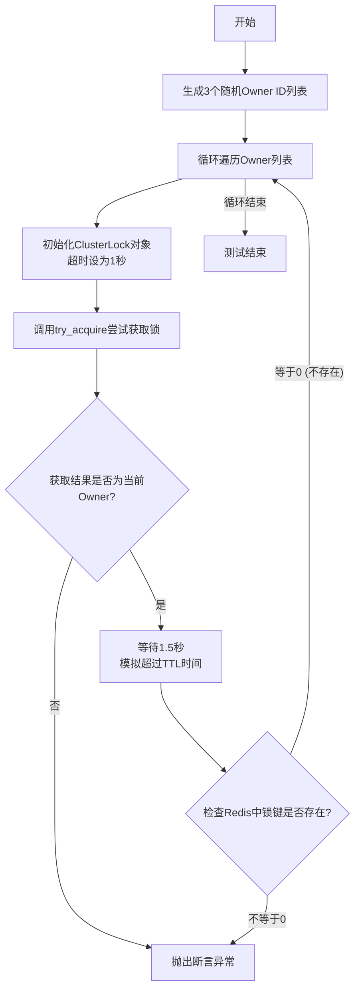

#### 带注释源码

```python
    def test_sequential_lock_reuse(self, redis_client, lock_key):
        """Test lock can be reused after natural expiry."""
        # 生成3个不同的所有者ID，用于模拟不同进程或节点
        owners = [str(uuid.uuid4()) for _ in range(3)]

        # 遍历每个所有者，模拟顺序加锁的场景
        for i, owner_id in enumerate(owners):
            # 创建ClusterLock实例，设置超时时间为1秒
            lock = ClusterLock(redis_client, lock_key, owner_id, timeout=1)  # 1 second

            # 尝试获取锁，断言返回值必须是当前的owner_id，表示获取成功
            assert lock.try_acquire() == owner_id
            
            # 休眠1.5秒，超过锁的TTL（1秒），确保锁在Redis中自然过期
            time.sleep(1.5)  # Wait for expiry

            # 验证锁已过期，Redis中不应存在该key
            assert redis_client.exists(lock_key) == 0
```


### `TestClusterLockConcurrency.test_refresh_during_concurrent_access`

该方法用于验证在并发场景下，当一个线程持有锁并不断刷新锁的有效期时，另一个线程尝试获取锁应当失败，确保持锁者能维持对锁的控制权。

参数：

- `self`：`TestClusterLockConcurrency`，测试类实例，用于访问测试上下文。
- `redis_client`：`redis.Redis`，Redis 客户端 fixture，用于连接 Redis 数据库。
- `lock_key`：`str`，锁的唯一标识键，用于在 Redis 中标识特定的锁。

返回值：`None`，该方法为测试函数，无返回值。

#### 流程图

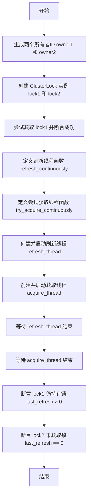

#### 带注释源码

```python
    def test_refresh_during_concurrent_access(self, redis_client, lock_key):
        """Test lock refresh works correctly during concurrent access attempts."""
        # 生成两个不同的所有者ID，模拟两个不同的进程或线程
        owner1 = str(uuid.uuid4())
        owner2 = str(uuid.uuid4())

        # 初始化两个锁对象，使用相同的 lock_key 和较短的 timeout (5秒)
        lock1 = ClusterLock(redis_client, lock_key, owner1, timeout=5)
        lock2 = ClusterLock(redis_client, lock_key, owner2, timeout=5)

        # Thread 1 holds lock and refreshes
        # Owner1 先获取锁，预期应返回 owner1
        assert lock1.try_acquire() == owner1

        # 定义线程1的执行逻辑：持续刷新锁
        def refresh_continuously():
            for _ in range(10):
                lock1._last_refresh = 0  # 强制重置刷新时间，绕过刷新频率限制
                lock1.refresh()         # 执行刷新操作
                time.sleep(0.1)         # 短暂休眠

        # 定义线程2的执行逻辑：持续尝试获取锁
        def try_acquire_continuously():
            attempts = 0
            while attempts < 20:
                if lock2.try_acquire() == owner2:
                    return True # 如果获取成功则返回 True
                time.sleep(0.1) # 获取失败则休眠重试
                attempts += 1
            return False # 尝试多次仍未获取成功

        # 创建并启动刷新线程
        refresh_thread = Thread(target=refresh_continuously)
        # 创建并启动竞争获取线程
        acquire_thread = Thread(target=try_acquire_continuously)

        refresh_thread.start()
        acquire_thread.start()

        # 等待两个线程执行完毕
        refresh_thread.join()
        acquire_thread.join()

        # Lock1 should still own the lock due to refreshes
        # 验证 lock1 仍然持有锁（_last_refresh > 0 表示锁状态有效）
        assert lock1._last_refresh > 0
        # 验证 lock2 未能获取锁（_last_refresh == 0 表示未持有）
        assert lock2._last_refresh == 0
```


### `TestClusterLockErrorHandling.test_redis_connection_failure_on_acquire`

该测试方法用于验证当Redis服务不可用或连接失败时，`ClusterLock` 在尝试获取锁时是否能够优雅地处理错误，确保返回 `None` 且不更新锁的内部状态。

参数：

- `self`：`TestClusterLockErrorHandling`，测试类的实例引用。
- `lock_key`：`str`，用于在Redis中标识锁的唯一键值，通过fixture注入。
- `owner_id`：`str`，锁持有者的唯一标识符，通过fixture注入。

返回值：`None`，该方法为单元测试，无返回值，通过断言验证行为。

#### 流程图

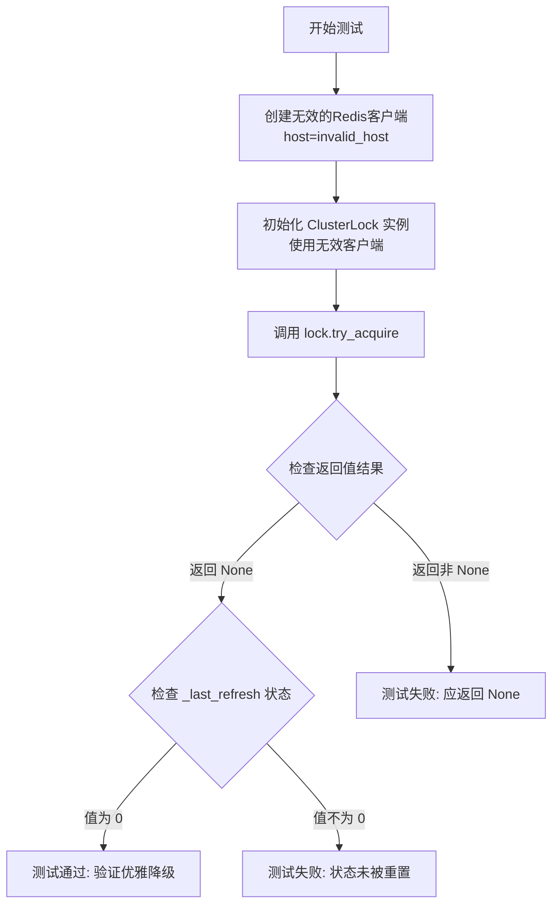

#### 带注释源码

```python
def test_redis_connection_failure_on_acquire(self, lock_key, owner_id):
    """Test graceful handling when Redis is unavailable during acquisition."""
    # 步骤 1: 配置一个指向无效主机和端口的 Redis 客户端，模拟连接失败场景
    # socket_connect_timeout=1 确保测试快速失败，不必等待太久
    bad_redis = redis.Redis(
        host="invalid_host", port=1234, socket_connect_timeout=1
    )
    # 步骤 2: 使用配置错误的 Redis 客户端初始化 ClusterLock 对象
    lock = ClusterLock(bad_redis, lock_key, owner_id, timeout=60)

    # 步骤 3: 尝试获取锁
    # 预期行为：由于 Redis 连接失败，try_acquire 应捕获异常并返回 None
    result = lock.try_acquire()
    
    # 断言 1: 验证返回值为 None，表示未能获取锁（因连接错误）
    assert result is None  # Returns None when Redis fails
    
    # 断言 2: 验证内部状态 _last_refresh 仍为 0，表示锁未被获取
    assert lock._last_refresh == 0
```


### `TestClusterLockErrorHandling.test_redis_connection_failure_on_refresh`

测试当 Redis 在刷新过程中连接失败时的优雅处理行为，确保锁状态被正确重置。

参数：

-  `self`：`TestClusterLockErrorHandling`，测试类实例。
-  `redis_client`：`redis.Redis`，Redis 客户端实例，由 pytest fixture 提供。
-  `lock_key`：`str`，唯一的锁键，由 pytest fixture 生成。
-  `owner_id`：`str`，唯一的所有者标识符，由 pytest fixture 生成。

返回值：`None`，该方法是测试用例，不返回值。

#### 流程图

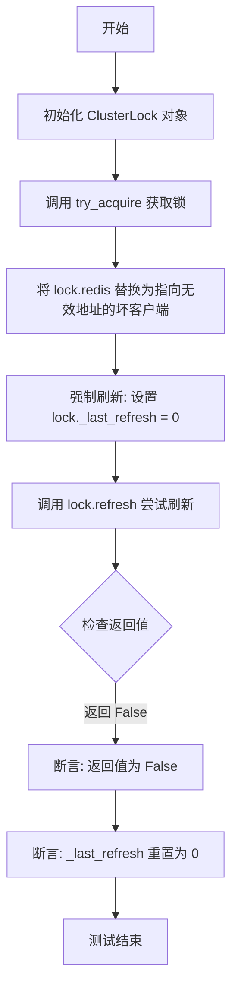

#### 带注释源码

```python
    def test_redis_connection_failure_on_refresh(
        self, redis_client, lock_key, owner_id
    ):
        """Test graceful handling when Redis fails during refresh."""
        # 1. 初始化锁对象，设置超时为 60 秒
        lock = ClusterLock(redis_client, lock_key, owner_id, timeout=60)

        # 2. 正常获取锁，确保锁状态活跃
        assert lock.try_acquire() == owner_id

        # 3. 将锁对象内部的 Redis 客户端替换为一个指向无效主机和端口的客户端
        #    这模拟了在持有锁期间 Redis 连接突然失败的场景
        lock.redis = redis.Redis(
            host="invalid_host", port=1234, socket_connect_timeout=1
        )

        # 4. 强制刷新：将 _last_refresh 设置为 0，以绕过速率限制机制，
        #    确保下一次调用 refresh() 会真正尝试与 Redis 通信
        lock._last_refresh = 0  # Force refresh

        # 5. 尝试刷新锁
        assert lock.refresh() is False
        
        # 6. 验证：由于连接失败，刷新应返回 False，并且内部状态 _last_refresh 应被重置为 0
        #    这表示锁被视为已丢失或不再有效
        assert lock._last_refresh == 0
```


### `TestClusterLockErrorHandling.test_invalid_lock_parameters`

测试基本的锁参数设置和对象构造，验证 `ClusterLock` 实例是否正确存储 key、所有者 ID 和超时值，而无需复杂的验证逻辑。

参数：

- `self`：`TestClusterLockErrorHandling`，测试类的实例，由 pytest 框架隐式传递。
- `redis_client`：`redis.Redis`，用于与 Redis 交互的客户端对象，通过 `redis_client` fixture 提供。

返回值：`None`，该函数为测试方法，不返回具体值，通过断言验证内部状态。

#### 流程图

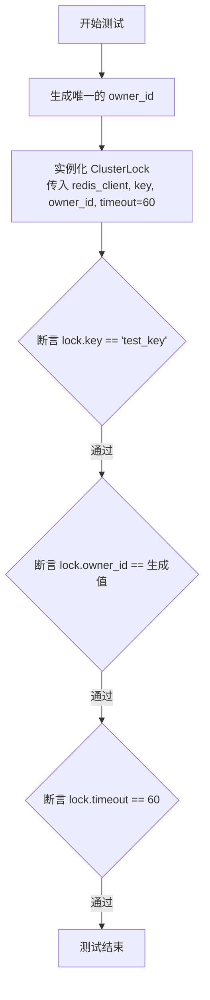

#### 带注释源码

```python
def test_invalid_lock_parameters(self, redis_client):
    """Test validation of lock parameters."""
    # 生成一个随机的所有者标识符
    owner_id = str(uuid.uuid4())

    # 所有参数现在都很简单 - 不需要验证
    # 这里只是测试基本的构造是否工作正常
    # 创建 ClusterLock 实例，并传入固定的 key、生成的 owner_id 和 60秒的超时时间
    lock = ClusterLock(redis_client, "test_key", owner_id, timeout=60)

    # 验证锁对象的 key 属性是否正确赋值
    assert lock.key == "test_key"
    # 验证锁对象的 owner_id 属性是否正确赋值
    assert lock.owner_id == owner_id
    # 验证锁对象的 timeout 属性是否正确赋值
    assert lock.timeout == 60
```


### `TestClusterLockErrorHandling.test_refresh_after_redis_key_deleted`

测试当Redis中的锁密钥被手动删除后，锁刷新机制的行为，确保刷新操作失败并将锁状态正确标记为未获取。

参数：

- `self`：`TestClusterLockErrorHandling`，测试类的实例。
- `redis_client`：`redis.Redis`，用于连接和操作Redis的客户端对象（由fixture提供）。
- `lock_key`：`str`，唯一的锁标识符（由fixture提供）。
- `owner_id`：`str`，锁的持有者唯一标识符（由fixture提供）。

返回值：`None`，该方法为测试函数，无返回值，通过断言验证逻辑。

#### 流程图

```mermaid
graph TD
    A[开始] --> B[初始化 ClusterLock 实例]
    B --> C[尝试获取锁: lock.try_acquire]
    C --> D[手动删除 Redis 中的 Key: redis_client.delete]
    D --> E[强制刷新: 设置 lock._last_refresh 为 0]
    E --> F[执行刷新: lock.refresh]
    F --> G[断言: refresh 返回 False]
    G --> H[断言: lock._last_refresh 为 0]
    H --> I[测试结束]
```

#### 带注释源码

```python
def test_refresh_after_redis_key_deleted(self, redis_client, lock_key, owner_id):
    """Test refresh behavior when Redis key is manually deleted."""
    # 1. 初始化分布式锁实例，设置超时时间为60秒
    lock = ClusterLock(redis_client, lock_key, owner_id, timeout=60)

    # 2. 成功获取锁
    lock.try_acquire()

    # 3. 模拟外部操作导致Redis中的锁Key被删除（例如过期、被其他程序删除或Redis故障）
    redis_client.delete(lock_key)

    # 4. 强制绕过刷新频率限制，确保此次调用会尝试与Redis交互
    lock._last_refresh = 0  # Force refresh
    
    # 5. 验证刷新操作应当失败，因为Key已不存在
    assert lock.refresh() is False
    
    # 6. 验证锁的内部状态已被标记为未获取（_last_refresh 重置为 0）
    assert lock._last_refresh == 0
```


### `TestClusterLockDynamicRefreshInterval.test_refresh_interval_calculation`

测试锁的动态刷新间隔是否根据超时时间正确计算（公式为 `max(timeout/10, 1)`），并验证基于该间隔的速率限制机制是否正常工作。

参数：

- `redis_client`: `redis.Redis`, Redis客户端fixture，用于连接Redis进行锁操作。
- `lock_key`: `str`, 锁的唯一键名fixture，用于标识分布式锁。
- `owner_id`: `str`, 锁拥有者的唯一标识符fixture。

返回值：`None`，无返回值（测试方法）。

#### 流程图

```mermaid
flowchart TD
    A["开始: test_refresh_interval_calculation"] --> B["定义测试用例列表 (timeout, expected_interval)"]
    B --> C["遍历测试用例"]
    C --> D["创建 ClusterLock 实例并设置 timeout"]
    D --> E["调用 lock.try_acquire 获取锁"]
    E --> F["计算预期刷新间隔: max(timeout // 10, 1)"]
    F --> G["断言: 计算值 == 预期值"]
    G --> H["调用 lock.refresh"]
    H --> I["记录 first_refresh_time"]
    I --> J["休眠 0.1 秒"]
    J --> K["再次调用 lock.refresh"]
    K --> L["断言: last_refresh_time 保持不变 (验证限流)"]
    L --> M{是否还有测试用例?}
    M -- 是 --> C
    M -- 否 --> N["结束"]
```

#### 带注释源码

```python
    def test_refresh_interval_calculation(self, redis_client, lock_key, owner_id):
        """Test refresh interval is calculated as max(timeout/10, 1)."""
        # 定义测试用例，包含不同的超时时间和预期的刷新间隔
        # 逻辑为 timeout 除以 10 取整，且最小值为 1
        test_cases = [
            (5, 1),    # 5/10 = 0.5 -> floor -> 0, 但最小限制为 1
            (10, 1),   # 10/10 = 1
            (30, 3),   # 30/10 = 3
            (100, 10), # 100/10 = 10
            (200, 20), # 200/10 = 20
            (1000, 100), # 1000/10 = 100
        ]

        for timeout, expected_interval in test_cases:
            # 根据当前测试用例的 timeout 创建锁实例
            lock = ClusterLock(
                redis_client, f"{lock_key}_{timeout}", owner_id, timeout=timeout
            )
            lock.try_acquire()

            # 按照实现的逻辑计算预期的刷新间隔
            refresh_interval = max(timeout // 10, 1)
            # 验证计算出的间隔是否符合预期
            assert refresh_interval == expected_interval

            # 测试刷新机制在计算出的间隔下是否有效
            assert lock.refresh() is True
            first_refresh_time = lock._last_refresh

            # 休眠一小段时间（小于所有预期的刷新间隔）
            time.sleep(0.1)
            
            # 再次尝试刷新，因为未达到刷新间隔，应该被限流
            assert lock.refresh() is True
            # 断言 _last_refresh 时间未变，确认发生了限流而没有实际刷新 Redis
            assert lock._last_refresh == first_refresh_time  # No actual refresh
```


### `TestClusterLockRealWorldScenarios.test_execution_coordination_simulation`

模拟跨多个Pod（进程）的图执行协调场景，验证分布式锁在并发竞争环境下是否能确保只有一个执行者成功获取锁并执行任务，其余执行者被正确拒绝。

参数：

-  `self`：`TestClusterLockRealWorldScenarios`，测试类的实例。
-  `redis_client`：`redis.Redis`，用于连接Redis数据库的客户端对象，由pytest fixture提供。

返回值：`None`，该函数为测试方法，不返回具体数值，通过断言验证结果。

#### 流程图

```mermaid
flowchart TD
    A[Start: test_execution_coordination_simulation] --> B[Generate graph_exec_id]
    B --> C[Define lock_key]
    C --> D[Define 3 simulated pods]
    D --> E[Initialize execution_results dict]
    E --> F[Create and start threads for each pod]
    F --> G{Thread: execute_graph logic}
    G --> H[Create ClusterLock instance]
    H --> I[Try to acquire lock]
    I --> J{Lock Acquired?}
    J -- Yes (Self) --> K[Simulate work: sleep 0.1s]
    K --> L[Release lock]
    L --> M[Set result: 'executed']
    J -- No (Others) --> N[Set result: 'rejected']
    M --> O[Thread End]
    N --> O
    O --> P[Main thread: Join all threads]
    P --> Q[Verify counts: 1 executed, 2 rejected]
    Q --> R[Test End]
```

#### 带注释源码

```python
    def test_execution_coordination_simulation(self, redis_client):
        """Simulate graph execution coordination across multiple pods."""
        # 1. 生成唯一的图执行ID，模拟特定的任务标识
        graph_exec_id = str(uuid.uuid4())
        lock_key = f"execution:{graph_exec_id}"

        # 2. 模拟3个Pod同时尝试执行同一个图任务
        pods = [f"pod_{i}" for i in range(3)]
        execution_results = {}

        def execute_graph(pod_id):
            """Simulate graph execution with cluster lock."""
            # 为当前Pod创建锁实例，超时设置为300秒
            lock = ClusterLock(redis_client, lock_key, pod_id, timeout=300)

            # 3. 尝试获取锁
            if lock.try_acquire() == pod_id:
                # 如果获取成功（返回值等于当前Pod ID），则模拟执行任务
                execution_results[pod_id] = "executed"
                time.sleep(0.1) # 模拟耗时操作
                lock.release()  # 任务完成后释放锁
            else:
                # 如果获取失败（返回值为其他Pod ID），则记录被拒绝
                execution_results[pod_id] = "rejected"

        threads = []
        for pod_id in pods:
            # 4. 为每个Pod创建并启动线程，模拟并发环境
            thread = Thread(target=execute_graph, args=(pod_id,))
            threads.append(thread)
            thread.start()

        for thread in threads:
            thread.join() # 等待所有线程完成

        # 5. 验证结果：只有一个Pod成功执行，另外两个被拒绝
        executed_count = sum(
            1 for result in execution_results.values() if result == "executed"
        )
        rejected_count = sum(
            1 for result in execution_results.values() if result == "rejected"
        )

        assert executed_count == 1
        assert rejected_count == 2
```


### `TestClusterLockRealWorldScenarios.test_long_running_execution_with_refresh`

该测试方法模拟了分布式锁在长时间运行的任务中，通过周期性刷新来保持锁所有权的真实场景。它验证了当一个任务持有锁并持续执行超过锁的默认超时时间时，通过定期调用 `refresh` 方法，能够防止锁因超时而过期，从而确保任务顺利完成而未被其他进程抢占。

参数：

- `self`：`TestClusterLockRealWorldScenarios`，测试类的实例引用。
- `redis_client`：`redis.Redis`，用于连接和操作 Redis 数据库的客户端对象，由 fixture 注入。
- `lock_key`：`str`，用于标识分布式锁的唯一键名，由 fixture 注入。
- `owner_id`：`str`，当前锁请求者的唯一标识符，用于验证所有权，由 fixture 注入。

返回值：`None`，该方法主要包含断言逻辑以验证行为，不返回具体数值。

#### 流程图

```mermaid
graph TD
    A[开始测试] --> B[初始化 ClusterLock 对象<br>timeout=30s]
    B --> C[定义并执行内部函数<br>long_execution_with_refresh]
    C --> D[尝试获取锁 try_acquire]
    D -->|获取失败| E[抛出断言错误]
    D -->|获取成功| F[进入循环 range]
    F --> G[睡眠 2 秒模拟工作]
    G --> H[调用 refresh 刷新锁]
    H -->|刷新失败| I[抛出断言错误]
    H -->|刷新成功| J{循环是否结束?}
    J -->|否| F
    J -->|是| K[释放锁 release]
    K --> L[返回字符串 'completed']
    L --> M[断言结果等于 'completed']
    M --> N[测试结束]
```

#### 带注释源码

```python
    def test_long_running_execution_with_refresh(
        self, redis_client, lock_key, owner_id
    ):
        """Test lock maintains ownership during long execution with periodic refresh."""
        # 初始化锁对象，设置超时时间为 30 秒
        # 根据逻辑，刷新间隔将自动计算为 max(30//10, 1) = 3 秒
        lock = ClusterLock(
            redis_client, lock_key, owner_id, timeout=30
        )  # 30 second timeout, refresh interval = max(30//10, 1) = 3 seconds

        def long_execution_with_refresh():
            """Simulate long-running execution with periodic refresh."""
            # 1. 尝试获取锁
            assert lock.try_acquire() == owner_id

            # 模拟总共 10 秒的工作负载，每 2 秒尝试刷新一次
            # 虽然尝试每 2 秒刷新，但受限于速率限制，实际有效的刷新会发生在 0s, 3s, 6s, 9s
            try:
                for i in range(5):  # 5 次迭代 * 2 秒 = 总共 10 秒
                    time.sleep(2)   # 模拟工作耗时
                    # 尝试刷新锁的 TTL，如果失败则抛出断言错误
                    refresh_success = lock.refresh()
                    assert refresh_success is True, f"Refresh failed at iteration {i}"
                return "completed"
            finally:
                # 确保无论成功与否，最后都释放锁
                lock.release()

        # 执行模拟函数，预期应顺利完成且不丢失锁
        result = long_execution_with_refresh()
        assert result == "completed"
```


### `TestClusterLockRealWorldScenarios.test_graceful_degradation_pattern`

测试当 Redis 后端变得不可用时分布式锁的行为，验证其是否能通过刷新失败以及恢复和过期后允许重新获取来实现优雅降级。

参数：

- `self`：`TestClusterLockRealWorldScenarios`，测试类的实例，用于上下文引用。
- `redis_client`：`redis.Redis`，Pytest 提供的 fixture，用于连接 Redis 实例的客户端。
- `lock_key`：`str`，Pytest 提供的 fixture，用于测试的唯一锁键。

返回值：`None`，该方法为测试函数，无返回值，通过断言验证逻辑正确性。

#### 流程图

```mermaid
flowchart TD
    A[开始测试] --> B[初始化锁对象 timeout=3s]
    B --> C[调用 try_acquire 获取锁]
    C --> D[断言获取成功]
    D --> E[调用 refresh 刷新锁]
    E --> F[断言刷新成功]
    F --> G[模拟 Redis 故障<br>替换为无效 host 的 redis client]
    G --> H[调用 refresh 尝试刷新]
    H --> I[断言刷新失败 False]
    I --> J[断言 _last_refresh 重置为 0]
    J --> K[恢复 Redis 连接<br>恢复原始 redis client]
    K --> L[休眠 4s 等待原锁过期]
    L --> M[创建新锁实例]
    M --> N[调用 try_acquire 尝试获取]
    N --> O[断言新锁获取成功]
    O --> P[测试结束]
```

#### 带注释源码

```python
    def test_graceful_degradation_pattern(self, redis_client, lock_key):
        """Test graceful degradation when Redis becomes unavailable."""
        # 生成唯一的锁持有者ID
        owner_id = str(uuid.uuid4())
        # 创建锁实例，设置较短的超时时间（3秒）
        lock = ClusterLock(
            redis_client, lock_key, owner_id, timeout=3
        )  # Use shorter timeout

        # 1. 正常操作阶段
        # 尝试获取锁
        assert lock.try_acquire() == owner_id
        # 强制刷新（忽略速率限制）
        lock._last_refresh = 0  # Force refresh past rate limit
        # 验证刷新成功
        assert lock.refresh() is True

        # 2. 模拟 Redis 故障阶段
        # 保存原始 Redis 客户端以便后续恢复
        original_redis = lock.redis
        # 将锁的 Redis 客户端替换为一个指向无效主机的客户端，模拟网络不可用
        lock.redis = redis.Redis(
            host="invalid_host",
            port=1234,
            socket_connect_timeout=1,
            decode_responses=False,
        )

        # 3. 验证优雅降级阶段
        # 尝试刷新锁（预期失败）
        lock._last_refresh = 0  # Force refresh past rate limit
        assert lock.refresh() is False
        # 验证锁状态已被重置，认为不再持有锁
        assert lock._last_refresh == 0

        # 4. 恢复与重新获取阶段
        # 恢复原始 Redis 客户端
        lock.redis = original_redis
        # 等待原始锁的 TTL 过期（3秒 timeout + 缓冲）
        time.sleep(4)

        # 创建新的锁实例，模拟重启或新会话
        new_lock = ClusterLock(redis_client, lock_key, owner_id, timeout=60)
        # 验证可以成功获取锁
        assert new_lock.try_acquire() == owner_id
```


## 关键组件


### Redis 锁生命周期管理

管理 Redis 键的创建、存在性检查及删除，确保锁状态的原子性与一致性的核心组件。

### 自适应刷新与心跳机制

根据锁超时时间动态计算刷新间隔（`timeout/10`），实现锁的自动续期、TTL 重置及频率控制的逻辑组件。

### 分布式并发控制

处理多线程或多进程环境下的锁争用，通过比对所有者 ID 确保互斥访问，并正确返回当前锁持有者的机制。

### 容错与异常处理

处理 Redis 连接失败、网络中断等异常情况，提供返回 None 或 False 等优雅降级策略及状态恢复能力的机制。


## 问题及建议


### 已知问题

-   测试用例中大量使用固定的 `time.sleep`（如 `time.sleep(3)`, `time.sleep(0.1)`）来等待锁过期或并发操作，这使得测试高度依赖系统时钟和运行速度。在负载较高的 CI 环境或慢速机器上，可能导致测试结果不稳定。
-   测试代码直接访问并断言类的私有变量 `_last_refresh`，这造成了测试与内部实现细节的强耦合。一旦 `ClusterLock` 的内部实现重构（例如重命名该变量），大量测试将失败，增加了维护成本。
-   `redis_client` fixture 的清理逻辑使用了宽泛的 `except Exception: pass`，这会隐藏 Redis 连接初始化失败或权限问题等关键错误，可能导致测试在“脏”状态或部分连接失败的情况下静默运行，产生误导性的结果。
-   测试直接从 `backend.data.redis_client` 导入配置，硬编码了对特定 Redis 实例的依赖。缺乏配置的环境隔离机制，可能导致测试代码污染开发或生产环境的 Redis 数据。

### 优化建议

-   引入动态等待机制（如 `retry_until` 或 `polling`）来替代固定的 `time.sleep`。通过轮询检查 Redis 键的状态或 TTL 变化来确定测试结果，能显著提高测试在不同性能环境下的健壮性并减少执行时间。
-   减少对私有字段 `_last_refresh` 的直接断言，转而验证锁的公共行为（如 Redis 中 Key 的存在性、TTL 的值、`try_acquire` 的返回值）。若必须检测内部状态，应考虑将其作为受保护属性或通过专门的调试接口暴露。
-   配置独立的 Redis 数据库编号（如 DB 15）专门用于测试。在测试开始时使用 `flushdb` 快速清空数据，而不是使用 `scan_iter` 逐个删除匹配的 Key，这将大幅提升测试 setup 和 teardown 的效率。
-   对于并发测试，建议引入基于属性的测试框架（如 Hypothesis），通过随机生成线程数量、休眠时间和执行顺序，来更系统地发现并发场景下的竞态条件，比固定的线程逻辑覆盖面更广。
-   抽象 Redis 客户端接口，以便在单元测试中能够注入 Mock 对象。虽然当前文件是集成测试，但通过 Mock 模拟网络分区、Redis 崩溃等极端异常情况，可以比真实网络故障更稳定地验证错误处理逻辑。


## 其它


### 设计目标与约束

设计目标：
1.  **全链路集成验证**：不使用 Mock 对象，直接连接真实的 Redis 实例进行测试，确保 `ClusterLock` 在生产环境中的行为（如网络延迟、原子性操作）符合预期。
2.  **生命周期覆盖**：全面测试分布式锁的完整生命周期，包括获取、刷新、过期、释放以及并发竞争场景。
3.  **健壮性验证**：模拟 Redis 连接中断、Key 被外部删除、锁归属权变更等异常情况，验证锁机制的容错能力和优雅降级处理。
4.  **并发安全**：通过多线程模拟高并发竞争，确保在同一时刻只有一个客户端能持有锁。

约束条件：
1.  **环境依赖**：必须配置可用的 Redis 服务器（从 `backend.data.redis_client` 导入配置），且测试套件不具备自动启动 Redis 的能力。
2.  **命名空间隔离**：所有测试使用的 Redis Key 必须包含 `test_lock:` 前缀，并在测试前后进行清理，以避免干扰生产数据或其他测试。
3.  **配置限制**：Redis 客户端必须配置 `decode_responses=False`，因为 `ClusterLock` 内部依赖原始字节进行所有权验证。
4.  **时间敏感性**：测试用例涉及 TTL（生存时间）和定时刷新逻辑，依赖系统时钟和 `time.sleep`，因此测试环境需保证时钟同步且避免高负载导致的严重调度延迟。

### 错误处理与异常设计

1.  **连接故障处理**：
    *   **场景**：Redis 服务不可用（如 `invalid_host`）。
    *   **设计**：`ClusterLock` 应捕获底层的 Redis 连接错误（超时、拒绝连接），并通过返回值（`try_acquire` 返回 `None`，`refresh` 返回 `False`）来指示失败，而不是抛出未捕获的异常导致测试进程崩溃。本地状态（如 `_last_refresh`）应重置为 0，表示锁未持有。
2.  **状态不一致处理**：
    *   **场景**：本地认为持有锁，但 Redis 中 Key 已被删除或过期；或者 Key 存在但 Value（Owner ID）已变更。
    *   **设计**：`refresh` 方法必须严格验证 Key 的存在性和 Value 的匹配度。一旦发现不一致，应立即返回 `False` 并将本地状态标记为未持有，防止“僵尸锁”现象。
3.  **资源清理异常**：
    *   **场景**：测试前置清理阶段（扫描并删除旧 Key）可能因 Redis 连接问题失败。
    *   **设计**：使用 `try-except` 包裹清理逻辑，忽略清理过程中的异常，确保清理失败不会阻断测试用例的执行（虽然可能导致偶发性测试失败，但保证了测试套件的持续运行能力）。
4.  **并发竞争处理**：
    *   **场景**：多个线程同时尝试获取锁。
    *   **设计**：依赖 Redis 的原子操作（如 `SET NX EX`）保证互斥性。测试层面通过 `Thread` 对象和 `join` 机制模拟竞争，断言最终只有一个线程能成功获取并执行逻辑。

### 数据流与状态机

**1. 锁的状态流转**
锁在测试过程中主要经历以下状态：
*   **IDLE (空闲)**：初始状态，`_last_refresh = 0`，Redis 中无对应 Key 或 Key 已过期。
*   **ACQUIRED (已获取)**：`try_acquire()` 成功，Redis Key 存在且 Value 匹配 Owner ID，`_last_refresh` 被更新为当前时间戳。
*   **HOLDING (持有中/刷新)**：`refresh()` 成功，TTL 被延长，`_last_refresh` 更新，Key 仍存在。
*   **LOST/EXPIRED (丢失/过期)**：因 TTL 到期或 Key 被删除，Redis 中 Key 不存在或不匹配，`_last_refresh` 重置为 0。
*   **RELEASED (已释放)**：主动调用 `release()`，Redis Key 被删除，`_last_refresh` 重置为 0。

**2. 关键数据流**
*   **获取流**：生成 UUID (Owner) -> 实例化 `ClusterLock` -> 调用 `try_acquire` -> 检查返回值（若为 Owner ID 则成功，否则失败）。
*   **刷新流**：检查 `_last_refresh` 是否满足频率限制（`timeout/10`） -> 若满足则调用 Redis TTL 命令 -> 若 Key 存在且归属权正确 -> 延长 TTL 并更新本地时间。
*   **并发流**：主线程创建多个 `Thread` -> 线程独立执行获取/逻辑/释放流程 -> 主线程 `join` 所有线程 -> 断言结果列表（如只有一个线程记录了成功）。

### 外部依赖与接口契约

**1. 外部依赖**
*   **Redis Server**：提供分布式锁存储后端，需支持标准的 `SET` (带 NX/EX 参数), `GET`, `DELETE`, `TTL`, `SCAN` 等命令。
*   **`redis-py` 客户端库**：Python 与 Redis 交互的官方驱动。
*   **`pytest` 框架**：提供测试运行器、Fixture 机制和断言库。
*   **`backend.data.redis_client`**：内部模块，提供 Redis 连接配置（HOST, PORT, PASSWORD）。
*   **`cluster_lock.ClusterLock`**：被测的核心类，实现了具体的锁逻辑。

**2. 接口契约**
*   **`ClusterLock.__init__(redis_client, key, owner_id, timeout)`**：
    *   **契约**：构造函数仅接受参数并初始化状态，不进行网络 IO。`timeout` 决定了锁的自动过期时间和刷新频率上限。
*   **`ClusterLock.try_acquire()`**：
    *   **输入**：无。
    *   **输出契约**：
        *   返回 `owner_id` (String)：表示加锁成功。
        *   返回 `other_owner_id` (String)：表示锁已被他人持有（竞争失败）。
        *   返回 `None`：表示发生网络错误或 Redis 异常。
*   **`ClusterLock.refresh()`**：
    *   **输入**：无。
    *   **输出契约**：
        *   返回 `True`：表示刷新成功或成功跳过了频率限制（前提是锁仍存在）。
        *   返回 `False`：表示刷新失败（网络错误、锁丢失、归属权变更）。
*   **`ClusterLock.release()`**：
    *   **输入**：无。
    *   **输出契约**：无返回值（或设计为 void）。必须确保 Redis 中的 Key 被删除，且本地 `_last_refresh` 归零。

    