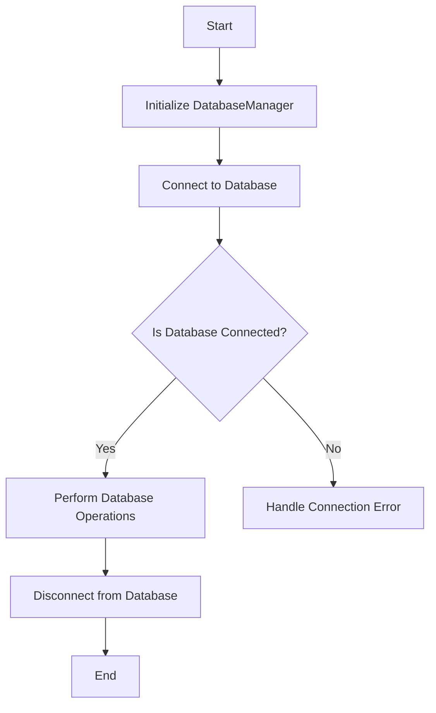
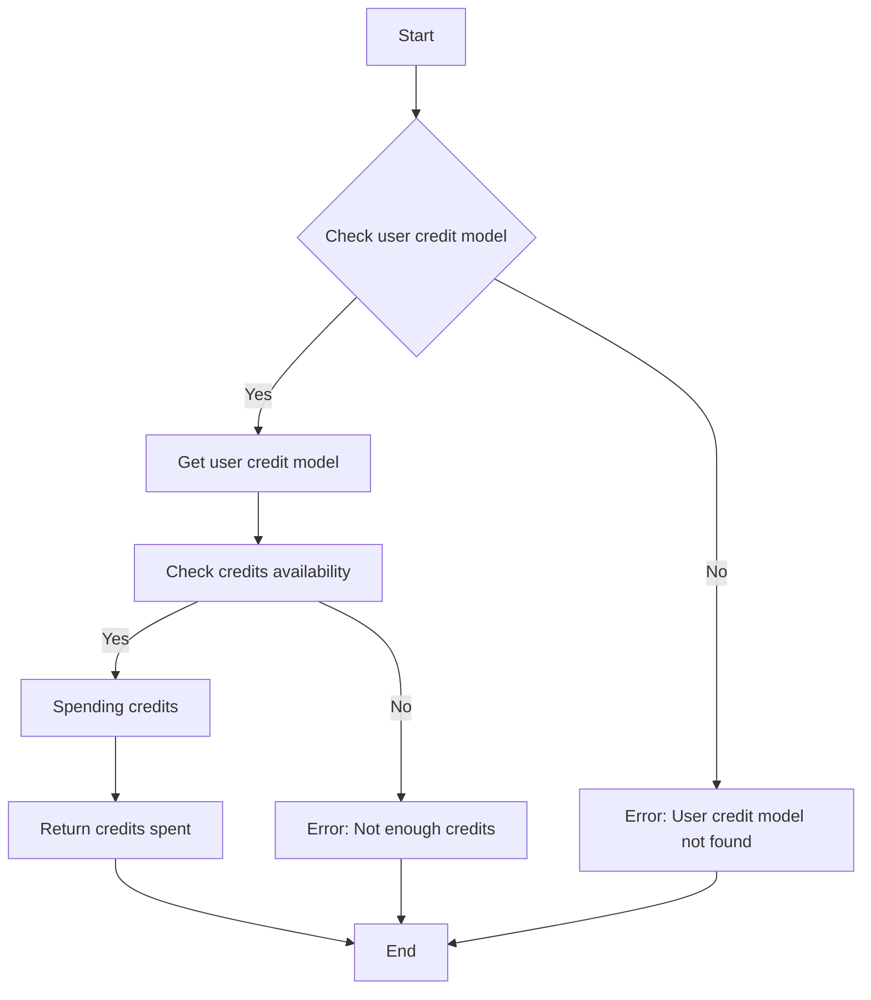
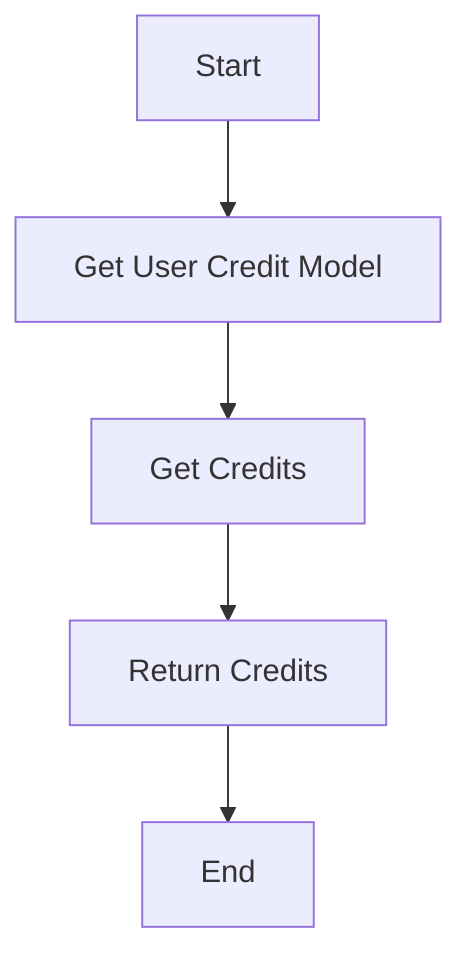
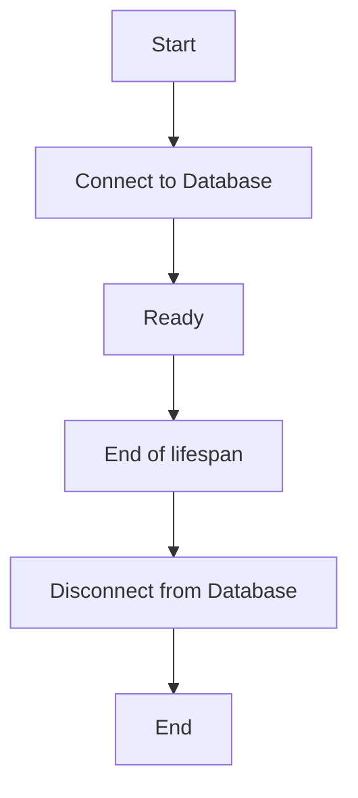
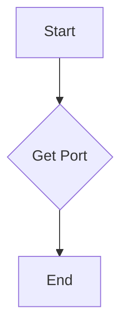
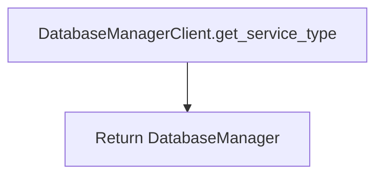

# `.\AutoGPT\autogpt_platform\backend\backend\executor\database.py` 详细设计文档

The file contains the implementation of DatabaseManager, a class that manages database connections and provides various database operations through asynchronous methods.

## 整体流程



## 类结构

```
DatabaseManager (Concrete Class)
├── AppService (Abstract Base Class)
│   ├── lifespan (async method)
│   ├── health_check (async method)
│   └── get_port (classmethod)
└── DatabaseManagerClient (Concrete Class)
    └── get_service_type (classmethod)
```

## 全局变量及字段


### `config`
    
Configuration object for the application.

类型：`Config`
    


### `logger`
    
Logger instance for logging messages.

类型：`logging.Logger`
    


### `P`
    
Parameter specification type variable.

类型：`ParamSpec`
    


### `R`
    
Type variable for generic functions and classes.

类型：`TypeVar`
    


    

## 全局函数及方法


### `_spend_credits`

This function is responsible for spending credits from a user's account based on the specified cost and metadata.

参数：

- `user_id`：`str`，The unique identifier of the user from whom credits will be spent.
- `cost`：`int`，The amount of credits to be spent.
- `metadata`：`UsageTransactionMetadata`，Metadata associated with the credit transaction.

返回值：`int`，The number of credits spent.

#### 流程图



#### 带注释源码

```python
async def _spend_credits(
    user_id: str, cost: int, metadata: UsageTransactionMetadata
) -> int:
    user_credit_model = await get_user_credit_model(user_id)
    return await user_credit_model.spend_credits(user_id, cost, metadata)
```


### `_get_credits`

获取指定用户的信用额度。

参数：

- `user_id`：`str`，用户的唯一标识符。
- ...

返回值：`int`，用户的信用额度。

#### 流程图



#### 带注释源码

```python
async def _get_credits(user_id: str) -> int:
    user_credit_model = await get_user_credit_model(user_id)
    return await user_credit_model.get_credits(user_id)
```


### `_`

A static method that wraps a given callable to return a new callable that accepts an additional `object` parameter.

参数：

- `f`：`Callable[P, R]`，The callable to be wrapped.
- `name`：`str | None`，Optional. The name of the new callable.

返回值：`Callable[Concatenate[object, P], R]`，The new callable that accepts an additional `object` parameter.

#### 流程图

```mermaid
graph TD
    A[Start] --> B[Call _()]
    B --> C[Wrap callable]
    C --> D[Return new callable]
    D --> E[End]
```

#### 带注释源码

```python
    @staticmethod
    def _(f: Callable[P, R], name: str | None = None) -> Callable[Concatenate[object, P], R]:
        if name is not None:
            f.__name__ = name
        return cast(Callable[Concatenate[object, P], R], expose(f))
```


### DatabaseManager.lifespan

This method manages the lifecycle of the database connection for the `DatabaseManager` class. It ensures that the database connection is established when the application starts and disconnected when the application stops.

参数：

- `app`：`FastAPI`，The FastAPI application instance.

返回值：无

#### 流程图



#### 带注释源码

```python
class DatabaseManager(AppService):
    @asynccontextmanager
    async def lifespan(self, app: "FastAPI"):
        async with super().lifespan(app):
            logger.info(f"[{self.service_name}] ⏳ Connecting to Database...")
            await db.connect()

            logger.info(f"[{self.service_name}] ✅ Ready")
            yield

            logger.info(f"[{self.service_name}] ⏳ Disconnecting Database...")
            await db.disconnect()
```


### DatabaseManager.health_check

This method checks the health of the database connection by attempting to execute a simple query and ensuring the connection is active.

参数：

- `None`：无参数，该方法不接收任何参数。

返回值：`str`，返回字符串 "OK" 表示数据库健康，否则抛出异常。

#### 流程图

```mermaid
graph TD
    A[Start] --> B[Check if db is connected]
    B -->|Yes| C[Execute simple query]
    C -->|Success| D[Return "OK"]
    C -->|Failure| E[Throw UnhealthyServiceError]
    B -->|No| E
    D --> F[End]
    E --> F
```

#### 带注释源码

```python
async def health_check(self) -> str:
    if not db.is_connected():
        raise UnhealthyServiceError("Database is not connected")

    try:
        # Test actual database connectivity by executing a simple query
        # This will fail if Prisma query engine is not responding
        result = await db.query_raw_with_schema("SELECT 1 as health_check")
        if not result or result[0].get("health_check") != 1:
            raise UnhealthyServiceError("Database query test failed")
    except Exception as e:
        raise UnhealthyServiceError(f"Database health check failed: {e}")

    return await super().health_check()
```


### DatabaseManager.get_port

获取数据库API端口号。

参数：

- 无

返回值：`int`，数据库API端口号

#### 流程图



#### 带注释源码

```python
@classmethod
    def get_port(cls) -> int:
        return config.database_api_port
```


### DatabaseManagerClient.get_service_type (classmethod)

This method returns the service type of the `DatabaseManagerClient` class.

参数：

- 无

返回值：`DatabaseManager`，返回 `DatabaseManager` 类的引用

#### 流程图



#### 带注释源码

```python
class DatabaseManagerClient(AppServiceClient):
    d = DatabaseManager

    @classmethod
    def get_service_type(cls):
        return DatabaseManager
```


## 关键组件


### 张量索引与惰性加载

用于高效地索引和加载大型张量数据，减少内存消耗和提高处理速度。

### 反量化支持

提供对反量化技术的支持，以优化模型性能和降低计算资源消耗。

### 量化策略

实现多种量化策略，以适应不同的应用场景和性能需求。


## 问题及建议


### 已知问题

-   **代码重复**：`DatabaseManager` 和 `DatabaseManagerClient` 类中存在大量的重复代码，特别是对于执行、图形、信用、用户通信、通知、库、入职、OAuth、商店、商店嵌入和摘要数据等功能的调用。这可能导致维护困难，并且当需要更新这些功能时，需要在多个地方进行更改。
-   **类型注解**：代码中使用了大量的类型注解，但没有使用类型检查工具，这可能导致类型注解与实际代码行为不一致。
-   **异常处理**：代码中的一些函数没有明确的异常处理逻辑，这可能导致在运行时出现未处理的异常。
-   **日志记录**：日志记录不够详细，难以追踪问题发生的原因和上下文。

### 优化建议

-   **重构代码**：将重复的代码提取到单独的函数或模块中，以减少代码重复并简化维护。
-   **使用类型检查工具**：使用类型检查工具（如 mypy）来确保类型注解与实际代码行为一致。
-   **增加异常处理**：在关键函数中增加异常处理逻辑，以捕获和处理可能发生的异常。
-   **改进日志记录**：增加详细的日志记录，包括错误信息、异常信息和关键操作信息，以便于问题追踪和调试。
-   **模块化**：将功能模块化，以便于测试和维护。
-   **文档化**：为代码添加详细的文档注释，以便于其他开发者理解代码的功能和用法。


## 其它


### 设计目标与约束

- 设计目标：
  - 提供一个统一的数据库管理接口，用于处理各种数据库操作。
  - 确保数据库操作的异步执行，以提高系统性能。
  - 提供健康检查机制，确保数据库连接的稳定性和可用性。
  - 支持用户积分管理、图形执行管理、用户通信、通知管理等功能。

- 约束：
  - 必须使用异步编程模型，以支持高并发处理。
  - 需要确保数据库操作的原子性和一致性。
  - 必须遵守OAuth和用户积分管理的相关安全规范。

### 错误处理与异常设计

- 错误处理：
  - 使用自定义异常类`UnhealthyServiceError`来处理数据库连接问题。
  - 对于所有数据库操作，捕获可能的异常，并返回适当的错误信息。

- 异常设计：
  - 定义了`UnhealthyServiceError`类，用于表示数据库服务不健康的状态。
  - 在数据库操作中，使用try-except块来捕获和处理异常。

### 数据流与状态机

- 数据流：
  - 用户请求通过API发送到数据库管理服务。
  - 服务根据请求类型执行相应的数据库操作。
  - 操作结果返回给用户。

- 状态机：
  - 数据库管理服务不涉及复杂的状态机设计，主要关注数据库操作和状态。

### 外部依赖与接口契约

- 外部依赖：
  - 依赖于`fastapi`库来构建API接口。
  - 依赖于`prisma`库进行数据库操作。
  - 依赖于`logging`库进行日志记录。

- 接口契约：
  - 定义了`AppService`和`AppServiceClient`接口，用于服务注册和客户端调用。
  - 定义了`DatabaseManager`类，实现了数据库管理功能。
  - 定义了`DatabaseManagerClient`和`DatabaseManagerAsyncClient`类，用于同步和异步客户端调用。


    