# `.\AutoGPT\autogpt_platform\backend\backend\executor\manager.py` 详细设计文档

该代码实现了一个基于RabbitMQ和线程池的图执行管理器，用于异步调度和执行Agent工作流图。它负责处理执行请求的分发、节点级别的并发控制、状态持久化、凭据管理、使用量计费以及错误处理和通知，确保高并发下的分布式任务协调和一致性。

## 整体流程

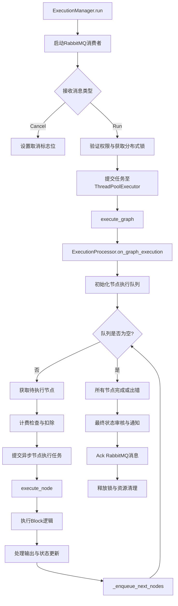

## 类结构

```
ExecutionManager (进程管理类)
├── ThreadPoolExecutor (线程池)
├── ExecutionProcessor (执行逻辑处理器)
│   ├── CredentialsManager (凭据管理)
│   ├── NodeExecutionLoop (异步事件循环)
│   └── NodeEvaluationLoop (异步事件循环)
├── RabbitMQ Consumers (消息消费者)
└── Redis/Metrics (外部依赖)
```

## 全局变量及字段


### `_logger`
    
Standard Python logger instance for this module.

类型：`logging.Logger`
    


### `logger`
    
Wrapper around the standard logger to handle and truncate long log messages.

类型：`backend.util.logging.TruncatedLogger`
    


### `settings`
    
Singleton instance holding application configuration and environment variables.

类型：`backend.util.settings.Settings`
    


### `active_runs_gauge`
    
Prometheus metric gauge tracking the current number of active graph executions.

类型：`prometheus_client.Gauge`
    


### `pool_size_gauge`
    
Prometheus metric gauge tracking the maximum size of the graph execution worker pool.

类型：`prometheus_client.Gauge`
    


### `utilization_gauge`
    
Prometheus metric gauge tracking the utilization ratio of active runs versus pool size.

类型：`prometheus_client.Gauge`
    


### `INSUFFICIENT_FUNDS_NOTIFIED_PREFIX`
    
Redis key prefix used to store flags for users who have already been notified about insufficient funds.

类型：`str`
    


### `INSUFFICIENT_FUNDS_NOTIFIED_TTL_SECONDS`
    
Time-to-live in seconds for the insufficient funds notification flags in Redis (30 days).

类型：`int`
    


### `_tls`
    
Thread-local storage used to maintain a separate ExecutionProcessor instance for each worker thread.

类型：`threading.local`
    


### `ExecutionProcessor.tid`
    
The thread identifier of the worker thread running this processor instance.

类型：`int`
    


### `ExecutionProcessor.creds_manager`
    
Manager responsible for acquiring and releasing credentials for external service integrations.

类型：`backend.integrations.creds_manager.IntegrationCredentialsManager`
    


### `ExecutionProcessor.node_execution_loop`
    
Dedicated asyncio event loop running in a separate thread to handle node execution logic.

类型：`asyncio.AbstractEventLoop`
    


### `ExecutionProcessor.node_evaluation_loop`
    
Dedicated asyncio event loop running in a separate thread to handle post-execution evaluation and enqueueing.

类型：`asyncio.AbstractEventLoop`
    


### `ExecutionProcessor.node_execution_thread`
    
Worker thread that runs the node_execution_loop.

类型：`threading.Thread`
    


### `ExecutionProcessor.node_evaluation_thread`
    
Worker thread that runs the node_evaluation_loop.

类型：`threading.Thread`
    


### `ExecutionProcessor.running_node_execution`
    
Dictionary tracking the progress of currently executing nodes, keyed by node ID.

类型：`dict[str, NodeExecutionProgress]`
    


### `ExecutionProcessor.running_node_evaluation`
    
Dictionary tracking the futures of currently evaluating nodes (e.g., output processing), keyed by node ID.

类型：`dict[str, concurrent.futures.Future]`
    


### `ExecutionProcessor.execution_stats`
    
Object accumulating statistics (cost, time, node counts) for the current graph execution.

类型：`backend.data.model.GraphExecutionStats`
    


### `ExecutionProcessor.execution_stats_lock`
    
Lock to ensure thread-safe updates to the execution_stats object.

类型：`threading.Lock`
    


### `ExecutionManager.pool_size`
    
The maximum number of worker threads in the graph execution pool.

类型：`int`
    


### `ExecutionManager.active_graph_runs`
    
Dictionary mapping graph execution IDs to a tuple of the execution Future and its cancellation Event.

类型：`dict[str, tuple[concurrent.futures.Future, threading.Event]]`
    


### `ExecutionManager.executor_id`
    
Unique identifier (UUID) for this specific ExecutionManager instance/pod.

类型：`str`
    


### `ExecutionManager._executor`
    
The thread pool executor used to submit graph execution tasks.

类型：`concurrent.futures.ThreadPoolExecutor | None`
    


### `ExecutionManager._stop_consuming`
    
Event flag to signal consumer threads to stop processing messages.

类型：`threading.Event | None`
    


### `ExecutionManager._cancel_thread`
    
Thread responsible for consuming cancellation messages from the message queue.

类型：`threading.Thread | None`
    


### `ExecutionManager._cancel_client`
    
RabbitMQ client used by the cancel thread to consume messages.

类型：`backend.data.rabbitmq.SyncRabbitMQ | None`
    


### `ExecutionManager._run_thread`
    
Thread responsible for consuming graph execution run messages from the message queue.

类型：`threading.Thread | None`
    


### `ExecutionManager._run_client`
    
RabbitMQ client used by the run thread to consume messages.

类型：`backend.data.rabbitmq.SyncRabbitMQ | None`
    


### `ExecutionManager._execution_locks`
    
Dictionary mapping graph execution IDs to their acquired cluster-wide distributed locks.

类型：`dict[str, ClusterLock]`
    
    

## 全局函数及方法


### `clear_insufficient_funds_notifications`

清除指定用户的所有资金不足通知标志，以便在用户充值后能够再次发送通知。

参数：

-  `user_id`：`str`，需要清除资金不足通知标志的用户 ID。

返回值：`int`，实际删除的 Redis 键的数量；如果发生错误则返回 0。

#### 流程图

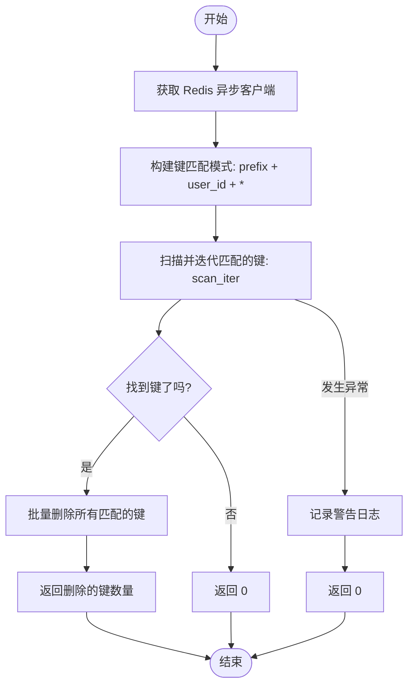

#### 带注释源码

```python
async def clear_insufficient_funds_notifications(user_id: str) -> int:
    """
    Clear all insufficient funds notification flags for a user.

    This should be called when a user tops up their credits, allowing
    Discord notifications to be sent again if they run out of funds.

    Args:
        user_id: The user ID to clear notifications for.

    Returns:
        The number of keys that were deleted.
    """
    try:
        # 获取 Redis 异步客户端实例
        redis_client = await redis.get_redis_async()
        
        # 构建匹配模式，查找特定用户下的所有通知标志键
        pattern = f"{INSUFFICIENT_FUNDS_NOTIFIED_PREFIX}:{user_id}:*"
        
        # 使用 scan_iter 异步迭代获取所有匹配的键
        keys = [key async for key in redis_client.scan_iter(match=pattern)]
        
        # 如果存在匹配的键，则执行删除操作并返回删除数量
        if keys:
            return await redis_client.delete(*keys)
        
        # 如果没有找到匹配的键，返回 0
        return 0
    except Exception as e:
        # 捕获异常并记录警告日志，防止因 Redis 错误中断主流程
        logger.warning(
            f"Failed to clear insufficient funds notification flags for user "
            f"{user_id}: {e}"
        )
        # 发生异常时返回 0，表示未删除任何键
        return 0
```


### `init_worker`

在当前线程的本地存储（Thread-Local Storage）中初始化 `ExecutionProcessor` 实例。该函数通常作为线程池执行器的初始化回调函数使用，以确保每个工作线程都拥有独立的执行处理器实例和对应的事件循环，从而实现线程隔离。

参数：

-  该函数没有参数。

返回值：`None`，无返回值。

#### 流程图

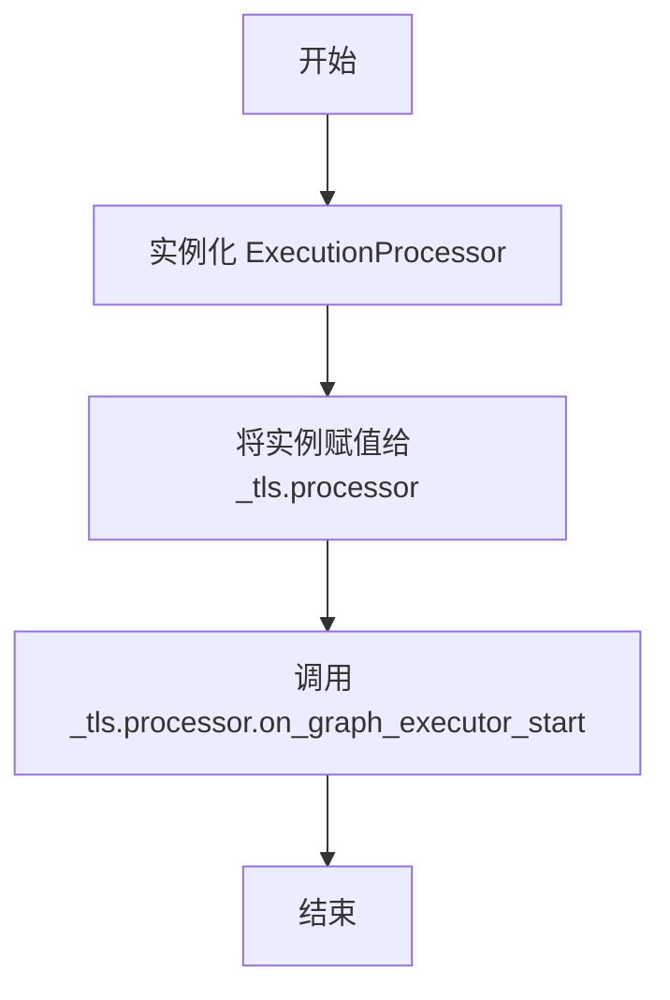

#### 带注释源码

```python
def init_worker():
    """Initialize ExecutionProcessor instance in thread-local storage"""
    # 在线程局部存储 (_tls) 中创建一个新的 ExecutionProcessor 实例。
    # 这确保了每个线程都有自己的处理器状态，避免多线程竞争。
    _tls.processor = ExecutionProcessor()
    # 调用处理器的启动方法，执行必要的初始化逻辑，
    # 例如配置日志、创建事件循环和启动后台线程。
    _tls.processor.on_graph_executor_start()
```


### `execute_graph`

使用线程本地存储中实例化的 ExecutionProcessor 执行图。此函数作为线程池工作器的主要入口点，将实际的执行逻辑委托给与当前线程关联的特定处理器实例。

参数：

-  `graph_exec_entry`：`GraphExecutionEntry`，包含图执行详细信息的条目，包括用户 ID、图 ID、版本和执行上下文。
-  `cancel_event`：`threading.Event`，一个同步原语，用于向执行过程发出停止的信号。
-  `cluster_lock`：`ClusterLock`，一种用于确保该图执行在集群范围内运行不超过一次的分布式锁机制。

返回值：`None`，函数将执行委托给处理器，而不返回任何值。

#### 流程图

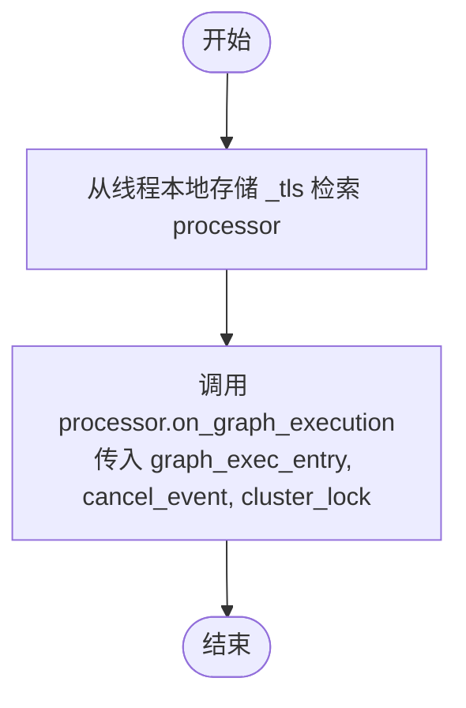

#### 带注释源码

```python
def execute_graph(
    graph_exec_entry: "GraphExecutionEntry",
    cancel_event: threading.Event,
    cluster_lock: ClusterLock,
):
    """Execute graph using thread-local ExecutionProcessor instance"""
    # 从线程本地存储获取当前线程的 processor 实例
    processor: ExecutionProcessor = _tls.processor
    # 委托调用 processor 的 on_graph_execution 方法进行实际处理
    return processor.on_graph_execution(graph_exec_entry, cancel_event, cluster_lock)
```


### `execute_node`

执行图中的单个节点。该函数负责验证节点输入，准备执行上下文（包括获取和处理凭证及锁），调用具体块（Block）的执行逻辑，流式输出执行结果，并更新执行统计数据（如输入/输出大小、执行时间等）。

参数：

-   `node`：`Node`，表示图中要执行的具体节点对象，包含块定义信息。
-   `data`：`NodeExecutionEntry`，节点的执行数据条目，包含用户ID、执行ID、输入数据及初始执行上下文。
-   `execution_processor`：`ExecutionProcessor`，执行处理器实例，用于提供凭证管理器等服务。
-   `execution_stats`：`NodeExecutionStats | None`，可选参数，用于记录和更新本次执行的统计信息（如耗时、数据大小）。
-   `nodes_input_masks`：`Optional[NodesInputMasks]`，可选参数，用于覆盖或修改特定节点的输入数据。
-   `nodes_to_skip`：`Optional[set[str]]`，可选参数，包含应被跳过执行的节点ID集合。

返回值：`BlockOutput`，异步生成器，按生成顺序返回执行结果的输出名称和对应数据。

#### 流程图

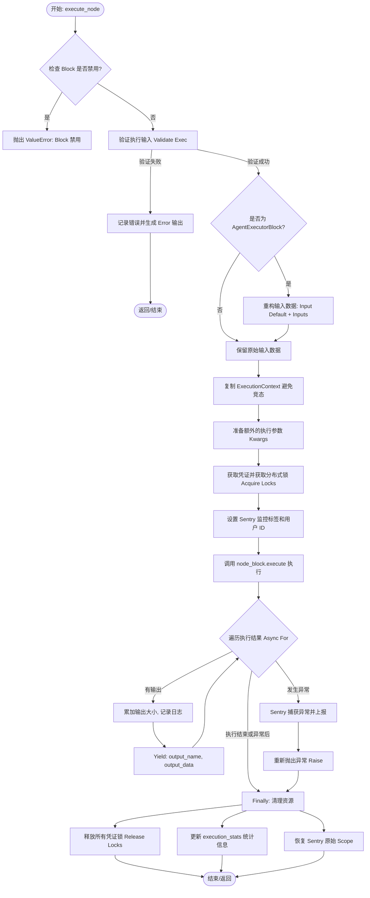

#### 带注释源码

```python
async def execute_node(
    node: Node,
    data: NodeExecutionEntry,
    execution_processor: "ExecutionProcessor",
    execution_stats: NodeExecutionStats | None = None,
    nodes_input_masks: Optional[NodesInputMasks] = None,
    nodes_to_skip: Optional[set[str]] = None,
) -> BlockOutput:
    """
    Execute a node in the graph. This will trigger a block execution on a node,
    persist the execution result, and return the subsequent node to be executed.

    Args:
        db_client: The client to send execution updates to the server.
        creds_manager: The manager to acquire and release credentials.
        data: The execution data for executing the current node.
        execution_stats: The execution statistics to be updated.

    Returns:
        The subsequent node to be enqueued, or None if there is no subsequent node.
    """
    # 1. 提取基础元数据
    user_id = data.user_id
    graph_exec_id = data.graph_exec_id
    graph_id = data.graph_id
    graph_version = data.graph_version
    node_exec_id = data.node_exec_id
    node_id = data.node_id
    node_block = node.block
    execution_context = data.execution_context
    creds_manager = execution_processor.creds_manager

    # 2. 初始化日志元数据，便于追踪
    log_metadata = LogMetadata(
        logger=_logger,
        user_id=user_id,
        graph_eid=graph_exec_id,
        graph_id=graph_id,
        node_eid=node_exec_id,
        node_id=node_id,
        block_name=node_block.name,
    )

    # 3. 检查块是否被禁用
    if node_block.disabled:
        raise ValueError(f"Block {node_block.id} is disabled and cannot be executed")

    # 4. 验证输入数据的合法性
    # Sanity check: validate the execution input.
    input_data, error = validate_exec(node, data.inputs, resolve_input=False)
    if input_data is None:
        log_metadata.error(f"Skip execution, input validation error: {error}")
        yield "error", error
        return

    # 5. 针对代理块进行特殊的输入数据重构
    # Re-shape the input data for agent block.
    # AgentExecutorBlock specially separate the node input_data & its input_default.
    if isinstance(node_block, AgentExecutorBlock):
        _input_data = AgentExecutorBlock.Input(**node.input_default)
        _input_data.inputs = input_data
        if nodes_input_masks:
            _input_data.nodes_input_masks = nodes_input_masks
        _input_data.user_id = user_id
        input_data = _input_data.model_dump()
    data.inputs = input_data

    # 计算输入数据大小用于统计
    # Execute the node
    input_data_str = json.dumps(input_data)
    input_size = len(input_data_str)
    log_metadata.debug("Executed node with input", input=input_data_str)

    # 6. 创建节点特定的执行上下文
    # 避免竞态条件（多个节点并发执行可能会修改共享状态）
    # Create node-specific execution context to avoid race conditions
    # (multiple nodes can execute concurrently and would otherwise mutate shared state)
    execution_context = execution_context.model_copy(
        update={"node_id": node_id, "node_exec_id": node_exec_id}
    )

    # 7. 为块注入额外的执行参数
    # Inject extra execution arguments for the blocks via kwargs
    # Keep individual kwargs for backwards compatibility with existing blocks
    extra_exec_kwargs: dict = {
        "graph_id": graph_id,
        "graph_version": graph_version,
        "node_id": node_id,
        "graph_exec_id": graph_exec_id,
        "node_exec_id": node_exec_id,
        "user_id": user_id,
        "execution_context": execution_context,
        "execution_processor": execution_processor,
        "nodes_to_skip": nodes_to_skip or set(),
    }

    # 8. 凭证处理与锁获取
    # Last-minute fetch credentials + acquire a system-wide read-write lock to prevent
    # changes during execution. ⚠️ This means a set of credentials can only be used by
    # one (running) block at a time; simultaneous execution of blocks using same
    # credentials is not supported.
    creds_locks: list[AsyncRedisLock] = []
    input_model = cast(type[BlockSchema], node_block.input_schema)

    # 处理常规凭证字段
    # Handle regular credentials fields
    for field_name, input_type in input_model.get_credentials_fields().items():
        credentials_meta = input_type(**input_data[field_name])
        credentials, lock = await creds_manager.acquire(user_id, credentials_meta.id)
        creds_locks.append(lock)
        extra_exec_kwargs[field_name] = credentials

    # 处理自动生成的凭证（例如来自 GoogleDriveFileInput）
    # Handle auto-generated credentials (e.g., from GoogleDriveFileInput)
    for kwarg_name, info in input_model.get_auto_credentials_fields().items():
        field_name = info["field_name"]
        field_data = input_data.get(field_name)
        if field_data and isinstance(field_data, dict):
            # Check if _credentials_id key exists in the field data
            if "_credentials_id" in field_data:
                cred_id = field_data["_credentials_id"]
                if cred_id:
                    # Credential ID provided - acquire credentials
                    provider = info.get("config", {}).get(
                        "provider", "external service"
                    )
                    file_name = field_data.get("name", "selected file")
                    try:
                        credentials, lock = await creds_manager.acquire(
                            user_id, cred_id
                        )
                        creds_locks.append(lock)
                        extra_exec_kwargs[kwarg_name] = credentials
                    except ValueError:
                        # Credential was deleted or doesn't exist
                        raise ValueError(
                            f"Authentication expired for '{file_name}' in field '{field_name}'. "
                            f"The saved {provider.capitalize()} credentials no longer exist. "
                            f"Please re-select the file to re-authenticate."
                        )
                # else: _credentials_id is explicitly None, skip credentials (for chained data)
            else:
                # _credentials_id key missing entirely - this is an error
                provider = info.get("config", {}).get("provider", "external service")
                file_name = field_data.get("name", "selected file")
                raise ValueError(
                    f"Authentication missing for '{file_name}' in field '{field_name}'. "
                    f"Please re-select the file to authenticate with {provider.capitalize()}."
                )

    output_size = 0

    # 9. Sentry 追踪配置
    # save the tags
    original_user = scope._user
    original_tags = dict(scope._tags) if scope._tags else {}
    # Set user ID for error tracking
    scope.set_user({"id": user_id})

    scope.set_tag("graph_id", graph_id)
    scope.set_tag("node_id", node_id)
    scope.set_tag("block_name", node_block.name)
    scope.set_tag("block_id", node_block.id)
    for k, v in execution_context.model_dump().items():
        scope.set_tag(f"execution_context.{k}", v)

    try:
        # 10. 执行块逻辑并迭代输出
        async for output_name, output_data in node_block.execute(
            input_data, **extra_exec_kwargs
        ):
            output_data = json.to_dict(output_data)
            output_size += len(json.dumps(output_data))
            log_metadata.debug("Node produced output", **{output_name: output_data})
            yield output_name, output_data
    except Exception as ex:
        # 11. 异常捕获与上报
        # Capture exception WITH context still set before restoring scope
        sentry_sdk.capture_exception(error=ex, scope=scope)
        sentry_sdk.flush()  # Ensure it's sent before we restore scope
        # Re-raise to maintain normal error flow
        raise
    finally:
        # 12. 清理工作：释放锁、更新统计、恢复 Sentry Scope
        # Ensure all credentials are released even if execution fails
        for creds_lock in creds_locks:
            if (
                creds_lock
                and (await creds_lock.locked())
                and (await creds_lock.owned())
            ):
                try:
                    await creds_lock.release()
                except Exception as e:
                    log_metadata.error(f"Failed to release credentials lock: {e}")

        # Update execution stats
        if execution_stats is not None:
            execution_stats += node_block.execution_stats
            execution_stats.input_size = input_size
            execution_stats.output_size = output_size

        # Restore scope AFTER error has been captured
        scope._user = original_user
        scope._tags = original_tags
```


### `_enqueue_next_nodes`

该函数是图执行引擎中的核心调度逻辑，负责根据当前节点的输出数据，查找所有连接的下游节点（Next Nodes），准备相应的输入数据，验证数据完整性，并将准备好执行的下游节点任务加入执行队列。它特别处理了多输入合并、静态链接的延迟补全以及并发控制。

参数：

- `db_client`: `DatabaseManagerAsyncClient`，异步数据库客户端，用于持久化执行状态和获取节点信息。
- `node`: `Node`，刚刚执行完毕的当前节点对象。
- `output`: `BlockOutputEntry`，当前节点产生的输出数据，通常是一个包含输出名称和数据的元组。
- `user_id`: `str`，当前用户的唯一标识符。
- `graph_exec_id`: `str`，当前图执行实例的唯一标识符。
- `graph_id`: `str`，当前图的唯一标识符。
- `graph_version`: `int`，当前图的版本号。
- `log_metadata`: `LogMetadata`，用于统一日志记录的元数据对象。
- `nodes_input_masks`: `Optional[NodesInputMasks]`，可选参数，用于覆盖或强制指定特定节点的输入数据。
- `execution_context`: `ExecutionContext`，传递给下游节点的执行上下文信息。

返回值：`list[NodeExecutionEntry]`，返回一个列表，包含所有成功创建并状态已更新为 `QUEUED` 的下游节点执行条目。

#### 流程图

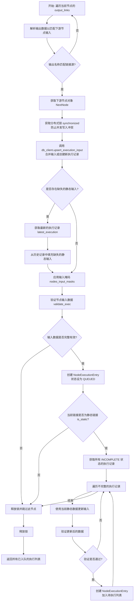

#### 带注释源码

```python
async def _enqueue_next_nodes(
    db_client: "DatabaseManagerAsyncClient",
    node: Node,
    output: BlockOutputEntry,
    user_id: str,
    graph_exec_id: str,
    graph_id: str,
    graph_version: int,
    log_metadata: LogMetadata,
    nodes_input_masks: Optional[NodesInputMasks],
    execution_context: ExecutionContext,
) -> list[NodeExecutionEntry]:
    # 内部辅助函数：将节点执行状态更新为 QUEUED 并创建对应的 NodeExecutionEntry
    async def add_enqueued_execution(
        node_exec_id: str, node_id: str, block_id: str, data: BlockInput
    ) -> NodeExecutionEntry:
        await async_update_node_execution_status(
            db_client=db_client,
            exec_id=node_exec_id,
            status=ExecutionStatus.QUEUED,
            execution_data=data,
        )
        return NodeExecutionEntry(
            user_id=user_id,
            graph_exec_id=graph_exec_id,
            graph_id=graph_id,
            graph_version=graph_version,
            node_exec_id=node_exec_id,
            node_id=node_id,
            block_id=block_id,
            inputs=data,
            execution_context=execution_context,
        )

    # 内部辅助函数：注册下一个节点的执行，包含异常捕获
    async def register_next_executions(node_link: Link) -> list[NodeExecutionEntry]:
        try:
            return await _register_next_executions(node_link)
        except Exception as e:
            log_metadata.exception(f"Failed to register next executions: {e}")
            return []

    # 核心逻辑：根据 Link 注册后续执行
    async def _register_next_executions(node_link: Link) -> list[NodeExecutionEntry]:
        enqueued_executions = []
        # 获取链接的源输出名、目标输入名和目标节点ID
        next_output_name = node_link.source_name
        next_input_name = node_link.sink_name
        next_node_id = node_link.sink_id

        output_name, _ = output
        # 解析当前节点的输出，适配下游节点的输入需求
        next_data = parse_execution_output(
            output, next_output_name, next_node_id, next_input_name
        )
        # 如果输出名称不匹配，则跳过
        if next_data is None and output_name != next_output_name:
            return enqueued_executions
        # 获取下游节点的定义
        next_node = await db_client.get_node(next_node_id)

        # 使用分布式锁确保对同一个节点的输入合并操作是原子的
        # 防止并发情况下同一输入被多次消费或多次创建执行记录
        async with synchronized(f"upsert_input-{next_node_id}-{graph_exec_id}"):
            # 将数据合并到最早的未完成执行中，或创建一个新的执行记录
            next_node_exec, next_node_input = await db_client.upsert_execution_input(
                node_id=next_node_id,
                graph_exec_id=graph_exec_id,
                input_name=next_input_name,
                input_data=next_data,
            )
            next_node_exec_id = next_node_exec.node_exec_id
            await send_async_execution_update(next_node_exec)

            # 补全缺失的静态输入
            # 检查是否还有缺失的静态链接数据，如果有，尝试从上一次执行中获取
            static_link_names = {
                link.sink_name
                for link in next_node.input_links
                if link.is_static and link.sink_name not in next_node_input
            }
            if static_link_names and (
                latest_execution := await db_client.get_latest_node_execution(
                    next_node_id, graph_exec_id
                )
            ):
                for name in static_link_names:
                    next_node_input[name] = latest_execution.input_data.get(name)

            # 应用输入掩码（覆盖或强制输入）
            node_input_mask = None
            if nodes_input_masks and (
                node_input_mask := nodes_input_masks.get(next_node.id)
            ):
                next_node_input.update(node_input_mask)

            # 验证输入数据是否完整合法
            next_node_input, validation_msg = validate_exec(next_node, next_node_input)
            suffix = f"{next_output_name}>{next_input_name}~{next_node_exec_id}:{validation_msg}"

            # 如果输入不完整，跳过排队
            if not next_node_input:
                log_metadata.info(f"Skipped queueing {suffix}")
                return enqueued_executions

            # 输入完整，将执行加入队列
            log_metadata.info(f"Enqueued {suffix}")
            enqueued_executions.append(
                await add_enqueued_execution(
                    node_exec_id=next_node_exec_id,
                    node_id=next_node_id,
                    block_id=next_node.block_id,
                    data=next_node_input,
                )
            )

            # 如果当前链接不是静态的，处理结束
            if not node_link.is_static:
                return enqueued_executions

            # 如果是静态链接，可能存在之前因为缺少此静态数据而处于 INCOMPLETE 状态的执行
            # 需要加载这些执行，补全数据，并尝试重新排队
            for iexec in await db_client.get_node_executions(
                node_id=next_node_id,
                graph_exec_id=graph_exec_id,
                statuses=[ExecutionStatus.INCOMPLETE],
            ):
                idata = iexec.input_data
                ineid = iexec.node_exec_id

                static_link_names = {
                    link.sink_name
                    for link in next_node.input_links
                    if link.is_static and link.sink_name not in idata
                }
                # 补全静态数据
                for input_name in static_link_names:
                    idata[input_name] = next_node_input[input_name]

                # 应用输入掩码
                if node_input_mask:
                    idata.update(node_input_mask)

                # 验证补全后的数据
                idata, msg = validate_exec(next_node, idata)
                suffix = f"{next_output_name}>{next_input_name}~{ineid}:{msg}"
                if not idata:
                    log_metadata.info(f"Enqueueing static-link skipped: {suffix}")
                    continue
                # 重新排队
                log_metadata.info(f"Enqueueing static-link execution {suffix}")
                enqueued_executions.append(
                    await add_enqueued_execution(
                        node_exec_id=iexec.node_exec_id,
                        node_id=next_node_id,
                        block_id=next_node.block_id,
                        data=idata,
                    )
                )
            return enqueued_executions

    # 遍历当前节点的所有输出链接，收集所有下游待执行的任务
    return [
        execution
        for link in node.output_links
        for execution in await register_next_executions(link)
    ]
```


### `get_db_client`

获取同步数据库管理器客户端实例的辅助函数。该函数封装了对底层工具函数的调用，用于在模块内部便捷地访问数据库客户端。

参数：

*   (无)

返回值：`DatabaseManagerClient`，返回一个同步数据库管理客户端实例，用于执行数据库同步操作。

#### 流程图

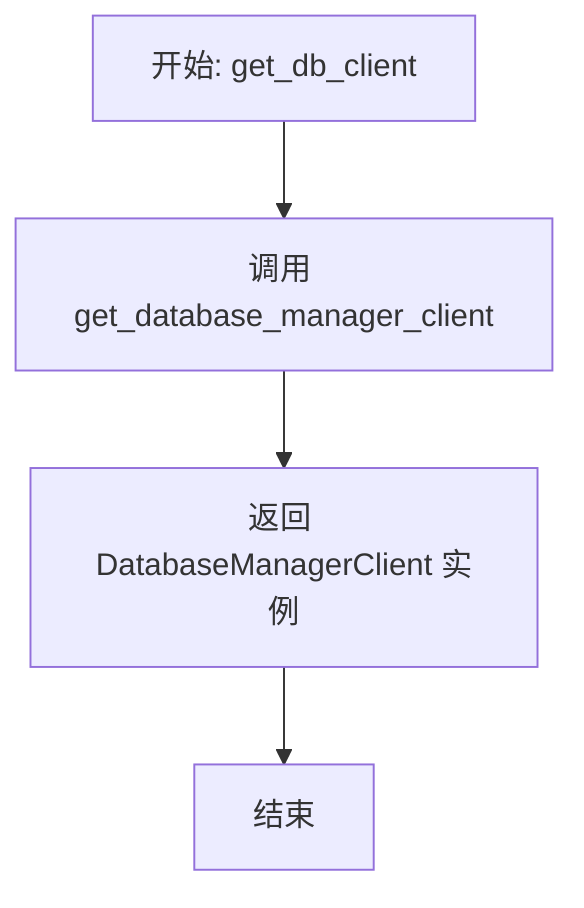

#### 带注释源码

```python
def get_db_client() -> "DatabaseManagerClient":
    """
    获取同步数据库管理器客户端实例。

    Returns:
        DatabaseManagerClient: 数据库客户端对象。
    """
    # 调用工具函数获取数据库客户端实例
    # 该函数从 backend.util.clients 导入
    return get_database_manager_client()
```


### `get_db_async_client`

用于获取数据库管理器的异步客户端实例的便捷函数。该函数封装了对底层客户端获取逻辑的调用，通常在需要执行异步数据库操作时使用。

参数：

无

返回值：`DatabaseManagerAsyncClient`，返回数据库管理器的异步客户端实例。

#### 流程图

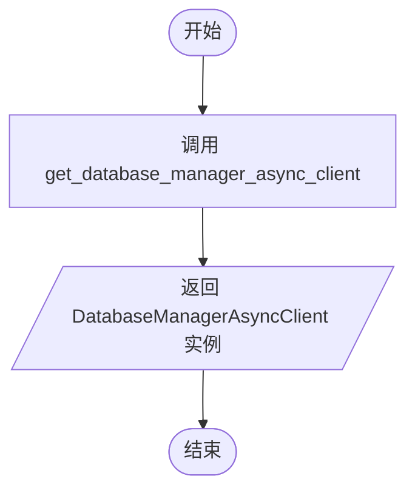

#### 带注释源码

```python
def get_db_async_client() -> "DatabaseManagerAsyncClient":
    # 调用工具模块中的函数来获取数据库管理器的异步客户端
    return get_database_manager_async_client()
```


### `send_async_execution_update`

异步发送执行更新事件到事件总线的全局函数。该函数接收图执行或节点执行结果对象作为输入，如果输入有效，则通过获取的异步事件总线实例发布该事件，以确保系统其他部分能够订阅并处理最新的执行状态变化。该函数被重试装饰器包裹，以增强消息传递的鲁棒性。

参数：

- `entry`：`GraphExecution | NodeExecutionResult | None`，需要发布的执行更新条目，可以是图执行对象、节点执行结果对象，如果为 None 则不执行任何操作。

返回值：`None`，无返回值。

#### 流程图

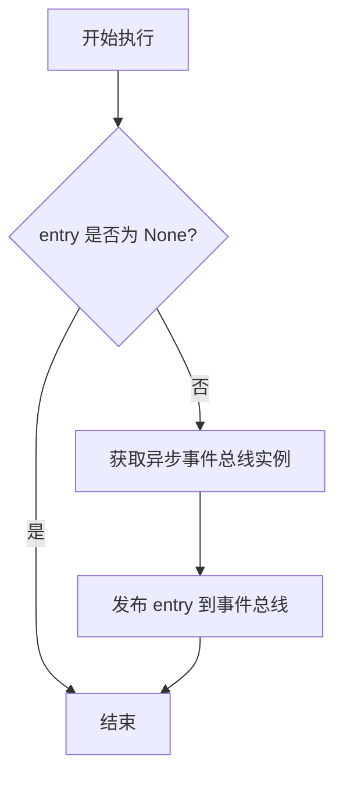

#### 带注释源码

```python
@func_retry  # 使用 func_retry 装饰器，在失败时自动重试，确保消息发布的可靠性
async def send_async_execution_update(
    entry: GraphExecution | NodeExecutionResult | None,  # 接受图执行或节点执行结果对象，允许为空
) -> None:
    # 如果传入的条目为空，则直接返回，不进行发布
    if entry is None:
        return
    # 获取异步事件总线实例，并将 entry 对象发布出去
    await get_async_execution_event_bus().publish(entry)
```


### `send_execution_update`

该函数的主要功能是将图执行或节点执行的更新事件发布到同步执行事件总线。它首先检查传入的条目是否有效，如果有效则通过事件总线进行发布，并且该函数通过 `@func_retry` 装饰器支持失败重试机制，以确保消息传递的可靠性。

参数：

-  `entry`：`GraphExecution | NodeExecutionResult | None`，包含图执行或节点执行结果的数据对象，若为 None 则跳过发布。

返回值：`None`，无明确的返回值，通常用于触发事件总线的发布操作。

#### 流程图

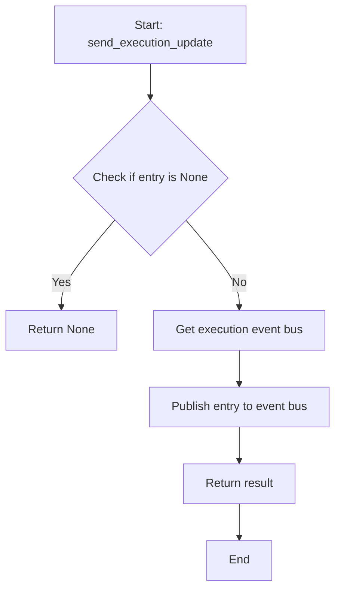

#### 带注释源码

```python
@func_retry
def send_execution_update(entry: GraphExecution | NodeExecutionResult | None):
    # 检查传入的 entry 是否为 None，避免发布空消息
    if entry is None:
        return
    # 获取执行事件总线实例，并将 entry 发布到总线中
    # 返回发布操作的结果（通常为 None）
    return get_execution_event_bus().publish(entry)
```


### `async_update_node_execution_status`

该函数负责更新数据库中特定节点执行的状态、执行数据及统计信息，并通过事件总线广播此次更新，最后返回更新后的节点执行结果对象。

参数：

- `db_client`: `"DatabaseManagerAsyncClient"`，用于与数据库交互的异步客户端实例，负责持久化执行状态。
- `exec_id`: `str`，需要更新的节点执行条目的唯一标识符。
- `status`: `ExecutionStatus`，节点执行的新状态（例如：QUEUED, RUNNING, COMPLETED, FAILED）。
- `execution_data`: `BlockInput | None`，可选参数，与节点执行关联的输入数据。
- `stats`: `dict[str, Any] | None`，可选参数，包含节点执行统计信息或元数据的字典。

返回值：`NodeExecutionResult`，包含更新后状态及元数据的节点执行结果对象。

#### 流程图

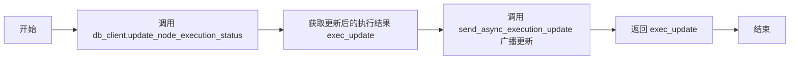

#### 带注释源码

```python
async def async_update_node_execution_status(
    db_client: "DatabaseManagerAsyncClient",
    exec_id: str,
    status: ExecutionStatus,
    execution_data: BlockInput | None = None,
    stats: dict[str, Any] | None = None,
) -> NodeExecutionResult:
    """Sets status and fetches+broadcasts the latest state of the node execution"""
    # 调用数据库客户端更新节点执行的状态、输入数据和统计信息
    # 该方法执行持久化操作并返回更新后的数据对象
    exec_update = await db_client.update_node_execution_status(
        exec_id, status, execution_data, stats
    )
    # 通过异步事件总线发送更新事件，通知系统其他组件（如前端或日志监听器）
    await send_async_execution_update(exec_update)
    # 返回包含最新状态的执行结果对象
    return exec_update
```


### `update_node_execution_status`

设置节点执行的状态，获取并广播节点执行的最新状态。

参数：

-   `db_client`: `DatabaseManagerClient`，用于与数据库交互的客户端对象。
-   `exec_id`: `str`，要更新的节点执行ID。
-   `status`: `ExecutionStatus`，要设置的节点执行新状态。
-   `execution_data`: `BlockInput | None`，可选，与执行关联的输入数据。
-   `stats`: `dict[str, Any] | None`，可选，关于执行的统计信息或元数据。

返回值：`NodeExecutionResult`，数据库中更新后的节点执行结果对象。

#### 流程图

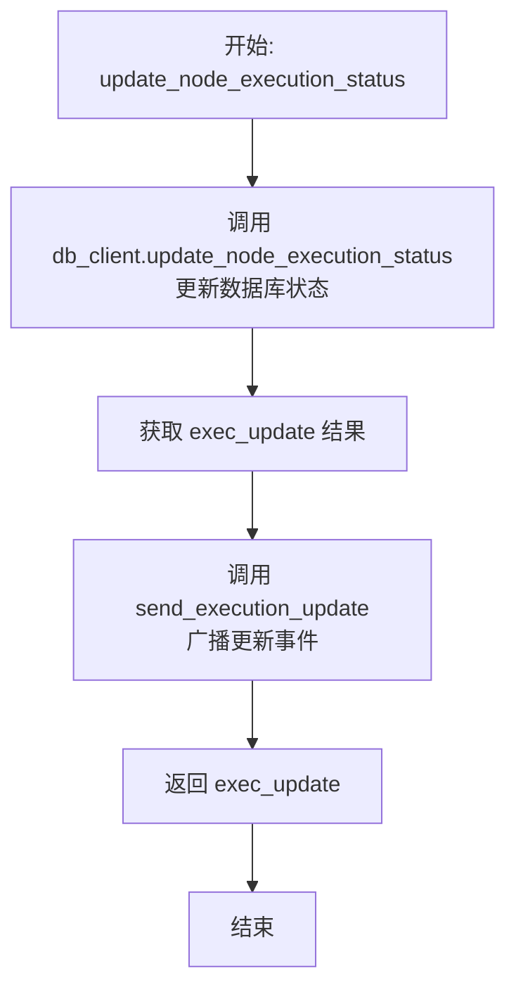

#### 带注释源码

```python
def update_node_execution_status(
    db_client: "DatabaseManagerClient",
    exec_id: str,
    status: ExecutionStatus,
    execution_data: BlockInput | None = None,
    stats: dict[str, Any] | None = None,
) -> NodeExecutionResult:
    """Sets status and fetches+broadcasts the latest state of the node execution"""
    # 1. 调用数据库客户端更新节点执行状态，并获取更新后的执行结果对象
    exec_update = db_client.update_node_execution_status(
        exec_id, status, execution_data, stats
    )
    # 2. 将更新后的执行结果发送到事件总线进行广播
    send_execution_update(exec_update)
    # 3. 返回更新后的执行结果
    return exec_update
```


### `async_update_graph_execution_state`

该函数用于异步更新特定图执行记录的状态和统计数据，并在成功后通过事件总线广播最新状态。

参数：

-  `db_client`：`DatabaseManagerAsyncClient`，用于异步执行数据库操作（更新图执行状态和统计信息）的客户端实例。
-  `graph_exec_id`：`str`，需要更新的图执行记录的唯一标识符。
-  `status`：`ExecutionStatus | None`，可选参数，表示图执行的新状态（如 RUNNING, COMPLETED 等）。
-  `stats`：`GraphExecutionStats | None`，可选参数，包含图执行的最新统计数据（如耗时、成本等）。

返回值：`GraphExecution | None`，如果更新成功，返回包含最新状态的图执行对象；如果更新失败，返回 None。

#### 流程图

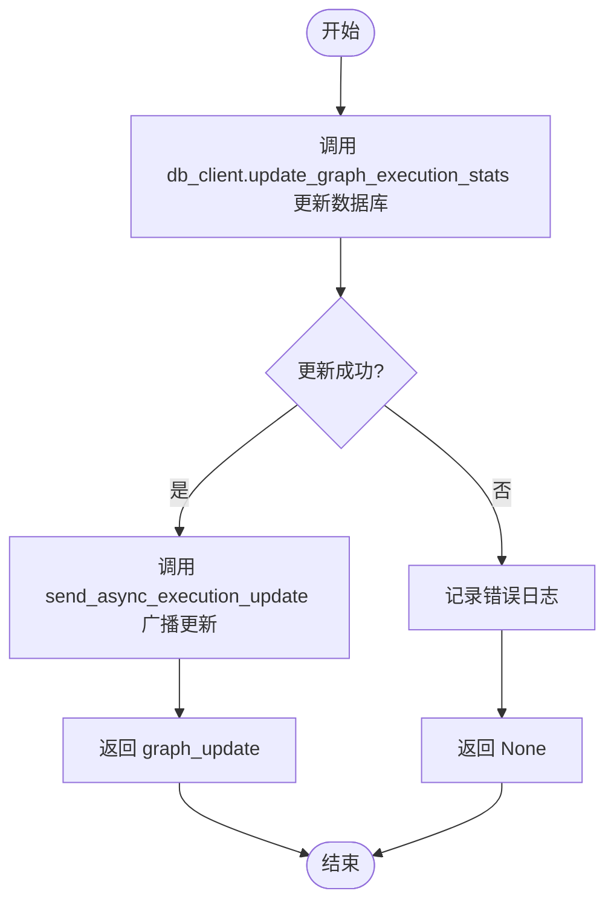

#### 带注释源码

```python
async def async_update_graph_execution_state(
    db_client: "DatabaseManagerAsyncClient",
    graph_exec_id: str,
    status: ExecutionStatus | None = None,
    stats: GraphExecutionStats | None = None,
) -> GraphExecution | None:
    """Sets status and fetches+broadcasts the latest state of the graph execution"""
    # 1. 调用数据库客户端更新图执行的状态和统计数据，并获取更新后的对象
    graph_update = await db_client.update_graph_execution_stats(
        graph_exec_id, status, stats
    )
    
    # 2. 检查更新是否成功
    if graph_update:
        # 3. 如果成功，通过事件总线异步发送更新通知，以便其他组件响应状态变化
        await send_async_execution_update(graph_update)
    else:
        # 4. 如果更新失败（返回 None），记录错误日志
        logger.error(f"Failed to update graph execution stats for {graph_exec_id}")
        
    # 5. 返回更新后的图执行对象（或 None）
    return graph_update
```


### `update_graph_execution_state`

更新图执行的状态和统计信息到数据库，并将更新后的状态广播到事件总线，以便其他组件订阅执行进度。

参数：

-  `db_client`：`DatabaseManagerClient`，数据库管理客户端，用于执行持久化操作。
-  `graph_exec_id`：`str`，图执行的唯一标识符。
-  `status`：`ExecutionStatus | None`，要更新的执行状态（如 RUNNING, COMPLETED, FAILED 等），如果为 None 则不更新状态。
-  `stats`：`GraphExecutionStats | None`，要更新的执行统计数据（如耗时、成本、节点计数等），如果为 None 则不更新统计。

返回值：`GraphExecution | None`，返回更新后的图执行对象；如果数据库更新失败，则返回 None。

#### 流程图

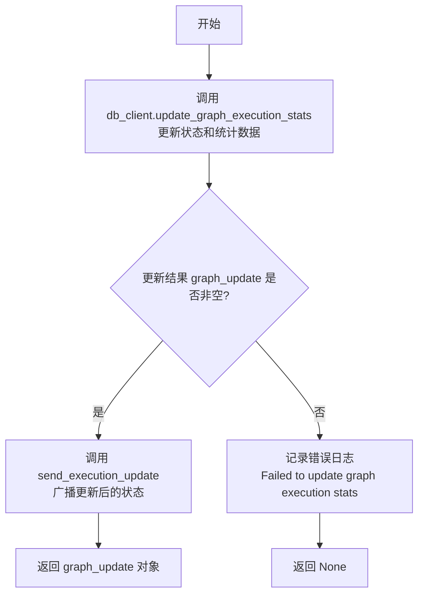

#### 带注释源码

```python
def update_graph_execution_state(
    db_client: "DatabaseManagerClient",
    graph_exec_id: str,
    status: ExecutionStatus | None = None,
    stats: GraphExecutionStats | None = None,
) -> GraphExecution | None:
    """Sets status and fetches+broadcasts the latest state of the graph execution"""
    # 调用数据库客户端更新指定的图执行记录（状态和/或统计信息）
    graph_update = db_client.update_graph_execution_stats(graph_exec_id, status, stats)
    
    # 检查数据库更新是否成功（返回的对象不为 None）
    if graph_update:
        # 如果成功，通过事件总线发送更新，通知订阅者（如前端或其他服务）
        send_execution_update(graph_update)
    else:
        # 如果失败，记录错误日志以便排查问题
        logger.error(f"Failed to update graph execution stats for {graph_exec_id}")
    
    # 返回更新后的图执行对象（失败时为 None）
    return graph_update
```


### `synchronized`

这是一个基于 Redis 的异步分布式锁上下文管理器。它用于确保在分布式环境中，针对特定关键字的代码块在同一时间只能被一个协程或进程执行，从而防止并发访问导致的数据竞争或不一致问题。

参数：

-  `key`：`str`，用于标识锁的唯一键名，通常是需要保护的资源标识符。
-  `timeout`：`int`，锁的超时时间（秒），防止因程序崩溃等原因导致锁无法释放而产生的死锁。默认值为 `settings.config.cluster_lock_timeout`。

返回值：`AbstractAsyncContextManager`，返回一个异步上下文管理器对象，用于配合 `async with` 语句使用。

#### 流程图

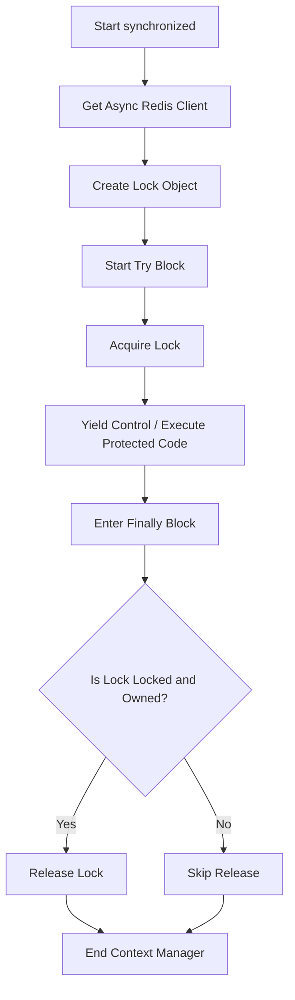

#### 带注释源码

```python
@asynccontextmanager
async def synchronized(key: str, timeout: int = settings.config.cluster_lock_timeout):
    # 获取异步 Redis 客户端实例
    r = await redis.get_redis_async()
    
    # 根据 key 和 timeout 创建一个分布式锁对象
    # 锁的名称会被格式化为 lock:{key}
    lock: AsyncRedisLock = r.lock(f"lock:{key}", timeout=timeout)
    
    try:
        # 尝试获取锁，如果锁已被其他进程持有，则阻塞等待直到获取成功或超时
        await lock.acquire()
        
        # 暂停执行，将控制权交还给 async with 块内的代码
        # 此时锁已被当前协程持有
        yield
        
    finally:
        # 无论代码块中是否发生异常，都会执行 finally 块来确保锁被释放
        # 检查锁是否仍然处于锁定状态并且所有权属于当前进程
        if await lock.locked() and await lock.owned():
            try:
                # 安全释放锁
                await lock.release()
            except Exception as e:
                # 记录释放锁时发生的异常，避免因释放失败影响主流程
                logger.warning(f"Failed to release lock for key {key}: {e}")
```


### `increment_execution_count`

该函数用于在 Redis 中增加特定用户的执行计数。该计数器用于追踪用户的执行次数，以便计算和扣取执行费用。如果是首次计数（即计数器值为 1），函数还会为该键设置过期时间，以避免 Redis 内存无限增长。

参数：

- `user_id`: `str`，需要增加执行计数的用户ID。

返回值：`int`，自增后的执行计数器的新值。

#### 流程图

```mermaid
flowchart TD
    Start([开始]) --> GetRedis[获取同步 Redis 客户端连接]
    GetRedis --> ConstructKey[构建 Redis 键 uec:{user_id}]
    ConstructKey --> Increment[调用 Redis incr 命令原子性自增]
    Increment --> CheckCount{计数器值是否等于 1?}
    CheckCount -- 是 --> SetExpire[设置键的过期时间 TTL]
    CheckCount -- 否 --> ReturnCounter
    SetExpire --> ReturnCounter[返回计数器值]
    ReturnCounter --> End([结束])
```

#### 带注释源码

```python
def increment_execution_count(user_id: str) -> int:
    """
    Increment the execution count for a given user,
    this will be used to charge the user for the execution cost.
    """
    # 获取同步的 Redis 客户端实例
    r = redis.get_redis()
    
    # 构造用于存储用户执行计数的 Redis 键，格式为 "uec:{user_id}"
    k = f"uec:{user_id}"  # User Execution Count global key
    
    # 原子性地将键 k 的值加 1。如果键不存在，则先将其初始化为 0 再加 1。
    # cast 用于类型检查，确保返回值被视为 int 类型。
    counter = cast(int, r.incr(k))
    
    # 如果这是第一次操作（计数器刚从 0 变为 1），则设置过期时间。
    # 这确保了计数器不会在 Redis 中永久存在，防止长期不活跃用户的数据堆积。
    if counter == 1:
        r.expire(k, settings.config.execution_counter_expiration_time)
        
    # 返回自增后的计数值
    return counter
```


### `ExecutionProcessor.on_graph_executor_start`

该方法用于初始化图执行器的工作线程环境。它负责配置系统日志，设置服务名称，获取并记录当前线程ID，初始化集成凭证管理器，并创建和启动两个专用的异步事件循环线程（一个用于节点执行，一个用于节点评估），从而为后续的图和节点执行提供必要的异步运行时环境。

参数：

- `self`: `ExecutionProcessor`, 指向类实例本身的引用，用于初始化实例变量。

返回值：`None`，该方法不返回任何值。

#### 流程图

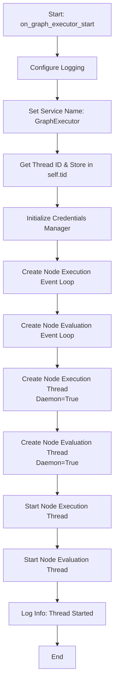

#### 带注释源码

```python
    @func_retry
    def on_graph_executor_start(self):
        # 配置日志记录器
        configure_logging()
        # 设置当前进程的服务名称为 "GraphExecutor"
        set_service_name("GraphExecutor")
        # 获取当前线程的标识符并存储在实例变量中
        self.tid = threading.get_ident()
        # 初始化集成凭证管理器，用于处理执行过程中的凭证
        self.creds_manager = IntegrationCredentialsManager()
        # 创建一个新的异步事件循环，专门用于节点执行
        self.node_execution_loop = asyncio.new_event_loop()
        # 创建一个新的异步事件循环，专门用于节点评估（如处理输出、入队下一节点）
        self.node_evaluation_loop = asyncio.new_event_loop()
        # 创建并配置节点执行线程，设为守护线程，目标是在该循环上永久运行
        self.node_execution_thread = threading.Thread(
            target=self.node_execution_loop.run_forever, daemon=True
        )
        # 创建并配置节点评估线程，设为守护线程
        self.node_evaluation_thread = threading.Thread(
            target=self.node_evaluation_loop.run_forever, daemon=True
        )
        # 启动节点执行线程
        self.node_execution_thread.start()
        # 启动节点评估线程
        self.node_evaluation_thread.start()
        # 记录日志，表明该线程ID的执行器已成功启动
        logger.info(f"[GraphExecutor] {self.tid} started")
```


### `ExecutionProcessor.on_graph_execution`

该方法是图执行工作流的主入口点，负责在独立的线程中处理整个图的执行生命周期。它管理执行状态的转换（如从排队到运行），调用内部的核心执行逻辑以运行图中的节点，并在执行完成后生成活动报告、处理通知以及持久化最终的执行状态和统计数据。

参数：

-   `graph_exec`：`GraphExecutionEntry`，包含图执行的元数据、用户ID、图ID、版本及执行上下文等必要信息。
-   `cancel`：`threading.Event`，用于接收外部发来的取消信号，以中断当前图的执行。
-   `cluster_lock`：`ClusterLock`，分布式锁实例，用于确保在集群范围内同一时刻只有一个实例执行该图。

返回值：`None`，该方法主要通过副作用（更新数据库状态、发送事件通知）来完成工作，不直接返回值。

#### 流程图

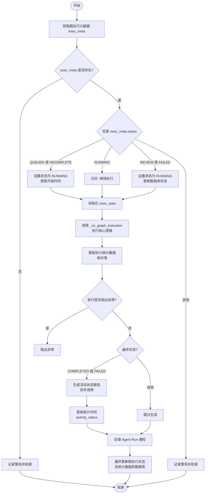

#### 带注释源码

```python
    @error_logged(swallow=False)
    def on_graph_execution(
        self,
        graph_exec: GraphExecutionEntry,
        cancel: threading.Event,
        cluster_lock: ClusterLock,
    ):
        # 初始化日志元数据，用于追踪执行过程
        log_metadata = LogMetadata(
            logger=_logger,
            user_id=graph_exec.user_id,
            graph_eid=graph_exec.graph_exec_id,
            graph_id=graph_exec.graph_id,
            node_id="*",
            node_eid="*",
            block_name="-",
        )
        db_client = get_db_client()

        # 获取图执行的元数据，确认执行是否存在
        exec_meta = db_client.get_graph_execution_meta(
            user_id=graph_exec.user_id,
            execution_id=graph_exec.graph_exec_id,
        )
        if exec_meta is None:
            log_metadata.warning(
                f"Skipped graph execution #{graph_exec.graph_exec_id}, the graph execution is not found."
            )
            return

        # 状态机逻辑：根据当前状态决定是否开始执行
        if exec_meta.status in [ExecutionStatus.QUEUED, ExecutionStatus.INCOMPLETE]:
            log_metadata.info(f"⚙️ Starting graph execution #{graph_exec.graph_exec_id}")
            exec_meta.status = ExecutionStatus.RUNNING
            # 如果是新的排队执行，更新开始时间并发送事件
            send_execution_update(
                db_client.update_graph_execution_start_time(graph_exec.graph_exec_id)
            )
        elif exec_meta.status == ExecutionStatus.RUNNING:
            log_metadata.info(
                f"⚙️ Graph execution #{graph_exec.graph_exec_id} is already running, continuing where it left off."
            )
        elif exec_meta.status == ExecutionStatus.REVIEW:
            # 审核状态恢复执行
            exec_meta.status = ExecutionStatus.RUNNING
            log_metadata.info(
                f"⚙️ Graph execution #{graph_exec.graph_exec_id} was waiting for review, resuming execution."
            )
            update_graph_execution_state(
                db_client=db_client,
                graph_exec_id=graph_exec.graph_exec_id,
                status=ExecutionStatus.RUNNING,
            )
        elif exec_meta.status == ExecutionStatus.FAILED:
            # 失败状态重试执行
            exec_meta.status = ExecutionStatus.RUNNING
            log_metadata.info(
                f"⚙️ Graph execution #{graph_exec.graph_exec_id} was disturbed, continuing where it left off."
            )
            update_graph_execution_state(
                db_client=db_client,
                graph_exec_id=graph_exec.graph_exec_id,
                status=ExecutionStatus.RUNNING,
            )
        else:
            # 其他状态（如已完成、已终止）则跳过
            log_metadata.warning(
                f"Skipped graph execution {graph_exec.graph_exec_id}, the graph execution status is `{exec_meta.status}`."
            )
            return

        # 准备统计数据对象
        if exec_meta.stats is None:
            exec_stats = GraphExecutionStats()
        else:
            exec_stats = exec_meta.stats.to_db()

        # 调用内部核心执行方法，包含主循环和节点调度
        timing_info, status = self._on_graph_execution(
            graph_exec=graph_exec,
            cancel=cancel,
            log_metadata=log_metadata,
            execution_stats=exec_stats,
            cluster_lock=cluster_lock,
        )
        # 累加核心执行阶段的耗时
        exec_stats.walltime += timing_info.wall_time
        exec_stats.cputime += timing_info.cpu_time

        try:
            # 异常处理：如果核心执行抛出异常，在此处重新抛出
            if isinstance(status, BaseException):
                raise status
            exec_meta.status = status

            # 后处理：如果执行成功或失败，生成活动状态和正确性评分
            if status in [ExecutionStatus.COMPLETED, ExecutionStatus.FAILED]:
                # 跨线程运行异步协程以生成活动状态
                activity_response = asyncio.run_coroutine_threadsafe(
                    generate_activity_status_for_execution(
                        graph_exec_id=graph_exec.graph_exec_id,
                        graph_id=graph_exec.graph_id,
                        graph_version=graph_exec.graph_version,
                        execution_stats=exec_stats,
                        db_client=get_db_async_client(),
                        user_id=graph_exec.user_id,
                        execution_status=status,
                    ),
                    self.node_execution_loop,
                ).result(timeout=60.0)
            else:
                activity_response = None
            
            # 更新统计数据中的活动状态信息
            if activity_response is not None:
                exec_stats.activity_status = activity_response["activity_status"]
                exec_stats.correctness_score = activity_response["correctness_score"]
                log_metadata.info(
                    f"Generated activity status: {activity_response['activity_status']} "
                    f"(correctness: {activity_response['correctness_score']:.2f})"
                )
            else:
                log_metadata.debug(
                    "Activity status generation disabled, not setting fields"
                )
        finally:
            # 通信处理：发送 Agent 运行完成的通知
            self._handle_agent_run_notif(db_client, graph_exec, exec_stats)

            # 持久化最终状态和统计数据到数据库
            update_graph_execution_state(
                db_client=db_client,
                graph_exec_id=graph_exec.graph_exec_id,
                status=exec_meta.status,
                stats=exec_stats,
            )
```


### `ExecutionProcessor.on_node_execution`

该方法负责异步处理单个节点的完整执行生命周期。它负责初始化日志和数据库连接，调用内部方法执行节点逻辑，聚合执行统计数据（如CPU时间和耗时），更新全局图级别的统计信息，并将节点的最终状态持久化到数据库中。

参数：

-   `node_exec`：`NodeExecutionEntry`，包含待执行节点的详细信息和上下文。
-   `node_exec_progress`：`NodeExecutionProgress`，用于跟踪节点执行进度的对象。
-   `nodes_input_masks`：`Optional[NodesInputMasks]`，可选参数，用于覆盖或掩蔽特定节点的输入数据。
-   `graph_stats_pair`：`tuple[GraphExecutionStats, threading.Lock]`，包含整个图的执行统计对象及其对应的线程锁，用于线程安全地更新统计数据。
-   `nodes_to_skip`：`Optional[set[str]]`，可选参数，指定需要跳过执行的节点ID集合。

返回值：`NodeExecutionStats`，返回包含节点执行统计信息（如时间、成本、错误等）的对象。

#### 流程图

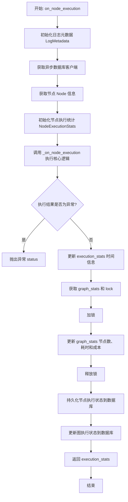

#### 带注释源码

```python
    @async_error_logged(swallow=True)
    async def on_node_execution(
        self,
        node_exec: NodeExecutionEntry,
        node_exec_progress: NodeExecutionProgress,
        nodes_input_masks: Optional[NodesInputMasks],
        graph_stats_pair: tuple[GraphExecutionStats, threading.Lock],
        nodes_to_skip: Optional[set[str]] = None,
    ) -> NodeExecutionStats:
        # 构造日志元数据，用于日志追踪，包含用户ID、图ID、节点ID等关键信息
        log_metadata = LogMetadata(
            logger=_logger,
            user_id=node_exec.user_id,
            graph_eid=node_exec.graph_exec_id,
            graph_id=node_exec.graph_id,
            node_eid=node_exec.node_exec_id,
            node_id=node_exec.node_id,
            block_name=b.name if (b := get_block(node_exec.block_id)) else "-",
        )
        # 获取异步数据库客户端
        db_client = get_db_async_client()
        # 获取节点定义信息
        node = await db_client.get_node(node_exec.node_id)
        # 初始化本次节点执行的统计对象
        execution_stats = NodeExecutionStats()

        # 调用内部方法 _on_node_execution 执行实际节点逻辑
        # 装饰器 @async_time_measured 会自动记录时间并返回
        timing_info, status = await self._on_node_execution(
            node=node,
            node_exec=node_exec,
            node_exec_progress=node_exec_progress,
            stats=execution_stats,
            db_client=db_client,
            log_metadata=log_metadata,
            nodes_input_masks=nodes_input_masks,
            nodes_to_skip=nodes_to_skip,
        )
        
        # 如果执行状态是一个异常对象，直接抛出
        if isinstance(status, BaseException):
            raise status

        # 将计时信息（墙钟时间、CPU时间）填入统计对象
        execution_stats.walltime = timing_info.wall_time
        execution_stats.cputime = timing_info.cpu_time

        # 解包全局统计对象和锁
        graph_stats, graph_stats_lock = graph_stats_pair
        # 加锁保护全局统计数据的更新，防止并发冲突
        with graph_stats_lock:
            graph_stats.node_count += 1 + execution_stats.extra_steps
            graph_stats.nodes_cputime += execution_stats.cputime
            graph_stats.nodes_walltime += execution_stats.walltime
            graph_stats.cost += execution_stats.extra_cost
            # 如果节点执行出错，增加错误计数
            if isinstance(execution_stats.error, Exception):
                graph_stats.node_error_count += 1

        # 准备节点统计数据以便持久化
        node_error = execution_stats.error
        node_stats = execution_stats.model_dump()
        # 如果错误不是字符串（即是一个异常对象），转换为字符串记录
        if node_error and not isinstance(node_error, str):
            node_stats["error"] = str(node_error) or node_stats.__class__.__name__

        # 异步更新数据库中节点的执行状态和统计数据
        await async_update_node_execution_status(
            db_client=db_client,
            exec_id=node_exec.node_exec_id,
            status=status,
            stats=node_stats,
        )
        
        # 异步更新数据库中整个图的执行状态
        await async_update_graph_execution_state(
            db_client=db_client,
            graph_exec_id=node_exec.graph_exec_id,
            stats=graph_stats,
        )

        return execution_stats
```


### `ExecutionProcessor._on_node_execution`

处理单个节点的核心执行逻辑。该方法负责将节点状态更新为运行中，调用底层块执行函数 `execute_node` 进行实际运算，并在执行过程中持续捕获和持久化输出数据。它包含完整的异常处理机制，能够根据不同的异常类型（如用户输入错误、系统异常或中断）判定节点的最终状态（成功、失败或终止），并确保在失败时将错误信息持久化。

参数：

-  `node`：`Node`，待执行的节点对象，包含节点的块定义和配置信息。
-  `node_exec`：`NodeExecutionEntry`，节点执行条目，包含本次执行的唯一 ID、输入数据、用户 ID 及执行上下文等元数据。
-  `node_exec_progress`：`NodeExecutionProgress`，进度跟踪对象，用于记录和管理节点执行期间的输出进度。
-  `stats`：`NodeExecutionStats`，统计对象，用于收集和累加执行过程中的指标，如 CPU 时间、输入/输出大小及额外成本。
-  `db_client`：`"DatabaseManagerAsyncClient"`，异步数据库客户端，用于将执行状态变更和输出数据写入持久化存储。
-  `log_metadata`：`LogMetadata`，日志元数据封装，用于生成带有上下文信息（如用户 ID、图 ID、节点 ID）的结构化日志。
-  `nodes_input_masks`：`Optional[NodesInputMasks]`，可选参数，用于覆盖或合并节点的输入数据，通常用于父节点对子节点的特定输入控制。
-  `nodes_to_skip`：`Optional[set[str]]`，可选参数，包含需要跳过执行的节点 ID 集合。

返回值：`ExecutionStatus`，节点执行结束后的最终状态枚举值，包括 `COMPLETED`（完成）、`FAILED`（失败）或 `TERMINATED`（终止）。

#### 流程图

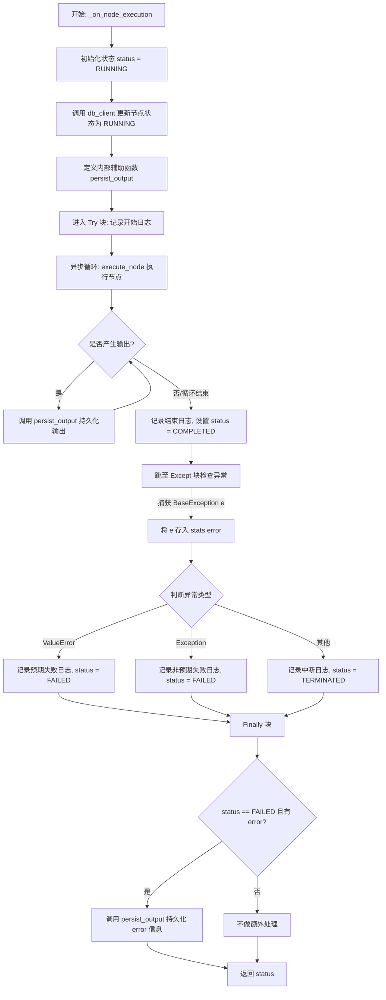

#### 带注释源码

```python
    @async_time_measured
    async def _on_node_execution(
        self,
        node: Node,
        node_exec: NodeExecutionEntry,
        node_exec_progress: NodeExecutionProgress,
        stats: NodeExecutionStats,
        db_client: "DatabaseManagerAsyncClient",
        log_metadata: LogMetadata,
        nodes_input_masks: Optional[NodesInputMasks] = None,
        nodes_to_skip: Optional[set[str]] = None,
    ) -> ExecutionStatus:
        # 初始化执行状态为运行中
        status = ExecutionStatus.RUNNING

        # 定义内部辅助函数，用于处理输出数据的持久化
        async def persist_output(output_name: str, output_data: Any) -> None:
            # 1. 将输出数据写入数据库
            await db_client.upsert_execution_output(
                node_exec_id=node_exec.node_exec_id,
                output_name=output_name,
                output_data=output_data,
            )
            # 2. 获取最新的节点执行记录并发送更新事件
            if exec_update := await db_client.get_node_execution(
                node_exec.node_exec_id
            ):
                await send_async_execution_update(exec_update)

            # 3. 将输出添加到进度跟踪对象中，用于后续流程（如评估）
            node_exec_progress.add_output(
                ExecutionOutputEntry(
                    node=node,
                    node_exec_id=node_exec.node_exec_id,
                    data=(output_name, output_data),
                )
            )

        try:
            log_metadata.info(f"Start node execution {node_exec.node_exec_id}")
            # 更新数据库中的节点状态为 RUNNING
            await async_update_node_execution_status(
                db_client=db_client,
                exec_id=node_exec.node_exec_id,
                status=ExecutionStatus.RUNNING,
            )

            # 循环执行节点逻辑并处理流式输出
            async for output_name, output_data in execute_node(
                node=node,
                data=node_exec,
                execution_processor=self,
                execution_stats=stats,
                nodes_input_masks=nodes_input_masks,
                nodes_to_skip=nodes_to_skip,
            ):
                # 每产生一个输出就立即持久化
                await persist_output(output_name, output_data)

            log_metadata.info(f"Finished node execution {node_exec.node_exec_id}")
            # 正常完成则设置状态为 COMPLETED
            status = ExecutionStatus.COMPLETED

        except BaseException as e:
            # 捕获所有异常，存入统计对象以便后续分析
            stats.error = e

            if isinstance(e, ValueError):
                # ValueError 通常视为预期的用户错误（如输入验证失败），不被标记为系统错误
                log_metadata.info(
                    f"Expected failure on node execution {node_exec.node_exec_id}: {type(e).__name__} - {e}"
                )
                status = ExecutionStatus.FAILED
            elif isinstance(e, Exception):
                # 其他 Exception 视为非预期的系统错误
                log_metadata.exception(
                    f"Unexpected failure on node execution {node_exec.node_exec_id}: {type(e).__name__} - {e}"
                )
                status = ExecutionStatus.FAILED
            else:
                # CancelledError 或 SystemExit 等非 Exception 的 BaseException 视为终止信号
                log_metadata.warning(
                    f"Interruption error on node execution {node_exec.node_exec_id}: {type(e).__name__}"
                )
                status = ExecutionStatus.TERMINATED

        finally:
            # 如果状态为失败且有具体的错误信息，则将错误作为特殊的 "error" 输出持久化
            if status == ExecutionStatus.FAILED and stats.error is not None:
                await persist_output(
                    "error", str(stats.error) or type(stats.error).__name__
                )
        return status
```


### `ExecutionProcessor._charge_usage`

该方法负责计算并扣除执行特定节点以及总体图执行步骤所产生的费用。它分别处理两个部分的成本：一是基于特定块类型和输入数据的块执行成本，二是基于执行计数器的通用执行成本。该方法通过数据库客户端扣除用户的信用额度，并记录详细的交易元数据，最后返回总花费和剩余余额。

参数：

-  `node_exec`：`NodeExecutionEntry`，包含当前节点执行的详细信息，如用户ID、图ID、节点ID以及输入数据等，用于计算费用和记录交易元数据。
-  `execution_count`：`int`，执行计数器，用于确定基础的执行费用或阶梯定价。

返回值：`tuple[int, int]`，返回一个元组，第一个元素是本次操作的总花费（`total_cost`），第二个元素是扣除后的剩余余额（`remaining_balance`）。

#### 流程图

```mermaid
graph TD
    A[Start: _charge_usage] --> B[Initialize total_cost and remaining_balance]
    B --> C[Get Database Client]
    C --> D[Get Block definition]
    D --> E{Block exists?}
    E -- No --> F[Log Error]
    F --> G[Return 0, 0]
    E -- Yes --> H[Calculate Block Cost]
    H --> I{Block Cost > 0?}
    I -- Yes --> J[Deduct Credits for Block]
    J --> K[Update total_cost]
    I -- No --> L[Calculate Execution Cost]
    K --> L
    L --> M{Execution Cost > 0?}
    M -- Yes --> N[Deduct Credits for Execution]
    N --> O[Update total_cost]
    M -- No --> P[Return total_cost, remaining_balance]
    O --> P
```

#### 带注释源码

```python
def _charge_usage(
    self,
    node_exec: NodeExecutionEntry,
    execution_count: int,
) -> tuple[int, int]:
    # 初始化总费用和剩余余额变量
    total_cost = 0
    remaining_balance = 0
    # 获取数据库客户端，用于进行信用扣除操作
    db_client = get_db_client()
    # 根据block_id获取块的定义对象
    block = get_block(node_exec.block_id)
    # 如果块未找到，记录错误并直接返回0费用
    if not block:
        logger.error(f"Block {node_exec.block_id} not found.")
        return total_cost, 0

    # 计算块特定的使用费用（基于块类型和输入数据）
    cost, matching_filter = block_usage_cost(
        block=block, input_data=node_exec.inputs
    )
    # 如果块费用大于0，执行扣除操作
    if cost > 0:
        remaining_balance = db_client.spend_credits(
            user_id=node_exec.user_id,
            cost=cost,
            # 构建交易元数据，包含图、节点和块的详细信息
            metadata=UsageTransactionMetadata(
                graph_exec_id=node_exec.graph_exec_id,
                graph_id=node_exec.graph_id,
                node_exec_id=node_exec.node_exec_id,
                node_id=node_exec.node_id,
                block_id=node_exec.block_id,
                block=block.name,
                input=matching_filter,
                reason=f"Ran block {node_exec.block_id} {block.name}",
            ),
        )
        # 累加总费用
        total_cost += cost

    # 计算通用的执行费用（基于执行计数）
    cost, usage_count = execution_usage_cost(execution_count)
    # 如果执行费用大于0，执行扣除操作
    if cost > 0:
        remaining_balance = db_client.spend_credits(
            user_id=node_exec.user_id,
            cost=cost,
            # 构建交易元数据，记录执行次数和原因
            metadata=UsageTransactionMetadata(
                graph_exec_id=node_exec.graph_exec_id,
                graph_id=node_exec.graph_id,
                input={
                    "execution_count": usage_count,
                    "charge": "Execution Cost",
                },
                reason=f"Execution Cost for {usage_count} blocks of ex_id:{node_exec.graph_exec_id} g_id:{node_exec.graph_id}",
            ),
        )
        # 累加总费用
        total_cost += cost

    # 返回总花费和扣除后的剩余余额
    return total_cost, remaining_balance
```


### `ExecutionProcessor._on_graph_execution`

该方法负责编排和执行单个图（Graph）的核心逻辑。它初始化执行队列，处理节点的调度与执行，管理异步任务的提交与结果获取，处理余额扣费与检查，执行输入/输出的审核，并在发生错误或取消时进行清理。该方法运行在同步线程中，但通过 `run_coroutine_threadsafe` 与异步事件循环交互以处理节点执行和数据库操作。

参数：

-  `graph_exec`：`GraphExecutionEntry`，包含当前图执行的所有元数据、上下文、用户ID及输入掩码等信息。
-  `cancel`：`threading.Event`，用于监听取消信号，以便在收到终止请求时中断图执行。
-  `log_metadata`：`LogMetadata`，用于记录带有统一前缀（用户ID、图ID等）的日志上下文。
-  `execution_stats`：`GraphExecutionStats`，用于在执行过程中累积统计信息（如花费、节点数、耗时）。
-  `cluster_lock`：`ClusterLock`，用于在集群范围内锁定当前图的执行，防止多实例同时运行。

返回值：`ExecutionStatus`，图执行的最终状态（如 `COMPLETED`, `FAILED`, `TERMINATED`, `REVIEW`）。

#### 流程图

```mermaid
graph TD
    A([开始]) --> B[检查用户余额]
    B -- 余额不足 --> C[抛出 InsufficientBalanceError]
    B -- 余额充足 --> D[输入审核]
    D --> E[预填充执行队列<br>获取未完成/运行中的节点]
    E --> F{主循环: 队列不为空 或 有运行中节点}
    F -- 否 --> L{输出审核}
    F -- 是 --> G{是否收到取消信号?}
    G -- 是 --> H([跳出循环])
    G -- 否 --> I[从队列获取待执行节点]
    I --> J{节点是否需跳过?}
    J -- 是 --> K[标记节点为 COMPLETED]
    K --> F
    J -- 否 --> M[扣除使用费用]
    M --> N{扣费是否成功?}
    N -- 失败 --> O[处理余额不足通知]
    O --> H
    N -- 成功 --> P[检查低余额阈值]
    P --> Q[提交异步节点执行任务]
    Q --> R{内部轮询循环<br>等待输出或队列为空}
    R -- 有输出 --> S[提交异步任务处理输出<br>并获取下一节点]
    S --> T[下一节点加入队列]
    T --> R
    R -- 无输出/空闲 --> U[刷新 Cluster Lock]
    U --> V[Sleep 0.1s]
    V --> R
    R -- 队列不为空或有运行节点 --> R
    R -- 全部完成 --> F
    
    H --> W{是否取消?}
    W -- 是 --> X[状态 = TERMINATED]
    W -- 否 --> Y[是否有错误?]
    Y -- 是 --> Z[状态 = FAILED]
    Y -- 否 --> AA{是否有待审核内容?}
    AA -- 是 --> AB[状态 = REVIEW]
    AA -- 否 --> AC[状态 = COMPLETED]
    
    L --> M1{审核结果是否错误?}
    M1 -- 是 --> Z
    M1 -- 否 --> W
    
    X --> AD[更新统计信息]
    Z --> AD
    AB --> AD
    AC --> AD
    AD --> AE[清理资源]
    AE --> AF([返回 Status])

    subgraph 捕获异常处理
        B -.-> C
        N -.-> O
    end
```

#### 带注释源码

```python
    @time_measured
    def _on_graph_execution(
        self,
        graph_exec: GraphExecutionEntry,
        cancel: threading.Event,
        log_metadata: LogMetadata,
        execution_stats: GraphExecutionStats,
        cluster_lock: ClusterLock,
    ) -> ExecutionStatus:
        """
        Returns:
            dict: The execution statistics of the graph execution.
            ExecutionStatus: The final status of the graph execution.
            Exception | None: The error that occurred during the execution, if any.
        """
        execution_status: ExecutionStatus = ExecutionStatus.RUNNING
        error: Exception | None = None
        db_client = get_db_client()
        execution_stats_lock = threading.Lock()

        # 状态持有者 ----------------------------------------------------
        # 用于跟踪正在运行的节点执行和评估任务
        self.running_node_execution: dict[str, NodeExecutionProgress] = defaultdict(
            NodeExecutionProgress
        )
        self.running_node_evaluation: dict[str, Future] = {}
        self.execution_stats = execution_stats
        self.execution_stats_lock = execution_stats_lock
        execution_queue = ExecutionQueue[NodeExecutionEntry]()

        running_node_execution = self.running_node_execution
        running_node_evaluation = self.running_node_evaluation

        try:
            # 1. 检查用户余额
            if db_client.get_credits(graph_exec.user_id) <= 0:
                raise InsufficientBalanceError(
                    user_id=graph_exec.user_id,
                    message="You have no credits left to run an agent.",
                    balance=0,
                    amount=1,
                )

            # 2. 输入审核
            try:
                if moderation_error := asyncio.run_coroutine_threadsafe(
                    automod_manager.moderate_graph_execution_inputs(
                        db_client=get_db_async_client(),
                        graph_exec=graph_exec,
                    ),
                    self.node_evaluation_loop,
                ).result(timeout=30.0):
                    raise moderation_error
            except asyncio.TimeoutError:
                log_metadata.warning(
                    f"Input moderation timed out for graph execution {graph_exec.graph_exec_id}, bypassing moderation and continuing execution"
                )
                # Continue execution without moderation

            # ------------------------------------------------------------
            # Pre‑populate queue ---------------------------------------
            # ------------------------------------------------------------
            # 将数据库中已有的状态为 RUNNING, QUEUED, TERMINATED, REVIEW 的节点加载回队列
            # 以支持断点续传
            for node_exec in db_client.get_node_executions(
                graph_exec.graph_exec_id,
                statuses=[
                    ExecutionStatus.RUNNING,
                    ExecutionStatus.QUEUED,
                    ExecutionStatus.TERMINATED,
                    ExecutionStatus.REVIEW,
                ],
            ):
                node_entry = node_exec.to_node_execution_entry(
                    graph_exec.execution_context
                )
                execution_queue.add(node_entry)

            # ------------------------------------------------------------
            # Main dispatch / polling loop -----------------------------
            # ------------------------------------------------------------

            while not execution_queue.empty():
                if cancel.is_set():
                    break

                queued_node_exec = execution_queue.get()

                # 检查是否应跳过该节点（例如未配置可选凭证）
                if queued_node_exec.node_id in graph_exec.nodes_to_skip:
                    log_metadata.info(
                        f"Skipping node execution {queued_node_exec.node_exec_id} "
                        f"for node {queued_node_exec.node_id} - optional credentials not configured"
                    )
                    # 标记节点为已完成，不执行，无输出
                    update_node_execution_status(
                        db_client=db_client,
                        exec_id=queued_node_exec.node_exec_id,
                        status=ExecutionStatus.COMPLETED,
                    )
                    continue

                log_metadata.debug(
                    f"Dispatching node execution {queued_node_exec.node_exec_id} "
                    f"for node {queued_node_exec.node_id}",
                )

                # Charge usage (may raise) ------------------------------
                try:
                    # 扣除节点执行费用
                    cost, remaining_balance = self._charge_usage(
                        node_exec=queued_node_exec,
                        execution_count=increment_execution_count(graph_exec.user_id),
                    )
                    with execution_stats_lock:
                        execution_stats.cost += cost
                    # 检查低余额并发送通知
                    self._handle_low_balance(
                        db_client=db_client,
                        user_id=graph_exec.user_id,
                        current_balance=remaining_balance,
                        transaction_cost=cost,
                    )
                except InsufficientBalanceError as balance_error:
                    error = balance_error  # 设置错误以触发 FAILED 状态
                    node_exec_id = queued_node_exec.node_exec_id
                    db_client.upsert_execution_output(
                        node_exec_id=node_exec_id,
                        output_name="error",
                        output_data=str(error),
                    )
                    update_node_execution_status(
                        db_client=db_client,
                        exec_id=node_exec_id,
                        status=ExecutionStatus.FAILED,
                    )

                    self._handle_insufficient_funds_notif(
                        db_client,
                        graph_exec.user_id,
                        graph_exec.graph_id,
                        error,
                    )
                    # 优雅停止执行循环
                    break

                # Add input overrides -----------------------------
                node_id = queued_node_exec.node_id
                if (nodes_input_masks := graph_exec.nodes_input_masks) and (
                    node_input_mask := nodes_input_masks.get(node_id)
                ):
                    queued_node_exec.inputs.update(node_input_mask)

                # Kick off async node execution -------------------------
                # 提交异步节点执行任务到 node_execution_loop
                node_execution_task = asyncio.run_coroutine_threadsafe(
                    self.on_node_execution(
                        node_exec=queued_node_exec,
                        node_exec_progress=running_node_execution[node_id],
                        nodes_input_masks=nodes_input_masks,
                        graph_stats_pair=(
                            execution_stats,
                            execution_stats_lock,
                        ),
                        nodes_to_skip=graph_exec.nodes_to_skip,
                    ),
                    self.node_execution_loop,
                )
                running_node_execution[node_id].add_task(
                    node_exec_id=queued_node_exec.node_exec_id,
                    task=node_execution_task,
                )

                # Poll until queue refills or all inflight work done ----
                # 内部轮询循环：等待当前节点产生输出，以便将后续节点加入队列
                while execution_queue.empty() and (
                    running_node_execution or running_node_evaluation
                ):
                    if cancel.is_set():
                        break

                    # --------------------------------------------------
                    # Handle inflight evaluations ---------------------
                    # --------------------------------------------------
                    node_output_found = False
                    for node_id, inflight_exec in list(running_node_execution.items()):
                        if cancel.is_set():
                            break

                        # node evaluation future (处理输出以决定下一跳的任务) -----------------
                        if inflight_eval := running_node_evaluation.get(node_id):
                            if not inflight_eval.done():
                                continue
                            try:
                                inflight_eval.result(timeout=0)
                                running_node_evaluation.pop(node_id)
                            except Exception as e:
                                log_metadata.error(f"Node eval #{node_id} failed: {e}")

                        # node execution future (实际运行节点的任务) ---------------------------
                        if inflight_exec.is_done():
                            running_node_execution.pop(node_id)
                            continue

                        # 检查是否有新的输出产生
                        if output := inflight_exec.pop_output():
                            node_output_found = True
                            # 提交异步任务处理输出（更新DB、计算下一节点、加入队列）
                            running_node_evaluation[node_id] = (
                                asyncio.run_coroutine_threadsafe(
                                    self._process_node_output(
                                        output=output,
                                        node_id=node_id,
                                        graph_exec=graph_exec,
                                        log_metadata=log_metadata,
                                        nodes_input_masks=nodes_input_masks,
                                        execution_queue=execution_queue,
                                    ),
                                    self.node_evaluation_loop,
                                )
                            )
                    if (
                        not node_output_found
                        and execution_queue.empty()
                        and (running_node_execution or running_node_evaluation)
                    ):
                        # 空闲刷新锁并短暂休眠
                        cluster_lock.refresh()
                        time.sleep(0.1)

            # loop done --------------------------------------------------

            # Output moderation
            try:
                if moderation_error := asyncio.run_coroutine_threadsafe(
                    automod_manager.moderate_graph_execution_outputs(
                        db_client=get_db_async_client(),
                        graph_exec_id=graph_exec.graph_exec_id,
                        user_id=graph_exec.user_id,
                        graph_id=graph_exec.graph_id,
                    ),
                    self.node_evaluation_loop,
                ).result(timeout=30.0):
                    raise moderation_error
            except asyncio.TimeoutError:
                log_metadata.warning(
                    f"Output moderation timed out for graph execution {graph_exec.graph_exec_id}, bypassing moderation and continuing execution"
                )
                # Continue execution without moderation

            # Determine final execution status based on whether there was an error or termination
            if cancel.is_set():
                execution_status = ExecutionStatus.TERMINATED
            elif error is not None:
                execution_status = ExecutionStatus.FAILED
            else:
                if db_client.has_pending_reviews_for_graph_exec(
                    graph_exec.graph_exec_id
                ):
                    execution_status = ExecutionStatus.REVIEW
                else:
                    execution_status = ExecutionStatus.COMPLETED

            if error:
                execution_stats.error = str(error) or type(error).__name__

            return execution_status

        except BaseException as e:
            # 捕获未处理的异常
            error = (
                e
                if isinstance(e, Exception)
                else Exception(f"{e.__class__.__name__}: {e}")
            )
            if not execution_stats.error:
                execution_stats.error = str(error)

            known_errors = (InsufficientBalanceError, ModerationError)
            if isinstance(error, known_errors):
                return ExecutionStatus.FAILED

            execution_status = ExecutionStatus.FAILED
            log_metadata.exception(
                f"Failed graph execution {graph_exec.graph_exec_id}: {error}"
            )

            # Send rate-limited Discord alert for unknown/unexpected errors
            send_rate_limited_discord_alert(
                "graph_execution",
                error,
                "unknown_error",
                f"🚨 **Unknown Graph Execution Error**\n"
                f"User: {graph_exec.user_id}\n"
                f"Graph ID: {graph_exec.graph_id}\n"
                f"Execution ID: {graph_exec.graph_exec_id}\n"
                f"Error Type: {type(error).__name__}\n"
                f"Error: {str(error)[:200]}{'...' if len(str(error)) > 200 else ''}\n",
            )

            raise

        finally:
            # 无论成功失败，清理资源
            self._cleanup_graph_execution(
                execution_queue=execution_queue,
                running_node_execution=running_node_execution,
                running_node_evaluation=running_node_evaluation,
                execution_status=execution_status,
                error=error,
                graph_exec_id=graph_exec.graph_exec_id,
                log_metadata=log_metadata,
                db_client=db_client,
            )
```


### `ExecutionProcessor._cleanup_graph_execution`

该方法在图执行结束时进行清理工作，确保所有正在运行的节点执行和评估任务被正确停止，更新剩余队列项的状态，并清理相关的临时文件。

参数：

-  `execution_queue`：`ExecutionQueue[NodeExecutionEntry]`，存储待处理节点执行的队列，用于处理剩余的排队任务。
-  `running_node_execution`：`dict[str, "NodeExecutionProgress"]`，跟踪当前正在运行的节点执行进度的字典，键为节点ID。
-  `running_node_evaluation`：`dict[str, Future]`，跟踪当前正在运行的节点评估任务（Future对象）的字典，键为节点ID。
-  `execution_status`：`ExecutionStatus`，图执行的最终状态（如 COMPLETED, FAILED, TERMINATED），将应用于剩余的队列项。
-  `error`：`Exception | None`，执行过程中发生的异常对象（如果有），用于记录错误信息。
-  `graph_exec_id`：`str`，图执行的唯一标识符，用于清理特定的执行文件。
-  `log_metadata`：`LogMetadata`，包含日志上下文信息的对象，用于结构化日志记录。
-  `db_client`：`"DatabaseManagerClient"`，数据库管理客户端，用于持久化更新节点执行的状态。

返回值：`None`，无返回值。

#### 流程图

```mermaid
flowchart TD
    A[开始: _cleanup_graph_execution] --> B[遍历运行中的节点执行]
    B --> C{任务是否完成?}
    C -- 是 --> D[跳过停止操作]
    C -- 否 --> E[调用 inflight_exec.stop 停止任务]
    D --> F[遍历所有运行中的节点执行]
    E --> F
    F --> G[等待任务完成 timeout 3600s]
    G --> H{是否超时?}
    H -- 是 --> I[记录超时异常日志]
    H -- 否 --> J[继续]
    I --> J
    J --> K[遍历运行中的节点评估 Future]
    K --> L[获取 Future 结果 timeout 3600s]
    L --> M{是否超时?}
    M -- 是 --> N[记录超时异常日志]
    M -- 否 --> O[继续]
    N --> O
    O --> P{执行队列是否为空?}
    P -- 否 --> Q[从队列获取执行项]
    Q --> R[更新数据库状态为 execution_status]
    R --> P
    P -- 是 --> S[调用 clean_exec_files 清理临时文件]
    S --> T[结束]
```

#### 带注释源码

```python
    @error_logged(swallow=True)
    def _cleanup_graph_execution(
        self,
        execution_queue: ExecutionQueue[NodeExecutionEntry],
        running_node_execution: dict[str, "NodeExecutionProgress"],
        running_node_evaluation: dict[str, Future],
        execution_status: ExecutionStatus,
        error: Exception | None,
        graph_exec_id: str,
        log_metadata: LogMetadata,
        db_client: "DatabaseManagerClient",
    ) -> None:
        """
        Clean up running node executions and evaluations when graph execution ends.
        This method is decorated with @error_logged(swallow=True) to ensure cleanup
        never fails in the finally block.
        """
        # 第一步：取消并等待所有正在运行的节点执行任务完成
        for node_id, inflight_exec in running_node_execution.items():
            # 如果任务已经完成，则跳过
            if inflight_exec.is_done():
                continue
            # 记录停止日志
            log_metadata.info(f"Stopping node execution {node_id}")
            # 调用停止方法中断执行
            inflight_exec.stop()

        # 第二步：等待所有节点执行任务彻底停止
        for node_id, inflight_exec in running_node_execution.items():
            try:
                # 等待任务结束，最长等待3600秒（1小时）
                inflight_exec.wait_for_done(timeout=3600.0)
            except TimeoutError:
                # 如果超时，记录异常日志，任务可能卡住
                log_metadata.exception(
                    f"Node execution #{node_id} did not stop in time, "
                    "it may be stuck or taking too long."
                )

        # 第三步：等待剩余正在进行的节点评估任务完成
        for node_id, inflight_eval in running_node_evaluation.items():
            try:
                # 获取 Future 结果，最长等待3600秒
                inflight_eval.result(timeout=3600.0)
            except TimeoutError:
                # 如果超时，记录异常日志
                log_metadata.exception(
                    f"Node evaluation #{node_id} did not stop in time, "
                    "it may be stuck or taking too long."
                )

        # 第四步：处理执行队列中剩余的任务
        while queued_execution := execution_queue.get_or_none():
            # 将剩余排队任务的状态更新为最终的执行状态（如失败或终止）
            # 如果有错误信息，一并写入 stats
            update_node_execution_status(
                db_client=db_client,
                exec_id=queued_execution.node_exec_id,
                status=execution_status,
                stats={"error": str(error)} if error else None,
            )

        # 第五步：清理该图执行产生的临时文件
        clean_exec_files(graph_exec_id)
```


### `ExecutionProcessor._process_node_output`

处理节点的执行输出，根据图中的链接逻辑计算并排队后续需要执行的节点。该方法负责连接输出数据到下游节点的输入，并更新执行队列。

参数：

- `output`：`ExecutionOutputEntry`，当前节点产生的执行输出条目，包含节点引用和输出数据（名称与值）。
- `node_id`：`str`，产生该输出的节点ID。
- `graph_exec`：`GraphExecutionEntry`，图执行上下文对象，包含图ID、用户ID、版本等全局信息。
- `log_metadata`：`LogMetadata`，日志元数据对象，用于在日志中携带统一的上下文信息（如用户ID、执行ID等）。
- `nodes_input_masks`：`Optional[NodesInputMasks]`，可选的节点输入掩码，用于覆盖或修改特定节点的输入数据。
- `execution_queue`：`ExecutionQueue[NodeExecutionEntry]`，节点执行队列，新生成的下游节点执行任务将被添加到此队列中。

返回值：`None`，该方法主要产生副作用（更新数据库、向队列添加任务），无返回值。

#### 流程图

```mermaid
graph TD
    A[开始: _process_node_output] --> B[获取异步数据库客户端]
    B --> C[记录调试日志]
    C --> D[调用 _enqueue_next_nodes 计算后续节点]
    D --> E{是否有后续执行任务?}
    E -- 否 --> F[结束]
    E -- 是 --> G[遍历后续执行任务列表]
    G --> H[将任务添加到 execution_queue]
    H --> G
    G -- 循环结束 --> F
```

#### 带注释源码

```python
    @async_error_logged(swallow=True)
    async def _process_node_output(
        self,
        output: ExecutionOutputEntry,
        node_id: str,
        graph_exec: GraphExecutionEntry,
        log_metadata: LogMetadata,
        nodes_input_masks: Optional[NodesInputMasks],
        execution_queue: ExecutionQueue[NodeExecutionEntry],
    ) -> None:
        """Process a node's output, update its status, and enqueue next nodes.

        Args:
            output: The execution output entry to process
            node_id: The ID of the node that produced the output
            graph_exec: The graph execution entry
            log_metadata: Logger metadata for consistent logging
            nodes_input_masks: Optional map of node input overrides
            execution_queue: Queue to add next executions to
        """
        # 获取异步数据库客户端，用于后续可能的数据持久化（虽然主要在_enqueue_next_nodes中处理）
        db_client = get_db_async_client()

        # 记录调试日志，表示开始处理特定节点的输出
        log_metadata.debug(f"Enqueue nodes for {node_id}: {output}")

        # 调用辅助函数 _enqueue_next_nodes 计算并注册下游节点的执行
        # 该函数会处理输入数据的映射、验证以及数据库状态更新
        for next_execution in await _enqueue_next_nodes(
            db_client=db_client,
            node=output.node,          # 当前执行的节点对象
            output=output.data,        # 输出数据
            user_id=graph_exec.user_id,
            graph_exec_id=graph_exec.graph_exec_id,
            graph_id=graph_exec.graph_id,
            graph_version=graph_exec.graph_version,
            log_metadata=log_metadata,
            nodes_input_masks=nodes_input_masks,
            execution_context=graph_exec.execution_context,
        ):
            # 将计算出的下游节点执行任务添加到执行队列中，等待调度器执行
            execution_queue.add(next_execution)
```


### `ExecutionProcessor._handle_agent_run_notif`

处理Agent运行完成后的通知逻辑，收集执行统计和输出数据并发送通知。

参数：

-  `db_client`：`DatabaseManagerClient`，数据库管理客户端，用于获取图元数据和节点执行结果。
-  `graph_exec`：`GraphExecutionEntry`，图执行条目，包含执行上下文、图ID、用户ID等信息。
-  `exec_stats`：`GraphExecutionStats`，图执行统计数据，包含执行耗时、消耗积分数、节点计数等信息。

返回值：`None`，无返回值，主要副作用是构造通知事件并将其推送到通知队列中。

#### 流程图

```mermaid
graph TD
    A[开始: _handle_agent_run_notif] --> B[获取图元数据 metadata]
    B --> C[获取 AgentOutputBlock 的节点执行结果 outputs]
    C --> D[遍历 outputs 格式化输出数据 named_outputs]
    D --> E[构造 NotificationEventModel 事件对象]
    E --> F[调用 queue_notification 发送通知]
    F --> G[结束]
```

#### 带注释源码

```python
    def _handle_agent_run_notif(
        self,
        db_client: "DatabaseManagerClient",
        graph_exec: GraphExecutionEntry,
        exec_stats: GraphExecutionStats,
    ):
        # 1. 从数据库获取图的元数据（如代理名称等）
        metadata = db_client.get_graph_metadata(
            graph_exec.graph_id, graph_exec.graph_version
        )
        
        # 2. 从数据库获取本次执行中 AgentOutputBlock 类型的节点输出
        outputs = db_client.get_node_executions(
            graph_exec.graph_exec_id,
            block_ids=[AgentOutputBlock().id],
        )

        # 3. 整理输出数据，将 "name" 字段的列表值取第一个元素，其他字段保持原样
        named_outputs = [
            {
                key: value[0] if key == "name" else value
                for key, value in output.output_data.items()
            }
            for output in outputs
        ]

        # 4. 构造通知事件模型并发送到通知队列
        queue_notification(
            NotificationEventModel(
                user_id=graph_exec.user_id,
                type=NotificationType.AGENT_RUN,
                data=AgentRunData(
                    outputs=named_outputs,
                    agent_name=metadata.name if metadata else "Unknown Agent",
                    credits_used=exec_stats.cost,
                    execution_time=exec_stats.walltime,
                    graph_id=graph_exec.graph_id,
                    node_count=exec_stats.node_count,
                ),
            )
        )
```


### `ExecutionProcessor._handle_insufficient_funds_notif`

处理执行过程中因资金不足而产生的通知逻辑。该方法利用 Redis 确保对同一用户和代理（agent）仅发送一次通知，直到用户充值；同时，它会排队发送用户内部通知（如邮件），并向 Discord 系统频道发送告警消息。

参数：

- `db_client`：`DatabaseManagerClient`，用于获取图元数据和用户信息的数据库客户端。
- `user_id`：`str`，触发资金不足错误的用户 ID。
- `graph_id`：`str`，正在执行的图或代理的 ID。
- `e`：`InsufficientBalanceError`，包含当前余额、尝试扣款金额等详细信息的异常对象。

返回值：`None`，该方法主要为副作用操作（发送通知、更新 Redis 标记），无返回值。

#### 流程图

```mermaid
flowchart TD
    A([开始]) --> B[构建 Redis 唯一键<br/>Prefix:UserId:GraphId]
    B --> C{尝试在 Redis 中设置标记<br/>NX=True & 设置 TTL}
    C -- 标记已存在 (False) --> D[记录日志: 跳过重复通知]
    D --> E([结束])
    C -- 标记不存在 (True) --> F[计算资金缺口 Shortfall]
    F --> G[从数据库获取图元数据]
    G --> H[构建前端基础 URL]
    H --> I[排队发送 ZeroBalance 类型通知<br/>包含账单链接等信息]
    I --> J[尝试获取用户 Email]
    J --> K{是否获取成功?}
    K -- 成功 --> L[构建 Discord 告警消息]
    L --> M[调用 Discord 客户端发送系统告警]
    M --> N([结束])
    K -- 失败/异常 --> O[记录错误日志: 发送 Discord 告警失败]
    O --> N
    C -- Redis 异常 --> P[记录警告日志: Redis 操作失败]
    P --> I
```

#### 带注释源码

```python
    def _handle_insufficient_funds_notif(
        self,
        db_client: "DatabaseManagerClient",
        user_id: str,
        graph_id: str,
        e: InsufficientBalanceError,
    ):
        # 检查是否已经针对该用户+代理组合发送过通知。
        # 我们只在用户充值之前，针对每个用户的每个代理发送一次通知。
        redis_key = f"{INSUFFICIENT_FUNDS_NOTIFIED_PREFIX}:{user_id}:{graph_id}"
        try:
            redis_client = redis.get_redis()
            # SET NX 仅在键不存在时返回 True。
            # 这作为一种防抖机制，防止重复通知。
            is_new_notification = redis_client.set(
                redis_key,
                "1",
                nx=True,
                ex=INSUFFICIENT_FUNDS_NOTIFIED_TTL_SECONDS,
            )
            if not is_new_notification:
                # 已经针对该用户+代理发送过通知，跳过所有通知逻辑。
                logger.debug(
                    f"Skipping duplicate insufficient funds notification for "
                    f"user={user_id}, graph={graph_id}"
                )
                return
        except Exception as redis_error:
            # 如果 Redis 失败，记录日志并继续发送通知
            #（宁可偶尔重复发送，也不能漏发通知）。
            logger.warning(
                f"Failed to check/set insufficient funds notification flag in Redis: "
                f"{redis_error}"
            )

        # 计算资金缺口（尝试花费金额减去当前余额的绝对值）
        shortfall = abs(e.amount) - e.balance
        metadata = db_client.get_graph_metadata(graph_id)
        base_url = (
            settings.config.frontend_base_url or settings.config.platform_base_url
        )

        # 排队发送用户邮件通知
        queue_notification(
            NotificationEventModel(
                user_id=user_id,
                type=NotificationType.ZERO_BALANCE,
                data=ZeroBalanceData(
                    current_balance=e.balance,
                    billing_page_link=f"{base_url}/profile/credits",
                    shortfall=shortfall,
                    agent_name=metadata.name if metadata else "Unknown Agent",
                ),
            )
        )

        # 发送 Discord 系统告警
        try:
            user_email = db_client.get_user_email_by_id(user_id)

            alert_message = (
                f"❌ **Insufficient Funds Alert**\n"
                f"User: {user_email or user_id}\n"
                f"Agent: {metadata.name if metadata else 'Unknown Agent'}\n"
                f"Current balance: ${e.balance / 100:.2f}\n"
                f"Attempted cost: ${abs(e.amount) / 100:.2f}\n"
                f"Shortfall: ${abs(shortfall) / 100:.2f}\n"
                f"[View User Details]({base_url}/admin/spending?search={user_email})"
            )

            get_notification_manager_client().discord_system_alert(
                alert_message, DiscordChannel.PRODUCT
            )
        except Exception as alert_error:
            logger.error(
                f"Failed to send insufficient funds Discord alert: {alert_error}"
            )
```


### `ExecutionProcessor._handle_low_balance`

检查并处理交易后的低余额场景。如果用户的余额在扣除本次交易费用后低于预设的阈值，则触发用户通知和系统 Discord 警报。

参数：

- `db_client`：`DatabaseManagerClient`，用于与数据库交互的同步客户端，例如获取用户邮箱。
- `user_id`：`str`，待检查余额的用户 ID。
- `current_balance`：`int`，交易后的用户当前余额。
- `transaction_cost`：`int`，本次扣除的交易费用。

返回值：`None`，无返回值。

#### 流程图

```mermaid
flowchart TD
    A[开始] --> B[获取低余额阈值]
    B --> C[计算交易前余额<br>current_balance + transaction_cost]
    C --> D{是否余额低于阈值<br>且交易前高于等于阈值?}
    D -- 否 --> E[结束]
    D -- 是 --> F[获取 Base URL]
    F --> G[排队发送用户通知<br>NotificationType.LOW_BALANCE]
    G --> H[尝试获取用户邮箱]
    H --> I{获取成功?}
    I -- 是 --> J[构建 Discord 警报消息]
    I -- 否/异常 --> K[记录错误日志]
    J --> L[发送 Discord 系统警报<br>DiscordChannel.PRODUCT]
    L --> E
```

#### 带注释源码

```python
    def _handle_low_balance(
        self,
        db_client: "DatabaseManagerClient",
        user_id: str,
        current_balance: int,
        transaction_cost: int,
    ):
        """Check and handle low balance scenarios after a transaction"""
        # 从配置中获取低余额阈值（单位通常为分）
        LOW_BALANCE_THRESHOLD = settings.config.low_balance_threshold

        # 计算交易前的余额，用于判断是否刚刚跌破阈值
        balance_before = current_balance + transaction_cost

        # 检查条件：当前余额低于阈值 且 交易前余额高于等于阈值
        # 这确保了只有当余额刚刚“穿过”阈值线时才触发通知，避免重复通知
        if (
            current_balance < LOW_BALANCE_THRESHOLD
            and balance_before >= LOW_BALANCE_THRESHOLD
        ):
            base_url = (
                settings.config.frontend_base_url or settings.config.platform_base_url
            )
            # 排队发送用户通知（通常是邮件或应用内通知）
            queue_notification(
                NotificationEventModel(
                    user_id=user_id,
                    type=NotificationType.LOW_BALANCE,
                    data=LowBalanceData(
                        current_balance=current_balance,
                        billing_page_link=f"{base_url}/profile/credits",
                    ),
                )
            )

            try:
                # 获取用户邮箱用于 Discord 警报
                user_email = db_client.get_user_email_by_id(user_id)

                alert_message = (
                    f"⚠️ **Low Balance Alert**\n"
                    f"User: {user_email or user_id}\n"
                    f"Balance dropped below ${LOW_BALANCE_THRESHOLD / 100:.2f}\n"
                    f"Current balance: ${current_balance / 100:.2f}\n"
                    f"Transaction cost: ${transaction_cost / 100:.2f}\n"
                    f"[View User Details]({base_url}/admin/spending?search={user_email})"
                )
                # 发送 Discord 系统警报到产品频道
                get_notification_manager_client().discord_system_alert(
                    alert_message, DiscordChannel.PRODUCT
                )
            except Exception as e:
                # 如果发送 Discord 警报失败，仅记录错误，不中断主流程
                logger.error(f"Failed to send low balance Discord alert: {e}")
```


### `ExecutionManager.__init__`

初始化 `ExecutionManager` 实例，配置执行器的工作池大小、生成唯一标识符，并初始化用于跟踪活跃图执行和锁的容器。该方法还设置了线程池、线程、RabbitMQ 客户端等关键组件的占位符，这些组件后续将通过属性进行懒加载。

参数：

-   `无`：该方法不接受外部参数。

返回值：`None`，构造函数默认不返回任何值。

#### 流程图

```mermaid
flowchart TD
    A[开始: __init__] --> B[调用父类 AppProcess.__init__]
    B --> C[设置 pool_size: settings.config.num_graph_workers]
    C --> D[初始化 active_graph_runs: 空字典]
    D --> E[生成 executor_id: uuid.uuid4]
    E --> F[初始化 _executor 为 None]
    F --> G[初始化 _stop_consuming 为 None]
    G --> H[初始化 _cancel_thread 为 None]
    H --> I[初始化 _cancel_client 为 None]
    I --> J[初始化 _run_thread 为 None]
    J --> K[初始化 _run_client 为 None]
    K --> L[初始化 _execution_locks 为 空字典]
    L --> M[结束]
```

#### 带注释源码

```python
def __init__(self):
    # 调用父类 AppProcess 的初始化方法
    super().__init__()
    
    # 从配置中设置线程池的最大工作线程数
    self.pool_size = settings.config.num_graph_workers
    
    # 初始化用于存储当前活跃图执行的字典
    # 键为 graph_exec_id，值为 (Future对象, 取消事件threading.Event) 的元组
    self.active_graph_runs: dict[str, tuple[Future, threading.Event]] = {}
    
    # 为当前的执行器实例生成一个唯一的 UUID，用于集群层面的标识
    self.executor_id = str(uuid.uuid4())

    # 以下属性初始化为 None，通过 @property 装饰器实现懒加载
    # 在实际访问时才会创建对应的线程池、线程或客户端连接
    
    self._executor = None        # ThreadPoolExecutor 线程池执行器
    self._stop_consuming = None  # 用于停止消息消费的 threading.Event

    self._cancel_thread = None   # 处理取消消息的消费线程
    self._cancel_client = None   # 用于取消消息的 RabbitMQ 客户端
    self._run_thread = None      # 处理运行消息的消费线程
    self._run_client = None      # 用于运行消息的 RabbitMQ 客户端

    # 初始化用于存储分布式锁的字典，用于防止同一图在集群中并发执行
    self._execution_locks = {}
```


### `ExecutionManager.cancel_thread`

该方法是一个属性，用于延迟初始化并返回负责监听和处理取消执行消息的消费者线程。

参数：

-   无（仅隐式接受 `self`）

返回值：`threading.Thread`，返回一个守护线程实例，该线程的目标函数为 `_consume_execution_cancel`，用于从消息队列中消费取消执行的事件。

#### 流程图

```mermaid
flowchart TD
    A[访问 cancel_thread] --> B{实例变量 _cancel_thread 是否为 None?}
    B -- 是 --> C[创建 threading.Thread 实例]
    C --> D[设置 target 参数为 _consume_execution_cancel 方法]
    D --> E[设置 daemon 参数为 True]
    E --> F[将新线程赋值给 _cancel_thread]
    F --> G[返回 _cancel_thread]
    B -- 否 --> G
```

#### 带注释源码

```python
    @property
    def cancel_thread(self) -> threading.Thread:
        # 检查线程是否已经被初始化（延迟初始化模式）
        if self._cancel_thread is None:
            # 创建一个新的守护线程
            # daemon=True 确保当主程序退出时，该线程也会随之退出，不会阻止程序关闭
            self._cancel_thread = threading.Thread(
                target=lambda: self._consume_execution_cancel(), # 线程启动后要执行的目标函数
                daemon=True,
            )
        # 返回线程实例
        return self._cancel_thread
```


### `ExecutionManager.run_thread`

该属性用于管理和获取负责消费图执行消息的线程实例。它实现了延迟初始化模式（Lazy Initialization），仅在首次访问时创建并启动线程实例。该线程配置为守护线程，主要任务是运行 `_consume_execution_run` 方法来监听并处理来自 RabbitMQ 的执行请求。

参数：

-  `无`：`-`，该属性是一个 getter 方法，不接受显式参数。

返回值：`threading.Thread`，用于处理图执行消费逻辑的后台线程实例。

#### 流程图

```mermaid
graph TD
    A[访问 run_thread 属性] --> B{判断 _run_thread<br/>是否为 None?}
    B -- 是 --> C[创建新的 threading.Thread<br/>target: _consume_execution_run<br/>daemon: True]
    C --> D[将实例赋值给 _run_thread]
    D --> E[返回 _run_thread]
    B -- 否 --> E
```

#### 带注释源码

```python
    @property
    def run_thread(self) -> threading.Thread:
        # 使用延迟初始化模式，只有当第一次访问该属性时才创建线程
        if self._run_thread is None:
            # 实例化并配置后台线程
            self._run_thread = threading.Thread(
                target=lambda: self._consume_execution_run(),  # 线程执行的主函数入口
                daemon=True,  # 设置为守护线程，随主线程退出而自动销毁
            )
        # 返回线程实例
        return self._run_thread
```


### `ExecutionManager.stop_consuming`

获取用于通知消费线程停止获取新消息的线程事件对象。该属性采用懒加载（Lazy Loading）模式，确保 `threading.Event` 实例在首次访问时才被初始化，用于在服务关闭或清理时优雅地中断消息队列的消费循环。

参数：

-  无

返回值：`threading.Event`，用于信号控制的线程事件对象，设置该事件将触发消费线程停止运行。

#### 流程图

```mermaid
graph TD
    Start((开始)) --> Check{检查 self._stop_consuming<br>是否为 None?}
    Check -- 是 --> Init[创建新的 threading.Event 实例]
    Init --> Assign[赋值给 self._stop_consuming]
    Assign --> Return[返回 self._stop_consuming]
    Check -- 否 --> Return
    Return --> End((结束))
```

#### 带注释源码

```python
    @property
    def stop_consuming(self) -> threading.Event:
        # 检查内部变量是否已初始化
        if self._stop_consuming is None:
            # 懒加载：仅在首次访问时实例化线程事件
            # 该事件用于跨线程通知消费循环停止
            self._stop_consuming = threading.Event()
        # 返回线程安全的事件对象
        return self._stop_consuming
```


### `ExecutionManager.executor`

该属性是一个懒加载的 `ThreadPoolExecutor` 实例，用于管理和调度图执行的工作线程池。它仅在首次访问时初始化，并根据配置设置工作线程数量和线程初始化函数。

参数：

- `无`

返回值：`ThreadPoolExecutor`，用于异步执行图任务的线程池对象实例。

#### 流程图

```mermaid
graph TD
    A[访问 executor 属性] --> B{检查 _executor 是否为 None?}
    B -- 是 --> C[创建 ThreadPoolExecutor 实例]
    C --> D[配置 max_workers 和 initializer]
    D --> E[赋值给 self._executor]
    E --> F[返回 self._executor]
    B -- 否 --> F
```

#### 带注释源码

```python
    @property
    def executor(self) -> ThreadPoolExecutor:
        # 检查内部变量 _executor 是否尚未初始化（懒加载模式）
        if self._executor is None:
            # 初始化线程池执行器
            self._executor = ThreadPoolExecutor(
                # 设置最大工作线程数量，来源于配置文件的 num_graph_workers
                max_workers=self.pool_size,
                # 设置每个工作线程启动时的初始化函数
                # init_worker 会在每个线程中初始化 thread-local storage
                initializer=init_worker,
            )
        # 返回线程池执行器实例
        return self._executor
```


### `ExecutionManager.cancel_client`

获取用于处理执行取消消息的 RabbitMQ 客户端实例。该属性采用懒加载模式，仅当首次访问且实例未初始化时创建新的 `SyncRabbitMQ` 客户端。

参数：

-   无

返回值：`SyncRabbitMQ`，配置好的同步 RabbitMQ 客户端实例。

#### 流程图

```mermaid
graph TD
    A[开始访问 cancel_client] --> B{self._cancel_client 是否为 None}
    B -- 是 --> C[调用 create_execution_queue_config 获取配置]
    C --> D[实例化 SyncRabbitMQ 并赋值给 self._cancel_client]
    B -- 否 --> E[保持现有 self._cancel_client 不变]
    D --> F[返回 self._cancel_client]
    E --> F
    F --> G[结束]
```

#### 带注释源码

```python
@property
def cancel_client(self) -> SyncRabbitMQ:
    # 检查私有成员变量 _cancel_client 是否已初始化
    if self._cancel_client is None:
        # 如果未初始化，则创建新的 SyncRabbitMQ 实例
        # 使用 create_execution_queue_config() 创建队列配置
        self._cancel_client = SyncRabbitMQ(create_execution_queue_config())
    # 返回 RabbitMQ 客户端实例
    return self._cancel_client
```


### `ExecutionManager._handle_run_message`

处理从 RabbitMQ 队列接收到的图形执行运行消息。该方法作为消息消费者回调，负责执行一系列的前置检查（包括服务状态、线程池容量、消息解析、父级执行状态、用户速率限制、本地去重及分布式锁），只有在所有检查通过后，才会将图形执行任务提交给内部的线程池进行处理，并注册完成后的回调逻辑以处理消息确认和资源清理。

参数：

-   `_channel`：`BlockingChannel`，RabbitMQ 的阻塞通道对象，用于发送确认或拒绝信号。
-   `method`：`Basic.Deliver`，RabbitMQ 的投递方法对象，包含消息投递标签（delivery_tag）等元数据。
-   `_properties`：`BasicProperties`，消息的基本属性对象（当前代码中未直接使用）。
-   `body`：`bytes`，消息体内容，包含序列化后的 `GraphExecutionEntry` 数据。

返回值：`None`，该方法通过副作用（调用 channel 的 ack/nack 方法）来控制消息队列的状态，无直接返回值。

#### 流程图

```mermaid
flowchart TD
    A[开始: 接收到消息] --> B{服务是否正在停止?}
    B -- 是 --> C[拒绝并重新入队]
    B -- 否 --> D{线程池是否已满?}
    D -- 是 --> C
    D -- 否 --> E[解析消息体为 GraphExecutionEntry]
    E --> F{解析是否成功?}
    F -- 否 --> G[拒绝且不重新入队]
    F -- 是 --> H{是否存在父级执行且状态为TERMINATED?}
    H -- 是 --> I[更新当前执行状态为TERMINATED] --> J[确认消息]
    H -- 否 --> K[检查用户速率限制]
    K --> L{是否超出并发限制?}
    L -- 是 --> C
    L -- 否 --> M{本地是否存在重复执行?}
    M -- 是 --> C
    M -- 否 --> N[尝试获取集群分布式锁]
    N --> O{锁获取是否成功?}
    O -- 否 --> P[根据情况拒绝或重新入队]
    O -- 是 --> Q[提交任务到线程池执行]
    Q --> R[注册完成回调 _on_run_done]
    R --> S[更新活跃运行指标]
    S --> T[结束]
    
    style A fill:#e1f5fe,stroke:#01579b
    style C fill:#ffebee,stroke:#c62828
    style J fill:#e8f5e9,stroke:#2e7d32
    style T fill:#e1f5fe,stroke:#01579b
```

#### 带注释源码

```python
    def _handle_run_message(
        self,
        _channel: BlockingChannel,
        method: Basic.Deliver,
        _properties: BasicProperties,
        body: bytes,
    ):
        delivery_tag = method.delivery_tag

        @func_retry
        def _ack_message(reject: bool, requeue: bool):
            """
            内部辅助函数：线程安全地确认或拒绝消息。
            支持配置为通过重新发布到队尾来实现重新入队，或者使用标准 Nack。
            """
            # 获取新的通道实例以确保连接有效性
            channel = self.run_client.get_channel()
            if reject:
                if requeue and settings.config.requeue_by_republishing:
                    # 策略：重新发布到队尾
                    def _republish_to_back():
                        try:
                            self.run_client.publish_message(
                                routing_key=GRAPH_EXECUTION_ROUTING_KEY,
                                message=body.decode(),
                                exchange=GRAPH_EXECUTION_EXCHANGE,
                            )
                            # 消息已重新发布，直接 Nack 且不 requeue
                            channel.basic_nack(delivery_tag, requeue=False)
                            logger.info("Message requeued to back of queue")
                        except Exception as e:
                            logger.error(f"Failed to requeue message to back: {e}")
                            # 失败时回退到标准 requeue
                            channel.basic_nack(delivery_tag, requeue=True)

                    channel.connection.add_callback_threadsafe(_republish_to_back)
                else:
                    # 策略：标准 Nack（回到队首）或不重新入队
                    channel.connection.add_callback_threadsafe(
                        lambda: channel.basic_nack(delivery_tag, requeue=requeue)
                    )
            else:
                # 确认消息处理完成
                channel.connection.add_callback_threadsafe(
                    lambda: channel.basic_ack(delivery_tag)
                )

        # 1. 检查服务是否处于关闭状态
        if self.stop_consuming.is_set():
            logger.info(f"[{self.service_name}] Rejecting new execution during shutdown")
            _ack_message(reject=True, requeue=True)
            return

        # 2. 检查线程池容量，清理已完成的任务
        self._cleanup_completed_runs()
        if len(self.active_graph_runs) >= self.pool_size:
            # 满载，拒绝并重新入队以便稍后处理
            _ack_message(reject=True, requeue=True)
            return

        # 3. 解析消息内容
        try:
            graph_exec_entry = GraphExecutionEntry.model_validate_json(body)
        except Exception as e:
            logger.error(f"Could not parse run message: {e}, body={body}")
            # 消息格式错误，直接丢弃不重新入队
            _ack_message(reject=True, requeue=False)
            return

        # 提取常用变量以简化日志记录
        graph_exec_id = graph_exec_entry.graph_exec_id
        user_id = graph_exec_entry.user_id
        graph_id = graph_exec_entry.graph_id
        root_exec_id = graph_exec_entry.execution_context.root_execution_id
        parent_exec_id = graph_exec_entry.execution_context.parent_execution_id

        logger.info(
            f"[{self.service_name}] Received RUN for graph_exec_id={graph_exec_id}..."
        )

        # 4. 检查父级执行状态，防止孤儿任务继续运行
        if root_exec_id and root_exec_id != graph_exec_id:
            parent_exec = get_db_client().get_graph_execution_meta(
                execution_id=root_exec_id, user_id=user_id
            )
            if parent_exec and parent_exec.status == ExecutionStatus.TERMINATED:
                logger.info(f"Skipping execution {graph_exec_id} - parent is TERMINATED")
                get_db_client().update_graph_execution_stats(
                    graph_exec_id=graph_exec_id, status=ExecutionStatus.TERMINATED
                )
                # 父级已终止，确认消息并停止
                _ack_message(reject=False, requeue=False)
                return

        # 5. 用户速率限制检查 (检查最近24小时内的运行数量)
        try:
            current_running_count = get_db_client().get_graph_executions_count(
                user_id=user_id,
                graph_id=graph_id,
                statuses=[ExecutionStatus.RUNNING],
                created_time_gte=datetime.now(timezone.utc) - timedelta(hours=24),
            )

            if (
                current_running_count
                >= settings.config.max_concurrent_graph_executions_per_user
            ):
                logger.warning(f"Rate limit exceeded for user {user_id}...")
                _ack_message(reject=True, requeue=True)
                return
        except Exception as e:
            logger.error(f"Failed to check rate limit, proceeding: {e}")

        # 6. 本地去重检查 (防止同一个执行在同一个 Pod 上重复运行)
        if graph_exec_id in self.active_graph_runs:
            logger.warning(f"Graph {graph_exec_id} already running locally; rejecting duplicate.")
            _ack_message(reject=True, requeue=True)
            return

        # 7. 尝试获取集群级别的分布式锁
        cluster_lock = ClusterLock(
            redis=redis.get_redis(),
            key=f"exec_lock:{graph_exec_id}",
            owner_id=self.executor_id,
            timeout=settings.config.cluster_lock_timeout,
        )
        current_owner = cluster_lock.try_acquire()
        
        if current_owner != self.executor_id:
            # 获取锁失败：要么是其他节点在运行，要么 Redis 不可用
            if current_owner is not None:
                logger.warning(f"Graph {graph_exec_id} already running on pod {current_owner}")
                # 其他节点正在运行，无需重新入队（已有消息在处理）
                _ack_message(reject=True, requeue=False)
            else:
                logger.warning(f"Could not acquire lock for {graph_exec_id} - Redis unavailable")
                # Redis 问题，重新入队重试
                _ack_message(reject=True, requeue=True)
            return

        # 8. 准备并提交执行任务
        try:
            self._execution_locks[graph_exec_id] = cluster_lock
            logger.info(f"Successfully acquired cluster lock for {graph_exec_id}")

            cancel_event = threading.Event() # 用于取消执行的信号
            # 将任务提交给 ThreadPoolExecutor
            future = self.executor.submit(
                execute_graph, graph_exec_entry, cancel_event, cluster_lock
            )
            self.active_graph_runs[graph_exec_id] = (future, cancel_event)
        except Exception as e:
            logger.warning(f"Failed to setup execution for {graph_exec_id}: {e}")
            # 提交任务失败，释放锁并重新入队
            cluster_lock.release()
            if graph_exec_id in self._execution_locks:
                del self._execution_locks[graph_exec_id]
            _ack_message(reject=True, requeue=True)
            return
            
        self._update_prompt_metrics()

        # 9. 定义任务完成后的回调函数
        def _on_run_done(f: Future):
            logger.info(f"Run completed for {graph_exec_id}")
            try:
                if exec_error := f.exception():
                    logger.error(f"Execution for {graph_exec_id} failed: {exec_error}")
                    # 执行出错，重新入队以便重试
                    _ack_message(reject=True, requeue=True)
                else:
                    # 执行成功，确认消息
                    _ack_message(reject=False, requeue=False)
            except BaseException as e:
                logger.exception(f"Error in run completion callback: {e}")
            finally:
                # 清理资源：释放分布式锁
                if graph_exec_id in self._execution_locks:
                    logger.info(f"Releasing cluster lock for {graph_exec_id}")
                    self._execution_locks[graph_exec_id].release()
                    del self._execution_locks[graph_exec_id]
                self._cleanup_completed_runs()

        # 将回调绑定到 Future 对象
        future.add_done_callback(_on_run_done)
```


### `ExecutionManager.run`

该方法是 `ExecutionManager` 服务的主入口函数，负责初始化并启动整个执行管理器的生命周期。它记录执行器的 ID 和线程池配置，设置并启动 Prometheus 监控指标服务器，随后启动两个关键的后台守护线程：一个用于消费和处理图执行取消消息，另一个用于消费和处理图执行运行消息。最后，主线程进入一个无限睡眠循环以维持进程活跃状态，确保服务持续运行。

参数：

- `self`: `ExecutionManager`，类的实例引用。

返回值：`None`，该方法是一个无限循环进程，正常情况下不会返回。

#### 流程图

```mermaid
graph TD
    A[开始: run 方法调用] --> B[记录 Executor ID 和 线程池大小]
    B --> C[设置 Prometheus 线程池大小指标 Gauge]
    C --> D[更新 提示符/活跃 运行指标]
    D --> E[启动 Prometheus HTTP 指标服务端]
    E --> F[启动 取消消息消费线程]
    F --> G[启动 运行消息消费线程]
    G --> H{主循环: 保持服务活跃}
    H --> I[休眠]
    I --> H
```

#### 带注释源码

```python
    def run(self):
        # 记录当前 Pod 分配的唯一执行器 ID，用于追踪和日志记录
        logger.info(
            f"[{self.service_name}] 🆔 Pod assigned executor_id: {self.executor_id}"
        )
        # 记录配置的最大工作线程数
        logger.info(f"[{self.service_name}] ⏳ Spawn max-{self.pool_size} workers...")

        # 设置 Prometheus 指标，记录线程池的最大容量
        pool_size_gauge.set(self.pool_size)
        
        # 更新相关的运行指标（如活跃运行数、利用率等，此处初始化为 0）
        self._update_prompt_metrics()
        
        # 启动 Prometheus HTTP 服务器，用于暴露监控指标端点
        start_http_server(settings.config.execution_manager_port)

        # 启动后台守护线程，用于从 RabbitMQ 消费执行取消消息
        self.cancel_thread.start()
        
        # 启动后台守护线程，用于从 RabbitMQ 消费执行运行消息
        self.run_thread.start()

        # 主线程进入无限循环
        # 这里使用 time.sleep(1e5) 让主线程阻塞，防止进程退出
        # 实际工作由上述启动的守护线程 执行
        while True:
            time.sleep(1e5)
```


### `ExecutionManager._consume_execution_cancel`

持续监听 RabbitMQ 的取消消息队列，用于接收并处理图执行的取消请求。该方法在一个独立的守护线程中运行，包含连接健康检查、消息消费配置以及异常重试逻辑（通过 `@continuous_retry` 装饰器实现），以确保消费者的高可用性。当检测到服务停止信号且无活跃任务时正常退出，若意外停止则抛出异常触发重连。

参数：

- (无)

返回值：`None`，无返回值，该函数设计为长时间运行的阻塞循环。

#### 流程图

```mermaid
flowchart TD
    A[开始] --> B{检查停止信号<br/>且无活跃任务?}
    B -- 是 --> C[记录日志并返回]
    B -- 否 --> D{客户端连接是否就绪?}
    D -- 否 --> E[断开并重连]
    D -- 是 --> F[获取取消队列通道]
    F --> G[配置消费者: 绑定队列与回调函数]
    G --> H[开始消费消息]
    H --> I{检查停止信号<br/>或仍有活跃任务?}
    I -- 是 --> J[抛出 RuntimeError<br/>触发重试机制]
    I -- 否 --> K[记录停止日志并返回]
```

#### 带注释源码

```python
    @continuous_retry()
    def _consume_execution_cancel(self):
        # 检查服务是否标记为停止，且当前没有正在运行的图执行任务
        # 如果满足条件，则无需重连，直接退出消费循环
        if self.stop_consuming.is_set() and not self.active_graph_runs:
            logger.info(
                f"[{self.service_name}] Stop reconnecting cancel consumer since the service is cleaned up."
            )
            return

        # 检查 RabbitMQ 客户端连接状态
        # 如果未就绪，强制断开并尝试重新连接，防止僵尸连接
        if not self.cancel_client.is_ready:
            self.cancel_client.disconnect()
        self.cancel_client.connect()
        
        # 获取消息通道对象
        cancel_channel = self.cancel_client.get_channel()
        
        # 设置消息消费
        # queue: 指定监听的取消队列名称
        # on_message_callback: 指定消息到达时的回调处理函数
        # auto_ack=True: 自动发送确认，消息一旦投递即视为处理完成（此处允许丢失部分取消信号以换取速度）
        cancel_channel.basic_consume(
            queue=GRAPH_EXECUTION_CANCEL_QUEUE_NAME,
            on_message_callback=self._handle_cancel_message,
            auto_ack=True,
        )
        
        logger.info(f"[{self.service_name}] ⏳ Starting cancel message consumer...")
        
        # 开始阻塞式消费，直到发生异常或调用 stop_consuming
        cancel_channel.start_consuming()
        
        # 检查退出循环后的状态
        # 如果不是因为显式停止而退出（即 stop_consuming 未置位），或者还有活跃任务，
        # 则视为异常断开，抛出 RuntimeError 以触发 @continuous_retry 的重试逻辑
        if not self.stop_consuming.is_set() or self.active_graph_runs:
            raise RuntimeError(
                f"[{self.service_name}] ❌ cancel message consumer is stopped: {cancel_channel}"
            )
            
        # 正常退出时的日志记录
        logger.info(
            f"[{self.service_name}] ✅ Cancel message consumer stopped gracefully"
        )
```


### `ExecutionManager._consume_execution_run`

该方法作为后台守护线程的运行核心，负责从 RabbitMQ 消息队列中持续消费图执行任务。它处理连接的建立与维护、QoS（服务质量）预取设置、消费回调的注册，并结合装饰器实现连接中断后的自动重试。确保任务消息在被处理完成后才进行确认，防止任务丢失。

参数：
* 无

返回值：`None`，无返回值。

#### 流程图

```mermaid
graph TD
    A[开始] --> B{检查停止标志 stop_consuming?}
    B -- 是 --> C[记录停止日志并返回]
    B -- 否 --> D{检查客户端连接状态 is_ready?}
    D -- 否 --> E[断开并重新连接 RabbitMQ]
    D -- 是 --> F[获取通信通道 channel]
    E --> F
    F --> G[设置 QoS 预取计数 prefetch_count]
    G --> H[设置消费者 basic_consume<br/>回调: _handle_run_message<br/>自动确认: False]
    H --> I[启用发布确认 confirm_delivery]
    I --> J[开始消费消息 start_consuming]
    J --> K{消费循环是否已停止?}
    K -- 否 --> L[保持消费状态]
    K -- 是 --> M{是否通过停止标志退出?}
    M -- 否 --> N[抛出 RuntimeError<br/>意外断开连接]
    M -- 是 --> O[记录成功停止日志]
    N --> P[结束]
    O --> P
    C --> P
```

#### 带注释源码

```python
    @continuous_retry()
    def _consume_execution_run(self):
        # 长时间运行的执行任务通过以下机制处理：
        # 1. 长消费者超时 允许长时间运行的代理
        # 2. 增强的连接设置（5次重试，1秒延迟）以实现快速重连
        # 3. 进程监控确保失败的执行器将消息释放回队列

        # 检查是否收到停止消费的信号
        if self.stop_consuming.is_set():
            logger.info(
                f"[{self.service_name}] Stop reconnecting execution consumer since the service is cleaned up."
            )
            return

        # 检查通道是否已关闭，如果需要则强制重新连接
        if not self.run_client.is_ready:
            self.run_client.disconnect()
        
        # 连接 RabbitMQ
        self.run_client.connect()
        run_channel = self.run_client.get_channel()
        
        # 设置 QoS (服务质量) 预取计数，限制未确认消息的最大数量
        # 防止单个消费者在处理能力不足时积压过多消息
        run_channel.basic_qos(prefetch_count=self.pool_size)

        # 配置消费者以处理长时间运行的图执行
        # auto_ack=False: 在执行完成前不确认消息（防止数据丢失）
        run_channel.basic_consume(
            queue=GRAPH_EXECUTION_QUEUE_NAME,
            on_message_callback=self._handle_run_message,
            auto_ack=False,
            consumer_tag="graph_execution_consumer",
        )
        
        # 启用发布确认，确保消息已成功到达队列
        run_channel.confirm_delivery()
        
        logger.info(f"[{self.service_name}] ⏳ Starting to consume run messages...")
        
        # 开始阻塞式消费循环
        run_channel.start_consuming()
        
        # 如果循环退出但未设置停止标志，则视为异常断开
        if not self.stop_consuming.is_set():
            raise RuntimeError(
                f"[{self.service_name}] ❌ run message consumer is stopped: {run_channel}"
            )
        
        logger.info(f"[{self.service_name}] ✅ Run message consumer stopped gracefully")
```


### `ExecutionManager._handle_cancel_message`

该方法作为 RabbitMQ 消费者的回调函数，用于处理来自取消队列的消息。它解析取消请求，验证执行 ID，并设置对应线程的取消事件以中止正在运行的图执行。

参数：

- `_channel`：`BlockingChannel`，RabbitMQ 的通道对象（参数未直接使用，属于回调签名的一部分）。
- `_method`：`Basic.Deliver`，RabbitMQ 的投递方法对象（参数未直接使用）。
- `_properties`：`BasicProperties`，消息的基本属性（参数未直接使用）。
- `body`：`bytes`，包含取消执行事件数据的消息体（JSON 格式）。

返回值：`None`，该方法不返回任何值，主要作用是触发状态变更。

#### 流程图

```mermaid
flowchart TD
    Start([开始]) --> ParseBody[解析 body 为 CancelExecutionEvent]
    ParseBody --> CheckID{graph_exec_id 是否存在?}
    CheckID -- 否 --> LogWarn[记录警告日志: 缺少 ID]
    LogWarn --> End([结束])
    CheckID -- 是 --> CheckActive{graph_exec_id 是否在 active_graph_runs 中?}
    CheckActive -- 否 --> LogDebug1[记录调试日志: 未激活]
    LogDebug1 --> End
    CheckActive -- 是 --> GetEvent[获取 active_graph_runs 中的 cancel_event]
    GetEvent --> CheckSet{cancel_event 是否已设置?}
    CheckSet -- 是 --> LogDebug2[记录调试日志: 已设置]
    LogDebug2 --> End
    CheckSet -- 否 --> SetEvent[设置 cancel_event]
    SetEvent --> LogInfo[记录信息日志: 收到取消请求]
    LogInfo --> End
```

#### 带注释源码

```python
    @error_logged(swallow=True)
    def _handle_cancel_message(
        self,
        _channel: BlockingChannel,
        _method: Basic.Deliver,
        _properties: BasicProperties,
        body: bytes,
    ):
        """
        Called whenever we receive a CANCEL message from the queue.
        (With auto_ack=True, message is considered 'acked' automatically.)
        """
        # 将消息体反序列化为 CancelExecutionEvent 对象
        request = CancelExecutionEvent.model_validate_json(body)
        graph_exec_id = request.graph_exec_id
        
        # 检查是否包含 graph_exec_id
        if not graph_exec_id:
            logger.warning(
                f"[{self.service_name}] Cancel message missing 'graph_exec_id'"
            )
            return
        
        # 检查该执行是否在当前活跃的执行列表中
        if graph_exec_id not in self.active_graph_runs:
            logger.debug(
                f"[{self.service_name}] Cancel received for {graph_exec_id} but not active."
            )
            return

        # 获取该图执行对应的线程取消事件
        _, cancel_event = self.active_graph_runs[graph_exec_id]
        logger.info(f"[{self.service_name}] Received cancel for {graph_exec_id}")
        
        # 如果事件尚未设置，则设置该事件以通知执行线程停止
        if not cancel_event.is_set():
            cancel_event.set()
        else:
            logger.debug(
                f"[{self.service_name}] Cancel already set for {graph_exec_id}"
            )
```


### `ExecutionManager._handle_run_message`

该方法是 RabbitMQ 消费者的回调函数，负责处理从消息队列接收到的图执行请求。它执行一系列预检查（如关闭状态、线程池容量、速率限制、重复执行检查和集群锁获取），验证通过后将执行任务提交给线程池，并根据执行结果或预检查的情况处理消息的确认或拒绝。

参数：

-   `_channel`：`BlockingChannel`，Pika 提供的 RabbitMQ 通道对象（本方法中未直接使用）。
-   `method`：`Basic.Deliver`，包含投递标签等元数据的方法对象。
-   `_properties`：`BasicProperties`，消息的基本属性对象（本方法中未直接使用）。
-   `body`：`bytes`，包含序列化后的 `GraphExecutionEntry` 对象的消息体。

返回值：`None`，该方法是异步回调，主要产生副作用（提交任务、修改消息状态）而不返回值。

#### 流程图

```mermaid
flowchart TD
    A([开始: 接收到 RabbitMQ 消息]) --> B{是否正在关闭?}
    B -- 是 --> C[NACK: 拒绝消息并重新入队]
    B -- 否 --> D{线程池已满?}
    D -- 是 --> C
    D -- 否 --> E[解析 GraphExecutionEntry]
    E -- 解析失败 --> F[NACK: 拒绝消息不重新入队]
    E -- 成功 --> G{父/根执行已终止?}
    G -- 是 --> H[更新数据库状态为 TERMINATED<br/>ACK: 确认消息]
    G -- 否 --> I{超过用户速率限制?}
    I -- 是 --> C
    I -- 否 --> J{本地已有重复执行?}
    J -- 是 --> C
    J -- 否 --> K[尝试获取集群锁]
    K -- 被其他实例持有或失败 --> L[NACK: 拒绝消息<br/>(视情况决定是否重入队)]
    K -- 成功获取 --> M[创建取消事件 CancelEvent]
    M --> N[提交任务到线程池执行图]
    N --> O[存储 Future 和 CancelEvent]
    O --> P[添加完成回调函数 _on_run_done]
    P --> Q([结束: 等待异步执行])

    subgraph Callback [回调函数逻辑: _on_run_done]
        R([任务完成]) --> S{执行是否有异常?}
        S -- 是 --> T[NACK: 拒绝并重新入队]
        S -- 否 --> U[ACK: 确认消息]
        T --> V[释放集群锁]
        U --> V
        V --> W[清理 active_graph_runs]
    end
```

#### 带注释源码

```python
    def _handle_run_message(
        self,
        _channel: BlockingChannel,
        method: Basic.Deliver,
        _properties: BasicProperties,
        body: bytes,
    ):
        delivery_tag = method.delivery_tag

        @func_retry
        def _ack_message(reject: bool, requeue: bool):
            """
            内部辅助函数：根据执行状态确认或拒绝消息。
            注意：需要在 RabbitMQ 连接线程中安全调用，因此使用了 add_callback_threadsafe。
            """
            # 获取最新的通道，以防连接丢失
            channel = self.run_client.get_channel()
            if reject:
                if requeue and settings.config.requeue_by_republishing:
                    # 配置为通过重新发布到队列尾部来实现重入队
                    def _republish_to_back():
                        try:
                            self.run_client.publish_message(
                                routing_key=GRAPH_EXECUTION_ROUTING_KEY,
                                message=body.decode(),
                                exchange=GRAPH_EXECUTION_EXCHANGE,
                            )
                            # 发布成功后，仅拒绝原消息不重入队
                            channel.basic_nack(delivery_tag, requeue=False)
                            logger.info("Message requeued to back of queue")
                        except Exception as e:
                            logger.error(f"Failed to requeue message to back: {e}")
                            # 失败回退：使用传统的重入队机制
                            channel.basic_nack(delivery_tag, requeue=True)

                    channel.connection.add_callback_threadsafe(_republish_to_back)
                else:
                    # 传统的 NACK（重入队头部）或不重入队
                    channel.connection.add_callback_threadsafe(
                        lambda: channel.basic_nack(delivery_tag, requeue=requeue)
                    )
            else:
                channel.connection.add_callback_threadsafe(
                    lambda: channel.basic_ack(delivery_tag)
                )

        # 1. 检查是否正在关闭服务
        if self.stop_consuming.is_set():
            logger.info(f"[{self.service_name}] Rejecting new execution during shutdown")
            _ack_message(reject=True, requeue=True)
            return

        # 2. 清理已完成的运行并检查容量
        self._cleanup_completed_runs()
        if len(self.active_graph_runs) >= self.pool_size:
            # 线程池满，拒绝并重入队等待下次处理
            _ack_message(reject=True, requeue=True)
            return

        # 3. 反序列化消息体
        try:
            graph_exec_entry = GraphExecutionEntry.model_validate_json(body)
        except Exception as e:
            logger.error(f"Could not parse run message: {e}, body={body}")
            # 消息格式错误，拒绝且不重入队（避免死循环）
            _ack_message(reject=True, requeue=False)
            return

        graph_exec_id = graph_exec_entry.graph_exec_id
        user_id = graph_exec_entry.user_id
        graph_id = graph_exec_entry.graph_id
        root_exec_id = graph_exec_entry.execution_context.root_execution_id
        parent_exec_id = graph_exec_entry.execution_context.parent_execution_id

        logger.info(
            f"[{self.service_name}] Received RUN for graph_exec_id={graph_exec_id}, user_id={user_id}, executor_id={self.executor_id}"
            + (f", root={root_exec_id}" if root_exec_id else "")
            + (f", parent={parent_exec_id}" if parent_exec_id else "")
        )

        # 4. 检查父执行是否已终止（防止孤儿任务）
        if root_exec_id and root_exec_id != graph_exec_id:
            parent_exec = get_db_client().get_graph_execution_meta(
                execution_id=root_exec_id,
                user_id=user_id,
            )
            if parent_exec and parent_exec.status == ExecutionStatus.TERMINATED:
                logger.info(
                    f"Skipping execution {graph_exec_id} - parent {root_exec_id} is TERMINATED"
                )
                get_db_client().update_graph_execution_stats(
                    graph_exec_id=graph_exec_id,
                    status=ExecutionStatus.TERMINATED,
                )
                _ack_message(reject=False, requeue=False)
                return

        # 5. 检查用户速率限制
        try:
            current_running_count = get_db_client().get_graph_executions_count(
                user_id=user_id,
                graph_id=graph_id,
                statuses=[ExecutionStatus.RUNNING],
                created_time_gte=datetime.now(timezone.utc) - timedelta(hours=24),
            )

            if (
                current_running_count
                >= settings.config.max_concurrent_graph_executions_per_user
            ):
                logger.warning(
                    f"Rate limit exceeded for user {user_id} on graph {graph_id}: "
                    f"{current_running_count}/{settings.config.max_concurrent_graph_executions_per_user} running executions"
                )
                _ack_message(reject=True, requeue=True)
                return

        except Exception as e:
            logger.error(
                f"Failed to check rate limit for user {user_id}: {e}, proceeding with execution"
            )

        # 6. 检查本地重复执行
        if graph_exec_id in self.active_graph_runs:
            logger.warning(
                f"Graph {graph_exec_id} already running locally; rejecting duplicate."
            )
            _ack_message(reject=True, requeue=True)
            return

        # 7. 尝试获取集群分布式锁
        cluster_lock = ClusterLock(
            redis=redis.get_redis(),
            key=f"exec_lock:{graph_exec_id}",
            owner_id=self.executor_id,
            timeout=settings.config.cluster_lock_timeout,
        )
        current_owner = cluster_lock.try_acquire()
        if current_owner != self.executor_id:
            # 锁被其他实例持有或 Redis 不可用
            if current_owner is not None:
                logger.warning(
                    f"Graph {graph_exec_id} already running on pod {current_owner}, current executor_id={self.executor_id}"
                )
                # 其他实例正在处理，NACK 不重入队
                _ack_message(reject=True, requeue=False)
            else:
                logger.warning(
                    f"Could not acquire lock for {graph_exec_id} - Redis unavailable"
                )
                # Redis 问题，稍后重试，NACK 重入队
                _ack_message(reject=True, requeue=True)
            return

        # 8. 成功获取锁，提交执行
        try:
            self._execution_locks[graph_exec_id] = cluster_lock

            logger.info(
                f"Successfully acquired cluster lock for {graph_exec_id}, executor_id={self.executor_id}"
            )

            cancel_event = threading.Event()
            # 提交给线程池执行具体的图逻辑
            future = self.executor.submit(
                execute_graph, graph_exec_entry, cancel_event, cluster_lock
            )
            self.active_graph_runs[graph_exec_id] = (future, cancel_event)
        except Exception as e:
            logger.warning(
                f"Failed to setup execution for {graph_exec_id}: {type(e).__name__}: {e}"
            )
            # 提交失败，释放锁并重入队
            cluster_lock.release()
            if graph_exec_id in self._execution_locks:
                del self._execution_locks[graph_exec_id]
            _ack_message(reject=True, requeue=True)
            return
        
        self._update_prompt_metrics()

        # 9. 定义完成回调函数
        def _on_run_done(f: Future):
            logger.info(f"Run completed for {graph_exec_id}")
            try:
                if exec_error := f.exception():
                    logger.error(
                        f"Execution for {graph_exec_id} failed: {type(exec_error)} {exec_error}"
                    )
                    # 执行出错，重新入队重试
                    _ack_message(reject=True, requeue=True)
                else:
                    # 执行成功，确认消息
                    _ack_message(reject=False, requeue=False)
            except BaseException as e:
                logger.exception(f"Error in run completion callback: {e}")
            finally:
                # 释放集群锁并清理状态
                if graph_exec_id in self._execution_locks:
                    logger.info(f"Releasing cluster lock for {graph_exec_id}, executor_id={self.executor_id}")
                    self._execution_locks[graph_exec_id].release()
                    del self._execution_locks[graph_exec_id]
                self._cleanup_completed_runs()

        future.add_done_callback(_on_run_done)
```


### `ExecutionManager._cleanup_completed_runs`

该方法负责检查并清理已完成的图执行任务。它遍历当前活跃的图执行列表，识别状态为已完成的任务（无论成功、失败还是取消），将其从活跃字典中移除，并更新相关的监控指标（Prometheus），最后返回已清理的任务ID列表。

参数：

-  `self`：`ExecutionManager`，ExecutionManager 类实例本身。

返回值：`list[str]`，包含所有被清理的已完成图执行ID的列表。

#### 流程图

```mermaid
flowchart TD
    A[开始: _cleanup_completed_runs] --> B[初始化 completed_runs 为空列表]
    B --> C[遍历 self.active_graph_runs 字典]
    C --> D{检查 future 是否已完成?}
    D -- 是 --> E[将 graph_exec_id 添加到 completed_runs]
    D -- 否 --> C
    E --> C
    C -- 遍历结束 --> F[遍历 completed_runs 列表]
    F --> G[记录日志: 清理运行完成]
    G --> H[从 active_graph_runs 中移除对应 ID]
    H --> F
    F -- 遍历结束 --> I[调用 _update_prompt_metrics 更新指标]
    I --> J[返回 completed_runs]
    J --> K[结束]
```

#### 带注释源码

```python
    def _cleanup_completed_runs(self) -> list[str]:
        """Remove completed futures from active_graph_runs and update metrics"""
        # 初始化一个列表，用于存储已完成的图执行ID
        completed_runs = []
        
        # 遍历当前所有活跃的图执行任务
        # active_graph_runs 结构为 {graph_exec_id: (future, cancel_event)}
        for graph_exec_id, (future, _) in self.active_graph_runs.items():
            # 检查该任务的 Future 对象是否已经执行完毕（完成、失败或取消）
            if future.done():
                # 如果已完成，将ID记录下来
                completed_runs.append(graph_exec_id)

        # 第二次遍历，专门用于执行清理操作
        for geid in completed_runs:
            # 记录日志，表示正在清理该任务
            logger.info(f"[{self.service_name}] ✅ Cleaned up completed run {geid}")
            # 从活跃运行字典中移除该ID，使用 pop 防止 KeyError
            self.active_graph_runs.pop(geid, None)

        # 更新 Prometheus 监控指标（活跃运行数、利用率等）
        self._update_prompt_metrics()
        
        # 返回本次被清理掉的图执行ID列表
        return completed_runs
```


### `ExecutionManager._update_prompt_metrics`

更新与执行管理器相关的 Prometheus 监控指标，包括当前活跃的图执行数量和线程池的利用率比率。

参数：

返回值：`None`，无返回值。

#### 流程图

```mermaid
flowchart TD
    A[开始更新指标] --> B[获取当前活跃图运行数量<br/>active_count = len]
    B --> C[更新活跃运行数仪表<br/>active_runs_gauge.set]
    C --> D{是否设置了停止标志?<br/>stop_consuming.is_set}
    D -- 是 (服务关闭中) --> E[设置利用率为 1.0<br/>utilization_gauge.set]
    D -- 否 (正常运行) --> F[计算并设置利用率比率<br/>active_count / pool_size]
    E --> G[结束]
    F --> G
```

#### 带注释源码

```python
def _update_prompt_metrics(self):
    # 计算当前活跃的图执行任务数量
    active_count = len(self.active_graph_runs)
    # 更新 Prometheus 指标：当前活跃运行数
    active_runs_gauge.set(active_count)

    # 检查是否正在停止消费（服务是否处于关闭流程中）
    if self.stop_consuming.is_set():
        # 如果正在停止，将利用率指标设为 1.0
        # 这可能表示在关闭阶段资源被视为完全占用，或者是为了避免除以零的特定逻辑
        utilization_gauge.set(1.0)
    else:
        # 正常运行状态下，计算并更新利用率比率（活跃数 / 线程池最大工作数）
        utilization_gauge.set(active_count / self.pool_size)
```


### `ExecutionManager._stop_message_consumers`

该方法用于优雅地停止指定的消息消费者线程，并关闭其关联的 RabbitMQ 客户端连接。它通过线程安全的方式通知通道停止消费消息，等待线程结束，最后断开客户端连接。

参数：

-   `thread`：`threading.Thread`，需要停止的消息消费者线程对象。
-   `client`：`SyncRabbitMQ`，与消费者线程关联的 RabbitMQ 客户端实例。
-   `prefix`：`str`，用于日志输出的前缀字符串，以便追踪日志来源。

返回值：`None`，无返回值。

#### 流程图

```mermaid
flowchart TD
    A[开始: _stop_message_consumers] --> B[获取 RabbitMQ 通道 Channel]
    B --> C[通过 add_callback_threadsafe 调用 stop_consuming]
    C --> D[调用 thread.join 等待线程结束<br>超时时间 300s]
    D --> E{线程是否按时结束?}
    E -- 是 --> F[断开客户端连接 client.disconnect]
    E -- 否 --> G[记录超时错误日志] --> F
    F --> H[记录成功断开日志]
    H --> I[结束: None]
```

#### 带注释源码

```python
    def _stop_message_consumers(
        self, thread: threading.Thread, client: SyncRabbitMQ, prefix: str
    ):
        try:
            # 获取 RabbitMQ 通道对象
            channel = client.get_channel()
            
            # 使用 add_callback_threadsafe 在连接所在的 IO 线程中安全地调用 stop_consuming
            # 这是必须的，因为 pika 的连接对象不是线程安全的，不能直接跨线程调用
            channel.connection.add_callback_threadsafe(lambda: channel.stop_consuming())

            try:
                # 阻塞等待消费者线程结束，设置 300 秒超时时间
                thread.join(timeout=300)
            except TimeoutError:
                # 如果线程在超时时间内未结束，记录警告日志
                logger.error(
                    f"{prefix} ⚠️ Run thread did not finish in time, forcing disconnect"
                )

            # 断开 RabbitMQ 客户端连接
            client.disconnect()
            logger.info(f"{prefix} ✅ Run client disconnected")
        except Exception as e:
            # 捕获并记录断开连接过程中可能发生的任何异常
            logger.error(f"{prefix} ⚠️ Error disconnecting run client: {type(e)} {e}")
```


### `ExecutionManager.cleanup`

该方法是 `ExecutionManager` 类的清理函数，负责在应用程序关闭或服务停止时执行优雅停机。其核心逻辑包括：停止消息队列消费者、等待当前活跃的图执行任务完成（带有超时机制）、强制关闭线程池执行器、释放分布式锁资源以及断开 RabbitMQ 客户端连接。

参数：

-   无

返回值：`None`，表示清理流程执行完毕。

#### 流程图

```mermaid
graph TD
    A[开始清理] --> B[记录优雅停机日志]
    B --> C[设置停止消费标志位]
    C --> D[通过 RabbitMQ 通道停止消费]
    D --> E{是否存在活跃执行任务?}
    E -- 否 --> L[关闭线程池执行器]
    E -- 是 --> F[初始化等待计时器]
    F --> G[清理已完成的任务]
    G --> H{仍有活跃任务?}
    H -- 否 --> L
    H -- 是 --> I[刷新活跃任务的 Redis 锁]
    I --> J[记录等待日志并休眠 5秒]
    J --> K{是否达到超时时间?}
    K -- 否 --> G
    K -- 是 --> M[记录超时错误]
    M --> L
    L --> N[释放所有执行锁]
    N --> O[断开运行消费者连接]
    O --> P[断开取消消费者连接]
    P --> Q[调用父类 cleanup]
    Q --> R[记录清理完成日志]
    R --> S[结束]
```

#### 带注释源码

```python
    def cleanup(self):
        """Override cleanup to implement graceful shutdown with active execution waiting."""
        # 初始化日志前缀，用于标识该清理过程的日志输出
        prefix = f"[{self.service_name}][on_graph_executor_stop {os.getpid()}]"
        logger.info(f"{prefix} 🧹 Starting graceful shutdown...")

        # ------------------------------------------------------------
        # 1. 停止消息消费者
        # ------------------------------------------------------------
        try:
            # 设置标志位，通知消费者线程停止消费新消息
            self.stop_consuming.set()
            # 通过线程安全的方式回调，停止 RabbitMQ 通道的消费
            run_channel = self.run_client.get_channel()
            run_channel.connection.add_callback_threadsafe(
                lambda: run_channel.stop_consuming()
            )
            logger.info(f"{prefix} ✅ Exec consumer has been signaled to stop")
        except Exception as e:
            logger.error(f"{prefix} ⚠️ Error signaling consumer to stop: {type(e)} {e}")

        # ------------------------------------------------------------
        # 2. 等待活跃执行完成
        # ------------------------------------------------------------
        if self.active_graph_runs:
            logger.info(
                f"{prefix} ⏳ Waiting for {len(self.active_graph_runs)} active executions to complete..."
            )

            # 设置最大等待时间和轮询间隔
            max_wait = GRACEFUL_SHUTDOWN_TIMEOUT_SECONDS
            wait_interval = 5
            waited = 0

            # 循环等待直到超时或所有任务完成
            while waited < max_wait:
                # 移除已完成的任务，更新状态
                self._cleanup_completed_runs()
                if not self.active_graph_runs:
                    logger.info(f"{prefix} ✅ All active executions completed")
                    break
                else:
                    # 打印剩余等待任务的 ID
                    ids = [k.split("-")[0] for k in self.active_graph_runs.keys()]
                    logger.info(
                        f"{prefix} ⏳ Still waiting for {len(self.active_graph_runs)} executions: {ids}"
                    )

                    # 刷新剩余任务的 Redis 锁，防止在等待期间锁过期
                    for graph_exec_id in self.active_graph_runs:
                        if lock := self._execution_locks.get(graph_exec_id):
                            lock.refresh()

                time.sleep(wait_interval)
                waited += wait_interval

            # 检查是否超时
            if self.active_graph_runs:
                logger.error(
                    f"{prefix} ⚠️ {len(self.active_graph_runs)} executions still running after {max_wait}s"
                )
            else:
                logger.info(f"{prefix} ✅ All executions completed gracefully")

        # ------------------------------------------------------------
        # 3. 关闭线程池执行器
        # ------------------------------------------------------------
        try:
            # shutdown(cancel_futures=True) 尝试取消未开始的任务，wait=False 立即返回不等待彻底关闭
            self.executor.shutdown(cancel_futures=True, wait=False)
            logger.info(f"{prefix} ✅ Executor shutdown completed")
        except Exception as e:
            logger.error(f"{prefix} ⚠️ Error during executor shutdown: {type(e)} {e}")

        # ------------------------------------------------------------
        # 4. 释放剩余执行锁
        # ------------------------------------------------------------
        try:
            for lock in self._execution_locks.values():
                lock.release()
            self._execution_locks.clear()
            logger.info(f"{prefix} ✅ Released execution locks")
        except Exception as e:
            logger.warning(f"{prefix} ⚠️ Failed to release all locks: {e}")

        # ------------------------------------------------------------
        # 5. 断开消息队列客户端连接
        # ------------------------------------------------------------
        self._stop_message_consumers(
            self.run_thread,
            self.run_client,
            prefix + " [run-consumer]",
        )
        self._stop_message_consumers(
            self.cancel_thread,
            self.cancel_client,
            prefix + " [cancel-consumer]",
        )

        logger.info(f"{prefix} ✅ Finished GraphExec cleanup")

        # 调用父类的清理方法
        super().cleanup()
```


## 关键组件


### ExecutionManager
The main orchestration service responsible for initializing worker pools, consuming execution and cancellation messages from RabbitMQ, and managing the lifecycle of active graph executions.
### ExecutionProcessor
The core execution engine that coordinates the execution of a specific graph, handling node scheduling, output propagation, status updates, and graceful cancellation.
### ClusterLock
A distributed locking mechanism utilizing Redis to ensure exclusive access to graph executions across a cluster of workers, preventing duplicate processing.
### Credential Management System
Handles the thread-safe acquisition, lifecycle management, and release of third-party integration credentials required during the execution of graph nodes.
### Node Execution Engine
The underlying logic responsible for validating inputs, invoking block execution functions, managing Sentry telemetry, and streaming outputs for individual nodes.


## 问题及建议


### 已知问题

-   **混合并发模型导致资源利用率低下**：代码采用 `ThreadPoolExecutor` 执行图的整体同步逻辑，而在内部又通过 `asyncio.new_event_loop()` 和 `run_coroutine_threadsafe` 来运行异步节点任务。这种混合模型导致同步线程池在等待异步 I/O（如数据库操作、网络请求）时处于阻塞状态，占用线程资源，且线程与事件循环之间的上下文切换和数据传递增加了复杂性和延迟。
-   **使用线程局部存储（TLS）依赖全局状态**：`init_worker` 和 `execute_graph` 严重依赖 `_tls.processor`。这种隐式的依赖使得代码难以进行单元测试（难以 Mock），并且生命周期绑定在线程上，如果线程池配置变更或重用逻辑改变，极易导致状态泄露或未初始化错误。
-   **不当的 Sentry SDK 内部访问**：在 `execute_node` 函数中，直接访问并修改 `scope._user` 和 `scope._tags` 等内部属性。这是一种不安全的做法，因为 SDK 版本更新可能导致这些内部属性重命名或消失，从而破坏错误追踪功能。
-   **过于宽泛的异常捕获**：`execute_node` 中捕获了 `BaseException`。这不仅捕获了常规异常，还可能捕获 `SystemExit` 或 `KeyboardInterrupt`，可能导致程序无法正常响应终止信号或掩盖严重的系统级错误。
-   **轮询等待机制效率低**：在 `_on_graph_execution` 的主循环中，当队列为空但有任务在运行时，使用 `time.sleep(0.1)` 进行轮询以检查 `running_node_execution` 和 `running_node_evaluation` 的状态。这种忙等待或固定间隔轮询机制不是事件驱动的，增加了不必要的延迟和 CPU 开销。
-   **潜在的线程级状态泄露**：`ExecutionProcessor` 实例存储在线程局部变量中，并在同一个线程的不同图执行之间复用。虽然 `_cleanup_graph_execution` 尝试清理状态，但如果图执行在极端异常情况下崩溃导致清理未完全执行，下一次复用该线程时可能会残留上一次执行的 `running_node_execution` 数据，导致逻辑错误。

### 优化建议

-   **统一并发模型架构**：建议重构代码以完全采用 `asyncio` 作为核心驱动，使用 `asyncio.Queue` 管理任务流。对于 CPU 密集型任务，可以使用 `loop.run_in_executor` 调用进程池。这样可以消除同步阻塞，简化异步 I/O 的处理，并提高吞吐量。
-   **引入依赖注入替代全局状态**：移除对 `_tls` 的依赖，将 `ExecutionProcessor` 实例或必要的上下文（如 `creds_manager`, `db_client`）作为参数显式传递给执行函数。这将显著提升代码的可测试性和可维护性。
-   **使用 Sentry 官方 Context Manager**：替换直接修改 `scope` 属性的做法，改用 `sentry_sdk.start_transaction` 或 `sentry_sdk.configure_scope` 的标准 API 来设置 user 和 tags，确保与 SDK 版本的兼容性。
-   **优化事件循环等待机制**：用 `asyncio.Event` 或 `asyncio.Condition` 替代 `time.sleep(0.1)` 的轮询逻辑。当节点产出输出或执行完成时，显式通知等待的主循环，实现真正的异步事件驱动，降低延迟。
-   **配置化硬编码参数**：将代码中的超时时间（如 `generate_activity_status_for_execution` 中的 60秒）和轮询间隔提取到配置文件（`Settings`）中，以便根据不同运行环境动态调整。
-   **增强清理逻辑的健壮性**：在 `on_graph_execution` 开始时增加状态重置逻辑，确保即使是同一个线程处理新的图执行，也是在一个干净的状态下开始，防止残留状态污染。
-   **细化锁的粒度与错误处理**：在 `_process_node_output` 和 `_enqueue_next_nodes` 中，涉及大量数据库操作和锁获取。建议评估锁的持有时间，确保不会因为长时间的网络 I/O 阻塞而导致锁超时或死锁，同时增加对锁释放失败的重试或告警机制。


## 其它


### 设计目标与约束

**设计目标：**

1.  **高并发与资源隔离：** 采用混合并发模型，利用 `ThreadPoolExecutor` 处理图级别的并发执行，并在每个 Worker 线程内运行独立的 `asyncio` 事件循环来处理节点内的 I/O 密集型任务，以最大化吞吐量。
2.  **可靠性与消息不丢失：** 通过 RabbitMQ 的消息确认机制确保任务在处理失败或崩溃时能够重新入队，保证执行状态的持久化和恢复能力。
3.  **计费与成本控制：** 严格执行信用额度检查，在执行前和执行过程中扣费，并在余额不足时立即中断执行，防止资源滥用。
4.  **可观测性：** 集成 Prometheus 进行指标监控（如活跃运行数、线程池利用率），并使用 Sentry 收集错误上下文，确保系统状态可追踪。

**约束：**

1.  **并发限制：** 受限于配置文件中的 `num_graph_workers`（线程池大小）以及 `max_concurrent_graph_executions_per_user`（用户级别的并发限制）。
2.  **全局锁与一致性：** 利用 Redis 分布式锁防止同一图执行在集群中被多个 Pod 同时处理；节点输入更新时使用原子锁防止并发写入冲突。
3.  **超时控制：** 强制执行超时机制（如 `GRACEFUL_SHUTDOWN_TIMEOUT_SECONDS`），审核任务设置了严格的超时时间，超时后将绕过审核继续执行以避免阻塞主流程。
4.  **凭据互斥：** 同一套凭据在同一时间只能被一个运行中的 Block 使用，防止并发调用导致 API 限流或状态冲突。

### 错误处理与异常设计

**异常分类与处理策略：**

1.  **业务预期异常：**
    *   **类型：** `ValueError`、`InsufficientBalanceError`、`ModerationError`。
    *   **处理：** 视为执行失败，但不会触发系统级别的严重警报。将错误信息写入节点输出，并将图执行状态标记为 `FAILED`。对于余额不足，会发送特定的通知（邮件/Discord）。
2.  **系统异常：**
    *   **类型：** 非预期的 `Exception`（如数据库连接失败、网络超时）。
    *   **处理：** 捕获异常并通过 Sentry 上报上下文（包含用户 ID、图 ID、节点 ID 等）。发送限流的 Discord 告警通知运维人员。图状态标记为 `FAILED`。
3.  **中断信号：**
    *   **类型：** `asyncio.CancelledError`、用户发送的 Cancel 消息。
    *   **处理：** 将图和节点状态标记为 `TERMINATED`。停止正在进行的节点执行，清理资源并释放锁。

**重试机制：**

1.  **消费者重试：** RabbitMQ 消费者使用 `@continuous_retry` 装饰器，连接断开或异常退出时自动重连。
2.  **操作重试：** 数据库更新、消息发送等操作使用 `@func_retry` 装饰器进行自动重试。
3.  **消息回退：** 处理失败的消息根据配置决定是 `requeue`（重新入队）还是 `reject`（丢弃/死信）。如果是系统内部错误（如解析失败），直接拒绝；如果是处理超时或临时故障，则重新入队。

**资源清理：**

*   使用 `try...finally` 块确保在任何情况下（成功、失败、取消）都会释放 Redis 锁、释放第三方服务凭据（`IntegrationCredentialsManager`）以及清理临时文件。

### 数据流与状态机

**整体数据流：**

1.  **入口：** `ExecutionManager` 从 RabbitMQ `GRAPH_EXECUTION_QUEUE_NAME` 接收 `GraphExecutionEntry` 消息。
2.  **分发：** 消息被提交至 `ThreadPoolExecutor`，线程本地存储的 `ExecutionProcessor` 接管执行。
3.  **执行循环（主线程）：** `on_graph_execution` 初始化内部队列 `ExecutionQueue`，处理余额检查、审核，然后进入 `while` 循环，从队列中获取待执行节点。
4.  **节点执行（异步）：** 将节点执行任务提交给线程内的 `node_execution_loop`（asyncio loop）。节点执行器（`execute_node`）获取凭据、运行 Block、生成输出。
5.  **输出处理：** 节点产生的输出通过 `_process_node_output` 处理，计算下游节点的输入，并将新的 `NodeExecutionEntry` 加入 `ExecutionQueue`。
6.  **持久化与通知：** 状态变更通过 `DatabaseManager` 持久化到 DB，并通过 EventBus 或 NotificationManager 发送通知。

**状态机设计：**

*   **图执行状态：**
    *   `QUEUED` -> `RUNNING` (开始执行)
    *   `RUNNING` -> `COMPLETED` (所有节点成功完成且无待审核项)
    *   `RUNNING` -> `FAILED` (余额不足、节点错误、审核失败)
    *   `RUNNING` -> `REVIEW` (存在人工审核节点且未通过)
    *   `RUNNING`/`QUEUED` -> `TERMINATED` (接收到取消信号或父执行终止)
*   **节点执行状态：**
    *   `QUEUED` -> `RUNNING`
    *   `RUNNING` -> `COMPLETED` (成功产出所有输出)
    *   `RUNNING` -> `FAILED` (执行报错)
    *   `RUNNING` -> `INCOMPLETE` (静态链接等待输入，暂不执行)
    *   `RUNNING` -> `TERMINATED` (图执行被取消)

### 外部依赖与接口契约

**RabbitMQ (消息队列):**
*   **消费队列：** `GRAPH_EXECUTION_QUEUE_NAME` (用于执行请求), `GRAPH_EXECUTION_CANCEL_QUEUE_NAME` (用于取消请求)。
*   **生产交换机：** `GRAPH_EXECUTION_EXCHANGE`。
*   **契约：** 消息体为 JSON 序列化的 `GraphExecutionEntry` 或 `CancelExecutionEvent`。支持 `auto_ack=False` 以确保至少一次投递。

**Redis (缓存与协调):**
*   **分布式锁：**
    *   Key 格式：`exec_lock:{graph_exec_id}` (防止集群并发)。
    *   Key 格式：`lock:upsert_input-{node_id}-{graph_exec_id}` (节点输入原子更新)。
    *   实现：使用 `AsyncRedisLock` 或 `BlockingConnection.lock()`。
*   **计数器与标记：**
    *   `uec:{user_id}`：用户执行计数器，用于计费。
    *   `insufficient_funds_discord_notified:{user_id}:{graph_id}`：通知去重标记，TTL 30天。

**Database (持久化):**
*   **接口：** `DatabaseManagerClient` / `DatabaseManagerAsyncClient`。
*   **契约：**
    *   `get_graph_execution_meta`: 获取图元数据。
    *   `update_node_execution_status`: 更新节点状态及输入输出数据。
    *   `spend_credits`: 扣除用户信用额度，原子操作。
    *   `upsert_execution_input`: 更新或插入节点输入数据（幂等）。

**IntegrationCredentialsManager (凭据管理):**
*   **契约：**
    *   `acquire(user_id, cred_id)`: 获取凭据并加锁，返回凭据对象和锁对象。
    *   确保同一凭据在同一时间仅被一个 Block 持有。

**Notification System (通知系统):**
*   **契约：** `queue_notification(event)`。
*   **类型：** `ZERO_BALANCE` (余额归零), `LOW_BALANCE` (余额不足), `AGENT_RUN` (Agent 运行报告)。
*   **渠道：** 邮件、Discord Webhook。

**Observability (观测性):**
*   **Sentry：** 用于错误追踪，自动附加 User ID 和 Tags。
*   **Prometheus：** 暴露 `execution_manager_active_runs`, `execution_manager_pool_size`, `execution_manager_utilization_ratio` 等指标。

    