# `.\AutoGPT\autogpt_platform\backend\backend\executor\manager_insufficient_funds_test.py` 详细设计文档

This code manages the execution of tasks and handles insufficient funds notifications, including queuing notifications, sending alerts, and clearing notifications.

## 整体流程

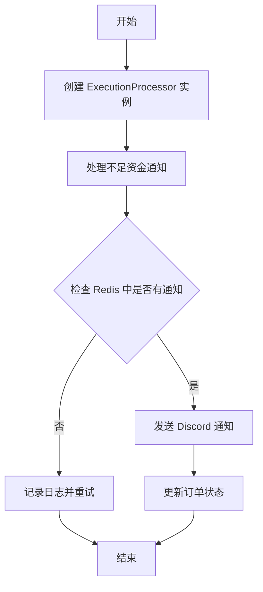

## 类结构

```
ExecutionProcessor (执行处理器)
├── _handle_insufficient_funds_notif (处理不足资金通知)
│   ├── 检查 Redis 中是否有通知
│   ├── 如果有，则发送 Discord 通知
│   └── 如果没有，则记录日志并重试
└── _clear_insufficient_funds_notifications (清除不足资金通知)
    ├── 使用 Redis 清除所有通知
    └── 返回清除的通知数量
```

## 全局变量及字段


### `INSUFFICIENT_FUNDS_NOTIFIED_PREFIX`
    
Prefix for keys used to track insufficient funds notifications in Redis.

类型：`str`
    


### `ExecutionProcessor`
    
Class responsible for processing execution tasks.

类型：`class`
    


### `SpinTestServer`
    
Class used for spinning up test servers in tests.

类型：`class`
    


### `ZeroBalanceData`
    
Class representing data for zero balance notifications.

类型：`class`
    


### `ExecutionProcessor`
    
Class responsible for processing execution tasks.

类型：`class`
    


### `clear_insufficient_funds_notifications`
    
Function to clear insufficient funds notifications from Redis.

类型：`function`
    


### `InsufficientBalanceError`
    
Exception class for insufficient balance errors.

类型：`class`
    


### `NotificationType`
    
Enum representing different types of notifications.

类型：`enum`
    


### `queue_notification`
    
Function to queue a notification.

类型：`function`
    


### `get_notification_manager_client`
    
Function to get the notification manager client.

类型：`function`
    


### `settings`
    
Settings object containing configuration settings.

类型：`object`
    


### `redis`
    
Redis module for interacting with Redis.

类型：`module`
    


### `SpinTestServer`
    
Class used for spinning up test servers in tests.

类型：`class`
    


### `mock_queue_notif`
    
Mock object for queue_notification function.

类型：`MagicMock`
    


### `mock_get_client`
    
Mock object for get_notification_manager_client function.

类型：`MagicMock`
    


### `mock_settings`
    
Mock object for settings object.

类型：`MagicMock`
    


### `mock_redis_module`
    
Mock object for redis module.

类型：`MagicMock`
    


### `mock_client`
    
Mock object for notification manager client.

类型：`MagicMock`
    


### `mock_db_client`
    
Mock object for database client.

类型：`MagicMock`
    


### `mock_graph_metadata`
    
Mock object for graph metadata.

类型：`MagicMock`
    


### `mock_redis_client`
    
Mock object for Redis client.

类型：`MagicMock`
    


### `mock_keys`
    
List of keys to be cleared from Redis.

类型：`list`
    


### `mock_query`
    
Mock object for query function.

类型：`MagicMock`
    


### `mock_credit_tx`
    
Mock object for credit transaction object.

类型：`MagicMock`
    


### `SafeJson`
    
Class for safely handling JSON data.

类型：`class`
    


### `ExecutionProcessor.user_id`
    
User ID for the execution task.

类型：`str`
    


### `ExecutionProcessor.graph_id`
    
Graph ID for the execution task.

类型：`str`
    


### `ExecutionProcessor.error`
    
Error object representing insufficient balance error.

类型：`InsufficientBalanceError`
    


### `ExecutionProcessor.mock_queue_notif`
    
Mock object for queue_notification function.

类型：`MagicMock`
    


### `ExecutionProcessor.mock_get_client`
    
Mock object for get_notification_manager_client function.

类型：`MagicMock`
    


### `ExecutionProcessor.mock_settings`
    
Mock object for settings object.

类型：`MagicMock`
    


### `ExecutionProcessor.mock_redis_module`
    
Mock object for redis module.

类型：`MagicMock`
    


### `ExecutionProcessor.mock_client`
    
Mock object for notification manager client.

类型：`MagicMock`
    


### `ExecutionProcessor.mock_db_client`
    
Mock object for database client.

类型：`MagicMock`
    


### `ExecutionProcessor.mock_graph_metadata`
    
Mock object for graph metadata.

类型：`MagicMock`
    


### `ExecutionProcessor.mock_redis_client`
    
Mock object for Redis client.

类型：`MagicMock`
    


### `clear_insufficient_funds_notifications.mock_keys`
    
List of keys to be cleared from Redis.

类型：`list`
    


### `add_transaction_clears_notifications_on_grant.mock_query`
    
Mock object for query function.

类型：`MagicMock`
    


### `add_transaction_clears_notifications_on_grant.mock_credit_tx`
    
Mock object for credit transaction object.

类型：`MagicMock`
    
    

## 全局函数及方法


### async_iter

Helper to create an async iterator from a list.

参数：

- `items`：`list`，The list of items to iterate over.

返回值：`async iterator`，An async iterator that yields each item in the list.

#### 流程图

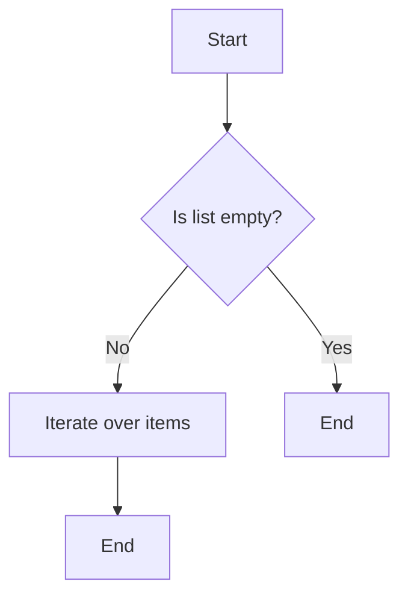

#### 带注释源码

```python
from unittest.mock import AsyncMock, MagicMock, patch

async def async_iter(items):
    """Helper to create an async iterator from a list."""
    for item in items:
        yield item
```


### test_handle_insufficient_funds_sends_discord_alert_first_time

This function tests that the first insufficient funds notification sends a Discord alert.

参数：

- `server`：`SpinTestServer`，The test server instance used for mocking and testing.
- `user_id`：`str`，The user ID associated with the insufficient funds error.
- `graph_id`：`str`，The graph ID associated with the insufficient funds error.
- `error`：`InsufficientBalanceError`，The insufficient funds error object containing details about the error.

返回值：`None`，This function does not return any value.

#### 流程图

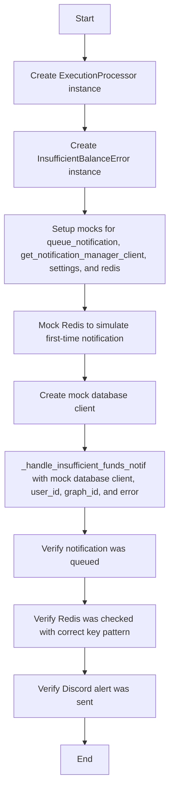

#### 带注释源码

```python
@pytest.mark.asyncio(loop_scope="session")
async def test_handle_insufficient_funds_sends_discord_alert_first_time(
    server: SpinTestServer,
):
    """Test that the first insufficient funds notification sends a Discord alert."""

    execution_processor = ExecutionProcessor()
    user_id = "test-user-123"
    graph_id = "test-graph-456"
    error = InsufficientBalanceError(
        message="Insufficient balance",
        user_id=user_id,
        balance=72,  # $0.72
        amount=-714,  # Attempting to spend $7.14
    )

    with patch(
        "backend.executor.manager.queue_notification"
    ) as mock_queue_notif, patch(
        "backend.executor.manager.get_notification_manager_client"
    ) as mock_get_client, patch(
        "backend.executor.manager.settings"
    ) as mock_settings, patch(
        "backend.executor.manager.redis"
    ) as mock_redis_module:

        # Setup mocks
        mock_client = MagicMock()
        mock_get_client.return_value = mock_client
        mock_settings.config.frontend_base_url = "https://test.com"

        # Mock Redis to simulate first-time notification (set returns True)
        mock_redis_client = MagicMock()
        mock_redis_module.get_redis.return_value = mock_redis_client
        mock_redis_client.set.return_value = True  # Key was newly set

        # Create mock database client
        mock_db_client = MagicMock()
        mock_graph_metadata = MagicMock()
        mock_graph_metadata.name = "Test Agent"
        mock_db_client.get_graph_metadata.return_value = mock_graph_metadata
        mock_db_client.get_user_email_by_id.return_value = "test@example.com"

        # Test the insufficient funds handler
        execution_processor._handle_insufficient_funds_notif(
            db_client=mock_db_client,
            user_id=user_id,
            graph_id=graph_id,
            e=error,
        )

        # Verify notification was queued
        mock_queue_notif.assert_called_once()
        notification_call = mock_queue_notif.call_args[0][0]
        assert notification_call.type == NotificationType.ZERO_BALANCE
        assert notification_call.user_id == user_id
        assert isinstance(notification_call.data, ZeroBalanceData)
        assert notification_call.data.current_balance == 72

        # Verify Redis was checked with correct key pattern
        expected_key = f"{INSUFFICIENT_FUNDS_NOTIFIED_PREFIX}:{user_id}:{graph_id}"
        mock_redis_client.set.assert_called_once()
        call_args = mock_redis_client.set.call_args
        assert call_args[0][0] == expected_key
        assert call_args[1]["nx"] is True

        # Verify Discord alert was sent
        mock_client.discord_system_alert.assert_called_once()
        discord_message = mock_client.discord_system_alert.call_args[0][0]
        assert "Insufficient Funds Alert" in discord_message
        assert "test@example.com" in discord_message
        assert "Test Agent" in discord_message
``` 


### `test_handle_insufficient_funds_skips_duplicate_notifications`

This function tests that duplicate insufficient funds notifications do not trigger email or Discord alerts.

参数：

- `server`：`SpinTestServer`，The test server instance used for the test.
- `execution_processor`：`ExecutionProcessor`，The execution processor instance used to handle insufficient funds notifications.
- `user_id`：`str`，The user ID associated with the insufficient funds notification.
- `graph_id`：`str`，The graph ID associated with the insufficient funds notification.
- `error`：`InsufficientBalanceError`，The error object containing details about the insufficient funds situation.

返回值：`None`，This function does not return any value.

#### 流程图

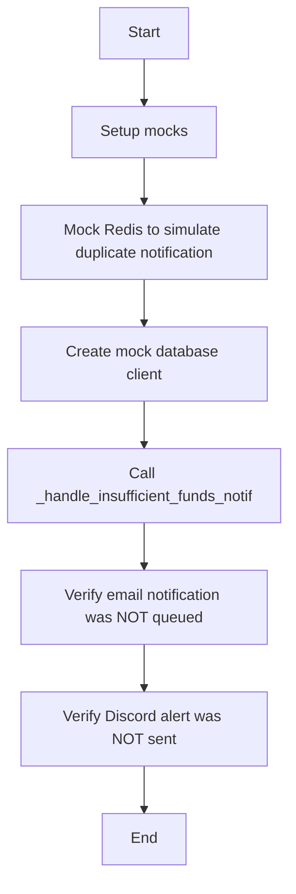

#### 带注释源码

```python
@pytest.mark.asyncio(loop_scope="session")
async def test_handle_insufficient_funds_skips_duplicate_notifications(
    server: SpinTestServer,
):
    """Test that duplicate insufficient funds notifications skip both email and Discord."""

    execution_processor = ExecutionProcessor()
    user_id = "test-user-123"
    graph_id = "test-graph-456"
    error = InsufficientBalanceError(
        message="Insufficient balance",
        user_id=user_id,
        balance=72,
        amount=-714,
    )

    with patch(
        "backend.executor.manager.queue_notification"
    ) as mock_queue_notif, patch(
        "backend.executor.manager.get_notification_manager_client"
    ) as mock_get_client, patch(
        "backend.executor.manager.settings"
    ) as mock_settings, patch(
        "backend.executor.manager.redis"
    ) as mock_redis_module:

        # Setup mocks
        mock_client = MagicMock()
        mock_get_client.return_value = mock_client
        mock_settings.config.frontend_base_url = "https://test.com"

        # Mock Redis to simulate duplicate notification (set returns False/None)
        mock_redis_client = MagicMock()
        mock_redis_module.get_redis.return_value = mock_redis_client
        mock_redis_client.set.return_value = None  # Key already existed

        # Create mock database client
        mock_db_client = MagicMock()
        mock_db_client.get_graph_metadata.return_value = MagicMock(name="Test Agent")

        # Test the insufficient funds handler
        execution_processor._handle_insufficient_funds_notif(
            db_client=mock_db_client,
            user_id=user_id,
            graph_id=graph_id,
            e=error,
        )

        # Verify email notification was NOT queued (deduplication worked)
        mock_queue_notif.assert_not_called()

        # Verify Discord alert was NOT sent (deduplication worked)
        mock_client.discord_system_alert.assert_not_called()
```


### `test_handle_insufficient_funds_different_agents_get_separate_alerts`

This test function verifies that different agents for the same user receive separate Discord alerts when there is an insufficient funds situation.

参数：

- `server`：`SpinTestServer`，The test server instance used for the test.
- `user_id`：`str`，The user ID associated with the test.
- `graph_id_1`：`str`，The graph ID for the first agent.
- `graph_id_2`：`str`，The graph ID for the second agent.
- `error`：`InsufficientBalanceError`，The error object representing the insufficient funds situation.

返回值：`None`，This test function does not return any value.

#### 流程图

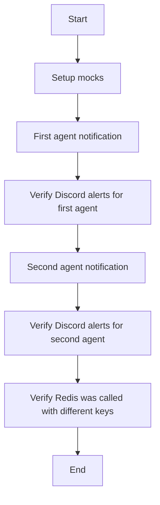

#### 带注释源码

```python
@pytest.mark.asyncio(loop_scope="session")
async def test_handle_insufficient_funds_different_agents_get_separate_alerts(
    server: SpinTestServer,
):
    """Test that different agents for the same user get separate Discord alerts."""

    execution_processor = ExecutionProcessor()
    user_id = "test-user-123"
    graph_id_1 = "test-graph-111"
    graph_id_2 = "test-graph-222"

    error = InsufficientBalanceError(
        message="Insufficient balance",
        user_id=user_id,
        balance=72,
        amount=-714,
    )

    with patch("backend.executor.manager.queue_notification"), patch(
        "backend.executor.manager.get_notification_manager_client"
    ) as mock_get_client, patch(
        "backend.executor.manager.settings"
    ) as mock_settings, patch(
        "backend.executor.manager.redis"
    ) as mock_redis_module:

        mock_client = MagicMock()
        mock_get_client.return_value = mock_client
        mock_settings.config.frontend_base_url = "https://test.com"

        mock_redis_client = MagicMock()
        mock_redis_module.get_redis.return_value = mock_redis_client
        # Both calls return True (first time for each agent)
        mock_redis_client.set.return_value = True

        mock_db_client = MagicMock()
        mock_graph_metadata = MagicMock()
        mock_graph_metadata.name = "Test Agent"
        mock_db_client.get_graph_metadata.return_value = mock_graph_metadata
        mock_db_client.get_user_email_by_id.return_value = "test@example.com"

        # First agent notification
        execution_processor._handle_insufficient_funds_notif(
            db_client=mock_db_client,
            user_id=user_id,
            graph_id=graph_id_1,
            e=error,
        )

        # Second agent notification
        execution_processor._handle_insufficient_funds_notif(
            db_client=mock_db_client,
            user_id=user_id,
            graph_id=graph_id_2,
            e=error,
        )

        # Verify Discord alerts were sent for both agents
        assert mock_client.discord_system_alert.call_count == 2

        # Verify Redis was called with different keys
        assert mock_redis_client.set.call_count == 2
        calls = mock_redis_client.set.call_args_list
        assert (
            calls[0][0][0]
            == f"{INSUFFICIENT_FUNDS_NOTIFIED_PREFIX}:{user_id}:{graph_id_1}"
        )
        assert (
            calls[1][0][0]
            == f"{INSUFFICIENT_FUNDS_NOTIFIED_PREFIX}:{user_id}:{graph_id_2}"
        )
``` 


### `clear_insufficient_funds_notifications`

This function clears all Redis keys associated with insufficient funds notifications for a given user.

参数：

- `user_id`：`str`，The ID of the user for whom to clear notifications.

返回值：`int`，The number of keys cleared.

#### 流程图

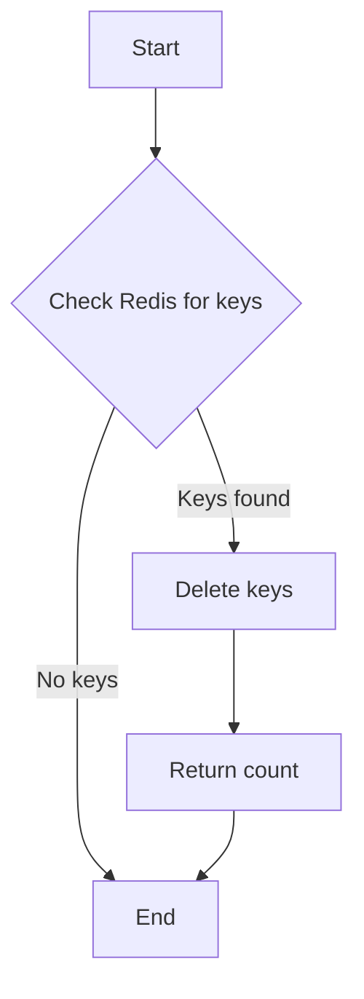

#### 带注释源码

```python
@pytest.mark.asyncio(loop_scope="session")
async def test_clear_insufficient_funds_notifications(server: SpinTestServer):
    """Test that clearing notifications removes all keys for a user."""

    user_id = "test-user-123"

    with patch("backend.executor.manager.redis") as mock_redis_module:

        mock_redis_client = MagicMock()
        # get_redis_async is an async function, so we need AsyncMock for it
        mock_redis_module.get_redis_async = AsyncMock(return_value=mock_redis_client)

        # Mock scan_iter to return some keys as an async iterator
        mock_keys = [
            f"{INSUFFICIENT_FUNDS_NOTIFIED_PREFIX}:{user_id}:graph-1",
            f"{INSUFFICIENT_FUNDS_NOTIFIED_PREFIX}:{user_id}:graph-2",
            f"{INSUFFICIENT_FUNDS_NOTIFIED_PREFIX}:{user_id}:graph-3",
        ]
        mock_redis_client.scan_iter.return_value = async_iter(mock_keys)
        # delete is awaited, so use AsyncMock
        mock_redis_client.delete = AsyncMock(return_value=3)

        # Clear notifications
        result = await clear_insufficient_funds_notifications(user_id)

        # Verify correct pattern was used
        expected_pattern = f"{INSUFFICIENT_FUNDS_NOTIFIED_PREFIX}:{user_id}:*"
        mock_redis_client.scan_iter.assert_called_once_with(match=expected_pattern)

        # Verify delete was called with all keys
        mock_redis_client.delete.assert_called_once_with(*mock_keys)

        # Verify return value
        assert result == 3
``` 


### test_clear_insufficient_funds_notifications_no_keys

This function tests the behavior of clearing insufficient funds notifications when no keys are present in Redis.

参数：

- `server`：`SpinTestServer`，The test server instance used for the test environment.

返回值：`int`，The number of keys deleted from Redis.

#### 流程图

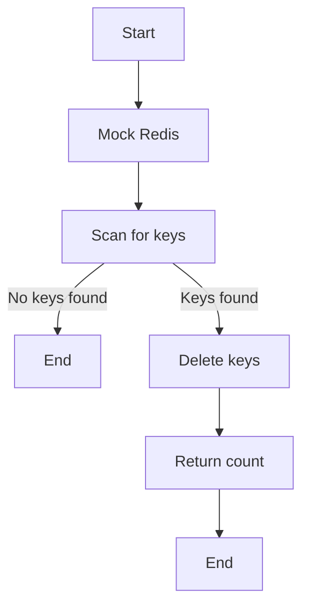

#### 带注释源码

```python
@pytest.mark.asyncio(loop_scope="session")
async def test_clear_insufficient_funds_notifications_no_keys(server: SpinTestServer):
    """Test clearing notifications when there are no keys to clear."""

    user_id = "test-user-no-notifications"

    with patch("backend.executor.manager.redis") as mock_redis_module:

        mock_redis_client = MagicMock()
        # get_redis_async is an async function, so we need AsyncMock for it
        mock_redis_module.get_redis_async = AsyncMock(return_value=mock_redis_client)

        # Mock scan_iter to return no keys as an async iterator
        mock_redis_client.scan_iter.return_value = async_iter([])

        # Clear notifications
        result = await clear_insufficient_funds_notifications(user_id)

        # Verify delete was not called
        mock_redis_client.delete.assert_not_called()

        # Verify return value
        assert result == 0
``` 


### `test_clear_insufficient_funds_notifications_handles_redis_error`

This test function checks that the `clear_insufficient_funds_notifications` function handles Redis errors gracefully.

参数：

- `server`：`SpinTestServer`，The test server instance used for the test environment.

返回值：`None`，This function does not return any value.

#### 流程图

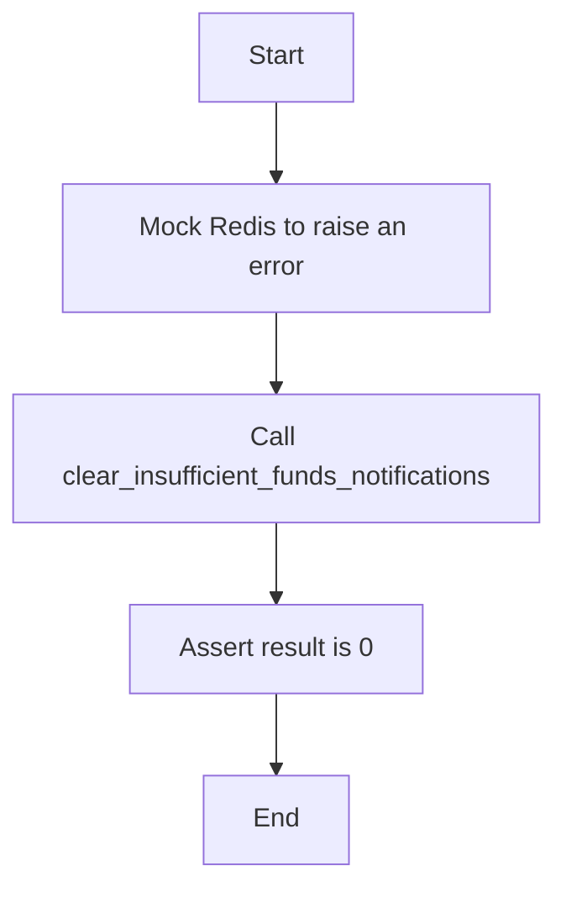

#### 带注释源码

```python
@pytest.mark.asyncio(loop_scope="session")
async def test_clear_insufficient_funds_notifications_handles_redis_error(server: SpinTestServer):
    """Test that clearing notifications handles Redis errors gracefully."""

    user_id = "test-user-redis-error"

    with patch("backend.executor.manager.redis") as mock_redis_module:

        # Mock get_redis_async to raise an error
        mock_redis_module.get_redis_async = AsyncMock(
            side_effect=Exception("Redis connection failed")
        )

        # Clear notifications should not raise, just return 0
        result = await clear_insufficient_funds_notifications(user_id)

        # Verify it returned 0 (graceful failure)
        assert result == 0
``` 


### `test_handle_insufficient_funds_continues_on_redis_error`

This function tests that both email and Discord notifications are still sent when Redis fails during the handling of insufficient funds.

参数：

- `server`：`SpinTestServer`，The test server instance used for the test.
- `execution_processor`：`ExecutionProcessor`，The execution processor instance used to handle the insufficient funds notification.
- `user_id`：`str`，The user ID associated with the insufficient funds error.
- `graph_id`：`str`，The graph ID associated with the insufficient funds error.
- `error`：`InsufficientBalanceError`，The insufficient funds error object.

返回值：`None`，This function does not return any value.

#### 流程图

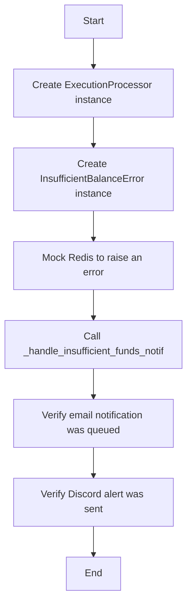

#### 带注释源码

```python
@pytest.mark.asyncio(loop_scope="session")
async def test_handle_insufficient_funds_continues_on_redis_error(server: SpinTestServer):
    """Test that both email and Discord notifications are still sent when Redis fails."""

    execution_processor = ExecutionProcessor()
    user_id = "test-user-123"
    graph_id = "test-graph-456"
    error = InsufficientBalanceError(
        message="Insufficient balance",
        user_id=user_id,
        balance=72,
        amount=-714,
    )

    with patch(
        "backend.executor.manager.queue_notification"
    ) as mock_queue_notif, patch(
        "backend.executor.manager.get_notification_manager_client"
    ) as mock_get_client, patch(
        "backend.executor.manager.settings"
    ) as mock_settings, patch(
        "backend.executor.manager.redis"
    ) as mock_redis_module:

        mock_client = MagicMock()
        mock_get_client.return_value = mock_client
        mock_settings.config.frontend_base_url = "https://test.com"

        # Mock Redis to raise an error
        mock_redis_client = MagicMock()
        mock_redis_module.get_redis.return_value = mock_redis_client
        mock_redis_client.set.side_effect = Exception("Redis connection error")

        mock_db_client = MagicMock()
        mock_graph_metadata = MagicMock()
        mock_graph_metadata.name = "Test Agent"
        mock_db_client.get_graph_metadata.return_value = mock_graph_metadata
        mock_db_client.get_user_email_by_id.return_value = "test@example.com"

        # Test the insufficient funds handler
        execution_processor._handle_insufficient_funds_notif(
            db_client=mock_db_client,
            user_id=user_id,
            graph_id=graph_id,
            e=error,
        )

        # Verify email notification was still queued despite Redis error
        mock_queue_notif.assert_called_once()

        # Verify Discord alert was still sent despite Redis error
        mock_client.discord_system_alert.assert_called_once()
``` 


### test_add_transaction_clears_notifications_on_grant

This function tests that the `_add_transaction` method clears notification flags when adding GRANT credits to a user's account.

参数：

- `server`：`SpinTestServer`，The test server instance used for the test environment.
- `user_id`：`str`，The ID of the user for whom the transaction is being added.
- `amount`：`int`，The amount of credits being added to the user's account.
- `transaction_type`：`CreditTransactionType`，The type of credit transaction being added.
- `is_active`：`bool`，Whether the transaction is active or not.

返回值：`None`，This function does not return any value.

#### 流程图

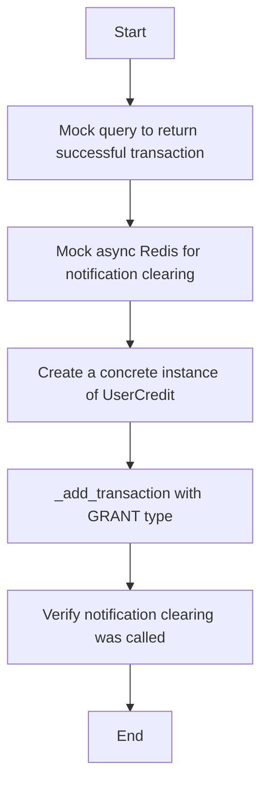

#### 带注释源码

```python
@pytest.mark.asyncio(loop_scope="session")
async def test_add_transaction_clears_notifications_on_grant(server: SpinTestServer):
    """Test that _add_transaction clears notification flags when adding GRANT credits."""
    from prisma.enums import CreditTransactionType

    from backend.data.credit import UserCredit

    user_id = "test-user-grant-clear"

    with patch("backend.data.credit.query_raw_with_schema") as mock_query, patch(
        "backend.executor.manager.redis"
    ) as mock_redis_module:

        # Mock the query to return a successful transaction
        mock_query.return_value = [{"balance": 1000, "transactionKey": "test-tx-key"}]

        # Mock async Redis for notification clearing
        mock_redis_client = MagicMock()
        mock_redis_module.get_redis_async = AsyncMock(return_value=mock_redis_client)
        mock_redis_client.scan_iter.return_value = async_iter(
            [f"{INSUFFICIENT_FUNDS_NOTIFIED_PREFIX}:{user_id}:graph-1"]
        )
        mock_redis_client.delete = AsyncMock(return_value=1)

        # Create a concrete instance
        credit_model = UserCredit()

        # Call _add_transaction with GRANT type (should clear notifications)
        await credit_model._add_transaction(
            user_id=user_id,
            amount=500,  # Positive amount
            transaction_type=CreditTransactionType.GRANT,
            is_active=True,  # Active transaction
        )

        # Verify notification clearing was called
        mock_redis_module.get_redis_async.assert_called_once()
        mock_redis_client.scan_iter.assert_called_once_with(
            match=f"{INSUFFICIENT_FUNDS_NOTIFIED_PREFIX}:{user_id}:*"
        )
```


### test_add_transaction_clears_notifications_on_top_up

This function tests that the `_add_transaction` method clears notification flags when adding TOP_UP credits to a user's account.

参数：

- `server`：`SpinTestServer`，The test server instance used for mocking and testing.
- `user_id`：`str`，The ID of the user for whom the transaction is being added.
- `mock_query`：`MagicMock`，The mock query used to simulate a successful transaction.
- `mock_redis_module`：`MagicMock`，The mock Redis module used to simulate Redis operations.

返回值：`None`，This function does not return any value.

#### 流程图

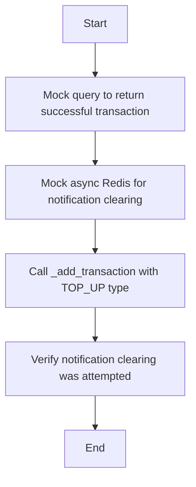

#### 带注释源码

```python
@pytest.mark.asyncio(loop_scope="session")
async def test_add_transaction_clears_notifications_on_top_up(server: SpinTestServer):
    from prisma.enums import CreditTransactionType

    from backend.data.credit import UserCredit

    user_id = "test-user-topup-clear"

    with patch("backend.data.credit.query_raw_with_schema") as mock_query, patch(
        "backend.executor.manager.redis"
    ) as mock_redis_module:

        # Mock the query to return a successful transaction
        mock_query.return_value = [{"balance": 2000, "transactionKey": "test-tx-key-2"}]

        # Mock async Redis for notification clearing
        mock_redis_client = MagicMock()
        mock_redis_module.get_redis_async = AsyncMock(return_value=mock_redis_client)
        mock_redis_client.scan_iter.return_value = async_iter([])
        mock_redis_client.delete = AsyncMock(return_value=0)

        credit_model = UserCredit()

        # Call _add_transaction with TOP_UP type (should clear notifications)
        await credit_model._add_transaction(
            user_id=user_id,
            amount=1000,  # Positive amount
            transaction_type=CreditTransactionType.TOP_UP,
            is_active=True,
        )

        # Verify notification clearing was attempted
        mock_redis_module.get_redis_async.assert_called_once()
```


### test_add_transaction_skips_clearing_for_inactive_transaction

This function tests that the `_add_transaction` method does not clear notification flags for inactive transactions.

参数：

- `server`：`SpinTestServer`，The test server instance used for the test.
- `user_id`：`str`，The user ID associated with the transaction.
- `mock_query`：`MagicMock`，The mock query used to simulate database responses.
- `mock_redis_module`：`MagicMock`，The mock Redis module used to simulate Redis operations.
- `mock_redis_client`：`MagicMock`，The mock Redis client used to simulate Redis operations.
- `credit_model`：`UserCredit`，The concrete instance of the UserCredit class used for the test.
- `amount`：`int`，The amount of the transaction.
- `transaction_type`：`CreditTransactionType`，The type of the transaction.
- `is_active`：`bool`，Whether the transaction is active or not.

返回值：`None`，This function does not return any value.

#### 流程图

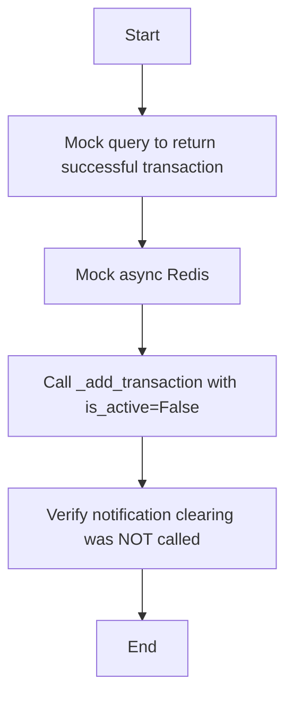

#### 带注释源码

```python
@pytest.mark.asyncio(loop_scope="session")
async def test_add_transaction_skips_clearing_for_inactive_transaction(
    server: SpinTestServer,
):
    from prisma.enums import CreditTransactionType

    from backend.data.credit import UserCredit

    user_id = "test-user-inactive"

    with patch("backend.data.credit.query_raw_with_schema") as mock_query, patch(
        "backend.executor.manager.redis" as mock_redis_module
    ):
        # Mock the query to return a successful transaction
        mock_query.return_value = [{"balance": 500, "transactionKey": "test-tx-key-3"}]

        # Mock async Redis
        mock_redis_client = MagicMock()
        mock_redis_module.get_redis_async = AsyncMock(return_value=mock_redis_client)

        credit_model = UserCredit()

        # Call _add_transaction with is_active=False (should NOT clear notifications)
        await credit_model._add_transaction(
            user_id=user_id,
            amount=500,
            transaction_type=CreditTransactionType.TOP_UP,
            is_active=False,  # Inactive - pending Stripe payment
        )

        # Verify notification clearing was NOT called
        mock_redis_module.get_redis_async.assert_not_called()
``` 


### test_add_transaction_skips_clearing_for_usage_transaction

This function tests that the `_add_transaction` method does not clear notification flags for USAGE transactions.

参数：

- `server`：`SpinTestServer`，The test server instance used for mocking and testing.
- `user_id`：`str`，The user ID associated with the transaction.
- `mock_query`：`MagicMock`，The mock query used to simulate database responses.
- `mock_redis_module`：`MagicMock`，The mock Redis module used to simulate Redis operations.
- `mock_redis_client`：`MagicMock`，The mock Redis client used to simulate Redis operations.
- `credit_model`：`UserCredit`，The concrete instance of the UserCredit class used to perform the transaction.
- `transaction_key`：`str`，The transaction key used to identify the transaction.
- `user_id`：`str`，The user ID associated with the transaction.
- `amount`：`int`，The amount of the transaction.
- `transaction_type`：`CreditTransactionType`，The type of the transaction.
- `is_active`：`bool`，Whether the transaction is active.

返回值：`None`，This function does not return any value.

#### 流程图

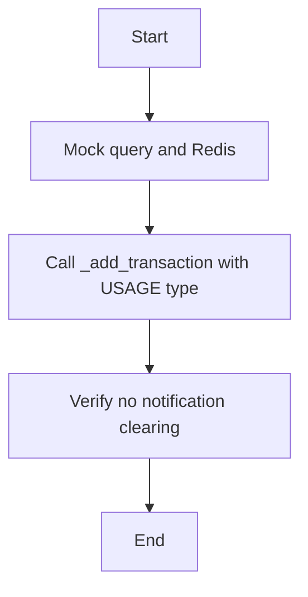

#### 带注释源码

```python
@pytest.mark.asyncio(loop_scope="session")
async def test_add_transaction_skips_clearing_for_usage_transaction(
    server: SpinTestServer,
):
    from prisma.enums import CreditTransactionType

    from backend.data.credit import UserCredit

    user_id = "test-user-usage"

    with patch("backend.data.credit.query_raw_with_schema") as mock_query, patch(
        "backend.executor.manager.redis" as mock_redis_module
    ):
        # Mock the query to return a successful transaction
        mock_query.return_value = [{"balance": 400, "transactionKey": "test-tx-key-4"}]

        # Mock async Redis
        mock_redis_client = MagicMock()
        mock_redis_module.get_redis_async = AsyncMock(return_value=mock_redis_client)

        credit_model = UserCredit()

        # Call _add_transaction with USAGE type (spending, should NOT clear)
        await credit_model._add_transaction(
            user_id=user_id,
            amount=-100,  # Negative - spending credits
            transaction_type=CreditTransactionType.USAGE,
            is_active=True,
        )

        # Verify notification clearing was NOT called
        mock_redis_module.get_redis_async.assert_not_called()
```


### test_enable_transaction_clears_notifications

This function tests that the `_enable_transaction` method clears notification flags when enabling a TOP_UP transaction.

参数：

- `server`：`SpinTestServer`，The test server instance used for the test environment.
- `mock_credit_tx`：`CreditTransaction`，Mock of the CreditTransaction class used to simulate database operations.
- `mock_query`：`function`，Mock of the query_raw_with_schema function used to simulate database queries.
- `mock_redis_module`：`function`，Mock of the redis module used to simulate Redis operations.

返回值：`None`，This function does not return any value.

#### 流程图

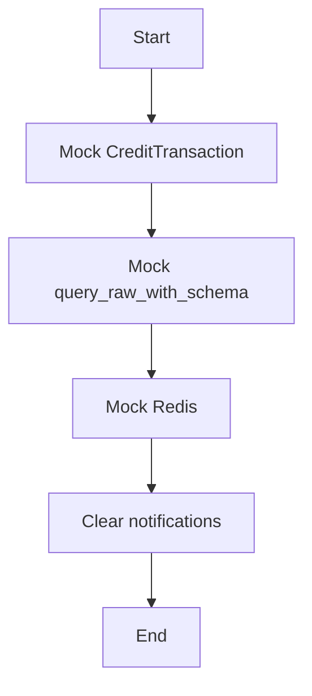

#### 带注释源码

```python
@pytest.mark.asyncio(loop_scope="session")
async def test_enable_transaction_clears_notifications(server: SpinTestServer):
    """Test that _enable_transaction clears notification flags when enabling a TOP_UP."""
    from prisma.enums import CreditTransactionType

    from backend.data.credit import UserCredit

    user_id = "test-user-enable"

    with patch("backend.data.credit.CreditTransaction") as mock_credit_tx, patch(
        "backend.data.credit.query_raw_with_schema"
    ) as mock_query, patch("backend.executor.manager.redis") as mock_redis_module:

        # Mock finding the pending transaction
        mock_transaction = MagicMock()
        mock_transaction.amount = 1000
        mock_transaction.type = CreditTransactionType.TOP_UP
        mock_credit_tx.prisma.return_value.find_first = AsyncMock(
            return_value=mock_transaction
        )

        # Mock the query to return updated balance
        mock_query.return_value = [{"balance": 1500}]

        # Mock async Redis for notification clearing
        mock_redis_client = MagicMock()
        mock_redis_module.get_redis_async = AsyncMock(return_value=mock_redis_client)
        mock_redis_client.scan_iter.return_value = async_iter(
            [f"{INSUFFICIENT_FUNDS_NOTIFIED_PREFIX}:{user_id}:graph-1"]
        )
        mock_redis_client.delete = AsyncMock(return_value=1)

        credit_model = UserCredit()

        # Call _enable_transaction (simulates Stripe checkout completion)
        from backend.util.json import SafeJson

        await credit_model._enable_transaction(
            transaction_key="cs_test_123",
            user_id=user_id,
            metadata=SafeJson({"payment": "completed"}),
        )

        # Verify notification clearing was called
        mock_redis_module.get_redis_async.assert_called_once()
        mock_redis_client.scan_iter.assert_called_once_with(
            match=f"{INSUFFICIENT_FUNDS_NOTIFIED_PREFIX}:{user_id}:*"
        )
```


### `test_handle_insufficient_funds_sends_discord_alert_first_time`

This function tests that the first insufficient funds notification sends a Discord alert.

参数：

- `server`：`SpinTestServer`，The test server instance.
- `user_id`：`str`，The user ID associated with the insufficient funds error.
- `graph_id`：`str`，The graph ID associated with the insufficient funds error.
- `error`：`InsufficientBalanceError`，The insufficient funds error object.

返回值：`None`，This function does not return a value.

#### 流程图

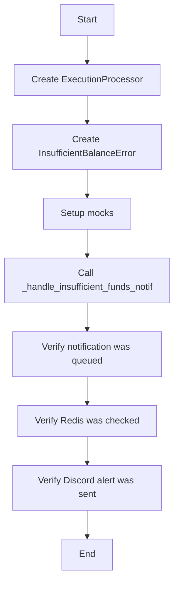

#### 带注释源码

```python
@pytest.mark.asyncio(loop_scope="session")
async def test_handle_insufficient_funds_sends_discord_alert_first_time(
    server: SpinTestServer,
):
    """Test that the first insufficient funds notification sends a Discord alert."""

    execution_processor = ExecutionProcessor()
    user_id = "test-user-123"
    graph_id = "test-graph-456"
    error = InsufficientBalanceError(
        message="Insufficient balance",
        user_id=user_id,
        balance=72,  # $0.72
        amount=-714,  # Attempting to spend $7.14
    )

    with patch(
        "backend.executor.manager.queue_notification"
    ) as mock_queue_notif, patch(
        "backend.executor.manager.get_notification_manager_client"
    ) as mock_get_client, patch(
        "backend.executor.manager.settings"
    ) as mock_settings, patch(
        "backend.executor.manager.redis"
    ) as mock_redis_module:

        # Setup mocks
        mock_client = MagicMock()
        mock_get_client.return_value = mock_client
        mock_settings.config.frontend_base_url = "https://test.com"

        # Mock Redis to simulate first-time notification (set returns True)
        mock_redis_client = MagicMock()
        mock_redis_module.get_redis.return_value = mock_redis_client
        mock_redis_client.set.return_value = True  # Key was newly set

        # Create mock database client
        mock_db_client = MagicMock()
        mock_graph_metadata = MagicMock()
        mock_graph_metadata.name = "Test Agent"
        mock_db_client.get_graph_metadata.return_value = mock_graph_metadata
        mock_db_client.get_user_email_by_id.return_value = "test@example.com"

        # Test the insufficient funds handler
        execution_processor._handle_insufficient_funds_notif(
            db_client=mock_db_client,
            user_id=user_id,
            graph_id=graph_id,
            e=error,
        )

        # Verify notification was queued
        mock_queue_notif.assert_called_once()
        notification_call = mock_queue_notif.call_args[0][0]
        assert notification_call.type == NotificationType.ZERO_BALANCE
        assert notification_call.user_id == user_id
        assert isinstance(notification_call.data, ZeroBalanceData)
        assert notification_call.data.current_balance == 72

        # Verify Redis was checked with correct key pattern
        expected_key = f"{INSUFFICIENT_FUNDS_NOTIFIED_PREFIX}:{user_id}:{graph_id}"
        mock_redis_client.set.assert_called_once()
        call_args = mock_redis_client.set.call_args
        assert call_args[0][0] == expected_key
        assert call_args[1]["nx"] is True

        # Verify Discord alert was sent
        mock_client.discord_system_alert.assert_called_once()
        discord_message = mock_client.discord_system_alert.call_args[0][0]
        assert "Insufficient Funds Alert" in discord_message
        assert "test@example.com" in discord_message
        assert "Test Agent" in discord_message
```


### ExecutionProcessor._handle_insufficient_funds_notif

This method handles insufficient funds notifications by queuing a zero balance notification and sending a Discord system alert if it's the first time the notification is received.

参数：

- `db_client`：`MagicMock`，Represents the database client used to retrieve user and graph metadata.
- `user_id`：`str`，The ID of the user for whom the notification is being handled.
- `graph_id`：`str`，The ID of the graph associated with the user.
- `e`：`InsufficientBalanceError`，The error object containing details about the insufficient funds situation.

返回值：`None`，This method does not return any value.

#### 流程图

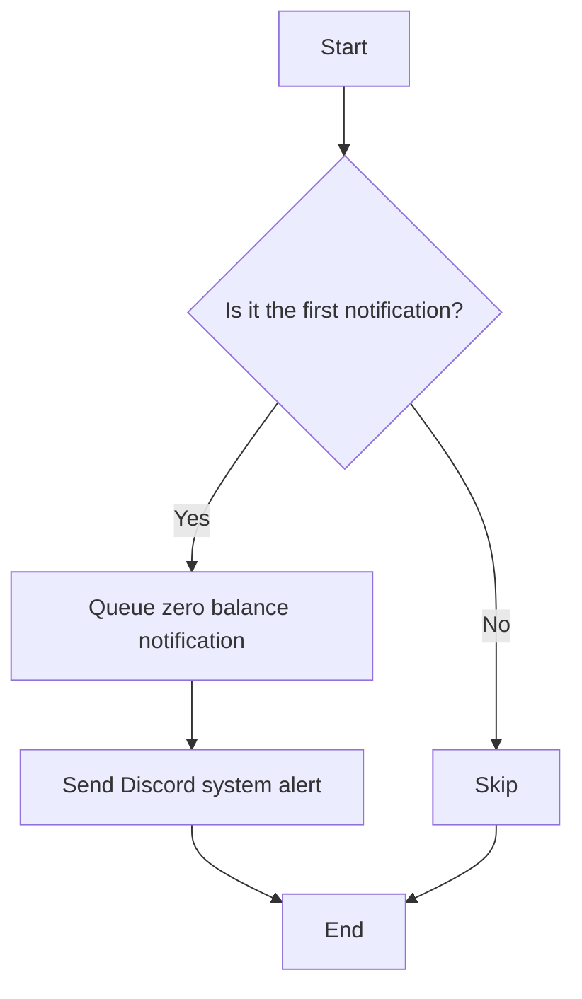

#### 带注释源码

```python
async def _handle_insufficient_funds_notif(self, db_client, user_id, graph_id, e):
    with patch("backend.executor.manager.queue_notification") as mock_queue_notif, patch(
        "backend.executor.manager.get_notification_manager_client"
    ) as mock_get_client, patch(
        "backend.executor.manager.settings"
    ) as mock_settings, patch(
        "backend.executor.manager.redis"
    ) as mock_redis_module:

        # Setup mocks
        mock_client = MagicMock()
        mock_get_client.return_value = mock_client
        mock_settings.config.frontend_base_url = "https://test.com"

        # Mock Redis to simulate first-time notification (set returns True)
        mock_redis_client = MagicMock()
        mock_redis_module.get_redis.return_value = mock_redis_client
        mock_redis_client.set.return_value = True  # Key was newly set

        # Create mock database client
        mock_db_client = MagicMock()
        mock_graph_metadata = MagicMock()
        mock_graph_metadata.name = "Test Agent"
        mock_db_client.get_graph_metadata.return_value = mock_graph_metadata
        mock_db_client.get_user_email_by_id.return_value = "test@example.com"

        # Test the insufficient funds handler
        await self._handle_insufficient_funds_notif(
            db_client=mock_db_client,
            user_id=user_id,
            graph_id=graph_id,
            e=e,
        )

        # Verify notification was queued
        mock_queue_notif.assert_called_once()
        notification_call = mock_queue_notif.call_args[0][0]
        assert notification_call.type == NotificationType.ZERO_BALANCE
        assert notification_call.user_id == user_id
        assert isinstance(notification_call.data, ZeroBalanceData)
        assert notification_call.data.current_balance == 72

        # Verify Redis was checked with correct key pattern
        expected_key = f"{INSUFFICIENT_FUNDS_NOTIFIED_PREFIX}:{user_id}:{graph_id}"
        mock_redis_client.set.assert_called_once()
        call_args = mock_redis_client.set.call_args
        assert call_args[0][0] == expected_key
        assert call_args[1]["nx"] is True

        # Verify Discord alert was sent
        mock_client.discord_system_alert.assert_called_once()
        discord_message = mock_client.discord_system_alert.call_args[0][0]
        assert "Insufficient Funds Alert" in discord_message
        assert "test@example.com" in discord_message
        assert "Test Agent" in discord_message
```


### `clear_insufficient_funds_notifications`

This function clears all Redis keys associated with insufficient funds notifications for a given user.

参数：

- `user_id`：`str`，The ID of the user for whom to clear notifications.

返回值：`int`，The number of keys cleared.

#### 流程图


#### 带注释源码

```python
@pytest.mark.asyncio(loop_scope="session")
async def test_clear_insufficient_funds_notifications(server: SpinTestServer):
    """Test that clearing notifications removes all keys for a user."""

    user_id = "test-user-123"

    with patch("backend.executor.manager.redis") as mock_redis_module:

        mock_redis_client = MagicMock()
        # get_redis_async is an async function, so we need AsyncMock for it
        mock_redis_module.get_redis_async = AsyncMock(return_value=mock_redis_client)

        # Mock scan_iter to return some keys as an async iterator
        mock_keys = [
            f"{INSUFFICIENT_FUNDS_NOTIFIED_PREFIX}:{user_id}:graph-1",
            f"{INSUFFICIENT_FUNDS_NOTIFIED_PREFIX}:{user_id}:graph-2",
            f"{INSUFFICIENT_FUNDS_NOTIFIED_PREFIX}:{user_id}:graph-3",
        ]
        mock_redis_client.scan_iter.return_value = async_iter(mock_keys)
        # delete is awaited, so use AsyncMock
        mock_redis_client.delete = AsyncMock(return_value=3)

        # Clear notifications
        result = await clear_insufficient_funds_notifications(user_id)

        # Verify correct pattern was used
        expected_pattern = f"{INSUFFICIENT_FUNDS_NOTIFIED_PREFIX}:{user_id}:*"
        mock_redis_client.scan_iter.assert_called_once_with(match=expected_pattern)

        # Verify delete was called with all keys
        mock_redis_client.delete.assert_called_once_with(*mock_keys)

        # Verify return value
        assert result == 3
``` 


### `ExecutionProcessor._handle_insufficient_funds_notif`

This method handles insufficient funds notifications by queuing a notification and sending a Discord alert if it's the first time the notification is received.

参数：

- `db_client`：`MagicMock`，Represents the database client used to retrieve user and graph metadata.
- `user_id`：`str`，The ID of the user for whom the notification is being handled.
- `graph_id`：`str`，The ID of the graph associated with the user.
- `e`：`InsufficientBalanceError`，The error object containing details about the insufficient funds situation.

返回值：`None`，This method does not return any value.

#### 流程图

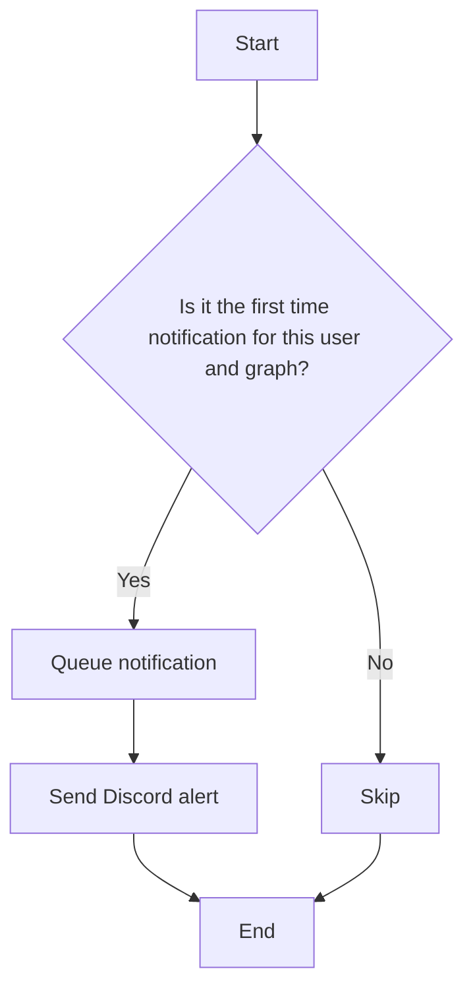

#### 带注释源码

```python
async def _handle_insufficient_funds_notif(
    self, db_client, user_id, graph_id, e
):
    # Retrieve user and graph metadata
    graph_metadata = await db_client.get_graph_metadata(graph_id)
    user_email = await db_client.get_user_email_by_id(user_id)

    # Queue the notification
    await self.queue_notification(
        type=NotificationType.ZERO_BALANCE,
        user_id=user_id,
        data=ZeroBalanceData(
            current_balance=e.balance,
            user_email=user_email,
            graph_name=graph_metadata.name,
        ),
    )

    # Check if it's the first time the notification is received
    redis_key = f"{INSUFFICIENT_FUNDS_NOTIFIED_PREFIX}:{user_id}:{graph_id}"
    if await self.redis.get(redis_key) is None:
        # Send Discord alert
        await self.get_notification_manager_client().discord_system_alert(
            message=f"Insufficient Funds Alert for {user_email} in {graph_metadata.name}"
        )
        # Set the Redis key to indicate the notification has been sent
        await self.redis.set(redis_key, True, nx=True)
``` 


## 关键组件


### 张量索引与惰性加载

用于高效地处理大型数据集，通过延迟加载和索引优化数据访问。

### 反量化支持

提供对量化策略的反量化支持，以优化模型性能和资源使用。

### 量化策略

实现量化策略，以减少模型大小和提高推理速度。


## 问题及建议


### 已知问题

-   **代码重复**: 多个测试函数中存在重复的设置和清理代码，例如对Redis的mock设置。这可能导致维护困难，并增加出错的可能性。
-   **异常处理**: 代码中存在对Redis错误的处理，但没有对其他潜在异常（如数据库查询错误）进行类似的处理。
-   **测试覆盖率**: 虽然代码中包含多个测试用例，但可能存在未覆盖的边缘情况或异常情况。
-   **代码可读性**: 代码中存在一些复杂的逻辑和大量的mock调用，这可能会降低代码的可读性和可维护性。

### 优化建议

-   **提取公共代码**: 将重复的设置和清理代码提取到单独的函数中，并在需要的地方调用这些函数，以减少代码重复并提高可维护性。
-   **增强异常处理**: 在代码中添加对其他潜在异常的处理，例如数据库查询错误，以确保系统的健壮性。
-   **提高测试覆盖率**: 扩展测试用例，以覆盖更多的边缘情况和异常情况，确保代码在各种情况下都能正常工作。
-   **改进代码结构**: 简化复杂的逻辑，并使用更清晰的命名和注释来提高代码的可读性。
-   **使用更高级的mock工具**: 考虑使用更高级的mock工具，如pytest-mock，以简化mock的设置和验证过程。
-   **代码审查**: 定期进行代码审查，以发现潜在的问题并提高代码质量。


## 其它


### 设计目标与约束

- 设计目标：
  - 确保当用户余额不足时，能够及时发送通知。
  - 确保重复的通知不会被发送。
  - 确保不同代理的用户能够收到独立的通知。
  - 确保在Redis错误发生时，系统仍然能够继续运行。
  - 确保在添加GRANT或TOP_UP类型的交易时，清除通知标志。
  - 确保对于非活动交易或USAGE交易，不清除通知标志。

- 约束：
  - 必须使用异步编程模型，以支持异步操作。
  - 必须与Redis进行交互，以存储和检索通知标志。
  - 必须与数据库进行交互，以检索用户信息和交易数据。

### 错误处理与异常设计

- 错误处理：
  - 在与Redis交互时，如果发生错误，应记录错误并继续执行。
  - 在数据库查询时，如果发生错误，应记录错误并返回适当的错误信息。
  - 在发送通知时，如果发生错误，应记录错误并继续执行。

- 异常设计：
  - 使用自定义异常类来处理特定的错误情况。
  - 使用try-except块来捕获和处理异常。

### 数据流与状态机

- 数据流：
  - 用户尝试执行交易，如果余额不足，则触发通知处理流程。
  - 通知处理流程检查Redis中的通知标志，以确定是否已发送通知。
  - 如果是第一次通知，则发送通知并更新Redis中的通知标志。
  - 如果是重复通知，则跳过发送通知。
  - 当添加GRANT或TOP_UP类型的交易时，清除通知标志。

- 状态机：
  - 用户余额状态：正常、不足、已通知。
  - 交易状态：活动、非活动、完成。

### 外部依赖与接口契约

- 外部依赖：
  - Redis：用于存储和检索通知标志。
  - 数据库：用于检索用户信息和交易数据。
  - Discord API：用于发送Discord系统警报。

- 接口契约：
  - Redis API：提供设置和检索键值对的方法。
  - 数据库API：提供查询和更新数据的方法。
  - Discord API：提供发送消息的方法。

    